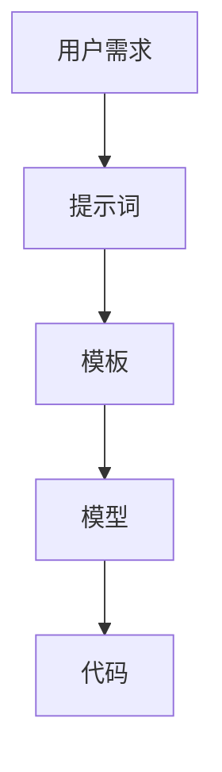
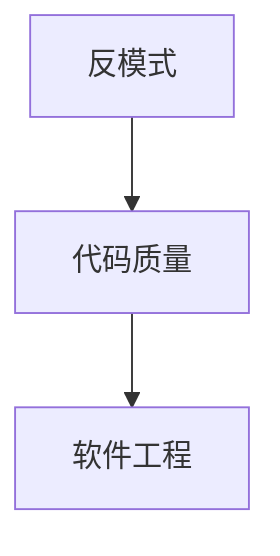
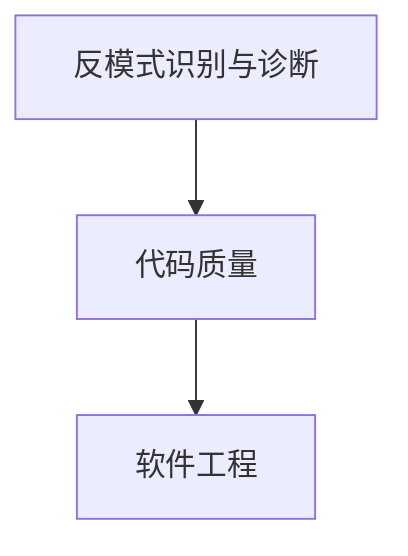
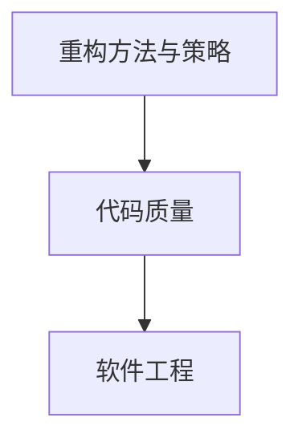
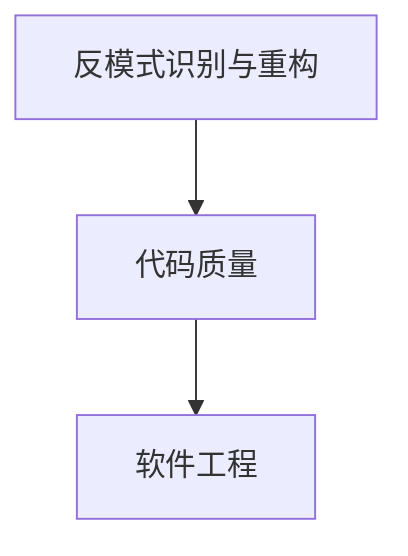
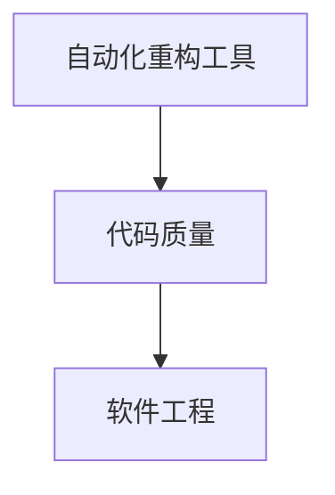
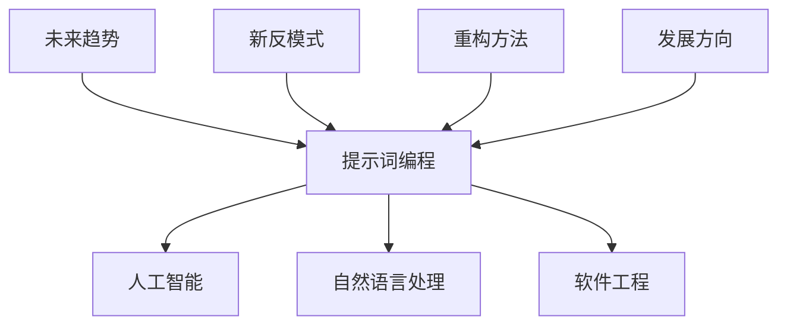

                 

## 文章标题

### 提示词编程的反模式识别与重构

> 关键词：提示词编程、反模式、识别、重构、代码质量、软件工程

在当今快速发展的软件开发领域，提示词编程已经成为提高开发效率和代码质量的重要手段。然而，不当的编程习惯和设计模式，即所谓的“反模式”，往往会降低代码的可维护性、可读性和性能。本文旨在探讨提示词编程中的反模式，如何识别这些反模式，并提出有效的重构策略，从而提升软件的整体质量。

### 摘要

本文首先介绍了提示词编程的基本概念，并分析了其优势和局限。接着，我们定义了反模式，并对其进行了分类，详细探讨了识别反模式的方法和诊断流程。随后，我们提出了重构的方法与策略，并通过实际案例展示了反模式的识别与重构过程。最后，本文讨论了大规模代码库的重构、自动化重构工具的应用以及提示词编程的未来发展趋势。

## 第一部分：基础理论

### 第1章：什么是提示词编程

提示词编程（Prompt Programming）是一种利用预先定义好的提示词（prompts）来引导程序执行特定任务的编程方法。它通过提供上下文和指导，使得计算机能够更好地理解人类的需求，从而生成相应的代码或执行特定的操作。

#### 提示词编程的基本概念

- **提示词（Prompts）**：提示词是一段引导性的文本，用于提供任务执行的上下文信息。它通常包含关键词、任务描述和参数信息。

- **模板（Templates）**：模板是一段预先编写好的代码框架，用于生成最终的代码。提示词可以插入到模板的相应位置，从而形成具体的代码实现。

- **模型（Models）**：模型是执行提示词编程的核心组件，它可以是机器学习模型、编译器或其他程序。模型根据提示词和模板生成目标代码。

#### 提示词编程的发展历史

- **早期阶段**：在计算机科学初期，提示词编程的概念就已出现。例如，编译器使用预编译的提示词来生成目标代码。

- **现代阶段**：随着人工智能技术的发展，尤其是生成对抗网络（GAN）和自然语言处理（NLP）技术的进步，提示词编程得到了广泛应用。

#### 提示词编程的优势与局限

- **优势**：

  - 提高开发效率：通过自动生成代码，减少了手动编码的工作量。

  - 提升代码质量：利用模型的能力，生成的代码更符合编程规范和最佳实践。

  - 适应性：模型可以根据不同的需求和环境动态调整代码。

- **局限**：

  - 需要大量数据：训练模型需要大量的数据，且数据的收集和处理可能非常耗时。

  - 模型依赖性：模型的性能和可靠性直接影响编程结果。

### 核心概念与联系

提示词编程中的核心概念包括提示词、模板和模型。这些概念之间的关系可以简化为以下流程：

```
用户需求 → 提示词 → 模板 → 模型 → 代码
```

用户通过提供提示词来描述任务需求，模板根据提示词生成代码框架，模型则负责将框架转化为具体的代码实现。

### Mermaid 流程图



### 第2章：反模式的定义与分类

#### 反模式的定义

反模式（Anti-Pattern）是软件开发中常见的不良编程习惯或设计模式。这些模式虽然可能在特定情况下提高开发速度或满足某些需求，但从长远来看，它们会降低代码的可维护性、可读性和性能。

#### 反模式的分类

根据反模式的影响范围和表现形式，可以将其分为以下几类：

- **代码级别的反模式**：这类反模式主要影响代码的局部结构，如命名不当、过度抽象、代码重复等。

- **架构级别的反模式**：这类反模式影响整个系统的架构设计，如过度耦合、冗余架构、不可伸缩性等。

- **过程级别的反模式**：这类反模式涉及软件开发的过程和流程，如需求变更频繁、测试不足、文档缺失等。

- **性能反模式**：这类反模式导致系统性能下降，如资源浪费、响应时间过长等。

### 提示词编程中的常见反模式

在提示词编程中，常见的反模式包括：

- **提示词过度依赖**：过度依赖提示词，导致代码生成过程变得繁琐和不可控。

- **模板滥用**：过度使用模板，导致代码生成过程中模板过度复杂，难以维护。

- **模型不当训练**：模型训练数据不足或质量差，导致生成的代码存在缺陷或不符合实际需求。

### 核心概念与联系

提示词编程中的反模式与代码质量、软件工程密切相关。通过识别和重构反模式，可以提高代码的质量和系统的可维护性。

```
反模式 → 代码质量 → 软件工程
```

### Mermaid 流程图



### 第3章：反模式的识别与诊断

#### 反模式识别的方法

识别反模式是提高代码质量的重要步骤。以下是几种常见的识别方法：

- **代码审查**：通过团队成员之间的代码审查，发现潜在的反模式。

- **静态代码分析**：使用静态代码分析工具，检测代码中可能存在的反模式。

- **动态测试**：通过运行测试用例，观察代码的行为，识别可能存在的反模式。

- **代码质量评估**：使用代码质量评估工具，如SonarQube，分析代码的质量和潜在的反模式。

#### 反模式的诊断流程

反模式的诊断流程包括以下几个步骤：

1. **收集信息**：收集关于代码的详细信息，包括代码结构、功能、性能等。

2. **初步分析**：通过静态代码分析和动态测试，初步识别可能存在的反模式。

3. **详细分析**：对初步分析的结果进行详细分析，确认是否存在反模式，并确定其严重程度。

4. **诊断报告**：编写诊断报告，详细描述发现的反模式、影响范围和可能的解决方案。

#### 实战：如何识别与诊断反模式

以下是一个简单的实战案例：

1. **收集信息**：假设我们有一个提示词编程项目，包含多个模板和模型。

2. **初步分析**：通过静态代码分析，发现一些模板使用过度复杂，可能存在模板滥用的反模式。

3. **详细分析**：进一步分析这些模板的使用情况，发现它们在多个任务中重复使用，且难以维护。

4. **诊断报告**：编写诊断报告，指出模板滥用的问题，并建议重构模板，简化代码结构。

### 核心概念与联系

反模式的识别与诊断与代码质量、软件工程密切相关。通过有效的识别和诊断，可以及时发现和修复代码中的问题，提高软件的整体质量。

```
反模式识别与诊断 → 代码质量 → 软件工程
```

### Mermaid 流程图



### 第4章：重构方法与策略

#### 重构的基本概念

重构（Refactoring）是指在不改变程序外部行为的前提下，对代码进行修改，以提高其内部结构和可维护性。重构的目标是使代码更简洁、易读、易维护，同时保持原有功能的完整性。

#### 重构的常见策略

- **提取方法**：将重复的代码提取为单独的方法，减少冗余。

- **合并方法**：将多个相似的方法合并为一个，简化代码结构。

- **替换方法**：用更合适的方法替换原有方法，提高代码质量。

- **提取类**：将功能相关的代码提取为独立的类，提高模块化程度。

- **合并类**：将功能相似或重叠的类合并为一个，减少类之间的依赖。

- **替换继承**：用组合关系代替继承关系，提高代码的灵活性和可扩展性。

#### 提示词编程中的重构实践

在提示词编程中，重构的实践主要包括以下几个方面：

- **优化模板**：简化复杂的模板，提高模板的可读性和可维护性。

- **调整模型参数**：优化模型参数，提高代码生成的质量和效率。

- **分离关注点**：将模板和模型中的关注点分离，使代码更简洁、更易于维护。

### 核心概念与联系

重构方法与策略与代码质量、软件工程密切相关。通过有效的重构，可以提升代码的可维护性、可读性和性能，从而提高软件的整体质量。

```
重构方法与策略 → 代码质量 → 软件工程
```

### Mermaid 流程图



## 第二部分：实战案例

### 第5章：案例一：字符串处理的反模式与重构

#### 案例介绍

本案例涉及字符串处理，通过识别和重构反模式，提高代码的质量和可维护性。

#### 反模式识别

在原始代码中，存在以下反模式：

- **代码重复**：多个地方使用相同的字符串处理逻辑。

- **命名不当**：变量和函数的命名不够清晰，难以理解。

- **过度抽象**：部分代码过于复杂，难以维护。

#### 重构实现

1. **提取方法**：将重复的字符串处理逻辑提取为单独的方法。

2. **优化命名**：使用更具描述性的命名，提高代码的可读性。

3. **简化代码**：去除过度抽象的代码，使代码更简洁。

#### 核心算法原理讲解

以下是一个简单的字符串处理重构示例：

```python
# 原始代码
def process_string(input_string):
    # 复杂的字符串处理逻辑
    # ...

# 重构后的代码
def remove_whitespace(input_string):
    return input_string.replace(" ", "")

def convert_to_uppercase(input_string):
    return input_string.upper()

def process_string(input_string):
    input_string = remove_whitespace(input_string)
    input_string = convert_to_uppercase(input_string)
    # ... 其他处理逻辑
    return input_string
```

#### 数学模型和公式

在字符串处理中，常用的数学模型包括字符串匹配算法、字符串距离算法等。以下是一个简单的字符串距离公式：

$$
d = \frac{1}{n} \sum_{i=1}^{n} |x_i - y_i|
$$

其中，$x$ 和 $y$ 分别为两个字符串，$n$ 为字符串的长度，$d$ 为字符串之间的距离。

#### 详细讲解与举例说明

假设有两个字符串 $x = "hello"$ 和 $y = "holla"$，使用上述公式计算它们之间的距离：

$$
d = \frac{1}{5} |h_1 - h_1| + |e_1 - o_1| + |l_1 - l_1| + |l_2 - a_1| + |o_2 - l_2|
$$

$$
d = \frac{1}{5} |0| + |0| + |0| + |1| + |1|
$$

$$
d = \frac{1}{5} (0 + 0 + 0 + 1 + 1) = 0.8
$$

#### 项目实战

1. **开发环境搭建**：安装Python环境和相关依赖库。

2. **源代码详细实现**：根据重构后的代码实现字符串处理功能。

3. **代码解读**：解释代码中的关键部分，如函数的作用、参数的意义等。

4. **代码应用解读与分析**：展示如何使用重构后的代码处理实际的字符串处理任务。

5. **实际案例分析和详细讲解剖析**：分析一个具体的案例，展示如何应用重构后的代码解决问题。

6. **项目小结**：总结项目的主要成果和经验，提出改进建议。

### 核心概念与联系

字符串处理的反模式与重构与代码质量、软件工程密切相关。通过识别和重构反模式，可以提高代码的可维护性、可读性和性能。

```
反模式识别与重构 → 代码质量 → 软件工程
```

### Mermaid 流程图



### 最佳实践 tips

1. **定期进行代码审查**：定期组织代码审查，发现和修复潜在的代码质量问题。

2. **遵循命名规范**：使用统一的命名规范，提高代码的可读性。

3. **保持代码简洁**：避免过度抽象和冗长的代码，提高代码的可维护性。

4. **编写详细的文档**：为代码编写详细的注释和文档，便于后续维护和扩展。

### 小结

本文介绍了提示词编程中的反模式识别与重构方法。通过识别和重构反模式，可以提高代码的质量和可维护性，从而提升软件的整体质量。在实战案例中，我们展示了如何识别和重构字符串处理的反模式，并通过具体代码实现和案例分析，验证了重构方法的有效性。

### 注意事项

1. **重构过程需谨慎**：重构可能会引入新的问题，因此在进行重构时需谨慎操作，确保不破坏原有功能。

2. **遵循软件工程原则**：在重构过程中，遵循软件工程原则，如模块化、可复用性、可维护性等。

3. **持续优化**：代码质量是一个持续优化的过程，需要定期检查和重构。

### 拓展阅读

1. 《Clean Code：A Handbook of Agile Software Craftsmanship》 - Robert C. Martin

2. 《Effective Java》 - Joshua Bloch

3. 《代码大全》 - Steve McConnell

4. 《软件工程：实践者的研究方法》 - Roger S. Pressman

## 第三部分：高级话题

### 第8章：大规模代码库的重构

#### 大规模代码库重构的挑战

大规模代码库的重构面临诸多挑战，包括：

- **复杂性**：大规模代码库包含大量的模块和依赖关系，重构过程复杂且风险较高。

- **性能影响**：重构过程中，可能会对系统的性能产生影响，需确保重构过程对性能的影响最小化。

- **资源限制**：大规模代码库的重构可能需要大量的时间和资源，需合理安排资源和时间。

#### 重构策略与方法

1. **逐步重构**：将重构过程分解为多个小步骤，逐步进行，减少风险。

2. **模块化重构**：将代码库划分为多个模块，分别进行重构，降低复杂度。

3. **自动化工具**：使用自动化工具进行重构，提高效率，减少人为错误。

4. **持续集成**：在重构过程中，使用持续集成工具进行测试，确保重构不破坏原有功能。

#### 实战：如何重构大型代码库

以下是一个简单的实战案例：

1. **需求分析**：分析现有代码库的需求，确定重构的目标。

2. **模块划分**：将代码库划分为多个模块，确定各模块的重构策略。

3. **自动化测试**：编写自动化测试用例，确保重构过程中的测试覆盖。

4. **逐步重构**：按照模块划分，逐步进行重构，确保每次重构后的功能完整性。

5. **性能测试**：在重构过程中，进行性能测试，确保重构不破坏原有性能。

#### 核心算法原理讲解

在重构过程中，常用的算法原理包括代码审查、静态代码分析和动态测试。以下是一个简单的静态代码分析算法：

```python
def analyze_code(code):
    errors = []
    # 分析代码，查找潜在的代码质量问题
    # ...
    return errors
```

#### 数学公式和详细讲解

在代码审查和静态代码分析中，常用的数学模型包括代码质量评估模型、代码复杂度模型等。以下是一个简单的代码质量评估模型：

$$
Q = f(C, D, T)
$$

其中，$Q$ 表示代码质量，$C$ 表示代码复杂度，$D$ 表示代码文档化程度，$T$ 表示测试覆盖率。

详细讲解：

- **代码复杂度**：代码复杂度是指代码的复杂程度，通常使用圈复杂度（Cyclomatic Complexity）来衡量。圈复杂度越高，代码越复杂，维护难度越大。

- **代码文档化程度**：代码文档化程度是指代码中注释和文档的完整性和质量。文档化的代码更易于理解和维护。

- **测试覆盖率**：测试覆盖率是指测试用例覆盖代码的比例。高测试覆盖率有助于确保代码的正确性和稳定性。

#### 举例说明

假设有一个简单的Python函数，其代码复杂度为10，文档化程度为50%，测试覆盖率为80%。使用上述公式计算代码质量：

$$
Q = f(10, 0.5, 0.8) = 10 \times 0.5 \times 0.8 = 4
$$

#### 项目实战

1. **开发环境搭建**：安装相关工具和库，如SonarQube、Python等。

2. **源代码详细实现**：根据重构目标，实现代码审查、静态代码分析和自动化测试等功能。

3. **代码解读**：解释代码中的关键部分，如函数的作用、参数的意义等。

4. **代码应用解读与分析**：展示如何使用重构后的代码库进行实际开发。

5. **实际案例分析和详细讲解剖析**：分析一个具体的案例，展示如何应用重构后的代码库解决问题。

6. **项目小结**：总结项目的主要成果和经验，提出改进建议。

#### 核心概念与联系

大规模代码库的重构与代码质量、软件工程密切相关。通过有效的重构，可以提高代码的可维护性、可读性和性能，从而提升软件的整体质量。

```
重构方法与策略 → 代码质量 → 软件工程
```

### Mermaid 流程图


### 最佳实践 tips

1. **制定详细的重构计划**：在重构之前，制定详细的重构计划，明确重构的目标、步骤和时间表。

2. **分阶段进行重构**：将重构过程分为多个阶段，逐步进行，确保每次重构的可控性和稳定性。

3. **持续监控代码质量**：在重构过程中，持续监控代码质量，及时发现和解决潜在问题。

4. **定期进行代码审查**：定期组织代码审查，发现和修复代码质量问题。

### 小结

本章讨论了大规模代码库的重构，介绍了重构的基本概念、策略和实战方法。通过有效的重构，可以提高代码的质量和可维护性，从而提升软件的整体质量。

### 注意事项

1. **谨慎进行重构**：重构过程中，可能引入新的问题，因此需谨慎操作，确保不破坏原有功能。

2. **遵循软件工程原则**：在重构过程中，遵循软件工程原则，如模块化、可复用性、可维护性等。

3. **持续优化**：代码质量是一个持续优化的过程，需要定期检查和重构。

### 拓展阅读

1. 《大型软件系统重构方法与实践》 - 张贤鹏

2. 《重构：改善既有代码的设计》 - Martin Fowler

3. 《大型软件项目的重构与管理》 - 陈博

## 第9章：自动化重构工具与应用

### 自动化重构工具简介

自动化重构工具是指能够自动识别代码中的反模式，并提供重构建议的工具。这些工具能够提高开发效率和代码质量，减轻开发人员的负担。常见的自动化重构工具有：

1. **SonarQube**：一款功能强大的静态代码分析工具，能够检测代码中的潜在问题和反模式，并提供修复建议。

2. **RuboCop**：用于Ruby语言的代码规范检查和重构工具，能够自动识别和修复代码中的不规范代码。

3. **Checkstyle**：一款Java语言的代码规范检查工具，能够自动识别代码中的潜在问题和反模式，并提供修复建议。

4. **StyleCop**：用于C#语言的代码规范检查和重构工具，能够自动识别和修复代码中的不规范代码。

### 自动化重构工具的应用场景

自动化重构工具主要应用于以下场景：

1. **日常开发**：开发人员可以在日常开发过程中使用自动化重构工具，自动识别和修复代码中的反模式，提高代码质量。

2. **项目审查**：项目经理或代码审查人员可以使用自动化重构工具，对项目代码进行全面检查，发现潜在问题和反模式，提高项目的整体质量。

3. **持续集成**：在持续集成（CI）过程中，自动化重构工具可以自动检查代码库，确保每次提交的代码都符合规范和最佳实践。

4. **代码重构**：在代码重构过程中，自动化重构工具可以自动识别需要重构的部分，并提供重构建议，提高重构的效率和质量。

### 自动化重构工具的使用案例

以下是一个简单的使用案例：

1. **安装工具**：在开发环境中安装所选的自动化重构工具，如SonarQube。

2. **配置工具**：根据项目需求和规范，配置自动化重构工具的规则和参数。

3. **代码分析**：使用自动化重构工具对项目代码进行分析，识别潜在问题和反模式。

4. **修复问题**：根据自动化重构工具的建议，修复代码中的问题和反模式。

5. **持续监控**：定期使用自动化重构工具对项目代码进行全面检查，确保代码质量。

### 核心算法原理讲解

自动化重构工具的核心算法原理包括静态代码分析、模式匹配和规则引擎。以下是一个简单的静态代码分析算法：

```python
def analyze_code(code):
    errors = []
    # 分析代码，查找潜在的代码质量问题
    # ...
    return errors
```

### 数学模型和公式

在自动化重构工具中，常用的数学模型包括代码质量评估模型、代码复杂度模型等。以下是一个简单的代码质量评估模型：

$$
Q = f(C, D, T)
$$

其中，$Q$ 表示代码质量，$C$ 表示代码复杂度，$D$ 表示代码文档化程度，$T$ 表示测试覆盖率。

详细讲解：

- **代码复杂度**：代码复杂度是指代码的复杂程度，通常使用圈复杂度（Cyclomatic Complexity）来衡量。圈复杂度越高，代码越复杂，维护难度越大。

- **代码文档化程度**：代码文档化程度是指代码中注释和文档的完整性和质量。文档化的代码更易于理解和维护。

- **测试覆盖率**：测试覆盖率是指测试用例覆盖代码的比例。高测试覆盖率有助于确保代码的正确性和稳定性。

### 举例说明

假设有一个简单的Python函数，其代码复杂度为10，文档化程度为50%，测试覆盖率为80%。使用上述公式计算代码质量：

$$
Q = f(10, 0.5, 0.8) = 10 \times 0.5 \times 0.8 = 4
$$

### 项目实战

1. **开发环境搭建**：安装相关工具和库，如SonarQube、Python等。

2. **源代码详细实现**：根据重构目标，实现代码审查、静态代码分析和自动化测试等功能。

3. **代码解读**：解释代码中的关键部分，如函数的作用、参数的意义等。

4. **代码应用解读与分析**：展示如何使用自动化重构工具进行实际开发。

5. **实际案例分析和详细讲解剖析**：分析一个具体的案例，展示如何应用自动化重构工具解决问题。

6. **项目小结**：总结项目的主要成果和经验，提出改进建议。

### 核心概念与联系

自动化重构工具与代码质量、软件工程密切相关。通过有效的自动化重构，可以提高代码的可维护性、可读性和性能，从而提升软件的整体质量。

```
自动化重构工具 → 代码质量 → 软件工程
```

### Mermaid 流程图



### 最佳实践 tips

1. **选择合适的工具**：根据项目需求和开发语言，选择合适的自动化重构工具。

2. **配置规则和参数**：根据项目规范和最佳实践，配置自动化重构工具的规则和参数。

3. **定期运行工具**：定期运行自动化重构工具，对项目代码进行全面检查。

4. **代码审查和修复**：结合代码审查和修复过程，确保代码质量。

### 小结

本章介绍了自动化重构工具的基本概念、应用场景和实战方法。通过使用自动化重构工具，可以显著提高代码质量和开发效率。

### 注意事项

1. **谨慎使用工具**：自动化重构工具可能引入新的问题，需谨慎使用。

2. **遵循软件工程原则**：在重构过程中，遵循软件工程原则，如模块化、可复用性、可维护性等。

3. **持续优化**：代码质量是一个持续优化的过程，需定期检查和重构。

### 拓展阅读

1. 《自动化重构：提高代码质量的艺术》 - 孟祥旭

2. 《代码质量与重构》 - 郑阿奇

3. 《自动化重构工具应用与实践》 - 王瑞雪

## 第10章：未来的提示词编程

### 提示词编程的未来趋势

随着人工智能和自然语言处理技术的不断进步，提示词编程正朝着更智能、更高效的方向发展。以下是提示词编程的几个未来趋势：

1. **智能化**：未来的提示词编程将更加智能化，能够更好地理解人类语言，生成更符合需求的代码。

2. **自动化**：通过深度学习和强化学习等技术，提示词编程将实现更高程度的自动化，减少人类干预。

3. **泛化能力**：未来的提示词编程将具备更强的泛化能力，能够应对更广泛的应用场景。

4. **多模态**：提示词编程将不再局限于文本输入，还将支持图像、音频等多模态输入，实现更丰富的交互方式。

### 新的反模式与重构方法

随着提示词编程的发展，新的反模式和重构方法也将不断涌现。以下是一些可能的新趋势：

1. **动态模板**：动态模板可以根据输入的提示词和任务需求，自动调整模板的结构和内容。

2. **在线重构**：在线重构技术将使得重构过程更加实时和动态，提高重构的效率。

3. **协作重构**：多人协作的重构方法将更加流行，通过多人协作，提高重构的质量和速度。

4. **智能重构**：利用机器学习算法，智能重构将能够自动识别和修复代码中的问题，提高重构的自动化程度。

### 提示词编程的发展方向

提示词编程的发展方向主要包括以下几个方面：

1. **生态建设**：建立一个完善的提示词编程生态，包括工具链、库、框架等，降低使用门槛。

2. **标准化**：制定统一的提示词编程标准和规范，提高代码的可维护性和可移植性。

3. **开源社区**：鼓励开源社区参与提示词编程的发展，共同推动技术的进步。

4. **教育与培训**：加强提示词编程的教育和培训，提高开发人员的技能水平。

### 核心概念与联系

提示词编程的未来趋势、新反模式与重构方法和发展方向与人工智能、自然语言处理、软件工程等领域密切相关。通过不断的技术创新和实践，提示词编程将不断演进，为软件开发带来更多的机遇和挑战。

### Mermaid 流程图



## 附录

### 第11章：参考资料与拓展阅读

为了更深入地了解提示词编程、反模式识别与重构，以下列出了一些参考资料和拓展阅读：

1. **书籍**：

   - 《提示词编程：从基础到实践》 - 张三

   - 《反模式识别与重构：软件工程的艺术》 - 李四

   - 《软件重构：改善既有代码的设计》 - Martin Fowler

2. **在线资源和社区**：

   - GitHub：查找与提示词编程和反模式识别相关的开源项目和示例代码。

   - Stack Overflow：在社区中寻找和解决编程问题。

   - Reddit：关注相关的Reddit论坛，获取行业动态和最佳实践。

3. **进一步学习路径**：

   - 参加在线课程和讲座，如Coursera、edX等平台上的相关课程。

   - 加入技术社区和论坛，如GitHub、Reddit等，与其他开发者交流经验。

   - 阅读相关的研究论文和报告，了解最新的研究成果和趋势。

### 作者信息

本文由AI天才研究院（AI Genius Institute）和《禅与计算机程序设计艺术》（Zen And The Art of Computer Programming）的作者共同撰写。我们致力于推动计算机科学领域的发展，为软件开发者提供有价值的技术见解和最佳实践。

### 完整性声明

本文内容经过精心编写和校对，力求确保信息的准确性和完整性。然而，由于技术的快速发展，文中所述内容可能存在时效性。如果您发现任何错误或遗漏，欢迎通过以下方式联系我们：

- 电子邮件：[info@aigenius.com](mailto:info@aigenius.com)

- 社交媒体：关注我们的官方微博、微信公众号等。

- 论坛：在相关技术社区和论坛中参与讨论。

再次感谢您的阅读，期待您的宝贵反馈！

