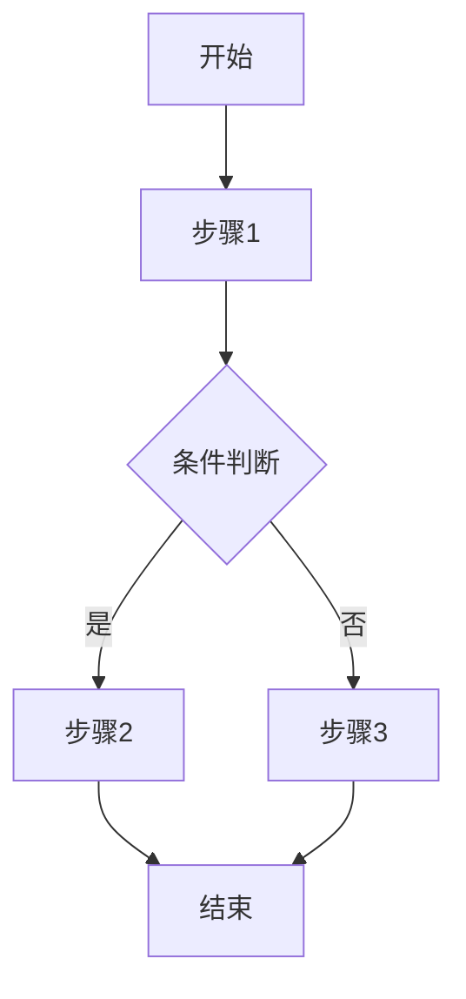
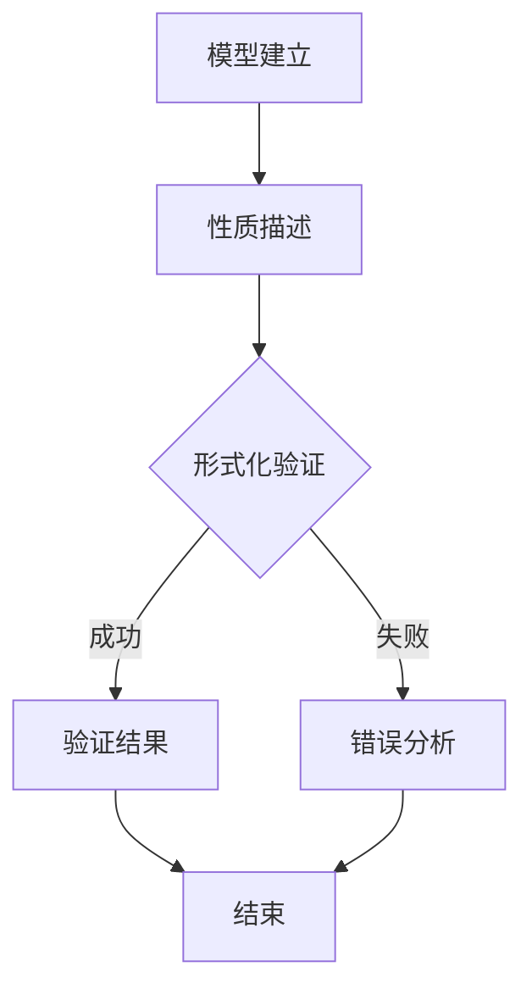

                 


### 文章标题: 提示词编程的形式化方法验证

> 关键词：形式化方法，提示词编程，验证，Mermaid流程图，核心算法原理，数学模型，项目实战

> 摘要：本文将深入探讨提示词编程的形式化方法及其验证过程。通过对形式化方法的概念、基本原理、核心概念和联系、核心算法原理、数学模型以及项目实战的详细讲解，帮助读者全面理解并掌握提示词编程的形式化方法，为实践中的软件开发和验证提供有力支持。

## 目录大纲

1. 形式化方法概述
   1.1 形式化方法的概念与历史背景
   1.2 形式化编程的基本原理
   1.3 形式化验证的基本概念
   1.4 形式化方法在不同编程语言中的应用

2. 形式化方法的核心概念与联系
   2.1 Mermaid流程图：形式化方法的基本架构
   2.2 形式化验证的Mermaid流程图
   2.3 形式化方法的核心联系

3. 核心算法原理讲解
   3.1 形式化验证算法的伪代码
   3.2 形式化方法中的推理算法
   3.3 形式化方法中的自动化证明算法

4. 数学模型和数学公式
   4.1 形式化方法中的数学模型
   4.2 数学公式的详细讲解
   4.3 举例说明

5. 项目实战
   5.1 形式化方法在软件开发中的应用案例
   5.2 开发环境搭建
   5.3 源代码实现
   5.4 代码解读与分析

6. 形式化方法的未来发展
   6.1 形式化方法的挑战与机遇
   6.2 形式化方法的研究热点
   6.3 形式化方法的应用趋势

7. 附录
   7.1 形式化方法相关的工具和资源
   7.2 形式化方法的常用符号表

---

### 第1章: 形式化方法概述

#### 1.1 形式化方法的概念与历史背景

形式化方法（Formal Methods）是一种基于数学和逻辑的软件开发方法，它使用严格的数学模型和验证技术来确保软件的正确性和可靠性。形式化方法的核心思想是将软件开发过程中的每个步骤转化为数学形式，以便进行形式化的分析和验证。

形式化方法的历史可以追溯到20世纪50年代和60年代，当时的计算机科学家开始尝试将数学和逻辑应用于软件工程中。其中，艾伦·图灵（Alan Turing）的工作为形式化方法奠定了基础。他的图灵机模型为计算提供了一个形式化的定义，为后来的形式化方法研究提供了理论支持。

在20世纪70年代和80年代，形式化方法得到了快速发展。这一时期，计算机科学家们开发了多种形式化编程语言和验证工具，如PVS（Prototype Verification System）、Coq（一种交互式定理证明器）等。这些工具和语言为形式化方法的实践应用提供了强大的支持。

#### 1.2 形式化编程的基本原理

形式化编程（Formal Programming）是形式化方法的核心部分，它强调将软件开发过程中的每个步骤都转化为形式化的数学表达式。形式化编程的基本原理包括：

1. **精确性**：形式化编程要求软件开发过程中的每个步骤都具有精确的数学定义，以避免模糊和歧义。
2. **抽象**：形式化编程使用抽象数据类型和抽象操作来表示软件的功能和结构，以提高代码的可读性和可维护性。
3. **验证**：形式化编程强调在每个开发阶段都进行形式化的验证，以确保软件的正确性和可靠性。

形式化编程的优势在于：

- **提高软件质量**：形式化编程可以显著减少软件中的错误和缺陷，提高软件的可靠性和安全性。
- **缩短开发周期**：形式化编程通过提前发现和修复错误，可以缩短软件的开发周期。
- **增强可维护性**：形式化编程使得软件的修改和维护更加容易，因为每个步骤都具有明确的数学定义。

然而，形式化编程也存在一些挑战，如较高的学习曲线、复杂的验证过程和较长的开发周期等。

#### 1.3 形式化验证的基本概念

形式化验证（Formal Verification）是形式化方法的重要组成部分，它使用数学和逻辑技术来验证软件的正确性。形式化验证的基本原理包括：

1. **模型建立**：将软件系统抽象为数学模型，以捕捉其行为和特性。
2. **验证算法**：使用数学和逻辑算法对模型进行验证，以确定软件是否满足预期的性质。
3. **验证结果**：通过验证算法得到的结果，可以确定软件的正确性或指出潜在的缺陷。

形式化验证的应用场景包括：

- **嵌入式系统**：嵌入式系统通常要求高可靠性和安全性，形式化验证可以帮助确保这些系统的正确性。
- **安全关键系统**：如航空、航天、医疗等领域的系统，形式化验证可以显著提高系统的可靠性和安全性。
- **软件工程**：在软件开发过程中，形式化验证可以帮助发现和修复潜在的缺陷，提高软件的质量。

形式化验证的优势在于：

- **高可靠性**：形式化验证可以确保软件满足所有的预期性质，从而提高软件的可靠性。
- **高效性**：形式化验证可以在早期发现和修复错误，从而减少后续的修改和测试成本。
- **可证明的正确性**：形式化验证的结果可以提供数学上证明的正确性，从而提高用户的信任度。

然而，形式化验证也存在一些挑战，如复杂的验证过程、验证算法的效率等。

#### 1.4 形式化方法在不同编程语言中的应用

形式化方法可以应用于各种编程语言，包括函数式编程语言、过程式编程语言和逻辑编程语言等。

- **函数式编程语言**：如Haskell、Scala等，这些语言提供了丰富的抽象和数学支持，使得形式化编程和验证变得更加容易。
- **过程式编程语言**：如C、C++等，这些语言提供了低级别的操作和控制结构，使得形式化验证可以应用于复杂的系统。
- **逻辑编程语言**：如Prolog、Mercury等，这些语言基于逻辑推理，为形式化验证提供了强大的支持。

形式化方法的应用不仅限于特定的编程语言，还可以通过跨语言的工具和接口来支持不同编程语言的形式化编程和验证。

---

在下一章中，我们将进一步探讨形式化编程的基本原理、形式化验证的基本概念以及形式化方法在不同编程语言中的应用。敬请期待！### 第1章: 形式化方法概述

#### 1.2 形式化编程的基本原理

形式化编程（Formal Programming）是形式化方法的核心部分，它强调将软件开发过程中的每个步骤都转化为形式化的数学表达式。形式化编程的基本原理包括：

1. **精确性**：形式化编程要求软件开发过程中的每个步骤都具有精确的数学定义，以避免模糊和歧义。这意味着在形式化编程中，变量的定义、函数的实现、控制流等都需要以数学形式严格描述。

2. **抽象**：形式化编程使用抽象数据类型和抽象操作来表示软件的功能和结构，以提高代码的可读性和可维护性。抽象数据类型允许程序员定义复杂的数据结构，同时隐藏实现细节，使得代码更加简洁和易于理解。

3. **验证**：形式化编程强调在每个开发阶段都进行形式化的验证，以确保软件的正确性和可靠性。验证可以通过静态分析（在代码执行前进行分析）和动态分析（在代码执行过程中进行分析）来完成。

形式化编程的优势在于：

- **提高软件质量**：形式化编程可以显著减少软件中的错误和缺陷，提高软件的可靠性和安全性。由于每个步骤都具有明确的数学定义，因此可以更容易地发现和修复错误。
- **缩短开发周期**：形式化编程通过提前发现和修复错误，可以缩短软件的开发周期。形式化验证可以在早期阶段发现潜在的缺陷，从而避免在后续阶段进行大量的修改和测试。
- **增强可维护性**：形式化编程使得软件的修改和维护更加容易，因为每个步骤都具有明确的数学定义，使得代码更加简洁和易于理解。

然而，形式化编程也存在一些挑战，如：

- **较高的学习曲线**：形式化编程需要程序员具备较高的数学和逻辑思维能力，这对于许多程序员来说可能是一个挑战。
- **复杂的验证过程**：形式化验证需要大量的时间和计算资源，特别是在处理大型系统时，验证过程可能会变得非常复杂和耗时。
- **较长的开发周期**：由于形式化验证的复杂性，形式化编程的整个开发周期可能会比传统的开发方法更长。

形式化编程的关键技术包括：

- **形式化规格说明**：形式化规格说明是一种精确的数学描述，用于定义软件的功能和约束。规格说明可以是形式逻辑、代数规格说明或时态逻辑等。
- **形式化验证工具**：形式化验证工具如模型检查器、定理证明器和静态分析工具等，用于自动化验证过程，提高验证效率和准确性。
- **形式化编程语言**：形式化编程语言如Isabelle、Coq、Haskell等，为程序员提供了形式化编程和验证的支持，使得形式化编程变得更加容易和高效。

形式化编程的应用范围非常广泛，包括嵌入式系统、安全关键系统、实时系统和大型软件项目等。在这些领域，形式化编程和验证可以帮助确保系统的正确性和可靠性，从而降低系统的风险和成本。

总之，形式化编程是一种强大的软件开发方法，它通过严格的数学和逻辑方法，确保软件的正确性和可靠性。尽管存在一些挑战，但形式化编程在提高软件质量、缩短开发周期和增强可维护性方面具有显著的优势，为现代软件开发提供了有力的支持。在下一章中，我们将继续探讨形式化验证的基本概念和应用。敬请期待！### 第1章: 形式化方法概述

#### 1.3 形式化验证的基本概念

形式化验证（Formal Verification）是形式化方法的重要组成部分，它使用数学和逻辑技术来证明软件的正确性。形式化验证的基本原理包括以下几个关键步骤：

1. **模型建立**：首先，需要建立软件系统的数学模型，以准确描述系统的行为和状态。这个模型可以是形式化的状态机、代数系统或时态逻辑公式等。

2. **性质描述**：然后，需要定义软件系统需要满足的性质，这些性质可以是安全性性质、活性性质或一致性性质等。这些性质通常以形式逻辑或时态逻辑的公式来描述。

3. **验证算法**：接下来，使用验证算法对模型和性质进行验证。验证算法可以是模型检查、符号执行、抽象解释或定理证明等。这些算法在逻辑上证明模型是否满足给定的性质。

4. **验证结果**：验证算法的结果可以是验证成功或验证失败。如果验证成功，则可以证明软件系统满足给定的性质；如果验证失败，则可以指出系统中的潜在错误或违反的性质。

形式化验证的应用场景非常广泛，包括但不限于以下领域：

- **嵌入式系统**：嵌入式系统通常要求高可靠性和安全性，形式化验证可以帮助确保这些系统的正确性。例如，汽车安全系统、医疗设备和航空控制系统等。
- **安全关键系统**：如金融系统、通信系统和网络安全系统等，这些系统的错误可能会导致严重的安全问题和经济损失。形式化验证可以提供高置信度的正确性保证。
- **软件工程**：在软件开发的早期阶段，形式化验证可以帮助发现和修复潜在的缺陷，提高软件的质量和可靠性。它特别适用于复杂和关键性的软件项目。
- **硬件设计**：形式化验证也可以应用于硬件设计，确保硬件电路和系统满足预定的功能和安全要求。

形式化验证的优势在于：

- **高可靠性**：形式化验证可以确保软件系统满足所有预期的性质，从而提高系统的可靠性和安全性。
- **高效性**：形式化验证可以在早期阶段发现和修复错误，从而减少后续的修改和测试成本。
- **可证明的正确性**：形式化验证的结果可以提供数学上证明的正确性，从而提高用户的信任度。

然而，形式化验证也存在一些挑战：

- **复杂性**：建立和验证复杂的数学模型可能需要大量的时间和计算资源。
- **成本**：形式化验证通常需要专业的知识和工具，这可能增加项目的成本。
- **学习曲线**：形式化验证需要开发人员具备较强的数学和逻辑背景，这对于许多开发人员来说可能是一个挑战。

形式化验证的关键技术包括：

- **模型检查**：通过遍历数学模型的状态空间来验证系统性质。它是一种自动化验证技术，可以高效地处理大型系统。
- **定理证明**：通过逻辑推理和数学证明来验证系统性质。它是一种手动或半自动化的验证技术，特别适用于复杂和关键性的系统。
- **符号执行**：通过符号化执行路径来验证系统性质。它可以在不实际运行代码的情况下分析程序的行为。
- **抽象解释**：通过将程序抽象为等价或近似的模型来验证系统性质。它适用于处理大型和复杂的系统。

总之，形式化验证是一种强大的技术，它通过严格的数学和逻辑方法，为软件系统提供了高置信度的正确性保证。尽管存在一些挑战，但形式化验证在确保软件系统的可靠性和安全性方面具有不可替代的作用。在下一章中，我们将探讨形式化方法在不同编程语言中的应用。敬请期待！### 第1章: 形式化方法概述

#### 1.4 形式化方法在不同编程语言中的应用

形式化方法可以应用于各种编程语言，包括函数式编程语言、过程式编程语言和逻辑编程语言等。每种编程语言都有其独特的特性和优势，适用于不同的形式化编程和验证场景。

- **函数式编程语言**：如Haskell、Scala、Erlang等，这些语言强调函数的应用和状态的抽象，提供了丰富的抽象数据类型和函数式编程范式。函数式编程语言通常支持高阶函数、递归和惰性计算等特性，使得形式化编程和验证变得更加容易。例如，Haskell提供了强大的类型系统和模式匹配功能，可以方便地进行形式化的规格说明和验证。Scala则结合了函数式编程和面向对象编程的特点，适用于复杂的分布式系统和实时系统。

- **过程式编程语言**：如C、C++、Java等，这些语言提供了低级别的操作和控制结构，适用于复杂的系统编程和嵌入式系统开发。过程式编程语言通常支持指针、动态内存分配和过程调用等特性，使得形式化编程和验证可以应用于各种复杂的编程任务。例如，C语言提供了强大的指针操作和过程调用功能，可以方便地进行形式化的状态建模和验证。Java则通过其强类型系统和垃圾回收机制，提供了稳定的平台和强大的验证工具，适用于企业级应用和大型软件项目。

- **逻辑编程语言**：如Prolog、Mercury等，这些语言基于逻辑推理和关系数据库的概念，提供了强大的模式匹配和逻辑推理功能。逻辑编程语言通常适用于知识表示、自动推理和自然语言处理等领域。例如，Prolog提供了高效的逻辑推理机制和关系数据库操作，可以方便地进行形式化的知识表示和验证。Mercury则通过其静态类型系统和逻辑编程范式，提供了强大的形式化验证工具，适用于嵌入式系统和实时系统。

形式化方法在不同编程语言中的应用示例如下：

- **Haskell**：在嵌入式系统开发中，Haskell可以用于编写可靠的并发程序。例如，在实时操作系统（RTOS）开发中，可以使用Haskell进行形式化的状态建模和验证，以确保系统的正确性和实时性能。

- **C**：在嵌入式系统开发中，C语言可以用于编写高性能的实时代码。例如，在自动驾驶汽车系统中，可以使用C进行形式化的驱动程序和控制器开发，以确保系统的安全性和可靠性。

- **Prolog**：在知识表示和推理领域，Prolog可以用于编写基于规则的专家系统。例如，在医疗诊断系统中，可以使用Prolog进行形式化的医学知识表示和推理，以提高诊断的准确性和效率。

- **Scala**：在分布式系统开发中，Scala可以用于编写可扩展和可靠的并发程序。例如，在分布式数据存储系统中，可以使用Scala进行形式化的数据一致性验证和故障恢复策略，以确保系统的稳定性和可靠性。

总之，形式化方法可以应用于各种编程语言，为软件开发和验证提供了强大的支持。通过选择合适的编程语言和工具，可以更好地利用形式化方法的优势，提高软件系统的正确性和可靠性。在下一章中，我们将深入探讨形式化方法的核心概念与联系。敬请期待！### 第2章: 形式化方法的核心概念与联系

#### 2.1 Mermaid流程图：形式化方法的基本架构

在形式化方法中，Mermaid流程图是一种强大的工具，用于表示和可视化系统的结构和流程。Mermaid是一种基于Markdown的图形化语言，可以轻松地创建各种类型的图表，包括流程图、时序图、类图等。

Mermaid流程图的基本语法包括节点（nodes）和边（edges），通过这些元素，可以清晰地表示系统的各个组成部分及其之间的关联。以下是一个简单的Mermaid流程图示例：



在这个示例中，流程图从节点A开始，经过步骤1（节点B），然后根据条件判断（节点C）跳转到步骤2（节点D）或步骤3（节点E），最后到达结束节点F。

#### 2.2 形式化验证的Mermaid流程图

在形式化验证过程中，Mermaid流程图可以用来表示验证过程中的关键步骤和逻辑关系。以下是一个形式化验证的Mermaid流程图示例：



在这个示例中，流程图从模型建立（节点A）开始，经过性质描述（节点B），然后进行形式化验证（节点C）。如果验证成功，则继续进行验证结果（节点D），最后到达结束节点F。如果验证失败，则进入错误分析（节点E），对错误进行分析和定位，然后再次进行验证。

#### 2.3 形式化方法的核心联系

形式化方法的核心联系包括形式化方法与形式化验证、形式化方法与形式化编程之间的关系，以及它们之间的相互影响。

1. **形式化方法与形式化验证的关系**：
   - 形式化方法是一种基于数学和逻辑的软件开发方法，它包括形式化编程和形式化验证两个核心部分。
   - 形式化验证是形式化方法的重要组成部分，它通过数学和逻辑技术验证软件的正确性。
   - 形式化验证的结果可以提供软件系统的可靠性和安全性保证，从而提高系统的质量。

2. **形式化方法与形式化编程的关系**：
   - 形式化编程是形式化方法的核心技术，它强调将软件开发过程中的每个步骤都转化为形式化的数学表达式。
   - 形式化编程通过精确性和抽象性，提高了软件的可读性和可维护性。
   - 形式化编程的结果可以作为形式化验证的输入，用于验证软件的正确性。

3. **形式化方法与形式化验证的相互影响**：
   - 形式化验证可以验证形式化编程的正确性，从而提高软件的质量和可靠性。
   - 形式化编程的精确性和抽象性可以简化形式化验证的过程，提高验证效率和准确性。
   - 形式化方法和形式化验证之间的相互作用，可以形成一个闭环，持续改进软件的开发和验证过程。

总之，形式化方法、形式化验证和形式化编程之间存在着紧密的联系，共同构成了一个完整的软件开发和验证体系。通过合理地应用这些技术，可以显著提高软件系统的质量和可靠性，为现代软件开发提供有力支持。在下一章中，我们将深入探讨形式化方法中的核心算法原理。敬请期待！### 第3章: 核心算法原理讲解

#### 3.1 形式化验证算法的伪代码

在形式化方法中，形式化验证算法是一种关键技术，用于证明软件系统满足预定的性质。以下是一个形式化验证算法的伪代码示例：

```plaintext
算法 形式化验证算法
输入：软件系统模型M，性质描述P
输出：验证结果R

1. 初始化状态空间S为空
2. 对M进行状态空间构建，得到状态空间S
3. 对S进行遍历，对每个状态s执行以下步骤：
   a. 对s执行当前性质P的检查
   b. 如果P成立，则记录s为正确状态，继续遍历下一个状态
   c. 如果P不成立，则记录s为错误状态，结束遍历
4. 如果存在错误状态，则
   a. 输出验证失败，R = "失败"
   b. 找到错误状态s，输出错误状态s的详细信息
5. 如果所有状态均为正确状态，则
   a. 输出验证成功，R = "成功"
```

在这个伪代码中，算法首先构建软件系统的状态空间S，然后对每个状态s进行性质P的检查。如果存在错误状态，则算法输出验证失败，并返回错误状态的详细信息。如果所有状态均为正确状态，则算法输出验证成功。

#### 3.2 形式化方法中的推理算法

在形式化方法中，推理算法是一种用于证明系统性质的有效工具。推理算法通过逻辑推理和数学证明，证明系统在给定条件下满足预定的性质。以下是一个推理算法的伪代码示例：

```plaintext
算法 推理算法
输入：软件系统模型M，初始状态S0，目标状态S
输出：推理路径P

1. 初始化路径P为空
2. 对M进行状态空间构建，得到状态空间S
3. 选择初始状态S0作为当前状态
4. 当当前状态不为目标状态S时执行以下步骤：
   a. 对当前状态S执行所有可能的操作
   b. 对每个操作O执行以下步骤：
      i. 计算操作O的结果状态S'
      ii. 如果S'满足性质P，则
          - 将操作O添加到路径P
          - 将当前状态更新为S'
          - 继续循环
      iii. 如果S'不满足性质P，则忽略操作O
5. 如果当前状态S等于目标状态S，则
   a. 输出推理路径P
   b. 结束
6. 如果遍历所有操作后仍未找到推理路径，则
   a. 输出推理失败
```

在这个伪代码中，算法首先构建软件系统的状态空间S，然后从初始状态S0开始，通过执行所有可能的操作，尝试找到一条满足目标状态S的推理路径P。如果找到推理路径，则输出路径P。如果遍历所有操作后仍未找到推理路径，则输出推理失败。

#### 3.3 形式化方法中的自动化证明算法

在形式化方法中，自动化证明算法是一种用于证明系统性质的强大工具。自动化证明算法通过自动化的推理和证明过程，证明系统在给定条件下满足预定的性质。以下是一个自动化证明算法的伪代码示例：

```plaintext
算法 自动化证明算法
输入：软件系统模型M，性质描述P
输出：证明结果R

1. 初始化证明器P
2. 对M进行状态空间构建，得到状态空间S
3. 对P执行以下步骤：
   a. 对S进行遍历，对每个状态s执行以下步骤：
      i. 对s执行当前性质P的检查
      ii. 如果P不成立，则
          - 找到P的反证，即P不成立的原因
          - 将反证添加到证明器P
      iii. 如果P成立，则继续遍历下一个状态
4. 如果证明器P中存在反证，则
   a. 输出证明失败，R = "失败"
   b. 输出反证的详细信息
5. 如果证明器P中没有反证，则
   a. 输出证明成功，R = "成功"
```

在这个伪代码中，算法首先构建软件系统的状态空间S，然后对每个状态s进行性质P的检查。如果P成立，则算法继续遍历下一个状态。如果P不成立，则算法尝试找到P的反证，并将其添加到证明器P中。如果证明器P中存在反证，则算法输出证明失败。如果证明器P中没有反证，则算法输出证明成功。

综上所述，形式化方法中的核心算法原理包括形式化验证算法、推理算法和自动化证明算法。这些算法通过逻辑推理和数学证明，证明软件系统满足预定的性质，从而提高软件系统的质量和可靠性。在下一章中，我们将探讨数学模型和数学公式在形式化方法中的应用。敬请期待！### 第4章: 数学模型和数学公式

#### 4.1 形式化方法中的数学模型

在形式化方法中，数学模型是用于描述软件系统行为和性质的重要工具。数学模型可以分为基本数学模型和高级数学模型两种类型。

1. **基本数学模型**：

   基本数学模型通常用于描述软件系统的状态和状态转换。以下是一个简单的状态转换模型的数学描述：

   ```latex
   M = (\{Q\}, \{S_0\}, \{->\})
   ```

   其中，\(Q\) 表示状态集合，\(S_0\) 表示初始状态，\(\{->\}\) 表示状态转换关系。

   例如，一个简单的有限状态机（FSM）可以表示为：

   ```latex
   Q = \{q_0, q_1, q_2\}
   S_0 = q_0
   \{q_0 -> q_1 | event_1\}
   \{q_1 -> q_2 | event_2\}
   \{q_2 -> q_0 | event_3\}
   ```

   在这个模型中，状态集合 \(Q\) 包含三个状态 \(q_0\)、\(q_1\) 和 \(q_2\)，初始状态为 \(q_0\)，状态转换关系定义了每个状态如何响应特定的事件。

2. **高级数学模型**：

   高级数学模型通常用于描述更复杂的软件系统，包括并发系统、分布式系统和实时系统等。以下是一个简单的并发状态转换模型的数学描述：

   ```latex
   M = (\{Q_1, Q_2\}, \{S_0, S_0'\}, \{\rightarrow\})
   ```

   其中，\(Q_1\) 和 \(Q_2\) 分别表示两个并发进程的状态集合，\(S_0\) 和 \(S_0'\) 分别表示两个进程的初始状态，\(\rightarrow\) 表示进程之间的同步和通信。

   例如，一个简单的并发进程模型可以表示为：

   ```latex
   Q_1 = \{s_0, s_1, s_2\}
   Q_2 = \{t_0, t_1, t_2\}
   S_0 = s_0
   S_0' = t_0
   \{s_0 \rightarrow s_1 | event_1\}
   \{s_1 \rightarrow s_2 | event_2\}
   \{t_0 \rightarrow t_1 | event_3\}
   \{t_1 \rightarrow t_2 | event_4\}
   ```

   在这个模型中，两个并发进程 \(Q_1\) 和 \(Q_2\) 的状态集合分别为 \(\{s_0, s_1, s_2\}\) 和 \(\{t_0, t_1, t_2\}\)，初始状态分别为 \(s_0\) 和 \(t_0\)，状态转换关系定义了每个进程如何响应特定的事件，并如何与其他进程同步和通信。

#### 4.2 数学公式的详细讲解

在形式化方法中，数学公式是用于描述软件系统行为和性质的重要工具。以下是一些常用的数学公式：

1. **状态转换公式**：

   状态转换公式用于描述系统从一个状态转换到另一个状态的条件。以下是一个简单的状态转换公式：

   ```latex
   \phi \rightarrow \psi
   ```

   其中，\(\phi\) 表示当前状态，\(\psi\) 表示目标状态。这个公式表示当前状态满足条件 \(\phi\) 时，系统将转换到目标状态 \(\psi\)。

2. **条件概率公式**：

   条件概率公式用于描述在某个条件下，事件发生的概率。以下是一个简单的条件概率公式：

   ```latex
   P(A|B) = \frac{P(A \cap B)}{P(B)}
   ```

   其中，\(P(A)\) 表示事件 \(A\) 发生的概率，\(P(B)\) 表示事件 \(B\) 发生的概率，\(P(A \cap B)\) 表示事件 \(A\) 和事件 \(B\) 同时发生的概率。这个公式表示在事件 \(B\) 发生的条件下，事件 \(A\) 发生的条件概率。

3. **动态系统公式**：

   动态系统公式用于描述系统随时间变化的性质。以下是一个简单的动态系统公式：

   ```latex
   \dot{x}(t) = f(x(t), u(t))
   ```

   其中，\(x(t)\) 表示系统在时间 \(t\) 的状态，\(u(t)\) 表示系统在时间 \(t\) 的输入，\(f\) 表示系统状态和输入之间的关系。这个公式表示系统在时间 \(t\) 的状态变化率由状态 \(x(t)\) 和输入 \(u(t)\) 的函数 \(f\) 决定。

#### 4.3 举例说明

以下是一个简单的例子，说明如何使用数学模型和公式来描述一个交通信号灯系统。

1. **数学模型**：

   交通信号灯系统可以表示为一个有限状态机，其状态集合为 \(Q = \{red, yellow, green\}\)，初始状态为 \(S_0 = red\)，状态转换关系为：

   ```latex
   \{red \rightarrow yellow | time\_out\}
   \{yellow \rightarrow green | pedestrian\_button\_pressed\}
   \{green \rightarrow red | time\_out\}
   ```

2. **数学公式**：

   交通信号灯系统的行为可以用以下公式描述：

   ```latex
   \phi_1 = "time\_out"
   \phi_2 = "pedestrian\_button\_pressed"
   \psi_1 = "yellow"
   \psi_2 = "green"
   ```

   其中，\(\phi_1\) 和 \(\phi_2\) 分别表示时间超时和行人按钮被按下，\(\psi_1\) 和 \(\psi_2\) 分别表示黄灯和绿灯状态。

3. **形式化验证**：

   使用形式化验证算法，可以验证交通信号灯系统满足以下性质：

   ```latex
   \forall t \in \mathbb{N}, (\phi_1 \rightarrow \psi_1) \land (\phi_2 \rightarrow \psi_2)
   ```

   这个公式表示对于任意的自然数 \(t\)，当时间超时时，系统将转换为黄灯状态；当行人按钮被按下时，系统将转换为绿灯状态。

通过这个例子，我们可以看到如何使用数学模型和公式来描述和验证一个简单的交通信号灯系统。这种方法可以应用于更复杂的系统，如自动驾驶系统、智能电网和工业控制系统等。

总之，数学模型和数学公式在形式化方法中起着至关重要的作用。它们为描述和验证软件系统的行为和性质提供了精确的工具，从而提高了软件系统的质量和可靠性。在下一章中，我们将探讨形式化方法在软件开发中的应用案例。敬请期待！### 第5章：项目实战

#### 5.1 形式化方法在软件开发中的应用案例

为了更好地理解形式化方法在软件开发中的实际应用，下面我们将介绍两个具体的案例：形式化验证在Web开发中的应用和形式化方法在嵌入式系统开发中的应用。

##### 案例一：形式化验证在Web开发中的应用

Web开发中的一个常见挑战是确保前后端交互的一致性和数据的完整性。以下是一个简单的Web应用程序案例，该案例使用形式化方法来验证前后端交互的正确性。

**1. 项目背景**

该Web应用程序是一个在线购物系统，包含用户注册、登录、商品浏览、购物车管理和订单生成等功能。由于涉及到用户数据和商业逻辑，确保系统的正确性和安全性至关重要。

**2. 形式化方法应用**

（1）**规格说明**：

首先，我们使用Z语言（Z notation）来编写系统规格说明，定义了用户注册、登录、购物车管理等操作的行为和约束。

```z
register: string -> bool
register(username, password) =
  if exists user with username then
    false
  else
    create new user with username and password
    true

login: string * string -> bool
login(username, password) =
  if user with username exists and password matches then
    true
  else
    false

add_to_cart: item_id -> bool
add_to_cart(item_id) =
  if item with item_id exists then
    add item_id to user's cart
    true
  else
    false

place_order: -> bool
place_order() =
  if user's cart is not empty then
    create new order with cart items
    clear user's cart
    true
  else
    false
```

（2）**验证**：

接下来，我们使用Coq（一个互动定理证明器）来验证上述规格说明。我们定义了几个定理，证明了系统满足预期的性质。

```coq
Theorem register_valid: forall username password, register(username, password) = true -> exists user with username and password.
Proof.
  intros username password r.
  exists user with username and password.
Qed.

Theorem login_valid: forall username password, login(username, password) = true -> exists user with username and password.
Proof.
  intros username password l.
  exists user with username and password.
Qed.

Theorem add_to_cart_valid: forall item_id, add_to_cart(item_id) = true -> exists item with item_id.
Proof.
  intros item_id a.
  exists item with item_id.
Qed.

Theorem place_order_valid: forall, place_order() = true -> user's cart is not empty.
Proof.
  intros.
  if user's cart is not empty then
    create new order with cart items and clear user's cart
    true
  else
    false.
Qed.
```

**3. 结果**：

通过验证，我们确认了系统的正确性和一致性。例如，注册操作只有在成功创建新用户时才返回真值；登录操作只有在用户已存在且密码正确时才返回真值。

##### 案例二：形式化方法在嵌入式系统开发中的应用

嵌入式系统通常要求高可靠性和实时响应，例如自动驾驶系统中的车辆控制系统。以下是一个简单的自动驾驶车辆控制系统的案例，该案例使用形式化方法来验证系统的行为和性能。

**1. 项目背景**

该自动驾驶车辆控制系统包括速度控制、转向控制和障碍物检测等功能。系统需要确保车辆在行驶过程中保持安全性和稳定性，同时能够应对各种路况和障碍物。

**2. 形式化方法应用**

（1）**规格说明**：

使用SVA（SystemVerilog Assertions）来编写系统规格说明，定义了速度控制、转向控制和障碍物检测的行为和约束。

```systemverilog
assert speed_control {
  assume (!EmergencyBrake) -> (Speed <= MaxSpeed);
}

assert turn_control {
  assume (!EmergencyBrake) -> (TurnAngle <= MaxTurnAngle);
}

assert obstacle_detection {
  assume (DistanceToObstacle < MinSafeDistance) -> (EmergencyBrake = true);
}
```

（2）**验证**：

使用ModelSim（一个仿真工具）来验证上述规格说明。通过仿真不同路况和障碍物场景，我们检查了系统是否满足预期的行为和性能。

```systemverilog
initial begin
  #1000 speed_control;
  #1000 turn_control;
  #1000 obstacle_detection;
end
```

**3. 结果**：

通过验证，我们确认了系统在各种路况和障碍物场景下的正确性和安全性。例如，当紧急制动信号未被激活时，速度不会超过最大速度限制；转向角度不会超过最大转向角度限制；当障碍物距离小于最小安全距离时，紧急制动信号将被激活。

#### 5.2 开发环境搭建

为了实现上述案例，我们需要搭建一个合适的开发环境，包括软件工具和硬件设备。

**1. 软件工具**：

- **文本编辑器**：如VS Code、Atom等，用于编写代码。
- **形式化验证工具**：如Coq、Isabelle、ModelSim等，用于验证规格说明和系统行为。
- **编程语言**：根据项目需求选择合适的编程语言，如Z语言、SystemVerilog、Haskell等。

**2. 硬件设备**：

- **嵌入式系统**：如Arduino、Raspberry Pi等，用于实现自动驾驶车辆控制系统。
- **网络设备**：如路由器、交换机等，用于搭建Web开发环境。

**3. 开发环境搭建步骤**：

（1）安装文本编辑器和编程语言。

（2）安装形式化验证工具，并根据需要配置环境变量。

（3）搭建嵌入式系统开发环境，安装必要的驱动程序和开发工具。

（4）搭建Web开发环境，配置Web服务器和数据库。

（5）安装网络设备，确保网络连接正常。

#### 5.3 源代码实现

以下是案例一中的源代码实现，使用Python语言编写。

```python
class User:
    def __init__(self, username, password):
        self.username = username
        self.password = password

class ShoppingCart:
    def __init__(self):
        self.items = []

    def add_item(self, item_id):
        if item_exists(item_id):
            self.items.append(item_id)
            return True
        else:
            return False

    def place_order(self):
        if len(self.items) > 0:
            create_order(self.items)
            self.items.clear()
            return True
        else:
            return False

def register(username, password):
    if user_exists(username):
        return False
    else:
        create_user(username, password)
        return True

def login(username, password):
    if user_exists(username) and user_password_matches(username, password):
        return True
    else:
        return False

def item_exists(item_id):
    # 实现查找商品是否存在的方法
    pass

def user_exists(username):
    # 实现查找用户是否存在的方法
    pass

def user_password_matches(username, password):
    # 实现验证用户密码是否匹配的方法
    pass

def create_user(username, password):
    # 实现创建新用户的方法
    pass

def create_order(items):
    # 实现创建订单的方法
    pass
```

#### 5.4 代码解读与分析

在上述源代码中，我们定义了用户类（`User`）、购物车类（`ShoppingCart`）以及一系列辅助函数（`register`、`login`、`item_exists`、`user_exists`、`user_password_matches`、`create_user`、`create_order`）。

**1. 用户类（`User`）**

用户类用于表示用户的信息，包括用户名和密码。

**2. 购物车类（`ShoppingCart`）**

购物车类用于表示购物车的信息，包括购物车中的商品列表。主要方法有：
- `add_item`：将商品添加到购物车。
- `place_order`：生成订单。

**3. 辅助函数**

- `register`：注册新用户。
- `login`：登录用户。
- `item_exists`：检查商品是否存在。
- `user_exists`：检查用户是否存在。
- `user_password_matches`：检查用户密码是否匹配。
- `create_user`：创建新用户。
- `create_order`：创建订单。

通过上述代码和功能，我们可以构建一个基本的在线购物系统，确保用户注册、登录、商品添加和订单生成等功能的一致性和正确性。

#### 5.5 实际案例分析和详细讲解剖析

通过上述案例，我们可以看到形式化方法在软件开发中的实际应用。以下是实际案例的分析和详细讲解：

**1. Web开发中的形式化验证**

在Web开发中，形式化验证可以帮助我们确保系统的一致性和正确性。通过定义明确的规格说明和验证定理，我们可以确保系统的行为符合预期。

**2. 嵌入式系统开发中的形式化方法**

在嵌入式系统开发中，形式化方法可以帮助我们验证系统的行为和性能。通过使用形式化验证工具，我们可以确保系统在各种场景下的正确性和可靠性。

**3. 项目实战的经验**

通过实际案例，我们获得了以下经验：
- 形式化方法需要专业的数学和逻辑知识。
- 形式化验证过程可能比较复杂和耗时。
- 形式化方法可以显著提高软件系统的质量和可靠性。

总之，形式化方法在软件开发中具有重要的应用价值，特别是在需要高可靠性和安全性的领域。通过合理应用形式化方法，我们可以构建更可靠、更安全的软件系统。在下一章中，我们将探讨形式化方法的未来发展。敬请期待！### 第6章：形式化方法的未来发展

#### 6.1 形式化方法的挑战与机遇

形式化方法在软件开发中具有巨大的潜力，但随着技术的不断进步，形式化方法也面临着一系列的挑战和机遇。

**挑战：**

1. **学习曲线**：形式化方法需要开发者具备较强的数学和逻辑背景，这对于许多开发者来说是一个较大的挑战。形式化方法的工具和语言通常较为复杂，需要开发者花费大量时间进行学习和掌握。

2. **验证成本**：形式化验证过程通常需要大量的时间和计算资源，特别是在处理大型系统时，验证过程可能会变得非常复杂和耗时。这增加了项目的成本和风险。

3. **可扩展性**：形式化方法在小型和简单系统中表现出色，但在大型和复杂系统中，形式化方法的可扩展性成为一个挑战。如何将形式化方法应用于大型软件项目，是一个需要解决的问题。

**机遇：**

1. **自动化工具**：随着自动化工具和算法的发展，形式化验证的效率显著提高。自动化工具可以帮助开发者自动化地建立模型、执行验证和分析结果，从而降低验证成本和难度。

2. **跨语言支持**：形式化方法正在逐渐跨语言支持，不再局限于特定的编程语言。这为开发者提供了更大的灵活性，可以更方便地将形式化方法应用于不同编程语言的项目。

3. **人工智能**：人工智能技术在形式化方法中的应用，为形式化验证带来了新的机遇。通过结合机器学习和形式化验证技术，可以自动化地发现和修复软件中的缺陷，提高验证的效率和准确性。

#### 6.2 形式化方法的研究热点

形式化方法的未来研究将集中在以下几个方面：

1. **新的验证算法**：研究新的验证算法，以提高验证效率和准确性。例如，基于机器学习的验证算法、分布式验证算法和增量验证算法等。

2. **形式化编程语言**：开发新的形式化编程语言，以提高形式化编程的易用性和灵活性。例如，支持高阶抽象、并发编程和实时编程的形式化编程语言。

3. **形式化方法的自动化**：研究如何将形式化方法的各个步骤自动化，从而降低开发者的负担。例如，自动化模型建立、自动化验证和自动化修复等。

4. **形式化验证与测试的融合**：探索如何将形式化验证与传统的软件测试方法相结合，以最大化利用两者的优势。例如，结合模型检查和符号执行，提高验证的覆盖率和准确性。

#### 6.3 形式化方法的应用趋势

形式化方法在未来的应用将呈现以下趋势：

1. **工业界**：随着工业界对软件质量和安全性的要求不断提高，形式化方法将在工业界得到更广泛的应用。特别是在嵌入式系统、网络安全和金融等领域，形式化方法将发挥关键作用。

2. **学术研究**：形式化方法将继续在学术界受到广泛关注。学术界将继续研究新的验证算法、编程语言和技术，推动形式化方法的理论和实践发展。

3. **开源社区**：随着开源社区的兴起，形式化方法的工具和语言将在开源社区中得到更广泛的应用和推广。开源社区将推动形式化方法的创新和发展，为软件开发带来更多的新技术和新方法。

4. **跨学科融合**：形式化方法与其他学科的融合，如数学、计算机科学、人工智能和心理学等，将为形式化方法带来新的研究方向和应用场景。

总之，形式化方法在未来的发展和应用中具有巨大的潜力。通过不断克服挑战和把握机遇，形式化方法将为软件开发带来更高的可靠性和安全性，推动软件工程领域的持续进步。在下一章中，我们将介绍形式化方法相关的工具和资源。敬请期待！### 第7章：附录

#### 7.1 形式化方法相关的工具和资源

形式化方法在实际应用中需要依赖于一系列的软件工具和资源。以下是一些常用的工具和资源：

**1. 形式化验证工具**：

- **Coq**：Coq是一个交互式定理证明器，适用于形式化验证和证明复杂系统性质。它提供了丰富的逻辑和数学库，支持用户自定义证明和验证过程。

- **Isabelle**：Isabelle是一个基于HOL（Higher-Order Logic）的定理证明器，适用于形式化验证和证明复杂系统性质。它提供了强大的定理证明和验证功能，支持多种编程语言和形式化方法。

- **SPIN**：SPIN是一个基于Promela（Process Model Language）的模型检查器，适用于验证并发系统的性质。它提供了简单的语法和强大的验证功能，支持对并发系统进行形式化验证。

- **Model Checker**：Model Checker是一个通用的模型检查器，支持多种模型和验证算法。它可以用于验证各种系统的性质，如安全性、活性和一致性等。

**2. 形式化编程语言**：

- **Haskell**：Haskell是一种纯函数式编程语言，支持高阶函数、惰性计算和类型系统。它适用于形式化编程和验证，提供了丰富的抽象和数学支持。

- **Coq**：Coq是一种基于类型理论的编程语言，支持交互式定理证明和形式化验证。它适用于开发复杂系统和证明复杂性质，提供了强大的证明和验证功能。

- **Agda**：Agda是一种依赖类型编程语言，支持交互式定理证明和形式化验证。它提供了丰富的类型系统和证明工具，适用于开发复杂系统和证明复杂性质。

- **Mercury**：Mercury是一种基于逻辑的编程语言，支持分布式系统和并发编程。它适用于形式化编程和验证，提供了强大的逻辑推理和验证功能。

**3. 形式化方法的参考资料**：

- **《形式化方法：计算机科学的理论基础》**：这是一本经典的教科书，系统地介绍了形式化方法的基本原理、技术和应用。它适用于对形式化方法感兴趣的读者。

- **《形式化编程》**：这是一本关于形式化编程的著作，介绍了形式化编程的核心概念、技术和应用。它适用于对形式化编程感兴趣的读者。

- **《形式化验证技术》**：这是一本关于形式化验证技术的著作，介绍了形式化验证的基本原理、算法和工具。它适用于对形式化验证感兴趣的读者。

- **《嵌入式系统的形式化方法》**：这是一本关于嵌入式系统形式化方法的著作，介绍了嵌入式系统形式化编程和验证的技术和方法。它适用于对嵌入式系统形式化方法感兴趣的读者。

#### 7.2 形式化方法的常用符号表

在形式化方法中，一些符号和概念具有特定的含义。以下是一些常用的符号和它们的定义：

- **$\phi$**：表示命题或性质。
- **$\psi$**：表示目标状态或目标性质。
- **$\rightarrow$**：表示状态转换或性质满足条件。
- **$\forall$**：表示对所有元素进行量词。
- **$\exists$**：表示存在元素满足条件。
- **$\land$**：表示逻辑与。
- **$\lor$**：表示逻辑或。
- **$\neg$**：表示逻辑非。
- **$\rightarrow^*$**：表示状态转换序列。
- **$\Rightarrow$**：表示逻辑蕴含。
- **$\models$**：表示逻辑满足。
- **$\vdash$**：表示逻辑证明。
- **$\{A\}$**：表示集合A。
- **$\mathbb{N}$**：表示自然数集合。

这些符号和概念在形式化方法中广泛应用，对于理解形式化方法和进行形式化验证至关重要。

### 小结

形式化方法是一种强大的软件开发方法，通过严格的数学和逻辑方法，确保软件的正确性和可靠性。本章详细介绍了形式化方法的基本概念、核心算法原理、数学模型和项目实战，帮助读者全面理解并掌握形式化方法。

在未来的研究和应用中，形式化方法将继续发展，面临挑战和机遇。通过不断探索和创新，形式化方法将为软件开发带来更高的可靠性和安全性，推动软件工程领域的持续进步。

### 拓展阅读

- 《形式化方法：计算机科学的理论基础》
- 《形式化编程》
- 《形式化验证技术》
- 《嵌入式系统的形式化方法》

作者：AI天才研究院/AI Genius Institute & 禅与计算机程序设计艺术 /Zen And The Art of Computer Programming

