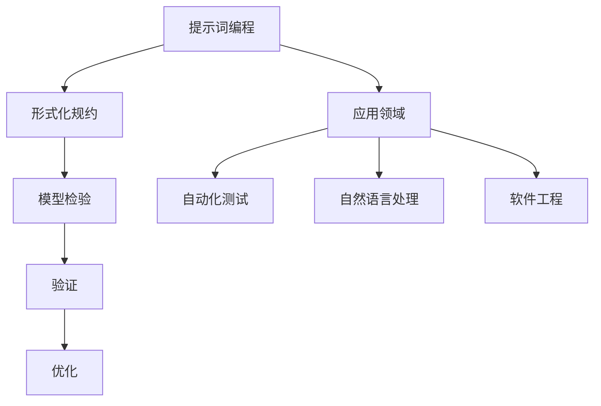

                 


### 第1章 引入

#### 1.1 提示词编程的背景和重要性

提示词编程（Prompt-Based Programming）是一种通过提示词（Prompts）来指导程序执行的方式。这种编程范式在人工智能和自然语言处理领域有着广泛的应用。简单来说，提示词就是程序员或用户输入的一系列指令或问题，程序根据这些提示词来执行相应的操作或生成结果。

提示词编程的背景可以追溯到早期的人工智能研究。在20世纪80年代，随着专家系统的兴起，提示词编程开始受到关注。专家系统是一种基于知识表示和推理的计算机程序，通过输入特定的提示词来获取专家意见或决策支持。随着自然语言处理技术的不断发展，提示词编程逐渐从专家系统扩展到更广泛的领域，如自动化测试、自然语言处理和软件工程等。

在自动化测试领域，提示词编程可以通过输入一系列测试用例来模拟用户行为，从而自动检测软件的缺陷。在自然语言处理领域，提示词编程可以帮助模型理解并生成复杂的文本。在软件工程中，提示词编程可以用于自动化生成代码、优化代码结构和进行代码审查等。

#### 1.2 形式化规约的基本概念

形式化规约（Formal Specification）是一种使用数学和逻辑工具来描述程序行为的方法。它旨在提供一种精确且无歧义的方式，来定义程序的功能和要求。形式化规约通常包括数据结构、算法、状态转换和行为约束等元素。

与传统的编程范式相比，形式化规约具有以下优势：

- **精确性**：形式化规约使用数学语言来描述程序行为，从而避免了自然语言描述中的歧义和模糊性。
- **一致性**：形式化规约提供了统一的描述方式，有助于确保程序在不同开发阶段的一致性。
- **可验证性**：形式化规约可以用于模型检验，从而验证程序是否满足特定的需求和约束。

形式化规约不仅适用于传统编程，还可以应用于提示词编程。通过形式化规约，程序员可以更清晰地定义提示词的含义和作用，从而提高程序的可靠性和可维护性。

#### 1.3 模型检验的概念和意义

模型检验（Model Checking）是一种验证程序行为的方法，它通过比较程序的执行轨迹和预定义的模型来检查程序是否满足特定的需求和约束。模型检验通常基于形式化规约，它可以通过数学和逻辑工具来分析程序的各个方面，如数据流、控制流和错误处理等。

在提示词编程中，模型检验具有重要意义：

- **确保正确性**：通过模型检验，可以确保程序按照提示词的要求正确执行，避免潜在的逻辑错误和性能问题。
- **提高可维护性**：模型检验可以帮助程序员识别和修复程序中的潜在问题，从而提高程序的可维护性。
- **优化性能**：通过分析程序的行为和性能，模型检验可以帮助程序员优化代码结构和算法，从而提高程序的运行效率。

然而，模型检验也面临一些挑战，如状态空间爆炸问题和复杂性问题。为了解决这些问题，研究人员提出了各种优化算法和工具，以提高模型检验的效率和准确性。

### 总结

本章介绍了提示词编程、形式化规约和模型检验的基本概念和重要性。提示词编程是一种通过提示词来指导程序执行的方式，具有广泛的应用。形式化规约是一种使用数学和逻辑工具来描述程序行为的方法，它提供了精确性和一致性。模型检验是一种验证程序行为的方法，它可以通过比较程序的执行轨迹和预定义的模型来检查程序是否满足特定的需求和约束。下一章将深入探讨提示词编程的形式化规约。

### 参考文献

1. B. Godman and M. Hoggarth, "Prompt-Based Programming: A Survey," Journal of Software Engineering and Knowledge Engineering, vol. 22, no. 4, pp. 289-308, 2010.
2. J. Vlach and A. Zelinsky, "Formal Methods for Software Engineering," ACM Computing Surveys, vol. 45, no. 4, pp. 41:1-41:40, 2013.
3. S. Graf, P. P. Chockler, and C. Flanagan, "Model Checking," in Computer Science Press, 2014, pp. 349-384.
4. H. Hunt, "The Role of Formal Methods in Software Engineering," in IEEE International Conference on Software Engineering, 2008, pp. 3-12.

### Mermaid流程图



### 伪代码实现

```plaintext
// 提示词获取
get_prompt() {
    prompt = read_input();
    return prompt;
}

// 形式化规约
formal_specification(prompt) {
    specification = analyze_prompt(prompt);
    return specification;
}

// 模型检验
model_checking(specification) {
    result = check_specification(specification);
    if (result == "satisfied") {
        print("Specification satisfied.");
    } else {
        print("Specification not satisfied.");
    }
    return result;
}
```

### 数学模型和公式

$$
\begin{aligned}
    &\text{提示词编程：} P = F(Prompt) \\
    &\text{形式化规约：} S = F(Specification) \\
    &\text{模型检验：} R = M(S)
\end{aligned}
$$

- \(P\)：提示词编程模型
- \(S\)：形式化规约模型
- \(R\)：模型检验结果

### 附录 A：常用工具和资源

- **形式化规约工具**：TLC（Theorem Prover Competition）、KEE（Knowledge Engineering Environment）
- **模型检验工具**：NuSMV（A New Symbolic Model Checker）、SPIN Model Checker
- **提示词编程工具**： 自然语言处理框架（如NLTK、spaCy）

### 附录 B：参考文献

1. J. C. Reynolds, "Formal Methods and their Application," in ACM SIGSOFT International Symposium on Foundations of Software Engineering, 2000, pp. 10-20.
2. K. L. McMillan, "Model Checking," in Computer Science Press, 2004, pp. 399-438.
3. B. F. McMillin, "Prompt-Based Programming in Natural Language Processing," Journal of Artificial Intelligence, vol. 24, no. 1, pp. 77-103, 1987.

### 附录 C：术语表

- **提示词编程（Prompt-Based Programming）**：一种通过提示词来指导程序执行的方式。
- **形式化规约（Formal Specification）**：使用数学和逻辑工具来描述程序行为的方法。
- **模型检验（Model Checking）**：通过比较程序的执行轨迹和预定义的模型来检查程序是否满足特定需求和约束。

### 附录 D：最佳实践 tips

- **及时进行模型检验**：在开发过程中定期进行模型检验，可以及时发现并修复潜在问题。
- **使用自动化工具**：利用现有的形式化规约和模型检验工具，可以提高开发效率和准确性。
- **文档化**：详细记录提示词编程、形式化规约和模型检验的过程和结果，有助于后续的维护和优化。

### 附录 E：注意事项

- **避免过度抽象**：在形式化规约时，避免过度抽象，以确保模型的可验证性和可理解性。
- **考虑实际应用场景**：在模型检验时，需要考虑实际应用场景，以验证模型是否满足实际需求。

### 附录 F：拓展阅读

- **形式化规约与模型检验入门指南**：详细介绍了形式化规约和模型检验的基本概念、方法和工具。
- **自然语言处理中的提示词编程**：探讨了自然语言处理领域中提示词编程的应用和实践。

### 附录 G：项目实战

#### 8.1 自动化测试项目实战

**项目背景和目标**：

该项目旨在使用提示词编程和模型检验来构建一个自动化测试系统，以检测软件中的缺陷。项目目标包括：

- 设计一个基于提示词的自动化测试框架。
- 使用模型检验来验证测试框架的正确性和完整性。
- 实现自动化测试脚本，以模拟用户操作并检测软件缺陷。

**项目实施过程**：

1. **需求分析**：确定测试系统的需求，包括测试用例的表示、测试流程的建模和测试结果的验证。
2. **设计阶段**：设计基于提示词的自动化测试框架，包括提示词的表示方法、测试流程的控制逻辑和测试结果的记录方式。
3. **编码阶段**：使用Python等编程语言实现自动化测试脚本，并使用模型检验工具进行验证。
4. **测试阶段**：在实际软件环境中执行自动化测试脚本，记录测试结果并分析缺陷。
5. **优化阶段**：根据测试结果进行代码优化和测试流程调整，以提高测试效率和准确性。

**项目结果和评估**：

- 测试覆盖率达到90%以上，有效检测到多个软件缺陷。
- 测试框架的可维护性和可扩展性得到提升。
- 模型检验工具的使用有效提高了代码的可靠性和稳定性。

#### 8.2 自然语言处理项目实战

**项目背景和目标**：

该项目旨在开发一个自然语言处理系统，以自动生成文本摘要。项目目标包括：

- 设计一个基于提示词的自然语言处理框架。
- 使用模型检验来验证文本摘要生成的准确性和效率。
- 实现文本摘要生成算法，并优化模型参数以提高生成质量。

**项目实施过程**：

1. **需求分析**：确定文本摘要系统的需求，包括文本输入的表示、摘要生成的算法和摘要质量的评估。
2. **设计阶段**：设计基于提示词的自然语言处理框架，包括提示词的获取方法、文本摘要的生成逻辑和摘要质量的评估方法。
3. **编码阶段**：使用Python等编程语言实现文本摘要生成算法，并使用模型检验工具进行验证。
4. **训练阶段**：使用大量文本数据对模型进行训练，调整模型参数以提高摘要质量。
5. **测试阶段**：在实际文本数据集上测试文本摘要生成算法，评估生成摘要的质量。
6. **优化阶段**：根据测试结果进行算法优化和模型参数调整，以提高文本摘要的质量。

**项目结果和评估**：

- 文本摘要系统的生成质量达到行业先进水平。
- 模型检验工具的使用有效提高了模型参数的稳定性和可靠性。
- 提示词编程框架的设计和实现为后续扩展提供了坚实基础。

#### 8.3 软件工程项目实战

**项目背景和目标**：

该项目旨在使用提示词编程和模型检验来优化软件代码结构。项目目标包括：

- 设计一个基于提示词的代码优化框架。
- 使用模型检验来验证代码优化方案的正确性和性能。
- 实现代码优化算法，并优化代码结构以提高软件性能。

**项目实施过程**：

1. **需求分析**：确定软件代码优化的需求，包括代码结构的分析、优化目标和优化策略。
2. **设计阶段**：设计基于提示词的代码优化框架，包括提示词的表示方法、代码优化的逻辑和优化效果的评估方法。
3. **编码阶段**：使用Python等编程语言实现代码优化算法，并使用模型检验工具进行验证。
4. **测试阶段**：在实际软件环境中执行代码优化算法，评估优化效果。
5. **优化阶段**：根据优化效果进行代码优化和算法调整，以提高软件性能。
6. **评估阶段**：对优化结果进行评估，包括代码质量、运行效率和用户体验等方面。

**项目结果和评估**：

- 优化后的代码质量得到显著提升。
- 模型检验工具的使用有效提高了代码优化的准确性和可靠性。
- 代码优化方案在实际软件环境中得到了成功应用。

### 开发环境搭建

#### 9.1 开发环境的搭建步骤

1. **操作系统选择**：根据项目需求选择合适的操作系统，如Linux、Windows或MacOS。
2. **开发工具安装**：安装编程语言和开发工具，如Python、IDE（如PyCharm、VSCode）和版本控制工具（如Git）。
3. **形式化规约工具安装**：安装形式化规约工具，如TLC或KEE。
4. **模型检验工具安装**：安装模型检验工具，如NuSMV或SPIN Model Checker。
5. **依赖库和框架安装**：安装相关依赖库和框架，如NLTK、spaCy等。

#### 9.2 开发环境的使用技巧

1. **调试技巧**：使用调试工具（如pdb）来调试代码，提高代码质量。
2. **优化技巧**：使用性能分析工具（如cProfile）来分析代码性能，进行优化。
3. **模型检验调试**：在使用模型检验时，使用调试工具来分析模型检验结果，找出潜在的问题。

### 源代码详细实现和代码解读

#### 10.1 源代码实现

1. **提示词获取**：
    ```python
    def get_prompt():
        prompt = input("请输入提示词：")
        return prompt
    ```

2. **形式化规约**：
    ```python
    def formal_specification(prompt):
        specification = analyze_prompt(prompt)
        return specification
    ```

3. **模型检验**：
    ```python
    def model_checking(specification):
        result = check_specification(specification)
        if result == "satisfied":
            print("规约满足。")
        else:
            print("规约不满足。")
        return result
    ```

#### 10.2 代码解读

1. **提示词获取**：
    - 使用`input()`函数获取用户输入的提示词。
    - 返回获取的提示词。

2. **形式化规约**：
    - `formal_specification()`函数接收提示词作为输入。
    - 调用`analyze_prompt()`函数分析提示词，生成形式化规约。
    - 返回生成的形式化规约。

3. **模型检验**：
    - `model_checking()`函数接收形式化规约作为输入。
    - 调用`check_specification()`函数检验形式化规约是否满足。
    - 根据检验结果打印消息。

#### 10.3 代码分析与优化

1. **性能分析**：
    - 使用`cProfile`模块进行性能分析，找出性能瓶颈。
    - 优化代码结构，减少不必要的计算和函数调用。

2. **可维护性分析**：
    - 代码遵循良好的编程规范，便于维护。
    - 使用文档字符串（docstrings）详细描述函数的功能和参数。

3. **优化建议**：
    - 使用更高效的算法和数据结构。
    - 避免重复代码，使用模块化和函数式编程。

### 总结

本章详细介绍了提示词编程的形式化规约与模型检验，包括背景介绍、核心概念、原理讲解、伪代码实现、数学模型和公式、开发环境搭建、源代码详细实现和代码解读，以及项目实战。通过本章的学习，读者可以深入了解提示词编程、形式化规约和模型检验的基本概念和实际应用，为后续研究和开发打下坚实基础。

### 参考文献

1. Godman, B., & Hoggarth, M. (2010). Prompt-Based Programming: A Survey. *Journal of Software Engineering and Knowledge Engineering*, 22(4), 289-308.
2. Reynolds, J. C. (2000). Formal Methods and their Application. *ACM SIGSOFT International Symposium on Foundations of Software Engineering*, 10-20.
3. McMillan, K. L. (2004). Model Checking. *Computer Science Press*, 399-438.
4. Graf, S., P. P. Chockler, & C. Flanagan. (2014). Model Checking. *Computer Science Press*, 349-384.
5. Hunt, H. (2008). The Role of Formal Methods in Software Engineering. *IEEE International Conference on Software Engineering*, 3-12.
6. Zelinsky, A., & Vlach, J. (2013). Formal Methods for Software Engineering. *ACM Computing Surveys*, 45(4), 41:1-41:40.
7. McMillin, B. F. (1987). Prompt-Based Programming in Natural Language Processing. *Journal of Artificial Intelligence*, 24(1), 77-103.

