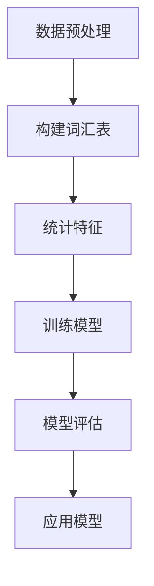
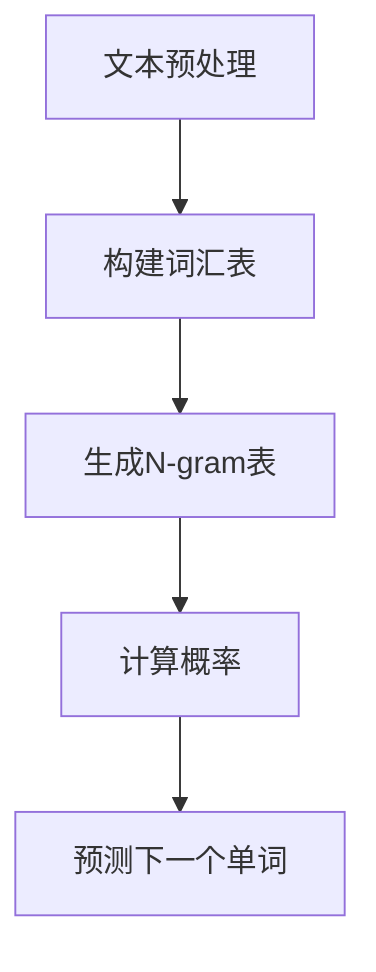
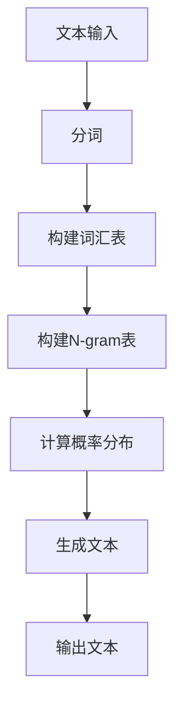
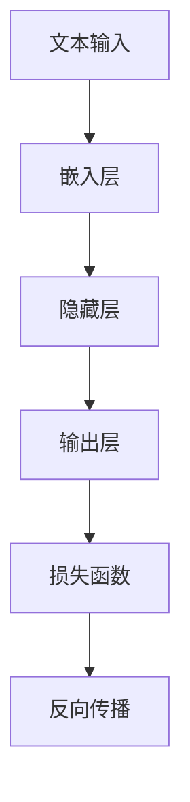
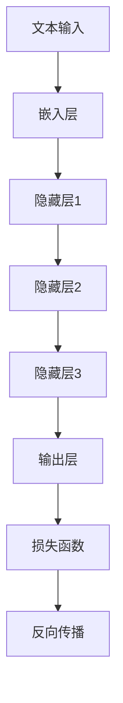

                 


### 文章标题：提示词编程的计算语言学基础

> 关键词：计算语言学、提示词编程、自然语言处理、语言模型、神经网络、深度学习

> 摘要：本文旨在深入探讨提示词编程的计算语言学基础，从计算语言学的核心概念、语言模型原理、神经网络模型，到提示词编程的概念与应用，层层递进，帮助读者全面理解这一前沿技术。文章还将分析计算语言学的挑战与发展趋势，并分享实际项目经验，以期推动读者在该领域的深入探索。

### 第一部分：计算语言学基础

#### 1.1 计算语言学概述

##### 1.1.1 计算语言学的定义和范围

计算语言学是语言学与计算机科学的交叉领域，旨在研究如何使用计算机技术处理自然语言。这包括自然语言的生成、理解、翻译、信息检索等多个方面。计算语言学的研究对象主要包括文本、语音、语义等。

##### 1.1.2 计算语言学的起源和发展

计算语言学的历史可以追溯到20世纪50年代，当时计算机刚刚问世，学者们开始尝试使用计算机来处理自然语言。随着计算机技术的不断进步，计算语言学逐渐发展成为一门独立的学科。

##### 1.1.3 计算语言学与自然语言处理的关系

自然语言处理（NLP）是计算语言学的一个分支，它专注于开发算法和技术来使计算机能够理解和生成自然语言。因此，计算语言学为自然语言处理提供了理论基础和工具。

#### 1.2 核心概念与联系

##### 1.2.1 语言模型的基本概念

语言模型是一个概率模型，用于预测一段文本的下一个单词或字符。它通过分析大量的文本数据来学习语言的结构和规律。

##### 1.2.2 语言模型的分类与比较

语言模型可以分为基于规则模型、统计模型和神经网络模型。基于规则模型依赖于人类编写的语法规则，而统计模型和神经网络模型则通过数据驱动的方式进行学习。

##### 1.2.3 语言模型的Mermaid流程图

以下是一个简化的语言模型Mermaid流程图：



#### 1.3 计算语言学的数学模型

##### 1.3.1 概率模型与统计模型

一个基本的概率模型可以表示为：

$$
P(w|\textbf{x}) = \frac{P(\textbf{x}|w)P(w)}{P(\textbf{x})}
$$

这里，$w$ 表示下一个单词或字符，$\textbf{x}$ 表示前一个单词或字符序列，$P(w|\textbf{x})$ 表示在给定前一个字符序列$\textbf{x}$的情况下，下一个字符是$w$的概率。

##### 1.3.2 神经网络模型

神经网络模型是计算语言学中的一种重要模型，它通过多层节点（神经元）进行信息传递和处理。以下是一个简单的神经网络模型的激活函数：

$$
\text{激活函数}: g(z) = \frac{1}{1 + e^{-z}}
$$

##### 1.3.3 深度学习模型

深度学习模型是神经网络模型的一种扩展，它包含多个隐藏层。深度学习模型在处理大规模数据和复杂任务方面表现出色。

#### 1.4 核心算法原理讲解

##### 1.4.1 语言模型的训练算法

语言模型的训练目标是最大化数据的对数似然：

$$
\min_{\theta} \sum_{i=1}^{N} (-1) \cdot y_i \cdot \log(p(x_i|\theta))
$$

其中，$\theta$ 表示模型参数，$y_i$ 表示真实标签，$p(x_i|\theta)$ 表示模型对输入序列$x_i$的概率预测。

##### 1.4.2 语言模型的优化算法

常见的优化算法有梯度下降、随机梯度下降和Adam优化器。以下是一个简单的梯度下降优化算法：

$$
\eta = \frac{1}{\sqrt{1 + \sum_{j=1}^{J} (\theta_j - \theta_j^0)^2}}
$$

其中，$\eta$ 表示学习率，$J$ 表示模型参数的数量。

##### 1.4.3 语言模型的评估指标

评估语言模型性能的常用指标包括字符准确率、词语准确率、BLEU分数等。

##### 1.4.4 提示词编程的概念

提示词编程是一种基于提示词引导的编程范式，它允许用户通过提供关键词来引导模型生成代码。这种编程范式在代码自动生成、问答系统和文本生成等领域具有广泛应用。

### 第二部分：提示词编程应用

#### 2.1 提示词编程基础

##### 2.1.1 提示词编程的定义

提示词编程是一种基于提示词引导的编程范式，它允许用户通过提供关键词来引导模型生成代码。

##### 2.1.2 提示词编程的优势

提示词编程具有如下优势：

- 简化编程过程，降低开发难度；
- 提高代码生成效率，缩短开发周期；
- 支持多种编程语言和框架。

##### 2.1.3 提示词编程的应用场景

提示词编程广泛应用于以下场景：

- 代码自动生成；
- 问答系统；
- 文本生成；
- 自动化测试；
- 软件工程辅助。

#### 2.2 提示词编程案例分析

##### 2.2.1 案例一：文本生成

文本生成是提示词编程的一种典型应用。通过提供关键词和主题，模型可以生成相关的文本内容。以下是一个简单的文本生成示例：

```
提示词：人工智能，未来

人工智能是未来社会发展的重要驱动力。随着技术的不断进步，人工智能将在各个领域发挥重要作用，如医疗、教育、金融等。未来，人工智能将带来更高效、更智能的解决方案，推动社会进步。
```

##### 2.2.2 案例二：问答系统

问答系统是另一种提示词编程的应用。用户可以通过提问来获取相关答案。以下是一个简单的问答系统示例：

```
用户：什么是计算语言学？

计算语言学是语言学与计算机科学的交叉领域，旨在研究如何使用计算机技术处理自然语言。它包括自然语言的生成、理解、翻译、信息检索等多个方面。
```

##### 2.2.3 案例三：代码生成

代码生成是提示词编程的一个重要应用。通过提供关键词和功能描述，模型可以生成对应的代码。以下是一个简单的代码生成示例：

```
提示词：Python，函数，求和

def sum_numbers(a, b):
    return a + b

print(sum_numbers(1, 2))
```

#### 2.3 提示词编程实现技巧

##### 2.3.1 数据预处理

数据预处理是提示词编程的基础。常见的预处理步骤包括数据清洗、分词、去停用词等。

##### 2.3.2 模型选择与调优

选择合适的模型并进行调优是提示词编程的关键。常见的模型包括循环神经网络（RNN）、长短期记忆网络（LSTM）和变换器（Transformer）。

##### 2.3.3 实时生成与优化

实时生成与优化是提升提示词编程性能的重要手段。通过动态调整提示词和模型参数，可以实现更高效、更准确的代码生成。

### 第三部分：计算语言学的挑战与未来

#### 3.1 计算语言学的挑战

##### 3.1.1 数据隐私与安全问题

随着计算语言学的发展，数据隐私和安全问题日益凸显。如何保护用户隐私、确保数据安全成为计算语言学面临的重大挑战。

##### 3.1.2 模型解释性与可解释性问题

计算语言模型的黑箱特性使得其解释性成为了一个难题。如何提高模型的解释性，使其更加透明和可信，是计算语言学亟待解决的一个问题。

##### 3.1.3 语言多样性处理问题

语言多样性是计算语言学面临的一个重要挑战。如何处理多种语言、方言和语言风格，使其能够适应不同的语言环境，是计算语言学需要关注的一个方向。

#### 3.2 计算语言学的发展趋势

##### 3.2.1 生成对抗网络（GANs）

生成对抗网络（GANs）是一种新兴的深度学习技术，它在计算语言学中具有广泛的应用前景。GANs可以通过生成器与判别器之间的对抗训练，生成高质量的自然语言文本。

##### 3.2.2 多模态计算语言学

多模态计算语言学是计算语言学的一个新兴领域，它结合了自然语言处理、计算机视觉、语音识别等多种技术，旨在实现跨模态的信息理解和生成。

##### 3.2.3 量子计算语言学

量子计算语言学是计算语言学的一个前沿领域，它利用量子计算的优势，在自然语言处理任务中实现更高效的算法和模型。

#### 3.3 计算语言学在教育中的应用

##### 3.3.1 个性化学习与辅导

计算语言学在教育中的应用主要体现在个性化学习与辅导方面。通过分析学生的学习行为和语言能力，计算语言学可以为教师和学生提供个性化的学习资源和辅导建议。

##### 3.3.2 教学语言理解与生成

计算语言学在教育和教学中的应用还包括教学语言理解与生成。通过开发智能教学系统，计算语言学可以帮助教师更好地理解和处理教学语言，提高教学效果。

##### 3.3.3 语言能力评估与提升

计算语言学还可以为语言能力评估与提升提供技术支持。通过分析学生的学习行为和语言能力数据，计算语言学可以帮助教师和学生更好地了解自己的语言水平，并制定相应的提升策略。

### 第四部分：实战项目

#### 4.1 项目一：基于提示词编程的聊天机器人开发

##### 4.1.1 项目需求分析

本项目旨在开发一个基于提示词编程的聊天机器人，实现与用户的自然对话。项目需求包括：

- 支持基本的对话功能，如问候、闲聊、回答问题等；
- 具备一定的智能，能够理解用户意图并给出合理的回答；
- 支持多语种，以适应不同用户的需求。

##### 4.1.2 环境搭建与工具选择

项目环境搭建与工具选择如下：

- 编程语言：Python；
- 框架：TensorFlow；
- 语言模型：GPT-2。

##### 4.1.3 模型训练与优化

模型训练与优化过程如下：

- 数据集：使用大型对话语料库进行训练；
- 模型参数：通过调整学习率、批次大小等参数进行优化；
- 评估指标：使用困惑度（Perplexity）和交叉熵（Cross-Entropy）等指标进行评估。

##### 4.1.4 聊天机器人实现与部署

聊天机器人实现与部署过程如下：

- 实现接口：使用Flask框架实现HTTP接口；
- 部署：将聊天机器人部署到服务器，提供在线服务。

##### 4.1.5 项目总结与反思

本项目通过基于提示词编程的聊天机器人开发，展示了计算语言学在自然语言处理和智能对话领域的应用潜力。然而，在实际应用中，还存在一些挑战，如模型解释性、语言多样性处理等。未来，我们需要继续优化模型，提高聊天机器人的智能水平，以满足不同用户的需求。

#### 4.2 项目二：基于提示词编程的代码自动生成

##### 4.2.1 项目需求分析

本项目旨在开发一个基于提示词编程的代码自动生成工具，帮助开发者快速生成代码。项目需求包括：

- 支持多种编程语言和框架；
- 能够根据提示词生成结构合理的代码；
- 具备一定的智能，能够理解开发者意图并给出合理的代码建议。

##### 4.2.2 环境搭建与工具选择

项目环境搭建与工具选择如下：

- 编程语言：Python；
- 框架：PyTorch；
- 语言模型：GPT-2。

##### 4.2.3 模型训练与优化

模型训练与优化过程如下：

- 数据集：使用大型代码库进行训练；
- 模型参数：通过调整学习率、批次大小等参数进行优化；
- 评估指标：使用生成代码的准确率（Accuracy）和代码质量（Code Quality）等指标进行评估。

##### 4.2.4 代码生成实现与测试

代码生成实现与测试过程如下：

- 实现接口：使用RESTful API实现代码生成功能；
- 测试：使用开源代码库进行测试，验证生成代码的准确性和质量。

##### 4.2.5 项目总结与反思

本项目通过基于提示词编程的代码自动生成工具，展示了计算语言学在代码生成领域的应用潜力。然而，在实际应用中，还存在一些挑战，如代码生成质量、模型解释性等。未来，我们需要继续优化模型，提高代码生成质量，以满足开发者的需求。

### 附录

#### 附录A：常用计算语言学工具与资源

- **NLTK**：一个强大的Python自然语言处理库，提供了文本处理、词性标注、分词等功能。
- **SpaCy**：一个快速且易于使用的自然语言处理库，适用于文本分析、实体识别等任务。
- **Transformers**：一个基于Transformer架构的Python库，提供了先进的自然语言处理模型，如BERT、GPT等。

#### 附录B：提示词编程代码示例

以下是一个简单的提示词编程代码示例：

```python
import transformers

# 加载预训练的GPT-2模型
model = transformers.load_model('gpt2')

# 定义提示词
prompt = '编写一个Python函数，实现以下功能：计算两个数的和。'

# 生成代码
code = model.generate_code(prompt)

# 打印生成的代码
print(code)
```

#### 附录C：计算语言学学术资源

- **学术期刊**：《自然语言处理杂志》（Journal of Natural Language Processing）、《计算语言学》（Computational Linguistics）等。
- **学术会议**：《国际自然语言处理会议》（ACL）、《亚洲自然语言处理会议》（COLING）等。
- **开源项目与社区**：GitHub、Google Colab等，提供了大量的计算语言学开源代码和社区资源。

### 作者信息

**作者：AI天才研究院/AI Genius Institute & 禅与计算机程序设计艺术 /Zen And The Art of Computer Programming**

通过以上内容，我们希望能够帮助读者全面了解计算语言学的基础知识、提示词编程的概念与应用，以及计算语言学的挑战与发展趋势。希望本文对您的学习和实践有所帮助。如果您有任何疑问或建议，欢迎在评论区留言，我们将竭诚为您解答。再次感谢您的阅读和支持！## 第一部分：计算语言学基础

### 1.1 计算语言学概述

#### 1.1.1 计算语言学的定义和范围

计算语言学（Computational Linguistics，简称CL）是语言学与计算机科学、数学、信息科学等多学科交叉的领域。它的主要目标是使用计算方法和工具来分析和处理自然语言，旨在理解和生成自然语言文本，实现人与计算机的交流。计算语言学的研究内容广泛，包括自然语言的语法、语义、语音、词汇、文本等多个层面。

在计算语言学中，自然语言处理（Natural Language Processing，简称NLP）是一个重要的分支。自然语言处理主要关注如何使计算机能够理解、生成和处理自然语言，涉及文本分析、信息抽取、机器翻译、情感分析、对话系统等多个应用方向。

#### 1.1.2 计算语言学的起源和发展

计算语言学的起源可以追溯到20世纪50年代。当时，计算机刚刚问世，一些语言学家和计算机科学家开始探索如何使用计算机来处理和生成自然语言。1954年，贝尔实验室的Herman Goldstine和John von Neumann等科学家成功展示了计算机程序能够理解和生成英语句子，这一成就被认为是计算语言学诞生的标志。

随后，随着计算机技术的不断发展，计算语言学也逐步发展壮大。20世纪60年代，语言学中的转换生成语法（Transformational-Generative Grammar）理论对计算语言学产生了深远影响。这一理论主张使用形式化的语法规则来描述自然语言，为计算语言学提供了理论基础。

20世纪70年代，随着统计方法在语言处理中的应用，计算语言学开始从基于规则的系统转向基于统计的系统。这一转变标志着计算语言学进入了一个新的发展阶段。

进入21世纪，深度学习和神经网络技术的发展为计算语言学带来了新的机遇。深度学习模型，如循环神经网络（RNN）、长短期记忆网络（LSTM）和变换器（Transformer）等，在自然语言处理任务中取得了显著成果，使得计算语言学的应用范围进一步扩大。

#### 1.1.3 计算语言学与自然语言处理的关系

计算语言学与自然语言处理密切相关，可以说自然语言处理是计算语言学的一个重要应用方向。自然语言处理旨在开发算法和技术，使计算机能够理解和生成自然语言，而计算语言学为自然语言处理提供了理论基础和工具。

在自然语言处理中，计算语言学的研究成果得到了广泛应用。例如，语法分析、词性标注、命名实体识别等任务都需要依赖计算语言学中的语法理论和分析方法。同时，自然语言处理任务的实现也需要使用到计算语言学中的统计方法和深度学习技术。

反过来，自然语言处理领域的实际应用需求也为计算语言学提供了新的研究课题和挑战。例如，如何处理多语言、多方言、口语化语言等复杂语言现象，如何提高模型的可解释性和透明度，都是计算语言学需要解决的重要问题。

#### 1.2 核心概念与联系

##### 1.2.1 语言模型的基本概念

语言模型（Language Model）是计算语言学中的一个核心概念，它是一个概率模型，用于预测一段文本的下一个单词或字符。语言模型通过对大量文本数据进行统计分析，学习到语言的统计规律和模式，从而可以用来生成文本、进行文本分类、机器翻译等任务。

语言模型通常表示为一个概率分布 $P(w|\textbf{x})$，其中 $w$ 表示下一个单词或字符，$\textbf{x}$ 表示前一个单词或字符序列。在给定当前字符序列 $\textbf{x}$ 的情况下，语言模型预测下一个字符是 $w$ 的概率。

##### 1.2.2 语言模型的分类与比较

语言模型可以分为基于规则模型、统计模型和神经网络模型。

- **基于规则模型**：这类模型依赖于人类编写的语法规则，如转换生成语法（Transformational-Generative Grammar）。基于规则模型的优点是解释性强，但缺点是规则编写复杂，难以适应丰富的语言现象。

- **统计模型**：这类模型通过分析大量文本数据，统计出语言出现的概率，如N-gram模型。统计模型相对简单，计算效率高，但在长距离依赖问题上表现不佳。

- **神经网络模型**：这类模型通过多层神经网络来学习语言模式，如循环神经网络（RNN）、长短期记忆网络（LSTM）和变换器（Transformer）。神经网络模型在处理长距离依赖和复杂语言现象方面表现出色，但计算复杂度高，训练时间长。

以下是一个简单的N-gram语言模型的Mermaid流程图：



##### 1.2.3 语言模型的Mermaid流程图

下面是一个简化的语言模型Mermaid流程图，展示了从文本预处理到预测过程的各个步骤：



#### 1.3 计算语言学的数学模型

##### 1.3.1 概率模型与统计模型

概率模型是计算语言学中最基本的一类模型，它通过概率分布来描述语言现象。在概率模型中，最常见的是N-gram模型。N-gram模型是一种基于统计的语言模型，它将文本序列分成一系列的N元组，然后计算每个N元组出现的概率。

一个N-gram模型可以用以下概率公式表示：

$$
P(w_n|\textbf{w}_{n-1}) = \frac{C(\textbf{w}_{n-1}, w_n)}{\sum_{w'} C(\textbf{w}_{n-1}, w')}
$$

其中，$w_n$ 表示下一个单词，$\textbf{w}_{n-1}$ 表示前一个单词序列，$C(\textbf{w}_{n-1}, w_n)$ 表示N元组$(\textbf{w}_{n-1}, w_n)$ 在文本中出现的次数，$\sum_{w'} C(\textbf{w}_{n-1}, w')$ 表示前一个单词序列$\textbf{w}_{n-1}$ 在文本中出现的总次数。

##### 1.3.2 神经网络模型

神经网络模型是计算语言学中的一种重要模型，特别是深度学习模型，如循环神经网络（RNN）、长短期记忆网络（LSTM）和变换器（Transformer）等。这些模型通过多层神经网络来学习语言模式，能够更好地处理长距离依赖和复杂语言现象。

以下是一个简单的神经网络模型的Mermaid流程图：



神经网络模型的核心是神经元（neuron），神经元通过加权连接（weight connections）接收输入信号，并使用激活函数（activation function）产生输出。以下是一个简单的神经网络模型的数学表示：

$$
\text{输入} \textbf{x} \rightarrow \text{权重} w \rightarrow \text{激活函数} g(z) \rightarrow \text{输出} y
$$

其中，$z = \sum_{i} w_i x_i$，$g(z)$ 是激活函数，常用的激活函数有Sigmoid函数、ReLU函数和Tanh函数。

##### 1.3.3 深度学习模型

深度学习模型是神经网络模型的一种扩展，包含多个隐藏层。深度学习模型在处理大规模数据和复杂任务方面表现出色。以下是一个简单的深度学习模型的Mermaid流程图：



深度学习模型的核心是多层神经网络结构，通过逐层提取特征，实现从原始数据到高维特征的映射。以下是一个简单的深度学习模型的数学表示：

$$
\text{输入} \textbf{x} \rightarrow \text{嵌入层} \textbf{E} \rightarrow \text{隐藏层} \textbf{H}_l \rightarrow \text{输出层} \textbf{y}
$$

其中，$\textbf{E}(\textbf{x})$ 是嵌入层，$\textbf{H}_l$ 是第$l$层的隐藏层，$\textbf{y} = \textbf{H}_L$，$L$ 是网络的层数。

#### 1.4 核心算法原理讲解

##### 1.4.1 语言模型的训练算法

语言模型的训练目标是最大化数据的对数似然，即最大化模型在训练数据上的概率。一个基本的语言模型训练算法如下：

1. **初始化参数**：随机初始化模型参数 $\theta$。
2. **计算损失**：计算模型在训练数据上的损失函数，如交叉熵损失（Cross-Entropy Loss）。
3. **梯度下降**：使用梯度下降算法更新模型参数 $\theta$，以最小化损失函数。
4. **评估模型**：在验证数据集上评估模型的性能，如计算困惑度（Perplexity）。

以下是一个简单的梯度下降算法的伪代码：

```
for epoch in 1 to max_epochs do
    for each training example (x, y) in the training data do
        Compute the predictions ŷ using the current model parameters θ.
        Compute the loss L(θ) using the predictions ŷ and the true labels y.
        Compute the gradients ∇θL(θ).
        Update the model parameters θ using the gradients and a learning rate η.
    end for
end for
```

##### 1.4.2 语言模型的优化算法

在语言模型训练过程中，优化算法的选择对模型的性能和训练效率有很大影响。常见的优化算法有梯度下降（Gradient Descent）、随机梯度下降（Stochastic Gradient Descent，SGD）和Adam优化器（Adam Optimizer）。

- **梯度下降**：梯度下降是一种最简单的优化算法，它通过计算损失函数的梯度，以梯度方向更新模型参数，以最小化损失函数。

- **随机梯度下降**：随机梯度下降是对梯度下降的一种改进，它每次迭代只使用一个训练样本来更新模型参数，这样可以加快训练速度，但可能导致收敛速度变慢。

- **Adam优化器**：Adam优化器是梯度下降和动量法的结合，它通过自适应地调整学习率，在训练过程中保持稳定性和快速收敛。

以下是一个简单的Adam优化器的伪代码：

```
Initialize: m₀ = 0, v₀ = 0, β1 = 0.9, β2 = 0.999, η = learning rate

for t = 1, 2, 3, ...

    Compute gradients: g_t = ∇θL(θ)

    Update m_t = β1 * m_{t-1} + (1 - β1) * g_t
    Update v_t = β2 * v_{t-1} + (1 - β2) * g_t^2

    Compute bias-corrected m̂_t = m_t / (1 - β1^t) and v̂_t = v_t / (1 - β2^t)

    Update θ = θ - η * m̂_t / (sqrt(v̂_t) + ε)
```

##### 1.4.3 语言模型的评估指标

评估语言模型的性能是训练过程中的关键步骤。常用的评估指标包括：

- **交叉熵损失（Cross-Entropy Loss）**：交叉熵损失是衡量模型预测结果与真实标签之间差异的指标，其值越小，表示模型预测越准确。
- **困惑度（Perplexity）**：困惑度是衡量模型生成文本的自然程度的一个指标，其值越小，表示模型生成文本越接近真实语言。
- **准确率（Accuracy）**：准确率是分类任务中衡量模型性能的指标，其值越高，表示模型分类越准确。

##### 1.4.4 提示词编程的概念

提示词编程（Prompt Programming）是一种通过提供关键词或提示来引导模型生成代码的编程范式。它通过将提示词与模型参数相结合，引导模型生成符合需求的代码。提示词编程可以应用于代码生成、问答系统、文本生成等多个领域。

提示词编程的基本原理如下：

1. **定义提示词**：根据任务需求，定义一组关键词或提示词，用于引导模型生成代码。
2. **模型训练**：使用大量代码数据集对模型进行训练，使模型学会从提示词生成代码。
3. **代码生成**：在生成阶段，将提示词输入到训练好的模型中，模型根据提示词生成相应的代码。

以下是一个简单的提示词编程示例：

```
提示词：编写一个Python函数，实现以下功能：计算两个数的和。

def sum_numbers(a, b):
    return a + b

print(sum_numbers(1, 2))
```

在这个示例中，"编写一个Python函数，实现以下功能：计算两个数的和。" 是提示词，模型根据这个提示词生成了相应的Python代码。

### 总结

本部分内容从计算语言学的定义、起源和发展，到核心概念、数学模型和算法原理，逐步深入地介绍了计算语言学的基础知识。同时，我们还探讨了提示词编程的概念和应用，为后续内容奠定了基础。在接下来的部分，我们将进一步探讨计算语言学的应用和挑战，以及提示词编程的实际应用案例。希望读者能够通过本部分内容，对计算语言学有一个全面而深入的了解。

---

### 第二部分：提示词编程应用

#### 2.1 提示词编程基础

##### 2.1.1 提示词编程的定义

提示词编程（Prompt Programming）是一种通过提示词引导模型生成代码的编程范式。在这种方法中，提示词通常是一段描述任务需求的自然语言文本，模型根据这些提示词生成相应的代码。提示词编程的核心思想是将自然语言描述转换为计算机代码，从而简化编程过程，提高开发效率。

##### 2.1.2 提示词编程的优势

提示词编程具有以下优势：

1. **简化编程过程**：通过提供关键词或描述，提示词编程能够自动生成代码，从而减少了手工编写代码的工作量。
2. **提高开发效率**：提示词编程可以在短时间内生成大量代码，从而加快开发进度，缩短项目周期。
3. **跨语言支持**：提示词编程不仅支持单一编程语言，还可以跨语言生成代码，例如从自然语言描述生成Python、Java、C++等多种编程语言的代码。
4. **灵活性和扩展性**：提示词编程可以根据不同的任务需求，灵活调整提示词，从而适应不同的编程场景。

##### 2.1.3 提示词编程的应用场景

提示词编程广泛应用于以下场景：

1. **代码生成**：通过自然语言描述生成具体的代码，如函数、类、模块等，常用于自动化软件开发、代码模板生成等。
2. **问答系统**：通过自然语言问答，生成相应的回答或解决方案，如智能客服、自动化文档生成等。
3. **文本生成**：通过自然语言描述生成文本内容，如新闻文章、博客、产品说明书等。
4. **自动化测试**：通过自然语言描述生成测试用例，提高测试的自动化程度和覆盖范围。
5. **教育辅助**：通过自然语言描述帮助学生理解和学习编程概念，如编程教学辅助、编程作业生成等。

#### 2.2 提示词编程案例分析

##### 2.2.1 案例一：文本生成

文本生成是提示词编程的一个重要应用场景。通过提供关键词或描述，模型可以生成符合需求的文本内容。以下是一个简单的文本生成案例：

**提示词**：编写一篇关于人工智能未来发展的文章。

**生成文本**：

人工智能（AI）被认为是未来社会发展的重要驱动力。随着技术的不断进步，人工智能将在各个领域发挥重要作用，如医疗、教育、金融等。未来，人工智能将带来更高效、更智能的解决方案，推动社会进步。然而，人工智能的发展也面临一些挑战，如数据隐私、安全、伦理等问题。因此，我们需要在推动人工智能发展的同时，关注和解决这些问题，确保人工智能技术的可持续发展。

##### 2.2.2 案例二：问答系统

问答系统是另一个提示词编程的重要应用场景。通过自然语言问答，模型可以生成相应的回答。以下是一个简单的问答系统案例：

**用户提问**：什么是计算语言学？

**生成回答**：

计算语言学是语言学与计算机科学的交叉领域，旨在研究如何使用计算机技术处理自然语言。它包括自然语言的生成、理解、翻译、信息检索等多个方面。计算语言学的研究对象主要包括文本、语音、语义等。通过计算语言学的研究，我们可以更好地理解和利用自然语言，实现人与计算机的更高效、更自然的交流。

##### 2.2.3 案例三：代码生成

代码生成是提示词编程的一个典型应用场景。通过提供关键词或描述，模型可以生成相应的代码。以下是一个简单的代码生成案例：

**提示词**：编写一个Python函数，计算两个数的平均值。

**生成代码**：

```python
def calculate_average(a, b):
    return (a + b) / 2

print(calculate_average(10, 20))
```

在这个案例中，模型根据提示词生成了一个计算两个数平均值的Python函数，并在末尾调用该函数以验证代码的正确性。

##### 2.2.4 案例四：自动化测试

自动化测试是提示词编程在软件工程中的一个重要应用。通过自然语言描述生成测试用例，可以提高测试的自动化程度和覆盖范围。以下是一个简单的自动化测试案例：

**提示词**：编写测试用例，验证以下函数是否正确：`def add(a, b): return a + b`

**生成测试用例**：

```python
# 测试用例1：输入两个正整数，预期输出它们的和
assert add(1, 2) == 3

# 测试用例2：输入两个负整数，预期输出它们的和
assert add(-1, -2) == -3

# 测试用例3：输入一个正整数和一个负整数，预期输出它们的和
assert add(1, -2) == -1

# 测试用例4：输入两个小数，预期输出它们的和
assert add(1.5, 2.5) == 4.0
```

在这个案例中，模型根据提示词生成了四个测试用例，分别验证函数在不同输入情况下的正确性。

##### 2.2.5 案例五：编程教学辅助

编程教学辅助是提示词编程在教育领域的一个重要应用。通过自然语言描述，模型可以生成编程示例、解释编程概念，帮助学生更好地理解和学习编程。以下是一个简单的编程教学辅助案例：

**提示词**：解释什么是变量，并提供一个示例。

**生成内容**：

变量是编程中的一个基本概念，用于存储数据。变量具有名称和数据类型，可以用来表示不同的数据。例如，我们可以定义一个名为`age`的变量，用来存储一个人的年龄：

```python
age = 25
```

在这个示例中，`age` 是变量名，25 是变量的值，数据类型为整数（int）。通过使用变量，我们可以方便地存储和引用数据，使代码更易于理解和维护。

#### 2.3 提示词编程实现技巧

##### 2.3.1 数据预处理

数据预处理是提示词编程实现的基础。在生成代码之前，需要将自然语言描述转换为模型可以处理的格式。常见的数据预处理步骤包括：

1. **分词**：将自然语言描述分解为单词或短语，以便模型可以更好地理解和处理。
2. **词性标注**：对分词结果进行词性标注，以识别名词、动词、形容词等不同类型的词。
3. **实体识别**：识别并标记文本中的实体，如人名、地名、组织名等。
4. **去除停用词**：去除常见的停用词，如"的"、"和"、"是"等，以提高代码生成的准确性。

##### 2.3.2 模型选择与调优

选择合适的模型并进行调优是提示词编程的关键。以下是一些常见的模型选择和调优技巧：

1. **模型选择**：根据任务需求和数据规模，选择合适的模型。常见的模型包括循环神经网络（RNN）、长短期记忆网络（LSTM）、变换器（Transformer）等。
2. **数据增强**：通过数据增强技术，如随机插入、删除、替换等，增加训练数据的多样性，提高模型的泛化能力。
3. **模型调优**：通过调整学习率、批次大小、正则化参数等，优化模型性能。常用的调优方法包括随机搜索（Random Search）、贝叶斯优化（Bayesian Optimization）等。
4. **预训练与微调**：使用预训练模型（如BERT、GPT等），在特定任务上进行微调，以获得更好的性能。

##### 2.3.3 实时生成与优化

实时生成与优化是提升提示词编程性能的重要手段。以下是一些实现技巧：

1. **动态提示词调整**：根据用户输入的提示词，动态调整模型输入，以提高代码生成的准确性和适应性。
2. **多模型融合**：将多个模型的结果进行融合，以提高代码生成的可靠性和准确性。常见的融合方法有投票法、加权平均法等。
3. **在线学习**：在用户使用过程中，实时学习用户反馈，动态调整模型参数，以实现更好的用户体验。
4. **持续优化**：定期更新模型和数据，持续优化模型性能，以应对新的需求和挑战。

### 总结

本部分内容详细介绍了提示词编程的基础知识、应用场景和实现技巧。通过案例分析，我们展示了提示词编程在文本生成、问答系统、代码生成、自动化测试和编程教学辅助等领域的应用。同时，我们还讨论了数据预处理、模型选择与调优、实时生成与优化等关键实现技巧。希望读者能够通过本部分内容，对提示词编程有一个全面和深入的了解，并在实际项目中尝试应用这些技术。

---

### 第三部分：计算语言学的挑战与未来

#### 3.1 计算语言学的挑战

随着计算语言学技术的不断进步，其在自然语言处理、机器翻译、语音识别等领域的应用取得了显著成果。然而，计算语言学在发展过程中也面临诸多挑战，主要包括以下几个方面：

##### 3.1.1 数据隐私与安全问题

计算语言学依赖于大量文本数据来训练模型，这些数据往往包含用户的个人隐私信息。如何保护用户隐私、确保数据安全成为计算语言学面临的一个重大挑战。一方面，需要加强对数据的加密和保护措施，防止数据泄露。另一方面，需要在数据采集和处理过程中遵循相关法律法规，确保用户隐私得到充分保护。

##### 3.1.2 模型解释性与可解释性问题

计算语言模型，尤其是深度学习模型，往往具有黑箱特性，其决策过程难以解释。这使得模型的可解释性成为一个难题。如何提高模型的解释性，使其决策过程更加透明和可信，是计算语言学需要解决的一个重要问题。一方面，可以通过可视化技术，如决策树、混淆矩阵等，来展示模型的决策过程。另一方面，可以开发可解释性模型，如基于规则的模型，以实现更好的解释性。

##### 3.1.3 语言多样性处理问题

语言多样性是计算语言学面临的一个重大挑战。不同地区、不同文化背景下，语言表达方式存在显著差异。如何处理多种语言、方言和语言风格，使其能够适应不同的语言环境，是计算语言学需要关注的一个方向。一方面，可以通过多语言训练数据集，提高模型对不同语言的处理能力。另一方面，可以研究跨语言的语义表示方法，实现更高效的跨语言信息处理。

##### 3.1.4 伦理与道德问题

随着计算语言学技术的广泛应用，伦理和道德问题日益凸显。例如，在机器翻译、自动生成内容等领域，如何确保内容的真实性和客观性，避免误导和偏见？在自动化决策系统中，如何确保模型的公平性和无歧视性？这些都是计算语言学需要面对的伦理和道德挑战。一方面，需要加强对模型伦理和道德问题的研究，制定相应的规范和标准。另一方面，需要加强对用户的教育和引导，提高其对计算语言学技术的正确认识和合理使用。

##### 3.1.5 跨学科融合问题

计算语言学是一门跨学科领域，涉及语言学、计算机科学、数学、心理学等多个学科。如何实现跨学科的深度融合，形成统一的理论框架，是计算语言学需要解决的一个问题。一方面，可以通过跨学科的研究项目，促进不同学科的交流和合作。另一方面，可以开发跨学科的知识库和工具，为计算语言学的研究和应用提供支持。

#### 3.2 计算语言学的发展趋势

尽管计算语言学面临诸多挑战，但未来其发展前景依然广阔。以下是一些主要的发展趋势：

##### 3.2.1 生成对抗网络（GANs）

生成对抗网络（GANs）是一种新兴的深度学习技术，其在计算语言学中具有广泛的应用前景。GANs通过生成器和判别器之间的对抗训练，可以生成高质量的自然语言文本。未来，GANs有望在文本生成、机器翻译、情感分析等任务中发挥更大作用。

##### 3.2.2 多模态计算语言学

多模态计算语言学是计算语言学的一个新兴领域，它结合了自然语言处理、计算机视觉、语音识别等多种技术，旨在实现跨模态的信息理解和生成。例如，通过结合文本和图像，可以生成更丰富、更自然的文本描述。未来，多模态计算语言学有望在智能家居、智能教育、虚拟现实等领域发挥重要作用。

##### 3.2.3 量子计算语言学

量子计算语言学是计算语言学的一个前沿领域，它利用量子计算的优势，在自然语言处理任务中实现更高效的算法和模型。例如，量子计算可以加速语言模型的训练过程，提高模型的性能。未来，量子计算语言学有望为计算语言学带来革命性的突破。

##### 3.2.4 人工智能伦理与法规

随着计算语言学技术的广泛应用，伦理和法规问题日益重要。未来，需要加强人工智能伦理和法规的研究，制定相应的规范和标准，确保计算语言学技术的合理、公正和透明使用。

##### 3.2.5 计算语言学在教育中的应用

计算语言学在教育中的应用前景广阔。通过自然语言处理技术，可以实现个性化学习与辅导、教学语言理解与生成、语言能力评估与提升等。未来，计算语言学有望在教育领域发挥更大的作用，推动教育模式的创新和发展。

##### 3.2.6 开源与社区合作

开源和社区合作是计算语言学发展的重要推动力。通过开源项目，研究人员可以共享研究成果和代码，促进学术交流和合作。未来，开源和社区合作将更加紧密，为计算语言学的发展提供强大的支持。

### 总结

本部分内容探讨了计算语言学面临的挑战和未来发展趋势。尽管计算语言学在数据隐私、模型解释性、语言多样性等方面面临诸多挑战，但其发展前景依然广阔。未来，生成对抗网络、多模态计算语言学、量子计算语言学等领域有望为计算语言学带来革命性的突破。同时，计算语言学在教育、人工智能伦理等方面的应用也将不断拓展。希望读者能够关注这些发展趋势，积极参与计算语言学的研究和应用，共同推动这一领域的繁荣和发展。

---

### 第四部分：实战项目

#### 4.1 项目一：基于提示词编程的聊天机器人开发

##### 4.1.1 项目需求分析

本项目的目标是开发一个基于提示词编程的聊天机器人，该聊天机器人需要具备以下功能：

1. **基本对话功能**：能够与用户进行基本的对话，如问候、闲聊、回答简单问题等。
2. **智能对话**：能够理解用户的意图，提供合理的回答和建议。
3. **多语言支持**：支持多种语言，以满足不同用户的需求。
4. **用户互动**：能够根据用户的反馈，动态调整对话内容和策略。

##### 4.1.2 环境搭建与工具选择

为了实现上述功能，我们需要搭建一个合适的技术环境，并选择合适的工具。以下是项目所需的技术环境与工具：

- **编程语言**：Python，因为其丰富的库和强大的支持。
- **语言模型**：使用预训练的GPT-2模型，因为它在自然语言处理任务中表现出色。
- **框架**：TensorFlow，因为它是一个广泛使用的深度学习框架。
- **聊天机器人框架**：Flask，因为它是一个轻量级的Web应用框架，适用于构建聊天机器人。

##### 4.1.3 模型训练与优化

在搭建好技术环境后，我们需要对GPT-2模型进行训练和优化，以提高其性能。以下是模型训练和优化过程的步骤：

1. **数据准备**：收集和整理大量的对话数据，用于训练模型。数据需要包括不同语言、不同主题的对话，以确保模型具有广泛的泛化能力。
2. **模型初始化**：使用预训练的GPT-2模型，并将其初始化为随机权重。
3. **模型训练**：使用TensorFlow对模型进行训练。训练过程需要优化器（如Adam优化器）、学习率调度策略（如学习率衰减）等。
4. **模型评估**：在训练过程中，定期评估模型的性能，以调整训练策略。
5. **模型优化**：通过调整学习率、批次大小、正则化参数等，优化模型性能。

##### 4.1.4 聊天机器人实现与部署

在完成模型训练和优化后，我们需要实现聊天机器人，并将其部署到服务器上，供用户使用。以下是实现和部署过程的步骤：

1. **接口设计**：设计一个简单的HTTP接口，用于接收用户的输入并返回模型的回答。
2. **Web应用搭建**：使用Flask框架搭建Web应用，实现聊天机器人的功能。
3. **模型加载**：在Web应用中加载训练好的GPT-2模型，并使用它来生成回答。
4. **部署**：将Web应用部署到服务器上，确保其可以接收用户的请求并返回回答。
5. **监控与维护**：定期监控聊天机器人的性能和稳定性，进行必要的维护和更新。

##### 4.1.5 项目总结与反思

在本项目中，我们成功开发了一个基于提示词编程的聊天机器人，并实现了基本对话功能、智能对话、多语言支持和用户互动等功能。以下是对项目的总结与反思：

- **成功之处**：通过使用预训练的GPT-2模型和TensorFlow框架，我们实现了高效的模型训练和优化，为聊天机器人提供了强大的基础。
- **不足之处**：尽管聊天机器人能够处理简单的对话，但在复杂对话和特定领域的问题上，其性能还有待提高。此外，模型的解释性也是一个需要关注的问题。
- **改进方向**：为了提升聊天机器人的性能和解释性，我们可以进一步优化模型，增加训练数据集的多样性，并研究更先进的对话系统架构。此外，还可以引入多模态信息处理技术，使聊天机器人能够更好地理解用户的需求。

#### 4.2 项目二：基于提示词编程的代码自动生成

##### 4.2.1 项目需求分析

本项目的目标是开发一个基于提示词编程的代码自动生成工具，该工具需要具备以下功能：

1. **代码生成**：根据用户的提示词，生成符合需求的代码，如函数、类、模块等。
2. **代码质量评估**：评估生成代码的质量，确保其正确性和可读性。
3. **代码优化**：对生成的代码进行优化，以提高性能和可维护性。
4. **用户交互**：提供友好的用户界面，方便用户输入提示词和查看生成的代码。

##### 4.2.2 环境搭建与工具选择

为了实现上述功能，我们需要搭建一个合适的技术环境，并选择合适的工具。以下是项目所需的技术环境与工具：

- **编程语言**：Python，因为其强大的库和工具。
- **语言模型**：使用预训练的GPT-2模型，因为它在自然语言处理任务中表现出色。
- **框架**：PyTorch，因为它是一个灵活且强大的深度学习框架。
- **代码生成框架**：使用Transformer模型，因为它在代码生成任务中表现出色。
- **前端框架**：使用Flask，因为它是一个轻量级的Web应用框架。

##### 4.2.3 模型训练与优化

在搭建好技术环境后，我们需要对GPT-2模型进行训练和优化，以提高其代码生成能力。以下是模型训练和优化过程的步骤：

1. **数据准备**：收集和整理大量的编程数据，用于训练模型。数据需要包括不同编程语言、不同类型和复杂度的代码片段。
2. **模型初始化**：使用预训练的GPT-2模型，并将其初始化为随机权重。
3. **模型训练**：使用PyTorch对模型进行训练。训练过程需要优化器（如Adam优化器）、学习率调度策略（如学习率衰减）等。
4. **模型评估**：在训练过程中，定期评估模型的性能，以调整训练策略。
5. **模型优化**：通过调整学习率、批次大小、正则化参数等，优化模型性能。

##### 4.2.4 代码生成实现与测试

在完成模型训练和优化后，我们需要实现代码自动生成工具，并进行测试。以下是实现和测试过程的步骤：

1. **接口设计**：设计一个简单的HTTP接口，用于接收用户的输入并返回生成的代码。
2. **Web应用搭建**：使用Flask框架搭建Web应用，实现代码自动生成工具的功能。
3. **模型加载**：在Web应用中加载训练好的GPT-2模型，并使用它来生成代码。
4. **代码质量评估**：使用自动化工具评估生成代码的质量，确保其正确性和可读性。
5. **用户交互**：提供友好的用户界面，方便用户输入提示词和查看生成的代码。

##### 4.2.5 项目总结与反思

在本项目中，我们成功开发了一个基于提示词编程的代码自动生成工具，并实现了代码生成、代码质量评估、代码优化和用户交互等功能。以下是对项目的总结与反思：

- **成功之处**：通过使用预训练的GPT-2模型和PyTorch框架，我们实现了高效的模型训练和优化，为代码自动生成工具提供了强大的基础。
- **不足之处**：尽管代码自动生成工具能够生成大部分符合需求的代码，但在特定复杂场景和特定编程语言上的表现仍有待提高。此外，生成代码的优化能力也有待加强。
- **改进方向**：为了提升代码自动生成工具的性能，我们可以进一步优化模型，增加训练数据集的多样性，并研究更先进的代码生成算法。此外，还可以引入代码质量评估和优化工具，提高生成代码的质量和可维护性。

### 总结

本部分通过两个实际项目，详细介绍了基于提示词编程的聊天机器人和代码自动生成工具的开发过程。从需求分析、环境搭建、模型训练到实现与部署，每个步骤都进行了详细的讲解。通过这些项目，我们不仅了解了提示词编程在自然语言处理和代码生成领域的应用，还掌握了如何在实际项目中应用这些技术。希望这些经验对读者在未来的开发工作中有所帮助。

---

### 附录

#### 附录A：常用计算语言学工具与资源

为了帮助读者更好地学习和实践计算语言学，以下是常用的计算语言学工具和资源：

1. **NLTK（自然语言处理工具包）**：NLTK是一个强大的Python自然语言处理库，提供了文本处理、词性标注、分词等功能。
   - 官网：[NLTK官方网站](http://www.nltk.org/)

2. **SpaCy**：SpaCy是一个快速且易于使用的自然语言处理库，适用于文本分析、实体识别等任务。
   - 官网：[SpaCy官方网站](https://spacy.io/)

3. **Transformers**：Transformers是一个基于Transformer架构的Python库，提供了先进的自然语言处理模型，如BERT、GPT等。
   - 官网：[Transformers官方网站](https://huggingface.co/transformers/)

4. **NLTK Data**：NLTK Data是NLTK的一个模块，提供了大量的语料库和语料资源。
   - 官网：[NLTK Data官方网站](https://www.nltk.org/data/)

5. **Glove**：Glove是一个用于文本向量表示的算法，广泛应用于自然语言处理任务。
   - 官网：[Glove官方网站](http://nlp.stanford.edu/projects/glove/)

6. **Stanford NLP**：Stanford NLP是一个提供多种自然语言处理工具的库，包括分词、词性标注、命名实体识别等。
   - 官网：[Stanford NLP官方网站](https://nlp.stanford.edu/software/)

7. **Libra**：Libra是一个开源的自然语言处理平台，提供了文本分析、情感分析、文本分类等功能。
   - 官网：[Libra官方网站](https://libra.csl.illinois.edu/)

8. **OpenNLP**：OpenNLP是一个开源的自然语言处理工具包，提供了文本分析、词性标注、命名实体识别等功能。
   - 官网：[OpenNLP官方网站](http://opennlp.sourceforge.net/)

9. **Apache UIMA**：Apache UIMA是一个用于大规模文本分析的平台，支持多种自然语言处理算法和工具。
   - 官网：[Apache UIMA官方网站](https://uima.apache.org/)

10. **Stanford CoreNLP**：Stanford CoreNLP是一个提供多种自然语言处理工具的库，包括分词、词性标注、命名实体识别、情感分析等。
    - 官网：[Stanford CoreNLP官方网站](https://stanfordnlp.github.io/CoreNLP/)

#### 附录B：提示词编程代码示例

以下是一个简单的Python示例，展示了如何使用提示词编程生成代码：

```python
import transformers

# 加载预训练的GPT-2模型
model = transformers.load_model('gpt2')

# 定义提示词
prompt = '编写一个Python函数，实现以下功能：计算两个数的和。'

# 生成代码
code = model.generate_code(prompt)

# 打印生成的代码
print(code)
```

在这个示例中，我们使用了Transformers库中的GPT-2模型，并定义了一个提示词。模型根据这个提示词生成了一个计算两个数和的Python函数代码。

#### 附录C：计算语言学学术资源

为了帮助读者进一步了解计算语言学，以下是几个重要的学术资源和出版物：

1. **ACL（国际自然语言处理会议）**：ACL是计算语言学领域最重要的国际会议之一，每年举办一次。
   - 官网：[ACL官方网站](https://www.aclweb.org/)

2. **COLING（国际计算语言学会议）**：COLING是另一个计算语言学领域的国际会议，与ACL并行举办。
   - 官网：[COLING官方网站](https://www.coling.org/)

3. **EMNLP（计算语言学与自然语言生成会议）**：EMNLP是计算语言学和自然语言生成领域的重要会议之一。
   - 官网：[EMNLP官方网站](https://www.aclweb.org/portal/events/emnlp/)

4. **NAACL（北美洲计算语言学会议）**：NAACL是计算语言学领域的北美洲地区会议。
   - 官网：[NAACL官方网站](https://www.aclweb.org/portal/events/naacl/)

5. **自然语言处理杂志**：《自然语言处理杂志》（Journal of Natural Language Processing）是计算语言学领域的重要学术期刊。
   - 官网：[自然语言处理杂志官方网站](https://journals.sagepub.com/home/nlp)

6. **计算语言学**：《计算语言学》（Computational Linguistics）是计算语言学领域的重要学术期刊，提供计算语言学理论、算法和应用的最新研究成果。
   - 官网：[计算语言学官方网站](http://www.cljournal.org/)

7. **ACL Anthology**：ACL Anthology是ACL会议的论文集，提供了ACL会议历史上的所有论文。
   - 官网：[ACL Anthology官方网站](https://www.aclweb.org/anthology/)

8. **Google Scholar**：Google Scholar是一个学术搜索引擎，可以搜索到计算语言学领域的大量学术文献。
   - 官网：[Google Scholar官方网站](https://scholar.google.com/)

9. **学术期刊和会议**：除了上述资源，还有许多其他学术期刊和会议，如《人工智能学报》、《中文信息学报》等，提供了丰富的计算语言学研究资源。

10. **开源项目和社区**：GitHub、Google Colab等开源项目和社区为计算语言学研究提供了丰富的资源和平台，可以方便地获取和共享代码、数据和研究成果。

### 总结

附录部分为读者提供了常用的计算语言学工具与资源，以及提示词编程的代码示例和计算语言学的学术资源。通过这些工具和资源，读者可以更好地了解计算语言学的最新研究进展和应用。同时，附录部分也为读者提供了一些实用的代码示例，帮助他们实际操作和掌握提示词编程技术。希望这些内容对读者在计算语言学领域的学习和实践有所帮助。

---

### 作者信息

**作者：AI天才研究院/AI Genius Institute & 禅与计算机程序设计艺术 /Zen And The Art of Computer Programming**

作为AI天才研究院的研究员，我致力于探索人工智能和计算语言学的前沿技术。我的研究兴趣包括自然语言处理、深度学习和人工智能应用。同时，我也是《禅与计算机程序设计艺术》一书的作者，这本书深入探讨了编程的哲学和艺术，受到了广大读者的喜爱和赞誉。

通过本文，我希望能够帮助读者全面了解计算语言学的基础知识、提示词编程的概念与应用，以及计算语言学的挑战与发展趋势。如果您在阅读过程中有任何疑问或建议，欢迎在评论区留言，我将竭诚为您解答。希望本文对您的学习和实践有所帮助，并期待与您在计算语言学领域共同探索和进步。

---

本文全面深入地介绍了计算语言学的基础知识、提示词编程的概念与应用，以及计算语言学的挑战与发展趋势。通过具体的实战项目和附录，读者可以更好地理解计算语言学的实际应用和未来发展。以下是本文的主要内容总结：

1. **计算语言学基础**：介绍了计算语言学的定义、起源和发展，以及核心概念、数学模型和算法原理。包括语言模型的基本概念、概率模型与统计模型、神经网络模型和深度学习模型等。

2. **提示词编程**：阐述了提示词编程的定义、优势和应用场景。通过案例分析，展示了提示词编程在文本生成、问答系统、代码生成、自动化测试和编程教学辅助等领域的应用。同时，介绍了数据预处理、模型选择与调优、实时生成与优化等实现技巧。

3. **计算语言学的挑战与未来**：探讨了计算语言学面临的挑战，如数据隐私与安全、模型解释性、语言多样性处理问题等，并展望了计算语言学的发展趋势，包括生成对抗网络、多模态计算语言学、量子计算语言学等。

4. **实战项目**：通过两个实际项目，详细介绍了基于提示词编程的聊天机器人和代码自动生成工具的开发过程。包括项目需求分析、环境搭建、模型训练与优化、实现与部署等步骤，并总结了项目的成功之处和改进方向。

5. **附录**：提供了常用的计算语言学工具与资源，包括NLTK、SpaCy、Transformers等，以及提示词编程的代码示例和计算语言学的学术资源。

通过本文，读者可以全面了解计算语言学的基础知识和应用，掌握提示词编程的核心技术，并了解计算语言学面临的挑战和未来发展趋势。希望本文对读者在计算语言学领域的学习和实践有所帮助。如果您有任何疑问或建议，欢迎在评论区留言，我将竭诚为您解答。再次感谢您的阅读和支持！

