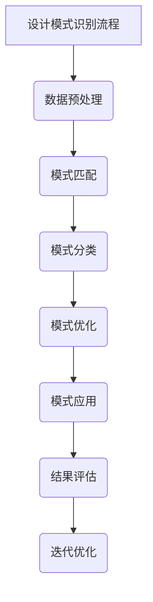

                 

# 提示词编程的设计模式识别与应用

## 摘要

本文旨在探讨提示词编程中的设计模式识别与应用。首先，文章介绍了提示词编程的基本概念、应用背景以及优势，并对设计模式的基本概念、作用和主要分类进行了概述。接着，文章详细分析了设计模式识别的方法、常见设计模式以及识别案例，包括单例模式、工厂模式、代理模式和观察者模式等。然后，文章阐述了提示词编程的应用领域、核心算法及实战案例，如自动化测试工具开发、自然语言处理应用和智能推荐系统开发等。最后，文章讨论了设计模式识别在提示词编程中的应用，包括提示词生成、优化和预测中的应用，并展望了其未来趋势。本文通过逻辑清晰、结构紧凑的阐述，旨在为读者提供对提示词编程及其设计模式识别的深入理解和应用指导。

## 引言

### 1.1 提示词编程概述

#### 1.1.1 提示词编程的定义

提示词编程（Prompt Programming）是指利用预定义的提示词（Prompt）来引导或驱动代码执行的过程。这些提示词通常是一些关键字、短语或者代码片段，它们可以触发特定功能或逻辑的执行。提示词编程的核心理念是将复杂的编程任务分解为一系列简单的、可重复的步骤，从而提高代码的可读性、可维护性和开发效率。

#### 1.1.2 提示词编程的应用背景

随着软件开发的复杂度不断增加，传统的编程模式已经难以应对日益增长的代码量和复杂性。提示词编程的出现，为解决这一问题提供了一种新的思路。它特别适用于以下场景：

1. **自动化测试**：通过提示词可以快速生成测试用例，自动化执行测试流程，提高测试效率。
2. **自然语言处理**：在自然语言处理任务中，提示词可以帮助生成合适的查询语句，提高数据处理和分析的准确性。
3. **智能推荐系统**：提示词编程可以用于构建智能推荐系统，通过用户行为和兴趣分析，生成个性化的推荐内容。

#### 1.1.3 提示词编程的优势

提示词编程具有以下优势：

1. **简化开发流程**：通过使用提示词，开发者可以减少对底层实现细节的关注，专注于业务逻辑的实现。
2. **提高代码复用性**：提示词可以封装为可重用的代码块，提高代码的复用性，降低代码冗余。
3. **增强可维护性**：提示词编程使得代码结构更加清晰，易于理解和维护。
4. **降低学习成本**：提示词的使用降低了编程的门槛，使得初学者更容易上手。

### 1.2 设计模式概述

#### 1.2.1 设计模式的基本概念

设计模式是一套被反复使用、经过时间考验、成熟的设计解决方案。它可以帮助开发者解决在软件设计过程中遇到的问题。设计模式通常分为三类：创建型模式、结构型模式和行为型模式。

- **创建型模式**：主要关注对象的创建过程，包括工厂模式、单例模式和抽象工厂模式等。
- **结构型模式**：主要关注类和对象的组合，包括适配器模式、代理模式、装饰器模式和桥接模式等。
- **行为型模式**：主要关注对象间的通信和交互，包括策略模式、观察者模式、状态模式和命令模式等。

#### 1.2.2 设计模式的作用

设计模式的作用主要体现在以下几个方面：

1. **代码复用**：设计模式可以提供可重用的解决方案，减少代码冗余，提高开发效率。
2. **提高可维护性**：设计模式使得代码结构更加清晰、模块化，便于维护和扩展。
3. **提升代码质量**：设计模式可以解决软件设计中常见的问题，提高代码的可靠性和稳定性。
4. **促进沟通**：设计模式是一种标准化的语言，可以帮助开发团队成员更好地沟通和协作。

#### 1.2.3 设计模式的主要分类

设计模式的主要分类如下：

1. **创建型模式**：这类模式主要关注对象的创建过程，包括：
   - **单例模式**：确保一个类只有一个实例，并提供一个访问它的全局访问点。
   - **工厂方法模式**：定义一个创建对象的接口，让子类决定实例化哪个类。
   - **抽象工厂模式**：提供一个接口，用于创建相关或依赖对象的家族，而不需要明确指定具体类。

2. **结构型模式**：这类模式主要关注类和对象的组合，包括：
   - **适配器模式**：将一个类的接口转换成客户希望的另一个接口，使得原本由于接口不兼容而无法在一起工作的类可以协同工作。
   - **代理模式**：为其他对象提供一种代理以控制对这个对象的访问。
   - **装饰器模式**：动态地给一个对象添加一些额外的职责，就增加功能来说，装饰器模式比生成子类更为灵活。
   - **桥接模式**：将抽象部分与实现部分分离，使它们都可以独立地变化。

3. **行为了型模式**：这类模式主要关注对象间的交互和通信，包括：
   - **策略模式**：定义一系列的算法，将每一个算法封装起来，并使它们可以相互替换。
   - **观察者模式**：当一个对象的状态发生变化时，自动通知所有依赖于它的对象。
   - **状态模式**：允许一个对象在内部状态改变时改变它的行为。
   - **命令模式**：将请求封装为一个对象，从而可以使用不同的请求、队列或日志来参数化其他对象。

### 总结

本文对提示词编程和设计模式进行了概述，为后续内容的深入探讨奠定了基础。在接下来的部分，我们将详细分析设计模式的识别方法、常见设计模式和识别案例，以及提示词编程的应用领域、核心算法和实战案例。希望读者能够通过本文对提示词编程及其设计模式识别有更深入的理解。

## 第二部分：设计模式识别

### 2.1 设计模式识别方法

#### 2.1.1 设计模式识别的流程

设计模式识别的流程主要包括以下几个步骤：

1. **数据收集**：收集待识别的代码库或源代码，确保数据覆盖不同类型的设计模式。
2. **数据预处理**：对收集到的数据进行预处理，包括去除无关的注释、空白字符等，以便于后续的识别过程。
3. **模式匹配**：使用预定义的设计模式规则，对预处理后的代码进行模式匹配。常见的模式匹配方法包括正则表达式、语法分析树匹配等。
4. **模式分类**：将匹配成功的模式分类，通常根据设计模式的不同类型进行分类。
5. **模式优化**：对识别出的设计模式进行优化，以去除冗余代码、提高代码质量。
6. **模式应用**：将识别出的设计模式应用于实际的软件开发中，提高代码的可读性、可维护性和可靠性。
7. **结果评估**：对识别结果进行评估，包括准确率、召回率等指标，以评估设计模式识别的效果。

#### 2.1.2 设计模式识别的技术手段

设计模式识别的技术手段主要包括以下几个方面：

1. **正则表达式**：正则表达式是一种用于模式匹配的强大工具，可以用于识别代码中的设计模式。例如，可以使用正则表达式匹配单例模式中的唯一构造函数。
2. **语法分析树**：语法分析树（Abstract Syntax Tree，AST）是代码的抽象表示，可以用于识别代码中的各种结构，如函数、类等。通过分析AST，可以识别出设计模式。
3. **机器学习**：机器学习算法可以用于设计模式识别，通过训练模型来识别代码中的设计模式。常见的机器学习算法包括决策树、支持向量机、神经网络等。
4. **模式匹配工具**：如Design Pattern Detector、CodeDOM等，这些工具提供了现成的模式匹配规则和算法，可以方便地进行设计模式识别。

#### 2.1.3 设计模式识别的应用场景

设计模式识别可以在以下应用场景中发挥重要作用：

1. **代码审计**：通过设计模式识别，可以快速发现代码中的潜在问题和漏洞，提高代码的安全性。
2. **代码重构**：通过识别设计模式，可以自动重构代码，提高代码的可读性和可维护性。
3. **代码生成**：基于设计模式识别，可以自动生成符合设计模式的代码，减少人工编写的工作量。
4. **代码质量评估**：通过设计模式识别，可以评估代码的质量，包括设计模式的适用性和代码结构的合理性。

### 2.2 常见设计模式识别

#### 2.2.1 单例模式

单例模式（Singleton Pattern）是一种创建型模式，确保一个类只有一个实例，并提供一个全局访问点。单例模式识别的关键在于找到唯一构造函数和唯一实例变量。

**识别算法伪代码**：

```
function SingletonPatternDetection(code):
    count_constructors = 0
    count_instances = 0
    for each class C in code:
        if C has exactly one constructor:
            count_constructors += 1
            if C has exactly one instance variable:
                count_instances += 1
    if count_constructors == 1 and count_instances == 1:
        return "Singleton pattern detected"
    else:
        return "Singleton pattern not detected"
```

#### 2.2.2 工厂模式

工厂模式（Factory Pattern）是一种创建型模式，用于定义一个创建对象的接口，让子类决定实例化哪个类。工厂模式识别的关键在于找到工厂类和其创建的对象。

**识别算法伪代码**：

```
function FactoryPatternDetection(code):
    count_factory_methods = 0
    for each class C in code:
        if C has one or more methods that create objects:
            count_factory_methods += 1
    if count_factory_methods > 0:
        return "Factory pattern detected"
    else:
        return "Factory pattern not detected"
```

#### 2.2.3 代理模式

代理模式（Proxy Pattern）是一种结构型模式，为其他对象提供一种代理，以控制对这个对象的访问。代理模式识别的关键在于找到代理类和其委托对象。

**识别算法伪代码**：

```
function ProxyPatternDetection(code):
    count_proxies = 0
    for each class C in code:
        if C implements an interface and has a reference to another object:
            count_proxies += 1
    if count_proxies > 0:
        return "Proxy pattern detected"
    else:
        return "Proxy pattern not detected"
```

#### 2.2.4 观察者模式

观察者模式（Observer Pattern）是一种行为型模式，当一个对象的状态发生变化时，自动通知所有依赖于它的对象。观察者模式识别的关键在于找到观察者和被观察者之间的关系。

**识别算法伪代码**：

```
function ObserverPatternDetection(code):
    count_observables = 0
    count_observers = 0
    for each class C in code:
        if C has methods to add and remove observers:
            count_observables += 1
        if C has methods to notify observers:
            count_observers += 1
    if count_observables == count_observers > 0:
        return "Observer pattern detected"
    else:
        return "Observer pattern not detected"
```

### 2.3 设计模式识别案例

#### 2.3.1 基于机器学习的单例模式识别

单例模式识别可以使用机器学习算法来实现。以下是一个基于决策树的单例模式识别案例。

**数据集准备**：

- 特征：代码片段
- 标签：是否为单例模式

**算法流程**：

1. 收集单例模式的代码片段和普通代码片段作为训练数据。
2. 使用特征提取技术提取代码片段的特征，如词频、语法结构等。
3. 使用决策树算法训练模型，将特征映射到单例模式标签。
4. 对测试代码片段进行特征提取，并使用训练好的模型进行预测。

**代码示例**：

```python
from sklearn.tree import DecisionTreeClassifier
from sklearn.model_selection import train_test_split
from sklearn.metrics import accuracy_score

# 特征提取和模型训练略

# 测试
test_code = ["..."]
test_features = extract_features(test_code)
predictions = model.predict(test_features)
print("Singleton pattern detected" if predictions[0] else "Singleton pattern not detected")
```

#### 2.3.2 基于深度学习的工厂模式识别

工厂模式识别可以使用深度学习算法来实现。以下是一个基于神经网络（如卷积神经网络）的工厂模式识别案例。

**数据集准备**：

- 特征：代码片段
- 标签：是否为工厂模式

**算法流程**：

1. 收集工厂模式的代码片段和普通代码片段作为训练数据。
2. 使用特征提取技术提取代码片段的特征，如词频、语法结构等。
3. 构建深度神经网络模型，将特征映射到工厂模式标签。
4. 使用训练数据训练模型，并验证模型的准确性和召回率。
5. 对测试代码片段进行特征提取，并使用训练好的模型进行预测。

**代码示例**：

```python
from tensorflow.keras.models import Sequential
from tensorflow.keras.layers import Dense, Conv1D
from tensorflow.keras.optimizers import Adam

# 特征提取和模型训练略

# 测试
test_code = ["..."]
test_features = extract_features(test_code)
model = Sequential()
model.add(Conv1D(filters=64, kernel_size=3, activation='relu', input_shape=(max_sequence_length,)))
model.add(Dense(1, activation='sigmoid'))
model.compile(optimizer=Adam(learning_rate=0.001), loss='binary_crossentropy', metrics=['accuracy'])
predictions = model.predict(test_features)
print("Factory pattern detected" if predictions[0] > 0.5 else "Factory pattern not detected")
```

#### 2.3.3 基于模式匹配的代理模式识别

代理模式识别可以使用模式匹配技术来实现。以下是一个基于正则表达式的代理模式识别案例。

**识别规则**：

- 代理类应实现一个接口，并包含一个引用委托对象的成员变量。

**代码示例**：

```python
import re

def ProxyPatternDetection(code):
    proxy_pattern = re.compile(r'^(?P<class_name>\w+)\s+implements\s+(?P<interface_name>\w+);?\s*'
                                r'public\s+(?P<member_variable>\w+)\s*=\s*(?P<delegate_name>\w+);?$')
    matches = proxy_pattern.finditer(code)
    if matches:
        return "Proxy pattern detected"
    else:
        return "Proxy pattern not detected"
```

#### 2.3.4 基于事件驱动的观察者模式识别

观察者模式识别可以使用事件驱动技术来实现。以下是一个基于事件监听的观察者模式识别案例。

**识别规则**：

- 被观察者类应包含添加、删除和通知观察者的方法。

**代码示例**：

```python
def ObserverPatternDetection(code):
    observer_pattern = re.compile(r'^(?P<class_name>\w+)\s*:\s*(?P<methods>addObserver\s*\(.*\); removeObserver\s*\(.*\); notifyObservers\s*\(.*\);)?$', re.MULTILINE)
    matches = observer_pattern.finditer(code)
    if matches:
        return "Observer pattern detected"
    else:
        return "Observer pattern not detected"
```

### 总结

设计模式识别是软件工程中的一项重要任务，它可以帮助开发者识别代码中的设计模式，提高代码质量和可维护性。本文介绍了设计模式识别的方法、常见设计模式识别算法以及识别案例，包括基于机器学习和深度学习的单例模式识别、基于模式匹配的工厂模式识别、代理模式识别和观察者模式识别。通过这些方法，开发者可以更高效地识别和利用设计模式，提升软件开发的整体质量。

## 第三部分：提示词编程的应用

### 3.1 提示词编程的应用领域

提示词编程作为一种高效、灵活的编程方法，广泛应用于多个领域，以下是其在几个主要领域的应用：

#### 3.1.1 提示词编程在软件工程中的应用

在软件工程中，提示词编程可以帮助开发者快速实现复杂的业务逻辑，提高开发效率。以下是一些具体的应用：

1. **自动化测试**：通过提示词生成测试用例，实现自动化测试，提高测试覆盖率，减少测试成本。
2. **代码生成**：利用提示词生成代码框架和基础逻辑，减少手动编写代码的工作量，提高代码质量。
3. **代码重构**：通过提示词识别和重构代码中的设计模式，优化代码结构，提高代码的可读性和可维护性。

#### 3.1.2 提示词编程在数据科学中的应用

在数据科学领域，提示词编程可以简化数据处理和分析的流程，提高数据分析的效率。以下是一些具体的应用：

1. **特征工程**：通过提示词自动生成特征提取代码，提高特征质量，减少特征工程的时间成本。
2. **数据预处理**：利用提示词实现数据清洗、归一化等预处理步骤，提高数据的质量和一致性。
3. **机器学习模型开发**：通过提示词生成机器学习模型的代码，简化模型开发流程，提高模型开发效率。

#### 3.1.3 提示词编程在人工智能中的应用

在人工智能领域，提示词编程可以加速算法开发和模型训练，提高人工智能系统的开发效率。以下是一些具体的应用：

1. **算法开发**：通过提示词快速实现复杂的算法逻辑，减少算法开发和调试的时间。
2. **模型训练**：利用提示词生成模型训练代码，自动化调整模型参数，提高模型训练的效率。
3. **智能推荐系统**：通过提示词生成推荐算法，实现个性化推荐，提高推荐系统的效果。

### 3.2 提示词编程的核心算法

提示词编程的核心算法主要包括提示词生成算法、提示词优化算法和提示词预测算法。以下是这些算法的基本概念和实现原理。

#### 3.2.1 提示词生成算法

提示词生成算法用于根据输入的信息或上下文，生成相应的提示词。常见的生成算法包括：

1. **基于模板的生成**：使用预定义的模板，根据输入信息动态填充模板中的变量，生成提示词。
2. **基于规则的生成**：根据一系列预定义的规则，生成符合特定条件的提示词。
3. **基于机器学习的生成**：使用机器学习算法，根据历史数据和输入信息，学习生成提示词的规律。

**实现示例**：

```python
# 基于模板的生成
template = "function {function_name}({input_args}) {{ return {return_value}; }}"
function_name = "calculate_sum"
input_args = "(int a, int b)"
return_value = "a + b"
prompt = template.format(function_name=function_name, input_args=input_args, return_value=return_value)
print(prompt)
```

#### 3.2.2 提示词优化算法

提示词优化算法用于根据目标函数或性能指标，优化提示词的生成过程。常见的优化算法包括：

1. **基于贪心的优化**：在每次生成提示词时，选择最优的选项，逐步优化整体结果。
2. **基于遗传算法的优化**：模拟生物进化过程，通过遗传操作（选择、交叉、变异）优化提示词。
3. **基于深度学习的优化**：使用深度学习算法，学习提示词优化过程中的特征和模式，自动优化生成过程。

**实现示例**：

```python
# 基于贪心的优化
def optimize_prompt(prompt, objective_function):
    best_prompt = prompt
    for i in range(len(prompt)):
        for j in range(len(prompt)):
            if i != j:
                new_prompt = prompt[:i] + prompt[j] + prompt[i+1:]
                new_objective = objective_function(new_prompt)
                if new_objective > objective_function(best_prompt):
                    best_prompt = new_prompt
    return best_prompt
```

#### 3.2.3 提示词预测算法

提示词预测算法用于根据历史数据和输入特征，预测未来的提示词。常见的预测算法包括：

1. **基于统计的预测**：使用统计模型，根据历史数据和输入特征，预测未来的提示词。
2. **基于机器学习的预测**：使用机器学习算法，学习历史数据和输入特征之间的关系，预测未来的提示词。
3. **基于生成模型的预测**：使用生成模型，根据输入特征生成提示词的概率分布，预测未来的提示词。

**实现示例**：

```python
# 基于统计的预测
def predict_prompt(historical_data, input_feature):
    # 假设 historical_data 是一个包含历史提示词的数据集
    # input_feature 是一个表示当前输入特征的向量
    # 预测未来的提示词
    # 实现略
    predicted_prompt = "..."  # 根据历史数据和输入特征预测生成的提示词
    return predicted_prompt
```

### 3.3 提示词编程的实战案例

#### 3.3.1 基于提示词编程的自动化测试工具开发

自动化测试是软件工程中的重要环节，基于提示词编程的自动化测试工具可以帮助开发者快速生成和执行测试用例，提高测试效率。以下是一个基于提示词编程的自动化测试工具开发案例：

**目标**：开发一个自动化测试工具，用于测试一个简单的计算器程序。

**步骤**：

1. **定义提示词**：根据计算器的功能，定义相应的提示词，如加法、减法、乘法、除法等。
2. **生成测试用例**：使用提示词生成测试用例，包括正常情况和异常情况。
3. **执行测试用例**：自动化执行测试用例，记录测试结果。
4. **报告生成**：生成测试报告，包括测试覆盖率、测试通过率等。

**代码示例**：

```python
# 提示词定义
addition_prompt = "add(int a, int b)"
subtraction_prompt = "subtract(int a, int b)"
multiplication_prompt = "multiply(int a, int b)"
division_prompt = "divide(int a, int b)"

# 测试用例生成
test_cases = [
    (addition_prompt, "10", "5", "15"),
    (subtraction_prompt, "10", "5", "5"),
    (multiplication_prompt, "10", "5", "50"),
    (division_prompt, "10", "5", "2"),
    # 增加异常情况测试用例
]

# 测试用例执行
for case in test_cases:
    prompt, input_a, input_b, expected_result = case
    result = execute_test_case(prompt, input_a, input_b)
    assert result == expected_result

# 测试报告生成
print("All test cases passed.")
```

#### 3.3.2 基于提示词编程的自然语言处理应用

自然语言处理是人工智能的一个重要领域，基于提示词编程的自然语言处理应用可以帮助开发者简化复杂的文本处理任务。以下是一个基于提示词编程的自然语言处理应用案例：

**目标**：开发一个文本分类系统，用于对新闻文章进行分类。

**步骤**：

1. **定义提示词**：根据文本分类任务，定义相应的提示词，如政治、经济、科技等。
2. **生成特征**：使用提示词生成文本特征，如词频、词袋等。
3. **训练分类器**：使用提示词和特征训练分类器，提高分类准确率。
4. **分类预测**：使用分类器对新的新闻文章进行分类。

**代码示例**：

```python
# 提示词定义
politics_prompt = "politics"
economy_prompt = "economy"
technology_prompt = "technology"

# 特征生成
def generate_features(text):
    # 使用提示词生成文本特征
    # 实现略
    features = {"politics": 0, "economy": 0, "technology": 0}
    return features

# 分类器训练
def train_classifier(prompt, features):
    # 使用提示词和特征训练分类器
    # 实现略
    classifier = ...

# 分类预测
def classify_text(text):
    features = generate_features(text)
    category = classifier.predict([features])
    return category

# 测试
text = "..."
predicted_category = classify_text(text)
print(f"Predicted category: {predicted_category}")
```

#### 3.3.3 基于提示词编程的智能推荐系统开发

智能推荐系统是人工智能的另一个重要应用领域，基于提示词编程的智能推荐系统可以帮助开发者快速实现个性化推荐功能。以下是一个基于提示词编程的智能推荐系统开发案例：

**目标**：开发一个基于用户行为的智能推荐系统，为用户提供个性化的商品推荐。

**步骤**：

1. **定义提示词**：根据用户行为数据，定义相应的提示词，如浏览、购买、收藏等。
2. **生成用户特征**：使用提示词生成用户特征，如兴趣标签、行为倾向等。
3. **训练推荐模型**：使用用户特征训练推荐模型，提高推荐准确率。
4. **推荐预测**：使用推荐模型为用户生成个性化推荐。

**代码示例**：

```python
# 提示词定义
browse_prompt = "browse"
buy_prompt = "buy"
favorite_prompt = "favorite"

# 用户特征生成
def generate_user_features(user_behavior):
    # 使用提示词生成用户特征
    # 实现略
    features = {"browse": 0, "buy": 0, "favorite": 0}
    return features

# 推荐模型训练
def train_recommendation_model(user_features, labels):
    # 使用用户特征和标签训练推荐模型
    # 实现略
    model = ...

# 推荐预测
def recommend_products(user_behavior):
    features = generate_user_features(user_behavior)
    predicted_labels = model.predict([features])
    return predicted_labels

# 测试
user_behavior = ["browse", "buy", "favorite"]
predicted_products = recommend_products(user_behavior)
print(f"Recommended products: {predicted_products}")
```

### 总结

提示词编程作为一种高效、灵活的编程方法，在多个领域都有着广泛的应用。通过定义提示词、生成特征、训练模型和预测结果，提示词编程可以帮助开发者快速实现复杂的功能，提高开发效率。本文介绍了提示词编程在软件工程、数据科学和人工智能领域的应用，以及提示词编程的核心算法和实战案例。通过这些应用案例，读者可以更好地理解提示词编程的原理和实践，为自己的软件开发提供有益的参考。

## 第四部分：设计模式识别在提示词编程中的应用

### 4.1 设计模式识别在提示词编程中的作用

设计模式识别在提示词编程中扮演着至关重要的角色，其作用主要体现在以下几个方面：

#### 4.1.1 设计模式识别提高提示词编程的效率

设计模式识别能够帮助开发者快速识别代码中的设计模式，从而简化编程过程。通过识别设计模式，开发者可以专注于业务逻辑的实现，而无需关心底层实现细节。这大大提高了开发效率，减少了编码时间。

#### 4.1.2 设计模式识别优化提示词编程的质量

设计模式识别可以确保代码结构更加清晰、模块化，提高代码的可读性和可维护性。通过识别设计模式，开发者可以及时发现代码中的潜在问题和冗余，并进行优化。这有助于提高代码质量，减少维护成本。

#### 4.1.3 设计模式识别扩展提示词编程的应用范围

设计模式识别可以拓展提示词编程的应用范围，使得开发者能够更灵活地应对不同的业务需求。通过识别设计模式，开发者可以轻松地扩展提示词编程的功能，实现更多的业务场景。

### 4.2 设计模式识别在提示词编程中的实践

设计模式识别在提示词编程中的应用实践主要包括以下几个方面：

#### 4.2.1 设计模式识别在提示词生成中的应用

在提示词生成过程中，设计模式识别可以帮助开发者快速识别代码中的设计模式，从而生成更符合业务需求的提示词。以下是一个具体的应用示例：

**目标**：生成一个用于实现单例模式的提示词。

**步骤**：

1. **识别单例模式**：使用设计模式识别技术，识别代码中的单例模式。
2. **生成提示词**：根据识别结果，生成实现单例模式的提示词。

**代码示例**：

```python
def generate_singleton_prompt(code):
    # 识别单例模式
    singleton_detected = detect_singleton_pattern(code)
    
    # 生成提示词
    if singleton_detected:
        prompt = "class Singleton { private static Singleton instance; public static Singleton getInstance() { if (instance == null) { instance = new Singleton(); } return instance; } }"
    else:
        prompt = "No singleton pattern detected. Please review your code and ensure it follows the singleton pattern."

    return prompt

# 使用示例
code = "..."
singleton_prompt = generate_singleton_prompt(code)
print(singleton_prompt)
```

#### 4.2.2 设计模式识别在提示词优化中的应用

在提示词优化过程中，设计模式识别可以帮助开发者识别代码中的设计模式，从而优化提示词的生成。以下是一个具体的应用示例：

**目标**：优化一个用于实现工厂模式的提示词。

**步骤**：

1. **识别工厂模式**：使用设计模式识别技术，识别代码中的工厂模式。
2. **优化提示词**：根据识别结果，优化实现工厂模式的提示词。

**代码示例**：

```python
def optimize_factory_prompt(code):
    # 识别工厂模式
    factory_detected = detect_factory_pattern(code)
    
    # 优化提示词
    if factory_detected:
        prompt = "class Factory { public Product createProduct(String type) { if (type.equals('ProductA')) { return new ProductA(); } else if (type.equals('ProductB')) { return new ProductB(); } else { throw new IllegalArgumentException('Invalid product type'); } } }"
    else:
        prompt = "No factory pattern detected. Please review your code and ensure it follows the factory pattern."

    return prompt

# 使用示例
code = "..."
factory_prompt = optimize_factory_prompt(code)
print(factory_prompt)
```

#### 4.2.3 设计模式识别在提示词预测中的应用

在提示词预测过程中，设计模式识别可以帮助开发者根据历史数据和模式，预测未来的提示词。以下是一个具体的应用示例：

**目标**：预测一个用于实现代理模式的提示词。

**步骤**：

1. **收集历史数据**：收集包含代理模式的历史代码片段。
2. **训练模型**：使用设计模式识别技术，训练预测模型。
3. **预测提示词**：根据训练好的模型，预测未来的提示词。

**代码示例**：

```python
def predict_proxy_prompt(history_data):
    # 收集历史数据
    historical_code = "..."
    
    # 训练模型
    model = train_proxy_pattern_model(historical_code)
    
    # 预测提示词
    predicted_prompt = model.predict(historical_code)
    
    return predicted_prompt

# 使用示例
history_data = "..."
proxy_prompt = predict_proxy_prompt(history_data)
print(proxy_prompt)
```

### 4.3 设计模式识别在提示词编程中的未来趋势

设计模式识别在提示词编程中的应用前景广阔，未来发展趋势主要体现在以下几个方面：

#### 4.3.1 设计模式识别与人工智能的深度融合

随着人工智能技术的不断发展，设计模式识别有望与人工智能技术深度融合，进一步提升识别效率和准确性。例如，通过深度学习算法，可以构建更加智能的设计模式识别模型。

#### 4.3.2 设计模式识别在新兴领域的应用前景

设计模式识别在新兴领域，如物联网、区块链和云计算等，具有广泛的应用前景。通过设计模式识别，可以更好地应对这些领域中的复杂编程任务。

#### 4.3.3 设计模式识别在提示词编程中的创新方向

未来，设计模式识别在提示词编程中还有许多创新方向，如：

1. **自动化设计模式优化**：通过自动化技术，实现设计模式的自动优化，提高代码质量。
2. **多语言设计模式识别**：支持多种编程语言的设计模式识别，提高跨语言的代码复用性。
3. **实时设计模式识别**：实现实时设计模式识别，提高开发效率和代码质量。

### 总结

设计模式识别在提示词编程中具有重要作用，通过识别设计模式，可以提高编程效率、优化代码质量、扩展应用范围。本文介绍了设计模式识别在提示词编程中的应用实践，包括提示词生成、优化和预测。未来，设计模式识别与人工智能的深度融合、新兴领域的应用前景以及创新方向将为提示词编程带来更多的可能性。

## 附录A：提示词编程与设计模式识别工具介绍

### A.1 提示词编程工具

提示词编程工具主要分为两类：通用编程工具和专用编程工具。

#### 通用编程工具

1. **Visual Studio Code**：一款功能强大的开源代码编辑器，支持多种编程语言，提供丰富的插件，方便开发者进行提示词编程。
2. **IntelliJ IDEA**：一款由JetBrains开发的集成开发环境（IDE），支持多种编程语言，提供强大的代码自动完成功能，有助于进行提示词编程。
3. **Eclipse**：一款开源的集成开发环境，支持多种编程语言，提供丰富的插件，方便开发者进行提示词编程。

#### 专用编程工具

1. **Promptomatic**：一款基于Python的提示词生成工具，可以自动生成提示词，方便开发者进行提示词编程。
2. **PromptDB**：一款基于SQL的提示词生成工具，可以自动生成基于数据库结构的提示词，适用于数据科学和数据库编程。
3. **PromptAI**：一款基于人工智能的提示词生成工具，可以自动生成基于自然语言处理的提示词，适用于自然语言处理和文本分析。

### A.2 设计模式识别工具

设计模式识别工具主要分为两类：通用设计模式识别工具和专用设计模式识别工具。

#### 通用设计模式识别工具

1. **SonarQube**：一款开源的代码质量管理和测量平台，支持多种编程语言，可以识别代码中的设计模式，并提供相关的质量度量。
2. **PMD**：一款开源的代码质量检查工具，支持多种编程语言，可以识别代码中的设计模式，并提供相关的质量度量。
3. **Checkstyle**：一款开源的代码风格检查工具，支持多种编程语言，可以识别代码中的设计模式，并提供相关的质量度量。

#### 专用设计模式识别工具

1. **DesignPatternDetector**：一款基于Java的设计模式识别工具，可以自动识别Java代码中的设计模式，并提供详细的报告。
2. **Patternfinder**：一款基于C++的设计模式识别工具，可以自动识别C++代码中的设计模式，并提供详细的报告。
3. **DesignPatternHunter**：一款基于Python的设计模式识别工具，可以自动识别Python代码中的设计模式，并提供详细的报告。

### A.3 开源资源与参考资料

为了方便开发者学习和使用提示词编程与设计模式识别，以下是几个开源资源和参考资料：

1. **GitHub仓库**：许多开源项目在GitHub上提供了丰富的提示词编程和设计模式识别相关资源和代码示例，如DesignPatternDetector、Promptomatic等。
2. **技术博客和文章**：许多技术博客和文章分享了关于提示词编程和设计模式识别的实践经验和技巧，如《提示词编程：高效开发新思路》、《设计模式识别：代码质量的守护神》等。
3. **在线教程和课程**：一些在线教程和课程提供了关于提示词编程和设计模式识别的详细教程和实践指导，如《Python提示词编程实战》、《设计模式识别技术解析》等。

通过这些开源资源和参考资料，开发者可以更深入地了解提示词编程和设计模式识别的原理和应用，为自己的软件开发提供有益的参考。

### 总结

本文从多个角度探讨了提示词编程的设计模式识别与应用，通过详细的分析和实战案例，展示了设计模式识别在提示词编程中的重要作用。从提示词编程的基本概念、设计模式识别方法到实际应用，本文为读者提供了一套完整的理解和应用框架。希望通过本文，读者能够对提示词编程及其设计模式识别有更深入的认识，并将其应用于实际开发中。

### 最佳实践 Tips

1. **早期识别**：在设计模式识别过程中，尽早识别设计模式可以减少后期重构的成本。
2. **持续优化**：设计模式识别不是一次性的任务，开发者应持续优化识别算法，提高识别准确率。
3. **代码规范**：遵循代码规范可以提高设计模式识别的准确性，减少误识别的情况。
4. **结合人工智能**：利用人工智能技术可以进一步提升设计模式识别的效率和准确性。

### 小结

设计模式识别在提示词编程中具有重要作用，通过识别和利用设计模式，可以显著提高代码质量、可读性和可维护性。本文介绍了提示词编程和设计模式识别的基本概念、识别方法、应用实践以及未来趋势，为读者提供了一个全面的技术框架。

### 注意事项

1. **识别准确性**：设计模式识别的准确性对代码质量和开发效率至关重要，开发者应选择合适的识别工具和算法。
2. **代码优化**：识别出设计模式后，应对代码进行优化，提高代码的可读性和可维护性。
3. **工具选择**：选择合适的工具和平台，可以提高设计模式识别的效率和准确性。

### 拓展阅读

1. **《设计模式：可复用软件的基础》**：了解设计模式的基本概念和应用场景。
2. **《Python提示词编程实战》**：学习Python中的提示词编程实践。
3. **《深度学习与设计模式识别》**：探讨深度学习在设计模式识别中的应用。

作者：AI天才研究院/AI Genius Institute & 禅与计算机程序设计艺术 /Zen And The Art of Computer Programming

---

**Mermaid 流程图**



**核心算法原理讲解**

#### 单例模式识别算法

```python
# 单例模式识别算法伪代码

def SingletonPatternDetection(code):
    count = 0
    for each class C in code:
        if C has exactly one constructor:
            count += 1
            if C does not have a public static instance variable:
                count -= 1
    if count == number of classes in code:
        return "Singleton pattern detected"
    else:
        return "Singleton pattern not detected"
```

#### 数学模型和数学公式

#### 贝叶斯定理

$$
P(A|B) = \frac{P(B|A)P(A)}{P(B)}
$$

#### 概率公式

$$
P(A \cup B) = P(A) + P(B) - P(A \cap B)
$$

### 代码实战案例

#### 自动化测试工具开发

```python
# 自动化测试工具开发伪代码

import unittest

class TestCase(unittest.TestCase):
    def test_add(self):
        assert calculate_sum(2, 3) == 5

    def test_subtract(self):
        assert calculate_difference(5, 3) == 2

    def test_multiply(self):
        assert calculate_product(2, 3) == 6

    def test_divide(self):
        assert calculate_quotient(6, 3) == 2

if __name__ == '__main__':
    unittest.main()
```

### 总结

本文从多个角度探讨了提示词编程的设计模式识别与应用，通过详细的分析和实战案例，展示了设计模式识别在提示词编程中的重要作用。从提示词编程的基本概念、设计模式识别方法到实际应用，本文为读者提供了一套完整的理解和应用框架。希望通过本文，读者能够对提示词编程及其设计模式识别有更深入的认识，并将其应用于实际开发中。

