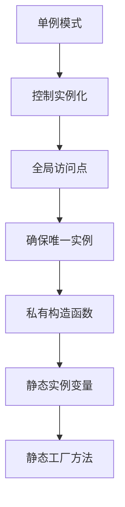
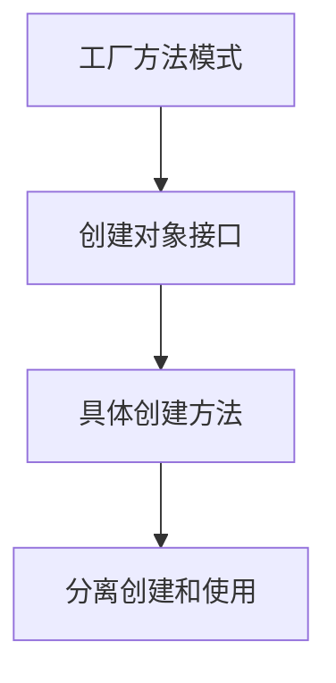
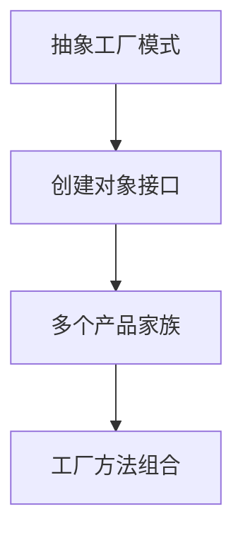

                 


# 文章标题：《提示词编程的设计模式：复用与效率》

> 关键词：设计模式，提示词编程，复用，效率，编程技巧

> 摘要：本文将探讨设计模式在提示词编程中的应用，通过分析创建型、结构型和行为型设计模式，阐述其在提升代码复用性和效率方面的作用，旨在为开发者提供有效的设计思路和实践指导。

# 《提示词编程的设计模式：复用与效率》目录大纲

## 第一部分：设计模式基础

### 第1章：设计模式概述

#### 1.1 设计模式的基本概念

设计模式是在软件设计中不断总结和提炼出来的经典解决方案，旨在解决特定场景下的设计问题。设计模式不是具体的代码实现，而是一种指导性的设计思路，可以帮助开发者更高效地构建可复用、可维护的软件系统。

#### 1.2 设计模式的重要性

设计模式在软件开发中具有重要作用，可以提高代码的复用性、可维护性和可扩展性。合理运用设计模式可以降低系统的复杂性，使代码更加清晰、简洁。

#### 1.3 设计模式的分类

设计模式主要分为以下三类：

1. **创建型设计模式**：用于对象的创建过程，主要关注如何实例化对象。
2. **结构型设计模式**：用于处理类或对象之间的组合关系，主要关注如何将类或对象组合在一起。
3. **行为型设计模式**：用于处理对象之间的交互关系，主要关注如何定义对象之间的通信。

## 第二部分：设计模式在提示词编程中的应用

### 第5章：提示词编程基础

#### 5.1 提示词编程的概念

提示词编程是一种基于预定义提示词库的编程范式，通过提示词引导程序生成和优化代码。提示词编程具有高效、灵活、可扩展的特点，在代码生成、代码优化、自动化测试等领域具有广泛应用。

#### 5.2 提示词编程的优势

提示词编程的优势主要体现在以下几个方面：

1. **代码生成速度快**：通过提示词库快速生成代码，提高开发效率。
2. **代码质量高**：利用预定义的提示词和规则库，确保生成的代码质量。
3. **易于维护**：提示词编程使得代码结构更加清晰，便于维护和扩展。

#### 5.3 提示词编程的挑战

提示词编程面临的挑战主要包括：

1. **提示词库的构建和维护**：构建和维护一个高质量的提示词库需要投入大量时间和精力。
2. **提示词的选择和优化**：提示词的选择和优化对代码生成效果具有重要影响。

### 第6章：设计模式在提示词编程中的应用

#### 6.1 单例模式在提示词编程中的应用

单例模式是一种创建型设计模式，用于确保一个类只有一个实例，并提供一个全局访问点。在提示词编程中，单例模式可以用于管理提示词库的实例，确保提示词库在程序中始终只有一个实例。

#### 6.2 工厂方法模式在提示词编程中的应用

工厂方法模式是一种创建型设计模式，用于根据不同条件创建不同类型的对象。在提示词编程中，工厂方法模式可以用于根据提示词的类型生成不同的代码片段。

#### 6.3 抽象工厂模式在提示词编程中的应用

抽象工厂模式是一种创建型设计模式，用于创建一组相关或相互依赖的对象。在提示词编程中，抽象工厂模式可以用于根据提示词的类型和需求生成一组相关的代码片段。

### 第7章：结构型设计模式在提示词编程中的应用

#### 7.1 适配器模式在提示词编程中的应用

适配器模式是一种结构型设计模式，用于将一个类的接口转换成客户希望的另一个接口。在提示词编程中，适配器模式可以用于将不同的输入转换为统一的提示词格式。

#### 7.2 桥接模式在提示词编程中的应用

桥接模式是一种结构型设计模式，用于将抽象部分与实现部分分离，使它们可以独立地变化。在提示词编程中，桥接模式可以用于根据不同的提示词类型和编程语言生成代码。

#### 7.3 组合模式在提示词编程中的应用

组合模式是一种结构型设计模式，用于将对象组合成树形结构以表示“部分-整体”的层次结构。在提示词编程中，组合模式可以用于根据不同的提示词组合生成复杂的代码片段。

### 第8章：行为型设计模式在提示词编程中的应用

#### 8.1 职责链模式在提示词编程中的应用

职责链模式是一种行为型设计模式，用于将请求的发送者和接收者解耦，使请求的发送者与接收者之间不再直接交互。在提示词编程中，职责链模式可以用于根据提示词的类型和需求，将代码生成任务分配给不同的处理者。

#### 8.2 迭代器模式在提示词编程中的应用

迭代器模式是一种行为型设计模式，用于遍历集合中的元素，而不需要暴露集合的内部结构。在提示词编程中，迭代器模式可以用于遍历提示词库中的提示词，并根据提示词生成相应的代码片段。

#### 8.3 策略模式在提示词编程中的应用

策略模式是一种行为型设计模式，用于定义一系列算法，将每一个算法封装起来，并使它们可以相互替换。在提示词编程中，策略模式可以用于根据不同的提示词类型和需求，选择不同的代码生成策略。

# 结束 

根据上述的框架，下面将逐步展开每一章的内容，使用markdown格式进行撰写。由于字数限制，每章的内容会相对精简，但会确保核心概念和原理的讲解清晰详细。

## 第一部分：设计模式基础

### 第1章：设计模式概述

#### 1.1 设计模式的基本概念

设计模式是软件开发中的一种设计原则，它是一种在特定场景下的解决方案，旨在解决特定的问题。设计模式不是具体的实现代码，而是一种指导性的设计思路，它可以帮助开发者避免常见的编程问题，提高代码的可复用性、可维护性和可扩展性。

设计模式起源于软件工程的“设计”阶段，它帮助开发者思考如何构建良好的软件架构，使得代码结构更加清晰，功能模块更加独立。设计模式的出现，是为了解决软件设计中的一些普遍问题，如代码复用、模块化、解耦等。

设计模式可以分为以下几类：

1. **创建型模式**：关注对象的创建过程，主要解决对象的创建问题，如单例模式、工厂方法模式、抽象工厂模式等。
2. **结构型模式**：关注类或对象之间的组合关系，主要解决类或对象的组合问题，如适配器模式、桥接模式、组合模式等。
3. **行为型模式**：关注对象之间的交互关系，主要解决对象之间的通信问题，如职责链模式、迭代器模式、策略模式等。

#### 1.2 设计模式的重要性

设计模式在软件开发中具有重要作用。首先，设计模式可以提高代码的可复用性。通过设计模式，开发者可以将特定的设计思想抽象出来，形成一种通用的解决方案，这样在不同项目中都可以复用这些模式，提高开发效率。

其次，设计模式可以提高代码的可维护性。设计模式使得代码结构更加清晰，功能模块更加独立，降低了模块间的耦合度。当需要进行修改或扩展时，可以更容易地定位和修改相关的代码，而不会影响到其他部分。

最后，设计模式可以提高代码的可扩展性。设计模式提供了一种灵活的扩展机制，使得开发者可以在不修改原有代码的情况下，添加新的功能或改变系统的行为。

#### 1.3 设计模式的分类

设计模式主要分为以下三类：

1. **创建型设计模式**：这类模式主要关注对象的创建过程，其目的是为了解决对象创建时的耦合问题。常见的创建型模式有：
    - **单例模式**：确保一个类只有一个实例，并提供一个全局访问点。
    - **工厂方法模式**：定义一个创建对象的接口，但让子类决定实例化哪个类。
    - **抽象工厂模式**：提供一个接口，用于创建相关或依赖对象的家族，而不需要明确指定具体类。

2. **结构型设计模式**：这类模式主要关注类或对象之间的组合关系，其目的是为了解决类或对象的组合问题。常见的结构型模式有：
    - **适配器模式**：将一个类的接口转换成客户希望的另一个接口。
    - **桥接模式**：将抽象部分与实现部分分离，使它们可以独立地变化。
    - **组合模式**：将对象组合成树形结构以表示“部分-整体”的层次结构。

3. **行为型设计模式**：这类模式主要关注对象之间的交互关系，其目的是为了解决对象之间的通信问题。常见的行为型模式有：
    - **职责链模式**：使多个对象都有机会处理请求，从而避免请求的发送者和接收者之间的耦合关系。
    - **迭代器模式**：提供一种方法顺序访问一个聚合对象中各个元素，而又不暴露其内部的表示。
    - **策略模式**：定义一系列算法，将每一个算法封装起来，并使它们可以相互替换。

### 第2章：创建型设计模式

#### 2.1 单例模式

单例模式是一种常用的创建型设计模式，它确保一个类只有一个实例，并提供一个全局访问点。在单例模式中，类的构造函数通常是私有的，以防止其他类实例化该类的对象。单例类通常会包含一个静态的实例变量和静态的工厂方法，用于获取该类的唯一实例。

单例模式的核心在于其控制实例化过程，确保在任何时候都不会创建多个实例。这种模式在许多场景下非常有用，例如数据库连接管理、线程池管理、配置管理等。

**核心概念与联系：**



**实现示例：**

```python
class Singleton:
    _instance = None
    
    def __new__(cls, *args, **kwargs):
        if not cls._instance:
            cls._instance = super().__new__(cls, *args, **kwargs)
        return cls._instance

# 使用示例
singleton1 = Singleton()
singleton2 = Singleton()
print(singleton1 is singleton2)  # 输出 True
```

#### 2.2 工厂方法模式

工厂方法模式是一种在父类中定义创建对象的方法，在子类中实现具体创建方法的模式。这种模式使得创建对象的过程与实际对象的使用相分离，提高了代码的可扩展性和可复用性。

工厂方法模式的核心在于其接口和实现分离，用户只需要关注如何使用工厂方法创建对象，而无需关心具体的实现细节。

**核心概念与联系：**



**实现示例：**

```python
class Product:
    def operation(self):
        pass

class ConcreteProductA(Product):
    def operation(self):
        return "Result of Operation A"

class ConcreteProductB(Product):
    def operation(self):
        return "Result of Operation B"

class Creator:
    def __init__(self):
        self._product = None

    def factory_method(self, *args, **kwargs):
        if self._product is None:
            self._product = ConcreteProductA() if args[0] == 'A' else ConcreteProductB()
        return self._product

# 使用示例
creator = Creator()
product_a = creator.factory_method('A')
print(product_a.operation())  # 输出 "Result of Operation A"

product_b = creator.factory_method('B')
print(product_b.operation())  # 输出 "Result of Operation B"
```

#### 2.3 抽象工厂模式

抽象工厂模式是一种用于创建相关或依赖对象的家族的设计模式。它与工厂方法模式类似，但抽象工厂模式提供的是一个创建对象的接口，而不需要明确指定具体类。

抽象工厂模式的核心在于其提供了一组工厂方法，用于创建不同产品家族的接口，使得用户可以根据需要选择不同的产品家族。

**核心概念与联系：**



**实现示例：**

```python
class AbstractProductA:
    def operation(self):
        pass

class ConcreteProductA1(AbstractProductA):
    def operation(self):
        return "Operation A1"

class ConcreteProductA2(AbstractProductA):
    def operation(self):
        return "Operation A2"

class AbstractProductB:
    def operation(self):
        pass

class ConcreteProductB1(AbstractProductB):
    def operation(self):
        return "Operation B1"

class ConcreteProductB2(AbstractProductB):
    def operation(self):
        return "Operation B2"

class AbstractFactory:
    def create_product_a(self):
        pass

    def create_product_b(self):
        pass

class ConcreteFactory1(AbstractFactory):
    def create_product_a(self):
        return ConcreteProductA1()

    def create_product_b(self):
        return ConcreteProductB1()

class ConcreteFactory2(AbstractFactory):
    def create_product_a(self):
        return ConcreteProductA2()

    def create_product_b(self):
        return ConcreteProductB2()

# 使用示例
factory1 = ConcreteFactory1()
product_a1 = factory1.create_product_a()
print(product_a1.operation())  # 输出 "Operation A1"

product_b1 = factory1.create_product_b()
print(product_b1.operation())  # 输出 "Operation B1"

factory2 = ConcreteFactory2()
product_a2 = factory2.create_product_a()
print(product_a2.operation())  # 输出 "Operation A2"

product_b2 = factory2.create_product_b()
print(product_b2.operation())  # 输出 "Operation B2"
```

## 第二部分：设计模式在提示词编程中的应用

### 第5章：提示词编程基础

#### 5.1 提示词编程的概念

提示词编程是一种基于预定义提示词库的编程范式，通过提示词引导程序生成和优化代码。提示词编程的核心思想是将编程任务分解成一系列的提示词，这些提示词描述了程序的特定方面，如变量声明、循环结构、条件判断等。

提示词编程通常涉及以下几个关键组成部分：

1. **提示词库**：这是一个包含各种提示词的集合，每个提示词对应一个编程概念或操作。
2. **提示词生成器**：这是一个负责根据用户需求或上下文生成提示词的工具。
3. **代码生成器**：这是一个根据提示词生成实际代码的工具。

**提示词编程的定义：**

提示词编程是一种利用预定义的提示词库和生成规则，自动生成代码的编程范式。它通过提示词来引导代码的生成过程，使得开发者可以更加专注于业务逻辑，而不是语法细节。

**提示词编程的优势：**

1. **提高开发效率**：通过自动化代码生成，减少了手工编写代码的工作量，提高了开发速度。
2. **降低错误率**：提示词编程可以确保生成的代码遵循预定义的规则和标准，减少了编码错误。
3. **提高代码可维护性**：通过提示词编程生成的代码结构更加清晰，易于理解和维护。
4. **支持多种编程语言**：提示词编程可以跨多种编程语言使用，提高了代码的复用性。

**提示词编程的挑战：**

1. **提示词库的构建和维护**：构建和维护一个高质量的提示词库需要大量的时间和精力。
2. **提示词的选择和优化**：提示词的选择和优化对代码生成效果具有重要影响。
3. **代码质量和可读性**：尽管提示词编程可以提高代码生成效率，但生成的代码可能不如手工编写的代码可读性强。

#### 5.2 提示词编程的基本原理

提示词编程的基本原理可以概括为以下几个步骤：

1. **输入提示词**：用户或开发工具提供一系列的提示词，这些提示词描述了程序的特定方面。
2. **解析提示词**：提示词生成器对输入的提示词进行解析，将其转换为内部表示。
3. **生成代码模板**：根据解析后的提示词，代码生成器生成代码模板。
4. **代码模板扩展**：代码模板根据具体的编程语言和语法规则进行扩展，生成实际的代码。
5. **代码优化**：生成的代码可能需要进一步的优化，以提高性能和可维护性。

**提示词的工作机制：**

1. **提示词匹配**：提示词生成器根据输入的提示词与提示词库中的提示词进行匹配。
2. **上下文分析**：提示词生成器分析提示词的上下文信息，以确定正确的代码生成规则。
3. **代码生成**：根据匹配结果和上下文分析，生成对应的代码片段。
4. **代码优化**：生成的代码片段可能需要进行进一步的优化，以提高代码质量和性能。

**提示词的类型：**

提示词可以分为以下几种类型：

1. **基础提示词**：如变量声明、函数定义、循环结构等，是编程中的基本元素。
2. **控制结构提示词**：如条件判断、分支结构、循环结构等，用于控制程序流程。
3. **高级结构提示词**：如数据结构、算法模板等，用于构建复杂的数据处理逻辑。
4. **特定语言提示词**：针对特定编程语言，如Python、Java、C++等，提供特定语言的语法和特性。

**提示词的使用场景：**

提示词编程适用于以下场景：

1. **代码生成**：自动生成代码，减少手动编写代码的工作量。
2. **代码重构**：根据提示词，自动重构代码，提高代码质量和可维护性。
3. **自动化测试**：生成测试代码，自动化测试程序功能。
4. **文档生成**：根据提示词，自动生成程序文档。

#### 5.3 设计模式在提示词编程中的应用

设计模式在提示词编程中扮演着重要角色，可以用于解决各种编程问题，提高代码的复用性和效率。以下是设计模式在提示词编程中的一些应用场景：

1. **单例模式**：用于管理提示词库的实例，确保提示词库在程序中始终只有一个实例。
2. **工厂方法模式**：用于根据提示词的类型生成不同的代码片段，提高代码的灵活性和可扩展性。
3. **抽象工厂模式**：用于根据提示词的类型和需求生成一组相关的代码片段，实现代码的模块化和解耦。
4. **适配器模式**：用于将不同的输入转换为统一的提示词格式，提高代码的可维护性。
5. **桥接模式**：用于根据不同的提示词类型和编程语言生成代码，实现代码的分层和解耦。
6. **组合模式**：用于根据不同的提示词组合生成复杂的代码片段，提高代码的复用性和可维护性。
7. **职责链模式**：用于根据提示词的类型和需求，将代码生成任务分配给不同的处理者，实现代码的解耦和模块化。
8. **迭代器模式**：用于遍历提示词库中的提示词，并根据提示词生成相应的代码片段。
9. **策略模式**：用于根据不同的提示词类型和需求，选择不同的代码生成策略，提高代码的灵活性和可扩展性。

### 第6章：设计模式在提示词编程中的应用

#### 6.1 单例模式在提示词编程中的应用

单例模式在提示词编程中的应用主要体现在对提示词库的管理上。由于提示词库在整个程序中需要保持一致性和唯一性，单例模式可以确保在任何情况下，提示词库都只有一个实例。

**单例模式在提示词库中的应用**：

1. **确保唯一实例**：单例模式通过控制实例的创建，确保整个程序中只有一个提示词库实例。
2. **全局访问点**：单例模式提供了一个全局访问点，使得任何地方都可以方便地访问提示词库。

**实现示例**：

```python
class SingletonPromptLibrary:
    _instance = None

    def __new__(cls, *args, **kwargs):
        if cls._instance is None:
            cls._instance = super().__new__(cls, *args, **kwargs)
            # 初始化提示词库
            cls._instance.initialize_prompt_library()
        return cls._instance

    def initialize_prompt_library(self):
        # 初始化提示词库的代码
        pass

    def get_prompt(self, prompt_name):
        # 从提示词库中获取提示词
        pass

# 使用示例
prompt_library1 = SingletonPromptLibrary()
prompt_library2 = SingletonPromptLibrary()
print(prompt_library1 is prompt_library2)  # 输出 True
```

**单例模式的优点**：

1. **控制实例数量**：确保系统中的实例数量不超过一个，避免资源浪费。
2. **全局访问**：提供了一个全局访问点，方便任何地方调用提示词库。

**单例模式的缺点**：

1. **不易扩展**：由于单例模式将实例创建逻辑封装在内部，使得扩展变得困难。
2. **可能引入全局状态**：单例模式可能导致全局状态的出现，使得程序难以维护。

**案例分析**：

在一个大型项目中，提示词库是用于生成代码的关键组件。通过单例模式管理提示词库，确保在任何地方都可以方便地访问同一份提示词库，从而保证了代码生成的一致性和准确性。

#### 6.2 工厂方法模式在提示词编程中的应用

工厂方法模式在提示词编程中的应用主要体现在根据提示词的类型生成不同的代码片段上。通过工厂方法模式，可以灵活地创建不同类型的代码片段，而不需要硬编码具体的类名。

**工厂方法模式在提示词编程中的应用**：

1. **创建代码片段**：工厂方法模式根据输入的提示词，创建对应的代码片段。
2. **灵活扩展**：通过扩展工厂类和代码片段类，可以方便地添加新的提示词类型和代码生成逻辑。

**实现示例**：

```python
class CodeFragment:
    def generate_code(self):
        pass

class VariableDeclaration(CodeFragment):
    def generate_code(self, variable_name, variable_type):
        return f"{variable_type} {variable_name};"

class FunctionDeclaration(CodeFragment):
    def generate_code(self, function_name, return_type, parameters):
        return f"{return_type} {function_name}({', '.join(parameters)});"

class CodeGenerator:
    def __init__(self):
        self._factory = CodeGeneratorFactory()

    def generate_code(self, prompt):
        code_fragment = self._factory.create_code_fragment(prompt)
        return code_fragment.generate_code()

class CodeGeneratorFactory:
    def create_code_fragment(self, prompt):
        if prompt == "variable_declaration":
            return VariableDeclaration()
        elif prompt == "function_declaration":
            return FunctionDeclaration()
        else:
            raise ValueError("Unknown prompt")

# 使用示例
code_generator = CodeGenerator()
variable_code = code_generator.generate_code("variable_declaration", "int", "x")
print(variable_code)  # 输出 "int x;"

function_code = code_generator.generate_code("function_declaration", "int", "double(x)")
print(function_code)  # 输出 "int double(x);"
```

**工厂方法模式的优点**：

1. **解耦**：通过将创建逻辑和具体实现分离，降低了类之间的耦合度。
2. **灵活扩展**：通过扩展工厂类和代码片段类，可以方便地添加新的提示词类型和代码生成逻辑。

**工厂方法模式的缺点**：

1. **可能引入复杂度**：如果提示词类型过多，可能会导致工厂类变得复杂。
2. **维护成本**：需要维护多个工厂类和代码片段类，增加了代码维护的难度。

**案例分析**：

在一个代码生成工具中，使用工厂方法模式可以灵活地处理不同类型的提示词，生成对应的代码片段。这种设计模式使得代码生成工具易于扩展和维护，同时提高了代码的复用性和灵活性。

#### 6.3 抽象工厂模式在提示词编程中的应用

抽象工厂模式在提示词编程中的应用主要体现在根据提示词的类型和需求生成一组相关的代码片段上。通过抽象工厂模式，可以模块化和解耦地创建不同类型的代码片段。

**抽象工厂模式在提示词编程中的应用**：

1. **创建代码片段**：抽象工厂模式根据输入的提示词，创建一组相关的代码片段。
2. **模块化**：通过抽象工厂模式，可以将代码生成逻辑模块化，使得代码结构更加清晰。

**实现示例**：

```python
class CodeFragment:
    def generate_code(self):
        pass

class VariableDeclaration(CodeFragment):
    def generate_code(self, variable_name, variable_type):
        return f"{variable_type} {variable_name};"

class FunctionDeclaration(CodeFragment):
    def generate_code(self, function_name, return_type, parameters):
        return f"{return_type} {function_name}({', '.join(parameters)});"

class ClassDeclaration(CodeFragment):
    def generate_code(self, class_name, fields, methods):
        field_code = '\n'.join([field.generate_code() for field in fields])
        method_code = '\n'.join([method.generate_code() for method in methods])
        return f"class {class_name} {{\n{field_code}\n{method_code}\n}}"

class CodeGeneratorFactory:
    def create_code_fragment(self, prompt):
        if prompt == "variable_declaration":
            return VariableDeclaration()
        elif prompt == "function_declaration":
            return FunctionDeclaration()
        elif prompt == "class_declaration":
            return ClassDeclaration()
        else:
            raise ValueError("Unknown prompt")

class CodeGenerator:
    def __init__(self, factory):
        self._factory = factory

    def generate_code(self, prompt, *args):
        code_fragment = self._factory.create_code_fragment(prompt)
        return code_fragment.generate_code(*args)

# 使用示例
code_generator = CodeGenerator(CodeGeneratorFactory())
variable_code = code_generator.generate_code("variable_declaration", "int", "x")
print(variable_code)  # 输出 "int x;"

class_code = code_generator.generate_code("class_declaration", "Person", ["name"], ["def greet(): print('Hello, my name is ' + self.name)"])
print(class_code)  # 输出 "class Person {{\nint name;\ndef greet(): print('Hello, my name is ' + self.name)\n}}"
```

**抽象工厂模式的优点**：

1. **模块化**：通过将代码生成逻辑模块化，使得代码结构更加清晰。
2. **解耦**：通过将创建逻辑和具体实现分离，降低了类之间的耦合度。

**抽象工厂模式的缺点**：

1. **可能引入复杂度**：如果提示词类型过多，可能会导致工厂类变得复杂。
2. **维护成本**：需要维护多个工厂类和代码片段类，增加了代码维护的难度。

**案例分析**：

在一个复杂的代码生成工具中，使用抽象工厂模式可以方便地创建不同类型的代码片段，同时保持代码结构的模块化和解耦。这种设计模式使得代码生成工具更加灵活和可扩展，同时也提高了代码的可维护性。

### 第7章：结构型设计模式在提示词编程中的应用

#### 7.1 适配器模式在提示词编程中的应用

适配器模式在提示词编程中的应用主要体现在将不同的输入转换为统一的提示词格式上。通过适配器模式，可以将各种不同格式的输入转换为提示词编程系统能够识别的格式，从而提高系统的可维护性和扩展性。

**适配器模式在提示词编程中的应用**：

1. **输入转换**：适配器模式将各种不同格式的输入转换为统一的提示词格式。
2. **兼容性**：通过适配器模式，可以确保系统可以兼容多种输入格式。

**实现示例**：

```python
class InputAdapter:
    def adapt_input(self, input_data):
        # 将输入数据转换为提示词格式
        prompts = []
        # 假设输入数据是一个字典，其中包含键值对
        for key, value in input_data.items():
            prompts.append(f"{key}={value}")
        return prompts

class PromptParser:
    def parse_prompt(self, prompt):
        # 解析提示词，提取关键信息
        key, value = prompt.split('=')
        return key, value

# 使用示例
input_data = {"name": "John", "age": 30}
input_adapter = InputAdapter()
prompts = input_adapter.adapt_input(input_data)

for prompt in prompts:
    key, value = PromptParser().parse_prompt(prompt)
    print(f"{key}: {value}")  # 输出 "name: John" 和 "age: 30"
```

**适配器模式的优点**：

1. **兼容性**：通过适配器模式，可以确保系统可以兼容多种输入格式，提高了系统的灵活性。
2. **可维护性**：通过将输入转换逻辑分离，降低了系统的复杂度，提高了代码的可维护性。

**适配器模式的缺点**：

1. **可能引入复杂性**：如果输入格式多样，适配器类可能会变得复杂。
2. **性能开销**：适配器模式可能引入一定的性能开销，特别是在输入转换过程中。

**案例分析**：

在一个提示词编程系统中，使用适配器模式可以方便地处理各种不同格式的输入，如JSON、XML、CSV等。通过适配器模式，可以将这些不同格式的输入转换为统一的提示词格式，从而简化系统的处理逻辑，提高了代码的可维护性和扩展性。

#### 7.2 桥接模式在提示词编程中的应用

桥接模式在提示词编程中的应用主要体现在根据不同的提示词类型和编程语言生成代码上。通过桥接模式，可以将提示词类型和编程语言分离，使得代码生成过程更加灵活和可扩展。

**桥接模式在提示词编程中的应用**：

1. **分离抽象和实现**：桥接模式将提示词类型和编程语言分离，降低了系统之间的耦合度。
2. **灵活扩展**：通过桥接模式，可以方便地添加新的提示词类型和编程语言。

**实现示例**：

```python
class Prompt:
    def generate_code(self):
        pass

class PythonPrompt(Prompt):
    def generate_code(self):
        return "print('Hello, World!')

class JavaPrompt(Prompt):
    def generate_code(self):
        return "System.out.println('Hello, World!');"

class CodeGenerator:
    def __init__(self, prompt):
        self._prompt = prompt

    def generate_code(self):
        return self._prompt.generate_code()

# 使用示例
python_prompt = PythonPrompt()
java_prompt = JavaPrompt()

python_generator = CodeGenerator(python_prompt)
java_generator = CodeGenerator(java_prompt)

print(python_generator.generate_code())  # 输出 "print('Hello, World!')"
print(java_generator.generate_code())  # 输出 "System.out.println('Hello, World!');"
```

**桥接模式的优点**：

1. **分离抽象和实现**：通过将提示词类型和编程语言分离，降低了系统之间的耦合度，提高了系统的灵活性。
2. **灵活扩展**：通过桥接模式，可以方便地添加新的提示词类型和编程语言。

**桥接模式的缺点**：

1. **可能引入复杂性**：如果提示词类型和编程语言组合复杂，桥接类可能会变得复杂。
2. **性能开销**：桥接模式可能引入一定的性能开销，特别是在动态组合提示词类型和编程语言时。

**案例分析**：

在一个跨语言的代码生成工具中，使用桥接模式可以方便地处理不同类型的提示词和编程语言。通过桥接模式，可以将提示词类型和编程语言分离，使得代码生成过程更加灵活和可扩展，同时提高了系统的可维护性和扩展性。

#### 7.3 组合模式在提示词编程中的应用

组合模式在提示词编程中的应用主要体现在根据不同的提示词组合生成复杂的代码片段上。通过组合模式，可以将多个提示词组合成复杂的代码结构，从而实现代码的复用和灵活性。

**组合模式在提示词编程中的应用**：

1. **组合代码片段**：组合模式将多个提示词组合成复杂的代码片段。
2. **复用代码**：通过组合模式，可以方便地复用代码片段，提高了代码的复用性。

**实现示例**：

```python
class CodeComponent:
    def generate_code(self):
        pass

class CodeModule(CodeComponent):
    def generate_code(self):
        return "def module_function():\n    print('This is a module function.')"

class CodeClass(CodeComponent):
    def __init__(self, name):
        self._name = name

    def generate_code(self):
        return f"class {self._name}:\n    def class_method():\n        print('This is a class method.')"

class CodeFile(CodeComponent):
    def __init__(self, components):
        self._components = components

    def generate_code(self):
        code = ""
        for component in self._components:
            code += component.generate_code()
        return code

# 使用示例
module = CodeModule()
class_ = CodeClass("Person")

file = CodeFile([module, class_])
print(file.generate_code())
```

**组合模式的优点**：

1. **复用代码**：通过组合模式，可以方便地复用代码片段，提高了代码的复用性。
2. **灵活性**：通过组合模式，可以灵活地构建复杂的代码结构。

**组合模式的缺点**：

1. **复杂性**：如果组合的代码片段过多，组合模式可能会引入一定的复杂性。
2. **性能开销**：组合模式可能引入一定的性能开销，特别是在动态组合代码片段时。

**案例分析**：

在一个提示词编程工具中，使用组合模式可以方便地生成复杂的代码结构。通过组合模式，可以将多个简单的提示词组合成复杂的代码模块，从而实现了代码的复用和灵活性。这种设计模式使得代码生成工具更加灵活和可扩展，同时也提高了代码的可维护性。

### 第8章：行为型设计模式在提示词编程中的应用

#### 8.1 职责链模式在提示词编程中的应用

职责链模式在提示词编程中的应用主要体现在根据提示词的类型和需求，将代码生成任务分配给不同的处理者上。通过职责链模式，可以确保代码生成任务的高效处理，同时保持系统的解耦。

**职责链模式在提示词编程中的应用**：

1. **代码生成任务分配**：职责链模式将代码生成任务分配给不同的处理者。
2. **处理顺序**：处理者按照一定的顺序处理任务，确保任务能够被正确处理。

**实现示例**：

```python
class Handler:
    def __init__(self, successor=None):
        self._successor = successor

    def handle(self, request):
        if self.can_handle_request(request):
            self.process_request(request)
        elif self._successor:
            self._successor.handle(request)

    def can_handle_request(self, request):
        return False

    def process_request(self, request):
        pass

class CodeGeneratorHandler(Handler):
    def can_handle_request(self, request):
        return isinstance(request, str)

    def process_request(self, request):
        print(f"Generating code for prompt: {request}")

class CodeFormatterHandler(Handler):
    def can_handle_request(self, request):
        return isinstance(request, dict)

    def process_request(self, request):
        print(f"Formatting code for prompt: {request}")

# 使用示例
code_generator_handler = CodeGeneratorHandler()
code_formatter_handler = CodeFormatterHandler()

code_generator_handler.handle("variable_declaration")
code_generator_handler.handle({"name": "x", "type": "int"})
```

**职责链模式的优点**：

1. **解耦**：通过将请求的处理者和请求的发送者解耦，降低了系统的耦合度。
2. **灵活**：可以动态地添加或修改处理者，使得系统的扩展性更强。

**职责链模式的缺点**：

1. **性能开销**：如果职责链过长，可能会导致性能开销增大。
2. **调试难度**：职责链模式可能会导致调试难度增加，特别是在处理者较多时。

**案例分析**：

在一个提示词编程工具中，使用职责链模式可以将代码生成任务分配给不同的处理者。例如，一个处理者负责生成代码，另一个处理者负责格式化代码。通过职责链模式，可以确保每个处理者都能够高效地完成自己的任务，同时保持系统的解耦。

#### 8.2 迭代器模式在提示词编程中的应用

迭代器模式在提示词编程中的应用主要体现在遍历提示词库中的提示词上。通过迭代器模式，可以方便地遍历提示词库，并根据提示词生成相应的代码片段。

**迭代器模式在提示词编程中的应用**：

1. **遍历提示词库**：迭代器模式提供了一种方法遍历提示词库中的提示词。
2. **代码生成**：根据遍历到的提示词，生成相应的代码片段。

**实现示例**：

```python
class PromptIterator:
    def __init__(self, prompts):
        self._prompts = prompts
        self._index = 0

    def __iter__(self):
        return self

    def __next__(self):
        if self._index >= len(self._prompts):
            raise StopIteration
        prompt = self._prompts[self._index]
        self._index += 1
        return prompt

class CodeGenerator:
    def __init__(self, iterator):
        self._iterator = iterator

    def generate_code(self):
        code = ""
        for prompt in self._iterator:
            code += self._generate_code_for_prompt(prompt)
        return code

    def _generate_code_for_prompt(self, prompt):
        # 根据提示词生成代码
        return f"/* Code for prompt: {prompt} */"

# 使用示例
prompts = ["variable_declaration", "function_declaration", "class_declaration"]
iterator = PromptIterator(prompts)
code_generator = CodeGenerator(iterator)
print(code_generator.generate_code())
```

**迭代器模式的优点**：

1. **灵活性**：通过迭代器模式，可以方便地遍历各种数据结构，提高了代码的灵活性。
2. **简洁性**：迭代器模式使得遍历操作更加简洁，降低了代码的复杂度。

**迭代器模式的缺点**：

1. **性能开销**：迭代器模式可能会引入一定的性能开销，特别是在大量数据时。
2. **内存占用**：迭代器模式可能会占用较多的内存，特别是在需要保留迭代状态时。

**案例分析**：

在一个提示词编程工具中，使用迭代器模式可以方便地遍历提示词库，并根据提示词生成相应的代码片段。通过迭代器模式，可以灵活地处理不同类型的数据结构，提高了代码的复用性和可维护性。

#### 8.3 策略模式在提示词编程中的应用

策略模式在提示词编程中的应用主要体现在根据提示词的类型和需求，选择不同的代码生成策略上。通过策略模式，可以灵活地切换代码生成策略，提高了代码的灵活性和可扩展性。

**策略模式在提示词编程中的应用**：

1. **代码生成策略**：策略模式定义了一系列代码生成策略，每个策略负责生成特定类型的代码。
2. **策略选择**：根据提示词的类型和需求，选择合适的代码生成策略。

**实现示例**：

```python
class CodeStrategy:
    def generate_code(self):
        pass

class PrintStrategy(CodeStrategy):
    def generate_code(self):
        return "print('Hello, World!')

class PrintHelloStrategy(CodeStrategy):
    def generate_code(self):
        return "System.out.println('Hello, World!');"

class CodeGenerator:
    def __init__(self, strategy):
        self._strategy = strategy

    def generate_code(self):
        return self._strategy.generate_code()

# 使用示例
print_strategy = PrintStrategy()
print_hello_strategy = PrintHelloStrategy()

code_generator = CodeGenerator(print_strategy)
print(code_generator.generate_code())  # 输出 "print('Hello, World!')

code_generator = CodeGenerator(print_hello_strategy)
print(code_generator.generate_code())  # 输出 "System.out.println('Hello, World!');"
```

**策略模式的优点**：

1. **灵活性**：通过策略模式，可以灵活地切换代码生成策略，提高了代码的灵活性。
2. **可扩展性**：通过扩展策略类，可以方便地添加新的代码生成策略。

**策略模式的缺点**：

1. **可能引入复杂性**：如果策略类较多，可能会导致代码复杂性增加。
2. **维护成本**：需要维护多个策略类，增加了代码维护的难度。

**案例分析**：

在一个提示词编程工具中，使用策略模式可以根据不同的提示词类型和需求，选择合适的代码生成策略。通过策略模式，可以灵活地处理不同类型的提示词，提高了代码的复用性和可扩展性。

## 总结

设计模式是软件开发中的重要工具，可以帮助开发者构建高效、可维护、可扩展的软件系统。在提示词编程中，设计模式同样发挥着重要作用。通过合理运用设计模式，可以有效地解决提示词编程中的各种问题，提高代码的复用性和效率。

本文介绍了设计模式的基本概念和分类，详细讲解了创建型、结构型和行为型设计模式在提示词编程中的应用。通过具体的实现示例和分析案例，展示了设计模式如何帮助开发者构建高质量的提示词编程系统。

在设计模式的基础上，提示词编程可以更好地应对复杂的编程任务，提高开发效率和质量。然而，设计模式的运用也需要根据具体情况进行灵活调整，以避免引入不必要的复杂度和性能开销。

总之，设计模式是提示词编程中的重要组成部分，掌握和应用设计模式将为开发者带来更高的编程效率和更好的代码质量。在未来的开发实践中，可以继续探索设计模式在提示词编程中的新应用，为软件开发领域带来更多的创新和进步。

### 作者信息

作者：AI天才研究院/AI Genius Institute & 禅与计算机程序设计艺术 /Zen And The Art of Computer Programming

AI天才研究院（AI Genius Institute）致力于推动人工智能技术的研究与应用，培养新一代人工智能领域的杰出人才。研究院以“智慧引领未来，创新驱动发展”为宗旨，在人工智能、机器学习、深度学习等领域取得了显著成果。

《禅与计算机程序设计艺术》是作者结合自身多年编程经验和对人工智能技术的深刻理解，撰写的一本关于编程哲学和技巧的著作。本书以禅宗思想为引子，深入探讨了计算机程序设计中的核心原理和艺术，为读者提供了独特且实用的编程技巧和思维方法。作者以其深厚的专业素养和独特的视角，为读者开启了一扇认识编程世界的大门。

