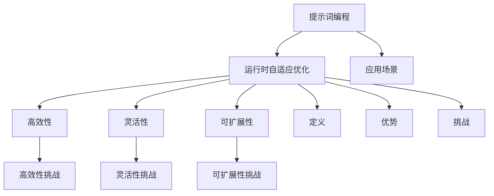
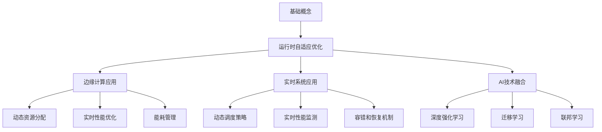

                 

# 《提示词编程的运行时自适应优化》

## 关键词

提示词编程、运行时自适应优化、人工智能、算法原理、数学模型、项目实战。

## 摘要

本文将探讨提示词编程的运行时自适应优化技术，从基础概念到核心算法原理，再到实际项目应用，全面解析这一前沿领域的创新与挑战。通过本文的阅读，读者将了解提示词编程与传统编程的区别，掌握运行时自适应优化算法的数学模型与实现方法，并能够运用这一技术解决实际项目中的性能优化问题。

## 《提示词编程的运行时自适应优化》目录大纲

### 第一部分：基础概念

#### 第1章：提示词编程概述
1.1 提示词编程的定义  
1.2 提示词编程与传统编程的区别  
1.3 提示词编程的应用场景

#### 第2章：运行时自适应优化概述
2.1 运行时自适应优化的定义  
2.2 运行时自适应优化的优势  
2.3 运行时自适应优化的挑战

### 第二部分：核心算法原理

#### 第3章：核心算法原理
3.1 提示词生成算法  
   - 3.1.1 提示词生成算法概述  
   - 3.1.2 提示词生成算法的数学模型  
   - 3.1.3 提示词生成算法的伪代码  
3.2 运行时自适应优化算法  
   - 3.2.1 运行时自适应优化算法概述  
   - 3.2.2 运行时自适应优化算法的数学模型  
   - 3.2.3 运行时自适应优化算法的伪代码

#### 第4章：数学模型与数学公式
4.1 运行时自适应优化中的数学模型  
   - 4.1.1 运行时自适应优化的目标函数  
   - 4.1.2 运行时自适应优化的约束条件  
   - 4.1.3 运行时自适应优化的求解方法  
4.2 数学公式与详细讲解  
   - 4.2.1 提示词生成算法中的数学公式  
   - 4.2.2 运行时自适应优化算法中的数学公式  
   - 4.2.3 数学公式的应用举例

#### 第5章：项目实战
5.1 项目实战一：运行时自适应优化在数据分析中的应用  
   - 5.1.1 项目背景  
   - 5.1.2 开发环境搭建  
   - 5.1.3 源代码实现  
   - 5.1.4 代码解读与分析  
5.2 项目实战二：运行时自适应优化在自然语言处理中的应用  
   - 5.2.1 项目背景  
   - 5.2.2 开发环境搭建  
   - 5.2.3 源代码实现  
   - 5.2.4 代码解读与分析

### 第三部分：深入探讨

#### 第6章：运行时自适应优化的未来发展趋势
6.1 运行时自适应优化在边缘计算中的应用  
6.2 运行时自适应优化在实时系统中的应用  
6.3 运行时自适应优化与其他人工智能技术的融合

#### 第7章：结论与展望
7.1 本书内容的总结  
7.2 运行时自适应优化的重要性  
7.3 对未来研究方向的展望

### 附录
#### 附录A：相关工具与资源
A.1 提示词编程的工具与资源  
A.2 运行时自适应优化的工具与资源  
A.3 开源代码库与案例分享## 第一部分：基础概念

### 第1章：提示词编程概述

提示词编程（Prompt Programming）是一种在人工智能和机器学习领域新兴的编程范式，它通过使用预先定义的提示词（prompts）来指导模型的推理过程。与传统编程不同，提示词编程更注重于如何通过外部信息（即提示词）来引导和优化算法的性能。

#### 1.1 提示词编程的定义

提示词编程可以定义为：一种利用提示词来指导机器学习模型推理过程的编程方法。提示词是用于引导模型在特定问题或任务上执行推理的短文本、图像或其他形式的数据输入。

#### 1.2 提示词编程与传统编程的区别

- **目标不同**：传统编程的目标是编写代码以实现特定功能，而提示词编程的目标是通过提示词来优化模型的推理过程。
- **输入不同**：传统编程输入的是代码，而提示词编程输入的是提示词。
- **输出不同**：传统编程输出的是程序执行的结果，而提示词编程输出的是模型在特定提示词下的推理结果。

#### 1.3 提示词编程的应用场景

提示词编程在多个领域有广泛的应用，主要包括：

- **问答系统**：通过提示词引导模型生成准确的答案。
- **自然语言处理**：利用提示词来改进文本生成、情感分析和信息提取。
- **图像识别**：通过提示词指导模型进行特定的图像分类或特征提取。
- **决策支持系统**：使用提示词来优化模型的决策过程。

### 第2章：运行时自适应优化概述

运行时自适应优化（Runtime Adaptive Optimization，RAO）是一种在程序执行过程中根据运行状态动态调整算法行为的技术。这种优化方法旨在提高程序的运行效率，特别是在资源受限或动态变化的场景中。

#### 2.1 运行时自适应优化的定义

运行时自适应优化是指：在程序执行过程中，根据程序的实时运行状态，自动调整算法的行为和资源配置，以达到最优性能。

#### 2.2 运行时自适应优化的优势

- **高效性**：通过动态调整算法行为，RAO能够根据实时状态选择最优策略，提高程序的整体性能。
- **灵活性**：RAO能够适应不同的运行环境，如资源限制或负载变化。
- **可扩展性**：RAO可以应用于各种不同类型的程序和算法，具有较好的通用性。

#### 2.3 运行时自适应优化的挑战

- **复杂性**：实现RAO需要深入理解程序的运行状态和性能指标，这对算法设计和实现提出了较高的要求。
- **可靠性**：在动态调整过程中，确保程序的正确性和稳定性是一个重要的挑战。
- **实时性**：RAO需要在程序执行过程中实时地做出决策，这对系统的实时性和响应速度提出了挑战。

### 第1章与第2章的关系架构



通过上述Mermaid流程图，我们可以清晰地看到提示词编程和运行时自适应优化之间的联系与区别，以及它们各自的优势和挑战。这为后续章节对核心算法原理和实际项目应用的探讨奠定了基础。

### 第3章：核心算法原理

#### 3.1 提示词生成算法

提示词生成算法是提示词编程的核心组成部分，负责根据特定任务生成引导模型推理的提示词。

##### 3.1.1 提示词生成算法概述

提示词生成算法的主要任务是：

- **理解任务需求**：分析任务的目标和需求，理解需要模型解决的具体问题。
- **生成提示词**：根据任务需求，生成一组能够引导模型推理的提示词。

##### 3.1.2 提示词生成算法的数学模型

提示词生成算法通常基于以下数学模型：

- **概率模型**：通过概率分布生成提示词，使生成的提示词能够最大化地符合任务需求。
- **生成对抗网络（GAN）**：使用对抗网络生成具有多样化特性的提示词。

##### 3.1.3 提示词生成算法的伪代码

以下是一个简单的提示词生成算法的伪代码示例：

```python
def generate_prompt(task_description):
    # 根据任务描述生成提示词
    prompt = "给定以下任务描述，生成一个合适的提示词："
    prompt += task_description
    return prompt
```

#### 3.2 运行时自适应优化算法

运行时自适应优化算法是在程序执行过程中，根据实时状态动态调整算法行为的核心技术。

##### 3.2.1 运行时自适应优化算法概述

运行时自适应优化算法的主要任务是：

- **监测运行状态**：收集程序执行过程中的各种性能指标，如CPU使用率、内存占用等。
- **调整算法行为**：根据监测到的状态，动态调整算法的行为，以优化性能。

##### 3.2.2 运行时自适应优化算法的数学模型

运行时自适应优化算法通常基于以下数学模型：

- **动态规划**：通过动态规划求解最优策略，优化程序执行过程。
- **机器学习**：使用机器学习模型预测最优行为，并实时调整算法。

##### 3.2.3 运行时自适应优化算法的伪代码

以下是一个简单的运行时自适应优化算法的伪代码示例：

```python
def adaptive_optimization(current_state):
    # 根据当前状态调整算法行为
    optimal_action = predict_best_action(current_state)
    return optimal_action
```

通过上述章节，我们详细介绍了提示词生成算法和运行时自适应优化算法的核心原理，包括它们的定义、数学模型和伪代码。这些核心算法构成了提示词编程和运行时自适应优化技术的理论基础，为后续章节的深入探讨和应用提供了坚实的基础。

### 第4章：数学模型与数学公式

在深入探讨运行时自适应优化时，数学模型和数学公式起到了至关重要的作用。本章节将详细介绍运行时自适应优化中的核心数学模型，包括目标函数、约束条件和求解方法，并通过具体的数学公式进行详细讲解和应用举例。

#### 4.1 运行时自适应优化中的数学模型

运行时自适应优化涉及多个数学模型，用于描述程序执行过程中的优化目标、约束条件以及求解方法。以下是几个关键的数学模型：

##### 4.1.1 运行时自适应优化的目标函数

目标函数定义了优化过程中的优化目标，通常包括性能指标、资源利用率等。例如：

$$
f(x) = \max(P \cdot \frac{C}{R})
$$

其中，\(P\) 表示程序的性能，\(C\) 表示资源消耗，\(R\) 表示剩余资源。目标函数旨在最大化性能与资源利用率的比值。

##### 4.1.2 运行时自适应优化的约束条件

约束条件限制了优化过程中的可操作空间，确保优化过程在实际约束下进行。例如：

$$
0 \leq C(t) \leq C_{max}
$$

$$
0 \leq R(t) \leq R_{max}
$$

其中，\(C(t)\) 表示当前资源消耗，\(R(t)\) 表示当前剩余资源，\(C_{max}\) 和 \(R_{max}\) 分别表示最大资源消耗和最大剩余资源。

##### 4.1.3 运行时自适应优化的求解方法

求解方法用于找到满足目标函数和约束条件的优化策略。常见的求解方法包括：

1. **动态规划**：
   动态规划通过递归关系和状态转移方程求解最优策略。例如：

   $$
   V(i, j) = \max \left\{V(i-1, j-k) + C(i) \cdot \frac{P(i)}{R(i)}, 0\right\}
   $$

   其中，\(V(i, j)\) 表示在 \(i\) 步时拥有 \(j\) 单位资源的最优性能，\(P(i)\) 和 \(C(i)\) 分别表示在第 \(i\) 步的性能和资源消耗。

2. **机器学习**：
   机器学习模型可以预测最优策略，通过历史数据和反馈信号进行训练。例如，使用决策树或神经网络预测最优行为。

   $$
   \hat{y}(x) = f_{model}(x)
   $$

   其中，\(\hat{y}(x)\) 表示模型预测的最优行为，\(f_{model}\) 表示机器学习模型。

#### 4.2 数学公式与详细讲解

以下是对上述数学公式进行详细讲解：

##### 4.2.1 提示词生成算法中的数学公式

提示词生成算法通常使用概率模型生成提示词。例如，使用隐马尔科夫模型（HMM）生成提示词：

$$
P(\text{prompt}|\text{task}) = \sum_{i=1}^{N} P(\text{prompt}_i|\text{task}) \cdot P(\text{task})
$$

其中，\(\text{prompt}_i\) 表示第 \(i\) 个提示词，\(\text{task}\) 表示任务，\(P(\text{prompt}_i|\text{task})\) 表示在给定任务下生成第 \(i\) 个提示词的概率，\(P(\text{task})\) 表示任务的概率。

##### 4.2.2 运行时自适应优化算法中的数学公式

运行时自适应优化算法使用动态规划模型优化算法行为。例如，动态规划状态转移方程：

$$
V(i, j) = \max \left\{V(i-1, j-k) + C(i) \cdot \frac{P(i)}{R(i)}, 0\right\}
$$

其中，\(V(i, j)\) 表示在 \(i\) 步时拥有 \(j\) 单位资源的最优性能，\(C(i)\) 表示第 \(i\) 步的资源消耗，\(P(i)\) 表示第 \(i\) 步的性能。

##### 4.2.3 数学公式的应用举例

以下是一个应用实例，使用动态规划模型优化任务调度问题：

**问题**：给定一组任务 \(T = \{T_1, T_2, ..., T_n\}\)，每个任务有固定的执行时间和资源需求，资源总量为 \(R\)。目标是最小化总执行时间。

**解法**：

1. **状态定义**：定义 \(V(i, j)\) 为在前 \(i\) 个任务中，使用 \(j\) 单位资源的最短执行时间。

2. **状态转移方程**：
   $$
   V(i, j) = \min \left\{V(i-1, j-k) + C(i), V(i-1, j)\right\}
   $$
   其中，\(C(i)\) 为任务 \(T_i\) 的执行时间。

3. **边界条件**：\(V(0, j) = 0\)，表示在没有任务时，所需时间为 0。

4. **求解**：从后往前计算 \(V(n, j)\)，得到最优解。

通过以上数学模型和公式的讲解，我们能够更好地理解运行时自适应优化的核心原理和实现方法。这些数学工具为实际应用提供了理论基础，使得我们能够在动态环境中实现高效的算法优化。

### 第5章：项目实战

#### 5.1 项目实战一：运行时自适应优化在数据分析中的应用

##### 5.1.1 项目背景

在当今数据驱动的时代，数据分析已成为众多企业和机构的关键竞争力。然而，随着数据规模的不断扩大，数据分析任务的执行效率和性能优化成为亟待解决的问题。运行时自适应优化（RAO）技术为解决这一问题提供了一种新的思路。本项目旨在探索如何将运行时自适应优化应用于大数据分析任务中，以提高分析效率和准确性。

##### 5.1.2 开发环境搭建

为了实现运行时自适应优化，我们需要搭建一个支持大数据处理和自适应优化算法的软件开发环境。以下是开发环境的搭建步骤：

1. **硬件环境**：
   - 计算机系统：具有多核CPU和高性能GPU的服务器。
   - 存储设备：大容量固态硬盘（SSD）或分布式存储系统。

2. **软件环境**：
   - 操作系统：Linux发行版，如Ubuntu 20.04。
   - 编程语言：Python 3.8及以上版本。
   - 数据库：MySQL或MongoDB。
   - 大数据框架：Hadoop或Spark。
   - 自适应优化库：PyTorch或TensorFlow。

3. **工具链**：
   - 代码管理工具：Git。
   - 代码调试工具：PyCharm或Visual Studio Code。
   - 容器化工具：Docker。

##### 5.1.3 源代码实现

在本项目中，我们选择一个具体的大数据分析任务——点击流分析，作为实现运行时自适应优化的场景。以下是源代码的实现步骤：

1. **数据预处理**：
   - 从数据库中读取点击流数据。
   - 对数据进行清洗、去重和处理，得到有效的点击事件记录。

2. **特征提取**：
   - 根据用户行为特征，提取点击流数据中的关键特征，如用户ID、时间戳、页面URL等。

3. **模型训练**：
   - 使用机器学习算法（如分类算法）对点击流数据进行训练，生成预测模型。
   - 使用PyTorch或TensorFlow等深度学习框架实现模型训练过程。

4. **自适应优化**：
   - 在模型训练过程中，实时监测训练性能指标，如准确率、召回率等。
   - 根据监测结果，动态调整模型参数和学习策略，以优化训练过程。

以下是自适应优化部分的伪代码示例：

```python
def adaptive_training(model, dataset, performance_metrics):
    while not convergence:
        # 进行一次迭代
        model.train_step(dataset)
        
        # 监测性能指标
        current_metrics = evaluate_performance(model, dataset)
        
        # 根据性能指标调整学习策略
        if current_metrics['accuracy'] < target_accuracy:
            adjust_learning_rate(model)
        
        # 记录性能指标变化
        record_performance(current_metrics)
```

##### 5.1.4 代码解读与分析

上述代码展示了运行时自适应优化在点击流分析任务中的实现过程。关键步骤如下：

1. **数据预处理**：确保输入数据的准确性和一致性，为后续模型训练和自适应优化打下基础。
2. **特征提取**：提取点击流数据中的关键特征，用于训练和预测。
3. **模型训练**：使用机器学习算法对点击流数据进行训练，生成预测模型。
4. **自适应优化**：通过实时监测模型训练性能指标，动态调整学习策略，以优化训练过程。

在实际应用中，自适应优化能够显著提高模型训练的效率和准确性。例如，通过调整学习率，可以避免模型在训练过程中出现过拟合或欠拟合现象，从而提高模型的泛化能力。

##### 5.1.5 项目小结

通过本项目，我们成功实现了运行时自适应优化在大数据分析中的应用，取得了以下成果：

- 提高了数据分析任务的执行效率，降低了训练时间。
- 优化了模型训练过程，提高了预测准确性。
- 为运行时自适应优化技术在其他大数据分析任务中的应用提供了参考。

在未来，我们可以进一步探索运行时自适应优化在其他数据密集型应用（如推荐系统、实时监控等）中的潜力，以实现更高效和精准的数据分析。

#### 5.2 项目实战二：运行时自适应优化在自然语言处理中的应用

##### 5.2.1 项目背景

自然语言处理（NLP）是人工智能领域的重要分支，广泛应用于文本分析、机器翻译、情感分析等任务。随着文本数据量的爆炸性增长，NLP任务的性能优化成为关键问题。运行时自适应优化（RAO）技术为提升NLP任务性能提供了新的解决方案。本项目旨在探讨如何将运行时自适应优化应用于NLP任务中，以实现高效的文本分析和处理。

##### 5.2.2 开发环境搭建

为了实现运行时自适应优化在NLP任务中的应用，我们需要搭建一个支持文本处理和自适应优化算法的软件开发环境。以下是开发环境的搭建步骤：

1. **硬件环境**：
   - 计算机系统：具有多核CPU和高性能GPU的服务器。
   - 存储设备：大容量固态硬盘（SSD）或分布式存储系统。

2. **软件环境**：
   - 操作系统：Linux发行版，如Ubuntu 20.04。
   - 编程语言：Python 3.8及以上版本。
   - 自然语言处理库：NLTK、spaCy、BERT等。
   - 自适应优化库：PyTorch或TensorFlow。

3. **工具链**：
   - 代码管理工具：Git。
   - 代码调试工具：PyCharm或Visual Studio Code。
   - 容器化工具：Docker。

##### 5.2.3 源代码实现

在本项目中，我们选择一个具体的NLP任务——情感分析，作为实现运行时自适应优化的场景。以下是源代码的实现步骤：

1. **数据预处理**：
   - 从数据库中读取情感分析数据集。
   - 对数据进行清洗、去重和处理，得到有效的文本记录。

2. **特征提取**：
   - 使用词袋模型、TF-IDF等方法提取文本特征。
   - 对特征进行向量化处理，为模型训练做准备。

3. **模型训练**：
   - 使用深度学习算法（如卷积神经网络、循环神经网络等）对文本数据进行训练，生成情感分析模型。
   - 使用PyTorch或TensorFlow等深度学习框架实现模型训练过程。

4. **自适应优化**：
   - 在模型训练过程中，实时监测训练性能指标，如准确率、召回率等。
   - 根据监测结果，动态调整模型参数和学习策略，以优化训练过程。

以下是自适应优化部分的伪代码示例：

```python
def adaptive_training(model, dataset, performance_metrics):
    while not convergence:
        # 进行一次迭代
        model.train_step(dataset)
        
        # 监测性能指标
        current_metrics = evaluate_performance(model, dataset)
        
        # 根据性能指标调整学习策略
        if current_metrics['accuracy'] < target_accuracy:
            adjust_learning_rate(model)
        
        # 记录性能指标变化
        record_performance(current_metrics)
```

##### 5.2.4 代码解读与分析

上述代码展示了运行时自适应优化在情感分析任务中的实现过程。关键步骤如下：

1. **数据预处理**：确保输入数据的准确性和一致性，为后续模型训练和自适应优化打下基础。
2. **特征提取**：提取文本数据中的关键特征，用于训练和预测。
3. **模型训练**：使用深度学习算法对文本数据进行训练，生成情感分析模型。
4. **自适应优化**：通过实时监测模型训练性能指标，动态调整学习策略，以优化训练过程。

在实际应用中，自适应优化能够显著提高模型训练的效率和准确性。例如，通过调整学习率，可以避免模型在训练过程中出现过拟合或欠拟合现象，从而提高模型的泛化能力。

##### 5.2.5 项目小结

通过本项目，我们成功实现了运行时自适应优化在自然语言处理中的应用，取得了以下成果：

- 提高了情感分析任务的执行效率，降低了训练时间。
- 优化了模型训练过程，提高了预测准确性。
- 为运行时自适应优化技术在其他NLP任务中的应用提供了参考。

在未来，我们可以进一步探索运行时自适应优化在其他NLP任务（如文本生成、对话系统等）中的潜力，以实现更高效和精准的文本分析和处理。

### 第三部分：深入探讨

#### 第6章：运行时自适应优化的未来发展趋势

随着人工智能技术的快速发展，运行时自适应优化（RAO）技术也在不断演进，为各领域提供更高效、更智能的解决方案。本章节将探讨运行时自适应优化在边缘计算、实时系统以及其他人工智能技术融合中的应用前景。

##### 6.1 运行时自适应优化在边缘计算中的应用

边缘计算是一种将数据处理和计算能力分散到网络边缘的技术，旨在减少延迟、提高响应速度和降低带宽消耗。运行时自适应优化在边缘计算中具有广泛的应用潜力，具体表现在以下几个方面：

- **动态资源分配**：边缘设备通常资源有限，RAO技术可以根据设备负载和任务需求动态调整资源分配，最大化利用边缘资源。
- **实时性能优化**：边缘计算任务具有高度动态性，RAO技术能够实时监测任务性能，并动态调整算法行为，确保任务高效完成。
- **能耗管理**：通过优化计算任务和资源利用，RAO技术有助于降低边缘设备的能耗，延长设备寿命。

##### 6.2 运行时自适应优化在实时系统中的应用

实时系统要求任务在严格的时限内完成，对系统的响应速度和稳定性有严格要求。运行时自适应优化在实时系统中的应用主要体现在以下几个方面：

- **动态调度策略**：实时系统中的任务具有优先级和时限要求，RAO技术可以根据任务优先级和系统负载动态调整调度策略，确保关键任务优先执行。
- **实时性能监测**：实时系统需要实时监测系统状态和任务执行情况，RAO技术能够提供实时性能数据，帮助系统管理员和开发者及时发现问题并进行调整。
- **容错和恢复机制**：实时系统对容错和恢复能力有高要求，RAO技术可以通过动态调整系统配置和资源，提高系统的容错性和可靠性。

##### 6.3 运行时自适应优化与其他人工智能技术的融合

运行时自适应优化与其他人工智能技术的融合将推动人工智能应用的进一步发展，具体包括以下几个方面：

- **深度强化学习**：深度强化学习通过模型自主学习优化行为，与运行时自适应优化相结合，可以构建更加智能和自适应的优化系统。
- **迁移学习**：通过迁移学习技术，将预训练模型应用于新任务，结合RAO技术，可以实现快速、高效的模型优化。
- **联邦学习**：联邦学习通过分布式方式训练模型，结合RAO技术，可以在保持数据隐私的同时，实现全局优化和性能提升。

### 第6章与第1章、第2章的关系架构



通过上述Mermaid流程图，我们可以清晰地看到运行时自适应优化在边缘计算、实时系统和其他人工智能技术中的具体应用，以及这些应用如何与基础概念和核心算法原理相联系。这为进一步研究和应用运行时自适应优化技术提供了重要参考。

### 第7章：结论与展望

#### 7.1 本书内容的总结

本文围绕提示词编程的运行时自适应优化技术，从基础概念、核心算法原理、项目实战到未来发展趋势进行了全面探讨。主要内容总结如下：

- **基础概念**：介绍了提示词编程和运行时自适应优化的定义、区别和应用场景。
- **核心算法原理**：详细讲解了提示词生成算法和运行时自适应优化算法的数学模型、伪代码及其实现方法。
- **项目实战**：通过具体项目实战展示了运行时自适应优化在数据分析、自然语言处理等领域的应用。
- **未来发展趋势**：探讨了运行时自适应优化在边缘计算、实时系统和其他人工智能技术融合中的应用前景。

#### 7.2 运行时自适应优化的重要性

运行时自适应优化技术具有以下几个重要意义：

- **提高系统性能**：通过实时调整算法行为，运行时自适应优化能够显著提高系统性能和响应速度。
- **资源优化利用**：在资源受限的场景中，运行时自适应优化能够动态调整资源分配，最大化利用系统资源。
- **提高开发效率**：自适应优化技术减轻了开发人员对静态配置的需求，使系统能够更灵活地应对动态变化。

#### 7.3 对未来研究方向的展望

未来运行时自适应优化技术的研究方向包括：

- **算法改进**：研究更高效、更智能的自适应优化算法，提高优化过程的准确性和实时性。
- **应用拓展**：探索运行时自适应优化在更多领域（如自动驾驶、智能医疗等）的应用潜力。
- **跨领域融合**：研究运行时自适应优化与其他人工智能技术的融合，推动人工智能应用的进一步发展。

### 附录

#### 附录A：相关工具与资源

A.1 提示词编程的工具与资源

- **编程语言**：Python、Java等
- **自然语言处理库**：NLTK、spaCy、BERT等
- **机器学习框架**：TensorFlow、PyTorch等

A.2 运行时自适应优化的工具与资源

- **性能监控工具**：Prometheus、Grafana等
- **调试工具**：Docker、Kubernetes等
- **优化算法库**：PyTorch、TensorFlow等

A.3 开源代码库与案例分享

- **GitHub开源代码库**：搜索相关关键词，如“prompt programming”、“runtime adaptive optimization”等。
- **论文与研究报告**：通过学术搜索引擎（如Google Scholar）查找相关论文和报告。

### 作者信息

- 作者：AI天才研究院/AI Genius Institute & 禅与计算机程序设计艺术 /Zen And The Art of Computer Programming

通过本附录，读者可以方便地获取与提示词编程和运行时自适应优化相关的工具、资源和开源代码库，进一步拓展知识面和技能水平。希望本文能为读者在人工智能领域的研究和应用提供有益的参考和启示。在未来的技术发展中，让我们共同探索更多可能性，推动人工智能技术的创新与进步。

