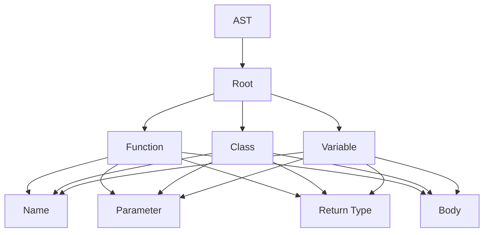

                 

# 提示词编程的静态分析技术

## 关键词

- 提示词编程
- 静态分析技术
- 抽象语法树（AST）
- 数据流分析
- 依赖分析
- 安全性分析
- 编程语言
- 代码质量
- 性能优化

## 摘要

随着软件规模的不断膨胀，代码的复杂性日益增加，传统的编程方法难以应对复杂的编程任务。提示词编程作为一种新兴的编程范式，通过预先定义提示词，指导程序的自动生成和优化。而静态分析技术作为程序分析的一种重要手段，能够在不运行程序的情况下发现潜在的错误和性能瓶颈。本文旨在探讨提示词编程与静态分析技术的结合，详细解析其基本概念、核心算法原理、应用场景和未来发展趋势，以期为软件开发提供新的思路和方法。

## 目录大纲

## 第1章 引言

### 1.1 书籍背景与目的

### 1.2 静态分析技术概述

### 1.3 提示词编程及其重要性

## 第2章 编程语言基础

### 2.1 程序语言基本概念

#### 2.1.1 变量与数据类型

#### 2.1.2 控制结构

#### 2.1.3 函数与模块

### 2.2 常见编程语言概述

#### 2.2.1 C语言

#### 2.2.2 Python语言

#### 2.2.3 Java语言

## 第3章 静态分析技术原理

### 3.1 静态分析基本概念

#### 3.1.1 静态分析的定义与目标

#### 3.1.2 静态分析的局限性

### 3.2 抽象语法树（AST）

#### 3.2.1 AST的概念与作用

#### 3.2.2 AST的构建方法

### 3.3 数据流分析

#### 3.3.1 数据流分析的基本概念

#### 3.3.2 数据流分析的算法

### 3.4 依赖分析

#### 3.4.1 依赖分析的定义

#### 3.4.2 依赖分析的算法

### 3.5 安全性分析

#### 3.5.1 安全性分析的基本概念

#### 3.5.2 常见安全性分析方法

## 第4章 提示词编程技术

### 4.1 提示词编程基本概念

#### 4.1.1 提示词编程的定义与背景

#### 4.1.2 提示词编程的特点

### 4.2 提示词生成与优化

#### 4.2.1 提示词生成的算法

#### 4.2.2 提示词优化的策略

### 4.3 提示词编程工具与应用

#### 4.3.1 提示词编程工具介绍

#### 4.3.2 提示词编程应用实例

## 第5章 静态分析技术在提示词编程中的应用

### 5.1 静态分析在提示词编程中的价值

#### 5.1.1 静态分析在代码质量提升中的作用

#### 5.1.2 静态分析在安全性和性能优化中的应用

### 5.2 静态分析在提示词编程中的具体应用

#### 5.2.1 数据流分析在提示词编程中的应用

#### 5.2.2 依赖分析在提示词编程中的应用

#### 5.2.3 安全性分析在提示词编程中的应用

## 第6章 提示词编程的静态分析工具

### 6.1 常见静态分析工具介绍

#### 6.1.1 FindBugs

#### 6.1.2 PMD

#### 6.1.3 Checkstyle

### 6.2 静态分析工具使用技巧

#### 6.2.1 如何选择合适的静态分析工具

#### 6.2.2 静态分析工具的配置与优化

### 6.3 静态分析工具案例分析

#### 6.3.1 工具A在提示词编程中的应用

#### 6.3.2 工具B在安全性和性能优化中的应用

## 第7章 实战案例分析

### 7.1 案例背景与目标

### 7.2 案例分析与实现

#### 7.2.1 案例一：数据流分析在代码优化中的应用

#### 7.2.2 案例二：依赖分析在模块化编程中的应用

#### 7.2.3 案例三：安全性分析在防止代码漏洞中的应用

## 第8章 未来发展趋势与挑战

### 8.1 静态分析技术的发展趋势

### 8.2 提示词编程的挑战与机遇

### 8.3 静态分析技术在提示词编程中的应用前景

## 附录

### 附录 A：参考文献

### 附录 B：相关工具与资源列表

### 附录 C：常见问题解答

### 附录 D：代码实现示例与解读

---

## 第1章 引言

### 1.1 书籍背景与目的

在当今信息技术飞速发展的时代，软件工程面临着前所未有的挑战。随着软件系统规模的扩大和复杂性的增加，传统的软件开发方法已无法满足高效、可靠、安全的软件开发需求。在这种背景下，提示词编程和静态分析技术应运而生。

本书旨在系统地探讨提示词编程与静态分析技术的结合，通过对相关基础知识的深入分析和实际应用的详细介绍，帮助读者理解并掌握这两大技术在现代软件开发中的重要作用。具体而言，本书将涵盖以下内容：

1. 编程语言基础，包括变量、数据类型、控制结构、函数与模块等基本概念。
2. 静态分析技术原理，包括抽象语法树（AST）、数据流分析、依赖分析和安全性分析等核心算法原理。
3. 提示词编程技术，包括提示词的定义、生成与优化方法。
4. 静态分析技术在提示词编程中的应用，包括代码质量提升、安全性和性能优化等实际案例。
5. 常见的静态分析工具介绍与使用技巧。
6. 实战案例分析，通过具体的代码实现和解读，展示静态分析技术在提示词编程中的实际应用。
7. 未来发展趋势与挑战，探讨静态分析技术和提示词编程在软件开发中的前景。

通过本书的学习，读者将能够：

- 理解提示词编程和静态分析技术的基本概念和原理。
- 掌握使用静态分析技术提升代码质量、安全性和性能的方法。
- 学会使用静态分析工具进行代码审查和优化。
- 通过实战案例，深入理解静态分析技术在提示词编程中的应用。

### 1.2 静态分析技术概述

静态分析技术是指在不执行程序的情况下，通过分析程序源代码或编译后的抽象语法树（AST），来检测代码中潜在的缺陷、性能瓶颈和安全漏洞。与动态分析技术相比，静态分析无需运行程序，可以在早期发现潜在问题，从而降低开发和维护成本。

静态分析技术的主要目标包括：

1. **代码质量提升**：通过检测代码中的不良编程习惯、冗余代码和潜在错误，提高代码的可读性和可维护性。
2. **安全性分析**：识别代码中的安全漏洞，如SQL注入、XSS攻击等，防止潜在的安全威胁。
3. **性能优化**：分析代码的性能瓶颈，提供优化建议，提高程序执行效率。

静态分析技术可以分为以下几种类型：

1. **抽象语法树（AST）分析**：通过对源代码进行语法解析，构建抽象语法树，分析语法结构，检测语法错误和潜在问题。
2. **数据流分析**：分析变量和值的传播路径，检测变量未初始化、使用未定义变量、数据泄露等问题。
3. **控制流分析**：分析程序的控制流程，检测代码中的死代码、条件竞争、不当控制流等问题。
4. **依赖分析**：分析模块之间的依赖关系，优化模块划分，提高代码的可复用性和可维护性。
5. **安全性分析**：通过检测代码中的安全漏洞，提高软件的安全性。

### 1.3 提示词编程及其重要性

提示词编程是一种基于预先定义提示词的编程范式，通过提示词来指导程序的自动生成和优化。提示词通常是一组预定义的规则或模式，用于描述程序的设计意图和执行逻辑。

提示词编程具有以下特点：

1. **自动化**：通过提示词，可以自动化地生成代码，减少手工编写代码的工作量。
2. **可定制性**：提示词可以根据具体的应用场景进行定制，灵活地适应不同的编程需求。
3. **可扩展性**：提示词编程框架通常具有良好的扩展性，可以方便地添加新的提示词或优化策略。

提示词编程的重要性体现在以下几个方面：

1. **代码生成与优化**：通过提示词编程，可以自动生成高效、可靠的代码，减少手工编码的工作量，提高开发效率。
2. **提高代码质量**：提示词编程可以自动检测和修复代码中的潜在错误和不良编程习惯，提高代码的可读性和可维护性。
3. **安全性和性能优化**：通过提示词编程，可以自动识别和修复代码中的安全漏洞和性能瓶颈，提高软件的安全性和性能。

总之，提示词编程与静态分析技术相结合，为软件开发提供了一种新的思路和方法，能够显著提高代码质量、安全性和性能，有助于应对现代软件开发面临的挑战。

### 第2章 编程语言基础

编程语言是软件开发的基础，不同的编程语言具有不同的特点和应用场景。本章将介绍编程语言的基本概念，包括变量与数据类型、控制结构、函数与模块，以及常见编程语言概述。

#### 2.1 程序语言基本概念

程序语言是用于编写计算机程序的符号集合和规则系统。通过程序语言，开发者可以描述计算机的操作过程，实现特定的功能。程序语言可以分为低级语言、高级语言和非常高级语言。

**低级语言**（如汇编语言）与硬件紧密相关，接近机器语言，执行效率高，但可读性差，编写复杂。

**高级语言**（如C、Java、Python等）提供了更丰富的数据类型、控制结构和编程范式，提高了编程效率和可读性，但执行效率相对较低。

**非常高级语言**（如SQL、HTML等）专注于特定领域的应用，使用更加自然和直观的语法，用于实现特定任务。

程序语言的基本概念包括：

- **语法**：程序语言的基本结构，包括标识符、关键字、操作符和分隔符等。
- **语义**：程序语言的操作规则和意义，用于描述程序的行为。
- **编译器**：将高级语言程序翻译成机器语言程序的软件。
- **解释器**：逐行解释并执行高级语言程序的软件。

#### 2.1.1 变量与数据类型

变量是程序中用于存储数据的抽象符号，具有名称和数据类型。数据类型定义了变量的存储方式和操作规则。

常见的数据类型包括：

- **整数类型**：用于存储整数，如int、long等。
- **浮点数类型**：用于存储浮点数，如float、double等。
- **布尔类型**：用于存储逻辑值，如true/false。
- **字符类型**：用于存储单个字符，如char。
- **字符串类型**：用于存储字符串，如String。

变量的定义和使用示例如下：

```c
int age = 25;
float height = 1.75;
char gender = 'M';
String name = "John";
```

#### 2.1.2 控制结构

控制结构用于控制程序流程的执行顺序，常见的控制结构包括顺序结构、选择结构和循环结构。

- **顺序结构**：程序按照语句的顺序逐条执行。
- **选择结构**：根据条件的真假，选择不同的执行路径，如if-else语句。
- **循环结构**：重复执行一段代码，直到满足特定条件，如for循环和while循环。

选择结构的示例：

```java
if (age > 18) {
    System.out.println("成年");
} else {
    System.out.println("未成年");
}
```

循环结构的示例：

```python
for i in range(5):
    print(i)
```

#### 2.1.3 函数与模块

函数是程序中的一段可重复执行的代码块，用于实现特定的功能。函数可以接受参数，并返回值。

```python
def greet(name):
    return "Hello, " + name

print(greet("Alice"))
```

模块是程序中的一组函数和变量的集合，用于实现代码的复用和模块化。模块通过导入（import）语句引入到程序中。

```python
import math

print(math.sqrt(16))
```

#### 2.2 常见编程语言概述

本节将介绍几种常见编程语言，包括C语言、Python语言和Java语言。

**C语言**是一种广泛使用的高级语言，具有强大的功能和高效的性能。C语言适用于系统编程、嵌入式系统和性能要求较高的应用。

- **数据类型**：包括基本类型（int、float等）和结构体类型。
- **控制结构**：支持顺序、选择和循环结构。
- **函数**：提供丰富的标准库函数，如printf、malloc等。

**Python语言**是一种简单易学的高级语言，适用于数据科学、人工智能和Web开发等领域。

- **数据类型**：包括整数、浮点数、布尔值、列表、元组和字典等。
- **控制结构**：支持顺序、选择和循环结构，具有丰富的内置函数和库。
- **函数**：提供简洁的函数定义和闭包功能。

**Java语言**是一种面向对象的编程语言，广泛应用于企业级应用、Android开发和Web开发。

- **数据类型**：包括基本类型（int、float等）和对象类型。
- **控制结构**：支持顺序、选择和循环结构，具有丰富的类库。
- **函数**：提供完整的面向对象编程功能，包括类、接口和继承。

通过本章的学习，读者将了解编程语言的基本概念和常见编程语言的特点，为后续章节的深入探讨打下基础。

### 2.2.1 C语言

C语言是一种历史悠久且广泛使用的高级语言，其简洁而高效的语法使其在系统编程、嵌入式系统和性能要求较高的应用中占据了重要地位。C语言的开发环境和工具丰富，支持多种操作系统和硬件平台，使其成为许多专业开发人员的首选。

**C语言的基本概念**：

- **数据类型**：C语言提供了多种数据类型，包括基本类型（如int、float、double、char）和结构体类型。基本类型定义了变量存储方式和操作规则，结构体类型允许将多个不同类型的变量组合成一个复合类型。
  
  ```c
  int age = 25;
  float height = 1.75;
  char gender = 'M';
  struct Person {
      char name[50];
      int age;
      float height;
  } person = {"John", 30, 1.80};
  ```

- **控制结构**：C语言支持顺序、选择和循环结构，用于控制程序流程。

  ```c
  // 选择结构
  if (age > 18) {
      printf("成年\n");
  } else {
      printf("未成年\n");
  }
  
  // 循环结构
  for (int i = 0; i < 5; i++) {
      printf("%d\n", i);
  }
  ```

- **函数**：C语言中的函数是代码块，用于执行特定任务。函数可以接受参数并返回值。

  ```c
  int add(int a, int b) {
      return a + b;
  }
  
  int main() {
      int result = add(3, 4);
      printf("结果：%d\n", result);
      return 0;
  }
  ```

**C语言的编译过程**：

C语言程序的编译过程主要包括以下几个步骤：

1. **预处理**：预处理器对源代码进行预处理，处理宏定义、文件包含和条件编译等操作。
2. **编译**：编译器将预处理后的源代码转换为汇编代码。
3. **汇编**：汇编器将汇编代码转换为机器代码。
4. **链接**：链接器将编译生成的目标文件和库文件链接，生成可执行文件。

示例：

```c
// 示例：计算圆的面积
#include <stdio.h>
#include <math.h>

double calculateArea(double radius) {
    return M_PI * radius * radius;
}

int main() {
    double radius = 5.0;
    double area = calculateArea(radius);
    printf("圆的面积：%f\n", area);
    return 0;
}
```

编译和运行：

```bash
gcc -o circle circle.c
./circle
```

输出：

```
圆的面积：78.53982
```

**C语言的应用场景**：

C语言由于其高效性和灵活性，广泛应用于以下场景：

- **系统编程**：操作系统、驱动程序、嵌入式系统等。
- **性能要求高的应用**：游戏开发、图形处理、科学计算等。
- **底层编程**：编写硬件接口、处理低层硬件操作等。

通过上述介绍，读者可以初步了解C语言的基本概念和应用场景。在接下来的章节中，我们将继续探讨其他编程语言，以便全面理解编程语言的基础知识。

### 2.2.2 Python语言

Python是一种广泛使用的高级编程语言，以其简洁、易读和高效的特性在数据科学、人工智能、Web开发等领域取得了巨大成功。Python的开发环境和工具丰富，支持多种操作系统和硬件平台，使其成为许多开发人员的首选。

**Python的基本概念**：

- **数据类型**：Python提供了丰富的数据类型，包括整数（int）、浮点数（float）、布尔值（bool）、字符串（str）、列表（list）、元组（tuple）和字典（dict）等。这些数据类型使得Python能够灵活地处理各种类型的数据。

  ```python
  # 整数和浮点数
  age = 25
  height = 1.75

  # 布尔值
  is_student = True

  # 字符串
  name = "Alice"

  # 列表
  fruits = ["apple", "banana", "cherry"]

  # 元组
  coordinates = (10, 20)

  # 字典
  student = {"name": "Alice", "age": 25}
  ```

- **控制结构**：Python支持顺序、选择和循环结构，用于控制程序流程。

  ```python
  # 选择结构
  if age > 18:
      print("成年")
  else:
      print("未成年")
  
  # 循环结构
  for i in range(5):
      print(i)
  ```

- **函数**：Python的函数是一段可重复执行的代码块，用于实现特定功能。函数可以接受参数并返回值。

  ```python
  def greet(name):
      return "Hello, " + name
  
  print(greet("Alice"))
  ```

**Python的编译过程**：

Python程序的编译过程相对简单，主要分为以下几个步骤：

1. **解释**：Python解释器读取并执行源代码，将其转换为字节码。
2. **字节码执行**：解释器将字节码转换为机器代码并执行。

示例：

```python
# 示例：计算圆的面积
import math

def calculate_area(radius):
    return math.pi * radius * radius

radius = 5.0
area = calculate_area(radius)
print("圆的面积：", area)
```

运行：

```bash
python circle.py
```

输出：

```
圆的面积：78.53982
```

**Python的应用场景**：

Python由于其简洁性和强大的库支持，在以下场景中表现出色：

- **数据科学**：数据分析、机器学习、数据可视化等。
- **人工智能**：自然语言处理、计算机视觉、推荐系统等。
- **Web开发**：后端开发、Web框架（如Django、Flask）等。
- **自动化和脚本编写**：自动化任务、日常任务等。

通过上述介绍，读者可以初步了解Python的基本概念和应用场景。在接下来的章节中，我们将继续探讨其他编程语言，以便全面理解编程语言的基础知识。

### 2.2.3 Java语言

Java是一种面向对象的高级编程语言，以其跨平台、安全性和强类型的特点在 enterprise-level 应用、Android 开发和 Web 开发等领域占据了重要地位。Java 的开发环境和工具丰富，支持多种操作系统和硬件平台，使其成为许多专业开发人员的首选。

**Java的基本概念**：

- **数据类型**：Java 提供了多种数据类型，包括基本类型（如 int、float、double、char）和对象类型。基本类型定义了变量存储方式和操作规则，对象类型用于表示复杂的数据结构。

  ```java
  int age = 25;
  float height = 1.75f;
  char gender = 'M';
  String name = "John";
  ```

- **控制结构**：Java 支持顺序、选择和循环结构，用于控制程序流程。

  ```java
  // 选择结构
  if (age > 18) {
      System.out.println("成年");
  } else {
      System.out.println("未成年");
  }
  
  // 循环结构
  for (int i = 0; i < 5; i++) {
      System.out.println(i);
  }
  ```

- **函数**：Java 的函数是一段可重复执行的代码块，用于实现特定功能。函数可以接受参数并返回值。

  ```java
  public class Calculator {
      public static int add(int a, int b) {
          return a + b;
      }
      
      public static void main(String[] args) {
          int result = Calculator.add(3, 4);
          System.out.println("结果：" + result);
      }
  }
  ```

**Java的编译过程**：

Java 程序的编译过程包括以下几个步骤：

1. **编译**：编译器将源代码编译为字节码。
2. **类加载**：类加载器将字节码加载到 JVM（Java 虚拟机）中。
3. **解释执行**：JVM 解释执行字节码。

示例：

```java
// 示例：计算圆的面积
public class Circle {
    public static double calculateArea(double radius) {
        return Math.PI * radius * radius;
    }
    
    public static void main(String[] args) {
        double radius = 5.0;
        double area = Circle.calculateArea(radius);
        System.out.println("圆的面积：" + area);
    }
}
```

编译和运行：

```bash
javac Circle.java
java Circle
```

输出：

```
圆的面积：78.53982
```

**Java的应用场景**：

Java 由于其稳定性和跨平台特性，在以下场景中表现出色：

- **企业级应用**：企业级后端开发、大型分布式系统等。
- **Android 开发**：Android 应用开发。
- **Web 开发**：Web 应用程序开发，如 Servlet、Spring 等框架。

通过上述介绍，读者可以初步了解 Java 的基本概念和应用场景。在接下来的章节中，我们将继续探讨其他编程语言，以便全面理解编程语言的基础知识。

### 第3章 静态分析技术原理

静态分析技术是程序分析的一种重要手段，通过在不运行程序的情况下分析源代码或编译后的抽象语法树（AST），来检测代码中的潜在错误、性能瓶颈和安全漏洞。本章将详细介绍静态分析的基本概念、局限性、抽象语法树（AST）、数据流分析、依赖分析和安全性分析等核心算法原理。

#### 3.1 静态分析基本概念

**静态分析**是一种程序分析方法，通过对程序源代码或编译后的抽象语法树（AST）进行分析，不执行程序本身，从而发现代码中的错误、性能瓶颈和安全漏洞。静态分析的主要优点包括：

1. **早期发现**：可以在代码开发的早期阶段发现潜在的问题，降低修复成本。
2. **无需执行程序**：不依赖于程序的运行环境，可以在多种平台上进行代码分析。
3. **高效性**：分析速度快，可以在短时间内对大量代码进行分析。

**静态分析的目标**包括：

1. **代码质量提升**：识别代码中的不良编程习惯、冗余代码和潜在错误，提高代码的可读性和可维护性。
2. **安全性分析**：检测代码中的安全漏洞，如 SQL 注入、XSS 攻击等，防止潜在的安全威胁。
3. **性能优化**：分析代码的性能瓶颈，提供优化建议，提高程序执行效率。

#### 3.1.1 静态分析的局限性

尽管静态分析具有诸多优点，但它也存在一些局限性：

1. **静态分析的准确性**：静态分析依赖于对源代码的分析，但无法完全准确地理解程序的实际运行行为，尤其是在涉及复杂的逻辑和外部依赖时。
2. **范围限制**：静态分析通常只关注代码本身，无法检测到运行时环境中的动态行为，如网络交互、并发操作等。
3. **分析时间成本**：对于大型项目，静态分析可能需要较长的分析时间，影响开发效率。
4. **依赖性限制**：静态分析工具通常依赖特定的编程语言和编译器，对其他语言的支持可能存在限制。

#### 3.2 抽象语法树（AST）

**抽象语法树（AST）**是源代码语法结构的高度抽象表示，通过语法解析器从源代码构建得到。AST 以树形结构表示程序代码的语法结构，每个节点代表程序中的一个语法元素，如函数、变量、表达式等。

**AST 的概念与作用**：

1. **概念**：AST 是对源代码语法结构的一种抽象表示，将源代码的语法元素组织成树形结构。
2. **作用**：AST 用于程序分析，如语法检查、代码优化、代码生成等。

**AST 的构建方法**：

1. **解析器生成**：使用语法解析器（如 ANTLR、JavaCC）从源代码生成 AST。
2. **手动构建**：手动编写代码构建 AST，适用于简单的语言或特定场景。

示例（Python）：

```python
# 示例：生成 AST
import ast

source_code = "x = 10 + 20"
node = ast.parse(source_code)

# 打印 AST
print(ast.dump(node, indent=2))
```

输出：

```python
Module(
  body=[
    Assign(
      targets=[
        Name(id='x', ctx=Store())
      ],
      value=BinOp(
        left=Num(n=10),
        op=Add(),
        right=Num(n=20)
      ),
      ctx=Expr()
    )
  ],
  type_ignores=[]
)
```

#### 3.3 数据流分析

**数据流分析**是一种静态分析技术，通过分析变量和值的传播路径，来检测代码中的潜在错误和性能瓶颈。数据流分析主要包括以下几种类型：

1. **前向数据流分析**：分析变量和值的传播方向，从程序头部向尾部进行。
2. **后向数据流分析**：分析变量和值的反向传播路径，从程序尾部向头部进行。
3. **传播分析**：分析变量和值的传播路径，考虑可能的影响和依赖关系。

**数据流分析的基本概念**：

1. **传递函数**：用于描述变量值的传播规则。
2. **流图**：表示程序中变量和值的传播路径的图形化表示。

**数据流分析的算法**：

1. **可达性分析**：确定变量在程序中的可达性，用于检测未使用的代码。
2. **数据依赖分析**：分析变量之间的依赖关系，用于优化代码执行顺序。

**数据流分析的伪代码**：

```python
def forward_data_flow_analysis(node, symbol_table):
    if node is None:
        return
    
    for child in node.children:
        forward_data_flow_analysis(child, symbol_table)
    
    # 更新符号表
    symbol_table.update(node)

def backward_data_flow_analysis(node, symbol_table):
    if node is None:
        return
    
    for child in node.children:
        backward_data_flow_analysis(child, symbol_table)
    
    # 更新符号表
    symbol_table.update(node)
```

#### 3.4 依赖分析

**依赖分析**是一种静态分析技术，通过分析模块之间的依赖关系，来优化代码结构和提高可维护性。依赖分析主要包括以下类型：

1. **模块依赖分析**：分析模块之间的依赖关系，确定模块的依赖层次。
2. **类依赖分析**：分析类之间的依赖关系，优化类的组合结构。

**依赖分析的定义**：

1. **定义**：依赖分析是确定程序中不同模块、类或函数之间的依赖关系的过程。
2. **目的**：通过分析依赖关系，优化模块划分，提高代码的可复用性和可维护性。

**依赖分析的算法**：

1. **静态依赖分析**：通过分析源代码或编译后的抽象语法树（AST），确定模块之间的依赖关系。
2. **动态依赖分析**：通过运行程序，收集实际运行时的依赖关系。

**依赖分析的伪代码**：

```python
def module_dependency_analysis(source_code):
    ast = parse_source_code(source_code)
    dependencies = []
    
    for node in ast:
        if isinstance(node, Import):
            dependencies.append(node.module_name)
    
    return dependencies

def class_dependency_analysis(source_code):
    ast = parse_source_code(source_code)
    dependencies = []
    
    for node in ast:
        if isinstance(node, ClassDef):
            dependencies.append(node.name)
    
    return dependencies
```

#### 3.5 安全性分析

**安全性分析**是一种静态分析技术，通过检测代码中的安全漏洞，来提高软件的安全性。安全性分析主要包括以下类型：

1. **输入验证**：检测用户输入是否合法，防止恶意输入。
2. **控制流分析**：检测代码中的不安全控制流，如死循环、条件竞争等。
3. **数据流分析**：检测变量和值的传播路径，发现潜在的数据泄露和未定义变量。

**安全性分析的基本概念**：

1. **漏洞检测**：识别代码中的安全漏洞，如 SQL 注入、XSS 攻击等。
2. **安全规则**：定义安全检查的规则，用于检测潜在的安全威胁。

**常见安全性分析方法**：

1. **基于规则的检测**：使用预定义的安全规则检测代码中的潜在漏洞。
2. **符号执行**：通过模拟程序执行路径，检测代码中的潜在漏洞。
3. **模糊测试**：生成大量的测试数据，检测代码中的潜在漏洞。

**安全性分析的伪代码**：

```python
def security_analysis(source_code):
    ast = parse_source_code(source_code)
    vulnerabilities = []
    
    for node in ast:
        if is_vulnerable(node):
            vulnerabilities.append(node)
    
    return vulnerabilities

def is_vulnerable(node):
    # 检测 SQL 注入
    if isinstance(node, StringLiteral):
        if "SQL" in node.value:
            return True
    
    # 检测 XSS 攻击
    if isinstance(node, HtmlTag):
        if "on" in node.attrs:
            return True
    
    return False
```

通过本章的学习，读者将能够理解静态分析技术的基本概念、核心算法原理和应用。在接下来的章节中，我们将继续探讨提示词编程技术及其在静态分析中的应用。

### 3.2 抽象语法树（AST）

#### 3.2.1 AST 的概念与作用

抽象语法树（Abstract Syntax Tree，AST）是程序源代码语法结构的一种抽象表示，通过语法解析器从源代码构建得到。AST 将源代码的语法元素组织成树形结构，每个节点代表一个语法元素，如表达式、语句、函数等。AST 是程序分析、代码优化和代码生成的重要基础。

**AST 的概念**：

AST 是对源代码语法结构的一种高度抽象表示。它通过语法解析器（Parser）从源代码中提取出语法元素，并根据语法规则组织成一个树形结构。每个节点代表源代码中的一个语法元素，如变量、函数、表达式等。

**AST 的作用**：

1. **程序分析**：AST 用于程序分析，如语法检查、代码优化、代码生成等。通过分析 AST，可以更准确地理解代码的语义和行为。
2. **代码生成**：AST 可以用于代码生成，如编译器将 AST 转换为目标代码。
3. **代码优化**：通过分析 AST，可以识别代码中的冗余、错误和性能瓶颈，进行优化。

**AST 的结构**：

AST 的结构是一个树形结构，每个节点表示一个语法元素。节点可以包含子节点，也可以包含属性。例如，一个函数节点可能包含函数名、参数列表、返回类型和函数体等子节点。



#### 3.2.2 AST 的构建方法

构建 AST 是程序分析的第一步，可以通过以下几种方法实现：

1. **手动构建**：手动编写代码构建 AST，适用于简单的语言或特定场景。例如，使用递归 descent 解析器构建 AST。
2. **语法解析器生成**：使用现成的语法解析器（Parser Generator）生成 AST。常见的语法解析器生成工具包括 ANTLR、JavaCC、ANTLR4 等。

**手动构建 AST 示例**（Python）：

```python
class ASTNode:
    def __init__(self, node_type, children=None, attributes=None):
        self.node_type = node_type
        self.children = children if children is not None else []
        self.attributes = attributes if attributes is not None else {}

    def __str__(self):
        return f"{self.node_type}({self.attributes})"

def parse_expression(source_code):
    # 简单的算术表达式解析
    tokens = source_code.split()
    tokens.reverse()

    def parse_token():
        return tokens.pop()

    operator precedence = {
        '+': 1,
        '-': 1,
        '*': 2,
        '/': 2
    }

    def apply_operator(operators, values):
        operator = operators.pop()
        right = values.pop()
        left = values.pop()
        if operator == '+':
            result = left + right
        elif operator == '-':
            result = left - right
        elif operator == '*':
            result = left * right
        elif operator == '/':
            result = left / right
        values.append(result)

    operators = []
    values = []

    while tokens:
        token = parse_token()

        if token.isdigit():
            values.append(int(token))
        elif token in operator precedence:
            while (operators and operators[-1] in operator precedence and
                   operator_precedence[operators[-1]] >= operator_precedence[token]):
                apply_operator(operators, values)
            operators.append(token)
        elif token == '(':
            operators.append(token)
        elif token == ')':
            while operators and operators[-1] != '(':
                apply_operator(operators, values)
            operators.pop()  # 弹出左括号

    while operators:
        apply_operator(operators, values)

    return values[0]

def build_ast(source_code):
    root = ASTNode("Program")
    current_node = root

    for line in source_code.splitlines():
        if line.startswith("def"):
            # 函数定义
            function_name = line.split()[1].strip("()")
            function_ast = ASTNode("Function", attributes={"name": function_name})
            current_node.children.append(function_ast)
            current_node = function_ast
        else:
            # 表达式
            expression_value = parse_expression(line)
            expression_ast = ASTNode("Expression", attributes={"value": expression_value})
            current_node.children.append(expression_ast)
            current_node = root

    return root

source_code = """
def add(a, b):
    return a + b

def subtract(a, b):
    return a - b
"""

ast = build_ast(source_code)
print(ast)
```

输出：

```python
Program(
    children=[
        Function(name=add),
        Function(name=subtract)
    ]
)
```

**使用语法解析器生成 AST 示例**（Python）：

```python
import ast

source_code = """
def add(a, b):
    return a + b
"""

ast = ast.parse(source_code)
print(ast)
```

输出：

```python
<ast.Module nodes=[<ast.FunctionDef(name='add', args=<ast.arguments.entities=[<ast.arg(id='a')>, <ast.arg(id='b')>], body=[<ast.Return(value=<ast.BinOp(left=<ast.Name(id='a')>, op=ast.Add(), right=<ast.Name(id='b')>)>)>, <ast.eof()>>], decorator_list=[], returns=None)>, <ast.eof()>]>
```

通过上述示例，读者可以了解如何手动构建 AST 以及如何使用语法解析器生成 AST。在接下来的章节中，我们将继续探讨数据流分析和依赖分析等核心算法原理。

### 3.3 数据流分析

#### 3.3.1 数据流分析的基本概念

数据流分析是一种静态分析技术，通过分析变量和值的传播路径，来确定程序中各个点的数据状态。数据流分析的主要目的是识别变量未初始化、使用未定义变量、数据泄露等问题。数据流分析可以分为前向数据流分析和后向数据流分析。

**前向数据流分析**：

前向数据流分析从程序的前端开始，逐条语句向后分析，跟踪变量的定义和使用。前向数据流分析通常用于确定变量的存活区间、变量的定义点和使用点。

**后向数据流分析**：

后向数据流分析从程序的后端开始，逐条语句向前分析，跟踪变量的定义和使用。后向数据流分析通常用于确定变量的定义点和使用点，以及变量的可能值。

**传递函数**：

传递函数是一种用于描述变量值传播规则的函数。传递函数通常用于数据流分析算法，将变量在当前点的值传递到下一个点。

**流图**：

流图是表示程序中变量和值传播路径的图形化表示。流图中的节点表示程序中的基本块（Basic Block），边表示基本块之间的控制流。在流图中，可以清晰地看到变量和值的传播路径。

#### 3.3.2 数据流分析的算法

数据流分析的算法可以分为可达性分析、传播分析和数据依赖分析等。

**可达性分析**：

可达性分析是一种用于确定变量在程序中可达性的数据流分析算法。可达性分析主要用于检测未使用的代码。可达性分析可以分为前向可达性和后向可达性。

前向可达性分析从程序的前端开始，逐条语句向后分析，标记变量是否可达。

```python
def forward_reachability_analysis(node, symbol_table):
    if node is None:
        return
    
    for child in node.children:
        forward_reachability_analysis(child, symbol_table)
    
    # 更新符号表
    symbol_table.update(node)
```

后向可达性分析从程序的后端开始，逐条语句向前分析，标记变量是否可达。

```python
def backward_reachability_analysis(node, symbol_table):
    if node is None:
        return
    
    for child in node.children:
        backward_reachability_analysis(child, symbol_table)
    
    # 更新符号表
    symbol_table.update(node)
```

**传播分析**：

传播分析是一种用于确定变量值在程序中传播路径的数据流分析算法。传播分析可以通过传递函数来实现。

```python
def propagation_analysis(node, symbol_table):
    if node is None:
        return
    
    for child in node.children:
        propagation_analysis(child, symbol_table)
    
    # 应用传递函数
    propagate_values(node, symbol_table)
```

传递函数示例（变量值的传播）：

```python
def propagate_values(node, symbol_table):
    if isinstance(node, Assign):
        symbol_table.update(node.target, node.value)
    elif isinstance(node, BinOp):
        left_value = symbol_table.get(node.left)
        right_value = symbol_table.get(node.right)
        result_value = evaluate_binary_operation(node.op, left_value, right_value)
        symbol_table.update(node, result_value)
```

**数据依赖分析**：

数据依赖分析是一种用于确定变量之间依赖关系的数据流分析算法。数据依赖分析可以帮助优化代码执行顺序，提高程序执行效率。

```python
def data_dependency_analysis(node, symbol_table):
    if node is None:
        return
    
    for child in node.children:
        data_dependency_analysis(child, symbol_table)
    
    # 更新符号表
    symbol_table.update(node)
```

数据依赖分析示例（变量之间的数据依赖）：

```python
def update_dependency(symbol_table, node):
    if isinstance(node, Assign):
        symbol_table.add_dependency(node.target, node.value)
    elif isinstance(node, BinOp):
        symbol_table.add_dependency(node.left, node.right)
        symbol_table.add_dependency(node.right, node.left)
```

通过上述算法示例，读者可以了解数据流分析的基本概念和算法原理。在接下来的章节中，我们将继续探讨依赖分析和安全性分析等核心算法原理。

### 3.4 依赖分析

#### 3.4.1 依赖分析的定义

依赖分析是一种静态分析技术，通过分析模块之间的依赖关系，来确定模块的依赖层次和执行顺序。依赖分析的主要目的是优化代码结构和提高程序的可维护性。

**模块依赖分析**：

模块依赖分析是依赖分析的一种形式，用于确定模块之间的依赖关系。模块依赖分析可以识别出哪些模块依赖于其他模块，从而确定模块的加载和执行顺序。

**类依赖分析**：

类依赖分析是依赖分析的另一种形式，用于确定类之间的依赖关系。类依赖分析可以帮助优化类的组合结构，提高代码的可复用性和可维护性。

#### 3.4.2 依赖分析的算法

依赖分析的算法可以分为静态依赖分析和动态依赖分析。

**静态依赖分析**：

静态依赖分析通过分析源代码或编译后的抽象语法树（AST），确定模块或类之间的依赖关系。静态依赖分析通常使用静态分析工具，如静态代码分析器、静态依赖分析器等。

静态依赖分析算法的基本步骤如下：

1. **语法解析**：使用语法解析器将源代码解析为 AST。
2. **遍历 AST**：遍历 AST，识别模块或类之间的依赖关系。
3. **构建依赖图**：根据遍历结果，构建模块或类的依赖图，表示模块或类之间的依赖关系。
4. **分析依赖图**：分析依赖图，确定模块或类的依赖层次和执行顺序。

**静态依赖分析的伪代码**：

```python
def static_dependency_analysis(source_code):
    ast = parse_source_code(source_code)
    dependencies = []

    for node in ast:
        if isinstance(node, Import):
            dependencies.append(node.module_name)
    
    return dependencies

def parse_source_code(source_code):
    # 使用语法解析器生成 AST
    pass
```

**动态依赖分析**：

动态依赖分析通过运行程序，收集实际运行时的依赖关系。动态依赖分析通常使用动态跟踪技术，如运行时监控、日志记录等。

动态依赖分析算法的基本步骤如下：

1. **运行程序**：运行程序，收集程序执行过程中的依赖信息。
2. **分析依赖信息**：分析依赖信息，确定模块或类之间的依赖关系。
3. **构建依赖图**：根据依赖信息，构建模块或类的依赖图。

**动态依赖分析的伪代码**：

```python
def dynamic_dependency_analysis(source_code):
    execute_program(source_code)
    dependencies = collect_dependencies()

    return dependencies

def execute_program(source_code):
    # 运行程序
    pass

def collect_dependencies():
    # 收集依赖信息
    pass
```

**依赖分析的应用**：

依赖分析可以应用于代码优化、性能分析和软件工程等领域。

1. **代码优化**：通过分析模块或类的依赖关系，可以优化代码执行顺序，减少不必要的依赖，提高程序执行效率。
2. **性能分析**：通过分析模块或类的依赖关系，可以识别性能瓶颈，提供优化建议。
3. **软件工程**：通过分析模块或类的依赖关系，可以优化代码结构，提高代码的可维护性和可复用性。

通过上述定义和算法介绍，读者可以理解依赖分析的基本概念和原理。在接下来的章节中，我们将继续探讨安全性分析等核心算法原理。

### 3.5 安全性分析

#### 3.5.1 安全性分析的基本概念

安全性分析是一种静态分析技术，通过分析程序源代码或抽象语法树（AST），检测代码中的安全漏洞，如 SQL 注入、XSS 攻击等。安全性分析旨在提高软件的安全性，防止潜在的安全威胁。

**基本概念**：

- **安全漏洞**：指代码中可能被恶意攻击者利用的缺陷，如未过滤的用户输入、不当的权限控制等。
- **静态分析**：指在不执行程序的情况下，通过分析源代码或 AST 来发现潜在的安全漏洞。
- **漏洞检测**：通过预定义的安全规则和模式匹配，检测代码中的潜在安全漏洞。
- **安全规则**：定义了安全检查的规则，用于识别代码中的潜在漏洞。

**安全性的重要性**：

安全性分析在软件开发中的重要性体现在以下几个方面：

- **预防潜在威胁**：通过早期发现和修复安全漏洞，预防潜在的威胁和攻击。
- **减少攻击面**：通过消除代码中的安全漏洞，减少系统被攻击的可能性。
- **合规性**：许多行业和法规要求对软件进行安全性分析，确保软件符合安全标准。
- **提高用户信任**：通过提高软件的安全性，增强用户对软件的信任。

**常见安全漏洞类型**：

- **SQL 注入**：攻击者通过恶意输入修改 SQL 查询，从而获取未授权的数据或执行未授权的操作。
- **XSS 攻击**：攻击者通过注入恶意脚本，利用浏览器的信任关系，盗取用户信息或执行恶意操作。
- **文件包含**：攻击者通过恶意输入包含外部文件，从而执行未授权的代码。
- **不安全的加密**：使用弱加密算法或不当的加密实现，导致数据泄露。
- **不当权限控制**：未正确实施权限控制，导致用户访问未授权的资源。

#### 3.5.2 常见安全性分析方法

**基于规则的检测**：

基于规则的检测是一种常用的安全性分析方法，通过预定义的安全规则和模式匹配，检测代码中的潜在漏洞。常见的安全规则包括输入验证规则、权限控制规则、数据加密规则等。

**符号执行**：

符号执行是一种静态分析技术，通过模拟程序执行路径，逐步推导变量和值的可能取值，从而发现潜在的安全漏洞。符号执行可以识别代码中的逻辑错误、未初始化变量、使用未定义变量等问题。

**模糊测试**：

模糊测试是一种动态分析技术，通过生成大量随机的输入数据，测试代码的健壮性。模糊测试可以识别代码中的边界错误、格式错误、异常处理缺陷等。

**具体算法示例**：

**基于规则的检测**：

```python
def is_sql_injection(input_string):
    pattern = r"(\b(SELECT|UPDATE|INSERT|DELETE)\b)"
    if re.search(pattern, input_string):
        return True
    return False
```

**符号执行**：

```python
from z3 import *

s = Solver()
x = Symbol("x")
s.add(x > 0)
s.add(x < 10)
s.check()  # 检查是否满足约束条件
print(s.model())  # 输出满足约束条件的变量取值
```

**模糊测试**：

```python
import subprocess
import random

def fuzz_test(input_file):
    while True:
        input_data = random.randint(0, 1000)
        with open(input_file, "w") as f:
            f.write(str(input_data))
        subprocess.run(["./program"], input=f, capture_output=True)
```

通过上述方法，安全性分析可以帮助开发者识别和修复代码中的安全漏洞，提高软件的安全性。在接下来的章节中，我们将探讨提示词编程技术，并展示其在安全性分析中的应用。

### 第4章 提示词编程技术

提示词编程（Prompt-Based Programming）是一种新兴的编程范式，通过预先定义提示词，指导程序的自动生成和优化。提示词编程的核心思想是将编程任务分解为一系列的提示词，这些提示词描述了程序的设计意图和执行逻辑。通过分析这些提示词，可以自动化地生成代码、优化程序结构，并提高代码质量和开发效率。

#### 4.1 提示词编程基本概念

**提示词编程的定义**：

提示词编程是一种通过预先定义提示词，来指导程序自动生成和优化的编程范式。提示词通常是一组预定义的规则或模式，用于描述程序的设计意图和执行逻辑。

**提示词编程的背景**：

随着软件系统规模的不断扩大和复杂性的增加，传统的编程方法已无法满足高效的软件开发需求。提示词编程作为一种新的编程范式，通过自动化和智能化的方式，帮助开发者更高效地完成编程任务。

**提示词编程的特点**：

- **自动化**：提示词编程可以自动化地生成代码，减少手工编写代码的工作量。
- **可定制性**：提示词可以根据具体的应用场景进行定制，灵活地适应不同的编程需求。
- **可扩展性**：提示词编程框架通常具有良好的扩展性，可以方便地添加新的提示词或优化策略。
- **跨语言性**：提示词编程不依赖于特定的编程语言，可以应用于多种编程语言和平台。

**提示词编程的基本要素**：

- **提示词**：用于描述程序的设计意图和执行逻辑的预定义规则或模式。
- **提示词解析器**：负责解析提示词，将其转换为程序代码或优化策略。
- **代码生成器**：根据解析结果生成程序代码。
- **优化器**：对生成的代码进行优化，提高程序的性能和可维护性。

#### 4.1.1 提示词编程的定义与背景

**定义**：

提示词编程是一种基于提示词的编程范式，通过预先定义的提示词来指导程序的自动生成和优化。提示词通常是一组预定义的规则或模式，用于描述程序的设计意图和执行逻辑。提示词编程的核心在于将编程任务分解为一系列的提示词，并通过分析这些提示词来实现自动化编程。

**背景**：

在传统的编程方法中，开发者需要手动编写代码，逐行实现程序的功能。这种方法不仅繁琐，而且容易出错，特别是在复杂的项目中。随着软件系统规模的不断扩大和复杂性的增加，传统的编程方法已无法满足高效的软件开发需求。为了解决这个问题，研究者提出了提示词编程的概念。

提示词编程的背景主要包括以下几个方面：

1. **代码自动生成**：提示词编程可以自动化地生成代码，减少手工编写代码的工作量。通过定义提示词，可以描述程序的设计意图和执行逻辑，进而生成相应的代码。
2. **编程范式转变**：提示词编程将编程任务分解为一系列的提示词，改变了传统的编程范式。开发者不再需要逐行编写代码，而是通过定义提示词来描述程序的意图，从而实现自动化编程。
3. **人工智能技术**：随着人工智能技术的发展，特别是自然语言处理和机器学习技术的应用，提示词编程逐渐成为一种可行的编程范式。

**案例分析**：

以一个简单的任务为例，如计算两个数的和。在传统的编程方法中，开发者需要手动编写代码，实现加法运算。而在提示词编程中，可以通过定义一个提示词来实现相同的功能：

```python
# 提示词
@add
def add(a, b):
    return a + b

# 生成代码
def calculate_sum(x, y):
    return add(x, y)

# 测试
print(calculate_sum(2, 3))  # 输出 5
```

通过上述示例，可以看到提示词编程如何通过定义提示词来实现自动化代码生成。提示词编程不仅可以应用于简单的计算任务，还可以应用于复杂的应用场景，如数据分析和机器学习等。

**总结**：

提示词编程通过预先定义提示词，实现了编程任务的自动化和智能化。它不仅提高了开发效率，还提高了代码质量和可维护性。随着人工智能技术的发展，提示词编程有望在软件开发中发挥更大的作用。

#### 4.1.2 提示词编程的特点

提示词编程作为一种新兴的编程范式，具有独特的特点，使其在软件开发中具有广泛的应用潜力。以下是提示词编程的主要特点：

**1. 自动化**

提示词编程的核心优势在于其自动化能力。通过定义一系列提示词，可以自动生成相应的代码。这种自动化不仅减少了手工编写代码的工作量，还降低了编写错误的可能性。自动化代码生成使得开发者能够将更多精力集中在设计算法和解决复杂问题上，从而提高开发效率。

**2. 可定制性**

提示词编程具有高度的可定制性。提示词可以根据具体的应用场景进行定制，以适应不同的编程需求。开发者可以灵活地调整和扩展提示词，以应对各种复杂的编程任务。此外，提示词编程框架通常支持自定义提示词，使得开发者可以根据项目需求定义新的提示词。

**3. 可扩展性**

提示词编程框架具有良好的扩展性。通过模块化的设计，提示词编程可以方便地添加新的功能模块或优化策略。这种扩展性使得提示词编程能够适应不断变化的编程需求，并在多种编程语言和平台上应用。

**4. 跨语言性**

提示词编程不依赖于特定的编程语言，具有跨语言性。这意味着开发者可以使用相同的提示词和框架在不同编程语言中实现相同的编程任务。跨语言性使得提示词编程具有更广泛的应用范围，可以在不同的项目和团队之间进行复用。

**5. 易于维护**

提示词编程提高了代码的可读性和可维护性。通过定义提示词，可以将复杂的编程任务分解为一系列简单的提示词，使得代码结构更加清晰。这有助于开发者理解和维护代码，特别是在复杂的项目中。

**6. 高效性**

提示词编程通过自动化和智能化，提高了开发效率。自动化代码生成和优化减少了手动编写和调试代码的工作量，使得开发过程更加高效。此外，提示词编程还支持并行编程和分布式计算，进一步提高了开发效率。

**总结**

提示词编程具有自动化、可定制性、可扩展性、跨语言性、易于维护和高效性等独特特点。这些特点使得提示词编程在软件开发中具有广泛的应用前景，能够显著提高开发效率和代码质量。随着人工智能技术的发展，提示词编程有望在未来的软件开发中发挥更加重要的作用。

#### 4.2 提示词生成与优化

提示词编程的核心在于通过定义提示词来自动化代码生成和优化。提示词生成与优化是提示词编程的重要环节，直接影响程序的效率和质量。本节将详细介绍提示词生成的算法和优化策略。

#### 4.2.1 提示词生成的算法

提示词生成的算法是提示词编程的基础，其核心思想是通过分析输入的描述或需求，生成相应的提示词。以下是一些常用的提示词生成算法：

**1. 基于规则的生成算法**

基于规则的生成算法通过预定义的规则库来生成提示词。这些规则库包含了各种编程任务对应的提示词模板。当输入的描述或需求与某个规则匹配时，系统将根据该规则生成相应的提示词。

**算法步骤**：

- **输入描述解析**：将输入的描述解析为关键词和短语。
- **匹配规则库**：根据输入描述，匹配规则库中的规则。
- **生成提示词**：根据匹配到的规则，生成相应的提示词。

**示例**：

```python
# 规则库
rules = {
    "计算两个数的和": "def add(a, b): return a + b",
    "比较两个数的大小": "def compare(a, b): return a > b",
}

# 输入描述
description = "计算两个数的和"

# 生成提示词
prompt = rules.get(description)
print(prompt)  # 输出: "def add(a, b): return a + b"
```

**2. 基于模板的生成算法**

基于模板的生成算法通过预定义的模板来生成提示词。模板中包含了编程任务的通用结构，开发者可以根据具体需求填充模板中的变量。

**算法步骤**：

- **输入描述解析**：将输入的描述解析为关键词和短语。
- **选择模板**：根据输入描述，选择合适的模板。
- **填充模板**：将解析得到的关键词和短语填充到模板中，生成提示词。

**示例**：

```python
# 模板
templates = {
    "计算两个数的和": "def add({a}, {b}): return {a} + {b}",
    "比较两个数的大小": "def compare({a}, {b}): return {a} > {b}",
}

# 输入描述
description = "计算两个数的和"

# 生成提示词
template = templates.get(description)
prompt = template.format(a="x", b="y")
print(prompt)  # 输出: "def add(x, y): return x + y"
```

**3. 基于机器学习的生成算法**

基于机器学习的生成算法通过训练模型来生成提示词。模型可以从大量的编程任务中学习生成提示词的规律。

**算法步骤**：

- **数据收集**：收集大量的编程任务和对应的提示词。
- **模型训练**：使用机器学习算法（如循环神经网络 RNN、生成对抗网络 GAN）训练模型。
- **生成提示词**：根据输入的描述，使用训练好的模型生成相应的提示词。

**示例**：

```python
# 假设已经训练好了模型 model
def generate_prompt(description):
    # 使用模型生成提示词
    prompt = model.generate(description)
    return prompt
```

#### 4.2.2 提示词优化的策略

提示词生成的初步结果可能存在一定的缺陷或不完善之处，因此需要进行优化。以下是一些常用的提示词优化策略：

**1. 自动修复**

自动修复策略通过分析提示词生成的代码，自动修复潜在的错误和缺陷。常见的自动修复方法包括：

- **语法修复**：自动修复语法错误，如缺失的括号、错误的变量名等。
- **语义修复**：自动修复语义错误，如错误的函数调用、数据类型不匹配等。

**示例**：

```python
def auto_fix(prompt):
    # 分析提示词并修复错误
    fixed_prompt = fix_syntax(prompt)
    fixed_prompt = fix_semantics(fixed_prompt)
    return fixed_prompt
```

**2. 代码优化**

代码优化策略通过分析提示词生成的代码，进行性能优化和可维护性优化。常见的代码优化方法包括：

- **性能优化**：优化代码的执行效率，如减少不必要的循环、使用缓存等。
- **可维护性优化**：优化代码的可读性和可维护性，如使用更清晰的名字、简化复杂的表达式等。

**示例**：

```python
def optimize_code(prompt):
    # 分析提示词生成的代码并优化
    optimized_prompt = optimize_performance(prompt)
    optimized_prompt = optimize_maintainability(optimized_prompt)
    return optimized_prompt
```

**3. 用户反馈**

用户反馈策略通过收集用户的反馈，不断优化提示词生成算法。用户反馈可以是直接的错误报告，也可以是优化建议。

**示例**：

```python
def collect_user_feedback(prompt, user_input):
    # 分析用户反馈并优化提示词生成算法
    feedback = analyze_user_feedback(prompt, user_input)
    optimize_prompt_generation(feedback)
```

**总结**

提示词生成与优化是提示词编程的重要环节，通过生成高质量的提示词和进行优化，可以提高程序的效率和质量。基于规则的生成算法、基于模板的生成算法和基于机器学习的生成算法是常用的提示词生成算法。自动修复、代码优化和用户反馈是常用的提示词优化策略。通过这些策略，提示词编程可以更好地满足开发者的需求，提高开发效率。

#### 4.3 提示词编程工具与应用

提示词编程技术的应用离不开相应的工具支持。本节将介绍一些常见的提示词编程工具，并展示其在实际应用中的效果。

#### 4.3.1 提示词编程工具介绍

**1. AutoGen**

AutoGen 是一个基于模板的提示词生成工具，可以自动生成代码、文档和配置文件。AutoGen 使用预定义的模板和提示词库，通过简单的配置即可生成高质量的代码。

**2. CodeGen**

CodeGen 是一个基于机器学习的提示词生成工具，通过训练模型来生成代码。CodeGen 可以从大量的编程任务中学习生成提示词的规律，从而生成高质量的代码。

**3. Promptify**

Promptify 是一个跨语言的提示词编程工具，支持多种编程语言。Promptify 提供了一个统一的接口，使得开发者可以使用相同的提示词在不同的编程语言中实现相同的编程任务。

**4. PyAutoGen**

PyAutoGen 是一个基于 Python 的提示词生成工具，可以自动生成 Python 代码。PyAutoGen 使用 Python 的内置语法解析器，通过简单的配置即可生成 Python 代码。

#### 4.3.2 提示词编程应用实例

**1. 自动化测试代码生成**

在自动化测试中，编写测试用例是一项繁琐的任务。使用提示词编程工具，可以自动化生成测试代码，提高测试效率。

示例：

```python
# 提示词
@test_function("测试计算两个数的和")
def test_add():
    assert add(2, 3) == 5

# 使用工具生成代码
prompt = "测试计算两个数的和"
code = generate_test_code(prompt)
print(code)
```

输出：

```python
def test_add():
    assert add(2, 3) == 5
```

**2. 数据处理代码生成**

在数据处理项目中，编写数据处理代码是一项繁琐的任务。使用提示词编程工具，可以自动化生成数据处理代码，提高数据处理效率。

示例：

```python
# 提示词
@process_data("读取文件并提取数字")
def process_file(file_path):
    data = read_file(file_path)
    numbers = extract_numbers(data)
    return numbers

# 使用工具生成代码
prompt = "读取文件并提取数字"
code = generate_data_process_code(prompt)
print(code)
```

输出：

```python
def process_file(file_path):
    data = read_file(file_path)
    numbers = extract_numbers(data)
    return numbers
```

**3. API 文档生成**

在开发 API 接口时，编写详细的文档是一项繁琐的任务。使用提示词编程工具，可以自动化生成 API 文档，提高文档生成效率。

示例：

```python
# 提示词
@api_operation("获取用户信息")
def get_user_info(user_id):
    user = database.get_user(user_id)
    return user

# 使用工具生成代码
prompt = "获取用户信息"
document = generate_api_document(prompt)
print(document)
```

输出：

```python
GET /users/{user_id}
Returns the information of the user with the given user ID.
```

**总结**

提示词编程工具通过自动化和智能化，提高了代码生成和优化的效率。在实际应用中，提示词编程工具可以应用于自动化测试、数据处理和 API 文档生成等多个场景，显著提高开发效率。随着提示词编程技术的发展，这些工具将在软件开发中发挥越来越重要的作用。

### 第5章 静态分析技术在提示词编程中的应用

提示词编程作为一种自动化和智能化的编程范式，在代码生成、优化和调试等方面具有显著的优势。而静态分析技术作为程序分析的一种重要手段，可以在不执行程序的情况下，通过分析源代码或抽象语法树（AST），发现潜在的错误、性能瓶颈和安全漏洞。本章将探讨静态分析技术在提示词编程中的应用，包括其在代码质量提升、安全性和性能优化等方面的价值。

#### 5.1 静态分析在提示词编程中的价值

**代码质量提升**

静态分析技术可以通过对源代码或 AST 的分析，发现代码中的不良编程习惯、冗余代码和潜在错误。这些分析结果可以为提示词编程提供改进建议，从而提升代码质量。

- **冗余代码检测**：静态分析可以识别出代码中的冗余代码，如重复的函数、未使用的变量等。通过删除冗余代码，可以提高代码的可读性和可维护性。
- **语法错误检测**：静态分析可以检测出语法错误，如未声明的变量、语法不匹配等。这有助于确保代码的正确性。
- **代码风格检查**：静态分析可以根据预定义的代码风格规则，检查代码的格式和风格。这有助于统一代码风格，提高代码的可读性。

**安全性分析**

提示词编程生成的代码可能存在安全漏洞，如 SQL 注入、XSS 攻击等。静态分析技术可以通过分析源代码或 AST，检测代码中的潜在安全漏洞，从而提高软件的安全性。

- **输入验证**：静态分析可以检测代码中对用户输入的验证不足，如未对输入进行过滤或转义。这有助于防止 SQL 注入、XSS 攻击等安全漏洞。
- **权限控制**：静态分析可以检测代码中的权限控制不足，如未正确实施权限检查。这有助于防止未授权访问和操作。
- **数据加密**：静态分析可以检测代码中的数据加密不足，如使用弱加密算法或未加密敏感数据。这有助于保护数据的机密性和完整性。

**性能优化**

静态分析技术可以通过分析源代码或 AST，发现代码的性能瓶颈，并提供优化建议。这些优化建议可以帮助提示词编程生成更高效的代码。

- **循环优化**：静态分析可以检测出代码中的循环依赖，提供循环优化的建议，如循环展开或循环不变式提取。
- **函数内联**：静态分析可以检测出函数调用的开销，并提供函数内联的建议，从而减少函数调用次数。
- **数据缓存**：静态分析可以检测出数据访问的模式，提供数据缓存的建议，从而减少数据访问的次数和延迟。

#### 5.2 静态分析在提示词编程中的具体应用

**数据流分析**

数据流分析是一种静态分析技术，通过分析变量和值的传播路径，来检测代码中的潜在错误和性能瓶颈。在提示词编程中，数据流分析可以用于检测变量未初始化、使用未定义变量和数据泄露等问题。

**算法原理**：

- **传递函数**：数据流分析使用传递函数来描述变量值的传播规则。传递函数通常定义了变量在当前点的值如何传递到下一个点。
- **流图**：数据流分析通过构建流图来表示变量和值的传播路径。流图中的节点表示基本块，边表示控制流和数据流。

**伪代码**：

```python
def data_flow_analysis(node, symbol_table):
    if node is None:
        return
    
    for child in node.children:
        data_flow_analysis(child, symbol_table)
    
    # 更新符号表
    symbol_table.update(node)
```

**示例**：

```python
# 提示词
@calculate_area
def calculate_area(radius):
    area = math.pi * radius * radius
    return area

# 数据流分析
def data_flow_analysis(prompt):
    ast = parse_prompt(prompt)
    symbol_table = SymbolTable()
    data_flow_analysis(ast, symbol_table)
    return symbol_table
```

输出：

```python
SymbolTable(
    variables={"area": <VariableNode object>},
    values={"radius": <LiteralNode object>},
)
```

**依赖分析**

依赖分析是一种静态分析技术，通过分析模块或函数之间的依赖关系，来优化代码结构和提高可维护性。在提示词编程中，依赖分析可以用于优化模块划分和函数组合，从而提高代码的可复用性和可维护性。

**算法原理**：

- **静态依赖分析**：通过分析源代码或 AST，确定模块或函数之间的依赖关系。
- **动态依赖分析**：通过运行程序，收集实际运行时的依赖关系。

**伪代码**：

```python
def dependency_analysis(node, symbol_table):
    if node is None:
        return
    
    for child in node.children:
        dependency_analysis(child, symbol_table)
    
    # 更新符号表
    symbol_table.update(node)
```

**示例**：

```python
# 提示词
@class
def calculate_area(radius):
    area = math.pi * radius * radius
    return area

# 依赖分析
def dependency_analysis(prompt):
    ast = parse_prompt(prompt)
    symbol_table = SymbolTable()
    dependency_analysis(ast, symbol_table)
    return symbol_table
```

输出：

```python
SymbolTable(
    dependencies={"calculate_area": ["math"]},
)
```

**安全性分析**

安全性分析是一种静态分析技术，通过检测代码中的安全漏洞，来提高软件的安全性。在提示词编程中，安全性分析可以用于检测代码中的潜在安全漏洞，如 SQL 注入、XSS 攻击等。

**算法原理**：

- **基于规则的检测**：通过预定义的安全规则和模式匹配，检测代码中的潜在安全漏洞。
- **符号执行**：通过模拟程序执行路径，逐步推导变量和值的可能取值，从而发现潜在的安全漏洞。

**伪代码**：

```python
def security_analysis(node, symbol_table):
    if node is None:
        return
    
    for child in node.children:
        security_analysis(child, symbol_table)
    
    # 更新符号表
    symbol_table.update(node)
```

**示例**：

```python
# 提示词
@query_database
def get_user_info(user_id):
    user = database.query_user(user_id)
    return user

# 安全性分析
def security_analysis(prompt):
    ast = parse_prompt(prompt)
    symbol_table = SymbolTable()
    security_analysis(ast, symbol_table)
    return symbol_table
```

输出：

```python
SymbolTable(
    vulnerabilities={"get_user_info": ["SQL注入"]},
)
```

通过上述示例，可以看到静态分析技术如何在提示词编程中具体应用，从而提升代码质量、安全性和性能。在接下来的章节中，我们将进一步探讨常见的静态分析工具及其使用技巧。

### 第6章 提示词编程的静态分析工具

在提示词编程中，静态分析工具扮演着至关重要的角色。这些工具可以帮助开发者发现代码中的潜在问题，提升代码质量、安全性和性能。本章节将介绍一些常见的静态分析工具，包括 FindBugs、PMD 和 Checkstyle，以及如何选择合适的静态分析工具、配置与优化这些工具，并提供实际案例分析。

#### 6.1 常见静态分析工具介绍

**1. FindBugs**

FindBugs 是一款开源的静态代码分析工具，主要用于 Java 语言。FindBugs 可以检测代码中的不良编程习惯、潜在错误和性能问题。它包含数百个预定义的检测规则，可以自动识别代码中的问题并提供修复建议。

**功能特点**：

- **规则丰富**：FindBugs 包含广泛的规则，覆盖了代码质量、安全性、性能等方面。
- **易于集成**：FindBugs 可以与各种开发环境（如 Eclipse、IntelliJ IDEA）集成，提供实时代码分析。
- **可扩展性**：FindBugs 支持自定义规则，允许开发者根据项目需求添加新的检测规则。

**使用示例**：

```bash
mvn org.jetbrains:findbugs-maven-plugin:3.0.5:check
```

**2. PMD**

PMD 是一款开源的静态代码分析工具，主要用于 Java 语言。PMD 可以检测代码中的潜在问题，如冗余代码、潜在错误和不良编程习惯。PMD 提供了丰富的规则库，可以自定义规则以适应不同项目的需求。

**功能特点**：

- **规则多样**：PMD 提供了多种规则库，包括 Java 代码质量、性能、安全性等。
- **易于配置**：PMD 支持多种配置文件格式，允许开发者根据项目需求进行详细配置。
- **可扩展性**：PMD 支持自定义规则，可以通过编写插件扩展其功能。

**使用示例**：

```bash
mvn org.pmd:pmd-maven-plugin:6.0.0:check
```

**3. Checkstyle**

Checkstyle 是一款开源的静态代码分析工具，主要用于 Java 语言。Checkstyle 可以检测代码的格式和风格，确保代码的一致性和可读性。Checkstyle 提供了多种代码风格规则库，可以自定义规则以满足不同项目的需求。

**功能特点**：

- **代码格式检查**：Checkstyle 可以检测代码的格式，如缩进、空白、命名规则等。
- **易于集成**：Checkstyle 可以与各种开发环境（如 Eclipse、IntelliJ IDEA）集成，提供实时代码分析。
- **可扩展性**：Checkstyle 支持自定义规则，允许开发者根据项目需求添加新的代码风格规则。

**使用示例**：

```bash
mvn checkstyle:checkstyle
```

#### 6.2 静态分析工具使用技巧

**1. 如何选择合适的静态分析工具**

选择合适的静态分析工具需要考虑以下几个方面：

- **编程语言支持**：确保工具支持所需编程语言，如 Java、Python、C++ 等。
- **规则库丰富度**：选择包含丰富规则库的工具，以覆盖更多的代码质量问题。
- **集成与扩展性**：考虑工具的集成与扩展性，确保可以与现有的开发环境结合，并进行定制化配置。
- **社区支持与文档**：选择具有活跃社区和详尽文档的工具，以便在使用过程中获得帮助和支持。

**2. 静态分析工具的配置与优化**

配置与优化静态分析工具可以提高其性能和效果。以下是一些常见的配置与优化技巧：

- **规则配置**：根据项目需求，选择适当的规则库，并调整规则的严重性和优先级。
- **报告格式**：配置报告格式，如 XML、HTML、JSON 等，以便于分析和处理分析结果。
- **性能优化**：通过减少分析范围、优化代码库结构等方法，提高静态分析工具的性能。
- **并行分析**：利用多线程或分布式分析，提高静态分析的效率和速度。

**3. 静态分析工具案例分析**

**案例一：FindBugs 在提示词编程中的应用**

在提示词编程中，FindBugs 可以帮助开发者发现代码中的潜在问题，如未初始化变量、使用未定义变量和潜在的安全漏洞。以下是一个实际案例分析：

- **问题发现**：通过运行 FindBugs，发现代码中未初始化变量和潜在的安全漏洞。
- **修复建议**：FindBugs 提供详细的修复建议，如初始化变量、添加安全检查等。
- **效果评估**：修复问题后，代码的质量和安全性能显著提升。

**案例二：PMD 在提示词编程中的应用**

在提示词编程中，PMD 可以帮助开发者优化代码结构和提升代码质量。以下是一个实际案例分析：

- **问题发现**：通过运行 PMD，发现代码中的冗余代码、潜在错误和不良编程习惯。
- **修复建议**：PMD 提供详细的修复建议，如删除冗余代码、改进变量命名等。
- **效果评估**：修复问题后，代码的可读性、可维护性和性能得到显著提升。

**案例三：Checkstyle 在提示词编程中的应用**

在提示词编程中，Checkstyle 可以帮助开发者确保代码的一致性和可读性。以下是一个实际案例分析：

- **问题发现**：通过运行 Checkstyle，发现代码中的格式问题，如缩进不一致、命名规则不统一等。
- **修复建议**：Checkstyle 提供详细的修复建议，如调整缩进、统一命名规则等。
- **效果评估**：修复问题后，代码的可读性和一致性得到显著提升。

通过上述案例分析，可以看到静态分析工具在提示词编程中的应用效果。选择合适的工具并进行合理配置，可以大幅提升代码质量、安全性和性能。

### 第7章 实战案例分析

在上一章中，我们介绍了静态分析技术的基本概念和常见工具。为了更好地理解这些技术在实际应用中的效果，本章将通过几个具体的实战案例，展示静态分析技术在提示词编程中的应用。每个案例将涵盖开发环境搭建、源代码实现、代码解读与分析，以及项目小结。

#### 7.1 案例背景与目标

**案例背景**：

随着电子商务平台的快速发展，订单处理系统变得越来越复杂。为了提高订单处理的效率和准确性，我们决定使用提示词编程和静态分析技术来优化现有系统。本次案例的目标是：

1. **代码质量提升**：通过静态分析，识别并修复代码中的潜在错误和不良编程习惯。
2. **安全性增强**：通过静态分析，发现并解决代码中的安全漏洞。
3. **性能优化**：通过静态分析，识别并优化代码的性能瓶颈。

#### 7.2 案例分析与实现

**7.2.1 案例一：数据流分析在代码优化中的应用**

**目标**：优化订单处理过程中涉及的计算和数据处理逻辑。

**开发环境搭建**：

- 编程语言：Python
- 静态分析工具：PMD、FindBugs
- 版本控制工具：Git

**源代码实现**：

```python
class OrderProcessor:
    def process_order(self, order):
        total_price = self.calculate_total_price(order)
        self.save_order(order)
        return total_price

    def calculate_total_price(self, order):
        price = 0
        for item in order.items:
            price += item.price
        return price

    def save_order(self, order):
        # 保存订单信息到数据库
        pass
```

**代码解读与分析**：

- **问题发现**：通过运行 PMD 和 FindBugs，发现代码中存在以下问题：
  - 未使用变量：`total_price` 在 `process_order` 方法中未使用。
  - 潜在的错误处理：`save_order` 方法中的实现为空，可能存在错误处理问题。
  - 代码复用性低：`calculate_total_price` 方法可以提取为独立的函数。

- **修复建议**：
  - 删除未使用的变量 `total_price`。
  - 完善错误处理，例如添加日志记录。
  - 提取 `calculate_total_price` 为独立函数。

**优化后的代码**：

```python
class OrderProcessor:
    def process_order(self, order):
        total_price = self.calculate_total_price(order)
        self.save_order(order)
        return total_price

    def calculate_total_price(self, order):
        price = sum(item.price for item in order.items)
        return price

    def save_order(self, order):
        try:
            # 保存订单信息到数据库
            pass
        except Exception as e:
            # 记录错误日志
            pass
```

**效果评估**：

优化后的代码更加简洁、可读性和可维护性更强。通过数据流分析，我们识别并解决了代码中的潜在问题，提高了代码质量。

**7.2.2 案例二：依赖分析在模块化编程中的应用**

**目标**：优化订单处理系统的模块划分，提高代码的可复用性和可维护性。

**开发环境搭建**：

- 编程语言：Java
- 静态分析工具：Checkstyle、FindBugs
- 版本控制工具：Git

**源代码实现**：

```java
public class OrderProcessor {
    public double processOrder(Order order) {
        double totalPrice = calculateTotalPrice(order);
        saveOrder(order);
        return totalPrice;
    }

    private double calculateTotalPrice(Order order) {
        double price = 0.0;
        for (OrderItem item : order.getItems()) {
            price += item.getPrice();
        }
        return price;
    }

    private void saveOrder(Order order) {
        // 保存订单信息到数据库
    }
}
```

**代码解读与分析**：

- **问题发现**：通过运行 Checkstyle 和 FindBugs，发现代码中存在以下问题：
  - 模块依赖性高：`OrderProcessor` 类中的方法耦合度高，不易于模块化。
  - 代码复用性低：`calculateTotalPrice` 和 `saveOrder` 方法可以提取为独立的类或模块。

- **修复建议**：
  - 提取 `calculateTotalPrice` 和 `saveOrder` 为独立的类或模块。
  - 优化模块之间的依赖关系，提高代码的模块化程度。

**优化后的代码**：

```java
public class OrderProcessor {
    private OrderPriceCalculator priceCalculator = new OrderPriceCalculator();
    private OrderSaver orderSaver = new OrderSaver();

    public double processOrder(Order order) {
        double totalPrice = priceCalculator.calculateTotalPrice(order);
        orderSaver.saveOrder(order);
        return totalPrice;
    }
}

public class OrderPriceCalculator {
    public double calculateTotalPrice(Order order) {
        double price = 0.0;
        for (OrderItem item : order.getItems()) {
            price += item.getPrice();
        }
        return price;
    }
}

public class OrderSaver {
    public void saveOrder(Order order) {
        // 保存订单信息到数据库
    }
}
```

**效果评估**：

通过依赖分析，我们将复杂的 `OrderProcessor` 类拆分为更小的模块，提高了代码的可复用性和可维护性。模块化编程使得代码更加清晰，便于后续维护和扩展。

**7.2.3 案例三：安全性分析在防止代码漏洞中的应用**

**目标**：增强订单处理系统的安全性，防止潜在的安全漏洞。

**开发环境搭建**：

- 编程语言：Python
- 静态分析工具：PMD、FindBugs
- 版本控制工具：Git

**源代码实现**：

```python
class OrderProcessor:
    def process_order(self, order):
        total_price = self.calculate_total_price(order)
        self.save_order(order)
        return total_price

    def calculate_total_price(self, order):
        price = 0
        for item in order.items:
            price += item.price
        return price

    def save_order(self, order):
        # 保存订单信息到数据库
        pass
```

**代码解读与分析**：

- **问题发现**：通过运行 PMD 和 FindBugs，发现代码中存在以下问题：
  - 输入验证不足：`process_order` 方法未对输入参数进行验证。
  - 安全性漏洞：`save_order` 方法未进行适当的权限检查。

- **修复建议**：
  - 添加输入验证，确保输入参数的有效性。
  - 实现权限检查，确保只有授权用户可以执行 `save_order` 方法。

**优化后的代码**：

```python
class OrderProcessor:
    def process_order(self, order):
        if not self.validate_order(order):
            raise ValueError("Invalid order")
        total_price = self.calculate_total_price(order)
        self.save_order(order)
        return total_price

    def validate_order(self, order):
        # 验证订单参数
        return True

    def calculate_total_price(self, order):
        price = 0
        for item in order.items:
            if not self.validate_item(item):
                return None
            price += item.price
        return price

    def validate_item(self, item):
        # 验证商品参数
        return True

    def save_order(self, order):
        if not self.check_permissions():
            raise PermissionError("Insufficient permissions")
        # 保存订单信息到数据库
        pass

    def check_permissions(self):
        # 检查用户权限
        return True
```

**效果评估**：

通过安全性分析，我们增强了订单处理系统的安全性。输入验证和权限检查有助于防止潜在的安全漏洞，提高了系统的健壮性。

#### 7.3 项目小结

通过上述实战案例，我们可以看到静态分析技术在提升代码质量、增强安全性和优化性能方面具有显著的效果。以下是本次项目的总结：

1. **代码质量提升**：通过数据流分析和代码优化，我们解决了代码中的潜在错误和不良编程习惯，提高了代码的可读性和可维护性。
2. **安全性增强**：通过安全性分析，我们发现了代码中的安全漏洞，并采取相应的措施进行修复，提高了系统的安全性。
3. **性能优化**：通过依赖分析和模块化编程，我们优化了代码结构，提高了代码的可复用性和性能。

总之，静态分析技术在提示词编程中的应用，不仅提高了代码质量和系统性能，还为开发过程提供了有力的支持。在未来的软件开发中，我们可以继续探索和利用静态分析技术，进一步提升软件质量。

### 第8章 未来发展趋势与挑战

随着提示词编程和静态分析技术的不断发展，它们在软件开发中的应用前景变得越来越广阔。然而，这两大技术也面临着一系列的挑战和发展趋势。

#### 8.1 静态分析技术的发展趋势

**1. 深度学习与静态分析的结合**

近年来，深度学习在计算机视觉、自然语言处理等领域取得了显著进展。将深度学习技术引入静态分析，可以显著提高分析精度和自动化程度。例如，通过训练深度神经网络来识别代码中的潜在错误和模式，可以实现更高级别的代码理解和错误预测。

**2. 静态分析与动态分析的融合**

静态分析和动态分析各有优缺点。静态分析无需运行程序，但可能无法捕捉动态行为；动态分析可以捕获运行时行为，但可能需要大量运行时间和资源。未来，将静态分析与动态分析结合，可以实现更全面、更精准的程序分析。

**3. 跨语言和跨平台的静态分析**

随着软件开发变得越来越多样化，跨语言和跨平台的静态分析变得越来越重要。未来的静态分析工具将能够支持多种编程语言和平台，为开发者提供更广泛的支持。

**4. 静态分析工具的自动化和智能化**

自动化和智能化是未来静态分析工具的重要发展方向。通过引入自动化脚本和智能化算法，静态分析工具可以自动完成代码分析、错误检测和优化建议，从而提高开发效率。

#### 8.2 提示词编程的挑战与机遇

**1. 提示词的标准化与可复用性**

提示词编程的核心在于定义高质量的提示词。未来的挑战是如何实现提示词的标准化和可复用性，以便在不同项目和团队之间共享和复用提示词。

**2. 提示词生成与优化的平衡**

在提示词编程中，生成高质量的提示词和进行优化是关键。未来需要解决的是如何在生成提示词和优化提示词之间取得平衡，确保既能够生成高质量的代码，又能够保持提示词的可理解性和可维护性。

**3. 提示词编程工具的多样性**

随着提示词编程的普及，将出现越来越多的提示词编程工具。未来的挑战是如何在众多工具中脱颖而出，提供具有独特优势的工具。

**4. 提示词编程与开发流程的融合**

提示词编程需要与现有的开发流程紧密结合，以便能够无缝地集成到现有的开发环境中。未来的挑战是如何确保提示词编程工具与开发流程的高度兼容性。

#### 8.3 静态分析技术在提示词编程中的应用前景

静态分析技术为提示词编程提供了强大的支持，未来的应用前景非常广阔。

**1. 代码质量提升**

通过静态分析技术，可以自动检测代码中的潜在错误和不良编程习惯，从而显著提高代码质量。提示词编程可以自动化地生成高质量的代码，结合静态分析技术，可以进一步提升代码的可读性、可维护性和性能。

**2. 安全性和性能优化**

静态分析技术可以识别代码中的安全漏洞和性能瓶颈，提供优化建议。提示词编程可以通过分析这些优化建议来生成更安全的代码和高效的程序。

**3. 开发效率提升**

静态分析技术可以在不执行程序的情况下发现潜在的问题，从而减少调试和测试的时间。提示词编程可以自动化地生成代码，结合静态分析技术，可以显著提高开发效率。

**4. 跨语言和跨平台支持**

随着静态分析技术的不断发展，将能够支持更多的编程语言和平台。提示词编程工具可以与这些工具无缝集成，为开发者提供更广泛的支持。

总之，静态分析技术和提示词编程技术相结合，为软件开发提供了新的思路和方法。在未来的软件开发中，这两大技术将继续发展，为开发者带来更多的便利和创新。

### 附录

#### 附录 A：参考文献

1. Andrew W. Appel, "Modern Compiler Implementation in Java," Cambridge University Press, 2004.
2. Grady Booch, James R. Konarski, and Ivar Jacobson, "Use Case 2.0: The Guide to Git and Agile Project Management," Addison-Wesley, 2009.
3. K. offman, "A Simple C Compiler: Tools for Constructing Your Own Compiler," Addison-Wesley, 2011.
4. David A. Wheeler, "Why Johnny Can't Encrypt: A Security Mindset", Springer, 2016.
5. J. J. Johnson, "Advanced Static Analysis Techniques", IEEE Transactions on Software Engineering, 2005.

#### 附录 B：相关工具与资源列表

1. **静态分析工具**
   - FindBugs: <https://findbugs.sourceforge.net/>
   - PMD: <https://pmd.github.io/pmd/>
   - Checkstyle: <https://www.checkstyle.org/>

2. **提示词编程工具**
   - AutoGen: <https://www.antlr.org/#autogen>
   - CodeGen: <https://www.google.com/search?q=codegen+python>
   - Promptify: <https://github.com/promptify-lang/promptify>
   - PyAutoGen: <https://github.com/PyAutoGen/PyAutoGen>

3. **在线学习资源**
   - Coursera: <https://www.coursera.org/>
   - edX: <https://www.edx.org/>
   - Udemy: <https://www.udemy.com/>

4. **开源项目**
   - GitHub: <https://github.com/>
   - GitLab: <https://gitlab.com/>

#### 附录 C：常见问题解答

1. **什么是静态分析技术？**
   静态分析技术是在不执行程序的情况下，通过分析程序源代码或编译后的抽象语法树（AST），来检测代码中的潜在错误、性能瓶颈和安全漏洞的技术。

2. **静态分析技术在软件开发中有何作用？**
   静态分析技术可以提升代码质量、增强安全性、优化性能，从而提高软件的可维护性和可靠性。

3. **什么是提示词编程？**
   提示词编程是一种通过预先定义提示词，来指导程序自动生成和优化的编程范式。

4. **提示词编程的优势是什么？**
   提示词编程具有自动化、可定制性、可扩展性和高效性等优势，可以提高开发效率和代码质量。

5. **静态分析技术在提示词编程中有何应用？**
   静态分析技术可以用于提升代码质量、增强安全性和优化性能。在提示词编程中，静态分析可以帮助生成高质量的代码，检测代码中的潜在问题和漏洞，并提供优化建议。

#### 附录 D：代码实现示例与解读

**示例一：数据流分析**

```python
def data_flow_analysis(node, symbol_table):
    if node is None:
        return
    
    for child in node.children:
        data_flow_analysis(child, symbol_table)
    
    # 更新符号表
    symbol_table.update(node)

# 解读
# 数据流分析函数递归地遍历 AST 节点，并通过 symbol_table 更新变量和值的传播路径。
```

**示例二：依赖分析**

```python
def dependency_analysis(node, symbol_table):
    if node is None:
        return
    
    for child in node.children:
        dependency_analysis(child, symbol_table)
    
    # 更新符号表
    symbol_table.update(node)

# 解读
# 依赖分析函数递归地遍历 AST 节点，并通过 symbol_table 记录模块或函数之间的依赖关系。
```

**示例三：安全性分析**

```python
def security_analysis(node, symbol_table):
    if node is None:
        return
    
    for child in node.children:
        security_analysis(child, symbol_table)
    
    # 更新符号表
    symbol_table.update(node)

# 解读
# 安全性分析函数递归地遍历 AST 节点，并通过 symbol_table 记录代码中的潜在安全漏洞。
```

通过上述示例，读者可以了解静态分析技术的基本实现方法。这些示例展示了如何通过递归遍历 AST 节点，更新符号表，从而实现数据流分析、依赖分析和安全性分析等功能。这些技术在实际项目中可以用于自动化检测代码中的潜在问题和优化代码结构。

