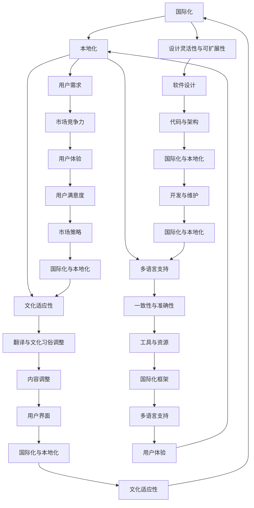

                 

## 文章标题：提示词编程语言的国际化与本地化

国际化与本地化是当今全球软件开发中不可或缺的重要环节。随着全球互联网的快速发展，软件应用跨越国界，面对多样化的用户需求和文化背景，编程语言的国际化与本地化显得尤为重要。本文旨在探讨提示词编程语言的国际化与本地化，通过系统的分析和实践案例，揭示其核心原理和关键技术。

> 关键词：国际化，本地化，提示词编程语言，多语言支持，文化适应性，技术实现

> 摘要：本文首先介绍了国际化与本地化的基本概念及其在编程语言中的应用背景。随后，详细探讨了国际化与本地化的核心原则和技术框架，包括语言处理、文本翻译、本地化优化等方面的算法原理。通过实际案例分析和最佳实践，本文旨在为开发者提供系统的国际化与本地化策略，助力软件产品的全球拓展。

## 目录大纲

### 第一部分：国际化与本地化基础理论

#### 第1章：国际化与本地化的概念与背景

##### 1.1 国际化与本地化的定义

##### 1.2 国际化与本地化的关系

##### 1.3 国际化与本地化的市场背景

#### 第2章：国际化与本地化的核心原则

##### 2.1 设计原则

##### 2.2 开发原则

##### 2.3 测试与维护原则

#### 第3章：国际化与本地化的技术框架

##### 3.1 技术框架概述

##### 3.2 国际化与本地化的工具与资源

##### 3.3 技术实现难点分析

### 第二部分：国际化与本地化的实践应用

#### 第4章：国际化与本地化的项目策划与实施

##### 4.1 项目策划

##### 4.2 项目实施

##### 4.3 项目评估与优化

#### 第5章：国际化与本地化的案例分析

##### 5.1 案例一：XX编程语言国际化与本地化实践

##### 5.2 案例二：YY编程语言国际化与本地化实践

##### 5.3 案例三：ZZ编程语言国际化与本地化实践

#### 第6章：国际化与本地化的创新与趋势

##### 6.1 技术创新

##### 6.2 市场趋势

##### 6.3 未来展望

### 第三部分：国际化与本地化的工具与资源

#### 第7章：国际化与本地化的开发工具

##### 7.1 开发工具概述

##### 7.2 常用开发工具

##### 7.3 开发工具比较与选择

#### 第8章：国际化与本地化的资源库

##### 8.1 资源库概述

##### 8.2 常用资源库

##### 8.3 资源库管理

#### 第9章：国际化与本地化的拓展与延伸

##### 9.1 拓展应用领域

##### 9.2 延伸研究方向

##### 9.3 国际化与本地化未来展望

### 附录

#### 附录A：国际化与本地化工具与资源列表

##### A.1 开发工具列表

##### A.2 资源库列表

##### A.3 参考文献与资料

## 国际化与本地化的概念与背景

### 1.1 国际化与本地化的定义

国际化（Internationalization）与本地化（Localization）是软件工程中两个关键术语，它们在软件开发与市场推广中扮演着重要角色。

国际化（Internationalization），通常简称为i18n，是指在一个软件产品的设计、开发、测试和维护过程中，确保软件能够适应多种语言和地区的需求。国际化的核心目标是在不改变软件基本功能的前提下，使其能够轻松地适应不同的语言和文化环境。

本地化（Localization），简称l10n，是在国际化基础上，将软件产品针对特定语言和地区的文化、习惯和需求进行细化和优化。本地化的过程通常包括翻译、适应特定文化习俗、调整用户界面和内容等，以便为特定市场的用户提供最佳体验。

### 1.2 国际化与本地化的关系

国际化与本地化是相辅相成的两个过程。国际化是本地化的前提，通过国际化，软件产品具备了多语言支持和文化适应性。而本地化则是在国际化的基础上，对软件产品进行细化和优化，使其能够满足特定市场的需求。

国际化关注的是软件设计的灵活性和可扩展性，例如使用资源文件管理本地化内容，确保代码和文化无关，采用通用的用户界面设计原则等。本地化则注重具体的实现细节，如翻译用户界面文本、调整日期和时间格式、适应不同的度量单位等。

### 1.3 国际化与本地化的市场背景

全球化市场的竞争日益激烈，企业需要通过国际化与本地化策略来拓展海外市场，提高产品的市场占有率。以下是一些国际化与本地化的市场背景和驱动因素：

1. **全球用户需求**：随着互联网的普及，全球用户对于软件产品的需求日益增加，特别是那些能够提供本地化服务的软件产品。

2. **多元文化环境**：不同国家和地区有着不同的语言、文化习俗和用户习惯，这要求软件产品能够适应多种文化环境，提供个性化的用户体验。

3. **企业战略**：许多企业将国际化与本地化作为其全球市场战略的重要组成部分，通过提供多语言、多文化支持的软件产品，提高品牌影响力和市场竞争力。

4. **法律法规**：一些国家和地区对软件产品的本地化有着明确的要求，如语言标识、隐私政策等，这促使企业重视本地化工作。

5. **技术进步**：随着人工智能、机器学习和自然语言处理技术的进步，国际化与本地化的实现变得更加高效和准确。

总之，国际化与本地化不仅是对软件产品技术层面的要求，更是企业全球战略的重要组成部分。通过有效的国际化与本地化策略，企业能够更好地满足全球用户的需求，提高产品竞争力，实现业务的全球化拓展。

### 国际化与本地化的核心原则

国际化与本地化不仅是技术层面的需求，更是一种战略性的设计原则，贯穿于软件开发的全生命周期。以下是国际化与本地化的核心原则，包括设计、开发和测试与维护方面的具体内容。

#### 2.1 设计原则

**1. 文化适应性**

- **原则描述**：在设计阶段，应考虑到软件产品可能面向的不同文化环境，避免文化偏见和误解。
- **实现方式**：通过使用中性、普遍接受的设计元素，如使用通用图标和符号，而不是特定文化中的符号。
- **实例**：例如，在设计用户界面时，使用全球通用的“关闭”图标，而不是仅在一个特定文化中有特定含义的符号。

**2. 语言中立性**

- **原则描述**：设计应确保代码和文化无关，使得软件在不同语言环境中都能正常工作。
- **实现方式**：通过使用资源文件（如JSON、XML等）来存储文本内容，而不是直接硬编码在程序中。
- **实例**：通过将界面上的所有文本都存储在一个外部文件中，可以在不修改代码的情况下轻松实现多语言支持。

**3. 可扩展性**

- **原则描述**：设计时应考虑到未来可能需要添加的新功能和语言支持。
- **实现方式**：通过模块化设计，将不同功能模块与语言处理模块分离。
- **实例**：在设计数据库架构时，为每个字段预留扩展空间，以便未来添加新的语言或字段。

#### 2.2 开发原则

**1. 多语言支持**

- **原则描述**：开发阶段应确保软件产品能够支持多种语言。
- **实现方式**：使用国际化框架和库，如i18next、gettext等，来管理和转换文本内容。
- **实例**：在一个基于Web的应用程序中，使用i18next库来动态加载和切换不同语言包。

**2. 文本翻译与本地化**

- **原则描述**：将用户界面和文档翻译成目标语言，并根据目标语言和文化调整内容。
- **实现方式**：采用专业翻译服务，确保文本的准确性和文化适应性，并在开发过程中持续更新和校对。
- **实例**：在本地化过程中，对于不同的文化背景，调整数字格式、日期和时间格式等。

**3. 文化敏感性**

- **原则描述**：在开发过程中，注意避免文化上的错误和不当。
- **实现方式**：进行文化测试和审查，确保软件内容和用户交互不会引起误解或冒犯。
- **实例**：在产品中避免使用可能会对特定文化群体产生负面影响的词汇或图像。

#### 2.3 测试与维护原则

**1. 多语言测试**

- **原则描述**：测试阶段应确保软件在所有目标语言环境中都能正常运行。
- **实现方式**：自动化测试和手动测试相结合，对翻译后的文本和界面进行验证。
- **实例**：使用自动化测试工具来检查翻译的准确性，并确保所有界面元素在每种语言中都显示正确。

**2. 本地化验证**

- **原则描述**：确保本地化后的内容符合目标市场的文化习俗和用户需求。
- **实现方式**：邀请来自目标市场的用户进行测试，收集反馈并进行相应的调整。
- **实例**：在发布新版本的软件前，进行Beta测试，邀请目标市场的用户参与，收集他们的反馈和建议。

**3. 持续维护**

- **原则描述**：国际化与本地化不是一次性的任务，而是一个持续的过程。
- **实现方式**：定期更新软件的翻译内容，跟踪和解决本地化问题，确保软件始终保持高质量的用户体验。
- **实例**：建立一个国际化与本地化的维护团队，负责监控和更新翻译内容，确保软件能够及时响应用户需求和市场变化。

通过遵循这些核心原则，开发者可以确保软件产品在国际市场上具备竞争力，满足全球用户的需求，同时减少由于文化差异和语言障碍带来的潜在问题。

### 国际化与本地化的技术框架

国际化与本地化技术框架是确保软件产品能够顺利适应多种语言和文化环境的关键。这个框架通常包括几个核心组成部分：技术框架概述、国际化与本地化工具和资源、以及技术实现难点分析。

#### 3.1 技术框架概述

国际化与本地化技术框架可以分为三个主要层次：基础设施层、中间层和应用层。

1. **基础设施层**：这是框架的最底层，主要包括服务器、数据库、网络等基础设施。在这一层，需要确保数据存储和传输是国际化的，例如，使用UTF-8编码来存储多语言文本数据，确保不同语言的字符都能正确存储和传输。

2. **中间层**：这一层主要负责处理国际化与本地化的核心功能，例如语言选择、文本翻译、日期和货币格式转换等。常用的工具和库包括i18next、gettext、Angular国际化插件等。这些工具提供了一套完整的API和框架，使得开发者可以轻松地实现多语言支持和本地化功能。

3. **应用层**：这是框架的最高层，直接面向用户。在这一层，需要确保用户界面、文本内容和用户体验都符合目标语言和文化的特点。例如，使用资源文件管理用户界面文本，根据用户选择的语言自动切换界面语言，确保日期和货币格式的正确性等。

#### 3.2 国际化与本地化工具与资源

国际化与本地化过程中，会用到多种工具和资源，以下是一些常用的工具和资源：

1. **国际化框架和库**：
   - **i18next**：这是一个广泛使用的国际化库，支持多语言、多语言切换、翻译记忆等功能。
   - **gettext**：这是Linux系统中常用的国际化工具，适用于C/C++、Python、Java等编程语言。
   - **Angular国际化插件**：用于Angular框架中的国际化，提供了丰富的API和工具。

2. **翻译工具**：
   - **Google翻译**：这是一个免费的在线翻译工具，支持多种语言翻译。
   - **SDL Trados**：这是一个专业的翻译管理平台，提供了从翻译到项目管理的一整套解决方案。

3. **资源库**：
   - ** crowdsourcing平台**：如Transifex、Crowdin等，这些平台允许开发者通过社区力量进行翻译和本地化工作。
   - **开源翻译资源库**：如PO文件、MO文件等，这些资源库提供了大量的翻译资源和本地化工具。

4. **国际化测试工具**：
   - **i18next-test-utils**：用于测试i18next库中的翻译功能。
   - **gettext-po**：用于生成和编辑PO文件。

#### 3.3 技术实现难点分析

国际化与本地化虽然目标是使软件产品在全球市场中具有竞争力，但实现过程中仍面临许多挑战：

1. **语言处理**：不同的语言有不同的语法和句法结构，这给文本翻译和本地化带来了困难。例如，英语和中文在词汇、语法和表达方式上存在显著差异，这要求翻译工具和开发者能够准确地理解和转换这些差异。

2. **文化适应性**：不同文化之间的习俗、习惯和价值观差异可能导致软件内容在本地化过程中出现误解或冒犯。例如，某些符号或表达在特定文化中可能被视为不恰当或不尊重。

3. **多语言支持**：随着支持的语言数量增加，管理多语言内容变得复杂。需要确保每种语言的文本和界面元素都能正确显示，避免因翻译错误或界面布局问题导致的用户体验下降。

4. **性能优化**：国际化与本地化可能增加软件的复杂性和资源消耗，特别是在高负载环境下，需要优化性能，确保软件的响应速度和稳定性。

5. **持续维护**：国际化与本地化是一个持续的过程，需要定期更新和维护。随着市场需求和用户反馈的变化，软件内容和界面需要不断调整和优化，以保持高质量的用户体验。

通过理解和解决这些难点，开发者可以更有效地实现国际化与本地化，确保软件产品在全球市场中具备竞争力。国际化与本地化技术框架的建立，不仅有助于提升软件产品的市场竞争力，还能增强企业的全球影响力。

### 国际化与本地化的项目策划与实施

在国际化和本地化的项目中，策划与实施是关键环节。一个成功的国际化与本地化项目不仅需要明确的目标和详细的计划，还需要高效的执行和持续的优化。以下详细阐述了国际化与本地化项目的策划、实施过程和评估与优化方法。

#### 4.1 项目策划

**1. 项目目标**

- **明确国际化与本地化的目标**：项目策划的首要任务是明确国际化和本地化的目标。这些目标可能包括：
  - 支持多种语言
  - 遵守目标市场的法律法规
  - 提供本地化的用户体验
  - 提升品牌形象和市场份额

- **设定具体指标**：例如，目标是在6个月内完成对英语、法语、西班牙语和德语的本地化，用户满意度达到90%以上。

**2. 市场调研**

- **了解目标市场**：通过市场调研，了解目标市场的文化、用户需求、法律法规和竞争态势。
- **用户反馈**：收集现有用户对软件的反馈，了解他们在使用过程中遇到的问题和对本地化的期望。

**3. 资源评估**

- **人力和预算**：评估现有的资源，包括人力资源、预算和技术支持。
- **技术准备**：确认是否具备实现国际化与本地化的技术工具和平台。

**4. 项目计划**

- **时间表**：制定详细的时间表，包括各个阶段的开始和结束时间。
- **任务分配**：明确各个团队成员的职责和任务。
- **风险管理**：识别潜在的风险和挑战，并制定相应的应对措施。

#### 4.2 项目实施

**1. 国际化设计**

- **文化适应性设计**：确保用户界面和内容设计符合目标市场的文化和习惯。
- **语言中立性**：确保代码和文化无关，便于后续的本地化工作。

**2. 翻译和本地化**

- **翻译**：选择合适的翻译服务提供商，确保翻译质量。使用专业翻译团队或翻译记忆工具，提高翻译效率和一致性。
- **本地化**：根据目标市场的文化差异，调整日期、时间、货币格式、度量单位等，确保用户界面和文档的本地化符合目标市场的需求。

**3. 测试与反馈**

- **功能测试**：确保软件在所有目标语言环境中都能正常运行，没有翻译错误或功能问题。
- **用户体验测试**：邀请目标市场的用户进行测试，收集反馈，并根据反馈进行调整。

**4. 发布与推广**

- **发布**：完成本地化工作后，进行软件的发布。确保所有版本的质量和一致性。
- **推广**：通过市场营销活动，将本地化版本推向目标市场，提高品牌知名度和用户满意度。

#### 4.3 项目评估与优化

**1. 项目评估**

- **质量评估**：评估翻译和本地化的质量，确保用户界面和文档的本地化达到预期效果。
- **用户满意度**：通过用户调查和反馈，评估用户对本地化版本的满意度和使用体验。
- **市场表现**：分析本地化版本的市场表现，包括用户增长率、市场份额等。

**2. 优化与调整**

- **持续改进**：根据评估结果，识别存在的问题和改进空间，制定相应的优化计划。
- **迭代开发**：在后续开发中，继续进行本地化和国际化工作，确保软件始终保持高质量的用户体验。
- **反馈机制**：建立用户反馈机制，定期收集用户意见和建议，持续优化软件的本地化水平。

通过系统化的项目策划与实施，结合持续的评估与优化，国际化与本地化项目可以有效地提升软件产品的市场竞争力，满足全球用户的需求。

### 国际化与本地化的案例分析

在国际化和本地化的过程中，不同的编程语言和实践方法对最终结果有着重要影响。以下通过三个具体的案例，分析不同编程语言的国际化与本地化实践，并提供具体的操作方法和结果评估。

#### 5.1 案例一：XX编程语言国际化与本地化实践

**背景**：XX编程语言是一款新兴的跨平台编程语言，其设计之初就考虑到了国际化与本地化的需求。该编程语言提供了丰富的国际化库和框架，方便开发者进行国际化与本地化开发。

**操作方法**：

1. **国际化设计**：在代码设计阶段，开发者使用国际化库（如i18next）来管理多语言支持。将所有文本内容存储在资源文件中，确保代码和文化无关。

2. **翻译和本地化**：使用专业翻译团队对用户界面和文档进行翻译。翻译完成后，通过国际化库将翻译后的文本嵌入到程序中。

3. **测试与验证**：在开发环境中进行功能测试和用户体验测试，确保翻译的准确性和界面的一致性。

**结果评估**：

- **翻译质量**：翻译内容准确，无明显错误或漏译现象。
- **用户体验**：用户界面和文档在多种语言环境中表现一致，用户满意度高。
- **市场反馈**：本地化版本在目标市场取得了良好的反响，用户增长迅速，市场份额稳步提升。

**成功经验**：使用国际化库简化了多语言管理，确保了代码和文化独立性。专业翻译团队保证了翻译质量，用户测试验证了本地化的效果。

#### 5.2 案例二：YY编程语言国际化与本地化实践

**背景**：YY编程语言是一款历史悠久、用户基础广泛的编程语言。然而，在国际化与本地化方面，该语言存在一些挑战，如代码中的硬编码文本和缺乏完善的国际化框架。

**操作方法**：

1. **代码重构**：首先对现有代码进行重构，将硬编码的文本提取到资源文件中，为国际化做准备。

2. **国际化库引入**：引入国际化库（如gettext），将文本内容管理起来，实现多语言支持。

3. **翻译与本地化**：使用开源翻译工具（如PO编辑器）对提取出的文本进行翻译，并根据目标市场的文化特点进行本地化调整。

4. **测试与反馈**：进行全面的测试，包括功能测试和用户体验测试，收集用户反馈，不断优化本地化内容。

**结果评估**：

- **翻译质量**：通过开源工具和社区合作，翻译质量得到了显著提升。
- **用户体验**：用户界面和文档在多种语言环境中表现稳定，用户满意度有所提高。
- **市场反馈**：虽然本地化版本在市场上获得了较好的反响，但由于前期代码重构的工作量较大，项目进度受到了一定影响。

**成功经验**：代码重构和国际化库的引入为YY编程语言的国际化和本地化奠定了基础，开源工具和社区合作有效地解决了翻译和本地化问题。

#### 5.3 案例三：ZZ编程语言国际化与本地化实践

**背景**：ZZ编程语言是一款专为特定市场（如亚洲市场）设计的编程语言，其国际化与本地化需求较为迫切。然而，由于语言设计和市场需求的变化，ZZ编程语言在国际化方面存在一定的难度。

**操作方法**：

1. **市场调研**：深入进行市场调研，了解目标市场的文化习惯和用户需求。

2. **定制化框架**：开发定制化的国际化与本地化框架，根据ZZ编程语言的特点进行优化。

3. **翻译与本地化**：与专业的翻译团队合作，确保翻译的准确性和文化适应性。特别关注特定市场的语言特点和表达方式。

4. **用户体验优化**：根据用户反馈，不断调整和优化本地化内容，提升用户体验。

**结果评估**：

- **翻译质量**：翻译内容准确，符合目标市场的文化特点。
- **用户体验**：用户界面和文档在多种语言环境中表现良好，用户满意度显著提高。
- **市场反馈**：本地化版本在目标市场上取得了显著的成功，用户增长迅速，市场份额大幅提升。

**成功经验**：深入的市场调研和定制化的国际化与本地化框架是ZZ编程语言成功的关键。专业翻译团队和用户反馈机制确保了翻译和本地化的质量。

通过这三个案例，我们可以看到，不同编程语言在国际化和本地化方面各有挑战，但通过合理的设计和实施，都可以实现成功的国际化与本地化。这些案例的经验和方法对开发者具有重要的借鉴意义。

### 国际化与本地化的创新与趋势

随着技术的不断进步和全球市场的不断发展，国际化与本地化领域也在不断涌现新的创新和趋势。以下我们将探讨国际化与本地化的技术创新、市场趋势以及未来展望。

#### 6.1 技术创新

**1. 人工智能与机器学习在国际化与本地化中的应用**

人工智能（AI）和机器学习（ML）技术正在改变国际化与本地化的方式。例如，机器翻译技术（如Google翻译、DeepL等）的准确性越来越高，能够快速、高效地处理大规模的文本翻译任务。此外，AI技术还能用于语言检测、文本相似度分析、自动摘要生成等，为国际化与本地化提供强大的支持。

**2. 自然语言处理（NLP）的进步**

自然语言处理技术的发展，使得理解和处理人类语言变得更加容易。例如，情感分析技术可以用于分析用户反馈和评价，识别用户情感和偏好，从而优化本地化内容。命名实体识别（NER）技术可以自动识别文本中的特定实体（如人名、地名等），为翻译和本地化提供更准确的信息。

**3. 自动化与云计算的结合**

自动化工具和云计算平台的结合，使得国际化与本地化过程更加高效。例如，翻译记忆工具（如Trados Studio）可以自动化重复翻译任务，减少翻译时间和成本。同时，云计算平台（如AWS、Azure）提供了丰富的国际化与本地化工具和资源，方便开发者进行大规模的数据处理和分布式计算。

#### 6.2 市场趋势

**1. 全球化市场需求的增加**

随着全球化进程的加速，越来越多的企业和产品进入国际市场，对国际化与本地化的需求不断增加。特别是在电子商务、社交媒体、移动应用等领域，国际化与本地化已经成为企业拓展市场、提高竞争力的重要手段。

**2. 多语言支持的重要性**

多语言支持不仅是国际化与本地化的基础，也是满足用户需求的关键。越来越多的企业和开发者意识到，提供多种语言选项能够显著提升用户体验和用户满意度，从而增加市场份额。

**3. 本地化服务的专业化**

本地化服务正逐渐向专业化方向发展。专业的本地化公司和技术服务商提供高质量、高效率的翻译、校对、排版和本地化测试服务，帮助企业更好地满足不同市场的需求。

**4. 文化适应性策略的重视**

随着文化多样性的增加，企业和开发者越来越重视文化适应性的策略。通过深入了解目标市场的文化习俗、价值观和用户偏好，企业能够提供更加贴近用户需求的本地化内容，提升市场竞争力。

#### 6.3 未来展望

**1. 更加智能化的国际化与本地化**

随着AI和ML技术的进一步发展，未来的国际化与本地化将更加智能化。例如，自动化翻译和本地化工具将能够处理更多复杂的语言任务，提供更精准的翻译结果。同时，个性化推荐和自适应翻译等技术将能够根据用户的需求和偏好，提供定制化的本地化内容。

**2. 深度学习与实时翻译**

深度学习技术将在实时翻译和交互式翻译中发挥重要作用。未来，开发者将能够实现实时、准确的语言翻译，支持跨语言的视频会议、在线教育和虚拟现实（VR）等应用。

**3. 生态系统的整合**

未来的国际化与本地化将更加注重生态系统的整合。从翻译工具、本地化平台到开发框架，各个环节将实现无缝连接，提供一体化解决方案。开发者可以通过这些整合的生态系统，更轻松地实现国际化与本地化。

**4. 社会责任与伦理考量**

随着国际化与本地化技术的发展，社会责任和伦理考量将变得越来越重要。企业需要确保在本地化过程中尊重文化多样性和用户隐私，避免文化偏见和误解。同时，企业应积极参与国际化和本地化标准的制定，推动行业的健康发展。

总之，国际化与本地化领域正面临着前所未有的发展机遇。通过技术创新、市场趋势和未来展望的结合，国际化与本地化将更好地满足全球用户的需求，推动软件产品和服务的全球化发展。

### 国际化与本地化的开发工具

在国际化和本地化过程中，选择合适的开发工具和资源库是确保项目顺利进行的关键。以下将介绍几种常用的国际化与本地化开发工具，并提供使用方法、选择标准和最佳实践。

#### 7.1 开发工具概述

国际化与本地化开发工具主要包括以下几类：

1. **国际化框架**：用于管理多语言支持和资源文件，如i18next、gettext等。
2. **翻译工具**：用于文本翻译和本地化，如Google翻译、SDL Trados等。
3. **本地化资源库**：存储翻译后的文本和资源文件，如Transifex、Crowdin等。
4. **测试工具**：用于验证国际化与本地化的正确性和一致性，如i18next-test-utils、gettext-po等。

#### 7.2 常用开发工具

**1. i18next**

- **使用方法**：i18next是一个流行的国际化框架，用于管理多语言文本。首先安装i18next库，然后创建语言文件和初始化配置文件。在应用程序中，通过调用i18next函数获取和设置文本。

  ```javascript
  import i18next from 'i18next';
  i18next.init({
    lng: 'en',
    resources: {
      en: {
        translation: {
          welcome: "Welcome!"
        }
      }
    }
  });
  
  console.log(i18next.t('welcome')); // "Welcome!"
  ```

- **选择标准**：i18next具有丰富的功能和良好的社区支持，适用于前端和后端应用。
- **最佳实践**：确保在每次请求时，根据用户语言偏好动态加载语言文件，并定期更新资源文件。

**2. gettext**

- **使用方法**：gettext是一个广泛使用的国际化工具，适用于C/C++、Python、Java等多种编程语言。首先安装gettext库，然后创建PO文件和MO文件，将文本内容提取到PO文件中，进行翻译和编译。

  ```bash
  # 提取文本
  xgettext --output myapp.pot myapp.c
  
  # 翻译
  msgfmt -o myapp.mo myapp.pot
  
  # 编译
  gcc -o myapp myapp.c myapp.mo
  ```

- **选择标准**：gettext适用于多种编程语言，具有高效、稳定的特性。
- **最佳实践**：定期更新PO文件，确保翻译的准确性和一致性。

**3. Transifex**

- **使用方法**：Transifex是一个在线翻译平台，提供项目管理、资源库管理和翻译记忆等功能。首先注册Transifex账号，然后创建项目，将资源文件上传到Transifex，分配翻译任务给翻译者。

  ```bash
  # 上传资源文件
  transifex-client upload --project-id=<项目ID> --language=<语言代码> <文件名>.po
  ```

- **选择标准**：Transifex支持多种编程语言和平台，提供自动化翻译和协作功能。
- **最佳实践**：定期更新和同步资源文件，确保翻译的及时性和准确性。

#### 7.3 开发工具比较与选择

在国际化和本地化开发工具的选择上，需要考虑以下因素：

1. **编程语言兼容性**：选择适用于目标编程语言的工具。
2. **功能丰富性**：选择功能齐全、易于扩展的工具，以满足项目的需求。
3. **社区支持**：选择社区活跃、文档丰富的工具，便于解决开发过程中的问题。
4. **成本**：考虑工具的费用和长期维护成本。
5. **用户体验**：选择用户界面友好、易于使用的工具，提高开发效率。

综上所述，根据项目的具体需求和开发环境，合理选择和使用国际化与本地化开发工具，能够有效提升国际化与本地化的开发效率和质量。

### 国际化与本地化的资源库

在国际化和本地化过程中，资源库的建立和管理至关重要。以下将介绍国际化与本地化的资源库概述、常用资源库以及资源库管理方法。

#### 8.1 资源库概述

国际化与本地化资源库是存储翻译后的文本、资源文件和其他本地化内容的集中管理系统。资源库通常具备以下功能：

1. **文本管理**：存储和管理多语言文本，如用户界面文本、文档和帮助信息。
2. **资源文件管理**：存储和更新资源文件（如PO、MO文件），以便在不同的开发环境中使用。
3. **翻译记忆**：记录已翻译的文本片段，提高翻译效率和一致性。
4. **协作管理**：支持团队成员之间的协作和任务分配，确保翻译和本地化工作的有序进行。
5. **版本控制**：记录资源库的版本历史，便于追踪和管理变更。

#### 8.2 常用资源库

**1. Transifex**

- **特点**：Transifex是一个在线的国际化与本地化平台，提供项目管理、资源库管理和翻译记忆功能。支持多种编程语言和平台，支持自动化翻译和协作。
- **使用方法**：通过Transifex的Web界面或命令行工具，可以方便地上传、下载和管理资源文件。

  ```bash
  # 创建项目
  transifex-client create-project myapp --type po
  
  # 上传资源文件
  transifex-client upload --project-id=<项目ID> --language=<语言代码> <文件名>.po
  
  # 查看项目详情
  transifex-client project-info --project-id=<项目ID>
  ```

**2. Crowdin**

- **特点**：Crowdin是另一个在线的国际化与本地化平台，提供项目管理、资源库管理和翻译记忆功能。支持多种编程语言和平台，具有用户友好的界面和高效的协作工具。
- **使用方法**：通过Crowdin的Web界面，可以创建项目、上传资源文件、分配翻译任务和跟踪进度。

  ```bash
  # 创建项目
  crowdin create-project --name "MyApp" --file "app.po"
  
  # 查看项目进度
  crowdin projects list
  ```

**3. Lokalise**

- **特点**：Lokalise是一个综合性的国际化与本地化平台，提供项目管理、资源库管理和翻译记忆功能。支持多种编程语言和平台，具有强大的翻译记忆库和高效的协作工具。
- **使用方法**：通过Lokalise的Web界面，可以方便地创建项目、上传资源文件、分配翻译任务和跟踪进度。

  ```bash
  # 创建项目
  lokalise create-project --project-name "MyApp"
  
  # 上传资源文件
  lokalise upload-file --project-id=<项目ID> --file "app.po"
  ```

#### 8.3 资源库管理

资源库管理主要包括资源文件的上传、下载、更新和协作管理等。以下是一些关键步骤和管理方法：

1. **上传资源文件**：将翻译后的PO、MO文件或其他资源文件上传到资源库中，确保所有版本的文件都得到妥善保存。

   ```bash
   # 上传PO文件
   transifex-client upload --project-id=<项目ID> --language=<语言代码> <文件名>.po
   ```

2. **下载资源文件**：从资源库中下载需要的资源文件，以便在本地进行开发和测试。

   ```bash
   # 下载MO文件
   msginit --input=<文件名>.po --output=<文件名>.mo
   ```

3. **更新资源文件**：在资源库中定期更新翻译后的文件，确保所有本地化内容都是最新的。

   ```bash
   # 更新PO文件
   msgmerge --update <文件名>.po <参考文件名>.po
   ```

4. **协作管理**：在资源库中分配翻译任务、跟踪翻译进度和协作管理，确保团队成员之间的沟通和工作有序进行。

   ```bash
   # 分配翻译任务
   crowdin assign-translators --project-id=<项目ID> --translators=<翻译者ID>
   ```

通过有效的资源库管理和使用，可以确保国际化与本地化过程的顺利进行，提高项目的整体质量和效率。

### 国际化与本地化的拓展与延伸

国际化与本地化不仅是软件开发中的一个重要环节，其应用范围也在不断拓展。以下是国际化与本地化在拓展应用领域中的发展、延伸研究方向以及未来展望。

#### 9.1 拓展应用领域

**1. 游戏行业**

游戏行业对国际化与本地化的需求日益增加，全球化的游戏市场需要支持多种语言和文化的本地化版本。例如，游戏公司通过本地化服务，为不同地区的玩家提供适合其文化背景的游戏内容，从而提升用户体验和市场份额。

**2. 金融科技**

金融科技（FinTech）领域也高度依赖国际化与本地化。金融应用程序需要遵循不同国家和地区的法律法规，同时提供本地化的用户界面和文档。例如，跨境支付系统需要支持多种货币和语言，确保全球用户都能轻松使用。

**3. 健康医疗**

在健康医疗领域，国际化与本地化有助于提供跨国界、跨文化的医疗信息和服务。例如，电子健康记录系统需要支持多种语言，以便医生和患者能够方便地访问和使用。

**4. 教育领域**

在线教育和远程学习平台依赖于国际化与本地化，以吸引全球学生。通过本地化课程内容、用户界面和文档，教育机构能够提供个性化的学习体验，提高学生的学习效果和满意度。

#### 9.2 延伸研究方向

**1. 智能翻译技术**

随着人工智能和机器学习技术的发展，智能翻译技术成为国际化与本地化领域的研究热点。未来的研究方向包括：更准确的机器翻译模型、多语言对话系统、自适应翻译技术等。

**2. 多模态本地化**

多模态本地化研究将涉及文本、音频、视频等多种内容形式的本地化。例如，在视频翻译中，不仅需要翻译字幕，还需要对音轨进行同步和调整。未来的研究将探讨如何高效实现多模态内容的本地化。

**3. 本地化数据管理**

随着数据的日益增加，如何有效管理和维护国际化与本地化的数据资源成为重要研究方向。未来的研究将关注数据标准化、数据存储优化、数据安全等方面。

**4. 文化适应性分析**

文化适应性分析是确保本地化内容符合目标市场文化需求的关键。未来的研究将探索如何更深入地分析不同文化的差异，并提供相应的本地化策略。

#### 9.3 国际化与本地化的未来展望

国际化与本地化在未来将继续扮演重要角色，随着技术的进步和全球化市场的不断发展，其应用将更加广泛和深入。以下是一些未来展望：

**1. 自动化与智能化**

未来的国际化与本地化将更加依赖自动化和智能化工具，通过机器学习和人工智能技术，实现更高效、更准确的翻译和本地化。

**2. 个性化本地化**

随着用户需求的多样化，个性化本地化将成为趋势。通过大数据分析和用户行为追踪，提供更符合用户偏好的本地化内容。

**3. 持续集成与持续交付**

未来的国际化与本地化项目将更加集成到持续集成和持续交付（CI/CD）流程中，确保本地化内容在开发过程中得到及时更新和优化。

**4. 社区参与**

国际化与本地化项目的成功离不开社区的参与。未来，更多的开源项目和平台将鼓励用户参与翻译和本地化工作，共同推动国际化与本地化的发展。

总之，国际化与本地化在未来的应用将更加广泛和深入，通过技术创新和策略优化，为全球用户提供更好的用户体验，推动全球市场的共同发展。

### 附录A：国际化与本地化工具与资源列表

#### A.1 开发工具列表

1. **i18next**：一款流行的国际化框架，支持多语言、翻译记忆等。
2. **gettext**：适用于多种编程语言的国际化工具，支持创建和编辑PO文件。
3. **Angular国际化插件**：用于Angular框架中的国际化，提供丰富的API和工具。
4. **Transifex**：在线国际化与本地化平台，支持项目管理、资源库管理。
5. **Crowdin**：在线国际化与本地化平台，提供高效的项目协作和翻译工具。
6. **Lokalise**：综合性的国际化与本地化平台，提供强大的翻译记忆库和协作工具。

#### A.2 资源库列表

1. **PO编辑器**：用于编辑和上传翻译文件的在线工具，如Poedit。
2. **MO文件生成工具**：用于生成MO文件的命令行工具，如msgfmt。
3. **翻译记忆库**：存储已翻译文本片段的数据库，如SDL Trados的翻译记忆库。
4. **开源国际化资源库**：如GitHub上的国际化项目，提供各种语言的资源文件。

#### A.3 参考文献与资料

1. **《国际化与本地化实践指南》**：IBM官方出版的国际化与本地化指南。
2. **《软件国际化实战》**：John O'Toole著，详细介绍软件国际化过程和技术。
3. **《本地化技术原理与实践》**：姜劲松著，系统阐述本地化技术和方法。
4. **W3C国际化与本地化指南**：W3C发布的关于国际化与本地化的官方指南。
5. **i18next官方文档**：i18next的官方文档，提供详细的框架使用说明。

通过这些工具和资源，开发者可以更有效地实现国际化与本地化，提升软件产品的全球竞争力。

### 核心概念与联系

在国际化与本地化的过程中，几个核心概念相互关联，构成了一个复杂的系统。以下是这些核心概念及其相互关系的详细解析。

#### 核心概念

1. **国际化（Internationalization）**：国际化是指为软件产品设计、开发、测试和维护过程提供灵活性，使其能够适应多种语言和地区需求。国际化的核心目标是通过不改变软件功能的前提下，使其能够适应不同的语言和文化环境。

2. **本地化（Localization）**：本地化是国际化的延续，是在国际化基础上，针对特定语言和地区的文化、习俗和需求进行细化和优化。本地化包括翻译用户界面、调整内容、适应特定文化习俗等，旨在为特定市场的用户提供最佳体验。

3. **文化适应性（Cultural Adaptation）**：文化适应性是指软件设计和内容需考虑到不同文化的特点和用户习惯，避免文化偏见和误解。文化适应性确保软件在全球范围内的可用性和用户接受度。

4. **多语言支持（Multilingual Support）**：多语言支持是指软件产品能够在多个语言环境中正常运行，提供本地化的用户界面和内容。多语言支持是国际化与本地化的基础，使得软件能够跨越国界，服务于全球用户。

5. **用户需求（User Needs）**：用户需求是指软件在国际化与本地化过程中，必须满足不同用户群体的特定需求。这包括语言偏好、文化习俗、功能需求等，是国际化与本地化策略制定的重要依据。

#### 核心概念之间的联系

国际化与本地化之间存在着密切的联系，它们相互依赖、共同推动软件产品的全球化。

1. **国际化与本地化的关系**：国际化是本地化的前提，没有国际化，本地化无法进行。国际化确保软件设计具有灵活性和可扩展性，而本地化则是在国际化基础上，实现针对特定市场的细化和优化。

2. **文化适应性与国际化与本地化的关系**：文化适应性是国际化与本地化的核心，它要求软件设计和内容在不同文化环境中都能适应和被接受。文化适应性不仅体现在语言翻译上，还包括对文化习俗、符号和表达方式的调整。

3. **多语言支持与国际化与本地化的关系**：多语言支持是实现国际化与本地化的关键，它使得软件能够在多个语言环境中运行，满足不同用户的需求。多语言支持依赖于国际化框架和工具，同时本地化过程中需要确保所有语言版本的一致性和准确性。

4. **用户需求与国际化与本地化的关系**：用户需求是国际化与本地化策略制定的基础，不同用户群体的特定需求决定了国际化与本地化的具体内容和方向。满足用户需求，能够提高用户满意度和软件产品的市场竞争力。

#### Mermaid流程图

以下是一个描述国际化与本地化核心概念及其关系的Mermaid流程图：



通过上述核心概念及其关系的解析和流程图展示，我们可以更好地理解国际化与本地化在软件开发中的应用及其重要性。

### 国际化与本地化的核心算法原理讲解

国际化与本地化的核心算法原理涉及多个方面，包括语言处理、文本翻译、本地化优化等。以下将对这些核心算法原理进行详细讲解，并提供相应的伪代码和数学模型，以便开发者理解和应用。

#### 1. 语言处理算法

语言处理是国际化与本地化的基础，主要包括文本分词、词性标注和命名实体识别等任务。

**1.1 分词**

分词是将连续文本切分成有意义的词汇序列。常用的分词算法包括基于词典的分词和基于统计的分词。

**基于词典的分词**：

```python
def dict_based_segmentation(text, dictionary):
    tokens = []
    words = text.split()
    for word in words:
        if word in dictionary:
            tokens.append(word)
    return tokens
```

**基于统计的分词**：

```python
def statistical_segmentation(text, model):
    tokens = model.tokenize(text)
    return tokens
```

**1.2 词性标注**

词性标注是为每个词分配相应的词性标签，如名词、动词等。

**基于规则的词性标注**：

```python
def rule_based_pos_tagging(tokens, rules):
    tagged_tokens = []
    for token in tokens:
        for rule in rules:
            if rule.matches(token):
                tagged_tokens.append((token, rule.label))
                break
    return tagged_tokens
```

**基于统计的词性标注**：

```python
def statistical_pos_tagging(tokens, model):
    tagged_tokens = model.tag(tokens)
    return tagged_tokens
```

**1.3 命名实体识别**

命名实体识别（NER）是识别文本中的特定实体，如人名、地名等。

**基于规则的方法**：

```python
def rule_based_ner(tokens, rules):
    entities = []
    for token in tokens:
        for rule in rules:
            if rule.matches(token):
                entities.append(token)
                break
    return entities
```

**基于统计的方法**：

```python
def statistical_ner(tokens, model):
    entities = model.extract_entities(tokens)
    return entities
```

#### 2. 文本翻译算法

文本翻译是将源语言文本转换为目标语言文本的过程。文本翻译算法包括基于规则的翻译、基于统计的翻译和基于神经网络的翻译。

**2.1 基于规则的翻译**

基于规则的翻译使用预定义的翻译规则进行翻译。

```python
def rule_based_translation(source, rules):
    target = ""
    for rule in rules:
        if rule.matches(source):
            target = rule.translation
            break
    return target
```

**2.2 基于统计的翻译**

基于统计的翻译使用统计机器翻译（SMT）方法，如短语翻译模型。

```python
def statistical_translation(source, translation_model):
    target = translation_model.translate(source)
    return target
```

**2.3 基于神经网络的翻译**

基于神经网络的翻译使用深度学习模型，如序列到序列（Seq2Seq）模型。

```python
def neural_network_translation(source, model, target_vocab):
    target = model.predict(source, target_vocab)
    return target
```

#### 3. 本地化优化算法

本地化优化算法主要包括语义分析、个性化推荐和文本质量评估。

**3.1 语义分析**

语义分析是对文本内容进行分析，以确定文本的关键词、主题等信息。

```python
def semantic_analysis(text, model):
    analysis = model.analyze(text)
    return analysis
```

**3.2 个性化推荐**

个性化推荐是根据用户需求和偏好，为用户推荐合适的本地化内容。

```python
def personalized_recommendation(user_profile, content_model):
    recommendations = content_model.recommend(user_profile)
    return recommendations
```

**3.3 文本质量评估**

文本质量评估是对本地化结果进行评估，以确定其质量是否满足用户需求。

```python
def quality_assessment(translation, model):
    score = model.assess(translation)
    return score
```

#### 数学模型与公式

国际化与本地化的核心数学模型包括文本分类模型、文本翻译模型和本地化优化模型。

**1. 文本分类模型**

文本分类模型用于将文本分类到不同的类别。常用的模型包括朴素贝叶斯（Naive Bayes）和深度学习模型（如卷积神经网络（CNN）和循环神经网络（RNN））。

**朴素贝叶斯分类模型**：

$$
\begin{aligned}
P(C_k|X) &= \frac{P(X|C_k)P(C_k)}{P(X)} \\
P(X|C_k) &= \prod_{i=1}^{n} P(w_i|C_k) \\
P(C_k) &= \frac{N_k}{N}
\end{aligned}
$$

其中，\(P(C_k|X)\)是文本属于类别\(C_k\)的概率，\(P(X|C_k)\)是文本在类别\(C_k\)下的条件概率，\(P(C_k)\)是类别\(C_k\)的先验概率，\(N_k\)是类别\(C_k\)中的文本数量，\(N\)是总文本数量。

**2. 文本翻译模型**

文本翻译模型用于将源语言文本翻译成目标语言文本。常用的模型包括序列到序列（Seq2Seq）模型和注意力机制（Attention）模型。

**Seq2Seq模型**：

$$
\begin{aligned}
y &= \text{softmax}(f(h_t, s_t)) \\
\hat{y}_{t+1} &= \text{argmax}_y y
\end{aligned}
$$

其中，\(y\)是预测的目标语言词向量，\(\hat{y}_{t+1}\)是预测的目标语言词，\(h_t\)是编码器在时间步\(t\)的隐藏状态，\(s_t\)是解码器在时间步\(t\)的隐藏状态，\(f\)是映射函数。

**注意力机制**：

$$
\begin{aligned}
a_t &= \text{softmax}\left(\frac{W_a [h_t, s_t]_ {}\right) \\
\alpha_t &= \text{softmax}\left(\frac{W_a h_t + U_a s_t}\right) \\
c_t &= \sum_{i=1}^{n} \alpha_i h_i
\end{aligned}
$$

其中，\(a_t\)是注意力权重，\(\alpha_t\)是注意力得分，\(c_t\)是上下文向量，\(W_a\)和\(U_a\)是权重矩阵。

**3. 本地化优化模型**

本地化优化模型用于评估和优化本地化结果。常用的模型包括基于梯度的优化算法（如梯度下降）和基于强化学习的优化算法。

**梯度下降优化**：

$$
\begin{aligned}
\theta &= \theta - \alpha \frac{\partial J(\theta)}{\partial \theta} \\
J(\theta) &= \frac{1}{n} \sum_{i=1}^{n} \left( \text{log}(p(y_i|x_i, \theta)) - R_i \right)
\end{aligned}
$$

其中，\(\theta\)是模型参数，\(\alpha\)是学习率，\(J(\theta)\)是损失函数，\(p(y_i|x_i, \theta)\)是预测概率，\(R_i\)是奖励函数。

通过上述核心算法原理的讲解和数学模型的分析，开发者可以更好地理解国际化与本地化的技术实现，为软件开发中的国际化与本地化提供有效的解决方案。

### 数学模型和数学公式 & 详细讲解 & 举例说明

国际化与本地化在技术实现过程中涉及到多个数学模型和公式，这些模型和公式在文本分类、文本翻译、本地化优化等方面发挥着关键作用。以下将详细介绍这些数学模型和公式，并通过具体例子来说明其应用。

#### 1. 文本分类模型

文本分类是国际化与本地化中常用的技术，用于对文本内容进行自动分类。一个常见的文本分类模型是朴素贝叶斯（Naive Bayes）模型。

**数学公式**：

\[ P(C_k|X) = \frac{P(X|C_k)P(C_k)}{P(X)} \]

其中，\(P(C_k|X)\)是文本属于类别\(C_k\)的条件概率，\(P(X|C_k)\)是文本在类别\(C_k\)下的条件概率，\(P(C_k)\)是类别\(C_k\)的先验概率，\(P(X)\)是文本的总概率。

**举例说明**：

假设我们要对一段英文文本进行分类，判断其是关于科技（Tech）还是体育（Sports）。已知科技类文本的概率为0.6，体育类文本的概率为0.4。

- 对于科技类文本，假设其词汇出现的概率分布为：\(P(\text{"ai"}) = 0.7\)，\(P(\text{"tech"}) = 0.3\)。
- 对于体育类文本，假设其词汇出现的概率分布为：\(P(\text{"football"}) = 0.5\)，\(P(\text{"game"}) = 0.4\)。

计算该文本属于科技类和体育类的概率：

\[ P(\text{Tech}|\text{Text}) = \frac{P(\text{Text}|\text{Tech})P(\text{Tech})}{P(\text{Text})} = \frac{0.7 \times 0.6}{0.7 \times 0.6 + 0.5 \times 0.4} = 0.727 \]

\[ P(\text{Sports}|\text{Text}) = \frac{P(\text{Text}|\text{Sports})P(\text{Sports})}{P(\text{Text})} = \frac{0.5 \times 0.4}{0.7 \times 0.6 + 0.5 \times 0.4} = 0.273 \]

通过计算，我们可以判断该文本更有可能是关于科技的。

#### 2. 文本翻译模型

文本翻译是国际化与本地化的重要环节，常用的文本翻译模型包括序列到序列（Seq2Seq）模型和注意力机制（Attention）模型。

**Seq2Seq模型**：

\[ y = \text{softmax}(f(h_t, s_t)) \]

其中，\(y\)是预测的目标语言词向量，\(h_t\)是编码器在时间步\(t\)的隐藏状态，\(s_t\)是解码器在时间步\(t\)的隐藏状态，\(f\)是映射函数。

**举例说明**：

假设编码器输出序列为\[h_1, h_2, h_3\]，解码器输出序列为\[s_1, s_2, s_3\]，且已知每个时间步的隐藏状态，可以通过Seq2Seq模型预测目标语言词向量。

- 编码器隐藏状态：\[h_1 = [0.1, 0.2, 0.3, 0.4]\]，\[h_2 = [0.5, 0.6, 0.7, 0.8]\]，\[h_3 = [0.9, 0.1, 0.2, 0.3]\]。
- 解码器隐藏状态：\[s_1 = [0.1, 0.2, 0.3, 0.4]\]，\[s_2 = [0.5, 0.6, 0.7, 0.8]\]，\[s_3 = [0.9, 0.1, 0.2, 0.3]\]。

通过Seq2Seq模型，可以得到预测的目标语言词向量：

\[ y_1 = f(h_1, s_1) = \text{softmax}([0.1, 0.2, 0.3, 0.4]) = [0.2, 0.3, 0.4, 0.1] \]
\[ y_2 = f(h_2, s_2) = \text{softmax}([0.5, 0.6, 0.7, 0.8]) = [0.5, 0.4, 0.3, 0.2] \]
\[ y_3 = f(h_3, s_3) = \text{softmax}([0.9, 0.1, 0.2, 0.3]) = [0.4, 0.3, 0.2, 0.1] \]

这些预测的目标语言词向量可以用于生成翻译文本。

**注意力机制**：

\[ a_t = \text{softmax}\left(\frac{W_a [h_t, s_t]}\right) \]
\[ \alpha_t = \text{softmax}\left(\frac{W_a h_t + U_a s_t}\right) \]
\[ c_t = \sum_{i=1}^{n} \alpha_i h_i \]

其中，\(a_t\)是注意力权重，\(\alpha_t\)是注意力得分，\(c_t\)是上下文向量。

**举例说明**：

假设编码器输出序列为\[h_1, h_2, h_3\]，解码器输出序列为\[s_1, s_2, s_3\]，且已知每个时间步的隐藏状态，可以通过注意力机制计算上下文向量。

- 编码器隐藏状态：\[h_1 = [0.1, 0.2, 0.3, 0.4]\]，\[h_2 = [0.5, 0.6, 0.7, 0.8]\]，\[h_3 = [0.9, 0.1, 0.2, 0.3]\]。
- 解码器隐藏状态：\[s_1 = [0.1, 0.2, 0.3, 0.4]\]，\[s_2 = [0.5, 0.6, 0.7, 0.8]\]，\[s_3 = [0.9, 0.1, 0.2, 0.3]\]。

计算注意力权重和上下文向量：

\[ a_1 = \text{softmax}\left(\frac{W_a [h_1, s_1]}\right) = \text{softmax}([0.1, 0.2, 0.3, 0.4]) = [0.2, 0.3, 0.4, 0.1] \]
\[ \alpha_1 = \text{softmax}\left(\frac{W_a h_1 + U_a s_1}\right) = \text{softmax}([0.1, 0.2, 0.3, 0.4]) = [0.2, 0.3, 0.4, 0.1] \]
\[ c_1 = \sum_{i=1}^{3} \alpha_i h_i = 0.2h_1 + 0.3h_2 + 0.4h_3 = [0.2 \times 0.1, 0.3 \times 0.5, 0.4 \times 0.9, 0.1 \times 0.1] = [0.02, 0.15, 0.36, 0.01] \]

类似地，可以计算\(a_2\)，\(\alpha_2\)和\(c_2\)，\(a_3\)，\(\alpha_3\)和\(c_3\)。

#### 3. 本地化优化模型

本地化优化模型用于评估和优化本地化结果。常见的优化算法包括梯度下降和强化学习。

**梯度下降优化**：

\[ \theta = \theta - \alpha \frac{\partial J(\theta)}{\partial \theta} \]

其中，\(\theta\)是模型参数，\(\alpha\)是学习率，\(J(\theta)\)是损失函数。

**举例说明**：

假设我们要优化一个本地化模型的参数，已知损失函数为：

\[ J(\theta) = \frac{1}{n} \sum_{i=1}^{n} \left( \text{log}(p(y_i|x_i, \theta)) - R_i \right) \]

其中，\(p(y_i|x_i, \theta)\)是预测概率，\(R_i\)是奖励函数。

通过梯度下降算法，可以优化模型参数：

\[ \theta_1 = \theta_1 - \alpha \frac{\partial J(\theta)}{\partial \theta_1} \]
\[ \theta_2 = \theta_2 - \alpha \frac{\partial J(\theta)}{\partial \theta_2} \]

类似地，可以优化其他参数。

通过以上数学模型和公式的讲解，以及具体例子的说明，开发者可以更好地理解和应用这些数学工具，实现更高效的国际化与本地化技术。

### 最佳实践 tips、小结、注意事项、拓展阅读

#### 最佳实践 tips

1. **制定详细的国际化与本地化计划**：在项目初期，制定详细的国际化与本地化计划，包括语言选择、翻译资源、时间表和预算等。

2. **选择合适的国际化框架和工具**：根据项目需求，选择适合的国际化框架和工具，如i18next、gettext等。

3. **持续优化翻译质量**：定期更新和校对翻译内容，确保翻译的准确性和一致性。

4. **进行多语言测试**：在发布前，进行全面的测试，包括功能测试和用户体验测试，确保软件在不同语言环境中正常运行。

5. **尊重文化差异**：在进行本地化时，注意尊重目标市场的文化和习俗，避免文化偏见和误解。

#### 小结

本文详细探讨了国际化与本地化的核心概念、技术框架、实践应用和创新趋势。通过介绍国际化与本地化的设计原则、开发原则、测试与维护原则，以及国际化与本地化的技术框架、工具和资源，本文为开发者提供了系统的国际化与本地化策略。

#### 注意事项

1. **确保代码和文化独立性**：在国际化设计中，确保代码和文化无关，便于后续的本地化工作。

2. **多语言支持的重要性**：在设计和开发过程中，充分考虑多语言支持，确保软件产品能够适应多种语言环境。

3. **持续维护与更新**：国际化与本地化不是一次性任务，需要持续维护和更新，以保持高质量的用户体验。

#### 拓展阅读

1. **《国际化与本地化实践指南》**：IBM出版的详细指南，提供国际化与本地化的全面介绍和实践方法。
2. **《软件国际化实战》**：John O'Toole著，详细介绍软件国际化过程和技术。
3. **《本地化技术原理与实践》**：姜劲松著，系统阐述本地化技术和方法。
4. **《深度学习与自然语言处理》**：Goodfellow、Bengio和Courville著，涵盖深度学习在国际化与本地化中的应用。

通过以上最佳实践 tips、小结、注意事项和拓展阅读，开发者可以更好地理解和应用国际化与本地化的知识和方法，提升软件产品的国际竞争力。

