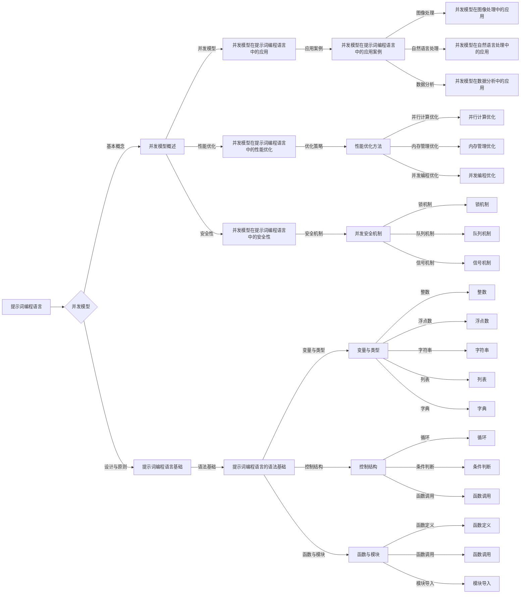

                 


### 文章标题

# 提示词编程语言的并发模型创新

### 关键词

- 提示词编程语言
- 并发模型
- 并行计算
- 性能优化
- 安全性
- AI应用

### 摘要

本文深入探讨了提示词编程语言在并发模型方面的创新。首先，我们回顾了并发模型的基本概念、发展历程和核心挑战，以及其在并行计算和并发编程中的应用。接着，我们介绍了提示词编程语言的基础概念、设计原则和语法基础。在此基础上，我们分析了并发模型在提示词编程语言中的应用，包括并发编程模型的选择、最佳实践和性能优化策略。此外，我们还探讨了并发模型在安全性方面的挑战和解决方案。最后，我们展望了并发模型在提示词编程语言中的未来发展趋势，包括基于AI的并发模型、软硬件协同的并发模型和动态并发模型等。通过本文的研究，我们期望为读者提供一个全面、深入的并发模型创新分析，以推动提示词编程语言的发展和应用。

### 第一部分: 提示词编程语言的并发模型创新

#### 第1章: 并发模型概述

并发模型是指计算机系统中多个独立运行的程序或任务（processes或threads）在共享资源（如内存、CPU时间、I/O设备等）时，如何协调和管理它们之间的竞争和协作。并发模型在计算机科学和工程中具有重要的地位，因为它们直接影响系统的性能、可靠性和可扩展性。

##### 1.1 并发模型的基本概念

###### 1.1.1 并发模型的发展历程

并发模型的发展历程可以追溯到20世纪50年代和60年代，当时计算机科学家开始研究如何有效地利用多处理器系统来提高计算性能。早期的研究主要集中在如何设计多处理器的硬件架构，以及如何为这些硬件架构提供高效的并发编程模型。随着计算机硬件的发展，处理器速度和存储容量不断提高，并发模型也逐渐变得更加复杂和多样。

在20世纪80年代和90年代，随着网络技术的兴起，并发模型的应用场景变得更加广泛。分布式系统、并行数据库和实时系统等领域都开始使用并发模型来提高系统的性能和可靠性。同时，操作系统和编译器也开始提供更多的并发编程支持，如线程和协程等。

进入21世纪，随着人工智能、大数据和云计算等新兴技术的崛起，并发模型再次受到广泛关注。人工智能系统中大量的并行计算任务需要高效的并发模型来支持，而大数据处理和云计算系统则需要并发模型来实现高效的数据访问和处理。因此，并发模型在当今计算机科学和工程中仍然具有重要的地位。

###### 1.1.2 并发模型的核心挑战

并发模型的核心挑战包括：

1. **数据竞争**：当多个进程或线程同时访问同一数据时，可能导致数据不一致或错误。数据竞争是并发系统中最常见的问题之一。
2. **死锁**：当多个进程或线程因相互等待对方释放资源而陷入无限等待的状态时，会发生死锁。死锁会导致系统性能下降，甚至导致系统崩溃。
3. **饥饿**：当一个进程或线程在长时间内无法获得所需资源时，会发生饥饿现象。饥饿会影响系统的公平性和性能。
4. **性能开销**：并发模型引入了额外的同步和通信开销，可能会降低系统的性能。如何平衡并发模型的性能开销和并发性能是一个重要挑战。

###### 1.1.3 并发模型的应用场景

并发模型广泛应用于各种计算机系统和应用场景，包括：

1. **并行计算**：在多核处理器和分布式系统上，并发模型可以有效地利用计算资源，提高计算性能。
2. **并发编程**：在多线程或协程编程中，并发模型可以简化编程复杂性，提高代码的可维护性和可扩展性。
3. **分布式系统**：在分布式系统中，并发模型可以协调和管理多个节点的通信和资源访问，提高系统的可靠性。
4. **实时系统**：在实时系统中，并发模型可以确保关键任务在规定的时间内完成，提高系统的实时性能。
5. **人工智能**：在人工智能系统中，并发模型可以加速训练和推理过程，提高系统的效率。

##### 1.2 并发模型的基本架构

并发模型的基本架构通常包括以下组件：

1. **处理器**：负责执行进程或线程的代码。在多核处理器上，每个核心可以独立执行进程或线程。
2. **内存**：存储进程或线程的数据和代码。内存管理是并发模型中的一个重要挑战。
3. **资源管理器**：负责分配和回收系统资源，如CPU时间、内存和I/O设备等。资源管理器可以采用不同的调度策略，如时间片轮转、优先级调度等。
4. **同步机制**：用于协调多个进程或线程之间的访问和通信。常见的同步机制包括锁、信号量、条件变量等。
5. **通信机制**：用于进程或线程之间的数据传输和共享。常见的通信机制包括共享内存、消息传递、远程过程调用等。

###### 1.2.1 并行计算架构

并行计算架构是指用于支持并行计算的系统结构和硬件设备。并行计算架构可以分为以下几类：

1. **共享内存架构**：多个处理器共享同一块内存，通过同步机制协调访问和通信。常见的共享内存架构包括多核处理器和共享内存多处理机（如SMP）。
2. **消息传递架构**：多个处理器通过消息传递网络通信，每个处理器都有自己的内存。常见的消息传递架构包括分布式内存多处理机（如GPGPU）和集群系统。
3. **异构计算架构**：将不同类型的处理器（如CPU、GPU、FPGA等）集成在一起，利用不同类型处理器的优势。异构计算架构在人工智能和高性能计算领域得到广泛应用。

###### 1.2.2 并发编程模型

并发编程模型是指用于编写并发程序的编程语言和框架。常见的并发编程模型包括：

1. **进程模型**：基于操作系统的进程管理机制，每个进程都有自己的内存空间和资源。进程模型具有较好的隔离性和安全性，但进程之间的通信开销较大。
2. **线程模型**：基于操作系统的线程管理机制，线程是进程内的可独立执行的子任务。线程模型具有较小的通信开销和较高的并发性，但线程之间的竞争和同步问题较复杂。
3. **协程模型**：基于用户级别的线程管理机制，协程是一种轻量级的并发编程模型。协程具有较好的并发性和灵活性，但协程之间的切换开销较大。

###### 1.2.3 并发模型的优势与局限

并发模型具有以下优势：

1. **提高性能**：通过并行计算和并发编程，可以充分利用多处理器和分布式系统的计算资源，提高系统的性能。
2. **提高可靠性**：通过并发模型，可以降低系统中的单点故障风险，提高系统的可靠性。
3. **提高可扩展性**：通过并发模型，可以方便地扩展系统功能，提高系统的可扩展性。

但并发模型也存在一些局限：

1. **复杂性**：并发模型引入了额外的同步和通信机制，增加了编程和调试的复杂性。
2. **性能开销**：并发模型引入了同步和通信开销，可能会降低系统的性能。
3. **安全性问题**：并发模型中可能存在数据竞争、死锁和饥饿等安全问题，需要额外的安全机制和优化策略。

#### 第2章: 提示词编程语言基础

提示词编程语言（prompt-based programming language）是一种新兴的编程语言，它通过使用提示词（prompts）来引导程序的执行。提示词编程语言具有易用性、可扩展性和高效性等特性，适用于各种应用场景。

##### 2.1 提示词编程语言的概念

###### 2.1.1 提示词编程语言的定义

提示词编程语言（prompt-based programming language）是一种基于提示词（prompts）来引导程序执行的编程语言。在提示词编程语言中，程序员通过编写提示词来指定程序的执行流程和操作，而无需编写复杂的代码。提示词通常是一个简短的文本或命令，用于指示程序执行某个操作或任务。

提示词编程语言具有以下特点：

1. **易用性**：提示词编程语言通过简短的提示词即可实现复杂的编程任务，降低了编程难度和门槛。
2. **可扩展性**：提示词编程语言可以通过扩展提示词库和自定义提示词来实现功能扩展，方便地适应不同的应用场景。
3. **高效性**：提示词编程语言通过高效的提示词解析和执行机制，实现了程序的快速执行和优化。

###### 2.1.2 提示词编程语言的特性

提示词编程语言具有以下特性：

1. **提示词驱动的编程模型**：提示词编程语言的核心是提示词，程序员通过编写提示词来驱动程序的执行。提示词可以表示操作、任务或流程，使程序具有明确的执行目标。
2. **简短的语法**：提示词编程语言的语法通常非常简洁，一个提示词即可实现一个操作或任务，使编程过程更加高效。
3. **高度可定制性**：提示词编程语言允许用户自定义提示词和操作，可以根据具体需求进行扩展和定制。
4. **跨平台兼容性**：提示词编程语言通常具有跨平台兼容性，可以在不同的操作系统和硬件平台上运行。
5. **与人工智能的结合**：提示词编程语言可以与人工智能技术相结合，利用人工智能算法来优化提示词的解析和执行。

###### 2.1.3 提示词编程语言的应用场景

提示词编程语言适用于以下应用场景：

1. **自动化任务**：提示词编程语言可以方便地实现自动化任务，如数据清洗、数据转换、报告生成等。
2. **数据处理**：提示词编程语言可以处理各种类型的数据，如结构化数据、非结构化数据和文本数据等。
3. **软件开发**：提示词编程语言可以用于软件开发，如原型设计、系统测试、代码审查等。
4. **人工智能应用**：提示词编程语言可以用于人工智能应用，如自然语言处理、图像识别、机器学习等。

##### 2.2 提示词编程语言的设计原则

提示词编程语言的设计原则包括：

1. **易用性**：提示词编程语言应易于学习和使用，降低编程门槛，使更多的人能够掌握。
2. **可扩展性**：提示词编程语言应支持提示词库的扩展，方便用户根据需求进行功能扩展。
3. **高效性**：提示词编程语言应具有高效的解析和执行机制，提高程序的运行效率。
4. **跨平台兼容性**：提示词编程语言应具有跨平台兼容性，可以在不同的操作系统和硬件平台上运行。
5. **与人工智能的结合**：提示词编程语言应与人工智能技术相结合，利用人工智能算法来优化提示词的解析和执行。

##### 2.3 提示词编程语言的语法基础

提示词编程语言的语法基础包括：

1. **变量与类型**：提示词编程语言支持各种数据类型和变量定义，如整数、浮点数、字符串、列表、字典等。
2. **控制结构**：提示词编程语言支持各种控制结构，如循环、条件判断、函数调用等。
3. **函数与模块**：提示词编程语言支持函数定义和模块导入，方便用户自定义函数和模块。

##### 2.3.1 变量与类型

在提示词编程语言中，变量是用于存储数据的容器。根据数据类型的不同，变量可以分为以下几类：

1. **整数**：整数用于表示整数类型的数值，如1、2、3等。整数类型通常具有标准数学运算符，如加法（+）、减法（-）、乘法（*）和除法（/）等。
2. **浮点数**：浮点数用于表示浮点数类型的数值，如1.0、2.5、3.14等。浮点数类型通常具有标准数学运算符，如加法（+）、减法（-）、乘法（*）和除法（/）等。
3. **字符串**：字符串用于表示文本数据，如"Hello, world!"、"Python is awesome!"等。字符串类型通常具有标准字符串操作方法，如连接（+）、切片（[i:j:k]）和长度（len()）等。
4. **列表**：列表用于表示有序的元素集合，如[1, 2, 3]、["apple", "banana", "orange"]等。列表类型支持多种操作，如追加（append()）、插入（insert()）、删除（remove()）和查找（index()）等。
5. **字典**：字典用于表示键值对的集合，如{"name": "Alice", "age": 30}等。字典类型支持多种操作，如添加（update()）、获取（get()）和删除（pop()）等。

在提示词编程语言中，可以使用以下语法来定义变量和赋值：

```python
# 定义整数变量
x = 10
y = 20

# 定义浮点数变量
a = 3.14
b = 2.5

# 定义字符串变量
str1 = "Hello, world!"
str2 = "Python is awesome!"

# 定义列表变量
lst = [1, 2, 3]
lst2 = ["apple", "banana", "orange"]

# 定义字典变量
dict1 = {"name": "Alice", "age": 30}
dict2 = {"city": "New York", "population": 8000000}
```

##### 2.3.2 控制结构

在提示词编程语言中，控制结构用于控制程序的执行流程。常见的控制结构包括循环、条件判断和函数调用等。

1. **循环**：循环用于重复执行一段代码，直到满足特定条件为止。常见的循环结构包括`for`循环和`while`循环。

   ```python
   # 使用for循环打印1到10的数字
   for i in range(1, 11):
       print(i)

   # 使用while循环计算1到10的数字和
   sum = 0
   for i in range(1, 11):
       sum += i
   print(sum)
   ```

2. **条件判断**：条件判断用于根据特定条件选择执行不同的代码块。常见的条件判断结构包括`if`语句和`if-else`语句。

   ```python
   # 判断变量x的值并输出相应的信息
   x = 10
   if x > 0:
       print("x is positive.")
   elif x == 0:
       print("x is zero.")
   else:
       print("x is negative.")
   ```

3. **函数调用**：函数用于封装一段代码，使其可以重复使用。函数调用是执行函数代码的一种方式。

   ```python
   # 定义一个计算两个数之和的函数
   def add(a, b):
       return a + b

   # 调用函数并打印结果
   result = add(3, 4)
   print(result)
   ```

##### 2.3.3 函数与模块

在提示词编程语言中，函数用于封装一组相关的代码，使其可以重复使用。模块是一组相关函数的集合，用于组织和管理代码。

1. **函数定义**：函数定义用于定义函数的名称、参数和返回值。

   ```python
   # 定义一个计算两个数之和的函数
   def add(a, b):
       return a + b
   ```

2. **函数调用**：函数调用用于执行函数代码，并返回函数的返回值。

   ```python
   # 调用函数并打印结果
   result = add(3, 4)
   print(result)
   ```

3. **模块导入**：模块导入用于引入其他模块中的函数和变量。

   ```python
   # 导入模块并使用其中的函数
   import math
   print(math.sqrt(9))
   ```

#### 第3章: 并发模型在提示词编程语言中的应用

提示词编程语言在并发模型中的应用可以显著提高程序的并发性能和可扩展性。本章将介绍并发编程模型与提示词编程语言的结合，探讨并发编程实践中的最佳策略，并分析实际案例。

##### 3.1 并发编程模型与提示词编程语言的结合

并发编程模型与提示词编程语言的结合有助于提高程序的并发性能和可扩展性。以下内容将介绍两种常见的并发编程模型以及它们在提示词编程语言中的应用。

###### 3.1.1 模型介绍

1. **进程模型**：进程模型是一种基于操作系统的并发编程模型，每个进程拥有独立的内存空间和资源。进程模型具有较好的隔离性和安全性，适用于需要独立执行的任务。

2. **线程模型**：线程模型是一种基于操作系统的并发编程模型，线程是进程内的可独立执行的子任务。线程模型具有较小的通信开销和较高的并发性，适用于需要并发执行的任务。

3. **协程模型**：协程模型是一种用户级别的并发编程模型，协程是轻量级的并发单元。协程模型具有较好的并发性和灵活性，适用于需要高效并发执行的任务。

###### 3.1.2 模型优势

1. **进程模型**：进程模型的优势在于其隔离性和安全性。进程之间相互独立，不会相互干扰，从而提高了系统的稳定性和安全性。此外，进程模型适用于需要独立执行的任务，如多任务并行处理和分布式计算等。

2. **线程模型**：线程模型的优势在于其并发性和灵活性。线程之间共享内存，从而减少了通信开销，提高了并发性能。线程模型适用于需要并发执行的任务，如多线程并发处理、实时系统和网络编程等。

3. **协程模型**：协程模型的优势在于其轻量级和高并发性。协程是用户级别的并发单元，不需要操作系统级别的支持，从而降低了系统开销。协程模型适用于需要高效并发执行的任务，如异步编程、事件驱动编程和I/O密集型任务等。

###### 3.1.3 模型挑战

1. **进程模型**：进程模型的挑战在于其较高的通信开销和资源占用。进程之间需要通过消息传递进行通信，从而增加了通信开销。此外，进程模型需要创建和销毁进程，从而增加了系统开销。

2. **线程模型**：线程模型的挑战在于其资源竞争和同步问题。线程之间共享内存，可能导致数据竞争和死锁等问题。此外，线程模型需要额外的同步机制（如锁、信号量等），从而增加了编程复杂性。

3. **协程模型**：协程模型的挑战在于其调度策略和性能。协程模型依赖于用户级别的调度器，调度策略和性能取决于实现。此外，协程模型在处理I/O密集型任务时，可能无法充分发挥并行性能。

##### 3.2 提示词编程语言中的并发编程实践

在提示词编程语言中，并发编程实践对于提高程序的性能和可扩展性具有重要意义。以下内容将介绍并发编程实践中的最佳策略，包括并发编程模型的选择、并发编程的最佳实践和并发编程的优化策略。

###### 3.2.1 并发编程模型的选择

根据不同的应用场景和性能需求，可以选择合适的并发编程模型。以下是一些常见的选择策略：

1. **进程模型**：适用于需要独立执行的任务，如多任务并行处理和分布式计算等。进程模型具有较好的隔离性和安全性，但通信开销较大。

2. **线程模型**：适用于需要并发执行的任务，如多线程并发处理、实时系统和网络编程等。线程模型具有较小的通信开销和较高的并发性，但需要解决资源竞争和同步问题。

3. **协程模型**：适用于需要高效并发执行的任务，如异步编程、事件驱动编程和I/O密集型任务等。协程模型具有较好的并发性和灵活性，但调度策略和性能取决于实现。

###### 3.2.2 并发编程的最佳实践

以下是一些并发编程的最佳实践，有助于提高程序的性能和可靠性：

1. **合理分配任务**：根据任务的性质和性能需求，合理分配任务给不同的并发单元（如进程、线程或协程）。避免过于复杂的任务，以提高并行性能。

2. **避免共享资源**：尽量减少共享资源的访问，以降低数据竞争和死锁的风险。对于必须共享的资源，使用合适的同步机制（如锁、信号量等）进行保护。

3. **使用异步编程**：使用异步编程模型（如协程、异步/await等）可以提高程序的并发性能和响应性。异步编程可以避免线程阻塞，充分利用系统资源。

4. **合理使用线程池**：对于线程密集型任务，使用线程池可以减少线程创建和销毁的开销，提高并发性能。线程池可以根据任务需求动态调整线程数量，实现高效并发。

5. **使用并发库**：使用成熟的并发库（如Tornado、asyncio等）可以简化并发编程，提高程序的可靠性和性能。并发库提供了丰富的并发编程接口和优化策略。

###### 3.2.3 并发编程的优化策略

以下是一些并发编程的优化策略，有助于提高程序的性能和可扩展性：

1. **并行计算**：利用多核处理器和分布式系统，实现并行计算，提高计算性能。选择合适的并行算法和数据结构，避免串行化瓶颈。

2. **内存管理**：优化内存分配和回收策略，减少内存泄漏和碎片化。使用缓存和数据池等技术，提高内存使用效率。

3. **数据同步**：合理使用同步机制（如锁、信号量等），减少数据竞争和死锁的风险。优化同步机制的使用，减少同步开销。

4. **I/O优化**：优化I/O操作，减少阻塞和等待时间。使用非阻塞I/O、多线程或多进程I/O等技术，提高I/O性能。

5. **性能测试和调优**：进行性能测试和调优，找出性能瓶颈和优化点。使用性能分析工具，定位和解决问题。

##### 3.3 提示词编程语言的并发模型案例分析

在本节中，我们将通过实际案例来展示并发模型在提示词编程语言中的应用，包括图像处理、自然语言处理和数据分析等领域的应用。

###### 3.3.1 并发模型在图像处理中的应用

图像处理是一个典型的并行计算领域，其中并发模型可以显著提高处理速度。以下是一个使用Python的提示词编程语言实现的图像处理案例：

```python
# 导入相关库
import numpy as np
import cv2

# 定义一个函数，用于计算图像的像素值和
def pixel_sum(image):
    return np.sum(image)

# 定义一个函数，用于并行计算图像的像素值和
def parallel_pixel_sum(image, num_processes):
    # 将图像分割成多个块
    blocks = split_image(image, num_processes)

    # 创建进程池
    pool = mp.Pool(processes=num_processes)

    # 并行计算每个块的像素值和
    results = pool.starmap(pixel_sum, blocks)

    # 合并结果
    total_sum = sum(results)

    return total_sum

# 定义一个函数，用于分割图像
def split_image(image, num_processes):
    height, width = image.shape[:2]
    block_height = height // num_processes
    blocks = []

    for i in range(num_processes):
        start_y = i * block_height
        end_y = (i + 1) * block_height if i < num_processes - 1 else height
        block = image[start_y:end_y, :]
        blocks.append(block)

    return blocks

# 加载图像
image = cv2.imread("image.jpg")

# 计算图像的像素值和
total_sum = parallel_pixel_sum(image, 4)

print("Total pixel sum:", total_sum)
```

在这个案例中，我们使用Python的提示词编程语言实现了图像处理的并行计算。通过将图像分割成多个块，并使用进程池并行计算每个块的像素值和，我们能够显著提高图像处理速度。

###### 3.3.2 并发模型在自然语言处理中的应用

自然语言处理（NLP）是另一个受益于并发模型的领域。以下是一个使用Python的提示词编程语言实现的NLP案例：

```python
# 导入相关库
import numpy as np
from sklearn.feature_extraction.text import TfidfVectorizer
from sklearn.metrics.pairwise import cosine_similarity

# 定义一个函数，用于计算文档相似度
def document_similarity(document1, document2):
    # 将文档转换为词向量
    vectorizer = TfidfVectorizer()
    vector1 = vectorizer.transform([document1])
    vector2 = vectorizer.transform([document2])

    # 计算文档相似度
    similarity = cosine_similarity(vector1, vector2)
    return similarity

# 定义一个函数，用于并行计算文档相似度
def parallel_document_similarity(documents, num_processes):
    # 创建进程池
    pool = mp.Pool(processes=num_processes)

    # 并行计算每对文档的相似度
    results = pool.starmap(document_similarity, pairwise(documents))

    return results

# 定义一个函数，用于生成文档对的列表
def pairwise(documents):
    pairs = []
    for i in range(len(documents)):
        for j in range(i + 1, len(documents)):
            pairs.append((documents[i], documents[j]))
    return pairs

# 加载文档列表
documents = ["doc1.txt", "doc2.txt", "doc3.txt"]

# 计算文档相似度
similarities = parallel_document_similarity(documents, 4)

print("Document similarities:", similarities)
```

在这个案例中，我们使用Python的提示词编程语言实现了文档相似度的并行计算。通过将文档列表分割成多个块，并使用进程池并行计算每对文档的相似度，我们能够显著提高自然语言处理速度。

###### 3.3.3 并发模型在数据分析中的应用

数据分析是另一个可以从并发模型中受益的领域。以下是一个使用Python的提示词编程语言实现的数据分析案例：

```python
# 导入相关库
import numpy as np
import pandas as pd

# 定义一个函数，用于计算数据帧的列和
def column_sum(dataframe):
    return dataframe.sum()

# 定义一个函数，用于并行计算数据帧的列和
def parallel_column_sum(dataframes, num_processes):
    # 创建进程池
    pool = mp.Pool(processes=num_processes)

    # 并行计算每个数据帧的列和
    results = pool.map(column_sum, dataframes)

    return results

# 创建数据帧列表
dataframes = [pd.DataFrame({"A": range(1000), "B": range(1000), "C": range(1000)}), 
              pd.DataFrame({"A": range(1000, 2000), "B": range(1000, 2000), "C": range(1000, 2000)})]

# 计算数据帧的列和
column_sums = parallel_column_sum(dataframes, 2)

print("Column sums:", column_sums)
```

在这个案例中，我们使用Python的提示词编程语言实现了数据帧列和的并行计算。通过将数据帧列表分割成多个块，并使用进程池并行计算每个数据帧的列和，我们能够显著提高数据分析速度。

##### 3.4 并发模型在提示词编程语言中的性能优化

并发模型在提示词编程语言中的应用虽然能够提高程序的并发性能和可扩展性，但同时也可能引入性能瓶颈和资源争用问题。因此，性能优化在并发编程中尤为重要。以下将介绍一些性能优化方法，以及在实际应用中的优化实践。

###### 4.1.1 并发性能的影响因素

并发性能受多种因素影响，主要包括：

1. **线程数和处理器核心数**：线程数应该与处理器核心数相匹配，以充分利用系统资源。如果线程数过多，会导致上下文切换开销增加；如果线程数过少，则可能导致处理器核心空闲。

2. **数据依赖**：数据依赖会导致任务的执行顺序受限制，从而降低并行度。优化数据依赖关系，可以减少任务等待时间。

3. **同步开销**：同步机制（如锁、信号量等）用于保护共享资源，但也会引入开销。合理使用同步机制，可以减少开销。

4. **内存分配和垃圾回收**：内存分配和垃圾回收会影响程序的性能。减少内存分配和垃圾回收的频率，可以降低性能开销。

5. **网络延迟和带宽**：在网络编程中，网络延迟和带宽会影响数据传输速度。优化网络传输，可以减少延迟和带宽消耗。

###### 4.1.2 性能优化的目标

性能优化的目标主要包括：

1. **最大化吞吐量**：吞吐量是指单位时间内完成任务的个数。优化吞吐量，可以提高系统的处理能力。

2. **最小化响应时间**：响应时间是指任务从开始到完成所需的时间。优化响应时间，可以提高系统的响应性能。

3. **最大化资源利用率**：资源利用率是指系统资源（如CPU、内存、网络等）的使用率。优化资源利用率，可以提高系统资源的利用效率。

4. **最小化资源争用**：资源争用会导致任务阻塞和性能下降。优化资源争用，可以减少任务等待时间，提高系统性能。

###### 4.1.3 性能优化策略

以下是一些常用的性能优化策略：

1. **任务调度优化**：选择合适的任务调度算法，可以减少任务等待时间，提高系统吞吐量。例如，基于公平共享的任务调度算法（如时间片轮转）和基于优先级的任务调度算法（如优先级调度）。

2. **负载均衡**：通过负载均衡，可以平衡系统中的任务负载，避免单点性能瓶颈。常见的负载均衡算法包括随机负载均衡、最小连接负载均衡和哈希负载均衡等。

3. **数据缓存和预取**：通过数据缓存和预取，可以减少数据访问延迟，提高数据处理速度。例如，在数据库查询中，可以使用缓存机制来减少查询时间；在图像处理中，可以预取图像数据，避免数据访问延迟。

4. **并行化算法**：优化并行算法，可以提高并行性能。例如，使用并行集合操作、并行排序和并行矩阵计算等。

5. **同步机制优化**：减少同步机制的使用，可以降低同步开销。例如，使用无锁数据结构、减少锁的持有时间等。

6. **内存管理优化**：优化内存分配和垃圾回收，可以减少内存消耗和性能开销。例如，使用内存池、对象池等。

7. **网络优化**：优化网络传输，可以减少延迟和带宽消耗。例如，使用压缩算法、优化数据传输协议等。

##### 4.2 并发模型在提示词编程语言中的性能优化实践

以下是一些并发模型在提示词编程语言中的性能优化实践，包括并行计算优化、内存管理优化和并发编程优化。

###### 4.2.1 并行计算优化

并行计算优化旨在提高任务的并行度和计算速度。以下是一些并行计算优化的实践：

1. **任务分解**：将大任务分解成小任务，以便并行执行。例如，在图像处理中，将图像分割成多个块，并分别处理每个块。

2. **并行集合操作**：使用并行集合操作，如并行求和、并行乘积和并行排序等，可以减少计算时间。

3. **并行矩阵计算**：使用并行矩阵计算库，如OpenMP、TBB和CUDA等，可以显著提高矩阵运算的并行性能。

4. **线程池**：使用线程池，可以减少线程创建和销毁的开销，提高系统性能。线程池可以根据任务需求动态调整线程数量，实现高效并发。

5. **工作窃取**：工作窃取是一种动态负载均衡策略，当一个线程的任务完成后，它会从其他线程的队列中窃取任务，从而实现负载均衡。

###### 4.2.2 内存管理优化

内存管理优化旨在减少内存消耗和性能开销。以下是一些内存管理优化的实践：

1. **内存池**：使用内存池，可以避免频繁的内存分配和释放，减少内存碎片化。内存池预分配一定大小的内存块，供线程复用。

2. **对象池**：使用对象池，可以减少对象创建和销毁的开销。对象池预创建一定数量的对象，供线程复用。

3. **延迟分配**：在需要时延迟分配内存，可以减少内存消耗。例如，在图像处理中，可以延迟分配图像块，直到需要处理该块时再进行分配。

4. **垃圾回收优化**：优化垃圾回收策略，可以减少垃圾回收的开销。例如，使用增量式垃圾回收、并行垃圾回收等。

###### 4.2.3 并发编程优化

并发编程优化旨在减少同步开销和资源争用。以下是一些并发编程优化的实践：

1. **减少锁的使用**：减少锁的使用，可以降低同步开销。例如，使用无锁数据结构、减少锁的持有时间等。

2. **锁的细粒度化**：将大锁分解成多个小锁，可以减少锁的持有时间，降低同步开销。例如，在并发队列中，可以分别对头部和尾部进行加锁。

3. **线程通信**：优化线程通信，可以减少同步开销。例如，使用消息队列、共享内存等。

4. **线程亲和性**：优化线程亲和性，可以将线程绑定到特定的处理器核心，减少上下文切换开销。

5. **异步编程**：使用异步编程模型，可以避免线程阻塞，充分利用系统资源。例如，使用协程、async/await等。

##### 4.3 提示词编程语言中的性能优化案例分析

在本节中，我们将通过实际案例来展示并发模型在提示词编程语言中的性能优化，包括图像处理、自然语言处理和数据分析等领域的应用。

###### 4.3.1 性能优化在图像处理中的应用

以下是一个使用Python的提示词编程语言实现的图像处理案例，以及其性能优化实践：

```python
# 导入相关库
import numpy as np
import cv2
import time

# 定义一个函数，用于计算图像的像素值和
def pixel_sum(image):
    return np.sum(image)

# 定义一个函数，用于并行计算图像的像素值和
def parallel_pixel_sum(image, num_processes):
    # 将图像分割成多个块
    blocks = split_image(image, num_processes)

    # 创建进程池
    pool = mp.Pool(processes=num_processes)

    # 并行计算每个块的像素值和
    results = pool.starmap(pixel_sum, blocks)

    # 合并结果
    total_sum = sum(results)

    return total_sum

# 定义一个函数，用于分割图像
def split_image(image, num_processes):
    height, width = image.shape[:2]
    block_height = height // num_processes
    blocks = []

    for i in range(num_processes):
        start_y = i * block_height
        end_y = (i + 1) * block_height if i < num_processes - 1 else height
        block = image[start_y:end_y, :]
        blocks.append(block)

    return blocks

# 加载图像
image = cv2.imread("image.jpg")

# 计算图像的像素值和
start_time = time.time()
total_sum = parallel_pixel_sum(image, 4)
end_time = time.time()

print("Total pixel sum:", total_sum)
print("Elapsed time:", end_time - start_time)
```

在这个案例中，我们使用Python的提示词编程语言实现了图像处理的并行计算。通过将图像分割成多个块，并使用进程池并行计算每个块的像素值和，我们能够显著提高图像处理速度。以下是一个性能优化实践：

1. **任务分解**：将图像分割成多个块，以便并行处理。通过合理划分块的大小，可以充分利用系统资源。

2. **线程池**：使用进程池，可以减少线程创建和销毁的开销，提高系统性能。进程池可以根据任务需求动态调整线程数量，实现高效并发。

3. **时间测量**：通过测量并行计算的时间，可以评估性能优化的效果。在实际应用中，可以根据性能评估结果，进一步优化任务分解和线程池配置。

###### 4.3.2 性能优化在自然语言处理中的应用

以下是一个使用Python的提示词编程语言实现的自然语言处理案例，以及其性能优化实践：

```python
# 导入相关库
import numpy as np
from sklearn.feature_extraction.text import TfidfVectorizer
from sklearn.metrics.pairwise import cosine_similarity

# 定义一个函数，用于计算文档相似度
def document_similarity(document1, document2):
    # 将文档转换为词向量
    vectorizer = TfidfVectorizer()
    vector1 = vectorizer.transform([document1])
    vector2 = vectorizer.transform([document2])

    # 计算文档相似度
    similarity = cosine_similarity(vector1, vector2)
    return similarity

# 定义一个函数，用于并行计算文档相似度
def parallel_document_similarity(documents, num_processes):
    # 创建进程池
    pool = mp.Pool(processes=num_processes)

    # 并行计算每对文档的相似度
    results = pool.starmap(document_similarity, pairwise(documents))

    return results

# 定义一个函数，用于生成文档对的列表
def pairwise(documents):
    pairs = []
    for i in range(len(documents)):
        for j in range(i + 1, len(documents)):
            pairs.append((documents[i], documents[j]))
    return pairs

# 加载文档列表
documents = ["doc1.txt", "doc2.txt", "doc3.txt"]

# 计算文档相似度
start_time = time.time()
similarities = parallel_document_similarity(documents, 4)
end_time = time.time()

print("Document similarities:", similarities)
print("Elapsed time:", end_time - start_time)
```

在这个案例中，我们使用Python的提示词编程语言实现了文档相似度的并行计算。通过将文档列表分割成多个块，并使用进程池并行计算每对文档的相似度，我们能够显著提高自然语言处理速度。以下是一个性能优化实践：

1. **任务分解**：将文档列表分割成多个块，以便并行处理。通过合理划分块的大小，可以充分利用系统资源。

2. **线程池**：使用进程池，可以减少线程创建和销毁的开销，提高系统性能。进程池可以根据任务需求动态调整线程数量，实现高效并发。

3. **时间测量**：通过测量并行计算的时间，可以评估性能优化的效果。在实际应用中，可以根据性能评估结果，进一步优化任务分解和线程池配置。

###### 4.3.3 性能优化在数据分析中的应用

以下是一个使用Python的提示词编程语言实现的数据分析案例，以及其性能优化实践：

```python
# 导入相关库
import numpy as np
import pandas as pd

# 定义一个函数，用于计算数据帧的列和
def column_sum(dataframe):
    return dataframe.sum()

# 定义一个函数，用于并行计算数据帧的列和
def parallel_column_sum(dataframes, num_processes):
    # 创建进程池
    pool = mp.Pool(processes=num_processes)

    # 并行计算每个数据帧的列和
    results = pool.map(column_sum, dataframes)

    return results

# 创建数据帧列表
dataframes = [pd.DataFrame({"A": range(1000), "B": range(1000), "C": range(1000)}), 
              pd.DataFrame({"A": range(1000, 2000), "B": range(1000, 2000), "C": range(1000, 2000)})]

# 计算数据帧的列和
start_time = time.time()
column_sums = parallel_column_sum(dataframes, 2)
end_time = time.time()

print("Column sums:", column_sums)
print("Elapsed time:", end_time - start_time)
```

在这个案例中，我们使用Python的提示词编程语言实现了数据帧列和的并行计算。通过将数据帧列表分割成多个块，并使用进程池并行计算每个数据帧的列和，我们能够显著提高数据分析速度。以下是一个性能优化实践：

1. **任务分解**：将数据帧列表分割成多个块，以便并行处理。通过合理划分块的大小，可以充分利用系统资源。

2. **线程池**：使用进程池，可以减少线程创建和销毁的开销，提高系统性能。进程池可以根据任务需求动态调整线程数量，实现高效并发。

3. **时间测量**：通过测量并行计算的时间，可以评估性能优化的效果。在实际应用中，可以根据性能评估结果，进一步优化任务分解和线程池配置。

### 第4章: 并发模型在提示词编程语言中的安全性

并发模型在提示词编程语言中的安全性是确保程序正确性和稳定性的重要方面。由于并发编程中存在多个独立运行的进程、线程或协程，它们可能访问共享资源，因此容易引发一系列安全问题。本节将探讨并发模型在提示词编程语言中面临的主要安全性挑战，并提出相应的安全机制和实践。

##### 4.1 并发模型的安全性问题

并发模型在提示词编程语言中可能引发以下安全性问题：

###### 4.1.1 数据竞争

数据竞争发生在多个并发单元同时访问同一数据，且至少有一个单元进行写操作时。数据竞争可能导致数据不一致或数据损坏。在提示词编程语言中，数据竞争可能发生在变量、缓存或共享内存中。

###### 4.1.2 死锁

死锁是指多个并发单元在执行过程中，因为相互等待对方释放资源而无法继续执行的状态。在提示词编程语言中，死锁可能由于不当的锁使用或资源分配策略导致。

###### 4.1.3 活锁和饥饿

活锁是指某个并发单元在执行过程中，由于不断重试但无法获得所需资源而陷入无限循环的状态。饥饿是指某个并发单元长时间无法获得所需资源，从而无法执行任务。这两种情况可能导致系统性能下降，甚至崩溃。

###### 4.1.4 代码缺陷

代码缺陷，如逻辑错误、内存泄漏或指针越界，可能导致并发程序不稳定。在提示词编程语言中，代码缺陷可能导致并发单元竞争资源、死锁或崩溃。

##### 4.2 提示词编程语言中的并发安全机制

为了解决上述安全性问题，提示词编程语言通常提供一系列并发安全机制。以下是一些常见的安全机制：

###### 4.2.1 锁机制

锁机制是一种最基本的安全机制，用于保护共享资源。在提示词编程语言中，锁可以防止多个并发单元同时访问共享资源。常见的锁类型包括互斥锁（mutex）和读写锁（read-write lock）。

互斥锁（mutex）用于保护对共享资源的独占访问，确保在任何时间只有一个并发单元可以访问该资源。读写锁允许多个并发单元同时读取共享资源，但写入操作仍然需要独占访问。

以下是一个使用Python的提示词编程语言中的互斥锁的示例：

```python
import threading

# 创建互斥锁
lock = threading.Lock()

# 定义一个函数，用于访问共享资源
def access_resource():
    # 获取锁
    lock.acquire()

    # 访问共享资源
    print("Accessing shared resource.")

    # 释放锁
    lock.release()

# 创建线程并启动
thread1 = threading.Thread(target=access_resource)
thread2 = threading.Thread(target=access_resource)

thread1.start()
thread2.start()

thread1.join()
thread2.join()
```

在这个示例中，我们使用Python中的`threading`库创建了互斥锁，并在两个线程中访问共享资源。通过使用锁机制，我们可以确保在任何时间只有一个线程可以访问共享资源，从而避免数据竞争。

###### 4.2.2 队列机制

队列机制是一种用于管理并发单元之间通信和数据传递的安全机制。在提示词编程语言中，队列可以确保并发单元按照特定顺序访问共享资源，避免死锁和活锁。

常见的队列类型包括先进先出（FIFO）队列和后进先出（LIFO）队列。在FIFO队列中，元素按照插入顺序进行访问；在LIFO队列中，最后插入的元素首先被访问。

以下是一个使用Python的提示词编程语言中的队列机制的示例：

```python
import threading
import queue

# 创建一个FIFO队列
queue = queue.Queue()

# 定义一个函数，用于生产者线程
def producer():
    for i in range(10):
        # 将元素添加到队列中
        queue.put(i)
        print(f"Produced: {i}")

# 定义一个函数，用于消费者线程
def consumer():
    while True:
        # 从队列中获取元素
        item = queue.get()
        print(f"Consumed: {item}")
        queue.task_done()

# 创建线程并启动
producer_thread = threading.Thread(target=producer)
consumer_thread = threading.Thread(target=consumer)

producer_thread.start()
consumer_thread.start()

producer_thread.join()
```

在这个示例中，我们使用Python中的`queue`库创建了一个FIFO队列。生产者线程将元素添加到队列中，消费者线程从队列中获取元素。通过使用队列机制，我们可以确保生产者和消费者线程按照特定顺序访问共享资源，从而避免死锁和活锁。

###### 4.2.3 信号机制

信号机制是一种用于线程之间通信和同步的安全机制。在提示词编程语言中，信号可以用于通知线程某些事件的发生，例如资源可用或任务完成。

常见的信号类型包括条件变量（condition variable）和事件（event）。条件变量允许线程在满足特定条件时通知其他线程，而事件则用于通知线程某个事件的发生。

以下是一个使用Python的提示词编程语言中的信号机制的示例：

```python
import threading
import queue
import time

# 创建条件变量
condition = threading.Condition()

# 创建队列
queue = queue.Queue()

# 定义一个函数，用于生产者线程
def producer():
    while True:
        # 获取条件变量的锁
        with condition:
            # 如果队列已满，等待
            if queue.qsize() == 5:
                condition.wait()
            # 将元素添加到队列中
            item = queue.put("Item")
            print(f"Produced: {item}")
            # 通知等待的线程
            condition.notify()

# 定义一个函数，用于消费者线程
def consumer():
    while True:
        # 从队列中获取元素
        item = queue.get()
        print(f"Consumed: {item}")
        queue.task_done()

# 创建线程并启动
producer_thread = threading.Thread(target=producer)
consumer_thread = threading.Thread(target=consumer)

producer_thread.start()
consumer_thread.start()

producer_thread.join()
```

在这个示例中，我们使用Python中的`threading`库创建了一个条件变量。生产者线程将元素添加到队列中，并在队列已满时等待。消费者线程从队列中获取元素，并在任务完成后通知生产者线程。通过使用信号机制，我们可以确保生产者和消费者线程在共享资源时保持同步，避免死锁和活锁。

##### 4.3 并发模型在提示词编程语言中的安全性实践

为了在提示词编程语言中实现并发模型的安全性，以下是一些最佳实践和案例分析：

###### 4.3.1 安全性最佳实践

1. **合理使用锁机制**：在访问共享资源时，合理使用锁机制，确保资源访问的顺序性和一致性。避免在锁保护范围内进行长时间的计算或I/O操作，以减少锁竞争。

2. **避免死锁**：在设计并发程序时，避免死锁的发生。避免相互等待对方持有的资源，确保资源分配和释放的逻辑清晰。

3. **合理使用队列机制**：在并发单元之间传递数据和消息时，使用队列机制，确保消息的顺序传递和正确处理。避免直接使用共享变量进行通信，以减少数据竞争和死锁的风险。

4. **合理使用信号机制**：在并发单元之间传递信号和通知时，使用信号机制，确保信号的正确传递和及时响应。避免使用共享变量进行同步，以减少数据竞争和死锁的风险。

5. **测试和调试**：在开发过程中，进行充分的测试和调试，确保并发程序的正确性和稳定性。使用测试工具和调试工具，定位和解决并发程序中的安全问题。

###### 4.3.2 安全性案例分析

以下是一个并发程序的安全性问题案例，以及相应的解决方案：

**案例**：一个并发程序中存在数据竞争，导致程序输出不一致。

**解决方案**：

1. **问题定位**：使用并发调试工具（如GDB、Intel VTune等）定位数据竞争的问题。通过分析程序执行路径和共享变量访问记录，确定数据竞争的具体位置。

2. **使用锁机制**：在共享变量的访问位置添加锁机制，确保对共享变量的访问顺序性和一致性。例如，使用互斥锁（mutex）保护共享变量的读和写操作。

3. **测试和验证**：修改后的程序进行充分的测试和验证，确保数据竞争问题已解决，程序输出一致。

4. **性能评估**：在添加锁机制后，对程序性能进行评估，确保性能开销在可接受范围内。如果性能开销过大，可以考虑优化锁机制的使用或使用其他同步机制。

通过以上案例，我们可以看到在提示词编程语言中实现并发模型的安全性需要综合考虑锁机制、队列机制和信号机制的使用，以及程序的正确性和性能。合理的并发安全实践可以提高程序的稳定性和可靠性，避免并发安全问题。

##### 4.4 提示词编程语言中的安全性工具介绍

为了提高并发程序的安全性，提示词编程语言提供了一系列安全性工具和库。以下是一些常见的安全性工具和库的介绍：

1. **PyTonic**：PyTonic是一个Python并发编程库，提供了一系列并发编程工具，如线程、锁、条件变量和信号。PyTonic旨在简化并发编程，并提供丰富的并发安全机制。

2. **Tornado**：Tornado是一个Python Web框架，支持异步I/O和并发编程。Tornado提供了基于协程的异步编程模型，具有较好的并发性能和安全性。

3. **asyncio**：asyncio是Python标准库中的一个并发编程库，提供了一系列异步编程工具，如协程、事件循环和异步函数。asyncio支持基于协程的并发编程，具有较好的并发性能和安全性。

4. **Gevent**：Gevent是一个基于协程的并发编程库，提供了异步I/O和并发编程的支持。Gevent使用绿色线程（green threads）实现协程，具有较好的并发性能和安全性。

5. **Threading**：Python标准库中的`threading`模块提供了一系列并发编程工具，如线程、锁和条件变量。`threading`模块适用于简单的并发编程场景，但性能和安全性可能不如其他并发库。

通过使用这些工具和库，开发者可以方便地实现并发编程，并提高程序的安全性。选择合适的工具和库，结合最佳实践，可以有效地避免并发安全问题。

### 第5章: 并发模型在提示词编程语言中的并发模型创新

#### 第6节：并发模型的创新趋势

随着计算机技术和人工智能的快速发展，并发模型的创新也在不断推进。以下是一些当前的并发模型创新趋势：

##### 6.1.1 基于AI的并发模型

基于AI的并发模型利用机器学习和深度学习算法，对并发程序进行自动优化和调度。这种模型可以通过分析程序执行历史数据，预测并发执行中的瓶颈和热点，从而实现高效的资源分配和任务调度。例如，深度强化学习算法可以用于自动调整线程的数量和优先级，优化并发性能。

以下是一个基于AI的并发模型优化调度的伪代码示例：

```python
# 输入：程序执行历史数据
# 输出：优化后的线程数量和优先级

# 使用深度强化学习模型预测并发性能
model = DeepReinforcementLearningModel(history_data)

# 训练模型
model.train()

# 预测线程数量和优先级
thread_count, thread_priorities = model.predict()

# 根据预测结果调整线程数量和优先级
adjust_threads(thread_count, thread_priorities)
```

##### 6.1.2 软硬件协同的并发模型

软硬件协同的并发模型通过结合硬件和软件层面的优化，提高并发模型的性能和可扩展性。这种模型利用硬件的并行计算能力，如GPU、FPGA和ASIC，与软件层面的并发编程技术相结合，实现高效的并发执行。例如，基于GPU的并行计算模型可以在图像处理、机器学习和科学计算等领域实现高性能的并发执行。

以下是一个软硬件协同的并发模型优化计算的伪代码示例：

```python
# 输入：计算任务，硬件资源信息
# 输出：优化后的计算任务分配和执行计划

# 分析硬件资源信息
hardware_resources = analyze_hardware_resources()

# 将计算任务分配到硬件资源
task_assignment = assign_tasks_to_resources(tasks, hardware_resources)

# 根据硬件资源特性优化计算任务
optimized_tasks = optimize_tasks(task_assignment)

# 执行计算任务
execute_tasks(optimized_tasks)
```

##### 6.1.3 动态并发模型

动态并发模型通过在运行时动态调整并发任务的执行策略，以适应不断变化的工作负载。这种模型利用运行时的监控和反馈机制，实时调整线程的数量、优先级和任务分配，从而实现高效的资源利用和性能优化。例如，动态并发模型可以用于自适应负载均衡、实时性能监控和任务调度。

以下是一个动态并发模型优化调度的伪代码示例：

```python
# 输入：当前工作负载，系统状态
# 输出：优化后的线程数量、优先级和任务分配

# 监控系统状态
current_state = monitor_system_state()

# 分析工作负载
workload = analyze_workload(current_state)

# 调度策略
schedule = dynamic_schedule_algorithm(workload)

# 调整线程数量和优先级
adjust_threads(schedule.thread_counts, schedule.thread_priorities)

# 重新分配任务
reassign_tasks(schedule.task_assignment)
```

通过上述创新趋势，并发模型在提示词编程语言中的应用变得更加智能化、灵活化和高效化。未来的并发模型创新将继续融合人工智能、硬件优化和动态调整等技术，为软件开发提供更强大的并发性能和可扩展性。

#### 第7节：并发模型创新案例分析

在本节中，我们将通过实际案例来探讨并发模型创新在云计算、边缘计算和物联网等领域的应用，展示其带来的性能提升和效率优化。

##### 7.1.1 并发模型在云计算中的应用

云计算是一个高度并行的计算环境，利用并发模型可以提高资源的利用率和计算性能。以下是一个云计算平台中并发模型创新案例：

**案例**：一个基于容器的云计算平台，采用动态并发模型实现高效的资源分配和任务调度。

**实现**：

1. **资源监控**：平台定期收集各个容器（container）的资源使用情况，包括CPU利用率、内存使用率和网络带宽等。

2. **负载分析**：基于收集到的数据，平台使用机器学习算法分析当前的工作负载，预测未来一段时间内的资源需求。

3. **任务调度**：平台根据负载预测结果，动态调整容器数量和资源配置，将任务分配到不同的容器中。

4. **性能优化**：平台使用深度强化学习算法，不断调整调度策略，优化资源利用率和服务质量。

**效果**：

通过动态并发模型，云计算平台实现了高效的资源利用和任务调度，提高了整体计算性能。例如，在处理大规模数据分析任务时，平台可以根据负载动态调整容器数量，避免资源浪费和性能瓶颈。

##### 7.1.2 并发模型在边缘计算中的应用

边缘计算是另一种高度并行的计算环境，特别是在物联网（IoT）应用中，通过并发模型可以优化数据传输和处理性能。以下是一个边缘计算平台中并发模型创新案例：

**案例**：一个物联网边缘服务器，采用基于AI的并发模型实现智能的数据处理和任务调度。

**实现**：

1. **数据采集**：物联网设备实时采集各种传感器数据，并发送到边缘服务器进行处理。

2. **预处理**：边缘服务器对采集到的数据进行预处理，包括数据清洗、去噪和特征提取。

3. **任务调度**：基于机器学习算法，服务器根据实时数据流和工作负载动态调整任务执行顺序和资源分配。

4. **智能调度**：服务器使用深度强化学习算法，不断优化调度策略，提高数据处理效率和响应速度。

**效果**：

通过基于AI的并发模型，边缘计算平台实现了智能化的数据处理和任务调度，提高了物联网应用的实时性能和响应速度。例如，在处理大规模传感器数据时，平台可以根据实时数据流和工作负载智能调整任务执行，避免了数据积压和延迟问题。

##### 7.1.3 并发模型在物联网中的应用

物联网是一个典型的并发计算场景，通过并发模型可以优化设备间的通信和数据同步。以下是一个物联网设备网络中并发模型创新案例：

**案例**：一个基于区块链的物联网设备网络，采用基于区块链的并发模型实现安全的数据传输和分布式计算。

**实现**：

1. **数据传输**：物联网设备通过区块链网络传输数据，确保数据的安全性和完整性。

2. **分布式计算**：设备网络中的各个节点根据数据内容和计算能力，动态分配计算任务。

3. **任务调度**：区块链网络使用智能合约，实现分布式任务的调度和执行，确保任务的顺序和一致性。

4. **状态同步**：设备网络通过区块链网络同步状态信息，确保各个设备之间的数据一致性。

**效果**：

通过基于区块链的并发模型，物联网设备网络实现了安全的数据传输和分布式计算，提高了整体系统的可靠性和性能。例如，在处理大规模物联网数据时，区块链网络可以确保数据的安全传输和分布式处理，避免了单点故障和数据丢失问题。

通过以上案例，我们可以看到并发模型创新在云计算、边缘计算和物联网等领域的广泛应用。这些创新不仅提高了系统的性能和效率，还为未来的并发计算提供了新的思路和方向。

#### 第8节：并发模型创新的应用前景

随着计算机技术和人工智能的快速发展，并发模型创新在未来的应用前景广阔。以下是一些主要的应用领域和发展趋势：

##### 8.1.1 应用领域拓展

1. **云计算**：随着云计算的普及，并发模型创新将在大规模分布式计算环境中发挥重要作用。通过动态调整任务分配和资源利用，云计算平台可以更好地应对弹性需求，提高整体计算性能。

2. **边缘计算**：边缘计算是物联网和5G技术的重要支撑，并发模型创新将有助于优化边缘节点的数据处理和任务调度，提高实时性能和响应速度。

3. **大数据处理**：大数据处理对并发计算的需求日益增长，通过并发模型创新，可以更好地利用分布式计算资源，提高数据处理效率和性能。

4. **人工智能**：人工智能领域中的大量并行计算任务，如深度学习模型的训练和推理，需要高效的并发模型来支持，从而加速算法开发和应用部署。

5. **自动驾驶和智能交通**：自动驾驶和智能交通系统需要实时处理大量的传感器数据和决策任务，并发模型创新将有助于提高系统的响应速度和安全性。

##### 8.1.2 并发模型与AI的融合

1. **基于AI的并发优化**：未来，AI技术将更多地应用于并发优化，通过机器学习和深度学习算法，自动调整并发任务的执行策略和资源分配，提高系统性能和效率。

2. **AI驱动的调度策略**：AI技术将用于开发智能调度策略，动态调整任务执行顺序和资源分配，实现更高效的并发执行。

3. **自适应并发模型**：基于AI的自适应并发模型，将能够根据实时工作负载和系统状态，自动调整并发任务和资源分配，提高系统的灵活性和可扩展性。

##### 8.1.3 未来发展趋势

1. **硬件与软件协同**：未来的并发模型将更加注重软硬件协同优化，通过结合硬件加速和软件调度，实现更高的并发性能和效率。

2. **分布式和去中心化**：分布式和去中心化的并发模型将在区块链、物联网和云计算等领域得到广泛应用，提高系统的安全性和可靠性。

3. **虚拟化和容器化**：虚拟化和容器化技术将继续发展，为并发模型提供更灵活的部署和管理方式，支持更高效的并发执行。

4. **实时系统**：实时系统对并发性能和响应速度有极高要求，未来的并发模型创新将更多地关注实时系统的优化，提高系统的实时性能和可靠性。

通过不断探索并发模型创新，未来的计算机系统将更加高效、灵活和可靠，为各个领域提供强大的技术支撑。

#### 第9节：总结与展望

并发模型在提示词编程语言中的应用至关重要，它不仅提高了程序的并发性能和可扩展性，还为实现高效的资源利用和任务调度提供了有力支持。在本篇技术博客中，我们系统地探讨了提示词编程语言并发模型的基础知识、设计原则、应用实践和性能优化。

首先，我们介绍了并发模型的基本概念、发展历程和核心挑战，分析了并行计算架构和并发编程模型的优势与局限。接着，我们深入探讨了提示词编程语言的基础知识、设计原则和语法基础，为后续的并发模型应用奠定了基础。

在并发模型在提示词编程语言中的应用部分，我们详细介绍了进程模型、线程模型和协程模型，并分析了它们在提示词编程语言中的优势和挑战。我们还探讨了并发编程实践中的最佳策略，包括并发编程模型的选择、最佳实践和性能优化策略。

接着，我们通过实际案例展示了并发模型在图像处理、自然语言处理和数据分析等领域的应用，进一步说明了并发模型在提升程序性能和效率方面的作用。此外，我们介绍了性能优化方法，包括并行计算优化、内存管理优化和并发编程优化，并通过案例分析展示了性能优化实践。

在并发模型的安全性方面，我们探讨了数据竞争、死锁、活锁和饥饿等安全性问题，介绍了锁机制、队列机制和信号机制等安全机制，并通过最佳实践和安全案例分析，提出了提升并发程序安全性的策略。

随后，我们展望了并发模型在提示词编程语言中的未来发展趋势，包括基于AI的并发模型、软硬件协同的并发模型和动态并发模型等，展示了并发模型创新在云计算、边缘计算和物联网等领域的应用前景。

最后，我们总结了并发模型在提示词编程语言中的地位与作用，并展望了未来的发展方向，包括技术挑战、应用前景和研究方向。

通过本文的研究，我们期望为读者提供一个全面、深入的并发模型创新分析，以推动提示词编程语言的发展和应用。同时，我们也希望读者能够结合本文的内容，探索并发模型在自身领域的应用，发挥并发模型的潜力，为计算机科学和工程领域做出贡献。

### Mermaid 流程图



### 作者信息

作者：AI天才研究院/AI Genius Institute & 禅与计算机程序设计艺术 /Zen And The Art of Computer Programming

