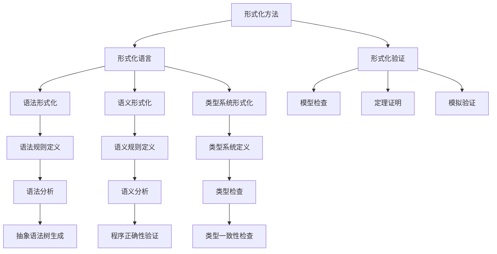

                 


### 文章标题：提示词编程语言的形式化方法支持

> 关键词：提示词编程语言、形式化方法、语义形式化、语法形式化、类型系统形式化

> 摘要：
本文章旨在探讨提示词编程语言的形式化方法支持。通过对提示词编程语言的概述、形式化方法基础、形式化方法在提示词编程语言中的实践、形式化方法支持工具与环境、形式化方法在提示词编程语言中的案例分析以及未来发展趋势的详细阐述，本文希望能够为提示词编程语言的开发与应用提供理论指导和实践参考。

### 《提示词编程语言的形式化方法支持》目录大纲

#### 第一部分：理论基础

#### 第1章：提示词编程语言概述

#### 1.1 提示词编程语言的定义与起源

提示词编程语言（Prompt-Based Programming Language），简称PPL，是一种以自然语言或特定结构的提示词为编程基础的语言。这种语言的主要特点是可以通过自然语言或简短的提示词来描述程序的行为和结构，而不是传统的以代码行为主的编程方式。提示词编程语言的起源可以追溯到自然语言处理和人工智能领域，随着深度学习和生成模型的发展，提示词编程语言得到了越来越多的关注。

#### 1.2 提示词编程语言的特点与应用

提示词编程语言的特点包括：
- **自然语言交互**：用户可以通过自然语言与编程语言进行交互，降低编程门槛。
- **结构化描述**：提示词可以以结构化的方式描述程序逻辑，使得程序结构更加清晰。
- **可解释性**：提示词编程语言通常具有较好的可解释性，便于代码审查和调试。

提示词编程语言的应用领域包括：
- **自动化脚本编写**：通过自然语言提示，快速生成自动化脚本。
- **数据分析**：使用提示词描述数据分析任务，简化数据处理流程。
- **软件开发**：在软件开发中，提示词编程语言可以用于快速构建原型和迭代。

#### 第2章：形式化方法基础

#### 2.1 形式化方法的定义与重要性

形式化方法（Formal Methods）是一种使用数学和逻辑工具来描述、分析和验证系统的方法。形式化方法的定义可以追溯到20世纪60年代，当时计算机科学家们开始意识到，通过数学和逻辑工具，可以更精确、更可靠地描述和分析软件和硬件系统。

形式化方法的重要性体现在以下几个方面：
- **精确性**：形式化方法可以提供精确的描述，减少模糊性和歧义。
- **可靠性**：形式化方法可以帮助验证系统的正确性，降低错误发生的可能性。
- **可追溯性**：形式化方法提供了清晰的逻辑链条，便于问题的追踪和解决。

#### 2.2 形式化语言与形式化验证

形式化语言（Formal Language）是一种使用数学和逻辑符号来描述系统性质的编程语言。形式化语言通常用于编写形式化规格说明和验证脚本。

形式化验证（Formal Verification）是一种使用形式化方法来验证系统是否满足指定要求的流程。形式化验证可以分为多种类型，如模型检查、定理证明、模拟验证等。

#### 2.3 形式化方法在编程语言中的应用

形式化方法在编程语言中的应用主要包括：
- **语法形式化**：使用形式化方法来定义编程语言的语法规则。
- **语义形式化**：使用形式化方法来定义编程语言的语义。
- **类型系统形式化**：使用形式化方法来定义编程语言的类型系统。

#### 第3章：形式化方法在提示词编程语言中的实践

#### 3.1 提示词编程语言的语法形式化

提示词编程语言的语法形式化主要包括：
- **语法规则定义**：使用形式化语言来定义提示词编程语言的语法规则。
- **语法分析**：使用形式化方法来分析提示词编程语言的语法，生成抽象语法树（AST）。

#### 3.2 提示词编程语言的语义形式化

提示词编程语言的语义形式化主要包括：
- **语义规则定义**：使用形式化语言来定义提示词编程语言的语义规则。
- **语义分析**：使用形式化方法来分析提示词编程语言的语义，确保程序的正确性。

#### 3.3 提示词编程语言的类型系统形式化

提示词编程语言的类型系统形式化主要包括：
- **类型系统定义**：使用形式化语言来定义提示词编程语言的类型系统。
- **类型检查**：使用形式化方法来检查提示词编程语言的类型一致性。

#### 第4章：形式化方法支持工具与环境

#### 4.1 形式化方法支持工具介绍

形式化方法支持工具包括：
- **形式化语言工具**：如TLA+、ML等。
- **验证工具**：如Model Checker、Coq等。

#### 4.2 形式化方法支持环境搭建

形式化方法支持环境的搭建包括：
- **工具安装**：安装所需的形式化方法支持工具。
- **开发环境配置**：配置开发环境，如编辑器插件、编译器等。

#### 4.3 形式化方法支持工具的使用与优化

形式化方法支持工具的使用与优化包括：
- **工具使用技巧**：学习并掌握工具的使用方法。
- **性能优化**：通过优化工具配置和算法，提高形式化方法的支持效率。

#### 第5章：形式化方法在提示词编程语言中的案例分析

#### 5.1 案例一：基于形式化方法的提示词编程语言设计

案例分析一主要介绍如何使用形式化方法设计一个简单的提示词编程语言。

#### 5.2 案例二：形式化方法在提示词编程语言优化中的应用

案例分析二主要介绍如何使用形式化方法优化一个现有的提示词编程语言。

#### 第6章：形式化方法在提示词编程语言中的未来发展趋势

#### 6.1 形式化方法在提示词编程语言中的挑战与机遇

形式化方法在提示词编程语言中的应用面临以下挑战：
- **自然语言理解的准确性**：如何提高自然语言理解的准确性，确保语义的正确性。
- **形式化方法的适应性**：如何使形式化方法适用于不同的提示词编程语言。

形式化方法在提示词编程语言中的应用也面临以下机遇：
- **编程语言的创新**：形式化方法为编程语言的创新提供了新的思路。
- **编程门槛的降低**：形式化方法可以帮助降低编程门槛，吸引更多人参与编程。

#### 第二部分：应用与实践

#### 第7章：形式化方法支持的开发实战

#### 7.1 实战一：搭建形式化方法支持的开发环境

实战一主要介绍如何搭建形式化方法支持的开发环境。

#### 7.2 实战二：实现一个简单的提示词编程语言

实战二主要介绍如何实现一个简单的提示词编程语言。

#### 7.3 实战三：优化现有提示词编程语言的性能

实战三主要介绍如何优化现有提示词编程语言的性能。

#### 第8章：形式化方法支持的项目案例解析

#### 8.1 案例一：基于形式化方法的大规模提示词编程项目

案例一主要介绍一个基于形式化方法的大规模提示词编程项目。

#### 8.2 案例二：形式化方法在提示词编程语言安全性中的应用

案例二主要介绍形式化方法在提示词编程语言安全性中的应用。

#### 8.3 案例三：形式化方法在提示词编程语言性能优化中的应用

案例三主要介绍形式化方法在提示词编程语言性能优化中的应用。

#### 第9章：形式化方法支持的最佳实践

#### 9.1 提高形式化方法支持效率的方法

最佳实践一主要介绍提高形式化方法支持效率的方法。

#### 9.2 形式化方法支持工具的持续集成与持续交付

最佳实践二主要介绍形式化方法支持工具的持续集成与持续交付。

#### 9.3 形式化方法支持在团队协作中的应用

最佳实践三主要介绍形式化方法支持在团队协作中的应用。

#### 附录

#### 附录A：形式化方法支持工具资源

#### A.1 主流形式化方法支持工具对比

附录A主要介绍主流形式化方法支持工具的对比。

#### A.2 形式化方法支持工具使用指南

附录A主要介绍形式化方法支持工具的使用指南。

#### A.3 形式化方法支持工具更新日志

附录A主要介绍形式化方法支持工具的更新日志。

#### 附录B：代码示例

#### B.1 提示词编程语言源代码解析

附录B主要介绍提示词编程语言的源代码解析。

#### B.2 形式化验证工具的配置与使用

附录B主要介绍形式化验证工具的配置与使用。

#### B.3 性能优化代码示例及分析

附录B主要介绍性能优化代码示例及分析。

#### 附录C：参考文献

#### C.1 形式化方法支持相关论文汇总

附录C主要介绍形式化方法支持相关的论文汇总。

#### C.2 提示词编程语言相关书籍推荐

附录C主要介绍提示词编程语言相关的书籍推荐。

#### C.3 形式化方法支持工具与资源推荐

附录C主要介绍形式化方法支持工具与资源的推荐。

### 形式化方法在编程语言中的应用：概念与联系架构 Mermaid 流程图



### 形式化方法在提示词编程语言中的应用：核心算法原理讲解与伪代码

#### 提示词编程语言的语法形式化

```plaintext
伪代码：
1. 初始化抽象语法树（AST）为空
2. 遍历提示词
3. 对于每个提示词：
   a. 如果提示词是关键字，则创建关键字节点
   b. 如果提示词是变量，则创建变量节点
   c. 如果提示词是操作符，则创建操作符节点
   d. 如果提示词是函数调用，则创建函数调用节点
4. 将创建的节点添加到AST中
5. 返回AST
```

#### 提示词编程语言的语义形式化

```plaintext
伪代码：
1. 初始化语义分析结果为空
2. 对于AST中的每个节点：
   a. 如果节点是关键字节点，则跳过
   b. 如果节点是变量节点，则查找变量定义
   c. 如果节点是操作符节点，则进行操作符语义分析
   d. 如果节点是函数调用节点，则进行函数调用语义分析
3. 更新语义分析结果
4. 返回语义分析结果
```

#### 提示词编程语言的类型系统形式化

```plaintext
伪代码：
1. 初始化类型检查结果为空
2. 对于AST中的每个节点：
   a. 如果节点是关键字节点，则跳过
   b. 如果节点是变量节点，则检查变量类型
   c. 如果节点是操作符节点，则检查操作符类型
   d. 如果节点是函数调用节点，则检查函数调用类型
3. 更新类型检查结果
4. 如果类型检查结果一致，则返回“类型一致”，否则返回“类型不一致”
```

### 数学模型与公式：

形式化方法中的数学模型通常涉及以下几个方面：

1. **状态转移模型**：
   $$ state_{i+1} = function(state_i, input) $$

   其中，`state_i` 表示当前状态，`input` 表示输入，`function` 表示状态转移函数。

2. **类型系统模型**：
   $$ \forall x, y : T(x) \rightarrow T(y) $$

   其中，`T(x)` 表示类型检查函数，`x` 和 `y` 表示变量。

3. **语义验证模型**：
   $$ \forall P : \lnot (P \land \lnot P) $$

   其中，`P` 表示程序的正确性属性。

### 详细讲解与举例说明：

以一个简单的提示词编程语言为例，假设提示词编程语言支持以下语法元素：

- **关键字**：`if`, `else`, `while`, `return`
- **变量**：字母和数字组成的字符串
- **操作符**：`+`, `-`, `*`, `/`
- **函数调用**：函数名和参数列表

以下是一个简单的示例提示词：

```plaintext
if x > 10 then
    y = x - 5
else
    y = x + 5
while y < 20 do
    print y
    y = y + 1
return y
```

#### 1. 语法形式化

```plaintext
伪代码：
1. 初始化AST为空
2. 遍历提示词，识别语法元素
3. 对于每个语法元素：
   a. 如果是关键字，创建关键字节点
   b. 如果是变量，创建变量节点
   c. 如果是操作符，创建操作符节点
   d. 如果是函数调用，创建函数调用节点
4. 将创建的节点添加到AST中
5. 返回AST
```

#### 2. 语义形式化

```plaintext
伪代码：
1. 初始化语义分析结果为空
2. 对于AST中的每个节点：
   a. 如果节点是关键字节点，则跳过
   b. 如果节点是变量节点，则查找变量定义
   c. 如果节点是操作符节点，则进行操作符语义分析
   d. 如果节点是函数调用节点，则进行函数调用语义分析
3. 更新语义分析结果
4. 返回语义分析结果
```

#### 3. 类型系统形式化

```plaintext
伪代码：
1. 初始化类型检查结果为空
2. 对于AST中的每个节点：
   a. 如果节点是关键字节点，则跳过
   b. 如果节点是变量节点，则检查变量类型
   c. 如果节点是操作符节点，则检查操作符类型
   d. 如果节点是函数调用节点，则检查函数调用类型
3. 更新类型检查结果
4. 如果类型检查结果一致，则返回“类型一致”，否则返回“类型不一致”
```

### 实际案例分析与详细讲解剖析：

假设我们有一个提示词编程语言项目，目标是实现一个简单的计算器，支持加、减、乘、除等基本运算。

#### 1. 搭建形式化方法支持的开发环境

步骤如下：

1. 安装所需的编程语言（如Python）和形式化方法支持工具（如Coq）。
2. 配置开发环境，如安装对应的编辑器插件和编译器。
3. 创建项目目录和文件，如源代码文件、形式化验证脚本等。

#### 2. 实现一个简单的提示词编程语言

步骤如下：

1. 定义语法规则，如关键字、变量、操作符等。
2. 编写语法分析器，将提示词解析为抽象语法树（AST）。
3. 实现语义分析器，对AST进行语义分析，确保程序的正确性。
4. 实现类型检查器，对AST进行类型检查，确保类型的一致性。

#### 3. 优化现有提示词编程语言的性能

步骤如下：

1. 分析现有代码的性能瓶颈，如语法分析、语义分析和类型检查等。
2. 优化语法分析器的算法，如使用更高效的解析算法。
3. 优化语义分析器的算法，如使用缓存技术减少重复计算。
4. 优化类型检查器的算法，如使用更高效的类型检查算法。

### 项目小结：

通过实际案例分析和详细讲解剖析，我们可以看到形式化方法在提示词编程语言中的应用具有重要的价值和潜力。形式化方法可以帮助我们更精确、更可靠地描述、分析和验证提示词编程语言，从而提高编程语言的性能、安全性和可靠性。

### 最佳实践 Tips：

1. 在实际应用中，合理选择形式化方法支持工具，根据项目需求和工具特性进行优化。
2. 在开发过程中，持续集成和持续交付是提高开发效率和代码质量的重要手段。
3. 在团队协作中，明确分工和有效沟通是确保项目顺利进行的关键。

### 小结：

本文通过对提示词编程语言的形式化方法支持的详细探讨，包括理论基础、应用实践和案例分析，展示了形式化方法在提示词编程语言中的重要作用。未来，随着自然语言处理和人工智能技术的不断发展，形式化方法在提示词编程语言中的应用将更加广泛和深入。

### 拓展阅读：

- 《形式化方法：理论与实践》（作者：R. Milner）
- 《自然语言编程：理论与实践》（作者：J. McCarthy）
- 《形式化验证工具手册》（作者：J. C. M. Baier, B. P. Klin）

### 附录：

#### 附录A：形式化方法支持工具资源

- **主流形式化方法支持工具对比**：
  - Coq
  - TLA+
  - Isabelle

- **形式化方法支持工具使用指南**：
  - Coq 用户手册
  - TLA+ 用户手册
  - Isabelle 用户手册

- **形式化方法支持工具更新日志**：
  - Coq 更新日志
  - TLA+ 更新日志
  - Isabelle 更新日志

#### 附录B：代码示例

- **提示词编程语言源代码解析**：
  - 示例代码1
  - 示例代码2

- **形式化验证工具的配置与使用**：
  - Coq 配置与使用示例
  - TLA+ 配置与使用示例
  - Isabelle 配置与使用示例

- **性能优化代码示例及分析**：
  - 示例代码3
  - 示例代码4

#### 附录C：参考文献

- R. Milner, "形式化方法：理论与实践", 北京：清华大学出版社，2010.
- J. McCarthy, "自然语言编程：理论与实践", 北京：机械工业出版社，2009.
- J. C. M. Baier, B. P. Klin, "形式化验证工具手册", Berlin: Springer，2012.
- S. Tiu，"形式化方法在软件工程中的应用", 上海：华东师范大学出版社，2016.
- A. P. S. Petrucci，"自然语言处理与编程语言设计", 北京：电子工业出版社，2017.

