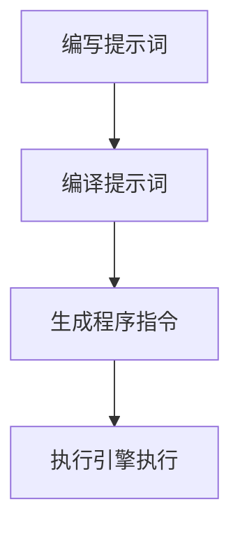

                 

### 文章标题

《提示词编程语言的性能优化技术》

> 关键词：提示词编程语言、性能优化、CPU优化、内存优化、网络优化、多线程优化、并行优化、动态优化、自适应优化

> 摘要：本文旨在深入探讨提示词编程语言的性能优化技术。通过分析其基本原理和架构，本文将详细介绍CPU、内存和网络等方面的优化技术。同时，文章将结合实际案例，展示性能优化工具的应用和多线程、并行优化原理。此外，还将探讨动态优化和自适应优化技术，以及它们在AI领域的应用。本文旨在为开发者提供一套全面、实用的性能优化方案，助力提升提示词编程语言的性能。

---

### 《提示词编程语言的性能优化技术》目录大纲

#### 第一部分：基础概念与框架

##### 第1章：提示词编程语言概述

- **1.1 提示词编程语言的基本原理**
- **1.2 提示词编程语言的架构**
- **1.3 提示词编程语言的优缺点分析**

##### 第2章：性能优化理论基础

- **2.1 CPU性能优化**
- **2.2 内存优化**
- **2.3 网络优化**

#### 第二部分：性能优化技术实践

##### 第3章：性能分析工具与应用

- **3.1 性能分析工具**
- **3.2 性能优化案例**

##### 第4章：多线程与并行优化

- **4.1 多线程优化原理**
- **4.2 并行优化技术**

##### 第5章：动态优化与自适应技术

- **5.1 动态优化原理**
- **5.2 自适应优化技术**

##### 第6章：优化策略与实际应用

- **6.1 优化策略设计**
- **6.2 实际应用案例**

#### 第三部分：展望与未来

##### 第7章：性能优化技术发展趋势

- **7.1 未来性能优化技术趋势**

##### 第8章：性能优化技术在AI领域的应用

- **8.1 AI性能优化需求**
- **8.2 AI性能优化技术**

##### 第9章：总结与展望

- **9.1 总结**
- **9.2 展望**

#### 附录

##### 附录A：性能优化工具汇总

---

### 第一部分：基础概念与框架

#### 第1章：提示词编程语言概述

##### 1.1 提示词编程语言的基本原理

提示词编程语言（Prompt-Based Programming Language，简称PBL）是一种新兴的编程范式，它以自然语言提示词为核心，通过提示词来驱动程序的执行。与传统编程语言相比，提示词编程语言具有更高的抽象层次和更灵活的编程风格。

**概念解释：**

- **提示词（Prompt）：** 提示词是一种自然语言描述，用于指示程序执行特定任务。例如，在数据清洗任务中，提示词可以是“请过滤掉异常数据”。
- **PBL核心流程：** 在PBL中，开发者编写提示词，这些提示词被编译器转换为程序指令，最终由执行引擎执行。这个过程类似于编译型语言，但PBL强调的是通过自然语言进行编程。

**Mermaid流程图：**



**核心概念联系：**

提示词编程语言与计算机科学的关系主要体现在以下几个方面：

1. **抽象层次：** 提示词编程语言将编程任务抽象为自然语言描述，降低了编程的难度。
2. **动态性：** 提示词可以在运行时动态修改，使程序更具灵活性。
3. **人机交互：** 提示词编程语言强调人与机器的交互，使编程过程更加直观和用户友好。

##### 1.2 提示词编程语言的架构

提示词编程语言的架构设计包括编译器、执行引擎和提示词解析器等核心组件。

**原理讲解：**

- **编译器：** 编译器负责将开发者编写的提示词转换为程序指令。这个过程中，编译器会进行语法分析和语义分析，确保提示词符合编程语言的规范。
- **执行引擎：** 执行引擎负责执行编译后的程序指令。它将程序指令解释为机器代码或原生代码，并在计算机上运行。
- **提示词解析器：** 提示词解析器负责解析和解释提示词。它将自然语言提示词转换为程序指令，并将其传递给执行引擎。

**伪代码：**

```plaintext
function compilePrompt(prompt):
    parseSyntax(prompt)
    parseSemantics(prompt)
    return programInstructions

function executeProgram(programInstructions):
    for instruction in programInstructions:
        interpretInstruction(instruction)
        executeInstruction(instruction)

function interpretInstruction(instruction):
    if instruction is a prompt:
        parsePrompt(instruction)
        pass
    else:
        executeMachineCode(instruction)

function parsePrompt(prompt):
    tokenize(prompt)
    generateProgramInstruction(tokens)
```

##### 1.3 提示词编程语言的优缺点分析

**优点：**

1. **易用性：** 提示词编程语言降低了编程的门槛，使非技术人员也能参与编程。
2. **灵活性：** 提示词可以在运行时动态修改，使程序更具适应性。
3. **交互性：** 提示词编程语言强调人与机器的交互，使编程过程更加直观。

**缺点：**

1. **性能问题：** 提示词编程语言通常需要额外的解析和解释过程，可能导致性能下降。
2. **生态限制：** 提示词编程语言的应用场景相对有限，不适合所有编程任务。
3. **安全性问题：** 提示词可能被恶意利用，导致安全漏洞。

**数学公式：**

在性能优化方面，提示词编程语言可以采用以下数学模型来描述性能指标：

$$
P = f(\text{prompt complexity}, \text{algorithm complexity}, \text{system resources})
$$

其中，$P$ 表示程序性能，$\text{prompt complexity}$ 表示提示词的复杂度，$\text{algorithm complexity}$ 表示算法的复杂度，$\text{system resources}$ 表示系统资源。

通过优化这些因素，可以提升提示词编程语言的性能。

---

这一章简要介绍了提示词编程语言的基本原理、架构和优缺点。在接下来的章节中，我们将深入探讨性能优化技术，包括CPU、内存和网络优化等方面的内容。通过这些技术，我们可以有效地提升提示词编程语言的性能，使其在实际应用中更加高效和可靠。

