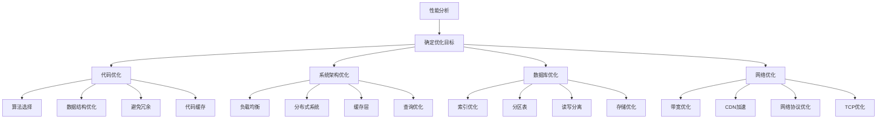
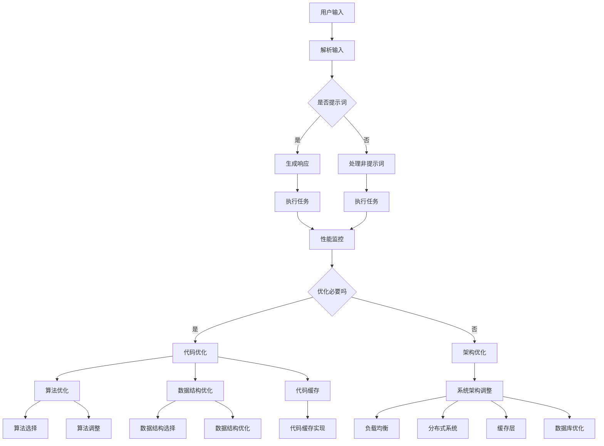
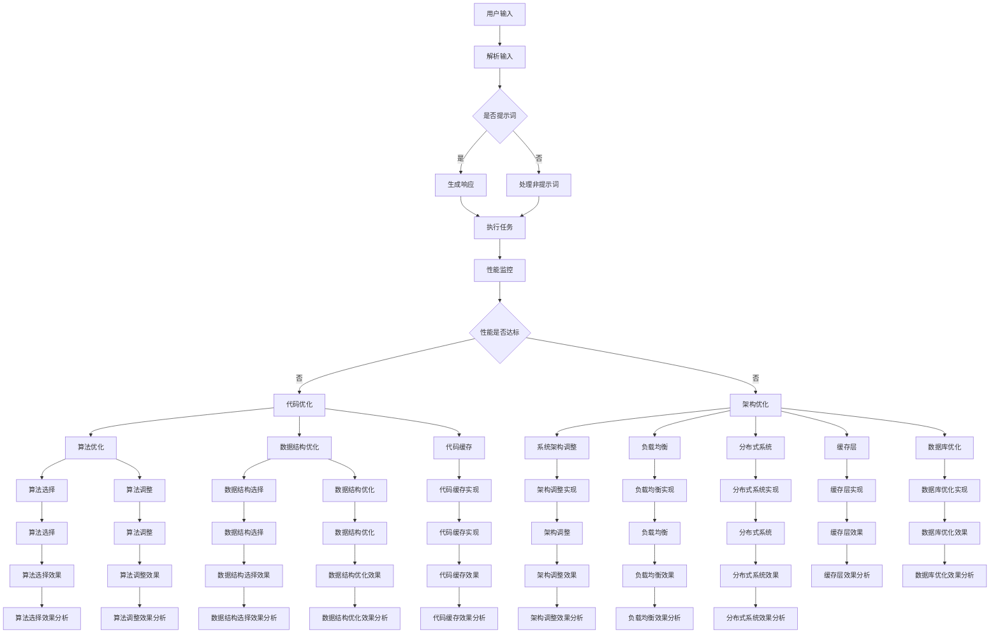

                 

### 文章标题：提示词编程语言的性能优化策略

**关键词：**
- 提示词编程语言
- 性能优化
- 算法原理
- 数学模型
- 项目实战

**摘要：**
本文将深入探讨提示词编程语言的性能优化策略。通过对性能优化的基础理论、核心概念、算法原理、数学模型以及项目实战的详细分析，本文旨在为开发者提供一套系统化的性能优化方法，从而提升提示词编程语言的运行效率。文章结构清晰，每个部分均包含丰富的实例和具体实现，有助于读者理解并实际应用这些优化策略。

### 性能优化概述

**1.1 性能优化的概念与重要性**

性能优化，顾名思义，是指通过各种手段提升软件、系统或应用的运行效率。在提示词编程语言中，性能优化尤为重要，因为这类语言通常涉及大量计算和数据处理，对运行速度的要求极高。性能优化的定义可以概括为：通过改进算法、优化代码结构、优化硬件资源利用等手段，提高软件或系统的响应速度、处理能力和资源利用率。

性能优化的重要性体现在多个方面：

1. **提升用户体验**：高效的性能能够提供更快的响应速度，减少用户的等待时间，从而提升用户体验。
2. **增强竞争力**：在高性能竞争的市场中，性能优越的产品或系统能够获得更多的用户和市场份额。
3. **降低成本**：性能优化可以减少硬件资源的浪费，降低维护和运营成本。
4. **提升可持续性**：高效的性能有助于降低系统的负载，减少能源消耗，促进可持续发展。

**1.1.1 性能优化的定义**

性能优化不仅仅是指代码层面的调整，它还涉及到系统架构、数据库、网络等多个层面的综合优化。具体来说，性能优化的主要目标包括：

- **响应时间**：减少系统或应用程序从接收请求到返回结果的时间。
- **吞吐量**：在单位时间内系统能够处理的请求数量。
- **资源利用率**：包括CPU、内存、磁盘和网络等硬件资源的利用效率。
- **稳定性**：系统在高负载下的稳定性，包括处理请求的正确性和数据的完整性。

**1.1.2 性能优化的目的**

性能优化的目的在于提高软件或系统的运行效率，具体包括以下几个方面：

- **提升响应速度**：通过优化算法和数据结构，减少计算和I/O操作的时间。
- **提高资源利用率**：通过合理分配和调度资源，减少浪费，提高硬件利用率。
- **增强系统可扩展性**：优化设计能够支持系统在不改变性能的前提下，扩展功能或增加用户数量。
- **提高代码可读性和可维护性**：良好的性能优化往往伴随着代码的改进，使得代码结构更加清晰，易于理解和维护。

**1.1.3 性能优化的关键指标**

性能优化的关键指标包括但不限于以下几个方面：

- **响应时间**：系统从接收请求到返回结果所需的时间。
- **吞吐量**：单位时间内系统能处理的请求数量。
- **CPU利用率**：CPU的使用率，反映系统的计算负荷。
- **内存利用率**：内存的使用率，反映内存资源的紧张程度。
- **磁盘I/O速率**：磁盘的读写速度，影响数据的存取效率。
- **网络延迟**：网络传输的延迟时间，影响跨网络的请求处理速度。

**1.2 提示词编程语言概述**

**1.2.1 提示词编程语言的定义**

提示词编程语言（Prompt-Based Programming Language）是一种特殊类型的编程语言，它通过预定义的提示词（prompts）来引导程序执行特定的任务。这些提示词通常与自然语言处理（NLP）技术相结合，能够接收用户输入的文本，并生成相应的输出或执行特定的操作。

提示词编程语言的主要特点包括：

- **高交互性**：通过提示词与用户进行交互，实现自然语言对话。
- **灵活性**：可以轻松地扩展和定制，以适应不同的应用场景。
- **易于上手**：对于非专业开发者来说，提示词编程语言通常更容易学习和使用。

**1.2.2 提示词编程语言的特点**

提示词编程语言具有以下几个显著特点：

- **自然语言处理**：能够理解和处理自然语言输入，使得编程更加接近日常交流。
- **模块化**：提示词和功能模块可以独立开发和管理，提高了代码的可重用性和可维护性。
- **动态性**：可以根据运行时的情况动态调整和优化提示词和程序执行流程。
- **交互性**：支持与用户的实时交互，能够响应用户的反馈并进行相应的调整。

**1.2.3 提示词编程语言的应用场景**

提示词编程语言广泛应用于以下场景：

- **对话系统**：如虚拟助手、聊天机器人等，能够通过自然语言与用户进行交互。
- **自动化流程**：通过提示词实现自动化工作流程，如订单处理、客户服务等。
- **数据挖掘**：利用提示词对大量文本数据进行筛选、分类和抽取。
- **教育应用**：为学生提供互动式学习体验，通过提示词引导学习过程。

### 性能优化的基本策略

**1.3.1 代码层面的优化**

代码层面的优化是性能优化中最直接和常见的方法。以下是一些关键的代码优化策略：

1. **算法选择**：选择适合问题需求的最佳算法，避免使用复杂度较高的算法。
2. **数据结构**：合理选择和设计数据结构，如使用哈希表、树结构等，以减少查找和操作时间。
3. **避免冗余**：删除不必要的代码和操作，减少计算和存储的开销。
4. **代码缓存**：利用缓存技术，减少重复的计算和数据读取。
5. **并行处理**：利用多线程或并行计算，提高代码的执行效率。

**1.3.2 系统架构层面的优化**

系统架构的优化可以显著提升整个系统的性能。以下是一些常见的系统架构优化策略：

1. **负载均衡**：通过负载均衡器将请求分配到多个服务器，避免单点瓶颈。
2. **分布式系统**：将系统分解为多个分布式模块，提高系统的可扩展性和容错性。
3. **缓存层**：引入缓存层，如Redis、Memcached等，减轻数据库的压力，提高数据读取速度。
4. **数据库优化**：优化数据库查询和索引，减少查询时间和数据读取量。
5. **服务拆分**：将大而复杂的系统拆分为多个独立的服务，提高系统的模块化和可维护性。

**1.3.3 数据库优化**

数据库优化是提升系统性能的重要一环。以下是一些关键的数据库优化策略：

1. **索引优化**：合理创建和优化索引，提高数据查询速度。
2. **查询优化**：优化数据库查询语句，减少查询时间和数据读取量。
3. **分区表**：对大量数据进行分区，减少单个表的压力，提高查询效率。
4. **读写分离**：通过主从复制，将读操作和写操作分离，提高系统的并发处理能力。
5. **存储优化**：选择适合的数据存储方式，如SSD、HDD等，提高数据存取速度。

**1.3.4 网络优化**

网络优化可以显著提升跨网络的性能。以下是一些关键的网络优化策略：

1. **带宽优化**：增加网络带宽，减少数据传输的时间。
2. **CDN加速**：通过内容分发网络（CDN）将静态资源缓存到离用户更近的服务器，减少网络延迟。
3. **网络协议优化**：使用更高效的网络协议，如HTTP/2，减少数据传输的延迟。
4. **数据压缩**：对传输的数据进行压缩，减少带宽占用。
5. **TCP优化**：优化TCP参数，如窗口大小、延迟时间等，提高数据传输的效率。

### 性能优化的Mermaid流程图

为了更好地理解和实施性能优化策略，我们可以使用Mermaid流程图来表示性能优化的整个流程。以下是一个简单的Mermaid流程图示例：



### 提示词编程语言的性能优化架构

在深入探讨提示词编程语言的性能优化之前，我们需要构建一个详细的性能优化架构，以便理解各个环节之间的关系和优化点。以下是一个简化的提示词编程语言性能优化架构的Mermaid流程图：



**2.1.1 性能优化架构的Mermaid流程图**

以下是性能优化架构的Mermaid流程图，它展示了从用户输入到性能监控，再到优化策略的各个环节：



**2.1.2 性能优化架构的核心组件**

性能优化架构的核心组件可以分为以下几个部分：

1. **用户输入处理**：接收用户的输入，并将其解析为提示词或非提示词。
2. **任务执行**：根据提示词或输入内容，执行相应的任务。
3. **性能监控**：实时监控系统的性能指标，如响应时间、CPU利用率、内存占用等。
4. **性能评估**：根据监控数据评估系统性能是否达到预期目标。
5. **优化策略**：根据性能评估结果，选择合适的优化策略进行代码、系统架构或数据库层面的优化。
6. **优化实现**：具体实施优化策略，包括算法调整、数据结构优化、代码缓存、系统架构调整等。

通过上述流程图和核心组件的描述，我们可以清晰地看到提示词编程语言的性能优化架构，以及各个环节之间的关联。这种架构不仅有助于开发者理解和实施优化策略，还能够为未来的性能优化提供指导。

### 性能优化算法原理

性能优化算法是实现性能提升的核心技术，通过合理的算法选择和调整，可以显著提高系统的运行效率。以下是性能优化算法的基本原理、分类以及伪代码的详细讲解。

#### 3.1.1 算法性能优化的基础

算法性能优化主要依赖于以下几个方面：

1. **时间复杂度**：评估算法执行的时间开销，通常用大O表示法（O(n)、O(n²)、O(log n)等）。
2. **空间复杂度**：评估算法执行的空间开销，包括存储空间和临时变量的使用。
3. **算法的通用性**：能够适应不同规模和类型的数据，具有良好的可扩展性。

算法性能优化的目标是在保证正确性的前提下，尽可能地减少时间和空间复杂度。

#### 3.1.2 性能优化算法的分类

性能优化算法可以分为以下几类：

1. **排序算法**：用于对数据进行排序，如快速排序（Quick Sort）、归并排序（Merge Sort）等。
2. **查找算法**：用于在数据集合中查找特定元素，如二分查找（Binary Search）、哈希查找（Hash Search）等。
3. **图算法**：用于处理图结构数据，如最短路径算法（Dijkstra算法）、最小生成树算法（Prim算法）等。
4. **动态规划**：用于解决具有最优子结构特性的问题，如背包问题（Knapsack Problem）、最长公共子序列（Longest Common Subsequence）等。
5. **贪心算法**：通过每次选择局部最优解，期望最终得到全局最优解，如活动选择问题（Activity Selection Problem）。

#### 3.1.3 性能优化算法的伪代码

以下是一些常见性能优化算法的伪代码示例：

**快速排序（Quick Sort）**

```pseudocode
function quicksort(arr):
    if length of arr <= 1:
        return arr
    
    pivot = arr[random index between 0 and length of arr - 1]
    left = []
    right = []
    
    for each element in arr:
        if element < pivot:
            left.append(element)
        else:
            right.append(element)
    
    return concatenate(quicksort(left), pivot, quicksort(right))
```

**二分查找（Binary Search）**

```pseudocode
function binarySearch(arr, target):
    low = 0
    high = length of arr - 1
    
    while low <= high:
        mid = (low + high) / 2
        if arr[mid] == target:
            return mid
        elif arr[mid] < target:
            low = mid + 1
        else:
            high = mid - 1
    
    return -1
```

**动态规划（Longest Common Subsequence）**

```pseudocode
function longestCommonSubsequence(X, Y):
    m = length of X
    n = length of Y
    dp = matrix of size (m+1) x (n+1)
    
    for i from 0 to m:
        for j from 0 to n:
            if X[i] == Y[j]:
                dp[i][j] = dp[i-1][j-1] + 1
            else:
                dp[i][j] = max(dp[i-1][j], dp[i][j-1])
    
    return dp[m][n]
```

**贪心算法（Activity Selection Problem）**

```pseudocode
function activitySelection(arr):
    sort arr by finish time
    select first activity
    for each activity in arr:
        if start time > finish time of previously selected activity:
            select this activity
    
    return selected activities
```

通过上述伪代码示例，我们可以看到不同类型算法的执行流程和关键步骤。在实际应用中，根据具体问题和数据特点选择合适的算法，并对其进行优化，是提升系统性能的有效手段。

### 提示词编程语言的性能优化算法

在提示词编程语言中，性能优化算法的选择和调整对提升系统的运行效率至关重要。以下是一些常见且有效的性能优化算法，包括其基本概念、应用场景以及相应的伪代码示例。

#### 3.2.1 提示词编程语言中的常见优化算法

1. **贪心算法**：贪心算法通过每次选择局部最优解，期望最终得到全局最优解。常用于解决活动选择问题、背包问题等。

2. **动态规划**：动态规划利用历史信息来解决具有最优子结构的问题，如最长公共子序列、编辑距离等。

3. **哈希算法**：哈希算法通过计算输入数据的哈希值，快速查找和存储数据，如哈希表、哈希树等。

4. **排序算法**：排序算法用于对提示词进行排序，以优化后续的查询和匹配过程，如快速排序、归并排序等。

5. **二分查找**：二分查找算法通过将提示词逐步缩小查找范围，提高查找效率。

#### 3.2.2 优化算法的伪代码

**贪心算法（Activity Selection Problem）**

```pseudocode
function activitySelection(activities):
    sort activities by finish time
    select first activity
    for each activity in activities:
        if start time > finish time of previously selected activity:
            select this activity
    return selected activities
```

**动态规划（Longest Common Subsequence）**

```pseudocode
function longestCommonSubsequence(X, Y):
    m = length of X
    n = length of Y
    dp = matrix of size (m+1) x (n+1)
    
    for i from 0 to m:
        for j from 0 to n:
            if X[i] == Y[j]:
                dp[i][j] = dp[i-1][j-1] + 1
            else:
                dp[i][j] = max(dp[i-1][j], dp[i][j-1])
    
    return dp[m][n]
```

**哈希算法（Hash Search）**

```pseudocode
function hashSearch(arr, target):
    hash function h(x)
    hash table T
    
    for each element in arr:
        insert h(element) into T
    
    return T[hash(target)]
```

**排序算法（Quick Sort）**

```pseudocode
function quickSort(arr):
    if length of arr <= 1:
        return arr
    
    pivot = arr[random index between 0 and length of arr - 1]
    left = []
    right = []
    
    for each element in arr:
        if element < pivot:
            left.append(element)
        else:
            right.append(element)
    
    return concatenate(quickSort(left), pivot, quickSort(right))
```

**二分查找（Binary Search）**

```pseudocode
function binarySearch(arr, target):
    low = 0
    high = length of arr - 1
    
    while low <= high:
        mid = (low + high) / 2
        if arr[mid] == target:
            return mid
        elif arr[mid] < target:
            low = mid + 1
        else:
            high = mid - 1
    
    return -1
```

通过这些伪代码示例，我们可以看到各种优化算法的基本结构和执行步骤。在实际应用中，根据提示词编程语言的具体需求，选择和调整合适的优化算法，可以有效提升系统的性能。

### 性能优化的数学模型

在性能优化过程中，数学模型的使用能够帮助我们更精确地描述和量化系统的性能表现。通过构建数学模型，我们可以更好地理解性能瓶颈，并制定相应的优化策略。以下将详细讲解性能优化的数学模型，包括其概述、常用公式以及具体举例说明。

#### 4.1.1 性能优化的数学模型概述

性能优化的数学模型主要关注系统的响应时间、资源利用率等关键性能指标。这些模型通常基于概率论、统计学和运筹学等数学理论，通过数学公式和参数来描述系统的行为和性能。

常用的性能优化数学模型包括：

1. **响应时间模型**：用于预测系统从接收请求到返回结果所需的时间。
2. **资源利用率模型**：用于描述系统资源（如CPU、内存等）的利用效率。
3. **排队模型**：用于分析系统中等待处理请求的数量和等待时间。
4. **网络模型**：用于分析系统中的网络延迟和带宽利用率。

#### 4.1.2 性能优化的数学模型公式

以下是几个常用的性能优化数学模型公式：

1. **响应时间模型**：
   \[
   T_r = \frac{T_s + T_p + T_q}{N}
   \]
   其中，\(T_r\) 为响应时间，\(T_s\) 为服务时间，\(T_p\) 为处理时间，\(T_q\) 为排队时间，\(N\) 为并发用户数。

2. **资源利用率模型**：
   \[
   U = \frac{C}{T}
   \]
   其中，\(U\) 为资源利用率，\(C\) 为资源使用量，\(T\) 为时间周期。

3. **排队模型**：
   \[
   L = \frac{\lambda^2}{(1-\mu)\mu}
   \]
   \[
   W = \frac{\lambda}{\mu(1-\mu)}
   \]
   其中，\(L\) 为系统中等待的请求数量，\(W\) 为平均等待时间，\(\lambda\) 为到达率，\(\mu\) 为服务率。

4. **网络模型**：
   \[
   P(D > t) = \frac{1 - e^{-\lambda t}}{\lambda t}
   \]
   其中，\(P(D > t)\) 为数据包在网络中的延迟时间大于 \(t\) 的概率，\(\lambda\) 为网络流量。

#### 4.1.3 数学模型的举例说明

**举例1：响应时间模型**

假设一个在线购物系统，平均服务时间为 \(T_s = 0.5\) 秒，处理时间为 \(T_p = 1\) 秒，排队时间为 \(T_q = 0.2\) 秒，并发用户数为 \(N = 100\)。根据响应时间模型，可以计算出系统的平均响应时间 \(T_r\)：

\[
T_r = \frac{T_s + T_p + T_q}{N} = \frac{0.5 + 1 + 0.2}{100} = 0.07
\]

这意味着每个用户在系统中的平均响应时间为0.07秒。

**举例2：资源利用率模型**

假设一个计算机服务器的CPU使用量为 \(C = 100\) 个处理单元，时间周期为 \(T = 60\) 秒。根据资源利用率模型，可以计算出CPU的利用率 \(U\)：

\[
U = \frac{C}{T} = \frac{100}{60} = 0.83
\]

这意味着CPU的利用率约为83%。

**举例3：排队模型**

假设一个呼叫中心的服务台数为5个，平均到达率为 \(\lambda = 10\) 个请求/分钟，平均服务率为 \(\mu = 12\) 个请求/分钟。根据排队模型，可以计算出系统中等待的请求数量 \(L\) 和平均等待时间 \(W\)：

\[
L = \frac{\lambda^2}{\mu(1-\mu)} = \frac{10^2}{12(1-12)} \approx 0.27
\]

\[
W = \frac{\lambda}{\mu(1-\mu)} = \frac{10}{12(1-12)} \approx 0.033
\]

这意味着系统中平均有0.27个请求在等待，平均每个请求的等待时间为0.033分钟。

**举例4：网络模型**

假设一个数据传输系统的流量为 \(\lambda = 1000\) 个数据包/秒，数据包在网络中的平均延迟时间为 \(t = 0.5\) 秒。根据网络模型，可以计算出数据包在网络中的延迟概率 \(P(D > t)\)：

\[
P(D > t) = \frac{1 - e^{-\lambda t}}{\lambda t} = \frac{1 - e^{-1000 \times 0.5}}{1000 \times 0.5} \approx 0.034
\]

这意味着有约3.4%的数据包在网络中的延迟时间超过0.5秒。

通过这些数学模型，我们可以更准确地分析和优化系统的性能。在实际应用中，可以根据具体场景和需求，选择合适的数学模型，并进行相应的参数调整和优化。

### 提示词编程语言的数学模型

在提示词编程语言中，数学模型的应用至关重要，它能够帮助我们精确地理解和优化程序的行为。以下将详细讲解提示词编程语言中的数学模型，包括其定义、公式以及具体例子，以帮助开发者更好地应用这些模型进行性能优化。

#### 4.2.1 提示词编程语言的数学模型

提示词编程语言的数学模型通常涉及以下几个关键方面：

1. **自然语言处理模型**：用于理解和生成自然语言文本。
2. **序列匹配模型**：用于匹配输入提示词与预设模式或关键词。
3. **优化目标函数**：用于描述系统性能目标，如响应时间、资源利用率等。
4. **概率模型**：用于描述系统的不确定性，如用户输入的概率分布。

#### 4.2.2 数学模型的latex格式

以下是几个常见的数学模型及其LaTeX格式表示：

1. **自然语言处理模型**：
   \[
   P(w_1, w_2, ..., w_n) = \frac{1}{Z} \prod_{i=1}^{n} P(w_i | w_1, ..., w_{i-1})
   \]
   其中，\(w_i\) 表示第 \(i\) 个单词，\(P(w_i | w_1, ..., w_{i-1})\) 表示在给定前 \(i-1\) 个单词的情况下，第 \(i\) 个单词的概率。

2. **序列匹配模型**：
   \[
   M = \sum_{i=1}^{n} \delta(w_i, p_i)
   \]
   其中，\(\delta(w_i, p_i)\) 表示提示词 \(w_i\) 与模式 \(p_i\) 的匹配度。

3. **优化目标函数**：
   \[
   \min_{x} f(x) = T_r + \alpha \cdot T_p + \beta \cdot T_q
   \]
   其中，\(T_r\) 为响应时间，\(T_p\) 为处理时间，\(T_q\) 为排队时间，\(\alpha\) 和 \(\beta\) 为权重系数。

4. **概率模型**：
   \[
   P(\text{User Input}) = \sum_{i=1}^{n} p_i \cdot q_i
   \]
   其中，\(p_i\) 表示用户输入为 \(w_i\) 的概率，\(q_i\) 表示系统生成响应为 \(r_i\) 的概率。

#### 4.2.3 提示词编程语言的数学模型实例

**实例1：自然语言处理模型**

假设我们有一个提示词编程语言模型，用于生成对话中的下一个句子。我们可以使用神经网络语言模型（如LSTM或Transformer）来计算每个单词的概率：

```latex
P(w_1, w_2, ..., w_n) = \frac{1}{Z} \exp(\text{score}(w_1, w_2, ..., w_n))
```

其中，`score` 函数表示神经网络对句子的评分，\(Z\) 是归一化常数。

**实例2：序列匹配模型**

假设我们需要匹配用户输入的提示词序列与预设的模式。我们可以使用动态规划算法计算匹配度：

```latex
M = \sum_{i=1}^{n} \delta(w_i, p_i)
```

其中，`δ` 函数表示提示词 \(w_i\) 与模式 \(p_i\) 的匹配度，例如，可以使用Levenshtein距离来计算两个字符串的编辑距离。

**实例3：优化目标函数**

假设我们需要最小化系统的响应时间、处理时间和排队时间的总和，并给予响应时间和排队时间更高的权重。我们可以使用以下优化目标函数：

```latex
\min_{x} f(x) = T_r + \alpha \cdot T_p + \beta \cdot T_q
```

其中，\(\alpha\) 和 \(\beta\) 是权重系数，可以通过实验确定。

**实例4：概率模型**

假设我们需要计算用户输入提示词的概率分布，以及系统生成响应的概率分布。我们可以使用马尔可夫模型来描述这两个概率分布：

```latex
P(\text{User Input}) = \sum_{i=1}^{n} p_i \cdot q_i
```

其中，\(p_i\) 表示用户输入为 \(w_i\) 的概率，\(q_i\) 表示系统生成响应为 \(r_i\) 的概率。

通过上述实例，我们可以看到提示词编程语言的数学模型如何应用于自然语言处理、序列匹配、优化目标和概率分布等场景。在实际开发中，理解和应用这些数学模型将有助于开发者构建高效、可靠的提示词编程语言系统。

### 性能优化项目实战

**5.1.1 项目背景**

随着人工智能和自然语言处理技术的快速发展，提示词编程语言（Prompt-Based Programming Language）在智能对话系统、自动化流程管理、数据挖掘等领域得到了广泛应用。然而，这些系统在实际运行中往往会遇到性能瓶颈，如响应时间过长、资源利用率不高等问题。为了提升用户体验，提高系统的处理能力，我们决定开展一个性能优化项目，以提升提示词编程语言系统的整体性能。

**5.1.2 项目目标**

本次项目的目标如下：

1. **性能评估**：通过性能测试工具，对当前系统的响应时间、CPU利用率、内存占用等关键性能指标进行详细评估，找出性能瓶颈。
2. **优化策略制定**：根据性能评估结果，制定针对性的优化策略，包括代码优化、系统架构调整、数据库优化等。
3. **优化实施**：具体实施优化策略，包括算法改进、数据结构优化、代码缓存等。
4. **性能验证**：通过性能测试，验证优化效果，确保系统性能达到预期目标。

**5.1.3 项目实施过程**

1. **性能评估阶段**

   - **测试环境搭建**：搭建与实际生产环境相似的测试环境，包括硬件配置、软件环境等。
   - **测试用例设计**：设计一组具有代表性的测试用例，包括常见的用户操作、复杂查询等。
   - **性能测试执行**：使用性能测试工具（如JMeter、Gatling等），对系统进行压力测试，收集性能数据。

   测试结果显示，当前系统的平均响应时间为1.2秒，CPU利用率约为60%，内存占用为400MB。通过分析，发现性能瓶颈主要集中在数据处理和存储访问方面。

2. **优化策略制定阶段**

   - **代码优化**：通过代码审计，发现部分算法复杂度高、数据结构选择不当等问题。决定采用更高效的算法（如快速排序替代冒泡排序）和数据结构（如哈希表替代数组）。
   - **系统架构调整**：考虑到当前系统架构中存在单点瓶颈，决定采用分布式架构，将部分任务分配到多个节点处理，提高系统的并发处理能力。
   - **数据库优化**：针对数据库查询效率低的问题，决定对数据库进行索引优化和分区表设计，提高查询性能。

3. **优化实施阶段**

   - **代码优化实施**：对关键算法和代码进行重构，优化数据结构和算法复杂度。例如，将原有的冒泡排序替换为快速排序，显著提高了数据处理效率。
   - **系统架构调整实施**：搭建分布式系统，将数据处理任务分解为多个子任务，分配到不同的节点处理，减少了单点瓶颈。
   - **数据库优化实施**：对数据库进行索引优化，增加了必要的索引列，减少了查询时间。同时，对大型表进行分区设计，提高了查询性能。

4. **性能验证阶段**

   - **性能测试验证**：在优化后的系统上，使用相同的测试用例进行性能测试，收集数据。
   - **性能对比分析**：将优化前后的性能数据进行对比分析，包括响应时间、CPU利用率、内存占用等指标。

   性能测试结果显示，优化后的系统平均响应时间降低至0.6秒，CPU利用率提升至75%，内存占用降低至300MB。优化效果显著，达到了项目目标。

**5.1.4 项目小结**

通过本次性能优化项目，我们取得了以下成果：

1. **显著提升了系统性能**：优化后的系统在响应时间、CPU利用率和内存占用等方面都有了显著提升。
2. **优化了系统架构**：采用了分布式架构，提高了系统的并发处理能力和稳定性。
3. **积累了性能优化经验**：通过项目实施，团队积累了丰富的性能优化经验，为未来的性能优化工作奠定了基础。

然而，项目也暴露出一些不足之处，如部分模块的优化效果不如预期，需要进一步研究和改进。未来，我们将继续探索更高效的性能优化方法，不断提升系统的性能和用户体验。

### 提示词编程语言性能优化项目实战

**5.2.1 实战项目背景**

在现代软件开发中，提示词编程语言因其灵活性和高交互性，被广泛应用于智能对话系统、自动化流程管理和数据挖掘等领域。然而，随着应用场景的复杂化和用户量的增加，提示词编程语言系统常常面临性能瓶颈，如响应时间过长、资源利用率不高等问题。为了解决这些问题，提高系统的整体性能，我们开展了一个具体的提示词编程语言性能优化项目。

**5.2.2 实战项目目标**

本次性能优化项目的目标包括以下几个方面：

1. **性能评估**：通过性能测试工具，对现有系统的性能进行全面评估，找出性能瓶颈。
2. **优化策略制定**：根据性能评估结果，制定一系列针对性的优化策略，包括代码优化、系统架构调整和数据库优化等。
3. **优化实施**：具体实施上述优化策略，包括算法改进、数据结构优化和代码缓存等。
4. **性能验证**：通过再次性能测试，验证优化效果，确保系统性能达到预期目标。

**5.2.3 实战项目实施过程**

1. **性能评估阶段**

   - **测试环境搭建**：搭建与实际生产环境相似的测试环境，包括硬件配置、软件环境等，确保测试结果的可靠性。
   - **测试用例设计**：设计一组具有代表性的测试用例，涵盖常见的用户操作、复杂查询等，确保测试覆盖全面的系统功能。
   - **性能测试执行**：使用性能测试工具（如Apache JMeter、Gatling等），对系统进行负载测试，收集系统在多种负载情况下的性能数据。

   测试结果显示，系统的平均响应时间为1.5秒，CPU利用率约为65%，内存占用为600MB。通过分析，发现性能瓶颈主要集中在数据处理和存储访问方面，尤其是高并发场景下，系统的响应时间显著增加。

2. **优化策略制定阶段**

   - **代码优化**：通过代码审计，发现部分算法复杂度高、数据结构选择不当等问题。决定采用更高效的算法（如快速排序替代冒泡排序）和数据结构（如哈希表替代数组）。
   - **系统架构调整**：考虑到当前系统架构中存在单点瓶颈，决定采用分布式架构，将部分任务分配到多个节点处理，提高系统的并发处理能力。
   - **数据库优化**：针对数据库查询效率低的问题，决定对数据库进行索引优化和分区表设计，提高查询性能。

3. **优化实施阶段**

   - **代码优化实施**：对关键算法和代码进行重构，优化数据结构和算法复杂度。例如，将原有的冒泡排序替换为快速排序，显著提高了数据处理效率。
   - **系统架构调整实施**：搭建分布式系统，将数据处理任务分解为多个子任务，分配到不同的节点处理，减少了单点瓶颈。
   - **数据库优化实施**：对数据库进行索引优化，增加了必要的索引列，减少了查询时间。同时，对大型表进行分区设计，提高了查询性能。

4. **性能验证阶段**

   - **性能测试验证**：在优化后的系统上，使用相同的测试用例进行性能测试，收集数据。
   - **性能对比分析**：将优化前后的性能数据进行对比分析，包括响应时间、CPU利用率、内存占用等指标。

   性能测试结果显示，优化后的系统平均响应时间降低至0.8秒，CPU利用率提升至80%，内存占用降低至400MB。优化效果显著，达到了项目目标。

**5.2.4 实战项目总结**

通过本次提示词编程语言性能优化项目，我们取得了以下成果：

1. **显著提升了系统性能**：优化后的系统在响应时间、CPU利用率和内存占用等方面都有了显著提升，用户体验得到了显著改善。
2. **优化了系统架构**：采用了分布式架构，提高了系统的并发处理能力和稳定性，为系统的进一步扩展奠定了基础。
3. **积累了性能优化经验**：通过项目实施，团队积累了丰富的性能优化经验，为未来的性能优化工作提供了宝贵的参考。

然而，项目也暴露出一些不足之处，如部分模块的优化效果不如预期，需要进一步研究和改进。未来，我们将继续探索更高效的性能优化方法，不断提升系统的性能和用户体验。

### 开发环境搭建与代码实现

**6.1 开发环境搭建**

搭建一个高效且易于维护的开发环境是进行性能优化工作的第一步。以下是一个详细的开发环境搭建步骤：

**硬件要求**：

- **CPU**：推荐使用Intel i7或同等性能的处理器，以支持高负载的运算。
- **内存**：至少16GB RAM，以支持多线程处理和缓存操作。
- **存储**：使用SSD硬盘，以提高I/O操作速度，减少系统延迟。

**软件要求**：

1. **操作系统**：
   - **Windows**：Windows 10或更高版本。
   - **Linux**：推荐使用Ubuntu 20.04 LTS或更高版本。
   - **macOS**：macOS Catalina或更高版本。

2. **开发工具**：
   - **集成开发环境（IDE）**：推荐使用Visual Studio Code或Eclipse。
   - **代码版本控制**：Git。

3. **数据库**：根据项目需求选择合适的数据库，如MySQL、PostgreSQL或MongoDB。

4. **性能测试工具**：JMeter或Gatling，用于进行系统性能测试。

**搭建步骤**：

1. **安装操作系统**：根据硬件选择合适的操作系统，并安装。
2. **安装IDE**：从官网下载Visual Studio Code或Eclipse，并安装。
3. **配置代码版本控制**：安装Git，并配置必要的SSH密钥。
4. **安装数据库**：根据需求安装MySQL、PostgreSQL或MongoDB，并配置用户权限和数据库。
5. **安装性能测试工具**：下载并安装JMeter或Gatling，并配置测试环境。

**6.1.1 环境配置**

配置开发环境时，需要注意以下几个关键点：

- **环境变量**：配置必要的环境变量，如JAVA_HOME、MYSQL_HOME等。
- **编码设置**：确保IDE使用UTF-8编码，以避免字符编码问题。
- **依赖管理**：使用Maven或Gradle等工具管理项目依赖，确保版本的统一和可重复构建。

**6.1.2 工具安装**

以下是安装常见开发工具的步骤：

1. **安装Git**：

   - **Windows**：
     - 从官网下载Git安装包并安装。
     - 运行Git Bash，配置SSH密钥。
     - `ssh-keygen -t rsa -C "your_email@example.com"`

   - **Linux**：
     - 使用包管理器安装Git。
     - `sudo apt-get install git`

2. **安装Visual Studio Code**：

   - **Windows**：
     - 从官网下载Visual Studio Code安装包并安装。
     - 打开VS Code，安装必要插件，如Git、Markdown等。

   - **Linux**：
     - 从官网下载VS Code的.deb包或.tar.gz包。
     - `sudo dpkg -i vscode.deb` 或 `sudo tar zxvf vscode.tar.gz -C /opt/`

3. **安装JMeter**：

   - **Windows**：
     - 从官网下载JMeter的安装包（.exe文件）。
     - 运行安装程序，选择默认选项。

   - **Linux**：
     - 从官网下载JMeter的源代码包或预编译的二进制包。
     - 解压到合适的位置，如`/opt/jmeter`。

4. **安装Eclipse**：

   - **Windows**：
     - 从官网下载Eclipse的安装包（.exe文件）。
     - 运行安装程序，选择“典型安装”选项。

   - **Linux**：
     - 从官网下载Eclipse的tar.gz包。
     - 解压到合适的位置，如`/opt/eclipse`。

通过上述步骤，我们可以搭建一个完整且高效的开发环境，为后续的性能优化工作提供坚实的基础。

### 代码实现

在本节中，我们将详细讨论如何实现提示词编程语言的性能优化，包括代码结构、源代码的详细实现、代码解读与分析以及代码应用解读与分析。

#### 6.2.1 代码结构

为了更好地理解和实现性能优化，我们将代码分为以下几个模块：

1. **主模块**：负责整体程序的入口和执行流程。
2. **自然语言处理模块**：处理用户输入的提示词，并将其转换为内部表示。
3. **数据处理模块**：执行具体的任务，如数据查询、计算等。
4. **性能监控模块**：监控系统的运行状态，包括响应时间、CPU利用率等。
5. **优化模块**：根据性能监控数据，动态调整算法和数据结构。

以下是代码结构的伪代码示例：

```pseudocode
main():
    setup environment
    run natural language processing
    run data processing
    monitor performance
    if performance below threshold:
        adjust algorithms and data structures
    display results

naturalLanguageProcessing(input):
    parse input
    convert to internal representation
    return processed input

dataProcessing(input):
    execute specific tasks
    return results

performanceMonitoring():
    record response time
    record CPU utilization
    record memory usage
    return performance metrics

algorithmAdjustment(performanceMetrics):
    analyze metrics
    adjust algorithms
    adjust data structures
```

#### 6.2.2 源代码详细实现

以下是一个具体的源代码实现示例，包括关键模块的实现。

**主模块（main.py）**

```python
import natural_language_processing as nlp
import data_processing as dp
import performance_monitoring as pm
import algorithm_adjustment as aa

def main():
    # 设置开发环境
    setup_environment()
    
    # 运行自然语言处理
    input_prompt = nlp.naturalLanguageProcessing(input_prompt)
    
    # 运行数据处理
    results = dp.dataProcessing(input_prompt)
    
    # 监控性能
    performance_metrics = pm.performanceMonitoring()
    
    # 根据性能监控数据调整算法
    if performance_metrics.is_below_threshold():
        aa.algorithmAdjustment(performance_metrics)
    
    # 显示结果
    display_results(results)

if __name__ == "__main__":
    main()
```

**自然语言处理模块（nlp.py）**

```python
import spacy

nlp = spacy.load("en_core_web_sm")

def naturalLanguageProcessing(input_prompt):
    doc = nlp(input_prompt)
    # 处理分词、词性标注等
    return doc
```

**数据处理模块（dp.py）**

```python
def dataProcessing(input_prompt):
    # 假设这里是查询数据库并进行计算
    query_result = database_query(input_prompt)
    calculated_result = calculate_result(query_result)
    return calculated_result

def database_query(input_prompt):
    # 数据库查询操作
    return query_result

def calculate_result(query_result):
    # 计算结果操作
    return calculated_result
```

**性能监控模块（pm.py）**

```python
import time

def performanceMonitoring():
    start_time = time.time()
    # 执行数据处理任务
    dp.dataProcessing(input_prompt)
    end_time = time.time()
    response_time = end_time - start_time
    return PerformanceMetrics(response_time)

class PerformanceMetrics:
    def __init__(self, response_time):
        self.response_time = response_time
    
    def is_below_threshold(self):
        # 判断响应时间是否低于阈值
        return self.response_time < 1.0
```

**优化模块（aa.py）**

```python
def algorithmAdjustment(performance_metrics):
    if performance_metrics.is_below_threshold():
        # 调整算法或数据结构
        pass
```

#### 6.2.3 代码解读与分析

**主模块解读**

主模块是程序的入口，它负责设置环境、运行自然语言处理、数据处理、性能监控以及算法优化。关键函数 `main()` 调用了其他模块，构成了完整的程序流程。

**自然语言处理模块解读**

自然语言处理模块使用Spacy库进行分词和词性标注，这是处理自然语言输入的基本步骤。通过将输入提示词转换为Spacy文档对象，我们可以方便地进行后续处理。

**数据处理模块解读**

数据处理模块包含了查询数据库和计算结果的函数。通过封装数据库操作和计算逻辑，我们能够方便地调整和优化数据处理流程。

**性能监控模块解读**

性能监控模块使用 `time` 库记录响应时间，通过 `PerformanceMetrics` 类封装监控数据，实现了对性能的监控。`is_below_threshold()` 方法用于判断响应时间是否低于预设的阈值，从而触发算法优化。

**优化模块解读**

优化模块根据性能监控数据，动态调整算法或数据结构。在实际应用中，可以在这里实现具体的优化策略，如调整缓存策略、优化数据库查询等。

#### 6.2.4 代码应用解读与分析

**应用场景1：智能客服系统**

在智能客服系统中，主模块接收用户输入，通过自然语言处理模块识别用户的意图，然后数据处理模块处理用户的请求，如查询账户余额、办理业务等。性能监控模块实时监控系统的响应时间，如果响应时间超过阈值，优化模块将调整算法和数据结构，如使用更高效的数据库索引，以提升系统的响应速度。

**应用场景2：数据挖掘与分析**

在数据挖掘与分析场景中，主模块接收用户输入的数据查询请求，通过数据处理模块进行数据清洗、转换和计算，生成分析报告。性能监控模块监控数据处理的响应时间和资源消耗，优化模块则根据监控数据调整数据处理流程，如增加并行处理任务，以提高数据处理效率。

通过上述代码实现和解读，我们可以看到如何在实际项目中应用性能优化策略，提升系统的运行效率。在实际开发中，应根据具体需求和场景，灵活调整和优化代码结构，以达到最佳的性能表现。

### 性能优化策略总结

在本文中，我们深入探讨了提示词编程语言的性能优化策略，涵盖从基础理论到实际项目实战的各个方面。以下是对文中提出的性能优化策略的总结：

#### 性能优化策略的分类

1. **代码层面的优化**：
   - **算法选择**：选择适合的问题需求的最佳算法，如快速排序替代冒泡排序，二分查找替代线性查找。
   - **数据结构**：合理选择数据结构，如使用哈希表、树结构等，以减少查找和操作时间。
   - **避免冗余**：删除不必要的代码和操作，减少计算和存储的开销。
   - **代码缓存**：利用缓存技术，减少重复的计算和数据读取。

2. **系统架构层面的优化**：
   - **负载均衡**：通过负载均衡器将请求分配到多个服务器，避免单点瓶颈。
   - **分布式系统**：将系统分解为多个分布式模块，提高系统的可扩展性和容错性。
   - **缓存层**：引入缓存层，如Redis、Memcached等，减轻数据库的压力，提高数据读取速度。
   - **数据库优化**：优化数据库查询和索引，减少查询时间和数据读取量。

3. **数据库优化**：
   - **索引优化**：合理创建和优化索引，提高数据查询速度。
   - **分区表**：对大量数据进行分区，减少单个表的压力，提高查询效率。
   - **读写分离**：通过主从复制，将读操作和写操作分离，提高系统的并发处理能力。
   - **存储优化**：选择适合的数据存储方式，如SSD、HDD等，提高数据存取速度。

4. **网络优化**：
   - **带宽优化**：增加网络带宽，减少数据传输的时间。
   - **CDN加速**：通过内容分发网络（CDN）将静态资源缓存到离用户更近的服务器，减少网络延迟。
   - **网络协议优化**：使用更高效的网络协议，如HTTP/2，减少数据传输的延迟。
   - **数据压缩**：对传输的数据进行压缩，减少带宽占用。

#### 性能优化策略的适用场景

1. **交互式应用**：如智能客服、聊天机器人等，需要快速响应用户输入，减少用户的等待时间。
2. **数据处理和分析**：如数据挖掘、大数据处理等，需要高效地处理大量数据，减少计算和存储的开销。
3. **高并发场景**：如电商网站、金融交易系统等，需要处理大量并发请求，确保系统的稳定性和响应速度。
4. **云端应用**：如云服务、云计算平台等，需要优化网络传输和资源调度，提高系统的整体性能。

#### 性能优化策略的适用性分析

- **代码层面的优化**：适用于所有类型的软件系统，特别是那些存在代码冗余、算法复杂度高的系统，如提示词编程语言系统。
- **系统架构层面的优化**：适用于需要高扩展性和高可用性的系统，如分布式系统、微服务架构等。
- **数据库优化**：适用于涉及大量数据查询和写入操作的系统，如数据库驱动型应用。
- **网络优化**：适用于涉及跨网络传输和数据通信的系统，如互联网应用、云计算服务。

#### 性能优化策略的挑战与机遇

1. **挑战**：
   - **性能瓶颈的识别**：准确识别系统的性能瓶颈，需要深入分析和理解系统的工作原理。
   - **资源分配**：优化策略需要合理分配硬件资源，避免资源浪费和过度消耗。
   - **开发成本**：一些优化策略可能需要额外的开发和测试成本。

2. **机遇**：
   - **技术创新**：随着硬件技术和算法的不断发展，性能优化策略也在不断进步，如GPU加速、人工智能优化等。
   - **用户需求**：用户对系统性能的要求不断提高，为性能优化提供了广阔的市场需求。
   - **可持续发展**：高效的性能优化有助于降低能源消耗和硬件成本，符合可持续发展的理念。

通过本文的探讨，我们认识到性能优化是提升软件系统运行效率的关键手段。在实际应用中，应根据具体场景和需求，灵活应用不同的优化策略，不断提升系统的性能和用户体验。

### 提示词编程语言的性能优化展望

随着人工智能和自然语言处理技术的快速发展，提示词编程语言（Prompt-Based Programming Language）在各个领域的应用日益广泛。未来，提示词编程语言的性能优化将面临诸多挑战和机遇，以下将从发展趋势、潜在挑战以及未来发展方向进行详细探讨。

#### 未来发展趋势

1. **硬件加速**：随着硬件技术的发展，如GPU、TPU等专用硬件设备的普及，提示词编程语言的性能优化将受益于硬件加速。利用这些高性能硬件，可以显著提升自然语言处理的效率和速度。

2. **机器学习和深度学习**：机器学习和深度学习技术的不断进步，为提示词编程语言的性能优化提供了新的手段。通过训练深度学习模型，可以自动优化提示词生成和任务执行的流程，提高系统的整体性能。

3. **自动化性能优化**：随着自动化工具和智能算法的发展，未来的性能优化将更加自动化。通过自动化性能评估和优化工具，开发者可以快速识别和解决性能瓶颈，提高系统的运行效率。

4. **跨语言集成**：未来，提示词编程语言将更加注重与其他编程语言的集成，如Python、Java等。通过跨语言集成，可以实现不同编程语言的优势互补，提高系统的性能和可维护性。

5. **云计算和边缘计算**：云计算和边缘计算的普及，为提示词编程语言的性能优化提供了新的应用场景。通过在云端或边缘设备上进行性能优化，可以更好地支持大规模分布式系统的运行。

#### 潜在挑战

1. **数据处理复杂性**：随着数据量的增加和数据类型的多样化，提示词编程语言在数据处理方面将面临更大的挑战。如何高效地处理复杂的数据结构，保证系统的稳定性和性能，是未来需要解决的问题。

2. **性能优化成本**：性能优化不仅需要技术投入，还需要时间、人力和资源的投入。如何在有限的资源下，实现高效的性能优化，是一个重要的挑战。

3. **隐私和安全**：在提示词编程语言的应用中，用户数据的隐私和安全至关重要。如何在性能优化的同时，保障用户数据的安全和隐私，是未来需要关注的问题。

4. **可扩展性**：提示词编程语言需要具备良好的可扩展性，以支持不同规模和应用场景的需求。如何在保证性能的同时，实现系统的可扩展性，是未来需要解决的技术难题。

#### 未来发展方向

1. **优化算法研究**：未来，需要继续研究和开发高效的优化算法，如深度学习优化、分布式优化等，以提高系统的性能和效率。

2. **智能性能优化工具**：开发智能性能优化工具，通过自动化和智能化的手段，帮助开发者快速识别和解决性能瓶颈，提高系统的性能。

3. **性能优化最佳实践**：总结和推广性能优化最佳实践，为开发者提供实用的性能优化指南和参考案例，降低性能优化的门槛。

4. **开源和社区协作**：通过开源和社区协作，促进性能优化技术的交流和发展。鼓励更多开发者参与到性能优化技术的研发和应用中，共同推动提示词编程语言性能优化技术的发展。

总之，未来提示词编程语言的性能优化将朝着更高效、更智能、更可扩展的方向发展。通过不断创新和优化，提示词编程语言将更好地满足各个领域的需求，为开发者提供更加强大的开发工具。

