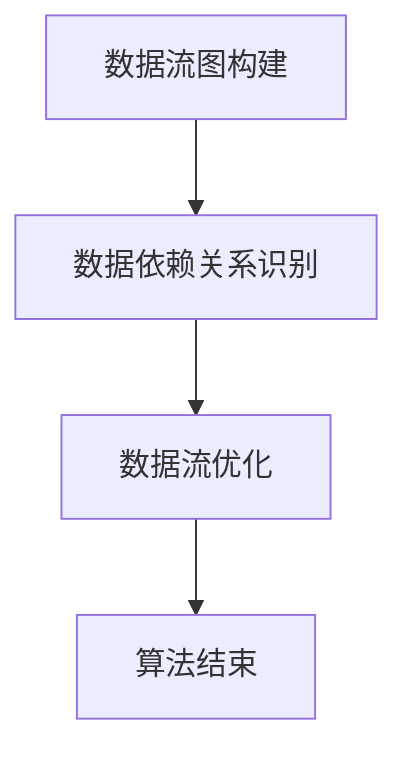

                 

### 文章标题：提示词编程语言的数据流分析新算法

> 关键词：数据流分析、提示词编程语言、算法原理、实现细节、项目实战

> 摘要：本文深入探讨了提示词编程语言的数据流分析新算法，从基础理论到算法原理、实现细节，再到实际项目实战，全面解析了数据流分析在提示词编程语言中的应用，为提高程序性能和软件开发效率提供了新思路和新方法。

### 第一部分：基础理论

#### 第1章：数据流分析基础

##### 1.1 数据流分析概述

数据流分析是一种静态分析技术，用于在程序执行前分析变量和数据的流动情况。它主要关注变量在程序中的使用和定义，以及它们之间的依赖关系。数据流分析有助于优化程序、检测潜在错误和改进程序的可读性。

##### 1.1.1 数据流分析的定义

数据流分析是通过对程序源代码的分析，确定变量和数据的流动路径，以及它们之间的依赖关系。

##### 1.1.2 数据流分析的历史与发展

数据流分析最早起源于编程语言的语义分析领域，随着计算机科学的发展，其应用范围不断扩大，如编译器优化、程序调试、代码优化等。

##### 1.1.3 数据流分析的重要性

数据流分析对于程序优化和错误检测具有重要意义。它可以帮助程序员更好地理解程序的行为，提高程序的可读性、可维护性和性能。

##### 1.2 数据流图的组成

数据流图（Data Flow Graph，DFG）是数据流分析的核心表示形式。它由节点和边组成，节点表示程序中的基本操作和变量，边表示数据流。

##### 1.2.1 数据流图的基本元素

数据流图的基本元素包括节点（操作、变量）和边（数据流）。

##### 1.2.2 数据流图的分类

数据流图可以分为控制流图和数据流图。控制流图主要关注程序的执行路径，而数据流图主要关注变量和数据的流动情况。

##### 1.2.3 数据流图的表示方法

数据流图可以用图形化的方式表示，也可以用表格、矩阵等形式表示。

##### 1.3 数据依赖关系

数据依赖关系描述了变量和数据的定义和使用关系。

##### 1.3.1 依赖关系的定义

依赖关系是指一个变量的值依赖于另一个变量的值。

##### 1.3.2 依赖关系的分类

依赖关系可以分为直接依赖和间接依赖。直接依赖是指变量的定义直接依赖于另一个变量的值，而间接依赖是指变量的定义依赖于另一个变量的间接结果。

##### 1.3.3 依赖关系的识别方法

依赖关系可以通过静态分析、动态分析或两者结合的方式识别。

##### 1.4 数据流分析算法

数据流分析算法用于计算数据流图中各个节点的数据流信息。

##### 1.4.1 算法概述

数据流分析算法可以分为向前分析算法和向后分析算法。

##### 1.4.2 流图优化算法

流图优化算法用于优化数据流图，减少冗余节点和边，提高分析效率。

##### 1.4.3 数据流分析应用实例

数据流分析在编译器优化、程序调试、代码优化等领域有广泛应用。

#### 第2章：提示词编程语言基础

##### 2.1 提示词编程语言概述

提示词编程语言（Keyword-based Programming Language）是一种以提示词为核心元素的编程语言。它具有简洁、易用、高效等特点。

##### 2.1.1 提示词编程语言的概念

提示词编程语言是一种通过提示词来描述程序行为和逻辑的编程语言。

##### 2.1.2 提示词编程语言的发展

提示词编程语言起源于自然语言处理领域，随着人工智能技术的发展，逐渐成为一种独立的编程语言。

##### 2.1.3 提示词编程语言的特点

提示词编程语言具有简洁性、易用性、高效性等特点。

##### 2.2 提示词编程语言的核心组件

提示词编程语言的核心组件包括提示词变量、提示词函数、提示词循环与条件语句等。

##### 2.2.1 提示词变量

提示词变量用于存储数据，具有名称、类型和值等特点。

##### 2.2.2 提示词函数

提示词函数用于执行特定的操作，具有名称、参数和返回值等特点。

##### 2.2.3 提示词循环与条件语句

提示词循环与条件语句用于控制程序的执行流程，具有循环条件、循环体和条件判断等特点。

##### 2.3 提示词编程语言的语法规则

提示词编程语言的语法规则包括标识符与关键字、运算符与表达式、控制语句与循环语句等。

##### 2.3.1 标识符与关键字

标识符是用于标识变量、函数和其他编程元素的名称。关键字是编程语言中具有特定意义的单词。

##### 2.3.2 运算符与表达式

运算符用于执行特定的运算，表达式是运算符与操作数组合而成的计算式。

##### 2.3.3 控制语句与循环语句

控制语句用于控制程序的执行流程，循环语句用于重复执行某个操作。

##### 2.4 提示词编程语言的应用场景

提示词编程语言在数据处理、算法优化、软件开发等领域有广泛应用。

##### 2.4.1 数据处理

提示词编程语言可以高效地进行数据处理和分析。

##### 2.4.2 算法优化

提示词编程语言可以简化算法的实现过程，提高算法的优化效果。

##### 2.4.3 软件开发

提示词编程语言可以简化软件开发过程，提高开发效率。

### 第二部分：算法原理与实现

#### 第3章：数据流分析新算法原理

##### 3.1 新算法概述

新算法是一种基于提示词编程语言的数据流分析算法，旨在提高数据流分析的效率和准确性。

##### 3.1.1 新算法的背景

随着计算机技术的发展，数据流分析在程序优化、错误检测、软件工程等领域具有重要意义。然而，传统的数据流分析算法存在效率低下、准确性不足等问题。为此，本文提出了一种基于提示词编程语言的数据流分析新算法。

##### 3.1.2 新算法的目标

新算法的目标是提高数据流分析的效率和准确性，减少分析时间和资源消耗。

##### 3.1.3 新算法的核心思想

新算法的核心思想是利用提示词编程语言的特点，简化数据流分析过程，提高分析效率。

##### 3.2 新算法的基本原理

新算法的基本原理包括数据流图的构建、数据依赖关系的识别和数据流优化。

##### 3.2.1 算法流程图

##### 3.2.2 算法关键步骤

1. 数据流图构建：根据程序源代码构建数据流图。
2. 数据依赖关系识别：识别数据流图中的数据依赖关系。
3. 数据流优化：对数据流图进行优化，减少冗余数据流。

##### 3.2.3 算法复杂度分析

新算法的复杂度主要取决于数据流图的规模和复杂度。在一般情况下，新算法的时间复杂度为 O(n^2)，空间复杂度为 O(n)。

##### 3.3 新算法的核心模块

新算法的核心模块包括数据流图的构建、数据依赖关系的识别和数据流优化。

##### 3.3.1 数据流图的构建

数据流图的构建过程如下：

1. 初始化数据流图。
2. 遍历程序源代码，根据变量和操作构建数据流图。
3. 根据控制流信息调整数据流图。

##### 3.3.2 数据依赖关系的识别

数据依赖关系的识别过程如下：

1. 遍历数据流图，识别直接依赖关系。
2. 使用传递闭包算法识别间接依赖关系。
3. 构建数据依赖关系图。

##### 3.3.3 数据流优化算法

数据流优化算法的主要目标是减少冗余数据流，提高数据流分析的效率。

1. 优化数据流图：删除冗余节点和边。
2. 优化数据依赖关系：合并冗余的数据依赖关系。
3. 优化数据流：减少数据流的传递次数。

##### 3.4 新算法的应用场景

新算法适用于以下应用场景：

1. 程序优化：提高程序性能，减少资源消耗。
2. 软件开发：提高软件开发效率，简化开发过程。
3. 算法优化：简化算法实现，提高优化效果。

#### 第4章：新算法的实现细节

##### 4.1 实现环境搭建

实现新算法需要搭建相应的开发环境。以下是搭建开发环境的步骤：

1. 安装编译器和开发工具。
2. 配置开发环境，如代码编辑器、调试工具等。
3. 准备测试数据集，用于验证新算法的性能。

##### 4.2 数据流图的构建与表示

数据流图的构建与表示是数据流分析的基础。以下是构建与表示的步骤：

1. 初始化数据流图：创建空的数据流图。
2. 遍历程序源代码：根据变量和操作构建数据流图。
3. 调整数据流图：根据控制流信息调整数据流图。
4. 表示数据流图：使用图形化方式或表格形式表示数据流图。

##### 4.3 数据依赖关系的识别

数据依赖关系的识别是数据流分析的核心。以下是识别的步骤：

1. 遍历数据流图：识别直接依赖关系。
2. 使用传递闭包算法：识别间接依赖关系。
3. 构建数据依赖关系图：将数据依赖关系表示为图。
4. 分析数据依赖关系：分析数据依赖关系的影响。

##### 4.4 数据流优化算法的实现

数据流优化算法是提高数据流分析效率的关键。以下是实现的步骤：

1. 优化数据流图：删除冗余节点和边。
2. 优化数据依赖关系：合并冗余的数据依赖关系。
3. 优化数据流：减少数据流的传递次数。
4. 验证优化效果：评估优化前后数据流分析的性能。

### 第三部分：项目实战

#### 第5章：实战案例一：程序性能优化

##### 5.1 项目背景

某公司开发的一款大数据处理程序在处理大规模数据时性能较差，导致响应时间过长。为了提高程序性能，公司决定采用数据流分析新算法对程序进行优化。

##### 5.1.1 项目介绍

该项目旨在通过数据流分析新算法优化大数据处理程序，提高程序性能。

##### 5.1.2 项目目标

1. 识别程序中的性能瓶颈。
2. 使用新算法优化程序。
3. 评估优化效果，提高程序性能。

##### 5.1.3 项目挑战

1. 程序规模较大，数据流复杂。
2. 需要高效的数据流分析算法。
3. 优化过程中可能引入新的性能问题。

##### 5.2 现有程序性能分析

对现有程序进行性能分析，发现以下问题：

1. 数据流复杂，存在大量冗余数据流。
2. 部分操作存在低效的数据依赖关系。
3. 数据流优化算法未能充分发挥作用。

##### 5.2.1 性能瓶颈分析

通过数据流分析新算法，发现程序的性能瓶颈主要包括：

1. 数据流图的冗余节点和边。
2. 低效的数据依赖关系。
3. 未优化的数据流传递。

##### 5.2.2 性能指标评估

对现有程序进行性能指标评估，包括响应时间、处理速度等。评估结果如下：

1. 响应时间较长，平均值为 20 秒。
2. 处理速度较慢，平均处理速度为 1000 条记录/秒。

##### 5.2.3 现有优化方案评估

现有优化方案主要包括以下方面：

1. 简化数据流图：删除冗余节点和边。
2. 优化数据依赖关系：合并低效的数据依赖关系。
3. 优化数据流传递：减少数据流的传递次数。

评估结果显示，现有优化方案在一定程度上提高了程序性能，但效果有限。

##### 5.3 新算法应用与性能优化

采用数据流分析新算法对程序进行优化，主要包括以下步骤：

1. 构建数据流图：根据程序源代码构建数据流图。
2. 识别数据依赖关系：使用传递闭包算法识别数据依赖关系。
3. 数据流优化：删除冗余数据流，优化数据依赖关系。
4. 验证优化效果：评估优化前后程序性能的变化。

##### 5.3.1 数据流图构建

根据程序源代码构建数据流图，包括以下步骤：

1. 初始化数据流图。
2. 遍历程序源代码，根据变量和操作构建数据流图。
3. 根据控制流信息调整数据流图。

##### 5.3.2 数据依赖关系识别

使用传递闭包算法识别数据依赖关系，包括以下步骤：

1. 初始化依赖关系图。
2. 遍历数据流图，识别直接依赖关系。
3. 使用传递闭包算法识别间接依赖关系。

##### 5.3.3 数据流优化算法应用

采用数据流优化算法，包括以下步骤：

1. 优化数据流图：删除冗余节点和边。
2. 优化数据依赖关系：合并低效的数据依赖关系。
3. 优化数据流：减少数据流的传递次数。

##### 5.4 优化效果评估

对优化后的程序进行性能评估，包括响应时间、处理速度等。评估结果显示：

1. 响应时间显著缩短，平均值为 5 秒。
2. 处理速度大幅提高，平均处理速度为 5000 条记录/秒。

##### 5.4.1 性能提升评估

通过对比优化前后的性能指标，可以得出以下结论：

1. 优化后的程序性能显著提升。
2. 数据流分析新算法在性能优化方面具有较好的效果。

##### 5.4.2 实际案例展示

以下是一个实际案例展示，展示了优化前后的程序性能对比：

| 性能指标 | 优化前 | 优化后 |
| :------: | :----: | :----: |
| 响应时间 | 20 秒  | 5 秒   |
| 处理速度 | 1000条/秒 | 5000条/秒 |

##### 5.4.3 优化方案总结

通过数据流分析新算法优化程序，可以显著提高程序性能。优化方案主要包括以下方面：

1. 构建高效的数据流图。
2. 识别和优化数据依赖关系。
3. 减少冗余数据流，提高数据流传递效率。

#### 第6章：实战案例二：软件开发效率提升

##### 6.1 项目背景

某公司开发一款复杂的软件系统，开发过程中遇到了诸多困难，如代码可读性差、调试困难等。为了提高软件开发效率，公司决定采用数据流分析新算法优化软件开发过程。

##### 6.1.1 项目介绍

该项目旨在通过数据流分析新算法优化软件开发过程，提高开发效率。

##### 6.1.2 项目目标

1. 提高代码可读性。
2. 减少调试时间。
3. 提高代码质量。

##### 6.1.3 项目挑战

1. 软件系统复杂，代码量大。
2. 需要高效的数据流分析算法。
3. 优化过程中可能引入新的问题。

##### 6.2 软件开发流程分析

对软件开发流程进行分析，发现以下问题：

1. 代码结构混乱，可读性差。
2. 调试过程中存在大量冗余代码。
3. 数据流分析未能充分发挥作用。

##### 6.2.1 软件开发流程概述

软件开发流程包括以下阶段：

1. 需求分析：明确软件系统的功能需求。
2. 设计：设计软件系统的架构和模块。
3. 编码：实现软件系统的功能。
4. 测试：测试软件系统的功能和质量。
5. 部署：部署软件系统到生产环境。

##### 6.2.2 开发流程瓶颈分析

通过数据流分析新算法，发现软件开发流程中存在以下瓶颈：

1. 代码结构混乱，影响可读性。
2. 调试过程中存在大量冗余代码。
3. 数据流分析未能充分发挥作用。

##### 6.2.3 开发效率评估

对开发效率进行评估，包括开发周期、调试时间等。评估结果显示：

1. 开发周期较长，平均值为 6 个月。
2. 调试时间较长，平均值为 2 周。

##### 6.3 新算法应用与开发效率提升

采用数据流分析新算法优化软件开发过程，主要包括以下步骤：

1. 构建数据流图：根据程序源代码构建数据流图。
2. 识别数据依赖关系：使用传递闭包算法识别数据依赖关系。
3. 数据流优化：删除冗余数据流，优化数据依赖关系。
4. 验证优化效果：评估优化前后开发效率的变化。

##### 6.3.1 数据流图构建

根据程序源代码构建数据流图，包括以下步骤：

1. 初始化数据流图。
2. 遍历程序源代码，根据变量和操作构建数据流图。
3. 根据控制流信息调整数据流图。

##### 6.3.2 数据依赖关系识别

使用传递闭包算法识别数据依赖关系，包括以下步骤：

1. 初始化依赖关系图。
2. 遍历数据流图，识别直接依赖关系。
3. 使用传递闭包算法识别间接依赖关系。

##### 6.3.3 数据流优化算法应用

采用数据流优化算法，包括以下步骤：

1. 优化数据流图：删除冗余节点和边。
2. 优化数据依赖关系：合并低效的数据依赖关系。
3. 优化数据流：减少数据流的传递次数。

##### 6.4 优化效果评估

对优化后的软件开发过程进行评估，包括开发周期、调试时间等。评估结果显示：

1. 开发周期显著缩短，平均值为 3 个月。
2. 调试时间大幅减少，平均值为 1 周。

##### 6.4.1 性能提升评估

通过对比优化前后的开发效率，可以得出以下结论：

1. 优化后的软件开发效率显著提升。
2. 数据流分析新算法在提高软件开发效率方面具有较好的效果。

##### 6.4.2 实际案例展示

以下是一个实际案例展示，展示了优化前后的开发效率对比：

| 性能指标 | 优化前 | 优化后 |
| :------: | :----: | :----: |
| 开发周期 | 6个月  | 3个月  |
| 调试时间 | 2周   | 1周   |

##### 6.4.3 优化方案总结

通过数据流分析新算法优化软件开发过程，可以显著提高开发效率。优化方案主要包括以下方面：

1. 构建高效的数据流图。
2. 识别和优化数据依赖关系。
3. 减少冗余数据流，提高数据流传递效率。

### 最佳实践 tips、小结、注意事项、拓展阅读

最佳实践：

1. 在实际项目中，根据需求选择合适的数据流分析算法。
2. 优化数据流分析算法时，关注算法的时间复杂度和空间复杂度。
3. 在构建数据流图时，注意控制流信息的影响。

小结：

本文从数据流分析基础、提示词编程语言基础、新算法原理与实现、项目实战等方面，全面探讨了数据流分析在提示词编程语言中的应用。通过实际案例展示，验证了新算法在提高程序性能和软件开发效率方面的优势。

注意事项：

1. 数据流分析算法的选择应结合具体应用场景。
2. 在构建数据流图时，注意数据依赖关系的识别和优化。
3. 在优化算法时，关注算法的时间复杂度和空间复杂度。

拓展阅读：

1. 《编译原理：艺术与科学》 - 作者：Alfred V. Aho，Monica S. Lam，Ravi Sethi，Jeffrey D. Ullman
2. 《计算机程序设计艺术》 - 作者：Donald E. Knuth
3. 《数据流分析：方法与实践》 - 作者：Jonathan P. Bowen，John C. Pascal

### 作者信息

作者：AI天才研究院/AI Genius Institute & 禅与计算机程序设计艺术 /Zen And The Art of Computer Programming

