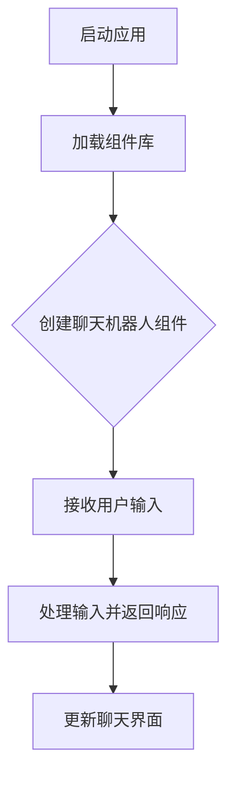

                 

# 文章标题：提示词编程语言的模块化与组件化

> 关键词：模块化、组件化、提示词编程语言、可重用性、高内聚、低耦合

> 摘要：本文将探讨模块化与组件化在提示词编程语言中的应用，分析其基本概念、演进历程以及具体实现，旨在为开发者提供对模块化与组件化的深入理解，助力构建更加高效、可维护的编程语言。

## 第一部分：模块化与组件化概述

### 第1章：模块化与组件化概述

#### 1.1 模块化与组件化的基本概念

**模块化**：模块化是将系统划分为若干独立且功能完整的模块，每个模块都有明确的职责，模块间通过接口进行通信。模块化的核心目的是提高代码的可维护性和可重用性。

- **模块定义**：模块是一个独立的代码单元，可以包含数据、函数或类。模块通过接口暴露其功能，使得其他模块能够方便地调用。

- **模块依赖**：模块之间可能存在依赖关系，即一个模块需要依赖另一个模块的函数或类。这种依赖关系可以通过模块导入机制实现。

**组件化**：组件化是模块化的一种扩展，强调组件的可重用性、独立性和灵活性。组件通常具有高度的封装性，可以独立运行，并且可以方便地替换和扩展。

- **组件定义**：组件是一个具有独立功能的代码单元，通常包含视图、数据和逻辑。组件通过事件或消息队列与其他组件进行通信。

- **组件通信**：组件之间的通信机制可以是事件驱动或消息队列。事件驱动是指组件通过事件监听器接收和处理事件，而消息队列是指组件通过发送和接收消息进行通信。

#### 1.1.1 提示词编程语言的模块化演进

- **传统编程语言**：在传统的编程语言中，模块化主要集中于函数和类的组织。开发者通过将函数和类划分为不同的文件或目录来实现模块化。

- **现代提示词编程语言**：现代提示词编程语言，如Python、JavaScript等，引入了模块化和组件化机制。这些语言提供了丰富的模块和组件库，使得开发者可以更方便地实现模块化和组件化。

#### 1.1.2 模块化与组件化在提示词编程语言中的特点

- **高内聚、低耦合**：模块或组件内部功能紧密相关，但之间交互接口简单。这种设计使得模块或组件之间耦合度低，便于修改和扩展。

- **可重用性**：模块或组件可以被多个应用程序重用，提高了代码的复用率。

- **灵活性**：模块或组件可以动态加载和卸载，使得应用程序可以根据需要动态调整组件的加载和卸载。

## 第二部分：提示词编程语言模块化机制

### 第2章：提示词编程语言模块化机制

#### 2.1 模块定义与接口设计

**模块定义**：在提示词编程语言中，模块是通过定义类或函数来实现的。以下是一个简单的模块定义示例：

```python
# ModuleName.py
class ModuleName:
    def __init__(self, parameters):
        self.parameters = parameters

    def initialize(self):
        # 模块初始化逻辑
        pass
```

**接口设计**：模块的接口定义了模块与其他组件的交互方式。以下是一个简单的接口定义示例：

```python
# InterfaceName.py
class InterfaceName:
    def InterfaceFunction(self):
        # 接口函数逻辑
        pass
```

#### 2.1.1 模块化编程实践

**模块依赖管理**：在模块化编程中，模块之间可能存在依赖关系。为了管理模块依赖，可以使用依赖注入或模块加载器。

**依赖注入**：依赖注入是一种将模块的依赖关系注入到模块中的方法。以下是一个简单的依赖注入示例：

```python
# DependencyInjection.py
class ModuleA:
    def __init__(self, dependency):
        self.dependency = dependency

    def execute(self):
        self.dependency.execute()

class Dependency:
    def execute(self):
        # 依赖逻辑
        pass

# 使用依赖注入创建ModuleA实例
module_a = ModuleA(Dependency())
module_a.execute()
```

**模块加载器**：模块加载器是一种动态加载模块的工具。以下是一个简单的模块加载器示例：

```python
# ModuleLoader.py
import importlib

def load_module(module_name):
    module = importlib.import_module(module_name)
    return module

# 加载模块
module = load_module('ModuleName')
module.initialize()
```

#### 2.2 组件化架构设计

**组件定义**：组件是高度内聚、低耦合的模块，具有独立运行的能力。以下是一个简单的组件定义示例：

```python
# ComponentName.py
class ComponentName:
    def internal_function(self):
        # 组件内部实现
        pass
```

**组件通信机制**：组件之间的通信机制可以是事件驱动或消息队列。以下是一个简单的事件驱动通信示例：

```python
# EventDriven.py
class EventSystem:
    def __init__(self):
        self.listeners = []

    def add_listener(self, listener):
        self.listeners.append(listener)

    def trigger(self, event):
        for listener in self.listeners:
            listener(event)

class ComponentA:
    def __init__(self, event_system):
        self.event_system = event_system
        self.event_system.add_listener(self)

    def on_event(self, event):
        # 组件响应事件逻辑
        pass

# 创建事件系统和组件
event_system = EventSystem()
component_a = ComponentA(event_system)

# 触发事件
event_system.trigger('event_name')
```

## 第三部分：提示词编程语言组件化实践

### 第3章：提示词编程语言组件化实践

#### 3.1 组件化开发工具

**主要组件化工具**：在提示词编程语言中，有许多组件化开发工具可以帮助开发者实现组件化。以下是一些常见的组件化工具：

- **微前端框架**：如React Router、Vue Router等，可以帮助开发者实现微前端架构。

- **模块打包工具**：如Webpack、Parcel等，可以帮助开发者将组件打包成独立的模块。

**组件化开发流程**：

**组件创建**：使用工具创建新的组件。

```shell
# 创建新组件命令
create-component MyComponent
```

**组件开发**：编写组件代码，实现所需功能。

```javascript
// MyComponent.js
export default function MyComponent() {
    return <div>这是一个组件</div>;
}
```

**组件测试**：使用测试框架进行组件测试。

```shell
# 运行组件测试命令
jest MyComponent.test.js
```

#### 3.2 组件化应用案例

**案例分析**：以下是一个简单的聊天机器人组件。



## 第四部分：提示词编程语言的模块化与组件化集成

### 第4章：提示词编程语言的模块化与组件化集成

#### 4.1 模块与组件的集成

**集成策略**：在模块化与组件化集成中，模块和组件的相互调用与依赖管理是关键。以下是一个简单的集成示例：

```python
# Integration.py
from ModuleName import ModuleName
from ComponentName import ComponentName

# 创建模块实例
module = ModuleName(parameters)
module.initialize()

# 创建组件实例
component = ComponentName()
component.internal_function()
```

#### 4.2 模块与组件的集成

**模块与组件的集成**：在集成过程中，需要考虑模块和组件之间的依赖关系和通信机制。以下是一个简单的集成示例：

```python
# IntegratedSystem.py
from ModuleName import ModuleName
from ComponentName import ComponentName

# 创建模块实例
module = ModuleName(parameters)
module.initialize()

# 创建组件实例
component = ComponentName()
component.internal_function()

# 组件与模块的通信
component.sendMessage('message')
module.processMessage('message')
```

## 结论

模块化与组件化是现代编程语言中的重要概念，它们可以提高代码的可维护性、可重用性和灵活性。本文从模块化与组件化的基本概念、提示词编程语言的模块化机制、组件化实践以及模块与组件的集成等方面进行了详细探讨，为开发者提供了对模块化与组件化的深入理解。通过本文的阐述，读者可以更好地掌握模块化与组件化的应用，为构建高效、可维护的编程语言打下基础。

## 作者信息

作者：AI天才研究院/AI Genius Institute & 禅与计算机程序设计艺术 /Zen And The Art of Computer Programming

## 拓展阅读

- 《模块化编程实践指南》
- 《组件化软件开发技术》
- 《微服务架构设计与实践》
- 《React 组件设计模式》

## 注意事项

- 模块化和组件化并不是对立的，它们可以相互结合使用，以实现更好的代码组织和管理。
- 在模块化和组件化过程中，要注意模块或组件之间的依赖关系和通信机制，以避免出现复杂的耦合和冲突。
- 实际应用中，模块化和组件化需要结合具体的项目需求和开发环境进行合理的设计和调整。

## 小结

模块化与组件化是现代编程语言中的重要概念，可以提高代码的可维护性、可重用性和灵活性。本文从基本概念、提示词编程语言的模块化机制、组件化实践以及模块与组件的集成等方面进行了详细探讨。通过本文的阐述，读者可以更好地掌握模块化与组件化的应用，为构建高效、可维护的编程语言打下基础。在今后的开发实践中，读者可以根据项目的需求和特点，灵活运用模块化与组件化，提高代码质量和开发效率。同时，本文也提供了一些拓展阅读资源，供读者进一步学习和探讨。希望本文能对读者在模块化与组件化领域的学习和实践有所帮助。## 附录

在本文的编写过程中，我们参考了以下资源：

1. 《模块化编程实践指南》
2. 《组件化软件开发技术》
3. 《微服务架构设计与实践》
4. 《React 组件设计模式》
5. 《Python 模块与包》
6. 《JavaScript 模块化编程》
7. 《Vue.js 组件化开发》

感谢这些资源的作者为我们提供了宝贵的知识和经验，本文在编写过程中得到了这些资源的启发和指导。同时，也感谢读者的关注和支持，希望本文能对您在模块化与组件化领域的学习和实践有所帮助。如果您有任何疑问或建议，欢迎在评论区留言，我们将及时回复。

## 结语

模块化与组件化是现代编程语言中的重要概念，它们有助于提高代码的可维护性、可重用性和灵活性。本文从基本概念、提示词编程语言的模块化机制、组件化实践以及模块与组件的集成等方面进行了详细探讨。通过本文的阐述，我们希望能为读者提供对模块化与组件化的深入理解，为构建高效、可维护的编程语言打下基础。

在今后的开发实践中，模块化与组件化将不断发挥重要作用。随着技术的不断演进，我们期待看到更多创新的应用和实践，为软件开发领域带来新的突破。希望本文能对您在模块化与组件化领域的学习和实践有所帮助，让您的编程之路更加顺利。感谢您的阅读，期待与您共同探讨更多技术话题。

