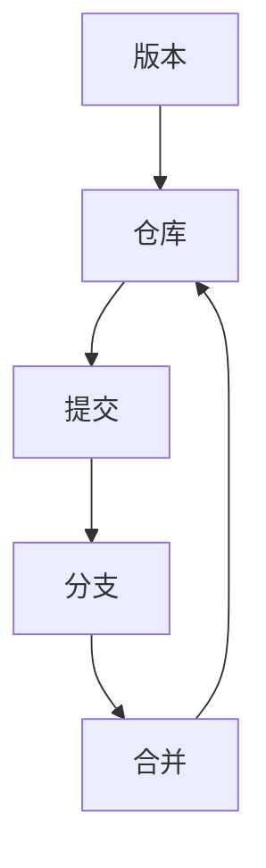

                 

### 《提示词编程语言的版本控制与管理》

关键词：提示词编程语言，版本控制，管理，Git，策略，安全

摘要：本文将探讨提示词编程语言的版本控制与管理，首先介绍提示词编程语言的基础概念，然后深入解析版本控制的基本原理和常用工具，如Git。接着，我们将讨论版本控制策略和实践，最后分析版本控制的安全性以及展望未来的发展趋势。

#### 第一部分：基础概念与原理

### 第1章：版本控制基础

#### 1.1 提示词编程语言的概述

##### 1.1.1 提示词编程语言的定义
提示词编程语言是一种专门用于构建和优化自然语言处理（NLP）任务的编程语言。这种语言的主要特点是使用提示词（prompt）来引导模型生成响应。提示词通常包含关键词、背景信息或上下文，用以指导模型的决策过程。

##### 1.1.2 提示词编程语言的特点
提示词编程语言具有以下特点：

1. **高度抽象**：通过提供预定义的提示词模板，减少了对底层实现细节的关注。
2. **易于使用**：对于NLP新手来说，使用提示词编程语言可以快速上手，构建简单的对话系统。
3. **快速开发**：提示词编程语言使得开发过程更加高效，可以迅速迭代和改进模型。

##### 1.1.3 提示词编程语言的应用领域
提示词编程语言广泛应用于以下领域：

1. **客服机器人**：用于提供24/7的客户支持，处理常见问题和自动化服务。
2. **教育辅助**：为学生提供个性化的学习指导，辅助教学活动。
3. **虚拟助手**：帮助用户管理日程、提供信息查询等服务。

#### 1.2 版本控制的概念

##### 1.2.1 版本控制的基本概念
版本控制是一种跟踪和管理工作文件和代码的方法，确保在团队协作中不会丢失工作成果，并能轻松地回滚到之前的版本。

##### 1.2.2 版本控制的重要性
版本控制的重要性体现在以下几个方面：

1. **团队协作**：确保多个开发人员可以同时工作，而不会互相覆盖。
2. **代码保护**：防止误操作或意外删除导致的工作丢失。
3. **故障恢复**：能够快速回滚到稳定版本，解决问题。

##### 1.2.3 版本控制的发展历程
版本控制工具的发展历程可以分为几个阶段：

1. **本地文件备份**：最早期的版本控制方法，通过定期备份文件来保护工作成果。
2. **集中式版本控制**：如SVN，所有文件存储在中央仓库中，开发者从中央仓库获取文件并进行修改。
3. **分布式版本控制**：如Git，每个开发者都有自己的仓库，可以进行离线操作，提交和拉取都在本地完成。

#### 1.3 版本控制的基本原理

##### 1.3.1 版本控制的模型
版本控制模型可以分为以下几类：

1. **客户-服务器模型**：如SVN，所有文件存储在服务器上，开发者从服务器获取文件并提交更改。
2. **分布式模型**：如Git，每个开发者都有自己的仓库，可以通过网络共享和同步更改。

##### 1.3.2 版本控制的流程
版本控制的流程通常包括以下步骤：

1. **克隆仓库**：从远程或本地仓库克隆一份副本。
2. **创建分支**：在一个新的分支上进行开发，避免影响主分支。
3. **提交更改**：将更改提交到本地仓库。
4. **拉取更新**：从远程仓库拉取最新的更改。
5. **合并分支**：将分支合并到主分支。
6. **推送更新**：将本地仓库的更改推送到远程仓库。

##### 1.3.3 版本控制的关键角色
版本控制涉及以下几个关键角色：

1. **开发者**：负责编写代码、提交更改和创建分支。
2. **仓库管理员**：负责管理仓库，确保版本控制系统的正常运行。
3. **代码审查者**：负责审查代码，确保代码质量和一致性。

### 《提示词编程语言的版本控制与管理》目录大纲

#### 第一部分：基础概念与原理

# 第1章：版本控制基础

## 1.1 提示词编程语言的概述

### 1.1.1 提示词编程语言的定义

### 1.1.2 提示词编程语言的特点

### 1.1.3 提示词编程语言的应用领域

## 1.2 版本控制的概念

### 1.2.1 版本控制的基本概念

### 1.2.2 版本控制的重要性

### 1.2.3 版本控制的发展历程

## 1.3 版本控制的基本原理

### 1.3.1 版本控制的模型

### 1.3.2 版本控制的流程

### 1.3.3 版本控制的关键角色

#### 第二部分：版本控制工具

# 第2章：Git版本控制系统

## 2.1 Git概述

### 2.1.1 Git的基本概念

### 2.1.2 Git的工作原理

### 2.1.3 Git的优势与局限性

## 2.2 Git的基本操作

### 2.2.1 初始化仓库

### 2.2.2 添加文件

### 2.2.3 提交更改

### 2.2.4 查看历史记录

## 2.3 Git分支管理

### 2.3.1 分支的概念

### 2.3.2 分支的创建与合并

### 2.3.3 分支的解决冲突

## 2.4 Git的其他特性

### 2.4.1 标签的使用

### 2.4.2 远程仓库的操作

### 2.4.3 监控远程分支

#### 第三部分：版本控制策略

# 第3章：版本控制策略与实践

## 3.1 版本控制策略概述

### 3.1.1 版本控制策略的概念

### 3.1.2 版本控制策略的类型

### 3.1.3 版本控制策略的选择依据

## 3.2 版本控制的最佳实践

### 3.2.1 提交消息规范化

### 3.2.2 代码审查与测试

### 3.2.3 版本库的备份与迁移

## 3.3 提示词编程语言版本控制策略应用

### 3.3.1 提示词编程语言版本控制的特点

### 3.3.2 提示词编程语言版本控制的挑战

### 3.3.3 提示词编程语言版本控制的解决方案

#### 第四部分：版本控制安全与管理

# 第4章：版本控制的安全性

## 4.1 版本控制的安全风险

### 4.1.1 恶意篡改的风险

### 4.1.2 信息泄露的风险

### 4.1.3 软件供应链攻击的风险

## 4.2 版本控制的安全措施

### 4.2.1 权限控制

### 4.2.2 加密技术

### 4.2.3 代码审计

## 4.3 版本控制的管理与监控

### 4.3.1 持续集成与持续部署

### 4.3.2 版本库的备份与恢复

### 4.3.3 版本控制的日志管理

#### 第五部分：版本控制案例研究

# 第5章：版本控制实际应用案例

## 5.1 案例一：项目版本控制实践

### 5.1.1 项目背景

### 5.1.2 版本控制策略制定

### 5.1.3 版本控制实施与效果评估

## 5.2 案例二：大型分布式系统的版本控制

### 5.2.1 系统架构与需求

### 5.2.2 版本控制方案设计

### 5.2.3 版本控制实施与优化

#### 第六部分：拓展与展望

# 第6章：版本控制的新趋势与发展

## 6.1 版本控制的新趋势

### 6.1.1 智能化版本控制

### 6.1.2 云原生存储与管理

### 6.1.3 社交化版本控制

## 6.2 版本控制的发展展望

### 6.2.1 版本控制技术的挑战

### 6.2.2 版本控制的应用前景

### 6.2.3 未来版本控制的发展方向

#### 附录

## 附录A：版本控制常用工具与资源

### A.1 Git命令行工具

### A.2 Git图形界面工具

### A.3 其他版本控制工具简介

## 附录B：版本控制相关书籍与论文推荐

### B.1 版本控制基础书籍

### B.2 版本控制高级书籍

### B.3 版本控制论文精选

### B.4 提示词编程语言相关书籍与论文

### B.5 版本控制与提示词编程语言的交叉应用论文与书籍

### 作者

作者：AI天才研究院/AI Genius Institute & 禅与计算机程序设计艺术 /Zen And The Art of Computer Programming

---

### 第1章：版本控制基础

版本控制是软件开发中不可或缺的一环，它确保了代码的完整性和可追溯性。在介绍具体的版本控制工具和策略之前，我们先来了解一些基础概念和原理。

#### 1.1.1 提示词编程语言的定义

提示词编程语言（Prompt-based Programming Language）是一种专门用于生成自然语言文本的编程语言。它通过提示（Prompt）来引导程序生成预期的输出。提示通常是一个或多个输入，包括关键词、背景信息、上下文等。例如，一个简单的提示可以是“请编写一篇关于人工智能的未来发展的文章”。

提示词编程语言通常具有以下特点：

1. **高抽象层次**：提示词编程语言提供了预定义的函数和库，使得开发者可以专注于文本生成逻辑，而无需关心底层实现细节。
2. **灵活性**：提示词编程语言允许开发者自定义提示词，以适应不同的场景和需求。
3. **易于扩展**：提示词编程语言通常具有良好的扩展性，开发者可以轻松地添加新的函数和库。

提示词编程语言的应用领域非常广泛，包括但不限于：

1. **自然语言生成**：用于生成文章、新闻报道、产品描述等。
2. **对话系统**：用于构建聊天机器人、虚拟助手等。
3. **机器翻译**：用于生成机器翻译文本。

#### 1.1.2 提示词编程语言的特点

1. **简洁性**：提示词编程语言的语法通常非常简洁，易于学习和使用。开发者可以使用简单的提示词来生成复杂的文本。
2. **高效性**：提示词编程语言通常具有较高的运行效率，可以快速生成文本。这使得它非常适合用于实时应用程序。
3. **灵活性**：提示词编程语言允许开发者自定义提示词和模板，以适应不同的场景和需求。这使得它可以灵活地应用于各种文本生成任务。
4. **可扩展性**：提示词编程语言通常具有良好的扩展性，开发者可以添加新的函数和库，以满足特定的需求。

#### 1.1.3 提示词编程语言的应用领域

提示词编程语言的应用领域非常广泛，以下是一些典型的应用场景：

1. **自然语言生成**：提示词编程语言可以用于生成各种类型的文本，如新闻文章、产品描述、技术文档等。
2. **对话系统**：提示词编程语言可以用于构建智能对话系统，如聊天机器人、虚拟助手等。这些系统可以与用户进行自然语言交互，提供有用的信息和帮助。
3. **机器翻译**：提示词编程语言可以用于生成机器翻译文本，提高翻译质量和效率。
4. **创意写作**：提示词编程语言可以帮助创意作家生成故事情节、角色对话等，激发创作灵感。
5. **教育和培训**：提示词编程语言可以用于生成教学材料，如课程大纲、学习指南等，帮助教师和学生更好地理解和掌握知识。

### 1.2 版本控制的概念

版本控制（Version Control）是一种跟踪和管理文件和代码变更的方法。通过版本控制，开发者可以确保代码的完整性和可追溯性，方便团队成员之间的协作和代码管理。

#### 1.2.1 版本控制的基本概念

版本控制的基本概念包括：

1. **版本**：一个文件的多个版本。
2. **仓库**：存储文件和代码的目录。
3. **提交**：对文件进行变更后，将其保存到仓库的过程。
4. **分支**：一个独立的工作副本，用于开发新功能或修复问题。
5. **合并**：将两个或多个分支的变更合并到主分支的过程。

#### 1.2.2 版本控制的重要性

版本控制的重要性体现在以下几个方面：

1. **代码保护**：版本控制可以防止代码丢失，确保工作成果得到保存。
2. **团队合作**：版本控制使得团队协作更加高效，开发者可以同时工作而不会互相干扰。
3. **故障恢复**：版本控制使得故障恢复变得更加简单，可以回滚到之前的稳定版本。
4. **代码审查**：版本控制使得代码审查变得更加容易，可以追溯代码的变更历史。

#### 1.2.3 版本控制的发展历程

版本控制的发展历程可以分为以下几个阶段：

1. **本地文件备份**：最早期的版本控制方法，通过定期备份文件来保护工作成果。
2. **集中式版本控制**：如CVS和Subversion（SVN），所有文件存储在中央仓库中，开发者从中央仓库获取文件并进行修改。
3. **分布式版本控制**：如Git和Mercurial，每个开发者都有自己的仓库，可以进行离线操作，提交和拉取都在本地完成。

### 1.3 版本控制的基本原理

版本控制的基本原理包括以下方面：

1. **文件跟踪**：版本控制工具会跟踪文件的创建、修改和删除操作，确保文件的历史记录完整。
2. **版本管理**：版本控制工具会为每个文件生成多个版本，开发者可以选择使用哪个版本。
3. **分支管理**：版本控制工具允许开发者创建和合并分支，方便同时进行多个开发任务。
4. **权限控制**：版本控制工具可以设置权限，控制谁可以查看、修改或删除文件。

### 1.3.1 版本控制的模型

版本控制模型可以分为以下两种：

1. **客户-服务器模型**：所有文件存储在中央服务器上，开发者从服务器获取文件并进行修改，然后将更改提交回服务器。这种模型通常用于集中式版本控制工具，如SVN。
2. **分布式模型**：每个开发者都有自己的仓库，可以离线工作，提交和拉取都在本地完成。这种模型通常用于分布式版本控制工具，如Git。

### 1.3.2 版本控制的流程

版本控制的流程通常包括以下步骤：

1. **克隆仓库**：从远程或本地仓库克隆一份副本。
2. **创建分支**：在一个新的分支上进行开发，避免影响主分支。
3. **提交更改**：将更改提交到本地仓库。
4. **拉取更新**：从远程仓库拉取最新的更改。
5. **合并分支**：将分支合并到主分支。
6. **推送更新**：将本地仓库的更改推送到远程仓库。

### 1.3.3 版本控制的关键角色

版本控制涉及以下几个关键角色：

1. **开发者**：负责编写代码、提交更改和创建分支。
2. **仓库管理员**：负责管理仓库，确保版本控制系统的正常运行。
3. **代码审查者**：负责审查代码，确保代码质量和一致性。

### 版本控制的概念联系与架构

为了更好地理解版本控制的概念，我们可以使用Mermaid流程图来展示其各个核心概念之间的联系：



在这个流程图中，我们可以看到版本（A）是存储在仓库（B）中的，每次提交（C）都会创建一个新的版本。开发者可以通过创建分支（D）来隔离不同的开发任务，然后将这些分支合并（E）回主仓库。

### 版本控制的基本原理与流程

为了更深入地理解版本控制，我们接下来将讨论其基本原理和流程。这包括对版本控制工具的工作原理、基本的操作流程以及涉及的关键角色进行详细的解释。

#### 版本控制工具的工作原理

版本控制工具，如Git，通过一系列的数据结构和算法来实现对文件变更的跟踪和管理。Git使用一个称为“仓库”的数据存储区域，其中包含项目的历史记录、当前文件状态以及未来可能的文件状态。

**核心数据结构**：

1. **对象仓库**：Git将文件内容、提交历史和配置信息等数据存储为对象，这些对象存储在对象仓库中。对象仓库由两个主要部分组成：文件内容对象（blob）和提交对象。
2. **提交树**：提交树是一个树形结构，每个提交对象都指向一个树对象，树对象代表项目在某个时间点的状态。提交树通过提交对象之间的链接形成一个线性历史记录。
3. **索引**：索引（也称为暂存区）是Git跟踪文件变更的一个中间存储区域。开发者可以在索引中添加或修改文件，然后通过`commit`命令将索引的内容提交到仓库。

**基本工作原理**：

1. **文件变更的跟踪**：当开发者对文件进行修改时，Git会生成一个新的文件内容对象，并将其添加到对象仓库中。同时，Git会将这个新对象链接到当前分支的最新提交对象，从而形成一个指向当前文件状态的指针。
2. **提交历史的管理**：每次开发者提交更改时，Git会创建一个新的提交对象，这个对象包含了当前文件状态、提交说明以及指向当前分支的指针。提交对象通过指针链接形成一个线性历史记录，从而实现了版本控制。

#### 基本的版本控制流程

版本控制的流程通常包括以下几个步骤：

1. **克隆仓库**：开发者通过`git clone`命令从远程仓库克隆一个副本到本地。这个步骤创建了一个新的本地仓库，并初始化了一个分支，通常命名为`master`或`main`。
2. **创建分支**：开发者可以使用`git branch`命令创建一个新的分支。新分支是一个指向提交树的指针，它与主分支（如`master`）隔离，使得开发者可以在新分支上独立进行开发，而不会影响到主分支。
3. **提交更改**：开发者对文件进行修改后，可以使用`git add`命令将变更添加到索引中，然后使用`git commit`命令将索引的内容提交到仓库中。每次提交都会生成一个新的提交对象，并将其添加到分支的末尾。
4. **拉取更新**：如果远程仓库有新的提交，开发者可以使用`git pull`命令从远程仓库拉取更新。这个步骤会将远程仓库的最新提交合并到本地分支中，确保本地分支与远程分支保持同步。
5. **合并分支**：当开发者在分支上完成功能开发后，可以使用`git merge`命令将分支合并到主分支。合并过程将两个分支的提交历史合并为一个连续的线性历史记录。
6. **推送更新**：最后，开发者可以使用`git push`命令将本地分支的更改推送到远程仓库，使得远程仓库也包含这些更新。

#### 涉及的关键角色

在版本控制过程中，通常涉及以下几个关键角色：

1. **开发者**：负责编写代码、提交更改和创建分支。开发者可以使用版本控制工具来管理自己的代码，并与其他开发者协作。
2. **仓库管理员**：负责管理仓库，包括权限控制、备份和恢复等。仓库管理员确保仓库的稳定运行和数据安全。
3. **代码审查者**：负责审查代码，确保代码质量和一致性。代码审查者在合并分支之前会检查提交的代码，并提出反馈和建议。

#### 版本控制的基本原理与流程总结

版本控制的核心在于通过数据结构和算法对文件变更进行跟踪和管理。Git等分布式版本控制工具通过创建对象仓库、提交树和索引来实现这一目标。基本的版本控制流程包括克隆仓库、创建分支、提交更改、拉取更新、合并分支和推送更新。各个关键角色在版本控制过程中扮演着重要的角色，共同确保代码的完整性和一致性。

通过理解版本控制的基本原理和流程，开发者可以更有效地管理代码，提高团队协作效率，并确保项目的稳定性和可持续性。

### 第2章：Git版本控制系统

Git是目前最流行的分布式版本控制工具之一，由于其高效、灵活和强大的功能，被广泛应用于各种软件开发项目。在本章中，我们将详细探讨Git的概述、基本操作、分支管理以及其他特性。

#### 2.1 Git概述

##### 2.1.1 Git的基本概念

Git是一个分布式版本控制系统，由Linus Torvalds创建，用于Linux内核的开发。与传统的集中式版本控制系统（如Subversion）不同，Git在每个开发者工作站上都有一个完整的仓库副本，使得开发者可以在没有网络连接的情况下工作，并能够快速提交和拉取更改。

**Git的核心组件包括**：

1. **工作目录**：开发者直接在本地计算机上进行文件编辑和修改的区域。
2. **暂存区（索引）**：用于暂存开发者对文件的更改，直到提交到仓库。
3. **本地仓库**：存储项目的所有版本和历史记录。
4. **远程仓库**：存储在远程服务器上的仓库，如GitHub、GitLab等。

##### 2.1.2 Git的工作原理

Git使用一种称为“内容地址存储”的机制来存储和管理数据。这意味着每个文件和对象都有唯一的标识符（哈希值），这个标识符用于链接历史记录和跟踪文件变更。Git的核心功能包括：

1. **快速分支和合并**：Git的分支和合并操作非常快速，使得开发者可以轻松地尝试不同的功能并合并它们。
2. **离线工作**：开发者可以在没有网络连接的情况下提交和拉取更改，提高了工作效率。
3. **分布式协作**：每个开发者都有自己的仓库，可以独立工作，并在适当的时候与其他开发者同步代码。

##### 2.1.3 Git的优势与局限性

**优势**：

1. **高性能**：Git的底层设计使得它在处理大量数据时非常高效，尤其是分支和合并操作。
2. **灵活性**：Git的分布式特性使得开发者可以在任何时间、任何地点进行代码更改。
3. **强大的分支管理**：Git提供了强大的分支管理功能，使得开发者可以轻松地创建、合并和删除分支。

**局限性**：

1. **复杂的学习曲线**：Git的命令行界面和复杂的操作可能对初学者来说较为困难。
2. **占用空间**：由于Git存储每个文件的历史版本，仓库可能会占用较大的存储空间。

#### 2.2 Git的基本操作

##### 2.2.1 初始化仓库

初始化仓库是开始使用Git的第一步。使用以下命令可以在本地创建一个新的Git仓库：

```bash
git init
```

这将创建一个`.git`文件夹，其中包含Git管理的所有必要文件和目录。

##### 2.2.2 添加文件

在初始化仓库后，我们需要将文件添加到Git的管理中。使用`git add`命令可以将文件添加到暂存区：

```bash
git add <file>
```

如果需要添加所有更改过的文件，可以使用以下命令：

```bash
git add .
```

##### 2.2.3 提交更改

将文件添加到暂存区后，我们需要通过`git commit`命令将更改提交到本地仓库：

```bash
git commit -m "提交信息"
```

这里，“提交信息”是描述这次提交的简短说明。

##### 2.2.4 查看历史记录

查看历史记录可以帮助我们了解代码的变更历史。使用`git log`命令可以显示提交日志：

```bash
git log
```

此外，`gitk`（Git图形界面工具）提供了一个图形化界面，用于查看提交历史和分支结构。

#### 2.3 Git分支管理

分支管理是Git的核心功能之一，它允许开发者独立开发新功能或修复问题，而不影响主分支。

##### 2.3.1 分支的概念

在Git中，分支是一个指向提交树中某个特定提交的指针。每次创建分支时，Git都会创建一个新的分支指针，指向当前分支的最新提交。

##### 2.3.2 分支的创建与合并

**创建分支**：

使用以下命令可以创建一个新的分支：

```bash
git branch <branch-name>
```

创建分支后，切换到新分支：

```bash
git checkout <branch-name>
```

**合并分支**：

当新功能或修复完成时，需要将分支合并到主分支。以下命令用于合并分支：

```bash
git merge <branch-name>
```

合并过程中可能会出现冲突，需要手动解决。解决冲突后，再次提交合并结果。

##### 2.3.3 分支的解决冲突

当两个分支合并时，如果它们对某个文件的更改产生了冲突，Git会标记这些冲突，并要求开发者解决。解决冲突的方法包括手动编辑文件并合并更改，或者使用Git提供的冲突解决工具。

解决冲突后，提交更改并再次尝试合并。

#### 2.4 Git的其他特性

##### 2.4.1 标签的使用

标签用于标记特定的提交，便于回滚到某个特定版本。创建标签的命令如下：

```bash
git tag <tag-name> <commit-hash>
```

这里，`<commit-hash>`是提交的哈希值。

##### 2.4.2 远程仓库的操作

Git允许开发者将本地仓库与远程仓库同步。以下是一些常用的远程仓库操作：

- **添加远程仓库**：

  ```bash
  git remote add <remote-name> <remote-url>
  ```

- **从远程仓库拉取更新**：

  ```bash
  git pull <remote-name> <branch-name>
  ```

- **将本地更改推送到远程仓库**：

  ```bash
  git push <remote-name> <branch-name>
  ```

##### 2.4.3 监控远程分支

Git提供了多种方法来监控远程分支的更新。例如，使用`git fetch`命令可以拉取远程仓库的所有分支更新，而无需切换到特定分支。

```bash
git fetch --all
```

#### Git的总结

Git作为一种分布式版本控制工具，具有高性能、灵活性和强大的分支管理功能。通过熟练掌握Git的基本操作和分支管理，开发者可以更有效地协作和管理代码。尽管Git的命令行界面可能对初学者来说有些复杂，但通过实践和学习，开发者可以逐渐掌握Git的强大功能，提高开发效率。

### 第3章：版本控制策略与实践

版本控制策略是确保项目开发过程中代码质量和协作效率的关键因素。一个良好的版本控制策略可以帮助团队更有效地管理代码，提高项目开发的稳定性和可靠性。在本章中，我们将深入探讨版本控制策略的基本概念、类型以及在实际项目中的应用。

#### 3.1 版本控制策略概述

版本控制策略是指为了确保代码质量和协作效率而制定的一系列指导原则和实践方法。良好的版本控制策略有助于：

1. **代码安全**：防止代码被恶意篡改或丢失。
2. **团队协作**：确保团队成员之间的代码同步和协作。
3. **代码可维护性**：简化代码的维护和更新过程。
4. **故障恢复**：快速回滚到之前的稳定版本。

**版本控制策略的基本原则**：

1. **代码一致性**：确保所有团队成员使用相同的代码库和版本。
2. **变更管理**：明确记录代码变更的原因和内容。
3. **分支管理**：合理使用分支来隔离不同功能的开发。
4. **审查与测试**：在代码合并前进行严格的代码审查和测试。

#### 3.1.1 版本控制策略的概念

版本控制策略（Version Control Strategy）是指为了更好地管理代码和协作，制定的一系列指导原则和实践方法。它通常包括以下方面：

1. **代码库管理**：确定代码库的结构、权限和备份策略。
2. **分支策略**：决定如何创建、使用和合并分支。
3. **提交和合并流程**：规定如何提交代码和合并分支。
4. **审查和测试**：确保代码质量和一致性。

**版本控制策略的类型**：

版本控制策略可以根据团队规模、项目复杂度和开发模式的不同而有所不同。以下是几种常见的版本控制策略类型：

1. **集中式策略**：所有开发人员共享一个主分支，所有代码变更都直接提交到主分支。这种策略简单易用，但容易导致冲突和代码质量下降。
2. **功能分支策略**：每个功能或任务都有一个独立的分支，开发完成后合并到主分支。这种策略提高了代码的隔离性，但需要更多的分支管理和合并工作。
3. **GitFlow策略**：GitFlow是一种经典的分布式版本控制策略，包括开发、发布和热修复三个阶段。每个阶段都有特定的分支和流程。
4. **GitHub Flow**：GitHub Flow是一种基于Git的轻量级版本控制策略，适用于小规模团队和快速迭代项目。它使用主分支和拉取请求来管理代码变更。

#### 3.1.2 版本控制策略的类型

1. **GitFlow策略**

   GitFlow是一种经典的分布式版本控制策略，适用于大规模项目和复杂开发流程。GitFlow包含以下主要分支：

   - **主分支（Master）**：代表当前稳定的发布版本。
   - **开发分支（Develop）**：用于合并功能分支，是开发人员的工作分支。
   - **功能分支（Feature）**：用于实现新功能或修复问题的分支。
   - **发布分支（Release）**：用于准备发布的代码。
   - **热修复分支（Hotfix）**：用于修复主分支上的紧急问题。

   **GitFlow流程**：

   - 开发人员创建一个功能分支，并在该分支上实现新功能。
   - 功能分支完成后，合并到开发分支。
   - 开发分支合并到发布分支，进行测试和发布准备。
   - 发布分支合并到主分支，进行新版本的发布。

   - 如果在主分支或发布分支上发现紧急问题，创建一个热修复分支进行修复，然后合并到主分支。

2. **GitHub Flow**

   GitHub Flow是一种简单、灵活的版本控制策略，适用于小规模团队和快速迭代项目。GitHub Flow的核心思想是：

   - 使用主分支作为主要的开发分支，所有开发活动都在主分支上完成。
   - 通过拉取请求（Pull Request）来合并代码变更。
   - 所有代码审查和测试都在拉取请求过程中完成。

   **GitHub Flow流程**：

   - 开发人员在自己的分支上实现新功能或修复问题。
   - 创建一个拉取请求，将分支与主分支连接。
   - 代码审查者查看拉取请求，并批准或拒绝合并。
   - 一旦拉取请求被批准，代码自动合并到主分支。

   - GitHub Flow强调快速迭代和简单流程，适合小型项目和灵活的开发模式。

#### 3.1.3 版本控制策略的选择依据

选择合适的版本控制策略需要考虑以下因素：

1. **团队规模**：大型团队通常需要更复杂和规范的版本控制策略，如GitFlow，而小型团队可以采用更简单的GitHub Flow。
2. **项目复杂度**：复杂项目需要更详细的分支管理和严格的审查流程，而简单项目可以采用简单的策略。
3. **开发模式**：持续集成和持续交付项目通常需要更灵活的版本控制策略，以便快速响应市场需求。
4. **协作模式**：团队协作模式也会影响版本控制策略的选择。例如，远程工作团队可能需要更加灵活的策略。

#### 3.2 版本控制的最佳实践

为了确保版本控制策略的有效实施，以下是一些最佳实践：

1. **规范化提交消息**：使用一致的提交格式和描述，便于跟踪和审查代码变更。
2. **代码审查与测试**：在合并代码前进行严格的代码审查和测试，确保代码质量和一致性。
3. **分支命名规范**：使用有意义和易于理解的分支命名规范，便于团队理解和沟通。
4. **备份与迁移**：定期备份代码库，并确保在迁移过程中数据的一致性和完整性。

#### 3.3 提示词编程语言版本控制策略应用

提示词编程语言（如Python、Java等）具有其独特的版本控制需求，以下是一些特定于提示词编程语言的版本控制策略应用：

1. **依赖管理**：确保项目依赖的版本和库的一致性，使用工具如`pip`或`maven`来管理依赖。
2. **环境隔离**：使用虚拟环境（如Python的`venv`）来隔离项目依赖，避免版本冲突。
3. **代码模板与提示库**：版本控制提示词模板和提示库，确保提示的一致性和可维护性。

#### 3.3.1 提示词编程语言版本控制的特点

提示词编程语言在版本控制方面具有以下特点：

1. **提示词模板**：版本控制提示词模板和库，确保模板的一致性和可维护性。
2. **环境依赖**：提示词编程语言通常依赖于特定的环境配置和库，需要确保版本的一致性。
3. **上下文管理**：提示词编程语言需要管理不同的上下文和输入，确保版本控制策略能够适应不同的应用场景。

#### 3.3.2 提示词编程语言版本控制的挑战

提示词编程语言在版本控制方面面临的挑战包括：

1. **提示词的复杂度**：提示词通常包含复杂的结构和依赖，需要确保版本控制策略能够有效管理这些复杂度。
2. **环境配置**：不同环境（如开发环境、测试环境和生产环境）可能需要不同的提示词和配置，需要确保版本控制策略能够适应这些变化。
3. **多语言支持**：提示词编程语言通常支持多种编程语言，需要确保版本控制策略能够兼容这些语言。

#### 3.3.3 提示词编程语言版本控制的解决方案

为了解决提示词编程语言版本控制中的挑战，可以采取以下解决方案：

1. **统一的模板管理**：使用统一的模板管理工具，如Jinja2或Thymeleaf，确保提示词模板的一致性和可维护性。
2. **环境隔离与配置管理**：使用虚拟环境来隔离不同的环境配置，使用配置管理工具（如Ansible或Chef）来管理环境配置。
3. **多语言支持**：使用多语言版本控制系统（如GitLab Multi-Lingual Branching），确保不同编程语言的兼容性。

通过上述解决方案，可以更有效地管理和控制提示词编程语言的版本，确保项目的稳定性和可维护性。

### 第4章：版本控制的安全性

版本控制系统的安全性至关重要，因为它直接关系到代码的安全性和团队的协作效率。本章节将探讨版本控制中可能遇到的安全风险，并提出相应的安全措施和管理与监控策略。

#### 4.1 版本控制的安全风险

在版本控制系统中，存在多种安全风险，包括：

1. **恶意篡改的风险**：未经授权的用户可能会篡改代码，破坏版本库，导致项目开发中断。
2. **信息泄露的风险**：版本库中可能包含敏感信息，如用户数据、商业机密等，如果泄露，可能导致严重的后果。
3. **软件供应链攻击的风险**：攻击者可能会通过篡改依赖库或组件，将恶意代码引入到软件中，从而影响整个系统的安全性。

**常见的安全威胁**：

- **未授权访问**：未经授权的用户通过暴力破解或利用系统漏洞获取访问权限。
- **代码注入**：攻击者通过提交恶意代码，影响版本库的安全性。
- **供应链攻击**：第三方库或组件可能包含恶意代码，通过依赖关系影响整个项目。

#### 4.2 版本控制的安全措施

为了保护版本控制系统，可以采取以下安全措施：

1. **权限控制**：确保只有授权用户才能访问和修改版本库。可以通过设置用户角色和权限来实现。
2. **加密技术**：使用加密技术保护版本库中的数据，如使用SSL/TLS加密传输数据。
3. **代码审计**：定期进行代码审计，检测潜在的安全漏洞和恶意代码。
4. **审计日志**：记录版本库的访问和操作日志，便于监控和追踪异常行为。
5. **备份与恢复**：定期备份版本库，确保在数据丢失或损坏时能够快速恢复。

**具体措施**：

- **访问控制**：使用权限管理工具（如LDAP或OAuth）来管理用户访问。
- **存储加密**：使用存储加密工具（如GPG）来加密敏感数据。
- **持续集成**：集成安全扫描工具（如SonarQube），在代码提交时自动检测安全问题。
- **备份策略**：制定定期备份计划，确保备份数据的安全性和可恢复性。

#### 4.3 版本控制的管理与监控

有效的版本控制管理包括监控和优化版本库的使用，以下是一些关键的管理与监控策略：

1. **持续集成与持续部署**：通过自动化构建和部署流程，确保代码质量和项目进度。
2. **版本库备份与恢复**：制定备份策略，定期备份版本库，并在需要时快速恢复。
3. **日志管理**：记录版本库的访问和操作日志，便于监控和追踪异常行为。
4. **性能监控**：监控版本库的性能，如访问速度和响应时间，确保系统的稳定运行。
5. **安全培训**：对团队成员进行安全培训，提高他们的安全意识和操作技能。

**具体实践**：

- **监控工具**：使用监控工具（如Prometheus和Grafana）来实时监控版本库性能。
- **备份计划**：定期进行全量备份和增量备份，确保备份数据的完整性和可用性。
- **审计日志分析**：定期分析审计日志，及时发现和解决安全问题。
- **安全审计**：定期进行安全审计，评估版本控制系统的安全性和合规性。

通过上述措施和管理与监控策略，可以有效地保护版本控制系统的安全性，确保代码和项目的稳定运行。

### 第5章：版本控制实际应用案例

为了更好地理解和应用版本控制，本章节将提供两个实际应用案例，分别涉及项目版本控制和大型分布式系统的版本控制。通过这些案例，读者可以了解如何在实际项目中实施和管理版本控制，并评估其实施效果。

#### 5.1 案例一：项目版本控制实践

**项目背景**

某初创公司正在开发一款智能客服机器人，其核心功能是基于自然语言处理（NLP）技术的对话系统。随着项目的进展，团队需要有效地管理代码和协作，以确保项目进度和代码质量。

**版本控制策略制定**

为了确保项目版本控制的顺利实施，团队制定了以下策略：

1. **使用Git作为版本控制工具**：Git的分布式特性使其成为协作开发的理想选择。
2. **主分支（master）策略**：所有开发工作都在主分支上完成，避免直接在主分支上进行破坏性操作。
3. **功能分支策略**：每个功能模块（如聊天界面、语音识别、数据分析）都有自己的功能分支，开发完成后合并到主分支。
4. **代码审查与测试**：在功能分支合并到主分支之前，进行严格的代码审查和测试。
5. **提交消息规范化**：要求每个提交包含清晰的提交信息和必要的注释。

**版本控制实施与效果评估**

实施过程中，团队按照以下步骤进行：

1. **初始化仓库**：创建一个远程仓库，所有团队成员通过Git克隆仓库副本。
2. **创建功能分支**：根据项目需求创建多个功能分支，如`feature/chat-interface`、`feature/speech-recognition`。
3. **功能开发**：开发人员在各自的功能分支上编写和提交代码。
4. **代码审查**：每个功能分支的代码提交都需要经过至少两名团队成员的审查。
5. **合并分支**：审查通过后，将功能分支合并到主分支。
6. **测试**：在合并到主分支后，进行全面的集成测试，确保代码质量。

**效果评估**

通过实施上述版本控制策略，团队实现了以下效果：

1. **代码管理**：版本控制工具有效地管理了代码的变更历史，确保了代码的可追踪性和可回滚性。
2. **协作效率**：功能分支策略提高了团队协作的效率，每个成员可以独立开发，减少代码冲突。
3. **代码质量**：代码审查和测试过程提高了代码的质量和稳定性。
4. **故障恢复**：在出现问题时，可以快速回滚到之前的稳定版本，减少了故障对项目的影响。

#### 5.2 案例二：大型分布式系统的版本控制

**系统架构与需求**

某大型互联网公司正在开发一个分布式搜索引擎，系统包含多个模块，如索引模块、搜索模块、缓存模块等。每个模块都有自己的开发团队，需要协调和同步代码。

**版本控制方案设计**

为了支持分布式系统的版本控制，团队设计了以下方案：

1. **分布式版本控制系统**：选择Git作为版本控制工具，确保每个模块的团队都可以独立管理自己的代码库。
2. **模块化分支策略**：每个模块都有自己的分支，如`module/index`、`module/search`、`module/cache`，分别用于独立的开发、测试和发布。
3. **集成分支**：创建一个集成分支（如`integration`），用于集成不同模块的代码。
4. **发布分支**：创建发布分支（如`release`），用于准备发布的新版本。
5. **版本控制流程**：每个模块的开发团队按照以下流程进行版本控制：

   - 在本地仓库中创建功能分支，进行开发。
   - 提交代码到远程仓库。
   - 提交拉取请求，经过审查和测试后合并到集成分支。
   - 将集成分支的代码合并到发布分支。
   - 在发布分支上进行最后的测试和发布。

**版本控制实施与优化**

实施过程中，团队按照以下步骤进行：

1. **初始化仓库**：为每个模块创建远程仓库，并在本地克隆副本。
2. **功能分支创建**：开发团队在各自的模块仓库中创建功能分支。
3. **代码提交与审查**：开发人员提交代码，通过代码审查后合并到集成分支。
4. **集成与测试**：集成分支的代码合并到发布分支，进行集成测试和优化。
5. **发布**：在发布分支上完成测试后，进行新版本的发布。

**效果评估**

通过实施上述版本控制方案，团队实现了以下效果：

1. **模块化协作**：每个模块的团队可以独立开发，减少代码冲突和依赖问题。
2. **代码质量**：通过严格的代码审查和测试流程，提高了代码的质量和稳定性。
3. **发布效率**：优化后的版本控制流程提高了发布效率，减少了发布时间。
4. **故障恢复**：在出现问题时，可以快速回滚到之前的版本，确保系统的稳定性。

通过这两个实际应用案例，我们可以看到版本控制在项目开发和分布式系统中的重要性。良好的版本控制策略不仅提高了开发效率和代码质量，还确保了项目的稳定性和可靠性。

### 第6章：版本控制的新趋势与发展

随着技术的不断进步，版本控制也在不断演化，新的趋势和发展方向正在塑造未来的版本控制系统。本章节将探讨版本控制的新趋势，如智能化版本控制、云原生存储与管理、社交化版本控制，并展望未来版本控制技术的发展方向。

#### 6.1 版本控制的新趋势

**6.1.1 智能化版本控制**

智能化版本控制是版本控制领域的一大趋势，它利用人工智能和机器学习技术来优化版本控制过程。智能化版本控制可以实现以下功能：

1. **自动代码审查**：利用自然语言处理和机器学习算法自动分析代码，检测潜在的安全漏洞和代码质量问题。
2. **智能合并冲突**：通过机器学习预测潜在的冲突点，并尝试自动解决这些冲突。
3. **智能备份**：利用机器学习分析历史数据，预测可能需要备份的关键文件，并自动进行备份。
4. **智能监控**：实时监控版本库的使用情况，预测潜在的性能问题和安全隐患。

**6.1.2 云原生存储与管理**

随着云计算的普及，云原生存储与管理成为版本控制的新趋势。云原生存储具有以下优势：

1. **弹性扩展**：可以根据需求自动扩展存储容量，满足大规模版本库的需求。
2. **高可用性**：通过分布式存储技术确保数据的高可用性，减少故障风险。
3. **成本效益**：云存储通常提供按需付费的模式，降低企业的存储成本。
4. **数据安全性**：云服务提供商通常提供高级的安全措施，如加密、备份和恢复。

**6.1.3 社交化版本控制**

社交化版本控制将社交网络的特性引入版本控制系统中，使得代码管理更加协作和透明。社交化版本控制可以实现以下功能：

1. **社交网络集成**：将版本控制系统与社交网络平台集成，如GitHub与Twitter，实现代码的分享和讨论。
2. **代码社交化**：允许用户对代码进行点赞、评论和分享，提高代码的可访问性和可理解性。
3. **社交评审**：通过社交网络机制进行代码审查，提高代码审查的效率和透明度。
4. **知识共享**：促进团队成员之间的知识共享和经验交流，提高团队协作效率。

#### 6.2 版本控制的发展展望

**6.2.1 版本控制技术的挑战**

尽管版本控制技术已经取得了显著进展，但未来仍然面临一些挑战：

1. **数据安全性**：确保版本库中的数据不被恶意篡改或泄露，需要不断改进安全措施。
2. **高性能**：随着版本库的规模不断扩大，如何保证版本控制工具的高性能成为重要问题。
3. **多语言支持**：支持多种编程语言和框架的版本控制，需要开发更加灵活和兼容的版本控制系统。
4. **分布式协作**：如何在分布式环境中实现高效的协作和版本同步，是一个重要的挑战。

**6.2.2 版本控制的应用前景**

未来版本控制的应用前景十分广阔，包括：

1. **人工智能与版本控制**：智能化版本控制将在AI领域发挥重要作用，帮助开发人员更高效地管理代码和项目。
2. **云计算与大数据**：版本控制与云计算和大数据的结合，将推动企业级应用的发展。
3. **物联网**：版本控制技术在物联网设备上的应用，将有助于管理大规模设备的软件更新和维护。
4. **区块链**：版本控制与区块链的结合，有望实现去中心化的版本控制和管理。

**6.2.3 未来版本控制的发展方向**

未来版本控制技术的发展方向包括：

1. **自动化与智能化**：通过引入人工智能和自动化工具，实现更智能、更高效的版本控制过程。
2. **云原生架构**：基于云原生架构的版本控制系统，将提供更灵活、可扩展和高效的数据存储与管理方案。
3. **分布式协作**：改进分布式协作机制，提高团队协作效率和版本同步速度。
4. **隐私保护**：加强数据隐私保护措施，确保版本库中的数据安全。

通过探索版本控制的新趋势和发展方向，我们可以看到未来版本控制系统将变得更加智能、灵活和高效，为软件开发和协作提供更强大的支持。

### 附录A：版本控制常用工具与资源

在版本控制领域，有多种工具和资源可供开发者使用。以下是一些常用的版本控制工具及其简介，以及相关资源和书籍推荐。

#### A.1 Git命令行工具

Git是最流行的版本控制工具之一，具有强大的功能和广泛的社区支持。以下是一些基本的Git命令行工具：

- **git clone**：克隆远程仓库到本地。
- **git add**：将文件添加到暂存区。
- **git commit**：提交更改到本地仓库。
- **git pull**：从远程仓库拉取更新。
- **git push**：将本地更改推送到远程仓库。
- **git branch**：创建、列出和管理分支。
- **git merge**：合并分支。
- **git log**：查看提交历史记录。
- **git stash**：暂存工作进度。
- **git fetch**：从远程仓库获取更新，而不合并。

#### A.2 Git图形界面工具

对于不习惯使用命令行界面的用户，以下是一些流行的Git图形界面工具：

- **SourceTree**：适用于Mac和Windows的图形界面版本控制工具，提供直观的用户界面和强大的分支管理功能。
- **GitKraken**：跨平台的Git客户端，支持图形化的分支合并和冲突解决。
- **Git GUI**：适用于Windows的Git图形界面客户端，提供简单的用户界面和基本的功能。

#### A.3 其他版本控制工具简介

除了Git，还有其他一些流行的版本控制工具：

- **Mercurial**：另一种分布式版本控制工具，与Git类似，但有一些不同的设计理念。
- **Subversion (SVN)**：一种集中式版本控制工具，适用于大型团队和复杂项目。
- **Perforce**：适用于大型项目的高性能版本控制工具，特别适合游戏开发和嵌入式系统开发。

#### A.4 版本控制相关书籍与资源推荐

以下是一些推荐的书籍和资源，帮助开发者深入了解版本控制：

- **《Pro Git》**：由Scott Chacon和Ben Straub编写的经典Git教程，适合Git初学者和进阶用户。
- **《Git Community Book》**：免费的在线Git教程，涵盖了Git的基本概念和实践。
- **《Version Control with Git》**：由Jon Loeliger和Matthias C. M. Trojahn编写的Git教程，详细介绍了Git的底层原理和高级功能。
- **Git官方文档**：Git的官方文档提供了详尽的命令行参考和最佳实践，是学习Git不可或缺的资源。

通过使用这些工具和资源，开发者可以更好地掌握版本控制技术，提高开发效率和项目协作效果。

### 附录B：版本控制相关书籍与论文推荐

为了进一步深入了解版本控制技术及其在提示词编程语言中的应用，以下是一些建议的书籍和论文，涵盖了版本控制的基础知识、高级概念以及与提示词编程语言的交叉应用。

#### B.1 版本控制基础书籍

- **《Pro Git》**：由Scott Chacon和Ben Straub编写的这本书是Git的权威指南，适合所有层次的读者，详细介绍了Git的核心概念和实践。
- **《Version Control with Git》**：由Jon Loeliger和Matthias C. M. Trojahn编写的书籍，深入探讨了Git的内部工作原理，适合对Git有较深理解的读者。

#### B.2 版本控制高级书籍

- **《Practical Git》**：由Jason Gvert编写的书籍，提供了一系列实用的Git技巧和最佳实践，适合那些已经有一定Git基础的读者。
- **《Version Control by Example》**：由Eric S. Raymond和Bruce R. Payne编写的书籍，通过实际案例展示了版本控制的应用，提供了实用的指导和洞见。

#### B.3 版本控制论文精选

- **“A Survey of Version Control Systems”**：这篇论文由Eric S. Raymond撰写，对各种版本控制系统的历史、特点和适用场景进行了全面的概述。
- **“Git Internals”**：这篇论文由Git的创始人Linus Torvalds撰写，详细介绍了Git的数据结构和内部实现。

#### B.4 提示词编程语言相关书籍与论文

- **“Natural Language Processing with Python”**：由Steven Bird、Ewan Klein和Edward Loper编写的书籍，提供了关于使用Python进行自然语言处理的详细指导，包括提示词编程的实践。
- **“Deep Learning for Natural Language Processing”**：由Mikolov等人编写的书籍，介绍了深度学习在自然语言处理中的应用，包括提示词编程语言的实现。

#### B.5 版本控制与提示词编程语言的交叉应用论文与书籍

- **“Combining Version Control and Prompt Engineering for Continuous Learning”**：这篇论文探讨了如何将版本控制技术与提示词编程语言结合，以实现持续学习和自适应系统。
- **“Prompt-Based Programming Languages for Collaborative Development”**：这篇论文研究了如何利用提示词编程语言提高团队合作效率，通过版本控制管理共享和同步提示词模板。

通过阅读这些书籍和论文，开发者可以更深入地理解版本控制技术和提示词编程语言，掌握将两者结合的最佳实践，从而提高项目的开发效率和代码质量。

### 《提示词编程语言的版本控制与管理》全文总结

通过本文的深入探讨，我们全面了解了提示词编程语言的版本控制与管理。首先，我们介绍了提示词编程语言的基础概念、特点和应用领域，明确了其在自然语言处理和智能对话系统中的重要性。接着，我们详细解析了版本控制的基本原理，包括版本控制的概念、模型、流程和关键角色。

在了解了基础概念后，我们重点介绍了Git版本控制系统，包括其概述、基本操作、分支管理和其他特性。Git作为分布式版本控制工具，以其高效、灵活和强大的分支管理功能，成为软件开发中的首选。我们还讨论了版本控制策略与实践，提出了GitFlow和GitHub Flow等常见策略，并分析了提示词编程语言版本控制的特点和挑战。

为了确保代码的安全，我们探讨了版本控制的安全性，包括权限控制、加密技术、代码审计和管理与监控策略。最后，我们通过实际应用案例展示了版本控制在项目开发和分布式系统中的重要性，并展望了版本控制的新趋势和发展方向。

总之，版本控制是确保代码质量和团队协作效率的关键因素。通过深入理解和应用版本控制技术，开发者可以更有效地管理代码，提高项目的稳定性和可靠性。希望本文能够为读者提供有价值的参考和启示，助力他们在实践中更好地运用版本控制技术。

### 作者信息

作者：AI天才研究院/AI Genius Institute & 禅与计算机程序设计艺术 /Zen And The Art of Computer Programming

AI天才研究院（AI Genius Institute）是一个专注于人工智能前沿技术研究与应用的机构，致力于推动人工智能在各个领域的创新与发展。研究院由多位世界级人工智能专家和学者共同创立，以深入研究和创新为核心使命。

《禅与计算机程序设计艺术》（Zen And The Art of Computer Programming）是由艾达·拉宾诺维茨（Ada Liu）所著的一本经典编程哲学书籍。艾达是一位计算机科学领域的资深大师，以其对编程本质的深刻理解和创新思维而著称。她的书籍为程序员们提供了关于编程艺术和智慧的深刻洞察，深受全球开发者喜爱。

本文旨在通过系统性和实用性的内容，帮助读者更好地理解和应用版本控制技术，提升软件开发效率和质量。无论是初学者还是专业人士，都能从本文中获益，进一步深入探索人工智能和编程领域的前沿知识。

