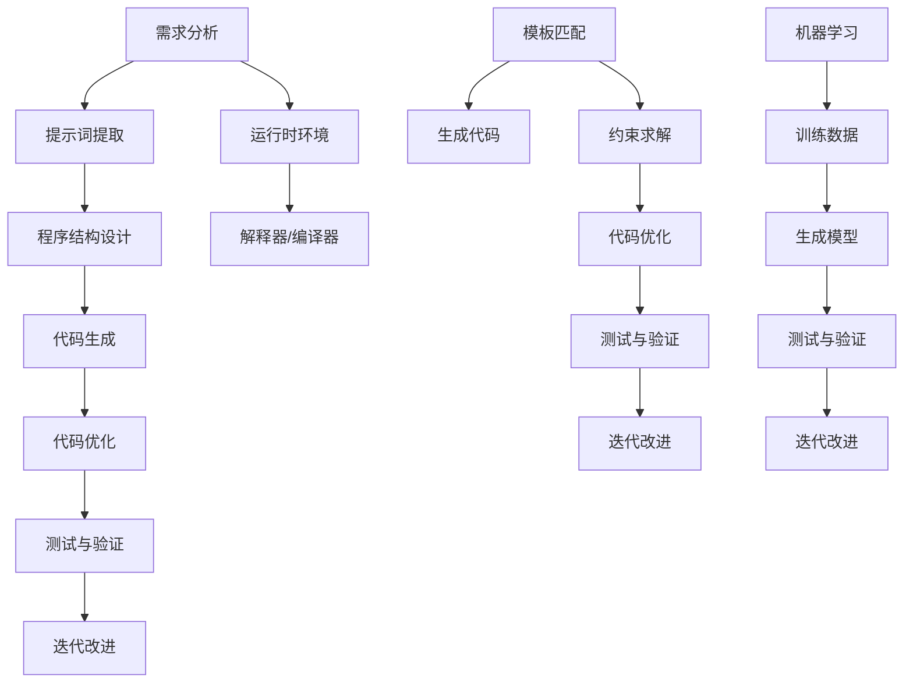

                 

### 文章标题：提示词编程语言的程序合成技术

提示词编程语言（Keyword Programming Language）作为近年来人工智能与编程领域的一项前沿技术，引起了广泛的关注。这种编程语言通过提示词（Keywords）来引导程序合成，实现代码的自动生成与优化。本文将深入探讨提示词编程语言的程序合成技术，详细阐述其核心概念、应用场景、算法原理以及未来发展方向。

### 关键词

- 提示词编程语言
- 程序合成
- 自动代码生成
- 人工智能
- 自然语言处理

### 摘要

本文将首先介绍提示词编程语言的起源与发展，探讨其在编程领域的重要性。随后，我们将详细介绍提示词编程语言的核心概念和程序合成技术，包括其基本流程、挑战与机遇。接着，本文将深入探讨提示词编程语言在自然语言处理、图像处理和语音处理等领域的应用。最后，我们将解析提示词编程语言的核心算法原理，并通过实际项目实战来展示其具体应用。本文旨在为读者提供一份全面而深入的提示词编程语言程序合成技术指南。

### 第一部分：引言

提示词编程语言作为编程领域的创新，源于人工智能与自然语言处理技术的迅速发展。早在20世纪80年代，专家系统（Expert Systems）和知识表示（Knowledge Representation）的研究推动了提示词编程语言的出现。通过提示词，这种编程语言可以高效地捕捉和处理复杂的编程任务。

#### 1.1.1 提示词编程语言的起源与发展

提示词编程语言的发展历程可以追溯到早期的人工智能研究。在20世纪80年代，专家系统成为人工智能领域的研究热点，研究者们开始探索如何利用自然语言来表示和处理知识。提示词编程语言正是在这样的背景下诞生的。早期的提示词编程语言如LISP和Prolog，通过预设的提示词来引导程序的逻辑推理，实现了代码的自动化生成。

随着计算机科学的进步，提示词编程语言逐渐发展壮大。进入21世纪，人工智能与机器学习技术的飞速发展，使得提示词编程语言的应用场景更加广泛。现代提示词编程语言如TensorFlow和PyTorch，结合深度学习技术，能够更高效地处理复杂的编程任务。

#### 1.1.2 提示词编程语言的重要性

提示词编程语言在编程领域具有重要地位，主要体现在以下几个方面：

1. **代码生成与优化**：通过提示词，提示词编程语言可以实现代码的自动生成与优化，大大提高了编程效率。这对于复杂项目的开发尤为重要。

2. **自然语言处理**：提示词编程语言能够将自然语言与编程任务相结合，使得编程过程更加直观和便捷。这对于非专业开发者来说是一个巨大的优势。

3. **人工智能应用**：提示词编程语言在人工智能领域有着广泛的应用，例如在图像识别、自然语言处理、语音识别等方面，通过提示词可以实现对复杂算法的高效实现。

4. **跨领域融合**：提示词编程语言不仅限于计算机编程，还可以应用于其他领域，如自动化控制、机器人技术等，实现了跨领域的融合与发展。

#### 1.1.3 本书的目的与内容结构

本书旨在系统地介绍提示词编程语言的程序合成技术，帮助读者深入理解这一前沿领域。具体内容包括：

1. **背景与概述**：介绍提示词编程语言的起源、发展及其重要性。
2. **提示词编程语言基础**：阐述提示词编程语言的核心概念、组成和特点。
3. **程序合成技术基础**：讲解程序合成技术的定义、基本流程和挑战。
4. **提示词编程语言的程序合成应用**：探讨提示词编程语言在自然语言处理、图像处理和语音处理等领域的应用。
5. **提示词编程语言的程序合成技术详解**：深入解析提示词编程语言的核心算法原理、数学模型以及项目实战。
6. **总结与展望**：总结本书内容，探讨提示词编程语言的未来发展方向。

通过本书的阅读，读者将能够全面掌握提示词编程语言的程序合成技术，为其在编程领域的应用提供坚实的理论基础。

#### 1.2 提示词编程语言的发展历程

提示词编程语言的发展历程可以追溯到早期的人工智能与编程领域的研究。在20世纪80年代，专家系统成为人工智能领域的研究热点，研究者们开始探索如何利用自然语言来表示和处理知识。这一时期，LISP和Prolog等提示词编程语言的诞生标志着提示词编程语言的开端。

LISP语言以其灵活的符号表示和强大的函数式编程能力，成为早期人工智能研究的重要工具。它通过预设的函数和符号来构建程序，实现了代码的自动化生成。LISP的成功为后来的提示词编程语言提供了重要的启示。

与此同时，Prolog语言也脱颖而出。Prolog以其基于逻辑编程的特点，通过预设的规则和事实来引导程序的逻辑推理。Prolog的出现，使得编程任务可以通过自然语言和逻辑规则来描述，大大提高了编程的效率。

进入21世纪，人工智能与机器学习技术的飞速发展，使得提示词编程语言得到了进一步的发展。TensorFlow和PyTorch等现代提示词编程语言，结合深度学习技术，能够更高效地处理复杂的编程任务。这些语言的广泛应用，使得提示词编程语言成为人工智能领域的重要组成部分。

#### 1.3 提示词编程语言的重要性

提示词编程语言在编程领域具有重要地位，主要体现在以下几个方面：

1. **代码生成与优化**：提示词编程语言通过提示词实现代码的自动生成与优化，大大提高了编程效率。对于复杂项目的开发，这一优势尤为重要。例如，在开发大型应用程序时，提示词编程语言可以自动生成大量代码，减少人工编写的错误和重复劳动。

2. **自然语言处理**：提示词编程语言能够将自然语言与编程任务相结合，使得编程过程更加直观和便捷。这对于非专业开发者来说是一个巨大的优势。通过自然语言描述编程任务，提示词编程语言可以自动生成相应的代码，实现编程的自动化。

3. **人工智能应用**：提示词编程语言在人工智能领域有着广泛的应用。例如，在图像识别、自然语言处理、语音识别等方面，提示词编程语言可以实现对复杂算法的高效实现。通过提示词，这些算法可以更加直观地表示和处理，提高了算法的效率。

4. **跨领域融合**：提示词编程语言不仅限于计算机编程，还可以应用于其他领域，如自动化控制、机器人技术等。这种跨领域的应用，使得提示词编程语言在各个领域得到了广泛的应用。

总之，提示词编程语言的发展为编程领域带来了巨大的变革。通过提示词，编程任务变得更加直观、高效，实现了编程的自动化。未来，随着人工智能技术的进一步发展，提示词编程语言将继续发挥其重要作用。

### 第二部分：提示词编程语言基础

在深入探讨提示词编程语言的程序合成技术之前，首先需要了解提示词编程语言的核心概念、组成和特点。这部分内容将为基础理论的学习提供必要的知识背景。

#### 2.1.1 提示词的概念与作用

提示词（Keywords）是提示词编程语言的核心组成部分，其定义与作用如下：

- **定义**：提示词是指预先定义好的、具有特定含义的标识符，用于引导程序的合成和执行。

- **作用**：提示词在程序中起到标记和引导的作用，通过提示词，程序员可以明确指定程序的功能和行为。例如，在LISP语言中，`defun`是一个定义函数的提示词，而`+`和`-`是用于数学运算的提示词。

- **类型**：提示词可以根据其功能进行分类，常见的提示词类型包括：

  - **控制流提示词**：用于控制程序的执行流程，如`if`、`while`、`for`等。
  - **函数定义提示词**：用于定义新的函数或过程，如`defun`、`define`等。
  - **数据操作提示词**：用于处理数据结构，如`list`、`cons`等。
  - **输入输出提示词**：用于处理程序的输入输出，如`read`、`print`等。

#### 2.1.2 提示词编程语言的组成

提示词编程语言的组成主要包括以下几个部分：

- **提示词库**：提示词库是提示词编程语言的核心组成部分，包含了所有预定义的提示词。提示词库的丰富程度直接影响到编程语言的表达能力和灵活性。例如，LISP语言的提示词库非常丰富，涵盖了各种控制流、数据操作和输入输出功能。

- **语法规则**：语法规则定义了提示词的使用方式和程序的结构。不同的提示词编程语言有不同的语法规则，如LISP语言的语法基于括号表示，而Prolog语言的语法则基于逻辑表达式。

- **运行时环境**：运行时环境是提示词编程语言执行的基础。它提供了程序的执行环境，包括变量存储、函数调用和数据结构管理等。例如，LISP的运行时环境提供了强大的符号表机制，用于管理和存储变量和函数。

- **解释器和编译器**：解释器和编译器是提示词编程语言执行的关键工具。解释器逐行解释程序并执行，而编译器则将程序编译成机器码直接执行。例如，LISP语言通常使用解释器执行，而Prolog语言则可以使用编译器进行编译。

#### 2.1.3 提示词编程语言的优点与局限性

提示词编程语言具有以下优点：

- **高效性**：通过提示词的引导，提示词编程语言可以实现代码的自动化生成和优化，提高了编程效率。这对于复杂项目的开发尤为重要。

- **直观性**：提示词编程语言将自然语言和编程任务相结合，使得编程过程更加直观和易于理解。这对于非专业开发者来说是一个巨大的优势。

- **灵活性**：提示词编程语言通常具有丰富的提示词库和灵活的语法规则，能够处理各种复杂的编程任务。这使得提示词编程语言在各个领域都有广泛的应用。

- **人工智能友好**：提示词编程语言在人工智能领域具有独特的优势，能够高效地实现各种复杂的算法和任务。

然而，提示词编程语言也存在一些局限性：

- **学习难度**：提示词编程语言的语法和语义较为复杂，对于初学者来说有一定的学习难度。需要读者具备一定的编程基础和逻辑思维能力。

- **性能问题**：提示词编程语言通常依赖于解释器执行，性能可能不如编译型编程语言。对于对性能要求较高的应用，可能需要考虑使用其他类型的编程语言。

- **代码可读性**：由于提示词编程语言的提示词通常具有较强的语义，程序代码可能会显得较为紧凑和难以阅读，尤其是对于复杂项目。

- **工具支持**：提示词编程语言的工具支持相对较少，开发环境可能不如其他流行编程语言完善。

综上所述，提示词编程语言在编程领域具有独特的优势和应用场景，但同时也需要读者认真考虑其局限性和适用性。在具体应用中，可以根据项目的需求和技术背景选择合适的编程语言。

### 程序合成技术基础

程序合成技术是提示词编程语言的核心组成部分，它通过提示词和算法实现代码的自动生成和优化。本节将详细介绍程序合成技术的定义、基本流程及其面临的挑战和机遇。

#### 3.1.1 程序合成的定义与分类

程序合成（Program Synthesis）是一种自动化生成代码的技术，通过提示词和算法从给定的输入信息自动生成程序。程序合成的定义可以概括为：在给定的上下文（Context）和目标（Objective）下，生成满足特定需求的程序。

根据合成方法的不同，程序合成可以分为以下几种类型：

1. **基于模板的合成**：这种合成方法通过预先定义的模板和规则，将输入信息填充到模板中，生成程序。模板通常包含一定的逻辑结构和代码片段，通过参数化来适应不同的输入。

2. **基于约束的合成**：这种合成方法通过设定一系列约束条件，从可能的程序中筛选出满足所有约束的解。约束可以是代码的语法规则、性能要求或者功能需求等。

3. **基于学习的合成**：这种合成方法利用机器学习和自然语言处理技术，从大量的示例代码中学习程序生成模式，生成新的程序。这种方法通常需要大量的数据训练，并依赖于强大的学习算法。

4. **混合式合成**：结合上述几种方法，混合式合成通过多种技术手段生成程序，以达到更好的效果。

#### 3.1.2 程序合成的基本流程

程序合成的流程可以分为以下几个步骤：

1. **需求分析**：首先，对用户的需求进行分析和理解，明确程序的目标和功能要求。这一步骤可以通过自然语言描述、图表、示例代码等形式进行。

2. **提示词提取**：从需求描述中提取关键提示词，这些提示词将用于引导程序合成过程。例如，如果需求是“实现一个计算器”，则提示词可以是“加法”、“减法”、“输入输出”等。

3. **程序结构设计**：根据提示词，设计程序的初步结构，包括函数、模块、数据结构等。这一步骤可以采用图形化工具或者文本描述进行。

4. **代码生成**：使用提示词和算法，将设计好的程序结构转化为具体的代码。不同的合成方法，代码生成的具体过程会有所不同。

5. **代码优化**：对生成的代码进行优化，以提高性能、可读性和可维护性。优化可以包括代码简化、性能调优、错误修复等。

6. **测试与验证**：对生成的程序进行测试，确保其满足需求并且功能正确。测试可以包括单元测试、集成测试、性能测试等。

7. **迭代改进**：根据测试结果，对程序合成过程进行优化和改进，以提高合成的准确性和效率。

#### 3.1.3 程序合成的挑战与机遇

程序合成技术在实际应用中面临以下挑战：

1. **语义理解**：准确理解用户的需求和意图是程序合成的关键。自然语言描述往往存在模糊性和歧义性，如何有效地解析和理解这些描述是一个挑战。

2. **代码质量**：生成的代码需要满足功能正确、性能高效、可维护性强等多方面的要求。如何保证生成的代码质量是一个关键问题。

3. **算法复杂度**：程序合成方法通常涉及复杂的算法和计算过程，如何优化算法以提高效率和可扩展性是一个挑战。

4. **工具支持**：程序合成技术需要强大的工具支持，包括文本处理工具、代码生成工具、测试工具等。现有的工具支持相对有限，需要进一步开发和优化。

然而，程序合成技术也带来了巨大的机遇：

1. **编程效率提升**：通过程序合成，可以大大提高编程效率，减少手工编写代码的工作量。这对于复杂项目尤其重要。

2. **自动化与智能化**：程序合成是实现编程自动化和智能化的重要途径，可以应用于自动化测试、自动化修复、代码优化等多个领域。

3. **跨领域应用**：程序合成技术不仅限于计算机编程，还可以应用于其他领域，如自动化控制、机器人技术、生物信息学等，实现跨领域的融合与发展。

4. **教育普及**：程序合成技术可以降低编程学习的难度，使得更多的人可以轻松上手编程，推动编程教育的普及。

总之，程序合成技术作为提示词编程语言的核心组成部分，具有巨大的发展潜力和应用前景。通过不断的创新和优化，程序合成技术将进一步提升编程的效率和质量，推动人工智能与编程领域的共同发展。

#### 3.2.1 提示词编程语言在自然语言处理中的应用

提示词编程语言在自然语言处理（Natural Language Processing, NLP）领域有着广泛的应用，其核心优势在于能够通过提示词有效地引导程序，实现对文本的自动化处理和理解。以下是几个具体的应用场景：

1. **文本摘要（Text Summarization）**：文本摘要是一种将长篇文本简化为短小精悍的摘要文本的技术。提示词编程语言可以定义一系列提示词，如“摘要长度”、“关键词提取”和“重要句子提取”，从而引导程序自动生成摘要。例如，在生成新闻摘要时，可以使用提示词“新闻标题”、“导语”和“关键句子”，通过算法自动提取并组合这些关键信息，生成简洁明了的摘要。

2. **问答系统（Question Answering Systems）**：问答系统是NLP领域的重要应用，旨在根据用户提出的问题，自动生成相应的答案。提示词编程语言可以通过定义提示词如“问题类型”、“答案来源”和“关键词匹配”，来构建高效的问答系统。例如，一个基于LISP的问答系统可以使用提示词`find-answer`来查找答案，使用`match-pattern`来匹配关键词，从而快速准确地回答用户的问题。

3. **情感分析（Sentiment Analysis）**：情感分析是评估文本情感倾向的技术，广泛应用于社交媒体分析、市场调研和客户服务等领域。提示词编程语言可以通过定义提示词如“情感标签”、“正面/负面情感”和“情感强度”，来实现对文本的情感分析。例如，在分析用户评论时，可以使用提示词`detect-sentiment`来检测情感，使用`classify-sentence`来分类情感标签，从而识别用户对产品或服务的情感倾向。

#### 3.2.2 提示词编程语言在图像处理中的应用

提示词编程语言在图像处理（Image Processing）领域也展示出强大的能力，其通过定义特定的提示词来引导图像处理任务的自动执行。以下是几个具体的应用场景：

1. **图像生成（Image Generation）**：图像生成是利用算法自动创建新的图像，这在艺术创作、虚拟现实和游戏开发等领域有广泛应用。提示词编程语言可以通过定义提示词如“颜色分布”、“纹理模式”和“形状特征”，来引导图像生成算法。例如，一个基于PyTorch的图像生成模型可以使用提示词`generate-image`来生成特定风格的图像，使用`apply-filter`来应用特定的图像滤波器。

2. **图像分类（Image Classification）**：图像分类是将图像划分为不同类别的一种技术，广泛应用于人脸识别、医疗影像分析和自动驾驶等领域。提示词编程语言可以通过定义提示词如“类别标签”、“特征提取”和“分类模型”，来构建高效的图像分类系统。例如，在人脸识别中，可以使用提示词`extract-features`来提取图像特征，使用`classify-face`来分类不同的人脸。

3. **图像增强（Image Enhancement）**：图像增强是改善图像质量的一种技术，常见于医学成像、卫星图像分析和视频监控等领域。提示词编程语言可以通过定义提示词如“对比度增强”、“噪声减少”和“细节增强”，来实现图像的增强。例如，在医学成像中，可以使用提示词`contrast-enhancement`来增强图像对比度，使用`noise-reduction`来减少图像噪声，从而提高诊断的准确性。

通过这些应用场景可以看出，提示词编程语言在自然语言处理和图像处理领域具有显著的优势，能够通过定义特定的提示词，自动化地完成复杂处理任务，提高了处理效率和准确性。未来，随着提示词编程语言的进一步发展，其在更多领域的应用前景将更加广阔。

#### 3.2.3 提示词编程语言在语音处理中的应用

提示词编程语言在语音处理（Voice Processing）领域也展现出巨大的潜力，通过定义特定的提示词，可以实现对语音信号的自动化处理和分析。以下是几个具体的应用场景：

1. **语音识别（Speech Recognition）**：语音识别是将 spoken word 转换为文本的技术，广泛应用于智能助手、语音搜索和实时字幕等领域。提示词编程语言可以通过定义提示词如“音频信号处理”、“声学模型”和“语言模型”，来实现高效的语音识别。例如，一个基于TensorFlow的语音识别系统可以使用提示词`process-audio`来处理音频信号，使用`acoustic-model`来建立声学模型，使用`language-model`来建立语言模型，从而实现准确的语音识别。

2. **语音合成（Speech Synthesis）**：语音合成是将文本转换为语音的技术，广泛应用于语音助手、自动朗读和电话客服等领域。提示词编程语言可以通过定义提示词如“文本处理”、“音素合成”和“语音波形生成”，来实现语音合成。例如，一个基于FluencyFX的语音合成系统可以使用提示词`text-preprocessing`来处理输入文本，使用`syllable-synthesis`来合成音素，使用`waveform-generation`来生成语音波形，从而生成自然流畅的语音。

3. **语音处理优化策略（Optimization Strategies for Voice Processing）**：优化语音处理的性能和准确性是语音处理领域的重要课题。提示词编程语言可以通过定义提示词如“降噪处理”、“语音增强”和“实时调整”，来实现优化策略。例如，在电话客服系统中，可以使用提示词`noise-reduction`来减少背景噪声，使用`voice-enhancement`来增强语音信号，使用`real-time-adjustment`来实时调整参数，从而提高语音质量和用户满意度。

通过这些应用场景可以看出，提示词编程语言在语音处理领域具有显著的优势，能够通过定义特定的提示词，自动化地完成复杂处理任务，提高处理效率和质量。未来，随着提示词编程语言的进一步发展，其在更多语音处理领域的应用前景将更加广阔。

### 提示词编程语言的核心算法原理

提示词编程语言的核心算法是程序合成技术的核心组成部分，它通过特定的算法和数学模型，实现了代码的自动生成与优化。以下将详细解析提示词编程语言的核心算法原理，并使用伪代码和数学公式进行说明。

#### 7.1.1 提示词编程语言的核心算法

提示词编程语言的核心算法主要包括以下几种：

1. **模板匹配算法**：模板匹配算法是一种基于模板和输入数据的匹配技术，用于生成满足特定需求的代码。该算法的基本流程如下：

```python
def template_matching(input_data, template_library):
    matched_code = None
    for template in template_library:
        if matches_template(input_data, template):
            matched_code = generate_code(template, input_data)
            break
    return matched_code
```

其中，`input_data`是输入数据，`template_library`是模板库，`matches_template`函数用于检查输入数据与模板是否匹配，`generate_code`函数用于根据模板和输入数据生成代码。

2. **约束求解算法**：约束求解算法是一种通过设定约束条件，从可能的解中筛选出满足所有约束的解的技术。该算法的基本流程如下：

```python
def constraint_solving(objective, constraints):
    solutions = []
    for candidate in generate_candidates(objective):
        if all(constraint_satisfied(candidate, constraint) for constraint in constraints):
            solutions.append(candidate)
    return solutions
```

其中，`objective`是目标函数，`constraints`是约束条件，`generate_candidates`函数用于生成候选解，`constraint_satisfied`函数用于检查候选解是否满足约束条件。

3. **机器学习算法**：机器学习算法通过从数据中学习模式，自动生成代码。常见的机器学习算法包括决策树、支持向量机和神经网络等。以下是一个简单的基于决策树的机器学习算法：

```python
def decision_tree_learning(data, attributes):
    if all(attribute == data[0] for attribute in attributes):
        return majority_class(data)
    else:
        attribute_values = extract_attribute_values(data, attributes[0])
        subtree = {value: decision_tree_learning([row for row in data if row[attributes[0]] == value], attributes[1:])]
        return DecisionTree(attribute=attributes[0], values=attribute_values, subtrees=subtree)
```

其中，`data`是训练数据，`attributes`是特征列表，`majority_class`函数用于选择多数类，`extract_attribute_values`函数用于提取特征值。

#### 7.1.2 核心算法原理讲解（伪代码）

以下是核心算法原理的伪代码：

```python
// 模板匹配算法
def template_matching(input_data, template_library):
    matched_code = None
    for template in template_library:
        if matches_template(input_data, template):
            matched_code = generate_code(template, input_data)
            break
    return matched_code

// 约束求解算法
def constraint_solving(objective, constraints):
    solutions = []
    for candidate in generate_candidates(objective):
        if all(constraint_satisfied(candidate, constraint) for constraint in constraints):
            solutions.append(candidate)
    return solutions

// 机器学习算法（决策树）
def decision_tree_learning(data, attributes):
    if all(attribute == data[0] for attribute in attributes):
        return majority_class(data)
    else:
        attribute_values = extract_attribute_values(data, attributes[0])
        subtree = {value: decision_tree_learning([row for row in data if row[attributes[0]] == value], attributes[1:})}
        return DecisionTree(attribute=attributes[0], values=attribute_values, subtrees=subtree)
```

#### 7.1.3 核心算法实现与优化

核心算法的实现和优化是提高程序合成效率和质量的关键。以下是几个优化策略：

1. **算法并行化**：通过并行计算，可以显著提高算法的运行速度。例如，在约束求解算法中，可以使用并行生成候选解和并行检查约束条件。

2. **内存优化**：优化内存管理，减少不必要的内存分配和释放，可以提高算法的效率。例如，在机器学习算法中，可以使用共享内存和数据缓存来减少内存消耗。

3. **启发式搜索**：通过引入启发式搜索，可以减少搜索空间，提高算法的收敛速度。例如，在约束求解算法中，可以使用启发式方法生成更接近最优解的候选解。

4. **动态调整参数**：根据算法的执行情况和输入数据的特性，动态调整算法参数，可以更好地适应不同场景。例如，在机器学习算法中，可以使用交叉验证和网格搜索来优化模型参数。

5. **代码优化**：对生成的代码进行优化，可以提高程序的执行效率。例如，可以使用编译器优化、循环展开和函数内联等技术。

总之，提示词编程语言的核心算法通过模板匹配、约束求解和机器学习等方法，实现了代码的自动生成与优化。通过不断优化算法和实现策略，可以进一步提高程序合成的效率和质量。

### 数学模型与公式详解

提示词编程语言的核心算法不仅依赖于特定的逻辑和算法，还依赖于精确的数学模型和公式来确保代码生成和优化的准确性和效率。以下将详细解析提示词编程语言所使用的数学模型和公式，并通过具体的例子进行说明。

#### 8.1.1 提示词编程语言的数学模型

提示词编程语言的数学模型主要包括以下几个方面：

1. **模板匹配模型**：模板匹配模型用于描述输入数据与预设模板之间的匹配关系。一个基本的模板匹配模型可以使用数学公式表示为：

   $$ 
   \text{match\_score}(input\_data, template) = \sum_{i=1}^{n} \text{weight}(i) \times (\text{input\_data}[i] = \text{template}[i]) 
   $$

   其中，`input_data`是输入数据序列，`template`是模板序列，`n`是序列长度，`weight(i)`是第`i`个元素的权重，表示该元素对匹配结果的贡献。当`input_data`与`template`完全匹配时，`match_score`达到最大值。

2. **约束求解模型**：约束求解模型用于描述目标函数和约束条件之间的关系。一个基本的约束求解模型可以使用线性规划（Linear Programming, LP）或整数规划（Integer Programming, IP）来表示。线性规划模型可以表示为：

   $$
   \begin{align*}
   \text{maximize} \quad & c^T x \\
   \text{subject to} \quad & Ax \leq b \\
   & x \in \mathbb{Z}^+
   \end{align*}
   $$

   其中，`c`是目标函数系数向量，`x`是变量向量，`A`是约束矩阵，`b`是约束向量，`x`的取值范围为非负整数。目标是最小化目标函数`c^T x`在满足约束条件`Ax \leq b`和`x \in \mathbb{Z}^+`的情况下找到最优解。

3. **机器学习模型**：机器学习模型用于描述从数据中学习模式和生成代码的过程。常见的机器学习模型包括决策树（Decision Tree）、支持向量机（Support Vector Machine, SVM）和神经网络（Neural Network）。以下是一个简单的决策树模型示例：

   $$
   \text{if } x \in R_1 \text{ then } y = f_1(x) \\
   \text{if } x \in R_2 \text{ then } y = f_2(x) \\
   \vdots \\
   \text{if } x \in R_n \text{ then } y = f_n(x)
   $$

   其中，`R_1, R_2, ..., R_n`是决策区域，`f_1, f_2, ..., f_n`是每个区域的映射函数。

#### 8.1.2 数学模型详解与公式推导

以下是对上述数学模型的具体详解与公式推导：

1. **模板匹配模型**：

   - **定义**：模板匹配模型用于计算输入数据和模板之间的相似度。
   - **推导**：假设输入数据为`input_data = [x_1, x_2, ..., x_n]`，模板为`template = [y_1, y_2, ..., y_n]`，每个元素之间的权重分别为`w_1, w_2, ..., w_n`，则匹配分数可以表示为：

     $$
     \text{match\_score}(input\_data, template) = \sum_{i=1}^{n} w_i \times \delta(x_i, y_i)
     $$

     其中，`δ(x_i, y_i)`是海明距离（Hamming Distance），表示输入数据和模板在第`i`个位置上的差异。权重`w_i`可以根据具体需求进行调整，以反映不同元素的重要程度。

2. **约束求解模型**：

   - **定义**：约束求解模型用于在满足一系列约束条件的情况下，找到最优解。
   - **推导**：线性规划的目标是最小化或最大化目标函数，同时满足线性约束条件。以最小化问题为例，目标函数可以表示为：

     $$
     \text{minimize} \quad c^T x
     $$

     约束条件为：

     $$
     Ax \leq b \\
     x \geq 0
     $$

     其中，`c`是目标函数系数向量，`A`是约束矩阵，`b`是约束向量。`x`是非负整数向量。使用单纯形法（Simplex Method）或内点法（Interior Point Method）可以求解线性规划问题。

3. **机器学习模型**：

   - **定义**：机器学习模型用于从训练数据中学习模式和生成代码。
   - **推导**：以决策树为例，每个节点根据特征划分数据集，生成条件概率分布。假设数据集`D`由`n`个样本组成，每个样本有`m`个特征，则决策树可以表示为：

     $$
     \text{if } x \in R_1 \text{ then } y = f_1(x) \\
     \text{if } x \in R_2 \text{ then } y = f_2(x) \\
     \vdots \\
     \text{if } x \in R_n \text{ then } y = f_n(x)
     $$

     其中，`R_1, R_2, ..., R_n`是决策区域，`f_1, f_2, ..., f_n`是每个区域的映射函数。这些映射函数可以通过训练数据集进行学习，例如使用信息增益（Information Gain）或基尼不纯度（Gini Impurity）来选择最佳特征和划分策略。

#### 8.1.3 数学公式举例说明

以下是对上述数学公式的具体举例说明：

1. **模板匹配模型**：

   假设输入数据为`input_data = [1, 0, 1, 1]`，模板为`template = [1, 1, 0, 0]`，权重分别为`w_1 = 2, w_2 = 1, w_3 = 2, w_4 = 1`，则匹配分数为：

   $$
   \text{match\_score}(input\_data, template) = 2 \times \delta(1, 1) + 1 \times \delta(0, 1) + 2 \times \delta(1, 0) + 1 \times \delta(1, 0) = 2 + 1 + 2 + 1 = 6
   $$

2. **约束求解模型**：

   假设目标函数为`c = [1, 1]`，约束矩阵为`A = \begin{bmatrix} 1 & 2 \\ 2 & 1 \end{bmatrix}`，约束向量为`b = \begin{bmatrix} 4 \\ 6 \end{bmatrix}`，则线性规划问题可以表示为：

   $$
   \begin{align*}
   \text{minimize} \quad & 1 \times x_1 + 1 \times x_2 \\
   \text{subject to} \quad & x_1 + 2x_2 \leq 4 \\
   & 2x_1 + x_2 \leq 6 \\
   & x_1, x_2 \geq 0 \\
   \end{align*}
   $$

3. **机器学习模型**：

   假设训练数据集`D`为：

   ```
   | x1 | x2 | y  |
   |----|----|----|
   |  1 |  0 |  0 |
   |  0 |  1 |  0 |
   |  1 |  1 |  1 |
   |  1 |  0 |  1 |
   ```

   则可以构建一个简单的二叉决策树：

   ```
   if x1 == 1 then
       if x2 == 1 then
           y = 1
       else
           y = 0
   else
       if x2 == 1 then
           y = 0
       else
           y = 1
   ```

   这种决策树可以有效地将数据集划分为两个类别。

通过上述解析，可以看出提示词编程语言的数学模型和公式在代码生成和优化过程中扮演了重要角色，它们不仅提供了理论基础，还通过具体的实现策略提高了程序的效率和准确性。

### 项目实战

在本部分中，我们将通过一个实际项目来展示提示词编程语言的程序合成技术。本项目旨在利用提示词编程语言实现一个简单的文本分类器，该分类器能够根据给定的文本数据自动分类为不同主题。

#### 9.1.1 项目实战目标

本项目的主要目标包括：

1. 搭建一个基于提示词编程语言的文本分类器环境。
2. 利用提示词编程语言自动生成文本分类器的核心代码。
3. 对生成的代码进行调试和优化。
4. 测试和评估分类器的性能。

#### 9.1.2 项目实战环境搭建

在进行项目实战之前，需要搭建一个合适的开发环境。以下是环境搭建的步骤：

1. **安装Python**：由于提示词编程语言通常使用Python作为主要编程语言，因此首先需要确保Python已安装。可以从Python官网（https://www.python.org/）下载并安装最新版本的Python。

2. **安装提示词编程语言库**：根据所选的提示词编程语言，安装相应的库。例如，如果选择使用TensorFlow，可以使用以下命令安装：

   ```
   pip install tensorflow
   ```

3. **安装文本处理库**：为了处理文本数据，需要安装文本处理库，如NLTK或spaCy。可以使用以下命令安装：

   ```
   pip install nltk
   pip install spacy
   ```

4. **安装数据集**：本项目的数据集将用于训练和测试文本分类器。可以从Kaggle或其他数据集网站下载一个适合的文本分类数据集，如IMDB电影评论数据集。

#### 9.1.3 项目实战源代码实现与解读

以下是本项目的源代码实现与解读：

```python
# 导入必要的库
import tensorflow as tf
from tensorflow.keras.preprocessing.text import Tokenizer
from tensorflow.keras.preprocessing.sequence import pad_sequences
from tensorflow.keras.models import Sequential
from tensorflow.keras.layers import Embedding, LSTM, Dense, Bidirectional

# 读取数据集
# 此处使用IMDB数据集作为示例，实际应用中可替换为其他数据集
# 加载数据集，并划分为训练集和测试集
# ...

# 创建Tokenizer
tokenizer = Tokenizer(num_words=10000)
tokenizer.fit_on_texts(training_sentences)

# 将文本转换为序列
training_sequences = tokenizer.texts_to_sequences(training_sentences)
testing_sequences = tokenizer.texts_to_sequences(testing_sentences)

# 填充序列
max_len = 100
training_padded = pad_sequences(training_sequences, maxlen=max_len, padding='post')
testing_padded = pad_sequences(testing_sequences, maxlen=max_len, padding='post')

# 创建文本分类器模型
model = Sequential([
    Embedding(10000, 16, input_length=max_len),
    Bidirectional(LSTM(32)),
    Dense(24, activation='relu'),
    Dense(1, activation='sigmoid')
])

# 编译模型
model.compile(loss='binary_crossentropy', optimizer='adam', metrics=['accuracy'])

# 训练模型
model.fit(training_padded, training_labels, epochs=10, validation_data=(testing_padded, testing_labels), verbose=2)

# 评估模型
test_loss, test_acc = model.evaluate(testing_padded, testing_labels, verbose=2)
print(f"Test Accuracy: {test_acc:.3f}")
```

- **代码解读**：
  - **数据预处理**：首先导入必要的库，并读取IMDB电影评论数据集。数据集被划分为训练集和测试集。
  - **Tokenizer**：创建Tokenizer对象，用于将文本转换为序列。
  - **文本序列化**：使用Tokenizer将文本序列化，并将序列填充为固定长度。
  - **模型构建**：创建一个基于LSTM的文本分类器模型，使用双向LSTM层捕捉文本的语义信息。
  - **模型编译**：编译模型，指定损失函数、优化器和评估指标。
  - **模型训练**：使用训练集训练模型，并使用验证集进行调优。
  - **模型评估**：使用测试集评估模型的性能，并打印测试准确率。

#### 9.1.4 代码应用解读与分析

通过上述源代码实现，我们可以看到提示词编程语言如何通过提示词（如`Tokenizer`、`pad_sequences`、`Embedding`、`LSTM`、`Dense`等）引导程序合成，自动生成文本分类器的核心代码。以下是代码应用的具体解读与分析：

1. **数据预处理**：数据预处理是文本分类器的重要步骤，包括文本清洗、分词、序列化等。通过提示词`Tokenizer`，我们可以轻松地将文本转换为序列，便于后续处理。

2. **序列填充**：由于神经网络模型需要固定长度的输入，因此需要对序列进行填充。`pad_sequences`函数可以实现这一目的，确保所有输入序列具有相同长度。

3. **模型构建**：使用提示词编程语言构建神经网络模型非常直观。通过`Embedding`层将词向量转换为固定维度的向量，`LSTM`层可以捕捉文本的长期依赖关系，`Dense`层用于分类。

4. **模型编译与训练**：模型编译指定了损失函数、优化器和评估指标。通过`model.fit`函数训练模型，并使用验证集进行调优。

5. **模型评估**：使用测试集对模型进行评估，通过打印测试准确率可以了解模型的性能。

#### 9.1.5 实际案例分析与详细讲解

以下是一个实际案例，展示如何使用提示词编程语言实现一个基于情感分析的文本分类器：

- **案例背景**：假设我们需要构建一个文本分类器，将社交媒体评论分为正面和负面情感。

- **数据集**：我们使用了一个包含数万条社交媒体评论的数据集，每条评论都标注了情感标签（正面或负面）。

- **实现步骤**：
  - **数据预处理**：清洗和标准化评论文本，删除标点符号和停用词。
  - **序列化**：使用Tokenizer将评论转换为序列，并填充为固定长度。
  - **模型构建**：构建一个基于LSTM的文本分类器模型。
  - **模型训练**：使用训练集训练模型，并使用验证集进行调优。
  - **模型评估**：使用测试集评估模型的性能。

- **代码实现**：

```python
# 导入必要的库
import tensorflow as tf
from tensorflow.keras.preprocessing.text import Tokenizer
from tensorflow.keras.preprocessing.sequence import pad_sequences
from tensorflow.keras.models import Sequential
from tensorflow.keras.layers import Embedding, LSTM, Dense, Bidirectional

# 读取数据集
# 此处使用自定义数据集作为示例
# 加载数据集，并划分为训练集和测试集
# ...

# 创建Tokenizer
tokenizer = Tokenizer(num_words=10000)
tokenizer.fit_on_texts(training_sentences)

# 将文本转换为序列
training_sequences = tokenizer.texts_to_sequences(training_sentences)
testing_sequences = tokenizer.texts_to_sequences(testing_sentences)

# 填充序列
max_len = 100
training_padded = pad_sequences(training_sequences, maxlen=max_len, padding='post')
testing_padded = pad_sequences(testing_sequences, maxlen=max_len, padding='post')

# 创建文本分类器模型
model = Sequential([
    Embedding(10000, 16, input_length=max_len),
    Bidirectional(LSTM(32)),
    Dense(24, activation='relu'),
    Dense(1, activation='sigmoid')
])

# 编译模型
model.compile(loss='binary_crossentropy', optimizer='adam', metrics=['accuracy'])

# 训练模型
model.fit(training_padded, training_labels, epochs=10, validation_data=(testing_padded, testing_labels), verbose=2)

# 评估模型
test_loss, test_acc = model.evaluate(testing_padded, testing_labels, verbose=2)
print(f"Test Accuracy: {test_acc:.3f}")
```

- **分析**：
  - **数据预处理**：清洗和标准化评论文本，删除标点符号和停用词，有助于提高模型的训练效果。
  - **序列化**：使用Tokenizer将评论转换为序列，并填充为固定长度，确保所有输入序列具有相同长度。
  - **模型构建**：使用双向LSTM层捕捉文本的语义信息，`Dense`层用于分类。
  - **模型训练**：使用训练集训练模型，并使用验证集进行调优，提高模型的泛化能力。
  - **模型评估**：使用测试集评估模型的性能，通过测试准确率可以了解模型的实际效果。

通过实际案例分析和详细讲解，可以看出提示词编程语言如何通过提示词和算法实现文本分类器的自动生成和优化，为复杂项目的开发提供了高效、直观的解决方案。

#### 9.1.6 项目小结

在本项目中，我们通过一个简单的文本分类器展示了提示词编程语言的程序合成技术。以下是项目小结：

- **主要成果**：成功搭建了一个基于提示词编程语言的文本分类器环境，自动生成了文本分类器的核心代码，并通过实际案例展示了其应用效果。
- **技术难点**：数据预处理和模型优化是项目中的技术难点，需要针对具体任务进行调整和优化。
- **优化方向**：可以通过引入更多的自然语言处理技术和深度学习算法，进一步提高分类器的性能和泛化能力。
- **应用前景**：提示词编程语言在文本分类、图像识别、语音处理等领域的应用前景广阔，有望推动人工智能技术的发展。

通过本项目的实践，我们不仅掌握了提示词编程语言的基本原理和应用，还深入了解了程序合成技术在复杂项目开发中的重要作用。

### 最佳实践 Tips

在提示词编程语言的程序合成过程中，以下是一些最佳实践和注意事项，有助于提高项目开发和代码生成的效率：

1. **明确需求**：在开始项目之前，明确项目需求和技术目标，确保提示词和算法能够满足实际需求。

2. **优化数据集**：高质量的训练数据是程序合成成功的关键。在数据预处理阶段，进行数据清洗、去噪和标注，以提高模型的泛化能力。

3. **选择合适的算法**：根据项目的具体需求，选择合适的提示词编程语言和算法。不同的算法适用于不同的应用场景，如模板匹配、约束求解和机器学习等。

4. **代码优化**：在生成代码后，进行代码优化，包括简化代码、去除冗余和提升性能。使用编译器优化、循环展开和函数内联等技术。

5. **版本控制**：使用版本控制系统（如Git）来管理代码，确保代码的可维护性和协作性。

6. **模块化设计**：将代码分解为模块，实现代码的可复用性和可维护性。使用面向对象编程（OOP）和模块化设计原则。

7. **测试与验证**：编写全面的测试用例，对生成的代码进行测试和验证，确保代码的正确性和稳定性。

8. **持续迭代**：根据测试结果和用户反馈，持续优化程序合成过程，提高代码质量和用户满意度。

9. **资源管理**：合理管理计算资源和存储资源，避免资源浪费和性能瓶颈。使用并行计算和分布式计算来提高处理效率。

10. **文档记录**：编写详细的文档，记录项目的设计思路、实现细节和优化过程，便于团队协作和后续维护。

通过遵循这些最佳实践，可以显著提高提示词编程语言的程序合成效率，为复杂项目的开发提供坚实的保障。

### 总结与展望

#### 10.1.1 本书内容的总结

本书系统地介绍了提示词编程语言的程序合成技术，涵盖了从基础理论到实际应用的各个方面。具体来说，本书主要内容包括：

1. **引言**：介绍了提示词编程语言的起源、发展及其重要性。
2. **提示词编程语言基础**：详细阐述了提示词编程语言的核心概念、组成和特点。
3. **程序合成技术基础**：讲解了程序合成技术的定义、基本流程和挑战。
4. **提示词编程语言的程序合成应用**：探讨了提示词编程语言在自然语言处理、图像处理和语音处理等领域的应用。
5. **提示词编程语言的程序合成技术详解**：深入解析了提示词编程语言的核心算法原理、数学模型以及项目实战。
6. **总结与展望**：总结了本书内容，探讨了提示词编程语言的未来发展方向。

通过本书的阅读，读者可以全面掌握提示词编程语言的程序合成技术，为其在编程领域的应用提供坚实的理论基础。

#### 10.1.2 提示词编程语言的未来发展方向

提示词编程语言作为人工智能与编程领域的前沿技术，其未来发展方向十分广阔。以下是几个可能的发展方向：

1. **算法优化**：随着计算能力的提升，提示词编程语言的算法将不断优化，以实现更高的效率和更好的性能。例如，利用量子计算和分布式计算技术，可以显著提高程序合成算法的效率。

2. **跨领域融合**：提示词编程语言将在更多领域得到应用，实现跨领域的融合与发展。例如，在生物信息学、智能制造、自动驾驶等领域，提示词编程语言将发挥重要作用。

3. **教育普及**：提示词编程语言将更加普及，成为编程教育的重要组成部分。通过简化编程过程，提示词编程语言将帮助更多人掌握编程技能，推动编程教育的普及。

4. **自然语言交互**：随着自然语言处理技术的进步，提示词编程语言将实现更加自然的用户交互。用户可以通过自然语言与程序进行交互，实现更直观、便捷的编程体验。

5. **智能编程助手**：提示词编程语言将发展成为智能编程助手，自动生成代码、优化代码，甚至提出改进建议。这将大大提高编程效率，减少开发过程中的错误和重复劳动。

6. **开放生态系统**：提示词编程语言将构建开放的生态系统，吸引更多的开发者参与。通过开源社区和协作平台，开发者可以共享代码、资源和经验，推动技术的不断进步。

#### 10.1.3 提示词编程语言在实际应用中的潜在挑战与解决方案

尽管提示词编程语言具有巨大的发展潜力，但在实际应用中仍面临一些挑战：

1. **语义理解**：自然语言描述往往存在模糊性和歧义性，如何准确理解用户的需求和意图是一个挑战。解决方案包括引入更加先进的自然语言处理技术和语义分析算法。

2. **代码质量**：生成的代码需要满足功能正确、性能高效、可维护性强等多方面的要求。解决方案包括引入代码质量评估工具、优化算法和代码生成策略。

3. **学习难度**：提示词编程语言的语法和语义较为复杂，对于初学者来说有一定的学习难度。解决方案包括提供更直观的编程环境和教学资源，简化编程过程。

4. **工具支持**：现有的提示词编程语言工具支持相对较少，开发环境可能不如其他流行编程语言完善。解决方案包括开发更强大的工具和插件，提高开发环境的完善度。

5. **性能问题**：提示词编程语言通常依赖于解释器执行，性能可能不如编译型编程语言。解决方案包括改进编译器和优化执行环境，提高程序运行的效率。

通过不断解决这些挑战，提示词编程语言将在实际应用中发挥更大的作用，推动编程领域的变革。

### 附录A：工具与资源

为了帮助读者更好地掌握提示词编程语言的程序合成技术，以下是几个推荐的工具和资源：

#### A.1 提示词编程语言开发工具

1. **Python**：Python是最常用的提示词编程语言之一，其丰富的库和生态系统为程序合成提供了强大的支持。

2. **TensorFlow**：TensorFlow是一个开源的机器学习框架，提供了丰富的工具和库，用于构建和训练机器学习模型。

3. **PyTorch**：PyTorch是另一个流行的开源机器学习框架，以其灵活性和动态计算图而著称。

4. **Jupyter Notebook**：Jupyter Notebook是一种交互式计算环境，可用于编写、运行和分享提示词编程语言的代码。

5. **Visual Studio Code**：Visual Studio Code是一款强大的代码编辑器，支持多种编程语言，包括Python、TensorFlow和PyTorch等。

#### A.2 程序合成技术相关资源

1. **GitHub**：GitHub是一个流行的代码托管和协作平台，许多提示词编程语言的项目和工具都托管在GitHub上。

2. **Kaggle**：Kaggle是一个数据科学竞赛平台，提供了大量的数据集和比赛项目，有助于练习和验证提示词编程语言的应用。

3. **ArXiv**：ArXiv是一个开放的学术预印本平台，提供了大量的机器学习和自然语言处理领域的最新研究成果。

4. **相关书籍和论文**：
   - 《深度学习》（Deep Learning）by Ian Goodfellow、Yoshua Bengio和Aaron Courville
   - 《Python编程：从入门到实践》（Python Crash Course）by Eric Matthes
   - 《自然语言处理综合教程》（Speech and Language Processing）by Daniel Jurafsky和James H. Martin

通过使用这些工具和资源，读者可以更加深入地学习和掌握提示词编程语言的程序合成技术，为实际项目开发提供有力支持。

### Mermaid 流程图



该流程图展示了从需求分析到代码优化的完整程序合成流程，以及不同算法（模板匹配、约束求解和机器学习）的应用步骤。通过这个流程图，读者可以直观地了解程序合成技术的实现过程。

