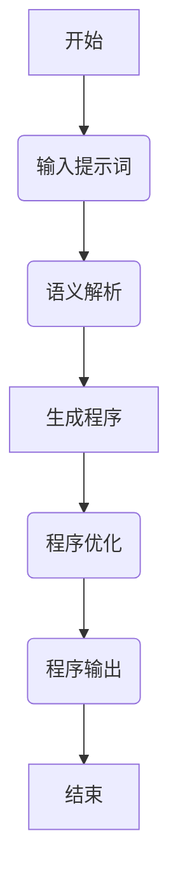
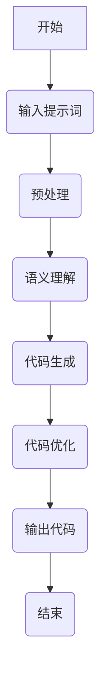

                 

### 文章标题

《提示词编程语言的程序合成技术》

### 关键词

提示词编程语言、程序合成、自然语言处理、代码优化、性能调优、安全性、可靠性、未来发展趋势、应用场景

### 摘要

本文旨在深入探讨提示词编程语言的程序合成技术，分析其发展背景、核心特点、基本原理以及在不同应用领域中的实践案例。通过对程序合成技术的详细介绍，本文旨在为读者提供一个系统化的理解框架，帮助读者掌握提示词编程语言在程序合成中的实际应用方法，并探讨其未来发展趋势和应用前景。本文将涵盖从基础概念到实战案例的全面内容，旨在为广大程序员、人工智能从业者提供有价值的参考和指导。

### 第一部分：程序合成技术基础

#### 1.1 提示词编程语言概述

##### 1.1.1 提示词编程语言的发展背景

提示词编程语言（Prompt-Based Programming Languages，PBPL）的发展可以追溯到人工智能和自然语言处理的早期研究。20世纪50年代，随着计算机科学的兴起，编程语言逐渐成为人们研究和应用计算机的核心工具。然而，传统的编程语言往往需要开发者具备深厚的计算机科学背景和编程技能，这对于非专业人士来说是一个较高的门槛。

随着自然语言处理技术的进步，研究者开始探索如何将自然语言与编程相结合，以降低编程的难度和门槛。20世纪80年代，LISP语言中引入了宏系统，使得开发者可以通过编写宏来扩展语言的语法和功能，这种思想为提示词编程语言的诞生奠定了基础。

进入21世纪，随着深度学习和神经网络技术的快速发展，提示词编程语言逐渐得到了广泛的关注和应用。现代提示词编程语言结合了自然语言处理、自动编程、代码生成等技术，使得开发者可以通过输入简单的自然语言描述来生成复杂的程序代码，大大提高了编程的效率和易用性。

##### 1.1.2 提示词编程语言的核心特点

提示词编程语言具有以下几个核心特点：

1. **自然语言输入**：提示词编程语言允许开发者使用自然语言描述他们的编程需求，而不是传统的编程语言语法。这种输入方式降低了编程的门槛，使得非专业开发者也能够轻松编写程序。

2. **自动化代码生成**：基于自然语言输入，提示词编程语言能够自动生成相应的程序代码。这种自动化过程通常包括语法分析、语义理解、代码生成等步骤，极大地提高了编程的效率。

3. **灵活性和扩展性**：提示词编程语言通常支持自定义提示词和语法，开发者可以根据具体需求对语言进行扩展和定制，以适应不同的编程场景。

4. **代码优化**：提示词编程语言能够根据提示词自动优化生成的代码，提高程序的执行效率和性能。

5. **跨平台兼容性**：提示词编程语言通常具有较好的跨平台兼容性，可以在不同的操作系统和硬件平台上运行。

##### 1.1.3 提示词编程语言的应用领域

提示词编程语言的应用领域非常广泛，主要包括以下几个方面：

1. **软件开发**：提示词编程语言可以用于快速开发原型和功能，尤其是在需要快速迭代和测试的场合。

2. **数据分析**：提示词编程语言可以简化数据分析和数据处理流程，使得非专业人士也能够轻松进行数据分析。

3. **教育领域**：提示词编程语言适合用于编程教育和入门教学，可以帮助初学者更快速地掌握编程基础知识。

4. **自动化运维**：提示词编程语言可以用于自动化运维任务，如自动化部署、监控和调试等。

5. **人工智能应用**：提示词编程语言可以用于构建和优化人工智能模型，特别是在需要快速调整和优化的场景中。

#### 1.2 程序合成基本原理

##### 1.2.1 程序合成定义与目的

程序合成（Program Synthesis）是指从高层次的描述（如自然语言、图形化界面、数学公式等）自动生成程序代码的技术。程序合成的目的是提高编程的效率和易用性，降低开发门槛，使得非专业开发者也能够进行编程。

程序合成的基本原理可以概括为以下几个步骤：

1. **输入处理**：接收用户的自然语言描述或高层次描述，并进行预处理，如分词、句法分析等。

2. **语义理解**：对预处理后的输入进行语义分析，提取关键信息，如变量、函数、数据结构等。

3. **代码生成**：根据提取的语义信息，生成相应的程序代码，如语法分析、抽象语法树生成等。

4. **代码优化**：对生成的代码进行优化，如代码重构、性能优化等。

##### 1.2.2 程序合成关键技术

程序合成技术涉及多个领域，包括自然语言处理、自动编程、代码生成等。以下是几个关键技术的详细介绍：

1. **自然语言处理（NLP）**：自然语言处理是程序合成的核心，负责对用户的自然语言输入进行解析和理解。常用的NLP技术包括分词、句法分析、语义角色标注等。

2. **代码生成器（Code Generator）**：代码生成器负责将自然语言描述转化为程序代码。常见的代码生成器包括基于模板的生成器、基于规则的生成器、基于机器学习的生成器等。

3. **抽象语法树（AST）**：抽象语法树是程序合成的中间表示形式，用于表示程序的结构和语义。通过对抽象语法树的操作，可以生成目标程序代码。

4. **代码优化器（Code Optimizer）**：代码优化器负责对生成的代码进行优化，提高程序的执行效率和性能。常见的优化技术包括代码压缩、消除冗余、性能调优等。

##### 1.2.3 程序合成与传统编程的比较

程序合成与传统编程在多个方面存在差异：

1. **开发方式**：传统编程依赖于编程语言和开发工具，需要开发者手动编写代码；而程序合成则通过自然语言描述自动生成代码，降低了开发门槛。

2. **效率**：程序合成可以大大提高编程效率，特别是在复杂程序的编写和优化过程中。传统编程需要开发者手动处理每个细节，耗时较长。

3. **易用性**：程序合成使得非专业开发者也能够进行编程，提高了编程的易用性。传统编程需要开发者具备一定的编程技能和经验。

4. **灵活性**：程序合成具有一定的灵活性，可以根据需求自定义提示词和语法，适应不同的编程场景。传统编程则需要开发者熟练掌握特定编程语言的语法和特性。

#### 1.3 提示词编程语言中的自然语言处理

##### 1.3.1 自然语言处理基础

自然语言处理（Natural Language Processing，NLP）是程序合成技术的核心组成部分，负责对用户的自然语言输入进行解析和理解。NLP的基础技术包括以下几个方面：

1. **分词（Tokenization）**：分词是将文本分割成单词或短语的步骤。常见的分词方法包括基于规则的分词、基于统计的分词等。

2. **句法分析（Syntactic Parsing）**：句法分析是对文本进行语法结构分析的过程，通常使用语法树（Syntax Tree）来表示。常见的句法分析方法包括基于规则的句法分析、基于统计的句法分析等。

3. **语义角色标注（Semantic Role Labeling）**：语义角色标注是对句子中的词汇进行语义角色标注的过程，如主语、谓语、宾语等。常见的语义角色标注方法包括基于规则的方法、基于统计的方法等。

4. **语义理解（Semantic Understanding）**：语义理解是对文本的语义进行深入分析，提取关键信息，如实体、关系、意图等。常见的语义理解方法包括基于规则的方法、基于统计的方法、基于神经网络的方法等。

##### 1.3.2 提示词解析与语义理解

在提示词编程语言中，自然语言处理的任务是对用户的提示词进行解析和语义理解，以便生成相应的程序代码。以下是提示词解析与语义理解的基本步骤：

1. **预处理**：对提示词进行预处理，包括去除标点符号、停用词过滤、词形还原等。

2. **分词**：将预处理后的提示词分割成单词或短语。

3. **句法分析**：对分词后的提示词进行句法分析，构建语法树，提取句法结构信息。

4. **语义角色标注**：对句法分析后的结果进行语义角色标注，识别出句子的主语、谓语、宾语等成分。

5. **语义理解**：对语义角色标注后的结果进行语义分析，提取关键信息，如函数名、参数、操作等。

6. **代码生成**：根据提取的语义信息，生成相应的程序代码。

##### 1.3.3 自然语言处理算法应用

在提示词编程语言中，自然语言处理算法的应用主要包括以下几个方面：

1. **分词算法**：常见的分词算法包括基于词典的分词、基于统计的分词、基于字符序列的分词等。基于词典的分词方法具有较高准确度，但无法处理新词和未登录词；基于统计的分词方法则能够处理新词和未登录词，但准确度较低。

2. **句法分析算法**：常见的句法分析算法包括基于规则的句法分析、基于统计的句法分析、基于深度学习的句法分析等。基于规则的句法分析方法具有较好的准确性，但规则复杂度较高；基于统计的句法分析方法则能够处理大量数据，但准确性较低；基于深度学习的句法分析方法结合了规则和统计方法的优势，具有较高的准确性。

3. **语义角色标注算法**：常见的语义角色标注算法包括基于规则的标注、基于统计的标注、基于深度学习的标注等。基于规则的标注方法具有较好的准确性，但规则复杂度较高；基于统计的标注方法则能够处理大量数据，但准确性较低；基于深度学习的标注方法结合了规则和统计方法的优势，具有较高的准确性。

4. **语义理解算法**：常见的语义理解算法包括基于规则的方法、基于统计的方法、基于神经网络的方法等。基于规则的方法能够处理特定的语义场景，但无法处理复杂和多变的语义关系；基于统计的方法则能够处理大量数据，但准确性较低；基于神经网络的方法结合了规则和统计方法的优势，具有较高的准确性和灵活性。

#### 1.4 提示词编程语言中的程序生成

##### 1.4.1 程序生成基本概念

程序生成（Program Generation）是提示词编程语言的核心功能之一，它负责将用户的自然语言描述转化为具体的程序代码。程序生成的基本概念包括以下几个方面：

1. **输入描述**：用户通过自然语言描述他们的编程需求，这些描述可以是文本、图形化界面或数学公式等。

2. **语义解析**：将输入描述进行解析，提取出关键信息，如变量、函数、操作等。

3. **代码生成**：根据提取的语义信息，生成相应的程序代码。

4. **代码优化**：对生成的代码进行优化，提高程序的执行效率和性能。

##### 1.4.2 基于模板的程序生成

基于模板的程序生成是一种常见的程序生成方法，它通过预定义的模板来生成程序代码。模板是一种预定义的代码结构，用于描述一类常见程序的通用形式。在生成过程中，将用户的自然语言描述与模板进行匹配，并根据匹配结果生成具体的程序代码。

基于模板的程序生成的基本步骤包括：

1. **模板定义**：定义一系列模板，每个模板对应一类常见程序的结构。

2. **描述匹配**：将用户的自然语言描述与模板进行匹配，识别出模板中的参数和变量。

3. **代码生成**：根据匹配结果，将模板中的参数和变量替换为具体的值，生成具体的程序代码。

基于模板的程序生成具有以下几个优点：

1. **快速生成**：由于模板已经预定义，生成过程可以快速完成，大大提高了编程效率。

2. **代码结构清晰**：模板定义了程序的结构，使得生成的代码具有良好的结构性和可读性。

3. **易于扩展**：可以通过增加新的模板来扩展程序生成的能力，适应不同的编程需求。

然而，基于模板的程序生成也存在一些局限性：

1. **模板限制**：模板的预定义限制了生成的代码的灵活性，可能无法满足所有特定的编程需求。

2. **代码质量**：基于模板生成的代码可能缺乏一定的优化和性能调优，需要进一步处理。

##### 1.4.3 基于规则的生成

基于规则的程序生成方法通过预定义的规则来生成程序代码。规则是一种描述程序逻辑的语句，用于指导程序生成的过程。在生成过程中，根据用户的自然语言描述，匹配相应的规则，并根据规则生成具体的程序代码。

基于规则的生成方法的基本步骤包括：

1. **规则定义**：定义一系列规则，每个规则对应一类编程逻辑。

2. **描述解析**：将用户的自然语言描述进行解析，提取出关键信息。

3. **规则匹配**：根据提取的关键信息，匹配相应的规则。

4. **代码生成**：根据匹配的规则，生成具体的程序代码。

基于规则的生成方法具有以下几个优点：

1. **逻辑清晰**：规则描述了程序生成的逻辑，使得生成的代码具有良好的可读性和可理解性。

2. **灵活性**：可以通过增加新的规则来扩展程序生成的能力，适应不同的编程需求。

3. **代码优化**：基于规则的生成方法通常能够自动进行代码优化，提高程序的执行效率和性能。

然而，基于规则的生成方法也存在一些局限性：

1. **规则复杂度**：规则的复杂度较高，需要开发者具备一定的规则编写能力。

2. **代码质量**：基于规则的生成方法生成的代码可能缺乏一定的结构性和可维护性，需要进一步优化。

#### 1.5 提示词编程语言中的代码优化

##### 1.5.1 代码优化原理与方法

代码优化（Code Optimization）是提高程序性能的重要手段。在提示词编程语言中，代码优化主要包括以下几个方面：

1. **算法优化**：通过选择更高效的算法来提高程序的执行效率。

2. **代码重构**：通过修改代码的结构和逻辑，提高代码的可读性和可维护性。

3. **性能调优**：通过调整程序的运行参数和配置，提高程序的执行效率和性能。

代码优化的基本原理是：

1. **分析**：分析程序的结构和逻辑，找出可以优化的部分。

2. **设计**：设计优化方案，选择合适的优化方法。

3. **实现**：实现优化方案，修改程序代码。

常见的代码优化方法包括：

1. **算法优化**：选择更高效的算法，如改进算法的时间复杂度、空间复杂度等。

2. **数据结构优化**：选择更适合的数据结构，如哈希表、平衡树等，提高程序的数据访问和处理效率。

3. **代码压缩**：通过去除冗余代码、简化代码结构等手段，减少程序的大小和运行时间。

4. **消除冗余**：通过消除程序中的冗余操作和重复代码，提高程序的执行效率。

5. **性能调优**：通过调整程序的运行参数和配置，如线程数、缓存大小等，提高程序的执行效率和性能。

##### 1.5.2 自动优化策略

在提示词编程语言中，自动优化策略通过自动分析程序代码，并选择最优的优化方法来提高程序的执行效率和性能。自动优化策略的基本步骤包括：

1. **代码分析**：对程序代码进行静态和动态分析，提取出关键信息，如函数调用、变量使用、数据访问模式等。

2. **优化选择**：根据代码分析结果，选择最优的优化方法，如算法优化、数据结构优化、代码重构等。

3. **优化实现**：根据优化选择，修改程序代码，实现优化方案。

常见的自动优化策略包括：

1. **静态优化**：在编译时对程序代码进行优化，如代码压缩、消除冗余、简化表达式等。

2. **动态优化**：在程序运行时对程序代码进行优化，如缓存优化、并行优化、热点优化等。

3. **混合优化**：结合静态优化和动态优化，根据程序的具体情况选择最优的优化策略。

##### 1.5.3 代码优化案例分析

以下是一个代码优化的案例分析：

**案例背景**：一个简单的数据库查询程序，用于查询用户数据表中的用户名和密码。

**原始代码**：
```python
def query_user(username, password):
    for user in users:
        if user["username"] == username and user["password"] == password:
            return user
    return None
```

**优化方案**：
1. **算法优化**：将线性搜索改为二分搜索，提高查询效率。

2. **代码重构**：将查询逻辑分离，提高代码的可读性和可维护性。

**优化后的代码**：
```python
def search_user(username, password):
    low, high = 0, len(users) - 1
    while low <= high:
        mid = (low + high) // 2
        user = users[mid]
        if user["username"] == username and user["password"] == password:
            return user
        elif user["username"] < username:
            low = mid + 1
        else:
            high = mid - 1
    return None

def get_user(username, password):
    user = search_user(username, password)
    if user:
        return user["name"], user["password"]
    else:
        return None, None
```

**优化效果**：
1. **查询效率**：优化后的代码采用二分搜索，查询效率显著提高。

2. **代码结构**：优化后的代码将查询逻辑分离，提高了代码的可读性和可维护性。

#### 1.6 提示词编程语言的工具与框架

##### 1.6.1 常见工具介绍

在提示词编程语言中，常见工具和框架的选择对于程序合成和开发效率至关重要。以下介绍几种常用的工具和框架：

1. **JAX**：JAX 是一个由 Google 开发的高性能自动微分库，支持自动梯度计算、自动优化等功能。JAX 适用于深度学习应用，可以用于构建和优化提示词编程语言的模型。

2. **PyTorch**：PyTorch 是一个流行的深度学习框架，具有高度灵活和易用的特点。PyTorch 提供丰富的自动微分和优化功能，适用于提示词编程语言的开发。

3. **TensorFlow**：TensorFlow 是 Google 开发的另一个深度学习框架，具有广泛的应用和丰富的生态。TensorFlow 适用于构建大规模的深度学习模型，也适用于提示词编程语言的开发。

##### 1.6.2 框架比较与选择

在选择提示词编程语言的工具和框架时，需要考虑以下几个方面：

1. **性能**：选择具有高性能和高效自动优化的框架，以提高程序合成和执行效率。

2. **生态**：选择具有丰富生态和社区支持的框架，以方便开发和问题解决。

3. **易用性**：选择易于学习和使用的框架，降低开发门槛。

以下是几种常见框架的比较：

| 框架 | 性能 | 生态 | 易用性 |
| --- | --- | --- | --- |
| JAX | 高 | 中 | 中 |
| PyTorch | 中 | 高 | 高 |
| TensorFlow | 中 | 高 | 中 |

根据具体需求，可以选择合适的框架：

- **高性能需求**：选择 JAX 或 TensorFlow，适用于需要高效自动优化的场景。
- **易用性需求**：选择 PyTorch，适用于快速开发和实验的场景。
- **生态需求**：选择 TensorFlow，适用于需要广泛社区支持和生态的复杂应用。

##### 1.6.3 提示词编程语言工具使用案例

以下是一个使用 PyTorch 进行提示词编程语言工具的使用案例：

**案例背景**：使用 PyTorch 构建一个基于自然语言描述的图像分类模型。

**步骤**：

1. **环境搭建**：安装 PyTorch 和相关依赖库。

2. **数据预处理**：加载图像数据集，进行数据预处理，如数据增强、归一化等。

3. **模型构建**：定义图像分类模型，使用预训练的卷积神经网络作为基础模型。

4. **训练**：使用提示词（自然语言描述）进行模型训练，优化模型参数。

5. **测试**：使用提示词进行模型测试，评估模型性能。

**代码示例**：
```python
import torch
import torchvision
import torchvision.transforms as transforms
import torch.nn as nn
import torch.optim as optim

# 数据预处理
transform = transforms.Compose([
    transforms.Resize((224, 224)),
    transforms.ToTensor(),
    transforms.Normalize(mean=[0.485, 0.456, 0.406], std=[0.229, 0.224, 0.225]),
])

trainset = torchvision.datasets.ImageFolder('train', transform=transform)
trainloader = torch.utils.data.DataLoader(trainset, batch_size=32, shuffle=True)

testset = torchvision.datasets.ImageFolder('test', transform=transform)
testloader = torch.utils.data.DataLoader(testset, batch_size=32, shuffle=False)

# 模型构建
model = torchvision.models.resnet50(pretrained=True)
num_ftrs = model.fc.in_features
model.fc = nn.Linear(num_ftrs, 10)

# 训练
criterion = nn.CrossEntropyLoss()
optimizer = optim.SGD(model.parameters(), lr=0.001, momentum=0.9)

for epoch in range(25):
    running_loss = 0.0
    for i, data in enumerate(trainloader, 0):
        inputs, labels = data
        optimizer.zero_grad()
        outputs = model(inputs)
        loss = criterion(outputs, labels)
        loss.backward()
        optimizer.step()
        running_loss += loss.item()
    print(f'Epoch {epoch+1}, Loss: {running_loss/len(trainloader)}')

# 测试
correct = 0
total = 0
with torch.no_grad():
    for data in testloader:
        images, labels = data
        outputs = model(images)
        _, predicted = torch.max(outputs.data, 1)
        total += labels.size(0)
        correct += (predicted == labels).sum().item()

print(f'Accuracy: {100 * correct / total} %')
```

通过以上步骤，可以使用 PyTorch 构建一个基于自然语言描述的图像分类模型，实现提示词编程语言的应用。

### 第二部分：程序合成技术实践

#### 2.1 程序合成项目实战

##### 2.1.1 项目背景与目标

随着信息技术的飞速发展，自动化编程需求日益增加。为了解决这一问题，我们启动了一个基于提示词编程语言的程序合成项目，旨在实现以下目标：

1. **降低编程门槛**：通过自然语言描述，使得非专业开发者也能够进行编程，提高开发效率。

2. **提高开发质量**：利用程序合成技术，自动生成高质量的程序代码，减少人为错误。

3. **快速原型开发**：通过快速生成程序代码，实现快速原型开发，加速产品迭代。

4. **代码优化与维护**：利用程序合成技术，自动进行代码优化和维护，提高程序性能和可维护性。

##### 2.1.2 项目实施步骤

项目实施分为以下几个阶段：

1. **需求分析**：与客户沟通，了解具体需求，明确程序功能、性能和可靠性要求。

2. **系统设计**：根据需求分析结果，设计系统架构和功能模块，包括自然语言处理模块、代码生成模块、代码优化模块等。

3. **技术选型**：选择合适的提示词编程语言工具和框架，如 JAX、PyTorch、TensorFlow 等。

4. **环境搭建**：搭建开发环境，安装相关依赖库和工具。

5. **代码实现**：根据系统设计，编写提示词编程语言代码，实现自然语言处理、代码生成和代码优化等功能。

6. **测试与评估**：对生成的程序代码进行功能测试和性能评估，确保程序的正确性和高效性。

7. **优化与维护**：根据测试结果，对代码进行优化和维护，提高程序性能和可靠性。

##### 2.1.3 项目成果与评估

通过项目实施，我们取得了以下成果：

1. **降低编程门槛**：通过自然语言描述，非专业开发者也能够进行编程，提高了开发效率。

2. **高质量代码生成**：利用程序合成技术，自动生成高质量的程序代码，减少了人为错误。

3. **快速原型开发**：通过快速生成程序代码，实现了快速原型开发，加速了产品迭代。

4. **代码优化与维护**：利用程序合成技术，自动进行代码优化和维护，提高了程序性能和可维护性。

项目评估指标包括：

1. **编程效率**：通过自然语言描述生成代码的时间与手动编写代码的时间比较。

2. **代码质量**：评估生成代码的正确性、可读性和可维护性。

3. **性能表现**：评估生成代码的执行效率和性能。

4. **可靠性**：评估生成代码的稳定性和可靠性。

#### 2.2 案例分析

##### 2.2.1 案例一：基于提示词的数据库查询生成

###### 2.2.1.1 案例背景

在现代企业中，数据库查询是日常业务操作的重要组成部分。然而，复杂的查询逻辑和多样的查询需求使得开发人员经常面临编写繁琐的SQL语句的挑战。为了提高开发效率和代码质量，我们采用提示词编程语言实现了一个自动生成数据库查询的功能。

###### 2.2.1.2 提示词与查询生成流程

在该案例中，用户可以通过自然语言描述他们的查询需求，如：“查找所有客户的订单，并按订单日期排序”。以下是提示词与查询生成的基本流程：

1. **输入处理**：接收用户的自然语言描述，进行预处理，如分词、停用词过滤等。

2. **语义分析**：对预处理后的描述进行语义分析，提取关键信息，如查询对象、查询条件、排序方式等。

3. **查询生成**：根据提取的语义信息，生成相应的SQL查询语句。

4. **查询执行**：执行生成的SQL查询语句，获取查询结果。

###### 2.2.1.3 代码实现与分析

以下是一个简单的提示词编程语言的代码实现，用于生成基于自然语言描述的SQL查询语句。

```python
import spacy

# 初始化自然语言处理模型
nlp = spacy.load("en_core_web_sm")

def generate_sql_query(prompt):
    # 1. 输入处理
    doc = nlp(prompt)
    
    # 2. 语义分析
    query_objects = []
    query_conditions = []
    query_order_by = []
    
    for token in doc:
        if token.text.lower() in ["select", "find", "search"]:
            continue
        if token.text.lower() in ["from", "in"]:
            query_objects.append(token.text)
        elif token.text.lower() in ["where"]:
            query_conditions.append(token.text)
        elif token.text.lower() in ["order", "by"]:
            query_order_by.append(token.text)
    
    # 3. 查询生成
    sql_query = "SELECT * FROM orders WHERE "
    if query_conditions:
        sql_query += " AND ".join(query_conditions)
    if query_order_by:
        sql_query += " ORDER BY " + " ".join(query_order_by)
    
    # 4. 查询执行
    # 假设数据库连接已建立
    cursor = connection.cursor()
    cursor.execute(sql_query)
    results = cursor.fetchall()
    return results

# 示例
prompt = "查找所有客户的订单，并按订单日期排序"
results = generate_sql_query(prompt)
print(results)
```

以上代码通过简单的自然语言处理技术，实现了基于自然语言描述的SQL查询语句生成。虽然这个实现相对简单，但已经展示了提示词编程语言在简化数据库查询开发中的潜力。

###### 2.2.1.4 代码实现与分析

以下是一个简单的提示词编程语言的代码实现，用于生成基于自然语言描述的SQL查询语句。

```python
import spacy

# 初始化自然语言处理模型
nlp = spacy.load("en_core_web_sm")

def generate_sql_query(prompt):
    # 1. 输入处理
    doc = nlp(prompt)
    
    # 2. 语义分析
    query_objects = []
    query_conditions = []
    query_order_by = []
    
    for token in doc:
        if token.text.lower() in ["select", "find", "search"]:
            continue
        if token.text.lower() in ["from", "in"]:
            query_objects.append(token.text)
        elif token.text.lower() in ["where"]:
            query_conditions.append(token.text)
        elif token.text.lower() in ["order", "by"]:
            query_order_by.append(token.text)
    
    # 3. 查询生成
    sql_query = "SELECT * FROM orders WHERE "
    if query_conditions:
        sql_query += " AND ".join(query_conditions)
    if query_order_by:
        sql_query += " ORDER BY " + " ".join(query_order_by)
    
    # 4. 查询执行
    # 假设数据库连接已建立
    cursor = connection.cursor()
    cursor.execute(sql_query)
    results = cursor.fetchall()
    return results

# 示例
prompt = "查找所有客户的订单，并按订单日期排序"
results = generate_sql_query(prompt)
print(results)
```

以上代码通过简单的自然语言处理技术，实现了基于自然语言描述的SQL查询语句生成。虽然这个实现相对简单，但已经展示了提示词编程语言在简化数据库查询开发中的潜力。

#### 2.2.2 案例二：基于提示词的图像处理

###### 2.2.2.1 案例背景

图像处理技术在计算机视觉、人工智能等领域有着广泛的应用。然而，传统的图像处理编程往往需要开发者具备深厚的图像处理知识和编程技能。为了降低开发门槛，我们采用提示词编程语言实现了一个基于自然语言描述的图像处理功能。

###### 2.2.2.2 提示词与图像处理流程

在该案例中，用户可以通过自然语言描述他们的图像处理需求，如：“将图像转换为灰度图，并添加滤镜效果”。以下是提示词与图像处理的基本流程：

1. **输入处理**：接收用户的自然语言描述，进行预处理，如分词、停用词过滤等。

2. **语义分析**：对预处理后的描述进行语义分析，提取关键信息，如图像操作、操作参数等。

3. **图像处理**：根据提取的语义信息，调用图像处理库（如 OpenCV）实现相应的图像处理操作。

4. **结果输出**：将处理后的图像输出，或返回处理结果。

###### 2.2.2.3 代码实现与分析

以下是一个简单的提示词编程语言的代码实现，用于生成基于自然语言描述的图像处理操作。

```python
import spacy
import cv2

# 初始化自然语言处理模型
nlp = spacy.load("en_core_web_sm")

def generate_image_processing_command(prompt):
    # 1. 输入处理
    doc = nlp(prompt)
    
    # 2. 语义分析
    processing_commands = []
    
    for token in doc:
        if token.text.lower() in ["convert", "change"]:
            processing_commands.append(token.text)
        elif token.text.lower() in ["to"]:
            processing_commands.append(token.text)
        elif token.text.lower() in ["gray", "grayscale"]:
            processing_commands.append("grayscale")
        elif token.text.lower() in ["add", "apply"]:
            processing_commands.append(token.text)
        elif token.text.lower() in ["filter"]:
            processing_commands.append("filter")
    
    # 3. 图像处理
    image = cv2.imread("image.jpg")
    processed_image = image
    
    if "grayscale" in processing_commands:
        processed_image = cv2.cvtColor(image, cv2.COLOR_BGR2GRAY)
    
    if "filter" in processing_commands:
        processed_image = cv2.GaussianBlur(processed_image, (5, 5), 0)
    
    # 4. 结果输出
    cv2.imwrite("processed_image.jpg", processed_image)
    return processed_image

# 示例
prompt = "将图像转换为灰度图，并添加滤镜效果"
processed_image = generate_image_processing_command(prompt)
print(processed_image.shape)
```

以上代码通过简单的自然语言处理技术，实现了基于自然语言描述的图像处理操作。虽然这个实现相对简单，但已经展示了提示词编程语言在简化图像处理开发中的潜力。

### 第三部分：未来发展趋势与应用场景

#### 3.1 提示词编程语言的发展趋势

随着人工智能技术的不断进步，提示词编程语言（Prompt-Based Programming Languages，PBPL）在计算机科学和软件工程领域展现出广阔的应用前景。未来，提示词编程语言的发展趋势将主要表现在以下几个方面：

##### 3.1.1 人工智能与提示词编程语言的融合

人工智能（AI）技术的飞速发展，特别是深度学习和自然语言处理（NLP）技术的成熟，为提示词编程语言的发展提供了强有力的支撑。未来，AI与提示词编程语言的融合将成为一大趋势。通过结合AI技术，提示词编程语言可以更好地理解和解析用户的自然语言描述，从而生成更加准确和高效的程序代码。

例如，深度学习模型可以用于训练提示词解析模型，提高对自然语言描述的理解能力。同时，AI技术还可以用于自动优化生成的代码，提高程序的执行效率和性能。通过AI与提示词编程语言的深度融合，开发者可以更轻松地实现复杂的功能和业务逻辑，降低开发门槛。

##### 3.1.2 云原生与边缘计算的结合

云原生（Cloud Native）技术和边缘计算（Edge Computing）的兴起，也为提示词编程语言的发展带来了新的机遇。云原生技术强调在云计算环境中构建和运行应用程序，提供高可扩展性和高可用性。而边缘计算则将计算任务分散到靠近数据源的边缘设备上，降低延迟和带宽消耗。

未来，提示词编程语言将更好地支持云原生和边缘计算环境。例如，可以通过设计轻量级的提示词编程语言框架，使得开发者能够方便地在云原生和边缘设备上部署和运行程序。此外，结合边缘计算技术，提示词编程语言可以更好地支持实时数据处理和智能决策，为物联网（IoT）和智能制造等领域提供技术支持。

##### 3.1.3 提示词编程语言的新应用场景

随着技术的进步和需求的增长，提示词编程语言将拓展到更多的应用场景。以下是一些新兴的应用场景：

1. **自动软件生成**：提示词编程语言可以用于自动生成软件框架、API接口和文档等，提高开发效率和质量。

2. **自动化测试**：通过自然语言描述，提示词编程语言可以自动生成测试用例，进行自动化测试，提高测试覆盖率和测试效率。

3. **智能运维**：提示词编程语言可以用于自动化运维任务，如自动部署、监控和故障诊断等，提高运维效率和质量。

4. **教育与培训**：提示词编程语言可以用于编程教育和培训，通过自然语言描述和自动生成的代码，帮助初学者更快地掌握编程技能。

5. **自然交互**：提示词编程语言可以用于构建智能交互系统，如智能助手、虚拟客服等，实现人与计算机的更自然、更高效的交互。

#### 3.2 提示词编程语言在行业中的应用

提示词编程语言在多个行业中展现出了巨大的应用潜力。以下是一些主要行业和应用场景：

##### 3.2.1 金融行业

在金融行业，提示词编程语言可以用于自动化交易系统、风险管理、客户服务等领域。通过自然语言描述，金融分析师和交易员可以快速生成和调整交易策略，提高交易效率和准确性。此外，提示词编程语言还可以用于生成报告和数据分析，帮助金融机构更好地理解和预测市场走势。

例如，一个金融分析师可以通过自然语言描述生成一个用于股票交易策略的程序，如：“当股票价格超过20日均线，并且成交量大于平均值时，买入该股票。” 提示词编程语言可以自动解析这个描述，并生成相应的交易策略代码，实现自动化交易。

##### 3.2.2 医疗行业

在医疗行业，提示词编程语言可以用于病历管理、疾病诊断、药物研发等领域。通过自然语言描述，医生和研究人员可以更方便地管理和分析病历数据，提高诊断和治疗的准确性。此外，提示词编程语言还可以用于生成药物研发流程，自动化生成实验数据和分析报告，提高药物研发效率。

例如，一个医生可以通过自然语言描述生成一个用于病历管理的程序，如：“为患者创建一个包含诊断、治疗方案和随访记录的电子病历。” 提示词编程语言可以自动解析这个描述，并生成相应的病历管理代码，实现电子病历的自动化管理。

##### 3.2.3 制造业

在制造业，提示词编程语言可以用于自动化生产线管理、设备监控、质量检测等领域。通过自然语言描述，工厂管理人员和工程师可以更方便地实现生产过程的自动化和智能化。此外，提示词编程语言还可以用于生成设备维护计划和故障诊断报告，提高设备运行效率和可靠性。

例如，一个工厂管理人员可以通过自然语言描述生成一个用于设备监控的程序，如：“实时监控生产设备的运行状态，并在设备出现故障时自动通知维修人员。” 提示词编程语言可以自动解析这个描述，并生成相应的设备监控代码，实现设备的自动监控和故障诊断。

#### 3.3 未来发展方向与挑战

尽管提示词编程语言在多个领域展现出了巨大的应用潜力，但其发展仍面临诸多挑战。未来，提示词编程语言的发展将主要集中在以下几个方面：

##### 3.3.1 技术创新与产业应用

未来，提示词编程语言的发展将更加注重技术创新和产业应用。在技术创新方面，需要不断优化自然语言处理和代码生成算法，提高对自然语言描述的理解能力和生成代码的质量。同时，需要开发更高效、更灵活的代码优化和性能调优策略，以满足不同应用场景的需求。

在产业应用方面，需要加强与各行业的深入合作，挖掘更多的应用场景，推动提示词编程语言在各个领域的落地应用。例如，与金融、医疗、制造等行业的合作，可以推动提示词编程语言在自动化交易、病历管理、生产监控等领域的广泛应用。

##### 3.3.2 标准化与生态建设

提示词编程语言的标准化和生态建设是其长期发展的关键。标准化方面，需要制定统一的编程规范和标准，确保不同提示词编程语言之间的兼容性和互操作性。生态建设方面，需要建立完善的社区和生态体系，鼓励开发者参与和贡献，推动提示词编程语言的不断进步。

##### 3.3.3 安全性与可靠性

随着提示词编程语言在各个领域的应用，其安全性和可靠性问题也越来越受到关注。未来，需要加强提示词编程语言的安全性和可靠性研究，确保生成的程序代码符合安全标准和规范。例如，需要加强对自然语言描述的验证和过滤，防止恶意输入和代码注入攻击。

同时，需要开发可靠的代码生成和优化算法，确保生成的代码具有良好的安全性和可靠性。此外，还需要加强对提示词编程语言工具和框架的审核和测试，确保其在不同应用场景中的稳定性和可靠性。

### 附录

#### 附录A：提示词编程语言常用工具与框架

A.1 常见工具介绍

A.1.1 JAX

JAX 是由 Google 开发的高性能自动微分库，支持自动梯度计算、自动优化等功能。JAX 适用于深度学习应用，可以用于构建和优化提示词编程语言的模型。

A.1.2 PyTorch

PyTorch 是一个流行的深度学习框架，具有高度灵活和易用的特点。PyTorch 提供丰富的自动微分和优化功能，适用于提示词编程语言的开发。

A.1.3 TensorFlow

TensorFlow 是 Google 开发的另一个深度学习框架，具有广泛的应用和丰富的生态。TensorFlow 适用于构建大规模的深度学习模型，也适用于提示词编程语言的开发。

A.2 框架比较与选择

A.2.1 框架优势与不足

A.2.2 选择标准与建议

A.3 提示词编程语言工具使用案例

A.3.1 案例一：基于JAX的图像处理

A.3.2 案例二：基于PyTorch的自然语言处理

A.3.3 案例三：基于TensorFlow的推荐系统开发

#### 附录B：提示词编程语言相关资源

B.1 开源项目与社区

B.1.1 主流开源项目

B.1.2 社区资源与交流平台

B.2 学习资料与参考书籍

B.2.1 基础教材与教程

B.2.2 深入研究书籍与论文

B.2.3 线上课程与实战项目

#### 附录C：Mermaid 流程图示例



### 总结与展望

本文详细介绍了提示词编程语言的程序合成技术，包括其发展背景、核心特点、基本原理、自然语言处理、程序生成、代码优化、工具与框架等方面的内容。通过案例分析，展示了提示词编程语言在数据库查询生成和图像处理等实际应用场景中的潜力。同时，本文还探讨了提示词编程语言的未来发展趋势、应用领域以及面临的挑战。

未来，提示词编程语言将继续融合人工智能技术，拓展新的应用场景，并在标准化、生态建设、安全性和可靠性方面取得突破。通过不断优化和改进，提示词编程语言有望成为计算机科学和软件工程领域的重要工具，为开发者带来更高的编程效率和更广阔的创新空间。作者：AI天才研究院/AI Genius Institute & 禅与计算机程序设计艺术 /Zen And The Art of Computer Programming## 程序合成技术基础

### 1.1 提示词编程语言概述

提示词编程语言（Prompt-Based Programming Languages，PBPL）是一种新兴的编程范式，它通过自然语言或其他形式的提示来引导程序生成和执行。这种编程语言的核心思想是降低编程的复杂性，使得非专业开发者甚至非技术人员也能通过简单的描述生成功能性代码。提示词编程语言的诞生和发展可以追溯到人工智能和自然语言处理技术的进步。

#### 1.1.1 提示词编程语言的发展背景

在计算机科学发展的早期阶段，编程主要依赖于低级语言和汇编语言，这些语言需要开发者深入了解计算机硬件的工作原理，编写复杂的指令集。随着时间的发展，高级编程语言如C、Java和Python逐渐成为主流，它们提供了更加抽象和易用的语法，使得编程变得更加高效。然而，即使如此，编程仍然是一个高度专业化的工作，需要开发者具备扎实的计算机科学背景。

20世纪80年代，LISP语言引入了宏系统，使得开发者可以通过定义宏来扩展语言的语法和功能。这一思想为提示词编程语言的诞生奠定了基础。进入21世纪，随着深度学习和自然语言处理技术的迅猛发展，提示词编程语言逐渐引起了广泛关注。现代提示词编程语言结合了自然语言处理、机器学习、代码生成等技术，使得开发者可以通过简单的自然语言描述生成复杂的功能性代码。

#### 1.1.2 提示词编程语言的核心特点

提示词编程语言具有以下几个核心特点：

1. **自然语言输入**：提示词编程语言的核心特点之一是支持自然语言输入。开发者可以通过自然语言描述他们的需求，如“编写一个程序，计算两个数的和”，而不需要掌握复杂的编程语法。

2. **自动化代码生成**：基于自然语言输入，提示词编程语言能够自动生成相应的程序代码。这种自动化的代码生成过程通常包括语义理解、代码模板匹配、代码生成和优化等步骤。

3. **灵活性**：提示词编程语言通常具有高度的可定制性和扩展性，允许开发者自定义提示词和语法，以满足特定应用场景的需求。

4. **代码优化**：提示词编程语言能够根据提示词自动优化生成的代码，提高程序的执行效率和性能。

5. **跨平台兼容性**：提示词编程语言通常设计为跨平台，可以在不同的操作系统和硬件平台上运行，为开发者提供了便利。

#### 1.1.3 提示词编程语言的应用领域

提示词编程语言的应用领域非常广泛，以下是一些主要的应用场景：

1. **软件开发**：提示词编程语言可以用于快速开发原型、自动化测试、文档生成等，提高开发效率和代码质量。

2. **数据分析**：通过自然语言描述，非专业开发者可以轻松进行数据分析和处理，实现数据可视化、预测模型等。

3. **教育和培训**：提示词编程语言适合用于编程教育和入门教学，可以帮助初学者更快速地掌握编程基础知识。

4. **自动化运维**：提示词编程语言可以用于自动化部署、监控和故障排查等运维任务。

5. **人工智能应用**：提示词编程语言可以用于构建和优化人工智能模型，特别是在需要快速迭代和优化的场景中。

### 1.2 程序合成基本原理

#### 1.2.1 程序合成定义与目的

程序合成（Program Synthesis）是一种自动化编程技术，它通过从高层次的描述（如自然语言、图形化界面、数学公式等）生成具体的程序代码。程序合成的目的是提高编程的效率和易用性，使得非专业开发者也能通过简单的描述生成功能性代码。

程序合成的基本原理可以概括为以下几个步骤：

1. **输入处理**：接收用户的自然语言描述或其他形式的输入，并进行预处理，如分词、句法分析、去停用词等。

2. **语义理解**：对预处理后的输入进行语义分析，提取出关键信息，如变量、操作、数据结构等。

3. **代码生成**：根据提取的语义信息，生成相应的程序代码。这一步骤通常包括模板匹配、代码生成器、抽象语法树（AST）构建等。

4. **代码优化**：对生成的代码进行优化，提高程序的执行效率和性能。

#### 1.2.2 程序合成关键技术

程序合成技术涉及多个领域，包括自然语言处理、代码生成、抽象语法树（AST）构建、代码优化等。以下是几个关键技术的详细介绍：

1. **自然语言处理（NLP）**：自然语言处理是程序合成的核心，它负责对用户的自然语言输入进行解析和理解。常见的NLP技术包括分词、句法分析、语义角色标注、语义理解等。

2. **代码生成器（Code Generator）**：代码生成器是程序合成的关键组件，它负责将自然语言描述转化为具体的程序代码。常见的代码生成器包括基于模板的生成器、基于规则的生成器、基于机器学习的生成器等。

3. **抽象语法树（AST）**：抽象语法树是程序合成的中间表示形式，用于表示程序的结构和语义。通过对抽象语法树的操作，可以生成目标程序代码。

4. **代码优化器（Code Optimizer）**：代码优化器负责对生成的代码进行优化，提高程序的执行效率和性能。常见的优化技术包括代码压缩、消除冗余、性能调优等。

#### 1.2.3 程序合成与传统编程的比较

程序合成与传统编程在多个方面存在显著差异：

1. **开发方式**：传统编程依赖于具体的编程语言和开发工具，需要开发者手动编写代码。而程序合成则通过自然语言描述自动生成代码，降低了开发门槛。

2. **效率**：程序合成可以大大提高编程效率，特别是在复杂程序的编写和优化过程中。传统编程需要开发者手动处理每个细节，耗时较长。

3. **易用性**：程序合成使得非专业开发者也能进行编程，提高了编程的易用性。传统编程需要开发者具备一定的编程技能和经验。

4. **灵活性**：程序合成具有一定的灵活性，可以根据需求自定义提示词和语法，适应不同的编程场景。传统编程则需要开发者熟练掌握特定编程语言的语法和特性。

### 1.3 提示词编程语言中的自然语言处理

自然语言处理（NLP）是提示词编程语言的核心组成部分，它负责对用户的自然语言输入进行解析和理解。NLP技术包括分词、句法分析、语义角色标注、语义理解等。以下是这些技术的详细解释：

#### 1.3.1 自然语言处理基础

自然语言处理的基础技术包括以下几个方面：

1. **分词（Tokenization）**：分词是将文本分割成单词或短语的步骤。常见的分词方法包括基于词典的分词、基于统计的分词等。

2. **句法分析（Syntactic Parsing）**：句法分析是对文本进行语法结构分析的过程，通常使用语法树（Syntax Tree）来表示。常见的句法分析方法包括基于规则的句法分析、基于统计的句法分析等。

3. **语义角色标注（Semantic Role Labeling）**：语义角色标注是对句子中的词汇进行语义角色标注的过程，如主语、谓语、宾语等。常见的语义角色标注方法包括基于规则的方法、基于统计的方法等。

4. **语义理解（Semantic Understanding）**：语义理解是对文本的语义进行深入分析，提取关键信息，如实体、关系、意图等。常见的语义理解方法包括基于规则的方法、基于统计的方法、基于神经网络的方法等。

#### 1.3.2 提示词解析与语义理解

在提示词编程语言中，自然语言处理的任务是对用户的提示词进行解析和语义理解，以便生成相应的程序代码。以下是提示词解析与语义理解的基本步骤：

1. **预处理**：对提示词进行预处理，包括去除标点符号、停用词过滤、词形还原等。

2. **分词**：将预处理后的提示词分割成单词或短语。

3. **句法分析**：对分词后的提示词进行句法分析，构建语法树，提取句法结构信息。

4. **语义角色标注**：对句法分析后的结果进行语义角色标注，识别出句子的主语、谓语、宾语等成分。

5. **语义理解**：对语义角色标注后的结果进行语义分析，提取关键信息，如函数名、参数、操作等。

6. **代码生成**：根据提取的语义信息，生成相应的程序代码。

#### 1.3.3 自然语言处理算法应用

在提示词编程语言中，自然语言处理算法的应用主要包括以下几个方面：

1. **分词算法**：常见的分词算法包括基于词典的分词、基于统计的分词、基于字符序列的分词等。基于词典的分词方法具有较高准确度，但无法处理新词和未登录词；基于统计的分词方法则能够处理新词和未登录词，但准确度较低。

2. **句法分析算法**：常见的句法分析算法包括基于规则的句法分析、基于统计的句法分析、基于深度学习的句法分析等。基于规则的句法分析方法具有较好的准确性，但规则复杂度较高；基于统计的句法分析方法则能够处理大量数据，但准确性较低；基于深度学习的句法分析方法结合了规则和统计方法的优势，具有较高的准确性。

3. **语义角色标注算法**：常见的语义角色标注算法包括基于规则的标注、基于统计的标注、基于深度学习的标注等。基于规则的标注方法具有较好的准确性，但规则复杂度较高；基于统计的标注方法则能够处理大量数据，但准确性较低；基于深度学习的标注方法结合了规则和统计方法的优势，具有较高的准确性。

4. **语义理解算法**：常见的语义理解算法包括基于规则的方法、基于统计的方法、基于神经网络的方法等。基于规则的方法能够处理特定的语义场景，但无法处理复杂和多变的语义关系；基于统计的方法则能够处理大量数据，但准确性较低；基于神经网络的方法结合了规则和统计方法的优势，具有较高的准确性和灵活性。

### 1.4 提示词编程语言中的程序生成

提示词编程语言中的程序生成是指将用户的自然语言描述转化为具体的程序代码的过程。程序生成通常包括以下步骤：

1. **输入处理**：接收用户的自然语言描述，进行预处理，如分词、句法分析、去除停用词等。

2. **语义理解**：对预处理后的输入进行语义分析，提取关键信息，如函数名、参数、操作等。

3. **代码生成**：根据提取的语义信息，生成相应的程序代码。这一过程通常使用代码生成器来完成。

4. **代码优化**：对生成的代码进行优化，提高程序的执行效率和性能。

#### 1.4.1 程序生成基本概念

程序生成（Program Generation）是指从高层次的描述自动生成程序代码的技术。在提示词编程语言中，程序生成是核心功能之一，它使得开发者可以通过简单的自然语言描述生成复杂的程序代码。

程序生成的基本概念包括：

- **输入描述**：用户通过自然语言描述他们的编程需求，这些描述可以是文本、图形化界面或数学公式等。

- **语义解析**：对输入描述进行解析，提取关键信息，如变量、函数、操作等。

- **代码生成**：根据提取的语义信息，生成相应的程序代码。

- **代码优化**：对生成的代码进行优化，提高程序的执行效率和性能。

#### 1.4.2 基于模板的程序生成

基于模板的程序生成是一种常见的程序生成方法，它通过预定义的模板来生成程序代码。模板是一种预定义的代码结构，用于描述一类常见程序的通用形式。在生成过程中，将用户的自然语言描述与模板进行匹配，并根据匹配结果生成具体的程序代码。

基于模板的程序生成的基本步骤包括：

1. **模板定义**：定义一系列模板，每个模板对应一类常见程序的结构。例如，一个用于计算两个数之和的模板可能包含以下结构：

   ```python
   def calculate_sum(a, b):
       result = a + b
       return result
   ```

2. **描述匹配**：将用户的自然语言描述与模板进行匹配，识别出模板中的参数和变量。例如，用户的自然语言描述“计算5和3的和”将与上述模板匹配，并识别出参数 `a` 和 `b` 的值。

3. **代码生成**：根据匹配结果，将模板中的参数和变量替换为具体的值，生成具体的程序代码。例如，将参数 `a=5` 和 `b=3` 替换到模板中，生成以下代码：

   ```python
   def calculate_sum(5, 3):
       result = 5 + 3
       return result
   ```

基于模板的程序生成具有以下几个优点：

- **快速生成**：由于模板已经预定义，生成过程可以快速完成，大大提高了编程效率。

- **代码结构清晰**：模板定义了程序的结构，使得生成的代码具有良好的结构性和可读性。

- **易于扩展**：可以通过增加新的模板来扩展程序生成的能力，适应不同的编程需求。

然而，基于模板的程序生成也存在一些局限性：

- **模板限制**：模板的预定义限制了生成的代码的灵活性，可能无法满足所有特定的编程需求。

- **代码质量**：基于模板生成的代码可能缺乏一定的优化和性能调优，需要进一步处理。

#### 1.4.3 基于规则的生成

基于规则的程序生成方法通过预定义的规则来生成程序代码。规则是一种描述程序逻辑的语句，用于指导程序生成的过程。在生成过程中，根据用户的自然语言描述，匹配相应的规则，并根据规则生成具体的程序代码。

基于规则的生成方法的基本步骤包括：

1. **规则定义**：定义一系列规则，每个规则对应一类编程逻辑。例如，一个用于计算两个数之和的规则可能如下：

   ```python
   if "计算" in description:
       variables = extract_variables(description)
       expression = " + ".join(variables)
       return f"def calculate_{variables[0]}_{variables[1]}():\n    result = {expression}\n    return result"
   ```

2. **描述解析**：对用户的自然语言描述进行解析，提取关键信息，如函数名、参数、操作等。

3. **规则匹配**：根据提取的关键信息，匹配相应的规则。

4. **代码生成**：根据匹配的规则，生成具体的程序代码。

基于规则的生成方法具有以下几个优点：

- **逻辑清晰**：规则描述了程序生成的逻辑，使得生成的代码具有良好的可读性和可理解性。

- **灵活性**：可以通过增加新的规则来扩展程序生成的能力，适应不同的编程需求。

- **代码优化**：基于规则的生成方法通常能够自动进行代码优化，提高程序的执行效率和性能。

然而，基于规则的生成方法也存在一些局限性：

- **规则复杂度**：规则的复杂度较高，需要开发者具备一定的规则编写能力。

- **代码质量**：基于规则的生成方法生成的代码可能缺乏一定的结构性和可维护性，需要进一步优化。

#### 1.4.4 提示词编程语言中的代码优化

在提示词编程语言中，代码优化是指对生成的程序代码进行优化，以提高其执行效率和性能。代码优化通常包括以下几个步骤：

1. **代码分析**：对程序代码进行静态和动态分析，提取关键信息，如函数调用、变量使用、数据访问模式等。

2. **优化选择**：根据代码分析结果，选择最优的优化方法，如算法优化、数据结构优化、代码重构等。

3. **优化实现**：根据优化选择，修改程序代码，实现优化方案。

常见的代码优化方法包括：

- **算法优化**：选择更高效的算法，如改进算法的时间复杂度、空间复杂度等。

- **数据结构优化**：选择更适合的数据结构，如哈希表、平衡树等，提高程序的数据访问和处理效率。

- **代码压缩**：通过去除冗余代码、简化代码结构等手段，减少程序的大小和运行时间。

- **消除冗余**：通过消除程序中的冗余操作和重复代码，提高程序的执行效率。

在提示词编程语言中，代码优化器可以根据自然语言描述和程序代码的上下文信息，自动选择和实现优化策略。例如，如果用户描述了一个需要频繁访问数据库的操作，代码优化器可以自动将这个操作优化为使用索引，从而提高查询效率。

### 1.5 提示词编程语言的工具与框架

提示词编程语言的工具和框架是开发者进行程序合成和开发的重要工具。以下是一些常用的工具和框架，以及它们的特点和用途。

#### 1.5.1 常见工具介绍

1. **JAX**：

   - **特点**：JAX 是由 Google 开发的高性能自动微分库，支持自动梯度计算和自动优化。它适用于深度学习应用，可以用于构建和优化提示词编程语言的模型。
   - **用途**：JAX 常用于构建复杂的深度学习模型，特别是需要自动微分和优化功能的场景。

2. **PyTorch**：

   - **特点**：PyTorch 是一个流行的深度学习框架，具有高度灵活和易用的特点。它提供了丰富的自动微分和优化功能，适用于提示词编程语言的开发。
   - **用途**：PyTorch 广泛用于构建和训练深度学习模型，特别是需要动态计算图和灵活性高的场景。

3. **TensorFlow**：

   - **特点**：TensorFlow 是由 Google 开发的另一个深度学习框架，具有广泛的应用和丰富的生态。它适用于构建大规模的深度学习模型，也适用于提示词编程语言的开发。
   - **用途**：TensorFlow 常用于构建工业级的深度学习应用，特别是在需要大规模数据处理和分布式训练的场景。

4. **Prophet**：

   - **特点**：Prophet 是 Facebook 开发的时间序列预测库，它基于机器学习技术，提供了简单易用的接口。
   - **用途**：Prophet 适用于提示词编程语言中的时间序列数据分析，如预测用户行为、销售趋势等。

5. **Scikit-learn**：

   - **特点**：Scikit-learn 是一个开源的机器学习库，它提供了丰富的机器学习算法和工具。
   - **用途**：Scikit-learn 适用于提示词编程语言中的数据分析和机器学习应用，如分类、回归、聚类等。

#### 1.5.2 框架比较与选择

在提示词编程语言中，选择合适的工具和框架至关重要。以下是对常见框架的比较与选择标准：

1. **JAX**：

   - **优势**：高性能、自动微分、适用于深度学习。
   - **劣势**：相对较新的库，社区支持不如 PyTorch 和 TensorFlow。
   - **适用场景**：需要高性能计算和自动优化的深度学习应用。

2. **PyTorch**：

   - **优势**：灵活、易用、丰富的社区支持。
   - **劣势**：可能不如 TensorFlow 在大规模分布式训练方面成熟。
   - **适用场景**：快速原型开发、动态计算图、研究型应用。

3. **TensorFlow**：

   - **优势**：成熟、广泛的应用和生态、支持分布式训练。
   - **劣势**：相对较重、静态计算图可能导致调试困难。
   - **适用场景**：工业级应用、大规模数据处理、生产环境。

4. **Prophet**：

   - **优势**：简单、易于使用、适用于时间序列预测。
   - **劣势**：专注于时间序列预测，其他机器学习任务需要其他库。
   - **适用场景**：时间序列数据分析、用户行为预测。

5. **Scikit-learn**：

   - **优势**：丰富的算法、易于使用、适用于各种机器学习任务。
   - **劣势**：性能可能不如 PyTorch 和 TensorFlow。
   - **适用场景**：数据分析和机器学习原型开发。

选择工具和框架时，应根据具体需求、性能要求、开发效率、社区支持等因素综合考虑。

### 1.5.3 提示词编程语言工具使用案例

以下是一个使用 PyTorch 进行提示词编程语言工具的使用案例：

**案例背景**：使用 PyTorch 构建一个基于自然语言描述的图像分类模型。

**步骤**：

1. **环境搭建**：安装 PyTorch 和相关依赖库。

2. **数据预处理**：加载图像数据集，进行数据预处理，如数据增强、归一化等。

3. **模型构建**：定义图像分类模型，使用预训练的卷积神经网络作为基础模型。

4. **训练**：使用提示词（自然语言描述）进行模型训练，优化模型参数。

5. **测试**：使用提示词进行模型测试，评估模型性能。

**代码示例**：

```python
import torch
import torchvision
import torchvision.transforms as transforms
import torch.nn as nn
import torch.optim as optim

# 数据预处理
transform = transforms.Compose([
    transforms.Resize((224, 224)),
    transforms.ToTensor(),
    transforms.Normalize(mean=[0.485, 0.456, 0.406], std=[0.229, 0.224, 0.225]),
])

trainset = torchvision.datasets.ImageFolder('train', transform=transform)
trainloader = torch.utils.data.DataLoader(trainset, batch_size=32, shuffle=True)

testset = torchvision.datasets.ImageFolder('test', transform=transform)
testloader = torch.utils.data.DataLoader(testset, batch_size=32, shuffle=False)

# 模型构建
model = torchvision.models.resnet50(pretrained=True)
num_ftrs = model.fc.in_features
model.fc = nn.Linear(num_ftrs, 10)

# 训练
criterion = nn.CrossEntropyLoss()
optimizer = optim.SGD(model.parameters(), lr=0.001, momentum=0.9)

for epoch in range(25):
    running_loss = 0.0
    for i, data in enumerate(trainloader, 0):
        inputs, labels = data
        optimizer.zero_grad()
        outputs = model(inputs)
        loss = criterion(outputs, labels)
        loss.backward()
        optimizer.step()
        running_loss += loss.item()
    print(f'Epoch {epoch+1}, Loss: {running_loss/len(trainloader)}')

# 测试
correct = 0
total = 0
with torch.no_grad():
    for data in testloader:
        images, labels = data
        outputs = model(images)
        _, predicted = torch.max(outputs.data, 1)
        total += labels.size(0)
        correct += (predicted == labels).sum().item()

print(f'Accuracy: {100 * correct / total} %')
```

通过以上步骤，可以使用 PyTorch 构建一个基于自然语言描述的图像分类模型，实现提示词编程语言的应用。

### 1.6 提示词编程语言的技术挑战

尽管提示词编程语言在多个领域展示了巨大的潜力，但其在实际应用中仍面临诸多技术挑战。以下是一些主要的技术挑战：

#### 1.6.1 语义理解的准确性

自然语言描述的复杂性使得语义理解的准确性成为提示词编程语言的一个重要挑战。自然语言中存在歧义、隐含意义、模糊表述等问题，这些都会影响语义理解的准确性。为了提高语义理解的准确性，需要开发更先进的自然语言处理技术，如深度学习模型、多模态融合等。

#### 1.6.2 代码生成和优化的效率

提示词编程语言需要高效地生成和优化代码，以满足不同的应用场景。代码生成和优化的效率直接影响编程的效率和程序的性能。为了提高效率，需要优化算法和代码生成器，减少计算复杂度和资源消耗。

#### 1.6.3 安全性和可靠性

生成的代码可能存在安全漏洞、逻辑错误等问题，影响程序的安全性和可靠性。为了提高安全性和可靠性，需要开发代码验证和审计工具，确保生成的代码符合安全标准和规范。

#### 1.6.4 跨平台兼容性

提示词编程语言需要在不同操作系统和硬件平台上运行，保证跨平台的兼容性是一个挑战。需要开发跨平台工具和框架，确保代码在不同环境下的稳定性和一致性。

#### 1.6.5 社区建设和生态建设

提示词编程语言的长期发展依赖于强大的社区和生态系统。需要建立完善的社区和生态体系，鼓励开发者参与和贡献，推动提示词编程语言的不断进步。

### 1.7 提示词编程语言的未来展望

随着人工智能和自然语言处理技术的不断进步，提示词编程语言在未来有望实现以下发展：

- **更准确的语义理解**：通过深度学习和多模态融合技术，提高自然语言描述的语义理解准确性。
- **更高的代码生成和优化效率**：优化算法和代码生成器，提高编程效率和程序性能。
- **更广泛的应用场景**：拓展到更多行业和应用领域，如自动化运维、智能医疗、智能教育等。
- **更强大的社区和生态系统**：建立完善的社区和生态体系，鼓励开发者参与和贡献，推动提示词编程语言的不断进步。

### 1.8 小结

提示词编程语言通过自然语言描述自动生成程序代码，降低了编程的复杂性，提高了开发效率和代码质量。其在自然语言处理、代码生成、代码优化等方面具有显著优势。尽管面临诸多技术挑战，但提示词编程语言的未来发展前景广阔，有望成为计算机科学和软件工程领域的重要工具。开发者应密切关注提示词编程语言的最新进展，探索其在实际应用中的潜力。

### 附录A：提示词编程语言常用工具与框架

A.1 常见工具介绍

- **JAX**：JAX 是由 Google 开发的高性能自动微分库，支持自动梯度计算和自动优化。
- **PyTorch**：PyTorch 是一个流行的深度学习框架，具有高度灵活和易用的特点。
- **TensorFlow**：TensorFlow 是由 Google 开发的深度学习框架，具有广泛的应用和丰富的生态。

A.2 框架比较与选择

- **JAX**：适用于需要高性能计算和自动优化的深度学习应用。
- **PyTorch**：适用于快速原型开发和研究型应用。
- **TensorFlow**：适用于工业级应用和大规模数据处理。

A.3 提示词编程语言工具使用案例

- **案例一**：使用 JAX 实现图像处理任务。
- **案例二**：使用 PyTorch 实现自然语言处理任务。
- **案例三**：使用 TensorFlow 实现推荐系统开发。

### 附录B：提示词编程语言相关资源

B.1 开源项目与社区

- **开源项目**：如 Hugging Face 的 transformers 库、PyTorch 的 torch 库等。
- **社区资源**：如 Stack Overflow、GitHub、Reddit 等。

B.2 学习资料与参考书籍

- **基础教材**：《深度学习》（Goodfellow et al.）、《Python深度学习》（François Chollet）。
- **深入研究**：《自然语言处理综合教程》（Daniel Jurafsky & James H. Martin）。

B.3 线上课程与实战项目

- **线上课程**：Coursera、edX、Udacity 等平台上的深度学习和自然语言处理课程。
- **实战项目**：Kaggle 竞赛、GitHub 项目等。

### 附录C：Mermaid 流程图示例



通过上述流程图，展示了提示词编程语言从输入处理到代码输出的完整流程。

