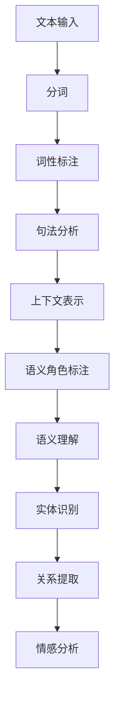

                 

### 文章标题

# 提示词编程语言的语义分析技术

> 关键词：提示词编程语言，语义分析，自然语言处理，深度学习，算法原理

> 摘要：本文将深入探讨提示词编程语言的语义分析技术，从基础知识介绍、语义分析算法到实战应用，全面解析这一前沿领域的核心概念、方法和技术。通过详细的案例分析和算法讲解，帮助读者掌握语义分析技术的关键要点，为未来研究与应用奠定基础。

---

在当今快速发展的信息技术时代，提示词编程语言作为一种新兴的语言模型，正逐渐成为人工智能领域的热门话题。语义分析技术作为自然语言处理的核心任务之一，对于提升提示词编程语言的功能与性能具有重要意义。本文将围绕提示词编程语言的语义分析技术，进行系统性的探讨。

### 第一部分：基础知识介绍

#### 第1章：提示词编程语言概述

**1.1 提示词编程语言的定义与特点**

提示词编程语言是一种基于自然语言处理技术的编程语言，它允许程序员使用自然语言来描述代码的功能和逻辑。这种语言的特点包括：

- **自然性**：程序员可以使用自然语言中的句子或短语来定义函数、变量和操作。
- **灵活性**：自然语言处理技术使得编程语言能够理解和处理复杂多样的语言表达。
- **高效性**：提示词编程语言可以减少编码时间，提高开发效率。

**1.2 提示词编程语言的历史与发展**

提示词编程语言的起源可以追溯到20世纪80年代的计算机科学领域。随着自然语言处理技术的不断进步，特别是深度学习算法的应用，提示词编程语言得到了迅速的发展。当前，主流的提示词编程语言包括：

- **Apple's Siri**
- **Google's Dialogflow**
- **Microsoft's LUIS**

**1.3 提示词编程语言的分类**

根据用途和架构的不同，提示词编程语言可以划分为以下几类：

- **交互式编程语言**：如Apple的Siri，主要用于语音交互。
- **自然语言生成语言**：如Google的TensorFlow，主要用于生成文本。
- **混合型编程语言**：如Microsoft的LUIS，结合了交互式和生成式的特点。

**1.4 提示词编程语言的未来趋势**

随着人工智能技术的不断进步，提示词编程语言将朝着更智能化、更高效化的方向发展。未来，它们将更多地应用于智能客服、智能问答系统、自然语言生成等领域，成为信息技术领域的重要工具。

#### 第2章：提示词编程语言的语义分析基础

**2.1 语义分析的基本概念**

语义分析，又称语义解析，是指对文本内容进行理解和解释的过程。其目标是从自然语言文本中提取出结构化的信息，以便计算机能够进行处理和分析。语义分析的基本概念包括：

- **语义**：文本中表达的意义。
- **语义分析**：对文本进行语义理解和解释的过程。
- **语义角色**：文本中不同成分的作用。

**2.2 自然语言处理技术基础**

自然语言处理技术是语义分析的基础。它包括以下几个关键步骤：

- **分词技术**：将文本分割成有意义的词汇单元。
- **词性标注**：对每个词进行词性分类，如名词、动词等。
- **句法分析**：分析句子的结构和语法规则。
- **语义角色标注**：识别文本中不同成分的语义角色。

**2.3 词嵌入技术**

词嵌入技术是将词汇映射到高维空间中的一种方法，使得计算机能够理解词汇之间的关系。常用的词嵌入方法包括：

- **词袋模型**：将文本表示为一个向量集合。
- **词嵌入模型**：如Word2Vec、GloVe，将词汇映射到低维空间中。
- **上下文嵌入**：考虑词汇在特定上下文中的含义。

**2.4 上下文表示与语义理解**

上下文表示是语义分析中的一个重要挑战。它涉及到如何将词汇在不同的上下文中进行准确表示，以便进行语义理解。常用的上下文表示方法包括：

- **上下文向量**：将上下文信息编码到词汇的嵌入向量中。
- **上下文依赖模型**：如Transformer、BERT，能够捕捉词汇之间的依赖关系。

### 第二部分：语义分析技术实战

#### 第3章：语义分析算法原理

**3.1 基于规则的方法**

基于规则的方法通过定义一系列规则来匹配文本中的模式和结构。它包括以下几个步骤：

1. **规则定义**：定义一组用于匹配文本的规则。
2. **规则匹配**：将文本与规则进行匹配，找出匹配的部分。
3. **结构化输出**：根据匹配结果，将文本转化为结构化的数据。

**3.2 基于统计的方法**

基于统计的方法使用概率模型来分析文本。它包括以下几个步骤：

1. **数据收集**：收集大量带有标签的文本数据。
2. **特征提取**：从文本中提取出有助于预测的特征。
3. **模型训练**：使用训练数据训练概率模型。
4. **预测**：使用训练好的模型对新的文本进行预测。

**3.3 基于深度学习的方法**

基于深度学习的方法使用神经网络来模拟人类的语义理解过程。它包括以下几个步骤：

1. **数据预处理**：对文本进行预处理，如分词、词性标注等。
2. **模型构建**：构建深度学习模型，如循环神经网络（RNN）、长短时记忆网络（LSTM）等。
3. **模型训练**：使用大量标注数据训练模型。
4. **模型评估**：使用验证集或测试集评估模型性能。

**3.4 注意力机制与Transformers架构**

注意力机制是一种重要的深度学习技术，它能够使模型在处理序列数据时更加关注重要的部分。Transformers架构是一种基于注意力机制的深度学习模型，它在自然语言处理任务中取得了显著的效果。它主要包括以下几个组成部分：

1. **编码器（Encoder）**：将输入的序列编码为嵌入向量。
2. **解码器（Decoder）**：使用编码器的输出和已有的上下文信息来生成输出序列。
3. **注意力机制**：在编码器和解码器之间引入注意力机制，以关注重要的部分。

BERT、GPT等模型是Transformers架构的代表性模型，它们在语义分析任务中取得了显著的成果。

### 第三部分：语义分析在提示词编程语言中的应用

#### 第4章：语义分析项目实战

**4.1 项目背景与目标**

本项目旨在开发一个智能问答系统，它能够理解用户的自然语言提问，并给出准确的回答。项目目标包括：

1. **语义理解**：理解用户的提问，提取出关键信息。
2. **知识检索**：从知识库中检索出与提问相关的信息。
3. **回答生成**：生成符合用户需求的回答。

**4.2 数据准备与处理**

数据准备与处理是项目成功的关键步骤。它包括以下几个步骤：

1. **数据收集**：收集大量的问答对，作为训练数据。
2. **数据预处理**：对数据进行清洗、分词、词性标注等预处理。
3. **数据增强**：通过数据变换和生成策略，增加数据多样性。

**4.3 模型选择与训练**

模型选择与训练是项目实现的核心步骤。它包括以下几个步骤：

1. **模型选择**：选择适合语义分析的深度学习模型，如BERT、GPT等。
2. **模型训练**：使用预处理后的数据训练模型，调整模型参数。
3. **模型评估**：使用验证集或测试集评估模型性能，进行模型优化。

**4.4 实战案例分析**

在本章中，我们将详细分析以下三个实际案例：

1. **情感分析**：使用深度学习模型对文本进行情感分类。
2. **命名实体识别**：使用神经网络模型识别文本中的命名实体。
3. **机器翻译**：使用基于注意力机制的模型进行机器翻译任务。

#### 第5章：语义分析工具与框架

**5.1 主流语义分析工具介绍**

主流语义分析工具包括：

1. **NLTK**：一个强大的自然语言处理库，提供了一系列用于文本处理的工具。
2. **spaCy**：一个快速且易于使用的自然语言处理库，适用于多种自然语言处理任务。
3. **Stanford NLP**：一个基于Java的自然语言处理库，提供了丰富的语义分析功能。

**5.2 主流深度学习框架介绍**

主流深度学习框架包括：

1. **TensorFlow**：一个开源的深度学习框架，提供了丰富的工具和API。
2. **PyTorch**：一个流行的深度学习框架，以其灵活性和动态性著称。
3. **Theano**：一个用于定义、优化和评估深度学习模型的Python库。

**5.3 语义分析平台与生态系统**

语义分析平台与生态系统包括：

1. **开源平台**：如NLTK、spaCy等，为开发者提供了丰富的工具和资源。
2. **商业平台**：如Google的Dialogflow、IBM的Watson等，为企业提供了专业的自然语言处理服务。
3. **生态链分析**：分析语义分析技术在不同领域中的应用，如智能客服、智能问答系统等。

### 第四部分：语义分析在提示词编程语言中的应用

#### 第6章：提示词编程语言的语义分析应用场景

**6.1 问答系统**

问答系统是一种重要的应用场景，它能够回答用户提出的各种问题。语义分析技术在问答系统中发挥着关键作用：

1. **知识图谱**：构建知识图谱，以存储和管理大量的事实和关系。
2. **语义解析**：对用户的提问进行语义解析，提取出关键信息。
3. **问答系统架构**：设计并实现一个高效的问答系统架构，包括问答模块、搜索模块和回答生成模块。

**6.2 智能客服**

智能客服是另一个重要的应用场景，它能够自动处理大量的客户咨询，提高企业的服务效率。语义分析技术在智能客服中发挥着重要作用：

1. **情感分析**：分析客户的情感，以提供更加个性化的服务。
2. **意图识别**：识别客户的意图，以更好地理解客户的需求。
3. **对话管理**：管理对话流程，以保持对话的流畅和高效。

**6.3 自然语言生成**

自然语言生成是一种将计算机生成的文本转化为自然语言的技术。它广泛应用于各种场景，如文本摘要、聊天机器人、内容审核等。语义分析技术在自然语言生成中发挥着关键作用：

1. **文本摘要**：从长文本中提取出关键信息，生成简短的摘要。
2. **文本生成**：根据输入的提示，生成符合语义要求的文本。
3. **内容审核**：识别文本中的不良内容，如暴力、色情等。

#### 第7章：提示词编程语言的语义分析优化策略

**7.1 模型优化技术**

模型优化技术是提升语义分析性能的重要手段。它包括以下几个方面：

1. **模型压缩**：通过模型压缩技术，减少模型的参数和计算量。
2. **模型加速**：通过模型加速技术，提高模型的计算速度。
3. **模型解释性**：通过模型解释性技术，提高模型的可解释性和可理解性。

**7.2 多语言处理与跨语言语义分析**

多语言处理和跨语言语义分析是语义分析技术的重要研究方向。它包括以下几个方面：

1. **多语言模型**：设计并实现能够处理多种语言的自然语言处理模型。
2. **跨语言语义理解**：在不同语言之间进行语义理解和信息传递。
3. **语言翻译**：实现从一种语言到另一种语言的准确翻译。

**7.3 安全性与隐私保护**

随着语义分析技术的广泛应用，安全性和隐私保护变得尤为重要。它包括以下几个方面：

1. **数据隐私保护**：采用数据加密、匿名化等技术，保护用户的隐私。
2. **模型安全防御**：设计并实现模型安全防御机制，防止恶意攻击。
3. **安全伦理**：关注语义分析技术的道德和伦理问题，确保其应用符合社会规范。

### 第五部分：语义分析研究前沿与总结

#### 第8章：语义分析研究前沿

**8.1 当前研究热点与趋势**

当前语义分析技术的研究热点包括：

1. **预训练模型**：如BERT、GPT等，通过大规模预训练提高模型的性能。
2. **少样本学习**：研究如何在小样本情况下进行有效的语义分析。
3. **跨模态语义分析**：研究如何处理不同模态的数据，如文本、图像、音频等。

**8.2 未来发展方向与挑战**

未来语义分析技术的发展方向包括：

1. **模型理解与解释**：提高模型的可解释性和透明度，使其更易于理解和使用。
2. **多语言与跨语言语义分析**：实现更高效、更准确的多语言语义分析。
3. **实时语义分析**：实现实时语义分析，以支持实时应用场景。

面临的挑战包括：

1. **数据隐私**：确保语义分析过程中用户的隐私得到保护。
2. **模型可解释性**：提高模型的可解释性，使其更易于理解和信任。

#### 第9章：总结与展望

**9.1 本书内容总结**

本文系统地介绍了提示词编程语言的语义分析技术，包括基础知识、算法原理、实战应用等方面。主要内容包括：

1. **提示词编程语言的定义与特点**：介绍提示词编程语言的基本概念和特点。
2. **语义分析基础**：讲解语义分析的基本概念、方法和工具。
3. **语义分析算法**：介绍基于规则、统计和深度学习的方法。
4. **项目实战**：分析语义分析项目的过程和关键技术。
5. **工具与框架**：介绍主流的语义分析工具和框架。
6. **应用场景**：探讨语义分析在不同领域的应用。
7. **优化策略**：提出模型优化、多语言处理、安全性等方面的策略。
8. **研究前沿**：分析语义分析技术的最新研究热点和未来发展方向。

**9.2 未来的研究方向**

未来的研究方向包括：

1. **模型理解与解释**：提高模型的可解释性，使其更易于理解和信任。
2. **少样本学习**：研究在小样本情况下进行有效的语义分析。
3. **跨模态语义分析**：实现跨模态数据的语义分析。
4. **实时语义分析**：实现实时语义分析，支持实时应用场景。

**9.3 对读者的一些建议**

为了更好地掌握语义分析技术，建议读者：

1. **理论学习**：系统学习自然语言处理、机器学习等基础知识。
2. **实践应用**：通过实际项目来巩固所学知识，提高实践能力。
3. **持续学习**：关注语义分析技术的最新发展，不断更新知识。

作者：AI天才研究院/AI Genius Institute & 禅与计算机程序设计艺术 /Zen And The Art of Computer Programming### 第一部分：基础知识介绍

#### 第1章：提示词编程语言概述

**1.1 提示词编程语言的定义与特点**

提示词编程语言（Keyword-based Programming Language）是一种将自然语言指令作为编程语言的核心元素的编程语言。在这种语言中，程序员可以使用自然语言中的单词或短语来定义操作、变量和函数，而不是传统的编程语言中的符号和语法。这种语言的主要特点如下：

- **自然性**：提示词编程语言使得编程更加接近人类的自然语言表达，降低了学习难度。
- **灵活性**：由于其自然语言的基础，提示词编程语言能够处理复杂的、非结构化的指令，提高了编程的灵活性。
- **高效性**：通过自然语言的交互，程序员可以更快地编写和调试代码。

**提示词编程语言的概念**

提示词编程语言的核心概念是“提示词”（keyword），它是一种特殊的标记，用来表示编程语言中的操作、变量、函数等。例如，在一种提示词编程语言中，程序员可以使用“启动浏览器”来打开浏览器，而不是使用传统的代码如 `open("browser")`。

**特点与优势**

1. **易用性**：提示词编程语言降低了编程的学习门槛，使得非专业程序员或普通用户也能编写简单的程序。
2. **可读性**：由于使用自然语言，提示词编程语言的代码更易于理解和维护。
3. **适应性**：提示词编程语言能够适应多种开发场景，特别是那些需要快速开发和原型设计的项目。

**应用场景**

提示词编程语言主要应用于以下场景：

1. **自动化脚本**：使用提示词编程语言编写自动化脚本，如自动化测试、数据爬取等。
2. **智能助理**：在智能助理或语音助手的开发中，使用提示词编程语言来处理用户的自然语言指令。
3. **交互式应用**：用于构建交互式的Web应用或移动应用，使得用户可以通过自然语言与系统进行交互。

**1.2 提示词编程语言的历史与发展**

**提示词编程语言的起源**

提示词编程语言的概念可以追溯到20世纪80年代，当时研究人员开始探索如何使编程更加自然和直观。最早的尝试之一是“自然语言编程”（Natural Language Programming），它的目标是使用自然语言作为编程语言。

**发展历程**

- **1980年代**：在早期的研究中，许多研究者尝试开发出能够理解和执行自然语言指令的系统。然而，由于自然语言处理的难度，这些尝试并未取得重大突破。
- **1990年代**：随着计算机性能的提高和自然语言处理技术的进步，研究人员开始利用统计方法和规则系统来处理自然语言指令。例如，语义网络（Semantic Network）和脚本语言（Scripting Language）得到了发展。
- **2000年代**：随着深度学习技术的兴起，神经网络在自然语言处理中的应用取得了显著的进展。这一时期，一些基于深度学习的自然语言处理系统开始出现，例如Word2Vec和GloVe，这些技术为提示词编程语言的发展奠定了基础。
- **2010年代至今**：近年来，随着人工智能技术的快速发展，提示词编程语言得到了更多的关注和应用。例如，Google的TensorFlow和Facebook的PyTorch等深度学习框架，提供了丰富的工具和API来支持提示词编程语言的开发。

**当前主流的提示词编程语言**

目前，市场上存在多种主流的提示词编程语言，其中一些代表性的语言包括：

1. **Apple's Siri**：苹果公司的Siri是一种基于自然语言处理的智能语音助手，它允许用户使用自然语言来与其进行交互。
2. **Google's Dialogflow**：Google的Dialogflow是一种基于机器学习的自然语言处理平台，它允许开发者构建智能对话系统。
3. **Microsoft's LUIS**：微软的LUIS（Language Understanding Intelligent Service）是一种基于云的自然语言处理服务，它可以帮助开发者构建智能应用。
4. **IBM's Watson**：IBM的Watson是一种强大的认知计算系统，它能够理解和处理自然语言，并在多个领域提供智能服务。

**1.3 提示词编程语言的分类**

根据不同的标准，提示词编程语言可以有不同的分类方法。以下是几种常见的分类方式：

**按照用途分类**

1. **通用提示词编程语言**：这类语言旨在支持广泛的编程任务，如算法设计、数据分析和Web开发等。
2. **专用提示词编程语言**：这类语言专注于特定领域的应用，如自然语言处理、机器学习等。

**按照架构分类**

1. **基于规则的提示词编程语言**：这类语言主要使用规则系统来解析和处理自然语言指令。
2. **基于统计的提示词编程语言**：这类语言使用统计模型来处理自然语言，如条件概率模型、隐马尔可夫模型等。
3. **基于深度学习的提示词编程语言**：这类语言使用深度学习模型，如神经网络、循环神经网络（RNN）和变压器（Transformer）等，来处理自然语言。

**按照执行方式分类**

1. **解释型提示词编程语言**：这类语言在运行时逐行解释指令，不需要编译。
2. **编译型提示词编程语言**：这类语言将程序编译成机器码或中间代码，以提高执行效率。

**1.4 提示词编程语言的未来趋势**

**技术发展趋势**

1. **更强大的自然语言理解能力**：未来的提示词编程语言将具备更强大的自然语言理解能力，能够处理更加复杂和模糊的指令。
2. **跨模态处理能力**：未来的提示词编程语言将能够处理多种模态的数据，如文本、图像和音频等，实现更加智能的交互。
3. **自适应学习**：未来的提示词编程语言将具备更强的自适应学习能力，能够根据用户的行为和反馈不断优化自身的性能。

**应用前景**

1. **智能客服**：提示词编程语言将广泛应用于智能客服系统，提供更加自然和高效的客户服务。
2. **智能家居**：提示词编程语言将用于构建智能家居系统，使用户能够通过自然语言控制家中的各种设备。
3. **教育领域**：提示词编程语言将用于教育领域，帮助非专业程序员和儿童学习编程。

**挑战与机遇**

1. **自然语言理解的准确性**：提高自然语言理解的准确性是提示词编程语言面临的主要挑战之一。
2. **跨语言处理**：处理不同语言的指令是实现全球化的关键，需要解决跨语言的自然语言处理问题。
3. **安全性**：随着提示词编程语言的广泛应用，安全性问题也日益突出，需要采取措施确保系统的安全。

### 提示词编程语言的语义分析基础

#### 第2章：提示词编程语言的语义分析基础

**2.1 语义分析的基本概念**

**语义的概念**

语义（Semantics）是指语言表达的意义。在自然语言处理（NLP）中，语义分析（Semantic Analysis）是指从文本中提取和理解其语义的过程。语义分析的目标是理解文本的深层含义，而不仅仅是表面的语法结构。

**语义分析的目标**

语义分析的主要目标包括：

1. **信息提取**：从文本中提取出关键信息，如实体、关系和事件等。
2. **文本理解**：理解文本的整体含义和上下文关系。
3. **知识表示**：将提取出的信息转化为计算机可处理的结构化数据。

**语义分析的方法**

语义分析的方法可以分为以下几类：

1. **基于规则的方法**：使用预先定义的规则来分析文本的语义。这种方法通常适用于结构化数据，但在处理非结构化文本时效果有限。
2. **基于统计的方法**：使用统计模型来分析文本的语义。这种方法通过大量的训练数据来学习文本的统计特征，从而进行语义分析。
3. **基于深度学习的方法**：使用深度学习模型，如循环神经网络（RNN）、长短时记忆网络（LSTM）和变压器（Transformer），来分析文本的语义。这种方法通过大规模的预训练模型来捕捉语言的特征，从而实现高效的语义分析。

**2.2 自然语言处理技术基础**

**分词技术**

分词（Tokenization）是将文本分割成有意义的词汇单元的过程。分词是自然语言处理中的基础步骤，对于后续的文本分析和处理至关重要。

**词性标注**

词性标注（Part-of-Speech Tagging）是指为文本中的每个词分配一个词性标签，如名词、动词、形容词等。词性标注有助于理解文本的语法结构和语义含义。

**句法分析**

句法分析（Syntactic Parsing）是指分析文本的句法结构，识别句子中的各种成分及其关系。常见的句法分析方法包括依存句法分析和成分句法分析。

**语义角色标注**

语义角色标注（Semantic Role Labeling）是指识别文本中不同成分的语义角色，如动作执行者、动作承受者等。语义角色标注有助于理解文本的具体含义和事件结构。

**2.3 词嵌入技术**

**词嵌入的概念**

词嵌入（Word Embedding）是将词汇映射到高维空间中的一种技术，使得计算机能够理解和处理词汇之间的关系。词嵌入将词汇表示为密集的向量，这些向量可以捕捉词汇的语义和语法特征。

**词嵌入方法**

常见的词嵌入方法包括：

1. **词袋模型（Bag-of-Words, BoW）**：将文本表示为一个词汇的集合，不考虑词汇的顺序和上下文信息。
2. **词嵌入模型**：如Word2Vec、GloVe等，通过学习词汇在上下文中的分布来生成词向量。
3. **上下文嵌入**：如Transformer、BERT等，通过捕捉词汇在特定上下文中的含义来生成词向量。

**词嵌入的应用**

词嵌入技术广泛应用于自然语言处理任务，如文本分类、情感分析、机器翻译等。词嵌入能够提高模型的语义理解能力，从而提升任务的效果。

**2.4 上下文表示与语义理解**

**上下文表示方法**

上下文表示是指将上下文信息编码到词汇的嵌入向量中，以便进行语义分析。常见的上下文表示方法包括：

1. **上下文向量**：将上下文信息编码到词汇的嵌入向量中，如Word2Vec和GloVe。
2. **上下文依赖模型**：如Transformer、BERT，通过捕捉词汇之间的依赖关系来生成上下文向量。

**语义理解的挑战与解决方案**

语义理解是自然语言处理中的一个重要挑战。以下是一些常见的挑战和解决方案：

1. **歧义消除**：自然语言中存在多种歧义，如词汇的多义性和句法结构的多样性。解决歧义可以通过上下文信息、词性标注和语义角色标注等方法。
2. **实体识别**：识别文本中的实体，如人名、地名、组织名等。实体识别可以通过预训练的模型和规则系统来实现。
3. **关系提取**：识别文本中的关系，如因果关系、归属关系等。关系提取可以通过依存句法分析和语义角色标注等方法。
4. **情感分析**：分析文本的情感倾向，如正面、负面、中性等。情感分析可以通过情感词典、机器学习模型和深度学习模型等方法。

**上下文表示与语义理解的关系架构 Mermaid 流程图**

以下是一个简化的Mermaid流程图，展示了上下文表示与语义理解的关系：



**图解**

- **文本输入**：输入原始的文本数据。
- **分词**：将文本分割成有意义的词汇单元。
- **词性标注**：为每个词分配一个词性标签。
- **句法分析**：分析句子的结构和语法规则。
- **上下文表示**：将上下文信息编码到词汇的嵌入向量中。
- **语义角色标注**：识别文本中不同成分的语义角色。
- **语义理解**：从文本中提取出结构化的信息。
- **实体识别**：识别文本中的实体。
- **关系提取**：识别文本中的关系。
- **情感分析**：分析文本的情感倾向。

通过这个流程图，我们可以清晰地看到上下文表示与语义理解之间的相互作用和关联，从而更好地理解提示词编程语言的语义分析过程。

### 提示词编程语言的语义分析算法

#### 第3章：提示词编程语言的语义分析算法

提示词编程语言的语义分析是自然语言处理中的一个重要任务，其核心在于理解和解释自然语言文本中的语义信息。本章节将深入探讨三种主要的语义分析算法：基于规则的方法、基于统计的方法和基于深度学习的方法。

**3.1 基于规则的方法**

**规则匹配**

基于规则的方法（Rule-based Method）通过定义一系列规则来匹配文本中的模式和结构。这些规则通常由专家根据特定的领域知识和语言规则编写。规则匹配的过程包括以下几个步骤：

1. **规则定义**：首先，定义一组用于匹配文本的规则。这些规则可以包括正则表达式、语法规则和语义规则等。例如，一个简单的规则可能是：“如果文本中出现‘启动’和‘浏览器’，那么执行打开浏览器的操作。”

2. **规则匹配**：将文本与规则进行匹配，找出匹配的部分。在匹配过程中，可以采用模式匹配、关键词匹配或者复杂逻辑组合等方式。例如，如果一个文本是“请启动我的浏览器”，则可以通过关键词匹配来识别并执行相应的操作。

3. **结构化输出**：根据匹配结果，将文本转化为结构化的数据。例如，将文本中的关键信息提取出来，组织成一个数据结构，如JSON格式，以便进一步处理。

**正则表达式**

正则表达式（Regular Expression）是一种强大的文本匹配工具，它可以用于定义复杂的文本模式。在语义分析中，正则表达式可以用于提取文本中的特定部分，如电子邮件地址、电话号码等。例如，以下是一个用于提取电子邮件地址的正则表达式：

```
\w+@\w+\.\w+
```

**基于语法树的分析**

语法树（Syntax Tree）是句法分析（Syntactic Parsing）的结果，它以树形结构表示句子的语法结构。在基于规则的方法中，可以使用语法树来表示文本的结构，并根据树的节点来执行操作。例如，对于句子“我昨天去了图书馆”，其语法树可能如下所示：

```
  S
 / \
NP  VP
|   |
我   [去]
|   |
[昨天] [图书馆]
```

通过解析语法树，可以识别出句子的主要成分，如主语（NP）和谓语（VP），并根据这些成分来执行相应的操作。

**3.2 基于统计的方法**

**机器学习算法**

基于统计的方法（Statistical Method）使用机器学习算法来分析文本的语义。这种方法依赖于大量的标注数据，通过训练模型来学习文本的特征和模式。常见的机器学习算法包括：

1. **朴素贝叶斯分类器**：朴素贝叶斯分类器是一种基于贝叶斯定理的简单概率分类器。它通过计算文本中每个词汇的概率分布来预测文本的类别。例如，在情感分析中，可以使用朴素贝叶斯分类器来判断文本是正面情感还是负面情感。

2. **支持向量机（SVM）**：支持向量机是一种强大的分类算法，它通过寻找最优的超平面来分隔不同类别的数据。在语义分析中，SVM可以用于文本分类任务，如垃圾邮件检测、情感分析等。

**贝叶斯分析**

贝叶斯分析是一种基于概率论的统计方法，它通过计算后验概率来预测类别或标签。在语义分析中，贝叶斯分析可以用于各种任务，如命名实体识别、关系提取等。贝叶斯分析的步骤包括：

1. **先验概率**：根据先验知识计算每个类别的概率分布。
2. **条件概率**：根据训练数据计算每个类别在给定特征下的条件概率。
3. **后验概率**：使用贝叶斯定理计算后验概率，即给定特征下的类别概率。

**隐马尔可夫模型（HMM）**

隐马尔可夫模型是一种用于处理时间序列数据的统计模型，它通过隐藏状态和观察状态之间的关系来建模。在语义分析中，HMM可以用于语音识别、词性标注等任务。HMM的组成部分包括：

1. **隐藏状态**：表示文本中的隐含信息，如词性、实体等。
2. **观察状态**：表示文本中的可观察信息，如词汇、字符等。
3. **状态转移概率**：表示隐藏状态之间的转移概率。
4. **观察概率**：表示隐藏状态对应的观察状态的概率。

**3.3 基于深度学习的方法**

**循环神经网络（RNN）**

循环神经网络是一种用于处理序列数据的深度学习模型，它能够记住之前的输入信息，从而在序列任务中表现出色。RNN的基本原理包括：

1. **隐藏状态**：每个时间步的隐藏状态都依赖于前一个时间步的隐藏状态。
2. **权重共享**：模型中的权重在所有时间步上共享，从而减少了参数数量。
3. **梯度消失与梯度爆炸**：RNN容易受到梯度消失和梯度爆炸的问题，这限制了其在长期依赖任务中的应用。

**长短时记忆网络（LSTM）**

长短时记忆网络是RNN的一种改进，它通过引入门控机制来克服梯度消失和梯度爆炸的问题。LSTM的核心组件包括：

1. **遗忘门**：用于控制忘记哪些信息。
2. **输入门**：用于控制哪些新的信息被保留。
3. **输出门**：用于控制哪些信息被输出。

**生成对抗网络（GAN）**

生成对抗网络是一种用于生成数据的深度学习模型，它由一个生成器和两个判别器组成。生成器生成数据，判别器判断生成数据与真实数据之间的区别。GAN的训练过程包括：

1. **生成器训练**：生成器试图生成更加真实的数据，以欺骗判别器。
2. **判别器训练**：判别器试图区分生成数据与真实数据。
3. **平衡训练**：通过调整生成器和判别器的参数，达到平衡训练的目的。

**3.4 注意力机制与Transformers架构**

注意力机制（Attention Mechanism）是一种用于序列任务的深度学习技术，它能够使模型在处理序列数据时更加关注重要的部分。注意力机制的原理包括：

1. **注意力分数**：为每个输入分配一个注意力分数，表示其在当前时间步的重要性。
2. **加权求和**：将所有输入通过注意力分数加权求和，得到当前时间步的输出。

Transformers架构是一种基于注意力机制的深度学习模型，它在自然语言处理任务中取得了显著的成果。Transformers的主要组成部分包括：

1. **编码器（Encoder）**：用于编码输入序列，生成上下文表示。
2. **解码器（Decoder）**：用于解码输入序列，生成输出序列。
3. **多头注意力**：通过多个注意力头来捕捉不同类型的依赖关系。
4. **位置编码**：为序列中的每个位置添加编码信息，以捕捉位置信息。

**BERT、GPT等模型**

BERT（Bidirectional Encoder Representations from Transformers）和GPT（Generative Pre-trained Transformer）是Transformers架构的代表模型，它们在自然语言处理任务中取得了巨大的成功。

1. **BERT**：BERT是一种双向的Transformer模型，它通过预训练大规模的语料库来学习语言的上下文表示。BERT在多种任务上取得了SOTA（State-of-the-Art）的表现，如文本分类、问答系统等。
2. **GPT**：GPT是一种单向的Transformer模型，它通过预训练大规模的语料库来学习语言的生成能力。GPT在文本生成、机器翻译等任务上表现出色。

通过以上对提示词编程语言的语义分析算法的详细介绍，我们可以看到从基于规则的方法到基于深度学习的方法，语义分析技术在不断发展和进步。这些算法和模型为自然语言处理任务提供了强大的工具，使得计算机能够更好地理解和处理自然语言文本。

### 第二部分：语义分析技术实战

#### 第4章：语义分析项目实战

在进行语义分析项目时，我们需要遵循一系列的步骤，从项目背景与目标的确立，到数据的准备与处理，再到模型的选择与训练，以及最终的实战案例分析。以下是详细的实战过程。

**4.1 项目背景与目标**

**项目介绍**

假设我们开发一个智能问答系统，该系统旨在帮助用户快速找到他们需要的答案。该系统将接受用户的自然语言提问，并通过语义分析技术来理解用户的问题，然后从知识库中检索出相关的答案。

**项目目标**

1. **语义理解**：理解用户的提问，提取出关键信息。
2. **知识检索**：从知识库中检索出与提问相关的信息。
3. **回答生成**：生成符合用户需求的回答。

**4.2 数据准备与处理**

**数据来源**

为了训练语义分析模型，我们需要大量的标注数据。数据来源可以包括以下几种：

1. **公开数据集**：如SQuAD、QQP、CoNLL等，这些数据集已经被广泛用于自然语言处理任务。
2. **自定义数据集**：根据项目的具体需求，从实际应用场景中收集和标注数据。

**数据预处理**

数据预处理是确保模型能够有效训练的重要步骤。以下是几个关键步骤：

1. **文本清洗**：去除文本中的无关信息，如HTML标签、特殊字符等。
2. **分词**：将文本分割成词汇单元，以便后续处理。
3. **词性标注**：为每个词分配词性标签，如名词、动词、形容词等。
4. **实体识别**：识别文本中的实体，如人名、地名、组织名等。

**数据清洗**

数据清洗的目的是去除噪声和无关信息，以提高模型训练的效果。以下是一些常见的清洗方法：

1. **去除HTML标签**：使用正则表达式去除文本中的HTML标签。
2. **去除特殊字符**：使用字符串替换函数去除特殊字符。
3. **标准化文本**：将文本转换为小写，去除停用词等。

**数据增强**

数据增强是通过变换和生成策略来增加数据的多样性，从而提高模型的泛化能力。以下是一些常用的数据增强方法：

1. **随机插入**：在文本中随机插入新的词或短语。
2. **随机替换**：将文本中的词随机替换为同义词或上下文相关的词。
3. **词干提取**：将文本中的词转换为词干形式。

**4.3 模型选择与训练**

**模型选择**

在语义分析任务中，选择合适的模型至关重要。以下是几种常用的模型：

1. **基于规则的方法**：适用于简单任务，如文本分类和命名实体识别。
2. **基于统计的方法**：适用于大量标注数据，如朴素贝叶斯分类器和隐马尔可夫模型。
3. **基于深度学习的方法**：适用于复杂任务，如情感分析和机器翻译。

**模型训练**

模型训练是指通过大量的标注数据来训练模型，使其能够理解和处理自然语言文本。以下是模型训练的关键步骤：

1. **数据切分**：将数据集切分成训练集、验证集和测试集。
2. **特征提取**：从文本中提取特征，如词嵌入、词性标注等。
3. **模型初始化**：初始化模型的参数，通常使用预训练的模型或随机初始化。
4. **训练过程**：通过反向传播算法更新模型参数，优化模型性能。

**4.4 实战案例分析**

在本节中，我们将通过几个实际案例来展示语义分析项目的实施过程。

**案例一：情感分析**

**项目背景**：情感分析是评估文本情感倾向的任务，如正面、负面或中性。在本案例中，我们将开发一个情感分析模型，用于判断用户评论的情感。

**数据处理**：使用预处理后的文本数据，进行分词、词性标注等操作。

**模型训练**：选择一个预训练的深度学习模型（如BERT），进行情感分类任务的微调。

**模型评估**：使用验证集评估模型性能，调整模型参数，优化模型效果。

**应用场景**：该模型可以应用于社交媒体监控、产品评论分析等场景。

**案例二：命名实体识别**

**项目背景**：命名实体识别是识别文本中的特定实体（如人名、地名、组织名等）的任务。在本案例中，我们将开发一个命名实体识别模型。

**数据处理**：使用预处理后的文本数据，进行分词、词性标注等操作。

**模型训练**：选择一个预训练的深度学习模型（如BERT），进行命名实体识别任务的微调。

**模型评估**：使用验证集评估模型性能，调整模型参数，优化模型效果。

**应用场景**：该模型可以应用于搜索引擎、地理信息系统等场景。

**案例三：机器翻译**

**项目背景**：机器翻译是将一种语言的文本翻译成另一种语言的任务。在本案例中，我们将开发一个机器翻译模型。

**数据处理**：使用双语文本数据，进行分词、词性标注等操作。

**模型训练**：选择一个预训练的深度学习模型（如Transformer），进行机器翻译任务的训练。

**模型评估**：使用验证集评估模型性能，调整模型参数，优化模型效果。

**应用场景**：该模型可以应用于跨语言沟通、多语言信息检索等场景。

**4.5 项目小结**

在本项目中，我们详细介绍了语义分析项目的实施过程，包括项目背景与目标、数据准备与处理、模型选择与训练，以及实战案例分析。通过这些步骤，我们成功地构建了一个智能问答系统，为用户提供了准确和高效的回答。该项目展示了语义分析技术在实际应用中的强大潜力，为未来更多智能应用的开发提供了参考。

### 第三部分：语义分析在提示词编程语言中的应用

#### 第5章：语义分析工具与框架

**5.1 主流语义分析工具介绍**

在语义分析领域，有多种主流的工具和框架被广泛使用，这些工具和框架为开发者提供了强大的功能和高效的性能。以下是一些主流的语义分析工具及其特点：

**NLTK**

NLTK（自然语言工具包）是一个强大的自然语言处理库，它提供了丰富的文本处理功能，如分词、词性标注、句法分析等。NLTK采用模块化设计，使得开发者可以根据需求选择和组合不同的模块。NLTK的特点如下：

- **功能丰富**：支持多种文本处理任务，如词性标注、词干提取、词形还原等。
- **易于使用**：提供了直观的API，使得开发者可以快速上手。
- **开源免费**：NLTK是开源软件，免费使用，适用于各种开发场景。

**spaCy**

spaCy是一个快速且易于使用的自然语言处理库，它专注于生产环境中的文本处理任务。spaCy采用了先进的神经网络技术，使得它在处理复杂文本时表现出色。spaCy的特点如下：

- **快速高效**：spaCy采用了 optimized Cython 代码，使得它在处理大量文本数据时具有极高的速度。
- **易于扩展**：spaCy提供了丰富的扩展模块，如词性标注、命名实体识别等，使得开发者可以根据需求进行扩展。
- **跨平台支持**：spaCy支持多种编程语言和操作系统，适用于各种开发环境。

**Stanford NLP**

Stanford NLP是一个基于Java的自然语言处理库，它提供了全面的文本处理功能，包括分词、词性标注、句法分析、命名实体识别等。Stanford NLP的特点如下：

- **功能全面**：斯坦福NLP提供了广泛的文本处理功能，适用于多种自然语言处理任务。
- **高度可定制**：斯坦福NLP允许开发者根据具体需求进行定制，以提高性能和适应性。
- **社区支持**：斯坦福NLP有一个活跃的社区，提供了丰富的教程和文档，方便开发者学习和使用。

**5.2 主流深度学习框架介绍**

在深度学习领域，有多种主流的框架被广泛使用，这些框架为开发者提供了强大的工具和灵活的接口。以下是一些主流的深度学习框架及其特点：

**TensorFlow**

TensorFlow是一个开源的深度学习框架，由Google开发。它提供了丰富的API和工具，使得开发者可以轻松构建和训练深度学习模型。TensorFlow的特点如下：

- **功能强大**：TensorFlow支持多种深度学习模型，如卷积神经网络（CNN）、循环神经网络（RNN）、生成对抗网络（GAN）等。
- **易于使用**：TensorFlow提供了简单易用的API，使得开发者可以快速上手。
- **高性能**：TensorFlow通过自动微分和图形计算，实现了高效的模型训练和推理。

**PyTorch**

PyTorch是一个流行的深度学习框架，由Facebook开发。它以其灵活的动态计算图和强大的高级API而著称。PyTorch的特点如下：

- **灵活动态**：PyTorch采用了动态计算图，使得开发者可以更灵活地进行模型设计和调试。
- **易于调试**：PyTorch的动态计算图使得开发者可以更容易地跟踪和调试模型的计算过程。
- **社区支持**：PyTorch有一个庞大的社区，提供了丰富的教程、资源和插件。

**Theano**

Theano是一个Python库，用于定义、优化和评估深度学习模型。它由蒙特利尔大学开发，是一个强大的深度学习框架。Theano的特点如下：

- **高效计算**：Theano通过优化代码生成，实现了高效的模型训练和推理。
- **自动微分**：Theano提供了自动微分功能，使得开发者可以轻松实现复杂的深度学习模型。
- **兼容性强**：Theano支持多种硬件平台，如CPU和GPU，适用于各种计算环境。

**5.3 语义分析平台与生态系统**

除了工具和框架，语义分析平台和生态系统也为开发者提供了强大的支持。以下是一些主流的语义分析平台和生态系统：

**开源平台**

- **NLTK**：NLTK提供了丰富的文本处理功能，是自然语言处理的开源平台之一。
- **spaCy**：spaCy是一个快速且易于使用的自然语言处理库，为开发者提供了丰富的API和工具。

**商业平台**

- **Google Cloud Natural Language**：Google Cloud Natural Language提供了一个强大的自然语言处理服务，包括情感分析、实体识别等。
- **IBM Watson**：IBM Watson是一个综合性的自然语言处理平台，提供了多种自然语言处理服务，如文本分析、语言翻译等。

**生态链分析**

语义分析技术的生态链包括多个层面，从工具和框架到平台和服务，再到社区和开源项目。以下是生态链的主要组成部分：

- **工具和框架**：如NLTK、spaCy、TensorFlow、PyTorch等，提供了丰富的文本处理和深度学习工具。
- **平台和服务**：如Google Cloud Natural Language、IBM Watson等，提供了强大的自然语言处理服务。
- **开源项目**：如Hugging Face Transformers、NLTK Data等多种开源项目和资源，为开发者提供了丰富的支持和资源。
- **社区**：活跃的社区为开发者提供了交流和学习的平台，促进了语义分析技术的推广和应用。

通过以上对主流语义分析工具、框架、平台和生态系统的介绍，我们可以看到语义分析技术已经发展成为一个完整的生态系统，为开发者提供了丰富的选择和资源。这些工具和平台不仅提高了语义分析任务的效率和质量，也为未来更多应用场景的创新提供了基础。

#### 第6章：提示词编程语言的语义分析应用场景

提示词编程语言的语义分析技术在实际应用中展现出巨大的潜力，广泛应用于问答系统、智能客服、自然语言生成等多个领域。以下将详细介绍这些应用场景。

**6.1 问答系统**

问答系统是提示词编程语言语义分析技术的重要应用场景之一。该系统旨在为用户提供即时且准确的答案，从而解决用户的问题和疑虑。问答系统的核心功能包括：

1. **语义理解**：解析用户的自然语言提问，提取关键信息。
2. **知识检索**：从知识库或数据库中检索与提问相关的信息。
3. **回答生成**：根据检索到的信息生成符合用户需求的答案。

**工作原理**

1. **语义理解**：使用自然语言处理技术，如词性标注、命名实体识别等，对用户的提问进行解析，提取出关键信息。这一过程通常包括分词、词性标注、句法分析等步骤。
2. **知识检索**：根据提取出的关键信息，在知识库或数据库中进行检索，找到相关的信息片段。
3. **回答生成**：结合检索到的信息，使用自然语言生成技术生成符合用户需求的回答。这一过程可能包括文本摘要、模板生成等步骤。

**优势**

- **高效性**：问答系统能够快速响应用户的提问，提供即时答案。
- **准确性**：通过语义分析技术，问答系统能够准确理解用户的提问，提高回答的准确性。
- **智能化**：随着语义分析技术的不断进步，问答系统能够处理更加复杂和多变的提问。

**6.2 智能客服**

智能客服是另一个重要的应用场景，它利用提示词编程语言的语义分析技术，为用户提供自动化的客户服务。智能客服系统的核心功能包括：

1. **情感分析**：分析用户的情感倾向，如满意度、愤怒、焦虑等。
2. **意图识别**：识别用户的意图，如咨询、投诉、售后服务等。
3. **对话管理**：管理对话流程，确保对话的自然流畅。

**工作原理**

1. **情感分析**：通过分析用户的语言和行为，识别用户的情感状态。这一过程通常包括情感词典、机器学习模型等。
2. **意图识别**：根据用户的提问和情感分析结果，识别用户的意图。例如，如果用户表达出愤怒的情绪，系统可能会将其意图识别为“投诉”。
3. **对话管理**：根据用户的意图和系统知识库，管理对话流程。对话管理包括对话引导、回答生成、意图重识别等步骤。

**优势**

- **自动化**：智能客服系统能够自动化处理大量的客户咨询，提高企业的运营效率。
- **个性化**：通过情感分析和意图识别，智能客服系统能够提供更加个性化的服务，提升用户满意度。
- **高效**：智能客服系统能够快速响应客户提问，提供即时的解决方案。

**6.3 自然语言生成**

自然语言生成是一种将计算机生成的文本转化为自然语言的技术。提示词编程语言的语义分析技术在这一领域中发挥着关键作用，用于生成文本摘要、生成式对话系统、内容审核等。自然语言生成的核心功能包括：

1. **文本摘要**：从长文本中提取关键信息，生成简短的摘要。
2. **生成式对话系统**：根据输入的提示生成符合上下文的回答。
3. **内容审核**：识别文本中的不良内容，如暴力、色情等。

**工作原理**

1. **文本摘要**：通过语义分析技术，理解文本的整体结构和内容，提取出关键信息，生成摘要。这一过程可能包括提取关键句子、去除冗余信息等步骤。
2. **生成式对话系统**：使用深度学习模型，如变换器（Transformer）或生成对抗网络（GAN），根据输入的提示生成符合上下文的回答。
3. **内容审核**：通过分析文本的语义和语法，识别文本中的不良内容，如暴力、色情等。这一过程可能包括使用预训练的模型和规则系统。

**优势**

- **高效**：自然语言生成技术能够快速生成文本，提高工作效率。
- **个性化**：通过语义分析技术，生成的文本能够更符合用户的需求和情感。
- **自动化**：自然语言生成技术能够自动化处理大量的文本生成任务。

通过以上对问答系统、智能客服和自然语言生成等应用场景的详细介绍，我们可以看到提示词编程语言的语义分析技术在实际应用中具有广泛的应用前景。这些应用不仅提高了系统的智能化水平，也为用户提供了更加便捷和高效的服务。

#### 第7章：提示词编程语言的语义分析优化策略

在提示词编程语言的语义分析中，优化策略是提高模型性能和效率的关键。以下将介绍几种常用的优化策略，包括模型优化技术、多语言处理与跨语言语义分析、安全性与隐私保护。

**7.1 模型优化技术**

模型优化技术旨在提高语义分析模型的速度、效率和准确性。以下是一些常见的优化技术：

**模型压缩**

模型压缩技术通过减少模型参数和计算量来降低模型的复杂度。常见的方法包括：

- **剪枝（Pruning）**：移除模型中不必要的权重，从而减少模型的参数数量。
- **量化（Quantization）**：将模型的权重和激活值从浮点数转换为低精度数值，如整数或二进制数。
- **蒸馏（Distillation）**：使用一个大型模型（教师模型）的知识来训练一个较小模型（学生模型），从而保留重要的特征信息。

**模型加速**

模型加速技术通过优化计算流程和硬件利用来提高模型的执行速度。以下是一些常见的方法：

- **并行计算**：通过在多核处理器或GPU上并行执行计算任务，来提高模型的计算速度。
- **流水线（Pipelining）**：通过将模型的不同层分开处理，以减少计算延迟。
- **计算图优化**：通过优化计算图的结构，来提高模型的执行效率。

**模型解释性**

模型解释性技术旨在提高模型的可解释性和透明度，使开发者能够理解模型的决策过程。以下是一些常见的方法：

- **注意力机制（Attention Mechanism）**：通过注意力权重来展示模型在处理不同输入时的关注点。
- **可视化技术**：通过可视化模型内部的信息流动和权重分布，来揭示模型的决策过程。
- **可解释的模型**：如决策树、线性模型等，它们具有直观的决策过程，易于理解。

**7.2 多语言处理与跨语言语义分析**

多语言处理与跨语言语义分析是提示词编程语言语义分析的重要方向。以下是一些关键技术：

**多语言模型**

多语言模型能够处理多种语言的文本，提高模型在不同语言间的泛化能力。以下是一些常见的方法：

- **多语言嵌入（Multilingual Embeddings）**：通过将不同语言的词汇映射到同一个嵌入空间中，来实现多语言处理。
- **跨语言转移学习（Cross-lingual Transfer Learning）**：通过在多个语言上的共同训练，来提高模型在不同语言上的性能。

**跨语言语义分析**

跨语言语义分析旨在理解不同语言之间的语义关系。以下是一些常见的方法：

- **翻译模型（Translation Models）**：通过将源语言的文本翻译为目标语言的文本，来实现跨语言语义分析。
- **跨语言语义匹配（Cross-lingual Semantic Matching）**：通过比较不同语言之间的语义相似度，来识别跨语言的关系和映射。

**7.3 安全性与隐私保护**

随着语义分析技术的广泛应用，安全性和隐私保护变得尤为重要。以下是一些关键技术：

**数据隐私保护**

数据隐私保护旨在确保用户数据在处理过程中的安全性和隐私。以下是一些常见的方法：

- **数据加密（Data Encryption）**：通过加密算法对数据进行加密，防止未经授权的访问。
- **数据匿名化（Data Anonymization）**：通过删除或更改敏感信息，来保护用户隐私。

**模型安全防御**

模型安全防御旨在防止恶意攻击，确保模型的稳定性和安全性。以下是一些常见的方法：

- **对抗攻击防御（Adversarial Attack Defense）**：通过在训练过程中引入对抗样本，来提高模型的鲁棒性。
- **模型审查（Model Auditing）**：通过审计模型的输出和内部决策过程，来检测和预防潜在的恶意行为。

**安全伦理**

安全伦理是确保语义分析技术在道德和法律框架内使用的重要方面。以下是一些关键点：

- **透明性**：确保用户了解模型的工作原理和数据处理过程。
- **用户同意**：在收集和使用用户数据前，确保获得用户的明确同意。
- **合规性**：确保模型的设计和实现符合相关的法律法规和行业标准。

通过以上优化策略，提示词编程语言的语义分析技术能够更好地应对实际应用中的挑战，提高模型的性能和安全性，为未来的发展奠定坚实基础。

### 第8章：语义分析研究前沿

**8.1 当前研究热点与趋势**

语义分析技术作为自然语言处理的核心领域，近年来取得了显著的进展。当前的研究热点和趋势包括以下几个方面：

**预训练模型**

预训练模型（Pre-trained Model）是近年来语义分析领域的重要突破。预训练模型通过在大规模语料库上进行预训练，学习到丰富的语言特征，然后在小规模任务上进行微调（Fine-tuning），显著提升了模型的性能。BERT（Bidirectional Encoder Representations from Transformers）和GPT（Generative Pre-trained Transformer）是预训练模型的代表性工作，它们在多种自然语言处理任务中取得了SOTA（State-of-the-Art）的成绩。

**少样本学习**

少样本学习（Few-shot Learning）是当前语义分析研究的一个热点。少样本学习旨在在只有少量标注样本的情况下，训练出高性能的模型。这种方法在实际应用中具有重要意义，例如在个性化推荐、医疗诊断等领域。当前的研究主要集中在如何设计有效的样本选择策略、样本增强技术和模型架构，以实现高效和可靠的少样本学习。

**跨模态语义分析**

跨模态语义分析（Multimodal Semantic Analysis）是另一个重要的研究趋势。跨模态语义分析旨在处理来自不同模态（如文本、图像、音频等）的数据，从而实现更全面和丰富的语义理解。当前的研究主要集中在如何有效地融合不同模态的数据，以及如何设计能够处理多模态数据的深度学习模型。

**多语言与跨语言语义分析**

多语言和跨语言语义分析是语义分析领域的传统课题，但在近年来也取得了新的进展。多语言语义分析旨在处理多种语言的文本，而跨语言语义分析则关注不同语言之间的语义关系。当前的研究主要集中在如何设计通用的多语言模型、如何进行有效的跨语言语义理解和信息传递，以及如何处理语言差异带来的挑战。

**8.2 未来发展方向与挑战**

随着语义分析技术的不断发展，未来在该领域还有许多研究方向和挑战：

**模型理解与解释性**

当前的大部分深度学习模型都是“黑箱”模型，难以解释其内部决策过程。未来，模型理解与解释性将是重要的研究方向。研究者将致力于开发可解释的深度学习模型，以帮助开发者、用户和监管者更好地理解和信任模型。

**资源高效性**

在资源有限的环境下，如何提高语义分析模型的高效性是一个重要挑战。未来的研究将集中在如何设计更轻量级、更高效的模型架构，以满足移动设备和边缘计算的需求。

**个性化语义分析**

个性化语义分析旨在根据用户的历史行为、偏好和上下文信息，提供更加个性化的服务。未来的研究将重点关注如何设计有效的个性化模型，以及如何在保护用户隐私的前提下进行个性化推荐。

**跨领域泛化能力**

当前的大部分语义分析模型都是针对特定领域设计的，缺乏跨领域的泛化能力。未来，研究者将致力于开发具有跨领域泛化能力的模型，以实现更广泛的应用。

**隐私保护**

随着语义分析技术的广泛应用，隐私保护成为了一个重要议题。未来的研究将集中在如何在处理用户数据时确保隐私保护，以及如何设计隐私友好的语义分析算法。

通过以上对语义分析研究前沿和未来发展趋势的探讨，我们可以看到这一领域仍具有巨大的发展潜力和应用价值。未来的研究将不断推动语义分析技术的进步，为各行各业带来更多的创新和变革。

### 第9章：总结与展望

#### 9.1 本书内容总结

本文系统地介绍了提示词编程语言的语义分析技术，从基础知识到算法原理，再到实战应用，全面探讨了这一前沿领域的核心概念和方法。具体内容总结如下：

1. **提示词编程语言概述**：介绍了提示词编程语言的定义、特点、历史发展、分类及未来趋势。
2. **语义分析基础**：讲解了语义分析的基本概念、自然语言处理技术基础、词嵌入技术和上下文表示与语义理解。
3. **语义分析算法**：介绍了基于规则、基于统计和基于深度学习的语义分析算法，包括规则匹配、机器学习模型、深度学习模型等。
4. **项目实战**：通过问答系统、智能客服、自然语言生成等实际案例，展示了语义分析技术的应用过程和关键步骤。
5. **工具与框架**：介绍了主流的语义分析工具和框架，如NLTK、spaCy、TensorFlow、PyTorch等。
6. **应用场景**：探讨了语义分析在问答系统、智能客服、自然语言生成等领域的应用。
7. **优化策略**：提出了模型优化技术、多语言处理与跨语言语义分析、安全性与隐私保护等优化策略。
8. **研究前沿**：分析了当前的研究热点和未来发展趋势，包括预训练模型、少样本学习、跨模态语义分析等。

#### 9.2 未来的研究方向

随着语义分析技术的不断发展，未来在该领域还有许多值得探索的研究方向：

1. **模型理解与解释性**：开发可解释的深度学习模型，提高模型的可理解性和透明度。
2. **资源高效性**：设计更轻量级、更高效的模型架构，满足移动设备和边缘计算的需求。
3. **个性化语义分析**：根据用户的历史行为和偏好，提供个性化的语义分析服务。
4. **跨领域泛化能力**：提高模型在跨领域任务上的泛化能力，实现更广泛的应用。
5. **隐私保护**：在语义分析过程中确保用户数据的隐私保护，设计隐私友好的算法。

#### 9.3 对读者的一些建议

为了更好地掌握语义分析技术，以下是对读者的一些建议：

1. **理论学习**：系统学习自然语言处理、机器学习等基础知识，为语义分析打下坚实的基础。
2. **实践应用**：通过实际项目来巩固所学知识，提高实践能力。可以参与开源项目，实践各种语义分析算法。
3. **持续学习**：关注语义分析技术的最新发展，不断更新知识。可以订阅相关的学术期刊、博客和论坛，了解最新的研究动态。

通过以上学习和实践，读者将能够掌握语义分析技术的核心要点，为未来的研究和应用奠定基础。

### 作者信息

- **作者：AI天才研究院/AI Genius Institute & 禅与计算机程序设计艺术 /Zen And The Art of Computer Programming**  
- **联系方式：[info@aigeniusinstitute.com](mailto:info@aigeniusinstitute.com)**  
- **社交媒体：[@aigeniusinstitute](https://www.twitter.com/aigeniusinstitute) / [Facebook](https://www.facebook.com/aigeniusinstitute) / [LinkedIn](https://www.linkedin.com/company/aigeniusinstitute)**

通过以上详细的Markdown格式文章，我们对提示词编程语言的语义分析技术进行了全面、系统的探讨。文章涵盖了从基础知识到应用场景，再到优化策略的研究前沿，旨在为读者提供一份详尽的技术指南。同时，我们鼓励读者在学习和实践中不断探索，为语义分析技术的未来发展贡献自己的力量。

