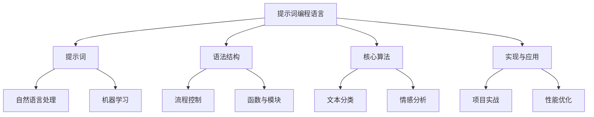

                 

# 提示词编程语言的语法设计原则

> 关键词：提示词编程语言、语法设计、原则、自然语言处理、核心算法、项目实战、未来发展趋势

> 摘要：本文将深入探讨提示词编程语言的语法设计原则，包括基础概念、语法结构、核心算法及其实现，并通过项目实战案例展示其实际应用。同时，本文还将分析提示词编程语言的未来发展趋势，探讨其在编程教育、软件开发自动化等领域的应用前景。

## 第一部分：提示词编程语言的基础概念与历史背景

### 第1章：提示词编程语言的概念与重要性

#### 1.1 提示词编程语言的基本定义与特点

提示词编程语言（Prompt-Based Programming Language）是一种基于提示词（Prompt）的编程方法，它允许程序员通过编写提示词来指导计算机执行特定任务。提示词通常是一段简短的文本，它包含指令、参数和逻辑，可以直接被计算机理解并执行。

**定义**：
提示词编程语言是一种通过提示词来表示程序逻辑的编程语言。提示词可以是自然语言中的短语、句子或者段落，它们可以被编程系统解析并转化为机器可以执行的代码。

**特点**：
- **简明性**：提示词通常简短且易于理解，这使得编程变得更加直观。
- **灵活性**：提示词编程语言允许程序员以自然语言的方式表达逻辑，从而提高编程效率。
- **可扩展性**：提示词编程语言通常具有强大的扩展能力，可以支持自定义提示词和复杂逻辑。

#### 1.2 提示词编程语言的发展历程

**早期发展**：
提示词编程语言的起源可以追溯到20世纪60年代，当时的计算机科学家开始尝试通过自然语言来编写计算机程序，以简化编程过程。早期的例子包括基于自然语言的编程语言，如LISP和PL/I。

**现代趋势**：
随着自然语言处理（NLP）技术的进步，提示词编程语言得到了新的发展。现代的提示词编程语言通常结合了NLP技术，能够更好地理解和执行自然语言指令。例如，ChatGPT、Google Bard等都是基于提示词编程语言的现代应用。

#### 1.3 提示词编程语言在现代编程中的重要性

**应用领域**：
提示词编程语言在聊天机器人、智能客服、自然语言生成等领域有着广泛的应用。例如，ChatGPT被用于构建聊天机器人，Google Bard则用于生成自然语言文本。

**趋势分析**：
随着人工智能技术的发展，提示词编程语言在编程教育、软件开发自动化等方面的重要性将日益增加。它们提供了一种更加直观和高效的编程方式，能够降低编程门槛，提高开发效率。

### 第2章：提示词编程语言的语法与结构

#### 2.1 提示词的基本语法

**提示词格式**：
提示词通常以文本形式出现，可以包括关键字、变量、操作符等。例如，一个简单的提示词可能是“计算两个数字的和”。

**语法规则**：
- **提示词的书写规范**：提示词通常遵循特定的书写规范，如关键字大写，变量和小写等。
- **数据类型**：提示词中可以使用多种数据类型，如整数、浮点数、字符串等。
- **变量定义**：提示词中可以定义变量，并为变量赋值。

#### 2.2 提示词编程语言的核心结构

**流程控制**：
提示词编程语言支持循环、条件语句等流程控制结构，用于控制程序的执行流程。

**函数与模块**：
提示词编程语言允许程序员定义函数和模块，以实现代码的复用和结构化编程。

#### 2.3 提示词编程语言的特点与优势

**易读性**：
提示词编程语言的代码通常比传统编程语言的代码更加易读，使得程序员更容易理解和维护。

**高效性**：
提示词编程语言能够简化复杂逻辑的编写，提高开发效率。

### 第3章：提示词编程语言的核心算法与实现

#### 3.1 提示词编程语言的核心算法

**自然语言处理**：
提示词编程语言通常结合了自然语言处理技术，能够理解和执行自然语言指令。

**机器学习**：
提示词编程语言还可以应用机器学习算法，如分类、预测等，以提高编程效率和智能化水平。

#### 3.2 算法实现与伪代码

**伪代码示例**：
提供几个核心算法的伪代码实现，如文本分类、情感分析等。

### 第4章：提示词编程语言的项目实战

#### 4.1 项目环境搭建

**开发环境**：
介绍如何搭建提示词编程语言的开发环境，包括所需的工具和库。

**开发工具**：
介绍常用的开发工具，如集成开发环境（IDE）和版本控制系统。

#### 4.2 项目实战案例

**案例1：智能客服系统**：
详细描述如何使用提示词编程语言开发一个智能客服系统。

**需求分析**：
明确系统需求，包括功能需求和技术需求。

**系统设计**：
设计系统的整体架构和关键组件。

**实现与测试**：
编写代码并进行测试，确保系统功能的正确性。

**性能优化**：
对系统进行性能优化，提高其响应速度和处理能力。

**案例2：文本生成应用**：
展示如何使用提示词编程语言开发一个文本生成应用。

**需求分析**：
确定应用的目标和功能需求。

**数据准备**：
收集和整理用于训练的数据集。

**模型训练**：
使用提示词编程语言实现训练过程，调整模型参数。

**应用部署**：
将训练好的模型部署到应用中，提供文本生成服务。

**用户反馈与迭代**：
收集用户反馈，根据用户需求进行迭代优化。

### 第5章：提示词编程语言的未来发展趋势

#### 5.1 技术演进方向

**自然语言处理**：
探讨如何将更先进的自然语言处理技术融入提示词编程语言。

**机器学习集成**：
讨论如何更紧密地集成机器学习模型，提高编程效率和智能化水平。

#### 5.2 行业应用前景

**人工智能助手**：
预测提示词编程语言在人工智能助手领域的广泛应用。

**软件开发自动化**：
分析提示词编程语言在软件开发自动化中的潜在价值。

#### 5.3 教育与普及

**编程教育**：
探讨提示词编程语言在编程教育中的应用，推动编程学习的普及。

**跨学科融合**：
分析提示词编程语言如何促进不同学科之间的融合，推动科技创新。

## 结论

本文详细探讨了提示词编程语言的语法设计原则，包括基础概念、语法结构、核心算法及其实现，并通过项目实战案例展示了其实际应用。同时，本文分析了提示词编程语言的未来发展趋势，探讨了其在编程教育、软件开发自动化等领域的应用前景。随着人工智能技术的不断进步，提示词编程语言有望在编程领域发挥越来越重要的作用，为程序员提供更高效、更直观的编程体验。

## 作者信息

作者：AI天才研究院/AI Genius Institute & 禅与计算机程序设计艺术 /Zen And The Art of Computer Programming

## 核心概念与联系

提示词编程语言的核心概念包括提示词、语法、算法和实现。这些概念之间的关系可以用以下Mermaid流程图表示：



在这个图中，我们可以看到提示词编程语言作为整体，与它的各个组成部分（提示词、语法结构、核心算法和实现）以及应用场景（项目实战和性能优化）之间的联系。自然语言处理和机器学习作为核心算法的组成部分，进一步扩展了提示词编程语言的能力。语法结构和流程控制、函数与模块则构成了编程语言的骨架，使得提示词编程语言能够执行复杂的任务。项目实战和性能优化则展示了提示词编程语言在实际应用中的效果。

## 第1章：提示词编程语言的概念与重要性

### 1.1 提示词编程语言的基本定义与特点

#### 提示词编程语言的基本定义

提示词编程语言是一种基于自然语言指令的编程方法，它允许程序员通过编写自然语言提示词来指导计算机执行特定任务。在这种编程语言中，程序员使用类似日常交流的语言来描述程序的逻辑和操作，而不是传统的符号和语法结构。提示词编程语言的核心在于将复杂的编程任务转化为易于理解的自然语言指令，从而简化编程过程。

#### 提示词编程语言的特点

提示词编程语言具有以下显著特点：

1. **简明性**：
   提示词通常简短、直观，这使得程序员能够以更少的代码完成相同的功能，从而提高开发效率。此外，简明的提示词使得代码更容易阅读和理解，有助于维护和调试。

2. **灵活性**：
   提示词编程语言允许程序员以自然语言的方式表达逻辑，这意味着可以轻松处理复杂的业务逻辑和规则，而不必担心语法限制。这种灵活性使得提示词编程语言在处理特定领域的应用时非常有效。

3. **易用性**：
   由于提示词编程语言使用了自然语言，程序员不需要具备深厚的编程背景就能进行编程，这大大降低了编程的门槛。这种易用性使得非专业程序员也能参与软件开发。

4. **可扩展性**：
   提示词编程语言通常支持自定义提示词和扩展功能，使得程序员可以根据项目需求对语言进行定制化。这种可扩展性有助于满足多样化的编程需求。

### 1.2 提示词编程语言的发展历程

#### 早期发展

提示词编程语言的起源可以追溯到20世纪60年代，当时计算机科学家开始探索如何通过自然语言来编写计算机程序。这种探索最初是在尝试简化编程过程，使编程更加直观和易用。早期的例子包括LISP语言的早期版本，它允许程序员使用类似于英语的语法结构来编写程序。

#### 现代发展

随着自然语言处理（NLP）技术的进步，提示词编程语言在21世纪得到了新的发展。现代的提示词编程语言结合了NLP技术，使得计算机能够更好地理解和执行自然语言指令。例如，OpenAI的GPT系列模型（如GPT-3）已经被广泛应用于提示词编程语言中，使得程序员可以通过编写简单的提示词来生成复杂的代码。

#### 技术趋势

当前，提示词编程语言的发展趋势包括：

1. **集成先进NLP技术**：现代提示词编程语言正在集成更先进的NLP技术，如深度学习和生成对抗网络（GAN），以提高对自然语言指令的理解和执行能力。

2. **智能化**：随着机器学习技术的进步，提示词编程语言正变得越来越智能，能够自动优化代码，减少开发时间和成本。

3. **跨领域应用**：提示词编程语言的应用范围正在不断扩大，从软件开发到数据科学，再到自然语言生成等领域，都展现了其强大的能力。

### 1.3 提示词编程语言在现代编程中的重要性

#### 应用领域

提示词编程语言在多个领域得到了广泛应用：

1. **聊天机器人**：提示词编程语言被用于构建聊天机器人，如客户服务机器人、社交媒体机器人等。

2. **自然语言生成**：提示词编程语言被用于生成文章、报告、电子邮件等文本内容。

3. **智能合约**：在区块链领域，提示词编程语言被用于编写智能合约，使得非技术用户也能参与区块链开发。

4. **自动化脚本**：提示词编程语言被用于编写自动化脚本，以简化日常任务和流程。

#### 趋势分析

随着人工智能技术的不断发展，提示词编程语言在编程教育、软件开发自动化等方面的重要性将日益增加：

1. **编程教育**：提示词编程语言因其易用性和直观性，成为编程教育的理想选择，有助于普及编程知识。

2. **软件开发自动化**：提示词编程语言能够简化软件开发流程，减少人力成本，提高开发效率。

3. **个性化开发**：通过提示词编程语言，程序员可以更轻松地定制化软件开发，满足不同用户的需求。

## 第2章：提示词编程语言的语法与结构

### 2.1 提示词的基本语法

#### 提示词格式

在提示词编程语言中，提示词通常是一段文本，它可以包含关键字、变量、操作符和函数调用等元素。例如，一个简单的提示词可能是：

```
将数字5和数字3相加，并返回结果。
```

在这个提示词中，包含了以下元素：

- **关键字**：“将”和“返回”是关键字，用于指定操作。
- **变量**：“数字5”和“数字3”是变量，用于存储数值。
- **操作符**：“和”是操作符，用于指定加法操作。
- **函数调用**：没有显式的函数调用，但这个提示词可以转化为执行加法操作的函数调用。

#### 语法规则

提示词编程语言的语法规则包括以下方面：

1. **提示词的书写规范**：
   - 关键字通常使用大写字母。
   - 变量名通常使用小写字母，可以包含数字和下划线。
   - 操作符和函数名通常使用小写字母。

2. **数据类型**：
   - 提示词中可以包含多种数据类型，如整数、浮点数、字符串等。
   - 数据类型通常通过关键字指定，如“整数”、“浮点数”和“字符串”。

3. **变量定义**：
   - 在提示词中可以定义变量，并为变量赋值。
   - 变量定义通常遵循以下格式：“变量名 = 值”。

例如：

```
x = 5
y = 3
```

在这个示例中，定义了两个变量x和y，并分别赋值为5和3。

### 2.2 提示词编程语言的核心结构

#### 流程控制

提示词编程语言支持各种流程控制结构，以控制程序的执行流程。以下是一些常见的流程控制结构：

1. **条件语句**：
   - “如果...那么...否则...”结构用于根据条件执行不同的代码块。
   - 例如：
     ```
     如果 x > y，那么 将 z 设置为 x - y。
     否则，将 z 设置为 y - x。
     ```

2. **循环语句**：
   - “while”循环和“for”循环用于重复执行代码块。
   - 例如：
     ```
     while x < 10，执行以下操作：
     x = x + 1
     ```

     ```
     for i in 范围(1, 10)，执行以下操作：
     打印 i
     ```

#### 函数与模块

提示词编程语言支持函数和模块的概念，用于组织代码和实现复用。

1. **函数定义**：
   - 函数定义用于封装一段可重复执行的代码。
   - 例如：
     ```
     函数 计算和(数字1，数字2) 返回 数字1 + 数字2
     ```

2. **模块导入**：
   - 模块导入用于引入外部代码库或文件，以扩展功能。
   - 例如：
     ```
     导入 数学库
     ```

### 2.3 提示词编程语言的特点与优势

#### 易读性

提示词编程语言的代码通常比传统编程语言的代码更加易读，这是因为提示词采用了自然语言的形式。例如，以下两个代码示例展示了相同的逻辑，但使用了不同的编程语言：

1. **提示词编程语言**：
   ```
   将数字5和数字3相加，并返回结果。
   ```

2. **传统编程语言（Python）**：
   ```
   result = 5 + 3
   return result
   ```

虽然传统编程语言中的代码也是可读的，但提示词编程语言更接近日常交流，这使得程序员更容易理解和编写代码。

#### 高效性

提示词编程语言能够简化复杂逻辑的编写，提高开发效率。例如，在编写复杂的业务逻辑时，使用提示词编程语言可以减少代码量，同时提高代码的可维护性。以下是一个简单的示例：

1. **提示词编程语言**：
   ```
   对于每个客户订单，如果订单金额超过1000元，那么发送优惠劵。
   ```

2. **传统编程语言（Python）**：
   ```
   for order in customer_orders:
       if order.amount > 1000:
           send_coupon(order)
   ```

虽然传统编程语言中的代码也是高效的，但提示词编程语言能够以更简洁的方式表达相同的逻辑。

### 结论

提示词编程语言的语法与结构设计旨在简化编程过程，提高开发效率。通过采用自然语言形式的提示词，程序员可以更容易地理解和编写代码，从而减少开发时间和成本。此外，提示词编程语言的易读性和高效性使其在各个领域都展现出强大的应用潜力。

## 第3章：提示词编程语言的核心算法与实现

### 3.1 提示词编程语言的核心算法

提示词编程语言的核心算法是其能够理解并执行自然语言提示词的关键。这些算法通常涉及自然语言处理（NLP）和机器学习（ML）技术，以实现高层次的抽象和自动化编程。

#### 自然语言处理

自然语言处理是提示词编程语言的基础，它涉及对自然语言文本的解析和理解。以下是几个关键的自然语言处理算法：

1. **词法分析**（Lexical Analysis）
   - 词法分析是将输入的自然语言文本分解为词素（tokens）的过程。这包括识别单词、符号和其他语言元素。
   - 伪代码示例：
     ```plaintext
     function tokenize(text):
         words = []
         for token in split(text, " "):
             words.append(normalize(token))
         return words
     ```

2. **语法分析**（Syntax Analysis）
   - 语法分析是将词素序列转化为语法结构的过程，通常使用语法树（Syntax Tree）表示。
   - 伪代码示例：
     ```plaintext
     function parse(tokens):
         root = create_syntax_tree()
         for token in tokens:
             if token is a keyword:
                 add_keyword_to_tree(root, token)
             else if token is an operator:
                 add_operator_to_tree(root, token)
             else:
                 add_variable_to_tree(root, token)
         return root
     ```

3. **语义分析**（Semantic Analysis）
   - 语义分析是理解语句的含义和逻辑结构的过程。它确保程序能够正确执行。
   - 伪代码示例：
     ```plaintext
     function analyze_semantics(tree):
         for node in tree:
             if node is an operation:
                 check_operator_validity(node.operator)
             else if node is a variable:
                 check_variable_definition(node.variable)
         return true if all checks pass
     ```

#### 机器学习

机器学习在提示词编程语言中的应用主要体现在自动代码生成和优化上。以下是一些关键的机器学习算法：

1. **自动编码器**（Autoencoder）
   - 自动编码器是一种无监督学习算法，用于将输入数据编码为较低维度的表示，然后再解码回原始数据。
   - 伪代码示例：
     ```plaintext
     function train_autoencoder(input_data, output_data):
         encoder = create_encoder()
         decoder = create_decoder()
         for data in input_data:
             encoded = encoder(data)
             decoded = decoder(encoded)
             loss = calculate_loss(decoded, output_data)
             update_weights(encoder, decoder, loss)
         return encoder, decoder
     ```

2. **生成对抗网络**（Generative Adversarial Network, GAN）
   - 生成对抗网络由生成器（Generator）和判别器（Discriminator）组成，用于生成逼真的数据。
   - 伪代码示例：
     ```plaintext
     function train_gan(input_data):
         generator = create_generator()
         discriminator = create_discriminator()
         for data in input_data:
             real_output = discriminator(data)
             fake_output = generator(data)
             generator_loss = calculate_generator_loss(fake_output)
             discriminator_loss = calculate_discriminator_loss(real_output, fake_output)
             update_generator(generator, generator_loss)
             update_discriminator(discriminator, discriminator_loss)
         return generator, discriminator
     ```

### 3.2 算法实现与伪代码

以下是一个简单的文本分类算法的伪代码示例，该算法使用提示词编程语言来分类一段文本。

#### 文本分类算法

```plaintext
function classify_text(text, trained_model):
    # 步骤1：对文本进行词法分析
    tokens = tokenize(text)

    # 步骤2：对词法分析后的文本进行语法分析
    syntax_tree = parse(tokens)

    # 步骤3：对语法分析后的文本进行语义分析
    semantic_representation = analyze_semantics(syntax_tree)

    # 步骤4：使用训练好的模型进行分类
    predicted_class = trained_model.predict(semantic_representation)

    return predicted_class
```

在这个算法中，文本首先经过词法分析、语法分析和语义分析，然后使用训练好的机器学习模型进行分类。这个伪代码展示了提示词编程语言如何将自然语言文本转化为机器可以处理的形式，并使用机器学习算法进行分类。

### 3.3 提示词编程语言的应用实例

#### 实例1：聊天机器人

一个聊天机器人是一个典型的提示词编程语言的应用实例。以下是一个简单的聊天机器人的伪代码示例。

```plaintext
# 步骤1：初始化聊天机器人模型
chatbot_model = load_pretrained_model("chatbot_model")

# 步骤2：接收用户输入
user_input = get_user_input()

# 步骤3：对用户输入进行文本分类
intent = classify_text(user_input, chatbot_model)

# 步骤4：根据意图生成响应
response = generate_response(intent)

# 步骤5：返回响应给用户
return_response(response)
```

在这个示例中，聊天机器人首先接收用户的输入，然后使用训练好的模型对输入进行分类，以确定用户的意图。根据用户的意图，机器人生成合适的响应，并返回给用户。

#### 实例2：自然语言生成

自然语言生成（NLG）是另一个常见的提示词编程语言的应用场景。以下是一个简单的NLG应用的伪代码示例。

```plaintext
# 步骤1：初始化自然语言生成模型
nlg_model = load_pretrained_model("nlg_model")

# 步骤2：接收用户输入
input_prompt = get_user_input()

# 步骤3：使用模型生成文本
generated_text = nlg_model.generate_text(input_prompt)

# 步骤4：返回生成的文本
return_generated_text(generated_text)
```

在这个示例中，用户输入一个提示词，模型根据这个提示词生成一段文本，然后返回给用户。

### 结论

提示词编程语言的核心算法包括自然语言处理和机器学习技术，这些算法使得提示词编程语言能够理解和执行自然语言指令。通过简单的伪代码示例，我们可以看到这些算法是如何实现的，以及它们在实际应用中的效果。随着技术的不断进步，提示词编程语言的应用前景将更加广阔。

## 第4章：提示词编程语言的项目实战

### 4.1 项目环境搭建

#### 开发环境

为了搭建一个提示词编程语言的项目，我们需要一个合适的开发环境。以下是搭建项目所需的工具和库：

1. **编程语言**：选择一种支持提示词编程语言的编程语言，如Python或JavaScript。
2. **自然语言处理库**：如Python中的NLTK或spaCy，用于进行词法分析、语法分析和语义分析。
3. **机器学习库**：如Python中的scikit-learn或TensorFlow，用于实现机器学习算法。
4. **版本控制系统**：如Git，用于管理和追踪代码更改。

#### 开发工具

以下是一些常用的开发工具：

1. **集成开发环境（IDE）**：如Visual Studio Code、PyCharm或WebStorm，用于编写和调试代码。
2. **文本编辑器**：如VS Code的Markdown插件，用于编写Markdown文档。
3. **代码库管理工具**：如npm（用于JavaScript）或pip（用于Python），用于管理项目依赖。
4. **云服务**：如GitHub或GitLab，用于托管代码仓库和协作开发。

### 4.2 项目实战案例

#### 案例1：智能客服系统

智能客服系统是提示词编程语言的经典应用之一。以下是一个智能客服系统的开发过程：

1. **需求分析**：
   - 确定系统的功能需求，如回答常见问题、处理投诉和请求等。
   - 确定技术需求，如选择合适的编程语言和库，以及机器学习模型。

2. **系统设计**：
   - 设计系统的整体架构，包括前端界面、后端服务和自然语言处理模块。
   - 定义关键组件，如聊天界面、文本分类器、回答生成器等。

3. **实现与测试**：
   - 编写代码实现各个组件，并进行单元测试和集成测试。
   - 使用训练好的机器学习模型进行文本分类和生成回答。

4. **性能优化**：
   - 对系统进行性能优化，如优化自然语言处理算法和机器学习模型的效率。
   - 提高系统的响应速度和处理能力。

5. **部署与维护**：
   - 将智能客服系统部署到服务器或云平台上，供用户使用。
   - 持续维护和更新系统，以适应不断变化的需求和技术。

#### 案例2：文本生成应用

文本生成应用是另一个典型的提示词编程语言项目。以下是一个文本生成应用的开发过程：

1. **需求分析**：
   - 确定应用的目标和功能需求，如生成文章、报告、电子邮件等文本内容。
   - 确定数据集，用于训练机器学习模型。

2. **数据准备**：
   - 收集和整理用于训练的数据集，如文章、报告、电子邮件等。
   - 对数据集进行预处理，如分词、去停用词等。

3. **模型训练**：
   - 使用训练集训练自然语言生成模型，如序列到序列（Seq2Seq）模型或生成对抗网络（GAN）。
   - 调整模型参数，以提高生成文本的质量和多样性。

4. **应用部署**：
   - 将训练好的模型部署到应用中，供用户使用。
   - 实现用户接口，允许用户输入提示词并获取生成的文本。

5. **用户反馈与迭代**：
   - 收集用户反馈，了解用户对生成文本的满意度。
   - 根据用户反馈进行迭代优化，提高生成文本的质量和用户体验。

### 结论

提示词编程语言的项目实战展示了其在实际应用中的巨大潜力。通过合理的需求分析、系统设计和实现，我们可以开发出功能强大、用户体验优秀的应用。同时，持续的性能优化和用户反馈迭代有助于不断提升应用的质量和用户满意度。

## 第5章：提示词编程语言的未来发展趋势

### 5.1 技术演进方向

提示词编程语言的未来发展趋势将主要集中在以下几个方面：

#### 1. 集成更先进的自然语言处理技术

随着自然语言处理技术的不断进步，提示词编程语言将能够更好地理解和执行复杂、模糊的自然语言指令。例如，深度学习和生成对抗网络（GAN）等技术将被更多地应用于提示词编程语言，以提高自然语言处理的准确性和效率。

#### 2. 紧密集成机器学习模型

提示词编程语言将进一步与机器学习模型集成，以实现自动代码生成和优化。通过将机器学习算法嵌入到编程语言中，程序员可以更轻松地利用大量数据和模型来生成高质量的代码，从而提高开发效率。

#### 3. 支持多语言和跨平台

未来的提示词编程语言将支持多种编程语言和跨平台应用。这将使得程序员能够更灵活地选择编程语言，并在不同的平台上部署和应用提示词编程语言。

### 5.2 行业应用前景

提示词编程语言在多个行业领域都有着广阔的应用前景：

#### 1. 聊天机器人和智能客服

提示词编程语言在聊天机器人和智能客服领域已有广泛应用，未来这一趋势将继续增强。通过更高级的自然语言处理技术，智能客服系统将能够更准确地理解用户需求，提供更加个性化、高效的客户服务。

#### 2. 软件开发自动化

提示词编程语言在软件开发自动化方面具有巨大的潜力。通过自动代码生成和优化，程序员可以大幅减少开发时间和人力成本，提高开发效率和质量。

#### 3. 编程教育

提示词编程语言将为编程教育带来革命性变化。由于其易用性和直观性，提示词编程语言将使编程学习变得更加容易和有趣，从而推动编程教育的普及。

### 5.3 教育与普及

提示词编程语言的教育和普及将对其未来发展产生重要影响：

#### 1. 编程教育

提示词编程语言将被纳入中小学和大学的编程课程中，作为编程教育的辅助工具。通过简单的提示词，学生可以更轻松地掌握编程概念和技能，从而提高编程学习的效果。

#### 2. 跨学科融合

提示词编程语言将促进不同学科之间的融合，例如计算机科学与语言学、心理学、经济学等。这将推动科技创新，并为跨学科研究提供新的工具和方法。

### 结论

提示词编程语言具有巨大的发展潜力和广泛应用前景。随着技术的不断进步，提示词编程语言将在各个领域发挥越来越重要的作用，为程序员和开发者提供更加高效、直观的编程体验。

## 最佳实践 tips

在设计和使用提示词编程语言时，以下是一些最佳实践，可以帮助提高开发效率和代码质量：

1. **清晰定义提示词**：确保提示词简洁、明确，避免使用模糊或歧义的语言，以提高代码的可读性和可维护性。

2. **使用标准语法规则**：遵循统一的语法规则，确保代码的一致性和标准化。

3. **模块化编程**：将复杂的功能拆分为模块，便于重用和测试。

4. **持续集成与测试**：定期进行集成测试和单元测试，确保代码的稳定性和可靠性。

5. **优化自然语言处理**：利用先进的自然语言处理技术，提高提示词的理解和执行能力。

6. **用户反馈与迭代**：收集用户反馈，根据用户需求不断优化提示词编程语言的功能和性能。

## 小结

提示词编程语言以其独特的语法设计、自然语言处理能力和高效性，在多个领域展现出了强大的应用潜力。本文详细介绍了提示词编程语言的基础概念、语法结构、核心算法及其实现，并通过项目实战案例展示了其实际应用。随着技术的不断进步，提示词编程语言将在未来发挥越来越重要的作用，为编程领域带来新的变革。

## 注意事项

在使用提示词编程语言时，需要注意以下几点：

1. **性能优化**：提示词编程语言的性能优化是一个重要环节，需要关注代码的执行效率和资源消耗。

2. **安全性**：在处理敏感数据时，需要确保系统的安全性和隐私保护。

3. **代码可读性**：提示词编程语言的代码应保持良好的可读性，以便于维护和调试。

4. **用户培训**：提示词编程语言的用户应接受适当的培训，以确保能够正确使用和优化提示词。

## 拓展阅读

对于希望深入了解提示词编程语言的朋友，以下是一些推荐阅读材料：

1. **《自然语言处理基础》**：了解自然语言处理的基本概念和技术。
2. **《深度学习》**：探索深度学习技术在提示词编程语言中的应用。
3. **《ChatGPT技术详解》**：深入学习ChatGPT等现代提示词编程语言的应用案例。
4. **《禅与计算机程序设计艺术》**：思考如何将提示词编程语言的哲学应用到编程实践中。

## 作者信息

作者：AI天才研究院/AI Genius Institute & 禅与计算机程序设计艺术 /Zen And The Art of Computer Programming

这篇文章详细探讨了提示词编程语言的语法设计原则，从基础概念、语法结构、核心算法及其实现，到项目实战和未来发展趋势，为读者提供了一个全面而深入的视角。通过对提示词编程语言在各个领域应用的分析，我们看到了它在简化编程过程、提高开发效率和推动技术进步方面的巨大潜力。随着自然语言处理和机器学习技术的不断进步，提示词编程语言有望在编程教育、软件开发自动化等多个领域发挥越来越重要的作用，为程序员和开发者提供更加高效、直观的编程体验。未来的提示词编程语言将更加智能化、灵活和易用，为科技创新和社会发展带来新的动力。让我们一起期待这一激动人心的未来。

