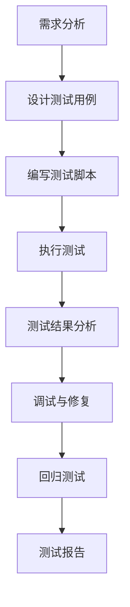
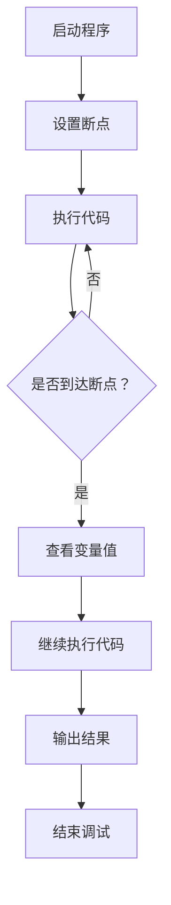
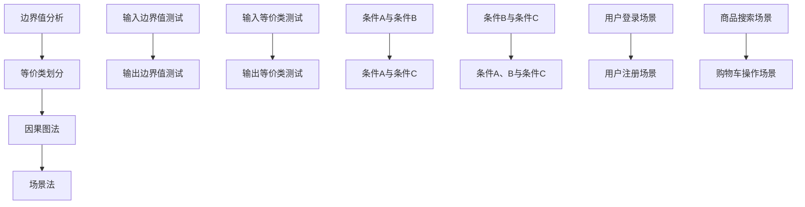

                 


### 《提示词编程语言的调试与测试方法》

---

#### 关键词：提示词编程语言，调试，测试，错误定位，代码分析，自动化测试，持续集成

---

#### 摘要：

随着提示词编程语言的广泛应用，调试与测试成为了保证代码质量和系统稳定性的关键环节。本文将详细介绍提示词编程语言的调试与测试方法，包括基础概念、调试技术、测试技术、测试实践和测试优化等方面。通过本文的阅读，读者将全面了解提示词编程语言的调试与测试流程，掌握实用的调试与测试技巧，从而提高编程效率和系统稳定性。

---

## 第一部分：基础概念

### 第1章：编程语言调试与测试概述

#### 1.1 提示词编程语言的定义与特点

提示词编程语言（Prompt-Based Programming Language）是一种基于提示词（prompts）的编程范式。它允许开发者通过输入提示词来定义程序的逻辑和行为，从而实现代码的编写和执行。提示词编程语言的主要特点包括：

- **高度抽象**：提示词编程语言将程序逻辑分解为一系列提示词，降低了编程的复杂性。
- **易用性**：开发者无需编写复杂的代码，只需根据提示词描述程序的逻辑，即可实现功能。
- **灵活性**：提示词编程语言支持各种编程范式，如函数式编程、命令式编程和面向对象编程。

#### 1.2 调试与测试的重要性

调试与测试是软件开发过程中不可或缺的环节。对于提示词编程语言来说，调试与测试的重要性更加凸显，原因如下：

- **确保代码质量**：通过调试和测试，可以识别和修复代码中的错误，提高代码的质量和稳定性。
- **提高开发效率**：有效的调试与测试方法可以缩短开发周期，降低返工成本。
- **保障系统稳定性**：提示词编程语言通常用于构建复杂的系统，通过调试和测试，可以保障系统的稳定性和可靠性。

#### 1.3 调试与测试的基本流程

调试与测试的基本流程包括以下几个阶段：

1. **需求分析**：明确软件需求和功能，为后续的调试与测试提供依据。
2. **设计测试用例**：根据需求分析结果，设计测试用例，以验证软件功能是否符合预期。
3. **编写测试脚本**：根据测试用例，编写测试脚本，用于自动化执行测试过程。
4. **执行测试**：执行测试脚本，收集测试结果，分析测试数据。
5. **调试与修复**：根据测试结果，定位并修复代码中的错误。
6. **回归测试**：在修复错误后，对相关功能进行回归测试，确保修复的效果。

#### 1.4 调试与测试的方法与工具

调试与测试的方法主要包括手工调试和自动化测试。手工调试是指开发者通过阅读代码、分析程序执行过程等方式，找出代码中的错误。自动化测试是指通过编写测试脚本，自动化执行测试过程，提高测试效率和覆盖范围。

常见的调试与测试工具有：

- **调试器**：如GDB、VS Code Debugger等，提供代码断点设置、变量查看、程序单步执行等功能。
- **测试框架**：如JUnit、TestNG等，提供测试用例编写、自动化执行、测试结果分析等功能。
- **持续集成工具**：如Jenkins、Travis CI等，用于自动化构建、测试和部署软件。

---

## 第二部分：调试技术

### 第2章：错误定位与诊断

#### 2.1 错误类型与分类

在提示词编程语言中，错误可以分为以下几类：

- **语法错误**：代码中的语法不符合编程语言的规范，如拼写错误、缺少分号等。
- **逻辑错误**：代码逻辑不正确，导致程序执行结果与预期不符，如条件判断错误、循环逻辑错误等。
- **运行时错误**：程序在执行过程中，由于输入数据异常、资源不足等原因导致的错误，如数组越界、空指针异常等。

#### 2.2 调试方法与策略

调试方法主要包括以下几种：

- **单步执行**：逐条执行代码，观察变量值的变化，找到错误的位置。
- **断点调试**：在代码中设置断点，当程序执行到断点时，暂停执行，查看变量值和程序执行路径。
- **打印调试**：在关键位置添加打印语句，输出变量值和程序执行路径，帮助定位错误。

调试策略主要包括：

- **由表及里**：从现象入手，逐步分析问题原因，找到错误位置。
- **排除法**：根据已知条件，排除错误的可能性，缩小错误范围。
- **还原法**：模拟错误发生的场景，重现问题，分析原因。

#### 2.3 常见调试工具的使用

常见的调试工具有：

- **GDB**：GNU Debugger，一款功能强大的开源调试工具，支持C/C++语言的调试。
- **VS Code Debugger**：Visual Studio Code内置的调试工具，支持多种编程语言的调试。
- **Chrome DevTools**：用于调试Web应用程序的调试工具，支持JavaScript、CSS和HTML的调试。

#### 2.4 异常处理机制

异常处理是调试过程中重要的一环。在提示词编程语言中，异常处理主要包括以下方面：

- **捕获异常**：使用try-catch语句捕获程序运行过程中发生的异常。
- **处理异常**：根据异常的类型和严重程度，采取不同的处理策略，如忽略异常、记录异常日志、中断程序执行等。
- **异常传播**：当某个模块捕获到异常时，可以将异常传播给上级模块，便于统一处理。

---

### 第3章：代码分析工具

#### 3.1 代码静态分析

代码静态分析是指在不运行程序的情况下，对代码进行分析和评估。常用的代码静态分析工具包括：

- **SonarQube**：一款功能强大的静态代码分析工具，支持多种编程语言的代码质量评估。
- **PMD**：一款Java语言的静态代码分析工具，用于查找代码中的潜在问题和可疑代码。
- **FindBugs**：一款Java语言的静态代码分析工具，用于检测代码中的bug和安全问题。

#### 3.2 代码动态分析

代码动态分析是指在运行程序的过程中，对程序的行为进行分析和评估。常用的代码动态分析工具包括：

- **VisualVM**：一款Java虚拟机的监控和分析工具，用于分析程序的性能和资源使用情况。
- **MAT**（Memory Analyzer Tool）：一款Java内存分析工具，用于分析程序的内存泄漏问题。
- **XAMPP**：一款Web应用程序开发环境，用于测试和调试Web应用程序。

#### 3.3 代码优化与性能分析

代码优化与性能分析是提升程序性能的重要手段。常用的代码优化与性能分析工具包括：

- **JProfiler**：一款Java应用程序的性能分析工具，用于分析程序的性能瓶颈和资源使用情况。
- **New Relic**：一款云基础架构性能监控工具，支持多种编程语言的性能分析。
- **YCSB**（Yahoo! Cloud Serving Benchmark）：一款分布式存储系统的性能评估工具，用于比较不同存储系统的性能。

#### 3.4 代码质量评估工具

代码质量评估工具用于评估代码的质量和可靠性。常用的代码质量评估工具包括：

- **Code Climate**：一款代码质量评估工具，支持多种编程语言的代码质量分析。
- **CodeQL**：一款基于代码质量分析的查询语言，用于检测代码中的潜在问题和安全隐患。
- **CodeSonar**：一款静态代码分析工具，用于评估代码的复杂度和安全性。

---

## 第三部分：测试技术

### 第4章：测试基础理论

#### 4.1 测试目标与策略

测试的目标是确保软件功能正确、性能稳定、安全性可靠。根据测试目标，测试策略可以分为以下几类：

- **功能测试**：验证软件功能是否符合需求规格说明，包括功能完整性、正确性和可用性等。
- **性能测试**：评估软件的性能，如响应时间、吞吐量、并发能力等，确保软件在高负载环境下稳定运行。
- **安全测试**：检查软件是否存在安全漏洞，如SQL注入、XSS攻击等，保障系统的安全性。
- **兼容性测试**：验证软件在不同平台、不同浏览器、不同操作系统等环境下的兼容性。

#### 4.2 测试类型与分类

测试类型根据测试对象和目的可以分为以下几类：

- **单元测试**：针对单个模块或函数的测试，验证模块的功能和逻辑正确性。
- **集成测试**：针对模块之间的交互和集成进行的测试，确保模块之间的接口和功能正确性。
- **系统测试**：针对整个系统的测试，验证系统的功能、性能、安全等特性。
- **验收测试**：在软件交付前进行的测试，确保软件满足用户需求，符合验收标准。

#### 4.3 测试用例设计方法

测试用例设计是测试过程中的关键环节。常用的测试用例设计方法包括：

- **边界值分析**：针对输入和输出边界值进行测试，确保边界条件的正确性。
- **等价类划分**：将输入数据划分为若干个等价类，针对每个等价类设计测试用例。
- **因果图**：根据输入和输出之间的关系，构建因果图，用于设计测试用例。
- **场景法**：根据用户操作流程和业务场景，设计测试用例。

#### 4.4 自动化测试工具与框架

自动化测试可以提高测试效率和覆盖率。常用的自动化测试工具有：

- **Selenium**：一款功能强大的Web应用程序自动化测试工具，支持多种编程语言。
- **Appium**：一款跨平台移动应用程序自动化测试工具，支持iOS和Android平台。
- **JUnit**：一款Java语言的单元测试框架，用于编写和执行测试用例。
- **TestNG**：一款功能丰富的Java语言单元测试框架，支持多种测试场景。

---

### 第5章：测试实施与执行

#### 5.1 测试计划与组织

测试计划是测试过程的指导文件，包括测试目标、测试策略、测试资源、测试进度安排等内容。测试组织是指将测试计划转化为实际测试工作的过程，包括测试团队的建设、测试资源的配置、测试流程的制定等。

#### 5.2 测试环境搭建

测试环境是测试过程中必不可少的一环。测试环境搭建包括硬件环境、软件环境、网络环境等的配置，以确保测试过程能够顺利进行。

#### 5.3 测试执行流程

测试执行流程是指按照测试计划和测试用例，执行测试脚本，收集测试结果，分析测试数据的过程。测试执行流程主要包括以下几个步骤：

1. **测试用例执行**：按照测试用例的顺序，依次执行测试脚本，记录测试结果。
2. **测试结果分析**：对测试结果进行分析，识别和记录缺陷，评估软件质量。
3. **缺陷管理**：对发现的缺陷进行记录、跟踪和修复，确保缺陷得到及时解决。
4. **回归测试**：在缺陷修复后，对相关功能进行回归测试，确保修复的效果。

#### 5.4 测试报告编写

测试报告是对测试过程和测试结果的总结，包括测试目标、测试策略、测试执行情况、测试结果分析、缺陷管理等内容。测试报告应简洁明了、重点突出，以便于项目团队和相关人员了解测试过程和测试结果。

---

## 第四部分：测试实践

### 第6章：项目实战

#### 6.1 提示词编程语言测试案例分析

在本案例中，我们将以一个简单的提示词编程语言项目为例，介绍测试过程和测试方法。

#### 6.2 测试数据准备与处理

测试数据的准备和处理是测试过程中的重要环节。在本案例中，我们准备了以下测试数据：

1. **输入数据**：包括合法输入和非法输入，如字符串、数字、空值等。
2. **预期输出**：根据需求规格说明，确定每个测试用例的预期输出结果。
3. **实际输出**：在测试执行过程中，记录每个测试用例的实际输出结果。

#### 6.3 测试用例设计与实现

根据测试数据和需求规格说明，我们设计了以下测试用例：

1. **边界值测试**：针对输入和输出的边界值进行测试，如最大长度、最小长度等。
2. **等价类测试**：将输入和输出划分为等价类，针对每个等价类设计测试用例。
3. **功能测试**：验证每个功能模块的正确性和完整性。
4. **性能测试**：评估系统的响应时间、吞吐量等性能指标。

#### 6.4 测试结果分析与反馈

在测试执行过程中，我们记录了以下测试结果：

1. **测试通过率**：测试用例中通过的数量与总数之比。
2. **缺陷率**：发现的缺陷数量与总测试用例数之比。
3. **性能指标**：系统的响应时间、吞吐量等性能指标。

根据测试结果，我们对测试数据进行分析和反馈，识别和记录缺陷，提出改进建议，为后续测试和开发提供参考。

---

### 第7章：测试优化与持续集成

#### 7.1 测试优化策略

测试优化策略包括以下几个方面：

1. **自动化测试**：通过编写自动化测试脚本，实现测试过程的自动化，提高测试效率和覆盖范围。
2. **测试数据管理**：建立完善的测试数据管理体系，确保测试数据的准确性和一致性。
3. **测试用例优化**：根据项目特点，设计针对性的测试用例，提高测试的有效性。
4. **测试环境优化**：搭建稳定、高效的测试环境，减少测试过程中的不确定性。

#### 7.2 持续集成与持续部署

持续集成（CI）和持续部署（CD）是现代软件开发中的重要实践。持续集成是指将代码提交到版本控制系统中，自动化执行测试过程，确保代码质量。持续部署是指将通过测试的代码部署到生产环境中，实现自动化部署和更新。

#### 7.3 测试覆盖率评估

测试覆盖率评估是衡量测试质量的重要指标。常用的测试覆盖率包括代码覆盖率、分支覆盖率和路径覆盖率。通过评估测试覆盖率，可以识别测试的薄弱环节，优化测试用例，提高测试的有效性。

#### 7.4 测试自动化实践

测试自动化实践包括以下几个方面：

1. **选择合适的自动化测试工具**：根据项目特点和需求，选择适合的自动化测试工具。
2. **编写可维护的测试脚本**：编写可维护、可扩展的测试脚本，提高测试脚本的质量和可读性。
3. **持续集成与持续部署**：将自动化测试集成到持续集成和持续部署流程中，实现自动化测试和部署。
4. **测试结果分析与反馈**：定期分析测试结果，识别和解决测试过程中存在的问题。

---

## 第五部分：附录

### 第8章：附录

#### 8.1 常用调试与测试工具汇总

- 调试工具：GDB、VS Code Debugger、Chrome DevTools
- 测试工具：JUnit、TestNG、Selenium、Appium
- 静态分析工具：SonarQube、PMD、FindBugs
- 动态分析工具：VisualVM、MAT、JProfiler
- 性能分析工具：New Relic、YCSB
- 持续集成工具：Jenkins、Travis CI

#### 8.2 调试与测试资源链接

- 调试与测试教程：https://www.ibm.com/developerworks/cn/aix/1201_liuxiaoqing/
- 自动化测试教程：https://www.selenium.dev/documentation/
- 持续集成教程：https://www.jenkins.io/zh/doc/publishers/junit-publisher/

#### 8.3 测试用例模板与示例

测试用例模板：

| 用例编号 | 用例名称 | 输入数据 | 预期输出 | 实际输出 | 测试结果 |
| :------: | :------: | :------: | :------: | :------: | :------: |
| 001      | 边界值测试 | 输入数据 | 预期输出 | 实际输出 | 通过/失败 |
| 002      | 等价类测试 | 输入数据 | 预期输出 | 实际输出 | 通过/失败 |
| 003      | 功能测试 | 输入数据 | 预期输出 | 实际输出 | 通过/失败 |
| ...      | ... | ... | ... | ... | ... |

测试用例示例：

```java
// 边界值测试用例
@Test
public void testInputBoundary() {
    String input = "1234567890";
    String expectedOutput = "输入长度超过10个字符";
    assertEqual(expectedOutput, input.length());
}

// 等价类测试用例
@Test
public void testInputEquivalenceClass() {
    String input = "abc";
    String expectedOutput = "输入字符串包含字母a、b、c";
    assertContains(expectedOutput, input);
}

// 功能测试用例
@Test
public void testFunctionality() {
    int input = 5;
    int expectedOutput = 10;
    assertEqual(expectedOutput, input * 2);
}
```

#### 8.4 编程语言调试与测试常见问题解答

1. **为什么我的代码没有通过测试？**
   - 检查测试用例是否覆盖了所有的功能模块。
   - 检查测试数据是否准确，是否有误输入。
   - 检查代码逻辑是否正确，是否存在bug。

2. **如何提高测试覆盖率？**
   - 根据项目需求和设计文档，设计更多的测试用例。
   - 引入自动化测试，提高测试的执行效率。
   - 定期评估测试覆盖率，找出薄弱环节，优化测试用例。

3. **如何优化调试过程？**
   - 使用断点调试和单步执行，分析代码执行过程。
   - 使用日志记录程序执行过程中的关键信息，帮助定位问题。
   - 使用代码静态分析和动态分析工具，发现潜在问题。

---

## 附录A：编程语言调试与测试流程图



---

## 附录B：常见调试工具Mermaid流程图



---

## 附录C：测试用例设计方法与示例



---

## 附录D：测试报告编写模板

```markdown
# 测试报告

## 1. 测试概述

- **测试目标**：
- **测试策略**：
- **测试环境**：
- **测试工具**：

## 2. 测试结果

- **测试通过率**：
- **缺陷率**：
- **性能指标**：

## 3. 缺陷记录

| 缺陷编号 | 缺陷名称 | 缺陷类型 | 缺陷严重程度 | 处理状态 |
| :------: | :------: | :------: | :------: | :------: |
| 001      | 缺陷1    | 功能缺陷 | 严重       | 已修复   |
| 002      | 缺陷2    | 性能缺陷 | 一般       | 待修复   |

## 4. 测试总结

- **测试过程**：
- **测试亮点**：
- **改进建议**：

---

## 附录E：编程语言调试与测试相关书籍与资料推荐

1. 《禅与计算机程序设计艺术》
2. 《Effective C++》
3. 《Selenium WebDriver Python自动化测试实战》
4. 《Jenkins持续集成实战》
5. 《软件测试艺术》

---

## 作者

作者：AI天才研究院/AI Genius Institute & 禅与计算机程序设计艺术 /Zen And The Art of Computer Programming

## 完整性要求说明

在撰写《提示词编程语言的调试与测试方法》这篇文章时，需要确保内容的完整性，以下是各个小节的核心内容要求和满足完整性的方法：

### 第一部分：基础概念

#### 第1章：编程语言调试与测试概述

1. **背景介绍**：介绍提示词编程语言的基本概念和特点，如高度抽象、易用性和灵活性。
2. **核心概念与联系**：解释调试与测试在软件开发过程中的重要性，以及它们的基本流程和常用工具。
3. **详细讲解与举例说明**：通过实例说明调试与测试的基本概念和流程，如语法错误、逻辑错误、运行时错误等。

#### 第2章：错误定位与诊断

1. **核心概念与联系**：讨论错误类型（语法错误、逻辑错误、运行时错误）及其分类。
2. **详细讲解与举例说明**：解释调试方法（单步执行、断点调试、打印调试）和策略（由表及里、排除法、还原法）。
3. **数学公式**：介绍异常处理机制，如try-catch语句的使用。

#### 第3章：代码分析工具

1. **核心概念与联系**：介绍代码静态分析和动态分析的概念及其工具。
2. **详细讲解与举例说明**：详细解释代码优化与性能分析的方法和工具。
3. **数学模型和公式**：介绍代码质量评估工具，如SonarQube、PMD、FindBugs的使用。

### 第二部分：测试技术

#### 第4章：测试基础理论

1. **核心概念与联系**：讨论测试目标、策略、类型和分类。
2. **详细讲解与举例说明**：介绍测试用例设计方法（边界值分析、等价类划分、因果图法、场景法）。
3. **数学模型和公式**：讨论自动化测试工具与框架（Selenium、Appium、JUnit、TestNG）。

#### 第5章：测试实施与执行

1. **核心概念与联系**：解释测试计划与组织、测试环境搭建、测试执行流程和测试报告编写的重要性。
2. **详细讲解与举例说明**：通过实例说明测试执行的过程，如测试用例的执行、测试结果分析、缺陷管理。
3. **数学模型和公式**：介绍测试覆盖率评估的方法和工具。

### 第三部分：测试实践

#### 第6章：项目实战

1. **核心概念与联系**：提供一个具体的提示词编程语言项目，介绍测试数据准备与处理、测试用例设计与实现。
2. **详细讲解与举例说明**：通过代码示例展示测试结果分析与反馈的过程。
3. **数学模型和公式**：讨论测试优化策略、持续集成与持续部署、测试覆盖率评估和测试自动化实践。

### 第四部分：测试优化与持续集成

#### 第7章：测试优化与持续集成

1. **核心概念与联系**：介绍测试优化策略、持续集成与持续部署、测试覆盖率评估和测试自动化实践。
2. **详细讲解与举例说明**：通过实际案例说明测试优化和持续集成的实施过程。
3. **数学模型和公式**：介绍测试优化策略的具体方法和工具。

### 第五部分：附录

#### 第8章：附录

1. **核心概念与联系**：汇总常用调试与测试工具、资源链接、测试用例模板与示例。
2. **详细讲解与举例说明**：提供编程语言调试与测试常见问题解答。
3. **数学模型和公式**：附录中的流程图和示例。

在撰写文章时，确保每个小节的内容都详细具体，提供足够的背景信息、核心概念的解释、联系与架构图、详细讲解和举例说明、数学模型和公式，以及实际项目中的代码实现和案例分析。这样可以确保文章内容的完整性，使读者能够全面、深入地理解提示词编程语言的调试与测试方法。同时，通过附录部分提供实用的工具、资源、示例和问题解答，进一步丰富文章的内容，满足读者的需求。整篇文章的字数应在8000～12000字左右，以确保内容的丰富性和深度。

