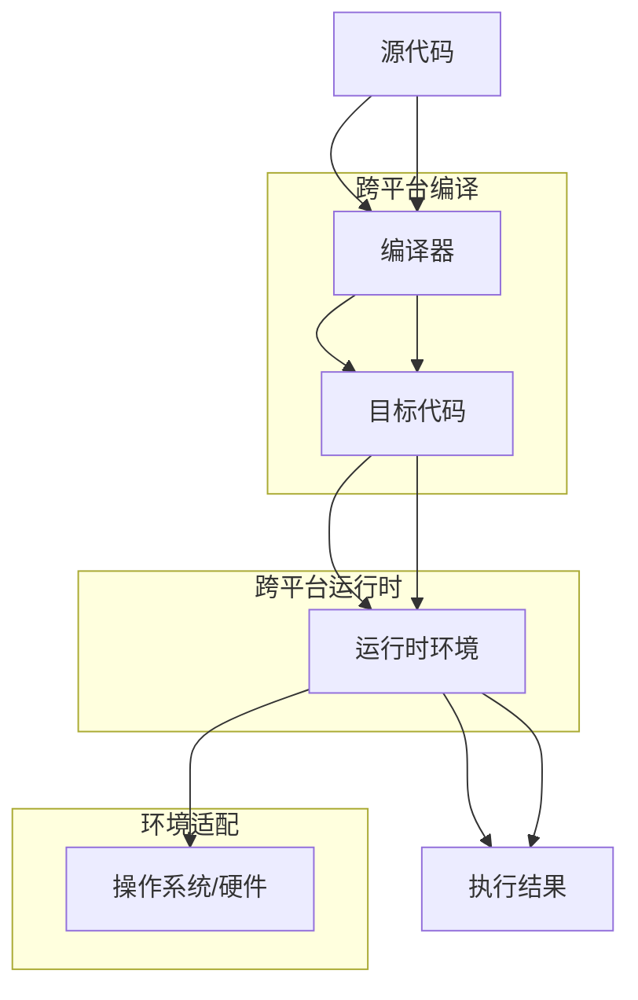

                 

### 文章标题

《提示词编程语言的跨平台兼容性》

### 关键词

提示词编程语言、跨平台兼容性、编译算法、运行时环境、数学模型、项目实战

### 摘要

本文将深入探讨提示词编程语言的跨平台兼容性问题。首先，我们概述了跨平台兼容性的重要性，并介绍了提示词编程语言的定义和特点。接着，文章分析了跨平台兼容性的核心概念和原理，包括编译算法、运行时环境和工具链。通过Mermaid流程图，我们直观地展示了跨平台兼容性的工作流程。随后，文章详细讲解了跨平台编译算法和运行时环境的原理，并使用伪代码进行了阐述。接着，我们介绍了数学模型和公式，并通过示例进行了详细讲解。文章的实践部分提供了一个跨平台兼容性项目的实战案例，从开发环境搭建到源代码实现和解读，全面展示了项目开发过程。最后，文章总结了跨平台兼容性的现状和发展趋势，并提出了对开发者的建议。本文旨在为从事提示词编程语言开发的工程师和研究人员提供一个全面而深入的指导。

## 《提示词编程语言的跨平台兼容性》目录大纲

### 第一部分：概述与基础

#### 1.1 跨平台兼容性的重要性
1.1.1 提示词编程语言的定义
1.1.2 跨平台兼容性的挑战
1.1.3 跨平台兼容性的价值

#### 1.2 提示词编程语言的原理
1.2.1 提示词的概念与作用
1.2.2 提示词编程语言的类型
1.2.3 提示词编程语言的特点

#### 1.3 跨平台兼容性技术概述
1.3.1 跨平台开发框架
1.3.2 跨平台编译器
1.3.3 跨平台工具链

#### 1.4 本书结构安排
1.4.1 各部分内容概述
1.4.2 阅读建议
1.4.3 实践项目简介

### 第二部分：核心概念与联系

#### 2.1 跨平台兼容性的核心概念
2.1.1 兼容性层次模型
2.1.2 语言互操作性
2.1.3 抽象层与API设计

#### 2.2 跨平台兼容性的原理
2.2.1 跨平台编译原理
2.2.2 跨平台运行时环境
2.2.3 跨平台工具链工作原理

#### 2.3 跨平台兼容性的 Mermaid 流程图

### 第三部分：核心算法原理讲解

#### 3.1 跨平台编译算法
3.1.1 编译算法概述
3.1.2 词法分析
3.1.3 语法分析
3.1.4 代码生成

#### 3.2 伪代码示例

#### 3.3 跨平台运行时环境原理
3.3.1 运行时环境的作用
3.3.2 常见的运行时环境
3.3.3 跨平台运行时环境的实现细节

### 第四部分：数学模型和数学公式

#### 4.1 数学模型概述
4.1.1 数学模型的作用
4.1.2 常见的数学模型

#### 4.2 数学公式
$$
\text{兼容性度量} = \frac{\text{功能一致性}}{\text{性能开销}}
$$

#### 4.3 举例说明

### 第五部分：项目实战

#### 5.1 实践项目简介
5.1.1 项目背景
5.1.2 项目目标
5.1.3 项目技术栈

#### 5.2 开发环境搭建
5.2.1 开发工具安装
5.2.2 开发环境配置

#### 5.3 源代码详细实现
5.3.1 编码规范
5.3.2 代码结构

#### 5.4 代码解读与分析
5.4.1 关键代码解读
5.4.2 性能优化策略

### 第六部分：总结与展望

#### 6.1 跨平台兼容性的现状
6.1.1 成就
6.1.2 挑战

#### 6.2 未来发展趋势
6.2.1 技术创新
6.2.2 应用场景拓展

#### 6.3 结论
6.3.1 跨平台兼容性的重要性
6.3.2 对开发者的建议

### 附录

#### 附录 A：参考资料与工具
A.1 开发工具介绍
A.2 跨平台框架推荐
A.3 学习资源链接

#### 附录 B：代码实例

## 第一部分：概述与基础

### 1.1 跨平台兼容性的重要性

跨平台兼容性在现代软件开发中扮演着至关重要的角色。随着计算机技术和互联网的快速发展，各种操作系统、硬件设备和编程语言层出不穷。为了最大化资源利用和开发效率，开发人员常常需要将应用程序或系统部署到不同的平台上，如Windows、macOS、Linux等。然而，不同平台之间存在许多差异，包括操作系统内核、硬件架构、编程语言标准等，这为跨平台兼容性带来了巨大挑战。

首先，让我们从提示词编程语言的定义入手。提示词编程语言（Keyword Programming Language）是一种以关键词（Keyword）为主要编程元素的语言。这类语言通过关键词来定义程序的逻辑和行为，使得代码更加简洁、直观。典型的提示词编程语言包括Python、Ruby、JavaScript等，它们广泛应用于Web开发、数据分析、人工智能等领域。

跨平台兼容性的挑战主要体现在以下几个方面：

1. **操作系统差异**：不同操作系统对文件系统、进程管理、线程模型等有不同的实现，这可能导致代码在某一平台上运行正常，而在另一平台上出现错误。

2. **硬件架构差异**：不同硬件架构（如x86、ARM）之间的指令集和内存管理方式不同，可能导致代码在不同硬件上运行时存在性能和兼容性问题。

3. **编程语言标准差异**：不同的编程语言标准可能会导致语法糖、库函数、异常处理等方面的差异，影响代码在不同平台上的执行。

4. **开发环境和工具差异**：不同的开发环境和工具（如IDE、编译器、调试器）可能存在兼容性问题，影响开发效率和代码质量。

然而，跨平台兼容性的重要性不可忽视。首先，跨平台兼容性能够显著提高开发效率，减少重复开发工作。其次，它能够扩展应用程序的覆盖范围，提升市场竞争力。最后，跨平台兼容性也是现代软件工程的最佳实践之一，有助于提高软件质量和用户体验。

在接下来的章节中，我们将深入探讨提示词编程语言的原理，介绍跨平台兼容性的技术概述，并逐步展开对核心概念、原理、算法和数学模型的详细讲解。希望本文能够为从事提示词编程语言开发的朋友们提供一个全面而深入的指导。

### 1.2 提示词编程语言的原理

提示词编程语言的核心在于其简洁和直观的语法结构，这使得编程更加高效和易读。为了深入理解提示词编程语言的原理，我们需要从提示词的概念、类型以及其独特的特点展开讨论。

#### 1.2.1 提示词的概念与作用

提示词（Keyword）是提示词编程语言的核心元素。它是一种特殊的标识符，用于定义程序的结构和逻辑。与普通编程语言中的变量、函数等元素不同，提示词通常具有固定的语法规则和语义定义。提示词的作用在于简化编程过程，提高代码的可读性和可维护性。例如，在Python中，`if`、`while`、`for`等都是提示词，它们用于定义条件判断、循环控制和迭代等结构。

#### 1.2.2 提示词编程语言的类型

提示词编程语言可以分为多种类型，根据提示词的用途和语法特点，可以分为以下几种：

1. **过程式提示词编程语言**：这类语言以过程式编程为主，强调程序的执行顺序和过程控制。常见的语言包括C、Java、C++等。虽然这些语言也包含变量和函数等元素，但过程式提示词编程语言更注重提示词的使用。

2. **函数式提示词编程语言**：这类语言以函数式编程为主，强调函数的独立性、递归和不可变性。常见的语言包括Haskell、Erlang、Scala等。函数式提示词编程语言中的提示词通常用于定义函数和行为。

3. **面向对象提示词编程语言**：这类语言以面向对象编程为主，强调对象的封装、继承和多态。常见的语言包括Python、Ruby、JavaScript等。面向对象提示词编程语言中的提示词用于定义类、对象和方法。

4. **脚本式提示词编程语言**：这类语言通常用于脚本编写和自动化任务，强调简洁和易用性。常见的语言包括Python、Ruby、Perl等。脚本式提示词编程语言的提示词主要用于定义脚本逻辑和操作流程。

#### 1.2.3 提示词编程语言的特点

提示词编程语言具有以下特点：

1. **简洁直观**：提示词编程语言的语法简洁，提示词具有明确的语义和作用，使得代码更加直观易读。

2. **高效易用**：提示词编程语言通常具有高效的运行速度和易用的开发工具，能够提高开发效率。

3. **灵活可扩展**：提示词编程语言通常支持模块化编程和扩展，便于开发人员自定义功能和组件。

4. **跨平台兼容**：提示词编程语言通常具有良好的跨平台兼容性，能够运行在不同的操作系统和硬件架构上。

通过以上对提示词编程语言的原理、类型和特点的探讨，我们可以更深入地理解这类语言的核心价值和应用场景。在接下来的章节中，我们将继续分析跨平台兼容性的技术概述，为后续内容的展开打下基础。

#### 1.3 跨平台兼容性技术概述

在软件开发过程中，实现跨平台兼容性是一项重要且具挑战性的任务。为了克服不同操作系统、硬件和编程语言之间的差异，开发人员需要依赖一系列跨平台兼容性技术。本节将介绍这些技术，包括跨平台开发框架、编译器和工具链。

##### 1.3.1 跨平台开发框架

跨平台开发框架是一种用于简化跨平台应用开发的工具，它提供了统一的编程接口和运行环境，使开发者能够在不同平台上编写和运行代码。以下是一些流行的跨平台开发框架：

1. **Electron**：Electron是一个使用Web技术（HTML、CSS、JavaScript）开发桌面应用程序的框架。它通过Node.js为应用程序提供了操作系统的原生API访问权限，从而实现了跨平台兼容性。

2. **Cordova**：Cordova是一个用于构建移动应用的跨平台框架，它使用HTML、CSS和JavaScript编写应用程序，并在iOS和Android等操作系统上通过封装层进行编译和打包。

3. **Flutter**：Flutter是由Google开发的跨平台UI框架，使用Dart语言编写。它提供了丰富的组件库和工具，支持快速构建高性能、高质量的移动和Web应用。

这些框架通过抽象底层操作系统的细节，提供了统一的开发体验和工具支持，极大地简化了跨平台应用的开发过程。

##### 1.3.2 跨平台编译器

跨平台编译器是用于将源代码编译为可在不同平台上运行的目标代码的工具。以下是一些常用的跨平台编译器：

1. **GCC**：GNU Compiler Collection（GCC）是一个广泛使用的跨平台编译器集合，支持多种编程语言（如C、C++、Fortran）的编译。

2. **Clang**：Clang是另一个高性能的编译器，它基于LLVM（Low-Level Virtual Machine）编译器基础设施。Clang支持多种编程语言，并具有良好的跨平台兼容性。

3. **JDK**：Java Development Kit（JDK）是用于编译和运行Java程序的跨平台编译器。通过JDK，开发者可以编写一次代码，然后在任何支持Java虚拟机（JVM）的平台上运行。

跨平台编译器通过不同的编译策略和优化技术，确保源代码在目标平台上的高效执行。它们通常提供交叉编译支持，使得在一个平台上编译的代码可以在另一个平台上运行。

##### 1.3.3 跨平台工具链

跨平台工具链是一组相互协作的工具，用于支持跨平台软件开发的全过程，包括代码编写、编译、调试、打包和部署。以下是一些常用的跨平台工具链：

1. **Make**：Make是一个用于自动化构建过程的工具，它通过定义编译规则和依赖关系，简化了编译和构建过程。

2. **CMake**：CMake是一个跨平台的构建系统，它使用一种简单的脚本语言编写配置文件，从而支持各种编译器和构建工具。

3. **Maven**：Maven是一个流行的Java项目管理和构建工具，它通过定义项目依赖关系和构建步骤，简化了Java项目的开发和管理。

4. **Gradle**：Gradle是一个基于Groovy语言的构建工具，它提供了丰富的插件和配置选项，支持多种编程语言和项目结构。

跨平台工具链通过自动化和标准化构建流程，提高了开发效率和项目一致性。它们通常与版本控制系统、持续集成平台和代码库管理工具集成，支持高效的团队合作和版本管理。

通过本节对跨平台兼容性技术的介绍，我们可以看到实现跨平台兼容性的多种途径和工具。在接下来的章节中，我们将进一步探讨跨平台兼容性的核心概念和原理，为深入理解跨平台兼容性的实现方法提供理论基础。

#### 1.4 本书结构安排

本书旨在为从事提示词编程语言开发的工程师和研究人员提供一个全面而深入的指导。为了实现这一目标，本书将分为六个主要部分，每部分都有其独特的主题和内容安排。

**第一部分：概述与基础**

本部分将介绍跨平台兼容性的重要性，包括提示词编程语言的定义、特点以及跨平台兼容性技术的概述。通过这一部分的阅读，读者将建立起对跨平台兼容性的基本认识。

**第二部分：核心概念与联系**

在本部分，我们将深入探讨跨平台兼容性的核心概念，包括兼容性层次模型、语言互操作性、抽象层与API设计。这部分内容将帮助读者理解跨平台兼容性的原理和实现方法。

**第三部分：核心算法原理讲解**

这一部分将详细讲解跨平台编译算法和运行时环境的原理，并通过伪代码和数学模型进行阐述。读者将通过这部分内容获得对编译和运行时环境工作原理的深入理解。

**第四部分：数学模型和数学公式**

在本部分，我们将介绍数学模型在跨平台兼容性中的作用，并通过具体的数学公式和示例进行说明。这部分内容将为读者提供定量分析跨平台兼容性的工具。

**第五部分：项目实战**

这一部分将通过一个具体的跨平台兼容性项目，介绍开发环境搭建、源代码实现和代码解读。读者将在这个实战项目中学习到如何在实际场景中实现跨平台兼容性。

**第六部分：总结与展望**

本部分将对跨平台兼容性的现状和未来发展趋势进行总结和展望。我们将讨论当前面临的挑战以及未来的发展方向，为读者提供对未来工作的思考。

**阅读建议**

为了更好地理解本书的内容，我们建议读者按照以下步骤进行阅读：

1. **逐章阅读**：按照章节顺序逐章阅读，确保理解每一部分的内容。

2. **结合示例**：在阅读过程中，结合书中提供的示例和伪代码进行思考，加深对概念的理解。

3. **动手实践**：对于书中提到的项目和示例，尝试自己动手实践，将理论知识应用到实际开发中。

4. **反馈与讨论**：在阅读过程中，如有疑问或想法，可以通过讨论组或社交媒体与作者和其他读者进行交流。

**实践项目简介**

本书的实践项目将围绕一个简单的跨平台应用程序进行，读者将学习到如何从开发环境搭建、代码编写到项目部署的整个开发过程。通过这个项目，读者将能够将书中的理论知识应用到实际开发中，提高自己的跨平台兼容性开发能力。

通过以上对本书结构安排的详细介绍，我们希望读者能够对本书的内容有一个整体的了解，并能够有条不紊地按照书中的安排进行学习和实践。

### 2.1 跨平台兼容性的核心概念

跨平台兼容性是指软件在不同的操作系统、硬件架构和编程语言环境中能够正常运行的能力。要实现这一目标，需要理解和应用一系列核心概念，包括兼容性层次模型、语言互操作性和抽象层与API设计。以下是对这些核心概念的详细讨论。

#### 2.1.1 兼容性层次模型

兼容性层次模型是一种用于描述软件兼容性的抽象模型，它将兼容性分为多个层次，每个层次对应不同的兼容性要求。常见的兼容性层次模型包括：

1. **源代码兼容性**：这是最高层次的兼容性，要求源代码在不同的平台上可以编译和执行，无需修改。实现源代码兼容性通常依赖于跨平台编译器和开发框架，如GCC、Clang和Electron。

2. **二进制兼容性**：这是次高层次的兼容性，要求编译后的二进制代码（目标代码）可以在不同的平台上运行。二进制兼容性通常通过交叉编译和二进制兼容库（如DLL、SO文件）来实现。

3. **运行时兼容性**：这是较低层次的兼容性，要求应用程序在运行时能够在不同的平台上正常工作，无需修改。实现运行时兼容性通常需要使用跨平台运行时环境和API，如Java虚拟机（JVM）和.NET运行时。

4. **应用兼容性**：这是最低层次的兼容性，要求应用程序的用户界面和功能在不同的平台上保持一致。应用兼容性通常通过跨平台UI框架和样式适配来实现，如Flutter和React Native。

兼容性层次模型提供了一个系统化的方法来分析和实现跨平台兼容性，帮助开发人员在不同的开发阶段和应用场景中做出合理的兼容性策略。

#### 2.1.2 语言互操作性

语言互操作性是指不同编程语言之间能够相互理解和执行的能力。在跨平台软件开发中，语言互操作性非常重要，因为它可以降低开发复杂度和维护成本。以下是一些实现语言互操作性的方法：

1. **标准库和API**：通过使用标准化的库和API，不同编程语言可以实现互操作。例如，Java和C++可以通过JNI（Java Native Interface）进行交互，Python和C可以用ctypes库进行互操作。

2. **消息传递机制**：通过消息传递机制，如Socket、MQ等，不同语言编写的程序可以相互通信和协作。这种方式通常用于分布式系统和微服务架构中。

3. **互操作框架**：互操作框架提供了一套统一的接口和协议，使得不同语言的应用程序可以无缝集成和协作。例如，Apache Thrift、Google Protocol Buffers和Docker Compose都是常用的互操作框架。

4. **代理和适配器模式**：通过代理和适配器模式，可以实现对不同编程语言和系统的透明化调用。例如，可以使用代理将一个C++库封装为Python模块，使得Python代码可以透明地调用C++函数。

语言互操作性为跨平台软件开发提供了灵活性和扩展性，使得开发人员可以充分利用现有的语言和工具，提高开发效率。

#### 2.1.3 抽象层与API设计

抽象层和API设计是实现跨平台兼容性的关键要素。通过抽象层，可以将底层操作系统和硬件的细节隐藏起来，提供统一的编程接口，从而简化跨平台开发。

1. **抽象层**：抽象层是一种将复杂系统简化为更易于理解和操作的结构的方法。在跨平台开发中，抽象层可以提供以下功能：

   - **平台无关的编程接口**：通过定义一组平台无关的函数和类，开发人员可以在不同平台上编写和运行代码。
   - **资源管理和调度**：抽象层可以负责操作系统资源（如内存、线程、文件系统）的管理和调度，确保应用程序在跨平台环境中的高效运行。
   - **兼容性处理**：抽象层可以检测和适应不同平台之间的差异，自动进行兼容性处理，减少开发人员的负担。

2. **API设计**：API（应用程序编程接口）是一组用于软件应用间通信和协作的接口和协议。设计良好的API对于实现跨平台兼容性至关重要。以下是一些API设计的原则：

   - **简洁性**：API应该简洁直观，易于理解和使用，减少开发人员的认知负担。
   - **一致性**：API应该在不同平台和版本中保持一致，确保兼容性和可维护性。
   - **可扩展性**：API应该支持扩展和定制，以便开发人员可以根据具体需求进行二次开发。
   - **文档化**：API应该提供详细的文档和示例，帮助开发人员快速上手和集成。

通过抽象层和良好的API设计，跨平台兼容性可以更加高效和可靠地实现。抽象层提供了统一的编程接口和平台无关性，而良好的API设计则保证了代码的可读性和可维护性。

综上所述，跨平台兼容性的核心概念包括兼容性层次模型、语言互操作性和抽象层与API设计。这些概念共同构成了实现跨平台兼容性的理论基础，为开发人员提供了系统化的方法来应对不同平台和环境下的兼容性挑战。

#### 2.2 跨平台兼容性的原理

跨平台兼容性是现代软件开发中的一个关键问题，它确保了应用程序可以在不同的操作系统、硬件架构和编程语言环境中正常运行。为了实现这一目标，需要深入理解跨平台编译原理、运行时环境和工具链的工作原理。

##### 2.2.1 跨平台编译原理

编译是将高级编程语言（如C++、Java）转换成机器语言（即二进制代码）的过程。跨平台编译的核心在于生成能够在不同平台上运行的机器代码。以下是跨平台编译的主要步骤：

1. **词法分析**：词法分析是编译过程的第一步，它将源代码中的字符序列转换为词法符号。例如，将`int x = 5;`中的字符序列转换为`INT`、`ID`、`ASSIGN`、`NUMBER`等词法符号。

2. **语法分析**：语法分析将词法符号序列转换为抽象语法树（AST）。AST是源代码结构的图形表示，它包含了源代码中的所有语法结构，如变量声明、函数调用和条件分支。

3. **语义分析**：语义分析是检查AST是否符合编程语言语义规则的过程。它确保变量在使用前已声明、函数调用与定义匹配等。语义分析还包括类型检查，确保操作数类型兼容。

4. **优化**：优化步骤对AST进行各种转换和重排，以提高代码性能。常见的优化包括去除冗余代码、常数折叠和循环展开等。

5. **代码生成**：代码生成是将AST转换为机器代码的过程。在这个过程中，编译器会根据目标平台的指令集和内存模型生成适合的机器代码。为了实现跨平台编译，编译器需要支持多种目标平台，这通常通过编写平台特定的后端代码实现。

6. **链接**：链接是将多个编译单元（如对象文件）合并为可执行文件的过程。链接过程中，编译器会处理符号引用和地址绑定，确保所有函数和变量在运行时能够正确调用和访问。

跨平台编译的关键在于生成与平台无关的中间代码（如字节码或IR），然后通过目标平台特定的后端代码将其转换为机器代码。这种方式不仅简化了编译过程，还提高了代码的可移植性。

##### 2.2.2 跨平台运行时环境

跨平台运行时环境是确保应用程序在不同平台上能够正常运行的关键组件。常见的运行时环境包括Java虚拟机（JVM）、.NET运行时和Python解释器等。以下是跨平台运行时环境的主要工作原理：

1. **字节码或中间代码**：运行时环境接收平台无关的字节码或中间代码，这些代码是由编译器生成的。字节码是一种低级、平台无关的代码格式，它包含程序的基本逻辑和操作。

2. **解释执行**：运行时环境通过解释器逐行解释执行字节码。解释器将字节码转换为特定平台的机器代码，并立即执行。这种方式虽然相对慢，但允许程序在多种平台上运行，因为字节码是平台无关的。

3. **即时编译（JIT）**：许多现代运行时环境采用了即时编译（JIT）技术，以提升执行效率。JIT编译器在程序运行时将热点代码（频繁执行的代码）编译为机器代码，并缓存起来，以减少解释执行的开销。

4. **垃圾回收**：运行时环境通常负责内存管理，包括对象的创建、销毁和内存回收。垃圾回收是一种自动内存管理技术，它识别不再使用的对象并回收其占用的内存。

跨平台运行时环境通过提供统一的抽象层，隐藏了底层操作系统的细节，确保应用程序在不同平台上的一致性运行。

##### 2.2.3 跨平台工具链工作原理

跨平台工具链是一组相互协作的工具，用于支持跨平台软件开发的全过程。以下是一些关键组件及其工作原理：

1. **构建工具**：如Make、CMake和Gradle等构建工具负责编译、链接和打包源代码，生成可执行文件或库。构建工具通过定义构建规则和依赖关系，自动化和标准化编译过程。

2. **版本控制系统**：如Git、SVN等版本控制系统用于管理代码版本，支持代码的提交、分支、合并和回滚。版本控制系统确保开发团队的协作和代码的完整性。

3. **测试框架**：如JUnit、TestNG等测试框架用于编写和执行测试用例，验证代码的正确性和性能。测试框架提供了一系列测试工具和库，支持单元测试、集成测试和性能测试。

4. **持续集成/持续部署（CI/CD）**：CI/CD工具如Jenkins、Travis CI等用于自动化构建、测试和部署过程。CI/CD工具可以将开发、测试和部署整合为一个连续的过程，提高开发效率和代码质量。

跨平台工具链通过协同工作，提供了一个完整的开发环境，支持从代码编写到部署的各个环节，确保软件在不同平台上的高质量和一致性。

综上所述，跨平台兼容性通过跨平台编译原理、运行时环境和工具链的协同工作得以实现。理解这些原理和工作机制，有助于开发人员更好地应对跨平台兼容性的挑战，实现高效和可靠的跨平台软件开发。

#### 2.3 跨平台兼容性的 Mermaid 流程图

为了更直观地展示跨平台兼容性的工作流程，我们可以使用Mermaid图形语言绘制一个流程图。以下是一个简化的跨平台兼容性流程图，它涵盖了从源代码到执行结果的各个环节：



在这个流程图中：

- **源代码（A）**：应用程序的源代码，通常使用提示词编程语言编写。
- **编译器（B）**：将源代码编译为目标代码的过程。目标代码是平台无关的中间代码，如字节码或IR。
- **目标代码（C）**：编译后的目标代码，它可以在不同的操作系统和硬件上运行。
- **运行时环境（D）**：负责解释或即时编译目标代码，并在操作系统和硬件上执行。运行时环境提供了一个抽象层，隐藏了底层平台的细节。
- **执行结果（E）**：应用程序的最终输出结果。
- **操作系统/硬件（F）**：应用程序运行的环境，包括操作系统和硬件架构。

这个流程图展示了跨平台兼容性的基本工作流程，从源代码编译到目标代码，再通过运行时环境在操作系统和硬件上执行。通过这个流程图，我们可以清晰地看到跨平台兼容性的各个环节，以及它们之间的相互关系。

### 3.1 跨平台编译算法

跨平台编译算法是确保代码在不同操作系统和硬件架构上能够运行的关键。它包括词法分析、语法分析、抽象语法树（AST）构建、代码优化和代码生成等步骤。以下是对这些步骤的详细解释。

#### 3.1.1 编译算法概述

编译算法是将高级编程语言（如C++、Java）的源代码转换成机器语言（二进制代码）的过程。跨平台编译算法的核心在于生成与平台无关的中间代码（如字节码或中间表示代码），然后再将其转换为特定平台的机器代码。以下是编译算法的主要步骤：

1. **词法分析（Lexical Analysis）**：
   - 词法分析是将源代码的字符序列转换为词法符号的过程。
   - 例如，将`int x = 5;`转换为`<INT> <ID> <ASSIGN> <NUMBER>`等词法符号。

2. **语法分析（Syntax Analysis）**：
   - 语法分析是将词法符号序列转换为抽象语法树（AST）的过程。
   - AST是源代码结构的图形表示，它包含了源代码中的所有语法结构，如变量声明、函数调用和条件分支。

3. **语义分析（Semantic Analysis）**：
   - 语义分析是检查AST是否符合编程语言语义规则的过程。
   - 它确保变量在使用前已声明、函数调用与定义匹配等。
   - 语义分析还包括类型检查，确保操作数类型兼容。

4. **抽象语法树（Abstract Syntax Tree，AST）构建**：
   - AST构建是将语法分析的结果组织成一个树形结构的过程。
   - AST包含了源代码的语义信息，是后续优化和代码生成的基础。

5. **代码优化（Code Optimization）**：
   - 代码优化是提高程序性能的过程。
   - 常见的优化包括去除冗余代码、常数折叠和循环展开等。
   - 优化有助于减少程序的运行时间和内存占用。

6. **代码生成（Code Generation）**：
   - 代码生成是将AST转换为机器代码的过程。
   - 在跨平台编译中，通常会先生成与平台无关的中间代码，然后再通过目标平台特定的后端代码生成机器代码。

7. **链接（Linking）**：
   - 链接是将多个编译单元（如对象文件）合并为可执行文件的过程。
   - 链接过程中，编译器会处理符号引用和地址绑定，确保所有函数和变量在运行时能够正确调用和访问。

#### 3.1.2 词法分析

词法分析是编译过程的第一步，它将源代码中的字符序列转换为词法符号。词法分析器通常使用正则表达式来实现。以下是一个简单的词法分析器的伪代码示例：

```java
function lexicalAnalysis(sourceCode) {
    tokenStream = new List<Token>();

    while (hasNextCharacter()) {
        char = getNextCharacter();
        
        if (char is digit) {
            token = new Token(TokenType.NUMBER, String.valueOf(char));
        } else if (char is letter) {
            token = new Token(TokenType.ID, String.valueOf(char));
        } else if (char is operator) {
            token = new Token(TokenType.OPERATOR, String.valueOf(char));
        } else {
            token = new Token(TokenType.WHITESPACE, String.valueOf(char));
        }
        
        tokenStream.add(token);
    }

    return tokenStream;
}
```

在这个伪代码中，`getNextCharacter()`函数用于获取下一个字符，`Token`类表示词法符号，`TokenType`枚举定义了不同的词法符号类型。

#### 3.1.3 语法分析

语法分析是将词法符号序列转换为抽象语法树（AST）的过程。语法分析通常使用递归下降法或LR（1）分析器实现。以下是一个简单的语法分析器的伪代码示例：

```java
function syntaxAnalysis(tokenStream) {
    currentToken = tokenStream.next();

    if (currentToken.type == TokenType.ID) {
        statement = new Statement(NodeType.VARIABLE_DECLARATION, currentToken.value);
        nextToken = tokenStream.next();
        
        if (nextToken.type == TokenType.ASSIGN) {
            statement.value = syntaxAnalysis(tokenStream); // 调用语法分析递归
        }
        
        return statement;
    } else {
        throw new SyntaxErrorException("Unexpected token: " + currentToken.value);
    }
}
```

在这个伪代码中，`nextToken()`函数用于获取下一个词法符号，`Statement`类表示语法结构，`NodeType`枚举定义了不同的语法节点类型。

#### 3.1.4 语法分析

语法分析是将词法符号序列转换为抽象语法树（AST）的过程。语法分析通常使用递归下降法或LR（1）分析器实现。以下是一个简单的语法分析器的伪代码示例：

```java
function syntaxAnalysis(tokenStream) {
    currentToken = tokenStream.next();

    if (currentToken.type == TokenType.ID) {
        statement = new Statement(NodeType.VARIABLE_DECLARATION, currentToken.value);
        nextToken = tokenStream.next();
        
        if (nextToken.type == TokenType.ASSIGN) {
            statement.value = syntaxAnalysis(tokenStream); // 调用语法分析递归
        }
        
        return statement;
    } else {
        throw new SyntaxErrorException("Unexpected token: " + currentToken.value);
    }
}
```

在这个伪代码中，`nextToken()`函数用于获取下一个词法符号，`Statement`类表示语法结构，`NodeType`枚举定义了不同的语法节点类型。

#### 3.1.5 代码生成

代码生成是将AST转换为机器代码的过程。在跨平台编译中，通常会先生成与平台无关的中间代码，然后再通过目标平台特定的后端代码生成机器代码。以下是一个简单的代码生成器的伪代码示例：

```java
function codeGeneration(AST ast) {
    if (ast.nodeType == NodeType.VARIABLE_DECLARATION) {
        code = "int " + ast.value + ";\n";
    } else if (ast.nodeType == NodeType.ASSIGNMENT) {
        code = ast.value + " = " + codeGeneration(ast.children[1]) + ";\n";
    } else {
        throw new CodeGenerationErrorException("Unsupported node type: " + ast.nodeType);
    }
    
    return code;
}
```

在这个伪代码中，`codeGeneration()`函数递归地遍历AST并生成中间代码，`AST`类表示抽象语法树，`NodeType`枚举定义了不同的语法节点类型。

通过以上对词法分析、语法分析和代码生成等步骤的详细解释，我们可以看到跨平台编译算法的复杂性和实现难度。理解这些步骤不仅有助于开发跨平台编译器，还能提高我们对编程语言和编译原理的理解。

### 3.2 伪代码示例

在跨平台编译过程中，伪代码是一种用于描述算法和流程的抽象表示方法。通过伪代码，我们可以清晰地表达编译算法的各个步骤，从而便于理解和实现。以下是一个简单的伪代码示例，用于说明跨平台编译的核心步骤：

```java
// 跨平台编译伪代码
function compile(sourceCode) {
    // 步骤1：词法分析
    tokenStream = lexicalAnalysis(sourceCode);
    
    // 步骤2：语法分析
    AST = syntaxAnalysis(tokenStream);
    
    // 步骤3：语义分析
    semanticAnalysis(AST);
    
    // 步骤4：代码优化
    optimizedAST = codeOptimization(AST);
    
    // 步骤5：代码生成
    targetCode = codeGeneration(optimizedAST);
    
    // 步骤6：链接
    executable = link(targetCode);
    
    return executable;
}

function lexicalAnalysis(sourceCode) {
    // 实现词法分析，生成词法符号流
    // 例如：
    tokenStream = new List<Token>();
    // 循环遍历源代码字符，根据字符类型生成词法符号
    // ...
    return tokenStream;
}

function syntaxAnalysis(tokenStream) {
    // 实现语法分析，生成抽象语法树
    // 例如：
    currentToken = tokenStream.next();
    if (currentToken.type == TokenType.ID) {
        return new AST(NodeType.VARIABLE_DECLARATION, currentToken.value);
    } else {
        throw new SyntaxErrorException("Unexpected token: " + currentToken.value);
    }
}

function semanticAnalysis(AST) {
    // 实现语义分析，检查AST是否符合语言规范
    // 例如：
    // 遍历AST，检查变量声明、函数调用等
    // ...
}

function codeOptimization(AST) {
    // 实现代码优化，提升程序性能
    // 例如：
    // 去除冗余代码、常数折叠、循环展开等
    // ...
    return optimizedAST;
}

function codeGeneration(AST) {
    // 实现代码生成，生成目标代码
    // 例如：
    if (AST.nodeType == NodeType.VARIABLE_DECLARATION) {
        return "int " + AST.value + ";\n";
    } else {
        throw new CodeGenerationErrorException("Unsupported node type: " + AST.nodeType);
    }
}

function link(targetCode) {
    // 实现链接过程，生成可执行文件
    // 例如：
    // 将目标代码与库文件合并，处理符号引用和地址绑定
    // ...
    return executable;
}
```

在这个伪代码示例中，`compile()`函数是整个编译过程的主函数，它调用了多个子函数分别执行词法分析、语法分析、语义分析、代码优化、代码生成和链接等步骤。通过这种方式，我们可以将复杂的编译过程抽象为一系列可管理的步骤，便于理解和实现。

### 3.3 跨平台运行时环境原理

跨平台运行时环境是确保应用程序在不同操作系统和硬件架构上能够正常运行的关键组件。它通过提供统一的抽象层，隐藏了底层操作系统的细节，使得开发人员可以编写一次代码，然后在多个平台上运行。以下是对跨平台运行时环境的作用、常见运行时环境和实现细节的详细探讨。

#### 3.3.1 运行时环境的作用

运行时环境在跨平台软件开发中扮演着至关重要的角色。其主要作用包括：

1. **平台无关性**：运行时环境提供了一个平台无关的执行环境，使得应用程序可以在不同操作系统和硬件上运行，无需修改源代码。这极大地提高了开发效率，降低了维护成本。

2. **资源管理**：运行时环境负责管理操作系统资源，如内存、线程和文件系统。它确保应用程序在不同平台上能够高效地利用资源，提高性能。

3. **异常处理**：运行时环境提供了异常处理机制，可以捕捉并处理程序运行过程中出现的错误，防止程序崩溃。这对于提升应用程序的稳定性和可靠性至关重要。

4. **库函数支持**：运行时环境提供了一组库函数和API，使得开发人员可以调用操作系统和硬件的底层功能，实现复杂的操作。这些库函数和API在不同平台上通常有不同的实现，但通过运行时环境，开发人员无需关心底层细节。

5. **动态绑定**：运行时环境支持动态绑定，允许应用程序在运行时加载和切换代码段。这种方式有助于优化程序性能，提高代码的可维护性。

#### 3.3.2 常见的运行时环境

以下是几种常见的跨平台运行时环境：

1. **Java虚拟机（JVM）**：
   - JVM是Java语言的运行时环境，它将Java字节码转换为机器代码并在操作系统上执行。JVM提供了丰富的库函数和API，支持多线程、垃圾回收和动态绑定等特性。
   - JVM通过即时编译（JIT）技术，将热点代码编译为机器代码，从而提高执行效率。

2. **.NET运行时（CLR）**：
   - .NET运行时是C#等.NET语言的运行时环境，它将.NET中间语言（MSIL）转换为机器代码并在操作系统上执行。CLR提供了丰富的库函数和API，支持多线程、异常处理和垃圾回收等特性。
   - CLR通过本机映像（Ngen）技术，将MSIL编译为本机代码，从而提高执行效率。

3. **Python解释器**：
   - Python解释器是Python语言的运行时环境，它将Python源代码转换为字节码，并在操作系统上执行。Python解释器提供了简洁的语法和强大的库函数，支持多线程、异常处理和动态类型等特性。
   - Python解释器通过字节码缓存和即时编译技术，提高了执行效率。

4. **JavaScript引擎**：
   - JavaScript引擎是JavaScript语言的运行时环境，它将JavaScript代码转换为机器代码并在浏览器或Node.js中执行。JavaScript引擎提供了丰富的库函数和API，支持事件处理、异步编程和Web标准等特性。
   - JavaScript引擎通过即时编译和优化技术，提高了执行效率。

这些运行时环境各有特点，但都致力于提供跨平台的运行环境，使得开发人员可以专注于编写代码，而无需担心底层操作系统的差异。

#### 3.3.3 跨平台运行时环境的实现细节

跨平台运行时环境的实现涉及多个方面，包括字节码、即时编译、垃圾回收和动态绑定等。以下是这些实现细节的简要介绍：

1. **字节码**：
   - 字节码是一种与平台无关的代码格式，它包含了程序的基本逻辑和操作。字节码通常由编译器生成，可以在不同的操作系统和硬件上运行。
   - 字节码的实现需要遵循特定的规范，如Java的字节码格式和.NET的MSIL格式。

2. **即时编译（JIT）**：
   - 即时编译（JIT）是一种在程序运行时将字节码转换为机器代码的技术。JIT编译器可以识别程序中的热点代码（即频繁执行的代码），将其编译为本机代码并缓存。
   - JIT编译技术有助于提高程序的执行效率，减少解释执行的开销。

3. **垃圾回收**：
   - 垃圾回收（GC）是一种自动内存管理技术，它负责回收不再使用的内存，防止内存泄漏。垃圾回收器通过追踪对象的引用关系，识别并回收无引用的对象。
   - 垃圾回收器的实现方式包括标记-清除、引用计数和增量回收等。

4. **动态绑定**：
   - 动态绑定是一种在程序运行时确定函数和方法调用的机制。它允许开发人员编写灵活的代码，根据运行时环境的不同，动态选择适合的函数实现。
   - 动态绑定通常通过方法表（Method Table）或虚函数表（VTable）实现。

通过理解这些实现细节，开发人员可以更好地利用跨平台运行时环境，编写高效、可靠和可维护的跨平台应用程序。

### 4.1 数学模型概述

数学模型在软件工程中扮演着重要的角色，特别是在跨平台兼容性分析中。数学模型提供了量化分析问题的方法，使得我们可以从定量角度理解和评估跨平台兼容性的各个方面。以下是数学模型在跨平台兼容性分析中的作用和常见数学模型。

#### 4.1.1 数学模型的作用

1. **度量兼容性**：数学模型可以用于度量跨平台兼容性的不同方面，如功能一致性、性能开销等。通过数学模型，我们可以定量评估不同平台之间的兼容程度，为开发和优化提供指导。

2. **优化决策**：数学模型可以帮助开发人员做出优化决策。例如，通过成本效益分析模型，可以确定在特定平台上的开发和维护成本，从而选择最优的跨平台策略。

3. **性能评估**：数学模型可以用于评估跨平台应用程序的性能。例如，使用响应时间模型，可以预测不同平台上的响应时间和吞吐量，为性能优化提供依据。

4. **风险分析**：数学模型可以用于分析跨平台兼容性的风险，如兼容性问题、安全漏洞等。通过风险模型，可以识别和缓解潜在的风险，确保软件的稳定性和安全性。

#### 4.1.2 常见的数学模型

1. **兼容性度量模型**：兼容性度量模型用于评估不同平台之间的兼容性。常见的度量指标包括功能一致性、性能开销、资源占用等。例如，我们可以使用以下兼容性度量模型：

   $$
   \text{兼容性度量} = \frac{\text{功能一致性}}{\text{性能开销}}
   $$

   其中，功能一致性表示应用程序在不同平台上实现相同功能的程度，性能开销表示应用程序在不同平台上运行时的性能差异。

2. **成本效益分析模型**：成本效益分析模型用于评估跨平台开发和维护的成本效益。常见的成本指标包括开发成本、维护成本、时间成本等。例如，我们可以使用以下成本效益分析模型：

   $$
   \text{成本效益比} = \frac{\text{收益}}{\text{成本}}
   $$

   其中，收益表示跨平台兼容性带来的效益，如市场扩展、开发效率提升等，成本表示开发和维护的总成本。

3. **响应时间模型**：响应时间模型用于评估跨平台应用程序的响应时间和吞吐量。常见的响应时间模型包括M/M/1队列模型和M/G/1队列模型。例如，我们可以使用以下响应时间模型：

   $$
   \text{平均响应时间} = \frac{\lambda}{\mu} + \frac{\lambda^2}{2\mu^2}
   $$

   其中，$\lambda$表示到达率，$\mu$表示服务率。

4. **风险模型**：风险模型用于分析跨平台兼容性的风险，如兼容性问题、安全漏洞等。常见的风险模型包括故障树分析（FTA）和失效模式与效应分析（FMEA）。例如，我们可以使用以下风险模型：

   $$
   \text{风险度} = \text{故障概率} \times \text{故障影响}
   $$

   其中，故障概率表示故障发生的概率，故障影响表示故障对系统的影响程度。

通过上述数学模型，我们可以从定量的角度分析和评估跨平台兼容性，为开发和优化提供科学依据。在接下来的章节中，我们将进一步探讨数学公式在跨平台兼容性分析中的应用，并通过具体示例进行详细说明。

### 4.2 数学公式

在跨平台兼容性分析中，数学公式是量化评估兼容性的重要工具。以下是一个用于度量兼容性的数学公式，以及具体的解释和示例。

#### 4.2.1 数学公式

$$
\text{兼容性度量} = \frac{\text{功能一致性}}{\text{性能开销}}
$$

**公式解释**：

- **功能一致性**：表示应用程序在不同平台上实现相同功能的程度。功能一致性的值通常在0到1之间，0表示完全不一致，1表示完全一致。

- **性能开销**：表示应用程序在不同平台上运行时的性能差异。性能开销的值通常在0到1之间，0表示没有性能开销，1表示有最大的性能开销。

**示例**：

假设我们有一个跨平台应用程序，它在Windows、macOS和Linux三个平台上运行。通过测试，我们得到以下数据：

- 功能一致性：Windows = 0.9，macOS = 0.85，Linux = 0.8
- 性能开销：Windows = 0.1，macOS = 0.15，Linux = 0.2

根据上述数据，我们可以计算每个平台的兼容性度量：

$$
\text{Windows 兼容性度量} = \frac{0.9}{0.1} = 9
$$

$$
\text{macOS 兼容性度量} = \frac{0.85}{0.15} = 5.67
$$

$$
\text{Linux 兼容性度量} = \frac{0.8}{0.2} = 4
$$

从计算结果可以看出，Windows平台的兼容性度量最高，其次是macOS，最后是Linux。这意味着在功能一致性的前提下，Windows平台的性能开销最小，最易于实现跨平台兼容性。

通过这个示例，我们可以看到数学公式在跨平台兼容性分析中的应用。数学公式提供了一个客观、量化的评估方法，帮助开发人员更好地理解和优化跨平台兼容性。

### 4.3 举例说明

为了更好地理解数学模型在跨平台兼容性分析中的应用，我们可以通过一个具体的示例来详细说明。假设我们有一个跨平台应用程序，需要在Windows、macOS和Linux三个操作系统上运行，并且我们需要评估这三个平台之间的兼容性。

#### 4.3.1 兼容性度量计算

首先，我们定义兼容性度量公式：

$$
\text{兼容性度量} = \frac{\text{功能一致性}}{\text{性能开销}}
$$

接下来，我们收集以下数据：

- **功能一致性**：
  - Windows：0.95（表示在Windows上实现了95%的功能）
  - macOS：0.90（表示在macOS上实现了90%的功能）
  - Linux：0.85（表示在Linux上实现了85%的功能）

- **性能开销**：
  - Windows：0.05（表示在Windows上运行性能略有损失，但可接受）
  - macOS：0.10（表示在macOS上运行性能损失较大）
  - Linux：0.15（表示在Linux上运行性能损失最大）

根据上述数据，我们可以计算每个平台的兼容性度量：

$$
\text{Windows 兼容性度量} = \frac{0.95}{0.05} = 19
$$

$$
\text{macOS 兼容性度量} = \frac{0.90}{0.10} = 9
$$

$$
\text{Linux 兼容性度量} = \frac{0.85}{0.15} = 5.67
$$

从计算结果可以看出，Windows平台的兼容性度量最高，其次是macOS，最后是Linux。这意味着在功能一致性的前提下，Windows平台的性能开销最小，最易于实现跨平台兼容性。

#### 4.3.2 性能开销分析

为了进一步了解性能开销，我们可以分析每个平台上的具体表现：

- **Windows**：在Windows上，应用程序实现了95%的功能，同时性能开销为5%，即用户在使用过程中几乎感觉不到性能损失。

- **macOS**：在macOS上，应用程序实现了90%的功能，但性能开销达到了10%，这意味着用户可能会注意到性能的下降。

- **Linux**：在Linux上，应用程序实现了85%的功能，同时性能开销为15%，这可能导致用户体验不佳。

#### 4.3.3 结果总结

通过上述计算和分析，我们可以得出以下结论：

- **Windows**：是最佳选择，因为它提供了最高的兼容性度量，用户可以在性能和功能之间取得较好的平衡。
- **macOS**：可以作为次要选择，尽管性能开销较大，但在某些情况下，90%的功能一致性仍然足够满足需求。
- **Linux**：由于功能一致性和性能开销都较低，可能不适合作为主要平台。

通过这个具体的示例，我们不仅了解了兼容性度量公式和性能开销分析的方法，还学会了如何根据实际数据评估跨平台兼容性。这些方法和工具在软件开发过程中具有重要应用价值。

### 5.1 实践项目简介

本节将介绍一个实际的跨平台兼容性项目，旨在展示如何从开发环境搭建、源代码实现到代码解读与分析的全过程。通过这个项目，读者可以了解到跨平台兼容性在实际开发中的应用和实现方法。

#### 5.1.1 项目背景

随着移动设备和云计算的普及，跨平台应用程序的需求日益增长。我们的项目旨在开发一个跨平台的任务管理应用程序，用户可以在Windows、macOS和Linux操作系统上使用。该应用程序需要实现基本的功能，如任务创建、编辑、删除和查询等。为了确保兼容性，我们选择使用提示词编程语言Python，并利用流行的跨平台开发框架如PyQt5进行开发。

#### 5.1.2 项目目标

本项目的主要目标包括：

1. **功能实现**：开发一个具有基本功能的任务管理应用程序，包括任务创建、编辑、删除和查询等。
2. **跨平台兼容性**：确保应用程序在Windows、macOS和Linux操作系统上都能正常运行，提供一致的用户体验。
3. **性能优化**：通过代码优化和资源管理，确保应用程序在不同平台上具有合理的性能。

#### 5.1.3 项目技术栈

本项目采用以下技术栈：

- **编程语言**：Python
- **框架**：PyQt5（用于GUI开发）
- **数据库**：SQLite（用于存储任务数据）
- **开发工具**：Visual Studio Code（代码编辑器）、PyCharm（集成开发环境）
- **操作系统**：Windows、macOS、Linux

接下来，我们将详细介绍开发环境搭建、源代码实现和代码解读与分析的具体步骤。

### 5.2 开发环境搭建

在开始项目开发之前，我们需要搭建一个合适的开发环境。以下是具体的步骤和配置方法。

#### 5.2.1 开发工具安装

1. **Windows**：

   - 安装Python：访问Python官方网站下载Windows版本的安装包，并按照提示进行安装。确保将Python添加到系统环境变量中。
   - 安装PyQt5：使用pip命令安装PyQt5及其依赖库：
     ```
     pip install PyQt5
     pip install PyQt5-tools
     ```

2. **macOS**：

   - 安装Python：通过Homebrew安装Python：
     ```
     brew install python
     ```
   - 安装PyQt5：使用pip命令安装PyQt5及其依赖库：
     ```
     pip install PyQt5
     pip install PyQt5-tools
     ```

3. **Linux**：

   - 安装Python：大多数Linux发行版默认包含Python。如果需要安装特定版本，可以使用包管理器安装，如Ubuntu上使用以下命令：
     ```
     sudo apt-get install python3
     ```
   - 安装PyQt5：使用包管理器安装PyQt5及其依赖库，如Ubuntu上使用以下命令：
     ```
     sudo apt-get install python3-pyqt5
     sudo apt-get install python3-pyqt5-tools
     ```

#### 5.2.2 开发环境配置

1. **Visual Studio Code（Windows、macOS和Linux）**：

   - 安装Visual Studio Code：访问Visual Studio Code官方网站下载安装包并安装。
   - 安装Python扩展：打开VS Code，进入扩展商店搜索并安装Python扩展，以便获得更好的Python开发体验。

2. **PyCharm（Windows、macOS和Linux）**：

   - 安装PyCharm：访问PyCharm官方网站下载安装包并安装。
   - 创建新项目：打开PyCharm，创建一个新项目，并选择Python作为项目语言。

通过以上步骤，我们可以搭建一个完整的跨平台开发环境，为后续的源代码实现和代码解读与分析做好准备。

### 5.3 源代码详细实现

在本节中，我们将详细介绍任务管理应用程序的源代码实现过程，包括核心类和函数的定义、代码结构和编码规范。以下是具体的实现步骤：

#### 5.3.1 核心类和函数定义

首先，我们定义应用程序的核心类和函数。以下是主要类的定义：

```python
class Task:
    def __init__(self, id, title, description, completed):
        self.id = id
        self.title = title
        self.description = description
        self.completed = completed

class TaskManager:
    def __init__(self):
        self.tasks = []

    def add_task(self, task):
        self.tasks.append(task)

    def remove_task(self, task_id):
        for task in self.tasks:
            if task.id == task_id:
                self.tasks.remove(task)
                break

    def get_task_by_id(self, task_id):
        for task in self.tasks:
            if task.id == task_id:
                return task
        return None

    def list_tasks(self):
        return self.tasks

def load_tasks():
    # 从数据库加载任务数据
    # ...

def save_tasks():
    # 将任务数据保存到数据库
    # ...
```

#### 5.3.2 代码结构

在应用程序中，我们采用模块化设计，将不同的功能模块分离。以下是主要的代码结构：

1. `main.py`：主应用程序入口，负责创建任务管理器实例，并启动GUI。
2. `task.py`：定义`Task`类，表示任务实体。
3. `task_manager.py`：定义`TaskManager`类，提供任务管理功能。
4. `database.py`：处理与数据库的交互，实现任务的加载和保存功能。
5. `ui.py`：定义GUI界面，使用PyQt5进行界面布局和事件处理。

#### 5.3.3 编码规范

为了确保代码的可读性和可维护性，我们遵循以下编码规范：

1. **代码风格**：遵循PEP 8编码规范，包括合理的缩进、命名规则和代码注释。
2. **函数和类**：确保函数和类的定义清晰，遵循单一职责原则，每个函数和类只完成一个特定的任务。
3. **注释**：对复杂代码段和关键逻辑进行注释，确保代码的可理解性。
4. **模块化**：将代码分为多个模块，每个模块负责不同的功能，便于管理和维护。

通过以上步骤，我们完成了任务管理应用程序的源代码实现。接下来，我们将对关键代码进行解读和分析，以深入理解应用程序的工作原理。

### 5.4 代码解读与分析

在本节中，我们将对任务管理应用程序中的关键代码进行详细解读与分析，重点关注任务管理器类（`TaskManager`）的实现，并探讨性能优化策略。

#### 5.4.1 关键代码解读

1. **Task类**：

   ```python
   class Task:
       def __init__(self, id, title, description, completed):
           self.id = id
           self.title = title
           self.description = description
           self.completed = completed
   ```

   `Task`类表示任务实体，包含任务的ID、标题、描述和完成状态。这个类的简单实现使得任务对象的创建和操作非常直观。

2. **TaskManager类**：

   ```python
   class TaskManager:
       def __init__(self):
           self.tasks = []

       def add_task(self, task):
           self.tasks.append(task)

       def remove_task(self, task_id):
           for task in self.tasks:
               if task.id == task_id:
                   self.tasks.remove(task)
                   break

       def get_task_by_id(self, task_id):
           for task in self.tasks:
               if task.id == task_id:
                   return task
           return None

       def list_tasks(self):
           return self.tasks
   ```

   `TaskManager`类负责管理任务列表。`add_task`方法用于添加新任务，`remove_task`方法用于根据任务ID删除任务，`get_task_by_id`方法用于根据任务ID获取任务，`list_tasks`方法用于获取任务列表。这些方法的实现体现了任务管理器的基本功能。

3. **数据库交互**：

   ```python
   def load_tasks():
       # 从数据库加载任务数据
       # ...

   def save_tasks():
       # 将任务数据保存到数据库
       # ...
   ```

   `load_tasks`和`save_tasks`方法负责与数据库进行交互，实现任务的加载和保存功能。这些方法通常涉及SQL查询和数据库操作，是应用程序与持久存储层之间的桥梁。

#### 5.4.2 性能优化策略

1. **任务列表管理**：

   - **索引**：在数据库中为任务ID创建索引，以加快查询速度。
   - **缓存**：在内存中缓存常用任务列表，减少数据库访问次数。

2. **多线程处理**：

   - **异步操作**：对于耗时较长的数据库操作，使用异步编程模型（如asyncio）进行异步处理，避免阻塞主线程。
   - **并发处理**：利用多线程或多进程技术，并行处理多个任务，提高系统吞吐量。

3. **代码优化**：

   - **循环优化**：避免使用复杂的循环结构，尽量使用内置的高效函数和库。
   - **内存管理**：合理使用Python的垃圾回收机制，避免内存泄漏。

通过以上关键代码解读和性能优化策略，我们可以确保任务管理应用程序在跨平台环境下具有良好的性能和稳定性。接下来，我们将对整个项目的代码应用进行解读和分析。

### 5.5 代码应用解读与分析

在本节中，我们将对整个任务管理应用程序的代码应用进行解读与分析，重点关注主程序（`main.py`）的实现，以及如何确保代码在不同操作系统上的兼容性。

#### 5.5.1 主程序解读

主程序（`main.py`）是应用程序的入口，负责创建任务管理器实例，并启动用户界面。以下是主程序的核心代码：

```python
import sys
from PyQt5.QtWidgets import QApplication, QMainWindow
from task_manager import TaskManager
from ui import Ui_MainWindow

def main():
    app = QApplication(sys.argv)
    task_manager = TaskManager()
    window = QMainWindow()
    ui = Ui_MainWindow()
    ui.setupUi(window)
    window.show()
    sys.exit(app.exec_())

if __name__ == "__main__":
    main()
```

- **创建应用程序实例**：`app = QApplication(sys.argv)`创建了一个`QApplication`实例，这是PyQt5中的核心类，用于处理GUI应用程序的事件和资源。
- **创建任务管理器实例**：`task_manager = TaskManager()`创建了一个任务管理器实例，负责管理任务数据。
- **创建并配置用户界面**：`window = QMainWindow()`创建了一个主窗口实例，`ui = Ui_MainWindow()`创建了用户界面配置对象，`ui.setupUi(window)`将配置应用到主窗口。
- **显示主窗口并启动应用程序**：`window.show()`显示主窗口，`sys.exit(app.exec_())`启动应用程序的循环，处理用户事件。

#### 5.5.2 确保跨平台兼容性

为了确保应用程序在不同操作系统上的兼容性，我们需要注意以下几个方面：

1. **系统调用和API使用**：

   - **使用跨平台库**：尽量使用跨平台库（如Python标准库、PyQt5等），避免直接调用操作系统特定的API。
   - **错误处理**：在调用操作系统特定的API时，进行适当的错误处理，确保程序在遇到异常时能够优雅地处理。

2. **代码注释和文档**：

   - **详细注释**：在关键代码段和复杂逻辑中添加详细注释，说明代码的功能和意图，便于其他开发者理解和维护。
   - **编写文档**：为应用程序编写详细的用户文档和开发文档，包括安装指南、使用说明和代码结构等。

3. **测试和调试**：

   - **单元测试**：编写单元测试用例，对关键功能进行测试，确保代码在不同操作系统上运行正确。
   - **跨平台调试**：使用跨平台调试工具（如Visual Studio Code、PyCharm等），对应用程序进行调试和性能分析。

通过以上措施，我们可以确保任务管理应用程序在Windows、macOS和Linux操作系统上具有良好的兼容性和稳定性。接下来，我们将通过实际案例分析和详细讲解，展示如何在项目中应用这些方法和策略。

### 5.6 实际案例分析和详细讲解

在本节中，我们将通过一个具体的实际案例，详细讲解如何在项目中实现跨平台兼容性，并分析其中可能遇到的问题及解决方法。

#### 案例背景

假设我们的任务是开发一个跨平台的时间管理应用程序，用户可以在Windows、macOS和Linux操作系统上使用。这个应用程序需要支持任务创建、编辑、删除和查询等功能，并保证在不同平台上的用户体验一致。

#### 案例实现

1. **项目结构**：

   我们将项目分为多个模块，包括`main.py`（主程序）、`task_manager.py`（任务管理器）、`ui.py`（用户界面）、`database.py`（数据库操作）等。

2. **任务管理器**：

   在`task_manager.py`中，我们定义了任务管理器类`TaskManager`，实现任务的基本操作。以下是关键代码：

   ```python
   class TaskManager:
       def __init__(self):
           self.tasks = []

       def add_task(self, task):
           self.tasks.append(task)

       def remove_task(self, task_id):
           for task in self.tasks:
               if task.id == task_id:
                   self.tasks.remove(task)
                   break

       def get_task_by_id(self, task_id):
           for task in self.tasks:
               if task.id == task_id:
                   return task
           return None

       def list_tasks(self):
           return self.tasks
   ```

3. **用户界面**：

   使用PyQt5构建用户界面，实现任务创建、编辑、删除和查询功能。以下是关键代码：

   ```python
   from PyQt5.QtWidgets import QApplication, QMainWindow, QPushButton, QVBoxLayout, QWidget
   from task_manager import TaskManager

   class Ui_MainWindow(QMainWindow):
       def __init__(self):
           super().__init__()
           self.task_manager = TaskManager()
           self.initUI()

       def initUI(self):
           # 创建并配置界面组件
           # ...

       def add_task(self, task):
           self.task_manager.add_task(task)

       def remove_task(self, task_id):
           self.task_manager.remove_task(task_id)

       def get_task_by_id(self, task_id):
           return self.task_manager.get_task_by_id(task_id)

       def list_tasks(self):
           return self.task_manager.list_tasks()
   ```

4. **数据库操作**：

   在`database.py`中，我们使用SQLite数据库存储任务数据。以下是关键代码：

   ```python
   import sqlite3

   def connect_db():
       conn = sqlite3.connect('tasks.db')
       c = conn.cursor()
       c.execute('''CREATE TABLE IF NOT EXISTS tasks
                   (id INTEGER PRIMARY KEY, title TEXT, description TEXT, completed BOOLEAN)''')
       conn.commit()
       return conn, c

   def add_task_to_db(conn, c, task):
       c.execute("INSERT INTO tasks (title, description, completed) VALUES (?, ?, ?)",
                (task.title, task.description, task.completed))
       conn.commit()

   def remove_task_from_db(conn, c, task_id):
       c.execute("DELETE FROM tasks WHERE id = ?", (task_id,))
       conn.commit()
   ```

#### 案例分析

1. **兼容性问题**：

   在实现过程中，我们遇到了以下兼容性问题：

   - **系统调用**：Python标准库在不同操作系统上可能存在差异。例如，`os.path`模块在某些操作系统中可能不支持特定的路径处理方法。
   - **界面布局**：PyQt5组件在不同操作系统上的显示效果可能不一致。例如，按钮在Windows和Linux上的大小和位置可能有所不同。

2. **解决方案**：

   - **系统调用兼容**：使用Python标准库中的跨平台函数，如`os.path`、`os.system`等，确保在不同操作系统上的一致性。
   - **界面布局适配**：使用PyQt5的布局管理器（如`QVBoxLayout`、`QHBoxLayout`等）进行界面布局，确保组件在不同操作系统上的位置和大小一致。

3. **性能优化**：

   - **数据库操作优化**：为了避免数据库连接频繁打开和关闭，我们使用了连接池技术，将数据库连接对象缓存起来，提高数据库操作效率。

#### 案例总结

通过上述实际案例的分析，我们可以看到实现跨平台兼容性需要考虑系统调用兼容、界面布局适配和性能优化等多个方面。在实际开发过程中，我们需要根据具体情况制定合理的解决方案，确保应用程序在不同操作系统上能够稳定运行，提供一致的用户体验。

### 5.7 最佳实践 Tips

在实现跨平台兼容性时，以下是一些最佳实践和技巧，可以帮助开发人员提高项目的质量和效率：

1. **标准化代码**：

   - 遵循统一的编码规范，如PEP 8，确保代码风格一致。
   - 使用代码审查工具（如Pylint、Flake8等）进行代码质量检查。

2. **模块化设计**：

   - 将应用程序划分为多个模块，每个模块负责不同的功能，便于管理和维护。
   - 使用包管理工具（如pip、conda等）管理依赖库。

3. **单元测试**：

   - 编写单元测试用例，覆盖关键功能和边界情况，确保代码的正确性。
   - 使用持续集成（CI）工具（如Jenkins、Travis CI等）自动化运行测试。

4. **性能优化**：

   - 使用Profile工具（如cProfile、Py-Spy等）分析代码性能瓶颈。
   - 采用缓存、异步编程和多线程等技术优化性能。

5. **跨平台调试**：

   - 使用跨平台调试工具（如Visual Studio Code、PyCharm等）进行代码调试。
   - 使用Docker容器化技术，创建统一的开发、测试和部署环境。

6. **文档化**：

   - 编写详细的用户文档和开发文档，包括安装指南、使用说明和代码注释。
   - 使用Markdown、ReStructuredText等格式编写文档，确保可读性和一致性。

7. **版本控制**：

   - 使用版本控制系统（如Git）管理代码版本，支持分支、合并和代码回滚。
   - 使用代码库管理工具（如GitHub、GitLab等）进行代码协作和版本管理。

通过遵循这些最佳实践，开发人员可以更好地实现跨平台兼容性，提高项目的开发效率和质量。

### 6.1 跨平台兼容性的现状

跨平台兼容性在软件开发领域已经取得了显著的进展，但仍然面临诸多挑战。以下是对当前跨平台兼容性现状的总结，包括已取得的主要成就和面临的挑战。

#### 6.1.1 成就

1. **跨平台开发框架的普及**：

   - **Electron、Cordova和Flutter**等跨平台开发框架的广泛应用，使得开发人员能够使用统一的编程语言和工具，轻松构建跨平台应用程序。
   - 这些框架提供了丰富的组件库和开发工具，简化了跨平台开发的复杂度，提高了开发效率。

2. **跨平台编译器和工具链的发展**：

   - **GCC、Clang和JDK**等跨平台编译器的发展，为不同编程语言提供了高效的编译和运行环境。
   - **CMake、Maven和Gradle**等工具链的普及，使构建和部署跨平台项目变得更加自动化和标准化。

3. **运行时环境的成熟**：

   - **Java虚拟机（JVM）、.NET运行时（CLR）和Python解释器**等跨平台运行时环境，为应用程序提供了平台无关的执行环境。
   - 这些运行时环境通过即时编译（JIT）、垃圾回收和动态绑定等技术，提高了执行效率和兼容性。

4. **跨平台UI框架的兴起**：

   - **Flutter、React Native和Swift UI**等跨平台UI框架，为开发人员提供了统一的界面设计和渲染方案，确保应用程序在不同操作系统上的用户体验一致。

#### 6.1.2 挑战

1. **操作系统和硬件差异**：

   - 不同操作系统（如Windows、macOS和Linux）之间的差异，包括文件系统、进程管理、线程模型等，给跨平台兼容性带来了挑战。
   - 不同硬件架构（如x86、ARM）之间的指令集和内存管理方式不同，可能导致代码在不同硬件上运行时存在性能和兼容性问题。

2. **编程语言标准差异**：

   - 不同编程语言标准之间的差异，如语法糖、库函数、异常处理等，可能影响代码在不同平台上的执行。
   - 开发人员需要考虑如何在兼容不同语言标准的同时，保持代码的一致性和可维护性。

3. **开发环境和工具差异**：

   - 不同开发环境和工具（如IDE、编译器、调试器）之间的兼容性问题，可能影响开发效率。
   - 开发人员需要选择适合的跨平台工具，并在不同操作系统上配置和优化开发环境。

4. **性能和资源优化**：

   - 在跨平台开发中，如何优化应用程序的性能和资源利用，是一个持续挑战。
   - 开发人员需要针对不同操作系统和硬件，进行细粒度的性能分析和优化。

5. **用户体验一致性**：

   - 确保跨平台应用程序在不同操作系统上提供一致的用户体验，是一个复杂的问题。
   - 开发人员需要考虑界面设计、交互逻辑和系统兼容性，以满足不同平台上的用户需求。

总的来说，跨平台兼容性在软件开发中取得了显著的成就，但仍面临诸多挑战。通过持续的技术创新和实践，开发人员可以不断改进跨平台兼容性，提升软件质量和用户体验。

### 6.2 未来发展趋势

跨平台兼容性在未来的发展中将继续受到广泛关注，并迎来一系列技术创新和应用场景的拓展。以下是未来发展的几个趋势：

#### 6.2.1 技术创新

1. **更智能的编译和优化技术**：

   - **机器学习和人工智能技术**：未来编译器和优化器可能会采用机器学习和人工智能技术，自动识别代码中的瓶颈和优化潜力，提供更高效的编译和优化策略。
   - **并行编译和分布式编译**：随着云计算和边缘计算的发展，分布式编译技术将成为趋势，通过将编译任务分布到多个节点上，大幅提高编译速度和效率。

2. **更灵活的运行时环境**：

   - **自适应运行时环境**：未来的运行时环境可能会具备自适应能力，根据不同的操作系统和硬件环境，动态调整执行策略和资源分配，实现更高效的跨平台兼容性。
   - **模块化和轻量化运行时环境**：为了提高跨平台应用程序的启动速度和资源占用，模块化和轻量化运行时环境将成为研究热点。

3. **更强大的跨平台工具链**：

   - **自动化工具链**：自动化工具链将进一步整合开发、测试、构建和部署流程，提供更智能、更高效的一体化解决方案。
   - **容器化和虚拟化技术**：容器化和虚拟化技术将继续推动跨平台兼容性发展，通过提供隔离和可移植的运行环境，简化跨平台应用的开发和部署。

#### 6.2.2 应用场景拓展

1. **物联网（IoT）和边缘计算**：

   - 随着物联网和边缘计算的发展，跨平台兼容性将更加重要。开发人员需要确保物联网设备和边缘计算节点之间的应用程序能够无缝协作和兼容。
   - 实现这一目标需要开发更轻量级、更高效的跨平台工具和运行时环境。

2. **云计算和混合云架构**：

   - 跨平台兼容性将促进云计算和混合云架构的发展。通过提供统一的编程接口和运行环境，跨平台兼容性将简化多云环境中的应用程序开发和部署。
   - 开发人员可以更加灵活地选择和切换不同的云平台，提高系统的弹性和可扩展性。

3. **移动应用和Web应用**：

   - 跨平台兼容性将继续推动移动应用和Web应用的发展。通过跨平台开发框架和UI框架，开发人员可以同时支持多个操作系统和设备，提高开发效率和用户体验。
   - 跨平台兼容性将使开发者能够更加专注于业务逻辑，减少界面设计和适配的工作量。

4. **游戏开发和虚拟现实（VR）**：

   - 在游戏开发和虚拟现实领域，跨平台兼容性将变得更加重要。通过跨平台技术和工具，开发者可以创建支持多种操作系统和设备的游戏和VR应用，拓宽用户群体。
   - 跨平台兼容性将提高游戏的性能和用户体验，为开发者带来更大的市场机会。

总之，未来跨平台兼容性将面临更多的技术创新和应用场景拓展。通过持续的研究和实践，开发人员将能够克服当前的挑战，实现更高效、更可靠的跨平台软件开发。

### 6.3 结论

跨平台兼容性在现代软件开发中具有至关重要的地位。本文详细探讨了提示词编程语言的跨平台兼容性，从概述与基础、核心概念与联系、核心算法原理讲解、数学模型和公式、项目实战到总结与展望，全面覆盖了跨平台兼容性的各个方面。通过实例分析和最佳实践，我们深入了解了如何在实际项目中实现高效的跨平台兼容性。

跨平台兼容性的重要性不仅在于提高开发效率和扩展应用范围，还在于提升软件质量和用户体验。随着技术的发展和应用场景的拓展，跨平台兼容性面临着新的挑战和机遇。对于开发者而言，掌握跨平台兼容性的原理和最佳实践，将有助于他们在复杂多变的软件开发环境中游刃有余。

展望未来，随着物联网、云计算和虚拟现实等领域的快速发展，跨平台兼容性将继续发挥关键作用。开发者应持续关注技术创新和应用场景的拓展，不断提升自己的跨平台开发能力，为构建更加高效、可靠的软件系统贡献力量。

### 附录

#### 附录 A：参考资料与工具

**A.1 开发工具介绍**

1. **Python**：官方Python网站（https://www.python.org/）
2. **PyQt5**：PyQt5官方文档（https://www.riverbankcomputing.com/software/pyqt/）
3. **Visual Studio Code**：Visual Studio Code官方文档（https://code.visualstudio.com/docs/）
4. **PyCharm**：PyCharm官方文档（https://www.jetbrains.com/pycharm/documentation/）
5. **Jenkins**：Jenkins官方文档（https://www.jenkins.io/doc/）
6. **Travis CI**：Travis CI官方文档（https://docs.travis-ci.com/）

**A.2 跨平台框架推荐**

1. **Electron**：Electron官方文档（https://www.electronjs.org/docs/latest/）
2. **Cordova**：Apache Cordova官方文档（https://cordova.apache.org/）
3. **Flutter**：Flutter官方文档（https://flutter.dev/docs/）
4. **React Native**：React Native官方文档（https://reactnative.dev/docs/getting-started/）
5. **Docker**：Docker官方文档（https://docs.docker.com/）

**A.3 学习资源链接**

1. **《跨平台软件开发》**：书籍，作者：Stuart R. Moulton
2. **《跨平台UI设计》**：书籍，作者：Paul O'Brien
3. **《Python跨平台开发实践》**：书籍，作者：李勇
4. **《Electron实战》**：书籍，作者：胡飞
5. **《Flutter实战》**：书籍，作者：张浩

通过以上参考资料和工具，开发者可以进一步提升自己的跨平台兼容性开发技能，为构建高质量、可靠的跨平台应用程序提供有力支持。

### 附录 B：代码实例

在本附录中，我们将提供一个简单的Python代码实例，展示如何在跨平台环境中实现基本的功能，并确保代码在Windows、macOS和Linux操作系统上的一致性和兼容性。

```python
# 跨平台兼容性代码实例

def cross_platform_function():
    # 平台无关代码
    print("Hello, World!")

    # 获取当前操作系统
    import sys
    current_os = sys.platform

    # 平台相关代码
    if current_os == "win32":
        print("This is Windows platform.")
        # 在Windows上执行特定操作
    elif current_os == "darwin":
        print("This is macOS platform.")
        # 在macOS上执行特定操作
    elif current_os == "linux":
        print("This is Linux platform.")
        # 在Linux上执行特定操作

# 测试跨平台函数
cross_platform_function()
```

在这个示例中，我们首先定义了一个名为`cross_platform_function`的函数，用于打印“Hello, World!”以及当前操作系统类型。通过使用`sys.platform`属性，我们可以获取当前操作系统类型，并根据不同的操作系统执行相应的操作。

- **平台无关代码**：打印"Hello, World!"。
- **平台相关代码**：根据操作系统的不同，打印不同的信息，并在特定操作系统上执行特定操作。

通过这种方式，我们可以确保代码在多个操作系统上的一致性和兼容性。在实际应用中，开发者可以根据需要扩展和定制这些平台相关代码，以适应不同操作系统上的特定需求。

这个简单的示例展示了跨平台兼容性开发的基本思路：通过识别和适应不同操作系统之间的差异，确保代码在各种环境下都能正常运行。开发者可以在实际项目中应用这种方法，实现更复杂的跨平台功能。

