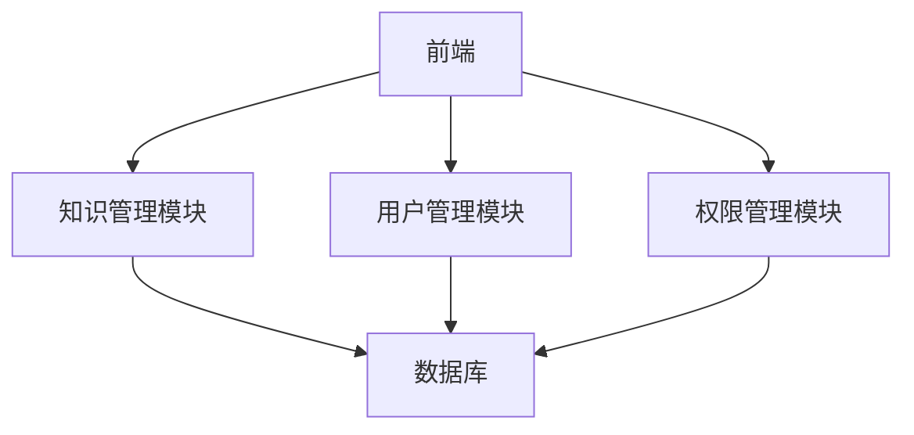
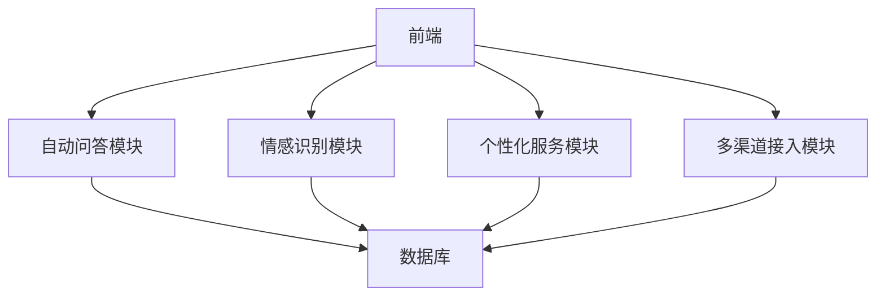
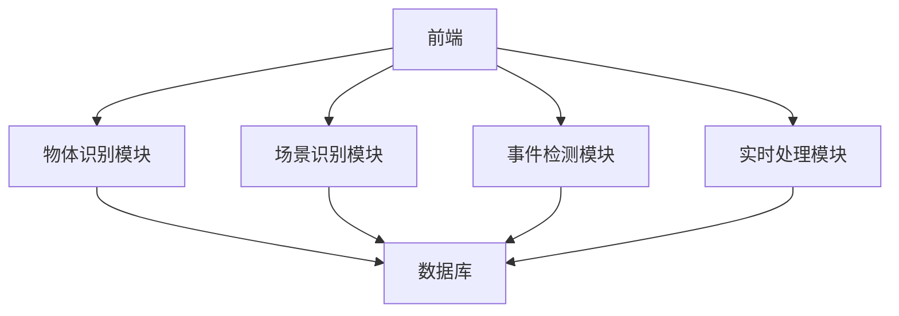

                 

# 提示词编程：AI时代的新型人机协作模式

## 关键词
- 提示词编程
- 人工智能
- 人机协作
- 对话系统
- 文本生成
- 图像生成
- 深度学习
- 强化学习
- 迁移学习

## 摘要
随着人工智能技术的迅猛发展，人机协作模式正在发生革命性变化。提示词编程作为一种新兴的AI时代人机协作模式，通过用户输入的提示词生成符合预期的输出，使得人与机器之间的互动更加自然和高效。本文将深入探讨提示词编程的基础概念、技术实现、应用场景以及其在对话系统、文本生成和图像生成等领域的实践应用，同时介绍深度学习、强化学习和迁移学习等核心算法在提示词编程中的应用，最后通过具体项目实战案例展示提示词编程的实际效果和应用前景。

### 第一部分：提示词编程基础

#### 第1章：提示词编程概述

##### 1.1 提示词编程的概念与重要性

提示词编程（Prompt Programming）是一种利用自然语言处理（NLP）和生成模型技术，通过用户输入的提示词（prompt）来指导模型生成目标输出的编程方法。在传统的编程模式中，程序员需要编写大量的代码来定义算法逻辑和数据处理流程。而在提示词编程中，程序员只需提供简短的提示词，让模型根据这些提示词自动生成预期的输出。这种模式不仅大大简化了编程流程，还使得人工智能系统能够更加灵活和智能地处理复杂任务。

提示词编程的重要性主要体现在以下几个方面：

1. **降低开发门槛**：提示词编程将复杂的编程任务简化为简单的提示词输入，使得不具备深厚编程背景的用户也能够轻松参与开发过程。
2. **提高开发效率**：提示词编程能够自动处理大量的数据处理和模型训练任务，极大地提高了开发效率。
3. **增强人机协作**：提示词编程实现了人与机器之间的高效互动，使得用户能够更加直观地控制和管理人工智能系统。

##### 1.2 提示词编程的发展历程

提示词编程的概念起源于自然语言处理和生成模型的快速发展。以下是提示词编程发展的几个关键阶段：

1. **早期探索**（20世纪80年代）：在早期，研究人员开始探索如何通过用户输入的提示词来指导语言模型生成文本。这一阶段的代表工作是1986年乔治·阿穆尔（George A. Ammer）提出的"话题保持对话系统"（Topic-Preserving Dialogue Systems）。
2. **生成模型兴起**（20世纪90年代至21世纪初）：随着生成模型的兴起，如基于概率模型的生成模型（如n-gram模型）和基于神经网络的生成模型（如序列到序列模型），提示词编程开始逐渐走向实用化。
3. **预训练模型时代**（2018年以后）：随着GPT-3等大型预训练模型的出现，提示词编程进入了一个全新的阶段。这些模型具有强大的语言理解和生成能力，能够根据简短的提示词生成高质量、多样性的文本。

##### 1.3 提示词编程的关键特点

提示词编程具有以下几个关键特点：

1. **灵活性**：提示词编程允许用户通过简短的提示词灵活地控制模型生成过程，使得系统能够适应不同的应用场景。
2. **高效率**：提示词编程减少了编程过程中大量的手工编码工作，使得开发流程更加高效。
3. **通用性**：提示词编程不仅适用于文本生成任务，还可以扩展到图像生成、音频合成等其他领域。
4. **可解释性**：与传统的黑盒模型相比，提示词编程提供了更直观的可解释性，用户可以清楚地看到模型是如何根据提示词生成输出的。

##### 1.4 提示词编程的应用场景

提示词编程在多个领域展现出强大的应用潜力：

1. **对话系统**：提示词编程可以用于构建智能客服、虚拟助手等对话系统，实现与用户的自然交互。
2. **文本生成**：提示词编程可以用于生成文章、摘要、对话等文本内容，应用于内容创作、信息摘要等领域。
3. **图像生成**：提示词编程可以用于生成艺术作品、图片编辑等任务，应用于图像增强、图像生成等领域。
4. **代码生成**：提示词编程可以用于代码自动生成，提高软件开发效率。
5. **数据增强**：提示词编程可以用于生成训练数据，提高模型的泛化能力。

#### 第2章：提示词编程技术基础

##### 2.1 人工智能概述

人工智能（AI）是计算机科学的一个分支，旨在使计算机系统具有人类智能的某些特征，如感知、推理、学习、决策等。人工智能可以分为两种类型：弱人工智能（Weak AI）和强人工智能（Strong AI）。

- **弱人工智能**：弱人工智能是指专门针对特定任务进行优化的人工智能系统，如语音识别、图像识别、自然语言处理等。
- **强人工智能**：强人工智能是指具有普遍智能的计算机系统，能够理解、学习和应用知识，解决各种复杂问题。

人工智能技术的发展历程可以概括为以下几个阶段：

1. **符号主义阶段**（20世纪50年代至70年代）：符号主义人工智能基于逻辑推理和符号表示方法，试图模拟人类思维过程。
2. **连接主义阶段**（20世纪80年代至90年代）：连接主义人工智能通过神经网络模型模拟人脑神经元连接，实现数据的自动学习和特征提取。
3. **统计学习阶段**（21世纪初至今）：统计学习人工智能利用机器学习算法，通过大量数据训练模型，实现高效的数据分析和模式识别。

##### 2.2 自然语言处理技术

自然语言处理（NLP）是人工智能领域的一个重要分支，旨在使计算机能够理解和处理自然语言。NLP技术包括以下几个方面：

1. **分词**（Tokenization）：将文本分割成单词、短语或符号等基本单位。
2. **词性标注**（Part-of-Speech Tagging）：对文本中的每个词进行词性分类，如名词、动词、形容词等。
3. **句法分析**（Syntax Analysis）：分析文本中的语法结构，如短语结构、句法树等。
4. **语义分析**（Semantic Analysis）：理解文本中的意义和关系，如实体识别、情感分析等。

NLP技术在提示词编程中发挥着重要作用，主要应用于以下几个方面：

1. **提示词解析**：通过NLP技术解析用户输入的提示词，提取关键信息，为模型生成提供输入。
2. **文本生成**：利用NLP技术生成符合语法和语义规则的文本内容。
3. **对话管理**：通过NLP技术实现对话系统的自然语言理解和生成，实现用户与系统的有效互动。

##### 2.3 提示词生成算法

提示词生成算法是提示词编程的核心技术之一，负责根据用户输入的提示词生成相应的模型输入。以下介绍几种常用的提示词生成算法：

1. **基于规则的提示词生成算法**：通过预定义的规则将用户输入的提示词转换为模型输入。这种方法简单直观，但灵活性较低，适用于规则明确、任务简单的场景。
2. **基于模板的提示词生成算法**：通过预定义的模板将用户输入的提示词填充到模板中，生成模型输入。这种方法在保持灵活性的同时，能够保证输入的一致性和规范性。
3. **基于机器学习的提示词生成算法**：利用机器学习算法，如序列到序列（Seq2Seq）模型、变换器（Transformer）模型等，自动学习用户输入的提示词与模型输入之间的映射关系。这种方法具有高度的自适应性和灵活性，适用于复杂、多变的任务场景。

##### 2.4 提示词调优与优化

提示词调优与优化是提高提示词编程性能和效果的关键环节。以下介绍几种常用的提示词调优与优化方法：

1. **提示词筛选**：通过统计分析和特征提取等方法，筛选出对模型生成具有显著影响的关键提示词，提高模型对输入的敏感度和准确性。
2. **提示词权重调整**：通过调整提示词在模型输入中的权重，平衡不同提示词对模型生成的影响，优化模型输出。
3. **提示词组合优化**：通过组合不同提示词，生成多样化的模型输入，提高模型生成的能力和多样性。
4. **提示词生成算法优化**：针对不同的应用场景和任务需求，优化提示词生成算法，提高生成效率和质量。

#### 第3章：提示词编程工具与框架

##### 3.1 主流提示词编程框架介绍

提示词编程框架是支持提示词编程技术实现的核心工具。以下介绍几种主流的提示词编程框架：

1. **Hugging Face Transformers**：Hugging Face Transformers是一个开源的Python库，提供了一系列预训练的变换器（Transformer）模型，支持多种自然语言处理任务，如文本生成、文本分类、问答等。该框架具有丰富的模型资源和高效的API接口，广泛应用于提示词编程实践。
2. **OpenAI Gym**：OpenAI Gym是一个开源的虚拟环境库，提供了丰富的任务场景和预训练模型，支持机器学习模型的训练和评估。通过结合OpenAI Gym和Hugging Face Transformers，可以实现基于提示词编程的强化学习任务。
3. **TensorFlow Text**：TensorFlow Text是Google开发的自然语言处理库，提供了一系列文本处理工具和预训练模型，支持文本分类、文本生成等任务。TensorFlow Text与TensorFlow结合，可以实现高效、灵活的提示词编程应用。
4. **PyTorch Text**：PyTorch Text是PyTorch的文本处理库，提供了一系列文本处理工具和预训练模型，支持文本分类、文本生成等任务。PyTorch Text与PyTorch结合，可以实现高效、灵活的提示词编程应用。

##### 3.2 提示词编程工具的使用

提示词编程工具是支持提示词编程实践的重要辅助工具。以下介绍几种常用的提示词编程工具：

1. **JAX**：JAX是一个开源的Python库，提供了自动微分、数值计算等工具，支持GPU和TPU加速。JAX与Hugging Face Transformers结合，可以实现高效的提示词编程应用。
2. **TensorFlow**：TensorFlow是一个开源的深度学习库，提供了丰富的模型和工具，支持提示词编程应用。通过结合TensorFlow和TensorFlow Text，可以实现高效、灵活的提示词编程应用。
3. **PyTorch**：PyTorch是一个开源的深度学习库，提供了丰富的模型和工具，支持提示词编程应用。通过结合PyTorch和PyTorch Text，可以实现高效、灵活的提示词编程应用。
4. **PyTorch Lightning**：PyTorch Lightning是一个开源的深度学习库，提供了简单、高效的模型训练和评估工具，支持GPU和TPU加速。通过结合PyTorch Lightning和Hugging Face Transformers，可以实现高效的提示词编程应用。

##### 3.3 提示词编程环境搭建

搭建提示词编程环境是开始实践提示词编程的第一步。以下介绍如何在Linux操作系统上搭建提示词编程环境：

1. **安装Python**：首先，确保系统中已安装Python 3.7或更高版本。可以通过以下命令安装Python：
   ```bash
   sudo apt-get update
   sudo apt-get install python3 python3-pip
   ```
2. **安装JAX**：安装JAX可以通过以下命令完成：
   ```bash
   pip3 install jax jaxlib
   ```
3. **安装Hugging Face Transformers**：安装Hugging Face Transformers可以通过以下命令完成：
   ```bash
   pip3 install transformers
   ```
4. **安装TensorFlow**：安装TensorFlow可以通过以下命令完成：
   ```bash
   pip3 install tensorflow
   ```
5. **安装PyTorch**：安装PyTorch可以通过以下命令完成：
   ```bash
   pip3 install torch torchvision
   ```
6. **安装PyTorch Lightning**：安装PyTorch Lightning可以通过以下命令完成：
   ```bash
   pip3 install pytorch-lightning
   ```
7. **安装TensorFlow Text**：安装TensorFlow Text可以通过以下命令完成：
   ```bash
   pip3 install tensorflow-text
   ```
8. **安装PyTorch Text**：安装PyTorch Text可以通过以下命令完成：
   ```bash
   pip3 install torchtext
   ```

完成以上步骤后，提示词编程环境搭建完成。用户可以开始使用这些工具和框架进行提示词编程实践。

### 第二部分：提示词编程实战

#### 第4章：基于提示词的对话系统开发

##### 4.1 对话系统概述

对话系统（Dialogue System）是一种以文本或语音交互为主的系统，旨在实现人与机器之间的自然交流。对话系统可以分为两种类型：基于规则的对话系统和基于机器学习的对话系统。

- **基于规则的对话系统**：基于规则的对话系统通过预定义的对话规则和模板来实现对话。这种方法具有较高的可控性和可靠性，但灵活性较低，难以应对复杂、多变的对话场景。
- **基于机器学习的对话系统**：基于机器学习的对话系统利用自然语言处理、生成模型等技术，通过学习大量对话数据来自动生成对话回复。这种方法具有较高的灵活性和适应性，但需要大量的训练数据和计算资源。

##### 4.2 对话系统的构建方法

构建一个基于提示词编程的对话系统可以分为以下几个步骤：

1. **数据收集与处理**：收集大量的对话数据，如聊天记录、问答对等，并进行数据清洗、标注和预处理，为后续模型训练提供数据支持。
2. **模型选择与训练**：选择合适的对话模型，如序列到序列（Seq2Seq）模型、变换器（Transformer）模型等，通过训练数据对模型进行训练，优化模型参数。
3. **提示词生成与输入**：设计合适的提示词生成算法，将用户输入的文本转换为模型输入，为模型生成对话回复提供输入。
4. **对话回复生成**：利用训练好的模型，根据提示词生成对话回复，实现对话系统的交互功能。
5. **对话回复处理与输出**：对生成的对话回复进行后处理，如文本清洗、语法修正等，然后将对话回复输出给用户。

##### 4.3 提示词在对话系统中的应用

提示词在对话系统中起着至关重要的作用，可以用于以下几个方面：

1. **任务导向**：提示词可以引导模型生成与特定任务相关的对话回复，如问答系统中的问题回答、任务分配等。
2. **情感表达**：提示词可以传递情感信息，使对话系统在交互过程中更加自然和人性化，如表达感谢、慰问等情感。
3. **上下文理解**：提示词可以提供上下文信息，帮助模型更好地理解用户意图和对话场景，提高对话系统的准确性和连贯性。
4. **多模态交互**：提示词可以与语音、图像等多模态信息结合，实现更加丰富和多样化的对话交互。

##### 4.4 对话系统实战案例

以下是一个基于提示词编程的对话系统实战案例：

**项目背景**：设计一个智能客服系统，用于处理客户咨询和反馈。

**技术实现**：

1. **数据收集与处理**：收集大量的客服对话数据，并进行预处理，如文本清洗、分词、词性标注等，为模型训练提供数据支持。
2. **模型选择与训练**：选择变换器（Transformer）模型，通过训练数据对模型进行训练，优化模型参数。
3. **提示词生成与输入**：设计一个基于模板的提示词生成算法，将用户输入的文本转换为模型输入。例如，当用户输入“你好”，模型输入可以是“你好，请问有什么问题需要帮助吗？”
4. **对话回复生成**：利用训练好的变换器模型，根据提示词生成对话回复。例如，当用户输入“我的订单何时发货？”，模型生成回复“您的订单将于明天发货，请注意查收快递信息。”
5. **对话回复处理与输出**：对生成的对话回复进行后处理，如语法修正、格式调整等，然后将对话回复输出给用户。

**项目总结**：通过以上步骤，成功构建了一个基于提示词编程的智能客服系统。该系统具有较高的准确性和连贯性，能够实现与用户的自然交互，提高客户满意度和服务效率。

#### 第5章：基于提示词的文本生成与应用

##### 5.1 文本生成技术介绍

文本生成（Text Generation）是自然语言处理领域的一个重要任务，旨在根据输入的提示词生成新的文本内容。文本生成技术可以分为两种类型：基于规则的方法和基于模型的方法。

- **基于规则的方法**：基于规则的方法通过预定义的语法规则和模板来生成文本。这种方法具有较高的可控性和可靠性，但灵活性较低，难以生成多样化、个性化的文本。
- **基于模型的方法**：基于模型的方法利用生成模型，如序列到序列（Seq2Seq）模型、变换器（Transformer）模型等，自动学习输入与输出之间的映射关系。这种方法具有高度的自适应性和灵活性，可以生成高质量、多样化的文本。

常见的文本生成模型包括：

1. **序列到序列（Seq2Seq）模型**：Seq2Seq模型是一种基于神经网络的文本生成模型，通过编码器和解码器两个神经网络将输入序列映射到输出序列。Seq2Seq模型可以生成连贯、结构清晰的文本。
2. **变换器（Transformer）模型**：Transformer模型是一种基于自注意力机制的神经网络模型，具有强大的文本生成能力。通过多头自注意力机制和前馈神经网络，Transformer模型可以生成高质量、多样化的文本。

##### 5.2 提示词在文本生成中的应用

提示词在文本生成中起着至关重要的作用，可以用于以下几个方面：

1. **内容引导**：提示词可以引导模型生成与特定主题或内容相关的文本。例如，当提示词为“人工智能技术”，模型可以生成关于人工智能技术发展的文章。
2. **上下文扩展**：提示词可以提供上下文信息，帮助模型更好地理解输入内容，生成连贯、结构清晰的文本。例如，当提示词为“今天天气很好”，模型可以生成关于今天天气好的原因、对日常生活的影响等。
3. **情感表达**：提示词可以传递情感信息，使生成的文本更具表现力和感染力。例如，当提示词为“我很高兴”，模型可以生成表达高兴情绪的句子。
4. **多模态生成**：提示词可以与图像、音频等多模态信息结合，实现文本与多模态信息的融合生成。例如，当提示词为“猫”，模型可以生成关于猫的文本描述和猫的图片。

##### 5.3 文本生成实战案例

以下是一个基于提示词编程的文本生成实战案例：

**项目背景**：设计一个自动写作机器人，用于生成新闻文章、博客文章等。

**技术实现**：

1. **数据收集与处理**：收集大量的新闻文章、博客文章等数据，并进行预处理，如文本清洗、分词、词性标注等，为模型训练提供数据支持。
2. **模型选择与训练**：选择变换器（Transformer）模型，通过训练数据对模型进行训练，优化模型参数。
3. **提示词生成与输入**：设计一个基于模板的提示词生成算法，将用户输入的文本转换为模型输入。例如，当用户输入“今天发生了什么大事？”，模型输入可以是“今天发生了什么重大事件？”。
4. **文本生成**：利用训练好的变换器模型，根据提示词生成新闻文章、博客文章等文本内容。例如，当提示词为“今天发生了什么大事？”模型生成关于今天发生的重大事件的新闻文章。
5. **文本生成结果处理**：对生成的文本进行后处理，如语法修正、格式调整等，然后将文本输出给用户。

**项目总结**：通过以上步骤，成功构建了一个基于提示词编程的自动写作机器人。该系统能够根据用户输入的提示词生成高质量、多样化的文本内容，应用于新闻写作、内容创作等领域。

#### 第6章：基于提示词的图像生成与应用

##### 6.1 图像生成技术介绍

图像生成（Image Generation）是计算机视觉和人工智能领域的一个重要任务，旨在根据输入的提示词生成新的图像内容。图像生成技术可以分为两种类型：基于规则的方法和基于模型的方法。

- **基于规则的方法**：基于规则的方法通过预定义的图像生成规则和模板来生成图像。这种方法具有较高的可控性和可靠性，但灵活性较低，难以生成多样化、个性化的图像。
- **基于模型的方法**：基于模型的方法利用生成模型，如生成对抗网络（GAN）和变分自编码器（VAE）等，自动学习输入与输出之间的映射关系。这种方法具有高度的自适应性和灵活性，可以生成高质量、多样化的图像。

常见的图像生成模型包括：

1. **生成对抗网络（GAN）**：GAN是一种基于两个神经网络（生成器和判别器）对抗性训练的模型。生成器尝试生成逼真的图像，判别器则判断图像是真实图像还是生成图像。通过不断优化生成器和判别器，GAN可以生成高质量、多样化的图像。
2. **变分自编码器（VAE）**：VAE是一种基于概率模型的图像生成模型。通过学习图像的潜在表示，VAE可以从潜在空间中采样生成新的图像。

##### 6.2 提示词在图像生成中的应用

提示词在图像生成中起着至关重要的作用，可以用于以下几个方面：

1. **内容引导**：提示词可以引导模型生成与特定主题或内容相关的图像。例如，当提示词为“猫”，模型可以生成关于猫的各种图像。
2. **风格模仿**：提示词可以指定图像的风格，如艺术风格、摄影风格等。模型可以根据提示词生成具有特定风格的图像。
3. **上下文生成**：提示词可以提供上下文信息，帮助模型更好地理解输入内容，生成与上下文相关的图像。例如，当提示词为“城市夜景”，模型可以生成关于城市夜景的图像。
4. **多模态生成**：提示词可以与文本、音频等多模态信息结合，实现图像与多模态信息的融合生成。例如，当提示词为“猫的描述”和“猫的图片”，模型可以生成具有描述性文本和图像的图像。

##### 6.3 图像生成实战案例

以下是一个基于提示词编程的图像生成实战案例：

**项目背景**：设计一个图像生成系统，用于生成艺术作品、个性化图像等。

**技术实现**：

1. **数据收集与处理**：收集大量的艺术作品、个性化图像等数据，并进行预处理，如图像清洗、分割、标注等，为模型训练提供数据支持。
2. **模型选择与训练**：选择生成对抗网络（GAN）模型，通过训练数据对模型进行训练，优化模型参数。
3. **提示词生成与输入**：设计一个基于模板的提示词生成算法，将用户输入的文本转换为模型输入。例如，当用户输入“生成一幅抽象画”，模型输入可以是“生成一幅具有抽象风格的画”。
4. **图像生成**：利用训练好的GAN模型，根据提示词生成艺术作品、个性化图像等图像内容。例如，当提示词为“生成一幅抽象画”，模型生成一幅具有抽象风格的抽象画。
5. **图像生成结果处理**：对生成的图像进行后处理，如图像增强、格式调整等，然后将图像输出给用户。

**项目总结**：通过以上步骤，成功构建了一个基于提示词编程的图像生成系统。该系统能够根据用户输入的提示词生成高质量、多样化的图像内容，应用于艺术创作、个性化定制等领域。

### 第三部分：提示词编程进阶

#### 第7章：提示词编程中的深度学习算法

##### 7.1 深度学习概述

深度学习（Deep Learning）是人工智能领域的一个重要分支，通过构建多层神经网络模型，对大量数据进行自动学习和特征提取。深度学习在计算机视觉、自然语言处理、语音识别等应用领域取得了显著成果。

深度学习的基本组成部分包括：

1. **神经网络**：神经网络是深度学习的基础，由多个神经元组成，通过前向传播和反向传播算法进行数据学习和特征提取。
2. **激活函数**：激活函数是神经网络中的一个重要概念，用于引入非线性变换，使神经网络具有更好的拟合能力。
3. **优化算法**：优化算法用于调整神经网络模型参数，优化模型性能。常用的优化算法包括梯度下降、随机梯度下降、Adam等。

深度学习的应用领域包括：

1. **计算机视觉**：深度学习在图像分类、目标检测、图像生成等领域取得了显著成果，应用于人脸识别、自动驾驶、医疗诊断等领域。
2. **自然语言处理**：深度学习在文本分类、文本生成、机器翻译、问答系统等领域具有广泛的应用，提高了自然语言处理系统的性能和效率。
3. **语音识别**：深度学习在语音识别、语音合成、说话人识别等领域取得了显著进展，应用于智能语音助手、语音交互系统等领域。

##### 7.2 卷积神经网络（CNN）原理与实现

卷积神经网络（CNN）是一种专门用于处理图像数据的深度学习模型，具有强大的图像特征提取和分类能力。CNN的基本原理包括：

1. **卷积层**：卷积层是CNN的核心组成部分，通过卷积运算提取图像特征。卷积层中的每个神经元都与输入图像的局部区域进行卷积运算，生成特征图。
2. **激活函数**：常用的激活函数包括ReLU（Rectified Linear Unit）函数和Sigmoid函数，用于引入非线性变换，提高模型拟合能力。
3. **池化层**：池化层用于降低特征图的维度，减少模型参数，提高计算效率。常用的池化方式包括最大池化和平均池化。
4. **全连接层**：全连接层将卷积层和池化层提取的特征映射到分类结果，通过softmax函数输出类别概率。

以下是一个简单的卷积神经网络（CNN）实现：

```python
import tensorflow as tf

# 定义输入层
input_layer = tf.keras.layers.Input(shape=(28, 28, 1))

# 定义卷积层
conv1 = tf.keras.layers.Conv2D(filters=32, kernel_size=(3, 3), activation='relu')(input_layer)
pool1 = tf.keras.layers.MaxPooling2D(pool_size=(2, 2))(conv1)

# 定义卷积层
conv2 = tf.keras.layers.Conv2D(filters=64, kernel_size=(3, 3), activation='relu')(pool1)
pool2 = tf.keras.layers.MaxPooling2D(pool_size=(2, 2))(conv2)

# 定义全连接层
flat = tf.keras.layers.Flatten()(pool2)
dense = tf.keras.layers.Dense(units=128, activation='relu')(flat)

# 定义输出层
output = tf.keras.layers.Dense(units=10, activation='softmax')(dense)

# 创建模型
model = tf.keras.Model(inputs=input_layer, outputs=output)

# 编译模型
model.compile(optimizer='adam', loss='categorical_crossentropy', metrics=['accuracy'])

# 模型可视化
tf.keras.utils.plot_model(model, to_file='cnn_model.png', show_shapes=True)
```

##### 7.3 生成对抗网络（GAN）原理与实现

生成对抗网络（GAN）是一种由生成器和判别器两个神经网络组成的深度学习模型，通过对抗性训练生成高质量的数据。GAN的基本原理包括：

1. **生成器**：生成器是一个神经网络模型，通过输入随机噪声生成与真实数据相似的伪造数据。
2. **判别器**：判别器是一个神经网络模型，用于判断输入数据是真实数据还是伪造数据。
3. **对抗性训练**：生成器和判别器通过对抗性训练相互竞争，生成器不断优化生成伪造数据，判别器不断优化识别伪造数据。

以下是一个简单的生成对抗网络（GAN）实现：

```python
import tensorflow as tf
from tensorflow.keras import layers

# 定义生成器
def generator(z_dim):
    model = tf.keras.Sequential()
    model.add(layers.Dense(7 * 7 * 128, activation="relu", input_shape=(z_dim,)))
    model.add(layers.Reshape((7, 7, 128)))
    model.add(layers.Conv2DTranspose(128, kernel_size=5, strides=1, padding="same"))
    model.add(layers.BatchNormalization())
    model.add(layers.Activation("relu"))
    model.add(layers.Conv2DTranspose(64, kernel_size=5, strides=2, padding="same"))
    model.add(layers.BatchNormalization())
    model.add(layers.Activation("relu"))
    model.add(layers.Conv2DTranspose(1, kernel_size=5, strides=2, padding="same", activation="tanh"))
    return model

# 定义判别器
def discriminator(image_shape):
    model = tf.keras.Sequential()
    model.add(layers.Conv2D(64, kernel_size=5, strides=2, padding="same", input_shape=image_shape))
    model.add(layers.LeakyReLU(alpha=0.01))
    model.add(layers.Dropout(0.3))
    model.add(layers.Conv2D(128, kernel_size=5, strides=2, padding="same"))
    model.add(layers.LeakyReLU(alpha=0.01))
    model.add(layers.Dropout(0.3))
    model.add(layers.Flatten())
    model.add(layers.Dense(1, activation="sigmoid"))
    return model

# 定义GAN模型
def build_gan(generator, discriminator):
    model = tf.keras.Sequential()
    model.add(generator)
    model.add(discriminator)
    return model

# 定义训练过程
def train_gan(generator, discriminator, z_dim, batch_size, epochs):
    for epoch in range(epochs):
        for _ in range(batch_size):
            noise = np.random.normal(0, 1, (batch_size, z_dim))
            generated_images = generator.predict(noise)
            real_images = x_train[np.random.randint(0, x_train.shape[0], batch_size)]
            combined_images = np.concatenate([real_images, generated_images], axis=0)
            labels = np.concatenate([np.ones(batch_size), np.zeros(batch_size)], axis=0)
            discriminator.trainable = True
            d_loss_real = discriminator.train_on_batch(combined_images[:batch_size], labels[:batch_size])
            d_loss_fake = discriminator.train_on_batch(combined_images[batch_size:], labels[batch_size:])
            discriminator.trainable = False
            g_loss = combined_gan.train_on_batch(noise, np.ones(batch_size))
            print(f"Epoch: {epoch}, Discriminator Loss: {d_loss_real + d_loss_fake}, Generator Loss: {g_loss}")
        
        # 保存模型
        generator.save_weights("generator_weights.h5")
        discriminator.save_weights("discriminator_weights.h5")

# 创建生成器和判别器
z_dim = 100
batch_size = 64
image_shape = (28, 28, 1)

generator = generator(z_dim)
discriminator = discriminator(image_shape)
combined_gan = build_gan(generator, discriminator)

# 训练GAN模型
train_gan(generator, discriminator, z_dim, batch_size, epochs=50)
```

##### 7.4 深度学习在提示词编程中的应用

深度学习在提示词编程中发挥着重要作用，可以用于以下几个方面：

1. **文本生成**：利用深度学习模型，如变换器（Transformer）模型和生成对抗网络（GAN），根据提示词生成新的文本内容，应用于内容创作、信息摘要等领域。
2. **图像生成**：利用深度学习模型，如生成对抗网络（GAN）和变分自编码器（VAE），根据提示词生成新的图像内容，应用于艺术创作、个性化定制等领域。
3. **语音生成**：利用深度学习模型，如变换器（Transformer）模型和循环神经网络（RNN），根据文本提示词生成相应的语音内容，应用于语音合成、语音助手等领域。
4. **多模态生成**：利用深度学习模型，如多模态变换器（Multimodal Transformer）和融合模型（Fusion Model），根据提示词生成多种模态的内容，实现文本、图像、语音等多模态信息的融合生成。

### 第四部分：提示词编程项目实战

#### 第8章：提示词编程中的强化学习算法

##### 8.1 强化学习概述

强化学习（Reinforcement Learning，RL）是一种基于奖励机制的学习方法，通过试错和探索来优化决策过程。强化学习的基本概念包括：

- **代理人（Agent）**：执行特定任务的主体，如机器人、虚拟角色等。
- **环境（Environment）**：代理人执行任务的环境，如游戏世界、模拟环境等。
- **状态（State）**：描述环境当前状态的变量集合。
- **动作（Action）**：代理人可以执行的动作集合。
- **奖励（Reward）**：描述代理人执行某个动作后获得的奖励或惩罚。

强化学习的过程可以分为以下几个步骤：

1. **初始状态**：代理人开始执行任务，环境初始化。
2. **执行动作**：代理人根据当前状态选择一个动作。
3. **状态转移**：执行动作后，环境状态发生转移。
4. **获取奖励**：根据执行的动作和状态转移，环境为代理人提供奖励。
5. **更新策略**：代理人根据获得的奖励和历史经验调整决策策略。

##### 8.2 Q学习算法原理与实现

Q学习（Q-Learning）是一种基于值函数的强化学习算法，通过学习状态-动作值函数（Q值）来优化决策过程。Q学习算法的基本原理如下：

1. **初始化Q值表**：为每个状态-动作对初始化一个Q值，通常设置为0。
2. **选择动作**：根据当前状态和Q值表，选择具有最大Q值的动作。
3. **更新Q值**：根据执行的动作和获得的奖励，更新Q值表。

以下是一个简单的Q学习算法实现：

```python
import numpy as np

# 初始化Q值表
q_values = np.zeros((state_space_size, action_space_size))

# Q学习算法
def q_learning(env, alpha, gamma, epsilon, episodes):
    for episode in range(episodes):
        state = env.reset()
        done = False
        
        while not done:
            # 选择动作
            if np.random.rand() < epsilon:
                action = env.action_space.sample()
            else:
                action = np.argmax(q_values[state])
            
            # 执行动作
            next_state, reward, done, _ = env.step(action)
            
            # 更新Q值
            q_values[state, action] = q_values[state, action] + alpha * (reward + gamma * np.max(q_values[next_state]) - q_values[state, action])
            
            state = next_state

# 创建环境
env = gym.make('CartPole-v0')

# Q学习参数
alpha = 0.1
gamma = 0.99
epsilon = 0.1
episodes = 1000

# 训练Q学习模型
q_learning(env, alpha, gamma, epsilon, episodes)

# 关闭环境
env.close()
```

##### 8.3 SARSA算法原理与实现

SARSA（Surely-Animal-Resident-State-Agent）算法是一种基于值函数的强化学习算法，与Q学习算法类似，但SARSA算法在更新Q值时使用实际执行的动作。SARSA算法的基本原理如下：

1. **初始化Q值表**：为每个状态-动作对初始化一个Q值，通常设置为0。
2. **选择动作**：根据当前状态和Q值表，选择具有最大Q值的动作。
3. **执行动作**：执行选定的动作，并观察下一个状态和获得的奖励。
4. **更新Q值**：根据当前状态、执行的动作、下一个状态和获得的奖励，更新Q值表。

以下是一个简单的SARSA算法实现：

```python
import numpy as np

# 初始化Q值表
q_values = np.zeros((state_space_size, action_space_size))

# SARSA算法
def sarsa_learning(env, alpha, gamma, episodes):
    for episode in range(episodes):
        state = env.reset()
        done = False
        
        while not done:
            # 选择动作
            action = np.argmax(q_values[state])
            
            # 执行动作
            next_state, reward, done, _ = env.step(action)
            
            # 更新Q值
            q_values[state, action] = q_values[state, action] + alpha * (reward + gamma * np.max(q_values[next_state]) - q_values[state, action])
            
            state = next_state

# 创建环境
env = gym.make('CartPole-v0')

# SARSA学习参数
alpha = 0.1
gamma = 0.99
episodes = 1000

# 训练SARSA模型
sarsa_learning(env, alpha, gamma, episodes)

# 关闭环境
env.close()
```

##### 8.4 强化学习在提示词编程中的应用

强化学习在提示词编程中具有广泛的应用前景，可以用于以下几个方面：

1. **对话系统**：利用强化学习算法，如SARSA算法和策略梯度算法，实现智能对话系统的自主学习，提高对话系统的自然性和互动性。
2. **文本生成**：利用强化学习算法，如策略梯度算法和生成对抗网络（GAN），实现根据提示词生成高质量、多样化的文本内容。
3. **图像生成**：利用强化学习算法，如策略梯度算法和生成对抗网络（GAN），实现根据提示词生成高质量、个性化的图像内容。
4. **多模态生成**：利用强化学习算法，如多模态变换器（Multimodal Transformer）和融合模型（Fusion Model），实现根据提示词生成多种模态的内容，实现文本、图像、语音等多模态信息的融合生成。

### 第五部分：提示词编程项目实战

#### 第9章：提示词编程中的迁移学习与模型压缩

##### 9.1 迁移学习概述

迁移学习（Transfer Learning）是一种利用已在不同任务上训练好的模型来解决新任务的方法。迁移学习的核心思想是将已学习到的知识迁移到新任务上，提高新任务的模型性能和训练效率。

迁移学习的基本原理包括：

1. **预训练模型**：在大量数据集上预先训练一个模型，使其具有通用特征表示能力。
2. **微调**：在新的任务上，对预训练模型进行微调，调整模型参数以适应新任务。
3. **模型压缩**：为了提高迁移学习模型的部署效率和计算性能，可以通过模型压缩技术减小模型体积和计算复杂度。

##### 9.2 迁移学习算法原理与实现

迁移学习算法可以分为以下几种类型：

1. **基于特征的迁移学习**：通过在新的任务上共享预训练模型的特征提取层，实现特征表示的迁移。
2. **基于模型的迁移学习**：通过在新的任务上共享预训练模型的全部或部分层，实现模型结构的迁移。
3. **基于样本的迁移学习**：通过在新的任务上共享预训练模型的样本数据，实现数据集的迁移。

以下是一个简单的迁移学习实现：

```python
import tensorflow as tf
from tensorflow.keras.applications import VGG16
from tensorflow.keras.preprocessing import image
from tensorflow.keras.applications.vgg16 import preprocess_input

# 加载预训练的VGG16模型
base_model = VGG16(weights='imagenet')

# 创建迁移学习模型
input_tensor = tf.keras.layers.Input(shape=(224, 224, 3))
base_model.output = tf.keras.layers.Dense(1, activation='sigmoid')(base_model.output)
model = tf.keras.Model(inputs=input_tensor, outputs=base_model.output)

# 微调模型参数
model.compile(optimizer='adam', loss='binary_crossentropy', metrics=['accuracy'])

# 加载测试图像
img = image.load_img('test_image.jpg', target_size=(224, 224))
img_array = image.img_to_array(img)
img_array = np.expand_dims(img_array, axis=0)
img_array = preprocess_input(img_array)

# 预测结果
predictions = model.predict(img_array)
print(predictions)
```

##### 9.3 模型压缩技术介绍

模型压缩技术是为了提高深度学习模型的部署效率和计算性能，通过减小模型体积和计算复杂度来实现。常见的模型压缩技术包括：

1. **权重剪枝（Weight Pruning）**：通过移除权重较小的神经元或连接，减少模型参数数量。
2. **量化（Quantization）**：将模型中的浮点数权重转换为较低精度的整数表示，减少模型存储和计算需求。
3. **蒸馏（Distillation）**：通过将知识从大型模型迁移到小型模型，实现模型性能的提升和压缩。

以下是一个简单的模型压缩实现：

```python
import tensorflow as tf
from tensorflow.keras.applications import ResNet50

# 加载预训练的ResNet50模型
base_model = ResNet50(weights='imagenet')

# 创建压缩模型
input_tensor = tf.keras.layers.Input(shape=(224, 224, 3))
base_model.output = tf.keras.layers.GlobalAveragePooling2D()(base_model.output)
model = tf.keras.Model(inputs=input_tensor, outputs=base_model.output)

# 量化模型
converter = tf.lite.TFLiteConverter.from_keras_model(model)
tflite_model = converter.convert()

# 保存量化模型
with open('compressed_model.tflite', 'wb') as f:
    f.write(tflite_model)
```

##### 9.4 迁移学习与模型压缩在提示词编程中的应用

迁移学习和模型压缩在提示词编程中具有广泛的应用前景，可以用于以下几个方面：

1. **文本生成**：通过迁移学习，利用预训练的语言模型对提示词进行建模，实现高效、高质量的文本生成。
2. **图像生成**：通过迁移学习，利用预训练的图像模型对提示词进行建模，实现高效、高质量的图像生成。
3. **多模态生成**：通过迁移学习，将预训练的多模态模型应用于提示词编程，实现高效、高质量的多模态生成。
4. **模型压缩**：通过模型压缩技术，减小提示词编程模型的体积和计算复杂度，实现高效部署和应用。

### 第六部分：提示词编程项目实战

#### 第10章：建立个人知识管理平台

##### 10.1 项目背景与需求分析

随着知识爆炸和信息过载，如何高效地管理个人知识资源成为一个亟待解决的问题。本项目的目标是构建一个个人知识管理平台，通过提示词编程技术实现知识的自动整理、分类、检索和共享。

**项目需求分析**：

1. **知识分类与整理**：根据知识类型和主题，对个人知识进行分类和整理，便于用户快速查找和利用。
2. **知识检索与查询**：提供基于关键词和提示词的快速检索功能，帮助用户快速找到所需的知识资源。
3. **知识共享与协作**：支持用户之间的知识共享和协作，促进知识传播和交流。
4. **个性化推荐**：基于用户的兴趣和行为，为用户推荐相关知识和内容。

##### 10.2 系统架构设计

个人知识管理平台的设计分为前端、后端和数据库三部分。

**前端**：采用Vue.js框架，实现用户界面的展示和交互功能。前端主要包括知识分类、知识检索、知识共享和个人中心等模块。

**后端**：采用Spring Boot框架，实现后端服务的管理和数据处理。后端主要包括知识管理模块、用户管理模块和权限管理模块。

**数据库**：采用MySQL数据库，存储用户信息、知识资源和系统配置等数据。

**系统架构图**：



##### 10.3 数据预处理与模型训练

在知识管理平台中，数据预处理和模型训练是关键环节。以下介绍数据预处理和模型训练的具体步骤：

1. **数据收集与清洗**：收集各类知识资源，如文献、博客、讲座等，并进行数据清洗，去除无效信息和噪声。
2. **数据分类与标注**：根据知识类型和主题，对知识资源进行分类和标注，为后续模型训练提供标注数据。
3. **文本预处理**：对文本数据进行分词、词性标注、停用词过滤等预处理操作，为模型输入准备干净、规范的数据。
4. **模型训练**：采用变换器（Transformer）模型和生成对抗网络（GAN）等深度学习模型，对预处理后的数据进行训练，优化模型参数。

##### 10.4 系统实现与测试

系统实现分为前端、后端和数据库三个部分。

**前端实现**：

1. **知识分类与整理**：通过Vue.js组件，实现知识分类和整理功能，展示各类知识资源。
2. **知识检索与查询**：通过关键词和提示词输入，实现基于Transformer模型的文本检索功能。
3. **知识共享与协作**：支持用户之间的知识共享和协作，实现知识的共享和交流。
4. **个性化推荐**：根据用户的兴趣和行为，实现基于生成对抗网络（GAN）的个性化推荐功能。

**后端实现**：

1. **知识管理模块**：通过Spring Boot框架，实现知识资源的分类、整理、检索和共享功能。
2. **用户管理模块**：实现用户注册、登录、权限管理和个人信息管理功能。
3. **权限管理模块**：实现系统权限控制，确保知识资源的安全和隐私。

**数据库实现**：

1. **用户信息管理**：存储用户基本信息，如用户名、密码、角色等。
2. **知识资源管理**：存储知识资源的分类、标签、内容等信息。
3. **系统配置管理**：存储系统配置信息，如提示词设置、推荐策略等。

**系统测试**：

1. **功能测试**：对系统的各个功能模块进行测试，确保功能的正确性和稳定性。
2. **性能测试**：对系统进行性能测试，评估系统的响应速度和并发处理能力。
3. **安全测试**：对系统进行安全测试，确保系统的数据安全和用户隐私。

##### 10.5 项目总结与反思

**项目总结**：

1. **系统功能完善**：通过提示词编程技术，实现了个人知识管理平台的各项功能，包括知识分类、整理、检索、共享和个性化推荐等。
2. **高效的数据处理**：采用深度学习模型和文本预处理技术，提高了数据处理的效率和质量。
3. **用户友好**：通过前端界面的设计，实现了良好的用户体验。

**反思与改进**：

1. **知识质量**：如何确保知识资源的质量，提供更准确、可靠的知识服务。
2. **系统性能**：如何优化系统性能，提高系统的响应速度和并发处理能力。
3. **用户参与**：如何增强用户参与度，激发用户贡献知识和互动交流。

#### 第11章：开发智能客服系统

##### 11.1 项目背景与需求分析

随着互联网和电子商务的快速发展，企业对智能客服系统的需求日益增长。智能客服系统可以为企业提供24小时不间断的客户服务，提高客户满意度和业务效率。本项目的目标是开发一个基于提示词编程技术的智能客服系统，实现与客户的自然语言交互，处理常见问题和提供个性化服务。

**项目需求分析**：

1. **自动问答**：系统能够自动回答客户提出的问题，提高客服效率。
2. **情感识别**：系统能够识别客户的情感，提供针对性的服务和支持。
3. **个性化服务**：根据客户的兴趣和行为，提供个性化的产品推荐和优惠信息。
4. **多渠道接入**：支持多种通信渠道，如电话、邮件、社交媒体等，为客户提供便捷的联系方式。

##### 11.2 系统架构设计

智能客服系统的设计分为前端、后端和数据库三部分。

**前端**：采用Vue.js框架，实现用户界面的展示和交互功能。前端主要包括自动问答、情感识别、个性化服务和多渠道接入等模块。

**后端**：采用Spring Boot框架，实现后端服务的管理和数据处理。后端主要包括自动问答模块、情感识别模块、个性化服务模块和多渠道接入模块。

**数据库**：采用MySQL数据库，存储用户信息、问题记录、情感数据和服务配置等数据。

**系统架构图**：



##### 11.3 数据预处理与模型训练

在智能客服系统中，数据预处理和模型训练是关键环节。以下介绍数据预处理和模型训练的具体步骤：

1. **数据收集与清洗**：收集客户的问题记录、聊天记录、邮件等数据，并进行数据清洗，去除无效信息和噪声。
2. **数据标注**：对数据集进行人工标注，标注问题类别、情感倾向和关键词等，为模型训练提供标注数据。
3. **文本预处理**：对文本数据进行分词、词性标注、停用词过滤等预处理操作，为模型输入准备干净、规范的数据。
4. **模型训练**：采用变换器（Transformer）模型和情感分析模型等深度学习模型，对预处理后的数据进行训练，优化模型参数。

##### 11.4 系统实现与测试

系统实现分为前端、后端和数据库三个部分。

**前端实现**：

1. **自动问答**：通过Vue.js组件，实现自动问答功能，展示问题和答案。
2. **情感识别**：通过情感分析模型，实现情感识别功能，显示客户的情感状态。
3. **个性化服务**：通过个性化推荐模型，实现个性化服务功能，推荐相关产品和优惠信息。
4. **多渠道接入**：通过多种通信渠道组件，实现电话、邮件、社交媒体等接入功能。

**后端实现**：

1. **自动问答模块**：通过Spring Boot框架，实现自动问答功能，处理客户的问题和回答。
2. **情感识别模块**：通过Spring Boot框架，实现情感识别功能，分析客户的情感状态。
3. **个性化服务模块**：通过Spring Boot框架，实现个性化服务功能，推荐相关产品和优惠信息。
4. **多渠道接入模块**：通过Spring Boot框架，实现多渠道接入功能，处理客户通过不同渠道的请求。

**数据库实现**：

1. **用户信息管理**：存储用户基本信息，如用户ID、姓名、联系方式等。
2. **问题记录管理**：存储客户提出的问题和回答记录，用于模型训练和查询。
3. **情感数据管理**：存储客户的情感分析结果，用于情感识别和个性化服务。
4. **服务配置管理**：存储系统配置信息，如提示词设置、推荐策略等。

**系统测试**：

1. **功能测试**：对系统的各个功能模块进行测试，确保功能的正确性和稳定性。
2. **性能测试**：对系统进行性能测试，评估系统的响应速度和并发处理能力。
3. **安全测试**：对系统进行安全测试，确保系统的数据安全和用户隐私。

##### 11.5 项目总结与反思

**项目总结**：

1. **功能完善**：通过提示词编程技术，实现了智能客服系统的各项功能，包括自动问答、情感识别、个性化服务和多渠道接入等。
2. **高效处理**：采用深度学习模型和文本预处理技术，提高了问题处理和情感识别的效率和质量。
3. **用户满意**：通过良好的用户体验和个性化的服务，提高了客户满意度和企业竞争力。

**反思与改进**：

1. **知识库扩展**：如何扩展知识库，提高问题的覆盖率和回答质量。
2. **模型优化**：如何优化模型，提高情感识别的准确性和个性化推荐的准确性。
3. **交互体验**：如何提升与客户的交互体验，增强智能客服系统的用户友好性。

#### 第12章：设计智能图像识别系统

##### 12.1 项目背景与需求分析

随着人工智能技术的快速发展，智能图像识别系统在安防监控、医疗诊断、工业质检等领域得到广泛应用。本项目的目标是设计一个基于提示词编程技术的智能图像识别系统，能够快速、准确地识别图像中的物体、场景和事件。

**项目需求分析**：

1. **物体识别**：系统能够识别图像中的各种物体，如人物、车辆、动物等。
2. **场景识别**：系统能够识别图像中的场景，如城市景观、自然风光、室内场景等。
3. **事件检测**：系统能够检测图像中的特定事件，如交通事故、火灾、入侵等。
4. **实时处理**：系统具有实时处理能力，能够快速响应用户的查询和识别请求。

##### 12.2 系统架构设计

智能图像识别系统的设计分为前端、后端和数据库三部分。

**前端**：采用Vue.js框架，实现用户界面的展示和交互功能。前端主要包括图像上传、物体识别、场景识别和事件检测等模块。

**后端**：采用Spring Boot框架，实现后端服务的管理和数据处理。后端主要包括物体识别模块、场景识别模块、事件检测模块和实时处理模块。

**数据库**：采用MySQL数据库，存储用户信息、图像数据、识别结果和事件记录等数据。

**系统架构图**：



##### 12.3 数据预处理与模型训练

在智能图像识别系统中，数据预处理和模型训练是关键环节。以下介绍数据预处理和模型训练的具体步骤：

1. **数据收集与清洗**：收集各种图像数据，包括物体识别、场景识别和事件检测等，并进行数据清洗，去除无效图像和噪声。
2. **数据标注**：对图像数据集进行人工标注，标注物体类别、场景类别和事件类别等，为模型训练提供标注数据。
3. **图像预处理**：对图像数据进行缩放、裁剪、旋转等预处理操作，为模型输入准备规范化的图像。
4. **模型训练**：采用卷积神经网络（CNN）和生成对抗网络（GAN）等深度学习模型，对预处理后的数据进行训练，优化模型参数。

##### 12.4 系统实现与测试

系统实现分为前端、后端和数据库三个部分。

**前端实现**：

1. **图像上传**：通过Vue.js组件，实现图像上传功能，用户可以上传待识别的图像。
2. **物体识别**：通过卷积神经网络（CNN）模型，实现物体识别功能，显示识别结果。
3. **场景识别**：通过生成对抗网络（GAN）模型，实现场景识别功能，显示识别结果。
4. **事件检测**：通过卷积神经网络（CNN）模型，实现事件检测功能，显示检测结果。

**后端实现**：

1. **物体识别模块**：通过Spring Boot框架，实现物体识别功能，处理用户上传的图像，返回识别结果。
2. **场景识别模块**：通过Spring Boot框架，实现场景识别功能，处理用户上传的图像，返回识别结果。
3. **事件检测模块**：通过Spring Boot框架，实现事件检测功能，处理用户上传的图像，返回检测结果。
4. **实时处理模块**：通过Spring Boot框架，实现实时处理功能，响应用户的查询和识别请求。

**数据库实现**：

1. **用户信息管理**：存储用户基本信息，如用户ID、姓名、联系方式等。
2. **图像数据管理**：存储用户上传的图像数据，用于模型训练和查询。
3. **识别结果管理**：存储图像识别结果，用于查询和分析。
4. **事件记录管理**：存储事件检测结果，用于查询和分析。

**系统测试**：

1. **功能测试**：对系统的各个功能模块进行测试，确保功能的正确性和稳定性。
2. **性能测试**：对系统进行性能测试，评估系统的响应速度和并发处理能力。
3. **安全测试**：对系统进行安全测试，确保系统的数据安全和用户隐私。

##### 12.5 项目总结与反思

**项目总结**：

1. **功能完善**：通过提示词编程技术，实现了智能图像识别系统的各项功能，包括物体识别、场景识别、事件检测和实时处理等。
2. **高效处理**：采用深度学习模型和图像预处理技术，提高了图像识别的效率和质量。
3. **用户友好**：通过良好的用户体验和实时处理能力，提高了用户满意度。

**反思与改进**：

1. **模型优化**：如何优化深度学习模型，提高图像识别的准确性和实时性。
2. **数据处理**：如何优化图像数据处理流程，提高系统的响应速度和并发处理能力。
3. **用户体验**：如何提升用户交互体验，增强智能图像识别系统的用户友好性。

### 附录

#### 附录A：提示词编程常用工具与资源

**A.1 提示词编程框架对比**

| 框架 | 优点 | 缺点 | 适用场景 |
| --- | --- | --- | --- |
| Hugging Face Transformers | 强大的模型库、易于使用、支持多种语言 | 对硬件资源要求较高、不支持动态模型定制 | 自然语言处理、文本生成、对话系统 |
| OpenAI Gym | 丰富的虚拟环境、支持多种任务 | 数据集有限、不支持动态模型定制 | 强化学习、模拟环境、实验验证 |
| TensorFlow Text | 与TensorFlow兼容、丰富的文本处理工具 | 需要较多配置、不支持动态模型定制 | 自然语言处理、文本生成、对话系统 |
| PyTorch Text | 与PyTorch兼容、丰富的文本处理工具 | 需要较多配置、不支持动态模型定制 | 自然语言处理、文本生成、对话系统 |
| PyTorch Lightning | 简化模型训练、支持GPU/TPU加速 | 需要较多配置、不支持动态模型定制 | 强化学习、图像生成、多模态处理 |

**A.2 提示词编程相关库与API**

| 库/API | 功能 | 优点 | 缺点 | 适用场景 |
| --- | --- | --- | --- | --- |
| NLTK | 自然语言处理工具包 | 丰富的文本处理函数、易于使用 | 缺乏深度学习支持、功能相对有限 | 文本预处理、词性标注、分词 |
| spaCy | 高性能自然语言处理库 | 优秀的文本处理性能、丰富的实体识别功能 | 对硬件资源要求较高、文档相对有限 | 文本预处理、实体识别、命名实体识别 |
| Gensim | 文本建模和主题建模库 | 支持多种文本建模算法、易于使用 | 功能相对有限、对深度学习支持不足 | 文本相似度计算、主题建模、文本聚类 |
| OpenNLP | 自然语言处理工具包 | 支持多种自然语言处理任务、易于使用 | 功能相对有限、文档相对有限 | 文本分类、词性标注、分词 |
| transformers | 提供预训练的Transformer模型、支持多种自然语言处理任务 | 丰富的模型库、易于使用 | 对硬件资源要求较高、文档相对有限 | 自然语言处理、文本生成、对话系统 |

**A.3 提示词编程学习资源推荐**

| 资源 | 简介 | 优点 | 缺点 | 适用场景 |
| --- | --- | --- | --- | --- |
| 《深度学习》（Deep Learning） | Ian Goodfellow等著，全面介绍深度学习理论和实践 | 内容全面、理论深入、实践性强 | 需要较高的数学基础 | 深度学习入门、进阶 |
| 《自然语言处理综论》（Speech and Language Processing） | Daniel Jurafsky等著，全面介绍自然语言处理理论和实践 | 内容全面、理论深入、实践性强 | 需要较高的数学基础 | 自然语言处理入门、进阶 |
| 《强化学习》（Reinforcement Learning: An Introduction） | Richard S. Sutton和Barto N.著，全面介绍强化学习理论和实践 | 内容全面、理论深入、实践性强 | 需要较高的数学基础 | 强化学习入门、进阶 |
| 《PyTorch深度学习》（Deep Learning with PyTorch） |François Chollet等著，介绍使用PyTorch进行深度学习的方法和实践 | 内容全面、实践性强、易于理解 | 对深度学习基础有一定要求 | PyTorch入门、进阶 |
| 《TensorFlow深度学习》（Deep Learning with TensorFlow） |Ian Goodfellow等著，介绍使用TensorFlow进行深度学习的方法和实践 | 内容全面、实践性强、易于理解 | 对深度学习基础有一定要求 | TensorFlow入门、进阶 |

