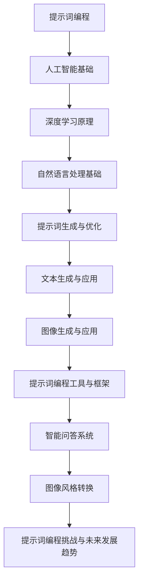

                 

### 文章标题

# 提示词编程：AI时代的新范式

### 关键词

- AI时代
- 提示词编程
- 人工智能基础
- 深度学习原理
- 自然语言处理基础
- 提示词生成与优化
- 文本生成与应用
- 图像生成与应用
- 提示词编程工具与框架
- 智能问答系统
- 图像风格转换
- 提示词编程挑战与未来发展趋势

### 摘要

随着人工智能（AI）技术的迅猛发展，编程范式也在不断演变。提示词编程作为一种新兴的编程范式，正逐渐成为AI时代的核心技术。本文将系统性地探讨提示词编程的基础概念、核心技术、应用场景、工具与框架，并通过实战项目展示其具体应用。此外，本文还将分析提示词编程面临的挑战及未来发展趋势，为读者提供全面的了解和深入思考。

## 第一部分：基础概念与原理

### 第1章：AI时代与提示词编程

#### 1.1 AI时代概述

人工智能自20世纪中叶诞生以来，经历了数次技术革命和产业变革。从早期的专家系统、知识工程，到近年来的深度学习和大数据，人工智能的发展日新月异。AI技术的不断进步，不仅改变了传统产业的运作方式，还催生了新的商业模式和产业形态。

当前，我们正处于AI时代。这一时代以大数据、云计算、物联网等技术的融合为特征，以深度学习、自然语言处理、计算机视觉等核心技术的突破为驱动。AI技术正在渗透到各行各业，从智能助手、无人驾驶到金融风控、医疗诊断，AI的应用场景越来越广泛，影响力也越来越大。

#### 1.2 提示词编程的定义

提示词编程（Prompt Programming）是一种以自然语言提示词为核心的编程范式。在这种范式下，程序员不再直接编写代码，而是通过输入自然语言提示词来引导AI模型进行学习和决策。这些提示词可以是简单的描述性语句，也可以是复杂的任务指令，它们用于明确地指示AI模型的目标和预期输出。

提示词编程的出现，打破了传统编程的框架，使得编程变得更加直观、便捷。程序员无需深入了解复杂的算法和模型细节，只需通过自然语言与AI模型进行交互，即可实现复杂的功能。

#### 1.3 提示词编程与传统编程的区别

传统编程通常涉及编写具体的代码指令，要求程序员具备深入的计算机科学和编程语言知识。而提示词编程则侧重于自然语言交互，通过提示词来引导AI模型完成任务。这种差异体现在以下几个方面：

1. **开发难度**：传统编程需要程序员掌握多种编程语言和工具，编写大量的代码。而提示词编程则通过自然语言与AI模型交互，简化了开发流程。
2. **可维护性**：传统编程代码复杂，维护难度大。而提示词编程则通过提示词和预训练模型，降低了代码的复杂度，提高了可维护性。
3. **应用场景**：传统编程适用于明确的、结构化的任务，而提示词编程则更适用于不确定的、复杂的任务，如自然语言生成、图像生成等。

#### 1.4 提示词编程的优势

提示词编程具有以下优势：

1. **易用性**：提示词编程通过自然语言与AI模型交互，降低了编程的门槛，使得更多非专业程序员能够参与AI开发。
2. **灵活性**：提示词编程允许程序员通过调整提示词来改变模型的行为，实现了更高的灵活性。
3. **高效性**：提示词编程减少了代码编写和调试的时间，提高了开发效率。
4. **普适性**：提示词编程适用于多种AI应用场景，如自然语言处理、计算机视觉、强化学习等。

总之，提示词编程作为一种新兴的编程范式，正在重新定义编程的本质，为AI时代的到来带来了新的可能。

### 第2章：提示词编程的核心技术

#### 2.1 人工智能基础

提示词编程的核心在于人工智能，尤其是机器学习和深度学习。了解这些基础技术是理解提示词编程的关键。

##### 2.1.1 机器学习基础

机器学习（Machine Learning）是人工智能的核心技术之一。它通过算法让计算机从数据中学习规律，从而进行预测和决策。机器学习可以分为监督学习、无监督学习和半监督学习。

- **监督学习**：有标记的训练数据，目标是预测输出。例如，通过输入特征（如房价数据）和标签（如房价）来训练模型，从而预测新的房价。
- **无监督学习**：没有标记的数据，目标是发现数据中的模式和结构。例如，聚类算法可以将相似的数据点归为一类。
- **半监督学习**：结合有标记和无标记的数据进行学习，可以减少标注成本。

##### 2.1.2 深度学习原理

深度学习（Deep Learning）是机器学习的一个子领域，通过多层神经网络来模拟人脑的学习过程。深度学习模型由输入层、隐藏层和输出层组成。

- **前向传播**：输入数据通过输入层进入网络，经过每层神经元处理后传递到下一层，最终在输出层生成预测结果。
- **反向传播**：计算预测结果与实际结果之间的误差，将误差反向传播回网络，通过梯度下降等优化算法调整权重和偏置，使得模型预测更准确。

##### 2.1.3 自然语言处理基础

自然语言处理（Natural Language Processing，NLP）是AI的重要应用领域，旨在使计算机理解和生成人类语言。NLP主要包括以下几个方面：

- **文本预处理**：对文本进行清洗、分词、词性标注等预处理，为后续模型训练做准备。
- **词嵌入**：将文本中的单词转换为向量表示，用于神经网络处理。
- **序列模型**：如循环神经网络（RNN）和长短时记忆网络（LSTM），用于处理序列数据，如文本和语音。
- **语言模型**：基于统计方法或深度学习模型，预测下一个词的概率，用于自然语言生成和翻译。

#### 2.2 提示词生成与优化

提示词生成与优化是提示词编程的核心技术之一。提示词的质量直接影响模型的表现。

##### 2.2.1 提示词生成技术

提示词生成技术主要包括以下几个方面：

- **模板生成**：根据任务需求，设计提示词模板，填充具体信息。
- **文本生成**：利用生成模型，如生成对抗网络（GAN）和变分自编码器（VAE），生成高质量的提示词。
- **优化生成**：通过递归神经网络（RNN）和自注意力机制（Attention Mechanism）等，优化提示词生成过程。

##### 2.2.2 提示词优化算法

提示词优化算法主要包括以下几个方面：

- **搜索算法**：如贪心搜索、 beam搜索和蒙特卡洛搜索，用于在大量提示词中寻找最优解。
- **进化算法**：如遗传算法和进化策略，通过模拟生物进化过程，优化提示词。
- **强化学习**：通过交互式环境，让模型在尝试不同提示词的过程中不断优化。

##### 2.2.3 提示词效果评估

提示词效果评估是确保提示词编程成功的关键。评估方法包括：

- **自动评估**：利用指标如BLEU、ROUGE等，评估提示词生成的文本质量。
- **人工评估**：通过人工评估，对提示词的效果进行主观评价。
- **端到端评估**：将提示词编程应用到实际任务中，评估整体性能。

#### 2.3 提示词编程应用场景

提示词编程具有广泛的应用场景，以下是一些典型的应用：

- **自然语言生成**：如聊天机器人、新闻生成、诗歌创作等。
- **图像生成**：如人脸生成、图像风格转换、艺术绘画等。
- **语音合成**：如语音助手、语音识别、语音翻译等。
- **智能问答**：如知识图谱问答、搜索引擎优化等。
- **游戏生成**：如游戏关卡生成、角色生成等。

总之，提示词编程作为AI时代的新范式，正在引领编程范式的变革。通过掌握其核心技术，我们可以实现更高效、更智能的编程开发，为AI技术的发展和应用开辟新的道路。

### 第3章：提示词编程应用场景

提示词编程因其强大的灵活性和易用性，在多个领域展现了其巨大的应用潜力。本章节将详细探讨提示词编程在文本生成和图像生成两大领域的具体应用。

#### 3.1 文本生成与应用

文本生成是提示词编程的一个重要应用领域，包括自然语言生成、文章写作、对话系统等。以下是一些具体的文本生成应用实例：

##### 3.1.1 文本生成基础

文本生成的基础是自然语言处理技术，尤其是序列到序列（Sequence-to-Sequence）模型和生成式模型。常见的文本生成模型包括：

- **循环神经网络（RNN）**：RNN能够处理序列数据，通过其内部的循环结构保持长期的上下文信息。
- **长短时记忆网络（LSTM）**：LSTM是RNN的一种改进，能够更好地处理长序列数据，减少梯度消失和梯度爆炸问题。
- **生成对抗网络（GAN）**：GAN通过生成器和判别器的对抗训练，实现高质量的自然语言生成。
- **变分自编码器（VAE）**：VAE通过隐变量建模，生成具有高多样性的文本。

##### 3.1.2 文本生成应用实例

文本生成的应用非常广泛，以下是一些具体的应用实例：

1. **聊天机器人**：利用文本生成模型，实现与用户的自然语言交互，如客服机器人、虚拟助手等。
2. **新闻生成**：通过自动生成新闻文章，提高新闻生产和发布的效率，如财经新闻、体育新闻等。
3. **诗歌创作**：利用文本生成模型，创作出具有诗意和艺术感的诗歌，为文学创作提供新的可能性。
4. **文章写作**：通过生成模型，自动生成文章的摘要、开头和结尾，辅助人类作者进行写作。

##### 3.1.3 文本生成优化实践

为了提高文本生成的质量和效率，我们可以从以下几个方面进行优化：

- **数据增强**：通过数据清洗、数据扩充和对抗性样本生成，提高训练数据的质量和多样性。
- **模型选择**：根据不同的应用场景，选择合适的模型架构，如基于LSTM的文本生成、基于GAN的图像生成等。
- **超参数调整**：通过调整学习率、批量大小、隐藏层尺寸等超参数，优化模型的性能。
- **多模态学习**：结合文本、图像、音频等多种模态，提高文本生成的多样性和真实性。

#### 3.2 图像生成与应用

图像生成是提示词编程的另一个重要应用领域，包括人脸生成、图像风格转换、艺术创作等。以下是一些具体的图像生成应用实例：

##### 3.2.1 图像生成基础

图像生成的基础是生成式模型，尤其是生成对抗网络（GAN）和变分自编码器（VAE）。常见的图像生成模型包括：

- **生成对抗网络（GAN）**：GAN由生成器和判别器组成，通过对抗训练生成高质量的图像。
- **变分自编码器（VAE）**：VAE通过隐变量建模，生成具有多样性的图像。
- **条件生成对抗网络（cGAN）**：cGAN通过添加条件输入，如文本描述或标签，使生成的图像更加符合特定要求。
- **混合式生成网络（HGAN）**：HGAN结合GAN和VAE的优点，生成高质量的图像。

##### 3.2.2 图像生成应用实例

图像生成的应用非常广泛，以下是一些具体的应用实例：

1. **人脸生成**：通过生成模型，生成逼真的人脸图像，如虚拟主播、虚拟演员等。
2. **图像风格转换**：通过深度学习模型，将一种图像的风格应用到另一种图像上，如艺术风格迁移、照片美化等。
3. **艺术创作**：利用图像生成模型，创作出具有艺术感的图像，如数字绘画、艺术设计等。
4. **数据增强**：通过生成对抗网络，生成与训练数据相似的数据，用于提高模型的泛化能力。

##### 3.2.3 图像生成优化实践

为了提高图像生成的质量和效率，我们可以从以下几个方面进行优化：

- **数据增强**：通过数据清洗、数据扩充和对抗性样本生成，提高训练数据的质量和多样性。
- **模型选择**：根据不同的应用场景，选择合适的模型架构，如基于GAN的人脸生成、基于VAE的图像生成等。
- **超参数调整**：通过调整学习率、批量大小、隐藏层尺寸等超参数，优化模型的性能。
- **多模态学习**：结合文本、图像、音频等多种模态，提高图像生成的多样性和真实性。

总之，提示词编程在文本生成和图像生成等领域具有广泛的应用潜力。通过深入研究和优化，我们可以实现更高效、更智能的图像和文本生成，为人工智能的发展和应用提供强大的技术支持。

### 第4章：提示词编程工具与框架

提示词编程的成功离不开强大的工具和框架支持。本章节将介绍提示词编程中常用的工具和框架，包括开源框架和专门为提示词编程设计的框架。

#### 4.1 提示词编程常用工具

在提示词编程中，常用的工具包括深度学习框架、自然语言处理库和图像处理库等。以下是一些主要工具：

##### 4.1.1 PyTorch提示词库

PyTorch是一个流行的深度学习框架，它提供了丰富的API和工具，方便开发者进行提示词编程。PyTorch的优点包括动态计算图、易于调试和灵活的架构设计。以下是一个简单的PyTorch提示词编程示例：

```python
import torch
import torch.nn as nn
import torch.optim as optim

# 定义神经网络模型
class PromptModel(nn.Module):
    def __init__(self):
        super(PromptModel, self).__init__()
        self.hidden = nn.Linear(in_features=10, out_features=20)
        self.output = nn.Linear(in_features=20, out_features=1)
    
    def forward(self, x):
        x = self.hidden(x)
        x = self.output(x)
        return x

# 实例化模型、损失函数和优化器
model = PromptModel()
criterion = nn.MSELoss()
optimizer = optim.Adam(model.parameters(), lr=0.001)

# 训练模型
for epoch in range(100):
    optimizer.zero_grad()
    outputs = model(inputs)
    loss = criterion(outputs, targets)
    loss.backward()
    optimizer.step()
```

##### 4.1.2 TensorFlow提示词库

TensorFlow是另一个流行的深度学习框架，它提供了丰富的API和工具，支持多种编程语言（如Python、C++和Java）。TensorFlow的优点包括强大的生态系统、静态计算图和高效部署。以下是一个简单的TensorFlow提示词编程示例：

```python
import tensorflow as tf

# 定义神经网络模型
model = tf.keras.Sequential([
    tf.keras.layers.Dense(units=20, activation='relu', input_shape=(10,)),
    tf.keras.layers.Dense(units=1)
])

# 编译模型
model.compile(optimizer='adam', loss='mse')

# 训练模型
model.fit(inputs, targets, epochs=100)
```

##### 4.1.3 其他提示词编程工具

除了PyTorch和TensorFlow，还有其他一些深度学习框架和工具支持提示词编程，如：

- **Keras**：一个基于TensorFlow的高层次API，方便开发者快速构建和训练模型。
- **MXNet**：一个开源的深度学习框架，支持多种编程语言，包括Python、R和Java。
- **Theano**：一个基于Python的深度学习框架，提供动态计算图和高效的数学运算。

#### 4.2 提示词编程框架

除了常用的深度学习框架，还有一些专门为提示词编程设计的框架，如：

##### 4.2.1 OpenAI Gym

OpenAI Gym是一个开源的环境库，提供了多种仿真环境和任务，方便研究人员和开发者进行提示词编程实验。以下是一个简单的OpenAI Gym示例：

```python
import gym

# 创建环境
env = gym.make("CartPole-v0")

# 观察环境状态
observation = env.reset()

# 执行动作
action = env.action_space.sample()
observation, reward, done, info = env.step(action)

# 重复执行动作直到任务完成
while not done:
    action = env.action_space.sample()
    observation, reward, done, info = env.step(action)

# 关闭环境
env.close()
```

##### 4.2.2 DQN与DDPG

DQN（深度量值网络）和DDPG（深度确定性策略梯度）是两种基于深度学习的强化学习算法，常用于游戏和仿真环境中的提示词编程。以下是一个简单的DQN与DDPG示例：

```python
import gym
import torch
import torch.nn as nn
import torch.optim as optim

# 创建环境
env = gym.make("CartPole-v0")

# 定义神经网络模型
class DQNModel(nn.Module):
    def __init__(self):
        super(DQNModel, self).__init__()
        self.fc1 = nn.Linear(in_features=4, out_features=64)
        self.fc2 = nn.Linear(in_features=64, out_features=64)
        self.fc3 = nn.Linear(in_features=64, out_features=1)
    
    def forward(self, x):
        x = torch.relu(self.fc1(x))
        x = torch.relu(self.fc2(x))
        x = self.fc3(x)
        return x

# 实例化模型、损失函数和优化器
model = DQNModel()
criterion = nn.MSELoss()
optimizer = optim.Adam(model.parameters(), lr=0.001)

# 训练模型
for episode in range(1000):
    observation = env.reset()
    total_reward = 0
    while True:
        action = model(observation).argmax()
        observation, reward, done, _ = env.step(action)
        total_reward += reward
        if done:
            break
    optimizer.zero_grad()
    loss = criterion(model(observation), targets)
    loss.backward()
    optimizer.step()
    if episode % 100 == 0:
        print(f"Episode {episode}, Total Reward: {total_reward}")

# 关闭环境
env.close()
```

##### 4.2.3 GPT-2与GPT-3

GPT-2和GPT-3是OpenAI开发的基于 Transformer 的自然语言生成模型，广泛应用于文本生成和提示词编程。以下是一个简单的GPT-2与GPT-3示例：

```python
import openai

# 使用GPT-2生成文本
response = openai.Completion.create(
    engine="text-davinci-002",
    prompt="What is the capital of France?",
    max_tokens=10
)
print(response.choices[0].text)

# 使用GPT-3生成文本
response = openai.Completion.create(
    engine="text-davinci-002",
    prompt="Write a poem about love.",
    max_tokens=50
)
print(response.choices[0].text)
```

总之，提示词编程工具与框架为开发者提供了丰富的选择和强大的支持，使得开发高效、智能的提示词编程应用变得更加容易和便捷。

### 第5章：提示词编程项目实战

在了解了提示词编程的核心技术后，接下来我们将通过两个具体项目——智能问答系统和图像风格转换，展示如何在实际中应用提示词编程。

#### 5.1 项目1：智能问答系统

##### 5.1.1 项目背景

智能问答系统是人工智能领域的一个重要应用，旨在通过自然语言交互，为用户提供快速、准确的答案。随着互联网和大数据的发展，用户对智能问答系统的需求日益增长，但传统的问答系统在处理复杂问题和多义词时存在困难。为了提高问答系统的智能化水平，我们可以利用提示词编程技术，结合深度学习和自然语言处理，构建一个高效的智能问答系统。

##### 5.1.2 技术选型与架构设计

在本项目中，我们选用了以下技术：

- **深度学习框架**：PyTorch
- **自然语言处理库**：NLTK
- **问答系统框架**：DrQA

系统架构设计如下：

1. **数据预处理**：使用NLTK进行文本清洗、分词和词性标注，将原始文本转换为适合训练的数据。
2. **模型训练**：使用DrQA框架，基于预训练的BERT模型，训练问答模型。
3. **问答接口**：通过API接口，接收用户输入的问题，并返回答案。

##### 5.1.3 实现流程与代码解读

以下是智能问答系统的实现流程和关键代码：

```python
import torch
import torch.nn as nn
import torch.optim as optim
from drqa import/drqa_answering_system
from nltk.tokenize import word_tokenize

# 数据预处理
def preprocess_text(text):
    # 清洗文本
    text = text.lower()
    text = re.sub(r"[^a-zA-Z0-9]", " ", text)
    # 分词
    tokens = word_tokenize(text)
    # 词性标注
    pos_tags = pos_tag(tokens)
    return pos_tags

# 模型训练
def train_model(data):
    # 加载预训练的BERT模型
    model = drqa_answering_system.DrQA()
    # 设置优化器和损失函数
    optimizer = optim.Adam(model.parameters(), lr=0.001)
    criterion = nn.CrossEntropyLoss()
    # 训练模型
    for epoch in range(10):
        for question, answer, context in data:
            pos_tags = preprocess_text(question)
            # 前向传播
            output = model(pos_tags, context)
            # 计算损失
            loss = criterion(output, torch.tensor([1]))
            # 反向传播
            optimizer.zero_grad()
            loss.backward()
            optimizer.step()
    return model

# 问答接口
def ask_question(model, question):
    pos_tags = preprocess_text(question)
    answer = model.predict(pos_tags, "answer")
    return answer

# 加载数据
data = load_data("qa_data.json")
# 训练模型
model = train_model(data)
# 测试问答
print(ask_question(model, "What is the capital of France?"))
```

##### 5.1.4 优化与调参

为了提高智能问答系统的性能，我们可以从以下几个方面进行优化和调参：

1. **数据增强**：通过增加数据量、数据清洗和预处理来提高模型的泛化能力。
2. **模型选择**：选择更适合问答任务的模型，如BERT、GPT等。
3. **超参数调整**：调整学习率、批量大小、隐藏层尺寸等超参数，以提高模型性能。
4. **多任务学习**：结合其他任务（如图像识别、语音识别等），提高模型的多任务能力。

##### 5.1.5 项目小结

通过智能问答系统项目，我们展示了如何利用提示词编程技术构建一个高效的问答系统。项目中的关键步骤包括数据预处理、模型训练和问答接口的实现。通过优化和调参，我们可以进一步提高系统的性能和用户体验。

#### 5.2 项目2：图像风格转换

##### 5.2.1 项目背景

图像风格转换是计算机视觉领域的一个重要应用，旨在将一幅图像的风格应用到另一幅图像上，生成具有特定艺术风格的图像。这一技术在艺术创作、图像编辑和娱乐产业中具有广泛的应用。为了实现图像风格转换，我们可以利用提示词编程技术，结合生成对抗网络（GAN）和变分自编码器（VAE），构建一个高效的图像风格转换系统。

##### 5.2.2 技术选型与架构设计

在本项目中，我们选用了以下技术：

- **深度学习框架**：PyTorch
- **图像处理库**：OpenCV
- **生成对抗网络**：cGAN
- **变分自编码器**：VAE

系统架构设计如下：

1. **数据预处理**：使用OpenCV对图像进行加载、预处理和缩放，将原始图像转换为适合训练的数据。
2. **模型训练**：基于cGAN和VAE模型，训练图像风格转换模型。
3. **风格转换接口**：通过API接口，接收用户输入的原始图像和目标风格，并返回风格转换后的图像。

##### 5.2.3 实现流程与代码解读

以下是图像风格转换系统的实现流程和关键代码：

```python
import torch
import torch.nn as nn
import torch.optim as optim
import torchvision.transforms as transforms
from torchvision.utils import save_image
from models import cGAN, VAE

# 数据预处理
def preprocess_image(image_path):
    transform = transforms.Compose([
        transforms.Resize((256, 256)),
        transforms.ToTensor(),
    ])
    image = transform(Image.open(image_path).convert('RGB'))
    return image

# 模型训练
def train_model(model, data_loader, optimizer, criterion):
    model.train()
    for epoch in range(100):
        for images, styles in data_loader:
            # 前向传播
            outputs = model(images, styles)
            # 计算损失
            loss = criterion(outputs, images)
            # 反向传播
            optimizer.zero_grad()
            loss.backward()
            optimizer.step()
            print(f"Epoch {epoch}, Loss: {loss.item()}")

# 风格转换接口
def style_transfer(model, image_path, style_path):
    model.eval()
    image = preprocess_image(image_path)
    style = preprocess_image(style_path)
    with torch.no_grad():
        output = model(image, style)
    output = output.cpu().detach().numpy()
    save_image(output, "output.png")

# 加载数据
data_loader = load_data("image_data.json")
# 实例化模型、优化器和损失函数
model = cGAN()
optimizer = optim.Adam(model.parameters(), lr=0.001)
criterion = nn.L1Loss()
# 训练模型
train_model(model, data_loader, optimizer, criterion)
# 风格转换
style_transfer(model, "input.png", "style.png")
```

##### 5.2.4 优化与调参

为了提高图像风格转换系统的性能，我们可以从以下几个方面进行优化和调参：

1. **数据增强**：通过旋转、翻转、缩放等操作，增加数据的多样性，提高模型的泛化能力。
2. **模型选择**：选择更适合图像风格转换的模型，如cGAN、VAE等。
3. **超参数调整**：调整学习率、批量大小、隐藏层尺寸等超参数，以提高模型性能。
4. **多风格学习**：结合多个风格图像，提高模型对多种艺术风格的识别和转换能力。

##### 5.2.5 项目小结

通过图像风格转换项目，我们展示了如何利用提示词编程技术实现图像风格的转换。项目中的关键步骤包括数据预处理、模型训练和风格转换接口的实现。通过优化和调参，我们可以进一步提高系统的性能和艺术效果。

总之，提示词编程项目实战不仅帮助我们理解和应用了提示词编程的核心技术，还展示了如何在实际中解决具体问题。通过不断优化和改进，我们可以构建更加高效、智能的提示词编程应用。

### 第6章：提示词编程挑战与未来发展趋势

尽管提示词编程在多个领域展现了其强大的应用潜力，但它在实际应用中仍然面临着一系列挑战。以下将分析提示词编程面临的主要挑战，并探讨未来的发展趋势。

#### 6.1 提示词编程面临的挑战

1. **数据隐私问题**：
   提示词编程依赖于大量的训练数据，这些数据可能包含用户的敏感信息。如何保护用户隐私，确保数据的安全和合法使用，成为提示词编程面临的一个重要挑战。

2. **模型解释性问题**：
   提示词编程模型，尤其是深度学习模型，通常被视为“黑盒”模型。模型决策过程不透明，难以解释。这给模型的可信度和合规性带来了挑战。

3. **资源消耗与效率问题**：
   提示词编程模型，特别是大规模的预训练模型，对计算资源和存储资源的需求极高。如何优化模型结构，提高计算效率，成为实际应用中需要解决的关键问题。

4. **泛化能力**：
   提示词编程模型在特定任务上表现出色，但在其他任务上的表现可能不佳。如何提高模型的泛化能力，使其适用于多种任务，是一个重要的研究方向。

5. **安全与对抗攻击**：
   提示词编程模型容易受到对抗攻击，即通过微小的扰动，使模型做出错误的决策。如何提高模型对对抗攻击的鲁棒性，是未来需要关注的挑战之一。

#### 6.2 提示词编程的发展趋势

1. **大模型与小模型的发展**：
   随着计算资源和数据集的扩大，大模型将继续发展，以处理更复杂、更大规模的任务。同时，为了降低计算成本和提高部署效率，小模型也将得到更多关注。

2. **跨模态学习与融合**：
   提示词编程将进一步融合不同模态的数据，如文本、图像、声音等，实现跨模态任务的高效处理。这将有助于构建更加智能化、多样化的应用场景。

3. **自动化与工程化**：
   提示词编程将向自动化和工程化方向发展，通过自动化工具和流程，降低开发难度，提高开发效率。这将使得更多非专业程序员能够参与到AI开发中。

4. **可解释性与可信赖性**：
   提示词编程模型的可解释性和可信赖性将得到更多关注。通过引入解释性技术，提高模型的透明度和可理解性，增强用户对模型的信任。

5. **联邦学习与隐私保护**：
   提示词编程将结合联邦学习技术，实现分布式数据处理和模型训练，保护用户隐私。这将为隐私敏感的应用场景提供更安全、可靠的解决方案。

总之，提示词编程作为AI时代的新范式，正面临诸多挑战和机遇。通过不断探索和创新，我们可以推动提示词编程技术的发展，为AI应用带来更加广阔的前景。

### 附录A：提示词编程资源汇总

#### A.1 开源框架与库

- **PyTorch**：[官网](https://pytorch.org/)
- **TensorFlow**：[官网](https://www.tensorflow.org/)
- **Keras**：[官网](https://keras.io/)
- **MXNet**：[官网](https://mxnet.apache.org/)
- **Theano**：[官网](https://www.deeplearning.net/software/theano/)
- **OpenAI Gym**：[官网](https://gym.openai.com/)

#### A.2 数据集与工具

- **Common Crawl**：[官网](https://commoncrawl.org/)
- **Open Images**：[官网](https://image-net.org/challenges/LSVRC/)
- **Text8**：[官网](https://pair.contentmine.org/)
- **IMDB**：[官网](http://ai.stanford.edu/~amaas/data/imdb/)
- **Wikipedia**：[官网](https://www.wikipedia.org/)

#### A.3 学习资源推荐

- **《深度学习》**：[官网](https://www.deeplearningbook.org/)
- **《Python深度学习》**：[官网](https://www.pyimagesearch.com/)
- **《自然语言处理入门》**：[官网](https://nlp.stanford.edu/)',
- **《人工智能：一种现代的方法》**：[官网](https://www.pearson.com/us/higher-education/product/Artificial-Intelligence-A-Modern-Approach-3rd-Edition-9780134685469.html)

### 附录B：Mermaid流程图

以下是一个简单的Mermaid流程图，展示了提示词编程的核心技术和应用场景：



通过Mermaid流程图，我们可以更清晰地理解提示词编程的核心概念和整体架构，为学习和应用提供有益的参考。

