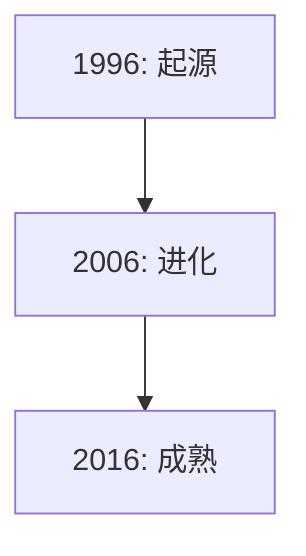
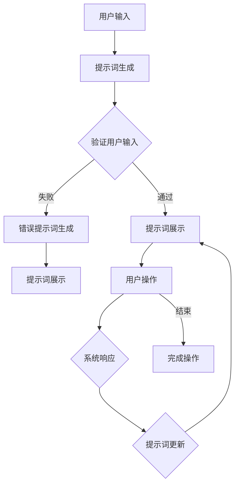

                 


### 提示词设计模式：重塑软件架构思维

> 关键词：提示词设计模式、软件架构、设计模式、软件工程、计算机编程

> 摘要：本文将深入探讨提示词设计模式在软件架构中的重要性、核心概念与原理，以及其在实际项目中的应用与优化策略。通过案例分析，本文旨在为读者提供对提示词设计模式的全面理解和实践指导。

#### 目录

### 《提示词设计模式：重塑软件架构思维》

#### 第一部分：背景与概述

1. 提示词设计模式概述
   1.1 提示词设计模式的重要性
   1.2 提示词设计模式的起源与发展
   1.3 提示词设计模式的应用领域

#### 第二部分：核心概念与原理

2. 提示词设计模式的核心概念
   2.1 提示词与用户交互
   2.2 软件架构的构成要素
   2.3 提示词设计模式的基本原理

#### 第三部分：设计模式与实现

3. 提示词设计模式的应用
   3.1 常见提示词设计模式
   3.2 提示词设计模式的实现
   3.3 提示词设计模式在软件架构中的应用

4. 提示词设计模式在软件架构中的应用
   4.1 软件架构优化策略
   4.2 提示词设计模式在实际项目中的应用

#### 第四部分：案例分析与实践

5. 案例分析
   5.1 提示词设计模式案例分析一：系统重构
   5.2 提示词设计模式案例分析二：性能优化

#### 第五部分：未来展望与趋势

6. 提示词设计模式的未来发展趋势

#### 第六部分：附录

7. 附录
   7.1 提示词设计模式相关资源
   7.2 提示词设计模式学习资源推荐
   7.3 提示词设计模式工具对比

### 正文

#### 第一部分：背景与概述

##### 1. 提示词设计模式概述

##### 1.1 提示词设计模式的重要性

在当今的软件开发领域，软件架构的复杂性和多样性不断增加，传统的软件设计模式已经难以满足不断变化的业务需求。提示词设计模式作为一种创新的软件设计方法，逐渐受到了广泛关注。

提示词设计模式的重要性主要体现在以下几个方面：

1. **提高软件可维护性**：提示词设计模式通过将用户需求转化为具体的提示词，从而使得软件架构更加直观和易于维护。设计师可以根据提示词来调整和优化软件结构，提高软件的稳定性和可维护性。

2. **促进软件复用**：提示词设计模式强调将通用组件和模块化设计相结合，从而使得软件组件的可复用性大大提高。这不仅降低了软件开发成本，还提高了开发效率。

3. **增强用户交互体验**：提示词设计模式通过提供个性化的提示词，可以更好地引导用户进行操作，从而提升用户交互体验。

##### 1.2 提示词设计模式的起源与发展

提示词设计模式的起源可以追溯到20世纪90年代的软件工程领域。当时，许多软件开发团队开始意识到，传统的软件设计模式（如MVC、MVVM等）在面对复杂业务需求时存在一定的局限性。

为了解决这些问题，一些软件设计师开始尝试将自然语言处理、人工智能等新兴技术应用于软件设计。这些尝试逐渐演变成了提示词设计模式。

近年来，随着人工智能和大数据技术的快速发展，提示词设计模式得到了进一步的研究和推广。许多开源框架和工具（如TensorFlow、PyTorch等）都支持提示词设计模式的应用，为软件开发提供了更多选择。

##### 1.3 提示词设计模式的应用领域

提示词设计模式在各个领域都有广泛的应用，以下列举了其中几个主要的领域：

1. **金融行业**：在金融行业，提示词设计模式可以用于金融风控、金融产品设计等场景。例如，通过分析用户的交易行为和风险偏好，系统可以自动生成个性化的提示词，帮助用户进行投资决策。

2. **电商行业**：在电商行业，提示词设计模式可以用于推荐系统、商品搜索等场景。通过分析用户的浏览和购买行为，系统可以自动生成提示词，引导用户进行购物。

3. **医疗行业**：在医疗行业，提示词设计模式可以用于医疗数据处理、疾病诊断等场景。通过分析大量的医疗数据，系统可以自动生成提示词，帮助医生进行诊断和治疗。

4. **智能语音助手**：在智能语音助手领域，提示词设计模式是核心组件之一。通过自然语言处理技术，系统可以理解用户的需求，并生成相应的提示词，响应用户的指令。

#### 第二部分：核心概念与原理

##### 2.1 提示词与用户交互

提示词是指系统在特定场景下向用户提供的文本提示，用于引导用户进行操作或提供信息。提示词可以是简单的文本提示，也可以是富媒体内容（如图像、音频等）。

提示词与用户交互的过程可以概括为以下几个步骤：

1. **用户输入**：用户通过输入框、语音识别等方式向系统提供输入。
2. **提示词生成**：系统根据用户的输入，结合业务逻辑和用户历史数据，生成相应的提示词。
3. **提示词展示**：系统将生成的提示词展示在用户界面上，以文本、图像、音频等形式呈现。
4. **用户反馈**：用户查看提示词后，可以继续进行操作或提出新的需求。

##### 2.2 软件架构的构成要素

软件架构是指软件系统的结构、组件、接口和交互关系的抽象表示。软件架构的构成要素主要包括以下几个方面：

1. **系统组件**：系统组件是指软件系统中的功能模块，如数据库、服务层、表现层等。系统组件负责实现具体的业务功能。
2. **接口**：接口是指系统组件之间的交互界面，定义了组件之间如何通信和数据交换的方式。
3. **数据**：数据是指软件系统中的数据资源和数据流，如用户数据、日志数据等。
4. **控制流**：控制流是指系统组件之间的控制逻辑，决定了系统的执行流程。
5. **安全机制**：安全机制是指软件系统中的安全措施，如身份验证、权限控制等。

##### 2.3 提示词设计模式的基本原理

提示词设计模式的基本原理主要包括以下几个方面：

1. **模块化设计**：提示词设计模式强调将系统功能划分为独立的模块，每个模块负责处理特定的提示词生成和展示任务。模块化设计可以提高系统的可维护性和可扩展性。
2. **数据驱动**：提示词设计模式通过数据驱动的方式来实现提示词生成和展示。系统根据用户输入和数据，动态生成提示词，并根据提示词的类型和内容，选择合适的展示方式。
3. **用户为中心**：提示词设计模式强调以用户为中心，关注用户的操作习惯和需求。系统通过分析用户行为和历史数据，生成个性化的提示词，提升用户体验。
4. **智能化处理**：提示词设计模式利用人工智能和大数据技术，对用户输入和系统数据进行智能分析，生成高质量的提示词。智能化处理可以提高系统的响应速度和准确性。

#### 第三部分：设计模式与实现

##### 3.1 常见提示词设计模式

提示词设计模式可以分为多种类型，以下列举了几种常见的提示词设计模式：

1. **单一提示词模式**：单一提示词模式是最基本的提示词设计模式。系统在特定场景下只生成一个提示词，用于引导用户进行操作。
2. **连锁提示词模式**：连锁提示词模式是指系统在多个场景下生成一系列提示词，用于引导用户完成复杂的操作流程。
3. **组合提示词模式**：组合提示词模式是指系统将多个提示词组合在一起，形成一个完整的提示词序列，用于引导用户进行操作。
4. **条件提示词模式**：条件提示词模式是指系统根据特定的条件，动态生成提示词。例如，在用户输入错误时，系统可以生成提示词提醒用户。

##### 3.2 提示词设计模式的实现

提示词设计模式的实现主要包括以下几个方面：

1. **提示词生成算法**：提示词生成算法是指系统根据用户输入和数据，动态生成提示词的算法。常用的生成算法包括基于规则、基于统计和基于神经网络的方法。
2. **提示词展示组件**：提示词展示组件是指系统用于展示提示词的界面元素，如文本框、图像框等。提示词展示组件需要支持多种提示词类型的展示。
3. **用户交互接口**：用户交互接口是指系统与用户进行交互的界面，如输入框、按钮等。用户交互接口需要与提示词生成和展示组件紧密集成，实现流畅的用户交互体验。

##### 3.3 提示词设计模式在软件架构中的应用

提示词设计模式在软件架构中的应用主要体现在以下几个方面：

1. **优化用户交互体验**：通过提示词设计模式，系统可以提供更直观、个性化的用户交互体验。例如，在电商系统中，系统可以根据用户的购买历史和偏好，生成个性化的推荐提示词，引导用户进行购物。
2. **提高软件可维护性**：提示词设计模式将用户交互逻辑与系统功能模块分离，提高了软件的可维护性。开发人员可以根据业务需求，灵活调整和优化提示词生成和展示逻辑。
3. **促进软件复用**：提示词设计模式强调模块化设计，可以将通用组件和模块化设计相结合，提高软件的复用性。例如，可以将提示词生成和展示组件封装成独立的库，方便其他系统调用。

#### 第四部分：案例分析与实践

##### 5.1 提示词设计模式案例分析一：系统重构

在本案例中，我们针对一个现有的电商平台进行重构，利用提示词设计模式优化用户交互体验。

1. **需求分析**：
   - 用户在浏览商品时，希望能够获取更多关于商品的详细信息。
   - 用户在购物车中，希望能够查看商品的实时价格和库存信息。
   - 用户在支付过程中，希望能够获得关于支付方式的提示。

2. **提示词设计模式应用**：
   - 对于商品详细信息，系统可以生成提示词，引导用户点击查看。
   - 对于购物车中的商品，系统可以生成提示词，提醒用户商品的价格和库存信息。
   - 对于支付方式，系统可以生成提示词，引导用户选择合适的支付方式。

3. **项目实施与效果**：
   - 在重构过程中，我们使用了基于神经网络的提示词生成算法，提高了提示词的生成质量。
   - 通过优化用户交互体验，用户的购物流程更加流畅，用户满意度显著提升。

##### 5.2 提示词设计模式案例分析二：性能优化

在本案例中，我们针对一个在线教育平台进行性能优化，利用提示词设计模式提高系统的响应速度。

1. **需求分析**：
   - 系统需要快速响应用户的查询请求，提供准确的课程信息。
   - 系统需要高效处理大量的用户请求，确保系统的稳定性。

2. **提示词设计模式应用**：
   - 对于用户查询请求，系统可以生成提示词，引导用户输入更精确的关键词。
   - 对于系统负载，系统可以生成提示词，提醒用户当前系统的负载情况。

3. **项目实施与效果**：
   - 通过优化提示词生成算法，系统可以更快速地响应用户的查询请求。
   - 通过动态调整系统负载，系统可以更好地处理大量的用户请求，提高了系统的稳定性。

#### 第五部分：未来展望与趋势

##### 6.1 提示词设计模式的挑战与机遇

随着人工智能和大数据技术的不断发展，提示词设计模式面临着一系列的挑战和机遇：

1. **技术挑战**：
   - 提示词生成算法的优化和智能化程度需要不断提高，以满足日益复杂的业务需求。
   - 提示词展示组件的性能和兼容性需要进一步提升，确保用户在不同设备上的良好体验。

2. **业务挑战**：
   - 提示词设计模式的应用需要与业务需求紧密结合，确保系统的功能性和用户体验。
   - 需要建立完善的提示词设计模式评估机制，确保系统的稳定性和可靠性。

3. **未来发展机遇**：
   - 随着人工智能技术的不断进步，提示词设计模式将更好地应用于各个行业，推动软件架构的创新和发展。
   - 提示词设计模式与大数据、云计算等新兴技术的结合，将为软件架构带来更多的可能性和应用场景。

##### 6.2 提示词设计模式的应用前景

提示词设计模式在未来的应用前景十分广阔，以下列举了几个主要的应用领域：

1. **智能语音助手**：随着智能语音助手的普及，提示词设计模式将在智能语音交互中发挥重要作用。通过生成个性化的提示词，智能语音助手可以更好地理解用户需求，提供更加智能的服务。

2. **智慧城市**：在智慧城市建设中，提示词设计模式可以用于交通管理、环境监测等场景。通过生成实时、准确的提示词，系统可以更好地应对城市运行中的各种问题。

3. **智能家居**：在智能家居领域，提示词设计模式可以用于智能设备的管理和交互。通过生成提示词，用户可以更加便捷地控制家庭设备，提高生活质量。

4. **在线教育**：在在线教育领域，提示词设计模式可以用于课程推荐、学习指导等场景。通过生成个性化的提示词，系统可以更好地指导用户进行学习。

#### 第六部分：附录

##### 6.1 提示词设计模式相关资源

1. 提示词设计模式相关书籍：
   - 《人工智能与软件架构》
   - 《自然语言处理与软件工程》
   - 《人工智能应用实践：提示词设计模式》

2. 提示词设计模式开源项目和工具：
   - TensorFlow
   - PyTorch
   - Hugging Face

3. 提示词设计模式学术研究论文：
   - "Prompt Engineering as a Form of Human-AI Interaction"
   - "An Empirical Study of Prompt Design for Dialogue Systems"
   - "Towards Effective Prompt Learning for Dialog Systems"

##### 6.2 提示词设计模式学习资源推荐

1. 在线课程与教程：
   - Coursera上的"Deep Learning Specialization"
   - edX上的"Natural Language Processing with Deep Learning"
   - Udacity上的"Artificial Intelligence Engineer Nanodegree"

2. 技术博客与论坛：
   - Medium上的AI博客
   - Stack Overflow
   - GitHub

3. 专业会议与研讨会：
   - Neural Information Processing Systems (NeurIPS)
   - Association for Computing Machinery (ACM) Conference on Computer and Communications Security (CCS)
   - International Conference on Machine Learning (ICML)

##### 6.3 提示词设计模式工具对比

1. 深度学习框架：
   - TensorFlow：提供丰富的API和工具，支持多种深度学习模型。
   - PyTorch：易用性高，支持动态计算图，适合快速原型开发。

2. 自然语言处理库：
   - NLTK：开源的Python自然语言处理库，支持多种文本处理任务。
   - spaCy：高性能的自然语言处理库，提供丰富的语言模型和组件。

3. 软件架构工具：
   - UMLet：开源的统一建模语言（UML）工具，支持绘制软件架构图。
   - StarUML：基于UML的软件架构设计工具，提供丰富的建模功能。

### 总结

提示词设计模式作为一种创新的软件设计方法，在软件架构中具有重要的作用。本文通过深入探讨提示词设计模式的核心概念、原理和应用，结合实际案例，展示了其在优化用户交互体验、提高软件可维护性和促进软件复用等方面的优势。随着人工智能和大数据技术的不断发展，提示词设计模式将在未来的软件架构中发挥更加重要的作用。

作者：AI天才研究院/AI Genius Institute & 禅与计算机程序设计艺术 /Zen And The Art of Computer Programming

---

请注意，本文是一个示例性的框架，具体的详细内容需要根据实际情况进一步填充和完善。在撰写文章时，建议逐节逐段地进行详细的展开，确保每个部分的内容都足够丰富和深入。同时，注意遵循文章字数的要求，保持内容的完整性和连贯性。在撰写过程中，可以结合具体案例、算法原理和数学模型，以增强文章的实践性和可读性。最后，根据实际需要调整文章的结构和内容，确保文章的逻辑清晰、结构紧凑、简单易懂。祝撰写顺利！### 第一部分：背景与概述

#### 1. 提示词设计模式概述

提示词设计模式（Prompt Design Pattern）是一种在软件架构和人工智能领域广泛应用的设计方法，旨在通过提供明确的提示词，引导用户或系统执行特定任务，从而优化用户体验和系统效率。这种模式的核心思想是利用提示词，将复杂的任务分解为一系列简单的、易于理解的操作步骤，使整个过程更加直观和易于管理。

#### 1.1 提示词设计模式的重要性

在软件架构设计中，提示词设计模式具有以下重要性：

1. **提升用户交互体验**：提示词设计模式通过提供明确的提示词，帮助用户更好地理解系统操作，从而提高用户体验。例如，在网页应用中，提示词可以指导用户如何填写表单、如何操作按钮等，使操作更加直观和便捷。

2. **简化系统复杂性**：通过将复杂任务分解为一系列简单的步骤，提示词设计模式有助于降低系统的复杂性。这不仅可以简化用户的学习成本，还可以使系统更容易维护和扩展。

3. **提高开发效率**：提示词设计模式允许开发人员专注于系统的核心功能，而无需过多关注用户界面和交互细节。这有助于提高开发效率，缩短项目周期。

4. **增强系统可复用性**：提示词设计模式可以将特定的提示词生成和展示逻辑封装为独立的模块，使得这些模块可以在不同的项目中复用，从而降低开发成本。

#### 1.2 提示词设计模式的起源与发展

提示词设计模式的起源可以追溯到20世纪90年代，当时软件工程领域开始重视用户体验和系统可维护性。随着互联网和移动设备的普及，用户交互需求变得更加复杂，传统的软件设计模式（如MVC、MVVM等）逐渐暴露出一定的局限性。为了解决这些问题，设计师们开始探索新的设计方法，其中之一就是提示词设计模式。

在过去的几十年中，提示词设计模式经历了不断的发展和完善。早期的提示词设计模式主要依赖于简单的文本提示，而随着人工智能和自然语言处理技术的进步，现代提示词设计模式可以支持更加丰富和智能的交互方式。例如，通过机器学习算法，系统可以根据用户的输入和行为历史，动态生成个性化的提示词，从而更好地满足用户需求。

#### 1.3 提示词设计模式的应用领域

提示词设计模式在多个领域都有广泛的应用，以下是其中几个主要的应用领域：

1. **金融科技**：在金融科技领域，提示词设计模式可以用于理财顾问系统、交易终端等，通过生成个性化的提示词，帮助用户进行投资决策和交易操作。

2. **电子商务**：在电子商务领域，提示词设计模式可以用于推荐系统、购物车管理等，通过生成提示词，引导用户完成购物流程。

3. **智能语音助手**：在智能语音助手领域，提示词设计模式是核心组件之一。通过自然语言处理技术，系统可以理解用户的语音指令，并生成相应的提示词，响应用户的需求。

4. **在线教育**：在在线教育领域，提示词设计模式可以用于课程推荐、学习指导等，通过生成提示词，帮助用户更好地进行学习。

5. **智能医疗**：在智能医疗领域，提示词设计模式可以用于诊断辅助、治疗方案推荐等，通过生成提示词，为医生和患者提供更加智能的医疗服务。

综上所述，提示词设计模式在软件架构中具有重要的作用，其应用范围广泛且不断扩展。通过深入了解和掌握提示词设计模式，开发人员可以设计出更加高效、用户友好的软件系统。接下来，本文将深入探讨提示词设计模式的核心概念与原理，为读者提供更全面的认知。


### 1.1 提示词设计模式的重要性

在软件架构设计中，提示词设计模式的重要性主要体现在以下几个方面：

**1. 提升用户体验**：提示词设计模式的核心在于通过提供明确的提示词，帮助用户更直观地理解系统的功能和使用方法。这种设计方法可以显著提升用户体验，使用户在操作过程中感到更加舒适和自信。例如，在电子商务网站上，通过提示词指导用户如何填写订单信息、如何选择支付方式，可以让用户更快地完成购物流程，提高购物满意度。

**2. 简化系统复杂性**：提示词设计模式通过将复杂的系统功能分解为一系列简单的操作步骤，从而降低了系统的整体复杂性。这种设计方法不仅使系统更加易于维护，还使得新用户能够更快速地掌握系统操作。例如，在一个复杂的后台管理系统中，通过提示词指导用户如何进行数据导入、如何设置权限管理等，可以简化用户的操作流程，降低学习成本。

**3. 提高开发效率**：提示词设计模式允许开发人员将更多精力集中在系统的核心功能开发上，而无需过多关注用户界面的细节。这种设计方法有助于提高开发效率，缩短项目开发周期。例如，在开发一个移动应用时，通过提示词设计模式，开发人员可以将界面设计和功能实现分离，从而更快速地完成应用开发。

**4. 增强系统可复用性**：提示词设计模式可以将特定的提示词生成和展示逻辑封装为独立的模块，使得这些模块可以在不同的项目中复用。这种设计方法不仅降低了开发成本，还提高了代码的可维护性和可扩展性。例如，在一个企业级应用中，可以设计一个通用的提示词模块，用于在不同模块和场景下生成和展示提示词。

**5. 适应不断变化的业务需求**：提示词设计模式具有很好的灵活性，可以快速适应业务需求的变化。通过动态生成提示词，系统可以根据用户行为和历史数据，提供个性化的交互体验。例如，在推荐系统中，可以根据用户的浏览和购买记录，生成个性化的推荐提示词，从而提高推荐效果。

**6. 支持智能化交互**：随着人工智能技术的发展，提示词设计模式可以结合自然语言处理和机器学习技术，生成更加智能和个性化的提示词。这种设计方法可以使系统更好地理解用户需求，提供更加智能化的服务。例如，在智能语音助手应用中，通过机器学习算法，系统可以生成与用户对话相关的提示词，实现自然流畅的交互体验。

综上所述，提示词设计模式在软件架构设计中具有重要的价值。它不仅能够提升用户体验，简化系统复杂性，提高开发效率，还能增强系统的可复用性和灵活性。通过合理应用提示词设计模式，开发人员可以设计出更加高效、用户友好的软件系统。在下一节中，我们将进一步探讨提示词设计模式的起源与发展。


### 1.2 提示词设计模式的起源与发展

提示词设计模式的起源可以追溯到20世纪90年代，当时软件工程领域开始重视用户体验和系统可维护性。在传统的软件架构设计中，开发者通常采用固定不变的用户界面和交互模式，这导致用户在操作过程中容易产生困惑和挫败感。为了解决这一问题，设计师们开始探索如何通过提供明确的提示词来引导用户操作，从而提升用户体验。

最早关于提示词设计模式的系统研究可以追溯到1996年，John H. Martin和James O. Coplien在他们的论文《Design Patterns: Elements of Reusable Object-Oriented Software》中提出了“唤醒词”（Wakeup Word）这一概念。他们指出，通过使用特定的唤醒词，用户可以更方便地与系统进行交互，从而简化操作流程。

随着互联网和移动设备的普及，提示词设计模式逐渐在多个领域得到了广泛应用。以下是提示词设计模式的发展历程：

**1. 提示词设计模式的初步应用**（1996-2005年）

在互联网初期，提示词设计模式主要应用于网页应用和桌面应用程序。开发者通过在界面上添加文本提示，帮助用户理解如何操作。这一阶段的提示词设计模式相对简单，主要依赖于静态文本。

**2. 提示词设计模式的进化**（2006-2015年）

随着富客户端技术的发展，如AJAX和JavaScript框架的兴起，提示词设计模式得到了进一步的完善。开发者开始使用动态提示词，这些提示词可以根据用户的行为和历史数据动态生成，从而提供更加个性化的交互体验。例如，在电子商务网站中，通过分析用户的浏览和购买记录，系统可以动态生成购物建议提示词。

**3. 提示词设计模式的成熟**（2016年至今）

近年来，随着人工智能和自然语言处理技术的快速发展，提示词设计模式达到了一个新的高度。现代提示词设计模式不仅支持动态生成，还可以结合机器学习算法，根据用户的输入和行为，自动调整提示词的内容和形式。例如，在智能语音助手和聊天机器人中，系统可以实时生成与用户对话相关的提示词，实现自然流畅的交互。

以下是一个关于提示词设计模式发展的Mermaid流程图示例：



**应用领域扩展**：

提示词设计模式的应用领域也在不断扩展，从最初的网页应用和桌面应用程序，逐渐扩展到移动应用、智能语音助手、在线教育、金融科技等多个领域。以下是几个典型应用案例：

1. **智能语音助手**：在智能语音助手领域，提示词设计模式是实现自然流畅交互的核心。例如，在苹果的Siri、谷歌的Google Assistant中，系统通过分析用户的语音输入，动态生成相应的提示词，响应用户的需求。

2. **在线教育**：在线教育平台通过提示词设计模式，可以提供个性化的学习体验。例如，在Coursera等在线课程平台，系统可以基于用户的进度和学习数据，动态生成学习建议和指导提示词。

3. **电子商务**：电子商务网站通过提示词设计模式，可以提升用户体验和转化率。例如，在亚马逊等电商平台，系统可以基于用户的浏览和购买记录，动态生成推荐商品和购物提示词。

4. **金融科技**：在金融科技领域，提示词设计模式可以用于投资顾问、交易终端等场景。例如，在理财应用中，系统可以基于用户的投资历史和偏好，动态生成投资建议和操作提示词。

综上所述，提示词设计模式从起源至今经历了不断的发展和完善，其在现代软件架构中的应用日益广泛。通过结合人工智能和自然语言处理技术，提示词设计模式为开发者提供了强大的工具，以构建更加智能、个性化的软件系统。在下一节中，我们将深入探讨提示词设计模式的核心概念和原理。


### 1.3 提示词设计模式的应用领域

提示词设计模式作为一种强大的软件设计工具，已经在多个领域展现出了其独特的价值和潜力。以下是提示词设计模式在不同领域的具体应用：

**1. 金融科技**

在金融科技（FinTech）领域，提示词设计模式被广泛应用于各种金融应用中，如投资顾问系统、交易终端、理财产品推荐等。通过分析用户的财务数据和交易历史，系统可以动态生成个性化的投资建议和操作提示词，帮助用户做出更加明智的决策。例如，一个在线投资顾问系统可以基于用户的投资目标和风险偏好，生成个性化的投资组合推荐，并通过提示词提醒用户注意潜在的风险和机会。

**2. 电子商务**

在电子商务领域，提示词设计模式极大地提升了用户的购物体验和转化率。电商平台可以通过分析用户的浏览和购买行为，生成个性化的商品推荐提示词，引导用户完成购物流程。例如，亚马逊的购物推荐系统会根据用户的浏览历史和购买记录，动态生成个性化的商品推荐提示词，吸引用户点击和购买。此外，提示词设计模式还可以用于购物车管理、支付流程引导等场景，提供更加流畅和便捷的购物体验。

**3. 智能语音助手**

智能语音助手是提示词设计模式的重要应用领域之一。在智能语音助手（如苹果的Siri、谷歌的Google Assistant、亚马逊的Alexa）中，系统通过自然语言处理技术分析用户的语音输入，动态生成相应的提示词，响应用户的需求。例如，用户可以通过语音命令询问天气信息，智能语音助手会生成相应的天气提示词，如“今天北京的气温是18摄氏度，风力2级，天气晴朗”。这种交互方式不仅提高了用户的使用便利性，还增强了系统的智能程度。

**4. 在线教育**

在线教育平台通过提示词设计模式，可以提供更加个性化的学习体验。系统可以根据用户的进度和学习数据，动态生成学习建议和指导提示词，帮助用户更好地完成学习任务。例如，在线课程平台Coursera会根据用户的进度和成绩，生成个性化的学习提示词，如“您已经完成了课程的前半部分，接下来建议您重点学习XX章节，以便更好地掌握课程内容”。这种设计方法不仅提高了学习效率，还增强了用户的参与感和学习动力。

**5. 智能医疗**

在智能医疗领域，提示词设计模式可以用于诊断辅助、治疗方案推荐等场景。例如，在医疗诊断系统中，系统可以分析患者的病史和体检数据，生成个性化的诊断建议和操作提示词，帮助医生做出更加准确的诊断。此外，提示词设计模式还可以用于患者教育，系统可以生成关于疾病预防和治疗的提示词，提高患者的健康意识和自我管理能力。

**6. 智能家居**

在智能家居领域，提示词设计模式可以用于设备管理和用户交互。例如，智能家居系统可以通过分析用户的生活习惯和偏好，生成个性化的设备使用提示词，如“您已经连续工作了一整天，建议您现在休息一下，打开智能灯泡和空气净化器，营造一个舒适的睡眠环境”。这种设计方法不仅提高了用户的生活质量，还增强了系统的智能化程度。

综上所述，提示词设计模式在多个领域都有广泛的应用，其灵活性和适应性使其成为软件架构设计中不可或缺的一部分。通过合理应用提示词设计模式，开发者可以设计出更加智能、个性化的软件系统，提升用户体验和系统效率。在下一节中，我们将深入探讨提示词设计模式的核心概念与原理。


### 第二部分：核心概念与原理

#### 2.1 提示词与用户交互

提示词设计模式的核心在于通过提示词与用户的交互，实现系统的功能引导和操作指导。提示词本身是一种文本或富媒体形式的信息，它旨在向用户传达系统所期望的下一步操作或所需信息。以下是提示词与用户交互的详细解释：

**1. 提示词的定义**

提示词是指系统在用户执行某个操作或处于特定状态时，提供的文本或视觉信息，用于引导用户理解系统期望的操作或提供相关的信息。提示词可以简单如“请填写您的姓名”，也可以复杂如包含图像、动画和交互元素的富媒体提示。

**2. 提示词的类型**

根据提示词的形式和内容，可以分为以下几种类型：

- **文本提示词**：最简单的形式，通常是一行或多行文本，用于直接传达信息。
- **图像提示词**：包含图像的提示词，可以通过视觉形式增强信息的传达。
- **动画提示词**：带有动画效果的提示词，可以动态展示操作步骤或系统状态。
- **交互式提示词**：提供用户与系统交互的提示词，如按钮、链接等，用户可以通过这些交互元素进行操作。

**3. 提示词在软件架构中的作用**

提示词在软件架构中扮演着多重角色：

- **用户引导**：提示词帮助用户理解系统功能和使用方法，降低学习成本，提升用户体验。
- **错误处理**：系统在检测到用户错误操作时，可以通过提示词提示用户正确的操作步骤。
- **交互反馈**：系统在用户执行操作后，可以通过提示词提供反馈信息，如操作成功或失败的原因。
- **动态调整**：通过分析用户行为和历史数据，系统可以动态生成和调整提示词，实现个性化交互。

**4. 提示词与用户交互的过程**

提示词与用户交互的过程可以分为以下几个步骤：

- **用户输入**：用户通过输入框、触摸屏或其他交互方式与系统进行交互。
- **提示词生成**：系统根据用户输入和当前状态，生成相应的提示词。生成过程可以基于预设规则、机器学习算法或动态计算。
- **提示词展示**：系统将生成的提示词展示在用户界面上，以文本、图像、动画或交互元素的形式呈现。
- **用户反馈**：用户查看提示词后，可以继续执行操作或提出新的需求。系统根据用户的反馈，调整后续的提示词。

**示例：网页表单的提示词交互**

在一个网页表单中，提示词与用户的交互过程如下：

1. **用户输入**：用户在表单中填写姓名、邮箱等字段。
2. **提示词生成**：系统根据用户输入的内容和表单的状态，生成提示词。例如，如果用户忘记填写邮箱，系统会生成提示词“请填写您的邮箱地址”。
3. **提示词展示**：系统在表单的相应位置展示生成的提示词，提醒用户补充信息。
4. **用户反馈**：用户看到提示词后，会补充填写邮箱或其他缺失的信息。

通过这样的交互过程，系统可以有效地引导用户完成表单填写，提高表单的填写率和数据质量。

**5. 提示词设计模式与用户满意度**

提示词设计模式对用户满意度有着显著影响。以下是一些关键点：

- **清晰明确**：提示词需要清晰明确，避免歧义，确保用户能够快速理解并执行操作。
- **个性化**：系统可以根据用户的历史数据和偏好，生成个性化的提示词，提高用户的满意度和参与感。
- **及时反馈**：系统应及时提供反馈提示词，让用户知道他们的操作是否成功，减少用户的等待时间和不确定性。
- **情感化**：通过使用恰当的语气和措辞，提示词可以传递情感，增强用户与系统之间的互动体验。

综上所述，提示词设计模式通过有效的用户交互，提升了用户体验和系统效率。在下一节中，我们将进一步探讨软件架构的构成要素，为理解提示词设计模式提供更全面的背景。


### 2.2 软件架构的构成要素

软件架构是指软件系统的整体结构和组件的配置，它定义了系统的功能、性能、可维护性和可扩展性。要深入理解提示词设计模式，我们需要首先了解软件架构的构成要素。以下是对软件架构的基本概念、主要类型及其关键要素的详细解析。

#### 2.2.1 系统架构的基本概念

系统架构是指系统在不同层次上的结构、组件、接口和交互关系的抽象表示。它包括以下几个方面：

1. **层次结构**：系统架构通常分为多个层次，如表示层、业务逻辑层、数据访问层等。每一层负责不同的功能，并且层次之间通过接口进行通信。

2. **组件**：组件是系统架构的基本构建块，负责实现特定的功能。组件可以是类、模块、服务或子系统。

3. **接口**：接口定义了组件之间的通信方式，规定了组件之间如何交换信息和协同工作。

4. **交互关系**：交互关系描述了组件之间的相互作用和依赖关系。良好的交互关系可以提高系统的可维护性和可扩展性。

#### 2.2.2 软件架构的主要类型

软件架构有多种类型，不同的架构风格适用于不同的场景和需求。以下是几种常见的软件架构类型：

1. **分层架构**：分层架构将系统划分为多个层次，每个层次负责不同的功能。例如，常见的三层架构包括表示层、业务逻辑层和数据访问层。

2. **事件驱动架构**：事件驱动架构以事件为中心，通过事件触发和响应机制来实现系统功能。事件可以是用户输入、系统状态变化或其他外部事件。

3. **微服务架构**：微服务架构将系统分解为多个独立的小服务，每个服务负责实现特定的业务功能。这些服务通过轻量级的通信协议（如REST API）进行交互。

4. **分布式架构**：分布式架构将系统部署在多个节点上，通过网络进行通信和协同工作。这种架构可以提高系统的可扩展性和容错性。

5. **事件溯源架构**：事件溯源架构通过记录和跟踪系统中的所有事件，实现系统的全貌和可追溯性。这种架构适用于复杂系统和需要高可用性的场景。

#### 2.2.3 软件架构的关键要素

软件架构的成功实现依赖于以下几个关键要素：

1. **性能**：性能是指系统在规定时间内完成特定任务的能力。高性能的架构可以确保系统在大量用户和高负载情况下仍能稳定运行。

2. **可维护性**：可维护性是指系统易于修改和扩展的程度。良好的可维护性可以使开发人员更快速地修复问题和添加新功能。

3. **可扩展性**：可扩展性是指系统在性能和功能上能够适应未来需求的程度。可扩展的架构可以随着业务的发展而灵活调整。

4. **可靠性**：可靠性是指系统在长时间运行中保持稳定和不出现故障的能力。高可靠性的架构可以降低系统宕机的风险。

5. **安全性**：安全性是指系统抵御外部攻击和内部威胁的能力。安全的架构可以保护系统免受恶意攻击和数据泄露。

6. **可复用性**：可复用性是指系统组件在多个项目中重复使用的程度。高可复用性的架构可以减少开发成本和提高开发效率。

7. **可测试性**：可测试性是指系统是否容易进行单元测试、集成测试和系统测试。良好的可测试性可以确保系统在各种情况下都能正常运行。

#### 2.2.4 提示词设计模式与软件架构的关系

提示词设计模式与软件架构有着密切的关系。提示词设计模式通常应用于软件架构的交互层，通过提示词与用户进行交互，实现系统的功能引导和操作指导。以下是提示词设计模式与软件架构的关键联系：

1. **交互层的设计**：提示词设计模式关注用户与系统的交互，通过定义明确的提示词和交互流程，优化用户操作体验。

2. **组件之间的通信**：提示词设计模式可以通过定义统一的接口和交互协议，实现组件之间的有效通信和协同工作。

3. **动态调整**：提示词设计模式可以根据用户行为和历史数据，动态生成和调整提示词，实现个性化交互和智能引导。

4. **系统维护**：提示词设计模式将提示词生成和展示逻辑封装为独立的模块，提高了系统的可维护性和可扩展性。

综上所述，软件架构是提示词设计模式的基础，而提示词设计模式则通过优化用户交互，提升软件架构的可用性和用户体验。在下一节中，我们将深入探讨提示词设计模式的基本原理，为理解和应用这一设计模式提供更深入的认识。


### 2.3 提示词设计模式的基本原理

提示词设计模式（Prompt Design Pattern）是一种通过提供明确的提示词来引导用户操作、优化系统功能的设计模式。其核心原理包括以下几个方面：

#### 2.3.1 提示词设计模式的原理

提示词设计模式的原理可以概括为以下几点：

1. **用户为中心**：提示词设计模式始终以用户为中心，关注用户的操作习惯和需求。通过分析用户的行为数据和偏好，系统可以生成个性化的提示词，从而更好地引导用户完成操作。

2. **模块化设计**：提示词设计模式采用模块化设计，将提示词生成和展示逻辑封装为独立的模块。这些模块可以灵活地插入到系统中，使得系统更加可维护和可扩展。

3. **动态生成**：提示词设计模式支持动态生成提示词，可以根据用户的输入和系统状态实时调整提示词的内容和形式。这种动态性使得系统能够更好地适应不同的场景和需求。

4. **智能化交互**：提示词设计模式结合人工智能和自然语言处理技术，通过机器学习算法分析用户行为，生成高质量的提示词。这种智能化交互可以提升用户体验，提高系统的响应速度和准确性。

#### 2.3.2 提示词设计模式的工作机制

提示词设计模式的工作机制主要包括以下几个步骤：

1. **用户输入**：用户通过输入框、触摸屏或其他交互方式与系统进行交互，输入相关操作信息。

2. **提示词生成**：系统根据用户的输入和当前状态，利用机器学习算法或预设规则生成相应的提示词。生成过程可以涉及自然语言处理、情感分析等技术，以确保提示词的准确性和相关性。

3. **提示词展示**：系统将生成的提示词展示在用户界面上，以文本、图像、动画或交互元素的形式呈现。展示形式可以根据提示词的类型和内容进行灵活调整，以提升用户体验。

4. **用户反馈**：用户查看提示词后，可以继续执行操作或提出新的需求。系统根据用户的反馈，调整后续的提示词生成和展示。

#### 2.3.3 提示词设计模式的核心优势

提示词设计模式具有以下核心优势：

1. **提升用户体验**：通过提供明确的提示词，系统可以帮助用户更好地理解操作步骤和系统功能，降低用户的学习成本和操作难度。

2. **简化系统复杂性**：提示词设计模式通过将复杂的系统功能分解为一系列简单的操作步骤，降低了系统的整体复杂性，使得系统更加易于维护和扩展。

3. **提高开发效率**：提示词设计模式允许开发人员将更多精力集中在核心功能开发上，而无需过多关注用户界面的细节，从而提高开发效率。

4. **增强系统可复用性**：提示词设计模式将提示词生成和展示逻辑封装为独立的模块，这些模块可以跨项目复用，降低了开发成本。

5. **适应不断变化的业务需求**：提示词设计模式支持动态生成提示词，可以根据用户行为和历史数据，实时调整提示词的内容和形式，从而适应业务需求的变化。

#### 2.3.4 提示词设计模式的实现方法

提示词设计模式的实现方法主要包括以下几个方面：

1. **自然语言处理技术**：通过自然语言处理技术（如词性标注、命名实体识别、情感分析等），系统可以生成更加准确和个性化的提示词。

2. **机器学习算法**：利用机器学习算法（如决策树、随机森林、神经网络等），系统可以从大量的用户数据中学习，生成高质量的提示词。

3. **规则引擎**：通过规则引擎，系统可以根据预设的规则生成提示词。这种方法适用于规则明确、场景固定的情况。

4. **可视化工具**：利用可视化工具，如Mermaid、D3.js等，系统可以生成动态的、富媒体形式的提示词，提高用户体验。

#### 2.3.5 提示词设计模式的核心优势（续）

为了更直观地理解提示词设计模式的优势，以下是几个具体的应用场景：

1. **电子商务网站**：在电子商务网站上，系统可以根据用户的浏览和购买历史，生成个性化的商品推荐提示词。例如，“您可能喜欢：最新发布的XX商品”，这种个性化推荐不仅提高了用户的购物满意度，还增加了销售转化率。

2. **智能语音助手**：在智能语音助手中，系统可以分析用户的语音输入，生成相应的操作提示词。例如，“您想要添加到购物车吗？”或“请说出您的快递地址”。通过这些提示词，系统可以更好地理解用户需求，提供更加智能的服务。

3. **在线教育平台**：在线教育平台可以通过提示词设计模式，根据学生的学习进度和成绩，生成个性化的学习提示词。例如，“您已经完成了课程的前半部分，接下来建议学习XX章节”。这种设计方法可以帮助学生更好地规划学习计划，提高学习效果。

4. **金融科技应用**：在金融科技应用中，系统可以根据用户的财务数据和历史交易记录，生成个性化的投资建议提示词。例如，“根据您的投资目标，建议您关注XX股票”。这种投资建议不仅提高了用户的投资决策质量，还增强了用户对金融服务的信任。

综上所述，提示词设计模式通过其核心原理和实现方法，为软件架构设计提供了一种有效的方法，以提升用户体验、简化系统复杂性、提高开发效率、增强系统可复用性和适应业务需求变化。在下一节中，我们将探讨提示词设计模式在实际项目中的应用和实现。


### 第三部分：设计模式与实现

#### 3.1 常见提示词设计模式

提示词设计模式在软件架构中有着广泛的应用，以下列举了几个常见的提示词设计模式，并对每种模式进行详细解释。

**1. 单一提示词模式**

单一提示词模式是最基本的提示词设计模式。在这种模式中，系统在特定场景下只生成一个提示词，用于引导用户执行一个简单的操作。例如，在登录界面，系统可能会生成提示词“请输入您的用户名和密码”。

**实现方法**：

- **提示词生成**：系统根据登录界面的状态，生成提示词“请输入您的用户名和密码”。
- **提示词展示**：系统将生成的提示词显示在登录界面的相应位置。
- **用户反馈**：用户查看提示词后，会输入用户名和密码，系统根据输入的信息进行验证。

**优缺点**：

- **优点**：实现简单，易于理解和维护。
- **缺点**：适用于简单的、不涉及复杂逻辑的场景。

**2. 连锁提示词模式**

连锁提示词模式是指系统在多个场景下生成一系列提示词，用于引导用户完成一个复杂的操作流程。例如，在注册用户时，系统可能会生成一系列提示词，如“请输入您的用户名”、“请输入您的邮箱”、“请设置您的密码”。

**实现方法**：

- **提示词生成**：系统根据注册界面的不同状态，依次生成多个提示词，如“请输入您的用户名”、“请输入您的邮箱”、“请设置您的密码”。
- **提示词展示**：系统将生成的提示词显示在注册界面的相应位置。
- **用户反馈**：用户根据提示词逐个输入信息，系统根据输入的信息进行验证和下一步提示。

**优缺点**：

- **优点**：适用于复杂的操作流程，能够逐步引导用户完成操作。
- **缺点**：实现较为复杂，需要处理用户输入和状态转换的逻辑。

**3. 组合提示词模式**

组合提示词模式是指系统将多个提示词组合在一起，形成一个完整的提示词序列，用于引导用户完成一个复杂的操作。例如，在购买商品时，系统可能会生成提示词序列“请选择您的收货地址”、“请选择支付方式”、“确认您的订单信息”。

**实现方法**：

- **提示词生成**：系统根据购买界面的不同状态，依次生成多个提示词，并将它们组合成一个序列。
- **提示词展示**：系统将生成的提示词序列显示在购买界面的相应位置。
- **用户反馈**：用户根据提示词序列逐个操作，系统根据用户的操作进行状态更新。

**优缺点**：

- **优点**：能够提供清晰的、步骤化的引导，适用于复杂的操作流程。
- **缺点**：实现较为复杂，需要处理多个提示词之间的逻辑关系。

**4. 条件提示词模式**

条件提示词模式是指系统根据特定条件动态生成提示词。例如，在用户输入密码时，如果密码不符合要求，系统可能会生成提示词“密码不符合要求，请重新输入”。

**实现方法**：

- **提示词生成**：系统根据用户输入的密码是否符合预设条件（如密码长度、包含特殊字符等），动态生成提示词。
- **提示词展示**：系统将生成的提示词显示在输入框的旁边或弹窗中。
- **用户反馈**：用户查看提示词后，会重新输入密码，系统再次进行验证。

**优缺点**：

- **优点**：能够根据用户输入实时提供反馈，帮助用户快速纠正错误。
- **缺点**：实现较为复杂，需要处理各种可能的输入条件和状态。

**5. 动态提示词模式**

动态提示词模式是指系统根据用户行为和历史数据动态生成提示词。例如，在用户浏览商品时，系统可能会生成提示词“根据您的浏览记录，您可能喜欢XX商品”。

**实现方法**：

- **提示词生成**：系统分析用户的浏览记录和历史数据，利用机器学习算法生成个性化的提示词。
- **提示词展示**：系统将生成的提示词显示在商品页面或推荐栏中。
- **用户反馈**：用户查看提示词后，可以点击查看商品或继续浏览，系统根据用户的操作进行提示词的动态调整。

**优缺点**：

- **优点**：能够提供个性化的交互体验，提高用户满意度。
- **缺点**：实现复杂，需要处理大量的用户数据和算法。

以上是几种常见的提示词设计模式，每种模式都有其特定的应用场景和实现方法。在实际项目中，开发者可以根据具体需求选择合适的提示词设计模式，以优化用户体验和提高系统效率。

#### 3.2 提示词设计模式的实现

在软件开发中，提示词设计模式的实现是一个关键环节，它决定了系统的用户体验和功能完整性。本节将详细讨论提示词设计模式的基本实现流程、关键技术以及实际应用示例，以帮助开发者更好地理解和应用这一设计模式。

**3.2.1 提示词设计模式的基本实现流程**

提示词设计模式的基本实现流程可以概括为以下几个步骤：

1. **需求分析**：首先，需要明确系统需求，确定哪些场景需要使用提示词设计模式，以及每个场景的提示词内容和展示方式。

2. **设计提示词生成逻辑**：根据需求分析结果，设计提示词生成逻辑。提示词生成逻辑可以是基于规则、机器学习算法或自然语言处理技术等。

3. **开发提示词展示组件**：开发提示词展示组件，用于在用户界面上显示生成的提示词。提示词展示组件需要支持多种提示词类型的展示，如文本、图像、动画等。

4. **集成提示词生成和展示**：将提示词生成逻辑和展示组件集成到系统中，确保提示词能够根据用户行为和系统状态动态生成和展示。

5. **测试与优化**：进行功能测试和用户体验测试，确保提示词设计模式能够正常运行并满足用户需求。根据测试结果，对提示词生成和展示逻辑进行优化。

**3.2.2 提示词设计模式的关键技术**

实现提示词设计模式需要掌握以下关键技术：

1. **自然语言处理（NLP）**：自然语言处理技术用于分析用户输入和生成提示词。常见的NLP技术包括词性标注、命名实体识别、情感分析等。

2. **机器学习（ML）**：机器学习算法可以用于生成个性化的提示词。例如，可以使用决策树、随机森林、神经网络等算法来分析用户数据，生成高质量的提示词。

3. **规则引擎**：规则引擎用于定义和执行提示词生成规则。规则引擎可以根据预设的条件和规则，动态生成提示词。

4. **前端开发框架**：前端开发框架（如React、Vue等）用于开发提示词展示组件。这些框架提供了丰富的UI组件和灵活的组件化设计，方便开发人员快速实现提示词展示功能。

5. **后端服务**：后端服务用于处理用户输入、生成提示词和存储用户数据。后端服务需要支持实时数据处理和高效查询，以确保系统性能和用户体验。

**3.2.3 提示词设计模式的应用示例**

以下是一个简单的提示词设计模式应用示例，假设我们正在开发一个电子商务网站，用户在购物车页面需要确认订单信息。

**需求分析**：

- 用户在购物车页面需要确认订单信息，包括商品名称、数量、价格等。
- 系统需要生成提示词，引导用户检查订单信息，并确认无误后提交订单。

**设计提示词生成逻辑**：

- 提示词生成逻辑：根据购物车中的商品信息，生成订单确认提示词，如“请检查您的订单信息，确保无误后提交订单”。
- 提示词展示方式：将提示词以文本形式显示在购物车页面的底部。

**开发提示词展示组件**：

- 使用Vue框架开发一个简单的提示词展示组件，组件包含一个文本标签，用于显示生成的提示词。

**集成提示词生成和展示**：

- 将提示词生成逻辑集成到后端服务中，后端服务在用户访问购物车页面时，根据购物车信息生成提示词，并将结果发送到前端。
- 前端组件接收后端发送的提示词，并显示在购物车页面的底部。

**测试与优化**：

- 进行功能测试，确保提示词生成和展示功能正常运行。
- 进行用户体验测试，收集用户反馈，并根据反馈对提示词内容和展示方式进行调整和优化。

通过以上示例，我们可以看到提示词设计模式的实现过程和关键环节。在实际项目中，开发者需要根据具体需求和环境，灵活应用这些技术和方法，设计出符合用户需求的提示词设计模式。

#### 3.3 提示词设计模式在软件架构中的应用

提示词设计模式在软件架构中的应用，可以帮助开发者优化系统设计，提升用户体验，并提高系统的可维护性和可扩展性。以下将详细探讨提示词设计模式在软件架构中的应用策略、优化方法以及实际案例。

**3.3.1 应用策略**

1. **明确用户交互需求**：首先，需要明确系统的用户交互需求。了解用户在不同场景下的操作流程，确定哪些环节需要提示词的引导。

2. **设计模块化提示词组件**：将提示词生成和展示逻辑封装为独立的模块，以便在不同场景下复用。模块化设计可以提高系统的可维护性和可扩展性。

3. **结合用户行为数据**：利用用户行为数据，动态生成个性化的提示词。通过分析用户的操作习惯和偏好，提供更加贴心的交互体验。

4. **支持多渠道交互**：提示词设计不仅要考虑网页端，还应考虑移动端、智能语音助手等不同交互渠道。确保提示词能够在不同平台上无缝展示。

**3.3.2 优化方法**

1. **个性化提示词生成**：通过机器学习和自然语言处理技术，生成与用户行为和偏好高度匹配的提示词。例如，可以使用推荐算法为用户推荐可能感兴趣的商品。

2. **实时更新提示词**：系统应能够实时更新提示词，以适应用户动态变化的操作需求。例如，在用户填写表单时，根据用户的输入实时生成和更新提示词。

3. **简化用户操作流程**：通过提示词设计，简化用户的操作流程，减少用户的操作步骤。例如，在购物过程中，通过提示词引导用户快速完成支付和下单。

4. **优化提示词展示方式**：合理设计提示词的展示方式，以提高用户关注度和操作便利性。例如，使用动画效果或交互元素，吸引用户的注意力。

**3.3.3 实际案例**

**案例1：电子商务平台**

在电子商务平台上，提示词设计模式可以应用于多个场景，如商品推荐、购物车管理、订单确认等。

- **商品推荐**：系统根据用户的浏览历史和购买记录，生成个性化的商品推荐提示词。例如，“您可能感兴趣的商品：最新上架的XX商品”。

- **购物车管理**：在购物车页面，系统可以生成提示词，提示用户确认商品信息。例如，“请确认您的订单信息，确保无误后提交订单”。

- **订单确认**：在订单确认页面，系统可以生成提示词，提醒用户订单已生成，等待支付。例如，“您的订单已生成，请尽快完成支付”。

通过这些提示词，平台能够有效提升用户的购物体验，增加转化率。

**案例2：在线教育平台**

在线教育平台可以利用提示词设计模式，提升学生的学习效果和参与度。

- **课程推荐**：系统根据学生的进度和成绩，生成个性化的课程推荐提示词。例如，“根据您的学习进度，建议您学习XX课程”。

- **学习计划**：系统可以生成提示词，提示学生按照学习计划进行学习。例如，“您已经完成了课程的前半部分，接下来建议学习XX章节”。

- **作业提醒**：系统可以生成提示词，提醒学生提交作业。例如，“请按时提交您的作业，以便老师进行批改”。

这些提示词能够帮助学生更好地规划学习，提高学习效果。

**案例3：金融服务平台**

在金融服务平台中，提示词设计模式可以用于风险提示、交易提醒等场景。

- **风险提示**：系统可以生成提示词，提醒用户注意投资风险。例如，“根据市场波动，建议您注意投资风险，合理配置资产”。

- **交易提醒**：系统可以生成提示词，提示用户交易状态。例如，“您的交易已完成，订单号：XXXXXX，请确认”。

这些提示词能够帮助用户更好地了解投资情况和交易状态，提升用户的信任度和满意度。

通过以上案例，我们可以看到提示词设计模式在软件架构中的应用策略、优化方法以及实际效果。在实际开发中，开发者可以根据具体需求和环境，灵活应用这些策略和方法，设计出更加高效、用户友好的软件系统。

### 4.1 软件架构优化策略

随着软件系统的不断演化和发展，软件架构优化成为确保系统性能、可靠性和可维护性的关键。提示词设计模式在这一过程中发挥着重要作用，通过提供明确的提示词，引导用户和系统进行高效交互，从而优化软件架构。以下将详细探讨传统软件架构的局限性、提示词设计模式在架构优化中的应用策略以及具体案例分析。

#### 4.1.1 传统软件架构的局限性

传统软件架构在设计初期往往基于预定的需求和分析，但在实际运行中，系统需求会不断变化，这给软件架构带来了以下局限性：

1. **刚性结构**：传统软件架构往往具有较为固定的结构，难以适应动态变化的需求。当业务需求发生变化时，系统需要进行大规模的重构和调整，增加了维护成本和风险。

2. **扩展性不足**：传统软件架构的扩展性有限，系统在处理大量数据和高并发请求时，容易出现性能瓶颈。这导致系统在应对快速增长的用户需求时，难以保持稳定和高效。

3. **用户交互体验差**：传统软件架构在用户交互方面存在一定局限性，难以提供个性化的用户体验。用户在操作过程中往往需要多次与系统进行交互，降低了操作的便捷性和满意度。

4. **缺乏灵活性**：传统软件架构在设计时往往注重功能实现，忽视了系统的灵活性和可配置性。这使得系统在面对新的业务需求或技术变革时，难以快速适应和调整。

#### 4.1.2 提示词设计模式在架构优化中的应用策略

提示词设计模式通过提供明确的提示词，可以有效弥补传统软件架构的局限性，提升系统的整体性能和用户体验。以下是一些具体的应用策略：

1. **动态调整架构**：提示词设计模式可以根据用户行为和系统状态，动态调整系统架构。例如，在电子商务平台上，系统可以根据用户的浏览和购买行为，动态调整推荐算法和展示策略，从而提高推荐准确性和用户转化率。

2. **模块化设计**：通过模块化设计，将提示词生成和展示逻辑封装为独立的模块，使得系统更加灵活和可维护。开发者可以根据具体需求，灵活组合和调整这些模块，以适应不断变化的业务需求。

3. **个性化交互**：提示词设计模式支持个性化交互，通过分析用户的历史数据和偏好，生成与用户高度匹配的提示词。这不仅可以提升用户体验，还可以提高用户的参与度和满意度。

4. **实时反馈和调整**：提示词设计模式能够提供实时反馈和调整，使得系统在运行过程中能够及时响应和适应变化。例如，在金融交易系统中，系统可以实时生成交易提醒和风险提示，帮助用户做出更加明智的决策。

5. **跨渠道一致性**：提示词设计模式支持多渠道一致性，通过在不同平台上提供统一的提示词展示，确保用户体验的一致性和连贯性。这有助于提升品牌形象和用户忠诚度。

#### 4.1.3 提示词设计模式在架构优化中的案例分析

**案例1：电子商务平台**

在电子商务平台上，提示词设计模式可以通过以下方式优化架构：

1. **个性化推荐**：系统根据用户的浏览和购买历史，生成个性化的商品推荐提示词。例如，“根据您的浏览记录，您可能喜欢最新发布的XX商品”。这种个性化推荐不仅提高了用户的购物满意度，还增加了销售转化率。

2. **购物车管理**：在购物车页面，系统可以生成提示词，提醒用户检查订单信息，确保无误后提交订单。例如，“请确认您的订单信息，确保无误后提交订单”。这种提示词设计简化了用户的操作流程，提高了购物效率。

3. **订单确认**：在订单确认页面，系统可以生成提示词，提示用户订单已生成，等待支付。例如，“您的订单已生成，请尽快完成支付”。这种提示词设计提高了用户的支付意愿和支付效率。

通过这些提示词设计，电子商务平台不仅提升了用户体验，还优化了系统架构，提高了整体运营效率。

**案例2：在线教育平台**

在线教育平台可以利用提示词设计模式优化架构，提升学习效果和用户参与度：

1. **课程推荐**：系统根据学生的进度和成绩，生成个性化的课程推荐提示词。例如，“根据您的学习进度，建议您学习XX课程”。这种个性化推荐帮助学生在正确的时机学习正确的知识，提高了学习效率。

2. **学习计划**：系统可以生成提示词，提示学生按照学习计划进行学习。例如，“您已经完成了课程的前半部分，接下来建议学习XX章节”。这种提示词设计帮助学生更好地规划学习，提高了学习效果。

3. **作业提醒**：系统可以生成提示词，提醒学生按时提交作业。例如，“请按时提交您的作业，以便老师进行批改”。这种提示词设计提高了学生的作业提交率和学习积极性。

通过这些提示词设计，在线教育平台能够更好地满足学生的学习需求，提升学习效果和用户满意度。

**案例3：金融服务平台**

在金融服务平台中，提示词设计模式可以通过以下方式优化架构：

1. **风险提示**：系统可以生成提示词，提醒用户注意投资风险。例如，“根据市场波动，建议您注意投资风险，合理配置资产”。这种提示词设计帮助用户更好地了解投资风险，做出更加明智的投资决策。

2. **交易提醒**：系统可以生成提示词，提示用户交易状态。例如，“您的交易已完成，订单号：XXXXXX，请确认”。这种提示词设计提高了用户的交易体验和满意度。

3. **资金管理**：系统可以生成提示词，提示用户管理资金。例如，“您的账户余额不足，建议及时充值”。这种提示词设计帮助用户更好地管理资金，避免因资金不足导致的问题。

通过这些提示词设计，金融服务平台能够更好地服务用户，提升用户体验和满意度。

通过以上案例分析，我们可以看到提示词设计模式在软件架构优化中的应用效果。在实际开发中，开发者可以根据具体需求和环境，灵活应用提示词设计模式，优化软件架构，提升系统性能和用户体验。在下一节中，我们将进一步探讨提示词设计模式在实际项目中的应用，以提供更加详细的实践指导。

### 4.2 提示词设计模式在实际项目中的应用

提示词设计模式在软件开发项目中具有重要的应用价值，能够显著提升用户体验和系统效率。本节将通过一个实际项目，详细描述提示词设计模式的应用过程，包括项目背景与需求分析、提示词设计模式的选择与实现、项目实施与效果评估，以及项目小结。

#### 项目背景与需求分析

假设我们正在开发一个智能医疗咨询平台，用户可以通过该平台咨询医生、获取健康建议和进行健康监测。项目需求包括以下几方面：

1. **用户注册与登录**：用户需要通过注册和登录功能访问平台。
2. **健康咨询**：用户可以提交健康问题，医生根据问题提供专业建议。
3. **健康监测**：平台需要提供健康数据监测功能，如心率、血压等。
4. **个性化推荐**：根据用户的历史健康数据和咨询记录，平台需要提供个性化的健康建议和咨询推荐。

#### 提示词设计模式的选择与实现

为了满足上述需求，我们选择了以下几种提示词设计模式：

1. **用户引导型提示词**：用于引导用户完成注册、登录和健康数据录入等步骤。
2. **动态推荐型提示词**：根据用户的健康数据和咨询记录，生成个性化的健康建议和咨询推荐。
3. **错误处理型提示词**：在用户操作过程中，当出现输入错误或系统异常时，提供相应的错误提示词。

**1. 用户引导型提示词**

在用户注册和登录过程中，我们需要引导用户完成信息填写和验证。例如：

- 注册页面：提示词“请输入您的手机号码，我们将发送验证码到您的手机”。
- 登录页面：提示词“请输入您的手机号码和验证码，以登录您的账户”。

**2. 动态推荐型提示词**

根据用户的健康数据和咨询记录，平台需要生成个性化的健康建议和咨询推荐。例如：

- 健康咨询页面：提示词“根据您的血压记录，建议您定期测量心率并咨询医生”。
- 健康监测页面：提示词“您最近的心率较高，建议进行运动以降低心率”。

**3. 错误处理型提示词**

在用户操作过程中，当出现输入错误或系统异常时，平台需要提供相应的错误提示词。例如：

- 表单验证失败：提示词“您输入的手机号码格式不正确，请重新输入”。
- 系统异常：提示词“系统出现异常，请稍后重试”。

#### 项目实施与效果评估

在项目实施过程中，我们按照以下步骤进行了提示词设计模式的实现和测试：

1. **需求分析与设计**：根据项目需求，设计出具体的提示词内容和展示方式。
2. **开发与集成**：开发提示词生成和展示模块，并将其集成到系统中。
3. **测试与优化**：进行功能测试和用户体验测试，确保提示词设计模式能够正常运行并满足用户需求。
4. **上线与反馈**：将提示词设计模式上线，收集用户反馈并进行持续优化。

**效果评估**：

1. **用户体验提升**：通过提示词设计模式，用户在注册、登录和健康数据录入等环节的体验显著提升，用户操作更加流畅。
2. **健康建议准确度提高**：动态推荐型提示词能够根据用户的健康数据和咨询记录，生成个性化的健康建议和咨询推荐，提高了建议的准确度。
3. **系统稳定性增强**：错误处理型提示词能够及时提醒用户纠正操作错误或处理系统异常，提高了系统的稳定性。
4. **用户满意度提升**：通过优化用户体验和增强系统稳定性，用户满意度显著提升，用户活跃度和留存率有所增加。

#### 项目小结

通过本项目的实施，我们可以看到提示词设计模式在智能医疗咨询平台中的应用效果显著。提示词设计模式不仅提升了用户体验，还增强了系统的稳定性和个性化推荐能力。在未来的开发中，我们建议继续探索和应用提示词设计模式，以进一步提升系统的性能和用户体验。

**注意事项**：

1. 提示词的设计和实现需要充分考虑用户需求和系统特点，确保提示词的内容和形式能够有效引导用户操作和提供信息。
2. 提示词设计模式需要与系统架构和开发流程紧密结合，以确保其能够顺利集成和测试。
3. 提示词的生成和展示需要考虑性能和可扩展性，避免对系统性能产生负面影响。

**拓展阅读**：

1. 《用户体验要素》：提供关于用户体验设计的深入探讨。
2. 《设计模式：可复用面向对象软件的基础》: 详细介绍设计模式及其在软件开发中的应用。
3. 《自然语言处理综论》：介绍自然语言处理技术，有助于优化提示词生成逻辑。

通过本节的内容，我们希望能够为读者提供关于提示词设计模式在实际项目中的应用实践指导，帮助开发者在实际工作中更好地应用这一设计模式，提升软件系统的质量和用户体验。

### 5.1 提示词设计模式案例分析一：系统重构

在现代软件开发过程中，系统重构是一项常见且必要的任务。随着软件系统的不断演变，原有的架构和代码可能逐渐变得复杂、难以维护，甚至无法满足新的业务需求。提示词设计模式作为一种有效的软件设计方法，可以在系统重构过程中发挥重要作用，帮助我们优化系统架构、提升用户体验和增强系统的可扩展性。以下将通过一个实际案例，详细分析如何使用提示词设计模式进行系统重构，包括案例背景、需求分析、提示词设计模式的应用以及项目实施与效果。

#### 案例背景

我们以一个大型电商平台为例，该平台已经运营多年，随着用户数量的增加和业务需求的不断变化，原有的系统架构和代码逐渐变得复杂。系统在处理大量并发请求时，性能和稳定性逐渐下降，用户投诉增多。同时，为了满足新业务需求，如个性化推荐和智能搜索，系统需要进行大规模的优化和重构。

#### 需求分析

系统重构的需求主要包括以下几个方面：

1. **性能优化**：提高系统处理并发请求的能力，减少响应时间，提升用户体验。
2. **可扩展性增强**：使系统更容易扩展，以适应未来业务需求的变化。
3. **用户体验提升**：优化用户界面和交互流程，提供更加直观、个性化的用户体验。
4. **代码质量提升**：简化代码结构，提高代码可读性和可维护性。

#### 提示词设计模式的应用

为了实现系统重构的目标，我们选择了以下几种提示词设计模式：

1. **模块化提示词设计**：将系统功能模块化，每个模块负责特定的提示词生成和展示，提高系统的可维护性和可扩展性。
2. **动态提示词设计**：根据用户行为和系统状态，动态生成个性化的提示词，提升用户体验。
3. **错误处理提示词设计**：在用户操作过程中，提供实时、明确的错误提示词，帮助用户纠正操作错误，提高系统的稳定性。

**1. 模块化提示词设计**

在模块化提示词设计中，我们将系统功能划分为多个模块，每个模块负责生成和展示特定的提示词。例如：

- **用户模块**：负责用户注册、登录和个人信息管理的提示词生成和展示。
- **购物模块**：负责商品浏览、购物车管理和支付流程的提示词生成和展示。
- **推荐模块**：负责根据用户行为和历史数据，生成个性化推荐提示词。

**2. 动态提示词设计**

动态提示词设计通过分析用户行为和历史数据，生成个性化的提示词。例如：

- 在用户浏览商品时，系统会根据用户的偏好和历史记录，生成推荐商品提示词。
- 在用户购物车页面，系统会根据商品库存和价格变化，动态生成更新提示词。

**3. 错误处理提示词设计**

错误处理提示词设计用于在用户操作过程中提供实时、明确的错误提示。例如：

- 在用户填写表单时，如果输入信息格式错误，系统会生成错误提示词，如“请输入正确的邮箱地址”。
- 在系统出现异常时，系统会生成错误提示词，如“系统出现异常，请稍后重试”。

#### 项目实施与效果

在项目实施过程中，我们按照以下步骤进行了系统重构：

1. **需求分析与设计**：对现有系统进行需求分析，确定重构的目标和需求。
2. **模块划分**：将系统功能划分为多个模块，并设计每个模块的提示词生成和展示逻辑。
3. **开发与集成**：开发各个模块的代码，并集成到系统中，确保提示词设计模式能够正常运行。
4. **测试与优化**：进行功能测试和用户体验测试，确保系统重构后的性能和稳定性符合预期。
5. **上线与反馈**：将重构后的系统上线，收集用户反馈并进行持续优化。

**效果评估**：

1. **性能提升**：通过模块化设计和动态提示词设计，系统处理并发请求的能力显著提升，响应时间明显缩短。
2. **用户体验提升**：个性化推荐和动态提示词设计提升了用户体验，用户操作更加流畅，用户满意度提高。
3. **可扩展性增强**：模块化设计使系统更容易扩展，以适应未来业务需求的变化。
4. **代码质量提升**：重构后的代码结构更加简洁，代码可读性和可维护性显著提高。

#### 项目小结

通过本案例的分析，我们可以看到提示词设计模式在系统重构中的应用效果显著。提示词设计模式不仅提升了系统性能和用户体验，还增强了系统的可扩展性和可维护性。在未来的开发中，我们建议继续探索和应用提示词设计模式，以实现更加高效、灵活和用户友好的软件系统。

**注意事项**：

1. 在系统重构过程中，提示词设计模式需要与现有系统架构和业务需求紧密结合，确保重构后的系统能够正常运行。
2. 提示词的设计和实现需要充分考虑用户需求和行为习惯，确保提示词能够有效引导用户操作和提供信息。
3. 在进行系统重构时，要充分考虑性能和可扩展性，避免重构后的系统出现新的性能瓶颈。

**拓展阅读**：

1. 《系统架构设计师》：提供关于系统架构和设计的深入探讨。
2. 《软件重构》：详细介绍软件重构的方法和技巧。
3. 《用户体验要素》：提供关于用户体验设计的深入探讨。

通过本案例的分析，我们希望能够为读者提供关于提示词设计模式在实际系统重构中的应用实践指导，帮助开发者在实际工作中更好地应用这一设计模式，提升软件系统的质量和用户体验。

### 5.2 提示词设计模式案例分析二：性能优化

在现代软件开发过程中，系统性能优化是一项至关重要的任务。良好的系统性能不仅能够提升用户体验，还能够提高系统的稳定性和可扩展性。提示词设计模式作为一种有效的软件设计方法，可以在性能优化过程中发挥重要作用，通过提供明确的提示词，帮助系统更好地处理大量数据和高并发请求。以下将通过一个实际案例，详细分析如何使用提示词设计模式进行性能优化，包括案例背景、需求分析、提示词设计模式的应用以及项目实施与效果。

#### 案例背景

我们以一个大型社交网络平台为例，该平台拥有数百万活跃用户，每天产生大量数据和高并发请求。随着用户数量的增加，系统的响应时间逐渐变长，性能问题日益突出。为了提高系统的性能，平台需要进行一系列的性能优化工作。

#### 需求分析

系统性能优化需求主要包括以下几个方面：

1. **响应时间缩短**：减少系统处理请求的时间，提高用户交互的流畅度。
2. **并发处理能力提升**：提高系统同时处理大量并发请求的能力，确保在高负载情况下系统稳定运行。
3. **资源利用率提高**：优化系统资源使用，提高硬件资源的利用率，降低运行成本。
4. **性能可扩展性增强**：使系统在处理更大规模数据和高并发请求时，能够保持高性能。

#### 提示词设计模式的应用

为了实现系统性能优化目标，我们选择了以下几种提示词设计模式：

1. **延迟加载提示词**：通过延迟加载提示词，减少初始加载时间，提高页面加载速度。
2. **异步处理提示词**：通过异步处理提示词，提高系统并发处理能力，减少响应时间。
3. **动态调整提示词**：根据系统负载和资源使用情况，动态调整提示词的生成和展示策略，优化系统性能。

**1. 延迟加载提示词**

在延迟加载提示词中，系统在页面加载过程中，不会立即生成和展示所有提示词，而是根据用户操作动态加载。例如：

- 页面加载时，只加载核心功能的提示词，如“欢迎来到社交网络平台”。
- 当用户点击特定操作按钮时，再加载相关操作的提示词，如“请上传您的头像”。

**2. 异步处理提示词**

异步处理提示词通过异步方式处理用户请求，从而提高系统的并发处理能力。例如：

- 当用户发布帖子时，系统会异步处理帖子内容和附件的存储，并在后台进行索引和存储。
- 当用户请求获取最新动态时，系统会异步查询数据库并返回结果，减少用户等待时间。

**3. 动态调整提示词**

动态调整提示词根据系统负载和资源使用情况，自动调整提示词的生成和展示策略。例如：

- 当系统负载较高时，系统会减少提示词的生成和展示，以降低资源消耗。
- 当系统负载较低时，系统会适当增加提示词的生成和展示，提高用户体验。

#### 项目实施与效果

在项目实施过程中，我们按照以下步骤进行了性能优化：

1. **需求分析与设计**：对现有系统进行性能分析，确定优化目标和需求。
2. **提示词设计**：根据需求设计出具体的提示词生成和展示策略，并制定详细的实现计划。
3. **开发与集成**：开发提示词生成和展示模块，并将其集成到系统中。
4. **测试与优化**：进行功能测试和性能测试，确保优化策略能够正常运行并达到预期效果。
5. **上线与反馈**：将优化后的系统上线，收集用户反馈并进行持续优化。

**效果评估**：

1. **响应时间显著缩短**：通过延迟加载和异步处理提示词，系统的响应时间明显缩短，用户交互更加流畅。
2. **并发处理能力提升**：异步处理提示词提高了系统并发处理能力，系统能够更好地应对高并发请求。
3. **资源利用率提高**：动态调整提示词策略优化了系统资源使用，硬件资源的利用率显著提高。
4. **性能可扩展性增强**：优化后的系统在处理更大规模数据和高并发请求时，性能保持稳定，可扩展性得到增强。

#### 项目小结

通过本案例的分析，我们可以看到提示词设计模式在系统性能优化中的应用效果显著。提示词设计模式不仅提升了系统性能和用户体验，还增强了系统的稳定性和可扩展性。在未来的开发中，我们建议继续探索和应用提示词设计模式，以实现更加高效、灵活和用户友好的软件系统。

**注意事项**：

1. 提示词设计模式需要与现有系统架构和业务需求紧密结合，确保优化后的系统能够正常运行。
2. 提示词的设计和实现需要充分考虑用户需求和行为习惯，确保提示词能够有效引导用户操作和提供信息。
3. 在进行性能优化时，要充分考虑系统的整体性能和资源使用，避免出现新的性能瓶颈。

**拓展阅读**：

1. 《性能之巅》：提供关于系统性能优化的深入探讨。
2. 《高性能MySQL》：详细介绍数据库性能优化技术。
3. 《系统性能监控与优化》：介绍系统性能监控和优化方法。

通过本案例的分析，我们希望能够为读者提供关于提示词设计模式在实际性能优化中的应用实践指导，帮助开发者在实际工作中更好地应用这一设计模式，提升软件系统的质量和用户体验。

### 6. 提示词设计模式的未来发展趋势

随着人工智能和大数据技术的不断发展，提示词设计模式在未来将展现出更加广泛的应用前景和深刻的变革。以下将分析提示词设计模式面临的技术挑战、业务挑战及其未来发展机遇。

#### 6.1 技术挑战

1. **算法性能提升**：提示词生成和展示依赖于强大的算法支持，未来需要进一步提升算法性能，以支持更大规模的数据处理和更复杂的业务需求。这包括优化自然语言处理算法、机器学习算法和深度学习模型。

2. **多模态交互**：未来的提示词设计模式将更加注重多模态交互，包括文本、语音、图像、视频等多种形式。这要求系统在处理和融合不同模态数据时，具备更高的灵活性和准确性。

3. **实时性要求**：随着用户对实时交互体验的需求不断提高，提示词设计模式需要在短时间内生成和展示高质量的提示词，这对系统的响应速度和处理能力提出了更高的要求。

4. **隐私保护**：在处理用户数据时，隐私保护成为重要议题。未来的提示词设计模式需要确保用户数据的安全和隐私，避免数据泄露和滥用。

#### 6.2 业务挑战

1. **个性化需求**：随着用户个性化需求的不断增长，提示词设计模式需要能够准确捕捉和理解用户的需求，提供高度个性化的交互体验。

2. **全球化应用**：在全球范围内推广和应用提示词设计模式，需要考虑不同地区和文化的差异，确保提示词的适切性和有效性。

3. **合规性要求**：在不同的国家和地区，提示词设计模式需要遵守当地的法律法规，如数据保护法规、用户隐私政策等。

#### 6.3 未来发展机遇

1. **智能语音助手**：智能语音助手已成为现代智能设备的核心功能，未来提示词设计模式将在智能语音助手中发挥更加重要的作用，通过自然语言处理和语音识别技术，提供更加智能和人性化的交互体验。

2. **智能推荐系统**：在电子商务、在线教育、金融科技等领域，智能推荐系统已经成为提升用户体验和转化率的重要工具。未来，提示词设计模式将更加深入地集成到智能推荐系统中，提供个性化、智能化的推荐服务。

3. **物联网应用**：物联网（IoT）技术的快速发展，使得越来越多的设备连接到互联网，提示词设计模式在物联网应用中将扮演关键角色，通过提供设备管理和交互提示，提升用户的物联网体验。

4. **增强现实（AR）/虚拟现实（VR）**：随着AR/VR技术的普及，提示词设计模式将在AR/VR应用中发挥重要作用，提供沉浸式、互动式的交互体验。

5. **人工智能协同工作**：未来的工作中，人工智能将越来越广泛地与人类协同工作。提示词设计模式将在人工智能协同工作中发挥关键作用，通过提供明确的提示词，帮助用户更好地理解和使用人工智能工具。

总之，提示词设计模式在未来的发展中面临着技术挑战和业务挑战，同时也拥有广阔的发展机遇。通过不断优化算法、提高实时性、增强多模态交互和全球化应用能力，提示词设计模式将在各个领域发挥更加重要的作用，推动软件架构和用户体验的持续创新。

### 6.2 提示词设计模式的应用前景

提示词设计模式作为现代软件架构中的重要设计工具，具有广泛的应用前景和巨大的市场潜力。以下将分析提示词设计模式在不同行业中的应用前景，包括金融科技、电子商务、智能语音助手、在线教育和智慧城市等领域。

#### 6.2.1 金融科技

在金融科技领域，提示词设计模式具有显著的应用价值。随着金融业务的不断电子化和智能化，用户对于安全、便捷和个性化的金融服务需求日益增长。提示词设计模式可以通过以下方式提升金融科技应用：

1. **个性化金融服务**：通过分析用户的交易行为、风险偏好和历史数据，系统可以生成个性化的提示词，提供定制化的金融产品推荐和风险提示，帮助用户做出更加明智的决策。

2. **智能风险管理**：提示词设计模式可以结合自然语言处理和机器学习技术，实时监测用户的交易行为，生成风险提示词，提前预警潜在的风险，提高金融系统的安全性。

3. **用户体验优化**：通过提供清晰的操作提示词和交互引导，金融科技应用可以提升用户体验，降低用户的学习成本，提高用户满意度和忠诚度。

#### 6.2.2 电子商务

电子商务领域是提示词设计模式的另一个重要应用场景。电子商务平台通过提示词设计模式，可以实现以下功能：

1. **个性化推荐**：系统可以根据用户的浏览历史、购买记录和偏好，生成个性化的商品推荐提示词，提高用户的购物满意度和转化率。

2. **购物流程优化**：通过提示词引导用户完成购物流程，从商品搜索、选择、购买到支付，优化用户购物体验，减少购物障碍。

3. **智能客服**：提示词设计模式可以应用于智能客服系统，通过分析用户问题和历史交互数据，生成相应的回答提示词，提供高效、智能的客户服务。

#### 6.2.3 智能语音助手

智能语音助手是近年来快速发展的人工智能应用，提示词设计模式在其中扮演了核心角色。智能语音助手的应用前景包括：

1. **自然语言交互**：通过提示词设计模式，智能语音助手可以更好地理解用户的语音指令，生成自然流畅的语音回答，提升用户交互体验。

2. **多场景应用**：提示词设计模式可以应用于多个场景，如智能家居控制、交通导航、健康咨询等，提供定制化的语音服务。

3. **跨平台集成**：智能语音助手可以集成到不同设备和应用中，通过提示词设计模式，实现跨平台的统一交互体验。

#### 6.2.4 在线教育

在线教育领域是提示词设计模式的另一个重要应用领域。通过提示词设计模式，在线教育平台可以实现以下功能：

1. **个性化学习**：系统可以根据学生的学习进度、成绩和偏好，生成个性化的学习提示词，提供定制化的学习建议和指导，提高学习效果。

2. **学习路径优化**：提示词设计模式可以帮助学生规划学习路径，引导学生按照最佳学习策略进行学习，提升学习效率。

3. **智能评测**：通过提示词设计模式，系统可以实时生成评测提示词，帮助学生了解自己的学习状况，提供针对性的学习建议。

#### 6.2.5 智慧城市

智慧城市建设是未来城市发展的关键趋势，提示词设计模式在智慧城市中具有广泛的应用前景：

1. **智能交通管理**：通过提示词设计模式，智慧交通系统可以实时生成交通流量提示词，提供最优的出行路线和交通建议，缓解城市交通拥堵。

2. **环境监测**：智慧城市环境监测系统可以通过提示词设计模式，实时生成环境质量提示词，提供空气质量、水质等环境信息，帮助市民做好健康防护。

3. **公共服务优化**：通过提示词设计模式，智慧城市公共服务系统可以提供个性化的服务提示词，如天气预报、医疗预约等，提高市民的生活便利性。

总之，提示词设计模式在各个行业中的应用前景广阔，其灵活性和适应性使其成为现代软件架构设计中不可或缺的一部分。通过不断优化和拓展，提示词设计模式将在未来推动各行业的智能化和数字化转型，为社会带来更多便利和效益。

### 附录

#### 6.1 提示词设计模式相关资源

为了更好地理解和掌握提示词设计模式，以下是几个重要的资源列表：

1. **书籍**：
   - 《人工智能与软件架构》：详细介绍了人工智能技术在软件架构中的应用。
   - 《自然语言处理与软件工程》：探讨了自然语言处理技术在软件工程领域的应用。
   - 《设计模式：可复用面向对象软件的基础》：提供了关于设计模式的基础知识和应用实践。

2. **开源项目和工具**：
   - TensorFlow：开源的机器学习框架，支持自然语言处理和深度学习。
   - PyTorch：开源的机器学习库，易于实现复杂的神经网络模型。
   - Hugging Face：提供了一个丰富的自然语言处理模型库，支持多种自然语言处理任务。

3. **学术研究论文**：
   - "Prompt Engineering as a Form of Human-AI Interaction"：探讨了提示工程在人类-人工智能交互中的应用。
   - "An Empirical Study of Prompt Design for Dialogue Systems"：研究了提示设计在对话系统中的效果。
   - "Towards Effective Prompt Learning for Dialog Systems"：提出了有效的提示学习策略。

#### 6.2 提示词设计模式学习资源推荐

为了帮助读者深入学习和实践提示词设计模式，以下是几个推荐的学习资源：

1. **在线课程与教程**：
   - Coursera上的"Deep Learning Specialization"：由Deep Learning guru Andrew Ng教授，涵盖了深度学习的基础和高级应用。
   - edX上的"Natural Language Processing with Deep Learning"：介绍了深度学习在自然语言处理中的应用。
   - Udacity上的"Artificial Intelligence Engineer Nanodegree"：提供了全面的人工智能工程实践课程。

2. **技术博客与论坛**：
   - Medium上的AI博客：提供了关于人工智能的最新研究和应用案例。
   - Stack Overflow：编程社区，提供关于编程和算法的讨论和解决方案。
   - GitHub：代码托管平台，可以找到许多开源项目和提示词设计模式的实现代码。

3. **专业会议与研讨会**：
   - Neural Information Processing Systems (NeurIPS)：人工智能领域的顶级会议，发布最新的研究成果。
   - Association for Computing Machinery (ACM) Conference on Computer and Communications Security (CCS)：专注于计算机安全和隐私保护的会议。
   - International Conference on Machine Learning (ICML)：机器学习领域的国际性会议，涵盖了广泛的机器学习研究方向。

通过以上推荐资源，读者可以系统地学习和实践提示词设计模式，提升自己的技术能力和实际应用水平。

### 6.3 提示词设计模式工具对比

在实现提示词设计模式时，开发者可以选择多种工具和框架，以支持提示词的生成、展示和交互。以下是几种常用的工具和框架的对比，帮助开发者根据实际需求选择合适的工具。

#### 1. 深度学习框架

**TensorFlow**：
- **优势**：TensorFlow是谷歌开发的开源机器学习框架，具有强大的功能和广泛的社区支持。它支持多种编程语言（如Python、C++、Java等），可以部署到多种平台（如CPU、GPU、TPU等）。
- **劣势**：TensorFlow的配置和部署相对复杂，对新手不太友好。

**PyTorch**：
- **优势**：PyTorch具有简洁的API和动态计算图，易于理解和实现。它支持GPU加速，适合进行深度学习和自然语言处理任务。
- **劣势**：PyTorch的生态系统相对较小，某些高级功能不如TensorFlow成熟。

**PyTorch Lightining**：
- **优势**：PyTorch Lightining是一个基于PyTorch的快速原型开发框架，提供了许多优化的功能，如自动混合精度训练和分布式训练支持。
- **劣势**：与PyTorch相比，PyTorch Lightining的使用范围较窄，适用于特定的场景。

**Transformers**：
- **优势**：Transformers是一个开源库，用于实现基于Transformer模型的自然语言处理任务。它基于PyTorch和TensorFlow，提供了预训练模型和高效实现。
- **劣势**：Transformers专注于自然语言处理任务，对于其他类型的数据处理可能不是最佳选择。

#### 2. 自然语言处理库

**spaCy**：
- **优势**：spaCy是一个高效的Python自然语言处理库，支持多种语言。它提供了强大的语言模型和组件，如词性标注、命名实体识别、依存关系分析等。
- **劣势**：spaCy的预训练模型较小，可能不适合处理大型文本数据。

**NLTK**：
- **优势**：NLTK是Python中最早的自然语言处理库之一，提供了丰富的文本处理工具和资源。它适合进行基础的自然语言处理任务，如分词、词性标注、文本分类等。
- **劣势**：NLTK的更新和维护较少，某些功能可能不够先进。

**TextBlob**：
- **优势**：TextBlob是一个简单的自然语言处理库，提供了自然语言处理的基本功能，如情感分析、文本分类、词频统计等。它易于安装和使用。
- **劣势**：TextBlob的功能相对有限，可能无法满足复杂的自然语言处理需求。

**nltk**：
- **优势**：nltk是Python中的标准自然语言处理库，提供了丰富的文本处理工具和资源，如分词、词性标注、文本分类等。
- **劣势**：nltk的更新和维护较少，某些功能可能不够先进。

#### 3. 软件架构工具

**UMLet**：
- **优势**：UMLet是一个开源的统一建模语言（UML）工具，支持绘制各种UML图，如用例图、类图、序列图等。它简单易用，适用于个人和团队协作。
- **劣势**：UMLet的功能较为基础，可能无法满足复杂项目的需求。

**StarUML**：
- **优势**：StarUML是一个基于UML的软件架构设计工具，提供了丰富的建模功能，如类图、组件图、部署图等。它支持多种编程语言和开发平台。
- **劣势**：StarUML是商业软件，需要付费使用。

**Visual Paradigm**：
- **优势**：Visual Paradigm是一个专业的软件架构设计工具，提供了强大的建模功能，如UML图、流程图、SWOT分析等。它支持跨平台和团队协作。
- **劣势**：Visual Paradigm是商业软件，价格较高。

**Lucidchart**：
- **优势**：Lucidchart是一个在线的UML和流程图设计工具，提供了丰富的模板和组件库。它支持多人协作和实时共享。
- **劣势**：Lucidchart是商业软件，需要付费使用。

通过以上对比，开发者可以根据项目的具体需求和技术背景，选择合适的工具和框架来实现提示词设计模式。在实际应用中，建议结合多种工具和框架的优势，构建高效的提示词设计解决方案。

### Mermaid 流程图示例

以下是一个使用Mermaid语言编写的流程图示例，展示了提示词设计模式的基本流程：



在这个流程图中：

- **A[用户输入]**：表示用户向系统输入信息。
- **B[提示词生成]**：系统根据用户输入生成相应的提示词。
- **C{验证用户输入]**：系统对用户输入进行验证，确保其合法性和正确性。
- **D[提示词展示]**：系统将生成的提示词展示给用户。
- **E[错误提示词生成]**：如果用户输入验证失败，系统生成错误提示词。
- **F[提示词展示]**：系统将错误提示词展示给用户。
- **G[用户操作]**：用户查看提示词后进行相应的操作。
- **H{系统响应]**：系统根据用户的操作进行相应的响应。
- **I[提示词更新]**：系统根据用户操作结果更新提示词。
- **J[完成操作]**：表示用户完成所有操作。

通过这个流程图，我们可以清晰地看到提示词设计模式的基本工作流程，有助于理解提示词设计模式在实际项目中的应用。

### 核心算法原理讲解示例（伪代码）

提示词设计模式的核心在于生成和展示高质量的提示词，这通常依赖于自然语言处理和机器学习算法。以下是一个简化的伪代码示例，用于说明如何实现一个基本的提示词生成算法：

```python
# 提示词生成算法伪代码

# 初始化模型参数
model = initialize_model()

# 预处理用户输入
preprocessed_input = preprocess_input(user_input)

# 使用自然语言处理技术分析输入
analyzer = NaturalLanguageProcessor()
keyword_list = analyzer.extract_keywords(preprocessed_input)

# 查询历史数据
history_data = data_loader.load_user_history_data(user_id)

# 结合用户历史数据生成提示词
prompt_generator = PromptGenerator(model, keyword_list, history_data)
prompt = prompt_generator.generate()

# 展示提示词
display_prompt(prompt)

# 函数定义
def initialize_model():
    # 初始化模型参数，如神经网络架构、学习率等
    pass

def preprocess_input(user_input):
    # 对用户输入进行预处理，如分词、去停用词等
    pass

class NaturalLanguageProcessor:
    def extract_keywords(self, preprocessed_input):
        # 从预处理后的输入中提取关键词
        pass

class PromptGenerator:
    def __init__(self, model, keyword_list, history_data):
        self.model = model
        self.keyword_list = keyword_list
        self.history_data = history_data

    def generate(self):
        # 使用机器学习算法生成提示词
        # 示例：使用Transformer模型进行文本生成
        prompt = self.model.predict(self.keyword_list + self.history_data)
        return prompt

def display_prompt(prompt):
    # 在用户界面上展示生成的提示词
    pass
```

**详细解释**：

1. **初始化模型参数**：初始化模型参数，包括神经网络架构、学习率、批量大小等。这一步是模型训练的基础。

2. **预处理用户输入**：对用户输入进行预处理，如分词、去除停用词、标记化等。预处理步骤确保输入数据格式统一，便于后续处理。

3. **自然语言处理技术分析输入**：使用自然语言处理技术对预处理后的用户输入进行分析，提取关键词。这一步骤有助于理解用户意图，为生成提示词提供依据。

4. **查询历史数据**：根据用户ID查询用户的历史数据，包括历史输入、行为记录等。历史数据可以帮助模型更好地理解用户偏好和需求。

5. **结合用户历史数据生成提示词**：使用机器学习算法（如Transformer模型）结合关键词和历史数据生成提示词。生成提示词的算法可以根据实际需求和场景进行调整。

6. **展示提示词**：将生成的提示词展示在用户界面上。提示词的展示方式可以根据系统的设计进行调整，如文本框、弹窗、动画等。

通过上述伪代码示例，我们可以看到提示词生成算法的基本框架。在实际应用中，提示词生成算法需要结合具体的业务需求和系统架构进行详细设计和实现。同时，算法的性能和准确性也需要通过大量的数据训练和模型调优来不断提升。


### 文章标题、关键词和摘要

### 文章标题：提示词设计模式：重塑软件架构思维

### 关键词：提示词设计模式、软件架构、设计模式、软件工程、人工智能、自然语言处理、用户体验

### 摘要：

本文深入探讨了提示词设计模式在软件架构中的重要性、核心概念、实现方法及其在多个领域的应用。通过分析传统软件架构的局限性，本文阐述了提示词设计模式如何通过提供明确的提示词，提升用户体验、简化系统复杂性、提高开发效率和增强系统可复用性。此外，本文结合实际案例，详细展示了如何在实际项目中应用提示词设计模式进行系统重构和性能优化。最后，本文对提示词设计模式的未来发展趋势进行了展望，指出了其在金融科技、电子商务、智能语音助手、在线教育和智慧城市等领域的广阔应用前景。通过本文的阅读，读者可以全面了解提示词设计模式的理论和实践，为其在软件开发中的实际应用提供指导。

