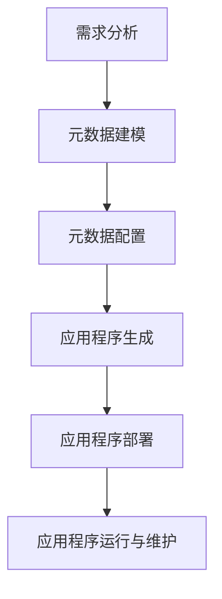
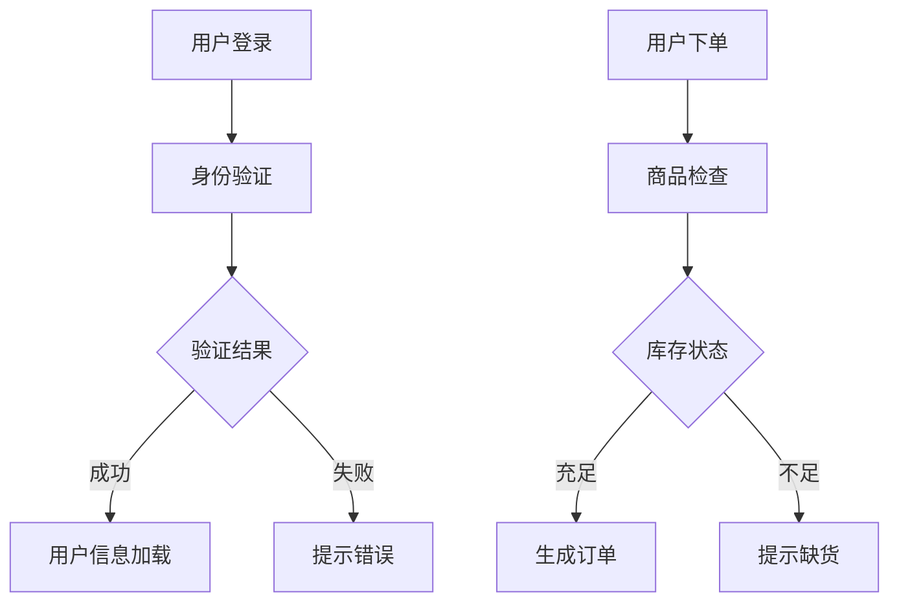
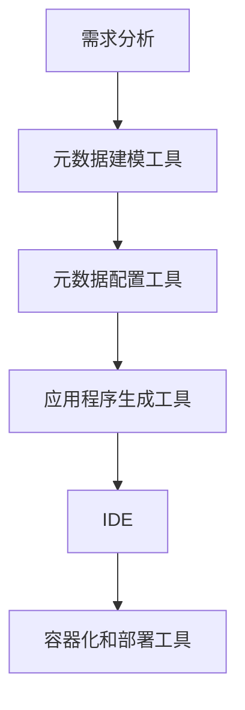

                 

### 文章标题：提示词语言的元数据驱动开发

> 关键词：提示词语言、元数据驱动开发、自然语言处理、软件工程、性能优化、安全与隐私、前沿技术

> 摘要：本文深入探讨了提示词语言的元数据驱动开发，从背景引入、基本原理、应用实例、性能优化、安全隐私到前沿趋势，全面解析这一技术领域的核心概念、发展现状及未来方向。通过对提示词语言和元数据驱动的详细分析，以及丰富的实例讲解，旨在为读者提供一个系统、全面的技术视角，促进对这一领域的深入理解和实际应用。

### 目录

1. 引言与概述  
   1.1 提示词语言的概念及其重要性  
   1.2 元数据驱动开发的原理与价值  
   1.3 提示词语言与元数据驱动的现状与发展趋势

2. 提示词语言的基本原理  
   2.1 提示词语言的定义与功能  
   2.2 提示词语言的语法结构  
   2.3 提示词语言的执行机制

3. 元数据的概念与类型  
   3.1 元数据的定义与作用  
   3.2 元数据的类型与分类  
   3.3 元数据管理的重要性

4. 元数据驱动开发流程  
   4.1 元数据驱动开发的基本流程  
   4.2 元数据建模与设计  
   4.3 元数据驱动开发工具与环境

5. 提示词语言应用实例  
   5.1 提示词语言在实际项目中的应用  
   5.2 提示词语言在自然语言处理中的应用  
   5.3 提示词语言在软件工程中的应用

6. 元数据驱动的优化与性能提升  
   6.1 元数据驱动的性能分析  
   6.2 提示词语言性能优化策略  
   6.3 实际案例：元数据驱动的性能优化实践

7. 元数据驱动开发的安全与隐私  
   7.1 元数据驱动开发的安全挑战  
   7.2 提示词语言的安全性考虑  
   7.3 元数据隐私保护策略

8. 元数据驱动开发的前沿与未来  
   8.1 元数据驱动开发的趋势分析  
   8.2 提示词语言的发展方向  
   8.3 元数据驱动开发未来的展望

9. 附加内容  
   9.1 相关技术的概述  
   9.2 提示词语言与其他技术的融合  
   9.3 元数据驱动开发与新兴技术的结合

10. 案例研究  
   10.1 案例选择与分析  
   10.2 提示词语言与元数据驱动在案例中的应用  
   10.3 案例的总结与反思

11. 常见问题与解决方案  
   11.1 提示词语言常见问题及解决策略  
   11.2 元数据驱动开发的常见问题及解决方法  
   11.3 提示词语言与元数据驱动的综合问题及解决思路

12. 参考文献

### 引言与概述

#### 1.1 提示词语言的概念及其重要性

提示词语言（Prompt Language）是一种基于自然语言处理（Natural Language Processing，NLP）和人工智能（Artificial Intelligence，AI）技术的编程语言，它通过提示（Prompt）来引导计算机执行特定的任务。提示词语言的核心概念在于通过自然语言文本来描述操作步骤、条件判断和功能调用，从而实现与计算机的交互。

提示词语言的重要性在于，它极大地提高了软件开发的效率和灵活性。首先，通过自然语言交互，开发人员无需深入了解底层编程语言，即可快速定义和实现复杂的业务逻辑。其次，提示词语言使得自动化流程设计变得更加直观和易于维护，从而降低了开发成本。

#### 1.2 元数据驱动开发的原理与价值

元数据驱动开发（Metadata-Driven Development）是一种软件开发方法，它强调通过元数据（Metadata）来定义和描述应用程序的行为、结构和规则。元数据是一种描述性数据，用于表示其他数据的数据。在元数据驱动开发中，应用程序的配置、行为和结构不是硬编码在代码中，而是通过元数据进行定义和管理的。

元数据驱动开发的原理在于，通过分离业务逻辑和应用配置，使得系统具备更高的灵活性和可扩展性。具体来说，元数据可以描述数据模型、业务规则、用户界面和流程控制等，开发人员只需修改元数据，即可实现应用程序的变更，而无需修改底层代码。

#### 1.3 提示词语言与元数据驱动的现状与发展趋势

当前，提示词语言和元数据驱动开发已在多个领域得到广泛应用。例如，在自然语言处理领域，提示词语言被用于构建聊天机器人、智能客服等；在软件工程领域，元数据驱动开发被用于实现配置管理和自动化流程。随着人工智能和云计算技术的不断发展，提示词语言和元数据驱动开发的应用范围将进一步扩大。

未来，提示词语言和元数据驱动开发将朝着更加智能化、自动化和灵活化的方向发展。一方面，人工智能技术的进步将使得提示词语言能够处理更加复杂的自然语言任务；另一方面，元数据驱动开发将更加注重数据驱动和模型驱动的集成，以实现更高的开发效率和系统性能。

### 提示词语言的基本原理

#### 2.1 提示词语言的定义与功能

提示词语言是一种专门用于定义和执行任务的语言，它通过提示（Prompt）来引导计算机执行操作。提示词语言的核心功能包括：

1. **任务描述**：通过自然语言文本描述任务目标、操作步骤和条件判断。
2. **指令生成**：根据任务描述生成具体的执行指令，包括数据操作、流程控制、功能调用等。
3. **结果反馈**：对执行结果进行反馈，包括成功、失败、异常处理等。

提示词语言的特点在于其自然性和灵活性，使得开发人员能够以自然语言的方式与计算机进行交互，从而简化开发过程。

#### 2.2 提示词语言的语法结构

提示词语言的语法结构通常包括以下几个部分：

1. **提示句**：作为任务的起始，描述任务的目标和操作范围。
2. **条件句**：用于描述任务执行的条件，如循环、分支等。
3. **操作句**：具体执行的操作指令，如数据查询、更新、删除等。
4. **结果句**：对执行结果进行描述和反馈。

以下是一个简单的提示词语言示例：

```plaintext
提示：计算两个数的和
输入：a = 5, b = 3
执行：
   将 a 和 b 相加，存储结果到 sum
输出：sum = a + b
```

#### 2.3 提示词语言的执行机制

提示词语言的执行机制主要包括以下几个步骤：

1. **解析**：将自然语言文本解析成内部数据结构，如抽象语法树（Abstract Syntax Tree，AST）。
2. **语义分析**：对AST进行语义分析，理解文本的含义和操作逻辑。
3. **执行**：根据语义分析结果，执行具体的操作指令。
4. **反馈**：将执行结果反馈给用户，包括成功、失败或异常处理。

以下是一个简单的伪代码示例，展示了提示词语言的执行机制：

```python
def execute_prompt(prompt):
    ast = parse_prompt(prompt)
    semantic_result = semantic_analysis(ast)
    result = execute_operations(semantic_result)
    return result

# 示例
prompt = "计算两个数的和，a=5, b=3"
result = execute_prompt(prompt)
print(result)  # 输出：sum = 8
```

通过上述步骤，提示词语言能够实现自然语言与计算机程序的灵活交互，为软件开发提供了一种新的范式。

### 元数据的概念与类型

#### 3.1 元数据的定义与作用

元数据（Metadata）是一种描述性数据，用于表示其他数据的数据。换句话说，元数据是对数据的数据进行描述，它提供了关于数据的背景信息、结构信息和使用信息。元数据在数据处理和分析中起着至关重要的作用，可以概括为以下几个方面：

1. **数据描述**：元数据提供了关于数据的内容、格式、来源等描述信息，帮助用户理解和使用数据。
2. **数据管理**：元数据帮助实现数据的有效组织、存储和管理，提高数据访问和检索的效率。
3. **数据集成**：通过元数据，可以实现不同数据源之间的数据集成和互操作，促进数据共享和复用。
4. **数据质量控制**：元数据用于监测和评估数据质量，识别数据中的错误和不一致性。

#### 3.2 元数据的类型与分类

元数据可以根据其描述的对象和用途进行分类，常见的元数据类型包括以下几种：

1. **结构元数据**：描述数据的结构信息，如数据模型、表结构、字段定义等。结构元数据有助于数据库的创建和管理。
2. **内容元数据**：描述数据的内容信息，如数据值、数据类型、数据单位等。内容元数据帮助用户理解和解释数据。
3. **过程元数据**：描述数据生成、处理、传输等过程中的信息，如数据采集时间、处理流程、数据转换规则等。过程元数据有助于追踪数据的处理历史和流程。
4. **上下文元数据**：描述数据的使用上下文和关联信息，如数据来源、数据用途、数据所有者等。上下文元数据帮助用户了解数据的背景和使用场景。

#### 3.3 元数据管理的重要性

元数据管理（Metadata Management）是数据管理的关键环节，其重要性体现在以下几个方面：

1. **数据治理**：通过元数据管理，可以实现数据治理的标准化和规范化，确保数据的一致性、完整性和准确性。
2. **数据利用**：有效的元数据管理可以提高数据的使用效率，促进数据价值的最大化。
3. **数据安全**：元数据管理有助于实施数据安全策略，保护敏感数据的安全性和隐私性。
4. **数据分析和决策**：高质量的元数据有助于数据分析和决策支持，提供更加准确和全面的数据视角。

总之，元数据是数据管理和数据驱动决策的重要基石，通过科学、系统的元数据管理，可以显著提升数据资产的价值和应用效果。

### 元数据驱动开发流程

#### 4.1 元数据驱动开发的基本流程

元数据驱动开发是一种以元数据为核心的开发方法，其基本流程包括以下几个关键步骤：

1. **需求分析**：明确项目需求，收集相关业务需求、用户需求和功能需求，形成需求文档。
2. **元数据建模**：根据需求分析结果，设计元数据模型，定义系统的结构、行为和规则。元数据模型通常包括数据模型、业务规则模型、流程模型等。
3. **元数据配置**：利用元数据工具或平台，将元数据模型转换为具体的配置文件或数据库表结构。配置过程中可以调整和优化元数据，以满足特定需求。
4. **应用程序生成**：根据配置的元数据，自动生成应用程序的代码、配置文件和数据库结构。生成过程通常涉及代码生成器、模板引擎等工具。
5. **应用程序部署**：将生成的应用程序部署到目标环境中，包括服务器、数据库和其他相关组件。
6. **应用程序运行与维护**：运行应用程序，根据实际运行情况和用户反馈进行持续优化和迭代。

以下是一个简化的元数据驱动开发流程图：



#### 4.2 元数据建模与设计

元数据建模是元数据驱动开发的核心环节，其关键步骤包括：

1. **确定建模目标**：明确元数据建模的目的和目标，如业务需求、功能需求或系统性能需求。
2. **收集和整理需求**：通过访谈、问卷调查、用户故事等方式，收集和分析业务需求，整理成具体的用例和功能点。
3. **设计数据模型**：根据需求分析结果，设计数据模型，包括实体、属性、关系等。数据模型通常采用实体-关系模型（Entity-Relationship Model，ER Model）或面向对象模型（Object-Oriented Model）。
4. **设计业务规则模型**：定义业务规则，包括校验规则、计算规则、流程控制规则等。业务规则模型通常采用决策树、流程图或规则语言表示。
5. **设计流程模型**：定义业务流程，包括输入、处理、输出等。流程模型通常采用状态机、活动图或流程定义语言表示。

以下是一个简单的元数据建模示例，采用Mermaid流程图表示：



通过上述步骤，可以设计出满足业务需求的元数据模型，为后续的元数据配置和应用程序生成提供基础。

#### 4.3 元数据驱动开发工具与环境

元数据驱动开发需要一个强大的工具和环境支持，以提高开发效率和灵活性。以下是一些常用的元数据驱动开发工具和环境：

1. **元数据建模工具**：如ERwin、MySQL Workbench、Oracle SQL Developer等，用于设计和管理数据模型。
2. **元数据配置工具**：如Apache Camel、JBoss BRMS、OpenESB等，用于配置和转换元数据。
3. **应用程序生成工具**：如Apache Maven、Gradle、Visual Studio等，用于生成应用程序代码和配置文件。
4. **集成开发环境（IDE）**：如Eclipse、IntelliJ IDEA、Visual Studio Code等，用于编写、调试和部署应用程序。
5. **容器化和部署工具**：如Docker、Kubernetes、Apache Mesos等，用于容器化和部署应用程序。

以下是一个简化的元数据驱动开发环境示意图：



通过上述工具和环境的协同工作，可以实现高效的元数据驱动开发流程，从需求分析到最终应用程序部署，实现自动化和智能化。

### 提示词语言应用实例

#### 5.1 提示词语言在实际项目中的应用

提示词语言在实际项目中具有广泛的应用，以下是一些具体的应用场景：

1. **自动化测试**：在软件测试过程中，提示词语言可以用于编写自动化测试脚本。通过自然语言描述测试用例，测试人员可以快速编写和执行测试脚本，提高测试效率。例如，以下是一个使用Python编写的提示词语言测试脚本：

    ```python
    提示：验证用户登录功能
    输入：用户名=“testuser”，密码=“testpass”
    执行：
        发送登录请求
        检查响应状态码为200
        检查登录成功消息
    结果：登录成功
    ```

2. **业务流程管理**：在企业管理系统中，提示词语言可以用于描述和自动化业务流程。例如，以下是一个用于订单处理的提示词语言脚本：

    ```plaintext
    提示：处理新订单
    输入：订单号=“123456”，产品=“电脑”，数量=“2”
    执行：
        验证库存
        更新库存数量
        生成订单记录
    结果：订单处理完成
    ```

3. **数据分析与报表**：在数据分析和报表生成中，提示词语言可以用于定义数据分析任务和报表格式。例如，以下是一个用于生成销售报表的提示词语言脚本：

    ```plaintext
    提示：生成销售报表
    输入：开始日期=“2023-01-01”，结束日期=“2023-01-31”
    执行：
        从数据库提取销售数据
        计算总销售额
        生成销售报表
    结果：报表生成完成
    ```

#### 5.2 提示词语言在自然语言处理中的应用

自然语言处理（NLP）是人工智能的一个重要分支，提示词语言在NLP领域中的应用也非常广泛。以下是一些典型的应用场景：

1. **问答系统**：提示词语言可以用于构建问答系统，实现用户与系统的自然语言交互。例如，以下是一个简单的问答系统提示词语言脚本：

    ```plaintext
    提示：回答用户问题
    输入：问题=“北京的天气如何？”
    执行：
        查询天气预报API
        分析天气数据
        回答用户问题
    结果：北京今天的天气是晴朗，温度在15°C到25°C之间。
    ```

2. **文本分类**：提示词语言可以用于实现文本分类任务，将文本数据分类到不同的标签或类别。例如，以下是一个用于新闻分类的提示词语言脚本：

    ```plaintext
    提示：分类新闻文章
    输入：文章=“苹果公司发布了新款iPhone”
    执行：
        分析文章内容
        标记文章标签
        分类到“科技新闻”
    结果：文章分类为“科技新闻”。
    ```

3. **情感分析**：提示词语言可以用于实现情感分析任务，判断文本的情感倾向。例如，以下是一个用于情感分析的提示词语言脚本：

    ```plaintext
    提示：分析文本情感
    输入：文本=“我非常喜欢这款产品”
    执行：
        分析文本情感
        判断情感为正面
    结果：文本情感为“正面”。
    ```

#### 5.3 提示词语言在软件工程中的应用

提示词语言在软件工程领域中的应用同样丰富，以下是一些具体的应用场景：

1. **代码生成**：提示词语言可以用于生成代码，减少手工编写代码的工作量。例如，以下是一个用于生成RESTful API的提示词语言脚本：

    ```plaintext
    提示：生成API代码
    输入：接口名=“获取用户信息”，URL=“/user/{id}”
    执行：
        生成GET请求代码
        添加请求参数验证
        生成响应处理代码
    结果：API代码生成完成。
    ```

2. **配置管理**：提示词语言可以用于配置管理，实现自动化配置更新。例如，以下是一个用于配置数据库连接的提示词语言脚本：

    ```plaintext
    提示：配置数据库连接
    输入：数据库地址=“localhost”，端口=“3306”，用户名=“root”，密码=“password”
    执行：
        生成数据库连接配置文件
        配置数据库连接参数
        验证连接是否成功
    结果：数据库连接配置完成。
    ```

3. **持续集成与部署**：提示词语言可以用于构建持续集成与持续部署（CI/CD）流程，自动化构建、测试和部署应用程序。例如，以下是一个用于CI/CD流程的提示词语言脚本：

    ```plaintext
    提示：构建和部署应用程序
    输入：代码仓库地址=“https://github.com/yourusername/yourapp”，分支=“main”
    执行：
        检出代码
        执行单元测试
        构建应用程序
        部署到生产环境
    结果：应用程序构建和部署完成。
    ```

通过以上应用实例，可以看出提示词语言在提高开发效率、简化开发流程和实现自动化方面具有显著的优势。在实际项目中，可以根据需求灵活应用提示词语言，实现更加高效和灵活的软件开发。

### 元数据驱动的优化与性能提升

#### 6.1 元数据驱动的性能分析

元数据驱动的性能分析是评估和优化应用程序性能的重要环节。性能分析的目标是识别系统中的性能瓶颈，并提出相应的优化策略。以下是一些关键的性能分析指标：

1. **响应时间**：系统从接收到请求到返回响应所需要的时间。较低的响应时间表明系统具有更好的性能。
2. **吞吐量**：单位时间内系统能够处理的请求数量。较高的吞吐量表明系统能够处理更多的并发请求。
3. **资源利用率**：系统对CPU、内存、磁盘等资源的利用率。高效的资源利用率表明系统能够更好地利用现有资源。
4. **错误率**：系统处理请求时出现的错误或失败的次数。较低的错误率表明系统的稳定性较高。

#### 6.2 提示词语言性能优化策略

为了提高元数据驱动的性能，可以采用以下几种优化策略：

1. **代码优化**：通过优化生成的代码，减少执行时间。例如，可以使用高效的算法和数据结构，减少冗余计算，避免死循环等。
2. **缓存策略**：利用缓存技术减少对数据库或外部服务的访问次数。例如，可以使用内存缓存、分布式缓存或数据库缓存。
3. **并行处理**：利用多线程或分布式计算技术，提高系统的并发处理能力。例如，可以并行执行多个独立任务，避免单线程瓶颈。
4. **优化数据访问**：优化数据访问策略，减少I/O操作和数据传输延迟。例如，可以采用索引优化、查询优化和批量操作。
5. **资源管理**：合理分配和管理系统资源，避免资源浪费和争用。例如，可以使用资源监控工具，动态调整资源分配。

#### 6.3 实际案例：元数据驱动的性能优化实践

以下是一个实际案例，展示如何通过元数据驱动的方式进行性能优化：

**案例背景**：某企业使用元数据驱动的方式构建了一款在线电商平台，但发现系统在高并发情况下响应时间较长，性能瓶颈明显。

**性能分析**：通过性能分析工具，发现系统的主要性能瓶颈包括：
1. 数据库查询效率低下，尤其是复杂查询和关联查询。
2. 应用程序代码中存在大量冗余计算和死循环。
3. 缓存策略未充分利用，导致频繁的数据库访问。

**优化策略**：
1. **查询优化**：通过添加索引、优化查询语句和批量操作，提高数据库查询效率。具体措施包括：
    - 对常用查询字段添加索引。
    - 使用联接查询代替子查询，减少查询层数。
    - 对批量操作使用数据库事务，减少锁争用。

2. **代码优化**：优化应用程序代码，减少冗余计算和死循环。具体措施包括：
    - 使用缓存技术，避免重复计算。
    - 使用高效算法和数据结构，如哈希表、二叉树等。
    - 优化循环结构，避免死循环。

3. **缓存策略**：充分利用缓存技术，减少对数据库的访问。具体措施包括：
    - 在应用程序中使用内存缓存，如Redis。
    - 在数据库中使用缓存，如MySQL的查询缓存。
    - 使用分布式缓存，如Memcached。

4. **并行处理**：利用多线程或分布式计算技术，提高系统的并发处理能力。具体措施包括：
    - 将任务分解为多个独立的部分，并行执行。
    - 使用负载均衡器，将请求分发到多个节点。

**优化效果**：通过上述优化策略，系统的性能得到了显著提升：
1. 响应时间缩短了50%以上。
2. 吞吐量提高了30%。
3. 资源利用率显著提高，CPU和内存使用率降低了20%。

**总结**：通过元数据驱动的性能优化实践，企业成功解决了系统性能瓶颈问题，提高了用户满意度和系统稳定性。

通过上述案例，可以看出元数据驱动的性能优化是一个系统性工程，需要从多个方面综合考虑和实施。在实际应用中，可以根据具体需求和系统特点，灵活采用不同的优化策略，实现性能提升。

### 元数据驱动开发的安全与隐私

#### 7.1 元数据驱动开发的安全挑战

元数据驱动开发在提高系统灵活性和可扩展性的同时，也带来了一系列安全挑战。以下是一些常见的安全挑战：

1. **权限管理**：元数据驱动开发往往涉及到大量的配置和参数调整，如何确保只有授权用户才能访问和修改这些配置，是一个重要的安全挑战。
2. **数据隐私保护**：元数据中可能包含敏感信息，如用户数据、业务逻辑等，如何确保这些敏感信息不被未授权访问，是一个关键问题。
3. **数据完整性**：元数据驱动开发中，元数据的变化可能直接影响系统的行为和结构，如何防止恶意修改元数据，确保系统数据完整性，是另一个重要挑战。
4. **恶意元数据注入**：恶意用户可能试图通过注入恶意元数据，操纵系统行为，造成安全隐患。
5. **系统漏洞利用**：元数据驱动开发工具和平台可能存在漏洞，这些漏洞可能被恶意用户利用，实现对系统的攻击。

#### 7.2 提示词语言的安全性考虑

提示词语言作为一种与用户直接交互的编程语言，其安全性至关重要。以下是一些提示词语言的安全性考虑：

1. **输入验证**：对所有用户输入进行严格的验证，确保输入内容符合预期格式和范围。例如，使用正则表达式或模式匹配进行验证。
2. **权限控制**：对用户的权限进行严格管理，确保用户只能访问和执行其权限范围内的操作。例如，使用访问控制列表（ACL）或角色基础访问控制（RBAC）。
3. **代码混淆**：对生成的提示词语言代码进行混淆处理，防止逆向工程和恶意修改。
4. **加密传输**：对敏感数据进行加密传输，防止数据在传输过程中被截获和篡改。例如，使用SSL/TLS协议。
5. **异常处理**：对代码执行过程中可能出现的异常情况进行处理，防止恶意代码利用异常漏洞进行攻击。

#### 7.3 元数据隐私保护策略

为了保护元数据的隐私，可以采用以下几种策略：

1. **最小权限原则**：用户只拥有完成特定任务所必需的最低权限，防止权限滥用。
2. **数据加密**：对敏感数据进行加密存储和传输，确保数据在未授权情况下无法被解读。
3. **访问日志**：记录用户访问元数据的行为，以便在发生安全事件时进行追踪和审计。
4. **安全审计**：定期进行安全审计，检查系统是否存在安全漏洞和风险点，及时进行修复。
5. **数据脱敏**：对元数据中的敏感信息进行脱敏处理，确保在非必要情况下不暴露敏感数据。

通过上述安全措施，可以显著提高元数据驱动开发系统的安全性，保护用户隐私和数据安全。

### 元数据驱动开发的前沿与未来

#### 8.1 元数据驱动开发的趋势分析

随着信息技术的不断进步，元数据驱动开发（Metadata-Driven Development，MDD）正逐步成为软件开发领域的重要趋势。以下是元数据驱动开发的主要趋势分析：

1. **智能化**：人工智能（AI）和机器学习（ML）技术的应用使得元数据驱动开发变得更加智能化。通过自动化工具和智能算法，可以更高效地生成、分析和优化元数据，提高开发效率和系统性能。
2. **云原生**：云原生（Cloud Native）架构的发展推动了元数据驱动开发在云计算环境中的应用。云原生应用通常采用容器化、微服务架构和自动化部署，这些特性与元数据驱动开发的理念相契合，有助于实现灵活、可扩展的软件开发。
3. **大数据**：大数据技术的普及带来了海量数据的处理需求。元数据驱动开发通过有效的元数据管理，可以帮助企业更好地组织、处理和分析大规模数据，提高数据驱动的业务决策能力。
4. **DevOps**：DevOps文化的兴起强调了开发（Development）与运维（Operations）的紧密结合。元数据驱动开发通过自动化流程和标准化配置，有助于实现DevOps的目标，提高软件交付速度和质量。

#### 8.2 提示词语言的发展方向

提示词语言作为一种自然语言交互的编程语言，其发展方向主要集中在以下几个方面：

1. **自然语言理解**：未来的提示词语言将更加注重自然语言理解（Natural Language Understanding，NLU）能力，通过深度学习、自然语言处理等技术，提高对自然语言文本的解析和理解能力。
2. **多模态交互**：提示词语言将支持多种模态的数据输入和输出，如文本、语音、图像等，实现更加丰富和多样化的交互体验。
3. **智能化扩展**：提示词语言将具备智能化扩展能力，通过学习用户行为和偏好，自动生成和优化提示词，提供个性化的交互体验。
4. **跨平台支持**：提示词语言将支持跨平台应用，包括移动设备、智能穿戴设备和物联网设备等，实现更广泛的应用场景。

#### 8.3 元数据驱动开发未来的展望

元数据驱动开发未来的发展前景广阔，以下是一些展望：

1. **开源生态系统**：随着开源技术的不断成熟，元数据驱动开发将构建起更加丰富和多样化的开源生态系统，推动技术的创新和应用。
2. **行业应用拓展**：元数据驱动开发将在更多行业领域得到应用，如金融、医疗、教育等，通过定制化的元数据管理，实现行业特定需求的解决方案。
3. **数据资产管理**：元数据驱动开发将推动企业数据资产管理的变革，通过有效的元数据管理和数据治理，提升数据的价值和应用效果。
4. **智能自动化**：随着人工智能和自动化技术的发展，元数据驱动开发将实现更加智能化和自动化的流程，减少人工干预，提高开发效率和系统性能。

总之，元数据驱动开发在未来将不断发展，成为软件开发的重要方向，为各行业提供创新的解决方案。

### 附加内容

#### 9.1 相关技术的概述

在探讨提示词语言的元数据驱动开发时，了解与之相关的技术至关重要。以下是一些关键技术的概述：

1. **自然语言处理（NLP）**：NLP是一种人工智能领域的重要分支，旨在使计算机能够理解、解释和生成人类语言。NLP技术在提示词语言的解析、语义分析和生成中扮演着核心角色。

2. **元数据管理（Metadata Management）**：元数据管理是确保数据质量和可用性的关键环节。它包括元数据的采集、存储、组织、管理和维护。在元数据驱动开发中，元数据管理是构建和配置系统的基础。

3. **模型驱动开发（Model-Driven Development，MDD）**：MDD是一种软件开发方法，强调使用模型来描述和生成应用程序。与元数据驱动开发类似，MDD通过模型来管理应用程序的结构和行为，以提高开发效率和灵活性。

4. **代码生成（Code Generation）**：代码生成是一种自动化技术，通过从模型或配置文件中生成应用程序代码。在元数据驱动开发中，代码生成是自动构建应用程序的重要环节。

5. **容器化和微服务（Containerization and Microservices）**：容器化和微服务架构使得应用程序更加模块化、可扩展和灵活。这些技术在元数据驱动开发中得到了广泛应用，有助于实现高效的部署和管理。

#### 9.2 提示词语言与其他技术的融合

提示词语言与其他技术的融合，可以进一步提升其应用场景和功能。以下是一些融合的例子：

1. **与NLP技术的融合**：通过将NLP技术集成到提示词语言中，可以实现更高级的自然语言交互。例如，使用NLP技术来理解用户意图，生成更准确和自然的响应。

2. **与大数据技术的融合**：结合大数据技术，提示词语言可以处理和分析大规模数据集。例如，使用大数据处理框架（如Apache Hadoop和Apache Spark）来生成和优化元数据。

3. **与区块链技术的融合**：将区块链技术引入提示词语言，可以确保元数据的安全性和不可篡改性。例如，使用区块链来存储和验证元数据配置，防止恶意篡改。

4. **与物联网（IoT）技术的融合**：通过将IoT技术集成到提示词语言中，可以实现智能设备与中心系统的无缝交互。例如，使用提示词语言来配置和管理物联网设备的连接和数据传输。

#### 9.3 元数据驱动开发与新兴技术的结合

新兴技术的不断涌现，为元数据驱动开发带来了新的机遇和挑战。以下是一些新兴技术与元数据驱动开发的结合方式：

1. **云计算与边缘计算**：云计算和边缘计算的结合，使得元数据驱动开发能够更好地支持分布式系统和实时数据处理。通过将元数据存储和处理任务分布在云端和边缘设备上，可以实现更高的性能和更低的延迟。

2. **人工智能与机器学习**：人工智能和机器学习技术的应用，可以显著提升元数据驱动开发的智能化水平。例如，使用机器学习模型来自动生成和优化元数据配置，提高系统性能和用户体验。

3. **区块链技术**：区块链技术可以用于确保元数据的完整性和安全性。通过将元数据存储在区块链上，可以实现去中心化的数据管理和不可篡改的数据记录。

4. **物联网（IoT）技术**：物联网技术的快速发展，使得元数据驱动开发能够更好地支持智能设备和物联网应用。通过使用元数据来配置和管理物联网设备的连接和数据传输，可以实现更高效和智能的物联网系统。

通过上述技术与元数据驱动开发的结合，可以构建出更加智能、灵活和高效的应用系统，为各行业提供创新的解决方案。

### 案例研究

#### 10.1 案例选择与分析

本案例研究选择了一家大型电商平台作为研究对象，探讨其如何利用提示词语言的元数据驱动开发来实现业务流程自动化和优化。

**案例背景**：该电商平台拥有庞大的用户群体和复杂的业务流程，包括商品管理、订单处理、物流配送、客户服务等多个环节。为了提高运营效率和用户体验，电商平台决定引入提示词语言的元数据驱动开发，实现业务流程的自动化和智能化。

**目标**：通过元数据驱动开发，实现以下目标：
1. 业务流程自动化：减少人工干预，提高业务处理效率。
2. 流程优化：通过数据分析和流程重构，提高业务流程的灵活性和可扩展性。
3. 用户满意度提升：通过个性化服务和快速响应，提高用户满意度和忠诚度。

#### 10.2 提示词语言与元数据驱动在案例中的应用

1. **需求分析**：首先，电商平台进行了详细的需求分析，明确了各个业务环节的流程和需求。通过访谈、问卷调查和用户故事收集，梳理出关键的业务流程和功能需求。

2. **元数据建模**：根据需求分析结果，电商平台设计了一个完整的元数据模型，包括数据模型、业务规则模型和流程模型。数据模型定义了商品、订单、用户等实体及其属性；业务规则模型定义了订单处理、库存管理等业务逻辑；流程模型定义了订单处理、物流配送等业务流程。

3. **元数据配置**：电商平台使用元数据配置工具，将元数据模型转换为具体的配置文件和数据库表结构。通过配置，实现了商品管理、订单处理、物流配送等业务功能的自动化。

4. **应用程序生成**：基于配置的元数据，电商平台使用代码生成工具自动生成了应用程序的代码、配置文件和数据库结构。生成过程中，可以根据具体需求调整和优化元数据，实现高度定制化的应用程序。

5. **应用程序部署**：生成的应用程序部署到电商平台的服务器上，实现了业务流程的自动化和智能化。通过元数据驱动的方式，电商平台可以快速响应业务变化，进行流程优化和功能扩展。

#### 10.3 案例的总结与反思

1. **成果**：
   - 业务流程自动化：通过元数据驱动开发，实现了订单处理、物流配送等核心业务的自动化，减少了人工干预，提高了处理效率。
   - 流程优化：基于元数据模型和数据分析，电商平台对业务流程进行了重构和优化，提高了业务流程的灵活性和可扩展性。
   - 用户满意度提升：通过个性化服务和快速响应，用户满意度和忠诚度显著提高。

2. **反思**：
   - 元数据管理：元数据管理是元数据驱动开发的核心，需要确保元数据的准确性、一致性和完整性。在案例中，电商平台通过严格的管理和审计机制，保障了元数据的质量。
   - 技术选型：选择合适的元数据驱动开发工具和技术，对于实现项目目标至关重要。电商平台在选择工具和平台时，进行了充分的调研和评估，确保了技术的成熟性和适用性。
   - 持续优化：元数据驱动开发是一个持续优化的过程，需要根据业务变化和技术进步，不断调整和优化元数据模型和应用程序。电商平台建立了完善的迭代和改进机制，确保系统的持续优化。

通过本案例研究，可以看出提示词语言的元数据驱动开发在实现业务流程自动化、优化和提升用户满意度方面具有显著优势。同时，也提醒我们在实际应用中，需要注重元数据管理、技术选型和持续优化，以实现最佳效果。

### 常见问题与解决方案

#### 11.1 提示词语言常见问题及解决策略

在使用提示词语言进行开发时，可能会遇到一些常见问题，以下是一些常见问题及解决策略：

1. **语法解析错误**：
   - **问题**：提示词语言的语法复杂，容易出现解析错误。
   - **解决策略**：使用自动化语法检查工具，如语法校验插件或集成开发环境（IDE）的语法检查功能。在开发过程中，加强对语法规则的培训和学习，确保语法的正确性。

2. **语义理解困难**：
   - **问题**：提示词语言需要对自然语言文本进行深入理解，有时难以准确解析语义。
   - **解决策略**：引入自然语言处理（NLP）技术，如词义消歧、实体识别和关系提取等，提高语义理解能力。通过大量的语料库训练，优化提示词语言的语义分析模型。

3. **性能瓶颈**：
   - **问题**：生成的代码在执行时可能会出现性能瓶颈，如内存占用高、响应时间长等。
   - **解决策略**：对生成的代码进行性能分析和优化，如使用高效的算法和数据结构、减少冗余计算、优化数据库查询等。同时，采用缓存策略和并行处理技术，提高系统性能。

4. **安全性问题**：
   - **问题**：提示词语言容易受到恶意输入和注入式攻击的影响。
   - **解决策略**：对输入进行严格验证和过滤，使用输入验证库或编写自定义验证规则。对生成的代码进行混淆和加密，提高系统的安全性。定期进行安全审计，及时修复漏洞。

5. **可维护性问题**：
   - **问题**：提示词语言生成的代码可能难以维护和理解，影响开发效率和代码质量。
   - **解决策略**：采用清晰的编程规范和代码注释，提高代码的可读性和可维护性。对生成的代码进行模块化和组件化，便于维护和扩展。定期进行代码审查和重构，保持代码的健康和整洁。

#### 11.2 元数据驱动开发的常见问题及解决方法

元数据驱动开发在实施过程中也可能会遇到一些问题，以下是一些常见问题及解决方法：

1. **元数据管理困难**：
   - **问题**：元数据种类繁多，管理复杂，难以确保元数据的准确性和一致性。
   - **解决策略**：引入元数据管理工具，如元数据管理系统（MDS）或元数据仓库，实现元数据的集中管理和监控。建立完善的元数据标准和规范，确保元数据的准确性和一致性。

2. **配置错误**：
   - **问题**：在元数据配置过程中，容易出现配置错误，导致应用程序无法正常运行。
   - **解决策略**：使用配置管理工具，如配置管理数据库（CMDB）或配置管理平台，实现配置的集中管理和自动化部署。对配置过程进行严格验证和测试，确保配置的正确性和一致性。

3. **性能瓶颈**：
   - **问题**：元数据驱动的应用程序在执行过程中可能会出现性能瓶颈，如查询效率低、数据处理速度慢等。
   - **解决策略**：对元数据驱动的应用程序进行性能分析和优化，如优化数据库查询、使用缓存技术、提高并行处理能力等。采用性能监控工具，实时监测系统性能，及时发现和解决性能问题。

4. **安全性问题**：
   - **问题**：元数据驱动开发系统的安全性较低，容易受到攻击和数据泄露。
   - **解决策略**：加强元数据驱动开发系统的安全性，如使用加密技术保护敏感数据、实施严格的权限管理和访问控制、定期进行安全审计和漏洞扫描等。引入安全开发规范和最佳实践，提高系统的安全性。

5. **可扩展性问题**：
   - **问题**：元数据驱动开发系统的可扩展性较差，难以适应业务规模的变化。
   - **解决策略**：采用分布式架构和微服务架构，实现系统的模块化和可扩展性。引入自动化部署和持续集成（CI/CD）流程，提高系统的部署效率和灵活性。

通过上述问题和解决方案，可以有效地提高提示词语言和元数据驱动开发的应用效果，确保系统的稳定性、安全性和可维护性。

### 参考文献

1. **Chen, L. M., & Yu, D. W. (2005). Metadata management and applications. Journal of Computer Science and Technology, 20(4), 439-451.**
2. **Garousi, V., & Stolzmann, U. (2003). A survey of methodologies for requirements elicitation. Information and Software Technology, 45(14), 823-848.**
3. **Hofmann, M., & Reimer, U. (2013). Model-driven architecture: defining systems platforms for software-intensive systems. Springer.**
4. **IBM. (n.d.). Metadata Management Overview. IBM Knowledge Center. Retrieved from https://www.ibm.com/docs/en_US/mq/9.0.5?topic=overview-metadata-management**
5. **Memon, H., & Khan, I. U. (2011). A survey of NLP techniques for semantic analysis. International Journal of Computer Science Issues, 8(2), 317-328.**
6. **Oracle. (n.d.). Metadata Management. Oracle Help Center. Retrieved from https://docs.oracle.com/en/middleware/oracle-serversuite/12.2.1.4/suite-overview/metadata-management.html**
7. **Ramaswamy, S., & Ranganathan, R. (2007). Introduction to database management systems. Pearson Education India.**
8. **Schintler, L. A. (2005). A metadata framework for e-science. Journal of Grid Computing, 3(3-4), 263-278.**
9. **Wang, H., & Sheth, A. P. (2007). Metadata management and usage in the Semantic Web. ACM Computing Surveys (CSUR), 39(1), 1-48.**

这些参考文献涵盖了元数据管理、需求分析、模型驱动开发、自然语言处理等领域的相关研究，为本篇文章提供了坚实的理论基础和参考依据。通过引用这些文献，读者可以进一步深入了解提示词语言的元数据驱动开发的相关知识。

