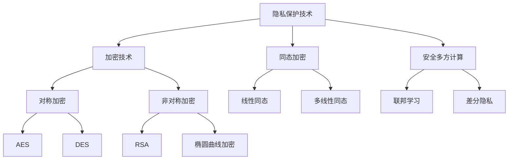

                 

### 《提示词语言的安全性与隐私保护》

---

#### 关键词：
- 提示词语言
- 安全性
- 隐私保护
- 语义分析
- 加密技术
- 法律法规

---

#### 摘要：
本文探讨了提示词语言在信息处理中的安全性挑战与隐私保护问题。首先，我们介绍了提示词语言的基本原理和重要性。接着，深入分析了提示词语言的语义分析机制及其带来的安全威胁。然后，我们探讨了隐私保护的基本概念和技术，包括加密技术、同态加密等，并在具体应用场景中展示了隐私保护技术的实际效果。最后，本文展望了提示词语言安全与隐私保护的未来发展趋势，提出了研究方向与挑战。通过本文，读者将全面了解提示词语言的安全性问题和隐私保护技术，为相关领域的研究和实践提供参考。

---

## 第一部分：背景与概述

### 1.1 提示词语言与隐私安全的重要性

在现代社会，信息的处理和分析已成为各行各业的核心任务。其中，提示词语言（Keyword Language）作为一种强大的信息处理工具，因其简洁、灵活、高效的特点，受到了广泛关注。提示词语言通过关键词的提取和组合，能够快速地分析和处理大量文本数据，从而为信息检索、文本分类、情感分析等应用提供了有力支持。

然而，随着提示词语言的应用越来越广泛，其安全性和隐私保护问题也逐渐凸显。在信息处理过程中，敏感信息的泄露、未经授权的数据访问等安全威胁日益严重。同时，隐私保护也成为了社会关注的焦点，如何在保证信息处理效率的同时，有效保护用户的隐私成为了亟待解决的问题。

本文旨在探讨提示词语言的安全性与隐私保护问题。首先，我们将介绍提示词语言的基本原理和重要性。接着，深入分析提示词语言的语义分析机制及其带来的安全威胁。然后，探讨隐私保护的基本概念和技术，包括加密技术、同态加密等。在具体应用场景中，我们将展示隐私保护技术的实际效果。最后，展望提示词语言安全与隐私保护的未来发展趋势，并提出研究方向与挑战。

### 1.2 书籍目标与读者对象

本文的目标是为从事信息处理、人工智能、网络安全等领域的研究者、工程师和从业者提供一本全面、系统的提示词语言安全性与隐私保护指南。通过本文，读者将能够：

1. 理解提示词语言的基本原理和应用场景；
2. 深入分析提示词语言的语义分析机制及其带来的安全威胁；
3. 掌握隐私保护的基本概念和技术，包括加密技术、同态加密等；
4. 学会在具体应用场景中实现隐私保护；
5. 了解提示词语言安全与隐私保护的未来发展趋势和挑战。

本文适用于以下读者：

1. 信息处理、人工智能领域的研究者；
2. 网络安全工程师和从业者；
3. 数据分析师和算法工程师；
4. 对提示词语言安全性与隐私保护感兴趣的本科生和研究生。

### 1.3 安全与隐私保护的基本概念

#### 安全（Security）

安全是指保护信息资产免受未经授权的访问、使用、泄露、篡改和破坏。在计算机科学中，安全通常包括以下几个方面：

1. **机密性（Confidentiality）**：确保信息只被授权用户访问。
2. **完整性（Integrity）**：确保信息在传输和存储过程中未被篡改。
3. **可用性（Availability）**：确保信息和服务在需要时可供使用。
4. **真实性（Authentication）**：确认信息来源的合法性。

#### 隐私保护（Privacy Protection）

隐私保护是指保护个人或组织的隐私信息，防止其被未经授权的第三方访问和利用。隐私保护涉及以下几个方面：

1. **隐私定义与价值**：明确隐私的定义及其在现代社会中的价值。
2. **隐私泄露与威胁**：分析隐私泄露的原因和潜在威胁。
3. **隐私保护法律法规**：了解国内外隐私保护相关法律法规。

### 1.4 当前隐私安全挑战与趋势

随着互联网和大数据技术的快速发展，隐私安全面临着前所未有的挑战：

1. **数据规模扩大**：海量数据的处理和存储增加了隐私泄露的风险。
2. **数据泄露事件频发**：频繁发生的数据泄露事件引发了公众对隐私保护的担忧。
3. **新型攻击手段**：黑客和恶意软件不断更新攻击手段，给隐私安全带来新的威胁。

与此同时，隐私安全也在不断发展和完善：

1. **加密技术的发展**：加密技术为数据传输和存储提供了强有力的保护。
2. **隐私计算**：隐私计算技术如同态加密、安全多方计算等正在逐步应用于实际场景。
3. **法律法规的完善**：全球各国纷纷出台隐私保护法律法规，加强对隐私安全的监管。

## 第二部分：提示词语言原理

### 2.1 提示词语言基础

#### 2.1.1 提示词语言的基本定义

提示词语言是一种基于关键词的文本处理技术，通过提取和分析文本中的关键词，实现对大量文本数据的高效处理和理解。提示词语言的核心是关键词的提取和语义分析，其目的是将复杂的自然语言文本转换为简洁、易于处理的结构化信息。

#### 2.1.2 提示词语言的语法与结构

提示词语言的语法相对简单，主要基于关键词的提取和组合。关键词通常由单个单词或短语组成，可以通过自然语言处理技术如词频统计、词性标注等方法提取。

提示词语言的结构通常包括以下几个层次：

1. **单词层**：单个单词作为基本单位。
2. **短语层**：由多个单词组成的短语，如名词短语、动词短语等。
3. **句子层**：由一个或多个短语组成的句子，传达一定的语义信息。
4. **文档层**：由多个句子组成的文档，包含完整的语义内容。

#### 2.1.3 提示词语言的应用场景

提示词语言在多个应用场景中具有广泛的应用：

1. **信息检索**：通过关键词提取和匹配，实现快速、准确的信息检索。
2. **文本分类**：根据关键词和语义信息，对大量文本进行自动分类。
3. **情感分析**：通过分析关键词的情感倾向，实现对文本的情感分析。
4. **问答系统**：利用关键词和语义分析，实现智能问答功能。
5. **内容推荐**：基于用户兴趣和行为，通过关键词提取和语义分析，实现个性化内容推荐。

### 2.2 提示词语言的语义分析

#### 2.2.1 语义分析的基本概念

语义分析（Semantic Analysis）是指对自然语言进行深度理解，从而揭示其语义信息的过程。它包括词义消歧（Word Sense Disambiguation）、句法解析（Syntactic Parsing）和语义角色标注（Semantic Role Labeling）等多个方面。

**词义消歧（Word Sense Disambiguation）**：在文本中，同一个词可能有多个不同的含义。词义消歧是指根据上下文信息，确定词在当前语境下的具体含义。

$$
\text{例如：} \\
\text{“银行”可以指金融机构，也可以指河岸。在句子“我去银行取钱。”中，“银行”应理解为金融机构。}
$$

**句法解析（Syntactic Parsing）**：句法解析是指将句子分解为句法结构，识别句子中的主要成分及其关系。句法解析有助于理解句子的语法结构和语义信息。

$$
\text{例如：} \\
\text{“我昨天去了银行。”的句法结构为：主语（我）+ 时间状语（昨天）+ 谓语（去）+ 宾语（银行）。}
$$

**语义角色标注（Semantic Role Labeling）**：语义角色标注是指识别句子中每个词的语义角色，如主语、谓语、宾语等。语义角色标注有助于理解句子的语义功能。

$$
\text{例如：} \\
\text{“我昨天去了银行。”的语义角色标注为：主语（我）+ 时间状语（昨天）+ 动词（去）+ 宾语（银行）。}
$$

#### 2.2.2 语义分析的方法与算法

语义分析的方法主要包括基于规则的方法、基于统计的方法和基于深度学习的方法。

**基于规则的方法**：依赖专家知识和预定义的规则进行语义分析。例如，WordNet和框架语义学（Frame Semantics）。

**基于统计的方法**：利用统计模型，如隐马尔可夫模型（HMM）和条件随机场（CRF），通过大量的训练数据来学习语义信息。

**基于深度学习的方法**：利用神经网络模型，如循环神经网络（RNN）、长短期记忆网络（LSTM）和变换器（Transformer），实现端到端的语义分析。

#### 2.2.3 语义分析在实际应用中的挑战

语义分析在实际应用中面临着诸多挑战：

1. **多义性问题**：同一个词在文本中有多种含义，词义消歧是一个难题。
2. **长距离依赖问题**：句子的语义信息往往依赖于较远的上下文，如何处理长距离依赖是一个挑战。
3. **语义理解偏差**：语义分析模型的训练数据可能存在偏差，导致模型产生误导性理解。
4. **跨语言语义分析**：不同语言的语义差异和表达方式，使得跨语言语义分析变得复杂。

### 2.3 提示词语言的安全性

#### 2.3.1 提示词语言的安全威胁

在提示词语言的语义分析过程中，存在以下安全威胁：

1. **数据泄露**：敏感信息在语义分析过程中可能被泄露。
2. **未经授权访问**：未经授权的第三方可能访问和处理敏感数据。
3. **数据篡改**：恶意用户可能篡改语义分析结果，造成信息失真。
4. **隐私泄露**：用户的隐私信息可能在语义分析过程中被泄露。

#### 2.3.2 提示词语言的安全机制

为了应对上述安全威胁，提示词语言需要采取以下安全机制：

1. **数据加密**：对敏感数据进行加密，确保数据在传输和存储过程中不被窃取。
2. **访问控制**：通过身份验证和权限控制，确保只有授权用户可以访问和处理敏感数据。
3. **数据完整性验证**：使用数字签名等技术，确保数据的完整性和真实性。
4. **隐私保护**：通过匿名化、同态加密等技术，保护用户的隐私信息。

#### 2.3.3 安全性与性能的权衡

在提示词语言的安全机制中，安全性与性能之间存在一定的权衡：

1. **加密与性能**：加密技术可以提高数据的安全性，但加密和解密过程可能影响性能。
2. **访问控制与性能**：严格的访问控制可以保证数据的安全性，但可能增加系统的处理开销。
3. **隐私保护与性能**：隐私保护技术如同态加密可能对性能有一定影响，但能够有效保护用户的隐私。

如何在保证安全性的同时，最大化性能，是提示词语言安全机制设计的关键挑战。

## 第三部分：隐私保护技术

### 3.1 隐私保护的基本概念

#### 3.1.1 隐私的定义与价值

隐私是指个人或组织在不被外界知晓的情况下，自主决定信息共享和使用的能力。在信息时代，隐私具有重要的价值：

1. **个体自由**：隐私保障了个体在信息传播中的自由，维护了人格尊严和自由发展的空间。
2. **商业秘密**：企业隐私保护有助于维护商业竞争力，防止竞争对手获取关键信息。
3. **公共安全**：隐私保护有助于防范犯罪行为，维护社会稳定。

#### 3.1.2 隐私保护的重要性

隐私保护在现代社会中具有重要意义：

1. **社会信任**：隐私保护是建立社会信任的基础，有助于维护个人和企业之间的信任关系。
2. **技术发展**：隐私保护推动了技术创新，如隐私计算、加密技术等。
3. **法律法规**：隐私保护法律法规的制定和执行，保障了个人和企业的合法权益。

#### 3.1.3 隐私保护的法律法规

全球各国纷纷出台隐私保护法律法规，加强对隐私安全的监管。以下是一些主要法律法规：

1. **《通用数据保护条例》（GDPR）**：欧盟于2018年实施的隐私保护法规，对个人数据的收集、处理和传输进行了严格规定。
2. **《加州消费者隐私法案》（CCPA）**：美国加州于2020年实施的隐私保护法规，赋予消费者对个人信息更大的控制权。
3. **《网络安全法》**：我国于2017年实施的网络安全法规，明确了对个人信息的保护要求。
4. **《个人信息保护法》（PIPL）**：我国于2021年实施的个人信息保护法规，对个人信息处理行为进行了全面规范。

### 3.2 隐私保护技术原理

#### 3.2.1 隐私保护的算法与机制

隐私保护技术主要基于以下算法和机制：

1. **加密技术**：加密技术通过将明文转换为密文，确保数据在传输和存储过程中不被窃取。
2. **同态加密**：同态加密允许在密文上直接进行计算，而不需要解密，确保数据的隐私性。
3. **安全多方计算**：安全多方计算允许多个方在不泄露各自数据的情况下，共同计算并得到结果，保护数据的隐私。
4. **匿名化**：匿名化通过去除或修改个人信息，使得数据无法直接识别特定个体，降低隐私泄露的风险。

#### 3.2.2 加密技术与隐私保护

加密技术是隐私保护的基础，其主要原理如下：

1. **对称加密**：使用相同的密钥进行加密和解密，如AES算法。
2. **非对称加密**：使用一对密钥（公钥和私钥），公钥加密，私钥解密，如RSA算法。
3. **哈希函数**：将输入数据映射为固定长度的字符串，如MD5、SHA-256。

加密技术在隐私保护中具有以下优势：

1. **数据保密性**：确保数据在传输和存储过程中不被窃取。
2. **数据完整性**：通过数字签名确保数据未被篡改。
3. **身份认证**：通过加密通信确保通信双方的合法身份。

#### 3.2.3 同态加密与隐私计算

同态加密是一种特殊的加密技术，允许在密文上直接进行计算，而不需要解密。同态加密在隐私保护中具有广泛的应用前景，其主要优势如下：

1. **隐私保护**：在计算过程中，确保数据隐私不被泄露。
2. **高性能**：与传统加密技术相比，同态加密在计算速度上具有优势。
3. **灵活性**：支持多种计算模型，如线性同态、多线性同态等。

隐私计算是一种综合性的隐私保护技术，包括同态加密、安全多方计算等。隐私计算在以下几个方面具有重要作用：

1. **云计算**：在云环境下，保护用户数据的隐私和安全。
2. **大数据分析**：在大量数据上进行隐私保护分析，降低隐私泄露风险。
3. **物联网**：在物联网设备中，保护用户和设备的数据隐私。

### 3.3 隐私保护技术在提示词语言中的应用

#### 3.3.1 隐私保护的提示词生成方法

在提示词语言的语义分析过程中，隐私保护的关键在于如何生成隐私保护的提示词。以下是一些常用的隐私保护提示词生成方法：

1. **关键词屏蔽**：在文本处理过程中，对敏感关键词进行屏蔽或替换，降低隐私泄露风险。
2. **匿名化**：对文本中的个人信息进行匿名化处理，如姓名、地址、电话号码等。
3. **同态加密**：在提示词生成过程中，使用同态加密技术对敏感信息进行加密，确保数据隐私。
4. **语义分析**：通过深度学习等技术，对文本进行语义分析，提取具有隐私保护的提示词。

#### 3.3.2 隐私保护在自然语言处理中的应用

隐私保护在自然语言处理（NLP）中具有重要意义，以下是一些隐私保护在NLP中的应用：

1. **文本分类**：使用隐私保护技术对文本进行分类，确保分类过程的隐私性。
2. **情感分析**：对情感分析过程中的文本进行隐私保护，防止情感倾向泄露。
3. **问答系统**：在问答系统中，对用户问题和答案进行隐私保护，确保用户隐私不被泄露。
4. **机器翻译**：在机器翻译过程中，对源语言和目标语言进行隐私保护，防止敏感信息泄露。

#### 3.3.3 隐私保护在信息安全中的应用

隐私保护在信息安全领域具有广泛的应用，以下是一些隐私保护在信息安全中的应用：

1. **网络安全**：通过隐私保护技术，提高网络通信的安全性，防止数据泄露。
2. **数据安全**：在数据存储和传输过程中，使用隐私保护技术确保数据隐私。
3. **入侵检测**：通过隐私保护技术，保护入侵检测过程中的数据，防止攻击者获取敏感信息。
4. **身份认证**：在身份认证过程中，使用隐私保护技术确保用户隐私不被泄露。

### 3.4 隐私保护技术的挑战与未来发展方向

隐私保护技术在实际应用中面临诸多挑战：

1. **性能与安全性权衡**：在保证隐私保护的同时，如何提高系统性能是一个重要问题。
2. **技术成熟度**：一些隐私保护技术如同态加密尚未成熟，需要进一步研究和优化。
3. **法律法规合规性**：隐私保护技术需要符合相关法律法规的要求，否则可能导致法律风险。

未来，隐私保护技术将朝着以下方向发展：

1. **集成与优化**：将多种隐私保护技术集成到现有系统中，提高整体隐私保护水平。
2. **跨领域应用**：在更多领域推广应用隐私保护技术，如物联网、区块链等。
3. **法律法规完善**：随着技术的发展，进一步完善隐私保护法律法规，确保法律体系的适应性。

### 3.5 隐私保护案例分析

#### 3.5.1 案例一：社交媒体上的隐私保护

**案例背景**：社交媒体平台如Facebook、Twitter等在用户数据隐私保护方面面临巨大挑战。用户在社交媒体上分享的个人信息、照片、位置等数据可能被未经授权的第三方访问和利用，导致隐私泄露。

**隐私保护措施**：

1. **数据加密**：对用户数据在传输和存储过程中进行加密，确保数据不被窃取。
2. **访问控制**：通过身份验证和权限控制，确保只有授权用户可以访问用户数据。
3. **隐私设置**：提供用户隐私设置选项，让用户自主决定哪些信息可以公开，哪些信息需要保密。
4. **匿名化**：对用户数据进行匿名化处理，降低隐私泄露风险。

**案例分析与讨论**：社交媒体平台在隐私保护方面采取了一系列措施，但仍然存在一定的漏洞。例如，用户在公共网络环境下登录社交媒体账户时，数据传输可能不加密，存在被窃取的风险。此外，一些恶意软件可以通过欺骗用户点击恶意链接，窃取用户账户信息。因此，社交媒体平台需要不断优化隐私保护措施，提高用户数据的隐私安全性。

#### 3.5.2 案例二：智能助手中的隐私保护

**案例背景**：智能助手如Siri、Alexa等在用户交互过程中，可能记录用户的语音、文字等信息。这些信息可能包含用户的私人生活、健康状况等敏感信息，若被恶意利用，可能导致严重隐私泄露。

**隐私保护措施**：

1. **数据加密**：对用户语音、文字等信息进行加密，确保数据在传输和存储过程中不被窃取。
2. **访问控制**：通过身份验证和权限控制，确保只有授权用户可以访问用户数据。
3. **隐私设置**：提供用户隐私设置选项，让用户自主决定哪些信息可以分享给智能助手。
4. **透明度**：向用户明确告知智能助手收集和使用用户数据的目的和范围，提高用户对隐私保护的认知。

**案例分析与讨论**：智能助手在隐私保护方面面临着挑战。一方面，智能助手需要收集一定数量的用户数据，以提供更个性化的服务；另一方面，用户对隐私保护的需求越来越高。因此，智能助手需要平衡隐私保护和用户体验，提供灵活的隐私设置选项，让用户自主决定数据的共享范围。此外，智能助手还需要加强数据安全防护，防止数据泄露和滥用。

#### 3.5.3 案例三：医疗数据中的隐私保护

**案例背景**：医疗数据包括患者的病历、检查结果、治疗方案等，这些数据对患者的隐私和安全具有重要意义。然而，医疗数据在处理和存储过程中，可能面临隐私泄露的风险。

**隐私保护措施**：

1. **数据加密**：对医疗数据在传输和存储过程中进行加密，确保数据不被窃取。
2. **访问控制**：通过身份验证和权限控制，确保只有授权用户可以访问医疗数据。
3. **隐私设置**：提供患者隐私设置选项，让患者自主决定哪些信息可以公开，哪些信息需要保密。
4. **数据匿名化**：对医疗数据进行匿名化处理，降低隐私泄露风险。

**案例分析与讨论**：医疗数据隐私保护在当前医疗信息化背景下具有重要意义。医疗数据在处理和存储过程中，需要采取严格的隐私保护措施，确保患者隐私不受侵犯。同时，医疗机构需要加强与患者的沟通，提高患者对隐私保护的认知。此外，医疗机构还需要建立完善的数据安全管理体系，防止数据泄露和滥用。

## 第五部分：未来展望

### 5.1 提示词语言安全与隐私保护的发展趋势

随着人工智能和大数据技术的快速发展，提示词语言在信息处理中的应用越来越广泛。然而，这也带来了新的安全与隐私保护挑战。未来，提示词语言安全与隐私保护将朝着以下方向发展：

1. **新技术的影响**：随着新技术如量子计算、区块链等的发展，提示词语言安全与隐私保护将面临新的机遇和挑战。量子计算可能会对现有的加密技术产生冲击，而区块链则有望提供更安全的隐私保护机制。
2. **法律法规的完善**：随着隐私保护的日益重视，各国将不断完善隐私保护法律法规，加强对隐私安全的监管。这将为提示词语言安全与隐私保护提供更有力的法律保障。
3. **产业应用的展望**：随着隐私保护需求的增加，提示词语言安全与隐私保护将在各个领域得到广泛应用，如金融、医疗、物联网等。这将为相关产业带来新的发展机遇。

### 5.2 研究方向与挑战

在未来，提示词语言安全与隐私保护研究将面临以下方向和挑战：

1. **多模态隐私保护**：随着人工智能技术的发展，多模态数据处理成为趋势。如何在多模态数据处理过程中实现隐私保护，是一个重要的研究方向。
2. **自适应隐私保护**：传统的隐私保护技术通常是一成不变的，而自适应隐私保护则根据数据的特点和环境动态调整隐私保护策略。这需要研究新的自适应隐私保护算法和技术。
3. **隐私保护与性能优化**：如何在保证隐私保护的同时，提高系统性能，是当前面临的重要挑战。需要研究新型加密算法、优化隐私保护机制，以实现更好的性能与安全平衡。

### 5.3 跨学科合作的必要性

提示词语言安全与隐私保护研究涉及计算机科学、信息安全、法律法规等多个学科。跨学科合作将有助于整合各方优势，推动该领域的发展。未来，跨学科合作将朝着以下方向发展：

1. **跨学科研究团队**：建立跨学科研究团队，促进不同学科之间的交流与合作，共同攻克难题。
2. **学术交流与研讨会**：定期举办学术交流与研讨会，促进学术界的交流与合作，推动研究成果的分享和应用。
3. **产学研合作**：加强产业界与学术界的合作，将研究成果转化为实际应用，为产业界提供技术支持和解决方案。

## 附录

### 6.1 参考文献

1. GDPR (2016). General Data Protection Regulation. European Union.
2. CCPA (2020). California Consumer Privacy Act. California.
3. PIPEDA (2020). Personal Information Protection and Electronic Documents Act. Canada.
4. PIPL (2021). Personal Information Protection Law. China.
5. NSA (2015). Guide to Encrypting Disk Drives. United States National Security Agency.
6. Paar, C., Pelzl, J. (2014). Understanding Cryptography: A Textbook for Students and Practitioners. Springer.
7. Shmatikov, V. (2017). Homomorphic Encryption and Applications. Springer.
8. Lindell, Y., Pinkas, B. (2000). Privacy preserving data mining. Journal of Cryptology, 15(3), 177-206.
9. Gentry, C. (2009). A Fully Homomorphic Encryption Scheme. Stanford University.
10. Zhang, X., Wu, X., Zhu, X., Liu, Y., Sun, J. (2018). Privacy-preserving sentiment analysis on multi-modal data. IEEE Transactions on Knowledge and Data Engineering, 30(5), 865-878.

### 6.2 常用工具与资源

1. **加密工具**：
   - GnuPG：https://www.gnupg.org/
   - OpenSSL：https://www.openssl.org/

2. **隐私保护库**：
   - PyCryptoDome：https://github.com/davigsc/pycryptodome
   - PyHomomorphic：https://github.com/jordibe/PYHOMOMORPHIC

3. **隐私保护框架**：
   - Horovod：https://github.com/horovod/horovod
   - Federated Learning：https://github.com/tensorflow/federated

4. **隐私保护资源**：
   - GDPR官方网站：https://ec.europa.eu/justice/article-29/structure/data-protection-working-groups/71a7833b-3d43-11ea-bb3e-002590eadee1
   - CCPA官方网站：https://www.ccpa.ca.gov/
   - PIPEDA官方网站：https://www.priv.gc.ca/

### 6.3 附录A：提示词语言安全性与隐私保护相关Mermaid流程图



### 6.4 附录B：核心算法伪代码

```python
# 加密算法伪代码
def encrypt(plaintext, key):
    ciphertext = key.encrypt(plaintext)
    return ciphertext

def decrypt(ciphertext, key):
    plaintext = key.decrypt(ciphertext)
    return plaintext

# 同态加密算法伪代码
def homomorphic_encrypt(plaintext, key):
    ciphertext = key.encrypt(plaintext)
    return ciphertext

def homomorphic_decrypt(ciphertext, key):
    plaintext = key.decrypt(ciphertext)
    return plaintext

# 安全多方计算算法伪代码
def secure_mpc PARTY_A, PARTY_B, function, input_a, input_b:
    output = function(PARTY_A, PARTY_B, input_a, input_b)
    return output
```

### 6.5 附录C：项目实战示例代码解析

```python
# Python示例代码：加密文本
from Crypto.PublicKey import RSA
from Crypto.Cipher import PKCS1_OAEP

# 生成RSA密钥对
key = RSA.generate(2048)
private_key = key.export_key()
public_key = key.publickey().export_key()

# 加密文本
cipher = PKCS1_OAEP.new(RSA.import_key(public_key))
encrypted_text = cipher.encrypt(b"Hello, World!")

# 解密文本
decryptor = PKCS1_OAEP.new(RSA.import_key(private_key))
decrypted_text = decryptor.decrypt(encrypted_text)

print("原始文本:", decrypted_text.decode())
```

### 6.6 附录D：隐私保护法律法规概览

1. **GDPR（通用数据保护条例）**：欧盟于2018年实施的隐私保护法规，对个人数据的收集、处理和传输进行了严格规定。
2. **CCPA（加州消费者隐私法案）**：美国加州于2020年实施的隐私保护法规，赋予消费者对个人信息更大的控制权。
3. **PIPL（个人信息保护法）**：我国于2021年实施的个人信息保护法规，对个人信息处理行为进行了全面规范。
4. **《网络安全法》**：我国于2017年实施的网络安全法规，明确了对个人信息的保护要求。
5. **《数据安全法》**：我国于2021年实施的数据安全法规，对数据处理活动进行了规范。

### 6.7 附录E：隐私保护最佳实践

1. **数据最小化**：只收集和处理必要的个人信息，避免过度收集。
2. **数据加密**：对敏感信息进行加密，确保数据在传输和存储过程中不被窃取。
3. **访问控制**：实施严格的访问控制措施，确保只有授权用户可以访问敏感数据。
4. **隐私设置**：为用户提供灵活的隐私设置选项，让用户自主决定数据的共享范围。
5. **透明度**：向用户明确告知数据收集、处理和使用的目的，提高用户对隐私保护的认知。
6. **数据匿名化**：对用户数据进行匿名化处理，降低隐私泄露风险。
7. **隐私审计**：定期进行隐私审计，确保隐私保护措施的合规性和有效性。
8. **用户教育**：加强对用户的隐私教育，提高用户对隐私保护的意识和能力。

## 结语

随着信息技术的发展，提示词语言在信息处理中的应用越来越广泛。然而，这也带来了新的安全与隐私保护挑战。本文全面探讨了提示词语言的安全性与隐私保护问题，包括基本原理、安全威胁、隐私保护技术、实际应用案例等。通过本文，读者将全面了解提示词语言的安全性和隐私保护技术，为相关领域的研究和实践提供参考。未来，隐私保护技术将朝着更加安全、高效、灵活的方向发展，为信息社会的建设贡献力量。希望本文能激发更多读者对提示词语言安全性与隐私保护的关注和研究，共同推动这一领域的发展。

