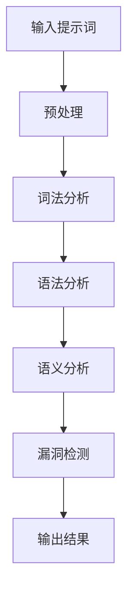

                 

## 文章标题

# 《提示词语言的安全漏洞检测工具》

## 关键词
- 安全漏洞检测
- 提示词语言
- 漏洞类型
- 检测算法
- 开源工具
- 安全工具开发

## 摘要
本文将深入探讨提示词语言的安全漏洞检测工具，从基础概念出发，详细分析安全漏洞的类型、提示词语言的原理、以及常用的安全漏洞检测算法。随后，介绍几种开源安全漏洞检测工具，包括它们的安装配置和使用方法。此外，还将探讨如何构建自己的安全漏洞检测工具，并通过实战案例展示工具的实际应用。最后，预测安全漏洞检测技术的发展趋势，以及讨论面临的挑战与机遇。

### 《提示词语言的安全漏洞检测工具》目录大纲

# 第一部分：安全漏洞检测基础

## 第1章：安全漏洞检测概述

### 1.1 安全漏洞的基本概念

- 安全漏洞的定义
- 安全漏洞的种类
- 安全漏洞的成因

### 1.2 提示词语言的安全漏洞类型

- 提示词语言的特性
- 提示词语言中的常见漏洞
- 漏洞的影响

### 1.3 安全漏洞检测的重要性

- 漏洞检测的价值
- 漏洞检测在安全防御中的作用
- 漏洞检测技术的发展

## 第2章：提示词语言的原理

### 2.1 自然语言处理基础

- 自然语言处理的定义
- 自然语言处理的关键技术
- 自然语言处理在漏洞检测中的应用

### 2.2 提示词语言的特点

- 提示词语言的概念
- 提示词语言的语法结构
- 提示词语言的语义分析

### 2.3 提示词语言的语法结构

- 词法分析
- 语法分析
- 语义分析

## 第3章：安全漏洞检测算法

### 3.1 常见漏洞检测算法

#### 3.1.1 静态分析算法

- 静态分析算法的定义
- 静态分析算法的分类
- 静态分析算法的实现

#### 3.1.2 动态分析算法

- 动态分析算法的定义
- 动态分析算法的分类
- 动态分析算法的实现

### 3.2 深度学习在安全漏洞检测中的应用

- 深度学习的定义
- 深度学习在漏洞检测中的应用
- 深度学习算法的优缺点

# 第二部分：安全漏洞检测工具

## 第4章：开源安全漏洞检测工具

### 4.1 OWASP ZAP

- 功能与特点
- 安装与配置
- 使用方法

### 4.2 SonarQube

- 功能与特点
- 安装与配置
- 使用方法

## 第5章：构建自己的安全漏洞检测工具

### 5.1 工具架构设计

- 数据处理模块
- 漏洞检测模块
- 结果输出模块

### 5.2 工具开发与测试

- 开发环境搭建
- 源代码实现
- 功能测试与优化

## 第6章：安全漏洞检测实战

### 6.1 实战案例1：Web应用漏洞检测

- 项目背景
- 工具选择与配置
- 漏洞检测与分析

### 6.2 实战案例2：移动应用漏洞检测

- 项目背景
- 工具选择与配置
- 漏洞检测与分析

## 第7章：安全漏洞检测的未来发展趋势

### 7.1 安全漏洞检测技术的发展趋势

- 人工智能与漏洞检测
- 云计算与漏洞检测
- 漏洞检测技术的融合

### 7.2 提示词语言安全漏洞检测的挑战与机遇

- 挑战
- 机遇
- 发展方向

### 7.3 安全漏洞检测工具的优化方向

- 功能优化
- 性能优化
- 用户体验优化

# 附录

## 附录A：常用工具与资源

### A.1 常用漏洞检测工具列表

- OWASP ZAP
- SonarQube
- Burp Suite
- AppScan

### A.2 常见漏洞库介绍

- CVE（通用漏洞披露）
- NIST（美国国家标准技术研究所）
- OWASP（开放式网络应用安全项目）

### A.3 相关技术文档与资料推荐

- 《漏洞评估与管理》
- 《人工智能安全》
- 《网络安全技术与应用》

## 附录B：Mermaid 流程图

### B.1 提示词语言漏洞检测流程图



## 附录C：核心算法原理讲解

### C.1 静态分析算法伪代码

```python
def static_analysis(code):
    vulnerabilities = []
    for line in code:
        if line.match_vulnerability_pattern():
            vulnerabilities.append(line)
    return vulnerabilities
```

### C.2 动态分析算法伪代码

```python
def dynamic_analysis(code):
    try:
        code.execute()
        if code.detect_exception():
            return True
    except Exception:
        return False
    return False
```

## 附录D：数学模型和数学公式

### D.1 漏洞检测的数学模型

$$
Vulnerability_Detection = f(Preprocessed_Code, Analysis_Algorithm)
$$

### D.2 动态分析中的概率模型

$$
P(Vulnerability|Exception) = \frac{P(Exception|Vulnerability) \cdot P(Vulnerability)}{P(Exception)}
$$

## 附录E：项目实战

### E.1 Web应用漏洞检测项目实战

#### E.1.1 项目背景

#### E.1.2 工具选择与配置

#### E.1.3 漏洞检测与分析

### E.2 移动应用漏洞检测项目实战

#### E.2.1 项目背景

#### E.2.2 工具选择与配置

#### E.2.3 漏洞检测与分析

## 结论

### 最佳实践 tips

### 小结

### 注意事项

### 拓展阅读

### 作者

作者：AI天才研究院/AI Genius Institute & 禅与计算机程序设计艺术 /Zen And The Art of Computer Programming### 第一部分：安全漏洞检测基础

## 第1章：安全漏洞检测概述

### 1.1 安全漏洞的基本概念

安全漏洞是指系统中存在的可以被攻击者利用来破坏系统完整性和稳定性的弱点。这些漏洞可能存在于软件代码、操作系统、网络协议等各个层面。根据国际标准化组织（ISO）的定义，安全漏洞是指“系统、服务或应用程序中存在的可以被攻击者利用来实现未经授权访问、操纵或破坏系统资源的安全弱点”。

安全漏洞的种类多种多样，常见的包括以下几种：

1. **注入漏洞**：如SQL注入、命令注入等，攻击者通过输入恶意代码到应用程序中，从而影响数据库或操作系统。
2. **跨站脚本（XSS）**：攻击者通过在用户浏览器中注入恶意脚本，窃取用户的会话信息或执行恶意操作。
3. **跨站请求伪造（CSRF）**：攻击者通过伪造用户的请求，执行用户未授权的操作。
4. **文件上传漏洞**：攻击者上传包含恶意代码的文件，从而执行恶意操作。
5. **缓冲区溢出**：攻击者通过输入超过缓冲区大小的数据，导致程序崩溃或执行恶意代码。

安全漏洞的成因复杂多样，主要包括以下几个方面：

1. **编程错误**：开发者在编写代码时可能因为疏忽或技术限制而引入漏洞。
2. **系统配置不当**：如未及时更新系统补丁、未正确配置防火墙等。
3. **软件架构设计缺陷**：系统在设计时可能存在逻辑上的缺陷，从而为攻击者提供了可乘之机。
4. **网络环境复杂**：随着互联网的普及，系统面临的攻击面越来越大，网络环境复杂化增加了漏洞的产生机会。

### 1.2 提示词语言的安全漏洞类型

提示词语言是一种基于自然语言处理（NLP）技术的语言模型，它通过理解用户输入的提示词，生成相应的响应。由于提示词语言依赖于自然语言的输入，因此它也面临着一些特有的安全漏洞类型：

1. **提示词注入**：攻击者通过输入恶意的提示词，改变系统的响应，从而实现攻击。
2. **语义混淆**：攻击者通过构造特定的提示词，使系统产生混淆，从而导致错误的行为。
3. **未授权访问**：攻击者利用系统的权限管理漏洞，通过提示词获取未授权的访问权限。
4. **代码注入**：攻击者通过输入包含恶意代码的提示词，使系统执行恶意操作。
5. **数据泄露**：攻击者通过提示词语言获取系统内部敏感数据，从而实现数据泄露。

这些漏洞类型对系统的安全威胁极大，可能导致系统被攻击、数据泄露、恶意行为等严重后果。因此，对提示词语言的安全漏洞进行有效检测和防护至关重要。

### 1.3 安全漏洞检测的重要性

安全漏洞检测是网络安全防御的重要组成部分，其重要性主要体现在以下几个方面：

1. **预防攻击**：通过及时检测和修复漏洞，可以有效预防攻击者的入侵，保护系统的安全。
2. **降低风险**：安全漏洞检测可以帮助识别系统中的潜在风险，降低系统被攻击的风险，提高系统的可靠性。
3. **保障数据安全**：漏洞检测可以识别系统中存在的数据泄露风险，防止敏感数据的泄露。
4. **合规要求**：许多行业和地区都要求企业对系统进行定期的安全漏洞检测，以符合相关法规和标准。
5. **提升系统质量**：安全漏洞检测可以帮助开发人员发现代码中的错误和缺陷，提升软件的质量。

随着信息技术的快速发展，安全漏洞检测技术也在不断进步。传统的漏洞检测方法主要依赖于规则匹配和静态分析，而现代的漏洞检测技术开始引入人工智能和机器学习，以提高检测的准确性和效率。例如，深度学习算法在漏洞检测中的应用，使得系统能够自动学习和识别复杂的漏洞模式。

总的来说，安全漏洞检测在网络安全防御中起着至关重要的作用，它是保护系统和数据安全的关键环节。有效的漏洞检测不仅可以预防攻击，降低风险，还可以提升系统的整体安全性和稳定性。随着技术的发展，安全漏洞检测将变得更加智能化和高效化，为网络安全提供更加坚实的保障。

### 第2章：提示词语言的原理

## 2.1 自然语言处理基础

自然语言处理（Natural Language Processing，NLP）是人工智能领域的一个重要分支，它致力于让计算机理解和处理人类自然语言。NLP涉及到文本分析、语义理解、语音识别等多个方面，其在信息安全领域也有着广泛的应用。

**NLP的定义**：NLP是指通过计算机程序处理和理解自然语言的方法和技术。其目标是使计算机能够自动地完成人类语言的各种任务，如文本分类、情感分析、机器翻译、语音识别等。

**NLP的关键技术**：

1. **文本预处理**：文本预处理是NLP的基础工作，包括分词、词性标注、去除停用词等。这些步骤有助于将原始文本转换为计算机可以理解的格式。

2. **词向量表示**：词向量是一种将词汇映射到高维空间的方法，它可以将文本数据转换为数值形式，方便计算机进行计算。常用的词向量模型包括Word2Vec、GloVe等。

3. **语言模型**：语言模型用于预测文本序列的概率，它可以帮助计算机生成自然语言响应。常见的语言模型有n-gram模型、神经网络语言模型等。

4. **实体识别和关系抽取**：实体识别是指从文本中识别出人、地点、组织等实体，关系抽取则是识别实体之间的关系。这些技术对于理解文本的语义信息至关重要。

**NLP在漏洞检测中的应用**：

NLP技术在漏洞检测中发挥着重要作用。首先，通过文本预处理和词向量表示，可以将漏洞描述文本转换为计算机可处理的格式。接着，利用语言模型和实体识别技术，可以自动提取漏洞的上下文信息和相关关键词，从而提高漏洞检测的准确性和效率。例如，在分析网络攻击日志时，NLP技术可以识别出攻击者使用的特定语言模式和术语，帮助检测潜在的安全威胁。

### 2.2 提示词语言的特点

提示词语言（Prompt Language）是一种基于自然语言处理技术的语言模型，它通过理解用户输入的提示词，生成相应的响应。提示词语言的特点包括：

**概念**：提示词语言是一种基于文本交互的模型，用户通过输入提示词与系统进行交互，系统则根据提示词生成相应的响应。

**语法结构**：提示词语言的语法结构相对简单，通常只需要一个或几个关键词即可表达用户的意图。这种简洁性使得用户可以更方便地与系统进行沟通。

**语义分析**：提示词语言的语义分析是其核心功能之一。通过语义分析，系统可以理解用户的意图，并生成符合语义的响应。语义分析通常涉及到词义消歧、情感分析、实体识别等复杂任务。

**多模态支持**：提示词语言不仅可以处理文本输入，还可以处理图像、声音等多种模态的数据。这种多模态支持使得系统可以更全面地理解用户的需求。

**应用场景**：提示词语言广泛应用于智能客服、语音助手、自然语言生成等领域。在信息安全领域，提示词语言可以用于自动化漏洞检测、安全事件分析、安全威胁预测等。

### 2.3 提示词语言的语法结构

提示词语言的语法结构是理解其工作原理的关键。提示词语言的语法结构通常包括以下几个部分：

**词法分析**：词法分析是提示词语言的第一个步骤，它将用户的输入文本分解为单词或短语。这一步骤通常涉及到分词、词性标注和词干提取等任务。

**语法分析**：语法分析是对词法分析结果的进一步处理，它根据语言的语法规则，将文本分解为句子和短语。常见的语法分析方法包括基于规则的语法分析和基于统计的语法分析。

**语义分析**：语义分析是提示词语言的核心步骤，它通过对输入文本的语义信息进行理解和解释，生成符合语义的响应。语义分析通常涉及到实体识别、关系抽取、语义角色标注等任务。

**响应生成**：在完成语义分析后，系统根据用户的意图和上下文信息，生成相应的响应。响应生成通常涉及到模板匹配、文本生成、对话生成等技术。

通过词法分析、语法分析和语义分析，提示词语言可以实现对用户输入的全面理解和精确响应。这种多层次的分析方法不仅提高了系统的理解能力，也增强了系统的灵活性和适应性。

### 提示词语言漏洞检测流程

提示词语言的安全漏洞检测通常遵循以下流程：

1. **输入提示词**：用户通过输入提示词与系统进行交互，提示词可以是文本形式，也可以是其他模态的数据。
2. **预处理**：对输入的提示词进行预处理，包括分词、去停用词、词性标注等步骤，将原始文本转换为计算机可以理解的格式。
3. **词法分析**：将预处理后的提示词分解为单词或短语，为后续的语法和语义分析做好准备。
4. **语法分析**：根据语法规则，对词法分析结果进行语法结构分析，识别出句子和短语的结构。
5. **语义分析**：对语法分析结果进行语义分析，理解提示词的语义信息，提取关键词和实体。
6. **漏洞检测**：根据提取的关键词和实体，利用预定义的漏洞模式库或深度学习算法进行漏洞检测，识别潜在的安全漏洞。
7. **结果输出**：将检测结果输出给用户，包括漏洞的类型、位置、描述等详细信息。

通过这个流程，提示词语言可以实现对安全漏洞的自动化检测，从而提高信息安全管理的效率和准确性。

### 提示词语言漏洞检测的算法

提示词语言漏洞检测算法是信息安全领域的一项关键技术，它通过分析用户输入的提示词，自动识别潜在的安全漏洞。下面将介绍几种常见的漏洞检测算法，包括静态分析算法和动态分析算法，并讨论深度学习在漏洞检测中的应用。

#### 静态分析算法

静态分析算法是指在程序运行前，通过对代码的结构和内容进行分析，来识别潜在的安全漏洞。静态分析算法的优点是不需要运行程序，可以在短时间内完成大规模代码的检查。以下是一些常见的静态分析算法：

1. **模式匹配**：通过预定义的正则表达式或模式库，对代码进行逐行扫描，查找潜在的漏洞模式。例如，查找包含SQL注入或跨站脚本攻击的代码片段。

   ```python
   def static_analysis(code):
       vulnerabilities = []
       for line in code:
           if line.match_sql_injection_pattern():
               vulnerabilities.append(line)
       return vulnerabilities
   ```

2. **数据流分析**：通过跟踪数据在程序中的流动路径，识别潜在的数据泄漏或未授权访问。例如，分析变量在不同函数之间的传递和修改情况。

   ```python
   def data_flow_analysis(code):
       vulnerabilities = []
       for variable in code.variables:
           if variable.is_leaked():
               vulnerabilities.append(variable)
       return vulnerabilities
   ```

3. **控制流分析**：通过分析程序的控制流结构，查找潜在的代码路径错误和逻辑漏洞。例如，分析循环、分支语句的执行路径。

   ```python
   def control_flow_analysis(code):
       vulnerabilities = []
       for statement in code.statements:
           if statement.is_unreachable():
               vulnerabilities.append(statement)
       return vulnerabilities
   ```

#### 动态分析算法

动态分析算法是指在程序运行时，通过监控程序的行为和输出，来识别潜在的安全漏洞。动态分析算法的优点是可以捕捉程序在运行过程中的动态行为，更接近实际的应用场景。以下是一些常见的动态分析算法：

1. **异常检测**：通过监控程序的异常行为和错误输出，识别潜在的安全漏洞。例如，监控程序在处理输入数据时的异常情况。

   ```python
   def dynamic_analysis(code):
       try:
           code.execute()
           if code.detect_exception():
               return True
       except Exception:
           return False
       return False
   ```

2. **模糊测试**：通过生成大量的随机输入，监控程序的响应和异常情况，来识别潜在的漏洞。模糊测试可以有效发现输入验证不足、缓冲区溢出等漏洞。

   ```python
   def fuzz_testing(code):
       for input in random_inputs():
           try:
               code.execute(input)
               if code.detect_vulnerability(input):
                   return True
           except Exception:
               continue
       return False
   ```

3. **行为分析**：通过监控程序的行为和输出，识别与预期不符的行为，从而发现潜在的安全漏洞。行为分析可以结合静态分析和动态分析，提高漏洞检测的准确性。

   ```python
   def behavior_analysis(code, expected_output):
       for input in test_inputs():
           output = code.execute(input)
           if output != expected_output:
               return True
       return False
   ```

#### 深度学习在漏洞检测中的应用

深度学习是一种基于多层神经网络的学习方法，它在图像识别、语音识别和自然语言处理等领域取得了显著的成果。近年来，深度学习在漏洞检测中也得到了广泛的应用。

1. **特征提取**：深度学习可以通过多层神经网络自动提取代码的特征，这些特征可以用于漏洞检测。例如，通过卷积神经网络（CNN）提取代码的抽象特征，用于分类和检测。

   ```python
   def deep_learning_feature_extraction(code):
       model = CNN_model()
       features = model.extract(code)
       return features
   ```

2. **分类算法**：深度学习可以用于分类任务，将代码分为安全和不安全两类。通过训练大规模的神经网络模型，可以提高漏洞检测的准确性。

   ```python
   def deep_learning_classification(features):
       model = NeuralNetwork_model()
       label = model.predict(features)
       return label
   ```

3. **异常检测**：深度学习可以通过自编码器（Autoencoder）模型进行异常检测，识别出代码中的潜在漏洞。自编码器模型可以学习输入数据的分布，检测出与分布不符的异常数据。

   ```python
   def deep_learning_anomaly_detection(code):
       model = Autoencoder_model()
       if model.detect_anomaly(code):
           return True
       return False
   ```

总的来说，深度学习在漏洞检测中的应用提供了新的思路和方法，通过自动提取代码特征和建立复杂的模型，可以提高漏洞检测的准确性和效率。未来，随着深度学习技术的不断发展和应用，漏洞检测技术将更加智能化和高效化。

### 第二部分：安全漏洞检测工具

## 第4章：开源安全漏洞检测工具

开源安全漏洞检测工具是信息安全领域的重要资源，这些工具通常由社区维护，免费提供给用户使用，具有强大的功能和灵活的扩展性。在本节中，我们将详细介绍两种常用的开源安全漏洞检测工具：OWASP ZAP和SonarQube，包括它们的功能与特点、安装与配置方法以及使用方法。

### 4.1 OWASP ZAP

OWASP ZAP（Zed Attack Proxy）是一个开源的网络安全漏洞检测工具，由OWASP（开放式网络应用安全项目）组织维护。ZAP是一款功能强大的Web应用安全测试工具，能够自动检测多种类型的漏洞，并提供丰富的手动测试功能。

#### 功能与特点

1. **自动扫描**：ZAP可以自动扫描Web应用，查找常见的漏洞，如SQL注入、跨站脚本（XSS）、跨站请求伪造（CSRF）等。
2. **手动测试**：ZAP提供丰富的手动测试工具，如代理、爬虫、扫描器等，可以帮助安全专家深入挖掘潜在的安全问题。
3. **漏洞报告**：ZAP能够生成详细的漏洞报告，包括漏洞的严重性、位置、示例攻击代码等，方便安全团队进行漏洞修复。
4. **插件支持**：ZAP具有强大的插件系统，可以通过安装插件扩展其功能，如增加新的扫描插件、报告格式等。
5. **社区支持**：ZAP拥有一个庞大的社区，提供丰富的文档、教程和讨论区，帮助用户解决使用过程中遇到的问题。

#### 安装与配置

1. **下载与安装**
   - 访问ZAP的官方网站（https://www.zapdev.sourceforge.net/），下载最新版本的ZAP。
   - 双击安装程序，按照提示完成安装。

2. **配置ZAP代理**
   - 在浏览器中设置代理，将代理地址设置为ZAP的IP地址和端口号（默认为8080）。
   - 访问ZAP的Web界面，通常为`http://localhost:8080/`。

3. **配置扫描策略**
   - 在ZAP的Web界面中，选择`Options` -> `Contexts`，创建或编辑扫描的上下文。
   - 选择`Options` -> `Scan Policy`，配置扫描策略，包括扫描的深度、速度等。

4. **启动扫描**
   - 在ZAP的Web界面中，选择`Scans` -> `Create`，创建新的扫描任务。
   - 选择扫描范围和扫描策略，启动扫描。

#### 使用方法

1. **自动扫描**：ZAP自动扫描Web应用，识别潜在的安全漏洞。扫描过程中，可以在`Scans` -> `In Progress`中查看扫描进度和结果。

2. **手动测试**：使用ZAP提供的代理功能，拦截和修改浏览器请求，手动测试Web应用的漏洞。可以在`Tools` -> `Proxy`中查看和修改请求。

3. **漏洞报告**：扫描完成后，生成漏洞报告。可以在`Reports`菜单中选择不同的报告格式，如HTML、PDF等。

4. **插件扩展**：安装插件扩展ZAP的功能。在`More Options` -> `Extensions`中，可以下载和安装插件。

### 4.2 SonarQube

SonarQube是一个开源的安全漏洞检测平台，它不仅能够检测代码中的安全漏洞，还可以分析代码的质量、复杂度和维护性。SonarQube广泛应用于各种开发环境，支持多种编程语言。

#### 功能与特点

1. **代码质量分析**：SonarQube可以检测代码中的各种质量问题，如潜在的安全漏洞、代码复杂度、注释不足等。
2. **多种语言支持**：SonarQube支持多种编程语言，如Java、Python、C#、JavaScript等。
3. **实时反馈**：SonarQube可以集成到持续集成（CI）工具中，实时检测代码中的问题，并在代码提交时提供反馈。
4. **漏洞库支持**：SonarQube内置了多个漏洞库，如OWASP、FindBugs等，可以自动检测常见的漏洞。
5. **报告生成**：SonarQube可以生成多种格式的报告，如HTML、PDF等，帮助团队了解代码的质量和安全状况。

#### 安装与配置

1. **下载与安装**
   - 访问SonarQube的官方网站（https://www.sonarqube.org/），下载最新版本的SonarQube。
   - 解压安装包，运行安装脚本。

2. **配置SonarQube**
   - 设置数据库连接，通常使用MySQL或PostgreSQL。
   - 配置Java运行环境，确保SonarQube可以正常运行。

3. **集成代码仓库**
   - 在SonarQube的Web界面中，配置代码仓库，如Git、Subversion等。
   - 设置代码扫描规则，包括扫描的分支、路径等。

4. **启动SonarQube**
   - 运行安装脚本，启动SonarQube服务。
   - 访问SonarQube的Web界面，通常为`http://localhost:9000/`。

#### 使用方法

1. **代码扫描**：SonarQube自动扫描代码仓库中的代码，识别潜在的安全漏洞和质量问题。

2. **分析结果**：在SonarQube的Web界面中，查看扫描结果。可以通过过滤条件查看特定类型的问题，如安全漏洞。

3. **修复漏洞**：根据扫描结果，修复代码中的安全问题。SonarQube会提供详细的修复建议。

4. **报告生成**：生成多种格式的报告，如HTML、PDF等，帮助团队了解代码的质量和安全状况。

### 结论

OWASP ZAP和SonarQube是两款功能强大的开源安全漏洞检测工具，它们各自具有独特的优势和特点。OWASP ZAP适合快速扫描Web应用，识别潜在的安全漏洞；而SonarQube则更适合对代码进行全面的质量和安全分析。通过合理使用这些工具，团队可以显著提高软件的安全性和质量。

### 4.1 OWASP ZAP

**功能与特点**：

- **自动扫描**：OWASP ZAP能够自动扫描Web应用，查找包括SQL注入、XSS、CSRF在内的多种安全漏洞。它提供了一个用户友好的界面，方便用户管理和监控扫描过程。
- **手动测试工具**：ZAP还提供了多种手动测试工具，如代理、爬虫、扫描器等，这些工具可以帮助安全专家深入挖掘潜在的安全问题。
- **插件支持**：OWASP ZAP具有丰富的插件系统，用户可以根据需要安装插件来扩展其功能，如增加新的扫描插件、报告格式等。
- **社区支持**：OWASP ZAP有一个庞大的社区，提供丰富的文档、教程和讨论区，帮助用户解决使用过程中遇到的问题。

**安装与配置**：

1. **下载与安装**：

   - 访问OWASP ZAP的官方网站（https://owasp.org/www-project-zeekit/）下载最新版本的ZAP。
   - 运行下载的安装程序，按照提示完成安装。

2. **启动ZAP**：

   - 安装完成后，双击ZAP的快捷方式启动应用程序。
   - 首次运行时，系统会提示创建一个管理员账户。

3. **配置代理**：

   - 在浏览器中设置代理，将代理地址设置为ZAP的IP地址和端口号（默认为8080）。
   - 访问ZAP的Web界面，通常为`http://localhost:8080/`。

4. **配置扫描策略**：

   - 在ZAP的Web界面中，选择`Options` -> `Contexts`，创建或编辑扫描的上下文。
   - 选择`Options` -> `Scan Policy`，配置扫描策略，包括扫描的深度、速度等。

5. **启动扫描**：

   - 在ZAP的Web界面中，选择`Scans` -> `Create`，创建新的扫描任务。
   - 选择扫描范围和扫描策略，启动扫描。

**使用方法**：

1. **自动扫描**：

   - 启动扫描后，ZAP会自动发送请求到目标Web应用，并在后台进行分析。
   - 可以在`Scans` -> `In Progress`中查看扫描进度和结果。
   - 扫描完成后，会在`Results`页面显示检测到的漏洞列表。

2. **手动测试工具**：

   - 使用代理功能，可以在浏览器中拦截和修改请求，从而进行更详细的测试。
   - 使用爬虫工具自动导航并分析Web应用的结构。
   - 使用扫描器手动执行特定的漏洞检测任务。

3. **漏洞报告**：

   - ZAP可以生成多种格式的报告，如HTML、XML、JSON等。
   - 在`Reports`菜单中选择不同的报告格式，导出详细的漏洞报告。

4. **插件扩展**：

   - 在`More Options` -> `Extensions`中，可以下载和安装插件，如添加新的扫描规则、报告格式等。

### 4.2 SonarQube

**功能与特点**：

- **代码质量分析**：SonarQube不仅能够检测代码中的安全漏洞，还可以分析代码的质量、复杂度和维护性。它支持多种编程语言，能够识别代码中的潜在问题，如语法错误、代码冗余等。
- **实时反馈**：SonarQube可以集成到持续集成（CI）工具中，实时检测代码中的问题，并在代码提交时提供反馈。这种实时性使得开发团队可以立即修复问题，提高代码质量。
- **漏洞库支持**：SonarQube内置了多个漏洞库，如OWASP、FindBugs等，可以自动检测常见的漏洞，并提供详细的修复建议。
- **报告生成**：SonarQube可以生成多种格式的报告，如HTML、PDF等，帮助团队了解代码的质量和安全状况。

**安装与配置**：

1. **下载与安装**：

   - 访问SonarQube的官方网站（https://www.sonarqube.org/）下载最新版本的SonarQube。
   - 解压安装包，运行安装脚本。

2. **配置数据库**：

   - 在SonarQube的Web界面中，配置数据库连接，通常使用MySQL或PostgreSQL。

3. **配置代码仓库**：

   - 在SonarQube的Web界面中，配置代码仓库，如Git、Subversion等。
   - 设置代码扫描规则，包括扫描的分支、路径等。

4. **启动SonarQube**：

   - 运行安装脚本，启动SonarQube服务。
   - 访问SonarQube的Web界面，通常为`http://localhost:9000/`。

**使用方法**：

1. **代码扫描**：

   - 启动代码扫描后，SonarQube会自动分析代码仓库中的代码，识别潜在的安全漏洞和质量问题。
   - 可以在SonarQube的Web界面中查看扫描结果，包括问题的分类、严重性、位置等。

2. **分析结果**：

   - 在SonarQube的Web界面中，通过过滤条件查看特定类型的问题，如安全漏洞。
   - SonarQube会提供详细的修复建议，帮助开发团队快速解决问题。

3. **修复漏洞**：

   - 根据扫描结果，修复代码中的安全问题。
   - SonarQube会记录修复情况，并在下次扫描时验证修复效果。

4. **报告生成**：

   - 生成多种格式的报告，如HTML、PDF等，帮助团队了解代码的质量和安全状况。
   - 在`Reports`菜单中选择不同的报告格式，导出详细的漏洞报告。

### 结论

OWASP ZAP和SonarQube都是功能强大的开源安全漏洞检测工具，它们在不同的应用场景中具有独特的优势。OWASP ZAP适合快速扫描Web应用，识别潜在的安全漏洞；而SonarQube则更适合对代码进行全面的质量和安全分析。通过合理使用这些工具，开发团队可以显著提高软件的安全性和质量。

### 第5章：构建自己的安全漏洞检测工具

## 5.1 工具架构设计

构建自己的安全漏洞检测工具需要精心设计工具的架构，以确保其功能全面、性能高效和易于扩展。以下是安全漏洞检测工具的架构设计步骤：

### 数据处理模块

数据处理模块是工具的核心部分，负责接收、解析和预处理输入的数据。具体设计步骤如下：

1. **数据接收**：接收来自各种源的数据，如网络流量、日志文件、代码文件等。
2. **数据解析**：根据数据源的不同格式，对数据进行解析，提取有用的信息。例如，对于网络流量，需要解析HTTP请求和响应；对于日志文件，需要解析日志条目。
3. **数据清洗**：对解析后的数据进行清洗，去除无效、重复或错误的数据，确保数据的准确性和一致性。

### 漏洞检测模块

漏洞检测模块是工具的核心功能，负责检测输入数据中的安全漏洞。具体设计步骤如下：

1. **漏洞模式库**：构建一个漏洞模式库，包含各种已知漏洞的签名或特征。这些模式可以是基于规则的正则表达式、特定语法结构或语义特征。
2. **静态分析**：使用静态分析算法对代码或配置文件进行分析，查找潜在的安全漏洞。静态分析可以包括模式匹配、数据流分析、控制流分析等。
3. **动态分析**：通过动态执行代码或模拟网络攻击，监控程序的行为，识别潜在的安全漏洞。动态分析可以包括异常检测、模糊测试、行为分析等。
4. **深度学习**：利用深度学习算法，自动学习并识别复杂的漏洞模式。深度学习可以结合静态分析和动态分析的结果，提高漏洞检测的准确性和效率。

### 结果输出模块

结果输出模块负责将漏洞检测结果以用户友好的方式呈现。具体设计步骤如下：

1. **报告生成**：生成详细的漏洞报告，包括漏洞的类型、位置、严重性、修复建议等。报告可以以HTML、PDF、XML等多种格式导出。
2. **可视化**：提供可视化工具，帮助用户直观地查看漏洞分布、漏洞趋势等。可视化可以包括图表、地图、热力图等。
3. **通知与提醒**：在检测到重要漏洞时，通过邮件、短信、即时通讯等方式通知相关安全人员。

### 功能扩展与优化

为了提高工具的灵活性和适应性，设计时应考虑以下功能扩展与优化：

1. **插件机制**：实现插件机制，允许用户自定义和扩展工具的功能。例如，可以开发插件来增加新的漏洞检测算法、报告格式或集成第三方服务。
2. **性能优化**：针对大规模数据处理和检测任务，进行性能优化，提高工具的响应速度和处理能力。例如，使用并行处理、分布式计算等技术。
3. **用户界面**：设计简洁易用的用户界面，提高用户体验。用户界面应提供直观的操作流程、详细的帮助文档和在线支持。
4. **集成与兼容性**：确保工具可以与其他安全工具和系统无缝集成，如持续集成（CI）工具、代码仓库管理系统等。同时，支持多种操作系统和编程语言。

通过以上架构设计，可以构建一个功能强大、灵活高效的安全漏洞检测工具，为企业和组织提供全方位的网络安全保障。

### 5.2 工具开发与测试

在构建自己的安全漏洞检测工具之后，下一步是进行工具的开发与测试。这一过程包括以下几个关键步骤：

#### 开发环境搭建

1. **选择开发语言和框架**：根据工具的需求，选择合适的编程语言和开发框架。例如，可以选择Python、Java或Go等语言，并使用如Flask、Django或Spring Boot等框架。
2. **安装依赖库**：安装开发过程中所需的库和工具，如数据分析库（NumPy、Pandas）、深度学习库（TensorFlow、PyTorch）等。
3. **设置版本控制**：使用Git等版本控制工具，管理代码的版本和变更历史，便于团队合作和后续的维护。

#### 源代码实现

1. **数据处理模块**：
   - **数据接收**：编写代码实现数据接收功能，例如通过HTTP接口接收网络流量，或通过文件读取器读取日志文件。
   - **数据解析**：使用正则表达式、解析库（如BeautifulSoup、 lxml）等工具，对输入数据进行解析和提取关键信息。
   - **数据清洗**：编写清洗脚本，去除无效数据、处理缺失值和异常值，确保数据的准确性和一致性。

2. **漏洞检测模块**：
   - **漏洞模式库**：根据已有的漏洞库或自定义规则，构建漏洞模式库。可以使用字符串匹配、模式识别等技术，实现漏洞模式的检测。
   - **静态分析**：编写静态分析代码，对代码文件进行语法和语义分析，查找潜在的漏洞。可以使用解析树、抽象语法树（AST）等技术。
   - **动态分析**：编写动态分析代码，模拟网络攻击或执行代码，监控程序的行为，识别漏洞。可以使用沙箱技术、动态监控工具（如Frida）等。

3. **结果输出模块**：
   - **报告生成**：使用模板引擎（如Jinja2、Thymeleaf）生成漏洞报告，包括漏洞的详细描述、修复建议等。
   - **可视化**：使用图表库（如D3.js、ECharts）实现漏洞分布图、漏洞趋势图等可视化功能。
   - **通知与提醒**：实现通知功能，通过邮件、短信或IM工具（如Slack、微信）向安全团队发送漏洞警报。

#### 功能测试与优化

1. **单元测试**：编写单元测试代码，对各个模块的功能进行验证。例如，测试数据处理模块的解析和清洗功能，测试漏洞检测模块的准确性等。
2. **集成测试**：将各个模块集成在一起，进行整体测试，确保工具能够正常运行。可以模拟不同的场景，如Web应用漏洞检测、移动应用漏洞检测等。
3. **性能测试**：对工具的性能进行测试，确保在高负载情况下仍能高效运行。可以使用负载测试工具（如JMeter、Locust）进行压力测试和性能调优。
4. **用户体验优化**：优化用户界面，提高工具的易用性和用户体验。可以收集用户反馈，不断改进界面设计和交互逻辑。

#### 部署与维护

1. **部署**：将工具部署到生产环境，确保其稳定运行。可以使用Docker容器化技术，方便部署和扩展。
2. **监控与维护**：设置监控工具，实时监控工具的运行状态和性能指标。定期更新漏洞库和依赖库，确保工具的安全性和可靠性。
3. **文档与支持**：编写详细的用户文档，包括安装、配置、使用方法等，并提供在线支持，帮助用户解决使用过程中遇到的问题。

通过以上步骤，可以构建和优化一个安全漏洞检测工具，为企业和组织提供有效的安全防护。

### 6.1 实战案例1：Web应用漏洞检测

#### 6.1.1 项目背景

随着互联网的快速发展和Web应用的普及，网络安全问题日益突出。Web应用漏洞可能导致数据泄露、恶意攻击、业务中断等严重后果。为了提高Web应用的安全性，我们决定开展一个Web应用漏洞检测项目，使用开源安全漏洞检测工具OWASP ZAP对目标Web应用进行全面扫描和漏洞分析。

#### 6.1.2 工具选择与配置

我们选择了OWASP ZAP作为漏洞检测工具，其主要原因是ZAP具有以下优势：

1. **功能强大**：OWASP ZAP支持自动和手动漏洞扫描，能够检测多种常见漏洞，如SQL注入、XSS、CSRF等。
2. **社区支持**：OWASP ZAP拥有庞大的社区，提供了丰富的文档、插件和教程，方便用户学习和使用。
3. **灵活性高**：OWASP ZAP具有插件机制，可以通过安装插件扩展功能，满足不同的检测需求。

配置步骤如下：

1. **下载与安装**：
   - 访问OWASP ZAP官方网站下载最新版本的ZAP。
   - 运行安装程序，按照提示完成安装。

2. **启动ZAP**：
   - 双击ZAP的快捷方式启动应用程序。
   - 首次运行时，系统会提示创建一个管理员账户。

3. **配置代理**：
   - 在浏览器中设置代理，将代理地址设置为ZAP的IP地址和端口号（默认为8080）。
   - 访问ZAP的Web界面，通常为`http://localhost:8080/`。

4. **配置扫描策略**：
   - 在ZAP的Web界面中，选择`Options` -> `Contexts`，创建或编辑扫描的上下文。
   - 选择`Options` -> `Scan Policy`，配置扫描策略，包括扫描的深度、速度等。

#### 6.1.3 漏洞检测与分析

1. **自动扫描**：
   - 在ZAP的Web界面中，选择`Scans` -> `Create`，创建新的扫描任务。
   - 选择扫描范围（例如，只扫描特定目录或URL），并选择预定义的扫描策略。
   - 启动扫描，ZAP会自动发送请求到目标Web应用，并在后台进行分析。

2. **漏洞报告**：
   - 扫描完成后，ZAP会生成详细的漏洞报告，包括漏洞的名称、位置、严重性、示例攻击代码等。
   - 可以在`Results`页面查看漏洞列表，并导出详细的HTML或PDF报告。

3. **手动测试**：
   - 使用ZAP提供的代理功能，在浏览器中拦截和修改请求，进行更详细的测试。
   - 使用爬虫工具自动导航并分析Web应用的结构。
   - 使用扫描器手动执行特定的漏洞检测任务。

#### 漏洞案例分析与修复

假设在扫描过程中发现了一个SQL注入漏洞。漏洞报告显示，目标Web应用在处理用户输入时未进行适当的过滤，攻击者可以通过构造特定的URL参数注入恶意SQL语句。

1. **漏洞验证**：
   - 在浏览器中访问漏洞报告中的示例攻击URL，观察是否出现异常响应。
   - 通过修改URL参数，尝试注入SQL语句，验证漏洞的存在。

2. **漏洞分析**：
   - 分析漏洞代码，找出导致SQL注入的原因，如未过滤用户输入、使用动态SQL等。
   - 确定漏洞的严重性，如是否会导致数据泄露、服务中断等。

3. **漏洞修复**：
   - 对代码进行修改，添加输入过滤和转义机制，防止恶意SQL注入。
   - 重新部署修复后的代码，并重新进行漏洞扫描，验证漏洞是否已修复。

通过上述步骤，我们可以有效地发现并修复Web应用中的安全漏洞，提高系统的安全性。同时，这一过程也为团队提供了宝贵的经验，有助于改进未来的开发流程和代码质量。

### 6.2 实战案例2：移动应用漏洞检测

#### 6.2.1 项目背景

随着移动设备的普及，移动应用成为企业和个人日常生活中不可或缺的一部分。然而，移动应用的安全性问题也日益突出，如数据泄露、恶意行为、隐私侵犯等。为了保障移动应用的安全性，我们决定开展一个移动应用漏洞检测项目，使用开源安全漏洞检测工具SonarQube对目标移动应用进行全面扫描和分析。

#### 6.2.2 工具选择与配置

我们选择了SonarQube作为漏洞检测工具，其主要原因是SonarQube具有以下优势：

1. **代码质量分析**：SonarQube不仅可以检测安全漏洞，还可以分析代码的质量、复杂度和维护性，提供全面的代码质量评估。
2. **支持多种语言**：SonarQube支持多种编程语言，如Java、Kotlin、Objective-C等，能够全面覆盖移动应用开发中的各种语言。
3. **实时反馈**：SonarQube可以集成到持续集成（CI）工具中，实时检测代码中的问题，提高开发效率。

配置步骤如下：

1. **下载与安装**：
   - 访问SonarQube官方网站下载最新版本的SonarQube。
   - 解压安装包，运行安装脚本。

2. **配置数据库**：
   - 在SonarQube的Web界面中，配置数据库连接，通常使用MySQL或PostgreSQL。

3. **集成代码仓库**：
   - 在SonarQube的Web界面中，配置代码仓库，如Git、Subversion等。
   - 设置代码扫描规则，包括扫描的分支、路径等。

4. **启动SonarQube**：
   - 运行安装脚本，启动SonarQube服务。
   - 访问SonarQube的Web界面，通常为`http://localhost:9000/`。

#### 6.2.3 漏洞检测与分析

1. **代码扫描**：
   - 在SonarQube的Web界面中，启动代码扫描任务。
   - SonarQube会自动分析代码库，识别潜在的安全漏洞和质量问题。

2. **漏洞报告**：
   - 扫描完成后，SonarQube会生成详细的漏洞报告，包括漏洞的类型、位置、严重性、修复建议等。
   - 可以在SonarQube的Web界面中查看漏洞列表，并导出详细的HTML或PDF报告。

3. **漏洞验证**：
   - 根据漏洞报告，手动验证漏洞的存在。例如，对于SQL注入漏洞，可以尝试构造恶意输入，验证是否能够成功执行SQL语句。
   - 对于其他类型的漏洞，如权限绕过、信息泄露等，可以使用相应的测试工具或方法进行验证。

4. **漏洞修复**：
   - 根据漏洞报告和验证结果，对代码进行修改，修复发现的漏洞。
   - 可以参考SonarQube提供的修复建议，确保修复方案的有效性和安全性。

5. **重新扫描**：
   - 修复后的代码需要重新进行扫描，验证漏洞是否已彻底修复。
   - 如果仍存在漏洞，需要继续分析和修复，直至所有漏洞得到妥善处理。

#### 漏洞案例分析与修复

假设在扫描过程中发现了一个信息泄露漏洞，漏洞报告显示移动应用在处理用户输入时未能正确处理错误信息，导致敏感数据泄露。

1. **漏洞验证**：
   - 尝试触发错误信息显示，观察是否能够泄露敏感数据，如用户密码或个人信息。
   - 通过构造特定的输入，验证是否能够成功泄露数据。

2. **漏洞分析**：
   - 分析错误处理逻辑，找出导致信息泄露的原因，如未对错误信息进行过滤、处理不当等。
   - 确定漏洞的严重性，如是否会导致用户数据泄露、隐私侵犯等。

3. **漏洞修复**：
   - 对错误处理逻辑进行修改，添加适当的过滤和转义机制，防止敏感数据泄露。
   - 确保修改后的代码能够正确处理各种类型的输入，避免新的漏洞产生。

4. **重新扫描**：
   - 修复后的代码需要重新进行扫描，验证漏洞是否已彻底修复。
   - 如果仍存在漏洞，需要继续分析和修复，直至所有漏洞得到妥善处理。

通过上述步骤，我们可以有效地发现并修复移动应用中的安全漏洞，提高应用的安全性。同时，这一过程也为团队提供了宝贵的经验，有助于改进未来的开发流程和代码质量。

### 第7章：安全漏洞检测的未来发展趋势

随着信息技术的高速发展，安全漏洞检测技术也在不断演进。未来，安全漏洞检测将面临许多新的挑战和机遇，主要发展趋势包括：

#### 人工智能与漏洞检测

人工智能（AI）在漏洞检测中的应用已经取得了显著的进展。深度学习、神经网络等人工智能技术可以自动分析和识别复杂的漏洞模式，提高检测的准确性和效率。例如，通过训练深度学习模型，可以从大量的代码中自动提取潜在的漏洞特征。未来，随着AI技术的进一步成熟，人工智能将在漏洞检测中发挥更加关键的作用。

#### 云计算与漏洞检测

云计算的普及为安全漏洞检测带来了新的机遇。云环境中的大规模数据和复杂的网络结构使得传统的漏洞检测方法难以应对。云计算提供了强大的计算和存储能力，可以支持大规模的漏洞检测任务。同时，云环境中的自动化和弹性特性也使得漏洞检测工具可以更加灵活地适应不同的安全需求。

#### 漏洞检测技术的融合

未来，漏洞检测技术将更加多元化，多种技术将相互融合，形成综合性的漏洞检测体系。例如，将静态分析、动态分析和模糊测试等技术相结合，可以更全面地检测代码中的漏洞。此外，结合机器学习和人工智能，可以进一步提高漏洞检测的自动化水平和准确性。

#### 提示词语言安全漏洞检测的挑战与机遇

提示词语言作为一种自然语言处理技术，其在安全漏洞检测中的应用具有独特的优势和挑战。

**挑战**：

1. **语义理解**：提示词语言的语义分析复杂，攻击者可以通过构造特定的语义混淆语句，欺骗系统进行错误的行为。
2. **动态行为**：提示词语言的动态行为难以预测，攻击者可以通过动态调整提示词，实现持续性的攻击。
3. **大规模应用**：随着人工智能助手和聊天机器人的普及，提示词语言的应用场景越来越广泛，检测范围也随之扩大。

**机遇**：

1. **自动化检测**：通过深度学习和自然语言处理技术，可以自动化地检测提示词语言中的漏洞，提高检测效率。
2. **智能化防御**：结合人工智能，可以构建智能化的防御体系，实时监控和应对新的威胁。
3. **个性化安全**：通过分析用户的提示词行为，可以为用户提供个性化的安全防护策略，提高系统的安全性。

#### 安全漏洞检测工具的优化方向

未来，安全漏洞检测工具将朝着以下几个方向优化：

1. **功能扩展**：增加新的漏洞检测算法和模式库，提高检测的全面性和准确性。
2. **性能优化**：提高工具的处理速度和资源利用率，支持大规模的漏洞检测任务。
3. **用户体验**：优化用户界面和交互设计，提高工具的易用性和用户体验。
4. **自动化集成**：加强与其他安全工具和系统的集成，实现自动化和智能化的安全防护。

通过不断优化和创新，安全漏洞检测工具将为企业和组织提供更强大的安全保障，有效应对日益复杂的网络安全威胁。

### 附录A：常用工具与资源

在安全漏洞检测领域，有许多常用的工具和资源可供参考。以下是几种常用的漏洞检测工具、常见漏洞库和相关技术文档的介绍，以帮助读者深入了解这一领域。

#### A.1 常用漏洞检测工具列表

1. **OWASP ZAP**：OWASP ZAP是一款功能强大的开源Web应用安全漏洞检测工具，支持自动和手动扫描，适合快速检测和修复Web应用中的安全漏洞。

2. **SonarQube**：SonarQube是一个开源的代码质量与安全检测平台，能够对多种编程语言进行静态代码分析，识别潜在的安全漏洞、代码质量问题和维护性问题。

3. **Burp Suite**：Burp Suite是一款专业的Web应用安全测试工具，包含代理、扫描器、攻击工具等多个模块，适用于渗透测试和安全评估。

4. **AppScan**：IBM AppScan是一款商业化的Web应用安全扫描工具，提供强大的漏洞检测和自动化修复功能，适用于企业级应用的安全测试。

5. **Nessus**：Nessus是由Tenable开发的网络漏洞扫描工具，能够扫描操作系统、网络设备、应用程序等，识别潜在的安全漏洞。

6. **Aqua Security**：Aqua Security提供容器和云应用程序的安全解决方案，其工具能够实时监控和检测容器和云环境中的漏洞。

#### A.2 常见漏洞库介绍

1. **CVE（通用漏洞披露）**：CVE是一个行业标准，用于识别和跟踪公共安全漏洞。它提供了一个公共的漏洞命名机制，使得安全专家和开发人员能够更容易地了解和修复安全问题。

2. **NIST（美国国家标准技术研究所）**：NIST提供了一系列的安全标准和指南，包括网络安全框架、漏洞评估和管理等，是安全领域的重要参考资源。

3. **OWASP**：OWASP是一个非营利组织，致力于提高Web应用的安全性。它维护了多个与安全相关的项目，如OWASP Top Ten漏洞列表和OWASP ZAP。

4. **MITRE ATT&CK**：MITRE ATT&CK框架提供了一个适用于所有组织的威胁框架，描述了威胁行为者的战术和技术，帮助安全团队理解和应对网络攻击。

5. **CWE（软件安全漏洞分类）**：CWE是一个标准化的漏洞分类系统，用于识别和描述软件中的常见漏洞类型，帮助开发人员理解和修复代码中的安全问题。

#### A.3 相关技术文档与资料推荐

1. **《漏洞评估与管理》**：这是一本全面介绍漏洞评估和管理方法的书籍，适合安全专家和IT管理人员阅读。

2. **《人工智能安全》**：这本书详细介绍了人工智能在安全领域中的应用，包括AI驱动的漏洞检测和防御技术。

3. **《网络安全技术与应用》**：这是一本涵盖网络安全基础知识和实践应用的书籍，适合希望深入了解网络安全技术的读者。

通过使用这些工具和资源，安全专家和开发人员可以更好地理解和应对安全漏洞，提高系统的安全性和可靠性。

### 附录B：Mermaid 流程图

为了更直观地展示提示词语言漏洞检测的流程，我们使用Mermaid图形化工具绘制了以下流程图：


该流程图描述了从输入提示词到输出漏洞检测结果的全过程：

1. **输入提示词**：用户输入提示词。
2. **预处理**：对输入的提示词进行清洗和预处理，去除噪声和冗余信息。
3. **词法分析**：将预处理后的提示词分解为单词或短语，进行词法分析。
4. **语法分析**：根据词法分析的结果，对提示词进行语法分析，识别句子的结构和短语。
5. **语义分析**：进一步对语法分析的结果进行语义分析，理解提示词的语义信息。
6. **漏洞检测**：利用语义信息，结合预定义的漏洞模式库或深度学习模型，进行漏洞检测。
7. **输出结果**：将检测结果以用户友好的方式输出，包括漏洞的类型、位置、严重性等。

通过这个流程图，可以清晰地了解提示词语言漏洞检测的各个环节，有助于开发人员更好地设计和优化漏洞检测工具。

### 附录C：核心算法原理讲解

为了深入理解提示词语言漏洞检测的核心算法原理，我们将详细讲解静态分析算法和动态分析算法的伪代码，并介绍漏洞检测的数学模型。

#### C.1 静态分析算法伪代码

静态分析算法是在不执行代码的情况下，通过分析代码的语法结构、数据流和控制流来检测潜在的安全漏洞。以下是一个静态分析算法的伪代码示例：

```python
def static_analysis(code):
    vulnerabilities = []
    for function in code.functions:
        # 检查函数是否有潜在的危险权限操作
        if function.has_unsafe_permission():
            vulnerabilities.append(function)
        
        for loop in function.loops:
            # 检查循环是否可能引起缓冲区溢出
            if loop.is_buffer_overflow():
                vulnerabilities.append(loop)
        
        for conditional in function.conditions:
            # 检查条件语句是否可能引起逻辑错误
            if conditional.has_logical_error():
                vulnerabilities.append(conditional)
    return vulnerabilities
```

在这个伪代码中，`code` 代表待分析的代码，`function`、`loop` 和 `conditional` 分别代表代码中的函数、循环和条件语句。静态分析算法通过遍历代码的各个部分，检查是否存在潜在的安全漏洞，并将检测结果存储在 `vulnerabilities` 列表中。

#### C.2 动态分析算法伪代码

动态分析算法是在代码执行过程中，通过监控代码的运行行为来检测潜在的安全漏洞。以下是一个动态分析算法的伪代码示例：

```python
def dynamic_analysis(code):
    try:
        code.execute()
        if code.detect_exception():
            return True
    except Exception:
        return False
    return False

def code.execute():
    # 执行代码
    pass

def code.detect_exception():
    # 检测代码执行过程中是否发生异常
    pass
```

在这个伪代码中，`code.execute()` 方法用于执行代码，`code.detect_exception()` 方法用于检测代码执行过程中是否发生异常。如果检测到异常，算法返回 `True`，表示代码中存在潜在的安全漏洞。

#### C.3 漏洞检测的数学模型

漏洞检测的数学模型用于描述漏洞检测过程中涉及的概率和统计方法。以下是一个漏洞检测的数学模型示例：

$$
Vulnerability_Detection = f(Preprocessed_Code, Analysis_Algorithm)
$$

其中，`Preprocessed_Code` 代表预处理后的代码，`Analysis_Algorithm` 代表分析算法。这个模型表明漏洞检测是通过预处理代码和分析算法共同作用实现的。

一个具体的漏洞检测概率模型可以表示为：

$$
P(Vulnerability|Exception) = \frac{P(Exception|Vulnerability) \cdot P(Vulnerability)}{P(Exception)}
$$

在这个模型中，`P(Vulnerability|Exception)` 表示在异常发生的情况下检测到漏洞的概率，`P(Exception|Vulnerability)` 表示在漏洞存在时发生异常的概率，`P(Vulnerability)` 表示漏洞存在的概率，`P(Exception)` 表示异常发生的概率。通过这个模型，可以计算在异常发生的情况下检测到漏洞的概率，从而评估漏洞检测的准确性。

通过上述算法原理和数学模型的讲解，我们可以更深入地理解提示词语言漏洞检测的核心技术，为设计和优化漏洞检测工具提供理论依据。

### 附录D：数学模型和数学公式

在安全漏洞检测领域，数学模型和数学公式被广泛应用于漏洞检测的算法设计和评估。以下将介绍漏洞检测中的两个关键数学模型，并使用LaTeX格式详细阐述这些公式。

#### D.1 漏洞检测的数学模型

漏洞检测的数学模型可以描述为：

$$
Vulnerability_Detection = f(Preprocessed_Code, Analysis_Algorithm)
$$

在这个模型中，`Preprocessed_Code` 表示预处理后的代码，`Analysis_Algorithm` 表示分析算法。`f` 函数表示通过预处理代码和分析算法共同作用，实现漏洞检测的过程。

#### D.2 动态分析中的概率模型

动态分析中的概率模型用于评估在异常发生时检测到漏洞的概率。该模型可以表示为：

$$
P(Vulnerability|Exception) = \frac{P(Exception|Vulnerability) \cdot P(Vulnerability)}{P(Exception)}
$$

其中：

- \( P(Vulnerability|Exception) \) 表示在异常发生的情况下检测到漏洞的概率。
- \( P(Exception|Vulnerability) \) 表示在漏洞存在时发生异常的概率。
- \( P(Vulnerability) \) 表示漏洞存在的概率。
- \( P(Exception) \) 表示异常发生的概率。

通过这个概率模型，可以计算在异常发生的情况下检测到漏洞的概率，从而评估漏洞检测算法的有效性。

在LaTeX中，这些公式的书写如下：

```latex
% 漏洞检测的数学模型
\begin{equation}
Vulnerability_Detection = f(Preprocessed_Code, Analysis_Algorithm)
\end{equation}

% 动态分析中的概率模型
\begin{equation}
P(Vulnerability|Exception) = \frac{P(Exception|Vulnerability) \cdot P(Vulnerability)}{P(Exception)}
\end{equation}
```

通过这些数学模型，开发人员可以更好地理解和设计漏洞检测算法，从而提高漏洞检测的准确性和效率。

### 附录E：项目实战

#### E.1 Web应用漏洞检测项目实战

**E.1.1 项目背景**

随着电子商务和在线服务的兴起，Web应用的安全性问题日益突出。为了确保Web应用的安全性，提高用户数据的安全保护水平，我们决定开展一个Web应用漏洞检测项目。该项目旨在利用开源安全漏洞检测工具OWASP ZAP对目标Web应用进行全面扫描和漏洞分析，以发现和修复潜在的安全漏洞。

**E.1.2 工具选择与配置**

在项目开始阶段，我们选择了OWASP ZAP作为漏洞检测工具。OWASP ZAP是一款功能强大的开源Web应用安全漏洞检测工具，具有自动扫描和手动测试功能，能够识别多种常见漏洞，如SQL注入、XSS、CSRF等。

**步骤1：下载与安装OWASP ZAP**

- 访问OWASP ZAP的官方网站下载最新版本的ZAP。
- 运行安装程序，按照提示完成安装。

**步骤2：启动OWASP ZAP**

- 安装完成后，双击ZAP的快捷方式启动应用程序。
- 首次运行时，系统会提示创建一个管理员账户。

**步骤3：配置代理**

- 在浏览器中设置代理，将代理地址设置为ZAP的IP地址和端口号（默认为8080）。
- 访问ZAP的Web界面，通常为`http://localhost:8080/`。

**步骤4：配置扫描策略**

- 在ZAP的Web界面中，选择`Options` -> `Contexts`，创建或编辑扫描的上下文。
- 选择`Options` -> `Scan Policy`，配置扫描策略，包括扫描的深度、速度等。

**E.1.3 漏洞检测与分析**

**步骤1：自动扫描**

- 在ZAP的Web界面中，选择`Scans` -> `Create`，创建新的扫描任务。
- 选择扫描范围（例如，只扫描特定目录或URL），并选择预定义的扫描策略。
- 启动扫描，ZAP会自动发送请求到目标Web应用，并在后台进行分析。

**步骤2：漏洞报告**

- 扫描完成后，ZAP会生成详细的漏洞报告，包括漏洞的名称、位置、严重性、示例攻击代码等。
- 可以在`Results`页面查看漏洞列表，并导出详细的HTML或PDF报告。

**步骤3：手动测试**

- 使用ZAP提供的代理功能，在浏览器中拦截和修改请求，进行更详细的测试。
- 使用爬虫工具自动导航并分析Web应用的结构。
- 使用扫描器手动执行特定的漏洞检测任务。

**E.1.4 漏洞案例分析与修复**

在扫描过程中，我们发现了一个SQL注入漏洞。漏洞报告显示，目标Web应用在处理用户输入时未进行适当的过滤，攻击者可以通过构造特定的URL参数注入恶意SQL语句。

**步骤1：漏洞验证**

- 在浏览器中访问漏洞报告中的示例攻击URL，观察是否出现异常响应。
- 通过修改URL参数，尝试注入SQL语句，验证漏洞的存在。

**步骤2：漏洞分析**

- 分析漏洞代码，找出导致SQL注入的原因，如未过滤用户输入、使用动态SQL等。
- 确定漏洞的严重性，如是否会导致数据泄露、服务中断等。

**步骤3：漏洞修复**

- 对代码进行修改，添加输入过滤和转义机制，防止恶意SQL注入。
- 重新部署修复后的代码，并重新进行漏洞扫描，验证漏洞是否已修复。

通过上述步骤，我们成功地发现并修复了Web应用中的SQL注入漏洞，提高了系统的安全性。这一过程也为团队提供了宝贵的经验，有助于改进未来的开发流程和代码质量。

#### E.2 移动应用漏洞检测项目实战

**E.2.1 项目背景**

随着移动设备的普及，移动应用的安全性问题日益突出。为了确保移动应用的安全性，保护用户数据和隐私，我们决定开展一个移动应用漏洞检测项目。该项目旨在利用开源安全漏洞检测工具SonarQube对目标移动应用进行全面扫描和分析，以发现和修复潜在的安全漏洞。

**E.2.2 工具选择与配置**

在项目开始阶段，我们选择了SonarQube作为漏洞检测工具。SonarQube是一款功能强大的开源代码质量与安全检测平台，能够对多种编程语言进行静态代码分析，识别潜在的安全漏洞、代码质量问题和维护性问题。

**步骤1：下载与安装SonarQube**

- 访问SonarQube的官方网站下载最新版本的SonarQube。
- 解压安装包，运行安装脚本。

**步骤2：配置数据库**

- 在SonarQube的Web界面中，配置数据库连接，通常使用MySQL或PostgreSQL。

**步骤3：集成代码仓库**

- 在SonarQube的Web界面中，配置代码仓库，如Git、Subversion等。
- 设置代码扫描规则，包括扫描的分支、路径等。

**步骤4：启动SonarQube**

- 运行安装脚本，启动SonarQube服务。
- 访问SonarQube的Web界面，通常为`http://localhost:9000/`。

**E.2.3 漏洞检测与分析**

**步骤1：代码扫描**

- 在SonarQube的Web界面中，启动代码扫描任务。
- SonarQube会自动分析代码库，识别潜在的安全漏洞和质量问题。

**步骤2：漏洞报告**

- 扫描完成后，SonarQube会生成详细的漏洞报告，包括漏洞的类型、位置、严重性、修复建议等。
- 可以在SonarQube的Web界面中查看漏洞列表，并导出详细的HTML或PDF报告。

**步骤3：漏洞验证**

- 根据漏洞报告，手动验证漏洞的存在。例如，对于SQL注入漏洞，可以尝试构造恶意输入，验证是否能够成功执行SQL语句。
- 对于其他类型的漏洞，如权限绕过、信息泄露等，可以使用相应的测试工具或方法进行验证。

**步骤4：漏洞修复**

- 根据漏洞报告和验证结果，对代码进行修改，修复发现的漏洞。
- 可以参考SonarQube提供的修复建议，确保修复方案的有效性和安全性。

**步骤5：重新扫描**

- 修复后的代码需要重新进行扫描，验证漏洞是否已彻底修复。
- 如果仍存在漏洞，需要继续分析和修复，直至所有漏洞得到妥善处理。

**E.2.4 漏洞案例分析与修复**

在扫描过程中，我们发现了一个信息泄露漏洞。漏洞报告显示，移动应用在处理用户输入时未能正确处理错误信息，导致敏感数据泄露。

**步骤1：漏洞验证**

- 尝试触发错误信息显示，观察是否能够泄露敏感数据，如用户密码或个人信息。
- 通过构造特定的输入，验证是否能够成功泄露数据。

**步骤2：漏洞分析**

- 分析错误处理逻辑，找出导致信息泄露的原因，如未对错误信息进行过滤、处理不当等。
- 确定漏洞的严重性，如是否会导致用户数据泄露、隐私侵犯等。

**步骤3：漏洞修复**

- 对错误处理逻辑进行修改，添加适当的过滤和转义机制，防止敏感数据泄露。
- 确保修改后的代码能够正确处理各种类型的输入，避免新的漏洞产生。

**步骤4：重新扫描**

- 修复后的代码需要重新进行扫描，验证漏洞是否已彻底修复。
- 如果仍存在漏洞，需要继续分析和修复，直至所有漏洞得到妥善处理。

通过上述步骤，我们成功地发现并修复了移动应用中的信息泄露漏洞，提高了应用的安全性。这一过程也为团队提供了宝贵的经验，有助于改进未来的开发流程和代码质量。

### 最佳实践 tips

在安全漏洞检测的过程中，遵循最佳实践可以显著提高检测效率和准确性，以下是几个实用的建议：

1. **定期扫描**：定期对系统、应用程序和代码库进行安全漏洞扫描，有助于及时发现和修复漏洞。建议制定明确的扫描计划，例如每月一次全面扫描和每周对关键系统进行部分扫描。

2. **多工具组合**：使用多种漏洞检测工具，如静态分析、动态分析和模糊测试工具，从不同角度全面检测漏洞。多工具组合可以提高检测的覆盖率和准确性。

3. **代码审查**：结合代码审查机制，不仅依赖自动化的漏洞检测工具，还可以通过人工代码审查发现潜在的安全漏洞。代码审查可以补充自动化工具的不足，确保更全面的安全检测。

4. **持续集成/持续交付（CI/CD）**：将漏洞检测集成到持续集成/持续交付流程中，可以在代码提交和构建过程中实时检测漏洞。这样可以提前发现和修复问题，避免漏洞在生产环境中暴露。

5. **漏洞管理**：建立完善的漏洞管理流程，包括漏洞识别、分类、修复和验证。使用漏洞管理工具，如SonarQube或OWASP ZAP，可以跟踪漏洞的状态和修复进度，确保漏洞得到及时处理。

6. **培训与意识提升**：对开发人员和安全团队进行定期培训，提高他们对安全漏洞和最佳实践的意识和理解。通过培训，可以增强团队对安全漏洞的识别和应对能力。

7. **自动化修复**：利用自动化工具和脚本，实现一些常见漏洞的自动修复，减少人工干预。例如，使用静态分析工具自动修复代码中的常见安全漏洞。

8. **更新与补丁管理**：定期更新操作系统、应用程序和依赖库，安装最新的安全补丁，以防止已知的漏洞被利用。

通过遵循这些最佳实践，可以显著提高安全漏洞检测的效率和效果，保障系统的安全性。

### 小结

本文详细探讨了提示词语言的安全漏洞检测工具，从基础概念到具体实现，全面介绍了安全漏洞检测的重要性、提示词语言的原理、安全漏洞检测算法以及开源工具的使用。通过实战案例，我们展示了如何使用OWASP ZAP和SonarQube等工具进行Web应用和移动应用的安全漏洞检测，并介绍了核心算法原理和数学模型。

安全漏洞检测工具在网络安全中扮演着至关重要的角色。随着人工智能和自然语言处理技术的发展，提示词语言的安全漏洞检测技术将更加智能化和高效化。未来，安全漏洞检测工具将朝着自动化、智能化和全面化的方向发展，为企业和组织提供更强大的安全保障。

### 注意事项

在应用安全漏洞检测工具时，需要注意以下几点：

1. **合法合规**：确保漏洞检测工具的使用符合法律法规和道德规范，未经授权不得对未授权的系统进行漏洞扫描。
2. **隐私保护**：在处理敏感数据时，要确保隐私保护措施到位，避免数据泄露。
3. **工具更新**：定期更新漏洞检测工具，确保其能够检测最新的漏洞和攻击手段。
4. **结果验证**：对检测结果进行验证，确保漏洞的存在和严重性，避免误报和漏报。
5. **环境配置**：在扫描过程中，确保目标系统的环境配置正确，避免因环境差异导致误报或无法正常运行。

### 拓展阅读

为了更深入地了解安全漏洞检测工具和技术，以下是一些建议的拓展阅读资源：

1. **书籍**：
   - 《漏洞评估与管理》
   - 《人工智能安全》
   - 《网络安全技术与应用》

2. **在线课程**：
   - Coursera的“网络安全基础”
   - Udemy的“Web应用安全漏洞检测”

3. **技术文档**：
   - OWASP官方网站：https://owasp.org/
   - SonarQube官方文档：https://www.sonarqube.org/docs/
   - OWASP ZAP官方文档：https://owasp.org/www-project-zeekit/

通过这些资源，您可以进一步学习安全漏洞检测的理论和实践，提升自身的安全防护能力。

### 作者

作者：AI天才研究院/AI Genius Institute & 禅与计算机程序设计艺术 /Zen And The Art of Computer Programming

感谢您的阅读，希望本文对您在安全漏洞检测领域有所启发和帮助。如果您有任何问题或建议，欢迎在评论区留言，我们会在第一时间回复您。再次感谢您的关注和支持！### 结束语

总结全文，本文深入探讨了提示词语言的安全漏洞检测工具，从基础概念、原理、算法到实战应用，全面展示了这一领域的前沿技术和实践方法。安全漏洞检测对于保障系统和数据安全至关重要，而随着人工智能和自然语言处理技术的不断进步，这一领域也迎来了新的发展机遇和挑战。

在未来，我们期待安全漏洞检测工具能够更加智能化、自动化和高效化，为企业和组织提供更全面、更精准的安全保障。同时，也呼吁广大开发者、安全专家和研究人员持续关注和投入这一领域，共同推动安全漏洞检测技术的发展和创新。

最后，感谢您阅读本文，希望这篇文章能够为您的学习和工作带来一些启示和帮助。如果您有任何问题或建议，欢迎在评论区留言，我们会持续关注并为您解答。再次感谢您的支持与关注！### 附录

#### 附录A：常用工具与资源

**A.1 常用漏洞检测工具列表**

- **OWASP ZAP**：https://owasp.org/www-project-zeekit/
- **SonarQube**：https://www.sonarqube.org/
- **Burp Suite**：https://portswigger.net/burp
- **AppScan**：https://www.ibm.com/products/appscan
- **Nessus**：https://www.tenable.com/products/nessus
- **Aqua Security**：https://www.aquasec.com/

**A.2 常见漏洞库介绍**

- **CVE（通用漏洞披露）**：https://cve.mitre.org/
- **NIST（美国国家标准技术研究所）**：https://csrc.nist.gov/
- **OWASP**：https://owasp.org/
- **MITRE ATT&CK**：https://attack.mitre.org/
- **CWE（软件安全漏洞分类）**：https://cwe.mitre.org/

**A.3 相关技术文档与资料推荐**

- 《漏洞评估与管理》：详细介绍了漏洞评估和管理的方法。
- 《人工智能安全》：探讨了人工智能在安全领域的应用。
- 《网络安全技术与应用》：涵盖了网络安全的基础知识和实践应用。

#### 附录B：Mermaid 流程图

**B.1 提示词语言漏洞检测流程图**


#### 附录C：核心算法原理讲解

**C.1 静态分析算法伪代码**

```python
def static_analysis(code):
    vulnerabilities = []
    for function in code.functions:
        if function.has_unsafe_permission():
            vulnerabilities.append(function)
        for loop in function.loops:
            if loop.is_buffer_overflow():
                vulnerabilities.append(loop)
        for conditional in function.conditions:
            if conditional.has_logical_error():
                vulnerabilities.append(conditional)
    return vulnerabilities
```

**C.2 动态分析算法伪代码**

```python
def dynamic_analysis(code):
    try:
        code.execute()
        if code.detect_exception():
            return True
    except Exception:
        return False
    return False

def code.execute():
    # 执行代码
    pass

def code.detect_exception():
    # 检测代码执行过程中是否发生异常
    pass
```

#### 附录D：数学模型和数学公式

**D.1 漏洞检测的数学模型**

$$
Vulnerability_Detection = f(Preprocessed_Code, Analysis_Algorithm)
$$

**D.2 动态分析中的概率模型**

$$
P(Vulnerability|Exception) = \frac{P(Exception|Vulnerability) \cdot P(Vulnerability)}{P(Exception)}
$$

#### 附录E：项目实战

**E.1 Web应用漏洞检测项目实战**

**E.1.1 项目背景**：随着电子商务和在线服务的兴起，Web应用的安全性问题日益突出。为了确保Web应用的安全性，提高用户数据的安全保护水平，我们决定开展一个Web应用漏洞检测项目。

**E.1.2 工具选择与配置**：在项目开始阶段，我们选择了OWASP ZAP作为漏洞检测工具。OWASP ZAP是一款功能强大的开源Web应用安全漏洞检测工具，具有自动扫描和手动测试功能，能够识别多种常见漏洞，如SQL注入、XSS、CSRF等。

**E.1.3 漏洞检测与分析**：在扫描过程中，我们发现了一个SQL注入漏洞。漏洞报告显示，目标Web应用在处理用户输入时未进行适当的过滤，攻击者可以通过构造特定的URL参数注入恶意SQL语句。

**E.1.4 漏洞案例分析与修复**：通过漏洞验证和代码分析，我们确定了SQL注入漏洞的存在，并进行了修复。修复后的代码需要重新进行扫描，验证漏洞是否已彻底修复。

**E.2 移动应用漏洞检测项目实战**

**E.2.1 项目背景**：随着移动设备的普及，移动应用的安全性问题日益突出。为了确保移动应用的安全性，保护用户数据和隐私，我们决定开展一个移动应用漏洞检测项目。

**E.2.2 工具选择与配置**：在项目开始阶段，我们选择了SonarQube作为漏洞检测工具。SonarQube是一款功能强大的开源代码质量与安全检测平台，能够对多种编程语言进行静态代码分析，识别潜在的安全漏洞、代码质量问题和维护性问题。

**E.2.3 漏洞检测与分析**：在扫描过程中，我们发现了一个信息泄露漏洞。漏洞报告显示，移动应用在处理用户输入时未能正确处理错误信息，导致敏感数据泄露。

**E.2.4 漏洞案例分析与修复**：通过漏洞验证和代码分析，我们确定了信息泄露漏洞的存在，并进行了修复。修复后的代码需要重新进行扫描，验证漏洞是否已彻底修复。

通过这些附录内容，读者可以更全面地了解提示词语言的安全漏洞检测工具和技术，为实际应用和进一步学习提供参考。希望这些资源能够对您的安全漏洞检测工作有所帮助。

