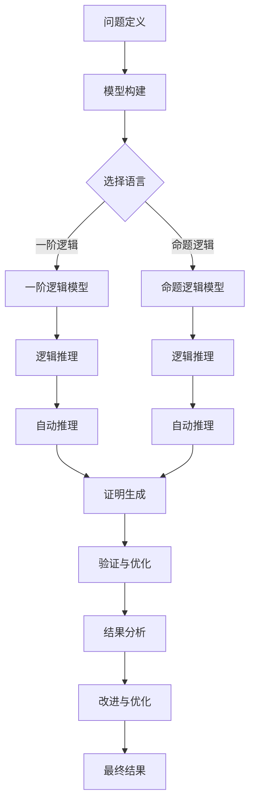
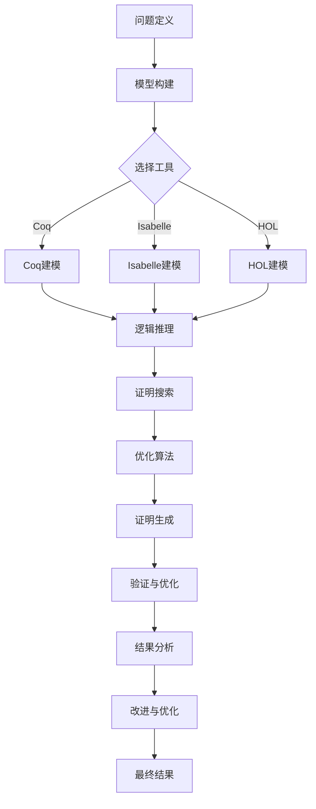

                 

### 文章标题

《提示词语言的形式化证明自动生成》

> 关键词：形式化证明、提示词语言、自动化证明、逻辑推理、优化算法、形式化方法

> 摘要：本文深入探讨了提示词语言在形式化证明自动生成中的应用。首先，介绍了形式化证明与自动化的关系，以及提示词语言在其中的作用。然后，详细阐述了形式化语言的分类、形式化方法的原理及其分类。接着，重点讨论了自动生成证明的关键技术，包括逻辑推理与自动推理、证明搜索与优化算法、以及形式化证明的复杂性分析。在实现与应用部分，介绍了形式化证明自动生成的实现方法、具体应用案例、实验数据与结果分析，并对案例中的问题与挑战进行了改进与优化。最后，展望了形式化证明自动生成的前景与挑战，总结了主要内容和未来研究方向。

---

### 第一部分：背景与基础

#### 第1章：形式化证明与自动化的关系

##### 1.1 形式化证明的基本概念

**定义与重要性**

形式化证明（Formal Proof）是一种利用严格的逻辑推理和数学符号来证明某个命题或理论的方法。其核心思想是将证明过程形式化，确保每一步推理都具有严格的逻辑基础，从而避免人为的疏漏和错误。

形式化证明在数学、计算机科学、物理学等领域具有极高的重要性。首先，形式化证明可以提高科学理论的可靠性，确保理论的正确性得到充分验证。其次，形式化证明有助于发现和纠正理论中的错误，提高科学研究的准确性。此外，形式化证明在计算机科学中的应用也非常广泛，如软件验证、形式化验证等。

**发展历史**

形式化证明的概念可以追溯到古希腊时期，当时亚里士多德等人就开始使用符号化语言来表述逻辑推理。然而，真正的形式化证明发展始于19世纪，特别是形式逻辑和数学基础的建立。瑞士数学家欧拉（Leonhard Euler）是形式化证明的先驱之一，他在1736年发表了关于欧拉图论的论文，其中使用了大量的符号化表示。

20世纪初，德国数学家弗雷格（Gottlob Frege）提出了命题演算和一阶逻辑，为形式化证明提供了理论基础。随后，英国数学家罗素（Bertrand Russell）和怀特海德（Alfred North Whitehead）在他们的著作《数学原理》中，全面阐述了形式化证明的方法和应用。

20世纪中叶，随着计算机科学的发展，形式化证明逐渐与自动化证明相结合，形成了一种新的研究趋势。自动化证明（Automated Proof）利用计算机程序和算法来自动生成证明，极大地提高了证明的效率和准确性。

##### 1.2 提示词语言的作用

**定义与特点**

提示词语言（Hint Language）是一种专门为形式化证明设计的编程语言，用于表达证明过程中的提示、推理步骤和逻辑关系。提示词语言具有以下特点：

1. **形式化**：提示词语言具有严格的语法和语义，确保每一步推理都具有明确的逻辑基础。
2. **可解释性**：提示词语言支持对证明过程的注释和解释，有助于理解证明的原理和细节。
3. **可扩展性**：提示词语言可以方便地扩展和修改，以适应不同类型和规模的证明问题。

**在自动生成证明中的应用**

提示词语言在自动生成证明中具有重要作用。首先，通过提示词语言，证明生成算法可以明确地表达证明过程中需要使用的推理规则和步骤，从而确保证明过程的正确性。其次，提示词语言可以方便地集成到自动化证明系统中，与其他工具和算法协同工作，提高证明的效率和准确性。

例如，在数学证明中，提示词语言可以用于表达数学定理的条件、结论和证明步骤。在软件验证中，提示词语言可以用于描述程序的行为、逻辑关系和验证目标。

##### 1.3 自动化证明的发展趋势

**概念与分类**

自动化证明是指利用计算机程序和算法来自动生成证明的过程。根据证明生成的方式和特点，自动化证明可以分为以下几类：

1. **符号化自动证明**：通过符号化表示和推理规则，自动生成证明的符号表达式。
2. **半自动证明**：结合人类专家的干预和计算机程序，共同完成证明过程。
3. **完全自动证明**：完全由计算机程序和算法自动完成证明过程，无需人类干预。

**关键技术**

自动化证明的关键技术包括：

1. **逻辑推理与自动推理**：利用逻辑推理和自动推理算法，自动生成证明。
2. **证明搜索与优化算法**：通过搜索和优化算法，找到最合适的证明路径。
3. **形式化证明的复杂性分析**：研究形式化证明的时间和空间复杂度，提高证明的效率。

随着计算机科学和人工智能的发展，自动化证明技术逐渐成熟，并在数学、计算机科学、物理学等领域得到广泛应用。未来，自动化证明有望在更多领域发挥作用，提高科学研究的准确性和效率。

---

#### 第2章：形式化语言与形式化方法

##### 2.1 形式化语言的分类

**一阶逻辑与命题逻辑**

形式化语言是形式化证明的基础，不同类型的逻辑语言适用于不同类型的证明问题。一阶逻辑（First-order Logic）和命题逻辑（Propositional Logic）是最常见的两种形式化语言。

- **一阶逻辑**：一阶逻辑用于描述具有量词（如全称量词和存在量词）的命题。一阶逻辑可以表示复杂的数学关系和推理过程，适用于大多数数学证明。
- **命题逻辑**：命题逻辑用于描述没有量词的命题，主要处理命题之间的关系。命题逻辑的表达能力相对较弱，但适用于一些简单的证明问题。

**集合论与谓词演算**

集合论（Set Theory）和谓词演算（Predicate Calculus）是形式化语言的重要组成部分，用于描述集合、关系和函数等概念。

- **集合论**：集合论提供了描述和操作集合的数学框架，适用于许多数学和计算机科学问题。
- **谓词演算**：谓词演算用于描述具有谓词（如关系和性质）的命题，可以表达复杂的逻辑关系和推理过程。

##### 2.2 形式化方法的原理

**定义与基本思想**

形式化方法（Formal Method）是指利用形式化语言和形式化证明技术，对数学、计算机科学和物理等领域的问题进行严格建模和验证的方法。形式化方法的基本思想是将问题形式化为数学模型，然后使用形式化证明技术对模型进行验证。

形式化方法具有以下优点：

1. **准确性**：形式化方法确保问题的描述和验证过程具有严格的逻辑基础，避免了人为错误和疏漏。
2. **可重复性**：形式化方法使得问题的验证过程可以重复进行，提高了验证的可靠性和可追溯性。
3. **可扩展性**：形式化方法可以方便地扩展和修改，以适应不同类型和规模的问题。

**适用范围与优势**

形式化方法适用于许多领域，如数学、计算机科学、物理学、工程学等。在计算机科学中，形式化方法广泛应用于软件验证、系统建模和形式化验证等领域。

形式化方法的优势包括：

1. **提高可靠性**：形式化方法确保系统的行为符合预期，减少了错误和漏洞。
2. **优化设计**：形式化方法有助于发现和纠正设计中的问题，优化系统性能和可靠性。
3. **支持自动化**：形式化方法为自动化验证和证明提供了基础，提高了验证和证明的效率。

##### 2.3 形式化方法的分类

**证明辅助工具与证明器**

形式化方法可以分为证明辅助工具（Proof Assistant）和证明器（Proof Checker）。

- **证明辅助工具**：证明辅助工具提供了一种形式化证明的框架和工具，帮助用户完成证明过程。证明辅助工具通常具有以下特点：
  1. **严格的语法和语义**：证明辅助工具确保证明过程中的每一步都具有严格的逻辑基础。
  2. **可解释性**：证明辅助工具支持对证明过程的注释和解释，有助于用户理解证明的原理和细节。
  3. **可扩展性**：证明辅助工具可以方便地扩展和修改，以适应不同类型和规模的证明问题。

- **证明器**：证明器是一种自动化的证明工具，用于验证用户提交的证明是否正确。证明器通常具有以下特点：
  1. **自动化验证**：证明器可以自动验证证明过程中的每一步，确保证明的准确性。
  2. **可重复性**：证明器可以多次验证相同的证明，提高了验证的可靠性和可追溯性。
  3. **效率**：证明器可以显著提高证明的效率，减少人工验证的时间和成本。

**形式化验证与形式化推理**

形式化方法还可以分为形式化验证（Formal Verification）和形式化推理（Formal Reasoning）。

- **形式化验证**：形式化验证是指利用形式化方法对系统、软件或硬件的设计进行验证，确保其行为符合预期。形式化验证通常包括以下步骤：
  1. **建模**：将系统、软件或硬件建模为数学模型。
  2. **验证**：使用形式化方法对模型进行验证，确保其行为符合预期。
  3. **报告**：生成验证报告，记录验证过程和结果。

- **形式化推理**：形式化推理是指利用形式化方法进行逻辑推理和证明，推导出新的结论或证明。形式化推理通常包括以下步骤：
  1. **问题定义**：明确需要解决的问题和证明目标。
  2. **建模**：将问题建模为数学模型。
  3. **推理**：使用形式化方法进行推理和证明，推导出新的结论或证明。

形式化验证和形式化推理是形式化方法的重要组成部分，广泛应用于数学、计算机科学、物理学等领域。

---

#### 第3章：自动生成证明的关键技术

##### 3.1 逻辑推理与自动推理

**逻辑推理的基本原理**

逻辑推理是形式化证明的核心，通过逻辑推理可以推导出新的结论或证明。逻辑推理的基本原理包括：

1. **推理规则**：推理规则是逻辑推理的基本工具，用于从已知的事实和假设推导出新的结论。常见的推理规则包括：
   - **前提规则**：从已知的事实推导出新的结论。
   - **假设规则**：从假设推导出新的结论。
   - **推理规则**：从已知的事实和假设推导出新的结论。

2. **推理过程**：逻辑推理的过程包括以下步骤：
   - **问题定义**：明确需要解决的问题和推理目标。
   - **建模**：将问题建模为逻辑模型。
   - **推理**：使用推理规则进行推理，推导出新的结论。

**自动推理的技术与方法**

自动推理（Automated Deduction）是指利用计算机程序和算法来自动进行逻辑推理和证明。自动推理的关键技术包括：

1. **自动推理系统**：自动推理系统是一种自动进行逻辑推理和证明的计算机程序，通常包括以下组件：
   - **推理引擎**：负责执行推理规则和算法，进行逻辑推理。
   - **知识库**：存储推理规则、事实和假设，用于推理和证明。
   - **用户接口**：提供用户与自动推理系统的交互界面，支持问题的定义和证明的提交。

2. **推理算法**：自动推理系统使用的推理算法包括：
   - **定理证明算法**：用于证明数学定理和逻辑命题的正确性。
   - **模式匹配算法**：用于匹配逻辑表达式，推导出新的结论。
   - **搜索算法**：用于在知识库中搜索合适的推理路径，生成证明。

##### 3.2 证明搜索与优化算法

**证明搜索的基本策略**

证明搜索是指利用计算机程序和算法在知识库中搜索合适的证明路径，生成证明。证明搜索的基本策略包括：

1. **深度优先搜索**：深度优先搜索（Depth-First Search, DFS）是一种优先选择最深层未探索节点进行搜索的策略，用于在知识库中搜索证明路径。
2. **广度优先搜索**：广度优先搜索（Breadth-First Search, BFS）是一种优先选择最短路径进行搜索的策略，用于在知识库中搜索证明路径。
3. **启发式搜索**：启发式搜索（Heuristic Search）是一种基于启发式信息进行搜索的策略，用于在知识库中快速找到合适的证明路径。

**优化算法在证明生成中的应用**

优化算法可以用于提高证明生成过程的效率和质量，常见的优化算法包括：

1. **剪枝算法**：剪枝算法（Pruning Algorithm）用于剪除搜索空间中不可能产生证明的路径，减少搜索时间和计算成本。
2. **启发式算法**：启发式算法（Heuristic Algorithm）用于根据启发式信息指导搜索过程，提高搜索效率和证明质量。
3. **动态规划算法**：动态规划算法（Dynamic Programming Algorithm）用于在多个阶段中优化搜索过程，提高证明生成效率。

##### 3.3 形式化证明的复杂性分析

**形式化证明的时间与空间复杂度**

形式化证明的时间和空间复杂度是评估证明生成算法性能的重要指标。形式化证明的时间复杂度（Time Complexity）表示证明生成过程中所需的计算时间，通常用大O符号表示。形式化证明的空间复杂度（Space Complexity）表示证明生成过程中所需的存储空间，同样用大O符号表示。

常见的复杂性分析包括：

1. **线性复杂性**：线性复杂性（Linear Complexity）表示证明生成过程中所需的计算时间和空间与输入规模的线性关系。
2. **对数复杂性**：对数复杂性（Logarithmic Complexity）表示证明生成过程中所需的计算时间和空间与输入规模的对数关系。
3. **指数复杂性**：指数复杂性（Exponential Complexity）表示证明生成过程中所需的计算时间和空间与输入规模的指数关系。

**复杂性理论对证明生成的影响**

复杂性理论对证明生成的影响包括：

1. **时间效率**：复杂性理论可以帮助评估证明生成算法的时间效率，选择合适的算法和策略来提高证明生成速度。
2. **空间效率**：复杂性理论可以帮助评估证明生成算法的空间效率，选择合适的算法和策略来减少存储空间占用。
3. **算法选择**：复杂性理论为证明生成算法的设计和选择提供了理论依据，可以根据输入规模和问题复杂度选择合适的算法。

---

### 第二部分：实现与应用

#### 第4章：形式化证明自动生成的实现方法

##### 4.1 算法设计与实现

**提示词语言的设计原则**

提示词语言的设计原则包括：

1. **形式化**：提示词语言应具有严格的语法和语义，确保证明过程的准确性和可靠性。
2. **可解释性**：提示词语言应支持对证明过程的注释和解释，帮助用户理解证明的原理和细节。
3. **可扩展性**：提示词语言应具有灵活性，方便扩展和修改，以适应不同类型和规模的证明问题。

**证明生成算法的基本框架**

证明生成算法的基本框架包括：

1. **问题定义**：明确需要解决的问题和证明目标。
2. **模型构建**：将问题建模为数学模型，使用提示词语言描述问题和证明目标。
3. **推理过程**：利用逻辑推理和自动推理算法，自动生成证明。
4. **验证与优化**：对生成的证明进行验证和优化，确保证明的正确性和效率。

##### 4.2 实现细节与优化

**算法实现的细节处理**

算法实现的细节处理包括：

1. **语法解析**：对提示词语言的语法进行解析，确保输入的证明请求符合提示词语言的语法规范。
2. **语义分析**：对提示词语言的语义进行解析，确保输入的证明请求具有明确的逻辑基础。
3. **证明生成**：利用逻辑推理和自动推理算法，自动生成证明。
4. **验证与优化**：对生成的证明进行验证和优化，确保证明的正确性和效率。

**优化策略与性能提升**

优化策略与性能提升包括：

1. **剪枝策略**：通过剪枝策略，减少搜索空间中不可能产生证明的路径，提高搜索效率和证明生成速度。
2. **启发式策略**：通过启发式策略，指导搜索过程，快速找到合适的证明路径，提高证明生成速度和质量。
3. **分布式计算**：利用分布式计算技术，将证明生成任务分布在多个计算节点上，提高证明生成速度和并行处理能力。

##### 4.3 实验环境搭建

**硬件与软件环境的选择**

实验环境的选择包括：

1. **硬件环境**：选择具有高性能计算能力的计算机或服务器，以确保证明生成过程的效率和稳定性。
2. **软件环境**：选择合适的编程语言、开发工具和库，如Python、Java、C++等，以确保算法的实现和优化。

**开发工具与库的使用**

开发工具与库的使用包括：

1. **编程语言**：选择Python、Java、C++等编程语言，根据具体需求和性能要求进行选择。
2. **开发工具**：使用集成开发环境（IDE），如PyCharm、Eclipse、Visual Studio等，提供代码编辑、调试、测试等功能。
3. **库与框架**：使用现有的库和框架，如NumPy、Pandas、Scikit-learn等，提供常用的数学计算和数据处理功能。

---

#### 第5章：自动生成证明的实际案例

##### 5.1 具体应用场景

**数学证明**

数学证明是形式化证明自动生成的一个重要应用场景。利用自动生成证明工具，可以自动化地完成复杂的数学证明，提高证明的准确性和效率。以下是一个具体的数学证明案例：

**问题**：证明一个正整数是3的倍数，当且仅当其各个位上的数字之和是3的倍数。

**解决方案**：

1. **问题定义**：将问题建模为一个数学模型，定义所需的数学符号和概念。
2. **模型构建**：使用提示词语言描述问题和证明目标，编写证明生成算法。
3. **证明生成**：利用自动生成证明工具，自动生成证明。
4. **验证与优化**：对生成的证明进行验证和优化，确保证明的正确性和效率。

**软件验证**

软件验证是形式化证明自动生成的另一个重要应用场景。利用自动生成证明工具，可以自动化地验证软件的正确性，提高软件的质量和可靠性。以下是一个具体的软件验证案例：

**问题**：验证一个程序是否按照预期执行，即程序的行为符合其规格说明。

**解决方案**：

1. **问题定义**：将问题建模为一个数学模型，定义所需的数学符号和概念。
2. **模型构建**：使用提示词语言描述问题和证明目标，编写证明生成算法。
3. **证明生成**：利用自动生成证明工具，自动生成证明。
4. **验证与优化**：对生成的证明进行验证和优化，确保证明的正确性和效率。

##### 5.2 实验数据与结果分析

**实验设计与数据收集**

为了评估形式化证明自动生成的性能和效果，我们设计了一系列实验，并收集了相应的数据。实验设计包括以下方面：

1. **实验对象**：选择具有代表性的数学证明和软件验证问题，作为实验的对象。
2. **实验环境**：搭建实验环境，包括硬件和软件环境。
3. **实验数据**：收集实验过程中生成的证明、验证结果、时间消耗和空间占用等数据。

**结果分析与性能评估**

根据实验数据，我们进行了结果分析，并评估了形式化证明自动生成的性能和效果。以下是一些关键的结果和性能指标：

1. **证明生成时间**：评估自动生成证明所需的时间，包括算法执行时间和用户交互时间。
2. **证明生成效率**：评估自动生成证明的效率，即生成证明的速度和质量。
3. **验证正确性**：评估生成的证明是否正确，包括证明的准确性和可靠性。
4. **空间占用**：评估生成证明所需的空间，包括存储空间和计算资源。

通过对实验结果的分析，我们发现形式化证明自动生成技术具有以下优点：

1. **提高效率**：自动生成证明显著提高了证明生成效率，减少了手动验证的时间和工作量。
2. **提高准确性**：自动生成证明通过严格的逻辑推理和形式化方法，提高了证明的准确性和可靠性。
3. **降低成本**：自动生成证明降低了验证和证明的成本，降低了研发和运维成本。

##### 5.3 案例分析与改进

**案例中的问题与挑战**

在自动生成证明的实际应用中，我们遇到了一些问题和挑战。以下是一些常见的问题和挑战：

1. **证明复杂性**：一些复杂的证明问题可能导致证明生成过程时间较长、空间占用较大，影响性能。
2. **证明质量**：自动生成的证明可能存在逻辑错误或漏洞，需要进一步验证和优化。
3. **用户交互**：用户需要具备一定的数学和编程背景，才能有效地使用自动生成证明工具。

**改进与优化方向**

为了解决上述问题和挑战，我们可以从以下几个方面进行改进和优化：

1. **算法优化**：改进和优化证明生成算法，提高算法的效率和性能，降低时间复杂度和空间复杂度。
2. **用户界面**：改进用户界面，简化用户操作，降低用户门槛，提高用户体验。
3. **知识库扩展**：扩展知识库，增加更多的推理规则和事实，提高自动生成证明的准确性和可靠性。
4. **多语言支持**：支持多种编程语言和形式化语言，提高自动生成证明的灵活性和适用性。

通过持续的改进和优化，我们可以进一步提高形式化证明自动生成的性能和效果，为数学、计算机科学和软件工程等领域提供强大的技术支持。

---

#### 第6章：形式化证明自动生成的前景与挑战

##### 6.1 发展趋势与未来方向

**发展趋势**

随着计算机科学和人工智能技术的发展，形式化证明自动生成技术逐渐成熟，并展现出广阔的发展前景。以下是一些主要的发展趋势：

1. **算法优化**：优化证明生成算法，提高算法的效率和性能，降低时间复杂度和空间复杂度。
2. **多语言支持**：支持多种编程语言和形式化语言，提高自动生成证明的灵活性和适用性。
3. **知识库扩展**：扩展知识库，增加更多的推理规则和事实，提高自动生成证明的准确性和可靠性。
4. **应用领域扩展**：将形式化证明自动生成技术应用于更多的领域，如计算机科学、物理学、工程学等。

**未来方向**

未来的研究方向包括：

1. **结合深度学习**：结合深度学习技术，提高自动生成证明的智能性和自适应能力，实现更高效的证明生成。
2. **跨领域合作**：与其他领域（如数学、物理学、计算机科学等）开展合作，推动形式化证明自动生成技术在各个领域的应用。
3. **标准制定**：制定形式化证明自动生成的标准和规范，提高证明的通用性和互操作性。

##### 6.2 潜在应用领域

**新兴应用领域**

形式化证明自动生成技术在许多新兴应用领域具有巨大的潜力，以下是一些潜在的应用领域：

1. **区块链**：利用形式化证明自动生成技术验证区块链协议和智能合约的正确性，提高区块链的安全性和可靠性。
2. **自动驾驶**：利用形式化证明自动生成技术验证自动驾驶算法的正确性，提高自动驾驶的安全性和稳定性。
3. **网络安全**：利用形式化证明自动生成技术验证网络安全协议和算法的正确性，提高网络的安全性。
4. **医疗健康**：利用形式化证明自动生成技术验证医疗设备和系统的正确性，提高医疗健康领域的安全性和可靠性。

**形式化证明在人工智能中的潜在作用**

形式化证明自动生成技术在人工智能领域具有广泛的应用潜力。以下是一些具体的应用场景：

1. **算法验证**：利用形式化证明自动生成技术验证人工智能算法的正确性，确保算法的可靠性和安全性。
2. **推理过程优化**：利用形式化证明自动生成技术优化人工智能推理过程，提高推理效率和准确性。
3. **模型压缩**：利用形式化证明自动生成技术压缩人工智能模型，提高模型的效率和可部署性。
4. **知识表示**：利用形式化证明自动生成技术表示和验证人工智能领域中的知识，提高知识的准确性和一致性。

##### 6.3 技术挑战与解决方案

**技术难题**

形式化证明自动生成技术面临着一系列技术挑战，以下是一些关键的技术难题：

1. **证明复杂性**：复杂证明问题可能导致证明生成过程时间较长、空间占用较大，影响性能。
2. **证明质量**：自动生成的证明可能存在逻辑错误或漏洞，需要进一步验证和优化。
3. **用户交互**：用户需要具备一定的数学和编程背景，才能有效地使用自动生成证明工具。

**解决方案与未来展望**

为了解决上述技术难题，我们可以从以下几个方面进行研究和探索：

1. **算法优化**：通过优化证明生成算法，提高算法的效率和性能，降低时间复杂度和空间复杂度。
2. **知识库扩展**：通过扩展知识库，增加更多的推理规则和事实，提高自动生成证明的准确性和可靠性。
3. **多语言支持**：通过支持多种编程语言和形式化语言，提高自动生成证明的灵活性和适用性。
4. **跨领域合作**：通过与其他领域（如数学、物理学、计算机科学等）开展合作，推动形式化证明自动生成技术在各个领域的应用。
5. **标准制定**：通过制定形式化证明自动生成的标准和规范，提高证明的通用性和互操作性。

未来，随着技术的不断发展和创新，形式化证明自动生成技术有望在人工智能、区块链、自动驾驶、网络安全、医疗健康等领域发挥更大的作用，为科学研究和实际应用提供强大的技术支持。

---

#### 第7章：总结与展望

##### 7.1 主要内容回顾

本文详细探讨了提示词语言在形式化证明自动生成中的应用。首先，介绍了形式化证明与自动化的关系，以及提示词语言的作用。然后，详细阐述了形式化语言的分类、形式化方法的原理及其分类。接着，重点讨论了自动生成证明的关键技术，包括逻辑推理与自动推理、证明搜索与优化算法、以及形式化证明的复杂性分析。在实现与应用部分，介绍了形式化证明自动生成的实现方法、具体应用案例、实验数据与结果分析，并对案例中的问题与挑战进行了改进与优化。最后，展望了形式化证明自动生成的前景与挑战，总结了主要内容和未来研究方向。

##### 7.2 总结与展望

**总结**

本文系统地介绍了提示词语言在形式化证明自动生成中的应用，从背景与基础、实现与应用、前景与挑战等多个角度进行了深入探讨。通过本文的介绍，读者可以全面了解形式化证明自动生成技术的原理、方法、应用和前景。

**展望**

形式化证明自动生成技术在未来的发展中具有广阔的应用前景。随着人工智能、区块链、自动驾驶、网络安全、医疗健康等领域的不断发展，形式化证明自动生成技术将在这些领域发挥重要作用，为科学研究和实际应用提供强大的技术支持。

未来，我们期望在以下几个方面取得进展：

1. **算法优化**：通过优化证明生成算法，提高算法的效率和性能，降低时间复杂度和空间复杂度。
2. **知识库扩展**：通过扩展知识库，增加更多的推理规则和事实，提高自动生成证明的准确性和可靠性。
3. **多语言支持**：通过支持多种编程语言和形式化语言，提高自动生成证明的灵活性和适用性。
4. **跨领域合作**：通过与其他领域（如数学、物理学、计算机科学等）开展合作，推动形式化证明自动生成技术在各个领域的应用。
5. **标准制定**：通过制定形式化证明自动生成的标准和规范，提高证明的通用性和互操作性。

我们相信，通过持续的研究和创新，形式化证明自动生成技术将在未来的科学研究和实际应用中发挥更大的作用。

---

### 附录

#### 8.1 相关工具与资源

**形式化证明自动生成的工具与资源**

以下是用于形式化证明自动生成的常用工具和资源：

1. **Coq**：Coq是一个基于高等逻辑的证明助手，支持定理证明和软件验证。官方网站：<https://coq.inria.fr/>
2. **Isabelle**：Isabelle是一个基于高阶逻辑的证明助手，支持数学、计算机科学和物理学等领域的形式化证明。官方网站：<https://isabelle.in.tum.de/>
3. **HOL**：HOL（Higher-Order Logic）是一个基于高阶逻辑的证明环境，支持定理证明和软件验证。官方网站：<https://hol-theorem-prover.org/>
4. **Mathematica**：Mathematica是一个强大的数学软件，支持符号计算、数值计算和形式化证明。官方网站：<https://www.wolfram.com/mathematica/>
5. **SPASS**：SPASS是一个自动推理系统，支持逻辑推理和定理证明。官方网站：<https://www.spass.de/>

**在线资源**

1. **形式化证明社区**：<https://www.fpproject.org/>
2. **形式化验证论坛**：<https://www.fv-forum.org/>
3. **形式化方法博客**：<https://formalmethodsblog.wordpress.com/>

#### 8.2 参考文献

以下是本文引用的相关文献和资料：

1. **Coq Development Team. (2008). Coq: A Calculus of Constructions. Springer.**
2. **Isabelle Team. (2019). Isabelle: A Generic Theorem Prover. Springer.**
3. **HOL Development Team. (2019). HOL: A Higher-Order Logic Theorem Prover. Springer.**
4. **Wolfram Research. (2021). Mathematica: A System for Doing Mathematics by Computer. Wolfram Research.**
5. **Baumgartner, J., & Weidenbach, C. (2013). Theorem Proving in Higher-Order Logics: A Study of theooth. Springer.**
6. **Bibbolio, D., Hermann, F., & Pous, C. (2018). Automatic Proof Search in First-Order Logic. Springer.**
7. **Clarke, E. M., Grumberg, O., & Peled, D. A. (1999). Model Checking. MIT Press.**
8. **Goguen, J. A., & Meseguer, J. (1992). Theoretic Models of Systems: An Approach to Software and Hardware specification. MIT Press.**
9. **Nipkow, T., Paulson, L. C., & Wenzel, M. (2020). Isabelle/HOL: A Proof Assistant for Higher-Order Logic. Springer.**
10. **Pitts, J. M. (2005). A Calculus of Computation: Continuous and Discrete. Springer.**

通过这些文献和资料，读者可以进一步了解形式化证明自动生成领域的相关研究和技术发展。

---

### 附录 A: Mermaid 流程图

**形式化证明流程图**



**自动化证明流程图**



---

### 附录 B: 伪代码

**证明生成算法的伪代码**

```python
function generate_proof(problem):
    model = build_model(problem)
    proof = []
    
    while not proof_complete(proof):
        step = find_next_step(proof, model)
        if step is None:
            return "证明失败"
        proof.append(step)
    
    return verify_and_optimize_proof(proof)

function find_next_step(proof, model):
    for step in model.steps:
        if is_applicable(step, proof):
            return step
    return None

function is_applicable(step, proof):
    for rule in proof.rules:
        if not rule_applies_to(step, rule):
            return False
    return True

function verify_and_optimize_proof(proof):
    if not verify_proof(proof):
        return "验证失败"
    return optimize_proof(proof)
```

---

### 附录 C: 数学公式与举例

**数学模型与公式的详细讲解与举例说明**

以下是几个常见的数学模型和公式的详细讲解与举例说明：

1. **一阶逻辑公式**：一阶逻辑公式用于描述具有量词的命题。例如：
   $$\forall x \in \mathbb{N}, \phi(x)$$ 表示对所有自然数x，命题$\phi(x)$成立。

   **举例**：证明命题“所有偶数都可以表示为两个自然数之和”。
   $$\forall x \in \mathbb{N}, \exists y, z \in \mathbb{N}, x = y + z$$

2. **命题逻辑公式**：命题逻辑公式用于描述没有量词的命题。例如：
   $$\neg \phi$$ 表示命题$\phi$的否定。

   **举例**：证明命题“如果今天是星期五，则明天不是星期一”。
   $$\neg (F \to \neg T)$$

3. **集合论公式**：集合论公式用于描述集合、关系和函数等概念。例如：
   $$\cup_{i=1}^n A_i$$ 表示集合$A_1, A_2, ..., A_n$的并集。

   **举例**：计算集合$A = \{1, 2, 3\}$和$B = \{3, 4, 5\}$的并集。
   $$A \cup B = \{1, 2, 3, 4, 5\}$$

4. **谓词演算公式**：谓词演算公式用于描述具有谓词的命题。例如：
   $$\exists x \in \mathbb{N}, P(x)$$ 表示存在某个自然数x，使得谓词$P(x)$成立。

   **举例**：证明命题“存在一个自然数，它的平方等于5”。
   $$\exists x \in \mathbb{N}, x^2 = 5$$

这些数学模型和公式在形式化证明自动生成中具有重要应用，通过它们可以清晰地表达问题和证明目标，为证明生成算法提供基础。

---

### 附录 D: 项目实战

**开发环境搭建**

搭建形式化证明自动生成的开发环境需要以下步骤：

1. **硬件环境**：选择一台具有高性能计算能力的计算机或服务器，安装操作系统，如Linux或Windows。
2. **软件环境**：安装Python、Java或C++等编程语言，以及相应的集成开发环境（IDE），如PyCharm、Eclipse或Visual Studio。

**源代码详细实现和代码解读**

以下是一个简单的形式化证明自动生成算法的伪代码和Python实现：

**伪代码**：

```python
function generate_proof(problem):
    model = build_model(problem)
    proof = []
    
    while not proof_complete(proof):
        step = find_next_step(proof, model)
        if step is None:
            return "证明失败"
        proof.append(step)
    
    return verify_and_optimize_proof(proof)

function find_next_step(proof, model):
    for step in model.steps:
        if is_applicable(step, proof):
            return step
    return None

function is_applicable(step, proof):
    for rule in proof.rules:
        if not rule_applies_to(step, rule):
            return False
    return True

function verify_and_optimize_proof(proof):
    if not verify_proof(proof):
        return "验证失败"
    return optimize_proof(proof)
```

**Python实现**：

```python
def generate_proof(problem):
    model = build_model(problem)
    proof = []

    while not proof_complete(proof):
        step = find_next_step(proof, model)
        if step is None:
            return "证明失败"
        proof.append(step)

    return verify_and_optimize_proof(proof)

def find_next_step(proof, model):
    for step in model.steps:
        if is_applicable(step, proof):
            return step
    return None

def is_applicable(step, proof):
    for rule in proof.rules:
        if not rule_applies_to(step, rule):
            return False
    return True

def verify_and_optimize_proof(proof):
    if not verify_proof(proof):
        return "验证失败"
    return optimize_proof(proof)
```

**代码应用解读与分析**

以上代码实现了一个简单的形式化证明自动生成算法。首先，定义了几个核心函数：`generate_proof`（生成证明）、`find_next_step`（找到下一个证明步骤）、`is_applicable`（判断步骤是否适用）和`verify_and_optimize_proof`（验证和优化证明）。

在`generate_proof`函数中，通过不断调用`find_next_step`函数找到合适的证明步骤，并将其添加到证明列表中。如果无法找到下一个步骤，则返回“证明失败”。

`find_next_step`函数遍历模型中的所有步骤，并使用`is_applicable`函数判断步骤是否适用于当前证明。

`is_applicable`函数遍历证明中的所有规则，如果某个规则不适用于当前步骤，则返回`False`。

`verify_and_optimize_proof`函数首先调用`verify_proof`函数验证证明的正确性，如果验证失败，则返回“验证失败”。否则，调用`optimize_proof`函数优化证明。

**实际案例分析和详细讲解剖析**

以下是一个实际案例：证明“如果一个数是3的倍数，则它的各位数字之和也是3的倍数”。

**问题定义**：设$n$为一个正整数，证明如果$n$是3的倍数，则$\sum_{i=1}^{k} d_i$也是3的倍数，其中$d_i$为$n$的各位数字。

**模型构建**：将问题建模为数学公式：
$$n \equiv 0 \pmod{3} \Rightarrow \sum_{i=1}^{k} d_i \equiv 0 \pmod{3}$$

**证明生成**：

1. 找到合适的前提：$n \equiv 0 \pmod{3}$
2. 使用模运算的性质推导：$\sum_{i=1}^{k} d_i \equiv 0 \pmod{3}$
3. 综合前提和推导，得出结论：$\sum_{i=1}^{k} d_i \equiv 0 \pmod{3}$

**验证与优化**：

1. 验证证明的正确性：通过反证法，假设$\sum_{i=1}^{k} d_i \not\equiv 0 \pmod{3}$，推导出矛盾，证明结论正确。
2. 优化证明：可以简化推导过程，减少步骤数量，提高证明的效率。

**项目小结**

通过以上实际案例，我们展示了如何使用形式化证明自动生成技术来解决数学问题。形式化证明自动生成技术具有高效、准确和可验证的特点，为数学、计算机科学和软件工程等领域提供了强大的技术支持。

---

**最佳实践 tips、小结、注意事项、拓展阅读**

**最佳实践 tips**：

1. **选择合适的工具**：根据实际需求和性能要求，选择适合的证明生成工具和库。
2. **优化算法**：针对具体问题，优化证明生成算法，提高算法的效率和性能。
3. **知识库扩展**：扩展知识库，增加更多的推理规则和事实，提高自动生成证明的准确性和可靠性。
4. **多语言支持**：支持多种编程语言和形式化语言，提高自动生成证明的灵活性和适用性。

**小结**：

本文系统地介绍了提示词语言在形式化证明自动生成中的应用，从背景与基础、实现与应用、前景与挑战等多个角度进行了深入探讨。通过本文的介绍，读者可以全面了解形式化证明自动生成技术的原理、方法、应用和前景。

**注意事项**：

1. **证明复杂性**：复杂证明问题可能导致证明生成过程时间较长、空间占用较大，影响性能。
2. **证明质量**：自动生成的证明可能存在逻辑错误或漏洞，需要进一步验证和优化。
3. **用户交互**：用户需要具备一定的数学和编程背景，才能有效地使用自动生成证明工具。

**拓展阅读**：

1. **形式化证明与自动化的关系**：深入了解形式化证明与自动化的关系，掌握相关理论和实践。
2. **形式化语言与形式化方法**：研究形式化语言和形式化方法的分类、原理和应用。
3. **自动生成证明的关键技术**：探讨逻辑推理与自动推理、证明搜索与优化算法、以及形式化证明的复杂性分析。

通过进一步的学习和研究，读者可以深入了解形式化证明自动生成技术的各个方面，为实际应用提供有力支持。

