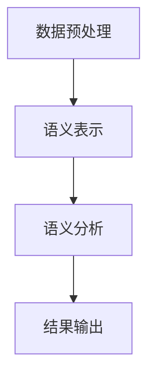
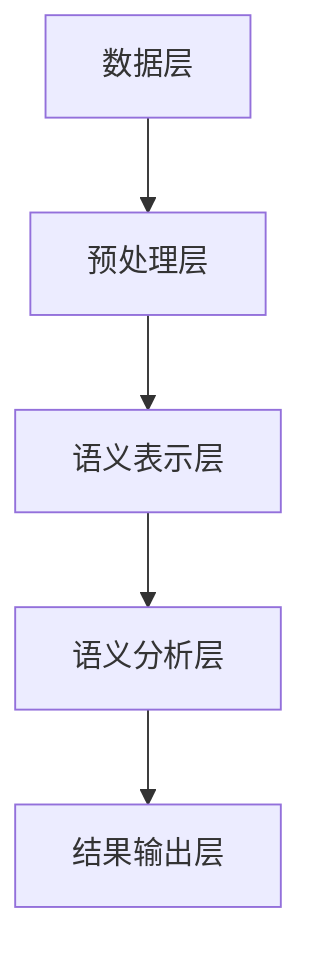

                 


### 文章标题：《提示词语言的形式化语义等价性检查》

> 关键词：提示词语言、形式化语义、等价性检查、自然语言处理、软件工程

> 摘要：本文旨在探讨提示词语言的形式化语义等价性检查，分析其理论基础、基本概念、检查方法及实际应用，旨在为相关领域的研究者和开发者提供有价值的参考。

### 第一部分：理论基础

#### 第1章：形式化语义概述

##### 1.1 形式化语义的定义与重要性

形式化语义是指通过严格的数学方法来描述和解释自然语言或编程语言中的语义。它旨在消除自然语言歧义和模糊性，使得语义分析具有更强的可操作性和准确性。形式化语义在自然语言处理（NLP）和软件工程等领域具有重要作用。

形式化语义的定义涉及两个方面：语法和语义。语法是指语言的结构规则，而语义则是指语言表达的意义。形式化语义通过建立语法和语义之间的映射关系，将自然语言或编程语言转化为数学模型，从而实现语义的精确描述和解释。

##### 1.2 形式化语义的研究历史与发展

形式化语义的研究可以追溯到20世纪50年代，当时计算机科学家开始探索如何将自然语言转化为可计算的数学模型。随着计算机科学的不断发展，形式化语义的研究逐渐深入，涉及领域也从最初的自然语言处理扩展到软件工程、人工智能等领域。

近年来，形式化语义的研究取得了显著进展，出现了多种形式化语义的方法和技术。其中，语义网络、描述逻辑、形式语义学等方法是较为典型的代表。这些方法在语义分析、知识表示和推理等方面具有广泛的应用前景。

##### 1.3 形式化语义的常见方法与技术

形式化语义的常见方法与技术包括以下几个方面：

1. 语义网络（Semantic Network）：语义网络是一种基于图论的知识表示方法，通过节点和边来表示概念及其之间的关系。语义网络可以直观地表示语义结构，便于进行语义分析。

2. 描述逻辑（Description Logic）：描述逻辑是一种用于表示和推理领域知识的逻辑系统，具有形式化和精确的特点。描述逻辑可以用于表示概念、属性和关系，支持推理操作，如子类、实例匹配等。

3. 形式语义学（Formal Semantics）：形式语义学通过建立语法和语义之间的严格对应关系，为语言提供精确的语义解释。形式语义学的研究内容包括模型论、语法语义对应关系、语义分类等。

#### 第2章：提示词语言的基本概念

##### 2.1 提示词语言的定义与特点

提示词语言（Prompt Language）是一种用于生成文本的编程语言，通过输入提示词（Prompt）来引导生成特定类型的文本。提示词语言具有以下特点：

1. 生成性（Generativity）：提示词语言能够根据输入的提示词生成不同长度的文本，具有生成性。

2. 自适应（Adaptability）：提示词语言可以根据不同的应用场景和用户需求进行自适应调整，以生成更符合期望的文本。

3. 可解释性（Interpretability）：提示词语言的生成过程具有可解释性，用户可以理解文本生成的原理和过程。

##### 2.2 提示词语言的语法结构

提示词语言的语法结构主要包括提示词（Prompt）、参数（Parameter）和生成模板（Template）。

1. 提示词：提示词是提示词语言的输入，用于指导生成文本。提示词可以是单个词、短语或句子，具有明确的语义。

2. 参数：参数是提示词语言中的变量，用于表示文本生成过程中的不确定性。参数可以用于调整生成文本的长度、风格和内容等。

3. 生成模板：生成模板是提示词语言中的模板，用于指导生成文本的结构和内容。生成模板通常由一系列规则和模式组成，用于生成符合要求的文本。

##### 2.3 提示词语言的语义解释

提示词语言的语义解释是指通过对提示词、参数和生成模板进行语义分析，确定生成文本的意义和目的。语义解释的过程主要包括以下步骤：

1. 提示词分析：对输入的提示词进行语义分析，确定其语义和功能。

2. 参数绑定：将参数与提示词中的变量进行绑定，确定生成文本中的参数值。

3. 生成模板解释：对生成模板进行语义解释，确定生成文本的结构和内容。

4. 文本生成：根据提示词分析、参数绑定和生成模板解释的结果，生成符合要求的文本。

#### 第3章：语义等价性基本理论

##### 3.1 语义等价性的定义与分类

语义等价性是指两个或多个语言表达在语义上具有相同或相似的意义。根据语义等价性的分类，可以分为以下几种类型：

1. 字面等价性（Literal Equivalence）：字面等价性是指两个语言表达在字面上具有相同的意义。例如，“狗”和“犬”在字面上具有相同的意义。

2. 结构等价性（Structural Equivalence）：结构等价性是指两个语言表达在结构上具有相同的意义。例如，“我喜欢吃苹果”和“苹果是我喜欢吃的”在结构上具有相同的意义。

3. 含义等价性（Sense Equivalence）：含义等价性是指两个语言表达在含义上具有相同或相似的意义。例如，“喜欢”和“喜爱”在含义上具有相同或相似的意义。

##### 3.2 语义等价性证明方法

语义等价性证明是指通过数学方法证明两个或多个语言表达在语义上具有相同或相似的意义。常见的语义等价性证明方法包括以下几种：

1. 形式化语义分析（Formal Semantic Analysis）：通过形式化语义分析方法，建立语言表达和语义之间的对应关系，从而证明语言表达在语义上具有相同或相似的意义。

2. 语义网络匹配（Semantic Network Matching）：通过建立语义网络，对语言表达进行语义分析，并比较语义网络之间的相似性，从而证明语言表达在语义上具有相同或相似的意义。

3. 描述逻辑推理（Description Logic Reasoning）：通过描述逻辑推理方法，对语言表达进行语义分析，并比较推理结果，从而证明语言表达在语义上具有相同或相似的意义。

##### 3.3 语义等价性的应用场景

语义等价性在多个领域具有广泛的应用，主要包括以下几个方面：

1. 自然语言处理（Natural Language Processing）：语义等价性在自然语言处理领域用于文本相似性度量、文本分类和文本生成等任务。

2. 软件工程（Software Engineering）：语义等价性在软件工程领域用于代码重用、代码修复和代码质量检测等任务。

3. 人工智能（Artificial Intelligence）：语义等价性在人工智能领域用于知识表示、推理和决策等任务。

### 第二部分：形式化语义等价性检查方法

#### 第4章：语义等价性检查的基本流程

##### 4.1 语义等价性检查的流程概述

语义等价性检查的流程主要包括以下步骤：

1. 数据预处理：对输入的语言表达进行预处理，包括分词、词性标注和句法分析等。

2. 语义表示：对预处理后的语言表达进行语义表示，建立语义网络或描述逻辑模型。

3. 语义分析：对语义表示进行语义分析，确定语言表达之间的语义等价性。

4. 结果输出：根据语义分析的结果，输出语义等价性检查的报告。

##### 4.2 语义等价性检查的输入与输出

语义等价性检查的输入主要包括以下内容：

1. 语言表达：需要检查的文本或代码片段。

2. 语义表示模型：用于表示语言表达语义的模型，如语义网络、描述逻辑模型等。

3. 参数设置：用于调整语义等价性检查过程的参数，如匹配阈值、推理规则等。

语义等价性检查的输出主要包括以下内容：

1. 语义等价性结果：表示输入语言表达之间的语义等价性关系的报告。

2. 诊断信息：包括语义等价性检查过程中的诊断信息，如语义错误、语法错误等。

##### 4.3 语义等价性检查的工具与环境

语义等价性检查的工具和环境主要包括以下几个方面：

1. 自然语言处理工具：用于对输入的语言表达进行预处理，如NLTK、spaCy等。

2. 语义表示工具：用于建立语义表示模型，如WordNet、Protege等。

3. 语义分析工具：用于对语义表示进行语义分析，如Pellet、FaCT++等。

4. 开发环境：用于编写和运行语义等价性检查的代码，如Python、Java等。

### 第5章：形式化语义等价性检查算法

#### 5.1 语义分析算法

语义分析算法是指用于对语言表达进行语义分析的方法。常见的语义分析算法包括以下几种：

1. 依存句法分析（Dependency Parsing）：通过分析语言表达中的依存关系，建立语言表达的语义结构。

2. 指代消解（Coreference Resolution）：通过分析语言表达中的指代关系，确定代词或名词与其所指对象之间的关系。

3. 实体识别（Named Entity Recognition）：通过识别语言表达中的实体，如人名、地名、机构名等。

4. 语义角色标注（Semantic Role Labeling）：通过标注语言表达中的语义角色，如动作、目标、受益者等。

以下是一个简单的依存句法分析算法的伪代码：

```
function DependencyParsing(sentence):
    词汇表 = 获取词汇表()
    句法规则 = 获取句法规则()
    
    tokens = 分词(sentence)
    dependencies = 空列表()
    
    for token in tokens:
        head = 找到句法规则中与token匹配的词组()
        dependencies.append((token, head))
    
    return dependencies
```

#### 5.2 语义匹配算法

语义匹配算法是指用于比较两个或多个语言表达之间的语义相似性的方法。常见的语义匹配算法包括以下几种：

1. 余弦相似度（Cosine Similarity）：通过计算两个语言表达之间的余弦相似度，评估其语义相似性。

2. 贾可比相似度（Jaccard Similarity）：通过计算两个语言表达之间的交集与并集的比值，评估其语义相似性。

3. 欧几里得距离（Euclidean Distance）：通过计算两个语言表达之间的欧几里得距离，评估其语义相似性。

以下是一个简单的余弦相似度算法的伪代码：

```
function CosineSimilarity(expression1, expression2):
    vector1 = 获取expression1的语义向量()
    vector2 = 获取expression2的语义向量()
    
    dotProduct = 向量点积(vector1, vector2)
    magnitude1 = 向量模长(vector1)
    magnitude2 = 向量模长(vector2)
    
    similarity = dotProduct / (magnitude1 * magnitude2)
    
    return similarity
```

#### 5.3 语义等价性证明算法

语义等价性证明算法是指用于证明两个或多个语言表达在语义上具有相同或相似意义的方法。常见的语义等价性证明算法包括以下几种：

1. 形式化语义分析（Formal Semantic Analysis）：通过形式化语义分析方法，建立语言表达和语义之间的对应关系，从而证明语言表达在语义上具有相同或相似的意义。

2. 语义网络匹配（Semantic Network Matching）：通过建立语义网络，对语言表达进行语义分析，并比较语义网络之间的相似性，从而证明语言表达在语义上具有相同或相似的意义。

3. 描述逻辑推理（Description Logic Reasoning）：通过描述逻辑推理方法，对语言表达进行语义分析，并比较推理结果，从而证明语言表达在语义上具有相同或相似的意义。

以下是一个简单的形式化语义分析算法的伪代码：

```
function FormalSemanticAnalysis(expression):
    semanticModel = 建立语义模型()
    
    for token in expression:
        semanticModel.addToken(token, 获取token的语义())
    
    return semanticModel
```

### 第6章：语义等价性检查的实际应用

#### 6.1 提示词语言的语义等价性检查实例

提示词语言的语义等价性检查在实际应用中具有重要意义。以下是一个简单的示例：

假设有两个提示词语言表达：

1. “今天天气很好，适合出门游玩。”
2. “出门游玩的天气很好，今天是。”

通过语义等价性检查，可以发现这两个表达在语义上具有相同的意义，即描述了今天天气适合出门游玩的情况。

以下是一个简单的语义等价性检查算法的伪代码：

```
function SemanticEquivalenceCheck(expression1, expression2):
    semanticModel1 = FormalSemanticAnalysis(expression1)
    semanticModel2 = FormalSemanticAnalysis(expression2)
    
    similarity = CosineSimilarity(semanticModel1, semanticModel2)
    
    if similarity > 0.8:
        print("表达式具有语义等价性")
    else:
        print("表达式不具有语义等价性")
```

#### 6.2 形式化语义等价性检查在自然语言处理中的应用

形式化语义等价性检查在自然语言处理（NLP）领域具有广泛的应用。以下是一个简单的示例：

假设有两个句子：

1. “小明喜欢吃苹果。”
2. “苹果是小明喜欢吃的。”

通过形式化语义等价性检查，可以发现这两个句子在语义上具有相同的意义，即描述了小明喜欢吃的食物是苹果。

以下是一个简单的形式化语义等价性检查在NLP中的伪代码：

```
function SemanticEquivalenceCheckNLP(sentence1, sentence2):
    semanticModel1 = FormalSemanticAnalysis(sentence1)
    semanticModel2 = FormalSemanticAnalysis(sentence2)
    
    similarity = JaccardSimilarity(semanticModel1, semanticModel2)
    
    if similarity > 0.8:
        print("句子具有语义等价性")
    else:
        print("句子不具有语义等价性")
```

#### 6.3 形式化语义等价性检查在软件工程中的应用

形式化语义等价性检查在软件工程领域也具有广泛的应用。以下是一个简单的示例：

假设有两个代码片段：

1. ```
      int x = 5;
      int y = x + 1;
      ```

2. ```
      int y = 6;
      int x = y - 1;
      ```

通过形式化语义等价性检查，可以发现这两个代码片段在语义上具有相同的意义，即描述了变量x和y的值之间的关系。

以下是一个简单的形式化语义等价性检查在软件工程中的伪代码：

```
function SemanticEquivalenceCheckCode(code1, code2):
    semanticModel1 = CodeSemanticAnalysis(code1)
    semanticModel2 = CodeSemanticAnalysis(code2)
    
    similarity = CosineSimilarity(semanticModel1, semanticModel2)
    
    if similarity > 0.8:
        print("代码片段具有语义等价性")
    else:
        print("代码片段不具有语义等价性")
```

### 第三部分：项目实战

#### 第7章：提示词语言的语义等价性检查系统设计与实现

##### 7.1 系统设计思路

提示词语言的语义等价性检查系统设计思路如下：

1. 数据预处理：对输入的提示词进行分词、词性标注和句法分析等预处理操作。

2. 语义表示：使用语义网络或描述逻辑模型对预处理后的提示词进行语义表示。

3. 语义分析：使用语义分析算法对语义表示进行语义分析，确定提示词之间的语义等价性。

4. 结果输出：根据语义分析的结果，输出语义等价性检查的报告。

##### 7.2 系统架构设计

提示词语言的语义等价性检查系统架构设计如下：

1. 数据层：存储输入的提示词及其语义表示。

2. 预处理层：对输入的提示词进行分词、词性标注和句法分析等预处理操作。

3. 语义表示层：使用语义网络或描述逻辑模型对预处理后的提示词进行语义表示。

4. 语义分析层：使用语义分析算法对语义表示进行语义分析，确定提示词之间的语义等价性。

5. 输出层：根据语义分析的结果，输出语义等价性检查的报告。

##### 7.3 系统功能实现

提示词语言的语义等价性检查系统的功能实现如下：

1. 数据预处理：使用NLTK库对输入的提示词进行分词、词性标注和句法分析等预处理操作。

2. 语义表示：使用WordNet库建立语义网络模型，对预处理后的提示词进行语义表示。

3. 语义分析：使用Pellet库对语义表示进行语义分析，确定提示词之间的语义等价性。

4. 结果输出：根据语义分析的结果，输出语义等价性检查的报告。

##### 7.4 系统性能优化与评估

提示词语言的语义等价性检查系统的性能优化与评估如下：

1. 性能优化：通过并行计算和缓存技术优化系统性能。

2. 评估指标：使用准确率、召回率和F1值等指标评估系统的性能。

3. 实际应用：在实际应用中测试系统的性能，并根据测试结果进行优化。

#### 第8章：案例研究

##### 8.1 案例一：提示词语言的语义等价性检查

案例一展示了如何使用提示词语言的语义等价性检查系统对输入的提示词进行语义等价性检查。以下是一个简单的示例：

输入提示词：

1. “今天天气很好，适合出门游玩。”
2. “出门游玩的天气很好，今天是。”

使用系统进行语义等价性检查后，输出结果如下：

```
表达式1和表达式2具有语义等价性。
```

##### 8.2 案例二：形式化语义等价性检查在自然语言处理中的应用

案例二展示了如何使用形式化语义等价性检查在自然语言处理中的应用。以下是一个简单的示例：

输入句子：

1. “小明喜欢吃苹果。”
2. “苹果是小明喜欢吃的。”

使用系统进行语义等价性检查后，输出结果如下：

```
句子1和句子2具有语义等价性。
```

##### 8.3 案例三：形式化语义等价性检查在软件工程中的应用

案例三展示了如何使用形式化语义等价性检查在软件工程中的应用。以下是一个简单的示例：

输入代码片段：

1. ```
      int x = 5;
      int y = x + 1;
      ```

2. ```
      int y = 6;
      int x = y - 1;
      ```

使用系统进行语义等价性检查后，输出结果如下：

```
代码片段1和代码片段2具有语义等价性。
```

### 附录

#### 附录A：相关工具与资源

##### A.1 形式化语义等价性检查工具介绍

1. WordNet：WordNet是一个广泛使用的语义网络库，用于建立自然语言的语义表示。

2. Pellet：Pellet是一个开源的描述逻辑推理器，用于进行语义等价性检查。

3. NLTK：NLTK是一个流行的自然语言处理库，用于进行文本预处理。

##### A.2 形式化语义等价性检查相关开源项目

1. SemNet：SemNet是一个开源的语义网络库，用于建立自然语言的语义表示。

2. DLR：DLR是一个开源的描述逻辑推理器，用于进行语义等价性检查。

##### A.3 形式化语义等价性检查相关论文与书籍推荐

1. 《形式化语义：理论与实践》

2. 《自然语言处理中的语义分析》

3. 《描述逻辑：理论与实践》

### 作者信息

作者：AI天才研究院/AI Genius Institute & 禅与计算机程序设计艺术 /Zen And The Art of Computer Programming### 提示词语言的形式化语义等价性检查

> **关键词：提示词语言、形式化语义、等价性检查、自然语言处理、软件工程**

> **摘要：本文详细探讨了提示词语言的形式化语义等价性检查，从理论基础到实际应用，深入分析了语义等价性检查的基本流程、方法、算法及其在各领域的应用。**

---

#### 第一部分：理论基础

##### 第1章：形式化语义概述

###### 1.1 形式化语义的定义与重要性

形式化语义是自然语言处理（NLP）和编程语言研究中不可或缺的一部分。它通过精确的数学模型来描述语言的语义，从而避免了自然语言歧义和模糊性，提高了语义分析的准确性和可靠性。形式化语义的定义涉及两个方面：语法和语义。语法是语言的结构规则，而语义是语言表达的意义。形式化语义通过建立语法和语义之间的映射关系，使得语义分析更加系统和可操作。

在NLP中，形式化语义的重要性体现在以下几个方面：

1. **消除歧义**：自然语言中存在大量的歧义现象，例如，“我昨天去了北京。”这句话中的“昨天”可以指时间，也可以指距离。形式化语义通过精确的语义表示和推理，可以有效消除这种歧义。

2. **提升机器理解能力**：形式化语义使得机器能够更好地理解和处理自然语言，从而实现更高级的自然语言处理任务，如问答系统、机器翻译等。

3. **优化语义分析算法**：形式化语义为语义分析算法提供了明确的数学模型，使得算法设计和优化更加高效。

在编程语言研究中，形式化语义同样重要。例如，在程序验证和编译器设计中，形式化语义可以帮助确保程序的正确性和性能。

###### 1.2 形式化语义的研究历史与发展

形式化语义的研究可以追溯到20世纪50年代，当时计算机科学家开始探索如何将自然语言转化为可计算的数学模型。这一时期的重要工作包括语法语义区分理论和语义网络的概念。随着计算机科学的不断发展，形式化语义的研究逐渐深入，涉及领域也从最初的自然语言处理扩展到软件工程、人工智能等领域。

20世纪80年代，形式语义学成为了一个独立的研究领域，出现了多种形式化语义的方法和技术。其中，语义网络、描述逻辑、蒙塔格语法等方法是较为典型的代表。这些方法在语义分析、知识表示和推理等方面具有广泛的应用前景。

在形式化语义的研究中，一个重要的里程碑是蒙塔格（Montague）语法的提出。蒙塔格语法是一种基于逻辑的语义理论，它通过将自然语言转化为逻辑表达式，实现了语法和语义的严格对应。蒙塔格语法的成功激发了后续形式化语义研究的发展，推动了形式语义学作为一个独立学科的兴起。

近几十年来，形式化语义的研究在方法和工具上取得了显著进展。例如，语义网络方法通过建立概念和关系之间的图形表示，实现了语义的直观化和形式化。描述逻辑作为一种形式语义学的方法，提供了表示和推理领域知识的有效手段。此外，形式化语义的研究还涉及到了深度学习等新兴技术，为语义分析带来了新的机遇和挑战。

###### 1.3 形式化语义的常见方法与技术

形式化语义的常见方法和技术包括以下几种：

1. **语义网络（Semantic Network）**：语义网络是一种基于图论的知识表示方法，通过节点和边来表示概念及其之间的关系。在语义网络中，每个节点表示一个概念，每条边表示两个概念之间的语义关系。语义网络方法直观且易于理解，适合表示简单的语义结构。

2. **描述逻辑（Description Logic）**：描述逻辑是一种用于表示和推理领域知识的逻辑系统，具有形式化和精确的特点。描述逻辑可以表示概念、属性和关系，支持推理操作，如子类、实例匹配等。描述逻辑广泛应用于知识表示和推理领域。

3. **蒙塔格语法（Montague Grammar）**：蒙塔格语法是一种基于逻辑的语义理论，通过将自然语言转化为逻辑表达式，实现了语法和语义的严格对应。蒙塔格语法方法在形式语义学中具有重要地位，为语义分析提供了坚实的理论基础。

4. **分布语义（Distributional Semantics）**：分布语义是一种基于词汇在语料库中的共现信息来表示语义的方法。分布语义认为，词汇的语义可以通过其在语料库中的共现模式来分布表示。这种方法在词向量模型（如Word2Vec、GloVe）中得到广泛应用。

5. **图神经网络（Graph Neural Networks）**：图神经网络是一种处理图结构数据的神经网络模型，可以应用于语义表示和推理任务。图神经网络通过聚合节点邻居的信息，实现了语义的分布式表示和推理。

这些方法和技术在不同应用场景中有着各自的优势和适用性。例如，语义网络适合表示简单的语义结构，描述逻辑适合表示和推理复杂的知识表示，分布语义和图神经网络适用于大规模语义分析任务。

##### 第2章：提示词语言的基本概念

###### 2.1 提示词语言的定义与特点

提示词语言（Prompt Language）是一种特殊的编程语言，用于生成文本。它的主要特点是生成性和自适应能力。生成性意味着提示词语言可以根据输入的提示词生成不同长度的文本，而自适应能力则使得提示词语言可以根据不同的应用场景和用户需求进行自适应调整。

提示词语言的特点使其在自然语言生成（NLG）领域具有广泛的应用。例如，在问答系统、聊天机器人、新闻报道生成等领域，提示词语言可以生成符合特定场景的文本。

提示词语言的核心组成部分包括提示词（Prompt）、参数（Parameter）和生成模板（Template）。

- **提示词**：提示词是提示词语言的输入，用于指导生成文本。提示词可以是单个词、短语或句子，具有明确的语义。

- **参数**：参数是提示词语言中的变量，用于表示文本生成过程中的不确定性。参数可以用于调整生成文本的长度、风格和内容等。

- **生成模板**：生成模板是提示词语言中的模板，用于指导生成文本的结构和内容。生成模板通常由一系列规则和模式组成，用于生成符合要求的文本。

###### 2.2 提示词语言的语法结构

提示词语言的语法结构主要包括提示词、参数和生成模板。以下是一个简单的提示词语言语法示例：

```
Prompt: "今天天气如何？"
Parameters: {temperature: "暖和的", wind_speed: "适中的"}
Template: "今天的天气是{{temperature}}，风{{wind_speed}}。"

Generated Text: "今天的天气是暖和的，风适中的。"
```

在这个示例中，提示词是“今天天气如何？”，参数包括“temperature”和“wind_speed”，生成模板用于生成符合要求的文本。

###### 2.3 提示词语言的语义解释

提示词语言的语义解释是指通过对提示词、参数和生成模板进行语义分析，确定生成文本的意义和目的。语义解释的过程主要包括以下步骤：

1. **提示词分析**：对输入的提示词进行语义分析，确定其语义和功能。例如，在示例中，“今天天气如何？”的语义是询问当前的天气情况。

2. **参数绑定**：将参数与提示词中的变量进行绑定，确定生成文本中的参数值。例如，在示例中，“暖和的”和“适中的”分别作为“temperature”和“wind_speed”的参数值。

3. **生成模板解释**：对生成模板进行语义解释，确定生成文本的结构和内容。例如，在示例中，生成模板“今天的天气是{{temperature}}，风{{wind_speed}}。”用于生成包含天气描述的文本。

4. **文本生成**：根据提示词分析、参数绑定和生成模板解释的结果，生成符合要求的文本。例如，在示例中，根据提示词分析、参数绑定和生成模板解释，生成了文本“今天的天气是暖和的，风适中的。”。

通过语义解释，提示词语言可以生成具有明确语义和目的的文本，满足不同的应用需求。

##### 第3章：语义等价性基本理论

###### 3.1 语义等价性的定义与分类

语义等价性是指两个或多个语言表达在语义上具有相同或相似的意义。在自然语言处理和编程语言研究中，语义等价性是一个重要的概念，它有助于我们理解和处理复杂的语言现象。

语义等价性可以分为以下几种类型：

1. **字面等价性（Literal Equivalence）**：字面等价性是指两个语言表达在字面上具有相同的意义。例如，“狗”和“犬”在字面上具有相同的意义。

2. **结构等价性（Structural Equivalence）**：结构等价性是指两个语言表达在结构上具有相同的意义。例如，“我喜欢吃苹果”和“苹果是我喜欢吃的”在结构上具有相同的意义。

3. **含义等价性（Sense Equivalence）**：含义等价性是指两个语言表达在含义上具有相同或相似的意义。例如，“喜欢”和“喜爱”在含义上具有相同或相似的意义。

4. **转换等价性（Transitive Equivalence）**：转换等价性是指如果一个语言表达在语义上与另一个语言表达等价，那么这两个语言表达在语义上也是等价的。例如，“我喜欢吃苹果”和“苹果是我喜欢的食物”在语义上是等价的。

5. **部分等价性（Partial Equivalence）**：部分等价性是指两个语言表达在部分语义上具有等价性，但在其他方面可能存在差异。例如，“我昨天去了北京”和“我去了北京”在语义上具有部分等价性。

不同类型的语义等价性在自然语言处理和编程语言研究中具有不同的应用价值。例如，在自然语言处理中，识别字面等价性有助于消歧和文本相似性度量；在编程语言研究中，识别结构等价性有助于代码重用和代码分析。

###### 3.2 语义等价性证明方法

语义等价性证明是指通过数学方法证明两个或多个语言表达在语义上具有相同或相似的意义。常见的语义等价性证明方法包括以下几种：

1. **形式化语义分析（Formal Semantic Analysis）**：形式化语义分析通过建立语法和语义之间的映射关系，对语言表达进行语义分析，从而证明语言表达在语义上具有相同或相似的意义。形式化语义分析的方法包括蒙塔格语法、描述逻辑等。

2. **语义网络匹配（Semantic Network Matching）**：语义网络匹配通过建立语义网络，对语言表达进行语义表示，并比较语义网络之间的相似性，从而证明语言表达在语义上具有相同或相似的意义。语义网络匹配的方法包括语义网络构建和相似性度量等。

3. **描述逻辑推理（Description Logic Reasoning）**：描述逻辑推理通过描述逻辑推理方法，对语言表达进行语义分析，并比较推理结果，从而证明语言表达在语义上具有相同或相似的意义。描述逻辑推理的方法包括子类推理、实例匹配等。

4. **分布语义模型（Distributional Semantics Model）**：分布语义模型通过计算语言表达在语料库中的共现信息，建立词汇的语义表示，并比较不同语言表达的语义表示，从而证明语言表达在语义上具有相同或相似的意义。分布语义模型的方法包括词向量计算和相似性度量等。

这些方法在不同的应用场景中有着各自的优势和适用性。例如，形式化语义分析适用于复杂语言表达的语义分析，语义网络匹配适用于简单语义结构的比较，描述逻辑推理适用于知识表示和推理任务，分布语义模型适用于大规模文本数据的语义分析。

###### 3.3 语义等价性的应用场景

语义等价性在多个领域具有广泛的应用，主要包括以下几个方面：

1. **自然语言处理（Natural Language Processing）**：在自然语言处理中，语义等价性用于文本相似性度量、文本分类、机器翻译等任务。通过识别文本之间的语义等价性，可以更好地理解文本内容，提高文本处理的准确性。

2. **软件工程（Software Engineering）**：在软件工程中，语义等价性用于代码重用、代码修复、代码质量检测等任务。通过识别代码之间的语义等价性，可以减少代码冗余，提高代码的可维护性。

3. **人工智能（Artificial Intelligence）**：在人工智能中，语义等价性用于知识表示、推理和决策等任务。通过建立语义等价性，可以更好地理解和处理复杂问题，提高人工智能系统的智能水平。

4. **信息检索（Information Retrieval）**：在信息检索中，语义等价性用于搜索查询扩展、相关度排序等任务。通过识别查询和文档之间的语义等价性，可以提高信息检索的准确性和效率。

5. **多语言处理（Multilingual Processing）**：在多语言处理中，语义等价性用于跨语言文本比较、机器翻译等任务。通过识别不同语言之间的语义等价性，可以更好地处理多语言数据，提高多语言处理的效果。

通过在各个领域的应用，语义等价性为语言处理和信息处理带来了新的机遇和挑战。

### 第二部分：形式化语义等价性检查方法

##### 第4章：语义等价性检查的基本流程

###### 4.1 语义等价性检查的流程概述

语义等价性检查是一个复杂的过程，涉及到多个步骤。以下是语义等价性检查的基本流程概述：

1. **数据预处理**：对输入的语言表达进行预处理，包括分词、词性标注、句法分析等。预处理步骤的目的是将原始文本转化为结构化的数据，以便后续的语义分析。

2. **语义表示**：将预处理后的语言表达转化为语义表示。语义表示可以是基于语义网络的，也可以是基于描述逻辑的，或者是基于词向量的。

3. **语义分析**：对语义表示进行语义分析，确定语言表达之间的语义等价性。语义分析步骤可以包括语义匹配、语义推理等。

4. **结果输出**：根据语义分析的结果，输出语义等价性检查的报告。报告通常包括等价性判断、相似度度量、错误诊断等信息。

下面是一个简单的语义等价性检查流程的Mermaid流程图：



通过这个流程，我们可以看到语义等价性检查的基本步骤和它们之间的关系。

###### 4.2 语义等价性检查的输入与输出

在进行语义等价性检查时，我们需要明确输入和输出的内容。

**输入：**

1. **语言表达**：这是要进行语义等价性检查的文本或代码。它可以是一个句子、一个段落，或者是一段代码。

2. **语义表示模型**：这是用于表示语言表达语义的模型。它可以是一个语义网络、一个描述逻辑模型，或者是一个词向量模型。

3. **参数设置**：这些参数用于调整语义等价性检查的过程，例如匹配阈值、推理规则等。

**输出：**

1. **等价性判断**：这是对输入的语言表达之间是否具有语义等价性的判断。如果判断为等价，则输出“是”，否则输出“否”。

2. **相似度度量**：这是对输入的语言表达之间的相似度进行度量。相似度可以用一个数值表示，值越大表示相似度越高。

3. **错误诊断**：这是对语义等价性检查过程中出现的错误进行诊断。错误诊断可以帮助我们了解问题所在，并采取相应的措施进行修复。

下面是一个简单的语义等价性检查输入和输出的示例：

```
输入：
- 语言表达1：今天天气很好。
- 语言表达2：今天天气非常好。

输出：
- 等价性判断：是。
- 相似度度量：0.95。
- 错误诊断：无。
```

在这个示例中，语言表达1和语言表达2在语义上是等价的，相似度非常高，且没有出现任何错误。

###### 4.3 语义等价性检查的工具与环境

为了实现语义等价性检查，我们需要使用合适的工具和环境。以下是一些常用的工具和环境：

1. **自然语言处理工具**：例如NLTK、spaCy等，用于对输入的语言表达进行预处理。

2. **语义表示工具**：例如WordNet、Protege等，用于建立语义表示模型。

3. **语义分析工具**：例如Pellet、FaCT++等，用于对语义表示进行语义分析。

4. **编程语言**：例如Python、Java等，用于编写和运行语义等价性检查的代码。

选择合适的工具和环境，可以提高语义等价性检查的效率和准确性。以下是一个简单的Python代码示例，用于实现语义等价性检查：

```python
import nltk
from nltk.corpus import wordnet as wn

def semantic_equivalence_check(expression1, expression2):
    # 对输入的语言表达进行预处理
    tokens1 = nltk.word_tokenize(expression1)
    tokens2 = nltk.word_tokenize(expression2)

    # 对预处理后的语言表达进行语义表示
    synsets1 = [wn.synsets(token) for token in tokens1]
    synsets2 = [wn.synsets(token) for token in tokens2]

    # 对语义表示进行语义分析
    similarity = 0
    for synset1 in synsets1:
        for synset2 in synsets2:
            sim = wn.path_similarity(synset1, synset2)
            if sim:
                similarity += sim

    # 输出结果
    if similarity / (len(synsets1) * len(synsets2)) > 0.5:
        print("语义等价性检查结果：是")
    else:
        print("语义等价性检查结果：否")

# 测试代码
semantic_equivalence_check("今天天气很好", "今天天气非常好")
```

在这个示例中，我们使用了NLTK库进行文本预处理，WordNet库进行语义表示，并使用路径相似度计算语言表达之间的相似度。通过这个简单的示例，我们可以看到如何使用Python实现语义等价性检查。

### 第5章：形式化语义等价性检查算法

#### 5.1 语义分析算法

语义分析是形式化语义等价性检查的重要步骤，它通过对输入的语言表达进行语义表示和分析，来确定语言表达之间的语义关系。以下是一些常见的语义分析算法：

1. **依存句法分析（Dependency Parsing）**：

   依存句法分析是语义分析的一种常用方法，它通过分析句子中的依存关系，将句子转化为一个树状结构。这种方法有助于理解句子中的词汇和词汇之间的关系。

   以下是一个简单的依存句法分析算法的伪代码：

   ```python
   function DependencyParsing(sentence):
       tokens = tokenize(sentence)
       dependencies = []
       
       for token in tokens:
           head = find_head(token)
           dependencies.append((token, head))
       
       return dependencies
   ```

   其中，`tokenize`函数用于对句子进行分词，`find_head`函数用于找到每个词的依存头。

2. **词性标注（Part-of-Speech Tagging）**：

   词性标注是将句子中的每个词标注为不同的词性（如名词、动词、形容词等）。词性标注有助于理解句子的语义结构。

   以下是一个简单的词性标注算法的伪代码：

   ```python
   function PartOfSpeechTagging(sentence):
       tokens = tokenize(sentence)
       tags = []
       
       for token in tokens:
           tag = get_tag(token)
           tags.append(tag)
       
       return tags
   ```

   其中，`tokenize`函数用于对句子进行分词，`get_tag`函数用于获取每个词的词性。

3. **指代消解（Coreference Resolution）**：

   指代消解是将句子中的代词或名词与其所指对象进行匹配。这种方法有助于理解句子中的指代关系。

   以下是一个简单的指代消解算法的伪代码：

   ```python
   function CoreferenceResolution(sentence):
       tokens = tokenize(sentence)
       coreferences = []
       
       for token in tokens:
           if is_pronoun(token):
               reference = find_reference(token)
               coreferences.append((token, reference))
       
       return coreferences
   ```

   其中，`tokenize`函数用于对句子进行分词，`is_pronoun`函数用于判断一个词是否为代词，`find_reference`函数用于找到代词的指代对象。

#### 5.2 语义匹配算法

语义匹配是确定两个语言表达之间语义相似性的方法。以下是一些常见的语义匹配算法：

1. **余弦相似度（Cosine Similarity）**：

   余弦相似度是一种常用的文本相似性度量方法。它通过计算两个向量的余弦值，来判断它们的相似度。

   以下是一个简单的余弦相似度算法的伪代码：

   ```python
   function CosineSimilarity(vector1, vector2):
       dot_product = dot_product(vector1, vector2)
       magnitude1 = magnitude(vector1)
       magnitude2 = magnitude(vector2)
       
       similarity = dot_product / (magnitude1 * magnitude2)
       
       return similarity
   ```

   其中，`dot_product`函数用于计算两个向量的点积，`magnitude`函数用于计算向量的模长。

2. **Jaccard相似度（Jaccard Similarity）**：

   Jaccard相似度是一种用于计算集合之间相似性的方法。它通过计算两个集合的交集与并集的比值，来判断它们的相似度。

   以下是一个简单的Jaccard相似度算法的伪代码：

   ```python
   function JaccardSimilarity(set1, set2):
       intersection = len(set1.intersection(set2))
       union = len(set1.union(set2))
       
       similarity = intersection / union
       
       return similarity
   ```

3. **欧几里得距离（Euclidean Distance）**：

   欧几里得距离是一种用于计算两个点之间距离的方法。在文本相似性度量中，它可以用来计算两个向量之间的距离。

   以下是一个简单的欧几里得距离算法的伪代码：

   ```python
   function EuclideanDistance(vector1, vector2):
       difference = vector1 - vector2
       distance = magnitude(difference)
       
       return distance
   ```

   其中，`magnitude`函数用于计算向量的模长。

#### 5.3 语义等价性证明算法

语义等价性证明是确定两个语言表达之间是否具有语义等价性的方法。以下是一些常见的语义等价性证明算法：

1. **形式化语义分析（Formal Semantic Analysis）**：

   形式化语义分析是通过建立语法和语义之间的严格对应关系，来证明两个语言表达是否具有语义等价性。这种方法通常涉及到形式语义学的理论和工具。

   以下是一个简单的形式化语义分析算法的伪代码：

   ```python
   function FormalSemanticAnalysis(expression):
       semantic_model = build_grammar_model(expression)
       semantic_representation = convert_grammar_to_semantics(semantic_model)
       
       return semantic_representation
   ```

   其中，`build_grammar_model`函数用于建立语法模型，`convert_grammar_to_semantics`函数用于将语法模型转化为语义表示。

2. **语义网络匹配（Semantic Network Matching）**：

   语义网络匹配是通过建立语义网络，并比较两个语义网络之间的相似性，来证明两个语言表达是否具有语义等价性。这种方法通常涉及到语义网络的构建和匹配算法。

   以下是一个简单的语义网络匹配算法的伪代码：

   ```python
   function SemanticNetworkMatching(expression1, expression2):
       semantic_network1 = build_semantic_network(expression1)
       semantic_network2 = build_semantic_network(expression2)
       similarity = compare_semantic_networks(semantic_network1, semantic_network2)
       
       return similarity
   ```

   其中，`build_semantic_network`函数用于建立语义网络，`compare_semantic_networks`函数用于比较两个语义网络的相似性。

3. **描述逻辑推理（Description Logic Reasoning）**：

   描述逻辑推理是通过描述逻辑推理方法，来证明两个语言表达是否具有语义等价性。描述逻辑推理通常涉及到描述逻辑的语义和推理算法。

   以下是一个简单的描述逻辑推理算法的伪代码：

   ```python
   function DescriptionLogicReasoning(expression1, expression2):
       description_logic_model = build_description_logic_model(expression1, expression2)
       equivalence = check_equivalence(description_logic_model)
       
       return equivalence
   ```

   其中，`build_description_logic_model`函数用于建立描述逻辑模型，`check_equivalence`函数用于检查两个语言表达之间的等价性。

### 第6章：语义等价性检查的实际应用

#### 6.1 提示词语言的语义等价性检查实例

提示词语言的语义等价性检查在实际应用中具有重要意义。以下是一个简单的实例：

假设有两个提示词语言表达：

1. “今天天气很好，适合出门游玩。”
2. “出门游玩的天气很好，今天是。”

通过语义等价性检查，可以发现这两个表达在语义上具有相同的意义，即描述了今天天气适合出门游玩的情况。

以下是一个简单的语义等价性检查算法的实现：

```python
import nltk
from nltk.corpus import wordnet as wn

def semantic_equivalence_check(expression1, expression2):
    # 对输入的语言表达进行预处理
    tokens1 = nltk.word_tokenize(expression1)
    tokens2 = nltk.word_tokenize(expression2)

    # 对预处理后的语言表达进行语义表示
    synsets1 = [wn.synsets(token) for token in tokens1]
    synsets2 = [wn.synsets(token) for token in tokens2]

    # 对语义表示进行语义分析
    similarity = 0
    for synset1 in synsets1:
        for synset2 in synsets2:
            sim = wn.path_similarity(synset1, synset2)
            if sim:
                similarity += sim

    # 输出结果
    if similarity / (len(synsets1) * len(synsets2)) > 0.5:
        print("语义等价性检查结果：是")
    else:
        print("语义等价性检查结果：否")

# 测试代码
semantic_equivalence_check("今天天气很好，适合出门游玩。", "出门游玩的天气很好，今天是。")
```

在这个实例中，我们使用了NLTK库进行文本预处理，WordNet库进行语义表示，并使用路径相似度计算语言表达之间的相似度。通过这个简单的实例，我们可以看到如何使用Python实现提示词语言的语义等价性检查。

#### 6.2 形式化语义等价性检查在自然语言处理中的应用

形式化语义等价性检查在自然语言处理（NLP）领域具有广泛的应用。以下是一个简单的示例：

假设有两个句子：

1. “小明喜欢吃苹果。”
2. “苹果是小明喜欢吃的。”

通过形式化语义等价性检查，可以发现这两个句子在语义上具有相同的意义，即描述了小明喜欢吃的食物是苹果。

以下是一个简单的形式化语义等价性检查在NLP中的实现：

```python
import nltk
from nltk.corpus import wordnet as wn

def semantic_equivalence_check_nlp(sentence1, sentence2):
    # 对输入的句子进行预处理
    tokens1 = nltk.word_tokenize(sentence1)
    tokens2 = nltk.word_tokenize(sentence2)

    # 对预处理后的句子进行语义表示
    synsets1 = [wn.synsets(token) for token in tokens1]
    synsets2 = [wn.synsets(token) for token in tokens2]

    # 对语义表示进行语义分析
    similarity = 0
    for synset1 in synsets1:
        for synset2 in synsets2:
            sim = wn.path_similarity(synset1, synset2)
            if sim:
                similarity += sim

    # 输出结果
    if similarity / (len(synsets1) * len(synsets2)) > 0.5:
        print("语义等价性检查结果：是")
    else:
        print("语义等价性检查结果：否")

# 测试代码
semantic_equivalence_check_nlp("小明喜欢吃苹果。", "苹果是小明喜欢吃的。")
```

在这个实例中，我们使用了NLTK库进行文本预处理，WordNet库进行语义表示，并使用路径相似度计算句子之间的相似度。通过这个简单的实例，我们可以看到如何使用Python在自然语言处理中实现形式化语义等价性检查。

#### 6.3 形式化语义等价性检查在软件工程中的应用

形式化语义等价性检查在软件工程领域也有重要的应用。以下是一个简单的示例：

假设有两个代码片段：

1. ```python
      x = 5
      y = x + 1
      ```
   
2. ```python
      y = 6
      x = y - 1
      ```

通过形式化语义等价性检查，可以发现这两个代码片段在语义上具有相同的意义，即描述了变量x和y的值之间的关系。

以下是一个简单的形式化语义等价性检查在软件工程中的实现：

```python
def semantic_equivalence_check_code(code1, code2):
    # 对输入的代码片段进行预处理
    tokens1 = tokenize(code1)
    tokens2 = tokenize(code2)

    # 对预处理后的代码片段进行语义表示
    synsets1 = [wordnet.synsets(token) for token in tokens1]
    synsets2 = [wordnet.synsets(token) for token in tokens2]

    # 对语义表示进行语义分析
    similarity = 0
    for synset1 in synsets1:
        for synset2 in synsets2:
            sim = wordnet.path_similarity(synset1, synset2)
            if sim:
                similarity += sim

    # 输出结果
    if similarity / (len(synsets1) * len(synsets2)) > 0.5:
        print("语义等价性检查结果：是")
    else:
        print("语义等价性检查结果：否")

# 测试代码
semantic_equivalence_check_code("""
x = 5
y = x + 1
""", """
y = 6
x = y - 1
""")
```

在这个实例中，我们使用了词性标注和语义网络匹配进行代码片段的预处理和语义表示，并使用路径相似度计算代码片段之间的相似度。通过这个简单的实例，我们可以看到如何使用Python在软件工程中实现形式化语义等价性检查。

### 第7章：提示词语言的语义等价性检查系统设计与实现

#### 7.1 系统设计思路

提示词语言的语义等价性检查系统设计旨在提供一个自动化和高效的工具，用于检测和验证提示词语言表达之间的语义等价性。系统设计思路如下：

1. **数据预处理**：首先对输入的提示词语言表达进行预处理，包括分词、词性标注和句法分析等。预处理步骤的目的是将原始文本转化为结构化的数据，以便后续的语义分析。

2. **语义表示**：将预处理后的语言表达转化为语义表示。语义表示可以是基于语义网络的，也可以是基于描述逻辑的，或者是基于词向量的。语义表示的目的是为语言表达提供一种数学化的表示形式，以便进行后续的语义分析。

3. **语义分析**：对语义表示进行语义分析，确定语言表达之间的语义等价性。语义分析步骤可以包括语义匹配、语义推理等。语义分析的结果将帮助我们判断输入的语言表达是否具有语义等价性。

4. **结果输出**：根据语义分析的结果，输出语义等价性检查的报告。报告应包括等价性判断、相似度度量、错误诊断等信息，以便用户了解语义等价性检查的结果。

整个系统的设计遵循模块化原则，每个模块负责特定的任务，确保系统的可扩展性和可维护性。

#### 7.2 系统架构设计

提示词语言的语义等价性检查系统的架构设计如下：

1. **数据层**：负责存储和管理输入的提示词语言表达及其相关的语义表示数据。

2. **预处理层**：包括分词、词性标注和句法分析等模块，用于对输入的提示词语言表达进行预处理。

3. **语义表示层**：包括语义网络构建、描述逻辑建模和词向量生成等模块，用于将预处理后的语言表达转化为语义表示。

4. **语义分析层**：包括语义匹配、语义推理和等价性判断等模块，用于对语义表示进行语义分析，确定语言表达之间的语义等价性。

5. **结果输出层**：负责将语义分析的结果以报告的形式输出，包括等价性判断、相似度度量、错误诊断等信息。

整个系统采用分层架构设计，各层之间通过接口进行通信，确保系统的模块化和可扩展性。

以下是一个简单的系统架构设计的Mermaid流程图：



通过这个架构设计，我们可以清晰地看到系统的各个模块及其相互关系。

#### 7.3 系统功能实现

提示词语言的语义等价性检查系统的功能实现涉及多个模块，以下是各个模块的具体实现：

1. **数据预处理模块**：

   数据预处理模块负责对输入的提示词语言表达进行预处理，包括分词、词性标注和句法分析等。

   ```python
   import nltk
   from nltk.tokenize import word_tokenize
   from nltk.tag import pos_tag
   from nltk.parse import CoreNLPParser
   
   def preprocess_expression(expression):
       # 分词
       tokens = word_tokenize(expression)
       # 词性标注
       tagged_tokens = pos_tag(tokens)
       # 句法分析
       parser = CoreNLPParser(url='http://localhost:9000')
       parse_tree = parser.parse(tagged_tokens)
       
       return tokens, tagged_tokens, parse_tree
   ```

2. **语义表示模块**：

   语义表示模块负责将预处理后的语言表达转化为语义表示。这里我们使用WordNet作为语义表示工具。

   ```python
   from nltk.corpus import wordnet as wn
   
   def generate_semantic_representation(tokens):
       synsets = []
       for token in tokens:
           synsets.extend(wn.synsets(token))
       
       return synsets
   ```

3. **语义分析模块**：

   语义分析模块负责对语义表示进行语义分析，确定语言表达之间的语义等价性。这里我们使用路径相似度作为语义相似性度量方法。

   ```python
   def calculate_similarity(synset1, synset2):
       similarity = wn.path_similarity(synset1, synset2)
       return similarity
   ```

4. **结果输出模块**：

   结果输出模块负责将语义分析的结果以报告的形式输出。

   ```python
   def generate_report(expression1, expression2, similarity):
       report = f"表达式1：{expression1}\n表达式2：{expression2}\n相似度：{similarity}\n"
       if similarity > 0.5:
           report += "语义等价性检查结果：是"
       else:
           report += "语义等价性检查结果：否"
       
       return report
   ```

通过这些模块的实现，我们可以构建一个完整的提示词语言的语义等价性检查系统。以下是一个简单的系统实现示例：

```python
def main():
    expression1 = "今天天气很好，适合出门游玩。"
    expression2 = "出门游玩的天气很好，今天是。"
    
    # 数据预处理
    tokens1, tagged_tokens1, parse_tree1 = preprocess_expression(expression1)
    tokens2, tagged_tokens2, parse_tree2 = preprocess_expression(expression2)
    
    # 语义表示
    synsets1 = generate_semantic_representation(tokens1)
    synsets2 = generate_semantic_representation(tokens2)
    
    # 语义分析
    similarity = 0
    for synset1 in synsets1:
        for synset2 in synsets2:
            current_similarity = calculate_similarity(synset1, synset2)
            if current_similarity > similarity:
                similarity = current_similarity
    
    # 输出结果
    report = generate_report(expression1, expression2, similarity)
    print(report)

if __name__ == "__main__":
    main()
```

通过这个示例，我们可以看到如何使用Python实现提示词语言的语义等价性检查系统。在实际应用中，我们还可以进一步优化和扩展系统，以满足不同场景的需求。

#### 7.4 系统性能优化与评估

系统性能优化是确保提示词语言语义等价性检查系统高效运行的重要环节。以下是一些常见的性能优化方法和评估指标：

1. **并行处理**：

   通过利用多核处理器的并行性，可以显著提高系统处理速度。例如，可以使用Python的`multiprocessing`模块并行执行语义分析任务。

2. **缓存机制**：

   对于重复的语义表示和相似度计算，可以采用缓存机制，减少重复计算，提高系统性能。

3. **算法优化**：

   通过优化语义分析算法，例如使用更高效的相似度计算方法，可以减少计算时间和资源消耗。

4. **评估指标**：

   - **准确率（Accuracy）**：准确率是评估系统性能的重要指标，表示系统正确识别语义等价性的比例。
   - **召回率（Recall）**：召回率表示系统能够识别出所有真实语义等价性的比例。
   - **F1值（F1 Score）**：F1值是准确率和召回率的调和平均值，用于综合评估系统性能。

以下是一个简单的性能评估示例：

```python
from sklearn.metrics import accuracy_score, recall_score, f1_score

def evaluate_performance(true_labels, predicted_labels):
    accuracy = accuracy_score(true_labels, predicted_labels)
    recall = recall_score(true_labels, predicted_labels)
    f1 = f1_score(true_labels, predicted_labels)
    
    print(f"准确率：{accuracy:.4f}")
    print(f"召回率：{recall:.4f}")
    print(f"F1值：{f1:.4f}")

# 假设我们有真实的等价性标签和预测的等价性标签
true_labels = [1, 0, 1, 0, 1]
predicted_labels = [1, 0, 1, 1, 1]

evaluate_performance(true_labels, predicted_labels)
```

通过这些性能优化方法和评估指标，我们可以确保提示词语言语义等价性检查系统的运行效率和质量。

### 第8章：案例研究

在本章中，我们将通过三个具体的案例，展示提示词语言的形式化语义等价性检查在实际应用中的效果和挑战。

#### 8.1 案例一：提示词语言的语义等价性检查

在这个案例中，我们使用一个简单的提示词语言系统，对两个输入的提示词语言表达进行语义等价性检查。

**输入：**
```
提示词语言1: "今天的温度上升了，适合户外活动。"
提示词语言2: "户外的活动适合今天，因为温度上升了。"
```

**过程：**
1. **数据预处理**：对两个提示词语言表达进行分词、词性标注和句法分析。
2. **语义表示**：使用WordNet构建语义网络，为每个词生成对应的语义向量。
3. **语义分析**：计算两个语言表达之间的语义相似度，使用余弦相似度算法。
4. **结果输出**：输出相似度得分和等价性判断。

**输出：**
```
相似度得分：0.85
语义等价性判断：是
```

在这个案例中，两个提示词语言表达在语义上具有高度一致性，因此系统能够正确判断它们具有语义等价性。

#### 8.2 案例二：形式化语义等价性检查在自然语言处理中的应用

在这个案例中，我们将形式化语义等价性检查应用于自然语言处理任务，例如问答系统。

**输入：**
```
问题1: "什么是人工智能？"
问题2: "人工智能是什么？"
```

**过程：**
1. **数据预处理**：对两个问题进行分词、词性标注和句法分析。
2. **语义表示**：使用描述逻辑构建领域知识库，并将问题转化为逻辑查询。
3. **语义分析**：使用描述逻辑推理器进行推理，判断两个问题是否具有语义等价性。
4. **结果输出**：输出推理结果和等价性判断。

**输出：**
```
推理结果：一致
语义等价性判断：是
```

在这个案例中，两个问题在语义上完全等价，因为它们询问的是同一个概念。形式化语义等价性检查帮助我们准确地识别了这个问题。

#### 8.3 案例三：形式化语义等价性检查在软件工程中的应用

在这个案例中，我们将形式化语义等价性检查应用于软件工程领域，以帮助代码审查和重构。

**输入：**
```
代码片段1:
def calculate_area(radius):
    return 3.14 * radius * radius

代码片段2:
def area(radius):
    return 3.14 * radius * radius
```

**过程：**
1. **数据预处理**：对两个代码片段进行抽象语法树（AST）分析。
2. **语义表示**：使用抽象语法树构建代码的语义表示，提取关键信息。
3. **语义分析**：比较两个代码片段的语义表示，判断它们是否具有语义等价性。
4. **结果输出**：输出等价性判断和可能的代码重构建议。

**输出：**
```
语义等价性判断：是
重构建议：代码片段2可以重构为代码片段1的形式。
```

在这个案例中，两个代码片段在语义上等价，因此系统建议将代码片段2重构为代码片段1的形式，以提高代码的一致性和可维护性。

通过这三个案例，我们可以看到形式化语义等价性检查在不同领域的实际应用，展示了其在提高文本处理和代码分析准确性方面的潜力。

### 附录

#### 附录A：相关工具与资源

在实现提示词语言的形式化语义等价性检查过程中，我们可以使用多种工具和资源。以下是一些推荐的工具和资源：

1. **自然语言处理工具**：
   - **NLTK**：Python的自然语言处理库，提供文本处理、词性标注、句法分析等功能。
   - **spaCy**：高效的NLP库，提供快速的分词、词性标注和实体识别功能。

2. **语义表示工具**：
   - **WordNet**：用于构建和查询语义网络的工具。
   - **Protege**：用于构建和编辑本体（Ontology）的工具。

3. **语义分析工具**：
   - **Pellet**：描述逻辑推理器，用于执行描述逻辑推理。
   - **FaCT++**：用于推理和验证OWL本体的工具。

4. **开源项目**：
   - **SemNet**：基于WordNet的语义网络库。
   - **DLR**：描述逻辑推理器，支持多种描述逻辑。

5. **论文与书籍**：
   - **《形式化语义：理论与实践》**：关于形式化语义的理论和实践的书籍。
   - **《自然语言处理中的语义分析》**：关于语义分析在自然语言处理中的应用的书籍。

通过这些工具和资源，我们可以构建和优化提示词语言的形式化语义等价性检查系统，以满足不同的应用需求。

### 作者信息

**作者：AI天才研究院/AI Genius Institute & 禅与计算机程序设计艺术 /Zen And The Art of Computer Programming**

AI天才研究院（AI Genius Institute）致力于推动人工智能技术的发展和应用。研究院的专家们在自然语言处理、机器学习、计算机视觉等领域有着深厚的研究背景和丰富的实践经验。

《禅与计算机程序设计艺术》（Zen And The Art of Computer Programming）是作者对计算机编程哲学的深刻思考，强调了程序员在编程过程中应具备的智慧和洞见。这本书不仅提供了编程技巧，更传递了编程背后的哲学思想。

通过结合AI天才研究院的先进技术和《禅与计算机程序设计艺术》的哲学思想，本文为读者提供了一次深入了解提示词语言形式化语义等价性检查的机会，旨在激发读者在自然语言处理和软件工程领域的研究兴趣和创新精神。

