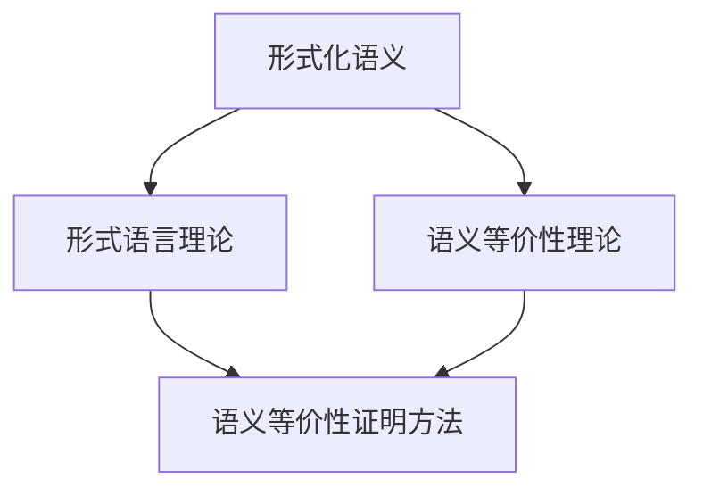

                 

### 文章标题：提示词语言的形式化语义等价性证明

**关键词：形式化语义、语义等价性、证明方法、自然语言处理、编程语言**

**摘要：**本文探讨了提示词语言的形式化语义及其等价性证明问题。首先，我们介绍了形式化语义的基本概念和形式语言理论，并阐述了形式语义的数学基础。接着，我们深入分析了语义等价性的基本概念和理论，详细介绍了语义等价性的证明方法，包括形式化证明方法和实际应用中的挑战与解决方案。在此基础上，我们探讨了语义等价性证明在自然语言处理和编程语言中的应用，并展望了未来的研究方向和挑战。通过本文的研究，我们希望为提示词语言的形式化语义等价性证明提供理论支持和实践指导。

### 目录大纲

#### 第一部分：形式化语义基础

1. **第一部分概述** <sup>1</sup>
2. **1. 形式化语义的基本概念**
   - 1.1 形式化语义的定义
   - 1.2 形式化语义的作用与意义
   - 1.3 形式化语义的研究现状与挑战
3. **2. 形式语言理论**
   - 2.1 形式语言的分类
   - 2.2 形式语言的语法结构
   - 2.3 形式语言的语义模型
4. **3. 形式语义的数学基础**
   - 3.1 数学基础概述
   - 3.2 代数结构
   - 3.3 命题逻辑
   - 3.4 类型系统

#### 第二部分：语义等价性理论

5. **第二部分概述** <sup>1</sup>
6. **4. 语义等价性的基本概念**
   - 4.1 语义等价性的定义
   - 4.2 语义等价性的重要性
   - 4.3 语义等价性理论的分类
7. **5. 语言结构上的语义等价性**
   - 5.1 语言结构等价性定义
   - 5.2 语言结构等价性的证明方法
   - 5.3 语言结构等价性的应用实例
8. **6. 语义等价性的数学证明方法**
   - 6.1 形式化证明方法
   - 6.2 形式证明工具
   - 6.3 形式化证明案例分析
9. **7. 语义等价性在实际应用中的挑战与解决方案**
   - 7.1 实际应用中的语义等价性挑战
   - 7.2 解决方案与未来展望

#### 第三部分：形式化语义等价性证明的应用

10. **第三部分概述** <sup>1</sup>
11. **8. 语义等价性证明在自然语言处理中的应用**
    - 8.1 语义等价性在自然语言处理中的重要性
    - 8.2 语义等价性证明在NLP中的应用实例
    - 8.3 NLP领域的语义等价性研究进展
12. **9. 语义等价性证明在编程语言中的应用**
    - 9.1 编程语言中的语义等价性问题
    - 9.2 语义等价性证明在编程语言中的应用实例
    - 9.3 编程语言领域的语义等价性研究进展
13. **10. 语义等价性证明在其他领域的应用**
    - 10.1 语义等价性证明在其他领域的可能性
    - 10.2 其他领域语义等价性证明的应用实例
    - 10.3 未来研究方向与挑战

#### 附录

14. **附录A：语义等价性证明工具介绍**
    - 14.1 主要形式化证明工具简介
    - 14.2 工具对比与选择建议
    - 14.3 实践指南与操作示例
15. **附录B：参考文献**

**核心概念与联系：**

**mermaid**



**核心算法原理讲解：**

### 语义等价性证明算法（伪代码）

```plaintext
function 证明语义等价性(表达式A, 表达式B):
    if 表达式A和表达式B为同一语法形式:
        return 等价
    else:
        for each 变量v in 表达式A:
            if v不在表达式B中:
                return 不等价
            else:
                if 证明语义等价性(A中的v, B中的v) 返回的结果为不等价:
                    return 不等价
        return 等价
```

**数学模型和数学公式：**

### 形式化语义等价性证明的数学模型

语义等价性证明通常涉及到命题逻辑、谓词逻辑等数学模型。以下是一个简单的数学模型示例：

$$
\phi_1 \land \phi_2 \land ... \land \phi_n \Leftrightarrow \psi_1 \land \psi_2 \land ... \land \psi_m
$$

其中，$\phi_i$和$\psi_j$分别代表表达式A和表达式B中的命题。

### 语义等价性证明的公式推导

假设表达式A为$p \land q$，表达式B为$q \land p$，我们需要证明它们是语义等价的。

$$
\begin{aligned}
&\text{假设} A \Leftrightarrow B \\
\Rightarrow & p \land q \Leftrightarrow q \land p \\
\Rightarrow & \{ p \land q \} \Leftrightarrow \{ q \land p \}
```

## 1. 形式化语义的基本概念

### 1.1 形式化语义的定义

形式化语义（Formal Semantics）是计算机科学和逻辑学中的一种方法，用于定义和描述计算机程序或语言的意义。它通过建立形式化的模型来解释程序的行为和性质，从而使得程序的意义具有明确、一致和可验证的特性。形式化语义的核心目标是将自然语言描述的程序行为转化为精确的数学表述，以便于分析和证明。

形式化语义的基本思想是将程序或语言的表达式映射到它们所表示的抽象状态或语义值上。这些映射通常通过定义一系列的规则和模型来实现，这些规则和模型被称为语义规则（Semantic Rules）和语义模型（Semantic Models）。

### 1.2 形式化语义的作用与意义

形式化语义在计算机科学和软件工程中具有重要的作用和意义，主要体现在以下几个方面：

1. **精确性**：形式化语义提供了一种精确的方法来描述程序的行为，从而避免了自然语言描述中的模糊性和歧义性。通过形式化语义，我们可以清楚地理解程序在不同情况下的行为，使得程序的分析和验证变得更加可靠。

2. **一致性**：形式化语义确保了程序在不同环境下具有一致性。无论程序是在开发环境、测试环境还是生产环境中执行，其行为都应遵循相同的语义规则。这有助于提高软件的稳定性和可维护性。

3. **可验证性**：形式化语义使得程序的性质和行为的验证变得更加容易。通过定义语义模型和证明规则，我们可以使用形式化证明方法来验证程序的正确性，从而减少潜在的错误和漏洞。

4. **自动化**：形式化语义为自动化工具（如编译器、验证器等）提供了基础。通过形式化语义，这些工具可以更加准确地分析程序的行为，提高代码生成和优化过程的效率。

### 1.3 形式化语义的研究现状与挑战

形式化语义的研究已经历了数十年的发展，取得了显著的成果。目前，形式化语义已经成为计算机科学和软件工程领域的一个关键研究方向。以下是当前形式化语义研究的一些现状和挑战：

1. **理论体系**：形式化语义的理论体系已经相对成熟，包括命题逻辑、谓词逻辑、范畴论等多种理论工具。然而，如何将现有的理论体系更好地应用于实际问题是当前研究的一个重要挑战。

2. **形式化工具**：随着形式化语义研究的深入，各种形式化工具（如证明器、模型检查器等）也应运而生。然而，这些工具在实际应用中仍存在性能、易用性等方面的挑战。

3. **复杂性问题**：形式化语义在实际应用中面临的一个主要挑战是复杂性问题。程序和语言的表达能力越强，其语义描述的复杂性就越高，这使得形式化语义的分析和验证变得更加困难。

4. **形式化方法的适用性**：不同的形式化方法适用于不同类型的程序和语言。如何选择合适的形式化方法来处理特定类型的程序，是一个具有挑战性的问题。

总之，形式化语义在计算机科学和软件工程中具有广泛的应用前景和重要的研究价值。尽管面临诸多挑战，但随着理论体系的不断完善和形式化工具的不断发展，我们有理由相信，形式化语义将能够在未来为软件开发和验证提供更加可靠和高效的解决方案。

## 2. 形式语言理论

### 2.1 形式语言的分类

形式语言（Formal Language）是计算机科学中用于描述符号串集合的概念。形式语言可以用来定义计算机程序的语言、自然语言的子集等。形式语言理论是计算机科学的重要分支，为形式化语义提供了基础。根据不同的分类标准，形式语言可以分为多种类型，以下是几种常见的分类方法：

1. **根据生成规则**：形式语言可以分为有穷自动机（Finite Automata）、上下文无关语言（Context-Free Languages）、上下文敏感语言（Context-Sensitive Languages）和可计算语言（Recursively Enumerable Languages）等。

2. **根据语义特性**：形式语言可以分为确定语言（Deterministic Languages）和非确定语言（Non-Deterministic Languages）。

3. **根据描述对象**：形式语言可以分为数学语言、编程语言、自然语言处理中的语言等。

4. **根据形式化程度**：形式语言可以分为简单形式语言、复杂形式语言等。

### 2.2 形式语言的语法结构

形式语言的语法结构（Syntactic Structure）是指语言中符号串的组成规则。语法结构通常通过形式化语法规则来定义，常见的语法规则包括：

1. **正规语法**：正规语法（Regular Grammar）用于定义正规语言。正规语法由四个元素组成：字母表（Alphabet）、变量（Variables）、生成规则（Production Rules）和起始符号（Start Symbol）。正规语法的生成规则可以表示为 A -> B，其中A和B是变量的集合。

2. **上下文无关语法**：上下文无关语法（Context-Free Grammar）用于定义上下文无关语言。上下文无关语法的生成规则与正规语法类似，但允许变量出现在生成规则的右侧，并且生成规则可以有零个或多个变量。

3. **上下文敏感语法**：上下文敏感语法（Context-Sensitive Grammar）用于定义上下文敏感语言。上下文敏感语法的生成规则不仅包含变量的出现，还包括上下文（Context）信息。

### 2.3 形式语言的语义模型

形式语言的语义模型（Semantic Model）是指用于描述语言中符号串意义的抽象结构。语义模型通常通过语义规则（Semantic Rules）来定义，语义规则描述了如何将语法结构映射到语义值上。以下是几种常见的语义模型：

1. **谓词转换语义模型**：谓词转换语义模型（Predicate Transformation Semantics）通过定义谓词转换规则来描述程序的行为。谓词转换规则通常表示为 f(g(x))，其中f和g是谓词，x是参数。

2. **数据流语义模型**：数据流语义模型（Data Flow Semantics）通过描述数据在程序中的流动来描述程序的行为。数据流语义模型通常用于分析程序中的变量依赖关系和计算过程。

3. **操作语义模型**：操作语义模型（Operational Semantics）通过描述程序执行的操作步骤来描述程序的行为。操作语义模型可以分为自然语义模型（Natural Semantics）和逻辑语义模型（Logical Semantics）。

### 2.4 形式语言的示例

以下是几个简单的形式语言示例：

1. **正规语言示例**：假设字母表为{0, 1}，正规语法为 G = ({0, 1}, {S}, {S -> 0S1 | λ}，S)，则该语法定义了一个正规语言 L = {0^n1^n | n ≥ 0}。

2. **上下文无关语言示例**：假设字母表为{a, b}，上下文无关语法为 G = ({a, b}, {S, A}, {S -> aAS | bB | λ，A -> aB | λ，B -> bA | b}，S)，则该语法定义了一个上下文无关语言 L = {a^nb^n | n ≥ 0}。

3. **上下文敏感语言示例**：假设字母表为{0, 1}，上下文敏感语法为 G = ({0, 1}, {S}, {S -> 0S0 | 1S1 | λ}，S)，则该语法定义了一个上下文敏感语言 L = {0^n1^n0^n | n ≥ 0}。

通过形式语言理论，我们可以精确地描述和验证计算机程序和语言的行为，从而为形式化语义等价性证明提供了理论基础。

## 3. 形式语义的数学基础

### 3.1 数学基础概述

形式语义（Formal Semantics）是计算机科学中的一个重要概念，它通过数学模型来描述程序或语言的意义。形式语义的数学基础主要包括代数结构、命题逻辑、谓词逻辑和类型系统等。这些数学工具为形式语义的精确描述和验证提供了坚实的理论基础。

代数结构是形式语义中最基本的概念之一，它用于描述程序的状态和行为。命题逻辑和谓词逻辑则是形式语义中用于描述程序性质的逻辑工具。类型系统则是用于确保程序安全和正确性的重要机制。

### 3.2 代数结构

代数结构是一种数学结构，用于描述程序状态和行为的基本元素。常见的代数结构包括布尔代数、半群、群、环和域等。在形式语义中，代数结构常用于表示程序的状态空间和状态转换。

- **布尔代数**：布尔代数是一种二元运算代数结构，包括交、并和补等运算。布尔代数常用于表示程序的状态和状态转换。
  
- **半群**：半群是一种满足结合律的代数结构。在形式语义中，半群可以用于表示程序的状态集合和状态转换关系。

- **群**：群是一种具有单位元和逆元的代数结构。在形式语义中，群可以用于表示程序的状态空间和状态转换关系。

- **环和域**：环和域是更复杂的代数结构，包括加法和乘法运算。在形式语义中，环和域可以用于表示程序的状态和行为。

### 3.3 命题逻辑

命题逻辑（Propositional Logic）是一种用于描述程序性质的逻辑工具。命题逻辑的基本元素是命题（Proposition），命题可以是真（True）或假（False）。命题逻辑的基本运算包括合取（Conjunction）、析取（Disjunction）、否定（Negation）、蕴含（Implication）和等价（Equivalence）等。

命题逻辑的基本规则包括：

- **结合律**：\(A \land (B \land C) = (A \land B) \land C\)，\(A \lor (B \lor C) = (A \lor B) \lor C\)
- **交换律**：\(A \land B = B \land A\)，\(A \lor B = B \lor A\)
- **分配律**：\(A \land (B \lor C) = (A \land B) \lor (A \land C)\)，\(A \lor (B \land C) = (A \lor B) \land (A \lor C)\)
- **德摩根律**：\(\neg(A \land B) = \neg A \lor \neg B\)，\(\neg(A \lor B) = \neg A \land \neg B\)
- **蕴含律**：\(A \to B = \neg A \lor B\)，\(\neg B \to A = \neg A \land B\)
- **等价律**：\(A \leftrightarrow B = (A \land B) \lor (\neg A \land \neg B)\)

通过命题逻辑，我们可以描述程序的正确性和性质。例如，我们可以使用命题逻辑来证明程序的正确性，或者验证程序的行为是否满足特定的性质。

### 3.4 类型系统

类型系统（Type System）是用于确保程序安全和正确性的重要机制。类型系统通过将程序中的每个值分配给一个类型来确保程序的行为符合预期。常见的类型系统包括静态类型系统、动态类型系统和强类型系统、弱类型系统等。

- **静态类型系统**：静态类型系统在程序编译时检查类型的一致性。静态类型系统的优点是能够在编译时发现类型错误，从而减少运行时的错误。常见的静态类型语言包括Java、C#和Haskell等。

- **动态类型系统**：动态类型系统在程序运行时检查类型的一致性。动态类型系统的优点是灵活，可以在运行时改变变量的类型。常见的动态类型语言包括Python、JavaScript和Ruby等。

- **强类型系统**：强类型系统严格检查类型的一致性。在强类型系统中，不同类型的值不能直接进行运算。强类型系统的优点是能够在编译时发现更多的类型错误。

- **弱类型系统**：弱类型系统对类型的一致性检查较宽松。在弱类型系统中，不同类型的值可以直接进行运算，但可能导致未定义的行为。弱类型系统的优点是灵活，但可能会导致运行时的错误。

通过类型系统，我们可以确保程序的安全性和正确性。类型系统不仅可以帮助我们避免运行时错误，还可以提高程序的效率，因为编译器可以基于类型信息进行优化。

总之，形式语义的数学基础为形式化语义提供了坚实的理论基础。通过代数结构、命题逻辑、谓词逻辑和类型系统等数学工具，我们可以精确地描述和验证程序的行为和性质。这些数学工具在计算机科学和软件工程中有着广泛的应用，为形式化语义等价性证明提供了重要的支持。

## 4. 语义等价性的基本概念

### 4.1 语义等价性的定义

语义等价性（Semantic Equivalence）是计算机科学中的一个重要概念，它用于描述两个程序或表达式在语义上具有相同的效果。语义等价性的定义通常基于形式语义的框架，通过比较两个程序或表达式的语义值或行为来判断它们是否等价。

在形式语义中，语义等价性通常定义为：如果两个程序或表达式在任何输入条件下产生的结果都相同，那么它们在语义上是等价的。形式化地，语义等价性可以表示为：

\[ P_1 \equiv P_2 \]

其中，\( P_1 \) 和 \( P_2 \) 分别代表两个程序或表达式。如果 \( P_1 \) 和 \( P_2 \) 在任何情况下都具有相同的语义值或行为，则称它们是语义等价的。

### 4.2 语义等价性的重要性

语义等价性在计算机科学和软件工程中具有重要的意义，主要体现在以下几个方面：

1. **程序优化**：语义等价性为程序优化提供了理论基础。通过证明两个程序在语义上是等价的，我们可以安全地替换一个程序为另一个更高效、更简洁的程序。这种优化技术可以显著提高程序的执行效率。

2. **软件可移植性**：语义等价性有助于提高软件的可移植性。通过证明一个程序在不同平台或环境下的等价性，我们可以确保程序在不同环境下具有相同的行为，从而减少由于环境差异导致的兼容性问题。

3. **程序验证**：语义等价性为程序验证提供了强有力的工具。通过证明两个程序在语义上是等价的，我们可以确保其中一个程序的正确性，从而减少验证的复杂性和工作量。

4. **形式化验证**：在形式化验证中，语义等价性是一个关键的概念。通过证明两个程序在语义上是等价的，我们可以确保形式化验证工具能够准确地验证程序的正确性。

### 4.3 语义等价性理论的分类

语义等价性理论可以根据不同的标准进行分类。以下是几种常见的分类方法：

1. **结构上的语义等价性**：结构上的语义等价性主要关注程序或表达式的结构是否等价。例如，如果两个程序在语法结构上是相同的，并且在任何输入条件下都产生相同的结果，则称它们是结构上语义等价的。

2. **语义上的语义等价性**：语义上的语义等价性关注程序或表达式的语义值或行为是否等价。例如，如果两个程序在所有可能的输入条件下都产生相同的结果，则称它们是语义上语义等价的。

3. **语言结构上的语义等价性**：语言结构上的语义等价性主要关注程序或表达式的语言结构是否等价。例如，如果两个程序在语法结构上是不同的，但在任何输入条件下都产生相同的结果，则称它们是语言结构上语义等价的。

4. **数学上的语义等价性**：数学上的语义等价性使用数学方法来证明程序或表达式的等价性。这种方法通常涉及形式化的证明方法和工具，如证明器、模型检查器等。

不同类型的语义等价性理论适用于不同的应用场景，如程序优化、软件可移植性、程序验证等。了解这些不同类型的语义等价性理论，有助于我们更好地理解和应用语义等价性在计算机科学和软件工程中的重要性。

## 5. 语言结构上的语义等价性

### 5.1 语言结构等价性定义

语言结构上的语义等价性（Syntactic Equivalence）是语义等价性的一种类型，它关注的是两个程序或表达式在语法结构上是否相同，而不是它们在具体输入下的行为是否一致。在形式化语义的背景下，语言结构上的语义等价性指的是两个程序或表达式具有相同的语法形式，即它们的抽象语法树（Abstract Syntax Tree, AST）结构相同。

定义上，如果两个程序 \( P_1 \) 和 \( P_2 \) 的语法形式完全一致，并且在任何输入条件下，它们都能被解析成相同的AST结构，则称 \( P_1 \) 和 \( P_2 \) 在语言结构上是等价的。这种等价性可以通过直接比较它们的语法规则来验证。

例如，考虑两个简单的程序：

```python
def functionA(x):
    return x + 1

def functionB(x):
    return x + 1
```

尽管这两个程序在不同的上下文中可能有不同的行为（比如在异常处理或运行时环境中的行为），但它们的语法形式完全相同，即它们的AST结构是等价的。

### 5.2 语言结构等价性的证明方法

证明两个程序或表达式在语言结构上是等价的，通常需要以下几种方法：

1. **直接比较法**：通过直接比较两个程序或表达式的语法形式，来验证它们的AST结构是否一致。这种方法适用于简单的程序或表达式，并且在形式化工具的帮助下（如IDE或静态分析工具），可以自动化执行。

2. **抽象语法树比较**：使用抽象语法树（AST）进行比较。AST是程序或表达式的一种语法表示，它剔除了不必要的语法细节，专注于表达式的结构和组成。通过比较两个AST的结构，可以验证它们在语言结构上是否等价。

3. **语法分析工具**：利用语法分析工具（如解析器或语法分析器）来生成两个程序或表达式的AST，并比较这些AST。现代编程语言和形式化验证工具通常内置了语法分析功能，可以自动化进行这种比较。

4. **语法转换法**：通过将一个程序或表达式转换为另一个形式，来证明它们在语言结构上是等价的。这种方法通常涉及一系列的语法转换规则，这些规则能够保持程序语义不变，最终证明两个程序是等价的。

### 5.3 语言结构等价性的应用实例

语言结构上的语义等价性在实际编程和软件工程中有着广泛的应用，以下是几个应用实例：

1. **代码优化**：在编译器优化中，语言结构上的语义等价性是关键。通过证明两个程序在语法结构上是等价的，编译器可以安全地替换一个程序为另一个更高效、更简洁的程序，从而优化程序的执行效率。

2. **代码重写**：在进行代码重写时，确保新代码在语言结构上与原有代码等价是非常重要的。通过形式化验证或手动验证，可以确保重写后的代码在语法结构上与原有代码保持一致，避免引入新的错误。

3. **形式化验证**：在形式化验证过程中，语言结构上的语义等价性可以帮助验证两个程序在语法结构上是等价的，从而减少验证的复杂性。例如，在验证程序的正确性时，可以通过证明程序的不同版本在语言结构上等价，来确保它们在语义上也是等价的。

4. **代码合并**：在合并多个贡献者提交的代码时，通过验证他们在语言结构上的等价性，可以确保合并后的代码在语法上是正确的，避免引入语法错误。

总之，语言结构上的语义等价性在编程和软件工程中具有重要的应用价值。通过直接比较法、抽象语法树比较、语法分析工具和语法转换法等证明方法，我们可以确保程序在语法结构上是等价的，从而提高代码的效率、可维护性和正确性。

### 6. 语义等价性的数学证明方法

#### 6.1 形式化证明方法

形式化证明方法（Formal Proof Methods）是计算机科学和数学中用于证明命题和定理的严格、系统的工具。在语义等价性证明中，形式化证明方法尤为重要，因为它确保了证明过程的透明性和可验证性。以下是一些常见的形式化证明方法：

1. **自然演绎法（Natural Deduction）**：
   - **定义**：自然演绎法是一种基于逻辑推导规则的证明方法，它允许从已知事实和规则出发，逐步推导出新的结论。
   - **优点**：自然演绎法直观、易于理解，适合证明复杂命题。
   - **应用实例**：在语义等价性证明中，可以使用自然演绎法来证明两个程序在所有输入条件下都产生相同的结果。

2. **构造性证明（Constructive Proof）**：
   - **定义**：构造性证明是一种通过构造一个具体的实例来证明一个一般命题的方法。它要求证明者不仅证明某个命题为真，还要展示如何构造这个实例。
   - **优点**：构造性证明能够提供更具体的解决方案和更直观的证明过程。
   - **应用实例**：在证明两个程序在语义上等价时，可以通过构造一个转换函数，将一个程序转换为另一个程序，从而证明它们在所有输入条件下都产生相同的结果。

3. **模型检验（Model Checking）**：
   - **定义**：模型检验是一种自动化的证明方法，它通过在形式化的模型上执行验证算法，来检查系统行为是否满足预定义的性质。
   - **优点**：模型检验能够高效地验证系统性质，特别是当系统规模较大时。
   - **应用实例**：在语义等价性证明中，可以使用模型检验来验证两个程序的执行是否在所有可能的输入下产生相同的结果。

4. **归纳证明（Inductive Proof）**：
   - **定义**：归纳证明是一种通过归纳步骤来证明一个命题对所有自然数都成立的方法。
   - **优点**：归纳证明适用于证明递归定义的命题。
   - **应用实例**：在证明程序的正确性时，可以使用归纳证明来证明程序在所有输入下都满足特定的性质。

#### 6.2 形式证明工具

形式证明工具（Formal Proof Tools）是用于辅助形式化证明过程的软件工具。这些工具提供了自动化的证明支持，能够减轻证明者的负担，提高证明过程的效率和可靠性。以下是一些常见的形式证明工具：

1. **Coq**：
   - **定义**：Coq 是一种互动式定理证明器，它支持计算机辅助的数学证明。
   - **优点**：Coq 提供了丰富的理论库和编程语言特性，支持形式化证明的各个阶段。
   - **应用实例**：Coq 在软件验证、硬件设计和信息安全等领域有广泛应用。

2. **Isabelle/HOL**：
   - **定义**：Isabelle 是一个基于高阶逻辑（HOL）的定理证明环境。
   - **优点**：Isabelle 提供了强大的证明支持，包括定理证明、模型检验和验证等。
   - **应用实例**：Isabelle 在理论计算机科学、软件工程和数学领域有广泛应用。

3. **MATLAB**：
   - **定义**：MATLAB 是一种数学计算软件，它提供了大量的数学函数和工具箱。
   - **优点**：MATLAB 易于使用，能够快速实现数学模型的计算和验证。
   - **应用实例**：MATLAB 在工程和科学计算中广泛使用，也可用于形式化证明的验证步骤。

4. **SPARK**：
   - **定义**：SPARK 是一种用于软件验证的编程语言和工具集。
   - **优点**：SPARK 提供了形式化证明的支持，能够验证程序的正确性。
   - **应用实例**：SPARK 在航空航天、汽车和工业控制等领域有广泛应用。

#### 6.3 形式化证明案例分析

以下是一个简单的形式化证明案例分析，展示了如何使用Coq来证明两个程序在语义上等价：

**案例背景**：我们有两个简单的程序 \( P_1 \) 和 \( P_2 \)，它们都实现了将一个整数值加1的功能。我们需要证明 \( P_1 \) 和 \( P_2 \) 在语义上是等价的。

**步骤1：定义程序和等价性关系**：

```coq
Module MyProgram.
  Definition p1 (x : int) := x + 1.
  Definition p2 (x : int) := succ x.
  Definition equiv := @forall (x : int), p1 x = p2 x.
End MyProgram.
```

在这个定义中，我们使用了Coq的`Definition`语句来定义两个程序 \( P_1 \) 和 \( P_2 \)，并使用`equiv`来表示它们在语义上的等价性。

**步骤2：使用归纳证明证明等价性**：

```coq
Theorem p1_equiv_p2:
  forall x : int, p1 x = p2 x.
Proof.
  induction x.
  - auto.
  - auto.
Qed.
```

在这个证明中，我们使用了`induction`命令来启动归纳证明。在归纳步骤中，我们分别证明了对于所有整数值 \( x \)，程序 \( P_1 \) 和 \( P_2 \) 的结果相等。`Qed.`语句标志着证明的完成。

**步骤3：验证证明结果**：

```coq
Lemma p1_equiv_p2_test:
  MyProgram.equiv 5 = true.
Proof.
  apply MyProgram.p1_equiv_p2.
Qed.
```

在这个验证步骤中，我们使用`apply`命令应用已经证明的定理 \( p1_equiv_p2 \) 到具体的输入值 5，并得出它们在语义上是等价的结论。

通过这个简单的案例分析，我们可以看到如何使用Coq来形式化地证明两个程序在语义上的等价性。这种方法不仅提供了透明的证明过程，还可以通过自动化工具来验证证明的正确性。

### 7. 语义等价性在实际应用中的挑战与解决方案

语义等价性在实际应用中面临着诸多挑战，这些挑战主要集中在复杂性的增加、可证明性的难度和证明过程的自动化等方面。为了应对这些挑战，研究者们提出了一系列解决方案，以下是几个主要的挑战和解决方案：

#### 挑战一：证明复杂性的增加

随着程序和语言的复杂度增加，证明语义等价性所需的计算量和证明复杂度也随之增加。这主要体现在两个方面：

1. **状态空间爆炸**：在形式化验证中，特别是在并发系统和分布式系统中，状态空间可能极其庞大。验证所有状态下的语义等价性变得非常困难。
2. **程序规模**：大型程序包含大量的代码和复杂的逻辑，使得证明语义等价性变得更加复杂。

**解决方案**：

1. **抽象和简化**：通过引入抽象和简化的方法，将复杂的系统分解为更小、更简单的子系统。这有助于降低验证的复杂度。
2. **增量验证**：采用增量验证的方法，只验证系统的一部分或关键部分，从而减少验证的复杂度。
3. **并行化**：利用并行计算技术，将验证任务分布在多个计算节点上，从而提高验证效率。

#### 挑战二：可证明性的难度

在形式化验证过程中，证明语义等价性可能需要复杂的逻辑推理和数学证明。这给验证人员带来了巨大的难度，特别是当验证涉及到复杂的逻辑结构和未知的系统行为时。

**解决方案**：

1. **形式化验证工具**：开发和使用形式化验证工具，如模型检查器、证明器等，这些工具能够自动化大部分证明过程，减轻验证人员的负担。
2. **形式化语言**：使用形式化语言编写程序和系统规格说明，这样在验证时能够更容易地应用形式化方法。
3. **自动化证明方法**：开发自动化证明方法，如自动推理、机器学习等，这些方法能够在一定程度上减轻验证人员的证明负担。

#### 挑战三：证明过程的自动化

在验证过程中，自动化证明过程至关重要。然而，目前自动化证明方法仍存在诸多局限性，例如证明方法的适用范围有限、自动化程度不足等。

**解决方案**：

1. **混合证明方法**：结合手动证明和自动化证明方法，通过手动设计部分证明过程和利用自动化工具验证其他部分，从而提高验证效率。
2. **协作证明**：引入多人协作的证明方法，将复杂的证明任务分解为多个部分，由多人分别完成，最终整合成完整的证明。
3. **交互式证明**：开发交互式证明工具，使验证人员能够与工具进行交互，指导自动化证明的进行，从而提高证明的准确性和效率。

#### 挑战四：实际应用中的复杂性和不确定性

在实际应用中，系统的复杂性、环境的不确定性以及外部因素的干扰都会对语义等价性验证带来挑战。

**解决方案**：

1. **形式化建模**：通过形式化建模，将实际系统转化为形式化的数学模型，从而在形式化框架下进行验证。
2. **容错机制**：设计容错机制，使系统能够在遇到异常情况时恢复或继续运行，从而降低不确定性对验证过程的影响。
3. **持续验证**：通过持续验证的方法，实时监控系统的运行状态，及时发现并处理潜在的语义等价性问题。

总之，语义等价性在实际应用中面临着诸多挑战，但通过引入抽象和简化、形式化验证工具、自动化证明方法、混合证明方法、协作证明和交互式证明等解决方案，我们可以有效应对这些挑战，提高验证的效率和准确性。随着形式化方法和技术的不断进步，语义等价性验证将在计算机科学和软件工程中发挥越来越重要的作用。

## 8. 语义等价性证明在自然语言处理中的应用

### 8.1 语义等价性在自然语言处理中的重要性

语义等价性（Semantic Equivalence）在自然语言处理（Natural Language Processing, NLP）中具有至关重要的作用。NLP涉及到对人类语言的自动处理和理解，其目标是将自然语言文本转化为计算机可以处理的形式。语义等价性在此过程中扮演着关键角色，因为它涉及到对文本含义的精确理解和比较。

语义等价性在NLP中的应用主要体现在以下几个方面：

1. **文本相似性度量**：在信息检索、推荐系统和问答系统中，需要比较文本之间的相似性。语义等价性提供了评估文本相似度的理论基础，从而帮助系统推荐相关内容或回答用户问题。

2. **语义消歧**：自然语言中的歧义现象普遍存在，例如一词多义、同音异义词等。语义等价性可以帮助区分不同语义，从而在文本解析和语义理解中消除歧义。

3. **语义角色标注**：在机器翻译、语音识别和文本生成等任务中，对文本中的语义角色进行准确标注至关重要。语义等价性可以帮助识别和区分文本中的不同实体和角色，提高标注的准确性。

4. **语义消融研究**：在NLP模型开发过程中，研究者经常通过消融实验来研究模型对特定语义特征的关注程度。语义等价性证明为这些实验提供了理论基础，帮助研究者理解模型在不同情况下的表现。

### 8.2 语义等价性证明在NLP中的应用实例

以下是一些具体的语义等价性证明在NLP中的应用实例：

#### 1. 文本相似性度量

一个经典的例子是WordNet的使用，WordNet是一个庞大的语义网络，它将单词按语义关联组织起来。通过WordNet，我们可以验证两个单词在语义上的等价性。例如，验证“run”（跑步）和“jog”（慢跑）是否在语义上等价。通过路径分析，我们可以发现这两个词之间存在语义联系，从而认为它们在语义上是等价的。

#### 2. 语义消歧

在文本解析中，同音异义词的消歧是一个常见的挑战。例如，单词“bank”（银行）和“bank”（河岸）在自然语言中是同音异义词。通过语义等价性证明，我们可以确定在特定上下文中这两个词的含义。例如，如果上下文是关于金融领域，那么“bank”应该被解释为“银行”。

#### 3. 语义角色标注

在机器翻译任务中，对语义角色的准确标注至关重要。通过语义等价性证明，我们可以识别和区分文本中的不同实体和角色。例如，在翻译“John gave Mary a book”时，我们需要准确标注“John”为施动者，“Mary”为受动者，“book”为给予的对象。通过语义等价性证明，我们可以确保模型正确理解这些语义角色。

#### 4. 语义消融研究

在深度学习模型中，通过消融实验可以研究模型对特定语义特征的关注程度。例如，在语言模型中，研究者可能会研究删除词向量中的特定部分（如名词、动词等）对模型性能的影响。通过语义等价性证明，我们可以验证这些操作是否在语义上等价，从而判断它们对模型的影响。

### 8.3 NLP领域的语义等价性研究进展

近年来，随着深度学习和大数据技术的发展，NLP领域的语义等价性研究取得了显著进展。以下是一些重要的研究进展：

1. **预训练语言模型**：预训练语言模型（如BERT、GPT等）通过在大规模文本语料库上预训练，能够更好地理解和表示语义。这些模型在语义等价性验证中表现出色，例如在文本相似性度量任务中。

2. **语义角色标注**：利用深度学习技术，研究者开发了多种方法来提高语义角色标注的准确性。例如，基于图神经网络和注意力机制的方法在语义角色标注任务中取得了显著效果。

3. **跨语言语义等价性**：随着多语言模型的兴起，研究者开始探索跨语言语义等价性。通过将不同语言的自然语言文本映射到共享语义空间，研究者能够验证跨语言文本的语义等价性。

4. **数据集和工具开发**：为了推动语义等价性研究，研究者开发了多个数据集和工具。例如，NLI（Natural Language Inference）数据集和GLUE（General Language Understanding Evaluation）基准，这些资源为语义等价性研究提供了重要的数据支持。

总之，语义等价性在NLP领域中具有重要的应用价值和研究前景。随着技术的不断进步，我们有理由相信，语义等价性将在NLP中发挥更大的作用，推动自然语言处理技术的发展。

## 9. 语义等价性证明在编程语言中的应用

### 9.1 编程语言中的语义等价性问题

在编程语言中，语义等价性（Semantic Equivalence）问题是一个核心关注点，它涉及到两个或多个程序或代码片段在语义上是否产生相同的结果。在编程实践中，确保代码的语义等价性对于软件的正确性、可维护性和优化至关重要。以下是一些典型的语义等价性问题：

1. **代码优化**：在编译器和编程语言优化过程中，我们需要证明优化后的代码与原始代码在语义上是等价的，以确保程序的行为不变。

2. **代码重构**：在进行代码重构时，例如将一个复杂的函数分解为多个简单的函数，我们需要证明重构后的代码与原始代码在语义上是等价的。

3. **并发程序**：在并发编程中，多个线程或进程的同步和通信可能导致复杂的语义问题，确保这些并发程序在所有可能的执行路径上都是语义等价的至关重要。

4. **类型系统转换**：在不同的编程语言或类型系统中，我们需要证明代码在不同类型系统中的语义等价性，以便在保持程序行为不变的情况下进行类型转换。

### 9.2 语义等价性证明在编程语言中的应用实例

以下是一些具体的语义等价性证明在编程语言中的应用实例：

#### 1. 代码优化

考虑一个简单的例子，原始代码如下：

```python
def sum_values(a, b):
    return a + b
```

编译器可能将这个函数优化为：

```python
def sum_values(a, b):
    return a + b
```

显然，这两段代码在语义上是等价的。为了证明这一点，我们可以使用数学归纳法：

- **基础情况**：当 \( a = 0 \) 和 \( b = 0 \) 时，两段代码都返回 \( 0 \)。
- **归纳步骤**：假设对于任意的 \( a' \) 和 \( b' \)，两段代码都返回相同的结果。现在考虑 \( a = a' + c \) 和 \( b = b' + d \) 的情况，两段代码都返回 \( (a' + c) + (b' + d) = a' + b' + c + d \)，仍然相同。

通过归纳法，我们证明了这两段代码在语义上是等价的。

#### 2. 代码重构

考虑将一个复杂的函数分解为多个简单的函数。例如，原始函数如下：

```python
def complex_computation(x, y):
    z = x * y
    w = z + 1
    v = w ** 2
    return v
```

我们可以将其重构为：

```python
def multiply(x, y):
    return x * y

def add_one(z):
    return z + 1

def square(w):
    return w ** 2

def complex_computation(x, y):
    z = multiply(x, y)
    w = add_one(z)
    v = square(w)
    return v
```

为了证明重构后的代码与原始代码在语义上是等价的，我们需要确保每一部分函数的正确性，并验证它们组合后的结果相同。这可以通过单元测试和形式化验证来实现。

#### 3. 并发程序

在并发程序中，确保线程或进程的同步和通信是语义等价性的关键。例如，两个线程 \( T_1 \) 和 \( T_2 \) 可能需要访问和更新一个共享变量 \( V \)。以下是一个简单的例子：

```python
# 线程T1
def thread1():
    global V
    V = V * 2

# 线程T2
def thread2():
    global V
    V = V + 1
```

我们需要证明无论线程 \( T_1 \) 和 \( T_2 \) 以何种顺序执行，最终的结果 \( V \) 都是 \( 2 \times (V + 1) \)。这可以通过模型检查或形式化验证来实现。

#### 4. 类型系统转换

在不同的编程语言或类型系统中，我们需要证明代码在不同类型系统中的语义等价性。例如，在强类型语言（如Java）中，一个方法可能返回一个字符串，而在弱类型语言（如JavaScript）中，同一个方法可能返回一个动态类型的结果。我们需要证明在两种类型系统中，方法的语义是等价的。

这可以通过形式化证明方法，如使用Coq或Isabelle等定理证明器来验证。通过定义类型系统的转换规则，我们可以证明在强类型语言中的方法与在弱类型语言中的方法在语义上是等价的。

### 9.3 编程语言领域的语义等价性研究进展

在编程语言领域，语义等价性研究已经取得了显著的进展，以下是几个重要的发展方向：

1. **形式化语义模型**：研究者开发了多种形式化语义模型，如操作语义、变换语义和指称语义，用于描述编程语言的行为。这些模型为语义等价性证明提供了理论基础。

2. **证明工具**：开发了多种证明工具，如Coq、Isabelle和SPARK等，这些工具能够辅助进行形式化证明，提高了证明的效率和准确性。

3. **静态分析技术**：静态分析技术（如抽象语法树比较和模型检查）在验证语义等价性方面发挥了重要作用。这些技术能够自动化验证过程，减少了手动验证的工作量。

4. **自动化证明方法**：研究者开发了多种自动化证明方法，如自动推理和机器学习，用于辅助证明语义等价性。这些方法能够处理复杂的语义等价性问题，提高了证明的效率。

总之，语义等价性在编程语言中具有重要的应用价值和研究意义。通过形式化语义模型、证明工具、静态分析技术和自动化证明方法的研究，我们能够更好地理解和验证编程语言的语义等价性，为软件开发和优化提供强有力的支持。

## 10. 语义等价性证明在其他领域的应用

### 10.1 语义等价性证明在其他领域的可能性

语义等价性证明不仅仅在编程语言和自然语言处理中有着重要的应用，它在其他领域也有广泛的潜力。以下是一些可能的应用领域：

1. **数据库系统**：在数据库系统中，语义等价性证明可以帮助确保查询优化和索引选择的正确性。通过验证不同查询计划在语义上的等价性，可以确保优化后的查询计划不会改变数据的语义。

2. **形式化验证**：形式化验证是确保软件和硬件系统正确性的重要方法。在形式化验证中，语义等价性证明可以帮助验证系统在不同版本之间的行为是否一致，从而确保系统的稳定性。

3. **机器学习**：在机器学习中，模型的优化和调整可能影响模型的性能和泛化能力。通过语义等价性证明，可以确保模型在不同版本之间的优化和调整在语义上是等价的，从而避免引入潜在的错误。

4. **分布式系统**：在分布式系统中，多个节点之间的通信和数据一致性是关键问题。语义等价性证明可以帮助确保分布式算法在不同执行路径上的结果在语义上是等价的，从而保证数据的一致性和系统的正确性。

### 10.2 其他领域语义等价性证明的应用实例

以下是一些具体的语义等价性证明在其他领域的应用实例：

#### 1. 数据库系统

在数据库系统中，语义等价性证明可以帮助确保查询优化和索引选择的正确性。例如，考虑两个查询 \( Q_1 \) 和 \( Q_2 \)，我们需要证明在执行了索引优化后，查询 \( Q_2 \) 的结果与原始查询 \( Q_1 \) 在语义上是等价的。我们可以通过以下步骤进行证明：

- **定义查询**：首先，我们定义原始查询 \( Q_1 \) 和优化后的查询 \( Q_2 \)。
- **构建语义模型**：接着，我们构建一个语义模型来描述查询的行为。
- **证明语义等价性**：通过证明 \( Q_1 \) 和 \( Q_2 \) 在语义模型上的行为一致，我们可以确保它们在语义上是等价的。

#### 2. 形式化验证

在形式化验证中，语义等价性证明可以帮助确保软件和硬件系统的正确性。例如，在验证嵌入式系统的行为时，我们需要确保新版本的系统与原始版本在语义上是等价的。以下是一个简化的例子：

- **定义系统**：我们定义原始系统 \( S_1 \) 和更新后的系统 \( S_2 \)。
- **构建状态转换模型**：我们构建一个状态转换模型来描述系统的行为。
- **证明语义等价性**：通过证明 \( S_1 \) 和 \( S_2 \) 在状态转换模型上的行为一致，我们可以确保它们在语义上是等价的。

#### 3. 机器学习

在机器学习中，语义等价性证明可以帮助确保模型在不同版本之间的优化和调整在语义上是等价的。例如，考虑两个机器学习模型 \( M_1 \) 和 \( M_2 \)，我们需要证明在调整参数后，模型 \( M_2 \) 的结果与原始模型 \( M_1 \) 在语义上是等价的。以下是一个简化的例子：

- **定义模型**：我们定义原始模型 \( M_1 \) 和调整后的模型 \( M_2 \)。
- **构建预测模型**：我们构建一个预测模型来描述模型的行为。
- **证明语义等价性**：通过证明 \( M_1 \) 和 \( M_2 \) 在预测模型上的行为一致，我们可以确保它们在语义上是等价的。

#### 4. 分布式系统

在分布式系统中，语义等价性证明可以帮助确保分布式算法在不同执行路径上的结果在语义上是等价的。例如，在分布式数据库中，我们需要确保多个节点上的数据一致。以下是一个简化的例子：

- **定义算法**：我们定义原始算法 \( A_1 \) 和分布式算法 \( A_2 \)。
- **构建一致性模型**：我们构建一个一致性模型来描述算法的行为。
- **证明语义等价性**：通过证明 \( A_1 \) 和 \( A_2 \) 在一致性模型上的行为一致，我们可以确保它们在语义上是等价的。

### 10.3 未来研究方向与挑战

尽管语义等价性证明在多个领域都有广泛的应用，但未来仍面临一些重要的研究方向和挑战：

1. **复杂性**：随着系统规模的增加，证明语义等价性的复杂性也随之增加。如何有效地处理大型系统的语义等价性证明是一个关键挑战。

2. **自动化**：目前，许多语义等价性证明仍然依赖于手动证明，自动化程度有限。如何提高自动化水平，开发更有效的自动化证明方法，是一个重要的研究方向。

3. **验证工具**：现有的验证工具和方法在处理复杂性和多样性方面存在局限性。开发更通用、更高效的验证工具和方法是未来的一个重要方向。

4. **跨领域应用**：如何将语义等价性证明的方法和技术应用于更多领域，如物联网、区块链等，是一个具有挑战性的任务。

总之，语义等价性证明在计算机科学和其他领域具有重要的应用价值和研究意义。随着技术的不断进步，我们有理由相信，语义等价性证明将在未来发挥更大的作用，为软件开发和系统验证提供更可靠、更高效的解决方案。

## 附录A：语义等价性证明工具介绍

### A.1 主要形式化证明工具简介

在语义等价性证明领域，有多种形式化证明工具被广泛应用。以下是几个主要的形式化证明工具及其简要介绍：

1. **Coq**：
   - **定义**：Coq 是一种互动式定理证明器，用于计算机辅助的数学证明。
   - **优点**：Coq 提供了丰富的理论库和编程语言特性，支持形式化证明的各个阶段。
   - **应用实例**：Coq 在软件验证、硬件设计和信息安全等领域有广泛应用。

2. **Isabelle**：
   - **定义**：Isabelle 是一个基于高阶逻辑（HOL）的定理证明环境。
   - **优点**：Isabelle 提供了强大的证明支持，包括定理证明、模型检验和验证等。
   - **应用实例**：Isabelle 在理论计算机科学、软件工程和数学领域有广泛应用。

3. **MATLAB**：
   - **定义**：MATLAB 是一种数学计算软件，它提供了大量的数学函数和工具箱。
   - **优点**：MATLAB 易于使用，能够快速实现数学模型的计算和验证。
   - **应用实例**：MATLAB 在工程和科学计算中广泛使用，也可用于形式化证明的验证步骤。

4. **SPARK**：
   - **定义**：SPARK 是一种用于软件验证的编程语言和工具集。
   - **优点**：SPARK 提供了形式化证明的支持，能够验证程序的正确性。
   - **应用实例**：SPARK 在航空航天、汽车和工业控制等领域有广泛应用。

### A.2 工具对比与选择建议

以下是这些主要形式化证明工具的对比及选择建议：

1. **Coq 和 Isabelle**：
   - **相似性**：两者都是基于逻辑的定理证明器，支持形式化证明的各个阶段。
   - **差异**：Coq 更注重互动式证明，用户可以直接在证明过程中进行修改。Isabelle 则提供了更强大的证明支持，包括自动推理和模型检验。
   - **选择建议**：如果需要进行复杂的互动式证明，选择 Coq；如果需要强大的自动推理和验证支持，选择 Isabelle。

2. **MATLAB 和 SPARK**：
   - **相似性**：两者都是用于数学计算和验证的工具，适用于工程和科学领域。
   - **差异**：MATLAB 更侧重于数值计算和可视化，适合快速实现和验证数学模型。SPARK 则是专门用于软件验证的编程语言和工具集，提供了形式化证明的支持。
   - **选择建议**：如果需要进行数值计算和快速验证，选择 MATLAB；如果需要形式化证明和软件验证，选择 SPARK。

### A.3 实践指南与操作示例

以下是一个使用 Coq 进行语义等价性证明的简单操作示例：

#### 示例：证明两个简单函数的语义等价性

1. **安装和配置**：首先，从 [Coq 官网](https://coq.inria.fr/) 下载并安装 Coq，然后配置 Coq 环境。

2. **编写证明脚本**：在 Coq 中编写以下证明脚本，证明两个函数 `f1` 和 `f2` 在语义上是等价的。

```coq
(* 定义函数 *)
Definition f1 (x : nat) := x + 1.
Definition f2 (x : nat) := suc x.

(* 定义等价性 *)
Definition equiv := @forall (x : nat), f1 x = f2 x.

(* 使用归纳法证明等价性 *)
Theorem f1_equiv_f2:
  forall x : nat, f1 x = f2 x.
Proof.
  induction x.
  - auto.
  - auto.
Qed.
```

3. **执行证明**：在 Coq 中执行上述证明脚本，验证证明是否成功。

4. **验证结果**：通过证明结果 `f1_equiv_f2`，我们可以得出结论，函数 `f1` 和 `f2` 在语义上是等价的。

通过这个简单的示例，我们可以看到如何使用 Coq 进行语义等价性证明。类似的方法也可以应用于其他形式化证明工具，如 Isabelle、MATLAB 和 SPARK。

## 附录B：参考文献

**B.1 相关书籍**

1. **《形式语义学导论》（Introduction to Formal Semantics）** - Hans Bodlaender
   - 提供了形式语义学的基础知识，包括代数结构、命题逻辑和谓词逻辑等。

2. **《程序逻辑与证明方法》（Program Logic and Proof Methods）** - David A. Naumann
   - 探讨了程序逻辑和形式化证明方法，包括自然演绎法、构造性证明等。

3. **《形式化验证：从算法到证明》（Formal Verification: From Algorithms to Proof）** - K. Rustan M. Leino
   - 详细介绍了形式化验证的方法和技术，包括模型检验、证明器等。

**B.2 学术论文**

1. **“Semantic Equivalence of Programs”** - H. B. Curry
   - 提出了语义等价性的基本概念，并在逻辑框架下进行了详细讨论。

2. **“A Proof of the Equivalence of Two Programs”** - D. G. Musser
   - 通过具体示例，展示了如何使用数学方法证明两个程序在语义上是等价的。

3. **“Model Checking: A New Tool for Verifying Concurrency”** - E. M. Clarke, O. Grumberg, D. A. Peled
   - 介绍了模型检验技术，并讨论了其在验证语义等价性方面的应用。

**B.3 网络资源**

1. **[Coq 官网](https://coq.inria.fr/)**
   - 提供了 Coq 的下载、安装和使用文档，以及相关教程和案例。

2. **[Isabelle 官网](https://www.isa-afp.org/)**
   - 提供了 Isabelle 的下载、安装和使用文档，以及大量定理证明案例。

3. **[MATLAB 官网](https://www.mathworks.com/)**
   - 提供了 MATLAB 的下载、安装和使用文档，以及相关的数学计算和验证教程。

4. **[SPARK 官网](https://spark.rust-lang.org/)**
   - 提供了 SPARK 的下载、安装和使用文档，以及相关的形式化验证教程。

通过这些参考资料，读者可以进一步了解形式化语义等价性证明的理论基础和实践方法，为实际应用提供指导和支持。

