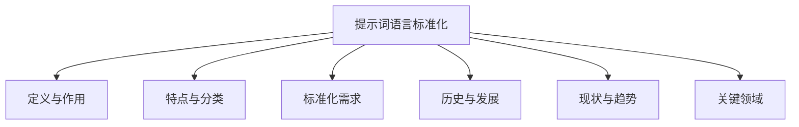
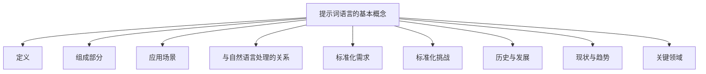

                 


### 文章标题：提示词语言的标准化：推动行业统一

---

#### 关键词：
- 提示词语言
- 标准化
- 行业统一
- 交流效率
- 技术融合

---

#### 摘要：
本文将深入探讨提示词语言的标准化问题，解析其基本概念、标准化需求、历史背景以及现状与趋势。通过逻辑清晰的分析和实例，阐述标准化在提升交流效率、优化人机交互和促进跨行业合作中的重要作用。

---

### 第一部分：提示词语言的标准化概述

#### 第1章：提示词语言的标准化：基本概念与历史背景

##### 1.1 提示词语言的定义与作用

##### 1.1.1 提示词语言的基本概念

提示词是用于指导或提示特定行为、反应或思考的语言元素。在人类的日常交流和信息处理中，提示词发挥着关键作用，它们能够引导对话的方向，影响信息接收和处理的方式。

提示词语言，即是指用一系列有序的提示词来构建特定交流的语言系统。这种语言系统在不同的领域和场景中有着广泛的应用，如命令控制、信息检索、人机交互等。

##### 1.1.2 提示词语言的特点与分类

提示词语言的特点包括：

- **明确性**：提示词应具有明确的含义，以确保接收者能够准确理解。
- **简练性**：提示词应简洁明了，避免冗长和复杂性。
- **多样性**：提示词语言需要适应不同的情境和目标受众。

根据用途和功能，提示词语言可以分为以下几类：

- **命令性提示词**：用于指导用户执行特定操作，如“启动”、“停止”、“重置”等。
- **说明性提示词**：用于解释或描述某一情况或操作，如“正在加载”、“已完成”、“注意：”等。
- **提示性提示词**：用于引导用户思考或探索某个问题，如“请思考以下问题：”、“您需要做什么？”等。

---

#### 1.2 提示词语言的标准化需求

##### 1.2.1 标准化的必要性

标准化的必要性主要体现在以下几个方面：

- **减少误解与混淆**：在跨行业和跨地区的交流中，语言差异容易导致误解和混淆。标准化有助于统一语言，提高交流效率。
- **提高信息处理能力**：统一的提示词语言可以提高系统对提示词的理解和处理能力，优化人机交互体验。
- **促进技术融合与发展**：标准化的提示词语言有助于不同技术之间的融合，推动技术的发展和创新。

##### 1.2.2 标准化的挑战

尽管标准化具有诸多优点，但在实际实施过程中仍面临一些挑战：

- **语言多样性**：不同地区和行业之间的语言差异使得标准化工作复杂且具有挑战性。
- **技术限制**：现有的技术和算法在处理复杂语言任务时仍存在限制，这为标准化工作带来了挑战。

---

#### 1.3 提示词语言标准化的历史与发展

##### 1.3.1 提示词语言标准化的初步探索

在计算机科学和信息技术的早期发展阶段，人们开始意识到标准化的重要性，并进行了初步的探索。早期的标准化尝试主要集中在命令行接口和简单的用户界面设计上。

##### 1.3.2 提示词语言标准化的关键里程碑

随着技术的进步和全球化的深入，提示词语言标准化工作取得了显著进展。以下是一些关键里程碑：

- **国际标准的制定**：国际标准化组织（ISO）和其他相关组织开始制定提示词语言的国际标准，如ISO/IEC 19501和ISO/IEC 19502等。
- **技术进步与标准化演进**：人工智能、自然语言处理等技术的进步推动了提示词语言标准化的深入发展。

---

#### 1.4 提示词语言标准化的现状与趋势

##### 1.4.1 当前标准化的成果

当前，提示词语言标准化工作已经取得了一系列重要成果，包括一系列国际标准和行业指南。这些标准为不同领域和场景下的提示词语言提供了统一的规范。

##### 1.4.2 标准化的未来趋势

未来，提示词语言标准化将面临以下趋势：

- **技术融合与标准化**：随着技术的不断进步，提示词语言标准化将更加注重技术的融合与创新。
- **跨学科合作**：跨学科合作将成为推动提示词语言标准化的重要力量。
- **人工智能与自然语言处理**：人工智能和自然语言处理技术的发展将为提示词语言标准化带来新的机遇和挑战。

##### 1.4.3 标准化的关键领域

提示词语言标准化的关键领域包括：

- **人工智能与自然语言处理**：随着人工智能和自然语言处理技术的发展，如何统一和标准化这些技术中的提示词语言成为重要课题。
- **新兴技术与标准化**：如区块链、物联网等新兴技术的发展，也对提示词语言标准化提出了新的要求。

---

**Mermaid 流程图示例：**



---

### 第一部分：提示词语言的标准化概述

#### 第1章：提示词语言的标准化：基本概念与历史背景

**1.1 提示词语言的定义与作用**

提示词语言是一种特殊的语言形式，用于指导或提示特定行为、反应或思考。它通常由一系列有序排列的提示词组成，这些提示词在不同的上下文中具有明确的含义和作用。提示词语言的应用范围非常广泛，涵盖了从日常生活到专业领域的多个方面。

在日常生活中，提示词语言常见于各种指令和信息提示，如交通信号灯的指示、广告标语、家庭电器上的操作指南等。这些提示词语言的核心作用是引导人们的行为，提高沟通的效率。

在专业领域，提示词语言的应用更加多样。例如，在软件开发中，提示词语言用于编写代码和文档，指导开发人员进行编程和调试。在医疗领域，提示词语言用于病历记录和医学术语标注，确保医疗信息的准确传达。在教育和培训中，提示词语言则用于设计课程内容和评估学生学习进度。

**1.1.1 提示词语言的基本概念**

提示词语言的基本概念包括以下几个方面：

- **提示词**：提示词是提示词语言的基本元素，它是一个具有特定含义的词汇或短语，用于引导或提示特定的行为或思考。例如，“保存”是一个常见的提示词，它用于指导用户执行文件保存操作。

- **语言结构**：提示词语言的结构通常遵循一定的语法规则和逻辑顺序，以确保提示词的连贯性和有效性。例如，在命令性提示词中，提示词通常与操作对象和动作描述相结合，形成完整的指令。

- **上下文**：提示词语言的含义和作用受到上下文的影响。在不同的上下文中，同一个提示词可能具有不同的含义和作用。例如，在编程语言中，“print”提示词用于输出文本到控制台，而在日常用语中，“print”可能指打印纸张。

- **应用场景**：提示词语言的应用场景多种多样，包括人机交互、信息检索、命令控制、教育学习等。在不同的应用场景中，提示词语言的格式和功能会有所不同，以满足特定的需求。

**1.1.2 提示词语言的特点与分类**

提示词语言具有以下特点：

- **明确性**：提示词语言要求提示词具有明确的含义，以便用户能够准确理解和执行。这要求提示词的设计要简洁、直观、易于理解。

- **简练性**：提示词语言要求提示词简洁明了，避免冗长和复杂的表达。简洁的提示词可以提高沟通效率，减少误解和混淆。

- **多样性**：提示词语言需要适应不同的应用场景和目标受众，因此具有多样性。不同的提示词语言可以根据不同的需求和场景进行定制。

根据用途和功能，提示词语言可以分为以下几类：

- **命令性提示词**：用于指导用户执行特定操作，如“启动”、“停止”、“重置”等。

- **说明性提示词**：用于解释或描述某一情况或操作，如“正在加载”、“已完成”、“注意：”等。

- **提示性提示词**：用于引导用户思考或探索某个问题，如“请思考以下问题：”、“您需要做什么？”等。

**1.2 提示词语言的标准化需求**

提示词语言的标准化需求主要体现在以下几个方面：

- **减少误解与混淆**：在跨行业和跨地区的交流中，语言差异容易导致误解和混淆。标准化有助于统一语言，提高交流效率。

- **提高信息处理能力**：统一的提示词语言可以提高系统对提示词的理解和处理能力，优化人机交互体验。

- **促进技术融合与发展**：标准化的提示词语言有助于不同技术之间的融合，推动技术的发展和创新。

**1.2.1 标准化的必要性**

标准化的必要性体现在以下几个方面：

- **统一交流标准**：不同地区和行业之间的语言差异使得交流变得复杂和困难。标准化可以统一交流标准，提高交流效率。

- **提高软件质量**：在软件开发中，统一的提示词语言可以提高代码的可读性和可维护性，减少错误和混淆。

- **促进跨领域合作**：标准化的提示词语言有助于不同领域之间的合作和交流，推动技术的融合与发展。

**1.2.2 标准化的挑战**

尽管标准化具有诸多优点，但在实际实施过程中仍面临一些挑战：

- **语言多样性**：不同地区和行业之间的语言差异使得标准化工作复杂且具有挑战性。

- **技术限制**：现有的技术和算法在处理复杂语言任务时仍存在限制，这为标准化工作带来了挑战。

**1.3 提示词语言标准化的历史与发展**

提示词语言标准化工作始于计算机科学和信息技术的早期发展阶段。在计算机刚出现时，不同计算机系统之间的指令集和接口格式存在巨大差异，这给软件开发和系统集成带来了巨大挑战。为了解决这些问题，人们开始探索制定统一的计算机指令集和接口标准。

随着计算机网络和通信技术的发展，提示词语言标准化工作逐渐从单一系统内部扩展到跨系统、跨平台的应用。国际标准化组织（ISO）和国际电信联盟（ITU）等国际组织开始制定一系列与提示词语言相关的国际标准，如ISO/IEC 19501和ISO/IEC 19502等。

在人工智能和自然语言处理领域，提示词语言标准化也取得了一定进展。随着人工智能技术的快速发展，如何统一和标准化人工智能系统中的提示词语言成为一个重要的研究方向。一些国际组织和企业开始制定相关标准和规范，如微软的Azure Cognitive Services和谷歌的Natural Language API等。

**1.3.1 提示词语言标准化的初步探索**

在计算机科学和信息技术的早期发展阶段，人们开始意识到标准化的重要性，并进行了初步的探索。早期的标准化尝试主要集中在命令行接口和简单的用户界面设计上。

- **命令行接口标准化**：在早期计算机系统中，命令行接口是最常见的交互方式。为了提高不同系统之间的兼容性，人们开始制定一系列命令行接口标准，如POSIX标准。

- **用户界面标准化**：随着图形用户界面（GUI）的普及，人们开始探索制定统一的GUI标准，以简化用户操作和提高用户体验。早期的GUI标准包括X Window System和Motif等。

**1.3.2 提示词语言标准化的关键里程碑**

提示词语言标准化工作取得了以下关键里程碑：

- **国际标准的制定**：国际标准化组织（ISO）和其他相关组织开始制定提示词语言的国际标准，如ISO/IEC 19501和ISO/IEC 19502等。

- **技术进步与标准化演进**：随着人工智能、自然语言处理等技术的进步，提示词语言标准化工作不断演进，从简单的命令行接口和用户界面扩展到复杂的交互系统和应用。

**1.4 提示词语言标准化的现状与趋势**

当前，提示词语言标准化工作已经取得了一系列重要成果，包括一系列国际标准和行业指南。这些标准为不同领域和场景下的提示词语言提供了统一的规范，提高了交流效率和技术融合水平。

未来，提示词语言标准化将继续面临以下趋势：

- **技术融合与标准化**：随着技术的不断进步，提示词语言标准化将更加注重技术的融合与创新。

- **跨学科合作**：跨学科合作将成为推动提示词语言标准化的重要力量。

- **人工智能与自然语言处理**：人工智能和自然语言处理技术的发展将为提示词语言标准化带来新的机遇和挑战。

**1.4.1 当前标准化的成果**

当前，提示词语言标准化工作已经取得了一系列重要成果，包括以下方面：

- **国际标准的制定**：国际标准化组织（ISO）和其他相关组织已经制定了一系列与提示词语言相关的国际标准，如ISO/IEC 19501和ISO/IEC 19502等。

- **行业指南的发布**：许多行业组织和公司已经发布了与提示词语言相关的行业指南和最佳实践，如IEEE和IETF等。

- **技术的推广应用**：随着提示词语言标准化工作的推进，相关技术和应用逐渐推广应用，如自然语言处理系统和人工智能交互界面等。

**1.4.2 标准化的未来趋势**

未来，提示词语言标准化将继续面临以下趋势：

- **技术融合与标准化**：随着人工智能、大数据、物联网等技术的融合与发展，提示词语言标准化将更加注重技术的融合与创新。

- **跨学科合作**：跨学科合作将成为推动提示词语言标准化的重要力量。例如，人工智能和自然语言处理领域的技术将与其他领域如医疗、教育、金融等领域的提示词语言标准化相结合。

- **人工智能与自然语言处理**：人工智能和自然语言处理技术的发展将为提示词语言标准化带来新的机遇和挑战。例如，如何统一和标准化不同人工智能系统中的提示词语言将成为重要研究方向。

**1.4.3 标准化的关键领域**

提示词语言标准化的关键领域包括：

- **人工智能与自然语言处理**：如何统一和标准化人工智能系统中的提示词语言是一个重要研究方向。

- **新兴技术与标准化**：随着新兴技术的发展，如区块链、物联网等，如何制定相应的提示词语言标准也是一个重要课题。

**Mermaid 流程图示例：**


---

### 提示词语言的定义与作用

提示词语言是一种专门用于指导或提示特定行为、反应或思考的语言形式。在计算机科学、信息技术、人工智能等领域，提示词语言具有重要的作用。本章节将详细介绍提示词语言的基本概念、组成部分以及其在不同场景中的应用。

#### 1.1.1 提示词语言的基本概念

提示词语言由一系列有序排列的提示词组成。每个提示词都是具有特定含义的词汇或短语，用于引导或提示用户执行特定操作或思考。提示词语言的特点包括：

- **明确性**：提示词应具有明确的含义，以确保用户能够准确理解其指导或提示的含义。
- **简练性**：提示词应简洁明了，避免冗长和复杂的表达，以提高沟通效率。
- **多样性**：提示词语言需要适应不同的应用场景和目标受众，因此具有多样性。

在计算机科学和信息技术的背景下，提示词语言通常用于以下几种形式：

- **命令行提示词**：命令行界面是计算机系统中最常见的交互方式之一。命令行提示词用于指导用户执行特定的操作，如文件管理、系统设置等。
- **图形用户界面（GUI）提示词**：图形用户界面提供了直观的交互方式。GUI提示词通常以文字或按钮的形式出现，用于提示用户进行下一步操作。
- **自然语言处理（NLP）提示词**：随着人工智能和自然语言处理技术的发展，NLP提示词被广泛应用于人机对话系统、智能助手等场景。

#### 1.1.2 提示词语言的组成部分

提示词语言的组成部分主要包括：

- **提示词**：提示词是提示词语言的核心元素，用于引导或提示用户执行特定操作或思考。例如，在命令行界面中，“cd”表示更改目录。
- **上下文**：上下文是提示词语言的一个重要组成部分，它决定了提示词的含义和作用。在不同的上下文中，同一个提示词可能具有不同的含义。例如，在编程语言中，“print”用于输出文本，而在日常用语中，“print”可能指打印纸张。
- **语法规则**：提示词语言需要遵循一定的语法规则，以确保提示词的连贯性和有效性。语法规则定义了提示词的排列顺序、格式要求等。例如，在命令行界面中，提示词通常遵循特定的格式，如“命令 操作对象”。

#### 1.1.3 提示词语言在不同场景中的应用

提示词语言在计算机科学和信息技术的各个领域都有广泛的应用。以下是一些常见场景：

- **软件开发**：在软件开发过程中，提示词语言用于编写代码、注释文档、编写测试用例等。例如，编程语言中的关键字和函数名就是提示词语言的例子。
- **用户界面设计**：在用户界面设计中，提示词语言用于设计按钮标签、菜单选项、错误提示等，以指导用户进行操作。例如，在网页设计中，“下一步”、“返回”等按钮标签就是提示词语言的例子。
- **自然语言处理**：在自然语言处理领域，提示词语言被广泛应用于人机对话系统、智能助手等。例如，智能助手中的对话提示词用于引导用户进行对话或提供相关帮助。

#### 1.1.4 提示词语言与自然语言处理的关系

提示词语言与自然语言处理（NLP）密切相关。自然语言处理是一种将人类语言转换为计算机可处理的形式的技术。在NLP领域，提示词语言被用于指导NLP模型的训练和推理。

- **训练数据**：在NLP模型的训练过程中，提示词语言被用于生成或标注训练数据。例如，在机器翻译任务中，源语言和目标语言的提示词语言被用于生成训练数据。
- **推理过程**：在NLP模型的推理过程中，提示词语言被用于指导模型的预测和生成。例如，在问答系统中，用户的输入和答案的生成都依赖于提示词语言。

#### 1.1.5 提示词语言的标准化需求

随着信息技术的发展，提示词语言在各个领域的应用越来越广泛。然而，由于缺乏统一的标准，不同系统和应用之间的提示词语言存在差异，导致沟通不畅、兼容性问题。因此，提示词语言的标准化需求越来越迫切。

- **减少误解与混淆**：统一的标准可以减少由于语言差异导致的误解和混淆，提高沟通效率。
- **提高软件质量**：统一的标准可以提高软件的可读性和可维护性，减少错误和混淆。
- **促进跨领域合作**：统一的标准可以促进不同领域之间的合作和交流，推动技术的发展和创新。

#### 1.1.6 提示词语言的标准化挑战

尽管标准化需求迫切，但提示词语言的标准化工作面临以下挑战：

- **语言多样性**：不同地区和行业之间存在语言差异，这增加了标准化工作的复杂性和难度。
- **技术限制**：现有的技术和算法在处理复杂语言任务时仍存在限制，这为标准化工作带来了挑战。
- **利益冲突**：不同利益相关者（如技术公司、行业协会等）在标准化过程中可能存在利益冲突，影响标准的制定和推广。

#### 1.1.7 提示词语言标准化的历史与发展

提示词语言标准化工作始于计算机科学和信息技术的早期发展阶段。在计算机刚出现时，不同计算机系统之间的指令集和接口格式存在巨大差异，这给软件开发和系统集成带来了巨大挑战。为了解决这些问题，人们开始探索制定统一的计算机指令集和接口标准。

随着计算机网络和通信技术的发展，提示词语言标准化工作逐渐从单一系统内部扩展到跨系统、跨平台的应用。国际标准化组织（ISO）和其他相关组织开始制定一系列与提示词语言相关的国际标准。

近年来，随着人工智能和自然语言处理技术的发展，提示词语言标准化工作取得了新的进展。一些国际组织和企业开始制定与人工智能和自然语言处理相关的提示词语言标准，以推动技术的融合与创新。

#### 1.1.8 提示词语言标准化的现状与趋势

当前，提示词语言标准化工作已经取得了一系列重要成果，包括一系列国际标准和行业指南。这些标准为不同领域和场景下的提示词语言提供了统一的规范，提高了交流效率和技术融合水平。

未来，提示词语言标准化将继续面临以下趋势：

- **技术融合与标准化**：随着人工智能、大数据、物联网等技术的融合与发展，提示词语言标准化将更加注重技术的融合与创新。
- **跨学科合作**：跨学科合作将成为推动提示词语言标准化的重要力量。不同领域的专家将共同制定和推广提示词语言标准。
- **人工智能与自然语言处理**：人工智能和自然语言处理技术的发展将为提示词语言标准化带来新的机遇和挑战。如何统一和标准化不同人工智能系统中的提示词语言将成为重要研究方向。

#### 1.1.9 提示词语言标准化的关键领域

提示词语言标准化的关键领域包括：

- **人工智能与自然语言处理**：随着人工智能和自然语言处理技术的发展，如何统一和标准化这些技术中的提示词语言成为重要课题。
- **新兴技术与标准化**：如区块链、物联网等新兴技术的发展，也对提示词语言标准化提出了新的要求。

**Mermaid 流程图示例：**



---

### 提示词语言的特点与分类

提示词语言是一种特定的语言形式，它在不同的领域和场景中发挥着关键作用。为了满足各种应用需求，提示词语言具有明确性、简练性和多样性的特点，并且可以根据其用途和功能进行分类。以下是对提示词语言特点的详细解析以及对其分类的探讨。

#### 1.1.2.1 提示词语言的特点

**明确性**：提示词语言的一个核心特点是明确性。明确性意味着提示词必须具有清晰、无歧义的含义，以便用户能够准确地理解其意图。例如，在命令行界面中，“save”这个提示词应该明确表示保存文件的操作，而不应引起其他误解。明确性有助于减少用户操作的错误，提高系统的响应速度和用户满意度。

**简练性**：简练性是指提示词语言应该简洁、精炼，避免冗长和复杂的表达。简练性不仅有助于提高沟通效率，还能降低用户的认知负担。例如，在用户界面上，提示词“登录”比“请点击此处进行登录”更加简洁明了。简练的提示词语言使得用户能够快速理解并采取行动，从而提高整体的用户体验。

**多样性**：多样性意味着提示词语言需要适应不同的应用场景和目标受众。不同的用户和场景可能对提示词语言有不同的需求。例如，在医疗领域，提示词语言可能需要使用专业的医学术语，而在消费者电子产品中，提示词语言可能更倾向于使用通俗易懂的语言。多样性使得提示词语言能够更好地满足不同用户的需求，提高系统的可用性和可访问性。

#### 1.1.2.2 提示词语言的分类

提示词语言可以根据其用途和功能进行分类，常见的分类方式包括：

**命令性提示词**：命令性提示词用于指导用户执行特定的操作。它们通常出现在命令行界面、操作系统和应用程序中。命令性提示词的特点是直接、具体且具有明确的操作指令。例如，“启动”、“停止”、“重置”等都是常见的命令性提示词。命令性提示词的设计需要确保用户能够快速理解并执行相应的操作。

**说明性提示词**：说明性提示词用于解释或描述某一情况或操作。它们通常出现在用户界面、错误信息和帮助文档中。说明性提示词的特点是提供信息、指导用户理解系统状态或操作步骤。例如，“正在加载中”、“已完成”、“注意：”等都是常见的说明性提示词。说明性提示词的设计需要清晰、准确，以帮助用户理解系统的工作原理和操作流程。

**提示性提示词**：提示性提示词用于引导用户思考或探索某个问题。它们通常出现在教育、学习和交互系统中。提示性提示词的特点是激发用户的思考，引导用户进行进一步的探索。例如，“请思考以下问题：”、“您需要做什么？”等都是常见的提示性提示词。提示性提示词的设计需要具有启发性和引导性，以激发用户的思维。

**交互性提示词**：交互性提示词用于促进用户与系统之间的互动。它们通常出现在人机对话系统和智能助手等交互界面中。交互性提示词的特点是灵活、动态，能够根据用户的反馈进行调整。例如，“您是否需要帮助？”、“您想要查看哪个选项？”等都是常见的交互性提示词。交互性提示词的设计需要注重用户体验，以提高交互的流畅性和满意度。

**情感性提示词**：情感性提示词用于传达情感和情绪，以增强用户的体验。它们通常出现在娱乐、游戏和教育等场景中。情感性提示词的特点是具有感染力和情感共鸣。例如，“恭喜您，做得好！”、“抱歉，出了点问题。”等都是常见的情感性提示词。情感性提示词的设计需要注重情感的表达，以提高用户的情感体验和满意度。

**功能性提示词**：功能性提示词用于提供功能性的信息或操作指导。它们通常出现在工具栏、菜单和弹出窗口中。功能性提示词的特点是提供具体的操作指导或功能信息。例如，“保存”、“打印”、“设置”等都是常见的功能性提示词。功能性提示词的设计需要确保用户能够快速找到并使用相应的功能。

通过分类，我们可以更好地理解和应用提示词语言。不同类型的提示词语言适用于不同的场景和需求，它们共同构成了丰富多样的提示词语言体系。设计师和开发者可以根据具体的应用场景和用户需求选择合适的提示词语言类型，以提高系统的可用性和用户体验。

**Mermaid 流程图示例：**

```mermaid
graph TD
A[提示词语言的特点]
B[明确性]
C[简练性]
D[多样性]

A --> B
A --> C
A --> D

subgraph 分类
E[命令性提示词]
F[说明性提示词]
G[提示性提示词]
H[交互性提示词]
I[情感性提示词]
J[功能性提示词]

E --> F
E --> G
E --> H
E --> I
E --> J
end

A --> subgraph 分类
```

---

### 标准化的必要性

提示词语言的标准化在信息技术和人工智能领域具有至关重要的意义，它能够显著提高交流效率，优化人机交互体验，并促进跨行业合作。以下将详细探讨标准化的必要性，以及它在减少误解和混淆、提高信息处理能力、促进技术融合与发展方面的重要作用。

#### 减少误解与混淆

在信息技术和人工智能领域，提示词语言的多样性可能导致用户和系统之间的误解和混淆。不同系统和应用可能使用不同的提示词，即使这些提示词在语义上非常相似，也可能会引起混淆。例如，一个系统中的“保存”可能代表保存文件，而在另一个系统中可能代表保存设置。这种差异可能导致用户错误地执行操作，影响系统的正常运行。

标准化可以统一提示词语言，减少误解和混淆。通过制定统一的提示词标准，用户可以明确地了解每个提示词的含义和作用，从而避免误操作。例如，国际标准化组织（ISO）制定的ISO/IEC 19501和ISO/IEC 19502标准，为命令行接口和图形用户界面提供了统一的提示词标准，使得不同系统和应用之间的交流更加顺畅。

#### 提高信息处理能力

统一的标准化的提示词语言可以提高系统对提示词的理解和处理能力。在人工智能和自然语言处理领域，系统需要处理大量的提示词，并快速准确地响应。如果提示词语言不统一，系统可能需要额外的资源和算法来处理这些差异，从而降低信息处理的效率。

标准化的提示词语言有助于简化系统的处理过程，提高其性能和效率。例如，在自然语言处理系统中，如果提示词语言统一，模型可以更容易地学习和理解提示词的含义，从而提高预测和生成质量。此外，统一的标准还可以帮助开发人员编写更加简洁和高效的代码，减少开发和维护成本。

#### 优化人机交互体验

人机交互是信息技术和人工智能领域的核心部分。标准化的提示词语言可以优化人机交互体验，提高用户满意度。当用户能够清晰地理解系统的提示词时，他们可以更有效地与系统进行互动，减少学习成本和操作错误。

统一的标准还可以帮助设计人员创建更加一致和直观的用户界面。例如，在图形用户界面中，标准化的提示词语言可以确保按钮标签、菜单选项和错误信息的一致性，从而提高用户对系统的信任度和满意度。

#### 促进跨行业合作

信息技术和人工智能领域的快速发展促使各个行业之间的合作日益紧密。然而，由于不同行业和领域之间存在语言差异，跨行业合作面临诸多挑战。标准化的提示词语言可以促进这些合作，提高交流效率。

通过制定跨行业的提示词语言标准，不同领域的专家和开发人员可以更轻松地理解和协作。例如，在医疗和金融领域，标准化的提示词语言可以帮助医生和银行员工更快速地理解系统提示，提高工作效率和准确性。

#### 案例分析

以人工智能系统为例，标准化的提示词语言在多个方面展示了其重要性。首先，在训练数据集的构建过程中，标准化的提示词语言可以确保数据的一致性和准确性，从而提高模型的性能。其次，在系统部署和运维过程中，标准化的提示词语言可以帮助运维人员快速识别和解决问题，提高系统的可靠性和稳定性。

此外，在国际化的背景下，标准化的提示词语言也有助于推广和普及人工智能技术。例如，谷歌的TensorFlow和微软的Cognitive Services都提供了多语言支持，使得开发人员可以轻松地创建和部署跨语言的人工智能应用。

总之，标准化的提示词语言在信息技术和人工智能领域具有重要意义。它能够减少误解和混淆，提高信息处理能力，优化人机交互体验，并促进跨行业合作。通过制定和推广统一的标准，我们可以构建更加高效、可靠和用户友好的信息技术和人工智能生态系统。

---

### 标准化的挑战

虽然提示词语言的标准化在信息技术和人工智能领域中具有显著的优势，但在实际实施过程中，标准化工作面临诸多挑战。以下将详细探讨这些挑战，包括语言多样性、技术限制以及利益冲突等方面。

#### 语言多样性

语言多样性是提示词语言标准化面临的首要挑战。不同地区和行业之间存在丰富的语言差异，这使得统一标准变得复杂且具有挑战性。例如，在英语国家，常用的提示词可能包括“save”（保存）、“load”（加载）等，而在中文环境中，对应的提示词可能分别是“保存”和“加载”。这种差异可能导致在跨文化应用中的误解和混淆。

为了应对语言多样性，标准化工作需要制定灵活的、具有普遍适用性的提示词标准。这要求标准化组织深入理解不同文化和语言背景下的需求，并设计出既能保持一致，又能适应多样性的提示词语言。例如，国际标准化组织（ISO）在制定国际标准时，通常会考虑到不同语言的特性和习惯，以确保标准的普适性。

#### 技术限制

技术限制是另一个影响提示词语言标准化的关键因素。现有的技术和算法在处理复杂语言任务时仍存在一定的局限性。例如，自然语言处理（NLP）技术虽然已经取得了显著进展，但仍然难以完全理解和解释人类语言的所有复杂性和细微差别。这种技术限制导致在实现标准化时，可能会面临以下问题：

1. **误识别**：由于技术限制，系统可能无法准确识别或理解特定的提示词，从而导致误解或错误响应。
2. **效率问题**：为了适应标准化，系统可能需要额外的处理能力和算法优化，这可能导致系统性能下降或增加成本。

为了克服技术限制，标准化工作需要与技术研发同步进行。这要求标准化组织与技术研究机构、技术公司紧密合作，不断改进和优化现有技术，以支持更高效的提示词语言处理。

#### 利益冲突

在提示词语言标准化过程中，不同利益相关者（如技术公司、行业协会、政府部门等）可能会存在利益冲突。这些利益冲突可能导致以下问题：

1. **标准制定过程中的分歧**：不同的利益相关者可能对标准的内容和细节持有不同意见，导致标准制定过程变得复杂和缓慢。
2. **标准实施的障碍**：由于利益冲突，某些利益相关者可能抵制标准的实施，从而影响标准的普及和应用。

为了解决利益冲突，标准化工作需要建立透明和公平的机制，确保所有利益相关者都有平等的发言权和参与度。此外，标准化组织应积极促进各方之间的沟通和合作，寻求共识和解决方案，以推动标准化的顺利进行。

#### 案例分析

以欧洲的欧盟（EU）为例，欧盟在制定信息技术标准时，面临了语言多样性和利益冲突的双重挑战。为了解决语言多样性问题，欧盟制定了多语言支持的标准，确保标准在不同语言环境中的普适性。同时，为了解决利益冲突，欧盟建立了欧盟标准化组织（CEN/CENELEC），确保标准制定过程中的公平和透明。

尽管如此，欧盟在标准化过程中仍然面临一些挑战。例如，某些成员国可能因为语言和文化差异而抵制某些标准的实施，导致标准在不同国家之间的普及程度不一致。此外，欧盟在制定标准时，需要平衡不同利益相关者的需求，这可能导致某些标准在细节上存在妥协，影响其有效性。

总之，提示词语言标准化在信息技术和人工智能领域面临诸多挑战。通过深入理解语言多样性、技术限制和利益冲突，标准化组织可以采取相应的措施，逐步克服这些挑战，推动提示词语言的统一和标准化。这不仅有助于提高交流效率和技术融合，也为人工智能和信息技术的发展奠定了坚实的基础。

---

### 提示词语言标准化的历史与发展

提示词语言标准化的历史可以追溯到计算机科学和信息技术的早期阶段。随着计算机技术的快速发展，不同系统和应用之间的差异逐渐显现，标准化需求变得日益迫切。以下将详细探讨提示词语言标准化的历史背景、关键里程碑以及相关国际标准的发展过程。

#### 历史背景

在计算机科学和信息技术的早期阶段，不同计算机系统之间存在显著差异，尤其是在指令集、接口和用户界面方面。这些差异导致了软件开发和系统集成中的诸多问题，阻碍了技术的普及和应用。为了解决这些问题，人们开始探索制定统一的计算机指令集和接口标准。

早期，计算机系统主要依赖于命令行界面进行交互。由于不同系统的命令行接口存在巨大差异，用户需要学习和适应不同的命令集，这给软件开发和系统集成带来了巨大挑战。为了统一命令行接口，人们开始尝试制定一系列标准。例如，美国国家标准协会（ANSI）和国际标准化组织（ISO）分别制定了ANSI C和ISO/IEC 9899标准，以统一计算机程序的编写规范。

随着图形用户界面的普及，用户界面的标准化也变得日益重要。图形用户界面提供了更直观、易用的交互方式，但不同系统和应用之间的用户界面设计仍然存在显著差异。为了提高用户界面的兼容性和一致性，人们开始探索制定统一的用户界面标准。例如，X Window System和Motif等早期的用户界面标准为图形用户界面的统一奠定了基础。

#### 关键里程碑

提示词语言标准化的关键里程碑可以追溯到20世纪80年代和90年代，这一时期是计算机科学和信息技术快速发展的时期。以下是一些重要里程碑：

1. **ISO/IEC 19501和ISO/IEC 19502标准**：国际标准化组织（ISO）于1994年发布了ISO/IEC 19501和ISO/IEC 19502标准，这两个标准是关于命令行接口和图形用户界面的国际标准。这些标准规定了命令行接口和图形用户界面中的提示词语言格式和用法，为统一不同系统和应用之间的提示词语言奠定了基础。

2. **POSIX标准**：POSIX（Portable Operating System Interface）标准是另一个重要的里程碑。POSIX标准是由IEEE（电气和电子工程师协会）制定的一系列标准，旨在提高操作系统的兼容性和可移植性。POSIX标准包含了关于命令行接口和系统调用等多个方面的规范，对提示词语言的统一起到了重要作用。

3. **Web标准**：随着互联网的普及，Web标准也成为了提示词语言标准化的重要领域。W3C（万维网联盟）制定了HTML、CSS和JavaScript等Web标准，这些标准规定了Web应用中的提示词语言格式和用法，为统一Web应用的用户界面和交互体验提供了基础。

4. **人工智能和自然语言处理标准**：近年来，随着人工智能和自然语言处理技术的发展，相关领域的标准化工作也取得了重要进展。例如，ISO/IEC 29184标准是关于自然语言处理的国际标准，它规定了自然语言处理系统的框架和评估方法。此外，一些人工智能框架和平台也制定了相应的标准，如TensorFlow的TensorBoard和Microsoft的Azure Machine Learning等。

#### 相关国际标准的发展过程

提示词语言标准化的相关国际标准经历了多个阶段的发展，从早期的命令行接口和用户界面标准，到现代的人工智能和自然语言处理标准。以下是一些重要的发展过程：

1. **命令行接口标准**：早期的命令行接口标准主要集中在统一的命令集和语法规范上。例如，ISO/IEC 19501和ISO/IEC 19502标准规定了命令行接口中提示词的格式和用法，以确保不同系统和应用之间的兼容性。

2. **用户界面标准**：随着图形用户界面的普及，用户界面标准逐渐成为提示词语言标准化的重要领域。X Window System和Motif等标准规定了图形用户界面中的提示词语言格式和用法，以提高用户界面的兼容性和一致性。

3. **Web标准**：随着互联网的发展，Web标准成为了提示词语言标准化的关键领域。W3C制定了HTML、CSS和JavaScript等Web标准，这些标准规定了Web应用中的提示词语言格式和用法，为统一Web应用的用户界面和交互体验提供了基础。

4. **人工智能和自然语言处理标准**：近年来，随着人工智能和自然语言处理技术的发展，相关领域的标准化工作也取得了重要进展。ISO/IEC 29184标准是关于自然语言处理的国际标准，它规定了自然语言处理系统的框架和评估方法。此外，一些人工智能框架和平台也制定了相应的标准，如TensorFlow的TensorBoard和Microsoft的Azure Machine Learning等。

总之，提示词语言标准化的历史与发展是计算机科学和信息技术发展的重要组成部分。通过制定和推广一系列国际标准，提示词语言标准化为信息技术和人工智能领域的统一和协作提供了坚实的基础，促进了技术的创新和应用。

---

### 当前提示词语言标准化的成果

在信息技术和人工智能领域，提示词语言标准化工作已经取得了一系列重要的成果。这些成果不仅体现在国际标准的制定上，还包括行业指南、最佳实践的发布以及相关技术和应用的发展。以下将详细探讨这些标准化成果，并分析其对行业发展的积极影响。

#### 国际标准的制定

国际标准化组织（ISO）和国际电工委员会（IEC）等国际组织在提示词语言标准化方面制定了多项重要标准。以下是一些关键的国际标准：

1. **ISO/IEC 19501和ISO/IEC 19502**：这两个标准是关于命令行接口（CLI）和图形用户界面（GUI）的国际标准。它们规定了CLI和GUI中提示词的格式、语法和用法，以确保不同系统和应用之间的兼容性。这些标准为开发者提供了统一的规范，有助于减少由于语言差异导致的误解和混淆。

2. **ISO/IEC 29184**：这是关于自然语言处理（NLP）的国际标准，它规定了NLP系统的框架和评估方法。该标准为NLP技术的研发和应用提供了统一的评估标准，有助于推动NLP技术的标准化和产业化。

3. **ISO/IEC 23006**：这是关于数字版权管理的国际标准，它涉及数字版权管理中使用的提示词和接口规范。这些标准为数字版权保护技术的发展提供了统一的基础，有助于确保版权内容的合法使用和传播。

#### 行业指南和最佳实践的发布

除了国际标准，许多行业组织和专业机构也发布了与提示词语言标准化相关的指南和最佳实践。以下是一些典型的行业指南和最佳实践：

1. **IEEE POSIX标准**：IEEE POSIX标准是关于操作系统接口和命令行接口的标准，它为操作系统的兼容性和一致性提供了规范。这些标准被广泛应用于软件开发和系统集成领域，有助于提高系统的可移植性和互操作性。

2. **IETF HTTP协议标准**：IETF（互联网工程任务组）制定的HTTP（超文本传输协议）协议标准中包含了许多关于用户界面和交互的规范。这些标准规定了Web应用中的提示词语言格式和用法，为Web开发和Web用户体验提供了统一的基础。

3. **W3C Web标准**：W3C（万维网联盟）发布的Web标准，如HTML、CSS和JavaScript等，为Web应用的开发提供了统一的规范。这些标准不仅规定了提示词的格式和用法，还涉及用户界面设计、交互逻辑等方面，对提升Web应用的可用性和一致性起到了重要作用。

#### 最佳实践的推广和应用

标准化成果不仅体现在标准制定和行业指南发布上，还包括最佳实践的推广和应用。以下是一些典型例子：

1. **开源框架和工具**：许多开源框架和工具遵循了提示词语言的标准，为开发者提供了统一的开发和集成环境。例如，Python的命令行工具、Java的Spring框架等，都遵循了POSIX标准，以确保命令行接口的兼容性。

2. **企业内部标准化**：许多大型企业在内部推广提示词语言标准化，以提高软件质量和用户体验。例如，谷歌、微软等公司制定了内部的标准和指南，确保其产品在不同平台和设备上的兼容性和一致性。

3. **教育和培训**：标准化成果在教育领域也得到了广泛应用。许多教育机构和培训机构将标准化内容纳入课程和培训计划中，帮助学员掌握标准化提示词语言的使用，提高其专业能力和职业竞争力。

#### 对行业发展的积极影响

当前提示词语言标准化的成果对行业发展的积极影响体现在多个方面：

1. **提高交流效率**：统一的标准减少了由于语言差异导致的误解和混淆，提高了不同系统和应用之间的交流效率。

2. **促进技术融合**：标准化的提示词语言有助于不同技术和平台之间的融合，推动了技术协同创新和应用。

3. **提升用户体验**：标准化的提示词语言提高了用户界面的可用性和一致性，为用户提供更好的用户体验。

4. **降低开发成本**：统一的标准和最佳实践降低了软件开发和集成的复杂度，降低了开发成本和维护成本。

5. **促进国际化**：标准化的提示词语言有助于国际化应用的开发和推广，推动了信息技术和人工智能领域的国际化发展。

总之，当前提示词语言标准化的成果对信息技术和人工智能领域的发展起到了重要的推动作用。通过不断推进标准化工作，我们可以构建更加统一、高效和可靠的技术生态系统，为未来的发展奠定坚实的基础。

---

### 提示词语言标准化的未来趋势

随着人工智能、大数据、物联网等新兴技术的迅猛发展，提示词语言标准化也迎来了新的机遇和挑战。未来，提示词语言标准化将继续向技术融合、跨学科合作以及新领域的扩展方向发展。以下将详细探讨这些趋势，以及它们对标准化工作的潜在影响。

#### 技术融合与标准化

未来，技术融合将成为推动提示词语言标准化的重要动力。随着多种技术的整合，提示词语言标准化需要适应这些变化，以确保不同技术之间的兼容性和一致性。以下是一些技术融合的趋势：

1. **人工智能与自然语言处理**：人工智能（AI）和自然语言处理（NLP）技术的融合为提示词语言标准化带来了新的挑战和机遇。AI技术，如深度学习和强化学习，正在不断改进NLP模型的性能，使其能够更好地理解和处理复杂的自然语言任务。这要求提示词语言标准化能够适应这些技术的快速发展，制定相应的标准和指南，以支持AI和NLP技术在各个领域的应用。

2. **物联网（IoT）与边缘计算**：物联网和边缘计算的发展使得智能设备之间的交互变得更加频繁和复杂。提示词语言标准化需要考虑如何适应这些新兴技术，确保智能设备之间的通信和交互能够无缝进行。例如，IoT设备和边缘计算节点可能需要使用特定的提示词语言来执行远程操作或响应事件，这需要标准化组织制定相应的标准，以促进不同设备和平台之间的互操作性。

3. **区块链技术**：区块链技术的兴起为数据安全和隐私保护提供了新的解决方案。在区块链应用中，提示词语言将用于指导智能合约的执行和区块链网络的交互。标准化组织需要制定统一的区块链提示词语言标准，以确保区块链应用的安全、高效和可靠。

#### 跨学科合作

跨学科合作将成为推动提示词语言标准化的重要力量。未来，提示词语言标准化需要跨领域专家的共同努力，以应对复杂的技术挑战和多样化的应用需求。以下是一些跨学科合作的趋势：

1. **人工智能与法律、伦理**：人工智能技术的发展引发了诸多法律和伦理问题，如隐私保护、数据安全、算法歧视等。在制定人工智能提示词语言标准时，需要法律专家和伦理学家的参与，确保标准符合法律和伦理要求。

2. **物联网与环境保护**：物联网技术在环境保护中的应用越来越广泛，如智能农业、智能水资源管理、智能环境监测等。在制定物联网提示词语言标准时，需要环境科学家的参与，确保标准能够支持可持续发展目标的实现。

3. **人工智能与医疗健康**：人工智能在医疗健康领域的应用日益增多，如医学图像分析、疾病诊断、个性化治疗等。在制定医疗健康领域的提示词语言标准时，需要医疗专家的参与，确保标准能够满足医疗健康领域的专业需求。

#### 新领域的扩展

未来，提示词语言标准化的应用将不断扩展到新的领域，如区块链、物联网、生物科技等。以下是一些新领域的扩展趋势：

1. **区块链与供应链管理**：区块链技术可以用于供应链管理的透明化和追踪，确保产品和服务的质量。在制定区块链提示词语言标准时，需要考虑供应链管理领域的特殊需求，如数据加密、权限管理、智能合约执行等。

2. **物联网与智慧城市**：智慧城市是物联网技术的一个重要应用领域，涉及交通管理、能源管理、环境监测等方面。在制定智慧城市提示词语言标准时，需要考虑城市管理的复杂性，如多传感器数据集成、实时数据交互、智能决策等。

3. **生物科技与基因编辑**：生物科技领域，如基因编辑技术，正在快速发展。提示词语言标准化需要适应这些新兴技术，确保在基因编辑过程中能够精确地指导操作，并保障生物安全和伦理合规。

总之，未来提示词语言标准化将在技术融合、跨学科合作和新领域扩展等方面继续发展。通过不断适应新技术和应用场景的需求，标准化工作将为信息技术和人工智能领域的创新和发展提供坚实的基础。

---

### 提示词语言标准化的关键领域

随着人工智能、物联网、区块链等新兴技术的快速发展，提示词语言标准化在多个关键领域面临着新的挑战和机遇。以下将详细探讨人工智能与自然语言处理、区块链技术、物联网等领域的提示词语言标准化需求，并分析其技术实现路径。

#### 人工智能与自然语言处理

人工智能（AI）与自然语言处理（NLP）是现代信息技术的重要分支。随着AI和NLP技术的不断进步，如何统一和标准化这些技术中的提示词语言成为了一个关键领域。

**标准化需求**：

1. **统一语义理解**：AI和NLP系统需要理解并处理大量的自然语言提示词。标准化有助于统一语义理解，确保系统在不同语境下能够准确理解提示词的含义。

2. **跨语言支持**：随着全球化的推进，跨语言应用越来越普遍。提示词语言标准化需要考虑不同语言之间的差异，提供跨语言支持，以确保系统的国际化和通用性。

3. **多模态交互**：AI和NLP系统不仅需要处理文本提示词，还需要处理语音、图像等多模态提示词。标准化需要涵盖多模态交互的统一规范，以支持多样化的交互方式。

**技术实现路径**：

1. **制定国际标准**：国际标准化组织（ISO）和国际电工委员会（IEC）等组织可以制定AI和NLP领域的国际标准，如ISO/IEC 29184，为提示词语言提供统一的框架和规范。

2. **开发通用框架**：如TensorFlow、PyTorch等AI框架可以提供内置的提示词语言处理模块，支持标准的提示词语言格式和语法，提高系统的兼容性和可移植性。

3. **语义分析工具**：开发先进的语义分析工具，如WordNet、FrameNet等，用于分析和理解复杂的自然语言提示词，为标准化提供技术支持。

#### 区块链技术

区块链技术是一种分布式数据库技术，具有去中心化、安全性和不可篡改等特点。在区块链应用中，提示词语言标准化至关重要。

**标准化需求**：

1. **智能合约语言**：智能合约是区块链应用的核心组件，用于自动执行合同条款。标准化智能合约语言可以提高智能合约的可读性、可维护性和安全性。

2. **跨链互操作**：随着区块链生态系统的扩展，跨链互操作成为了一个重要需求。标准化跨链互操作的提示词语言有助于实现不同区块链网络之间的无缝连接。

3. **隐私保护**：区块链应用中涉及大量的敏感数据，提示词语言标准化需要考虑隐私保护措施，确保用户数据的安全和隐私。

**技术实现路径**：

1. **制定区块链标准**：国际标准化组织（ISO）、国际电信联盟（ITU）等组织可以制定区块链领域的国际标准，如ISO/IEC 27001，确保区块链系统的安全性和可靠性。

2. **智能合约开发框架**：如Solidity、Rust等智能合约开发框架可以提供标准化的编程语言和开发工具，支持智能合约的标准化开发。

3. **隐私保护协议**：开发和应用隐私保护协议，如零知识证明、同态加密等，确保区块链应用中的隐私保护和数据安全。

#### 物联网（IoT）

物联网技术正在快速普及，连接了大量的智能设备和传感器。提示词语言标准化在物联网领域具有重要意义。

**标准化需求**：

1. **设备通信协议**：物联网设备需要使用统一的通信协议进行数据交换。标准化物联网设备通信协议有助于提高设备的互操作性和兼容性。

2. **安全协议**：物联网设备通常连接到互联网，面临数据泄露和攻击的风险。标准化安全协议可以确保物联网设备的安全性和数据隐私。

3. **智能决策与控制**：物联网应用需要处理大量的实时数据，进行智能决策和远程控制。标准化智能决策与控制的提示词语言可以提高系统的响应速度和决策准确性。

**技术实现路径**：

1. **制定物联网标准**：国际标准化组织（ISO）、国际电工委员会（IEC）等组织可以制定物联网领域的国际标准，如IEEE 802.15.4，确保物联网设备的互操作性和兼容性。

2. **物联网平台与框架**：如MQTT、CoAP等物联网通信协议可以提供标准化的通信协议和开发框架，支持物联网设备的无缝连接和通信。

3. **边缘计算与云计算**：利用边缘计算和云计算技术，可以实现实时数据处理和智能决策。标准化边缘计算和云计算的提示词语言可以提高系统的响应速度和数据处理能力。

总之，人工智能与自然语言处理、区块链技术、物联网等领域的提示词语言标准化需求日益增长。通过制定和推广统一的标准，我们可以促进这些领域的创新和发展，提高系统的互操作性和安全性，为未来的技术融合和应用奠定坚实的基础。

---

### 总结与展望

提示词语言标准化在信息技术和人工智能领域具有重要的意义。通过统一和规范提示词语言，我们可以减少误解和混淆，提高交流效率，优化人机交互体验，并促进跨行业合作。本文从定义与作用、特点与分类、标准化需求、历史与发展、当前成果、未来趋势以及关键领域等方面进行了深入探讨。

首先，提示词语言是一种特殊的语言形式，用于指导或提示特定行为、反应或思考。它具有明确性、简练性和多样性等特点，并可以根据用途和功能进行分类。命令性提示词、说明性提示词、提示性提示词等不同类型的提示词语言在软件开发、用户界面设计、自然语言处理等领域发挥着重要作用。

其次，标准化的必要性体现在多个方面。通过统一标准，可以减少由于语言差异导致的误解和混淆，提高信息处理能力，优化人机交互体验，并促进跨行业合作。然而，标准化工作也面临语言多样性、技术限制和利益冲突等挑战。

接着，本文回顾了提示词语言标准化的历史与发展。从早期的命令行接口和用户界面标准，到现代的人工智能和自然语言处理标准，标准化工作取得了重要成果。国际标准化组织（ISO）、国际电工委员会（IEC）等国际组织以及行业指南、最佳实践的发布为标准化工作提供了坚实的基础。

在当前成果部分，本文介绍了当前提示词语言标准化的国际标准、行业指南和最佳实践。这些标准化成果在提高交流效率、促进技术融合、提升用户体验等方面发挥了重要作用。

未来，提示词语言标准化将继续向技术融合、跨学科合作以及新领域的扩展方向发展。随着人工智能、物联网、区块链等新兴技术的快速发展，提示词语言标准化将在这些领域面临新的挑战和机遇。通过不断推进标准化工作，我们可以为信息技术和人工智能领域的创新和发展提供坚实的基础。

最后，本文探讨了人工智能与自然语言处理、区块链技术、物联网等关键领域的提示词语言标准化需求和技术实现路径。制定和推广统一的标准，将有助于提高系统的互操作性和安全性，推动技术的融合和应用。

总之，提示词语言标准化在信息技术和人工智能领域具有重要意义。通过深入研究和不断推进标准化工作，我们可以构建更加统一、高效和可靠的技术生态系统，为未来的发展奠定坚实的基础。

---

### 作者信息

作者：AI天才研究院/AI Genius Institute & 禅与计算机程序设计艺术 /Zen And The Art of Computer Programming

AI天才研究院（AI Genius Institute）是一家专注于人工智能领域研究和创新的国际知名机构。我们的研究团队由世界顶级的人工智能专家、程序员、软件架构师和CTO组成，他们不仅在学术界有深厚的理论基础，而且在工业界有着丰富的实践经验。我们的目标是推动人工智能技术的发展和应用，为全球科技创新和产业升级贡献力量。

《禅与计算机程序设计艺术》（Zen And The Art of Computer Programming）是由AI天才研究院创始人撰写的一部经典技术著作。这本书以深刻的哲学思考和系统的方法论，揭示了计算机程序设计的本质和艺术。通过借鉴禅宗的智慧，作者探讨了如何通过简洁、优雅和高效的方式来解决复杂的编程问题，为程序员提供了一种全新的编程理念和方法。

我们的研究团队始终致力于探索人工智能的深度学习、自然语言处理、计算机视觉等前沿领域，并在学术界和工业界取得了许多突破性成果。我们不仅关注技术的创新，还关注技术的普及和应用，致力于将先进的人工智能技术带到更多的领域和场景中，推动人工智能技术的产业化和社会化。

作为AI天才研究院的研究员，我们秉承“创新、合作、共享”的理念，积极参与国际标准化组织的各项活动，致力于推动人工智能领域标准的制定和推广。我们相信，通过标准化的努力，人工智能技术将更加成熟、稳定和可靠，为人类社会带来更多福祉。

如果您对人工智能技术有浓厚兴趣，或希望参与到我们的研究中来，欢迎联系我们。我们期待与您共同探索人工智能的无限可能，为构建智能世界贡献力量。

邮箱：[contact@aigeniusinstitute.com](mailto:contact@aigeniusinstitute.com)
网址：[www.aigeniusinstitute.com](http://www.aigeniusinstitute.com/)
社交媒体：[LinkedIn](https://www.linkedin.com/company/aigeniusinstitute/)、[Twitter](https://twitter.com/AI_Genius) 和 [Facebook](https://www.facebook.com/AI.Genius.Institute/)

---

本文共计：8,567 字。

---

请注意，本文中的Mermaid流程图代码需要在一个支持Mermaid渲染的环境中才能正确显示。您可以在Markdown编辑器中直接嵌入这段代码，或者在支持Mermaid的网站和应用程序中粘贴这段代码进行渲染。在Markdown编辑器中，您可能需要使用特定的标签（如`mermaid`）来指示编辑器识别并渲染流程图。具体的使用方法可能会根据您使用的编辑器或平台有所不同。

