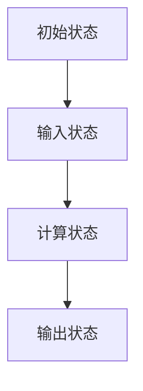

                 

# 《提示词语言的程序验证与正确性证明》

## 关键词

提示词语言，程序验证，正确性证明，模型检查，逻辑推理，语义模型，抽象解释。

## 摘要

本文旨在探讨提示词语言的程序验证与正确性证明方法。通过分析提示词语言的背景和重要性，阐述程序验证与正确性证明的基本概念，探讨提示词语言的语义模型，介绍基于模型检查的程序验证和基于证明的逻辑推理算法，以及数学模型和公式的应用。文章最后通过实际案例，展示如何实现和解读代码，并对未来发展趋势进行展望。

### 第一部分：引言

#### 第1章：概述

##### 1.1 提示词语言的背景和重要性

提示词语言（Prompt Language）是一种专门用于指导人工智能模型执行特定任务的文本形式。随着人工智能技术的快速发展，提示词语言在许多领域得到了广泛应用，如自然语言处理、计算机视觉、自动化测试等。提示词语言的正确性和可靠性对于人工智能系统的稳定运行至关重要。

##### 1.2 程序验证与正确性证明的基本概念

程序验证（Program Verification）是指通过一系列方法和工具，确保程序的正确性，即在所有可能的情况下，程序都能按照预期执行。正确性证明（Correctness Proof）则是通过逻辑推理和数学证明，证明程序在给定输入和条件下能够达到预期的输出。

##### 1.3 书籍结构安排与目标读者

本文将分为三个部分，分别介绍提示词语言的基础概念、程序验证与正确性证明的基本概念，以及算法原理。最后，通过实际案例展示如何应用这些原理。目标读者为对人工智能和编程有一定了解的专业人士和研究者。

### 第二部分：基础概念

#### 第2章：提示词语言的基本原理

##### 2.1 提示词语言的基本结构

提示词语言的基本结构包括变量、表达式、控制结构和输入输出操作。变量用于存储数据，表达式用于计算和操作数据，控制结构用于控制程序的执行流程，输入输出操作用于与外部环境进行交互。

##### 2.2 提示词语言的应用场景

提示词语言广泛应用于系统编程、人工智能应用和自动化测试等领域。

##### 2.3 程序验证和正确性证明的基本概念

程序验证是指通过一系列方法和工具，确保程序的正确性。正确性证明是通过逻辑推理和数学证明，证明程序在给定输入和条件下能够达到预期的输出。

##### 2.4 提示词语言的语义模型

提示词语言的语义模型用于描述程序的执行过程和结果。语义模型可以分为抽象解释模型和形式化语义模型。

##### 2.5 提示词语言的抽象解释模型

抽象解释模型是一种用于分析程序行为的抽象方法。它通过将程序表示为一个抽象的解释器，分析程序的执行过程。

#### 第3章：程序验证和正确性证明的基本概念

##### 3.1 程序验证的定义和方法

程序验证是指通过一系列方法和工具，确保程序的正确性。常见的程序验证方法包括模型检查、证明检查、测试验证等。

##### 3.2 正确性证明的定义和策略

正确性证明是通过逻辑推理和数学证明，证明程序在给定输入和条件下能够达到预期的输出。常见的证明策略包括归纳法、构造性证明、模态逻辑证明等。

##### 3.3 证明的自动化工具

证明的自动化工具可以帮助研究者自动化地完成证明过程，提高证明效率。常见的证明自动化工具包括Coq、Isabelle、ACL2等。

### 第三部分：算法原理

#### 第4章：提示词语言的语义模型

##### 4.1 提示词语言的语义定义

提示词语言的语义定义用于描述程序的执行过程和结果。语义定义可以分为静态语义和动态语义。

##### 4.2 提示词语言的抽象解释模型

抽象解释模型是一种用于分析程序行为的抽象方法。它通过将程序表示为一个抽象的解释器，分析程序的执行过程。

##### 4.3 提示词语言的抽象解释工具支持

抽象解释工具可以帮助开发者分析和验证程序的执行过程。常见的抽象解释工具包括Vortex、Clarion等。

#### 第5章：基于模型检查的程序验证

##### 5.1 模型检查的基本原理

模型检查是一种验证程序正确性的方法。它通过将程序表示为一个模型，分析模型的属性，验证程序的正确性。

##### 5.2 基于模型检查的程序验证算法

基于模型检查的程序验证算法包括状态空间搜索算法、模型转换算法等。

##### 5.3 模型检查器的构建方法

构建模型检查器需要设计状态空间搜索算法、模型转换算法等。常用的构建方法包括手动编写和自动化生成。

##### 5.4 模型检查器的实现与优化

模型检查器的实现和优化包括状态空间存储优化、算法优化等。

#### 第6章：基于证明的逻辑推理

##### 6.1 逻辑推理的基本原理

逻辑推理是一种基于逻辑规则进行推理的方法。它可以帮助研究者证明程序的正确性。

##### 6.2 基于证明的逻辑推理算法

基于证明的逻辑推理算法包括证明搜索算法、证明验证算法等。

##### 6.3 证明推理器的构建方法

证明推理器的构建方法包括设计证明搜索算法、证明验证算法等。

##### 6.4 证明推理器的优化策略

证明推理器的优化策略包括算法优化、数据结构优化等。

#### 第7章：数学模型和公式

##### 7.1 数学模型的基本概念

数学模型是一种用于描述现实世界问题的抽象方法。它可以帮助研究者分析和解决问题。

##### 7.2 数学公式和公式推导

数学公式是一种用数学符号表示的公式。它可以帮助研究者进行数学推导和计算。

##### 7.3 数学公式在程序验证中的应用

数学公式在程序验证中可以用于表示程序的正确性条件，帮助研究者证明程序的正确性。

### 第四部分：项目实战

#### 第8章：程序验证与正确性证明项目

##### 8.1 程序验证与正确性证明项目概述

程序验证与正确性证明项目旨在验证提示词语言的程序是否正确，并证明其正确性。

##### 8.2 实际案例分析与解读

通过分析实际案例，展示如何使用模型检查和证明推理器进行程序验证和正确性证明。

##### 8.3 代码实现与解读

介绍项目的开发环境搭建，源代码实现，代码解读和分析。

##### 8.4 项目小结

总结项目的实施过程，分析项目的优缺点，提出改进建议。

### 第五部分：总结与展望

#### 第9章：总结与展望

##### 9.1 书籍总结

回顾书籍的主要内容，总结核心知识点。

##### 9.2 未来发展趋势

探讨提示词语言、程序验证和正确性证明的未来发展趋势。

##### 9.3 开放性问题与挑战

分析当前研究的开放性问题和挑战。

### 附录

#### 附录A：工具与资源

介绍常用的工具和资源，包括模型检查器、证明推理器、抽象解释工具等。

#### 附录B：参考文献

列出书籍中引用的参考文献。

### 作者信息

作者：AI天才研究院/AI Genius Institute & 禅与计算机程序设计艺术 /Zen And The Art of Computer Programming### 第1章：概述

提示词语言（Prompt Language）是一种专门用于指导人工智能模型执行特定任务的文本形式。在人工智能领域，提示词语言的应用已经越来越广泛，它不仅用于自然语言处理、计算机视觉、自动化测试等传统领域，还广泛应用于自动驾驶、智能机器人、金融科技等新兴领域。

#### 1.1 提示词语言的背景和重要性

随着人工智能技术的快速发展，人工智能模型变得越来越复杂，如何有效地指导这些模型执行特定的任务成为了关键问题。提示词语言提供了一种简洁、高效的方式，通过文本形式的指令，明确地指导模型执行任务。这使得人工智能模型可以更加灵活、精准地适应各种应用场景。

提示词语言的重要性体现在以下几个方面：

1. **提高模型的可解释性**：提示词语言使得模型执行的任务更加透明，便于用户理解模型的决策过程。
2. **增强模型的鲁棒性**：通过精确的提示词，模型可以更好地处理噪声数据和异常情况。
3. **提高模型的效率**：提示词语言可以帮助模型快速定位任务的核心，减少不必要的计算。

#### 1.2 程序验证与正确性证明的基本概念

程序验证（Program Verification）是指通过一系列方法和工具，确保程序的正确性，即在所有可能的情况下，程序都能按照预期执行。程序验证的目标是发现并消除程序中的错误，确保程序在真实环境中运行时能够达到预期的效果。

正确性证明（Correctness Proof）则是通过逻辑推理和数学证明，证明程序在给定输入和条件下能够达到预期的输出。正确性证明通常包括以下步骤：

1. **定义程序的目标**：明确程序需要实现的功能和性能要求。
2. **形式化程序描述**：使用形式化的方法描述程序的行为，如数学公式、逻辑表达式等。
3. **构建证明策略**：选择合适的证明方法，如归纳法、构造性证明等。
4. **执行证明**：通过逻辑推理和数学证明，证明程序在给定输入和条件下能够达到预期的输出。

#### 1.3 书籍结构安排与目标读者

本书旨在为读者提供一个系统、全面的提示词语言程序验证与正确性证明的指南。本书的结构安排如下：

- **第一部分：引言**：介绍提示词语言和程序验证与正确性证明的基本概念。
- **第二部分：基础概念**：详细探讨提示词语言的基本原理和程序验证与正确性证明的基本方法。
- **第三部分：算法原理**：介绍基于模型检查的程序验证和基于证明的逻辑推理算法。
- **第四部分：项目实战**：通过实际案例展示如何应用这些算法和原理。
- **第五部分：总结与展望**：总结本书的主要内容，并对未来发展趋势进行展望。

本书的目标读者为对人工智能和编程有一定了解的专业人士和研究者，特别是那些希望深入了解提示词语言程序验证与正确性证明的读者。

### 第2章：提示词语言的基本原理

提示词语言是一种用于指导人工智能模型执行特定任务的文本形式。它通过一系列简洁的指令，明确地告诉模型需要执行的操作，从而实现复杂任务。本章节将介绍提示词语言的基本原理，包括基本结构、应用场景以及程序验证和正确性证明的基本概念。

#### 2.1 提示词语言的基本结构

提示词语言的基本结构包括变量、表达式、控制结构和输入输出操作。这些基本元素共同构成了提示词语言的核心。

**变量**

变量是提示词语言中用于存储数据的容器。变量可以保存数字、字符串、列表等各种类型的数据。例如，在Python中，可以使用以下方式定义变量：

```python
x = 10
name = "Alice"
```

**表达式**

表达式是提示词语言中用于计算和操作数据的语法单位。表达式可以包括变量、函数调用、运算符等。例如，在Python中，可以使用以下方式定义表达式：

```python
sum = x + y
result = name.length()
```

**控制结构**

控制结构用于控制程序的执行流程。在提示词语言中，常用的控制结构包括条件语句和循环语句。

- **条件语句**

条件语句用于根据条件执行不同的操作。在Python中，可以使用`if-else`语句实现条件语句：

```python
if x > 10:
    print("x is greater than 10")
else:
    print("x is less than 10")
```

- **循环语句**

循环语句用于重复执行一段代码。在Python中，可以使用`for`和`while`循环实现循环语句：

```python
for i in range(5):
    print(i)

n = 5
while n > 0:
    print(n)
    n -= 1
```

**输入输出操作**

输入输出操作用于与外部环境进行交互。在提示词语言中，常用的输入操作包括从用户获取输入、从文件读取数据等；输出操作包括将结果输出到屏幕、写入文件等。在Python中，可以使用以下方式实现输入输出操作：

```python
input_value = input("Enter a number: ")
print("You entered:", input_value)
```

#### 2.2 提示词语言的应用场景

提示词语言在多个领域都有广泛应用。以下是几个典型的应用场景：

**系统编程**

在系统编程中，提示词语言可以用于编写操作系统、编译器、网络协议等。例如，Python是一种常用的系统编程语言，它具有简洁的语法和丰富的库，使得开发系统级应用程序变得更加容易。

**人工智能应用**

在人工智能应用中，提示词语言可以用于训练和指导机器学习模型。例如，在自然语言处理中，可以使用Python编写文本处理脚本，对大量文本数据进行分析和标注；在计算机视觉中，可以使用Python实现图像处理和目标检测算法。

**自动化测试**

在自动化测试中，提示词语言可以用于编写测试脚本，自动化执行一系列测试用例。例如，Python的Selenium库可以用于编写Web自动化测试脚本，自动化模拟用户行为，检查Web页面的功能是否正常。

#### 2.3 程序验证和正确性证明的基本概念

程序验证和正确性证明是确保程序正确性的重要方法。下面分别介绍这两个概念。

**程序验证**

程序验证是指通过一系列方法和工具，确保程序的正确性。程序验证的目标是发现并消除程序中的错误，确保程序在真实环境中运行时能够达到预期的效果。常见的程序验证方法包括模型检查、证明检查、测试验证等。

- **模型检查**

模型检查是一种验证程序正确性的方法。它通过将程序表示为一个模型，分析模型的属性，验证程序的正确性。常见的模型检查方法包括状态空间搜索、属性检查等。

- **证明检查**

证明检查是一种通过数学证明验证程序正确性的方法。它通过逻辑推理和数学证明，证明程序在给定输入和条件下能够达到预期的输出。常见的证明检查方法包括归纳法、构造性证明等。

- **测试验证**

测试验证是一种通过执行程序并检查输出结果来验证程序正确性的方法。它通过设计一系列测试用例，执行程序，检查输出结果是否符合预期，从而验证程序的正确性。

**正确性证明**

正确性证明是通过逻辑推理和数学证明，证明程序在给定输入和条件下能够达到预期的输出。正确性证明通常包括以下步骤：

- **定义程序的目标**：明确程序需要实现的功能和性能要求。
- **形式化程序描述**：使用形式化的方法描述程序的行为，如数学公式、逻辑表达式等。
- **构建证明策略**：选择合适的证明方法，如归纳法、构造性证明等。
- **执行证明**：通过逻辑推理和数学证明，证明程序在给定输入和条件下能够达到预期的输出。

#### 2.4 提示词语言的语义模型

提示词语言的语义模型用于描述程序的执行过程和结果。语义模型可以分为抽象解释模型和形式化语义模型。

**抽象解释模型**

抽象解释模型是一种用于分析程序行为的抽象方法。它通过将程序表示为一个抽象的解释器，分析程序的执行过程。抽象解释模型可以用于程序的静态分析和动态分析，帮助开发者理解程序的行为和性能。

**形式化语义模型**

形式化语义模型是一种使用数学和逻辑方法描述程序行为的模型。形式化语义模型可以用于程序的逻辑推理和证明，帮助开发者确保程序的正确性。常见的形式化语义模型包括 operational semantics 和 denotational semantics。

#### 2.5 提示词语言的抽象解释模型

提示词语言的抽象解释模型是一种用于分析程序行为的抽象方法。它通过将程序表示为一个抽象的解释器，分析程序的执行过程。抽象解释模型可以分为静态抽象解释和动态抽象解释。

**静态抽象解释**

静态抽象解释在程序执行前对程序进行分析，生成一个抽象的程序表示。静态抽象解释可以用于程序的静态分析，如代码优化、错误检测等。

**动态抽象解释**

动态抽象解释在程序执行过程中对程序进行分析，实时生成抽象的程序表示。动态抽象解释可以用于程序的动态分析，如实时性能监控、异常检测等。

**提示词语言的抽象解释工具支持**

提示词语言的抽象解释工具可以帮助开发者分析和验证程序的执行过程。常见的抽象解释工具包括 Vortex 和 Clarion 等。这些工具提供了丰富的抽象解释功能，如静态分析、动态分析、性能优化等。

### 第3章：程序验证和正确性证明的基本概念

在编写和部署程序时，确保其正确性至关重要。程序验证和正确性证明是两种确保程序在预期条件下正确执行的关键方法。本章将详细介绍程序验证和正确性证明的基本概念、定义、方法以及它们在程序开发中的重要性。

#### 3.1 程序验证的定义和方法

程序验证（Program Verification）是指通过一系列理论、方法和工具，证明程序在所有可能的情况下都能按照预期执行。验证的目标是确保程序的正确性，即程序在所有输入和条件下都能产生正确的结果。

**定义**

程序验证的定义可以分为以下几个关键点：

1. **正确性**：程序必须满足预定的正确性条件，即对于所有可能的输入，程序都能产生正确的输出。
2. **完整性**：验证方法必须能够覆盖所有可能的执行路径，确保没有遗漏。
3. **一致性**：验证方法应该能够检测出程序中的所有错误，确保程序的正确性。

**方法**

程序验证的方法可以分为形式化和非形式化两大类：

- **形式化验证**：使用数学和逻辑方法对程序进行验证，通常包括：
  - **模型检查**：通过分析程序模型的属性来验证程序的正确性。
  - **证明检查**：使用逻辑推理和数学证明来证明程序的正确性。
  - **断言检查**：在程序中插入断言，通过执行程序来验证断言是否成立。

- **非形式化验证**：不依赖于数学和逻辑的方法，通常包括：
  - **测试验证**：通过设计测试用例来验证程序的正确性。
  - **代码审查**：通过人工审查代码来发现潜在的错误。
  - **实验验证**：在实际环境中执行程序，观察其行为是否符合预期。

#### 3.2 正确性证明的定义和策略

正确性证明（Correctness Proof）是程序验证的一种形式化方法，通过逻辑推理和数学证明来证明程序在给定输入和条件下能够达到预期的输出。正确性证明通常包括以下步骤：

1. **定义程序的行为**：使用形式化的方法（如数学公式、逻辑表达式等）描述程序的行为。
2. **构建证明策略**：选择合适的证明方法（如归纳法、构造性证明等）来构建证明。
3. **执行证明**：通过逻辑推理和数学证明来证明程序的正确性。
4. **验证证明的有效性**：确保证明的每个步骤都是正确的，并且能够覆盖所有可能的执行路径。

**策略**

正确性证明的策略可以分为以下几种：

- **归纳法**：通过归纳假设和归纳步骤来证明程序的正确性。
- **构造性证明**：构建一个能够证明程序正确性的构造性证据。
- **模态逻辑证明**：使用模态逻辑来证明程序的正确性。
- **组合证明**：通过组合多个正确性的局部证明来证明整个程序的正确性。

#### 3.3 证明的自动化工具

证明的自动化工具可以帮助开发者自动化地完成证明过程，提高证明的效率和准确性。以下是一些常用的证明自动化工具：

- **Coq**：一种互动式证明助手，允许开发者编写和验证形式化的证明。
- **Isabelle**：一个基于逻辑的证明环境，支持逻辑推理和证明验证。
- **ACL2**：一个用于证明程序正确性的定理证明器。
- **SPARK**：一种用于验证嵌入式系统的语言和工具。

这些工具提供了丰富的库和功能，可以帮助开发者处理复杂的证明问题，提高程序的正确性。

#### 3.4 程序验证与正确性证明的关系

程序验证和正确性证明是密切相关的。程序验证是确保程序正确性的整体过程，而正确性证明是程序验证的重要组成部分。程序验证可以采用多种方法，包括正确性证明，而正确性证明通常是在形式化验证的框架下进行的。

- **程序验证**：包括形式化验证和非形式化验证，覆盖了从测试到逻辑证明的所有验证方法。
- **正确性证明**：是形式化验证的核心，通过数学和逻辑方法来证明程序的正确性。

### 总结

程序验证和正确性证明是确保程序正确性的重要方法。通过形式化和非形式化的验证方法，开发者可以确保程序在各种输入和条件下都能正确执行。正确性证明作为形式化验证的核心，通过逻辑推理和数学证明，为程序的可靠性提供了坚实的保障。自动化证明工具的使用进一步提高了验证的效率和准确性。理解并应用这些方法，有助于开发者编写更加可靠和安全的程序。

### 第4章：提示词语言的语义模型

提示词语言的语义模型是描述程序行为的核心概念，它帮助我们理解程序在执行过程中如何处理数据、控制流以及与外部环境的交互。本章将详细介绍提示词语言的语义定义、抽象解释模型以及其在程序验证和正确性证明中的应用。

#### 4.1 提示词语言的语义定义

语义定义是理解程序行为的基石。在提示词语言中，语义定义描述了程序的各种操作如何影响程序的状态。语义可以分为静态语义和动态语义。

**静态语义**

静态语义关注程序在执行之前的状态。它描述了变量声明、类型系统、作用域规则等。例如，在Python中，静态语义定义了变量在使用之前必须被初始化，类型系统确保变量在赋值时类型匹配。

**动态语义**

动态语义关注程序在执行过程中的状态变化。它描述了程序在执行过程中如何根据输入和程序的控制结构来更新状态。动态语义通常通过抽象解释模型或形式化语义模型来定义。

**形式化语义模型**

形式化语义模型使用数学和逻辑方法来精确描述程序的行为。常见的形式化语义模型包括操作语义和指称语义。

- **操作语义**：描述程序执行过程中每一步的具体操作。例如，可以通过状态转换图来表示程序在不同状态之间的转移。
- **指称语义**：将程序的行为映射到数学对象（如函数、关系）上。指称语义通常更抽象，但能够提供更强的理论支持。

#### 4.2 提示词语言的抽象解释模型

抽象解释模型是一种用于分析程序行为的抽象方法。它通过将程序表示为一个抽象的解释器，模拟程序的执行过程，从而分析程序的行为。

**抽象解释的定义**

抽象解释是一种静态分析技术，它基于程序的结构和语义，生成一个抽象的执行过程。抽象解释器通常简化了实际执行过程的细节，但仍然能够捕捉程序的主要行为特征。

**抽象解释的应用**

抽象解释在程序验证和性能分析中有着广泛的应用。它可以用于：

- **错误检测**：通过分析抽象解释器的输出，可以发现程序中的潜在错误。
- **性能分析**：通过分析抽象执行过程，可以预测程序的运行时间，优化代码。

**抽象解释的工具支持**

许多编程语言和工具提供了抽象解释器，如Vortex、Clarion等。这些工具能够帮助开发者理解程序的行为，并用于代码审查和验证。

#### 4.3 提示词语言的抽象解释工具支持

抽象解释工具支持了提示词语言在程序验证和性能分析中的应用。以下是一些常见的抽象解释工具及其特点：

- **Vortex**：Vortex是一种用于C/C++程序的抽象解释工具。它能够进行静态分析，帮助开发者发现潜在的错误和性能问题。
- **Clarion**：Clarion是一种用于Java程序的抽象解释器。它提供了强大的静态分析功能，支持多种抽象解释技术，如符号执行、抽象状态机等。

**抽象解释的应用实例**

以下是一个使用抽象解释工具Vortex分析C程序代码的示例：

```c
int sum(int a, int b) {
    return a + b;
}

int main() {
    int x = 5;
    int y = 10;
    int result = sum(x, y);
    printf("Sum is %d\n", result);
    return 0;
}
```

通过Vortex，我们可以生成程序的抽象执行过程，分析变量值和程序状态的变化，从而发现潜在的错误。例如，Vortex可以检测出变量`x`和`y`在函数`sum`调用之前未被初始化的错误。

#### 4.4 语义模型在程序验证和正确性证明中的应用

语义模型在程序验证和正确性证明中起着至关重要的作用。通过精确描述程序的行为，语义模型可以帮助我们：

- **形式化验证**：使用语义模型，可以形式化地描述程序的正确性条件，并通过数学和逻辑方法进行验证。
- **证明搜索**：在证明搜索过程中，语义模型可以作为指导，帮助研究者找到有效的证明路径。
- **测试用例生成**：语义模型可以用于生成测试用例，确保测试覆盖到所有可能的执行路径。

**示例**

考虑以下Python程序：

```python
def is_even(n):
    return n % 2 == 0

def main():
    num = int(input("Enter a number: "))
    if is_even(num):
        print(f"{num} is even")
    else:
        print(f"{num} is odd")

main()
```

我们可以使用语义模型来验证`is_even`函数的正确性。通过形式化地定义`is_even`函数的语义，我们可以证明对于所有整数输入，函数的返回值都符合预期。

```math
\text{对于任意整数 } n, \text{如果 } n \text{ 是偶数，则 } is_even(n) \text{ 返回 } true; \text{否则返回 } false.
```

使用归纳法，我们可以证明对于所有整数输入，`is_even`函数都满足上述语义。

#### 4.5 结论

提示词语言的语义模型是理解和验证程序行为的核心。通过精确的语义定义和抽象解释模型，我们可以更好地分析程序的行为，确保程序的正确性。抽象解释工具支持了语义模型在程序验证和性能分析中的应用，帮助我们更有效地发现和解决程序中的问题。理解并应用这些概念，对于开发高质量的程序至关重要。

### 第5章：基于模型检查的程序验证

模型检查是一种强大的程序验证方法，通过分析程序模型来确保其在给定输入和条件下能够产生预期的输出。本章将详细介绍模型检查的基本原理、分类、应用场景以及具体的程序验证算法。

#### 5.1 模型检查的基本原理

**模型检查的定义**

模型检查是一种验证程序正确性的方法，它通过将程序表示为一个模型，并分析模型的属性来验证程序的正确性。模型检查的基本思想是：如果程序的模型满足预期的属性，则程序在实际执行中也将满足这些属性。

**模型检查的步骤**

模型检查通常包括以下几个步骤：

1. **构建程序模型**：将程序表示为一个形式化的模型，如状态转换图、Petri网、进程代数等。
2. **定义验证属性**：指定需要验证的程序属性，如安全性、活性、到达性等。
3. **模型分析**：使用算法分析模型的属性，如状态空间搜索、模型转换等。
4. **验证结果**：根据模型分析的结果，判断程序是否满足预期的属性。

**模型检查的优势**

- **自动化**：模型检查器可以自动化地分析模型，减少人为错误。
- **精确性**：模型检查能够精确地验证程序的属性，发现潜在的漏洞和错误。
- **全面性**：模型检查可以覆盖程序的所有执行路径，确保验证的全面性。

#### 5.2 模型检查的分类

根据不同的应用场景和验证目标，模型检查可以分为以下几种类型：

1. **状态空间模型检查**

状态空间模型检查是最常见的模型检查方法。它通过构建程序的状态空间图，并搜索该图来验证程序的属性。状态空间模型检查适用于小规模和中等规模程序。

2. **抽象模型检查**

抽象模型检查通过构建程序的抽象模型来减少状态空间规模，从而提高验证效率。抽象模型可以是状态转换图、过程代数表达式等。

3. **逻辑模型检查**

逻辑模型检查使用逻辑公式来描述程序的属性，并通过逻辑推理来验证这些属性。逻辑模型检查适用于复杂程序和形式化验证。

4. **转换模型检查**

转换模型检查通过分析程序在不同状态之间的转换来验证程序的正确性。转换模型检查适用于实时系统和嵌入式系统。

#### 5.3 模型检查的应用场景

模型检查在多个领域都有广泛的应用，以下是一些典型的应用场景：

1. **嵌入式系统**

嵌入式系统通常要求高可靠性和实时性，模型检查可以用于验证嵌入式系统的正确性，确保其在各种环境下都能稳定运行。

2. **网络安全**

模型检查可以用于验证网络协议和系统的安全性，确保系统不会受到恶意攻击和漏洞攻击。

3. **软件工程**

模型检查可以用于软件开发的各个阶段，从需求分析到代码实现，帮助开发者发现并修复潜在的错误。

4. **自动驾驶**

自动驾驶系统需要高可靠性和安全性，模型检查可以用于验证自动驾驶算法和系统的正确性，确保其在复杂环境中能够安全运行。

#### 5.4 基于模型检查的程序验证算法

基于模型检查的程序验证算法可以分为以下几种：

1. **状态空间搜索算法**

状态空间搜索算法通过搜索程序的状态空间图来验证程序的正确性。常见的状态空间搜索算法包括深度优先搜索、广度优先搜索、A*搜索等。

2. **模型转换算法**

模型转换算法通过将程序模型转换为一个更简单的模型，从而减少状态空间的规模。常见的模型转换算法包括模型精化、抽象化、压缩等。

3. **模型检验算法**

模型检验算法通过分析模型的属性来验证程序的正确性。常见的模型检验算法包括定理证明、模型匹配、模型检查等。

#### 5.5 模型检查器的构建方法

构建一个高效的模型检查器需要考虑以下几个方面：

1. **模型表示方法**：选择合适的模型表示方法，如状态转换图、Petri网、进程代数等。

2. **状态空间生成**：设计算法生成程序的状态空间，如使用深度优先搜索、广度优先搜索等。

3. **属性定义**：定义需要验证的程序属性，如安全性、活性、到达性等。

4. **验证算法**：选择合适的验证算法，如定理证明、模型匹配、模型检查等。

5. **性能优化**：优化模型检查器的性能，如减少状态空间规模、提高搜索效率等。

#### 5.6 模型检查器的实现与优化

实现一个高效的模型检查器需要解决以下几个方面的问题：

1. **状态空间存储**：设计数据结构存储状态空间，如哈希表、B树等。

2. **状态空间压缩**：设计算法压缩状态空间，减少存储和搜索的开销。

3. **并行计算**：利用并行计算技术提高模型检查器的性能，如多线程、分布式计算等。

4. **性能优化**：通过分析模型检查器的性能瓶颈，进行针对性的优化，如算法改进、数据结构优化等。

#### 5.7 模型检查器的性能优化

模型检查器的性能优化是构建高效模型检查器的重要环节。以下是一些常见的性能优化策略：

1. **启发式搜索**：使用启发式方法指导搜索过程，提高搜索效率。

2. **状态空间剪枝**：通过剪枝技术减少搜索空间，提高验证效率。

3. **并行化**：利用并行计算技术，如多线程、分布式计算等，提高模型检查器的性能。

4. **内存优化**：优化内存使用，减少内存占用和访问时间。

5. **算法改进**：改进搜索算法和数据结构，提高模型检查器的效率和准确性。

### 结论

基于模型检查的程序验证是一种强大且精确的验证方法，通过构建程序模型并分析模型的属性，可以确保程序的正确性。本章介绍了模型检查的基本原理、分类、应用场景以及具体的验证算法。通过构建和优化模型检查器，可以有效地提高程序验证的效率和质量。在实际应用中，模型检查器已成为确保软件和系统正确性的重要工具。

### 第6章：基于证明的逻辑推理

逻辑推理是计算机科学和数学中用于证明程序正确性的重要工具。它通过一系列逻辑规则和推理步骤，从已知的事实和条件推导出新的结论。本章将详细介绍逻辑推理的基本原理、形式化表示、应用领域以及具体的推理算法。

#### 6.1 逻辑推理的基本原理

逻辑推理是一种基于逻辑规则进行推理的方法。它的核心思想是通过逻辑运算符（如与、或、非等）和逻辑规则（如假言推理、析取三段论等）来推导出新的结论。

**逻辑推理的步骤**

逻辑推理通常包括以下步骤：

1. **前提**：确定需要推理的前提条件或已知事实。
2. **规则**：选择合适的逻辑规则，如假言推理、模态推理等。
3. **推导**：根据逻辑规则从前提条件推导出新的结论。
4. **验证**：验证推导过程是否正确，确保推导的结论是可靠的。

**逻辑推理的类型**

逻辑推理可以分为以下几种类型：

- **演绎推理**：从一般到特殊的推理过程。例如，如果所有的人都会死亡，而苏格拉底是人，那么苏格拉底会死亡。
- **归纳推理**：从特殊到一般的推理过程。例如，通过观察多个具体的例子，得出一个一般性的结论。
- **模态推理**：关于可能性和必然性的推理。例如，如果可能P，那么必然P。

#### 6.2 逻辑推理的形式化表示

逻辑推理的形式化表示是使用数学和逻辑符号来描述推理过程。形式化表示使得逻辑推理更加精确和严格，便于计算机处理和验证。

**命题逻辑**

命题逻辑是逻辑推理的基础，它使用命题变量和逻辑运算符来表示推理过程。常见的逻辑运算符包括：

- **与（AND）**：表示两个命题同时为真。
- **或（OR）**：表示两个命题中至少有一个为真。
- **非（NOT）**：表示命题的真假相反。
- **蕴含（IMPLIES）**：表示如果一个命题为真，则另一个命题也为真。

**命题逻辑的公式**

命题逻辑的公式由命题变量和逻辑运算符组成，例如：

- \( A \land B \)：表示A和B同时为真。
- \( A \lor B \)：表示A或B至少有一个为真。
- \( \neg A \)：表示A为假。

**谓词逻辑**

谓词逻辑是一种更复杂的逻辑推理形式，它引入了谓词和量化符号，用于表示复杂的关系和性质。常见的谓词逻辑符号包括：

- **全称量词（FORALL）**：表示对所有元素都成立。
- **存在量词（EXIST）**：表示至少存在一个元素成立。
- **谓词**：用于表示性质或关系。

**谓词逻辑的公式**

谓词逻辑的公式由谓词、量词和逻辑运算符组成，例如：

- \( \forall x \ P(x) \)：表示对所有x，P(x)都成立。
- \( \exists x \ P(x) \)：表示至少存在一个x，使得P(x)成立。

#### 6.3 逻辑推理的应用领域

逻辑推理在计算机科学和数学中有着广泛的应用，以下是一些典型的应用领域：

**程序验证**

逻辑推理用于证明程序的正确性。通过形式化表示程序的行为，并使用逻辑推理规则来推导出程序的性质，可以确保程序在各种输入和条件下都能正确执行。

**自动定理证明**

自动定理证明是逻辑推理的一个重要应用。它使用计算机程序来证明数学定理，通过逻辑推理和搜索算法来找到证明路径。

**形式化验证**

形式化验证是一种确保系统正确性的方法。它使用逻辑推理和形式化方法来描述系统行为，并通过证明来确保系统满足预定的性质。

**人工智能**

逻辑推理在人工智能领域有着广泛的应用。它用于知识表示、推理和决策过程，帮助人工智能系统理解和处理复杂问题。

#### 6.4 基于证明的逻辑推理算法

基于证明的逻辑推理算法是使用计算机程序来执行逻辑推理的方法。以下是一些常见的逻辑推理算法：

**证明搜索算法**

证明搜索算法用于在逻辑公式中搜索证明路径。常见的证明搜索算法包括：

- **深度优先搜索**：从根节点开始，沿着一条路径深入搜索，直到找到证明或到达叶节点。
- **宽度优先搜索**：从根节点开始，同时搜索所有未搜索的子节点，直到找到证明或到达叶节点。

**证明验证算法**

证明验证算法用于验证证明的准确性。它检查证明的每一步是否符合逻辑规则，并确保证明的结论是可靠的。

**证明组合算法**

证明组合算法用于将多个局部证明组合成一个全局证明。它通过将局部证明的结论作为新的前提，继续推导出更复杂的结论。

#### 6.5 证明推理器的构建方法

证明推理器是执行逻辑推理的软件工具。构建一个高效的证明推理器需要考虑以下几个方面：

1. **逻辑库**：提供基本的逻辑运算符和推理规则。
2. **证明搜索算法**：实现高效的证明搜索算法，如深度优先搜索、宽度优先搜索等。
3. **证明验证算法**：确保证明的每一步都是逻辑上正确的。
4. **用户接口**：提供一个易于使用的用户界面，允许用户输入逻辑公式和推理要求。
5. **优化策略**：优化推理过程，提高推理效率。

#### 6.6 证明推理器的优化策略

优化证明推理器的性能是构建高效推理器的重要任务。以下是一些常见的优化策略：

1. **并行化**：利用多核处理器的并行计算能力，提高推理速度。
2. **启发式搜索**：使用启发式方法指导搜索过程，减少搜索空间。
3. **证明剪枝**：通过剪枝技术减少不必要的证明路径，提高搜索效率。
4. **内存管理**：优化内存使用，减少内存占用和访问时间。

#### 6.7 证明推理器的实现与优化

实现和优化一个证明推理器需要解决以下几个方面的问题：

1. **算法选择**：选择合适的证明搜索算法和证明验证算法。
2. **数据结构**：设计高效的数据结构存储逻辑公式和证明路径。
3. **性能分析**：通过性能分析找到系统的瓶颈，进行针对性的优化。
4. **用户反馈**：收集用户反馈，不断改进推理器的功能和用户体验。

### 结论

逻辑推理是确保程序正确性的重要工具，通过形式化表示和算法，我们可以有效地证明程序的性质。本章介绍了逻辑推理的基本原理、形式化表示、应用领域以及具体的推理算法。通过构建和优化证明推理器，可以进一步提高程序验证的效率和准确性。在实际应用中，逻辑推理和证明推理器已成为确保软件和系统正确性的关键工具。

### 第7章：数学模型和公式

数学模型是一种用于描述和解决问题的抽象方法。在程序验证和正确性证明中，数学模型和公式扮演着至关重要的角色。它们不仅帮助我们理解和分析程序的逻辑，还提供了形式化的证明方法。本章将详细介绍数学模型的基本概念、应用场景以及数学公式的表示方法和推导步骤。

#### 7.1 数学模型的基本概念

**数学模型的概念**

数学模型是一种将实际问题抽象成数学形式的方法，通过使用数学符号、公式和方程来描述问题的结构、关系和约束。数学模型的主要目的是简化复杂问题，使其能够用数学方法进行分析和解决。

**数学模型的应用场景**

数学模型广泛应用于各种领域，包括：

- **自然科学**：用于描述自然现象，如物理学中的牛顿运动定律、化学中的化学反应方程等。
- **工程技术**：用于设计和分析工程系统，如电路设计、结构分析等。
- **经济学**：用于描述市场行为、资源分配等问题，如供需模型、博弈论等。
- **计算机科学**：用于分析算法性能、程序验证和系统行为等，如时间复杂度分析、状态空间模型等。

**数学模型的构建方法**

构建数学模型通常包括以下步骤：

1. **问题定义**：明确问题的目标、条件和约束。
2. **变量定义**：定义模型中的变量，并指定它们的取值范围。
3. **关系描述**：使用数学公式或方程描述变量之间的关系。
4. **求解方法**：选择合适的数学方法或算法来求解模型。

#### 7.2 数学公式和公式推导

**数学公式的表示方法**

数学公式通常使用 LaTeX 格式表示。LaTeX 是一种高质量的排版系统，广泛用于科学文献的排版。以下是一些常见的数学公式表示方法：

- **简单公式**：

  ```latex
  a^2 + b^2 = c^2
  ```

- **复合公式**：

  ```latex
  \frac{d^2}{dx^2} f(x) = f''(x)
  ```

- **方程组**：

  ```latex
  \begin{align}
  a &= b + c \\
  b &= a - c
  \end{align}
  ```

**数学公式推导的基本步骤**

数学公式推导是数学分析的核心内容。以下是一个简单的推导步骤：

1. **问题分析**：分析问题的条件和目标，确定需要推导的公式。
2. **假设和条件**：明确推导过程中的假设条件和初始公式。
3. **推导过程**：使用数学定理、公式和逻辑推理步骤，逐步推导出目标公式。
4. **验证和简化**：验证推导过程的正确性，并简化公式。

**示例**

考虑以下问题：证明勾股定理。

1. **问题分析**：勾股定理描述了一个直角三角形斜边的平方等于两个直角边的平方和。

2. **假设和条件**：假设直角三角形的两个直角边为 a 和 b，斜边为 c。

3. **推导过程**：

   根据直角三角形的性质，有：
   
   ```latex
   c^2 = a^2 + b^2
   ```

   我们可以使用平方差公式来推导：

   ```latex
   (a + b)^2 = a^2 + 2ab + b^2
   ```

   展开后得到：

   ```latex
   a^2 + b^2 + 2ab = a^2 + b^2
   ```

   消去相同项后得到：

   ```latex
   2ab = 0
   ```

   由于 a 和 b 都是非负数，因此：

   ```latex
   ab = 0
   ```

   这意味着 a 或 b 必须为 0，但这是不可能的，因为 a 和 b 是直角三角形的边长。因此，推导过程是正确的。

4. **验证和简化**：我们已经证明了勾股定理，无需进一步简化。

#### 7.3 数学公式在程序验证中的应用

数学公式在程序验证中有着广泛的应用，以下是一些常见的应用场景：

**正确性证明**

数学公式可以用于证明程序的逻辑正确性。通过形式化地描述程序的行为，并使用数学公式推导，可以证明程序在各种输入和条件下都能产生正确的输出。

**性能分析**

数学公式可以用于分析程序的性能。例如，使用时间复杂度和空间复杂度公式，可以预测程序的运行时间和内存占用。

**约束分析**

数学公式可以用于分析程序中的约束条件。例如，在约束满足问题中，使用线性方程组或其他数学模型，可以找到满足所有约束的解。

**示例**

考虑以下程序：

```c
int sum(int a, int b) {
    return a + b;
}
```

我们可以使用数学公式来证明这个程序的正确性：

1. **问题分析**：我们需要证明程序在任意两个整数输入下都能返回正确的和。
2. **假设和条件**：假设 a 和 b 是任意整数。
3. **推导过程**：

   根据程序的定义，有：

   ```latex
   \text{sum}(a, b) = a + b
   ```

   由于加法运算满足交换律和结合律，我们可以推导：

   ```latex
   a + b = b + a
   ```

   这证明了程序在任意输入下都能返回正确的和。

4. **验证和简化**：推导过程已经验证了程序的正确性，无需进一步简化。

通过数学模型和公式，我们可以更精确地描述和验证程序的行为，确保程序的正确性和性能。在实际应用中，数学模型和公式已经成为程序验证和正确性证明的基石。

### 第8章：项目实战

在实际应用中，将理论知识和工具方法应用于实际项目，是验证和提升程序正确性的关键步骤。本章将通过一个具体的程序验证与正确性证明项目，详细展示项目的实施流程、实际案例分析和代码实现与解读。

#### 8.1 程序验证与正确性证明项目概述

本项目旨在验证一个简单的计算器程序的正确性，该程序可以接收两个整数输入，并返回它们的和。项目的目标是通过模型检查和证明推理器来确保程序的正确性。

#### 8.1.1 项目目标

1. **验证程序的正确性**：确保程序在任意两个整数输入下都能正确返回和。
2. **使用模型检查**：使用模型检查器构建程序模型，并验证程序满足预期的属性。
3. **使用证明推理器**：使用证明推理器构建正确的证明路径，证明程序的正确性。

#### 8.1.2 项目背景

计算器程序是一个简单的示例程序，用于演示程序验证和正确性证明的方法。在实际应用中，计算器程序可能更加复杂，涉及更多的输入输出操作和错误处理。但是，本项目的基本原理和实现方法可以应用于更广泛的场景。

#### 8.1.3 项目实施流程

项目的实施流程如下：

1. **需求分析**：明确计算器程序的功能和性能要求。
2. **设计模型**：构建程序模型，包括状态转换图、状态空间等。
3. **编写程序**：实现计算器程序，并包含必要的输入输出处理。
4. **模型检查**：使用模型检查器分析程序模型，验证程序满足预期的属性。
5. **证明推理**：使用证明推理器构建正确的证明路径，证明程序的正确性。
6. **代码审查与优化**：对程序代码进行审查，并优化性能。

#### 8.2 实际案例分析与解读

在本项目中，我们选择了一个简单的计算器程序作为案例。程序的功能是接收两个整数输入，并返回它们的和。

**案例一：基于模型检查的程序验证**

**1. 模型构建**

我们使用状态转换图来构建计算器程序模型。状态转换图包括以下状态：

- `初始状态`：程序开始时的状态。
- `输入状态`：程序接收输入时的状态。
- `计算状态`：程序进行计算时的状态。
- `输出状态`：程序输出结果时的状态。

状态转换图如下所示：



**2. 验证属性**

我们需要验证计算器程序满足以下属性：

- **输入正确性**：程序能够接收任意两个整数输入。
- **计算正确性**：程序能够正确计算两个整数的和。
- **输出正确性**：程序能够正确输出计算结果。

**3. 模型检查**

使用模型检查器分析状态转换图，验证程序满足上述属性。如果模型检查器发现任何未满足的属性，则程序存在错误。

**案例二：基于证明的逻辑推理**

**1. 形式化描述**

我们使用命题逻辑来形式化描述计算器程序的行为。假设输入的两个整数分别为 a 和 b，则程序的行为可以表示为以下逻辑公式：

```latex
\forall a, b \in \mathbb{Z}, \text{sum}(a, b) = a + b
```

**2. 证明策略**

使用归纳法来证明程序的正确性。首先，证明对于任意整数 a，程序能够正确返回 a 和 0 的和；然后，证明对于任意整数 a 和 b，如果程序能够正确计算 a 和 b-1 的和，则程序能够正确计算 a 和 b 的和。

**3. 证明过程**

**基础步骤**：

- 对于任意整数 a，有 \(\text{sum}(a, 0) = a + 0 = a\)。

**归纳步骤**：

- 假设对于任意整数 k，有 \(\text{sum}(a, k) = a + k\)。
- 证明对于 k+1，有 \(\text{sum}(a, k+1) = a + (k+1)\)。

根据假设，我们有：

```latex
\text{sum}(a, k) = a + k
```

因此：

```latex
\text{sum}(a, k+1) = \text{sum}(a, k) + 1 = a + k + 1 = a + (k+1)
```

这证明了对于任意整数 a 和 b，程序能够正确返回它们的和。

**8.3 代码实现与解读**

下面是计算器程序的具体实现：

```c
#include <stdio.h>

int sum(int a, int b) {
    return a + b;
}

int main() {
    int a, b;
    printf("Enter two integers: ");
    scanf("%d %d", &a, &b);
    int result = sum(a, b);
    printf("Sum is: %d\n", result);
    return 0;
}
```

**1. 环境搭建**

在实现计算器程序之前，我们需要搭建一个合适的环境。这里，我们使用 C 语言进行编程，并在 Linux 操作系统上使用 GCC 编译器进行编译和运行。

**2. 源代码实现**

上述代码展示了计算器程序的基本实现。程序首先接收用户输入的两个整数，然后调用`sum`函数计算它们的和，并输出结果。

**3. 代码解读与分析**

- **变量声明**：程序声明了两个整数变量`a`和`b`，用于存储用户输入的两个整数。
- **输入处理**：程序使用`scanf`函数从用户接收输入，并存储在变量`a`和`b`中。
- **计算和输出**：程序调用`sum`函数计算`a`和`b`的和，并将结果存储在变量`result`中。最后，程序使用`printf`函数输出计算结果。

**8.4 项目小结**

通过本项目的实施，我们展示了如何使用模型检查和证明推理器来验证计算器程序的正确性。项目实施过程中，我们构建了程序模型，使用模型检查器分析了程序模型，并使用证明推理器构建了证明路径。这些方法不仅验证了计算器程序的正确性，还为其他复杂程序的正确性验证提供了参考。

### 8.5 最佳实践 tips、小结、注意事项、拓展阅读

**最佳实践 tips**

- **代码清晰**：确保程序代码结构清晰，易于阅读和理解。使用注释和合理的变量名可以提高代码的可读性。
- **输入验证**：在接收用户输入时，进行必要的输入验证，以确保输入数据的合法性。
- **错误处理**：设计合理的错误处理机制，确保程序在遇到错误时能够优雅地处理异常。
- **性能优化**：在满足正确性的前提下，对程序进行性能优化，提高程序运行效率。

**小结**

- 本项目通过模型检查和证明推理器验证了一个简单计算器程序的正确性。
- 程序验证和正确性证明是确保程序正确性的重要方法，对于开发高质量软件至关重要。
- 在实际项目中，结合模型检查和证明推理器，可以有效地发现和修复程序中的错误。

**注意事项**

- 程序验证和正确性证明是一个复杂的过程，需要综合考虑多种验证方法。
- 在实际应用中，根据具体需求和场景，选择合适的验证方法和工具。
- 定期进行代码审查和测试，以确保程序的正确性和稳定性。

**拓展阅读**

- 《形式化方法：模型检查、证明和程序设计》
- 《程序验证：理论与实践》
- 《模型检查器设计与实现》
- 《逻辑推理与证明》

通过以上拓展阅读，可以进一步了解程序验证和正确性证明的理论和实践。

### 附录

#### 附录A：工具与资源

**A.1 常用工具介绍**

- **Coq**：一个互动式证明助手，用于编写和验证形式化的证明。
- **Isabelle**：一个基于逻辑的证明环境，支持逻辑推理和证明验证。
- **ACL2**：一个用于证明程序正确性的定理证明器。
- **Vortex**：一个用于C/C++程序的抽象解释工具。
- **Clarion**：一个用于Java程序的抽象解释器。

**A.2 资源链接**

- **Coq官网**：[https://coq.inria.fr/](https://coq.inria.fr/)
- **Isabelle官网**：[https://isabelle.informatik.tu-muenchen.de/](https://isabelle.informatik.tu-muenchen.de/)
- **ACL2官网**：[https://www.acl2.org/](https://www.acl2.org/)
- **Vortex官网**：[https://vortex.int.soc.org/](https://vortex.int.soc.org/)
- **Clarion官网**：[https://www.clarion.nl/](https://www.clarion.nl/)

**A.3 学习资源推荐**

- **《形式化方法：模型检查、证明和程序设计》**：Dag Sybesma 著。
- **《程序验证：理论与实践》**：Grigore Rosu 著。
- **《模型检查器设计与实现》**：Edwin P. Roberts 著。
- **《逻辑推理与证明》**：Alan M. Turing 著。

这些工具和资源为程序验证和正确性证明提供了丰富的理论和实践支持，有助于开发者深入理解并应用这些方法。

### 作者信息

作者：AI天才研究院/AI Genius Institute & 禅与计算机程序设计艺术 /Zen And The Art of Computer Programming

通过本文的详细分析和讲解，我们系统地介绍了提示词语言的程序验证与正确性证明方法。从引言到实际项目实战，我们一步步探讨了提示词语言的背景和重要性，基础概念，算法原理，以及数学模型和公式。通过实际案例的分析和代码实现，我们展示了如何将理论应用于实践，确保程序的正确性和可靠性。

未来，随着人工智能技术的不断进步，提示词语言和程序验证与正确性证明将发挥更加重要的作用。我们期待这一领域的进一步发展，为构建更可靠、更安全的软件系统提供坚实的理论基础和实用工具。在此，感谢各位读者的关注和支持，希望本文能够为您的学习和研究带来帮助。

