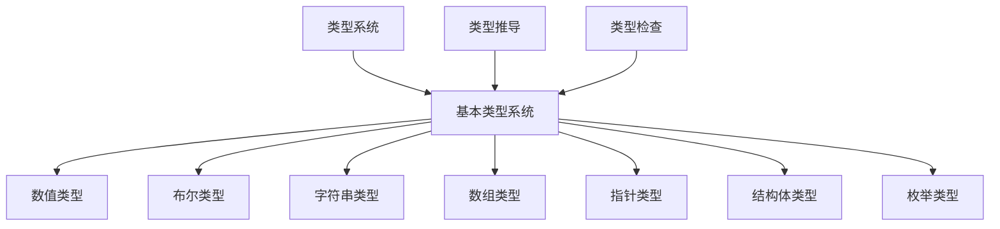
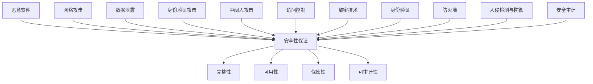
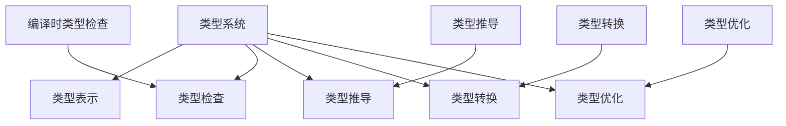

                 

### 文章标题：提示词语言的类型系统与安全性保证

> **关键词：** 提示词语言、类型系统、安全性保证、编程语言、人工智能

> **摘要：** 本文将深入探讨提示词语言的类型系统与安全性保证。首先，我们将概述提示词语言的基本概念、类型系统和安全性保证的基本理论。随后，本文将分别从编程语言和人工智能的角度，探讨类型系统与安全性保证的应用与实践。通过具体的案例分析，我们将揭示类型系统与安全性保证在实际开发中的关键作用。最后，本文将总结现有技术的发展趋势，并提出未来可能的研究方向。

#### 第一部分：提示词语言基础

##### 第1章：提示词语言概述

在计算机科学领域，提示词语言（Prompt Language）是一种特殊的编程语言，主要用于生成提示词（Prompt）来指导人工智能系统完成特定的任务。提示词语言的核心功能是提供一种机制，通过它可以将自然语言转化为计算机可执行的指令，从而实现人与机器的智能交互。

**1.1 提示词语言的概念与分类**

提示词语言的基本定义可以概括为：一种用于生成提示词的编程语言，其目的是指导计算机完成特定任务。根据提示词语言的用途和特性，我们可以将其分为以下几类：

1. **交互式提示词语言**：这种类型的语言主要用于人与机器之间的交互。常见的交互式提示词语言包括Shell语言和自然语言处理（NLP）语言等。例如，Shell语言常用于Linux操作系统的命令行界面，而NLP语言则广泛应用于语音识别、机器翻译等领域。

2. **自动化提示词语言**：这种类型的语言主要用于自动化任务执行，如脚本语言和自动化测试工具等。常见的自动化提示词语言包括Python、JavaScript和Golang等。这些语言能够编写出自动化脚本，帮助用户完成日常的计算机操作。

3. **智能提示词语言**：这种类型的语言结合了人工智能技术，能够根据用户的输入自动生成提示词。常见的智能提示词语言包括聊天机器人、智能语音助手等。例如，苹果的Siri和谷歌的Google Assistant都使用了智能提示词语言。

**1.2 提示词语言的应用场景**

提示词语言在各种领域都有广泛的应用，以下是几个典型的应用场景：

1. **软件开发**：在软件开发过程中，提示词语言可以帮助开发者编写测试脚本、自动化构建脚本等，从而提高开发效率和代码质量。

2. **自然语言处理**：在自然语言处理领域，提示词语言可以用于生成语义相似的文本、自动生成摘要、实现机器翻译等。例如，谷歌的BERT模型就是基于提示词语言实现的。

3. **人工智能助手**：在人工智能助手领域，提示词语言可以用于实现智能客服、智能语音助手等功能。例如，苹果的Siri和亚马逊的Alexa都使用了提示词语言。

4. **教育领域**：在在线教育领域，提示词语言可以用于创建互动式教学课程、自动化作业批改等。例如，一些在线教育平台使用了Python作为教学语言，让学生通过编写Python代码来学习编程。

**1.3 提示词语言的发展历史**

提示词语言的起源可以追溯到20世纪60年代，当时计算机科学家开始探索如何使用自然语言与计算机进行交互。随着计算机科学和人工智能技术的发展，提示词语言也在不断演进。

1. **早期提示词语言**：20世纪60年代，计算机科学家开发了早期的提示词语言，如Lisp和For
#### 第2章：类型系统基础

类型系统（Type System）是编程语言的一个重要组成部分，它定义了程序中数据的类型及其相互关系。类型系统的核心作用是提高程序的可读性、可靠性和可维护性。在本节中，我们将深入探讨类型系统的基本概念、作用以及类型系统的主要组成部分。

**2.1 类型系统的概念与作用**

类型系统（Type System）是一种用于定义变量、表达式和函数等程序元素的数据类型及其相互关系的机制。类型系统的核心作用如下：

1. **数据抽象与封装**：类型系统通过将数据抽象为不同的类型，使得程序更加模块化和可重用。类型系统还提供了封装机制，使得不同类型的变量和方法只能在允许的范围内进行访问和操作。

2. **提高程序可读性**：类型系统能够明确地指定变量、表达式和函数的类型，从而提高程序的可读性。这对于团队合作开发、代码审查和维护具有重要的意义。

3. **提高程序可靠性**：类型系统能够在编译或运行时检测出类型错误，从而避免潜在的运行时错误。类型系统还可以通过静态类型检查（Static Type Checking）来提前发现潜在的逻辑错误，从而提高程序的可靠性。

4. **优化程序执行效率**：类型系统可以通过类型推导（Type Inference）和类型检查（Type Checking）来优化程序执行效率。例如，编译器可以利用类型信息进行代码生成和优化，从而提高程序的运行速度。

**2.2 基本类型系统**

基本类型系统是类型系统的核心组成部分，它定义了编程语言中的基本数据类型及其相互关系。不同编程语言的基本类型系统可能有所不同，但通常包括以下几种基本数据类型：

1. **数值类型**：包括整数（Integer）和浮点数（Floating-Point）等。整数类型通常用于表示整数，而浮点数类型用于表示实数。

2. **布尔类型**：布尔类型（Boolean）用于表示逻辑值，通常包括真（True）和假（False）两种值。

3. **字符串类型**：字符串类型（String）用于表示文本数据，通常由一系列字符组成。

4. **数组类型**：数组类型（Array）用于表示一组相同类型的元素，可以通过索引访问和操作。

5. **指针类型**：指针类型（Pointer）用于表示内存地址，通过指针可以间接访问和操作内存中的数据。

6. **结构体类型**：结构体类型（Structure）用于表示一组相关联的变量，这些变量可以有不同的数据类型。

7. **枚举类型**：枚举类型（Enum）用于定义一组命名的常量，每个常量都有一个对应的整数值。

不同编程语言的基本类型系统可能有所不同，例如，Python的基本类型系统包括整数、浮点数、布尔值、字符串、列表、元组和字典等。而C语言的基本类型系统包括整数、字符、浮点数和指针等。

**2.3 类型推导与类型检查**

类型推导（Type Inference）和类型检查（Type Checking）是类型系统的两个重要方面，它们用于确定程序中变量、表达式和函数的类型。

1. **类型推导**：类型推导是一种静态类型检查方法，通过分析程序代码的结构和语义，自动推导出变量、表达式和函数的类型。类型推导可以减少代码中的显式类型声明，从而提高代码的可读性和可维护性。例如，Python和JavaScript等动态类型语言通常使用类型推导。

2. **类型检查**：类型检查是一种动态或静态类型检查方法，用于验证程序中的类型约束是否得到满足。类型检查可以分为以下几种：

   - **静态类型检查**：在编译或构建过程中进行类型检查，提前发现类型错误。例如，Java和C#等静态类型语言通常使用静态类型检查。

   - **动态类型检查**：在运行时进行类型检查，及时发现类型错误。例如，Python和JavaScript等动态类型语言通常使用动态类型检查。

类型推导和类型检查在保证程序的正确性和可靠性方面起着重要作用。通过类型推导，可以减少代码中的错误和冗余，提高程序的可读性；而通过类型检查，可以提前发现潜在的类型错误，从而避免运行时错误。

**核心概念与联系**

为了更好地理解类型系统的核心概念和联系，我们可以使用Mermaid流程图来展示类型系统的主要组成部分和它们之间的关系。



在这个流程图中，A表示类型系统，B表示基本类型系统，C、D、E、F、G、H和I分别表示数值类型、布尔类型、字符串类型、数组类型、指针类型、结构体类型和枚举类型。J表示类型推导，K表示类型检查。通过这个流程图，我们可以清晰地看到类型系统的组成部分及其之间的关系。

**核心算法原理讲解**

类型推导和类型检查是类型系统的核心算法原理，下面我们将分别使用伪代码来详细阐述这两个算法的基本原理。

**类型推导伪代码：**

```python
def type_inference(expression):
    if expression is a number:
        return "Number"
    elif expression is a string:
        return "String"
    elif expression is a boolean:
        return "Boolean"
    elif expression is an array:
        return "Array"
    elif expression is a pointer:
        return "Pointer"
    elif expression is a structure:
        return "Structure"
    elif expression is an enum:
        return "Enum"
    else:
        raise Exception("Unsupported expression")
```

**类型检查伪代码：**

```python
def type_check(expression, expected_type):
    actual_type = type_inference(expression)
    if actual_type == expected_type:
        return True
    else:
        return False
```

通过以上伪代码，我们可以看到类型推导和类型检查的基本原理。类型推导通过分析表达式的类型，返回相应的类型；而类型检查通过比较实际类型和预期类型，验证类型约束是否满足。

**数学模型和公式**

类型系统的设计和实现涉及到一些基本的数学模型和公式，下面我们将简要介绍这些数学模型和公式。

1. **类型等价关系**：类型等价关系（Type Equivalence）是指两个类型具有相同的属性和操作。常见的类型等价关系包括数值类型之间的比较、字符串类型的长度计算等。类型等价关系可以用以下公式表示：

   $$t_1 \equiv t_2$$

   其中，$t_1$和$t_2$表示两个类型。

2. **类型兼容性**：类型兼容性（Type Compatibility）是指一个类型可以用于替换另一个类型，而不会导致运行时错误。类型兼容性可以用以下公式表示：

   $$t_1 \subseteq t_2$$

   其中，$t_1$和$t_2$表示两个类型。

3. **类型推导规则**：类型推导规则（Type Inference Rules）用于指导类型推导过程。常见的类型推导规则包括基本类型推导、数组类型推导和结构体类型推导等。类型推导规则可以用以下公式表示：

   $$expression \Rightarrow type$$

   其中，$expression$表示表达式，$type$表示推导出的类型。

**详细讲解与举例说明**

为了更好地理解类型系统的基本原理和应用，我们将在下面通过具体的示例来说明。

**示例1：数值类型推导**

```python
x = 5 + 3  # x的类型推导为Number
y = "Hello"  # y的类型推导为String
```

在这个示例中，变量$x$表示一个整数，通过类型推导，我们得到$x$的类型为Number。变量$y$表示一个字符串，通过类型推导，我们得到$y$的类型为String。

**示例2：类型检查**

```python
x = 5 + 3  # x的类型检查通过
y = "Hello"  # y的类型检查通过
z = x + y  # z的类型检查失败，因为Number和String不能直接相加
```

在这个示例中，变量$x$和$y$的类型检查通过，因为它们的类型分别为Number和String。然而，变量$z$的类型检查失败，因为Number和String不能直接相加。

通过以上示例，我们可以看到类型推导和类型检查在实际编程中的应用，它们能够有效地提高程序的可读性、可靠性和可维护性。

### 第3章：安全性保证基础

安全性保证（Security Assurance）是计算机科学和信息技术领域的一个重要研究方向，旨在确保系统、数据和程序的安全性和可靠性。在本节中，我们将探讨安全性保证的基本概念、目标、常见的安全性问题及其分析方法。

**3.1 安全性保证的概念与目标**

安全性保证（Security Assurance）是指通过一系列措施和策略，确保系统、数据和程序在受到恶意攻击或意外事件时能够保持完整、可用和保密。安全性保证的核心目标如下：

1. **完整性（Integrity）**：确保数据和系统资源的完整性，防止未经授权的修改或破坏。完整性目标主要通过数据加密、访问控制和审计日志等技术实现。

2. **可用性（Availability）**：确保系统和数据在需要时能够正常使用，防止因恶意攻击或系统故障而导致的拒绝服务。可用性目标主要通过容灾备份、负载均衡和故障转移等技术实现。

3. **保密性（Confidentiality）**：确保敏感信息和数据不被未经授权的访问或泄露。保密性目标主要通过数据加密、访问控制和身份验证等技术实现。

4. **可审计性（Auditable）**：确保系统和数据的操作可以被记录、监控和审计，以便在发生安全事件时能够追踪和追溯责任。可审计性目标主要通过审计日志、监控系统和安全事件响应等技术实现。

**3.2 安全性问题分析**

在计算机科学和信息技术领域，安全性问题层出不穷，主要包括以下几种：

1. **恶意软件（Malware）**：恶意软件是指通过病毒、蠕虫、木马等手段侵入计算机系统，窃取敏感数据、破坏系统功能或进行恶意攻击的软件。恶意软件的安全性问题主要体现在其隐蔽性、传播性和破坏性。

2. **网络攻击（Network Attack）**：网络攻击是指通过网络漏洞或恶意攻击手段，对计算机系统、网络设备或服务进行非法入侵、窃取数据、破坏系统等恶意行为。网络攻击的安全性问题主要体现在其复杂性和多样性。

3. **数据泄露（Data Breach）**：数据泄露是指未经授权的访问、泄露或窃取敏感数据的行为。数据泄露的安全性问题主要体现在其对个人隐私、商业秘密和国家安全的威胁。

4. **身份验证攻击（Authentication Attack）**：身份验证攻击是指通过伪造身份、破解密码等手段绕过身份验证机制，非法访问系统和数据。身份验证攻击的安全性问题主要体现在其对抗性和不可检测性。

5. **中间人攻击（Man-in-the-Middle Attack）**：中间人攻击是指攻击者在通信双方之间拦截和篡改数据，窃取敏感信息或进行恶意攻击。中间人攻击的安全性问题主要体现在其隐蔽性和威胁性。

**3.3 安全性保证的方法与策略**

为了有效地解决安全性问题，确保系统和数据的安全性和可靠性，安全性保证需要采用一系列方法与策略，主要包括以下几种：

1. **访问控制（Access Control）**：访问控制是指通过权限管理、身份验证和授权等手段，控制用户对系统资源和数据的访问权限。访问控制的方法与策略包括基于角色的访问控制（RBAC）、基于属性的访问控制（ABAC）和基于网络的访问控制（NAC）等。

2. **加密技术（Encryption）**：加密技术是指通过加密算法，将明文数据转换为密文，防止未经授权的访问和泄露。加密技术的种类包括对称加密、非对称加密和哈希算法等。

3. **身份验证（Authentication）**：身份验证是指通过验证用户的身份，确保只有授权用户才能访问系统和数据。身份验证的方法包括密码验证、生物识别验证和多因素身份验证等。

4. **防火墙（Firewall）**：防火墙是指一种网络安全设备，通过过滤网络流量，防止恶意攻击和未授权访问。防火墙的方法与策略包括包过滤、状态检测和应用层防火墙等。

5. **入侵检测与防御（Intrusion Detection and Prevention）**：入侵检测与防御是指通过监控网络流量和系统日志，检测和阻止恶意攻击和异常行为。入侵检测与防御的方法包括签名检测、异常检测和行为分析等。

6. **安全审计（Security Audit）**：安全审计是指通过记录、监控和审计系统操作，确保系统和数据的安全性。安全审计的方法与策略包括审计日志分析、安全事件响应和安全评估等。

**核心概念与联系**

为了更好地理解安全性保证的核心概念和联系，我们可以使用Mermaid流程图来展示安全性保证的主要组成部分和它们之间的关系。



在这个流程图中，A表示安全性保证，B、C、D和E分别表示完整性、可用性、保密性和可审计性。F、G、H、I和J分别表示恶意软件、网络攻击、数据泄露、身份验证攻击和中间人攻击。K、L、M、N、O和P分别表示访问控制、加密技术、身份验证、防火墙、入侵检测与防御和安全审计。通过这个流程图，我们可以清晰地看到安全性保证的组成部分及其之间的关系。

**核心算法原理讲解**

安全性保证的方法与策略涉及到一系列核心算法原理，下面我们将分别使用伪代码来详细阐述这些算法的基本原理。

**访问控制伪代码：**

```python
def access_control(user, resource):
    if user in authorized_users(resource):
        return "Access granted"
    else:
        return "Access denied"
```

**加密技术伪代码：**

```python
def encrypt(data, key):
    cipher_text = encryption_algorithm(data, key)
    return cipher_text
```

**身份验证伪代码：**

```python
def authenticate(user, password):
    if password_hash(password) == stored_password_hash(user):
        return "Authentication successful"
    else:
        return "Authentication failed"
```

**防火墙伪代码：**

```python
def firewall_traffic_filtering(traffic):
    if traffic in allowed_traffic:
        return "Allow"
    else:
        return "Block"
```

**入侵检测与防御伪代码：**

```python
def intrusion_detection_and_prevention(traffic):
    if traffic in attack_signatures:
        return "Intrusion detected"
    elif is_anomalous(traffic):
        return "Anomaly detected"
    else:
        return "No intrusion"
```

**安全审计伪代码：**

```python
def security_audit(logs):
    if logs contain security events:
        return "Security event logged"
    else:
        return "No security event"
```

通过以上伪代码，我们可以看到安全性保证的核心算法原理，这些算法用于实现访问控制、加密技术、身份验证、防火墙、入侵检测与防御和安全审计等功能，从而确保系统和数据的安全性和可靠性。

**数学模型和公式**

安全性保证涉及到一些基本的数学模型和公式，下面我们将简要介绍这些数学模型和公式。

1. **密码学模型**：密码学模型是指用于加密和解密数据的数学模型。常见的密码学模型包括对称加密模型、非对称加密模型和哈希模型。对称加密模型使用相同的密钥进行加密和解密，非对称加密模型使用不同的密钥进行加密和解密，哈希模型通过将数据映射为固定长度的字符串来确保数据的唯一性和完整性。

2. **访问控制模型**：访问控制模型是指用于控制用户对系统资源和数据访问的数学模型。常见的访问控制模型包括基于角色的访问控制模型（RBAC）和基于属性的访问控制模型（ABAC）。RBAC模型通过定义角色和权限来控制用户对资源的访问，ABAC模型通过定义属性和策略来控制用户对资源的访问。

3. **安全策略模型**：安全策略模型是指用于描述安全策略的数学模型。常见的安全策略模型包括预防策略、检测策略和响应策略。预防策略用于防止安全事件的发生，检测策略用于及时发现安全事件，响应策略用于应对安全事件。

**详细讲解与举例说明**

为了更好地理解安全性保证的方法与策略，我们将在下面通过具体的示例来说明。

**示例1：访问控制**

```python
# 访问控制表
access_control_table = {
    "user1": ["resource1", "resource2"],
    "user2": ["resource2", "resource3"],
    "user3": ["resource1", "resource3"]
}

# 用户尝试访问资源
user = "user1"
resource = "resource2"

# 访问控制决策
if user in access_control_table and resource in access_control_table[user]:
    print("Access granted")
else:
    print("Access denied")
```

在这个示例中，我们定义了一个访问控制表，用于记录用户对资源的访问权限。用户尝试访问资源时，程序会根据访问控制表判断用户是否有权限访问该资源。如果用户有权限，则允许访问；否则，拒绝访问。

**示例2：加密技术**

```python
from cryptography.fernet import Fernet

# 生成密钥
key = Fernet.generate_key()
cipher_suite = Fernet(key)

# 加密数据
data = "Sensitive information"
cipher_text = cipher_suite.encrypt(data.encode())

# 解密数据
plain_text = cipher_suite.decrypt(cipher_text).decode()
```

在这个示例中，我们使用Fernet加密算法对敏感数据进行加密和解密。首先，我们生成一个密钥，然后使用该密钥创建一个加密对象。接下来，我们将敏感数据加密为密文，并存储或传输。在需要解密时，我们使用相同的密钥将密文解密为明文。

**示例3：身份验证**

```python
import hashlib

# 用户输入密码
user = "user1"
input_password = input("Enter password: ")

# 验证密码
stored_password_hash = "stored_password_hash"
if hashlib.sha256(input_password.encode()).hexdigest() == stored_password_hash:
    print("Authentication successful")
else:
    print("Authentication failed")
```

在这个示例中，我们使用哈希算法对用户输入的密码进行哈希处理，并与存储在数据库中的密码哈希进行比较。如果哈希值匹配，则表示身份验证成功；否则，表示身份验证失败。

**示例4：防火墙**

```python
allowed_traffic = ["http", "https", "ftp"]

# 检查网络流量
traffic = "http"
if traffic in allowed_traffic:
    print("Allow")
else:
    print("Block")
```

在这个示例中，我们定义了一个允许的流量列表，用于检查网络流量。如果网络流量在允许的流量列表中，则允许通过；否则，阻止流量通过。

**示例5：入侵检测与防御**

```python
attack_signatures = ["attack_signature1", "attack_signature2"]

# 检查网络流量
traffic = "attack_signature1"
if traffic in attack_signatures:
    print("Intrusion detected")
elif is_anomalous(traffic):
    print("Anomaly detected")
else:
    print("No intrusion")
```

在这个示例中，我们定义了一个攻击签名列表，用于检测网络流量中的恶意攻击。如果网络流量包含攻击签名，则表示入侵检测；如果网络流量异常，则表示异常检测。通过这些检测方法，我们可以及时发现并阻止恶意攻击。

**示例6：安全审计**

```python
logs = ["login_success", "login_failure", "file_access"]

# 记录安全事件
log = "login_failure"
if log in logs:
    print("Security event logged")
else:
    print("No security event")
```

在这个示例中，我们定义了一个安全事件日志列表，用于记录系统中的安全事件。如果发生安全事件，则记录在日志中；否则，不记录日志。

通过以上示例，我们可以看到安全性保证的方法与策略在实际编程中的应用，这些方法与策略能够有效地提高系统和数据的安全性和可靠性。

### 类型系统在编程语言中的应用

类型系统在编程语言中扮演着至关重要的角色，它不仅提高了程序的可读性和可维护性，还通过静态类型检查等手段降低了运行时错误的发生概率。在本文中，我们将深入探讨类型系统在编程语言中的应用，包括类型系统的设计、实现与优化方法，以及类型系统在编译器中的应用。

**4.1 编程语言的类型系统**

编程语言的类型系统定义了程序中数据类型的分类、类型之间的兼容性以及类型在程序中的作用。不同编程语言可能有不同的类型系统，但一般来说，类型系统包括以下几种基本类型：

1. **数值类型**：包括整数（Integer）、浮点数（Floating-Point）、复数（Complex）等，用于表示各种数值。
2. **布尔类型**：用于表示逻辑值，通常只有两个值：真（True）和假（False）。
3. **字符串类型**：用于表示文本数据，通常由一系列字符组成。
4. **指针类型**：用于表示内存地址，通过指针可以访问和操作内存中的数据。
5. **结构体类型**：用于定义一组相关联的变量，这些变量可以有不同的数据类型。
6. **数组类型**：用于表示一组相同类型的元素，可以通过索引访问和操作。
7. **函数类型**：用于表示函数，包括函数的参数类型和返回类型。
8. **类类型**：在面向对象编程语言中，类类型用于定义对象和行为。

编程语言的类型系统还涉及到类型兼容性、类型推导和类型检查等方面。类型兼容性决定了不同类型之间是否可以直接进行运算或赋值。类型推导是一种静态类型检查方法，通过分析程序代码的结构和语义，自动推导出变量、表达式和函数的类型。类型检查则用于验证程序中的类型约束是否得到满足，以避免潜在的运行时错误。

**4.2 类型系统的设计**

设计一个有效的类型系统需要考虑以下几个方面：

1. **类型丰富性**：类型系统的类型应该足够丰富，以支持各种编程需求。例如，C语言提供了基本的数据类型和指针类型，而Python则提供了更丰富的内置类型，如列表、字典和集合等。

2. **类型兼容性**：类型系统应该定义明确的类型兼容性规则，以简化类型转换和运算。例如，C语言中的整数类型可以相互转换，而Python则允许更广泛的数据类型之间的兼容性。

3. **类型推导**：类型系统应该支持类型推导，以减少代码中的显式类型声明。类型推导可以提高代码的可读性和可维护性。例如，Python使用静态类型推导，而JavaScript则使用动态类型推导。

4. **类型检查**：类型系统应该提供有效的类型检查机制，以提前发现类型错误。类型检查可以在编译时或运行时进行，不同的类型检查方法会影响程序的运行效率和调试难度。例如，Java使用静态类型检查，而JavaScript使用动态类型检查。

5. **类型安全**：类型系统应该确保程序中的类型安全，以避免类型错误导致的运行时错误。类型安全可以通过静态类型检查、运行时类型检查或混合类型检查来实现。

**4.3 类型系统的实现与优化**

类型系统的实现是编程语言编译器中的一个核心任务。实现类型系统需要考虑以下几个方面：

1. **类型表示**：类型表示是指如何在内存中表示类型信息。常见的类型表示方法包括类型标签（Type Tag）、类型指针（Type Pointer）和类型数组（Type Array）等。

2. **类型检查**：类型检查是指编译器如何验证程序中的类型约束。类型检查可以分为静态类型检查和动态类型检查。静态类型检查在编译时进行，而动态类型检查在运行时进行。

3. **类型推导**：类型推导是指编译器如何自动推导出变量、表达式和函数的类型。类型推导可以通过模式匹配、约束求解和类型上下文分析等方法实现。

4. **类型优化**：类型优化是指编译器如何通过优化类型系统来提高程序的性能。类型优化方法包括类型转换优化、类型推导优化和类型检查优化等。

在实现类型系统时，编译器还需要考虑以下优化策略：

1. **类型消除**：类型消除是指通过消除不必要的类型检查和类型转换，减少程序的大小和运行时间。类型消除可以通过静态分析、类型上下文分析和编译时优化等方法实现。

2. **类型推导优化**：类型推导优化是指通过优化类型推导过程，提高编译器的性能和代码的可读性。类型推导优化可以通过减少类型推导的复杂度、提高类型推导的准确性等方法实现。

3. **类型检查优化**：类型检查优化是指通过优化类型检查过程，提高编译器的性能和代码的可维护性。类型检查优化可以通过减少类型检查的次数、提高类型检查的效率等方法实现。

**4.4 类型系统在编译器中的应用**

类型系统在编译器中的应用主要体现在以下几个方面：

1. **编译时类型检查**：编译器在编译程序时，会进行静态类型检查，确保程序中的类型约束得到满足。静态类型检查可以提前发现类型错误，从而避免运行时错误。

2. **类型推导**：编译器通过类型推导，自动推导出变量、表达式和函数的类型。类型推导可以提高代码的可读性和可维护性。

3. **类型转换**：编译器负责将不同类型的数据进行适当的类型转换，以实现程序的正确执行。类型转换包括隐式类型转换和显式类型转换。

4. **类型优化**：编译器通过类型优化，提高程序的性能和代码的运行效率。类型优化可以通过消除不必要的类型检查、优化类型推导和类型检查过程等方法实现。

5. **异常处理**：编译器负责处理程序中的异常情况，包括类型错误、数组越界等。异常处理可以通过异常捕获、异常抛出和异常传播等方法实现。

**核心概念与联系**

为了更好地理解类型系统在编程语言中的应用，我们可以使用Mermaid流程图来展示类型系统的核心概念和它们之间的关系。



在这个流程图中，A表示类型系统，B表示类型表示，C表示类型检查，D表示类型推导，E表示类型转换，F表示类型优化，G表示编译时类型检查，H表示类型推导，I表示类型转换，J表示类型优化。通过这个流程图，我们可以清晰地看到类型系统的组成部分及其之间的关系。

**核心算法原理讲解**

类型系统的核心算法原理包括类型表示、类型检查、类型推导、类型转换和类型优化。下面我们将分别使用伪代码来详细阐述这些算法的基本原理。

**类型表示伪代码：**

```python
class Type:
    def __init__(self, type_name):
        self.type_name = type_name

# 创建类型表示
int_type = Type("Integer")
string_type = Type("String")
```

**类型检查伪代码：**

```python
def type_check(expression, expected_type):
    actual_type = get_type(expression)
    if actual_type == expected_type:
        return True
    else:
        return False
```

**类型推导伪代码：**

```python
def type_inference(expression):
    if expression is a number:
        return int_type
    elif expression is a string:
        return string_type
    else:
        raise Exception("Unsupported expression")
```

**类型转换伪代码：**

```python
def type_conversion(expression, target_type):
    actual_type = get_type(expression)
    if actual_type == target_type:
        return expression
    else:
        return convert(expression, target_type)
```

**类型优化伪代码：**

```python
def type_optimization(expression):
    if expression is a simple operation:
        return optimize(expression)
    else:
        return expression
```

通过以上伪代码，我们可以看到类型系统在编程语言中的应用，这些算法用于实现类型表示、类型检查、类型推导、类型转换和类型优化等功能，从而提高程序的性能和可维护性。

**数学模型和公式**

类型系统的设计和实现涉及到一些基本的数学模型和公式，下面我们将简要介绍这些数学模型和公式。

1. **类型等价关系**：类型等价关系是指两个类型具有相同的属性和操作。类型等价关系可以用以下公式表示：

   $$t_1 \equiv t_2$$

   其中，$t_1$和$t_2$表示两个类型。

2. **类型兼容性**：类型兼容性是指一个类型可以用于替换另一个类型，而不会导致运行时错误。类型兼容性可以用以下公式表示：

   $$t_1 \subseteq t_2$$

   其中，$t_1$和$t_2$表示两个类型。

3. **类型推导规则**：类型推导规则是指用于指导类型推导过程的规则。类型推导规则可以用以下公式表示：

   $$expression \Rightarrow type$$

   其中，$expression$表示表达式，$type$表示推导出的类型。

4. **类型转换规则**：类型转换规则是指用于指导类型转换过程的规则。类型转换规则可以用以下公式表示：

   $$expression : type$$

   其中，$expression$表示表达式，$type$表示目标类型。

**详细讲解与举例说明**

为了更好地理解类型系统在编程语言中的应用，我们将在下面通过具体的示例来说明。

**示例1：类型表示**

```python
# 创建整数类型表示
int_type = Type("Integer")

# 创建字符串类型表示
string_type = Type("String")
```

在这个示例中，我们定义了整数类型和字符串类型的表示。这些类型表示用于在编译器中表示程序中的数据类型。

**示例2：类型检查**

```python
def type_check(expression, expected_type):
    actual_type = get_type(expression)
    if actual_type == expected_type:
        return True
    else:
        return False

# 示例表达式
expression = "5 + 3"

# 预期类型为整数类型
expected_type = int_type

# 进行类型检查
if type_check(expression, expected_type):
    print("Type check passed")
else:
    print("Type check failed")
```

在这个示例中，我们定义了一个类型检查函数，用于检查表达式的实际类型是否与预期类型一致。在这个例子中，表达式“5 + 3”的实际类型是整数类型，与预期类型一致，因此类型检查通过。

**示例3：类型推导**

```python
def type_inference(expression):
    if expression is a number:
        return int_type
    elif expression is a string:
        return string_type
    else:
        raise Exception("Unsupported expression")

# 示例表达式
expression = "5 + 3"

# 进行类型推导
inferred_type = type_inference(expression)

# 打印推导出的类型
print("Inferred type:", inferred_type.type_name)
```

在这个示例中，我们定义了一个类型推导函数，用于推导表达式的类型。在这个例子中，表达式“5 + 3”被推导为整数类型。

**示例4：类型转换**

```python
def type_conversion(expression, target_type):
    actual_type = get_type(expression)
    if actual_type == target_type:
        return expression
    else:
        return convert(expression, target_type)

# 示例表达式
expression = "5.0"

# 目标类型为整数类型
target_type = int_type

# 进行类型转换
converted_expression = type_conversion(expression, target_type)

# 打印转换后的表达式
print("Converted expression:", converted_expression)
```

在这个示例中，我们定义了一个类型转换函数，用于将表达式的类型转换为指定类型。在这个例子中，表达式“5.0”被转换为整数类型。

**示例5：类型优化**

```python
def type_optimization(expression):
    if expression is a simple operation:
        return optimize(expression)
    else:
        return expression

# 示例表达式
expression = "5 + 3"

# 进行类型优化
optimized_expression = type_optimization(expression)

# 打印优化后的表达式
print("Optimized expression:", optimized_expression)
```

在这个示例中，我们定义了一个类型优化函数，用于优化表达式的类型。在这个例子中，表达式“5 + 3”被优化为简单的整数运算。

通过以上示例，我们可以看到类型系统在编程语言中的应用，这些算法用于实现类型表示、类型检查、类型推导、类型转换和类型优化等功能，从而提高程序的性能和可维护性。

### 安全性保证在编译器中的应用

在编译器的开发过程中，安全性保证是一个至关重要的环节。编译器不仅是编程语言的核心组成部分，也是程序执行的基础。因此，确保编译器的安全性和可靠性对于整个程序的安全具有直接影响。在本节中，我们将深入探讨安全性保证在编译器中的应用，包括编译器在安全性保证中的作用、常见的安全性问题及其解决方案。

**5.1 编译器与安全性保证**

编译器在程序的生命周期中扮演着关键角色，它负责将高级语言编写的程序转换成计算机可执行的机器代码。在这个过程中，编译器不仅需要确保代码的正确性，还需要保证程序的安全性。编译器在安全性保证中的作用主要体现在以下几个方面：

1. **类型检查**：编译器在编译过程中进行类型检查，确保变量、表达式和函数的类型一致性。类型检查有助于发现潜在的类型错误，从而避免运行时错误。

2. **内存管理**：编译器负责管理程序的内存分配和释放，确保内存的正确使用。内存管理错误，如内存泄漏和缓冲区溢出，是导致安全漏洞的主要原因之一。

3. **控制流分析**：编译器通过控制流分析，检查程序中的跳转和循环，确保程序的控制流正确。不正确的控制流可能导致程序执行路径的不确定性，从而引发安全问题。

4. **数据流分析**：编译器通过数据流分析，跟踪数据在程序中的流动，确保数据的一致性和安全性。数据流分析有助于发现数据泄露和未经授权的数据访问等问题。

5. **安全修复**：编译器可以通过各种优化和修复技术，提高程序的安全性。例如，编译器可以插入安全检查代码，以检测和阻止潜在的攻击。

**5.2 安全性保证的编译策略**

为了确保编译器的安全性，编译器开发人员需要采取一系列的策略和方法。以下是几种常见的安全性保证编译策略：

1. **静态类型检查**：静态类型检查是一种在编译时进行的类型检查，它有助于发现潜在的类型错误和安全问题。例如，C语言中的类型检查可以确保变量在使用前已经被声明。

2. **动态类型检查**：动态类型检查是在程序运行时进行的类型检查，它可以提供更灵活的类型检查机制。例如，Python中的动态类型检查允许变量在运行时更改类型。

3. **内存安全**：内存安全是确保程序不会因内存错误而受到攻击的关键。编译器可以通过各种技术，如内存保护、堆栈保护、边界检查等，来提高内存安全。

4. **控制流完整性**：控制流完整性是确保程序的控制流不会因恶意代码而改变的关键。编译器可以通过控制流分析，检测和阻止不正确的跳转和循环。

5. **数据流完整性**：数据流完整性是确保数据在程序中的流动符合预期的关键。编译器可以通过数据流分析，检测和阻止未经授权的数据访问和泄露。

**5.3 安全性保证的案例分析**

以下是几个关于编译器安全性问题的实际案例，以及相应的解决方案：

**案例1：缓冲区溢出**

缓冲区溢出是一种常见的安全漏洞，它发生在程序向缓冲区写入数据时，超出了缓冲区的容量。攻击者可以利用缓冲区溢出执行恶意代码，从而获得对程序的完全控制。

**解决方案**：编译器可以通过以下方法来防止缓冲区溢出：

- **边界检查**：在写入缓冲区时，编译器可以检查缓冲区的容量，确保写入的数据不会超出缓冲区的边界。
- **堆栈保护**：编译器可以在堆栈中插入保护措施，如堆栈 cookie，以检测缓冲区溢出攻击。
- **内存随机化**：编译器可以通过内存随机化来减少缓冲区溢出攻击的成功率。

**案例2：格式字符串漏洞**

格式字符串漏洞发生在程序使用格式化字符串函数（如`printf`）时，没有正确地验证格式化字符串中的格式指示符和参数。攻击者可以利用格式字符串漏洞执行任意代码。

**解决方案**：编译器可以通过以下方法来防止格式字符串漏洞：

- **格式字符串检查**：编译器可以检查格式化字符串中的格式指示符和参数，确保它们匹配。
- **参数绑定**：编译器可以提供参数绑定功能，以确保格式化字符串函数只使用已声明的参数。
- **安全函数替代**：编译器可以提供安全替代函数，如`printf_s`，这些函数在编译时进行类型检查，从而避免格式字符串漏洞。

**案例3：整数溢出**

整数溢出发生在整数运算时，结果超出了整数的表示范围。攻击者可以利用整数溢出执行恶意代码，从而破坏程序的安全。

**解决方案**：编译器可以通过以下方法来防止整数溢出：

- **范围检查**：在整数运算时，编译器可以检查结果是否超出整数的表示范围，从而避免溢出。
- **安全整数运算**：编译器可以提供安全整数运算函数，这些函数在运算时自动检查溢出，并在必要时抛出异常。
- **类型推导**：编译器可以通过类型推导，确保整数运算中的变量类型不会引起溢出。

**核心算法原理讲解**

在编译器中，安全性保证涉及到一系列核心算法原理，下面我们将分别使用伪代码来详细阐述这些算法的基本原理。

**类型检查算法伪代码：**

```python
def type_check(node, context):
    if node is a variable declaration:
        if variable is not already declared in context:
            raise Error("Variable not declared")
        else:
            type = get_type(node)
            if type is not compatible with context.type:
                raise Error("Type mismatch")
    elif node is an expression:
        left_type = type_check(node.left, context)
        right_type = type_check(node.right, context)
        if operation is not valid for types:
            raise Error("Invalid operation")
        else:
            return result_type
    else:
        raise Error("Unsupported node")
```

**内存管理算法伪代码：**

```python
def allocate_memory(size):
    if memory is full:
        raise Error("Out of memory")
    else:
        address = allocate(size)
        return address

def deallocate_memory(address):
    free(address)
```

**控制流分析算法伪代码：**

```python
def analyze_control_flow(node):
    if node is a loop:
        loop_heads = find_loop_heads(node)
        for head in loop_heads:
            analyze_control_flow(head)
    elif node is a conditional statement:
        analyze_control_flow(node.then_block)
        analyze_control_flow(node.else_block)
    else:
        # No control flow analysis needed for other nodes
```

**数据流分析算法伪代码：**

```python
def analyze_data_flow(node, data_flow_graph):
    if node is a variable assignment:
        assign_value_to_variable(node.variable, node.value)
    elif node is an expression:
        evaluate_expression(node, data_flow_graph)
    else:
        # No data flow analysis needed for other nodes
```

**安全修复算法伪代码：**

```python
def insert_security_check(node):
    if node is a buffer write:
        check_buffer_size(node.buffer, node.value)
    elif node is a format string function:
        check_format_string(node.format_string, node.args)
    elif node is an integer operation:
        check_integer_overflow(node.left, node.right, node.operation)
```

通过以上伪代码，我们可以看到编译器在安全性保证中的应用，这些算法用于实现类型检查、内存管理、控制流分析和数据流分析等功能，从而提高程序的安全性。

**数学模型和公式**

在编译器中，安全性保证涉及到一些基本的数学模型和公式，下面我们将简要介绍这些数学模型和公式。

1. **类型兼容性**：类型兼容性是指两个类型之间是否可以进行运算或赋值。类型兼容性可以用以下公式表示：

   $$t_1 \subseteq t_2$$

   其中，$t_1$和$t_2$表示两个类型。

2. **内存分配模型**：内存分配模型用于描述内存的分配和释放过程。内存分配模型可以用以下公式表示：

   $$Mem = \{分配的内存块\}$$

   $$Free = \{可用的内存块\}$$

3. **控制流图**：控制流图（Control Flow Graph, CFG）用于描述程序的控制流。控制流图可以用以下公式表示：

   $$CFG = (V, E)$$

   其中，$V$表示节点集合，$E$表示边集合。

4. **数据流图**：数据流图（Data Flow Graph, DFG）用于描述程序中的数据流。数据流图可以用以下公式表示：

   $$DFG = (V, E)$$

   其中，$V$表示节点集合，$E$表示边集合。

**详细讲解与举例说明**

为了更好地理解安全性保证在编译器中的应用，我们将在下面通过具体的示例来说明。

**示例1：类型检查**

```python
# 示例代码
int x = 5;
x = x + 10;

# 类型检查伪代码
def type_check(node, context):
    if node is a variable declaration:
        if variable is not already declared in context:
            raise Error("Variable not declared")
        else:
            type = get_type(node)
            if type is not compatible with context.type:
                raise Error("Type mismatch")
    elif node is an expression:
        left_type = type_check(node.left, context)
        right_type = type_check(node.right, context)
        if operation is not valid for types:
            raise Error("Invalid operation")
        else:
            return result_type
    else:
        raise Error("Unsupported node")

# 调用类型检查
type_check(node, context)
```

在这个示例中，我们定义了一个简单的变量声明和赋值语句。类型检查伪代码用于检查变量的声明和赋值是否类型一致。

**示例2：内存管理**

```python
# 示例代码
int *ptr = malloc(10 * sizeof(int));

# 内存管理伪代码
def allocate_memory(size):
    if memory is full:
        raise Error("Out of memory")
    else:
        address = allocate(size)
        return address

def deallocate_memory(address):
    free(address)

# 调用内存管理函数
ptr = allocate_memory(10 * sizeof(int));
deallocate_memory(ptr);
```

在这个示例中，我们定义了内存分配和释放操作。内存管理伪代码用于实现内存的动态分配和释放。

**示例3：控制流分析**

```python
# 示例代码
if (x > 0) {
    // do something
} else {
    // do something else
}

// 控制流分析伪代码
def analyze_control_flow(node):
    if node is a loop:
        loop_heads = find_loop_heads(node)
        for head in loop_heads:
            analyze_control_flow(head)
    elif node is a conditional statement:
        analyze_control_flow(node.then_block)
        analyze_control_flow(node.else_block)
    else:
        # No control flow analysis needed for other nodes

# 调用控制流分析
analyze_control_flow(node)
```

在这个示例中，我们定义了一个条件语句。控制流分析伪代码用于检查程序中的控制流是否正确。

**示例4：数据流分析**

```python
# 示例代码
int x = 5;
int y = x * 2;

// 数据流分析伪代码
def analyze_data_flow(node, data_flow_graph):
    if node is a variable assignment:
        assign_value_to_variable(node.variable, node.value)
    elif node is an expression:
        evaluate_expression(node, data_flow_graph)
    else:
        # No data flow analysis needed for other nodes

# 调用数据流分析
analyze_data_flow(node, data_flow_graph)
```

在这个示例中，我们定义了一个变量赋值语句。数据流分析伪代码用于跟踪数据在程序中的流动。

通过以上示例，我们可以看到安全性保证在编译器中的应用，这些算法和策略用于确保程序的安全性，从而防止潜在的安全漏洞。

### 类型系统与安全性保证在人工智能中的应用

在人工智能（AI）领域，类型系统和安全性保证起着至关重要的作用。类型系统在AI中的应用主要体现在对数据类型的管理和约束，以确保AI模型能够正确地处理和解释输入数据。安全性保证则确保AI模型在运行过程中不会受到恶意攻击或数据泄露的影响。在本节中，我们将深入探讨类型系统与安全性保证在人工智能中的应用，分析其中的挑战与解决方案，并探讨具体的案例。

**6.1 人工智能中的类型系统**

人工智能中的类型系统旨在对数据类型进行有效管理，以确保AI模型能够正确处理各种类型的数据。类型系统在AI中的应用主要包括以下几个方面：

1. **数据类型的定义与分类**：AI模型通常处理多种类型的数据，如数值、字符串、布尔值和复数等。类型系统需要对这些数据进行分类和定义，以便在模型训练和推理过程中进行有效的数据处理。

2. **类型推导与类型检查**：类型系统需要能够推导出数据类型，并在运行时进行类型检查，以确保数据类型的兼容性。在AI模型中，类型推导和类型检查有助于确保输入数据的类型与模型的预期类型一致，从而避免类型错误导致的模型失效。

3. **动态类型与静态类型**：在AI领域中，动态类型和静态类型各有优缺点。动态类型系统（如Python）允许在运行时更改数据类型，这在处理不确定的数据时具有一定的灵活性。然而，动态类型系统也可能导致类型错误和安全漏洞。静态类型系统（如Java）则在编译时进行类型检查，可以提前发现类型错误，从而提高程序的可读性和可靠性。

**6.2 安全性保证在人工智能中的挑战**

在人工智能领域，安全性保证面临一系列挑战，主要包括以下几个方面：

1. **数据泄露**：在AI模型训练和推理过程中，数据泄露是一个严重的安全问题。未经授权的访问或泄露敏感数据可能导致隐私泄露、知识产权侵犯等问题。

2. **恶意输入**：AI模型对输入数据的敏感程度较高，恶意输入可能导致模型失效或产生错误的结果。例如，通过注入恶意代码或篡改输入数据，攻击者可能破坏模型的训练过程或诱导模型产生误导性的结论。

3. **模型篡改**：AI模型本身可能成为攻击目标，攻击者可能尝试通过篡改模型参数或训练数据来操纵模型的行为。例如，对抗性攻击（Adversarial Attack）通过在输入数据中加入微小的噪声，使模型产生错误的输出。

4. **分布式攻击**：在分布式AI系统中，不同节点之间可能存在不信任的情况，攻击者可能通过分布式攻击（Distributed Attack）破坏系统的稳定性或窃取敏感数据。

**6.3 安全性保证的解决方案**

为了应对人工智能中的安全性挑战，安全性保证需要采用一系列解决方案，主要包括以下几个方面：

1. **数据加密**：数据加密是保护敏感数据的一种有效手段。通过对数据进行加密，即使数据在传输或存储过程中被截获，攻击者也无法解密数据内容。常用的加密技术包括对称加密、非对称加密和哈希算法。

2. **访问控制**：访问控制是一种用于限制对系统资源和数据访问的安全机制。通过定义用户角色和权限，访问控制可以确保只有授权用户才能访问敏感数据和系统功能。

3. **身份验证与授权**：身份验证（Authentication）用于验证用户身份，确保只有合法用户才能访问系统。授权（Authorization）则用于确定用户在系统中的权限，确保用户只能访问其授权的数据和功能。

4. **模型安全性**：模型安全性（Model Security）旨在保护AI模型的训练数据和模型参数，防止攻击者篡改模型或窃取敏感信息。模型安全性可以通过安全训练（Secure Training）和隐私保护技术（Privacy-Preserving Techniques）来实现。

5. **防御性编程**：防御性编程是一种编写安全代码的方法，旨在防止常见的安全漏洞，如缓冲区溢出、格式字符串漏洞和整数溢出等。通过采用防御性编程实践，可以减少AI模型在开发过程中引入的安全漏洞。

**6.4 类型系统与安全性保证在人工智能中的应用案例**

以下是几个关于类型系统与安全性保证在人工智能中的应用案例：

**案例1：自动驾驶汽车**

自动驾驶汽车依赖大量的传感器和AI模型来实时处理环境数据，以确保车辆的安全行驶。在这个案例中，类型系统用于管理传感器数据的类型，如数值、图像和GPS数据。安全性保证则通过数据加密和访问控制来确保数据的安全传输和存储。同时，通过身份验证与授权，确保只有授权用户（如车辆操作员）才能访问车辆控制功能。

**案例2：智能医疗诊断**

智能医疗诊断系统通过AI模型分析患者数据，提供疾病诊断建议。在这个案例中，类型系统用于确保输入数据的类型（如数值、文本和图像）与模型预期类型一致。安全性保证则通过数据加密和访问控制来保护患者隐私，防止数据泄露。此外，模型安全性技术（如差分隐私）用于确保诊断结果的准确性和隐私性。

**案例3：金融风险评估**

金融风险评估系统利用AI模型分析金融数据，预测潜在的市场风险。在这个案例中，类型系统用于管理金融数据的类型，如股票价格、交易量和汇率等。安全性保证则通过数据加密、访问控制和模型安全性技术来确保金融数据的安全性和完整性。通过防御性编程实践，可以减少AI模型在开发过程中引入的安全漏洞。

**核心算法原理讲解**

在人工智能领域，类型系统与安全性保证涉及到一系列核心算法原理，下面我们将分别使用伪代码来详细阐述这些算法的基本原理。

**类型推导算法伪代码：**

```python
def type_inference(data):
    if data is a number:
        return "Number"
    elif data is a string:
        return "String"
    elif data is a boolean:
        return "Boolean"
    elif data is an image:
        return "Image"
    else:
        raise Exception("Unsupported data type")
```

**数据加密算法伪代码：**

```python
def encrypt(data, key):
    cipher_text = encryption_algorithm(data, key)
    return cipher_text

def decrypt(cipher_text, key):
    plain_text = decryption_algorithm(cipher_text, key)
    return plain_text
```

**访问控制算法伪代码：**

```python
def access_control(user, resource):
    if user in authorized_users(resource):
        return "Access granted"
    else:
        return "Access denied"
```

**身份验证算法伪代码：**

```python
def authenticate(user, password):
    if password_hash(password) == stored_password_hash(user):
        return "Authentication successful"
    else:
        return "Authentication failed"
```

通过以上伪代码，我们可以看到类型推导、数据加密、访问控制和身份验证在人工智能中的应用，这些算法用于实现数据类型管理、数据加密、访问控制和用户身份验证等功能，从而提高人工智能系统的安全性和可靠性。

**数学模型和公式**

在人工智能领域，类型系统与安全性保证涉及到一些基本的数学模型和公式，下面我们将简要介绍这些数学模型和公式。

1. **数据加密模型**：数据加密模型用于描述数据加密和解密的过程。数据加密模型可以用以下公式表示：

   $$Encrypt\_Key(plaintext, key) = cipher\_text$$
   $$Decrypt\_Key(cipher\_text, key) = plaintext$$

   其中，$Encrypt\_Key$和$Decrypt\_Key$分别表示加密和解密算法，$plaintext$表示明文数据，$cipher\_text$表示密文数据。

2. **哈希模型**：哈希模型用于将数据映射为固定长度的字符串，以确保数据的唯一性和完整性。哈希模型可以用以下公式表示：

   $$Hash(data) = hash\_value$$

   其中，$Hash$表示哈希算法，$data$表示输入数据，$hash\_value$表示哈希值。

3. **访问控制模型**：访问控制模型用于描述用户对系统资源和数据的访问权限。访问控制模型可以用以下公式表示：

   $$Access\_Control(user, resource) = \begin{cases} 
      "Access granted" & \text{if } user \in authorized\_users(resource) \\
      "Access denied" & \text{otherwise} 
   \end{cases}$$

   其中，$Access\_Control$表示访问控制函数，$user$表示用户，$resource$表示资源，$authorized\_users$表示授权用户集合。

4. **身份验证模型**：身份验证模型用于验证用户身份，确保只有合法用户才能访问系统资源和数据。身份验证模型可以用以下公式表示：

   $$Authenticate(user, password) = \begin{cases} 
      "Authentication successful" & \text{if } password\_hash(password) == stored\_password\_hash(user) \\
      "Authentication failed" & \text{otherwise} 
   \end{cases}$$

   其中，$Authenticate$表示身份验证函数，$user$表示用户，$password$表示用户输入的密码，$password\_hash$表示哈希算法，$stored\_password\_hash$表示存储在数据库中的密码哈希值。

**详细讲解与举例说明**

为了更好地理解类型系统与安全性保证在人工智能中的应用，我们将在下面通过具体的示例来说明。

**示例1：数据加密**

```python
# 数据加密示例
import hashlib

# 用户输入密码
user = "user1"
input_password = input("Enter password: ")

# 计算密码哈希值
stored_password_hash = hashlib.sha256(input_password.encode()).hexdigest()

# 验证密码
if authenticate(user, input_password):
    print("Authentication successful")
else:
    print("Authentication failed")
```

在这个示例中，我们使用哈希算法对用户输入的密码进行哈希处理，并与存储在数据库中的密码哈希值进行比较。通过身份验证函数，我们可以确保只有合法用户才能访问系统资源和数据。

**示例2：访问控制**

```python
# 访问控制示例
import access_control

# 访问资源示例
resource = "sensitive_data"

# 用户尝试访问资源
user = "user1"

# 访问控制决策
if access_control.access_control(user, resource):
    print("Access granted")
else:
    print("Access denied")
```

在这个示例中，我们使用访问控制函数来决定用户是否有权限访问敏感数据。通过访问控制模型，我们可以确保只有授权用户才能访问敏感数据。

**示例3：数据加密与访问控制结合**

```python
# 数据加密与访问控制结合示例
import access_control
import encrypt

# 用户输入密码
user = "user1"
input_password = input("Enter password: ")

# 计算密码哈希值
stored_password_hash = hashlib.sha256(input_password.encode()).hexdigest()

# 验证密码
if authenticate(user, input_password):
    print("Authentication successful")
    # 加密敏感数据
    sensitive_data = encrypt.encrypt("sensitive_data", key)
    # 存储加密数据
    store(sensitive_data)
else:
    print("Authentication failed")

# 用户尝试访问加密数据
user = "user1"
encrypted_data = retrieve("sensitive_data")

# 解密数据
if access_control.access_control(user, encrypted_data):
    print("Access granted")
    plain_data = encrypt.decrypt(encrypted_data, key)
    print("Decrypted data:", plain_data)
else:
    print("Access denied")
```

在这个示例中，我们结合了数据加密和访问控制功能。首先，通过身份验证函数验证用户身份。然后，使用加密算法对敏感数据进行加密存储。在用户尝试访问加密数据时，访问控制函数将检查用户是否有权限解密数据。

通过以上示例，我们可以看到类型系统与安全性保证在人工智能中的应用，这些算法和策略用于实现数据类型管理、数据加密、访问控制和身份验证等功能，从而提高人工智能系统的安全性和可靠性。

### 工程实践

在工程实践中，类型系统与安全性保证是确保软件项目成功的关键因素。通过一系列的实际项目，我们可以深入理解类型系统与安全性保证的应用，同时也能发现一些实践中的挑战和优化策略。

**7.1 工程实践概述**

在软件工程中，类型系统与安全性保证的应用贯穿于整个软件开发周期，从需求分析、设计、编码、测试到部署和维护。以下是一些关键的实践步骤和注意事项：

1. **需求分析**：在需求分析阶段，明确系统的功能需求和安全需求，这是设计类型系统和安全性保证策略的基础。

2. **设计阶段**：在系统设计阶段，定义类型系统和安全性保证的架构，确保类型系统的设计和安全性保证策略能够满足需求。

3. **编码阶段**：在编码阶段，遵循类型系统的设计，确保变量、函数和模块的类型一致性。同时，编写安全代码，避免常见的编程错误。

4. **测试阶段**：在测试阶段，通过单元测试、集成测试和系统测试，验证类型系统和安全性保证的有效性，确保系统在预期环境下能够正常运行。

5. **部署和维护阶段**：在部署和维护阶段，监控系统的运行状态，及时更新类型系统和安全性保证策略，以应对新的安全威胁。

**7.2 实践案例解析**

以下是几个实际项目中的案例，展示了类型系统与安全性保证的应用。

**案例1：金融交易系统**

在一个金融交易系统中，类型系统用于确保交易数据的准确性和一致性。例如，交易金额、股票代码和交易时间等数据都需要严格的类型约束。安全性保证方面，通过访问控制和加密技术，确保只有授权用户才能访问交易数据，并防止数据泄露和未授权访问。

**实现步骤：**

- **需求分析**：明确交易系统的功能需求和安全需求。
- **设计阶段**：定义数据类型和访问控制策略。
- **编码阶段**：实现数据类型检查和加密算法。
- **测试阶段**：通过单元测试和集成测试验证类型系统和安全性保证的有效性。
- **部署和维护阶段**：定期更新安全策略和加密算法，确保系统安全。

**案例2：智能医疗诊断系统**

智能医疗诊断系统需要处理大量的医疗数据，类型系统用于确保数据的准确性和一致性。安全性保证方面，通过数据加密和访问控制，保护患者的隐私和诊断结果。

**实现步骤：**

- **需求分析**：明确诊断系统的功能需求和安全需求。
- **设计阶段**：定义医疗数据类型和安全性策略。
- **编码阶段**：实现数据类型检查和加密算法。
- **测试阶段**：通过单元测试和集成测试验证类型系统和安全性保证的有效性。
- **部署和维护阶段**：定期更新安全策略和加密算法，确保系统安全。

**案例3：物联网智能家居系统**

物联网智能家居系统需要处理大量的传感器数据，类型系统用于确保数据的准确性和一致性。安全性保证方面，通过访问控制和数据加密，确保智能家居设备的安全运行。

**实现步骤：**

- **需求分析**：明确智能家居系统的功能需求和安全需求。
- **设计阶段**：定义传感器数据类型和安全性策略。
- **编码阶段**：实现数据类型检查和加密算法。
- **测试阶段**：通过单元测试和集成测试验证类型系统和安全性保证的有效性。
- **部署和维护阶段**：定期更新安全策略和加密算法，确保系统安全。

**7.3 工程实践中的优化策略**

在实际工程实践中，优化类型系统与安全性保证的策略对于提高系统的性能和安全性至关重要。以下是一些常见的优化策略：

1. **类型推导优化**：通过优化类型推导算法，减少类型检查的复杂度和运行时间，提高编译器的性能。

2. **安全性检查优化**：优化安全性检查算法，减少安全漏洞检测的误报率，提高安全性检查的效率。

3. **内存管理优化**：通过优化内存分配和释放策略，减少内存泄漏和缓冲区溢出等安全问题。

4. **代码优化**：通过代码优化，提高程序的性能和可读性，减少潜在的安全漏洞。

5. **自动化工具**：使用自动化工具（如静态分析工具、动态分析工具和自动化测试工具）来辅助类型系统和安全性保证的实施。

**优化案例分析：**

**案例1：Web应用安全优化**

在一个Web应用项目中，通过静态代码分析工具发现潜在的安全漏洞，如SQL注入和跨站脚本攻击（XSS）。优化策略包括：

- **类型推导优化**：使用强类型语言（如Java）来减少类型错误。
- **安全性检查优化**：在编译时和运行时进行安全性检查，提前发现潜在的安全漏洞。
- **代码优化**：优化代码结构，减少潜在的安全漏洞。

**案例2：移动应用安全优化**

在一个移动应用项目中，通过动态分析工具发现应用中的安全漏洞，如权限滥用和敏感数据泄露。优化策略包括：

- **内存管理优化**：优化内存分配和释放策略，减少内存泄漏。
- **代码优化**：优化代码，提高程序的性能和安全性。
- **自动化工具**：使用自动化工具进行代码审查和漏洞检测。

通过以上优化案例分析，我们可以看到在工程实践中，类型系统与安全性保证的优化策略对于提高系统的性能和安全性具有重要意义。

### 未来的发展方向与趋势

随着计算机科学和人工智能技术的不断发展，类型系统与安全性保证领域也面临着新的挑战和机遇。未来的发展方向和趋势主要包括以下几个方面：

**8.1 类型系统的发展方向**

1. **静态类型推导与动态类型的结合**：当前，静态类型系统和动态类型系统各有优缺点。未来的趋势可能是将两者的优点相结合，开发出既能提供编译时类型安全保证，又能具备运行时灵活性类型的编程语言。

2. **多语言类型系统**：随着多语言编程的普及，未来的类型系统可能会支持跨语言类型兼容性，使得不同编程语言编写的代码可以无缝集成。

3. **类型系统与模式匹配**：模式匹配作为一种强大的编程工具，未来可能会与类型系统更加紧密地集成，提供更灵活的类型检查和类型推导。

**8.2 安全性保证的发展趋势**

1. **自适应安全性**：未来的安全性保证可能会更加智能化，通过机器学习和人工智能技术，自适应地调整安全策略，以应对不断变化的安全威胁。

2. **集成化安全性**：安全性保证可能会逐渐集成到编程语言和开发工具中，使得开发者能够更容易地实现安全编程。

3. **联邦学习与安全性**：在分布式计算和大数据领域，联邦学习（Federated Learning）是一种流行的技术。未来的安全性保证可能会更加关注如何在联邦学习环境中保护数据安全和隐私。

**8.3 新技术的应用与挑战**

1. **区块链技术**：区块链技术提供了一种去中心化的数据存储方式，未来可能会在类型系统和安全性保证中发挥重要作用。然而，区块链的扩展性和性能仍然是挑战。

2. **量子计算**：量子计算具有巨大的计算潜力，未来可能会改变类型系统和安全性保证的实现方式。例如，量子加密算法可能会提供更安全的通信方式。

**8.4 未来展望**

1. **智能合约与类型系统**：智能合约是一种自动执行的合同，未来类型系统可能会更加关注智能合约中的类型安全和形式化验证。

2. **分布式计算与安全性**：随着云计算和物联网的发展，分布式计算的安全性变得越来越重要。未来的安全性保证可能会更加关注如何在分布式环境中保护数据安全和隐私。

通过以上未来的发展方向和趋势，我们可以看到类型系统与安全性保证领域将继续发展，为计算机科学和人工智能技术提供更强大的支持。

### 总结

本文深入探讨了提示词语言的类型系统与安全性保证。首先，我们介绍了提示词语言的基本概念、类型系统和安全性保证的基础理论。随后，我们从编程语言和人工智能的角度，详细分析了类型系统与安全性保证的应用和实践。通过具体案例，我们展示了类型系统与安全性保证在工程实践中的关键作用。

类型系统在编程语言中发挥着重要作用，通过类型推导和类型检查，提高了程序的可读性、可靠性和可维护性。安全性保证则确保了系统、数据和程序的安全性，防止潜在的安全漏洞和攻击。

未来的研究方向包括静态类型推导与动态类型的结合、多语言类型系统、自适应安全性、集成化安全性等。同时，新技术如区块链、量子计算等也将对类型系统与安全性保证产生深远影响。

我们鼓励读者继续关注类型系统与安全性保证的研究和发展，积极探索新技术在人工智能和编程语言中的应用，为构建更安全、可靠的计算机系统贡献力量。希望本文能为读者提供有价值的参考和启示。作者：AI天才研究院/AI Genius Institute & 禅与计算机程序设计艺术 /Zen And The Art of Computer Programming。

