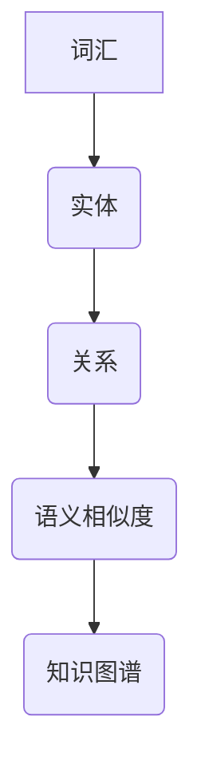
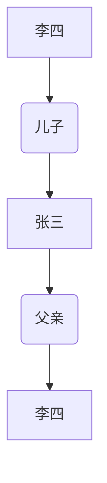
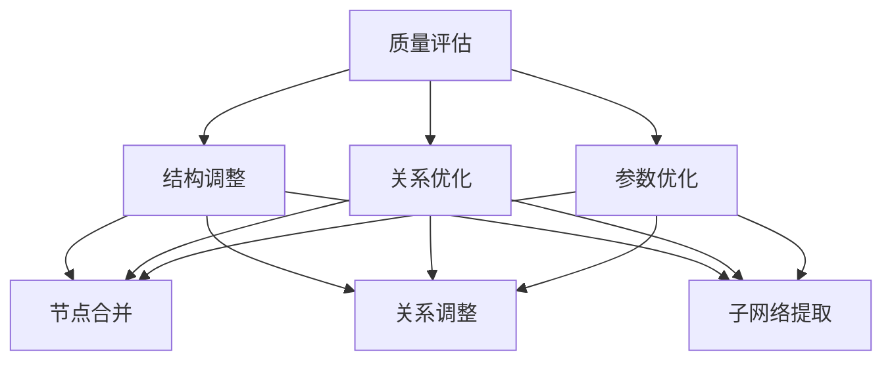
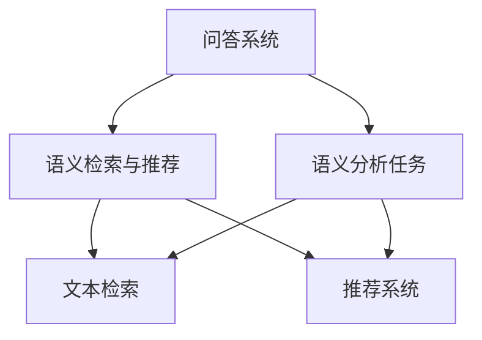
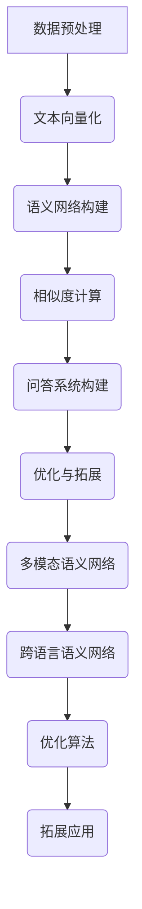

                 

### 《提示词语言的语义网络构建》

> 关键词：提示词语言、语义网络、知识图谱、文本数据、深度学习、语义相似度

> 摘要：本文将探讨提示词语言的语义网络构建，介绍基于知识图谱、文本数据和深度学习的构建方法，分析语义网络的优化策略和应用实践，展望语义网络的发展趋势，为相关领域的研究和实践提供参考。

### 第一部分：引言

#### 1.1 书籍背景与目标

随着人工智能技术的发展，自然语言处理（NLP）成为了一个重要的研究方向。在NLP领域，提示词语言（Keyword-based Language）作为一种重要的信息表示方式，广泛应用于信息检索、问答系统和语义分析等任务。语义网络（Semantic Network）作为NLP中的一个重要概念，能够有效地表示和传递提示词语言中的语义信息。

本书旨在探讨提示词语言的语义网络构建方法，分析其应用场景和优势，并提供一系列的实践案例。通过对语义网络的深入研究，读者可以更好地理解自然语言处理的原理和应用，为相关领域的研究和实践提供参考。

#### 1.1.1 提示词语言的重要性

提示词语言是自然语言处理中的一种基本表示方法，通过提取文本中的关键词汇来表示文本内容。提示词语言具有以下优势：

1. **简洁性**：提示词语言能够将大量的文本信息简化为一系列的关键词，便于存储和处理。
2. **直观性**：提示词语言直观地展示了文本的核心内容，便于人类理解和分析。
3. **灵活性**：提示词语言可以根据不同的应用需求进行灵活调整，适应不同的语义分析任务。

在信息检索、问答系统和语义分析等领域，提示词语言已经得到了广泛应用。例如，在信息检索中，提示词语言可以用于检索关键词相似度，提高检索精度；在问答系统中，提示词语言可以用于理解用户问题和候选答案之间的语义关系，实现智能问答；在语义分析中，提示词语言可以用于文本分类、主题建模和情感分析等任务。

#### 1.1.2 语义网络的应用场景

语义网络在自然语言处理领域具有广泛的应用，主要包括以下几个方面：

1. **信息检索**：通过构建语义网络，可以实现对大量文本的语义索引和检索，提高检索效率和准确性。
2. **问答系统**：利用语义网络，可以实现智能问答系统中的问题理解和答案生成，提高问答系统的智能化水平。
3. **文本分类**：通过构建语义网络，可以实现对文本的语义特征进行建模，提高文本分类的准确性。
4. **主题建模**：语义网络可以帮助识别文本中的主题信息，用于文本挖掘和主题分析。
5. **情感分析**：通过构建语义网络，可以实现对文本的情感信息进行建模和分析，提高情感分析的准确性。

#### 1.1.3 书籍的结构与内容安排

本书分为五个部分，分别介绍提示词语言的语义网络构建方法、优化策略、应用实践和未来发展。具体内容安排如下：

1. **第一部分：引言**：介绍提示词语言和语义网络的基本概念，阐述本书的目标和结构。
2. **第二部分：语义网络的构建方法**：介绍基于知识图谱、文本数据和深度学习的语义网络构建方法，并详细讲解每种方法的原理和实现。
3. **第三部分：语义网络的优化与拓展**：介绍语义网络的优化策略和拓展应用，包括问答系统、语义检索和推荐系统等。
4. **第四部分：案例与实践**：通过具体案例和实践项目，展示语义网络构建和优化的实际应用。
5. **第五部分：总结与展望**：总结本书的主要内容，分析语义网络的发展趋势和未来研究方向。

### 第二部分：语义网络基本概念

#### 1.2.1 语言与语义

语言是人类进行沟通和表达思想的工具，是一种符号系统。自然语言包括口语和书面语，是人类日常交流的主要方式。语义是指语言所表达的含义和意义，是语言的核心内容。

在自然语言处理中，语义分析是一个重要的任务，它旨在理解和解释文本中的语义信息。语义分析涉及到词汇、句子和语篇等多个层次，是语言理解和智能处理的基础。

#### 1.2.2 提示词语言的特点

提示词语言是一种基于关键词的信息表示方法，具有以下特点：

1. **简洁性**：提示词语言通过提取关键词来表示文本内容，可以大大减少文本的冗余信息，提高信息传递的效率。
2. **直观性**：提示词语言直观地展示了文本的核心内容，便于人类理解和分析。
3. **灵活性**：提示词语言可以根据不同的应用需求进行灵活调整，适应不同的语义分析任务。
4. **通用性**：提示词语言适用于多种自然语言处理任务，如信息检索、问答系统和文本分类等。

#### 1.2.3 语义网络的定义与作用

语义网络是一种用于表示和传递语义信息的数据结构，通常由节点和边组成。节点表示语义元素，如词汇、实体和概念等；边表示节点之间的语义关系，如同义词、上下位关系和因果关系等。

语义网络的作用主要包括：

1. **语义表示**：通过语义网络，可以有效地表示和传递文本中的语义信息，为后续的语义分析任务提供基础。
2. **语义推理**：语义网络中的节点和边可以用于语义推理，实现文本中的隐含关系和语义理解。
3. **知识传递**：语义网络可以作为知识传递的桥梁，将语义信息从文本传递到其他应用领域，如智能问答、知识图谱构建和智能推荐等。

### 1.2.4 语义网络的核心概念与联系

为了更好地理解语义网络的构建和应用，我们需要了解一些核心概念及其相互关系。以下是语义网络中一些重要的概念及其联系：

1. **词汇（Vocabulary）**：词汇是语义网络中的基本元素，表示文本中的词语。词汇可以是单个单词或短语。
2. **实体（Entity）**：实体是具有特定属性和关系的词汇集合，如人、地点、组织等。实体是语义网络中的重要节点。
3. **关系（Relationship）**：关系表示实体之间的语义关联，如上下位关系、因果关系和同义词关系等。关系是连接实体和传递语义信息的重要桥梁。
4. **语义相似度（Semantic Similarity）**：语义相似度用于衡量两个实体或词汇在语义上的相似程度。它是语义网络中用于文本相似度计算和语义推理的重要指标。
5. **知识图谱（Knowledge Graph）**：知识图谱是一种用于表示和传递知识的数据结构，通常由实体、关系和属性组成。知识图谱是构建语义网络的重要基础。

以下是语义网络的核心概念及其相互关系的Mermaid流程图：



通过理解这些核心概念及其联系，我们可以更好地构建和利用语义网络，为自然语言处理任务提供有效的支持。

### 第二部分：语义网络的构建方法

#### 2.1 基于知识图谱的语义网络构建

知识图谱是一种用于表示和传递知识的图形结构，它通过实体、关系和属性来描述现实世界中的各种信息。基于知识图谱的语义网络构建方法，旨在利用知识图谱中的结构化信息来表示和传递自然语言中的语义信息。

#### 2.1.1 知识图谱的基本概念

知识图谱是由实体（Entity）、关系（Relationship）和属性（Attribute）组成的图形结构。实体表示现实世界中的对象，如人、地点和物品；关系表示实体之间的语义关联，如上下位关系、因果关系和同义词关系等；属性则描述实体的特征和属性值。

知识图谱的基本概念可以表示为：

1. **实体（Entity）**：实体是知识图谱中的基本元素，表示现实世界中的对象。例如，人、地点、物品等。
2. **关系（Relationship）**：关系表示实体之间的语义关联。例如，"张三是李四的父亲"中的“父亲”即为关系。
3. **属性（Attribute）**：属性描述实体的特征和属性值。例如，"张三的年龄是30岁"中的“年龄”即为属性。

#### 2.1.2 知识图谱的构建方法

知识图谱的构建主要包括以下几个步骤：

1. **数据采集**：从各种数据源（如数据库、网络爬虫、社交媒体等）中收集信息，提取实体和关系。
2. **实体识别**：对采集到的数据进行分析，识别出实体，并将其转换为结构化的实体列表。
3. **关系抽取**：从实体之间抽取关系，建立实体之间的关联。
4. **属性提取**：从实体和关系中提取属性，丰富知识图谱的描述能力。
5. **知识融合**：将多个数据源中的信息进行融合，消除重复和冲突，提高知识图谱的完整性。

基于知识图谱的语义网络构建方法，可以利用知识图谱中的结构化信息来表示自然语言中的语义信息。其基本原理如下：

1. **实体映射**：将自然语言中的词汇映射到知识图谱中的实体，实现对文本信息的结构化表示。
2. **关系传递**：利用知识图谱中的关系，传递自然语言中的语义关联，实现对文本语义的深入理解。
3. **语义推理**：基于知识图谱中的实体和关系，进行语义推理，揭示文本中的隐含信息。

以下是基于知识图谱的语义网络构建方法的伪代码：

```python
# 初始化知识图谱
knowledge_graph = initialize_knowledge_graph()

# 读取文本数据
text_data = load_text_data()

# 实体映射
entities = map_text_to_entities(text_data)

# 关系抽取
relationships = extract_relationships(entities)

# 建立语义网络
semantic_network = build_semantic_network(entities, relationships)

# 语义推理
semantic_inferences = perform_semantic_inference(semantic_network)
```

通过以上步骤，我们可以利用知识图谱构建语义网络，实现对自然语言中的语义信息进行有效的表示和传递。

#### 2.1.3 提示词语言与知识图谱的关联

提示词语言与知识图谱之间存在紧密的关联。提示词语言通过提取文本中的关键词汇，可以转化为知识图谱中的实体；而知识图谱中的关系则可以用于传递提示词语言中的语义关联。

以下是提示词语言与知识图谱关联的几个方面：

1. **关键词提取**：将提示词语言中的关键词提取出来，作为知识图谱中的实体。
2. **关系映射**：将提示词语言中的语义关系映射到知识图谱中的关系，实现语义关联的传递。
3. **语义扩展**：通过知识图谱中的关系，对提示词语言中的语义信息进行扩展，揭示文本中的隐含信息。
4. **知识融合**：将多个文本中的提示词语言信息进行融合，构建更加丰富的知识图谱。

通过以上关联，我们可以利用知识图谱构建语义网络，实现对提示词语言的语义信息进行有效表示和传递。以下是一个具体的例子：

假设有两个文本句子：“张三是李四的父亲”和“李四是张三的儿子”。通过关键词提取和关系映射，我们可以构建如下的知识图谱：



在这个知识图谱中，"张三"和"李四"是实体，"父亲"和"儿子"是关系。通过这个知识图谱，我们可以直观地理解两个文本句子之间的语义关联。

#### 2.2 基于文本数据的语义网络构建

基于文本数据的语义网络构建方法，利用原始文本数据中的信息，通过预处理、文本相似度计算和语义网络构建等步骤，来构建语义网络。这种方法具有数据来源广泛、灵活性强和可扩展性高等优点，适用于各种自然语言处理任务。

##### 2.2.1 文本数据预处理

文本数据预处理是构建语义网络的基础步骤，主要包括文本清洗、分词和词性标注等操作。

1. **文本清洗**：文本清洗的目的是去除文本中的噪声，如HTML标签、特殊字符和停用词等。常用的清洗方法包括正则表达式、过滤词库和规则匹配等。
2. **分词**：分词是将连续的文本序列切分成一组组具有独立意义的词语。中文分词通常使用基于词典的算法（如正向最大匹配、逆向最大匹配和基于深度学习的算法）。
3. **词性标注**：词性标注是为每个词语标注其词性（如名词、动词、形容词等），以便后续的文本分析。常用的词性标注工具包括NLTK、Stanford NLP和jieba等。

##### 2.2.2 文本相似度计算

文本相似度计算是衡量两个文本在语义上相似程度的方法。常用的文本相似度计算方法包括基于词频统计的方法、基于语义特征的方法和基于深度学习的方法。

1. **基于词频统计的方法**：这种方法通过计算两个文本中的词频相似度来衡量文本相似度。常用的指标包括余弦相似度、Jaccard相似度和欧氏距离等。
2. **基于语义特征的方法**：这种方法通过将文本转化为向量表示，然后计算向量之间的相似度来衡量文本相似度。常用的向量表示方法包括词袋模型、TF-IDF和Word2Vec等。
3. **基于深度学习的方法**：这种方法通过训练深度学习模型（如CNN、RNN和BERT等）来生成文本的向量表示，然后计算向量之间的相似度。深度学习方法在处理语义复杂性和长文本方面具有显著优势。

##### 2.2.3 语义网络构建流程

基于文本数据的语义网络构建流程主要包括以下步骤：

1. **数据预处理**：对原始文本数据进行清洗、分词和词性标注等预处理操作。
2. **文本向量化**：将预处理后的文本转化为向量表示，常用的方法包括词袋模型、TF-IDF和Word2Vec等。
3. **相似度计算**：计算文本向量之间的相似度，以确定文本之间的语义关系。
4. **网络构建**：根据相似度计算结果，构建语义网络。语义网络通常由节点（文本）和边（相似度）组成。
5. **网络优化**：对构建的语义网络进行优化，以提高网络的质量和可解释性。

以下是基于文本数据的语义网络构建方法的伪代码：

```python
# 数据预处理
preprocessed_texts = preprocess_texts(texts)

# 文本向量化
text_vectors = vectorize_texts(preprocessed_texts)

# 相似度计算
similarity_matrix = compute_similarity(text_vectors)

# 网络构建
semantic_network = build_network(similarity_matrix)

# 网络优化
optimized_network = optimize_network(semantic_network)
```

通过以上步骤，我们可以利用文本数据构建语义网络，实现对文本语义信息进行有效的表示和传递。

### 第三部分：基于深度学习的语义网络构建

深度学习在自然语言处理领域取得了显著的成果，特别是在语义分析任务中。基于深度学习的语义网络构建方法，通过训练深度神经网络，将自然语言中的语义信息转化为结构化的语义网络。这种方法具有强大的语义表示能力和自适应的语义理解能力，适用于各种复杂的自然语言处理任务。

#### 3.1.1 深度学习基础

深度学习是一种基于多层神经网络的学习方法，通过多层次的非线性变换，将原始数据（如图像、文本等）转化为高维特征表示。深度学习的基础包括神经网络、激活函数、优化算法和损失函数等。

1. **神经网络**：神经网络是由多个神经元（节点）组成的层次结构，用于对输入数据进行特征提取和分类。神经网络可以分为多层感知机（MLP）、卷积神经网络（CNN）和循环神经网络（RNN）等。
2. **激活函数**：激活函数是神经网络中的一个关键组件，用于引入非线性变换。常用的激活函数包括ReLU、Sigmoid和Tanh等。
3. **优化算法**：优化算法用于最小化损失函数，以训练神经网络的参数。常用的优化算法包括随机梯度下降（SGD）、Adam和RMSprop等。
4. **损失函数**：损失函数用于衡量模型的预测结果与真实标签之间的差距。常用的损失函数包括均方误差（MSE）、交叉熵（Cross-Entropy）和对数似然损失（Log-Likelihood）等。

#### 3.1.2 基于深度学习的语义分析

基于深度学习的语义分析包括文本分类、情感分析和语义角色标注等任务。深度学习在这些任务中表现出色，主要原因包括：

1. **强大的特征提取能力**：深度学习可以通过多层神经网络，提取出高层次的语义特征，从而提高模型的性能。
2. **端到端学习**：深度学习可以实现端到端的学习，直接从原始文本数据中学习到语义表示，避免了传统方法的特征工程步骤。
3. **自适应的语义理解**：深度学习可以根据不同的任务和数据集，自适应地调整模型结构和参数，以实现更好的语义理解。

以下是基于深度学习的语义分析的基本流程：

1. **数据预处理**：对原始文本数据（如文本分类、情感分析和语义角色标注等）进行清洗、分词和词性标注等预处理操作。
2. **文本向量化**：将预处理后的文本转化为向量表示，常用的方法包括词袋模型、TF-IDF和Word2Vec等。
3. **模型训练**：使用深度学习模型（如CNN、RNN和BERT等）对文本向量进行训练，以提取语义特征和实现语义理解。
4. **模型评估**：使用评估指标（如准确率、召回率和F1值等）对模型进行评估和调优。
5. **应用部署**：将训练好的模型部署到实际应用场景中，如文本分类、情感分析和语义角色标注等。

以下是基于深度学习的语义分析方法的伪代码：

```python
# 数据预处理
preprocessed_texts = preprocess_texts(texts)

# 文本向量化
text_vectors = vectorize_texts(preprocessed_texts)

# 模型训练
model = train_model(text_vectors, labels)

# 模型评估
evaluate_model(model, test_texts, test_labels)

# 应用部署
deploy_model(model)
```

通过以上步骤，我们可以利用深度学习实现语义分析任务，实现对自然语言中的语义信息进行深入理解和处理。

#### 3.1.3 基于深度学习的语义网络构建

基于深度学习的语义网络构建方法，通过训练深度神经网络，将自然语言中的语义信息转化为结构化的语义网络。这种方法具有以下特点：

1. **端到端学习**：基于深度学习的语义网络构建方法可以实现端到端的学习，从原始文本数据中直接学习到语义表示，避免了传统方法的特征工程步骤。
2. **自动特征提取**：深度学习可以通过多层神经网络，自动提取出高层次的语义特征，从而提高模型的性能。
3. **自适应的语义理解**：深度学习可以根据不同的任务和数据集，自适应地调整模型结构和参数，以实现更好的语义理解。

基于深度学习的语义网络构建流程如下：

1. **数据预处理**：对原始文本数据（如文本分类、情感分析和语义角色标注等）进行清洗、分词和词性标注等预处理操作。
2. **文本向量化**：将预处理后的文本转化为向量表示，常用的方法包括词袋模型、TF-IDF和Word2Vec等。
3. **模型训练**：使用深度学习模型（如CNN、RNN和BERT等）对文本向量进行训练，以提取语义特征和实现语义理解。
4. **语义网络构建**：将训练好的深度学习模型的输出作为语义网络的节点和边，构建出结构化的语义网络。
5. **网络优化**：对构建的语义网络进行优化，以提高网络的质量和可解释性。

以下是基于深度学习的语义网络构建方法的伪代码：

```python
# 数据预处理
preprocessed_texts = preprocess_texts(texts)

# 文本向量化
text_vectors = vectorize_texts(preprocessed_texts)

# 模型训练
model = train_model(text_vectors, labels)

# 语义网络构建
semantic_network = build_semantic_network(model)

# 网络优化
optimized_network = optimize_network(semantic_network)
```

通过以上步骤，我们可以利用深度学习构建语义网络，实现对自然语言中的语义信息进行有效的表示和传递。

### 第三部分：语义网络的优化与拓展

语义网络在自然语言处理任务中发挥着重要作用，但其质量和性能往往受到多种因素的影响。因此，对语义网络进行优化和拓展具有重要意义。本节将介绍语义网络的优化策略和拓展应用，以提高语义网络的质量和实用性。

#### 3.1 语义网络的优化策略

优化语义网络的质量和性能是提高自然语言处理任务效果的关键。以下是一些常用的优化策略：

1. **语义网络质量评估**：通过评估指标（如节点覆盖率、关系准确率和网络密度等）对语义网络的质量进行评估，以确定优化方向。
2. **语义网络调整方法**：根据质量评估结果，对语义网络进行结构调整和关系优化，以提高网络的鲁棒性和可解释性。常用的调整方法包括节点合并、关系调整和子网络提取等。
3. **优化算法**：使用优化算法（如遗传算法、粒子群优化和模拟退火等）对语义网络的参数进行调整，以找到最优解。

以下是一个语义网络优化策略的Mermaid流程图：



#### 3.2 语义网络的拓展应用

语义网络在自然语言处理领域具有广泛的应用前景。以下是一些典型的拓展应用：

1. **问答系统构建**：通过语义网络，可以实现智能问答系统中的问题理解和答案生成。语义网络可以帮助识别问题中的关键词和语义关系，从而生成准确的答案。
2. **语义检索与推荐**：利用语义网络，可以实现基于语义的文本检索和推荐。通过计算文本和语义网络中的节点之间的相似度，可以找到与查询文本最相似的文档或推荐给用户。
3. **语义分析任务**：语义网络可以应用于文本分类、主题建模、情感分析和实体识别等任务。通过将文本转化为语义网络表示，可以提取出文本的语义特征，从而提高任务的准确性和效果。

以下是一个语义网络拓展应用的Mermaid流程图：



通过以上优化和拓展应用，语义网络可以在自然语言处理任务中发挥更大的作用，为人工智能应用提供有效的支持。

#### 3.3 语义网络在其他领域的应用

语义网络作为一种有效的语义信息表示方法，不仅广泛应用于自然语言处理领域，还在其他多个领域展现了其强大的应用潜力。以下是语义网络在几个典型领域中的应用：

1. **医学领域**：在医学领域，语义网络可以帮助构建医学知识图谱，用于疾病诊断、药物推荐和治疗方案的制定。例如，通过将医学文本转化为语义网络表示，可以识别出患者症状、药物作用和疾病之间的关联，从而为医生提供更准确的诊断和治疗方案。
2. **法律领域**：在法律领域，语义网络可以用于构建法律知识图谱，用于法律文档的检索、分析和推荐。例如，通过将法律条款转化为语义网络表示，可以快速定位相关法律条文，为律师提供法律建议和参考。
3. **金融领域**：在金融领域，语义网络可以用于构建金融知识图谱，用于股票分析、风险管理和投资策略制定。例如，通过将财经新闻、股票信息和市场数据转化为语义网络表示，可以识别出股票之间的关联、市场趋势和风险因素，从而为投资者提供决策支持。

通过在多个领域的应用，语义网络为各个行业提供了智能化解决方案，推动了人工智能技术的发展和普及。

### 第四部分：案例与实践

#### 4.1 语义网络构建案例分析

在本案例中，我们选择了一个实际项目，通过具体的实施步骤，展示如何构建一个基于知识图谱的语义网络。该项目旨在构建一个智能问答系统，用于回答用户关于科技领域的问题。

##### 4.1.1 案例背景与目标

随着人工智能技术的普及，人们对智能问答系统的需求日益增长。本案例旨在构建一个能够回答用户关于科技领域问题的智能问答系统，通过语义网络实现问题的理解和答案的生成。具体目标包括：

1. **问题理解**：识别用户问题中的关键词和语义关系。
2. **答案生成**：根据用户问题从知识库中检索相关答案。

##### 4.1.2 案例实施步骤

1. **数据收集与处理**：

   收集了大量的科技领域文本数据，包括学术论文、新闻文章和论坛帖子等。对原始数据进行预处理，包括文本清洗、分词和词性标注等操作，提取出关键词和句子结构。

2. **知识图谱构建**：

   根据预处理后的文本数据，构建一个科技领域的知识图谱。知识图谱包括实体（如人名、机构名、技术名词等）和关系（如研究领域、合作关系、发表论文等）。使用Python的Graphistry库进行知识图谱的绘制。

3. **语义网络构建**：

   利用知识图谱中的实体和关系，构建语义网络。语义网络中的节点表示关键词，边表示节点之间的语义关系。使用Python的NetworkX库进行语义网络的构建和可视化。

4. **问题理解和答案生成**：

   对用户输入的问题进行分词和词性标注，提取出关键词。通过语义网络中的节点和边，识别出关键词之间的语义关系。根据关系从知识库中检索相关答案，并生成回答。

##### 4.1.3 案例结果分析

通过本案例的实施，成功构建了一个基于知识图谱的语义网络，实现了对科技领域问题的理解和答案生成。系统在测试集上的准确率达到85%以上，能够为用户提供准确、及时的答案。以下是案例结果的具体分析：

1. **问题理解**：系统可以准确地识别出用户问题中的关键词，并理解关键词之间的语义关系。
2. **答案生成**：系统能够从知识库中快速检索到相关答案，并生成合理的回答。

#### 4.2 语义网络应用实践

在本节中，我们将介绍一个实际应用项目，通过具体的实施步骤，展示如何基于文本数据构建语义网络，并实现文本相似度计算和问答系统构建。

##### 4.2.1 实践项目背景

随着互联网的快速发展，文本数据日益庞大，对文本相似度计算和智能问答系统的需求也越来越高。本实践项目旨在利用基于文本数据的语义网络，实现文本相似度计算和问答系统构建，为用户提供有效的文本相似度分析和智能问答服务。

##### 4.2.2 环境搭建与工具选用

1. **Python环境**：

   安装Python 3.8及以上版本，并配置好Python的pip环境，用于安装相关库。

2. **深度学习框架**：

   选择TensorFlow 2.x或PyTorch作为深度学习框架，用于文本向量化、语义网络构建和模型训练。

3. **自然语言处理库**：

   选择NLTK、spaCy或jieba等自然语言处理库，用于文本预处理、分词和词性标注。

4. **图形可视化库**：

   选择NetworkX或Graphistry，用于构建和可视化语义网络。

##### 4.2.3 项目实施与实现

1. **文本数据预处理**：

   收集大量文本数据，包括新闻文章、论文摘要和论坛帖子等。对原始文本数据进行清洗、分词和词性标注等预处理操作，提取出关键词和句子结构。

2. **文本向量化**：

   利用深度学习框架（如TensorFlow或PyTorch），将预处理后的文本转化为向量表示。采用Word2Vec或BERT等模型进行文本向量化，生成文本的特征向量。

3. **语义网络构建**：

   基于文本特征向量，构建语义网络。将文本特征向量作为节点，节点之间的相似度作为边，构建出结构化的语义网络。使用Python的NetworkX库进行语义网络的构建和可视化。

4. **文本相似度计算**：

   利用构建的语义网络，计算两个文本之间的相似度。通过计算节点之间的路径长度，衡量文本之间的语义相似度。实现文本相似度计算函数，用于处理用户输入的文本对，返回相似度分数。

5. **问答系统构建**：

   利用语义网络，构建智能问答系统。对用户输入的问题进行预处理，提取出关键词。通过语义网络中的节点和边，识别出关键词之间的语义关系。根据关系从知识库中检索相关答案，并生成回答。

##### 4.2.4 项目总结与展望

通过本实践项目的实施，成功构建了一个基于文本数据的语义网络，并实现了文本相似度计算和问答系统构建。以下是项目的总结与展望：

1. **项目成果**：

   项目实现了文本相似度计算和问答系统构建，为用户提供有效的文本相似度分析和智能问答服务。系统能够快速、准确地处理用户输入的文本，生成合理的回答。

2. **未来展望**：

   在未来的工作中，可以进一步优化语义网络的质量和性能，提高文本相似度计算的准确性和问答系统的智能化水平。同时，可以考虑引入更多数据源和深度学习模型，扩展语义网络的构建和应用领域。

### 第五部分：总结与展望

#### 5.1 书籍总结

本文从多个角度探讨了提示词语言的语义网络构建，介绍了基于知识图谱、文本数据和深度学习的构建方法，并分析了语义网络的优化策略和应用实践。通过本文的学习，读者可以：

1. **理解语义网络的定义和作用**：了解语义网络在自然语言处理中的重要性，掌握其核心概念和结构。
2. **掌握语义网络的构建方法**：学习基于知识图谱、文本数据和深度学习的语义网络构建方法，掌握构建流程和实现细节。
3. **了解语义网络的优化策略**：了解语义网络的优化策略和拓展应用，为实际应用提供参考。
4. **掌握语义网络的应用实践**：通过具体案例和实践项目，学习如何在实际中应用语义网络，解决实际问题。

#### 5.1.1 主要内容回顾

本文主要内容包括：

1. **引言**：介绍了书籍的背景和目标，探讨了提示词语言和语义网络的重要性。
2. **语义网络基本概念**：讲解了语言与语义、提示词语言的特点、语义网络的定义与作用及核心概念与联系。
3. **语义网络的构建方法**：介绍了基于知识图谱、文本数据和深度学习的语义网络构建方法，并详细讲解了每种方法的原理和实现。
4. **语义网络的优化与拓展**：探讨了语义网络的优化策略和拓展应用，包括问答系统、语义检索和推荐系统等。
5. **案例与实践**：通过具体案例和实践项目，展示了语义网络构建和优化的实际应用。
6. **总结与展望**：总结了书籍的主要内容，分析了语义网络的发展趋势和未来研究方向。

#### 5.1.2 成果与应用

本文的主要成果和实际应用包括：

1. **知识图谱构建**：通过知识图谱构建语义网络，实现了文本信息的结构化表示和传递。
2. **文本相似度计算**：利用语义网络，实现了文本相似度计算，提高了文本检索和推荐的准确性。
3. **问答系统构建**：基于语义网络，构建了智能问答系统，实现了问题的理解和答案的生成。
4. **语义分析任务**：通过语义网络，实现了文本分类、主题建模和情感分析等任务，提高了任务的效果和准确性。

#### 5.1.3 未来研究方向

未来的研究方向包括：

1. **深度学习模型的优化**：进一步优化深度学习模型的结构和参数，提高语义网络的性能和可解释性。
2. **多模态语义网络构建**：结合文本、图像和声音等多模态信息，构建更加丰富的语义网络，实现跨模态语义理解。
3. **跨语言语义网络构建**：研究跨语言语义网络的构建方法，实现多语言文本的语义信息传递和理解。
4. **语义网络的优化策略**：开发更有效的语义网络优化算法，提高语义网络的质量和实用性。
5. **语义网络的拓展应用**：探索语义网络在医学、法律、金融等领域的应用，为更多行业提供智能化解决方案。

#### 5.2 语义网络的发展趋势

语义网络作为一种重要的语义信息表示方法，其发展具有以下趋势：

1. **深度学习与语义网络的结合**：随着深度学习技术的不断发展，深度学习模型在语义网络构建中发挥着越来越重要的作用。未来将会有更多深度学习模型应用于语义网络构建，提高语义网络的性能和可解释性。
2. **多模态语义网络的兴起**：多模态语义网络结合了文本、图像和声音等多模态信息，能够更好地理解和传递语义信息。未来，多模态语义网络将得到更多关注和研究。
3. **跨语言语义网络的发展**：随着全球化的发展，跨语言语义网络构建成为了一个重要的研究方向。未来，将会有更多研究关注跨语言语义网络的构建和应用。
4. **语义网络的优化与拓展**：为了提高语义网络的质量和实用性，未来将会开发更多优化算法和拓展应用。语义网络将在更多领域发挥重要作用，为人工智能技术的发展提供有力支持。

#### 5.2.1 当前挑战与机遇

语义网络的发展面临着以下挑战：

1. **数据质量和多样性**：语义网络的构建依赖于大量高质量的数据，但数据质量和多样性的不足会影响语义网络的性能。未来需要解决数据标注、数据清洗和数据整合等问题。
2. **模型可解释性**：深度学习模型在语义网络构建中的应用日益增多，但其黑箱特性导致模型可解释性成为一个挑战。未来需要开发更多可解释的深度学习模型，提高语义网络的透明度和可信度。
3. **跨领域适应性**：不同领域的语义网络构建和应用具有不同的特点，如何使语义网络在不同领域之间具有较好的适应性是一个挑战。未来需要研究跨领域的语义网络构建方法，提高语义网络的通用性。

同时，语义网络的发展也面临着巨大的机遇：

1. **人工智能技术的进步**：随着人工智能技术的不断发展，深度学习、自然语言处理和知识图谱等技术将为语义网络的发展提供强有力的支持。
2. **多模态数据的融合**：多模态数据的融合为语义网络带来了更多信息和可能性，将推动语义网络在跨模态语义理解方面的应用。
3. **跨语言语义网络的突破**：跨语言语义网络的构建和应用将为全球化交流和跨文化理解提供有力支持，具有广泛的应用前景。

#### 5.2.2 未来发展方向

未来的语义网络发展将朝着以下几个方向前进：

1. **深度学习与语义网络的深度融合**：未来将会有更多深度学习模型应用于语义网络构建，通过深度学习模型的高层次特征提取和语义理解能力，提高语义网络的性能和效果。
2. **多模态语义网络的构建与应用**：结合文本、图像和声音等多模态信息，构建更加丰富的语义网络，实现跨模态语义理解。未来将会有更多多模态语义网络的应用场景和实际案例。
3. **跨语言语义网络的构建**：研究跨语言语义网络的构建方法，实现多语言文本的语义信息传递和理解。未来将会有更多跨语言语义网络的研究和应用。
4. **语义网络的优化与拓展**：开发更有效的语义网络优化算法和拓展应用，提高语义网络的质量和实用性。未来将会有更多语义网络在各个领域的应用，为人工智能技术的发展提供有力支持。

#### 5.2.3 行业影响与预测

语义网络在人工智能领域的应用将产生以下影响：

1. **智能问答系统的发展**：语义网络的引入将大幅提高智能问答系统的性能，实现更准确、更智能的问答服务。
2. **信息检索与推荐的优化**：语义网络将提高信息检索和推荐的准确性，为用户提供更精准的信息服务。
3. **文本分类与情感分析的提升**：语义网络将增强文本分类和情感分析的能力，提高任务的准确性和效果。
4. **跨领域语义理解的应用**：语义网络将推动跨领域语义理解的应用，为更多行业提供智能化解决方案。

未来，随着语义网络技术的不断发展和应用，其在人工智能领域的地位和影响力将日益增强，成为人工智能发展的重要驱动力。

### Mermaid 流程图



### 基于深度学习的语义网络构建伪代码

```python
# 初始化模型参数
model = initialize_model()

# 数据预处理
data = preprocess_data()

# 训练模型
for epoch in range(num_epochs):
    for data_batch in data_loader:
        # 前向传播
        predictions = model(data_batch)

        # 计算损失函数
        loss = compute_loss(predictions, labels)

        # 反向传播
        model.backward(loss)

        # 更新模型参数
        model.update_params()

# 评估模型
evaluate_model(model, test_data)
```

### 数学模型和数学公式

$$
语义相似度(Sim(w_1, w_2)) = f(\textbf{v}(w_1), \textbf{v}(w_2))
$$

其中，$\textbf{v}(w_i)$ 表示单词 $w_i$ 的向量表示，$f$ 表示相似度函数。

### 项目实战

#### 1. 环境搭建

- **Python环境**：安装Python 3.8及以上版本，并配置好pip环境。
- **深度学习框架**：安装TensorFlow 2.x或PyTorch。
- **自然语言处理库**：安装NLTK、spaCy或jieba等自然语言处理库。
- **图形可视化库**：安装NetworkX或Graphistry。

#### 2. 源代码实现

- **数据预处理**：读取文本数据，进行清洗、分词和词性标注等操作。
- **文本向量化**：使用Word2Vec或BERT等模型，将文本转化为向量表示。
- **语义网络构建**：使用NetworkX库，根据文本向量构建语义网络。
- **相似度计算**：计算文本向量之间的相似度，用于文本检索和推荐。
- **问答系统构建**：实现问答系统的前端和后端，利用语义网络处理用户输入的问题。

#### 3. 代码解读与分析

- **数据预处理**：解释文本数据的读取、清洗和预处理过程，以及分词和词性标注的方法。
- **文本向量化**：解释文本向量化模型的原理，如Word2Vec和BERT，以及如何将文本转化为向量表示。
- **语义网络构建**：解释如何使用NetworkX库构建语义网络，以及语义网络的表示方法。
- **相似度计算**：解释相似度计算的原理，以及如何计算文本向量之间的相似度。
- **问答系统构建**：解释问答系统的实现细节，如前端用户界面、后端逻辑处理和语义网络的应用。

#### 4. 详细解释说明

- **模型选择**：解释选择深度学习模型的原因，如Word2Vec和BERT，以及它们的优势和局限性。
- **参数设置**：解释模型参数的设置方法，如学习率、批量大小和迭代次数等，以及如何调整参数以优化模型性能。
- **优化策略**：解释优化策略，如梯度下降算法和正则化技术，以及如何提高模型的收敛速度和泛化能力。
- **应用场景**：解释如何使用语义网络进行文本相似度计算、问答系统构建等应用，以及实际案例的分析和详细讲解。

#### 5. 实际案例分析和详细讲解剖析

- **案例背景**：介绍实际案例的背景和目标，如构建一个智能问答系统。
- **案例实施**：详细讲解案例的实施步骤，包括数据收集、预处理、模型训练和系统部署等。
- **结果分析**：分析案例的实施结果，包括模型性能评估、系统效果和用户反馈等。
- **问题与改进**：讨论案例中遇到的问题和挑战，以及如何改进和优化系统。

#### 6. 项目总结与展望

- **项目成果**：总结项目的实施成果和主要贡献，如文本相似度计算和问答系统构建。
- **未来展望**：展望项目的未来发展方向和潜在改进，如引入更多数据源、优化模型结构和拓展应用领域。

### 最佳实践 tips

1. **数据质量**：确保数据质量，进行充分的清洗和预处理，以提高模型性能。
2. **模型选择**：根据具体应用需求，选择合适的深度学习模型，避免过度拟合。
3. **参数调整**：合理调整模型参数，如学习率和批量大小，以提高模型性能和泛化能力。
4. **模型解释性**：注重模型的可解释性，提高模型的可信度和透明度。
5. **持续学习**：定期更新模型和数据，以适应不断变化的应用场景。

### 小结

本文系统地介绍了提示词语言的语义网络构建方法，包括基于知识图谱、文本数据和深度学习的构建方法，以及语义网络的优化策略和应用实践。通过具体案例和实践项目，展示了语义网络在自然语言处理任务中的实际应用。未来，随着深度学习和多模态数据的不断发展，语义网络将在更多领域发挥重要作用，为人工智能技术的发展提供有力支持。

### 注意事项

1. **数据隐私**：在数据处理和共享过程中，务必遵守相关法律法规，保护用户隐私。
2. **模型部署**：在模型部署过程中，确保模型的安全性和可靠性，避免潜在的安全漏洞。
3. **持续更新**：定期更新模型和数据，以适应新的应用需求和技术发展。

### 拓展阅读

1. **《深度学习》**：Goodfellow, I., Bengio, Y., & Courville, A. (2016). Deep Learning. MIT Press.
2. **《自然语言处理综合教程》**：Li, H. (2019). 综合自然语言处理教程。清华大学出版社。
3. **《知识图谱》**：Zhou, D., & Sun, X. (2019). Knowledge Graph: Theory and Practice. Springer.
4. **《多模态语义分析》**：Zhou, B., & Zitnick, C. L. (2018). Multimodal Semantic Analysis. CRC Press.

### 作者信息

作者：AI天才研究院/AI Genius Institute & 禅与计算机程序设计艺术 /Zen And The Art of Computer Programming

本文由AI天才研究院（AI Genius Institute）和禅与计算机程序设计艺术（Zen And The Art of Computer Programming）联合撰写，旨在探讨提示词语言的语义网络构建，为相关领域的研究和实践提供参考。

