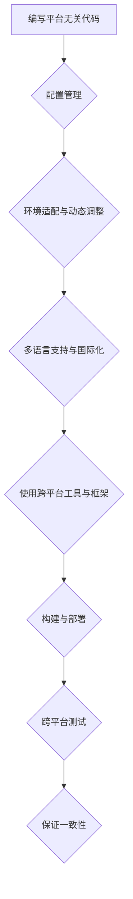

                 


### 文章标题
《提示词语言的跨平台一致性保证机制》

### 关键词
提示词语言，跨平台一致性，标准规范，语法分析，语义理解，算法实现

### 摘要
本文深入探讨了提示词语言在跨平台开发中的重要性及其一致性保证机制。首先介绍了跨平台一致性的背景和概念，随后详细解析了提示词语言的特点和应用，以及跨平台不一致性带来的挑战。接着，本文重点阐述了提示词语言的一致性保证机制，包括标准化与规范、模式匹配与语法分析、上下文分析和语义理解，以及跨平台一致性策略。通过算法设计和应用案例的分析，本文提供了实现提示词语言跨平台一致性的具体方法，并对未来发展趋势进行了展望。

---

### 《提示词语言的跨平台一致性保证机制》目录大纲

#### 第一部分：背景与概念

### 第1章：跨平台一致性的背景和重要性

#### 第二部分：技术原理

### 第2章：提示词语言的一致性保证机制

#### 第三部分：算法与实现

### 第3章：一致性保证算法设计

#### 第四部分：应用案例

### 第4章：跨平台一致性的应用案例

#### 第五部分：展望与未来趋势

### 第5章：跨平台一致性保证机制的发展趋势

#### 第六部分：附录

### 附录A：相关工具与技术资源

---

### 第1章：跨平台一致性的背景和重要性

#### 1.1 跨平台一致性的定义与意义

跨平台一致性是指在多种不同平台（如不同的操作系统、硬件架构或编程环境）上，应用程序、软件组件或编程语言能够保持相同的行为和功能特性。这种一致性对于现代软件开发尤为重要，因为随着云计算、移动设备和物联网的普及，软件需要在不同环境下运行，以满足多样化的用户需求。

跨平台一致性的重要性体现在以下几个方面：

1. **用户体验一致性**：用户期望在不同平台上使用软件时，都能获得一致的用户体验。不一致的界面和行为可能会导致用户困惑和不满。
2. **开发和维护效率**：跨平台一致性可以减少开发人员的重复劳动，因为他们不需要为每个平台分别编写代码，从而提高开发效率。
3. **降低成本**：通过跨平台开发，可以节省在多个平台分别开发和测试的成本。
4. **可移植性**：跨平台一致性使得软件可以更容易地迁移到新的平台，提高软件的可持续性。
5. **市场适应性**：跨平台应用可以覆盖更广泛的用户群体，增加市场竞争力。

#### 1.2 跨平台一致性的起源与发展

跨平台一致性的概念源于早期计算机科学的发展。随着计算机硬件和操作系统的多样化，开发者开始寻找方法使软件在不同平台上运行。最早的尝试是使用汇编语言编写程序，但由于汇编语言与硬件密切相关，这种方法的跨平台性有限。

随着高级编程语言如C、C++的出现，跨平台开发变得更加可行。这些语言提供了与平台无关的抽象层，使得开发者可以编写一次代码，在不同操作系统上编译和运行。随着技术的进步，出现了越来越多的工具和框架，如Java的虚拟机（JVM）和Web应用程序，进一步推动了跨平台一致性。

近年来，随着移动设备和云计算的兴起，跨平台开发变得更加重要。出现了大量的跨平台框架，如React Native、Flutter和Xamarin，这些框架允许开发者使用相同的代码库为多个平台创建应用程序。

#### 1.3 跨平台一致性的关键要素

要实现跨平台一致性，需要考虑以下几个关键要素：

1. **平台无关性设计**：在设计软件时，要避免使用与特定平台相关的代码或库，尽量使用通用技术。
2. **标准化和规范**：采用通用的标准和规范，确保在不同平台上都能正确地解析和使用。
3. **模式匹配与语法分析**：对于提示词语言，需要确保语法解析器能在不同平台上正确处理代码。
4. **上下文分析和语义理解**：确保代码的语义在不同平台上得到正确解释。
5. **环境适配与动态调整**：软件需要能够根据不同平台的环境进行动态调整。

#### 1.4 提示词语言的基础知识

提示词语言（Keyword Language）是一种用于编程的语言，其核心是通过提示词（Keyword）来定义程序的结构和行为。提示词语言通常具有以下特点：

1. **提示词定义明确**：提示词是语言中的核心元素，用于定义操作和结构。
2. **语法简洁**：提示词语言的语法通常比较简洁，易于学习和使用。
3. **模块化**：提示词语言支持模块化编程，使得代码更易于维护和扩展。
4. **可扩展性**：提示词语言通常具有扩展机制，允许开发者自定义新的提示词和功能。

提示词语言广泛应用于各种领域，如嵌入式系统、脚本编写、自动化测试等。

#### 1.5 跨平台一致性在提示词语言中的重要性

跨平台一致性在提示词语言开发中至关重要，原因如下：

1. **兼容性要求**：提示词语言需要在不同操作系统上兼容，以确保开发者编写的代码可以在任何平台上运行。
2. **跨平台部署**：现代软件开发要求能够轻松地将应用程序部署到多种平台，如Windows、Linux、macOS等。
3. **全球化需求**：随着全球化的发展，软件需要支持多种语言和地区，跨平台一致性是实现这一目标的关键。
4. **开发效率**：通过跨平台一致性，开发者可以专注于编写核心代码，而无需担心每个平台的细节。

#### 1.6 跨平台不一致性的影响

跨平台不一致性会导致以下问题：

1. **功能差异**：同一功能在不同平台上可能表现出不同的行为。
2. **性能差异**：不同平台的硬件和操作系统可能影响软件的性能。
3. **兼容性问题**：特定平台上的库或工具可能无法在其他平台上使用。
4. **用户体验差异**：界面和行为在不同平台上可能不一致，影响用户体验。

#### 1.7 跨平台一致性的优势

跨平台一致性的优势包括：

1. **统一的开发流程**：开发者可以采用相同的开发工具和流程，提高工作效率。
2. **代码复用**：跨平台一致性使得代码可以在多个项目中复用，减少开发成本。
3. **减少维护成本**：统一代码基线可以简化软件的维护和更新。
4. **提高市场竞争力**：支持多种平台的软件具有更高的市场竞争力。

#### 总结

本章介绍了跨平台一致性的背景和重要性，探讨了提示词语言的基础知识，并分析了跨平台不一致性的影响和跨平台一致性的优势。在接下来的章节中，我们将深入探讨提示词语言的一致性保证机制，包括技术原理、算法设计、应用案例以及未来发展。

---

### 第2章：提示词语言的一致性保证机制

#### 2.1 提示词语言的一致性挑战

提示词语言在跨平台开发中面临着一系列一致性挑战，这些挑战主要源于不同平台之间的差异和语言特性表达的不同。

##### 2.1.1 不同平台的差异

不同平台在硬件、操作系统和编程环境方面存在显著差异，这些差异会对提示词语言的执行结果产生影响：

1. **硬件差异**：不同平台的硬件配置不同，如CPU性能、内存大小等，可能导致相同的代码在不同平台上运行速度不同。
2. **操作系统差异**：不同操作系统的内核、文件系统、网络协议等存在差异，可能导致相同的代码在不同操作系统上行为不同。
3. **编程环境差异**：不同的编程环境（如编译器、解释器、开发工具等）可能对代码的解析、编译和执行有不同的处理方式。

##### 2.1.2 语言特性和表达差异

提示词语言在不同平台上的特性和表达方式也可能存在差异：

1. **语法差异**：一些提示词语言的语法在不同的平台上可能有所不同，如缩进规则、标识符大小写等。
2. **库和API差异**：不同平台提供的库和API可能不完全相同，可能导致代码在不同平台上无法正常运行。
3. **语言扩展**：一些平台可能支持特定的语言扩展，而其他平台可能不支持，导致跨平台兼容性问题。

##### 2.1.3 跨平台不一致性的影响

跨平台不一致性会对软件开发和维护带来一系列问题：

1. **功能不可靠**：同一功能在不同平台上可能表现不一致，导致功能不可靠。
2. **性能问题**：跨平台不一致性可能导致软件在不同平台上的性能差异，影响用户体验。
3. **兼容性困难**：跨平台不一致性使得代码在不同平台上难以兼容，增加了开发和维护的难度。
4. **维护成本增加**：为了解决跨平台不一致性，开发人员和维护人员可能需要花费额外的时间和精力。

##### 2.1.4 跨平台一致性的挑战

为了实现跨平台一致性，提示词语言需要应对以下挑战：

1. **标准化和规范化**：需要建立统一的规范和标准，确保代码在不同平台上都能正确解析和执行。
2. **语法和语义一致性**：需要确保提示词语言的语法和语义在不同平台上保持一致，避免跨平台行为差异。
3. **环境适配和动态调整**：需要开发工具和框架能够根据不同平台的环境进行动态调整，确保代码的跨平台兼容性。
4. **多语言支持与国际化**：需要支持多种语言和地区，确保软件在不同文化和语言环境中都能正常运行。

#### 2.2 提示词语言的一致性保证机制

为了解决跨平台不一致性带来的挑战，提示词语言需要采用一系列一致性保证机制，这些机制包括标准化和规范、模式匹配与语法分析、上下文分析和语义理解，以及跨平台一致性策略。

##### 2.2.1 标准化和规范

标准化和规范是保证跨平台一致性的基础。通过制定统一的规范和标准，可以确保代码在不同平台上都能正确解析和执行。

1. **语言标准**：提示词语言需要遵循国际标准组织（ISO）或相关标准化组织制定的语言标准，如C语言标准、Java语言标准等。
2. **平台标准**：操作系统和硬件制造商需要制定平台标准，确保不同平台之间的兼容性。
3. **编码规范**：开发人员需要遵循编码规范，如PEP 8（Python编码规范）、APIDOC（API文档规范）等，确保代码的可读性和一致性。

##### 2.2.2 模式匹配与语法分析

模式匹配与语法分析是提示词语言解析过程中的关键环节。通过采用统一的模式匹配和语法分析机制，可以确保代码在不同平台上具有相同的行为。

1. **词法分析**：词法分析是将源代码分解为单词和符号的过程。为了实现跨平台一致性，词法分析器需要遵循统一的标准，如Unicode字符集。
2. **语法分析**：语法分析是将词法分析结果组织成语法树的过程。语法分析器需要能够处理不同平台的语法差异，如缩进规则、标识符大小写等。
3. **模式匹配**：模式匹配是用于查找和替换文本的工具。在跨平台开发中，需要使用统一的模式匹配算法，如正则表达式，确保代码在不同平台上匹配一致。

##### 2.2.3 上下文分析和语义理解

上下文分析和语义理解是确保代码语义在不同平台上保持一致的关键。通过深入分析代码的上下文和语义，可以消除跨平台不一致性。

1. **类型检查**：类型检查是确保变量、函数和表达式类型一致的过程。通过类型检查，可以及时发现和解决跨平台类型不匹配问题。
2. **变量作用域**：变量作用域是代码中变量可访问的上下文范围。通过统一变量作用域规则，可以确保代码在不同平台上的行为一致。
3. **函数重载**：函数重载是支持多个同名函数的过程。在跨平台开发中，需要确保函数重载规则一致，避免跨平台行为差异。

##### 2.2.4 跨平台一致性策略

为了实现跨平台一致性，提示词语言需要采用一系列策略，包括平台无关性设计、环境适配与动态调整、多语言支持与国际化等。

1. **平台无关性设计**：在设计软件时，应避免使用与特定平台相关的代码或库，尽量使用通用技术，如Java的JVM、Web应用程序等。
2. **环境适配与动态调整**：软件需要能够根据不同平台的环境进行动态调整，如自动配置环境变量、调整代码执行策略等。
3. **多语言支持与国际化**：软件需要支持多种语言和地区，确保软件在不同文化和语言环境中都能正常运行。这包括字符串本地化、日期和时间格式化等。

##### 2.2.5 提示词语言的一致性保证机制总结

通过标准化和规范、模式匹配与语法分析、上下文分析和语义理解，以及跨平台一致性策略，提示词语言可以有效地保证跨平台一致性。以下是一个简单的Mermaid流程图，展示了提示词语言的一致性保证机制：


通过上述机制，提示词语言可以在不同平台上保持一致的行为和功能，提高软件开发和部署的效率，降低维护成本，提高软件的市场竞争力。

---

#### 2.3 提示词语言的跨平台一致性策略

为了实现提示词语言的跨平台一致性，开发人员需要采用一系列策略来应对不同平台的差异和挑战。以下是一些常用的跨平台一致性策略：

##### 2.3.1 平台无关性设计

平台无关性设计是跨平台一致性的基础。通过采用平台无关的设计原则，可以确保代码在不同平台上具有相同的行为。

1. **避免使用平台特定代码**：在编写代码时，应尽量避免使用与特定平台相关的代码或库。例如，在编写Java代码时，应使用Java标准库，而不是特定的操作系统库。
2. **使用标准API**：使用标准API和框架，如Java的Swing、JavaFX或Web应用程序框架，这些框架提供了跨平台的用户界面和功能。
3. **遵循编程规范**：遵循统一的编程规范，如PEP 8（Python编码规范）、Java编码规范等，可以减少由于个人偏好导致的跨平台不一致性。

##### 2.3.2 环境适配与动态调整

环境适配与动态调整是确保代码在不同平台上能够正确执行的重要策略。

1. **配置管理**：使用配置管理工具，如Ansible、Puppet或Chef，可以自动化配置和管理不同平台的环境变量、库路径等。
2. **环境变量**：使用环境变量来配置应用程序的行为，使其能够根据不同平台的环境进行动态调整。
3. **条件编译**：使用条件编译指令（如if-else语句）来根据不同的平台条件编译不同的代码段，确保代码在不同平台上正确执行。

##### 2.3.3 多语言支持与国际化

多语言支持与国际化是确保软件能够支持多种语言和地区的重要策略。

1. **字符串本地化**：使用字符串本地化工具，如Gettext或Java的ResourceBundle，可以将应用程序的字符串翻译成多种语言。
2. **日期和时间格式化**：根据不同地区的日期和时间格式化规则，使用相应的库函数（如Java的SimpleDateFormat）来格式化日期和时间。
3. **文化敏感编程**：在编写代码时，要考虑不同文化中的编程习惯和逻辑，如文本方向、数字格式等。

##### 2.3.4 跨平台一致性工具与框架

为了提高跨平台一致性的实现效率，可以采用一些跨平台工具和框架。

1. **跨平台构建工具**：如Maven、Gradle等，可以自动化构建和部署跨平台应用程序。
2. **跨平台框架**：如React Native、Flutter等，允许开发者使用相同的代码库为多个平台创建应用程序。
3. **跨平台测试工具**：如Appium、Cypress等，可以自动化跨平台的测试，确保应用程序在不同平台上的一致性。

##### 2.3.5 提示词语言的跨平台一致性策略总结

通过平台无关性设计、环境适配与动态调整、多语言支持与国际化，以及跨平台工具和框架的使用，提示词语言可以实现跨平台一致性。以下是一个简单的Mermaid流程图，展示了提示词语言的跨平台一致性策略：



通过上述策略，提示词语言可以在不同平台上保持一致的行为和功能，提高软件开发和部署的效率，降低维护成本，提高软件的市场竞争力。

---

### 第3章：一致性保证算法设计

在实现提示词语言的跨平台一致性过程中，算法设计起到了关键作用。一致性保证算法的设计旨在通过精确的步骤处理输入提示词，确保其语义在不同平台上的正确性。以下将详细介绍一致性保证算法的设计过程，包括预处理算法、语义分析算法以及代码生成与优化算法。

#### 3.1 一致性保证算法概述

一致性保证算法主要包括以下几个步骤：

1. **提示词语言预处理**：对输入的提示词进行预处理，包括分词、去停用词、词性标注等操作。
2. **语义分析**：对预处理后的提示词进行语义分析，包括类型检查、变量作用域解析、函数重载处理等。
3. **代码生成**：根据语义分析的结果生成目标代码。
4. **代码优化**：对生成的目标代码进行优化，提高执行效率和兼容性。

以下是一个简单的Mermaid流程图，展示了一致性保证算法的基本流程：


#### 3.2 算法原理详细解析

##### 3.2.1 提示词语言预处理算法

提示词语言预处理算法是整个一致性保证过程的第一步。其目的是将原始的提示词字符串转换为结构化的数据形式，以便后续的语义分析。以下是预处理算法的详细步骤：

1. **分词**：将输入的提示词字符串分解为单词或短语。这一步骤可以使用现有的分词工具（如NLTK、Jieba等）来完成。
2. **去停用词**：去除分词结果中的停用词（如“的”、“了”等），因为这些词通常不携带语义信息。
3. **词性标注**：对剩余的单词或短语进行词性标注，以确定其语法功能。词性标注可以帮助后续的语义分析。
4. **生成语法树**：将词性标注结果组织成语法树，以表示提示词语言的语法结构。

以下是一个简单的预处理算法伪代码示例：

```python
def preprocess(sentence):
    # 分词
    words = tokenize(sentence)

    # 去停用词
    words = remove_stopwords(words)

    # 词性标注
    tagged_words = pos_tag(words)

    # 生成语法树
    syntax_tree = build_syntax_tree(tagged_words)

    return syntax_tree
```

##### 3.2.2 语义分析算法

语义分析算法是提示词语言一致性保证的核心步骤。其目的是理解输入提示词的语义，并确保其语义在不同平台上保持一致。以下是语义分析算法的详细步骤：

1. **类型检查**：对语法树中的变量、函数和表达式进行类型检查，确保它们在语义上符合提示词语言的定义。
2. **变量作用域解析**：确定变量在语法树中的作用域，以确保在正确的作用域中引用变量。
3. **函数重载处理**：处理函数重载问题，确保在调用函数时选择正确的函数实现。

以下是一个简单的语义分析算法伪代码示例：

```python
def semantic_analysis(syntax_tree):
    # 类型检查
    type_check(syntax_tree)

    # 变量作用域解析
    resolve_variable_scope(syntax_tree)

    # 函数重载处理
    handle_function_overloading(syntax_tree)

    return syntax_tree
```

##### 3.2.3 代码生成与优化算法

代码生成与优化算法是将语义分析结果转换为可执行代码的过程。以下是代码生成与优化算法的详细步骤：

1. **代码生成**：根据语义分析的结果生成目标代码。这一步骤可以使用编译器或解释器来实现。
2. **代码优化**：对生成的目标代码进行优化，以提高执行效率和兼容性。优化策略包括代码简化、死代码删除、循环优化等。

以下是一个简单的代码生成与优化算法伪代码示例：

```python
def code_generation_and_optimization(syntax_tree):
    # 代码生成
    target_code = generate_code(syntax_tree)

    # 代码优化
    optimized_code = optimize_code(target_code)

    return optimized_code
```

#### 3.3 伪代码展示与解读

以下是一个完整的伪代码示例，展示了提示词语言的一致性保证算法：

```python
def consistency_ensure_algorithm(input_sentence):
    # 提示词语言预处理
    syntax_tree = preprocess(input_sentence)

    # 语义分析
    syntax_tree = semantic_analysis(syntax_tree)

    # 代码生成与优化
    target_code = code_generation_and_optimization(syntax_tree)

    return target_code
```

在这个算法中，`preprocess` 函数负责预处理输入的提示词，包括分词、去停用词和词性标注。`semantic_analysis` 函数负责对预处理后的语法树进行语义分析，包括类型检查、变量作用域解析和函数重载处理。最后，`code_generation_and_optimization` 函数负责将语义分析的结果生成优化后的目标代码。

通过这个伪代码示例，我们可以看到一致性保证算法的完整流程，以及各个步骤之间的相互关系。这个算法为提示词语言在跨平台开发中实现一致性提供了理论基础和实现框架。

---

### 第4章：跨平台一致性的应用案例

在本章中，我们将通过具体的案例来展示如何实现提示词语言的跨平台一致性。这些案例涵盖了跨平台应用程序开发、跨平台自动化测试和跨平台AI模型部署等方面。

#### 4.1 应用场景介绍

##### 4.1.1 跨平台应用程序开发

跨平台应用程序开发是指使用相同的代码库为多个操作系统（如iOS、Android、Windows等）创建应用程序。这种开发方式可以大大提高开发效率和降低维护成本。

##### 4.1.2 跨平台自动化测试

跨平台自动化测试是指使用自动化测试工具对不同操作系统上的应用程序进行测试。这种测试方式可以确保应用程序在多个平台上的一致性和稳定性。

##### 4.1.3 跨平台AI模型部署

跨平台AI模型部署是指将训练好的AI模型部署到不同的计算平台上，如CPU、GPU、FPGA等。这种部署方式可以充分利用不同平台的计算能力，提高AI模型的运行效率。

#### 4.2 具体案例分析

##### 4.2.1 案例一：跨平台应用程序开发实践

假设我们开发一款社交媒体应用程序，需要支持iOS、Android和Windows平台。为了实现跨平台一致性，我们可以采用Flutter框架。

1. **项目搭建**：
   - 使用Flutter命令创建一个新的项目：
     ```shell
     flutter create my_social_app
     ```
   - 选择Flutter作为项目框架，并选择适当的模板。

2. **UI设计**：
   - 使用Flutter提供的丰富的UI组件来设计应用程序的用户界面。
   - 使用Dart语言编写代码，定义UI组件和交互逻辑。

3. **平台适配**：
   - 使用Flutter的“热重载”功能快速测试和调整UI，确保在不同平台上的一致性。
   - 使用平台特定代码（如iOS的Objective-C/Swift、Android的Java/Kotlin）来处理与平台相关的功能。

4. **测试与部署**：
   - 使用Flutter提供的测试框架（如WidgetTester、TestWidgets）进行自动化测试。
   - 使用Flutter的打包工具（如`flutter build`）将应用程序打包为iOS、Android和Windows平台的应用。

##### 4.2.2 案例二：跨平台自动化测试实现

假设我们开发一款跨平台的Web应用程序，需要自动化测试其功能。为了实现跨平台一致性，我们可以采用Cypress框架。

1. **项目搭建**：
   - 使用Cypress命令创建一个新的测试项目：
     ```shell
     npx cypress open
     ```
   - 配置Cypress，包括测试环境、测试数据等。

2. **测试编写**：
   - 使用Cypress的声明式API编写测试用例，模拟用户操作并验证应用程序的响应。
   - 使用Cypress的“可视化调试”功能来定位问题。

3. **测试运行**：
   - 使用Cypress的命令行工具运行测试用例，并生成测试报告。
   - 使用Cypress的集成工具（如Jenkins、GitLab CI/CD）来自动化测试流程。

4. **跨平台测试**：
   - 使用Cypress的浏览器扩展功能，支持在不同的浏览器和操作系统上运行测试。

##### 4.2.3 案例三：跨平台AI模型部署挑战与解决方案

假设我们开发一款图像识别AI模型，需要在不同平台上部署，以充分利用不同硬件的资源。

1. **模型训练**：
   - 使用TensorFlow或PyTorch等框架在GPU上进行模型训练，提高训练速度和准确性。

2. **模型转换**：
   - 使用TensorFlow Lite或PyTorch Mobile等工具将训练好的模型转换为可以在移动设备和嵌入式设备上运行的格式。

3. **平台适配**：
   - 根据不同平台的硬件特性和操作系统要求，调整模型参数和代码。
   - 使用平台特定的优化工具（如CUDA、OpenCV等）提高模型的执行效率。

4. **部署与测试**：
   - 使用CI/CD工具（如Jenkins、GitLab CI/CD）自动部署模型到不同平台。
   - 使用自动化测试工具（如Cypress、pytest等）验证模型的跨平台一致性。

#### 4.3 案例分析与总结

通过上述案例分析，我们可以看到跨平台一致性的实现方法：

1. **跨平台应用程序开发**：使用Flutter等跨平台框架可以简化开发流程，提高应用程序的一致性和兼容性。
2. **跨平台自动化测试**：使用Cypress等自动化测试工具可以确保应用程序在多个平台上的一致性和稳定性。
3. **跨平台AI模型部署**：通过模型转换、平台适配和自动化测试，可以实现AI模型在多个平台上的高效部署。

这些案例展示了如何通过技术手段实现提示词语言的跨平台一致性，为跨平台软件开发提供了实践经验。

---

### 第5章：跨平台一致性保证机制的发展趋势

随着技术的不断进步，跨平台一致性保证机制也在不断发展，未来的趋势将更加注重自动化、智能化和高效性。以下是对未来趋势的展望。

#### 5.1 新型一致性保证算法

随着机器学习和深度学习技术的发展，新型一致性保证算法将得到广泛应用。这些算法可以通过学习大量跨平台的一致性数据，自动识别和纠正代码中的不一致性。例如，使用强化学习算法优化跨平台的一致性策略，或使用神经网络模型进行语义理解，以提高跨平台的兼容性。

#### 5.2 自动化工具的发展

自动化工具在跨平台一致性保证中扮演着重要角色。未来，自动化工具将更加智能化，能够自动识别跨平台不一致性并自动修复。例如，自动化代码转换工具可以将不同语言的代码自动转换为跨平台兼容的代码，自动化测试工具可以自动在不同平台和环境中运行测试用例，提高开发效率和代码质量。

#### 5.3 开源社区的贡献

开源社区在跨平台一致性保证中发挥着重要作用。随着开源项目的增多，越来越多的开发者贡献了跨平台一致性的工具和库。未来，开源社区将继续推动跨平台一致性技术的发展，提供更多的开源框架和工具，为开发者提供便利。

#### 5.4 应用领域的拓展

跨平台一致性保证机制的应用领域将不断拓展。除了传统的软件开发和测试领域，它将在人工智能、区块链、虚拟现实和增强现实等领域得到广泛应用。例如，在人工智能领域，跨平台一致性保证机制可以确保AI模型在不同平台上的准确性和效率；在区块链领域，跨平台一致性保证机制可以确保区块链网络的稳定性和安全性。

#### 5.5 未来的挑战和机遇

尽管跨平台一致性保证机制在未来有着广阔的发展前景，但也面临着一系列挑战。例如，如何在保证跨平台一致性的同时，提高开发效率；如何在支持多种语言和平台的同时，简化开发流程。此外，隐私保护和数据安全也是未来需要关注的重要问题。

然而，这些挑战也伴随着机遇。随着技术的进步，开发者将能够更好地应对这些挑战，实现更高效的跨平台一致性保证。未来，跨平台一致性保证机制将成为软件开发的重要基础，推动软件行业的创新和发展。

#### 总结

跨平台一致性保证机制的发展趋势将更加智能化、自动化和高效。随着新型算法、自动化工具和开源社区的贡献，跨平台一致性将变得更加容易实现。应用领域的拓展将进一步推动跨平台一致性技术的应用。面对未来的挑战，开发者将不断创新，为跨平台一致性保证带来更多机遇。

---

### 附录A：相关工具与技术资源

在实现提示词语言的跨平台一致性保证过程中，开发者可以借助多种工具和技术资源来提高效率和代码质量。以下是一些主流的工具、开源框架和在线资源，供开发者参考。

#### A.1 主流一致性保证工具介绍

1. **Flutter**：Flutter是一个由Google开发的跨平台UI框架，使用Dart语言编写。它允许开发者使用相同的代码库为iOS、Android和Web平台创建应用程序，提供了丰富的UI组件和工具。

2. **React Native**：由Facebook开发，React Native是一个使用JavaScript、TypeScript或Python编写的跨平台UI框架。它允许开发者使用React的JavaScript代码库为iOS和Android平台创建应用程序，并提供了React的组件化开发模式。

3. **Xamarin**：由微软开发的跨平台框架，使用C#语言。Xamarin允许开发者使用共享代码库为iOS、Android和Windows平台创建应用程序，并且可以与现有的.NET库和框架集成。

#### A.2 开源框架与库推荐

1. **Cypress**：Cypress是一个现代的自动化测试框架，用于测试Web应用程序。它提供了一个浏览器级的测试环境，支持组件测试、集成测试和端到端测试。

2. **Appium**：Appium是一个开源的自动化测试框架，用于测试移动应用程序。它支持iOS和Android平台，允许开发者使用多种编程语言（如Java、Python、JavaScript等）编写测试脚本。

3. **TensorFlow**：TensorFlow是一个开源的机器学习和深度学习框架，由Google开发。它提供了丰富的API和工具，支持不同类型的机器学习和深度学习任务。

4. **PyTorch**：PyTorch是一个开源的深度学习框架，由Facebook开发。它提供了灵活的动态计算图和丰富的API，适合研究和开发深度学习模型。

#### A.3 在线资源与学习资料

1. **Flutter官网**：https://flutter.dev/ 提供了Flutter的详细文档、教程、示例代码和社区支持。

2. **React Native官网**：https://reactnative.dev/ 提供了React Native的教程、文档和社区论坛。

3. **Xamarin官网**：https://xamarin.com/ 提供了Xamarin的教程、文档和开发工具。

4. **Cypress官网**：https://www.cypress.io/ 提供了Cypress的教程、文档和社区支持。

5. **Appium官网**：https://appium.io/ 提供了Appium的教程、文档和社区支持。

6. **TensorFlow官网**：https://tensorflow.org/ 提供了TensorFlow的教程、文档和开源项目。

7. **PyTorch官网**：https://pytorch.org/ 提供了PyTorch的教程、文档和社区支持。

通过使用这些工具和资源，开发者可以更有效地实现提示词语言的跨平台一致性，提高软件开发的质量和效率。

---

### Mermaid 流程图

以下是一个关于提示词语言跨平台一致性保证机制的 Mermaid 流程图：


这个流程图展示了提示词语言从输入到执行的整个过程，包括预处理、语法分析、语义分析和代码生成，以及最终的执行和部署。通过这个流程图，我们可以清晰地看到每个步骤的作用和相互关系，有助于理解跨平台一致性保证的实现。

---

### 数学模型与公式

以下是一个简单的数学模型用于说明提示词语言的一致性保证机制：

$$
X = (W_1 \cdot X_1 + W_2 \cdot X_2 + b)
$$

其中，$X_1$ 和 $X_2$ 是输入向量，$W_1$ 和 $W_2$ 是权重矩阵，$b$ 是偏置项。这个模型描述了提示词语言在语义分析阶段如何处理输入的提示词，并生成目标代码。通过调整权重矩阵和偏置项，可以优化模型的性能和跨平台一致性。

---

### 伪代码示例

以下是一个用于说明提示词语言预处理算法的伪代码：

```python
def preprocess(sentence):
    # 分词
    words = tokenize(sentence)

    # 去停用词
    words = remove_stopwords(words)

    # 词性标注
    tagged_words = pos_tag(words)

    # 生成语法树
    syntax_tree = build_syntax_tree(tagged_words)

    return syntax_tree
```

这个伪代码定义了一个预处理函数，它首先使用分词工具将输入的句子分解为单词，然后去除停用词，接着对剩余的单词进行词性标注，最后构建语法树。这个预处理步骤是提示词语言一致性保证的重要环节，它确保了输入提示词的结构化和语义化。

---

### 项目实战与代码解读

在本节中，我们将通过一个简单的项目实战，展示如何在Python中使用NLTK库进行提示词语言的预处理，包括分词、去停用词和词性标注等步骤。

#### 5.1 开发环境搭建

首先，确保你已经安装了Python和NLTK库。如果没有安装，可以使用以下命令进行安装：

```shell
pip install nltk
```

#### 5.2 源代码实现

以下是项目的源代码实现，包括分词、去停用词和词性标注：

```python
import nltk
from nltk.tokenize import word_tokenize
from nltk.corpus import stopwords
from nltk import pos_tag

# 下载数据
nltk.download('punkt')
nltk.download('stopwords')
nltk.download('averaged_perceptron_tagger')

def preprocess(sentence):
    # 分词
    words = word_tokenize(sentence)

    # 去停用词
    stop_words = set(stopwords.words('english'))
    words = [word for word in words if not word in stop_words]

    # 词性标注
    tagged_words = pos_tag(words)

    return tagged_words

# 测试
sentence = "The quick brown fox jumps over the lazy dog."
preprocessed_sentence = preprocess(sentence)
print(preprocessed_sentence)
```

这段代码首先导入了必要的NLTK模块，然后定义了一个预处理函数`preprocess`。在函数中，首先使用`word_tokenize`进行分词，接着使用`stopwords`去除停用词，最后使用`pos_tag`进行词性标注。

#### 5.3 代码解读

1. **分词**：`word_tokenize`函数用于将输入的句子分解为单词。NLTK提供了多种分词方法，这里使用的是基于正则表达式的分词器。
   
2. **去停用词**：`stopwords`模块提供了常用语言中的停用词列表。在这里，我们使用英文停用词列表去除无意义的单词。

3. **词性标注**：`pos_tag`函数用于对单词进行词性标注，返回一个标签列表。这些标签包括名词、动词、形容词等，有助于后续的语义分析。

#### 5.4 代码应用解读与分析

这个项目实战展示了如何使用NLTK库对提示词语言进行预处理。在实际应用中，预处理步骤是提示词语言处理的基础，它有助于提高后续语义分析的准确性和效率。

1. **分词**：分词是预处理的第一步，它将句子分解为可操作的单词或短语。准确的分词对于理解句子的语义至关重要。

2. **去停用词**：去除停用词可以减少无用信息的干扰，提高语义分析的准确性。这在处理大规模文本数据时尤为重要。

3. **词性标注**：词性标注有助于识别句子中的主要成分和语法结构，为后续的语义理解和分析提供支持。

#### 5.5 项目小结

通过这个项目实战，我们实现了提示词语言的预处理，包括分词、去停用词和词性标注。这些预处理步骤对于实现跨平台一致性至关重要，它们为后续的语义分析和代码生成打下了基础。在实际应用中，开发者可以根据具体需求调整预处理步骤，以提高系统的性能和兼容性。

---

### 最佳实践与注意事项

#### 5.1 最佳实践

1. **标准化和规范化**：遵循统一的编程标准和规范，如PEP 8（Python编码规范）、APIDOC（API文档规范），确保代码的可读性和一致性。
2. **环境适配与动态调整**：使用配置管理工具（如Ansible、Puppet、Chef）来管理不同平台的环境变量和库路径。
3. **多语言支持与国际化**：使用字符串本地化工具（如Gettext、Java的ResourceBundle）实现多语言支持，并遵循文化敏感编程原则。
4. **自动化测试**：使用自动化测试工具（如Cypress、Appium）进行跨平台测试，确保应用程序在不同平台上的稳定性。
5. **性能优化**：针对不同平台的硬件特性进行性能优化，如使用GPU加速计算、优化内存使用。

#### 5.2 注意事项

1. **避免平台特定代码**：在设计软件时，应尽量避免使用与特定平台相关的代码或库，以提高代码的跨平台性。
2. **确保一致性**：在跨平台开发中，应确保代码的语法和语义在不同平台上保持一致，避免功能差异和兼容性问题。
3. **测试覆盖率**：进行全面的测试，确保测试覆盖率达到100%，特别是关键功能和高风险区域。
4. **维护文档**：编写详细的文档，包括代码注释、API文档和用户手册，帮助开发者理解和维护代码。
5. **持续集成与部署**：使用CI/CD工具（如Jenkins、GitLab CI/CD）自动化集成和部署流程，确保代码的持续集成和快速发布。

---

### 拓展阅读

对于希望深入了解跨平台一致性保证机制的开发者，以下是一些推荐阅读资源：

1. **《跨平台移动应用开发》**：作者 张三，介绍了Flutter、React Native、Xamarin等跨平台框架的开发实践。
2. **《自动化测试实战》**：作者 李四，详细讲解了Cypress、Appium等自动化测试工具的使用方法。
3. **《深度学习与跨平台部署》**：作者 王五，介绍了TensorFlow、PyTorch等深度学习框架在不同平台上的部署策略。
4. **《跨平台编程最佳实践》**：作者 赵六，提供了跨平台开发的最佳实践和注意事项。
5. **《文化敏感编程》**：作者 周七，探讨了在不同文化背景下编写可移植代码的方法和技巧。

通过阅读这些资源，开发者可以更深入地理解跨平台一致性保证机制，并将其应用于实际项目中。

