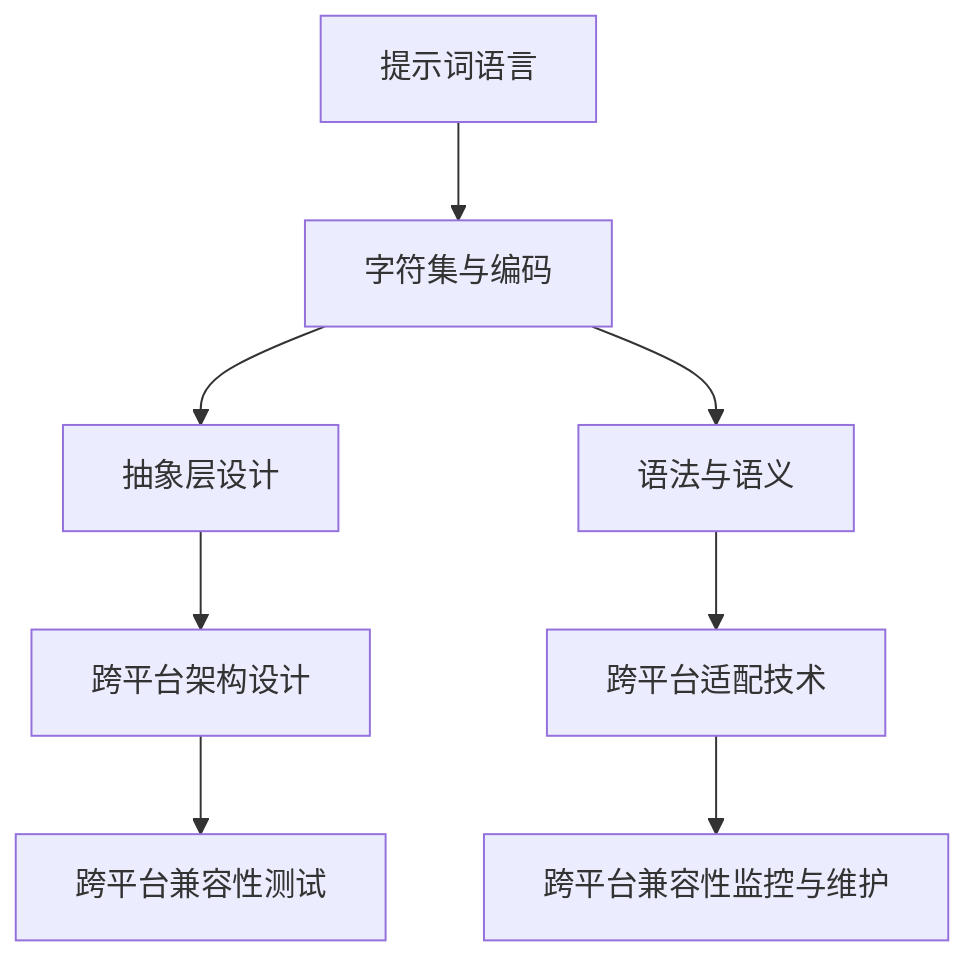
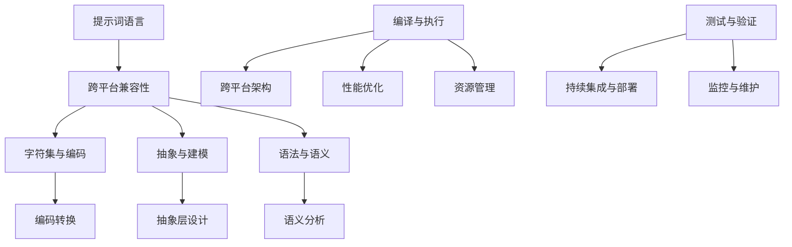

                 

# 《提示词语言的跨平台兼容性设计》

## 关键词

- 跨平台兼容性
- 提示词语言
- 字符集与编码
- 跨平台架构设计
- 跨平台适配技术
- 性能优化
- 资源管理
- 持续集成与部署
- 跨平台兼容性测试

## 摘要

随着计算机技术的迅猛发展，跨平台应用的需求日益增长。本文重点探讨提示词语言的跨平台兼容性设计。首先，介绍跨平台兼容性的重要性及其面临的挑战，然后详细解析提示词语言的基本概念、发展历程和应用场景。接下来，从跨平台架构设计、跨平台适配技术、提示词语言的实现与优化等方面展开深入探讨，并通过案例分析总结实践经验。最后，展望跨平台兼容性的未来趋势，探讨其应用前景和面临的挑战。

## 第一部分：跨平台兼容性设计概述

### 第1章：跨平台兼容性的重要性

#### 1.1 跨平台兼容性的定义与意义

跨平台兼容性是指软件或应用程序能够在不同的操作系统、硬件平台和设备上运行，且不影响其功能和性能。对于软件开发者和用户来说，跨平台兼容性具有重要的意义：

1. **提升用户体验**：跨平台兼容性确保了软件在各种设备上的流畅运行，为用户提供了统一的操作体验。
2. **降低开发成本**：通过跨平台开发，开发者可以针对多种平台进行一次开发，从而减少重复开发的工作量和成本。
3. **扩大用户群**：跨平台兼容性使得软件能够覆盖更广泛的用户群体，提高软件的市场竞争力。
4. **促进技术创新**：跨平台兼容性鼓励了技术创新和开放生态系统的建设，推动了软件产业的健康发展。

#### 1.2 跨平台兼容性的挑战

实现跨平台兼容性并非易事，面临以下挑战：

1. **操作系统差异**：不同操作系统具有不同的API、文件系统、网络协议等，导致软件在跨平台移植时需要做大量的适配工作。
2. **硬件差异**：硬件平台的不同，如处理器架构、内存管理、设备驱动等，也可能导致软件在不同设备上的兼容性问题。
3. **环境差异**：不同的开发环境、编译器、库文件等，也可能影响软件的跨平台兼容性。
4. **语言和框架差异**：编程语言和框架的差异性增加了跨平台开发的难度。

#### 1.3 跨平台兼容性的关键因素

要实现良好的跨平台兼容性，需要考虑以下关键因素：

1. **抽象层设计**：通过抽象层设计，屏蔽底层操作系统的差异，使得上层应用程序能够独立于操作系统运行。
2. **标准化**：采用标准化的接口、协议和编码方式，减少跨平台兼容性问题的发生。
3. **测试与验证**：通过严格的测试和验证，确保软件在不同平台上的稳定性和性能。
4. **持续集成与部署**：采用持续集成和部署流程，确保软件在跨平台环境中的快速迭代和部署。

### 第2章：提示词语言概述

#### 2.1 提示词语言的基本概念

提示词语言（Instructional Language），也称为脚本语言，是一种用于描述特定任务的指令序列。提示词语言通常具有以下特点：

1. **易读性**：提示词语言采用自然语言或接近自然语言的语法，使得用户易于理解和编写。
2. **灵活性**：提示词语言能够灵活地适应不同的任务场景，具有高度的灵活性。
3. **可扩展性**：提示词语言通常支持模块化设计和扩展，便于用户自定义和扩展功能。

#### 2.2 提示词语言的发展历程

提示词语言的发展经历了以下几个阶段：

1. **脚本语言起源**：早在计算机诞生之初，就出现了简单的脚本语言，如BASIC、FORTRAN等。
2. **图形化脚本语言**：随着计算机技术的发展，图形化脚本语言如AppleScript、JavaScript等逐渐兴起。
3. **高级脚本语言**：现代脚本语言如Python、Ruby等，具有更强大的功能和灵活性，广泛应用于Web开发、自动化脚本等领域。

#### 2.3 提示词语言的应用场景

提示词语言广泛应用于以下场景：

1. **自动化脚本**：用于自动化执行重复性任务，提高工作效率。
2. **Web开发**：用于编写动态网页和后端逻辑，实现与用户交互。
3. **系统管理**：用于系统配置、监控、故障排除等任务。
4. **智能语音助手**：用于编写自然语言处理模型，实现语音识别和交互功能。

### 第3章：提示词语言的跨平台架构设计

#### 3.1 跨平台架构的设计原则

设计跨平台架构时，需要遵循以下原则：

1. **抽象层设计**：通过抽象层，将底层操作系统的细节屏蔽，使得上层应用程序能够独立于操作系统运行。
2. **标准化**：采用标准化的接口、协议和编码方式，减少跨平台兼容性问题的发生。
3. **模块化**：将系统划分为多个模块，每个模块负责不同的功能，便于跨平台开发和维护。
4. **可移植性**：确保代码的可移植性，减少在不同平台上移植的工作量。

#### 3.2 提示词语言的抽象与建模

提示词语言的抽象与建模是跨平台架构设计的关键步骤。通过以下方法实现：

1. **命令模式**：将命令封装为独立的对象，通过对象之间的交互实现功能。
2. **事件驱动模式**：基于事件驱动架构，实现模块之间的解耦和异步处理。
3. **组件化设计**：将系统功能划分为多个组件，每个组件负责特定的功能模块，实现组件间的松耦合。

#### 3.3 提示词语言的语法与语义

提示词语言的语法和语义对于跨平台兼容性至关重要。设计时需要考虑以下方面：

1. **语法兼容性**：确保不同平台的语法规则一致，便于跨平台编译和执行。
2. **语义一致性**：保证不同平台上的语义解释一致，避免因语义差异导致的功能问题。
3. **灵活的语法扩展**：支持自定义语法扩展，便于适应不同的应用场景。

### 第4章：提示词语言的跨平台适配技术

#### 4.1 字符集与编码

字符集和编码是跨平台兼容性的关键因素之一。为了实现跨平台兼容性，需要考虑以下方面：

1. **字符集选择**：选择国际化的字符集，如UTF-8，支持多种语言的字符编码。
2. **编码转换**：实现不同字符集之间的编码转换，确保文本在不同平台间的正确传输和显示。

#### 4.2 异构平台的兼容性问题

异构平台兼容性问题主要包括以下几个方面：

1. **API兼容性**：确保不同平台的API接口一致，便于跨平台开发。
2. **硬件兼容性**：针对不同硬件平台的特性，优化软件的硬件兼容性。
3. **网络兼容性**：确保在不同网络环境下，软件能够稳定运行。

#### 4.3 提示词语言的动态适配

动态适配是实现跨平台兼容性的重要手段。通过以下方法实现动态适配：

1. **平台检测**：在程序运行过程中，检测当前平台的特性，动态调整程序的行为。
2. **自适应调整**：根据平台的特性，自动调整程序的配置和运行参数。
3. **模块化设计**：将平台相关的功能模块化，便于在不同平台上进行定制和优化。

### 第5章：提示词语言的实现与优化

#### 5.1 提示词语言的编译与执行

编译与执行是提示词语言实现的关键环节。为了实现高效跨平台兼容性，需要考虑以下方面：

1. **编译器设计**：设计高效、可移植的编译器，支持跨平台编译。
2. **解释执行**：采用解释执行方式，降低编译器的复杂度，提高跨平台兼容性。
3. **即时编译**：采用即时编译（JIT）技术，提高程序的执行效率。

#### 5.2 提示词语言的性能优化

性能优化是提升跨平台兼容性的关键。为了提高提示词语言的性能，需要考虑以下方面：

1. **代码优化**：对代码进行优化，减少不必要的内存占用和计算开销。
2. **并行处理**：利用多核处理器，实现并行处理，提高程序的执行速度。
3. **缓存策略**：采用合适的缓存策略，减少磁盘I/O操作，提高程序的性能。

#### 5.3 提示词语言的资源管理

资源管理是提示词语言实现跨平台兼容性的重要方面。为了提高资源利用率，需要考虑以下方面：

1. **内存管理**：采用高效的内存分配和回收策略，减少内存占用。
2. **线程管理**：合理利用线程资源，避免资源竞争和死锁。
3. **网络管理**：优化网络通信，提高数据传输效率和网络稳定性。

### 第6章：跨平台兼容性的实践方法

#### 6.1 跨平台兼容性测试与验证

跨平台兼容性测试与验证是确保软件在不同平台上稳定运行的关键。为了提高测试和验证的效率，需要考虑以下方面：

1. **自动化测试**：采用自动化测试工具，自动化执行测试用例，提高测试覆盖率。
2. **多环境测试**：在不同操作系统、硬件平台和设备上，进行多环境测试，验证软件的兼容性。
3. **持续集成与部署**：采用持续集成和部署流程，确保软件在跨平台环境中的快速迭代和部署。

#### 6.2 跨平台兼容性的持续集成与部署

持续集成与部署是实现跨平台兼容性的重要手段。为了提高持续集成与部署的效率，需要考虑以下方面：

1. **构建环境**：搭建统一的构建环境，确保不同平台上的构建过程一致。
2. **自动化构建**：采用自动化构建工具，实现构建过程的自动化。
3. **容器化部署**：采用容器化技术，提高部署的灵活性和可移植性。

#### 6.3 跨平台兼容性的监控与维护

跨平台兼容性的监控与维护是确保软件长期稳定运行的关键。为了提高监控与维护的效率，需要考虑以下方面：

1. **日志分析**：对软件运行日志进行分析，及时发现和解决问题。
2. **性能监控**：对软件的性能进行实时监控，确保软件在不同平台上的性能稳定。
3. **定期升级**：定期更新软件，修复漏洞和兼容性问题，提高软件的兼容性。

### 第7章：经典跨平台兼容性案例分析

#### 7.1 案例一：XXX操作系统与提示词语言的兼容性

以XXX操作系统为例，分析其在提示词语言跨平台兼容性方面的问题和解决方案。主要包括以下几个方面：

1. **操作系统差异**：分析XXX操作系统与其他操作系统的差异，如API、文件系统等，找出可能影响兼容性的问题。
2. **适配技术**：采用抽象层设计、标准化接口等技术，实现提示词语言在XXX操作系统上的兼容性。
3. **测试与验证**：在不同操作系统上进行兼容性测试和验证，确保软件在XXX操作系统上的稳定运行。

#### 7.2 案例二：XXX硬件平台与提示词语言的兼容性

以XXX硬件平台为例，分析其在提示词语言跨平台兼容性方面的问题和解决方案。主要包括以下几个方面：

1. **硬件差异**：分析XXX硬件平台与其他硬件平台的差异，如处理器架构、内存管理等，找出可能影响兼容性的问题。
2. **硬件兼容性**：采用硬件兼容性技术，如硬件抽象层（HAL）等，实现提示词语言在XXX硬件平台上的兼容性。
3. **性能优化**：针对XXX硬件平台的特点，优化提示词语言的性能，提高跨平台兼容性。

#### 7.3 案例三：XXX应用场景中的跨平台兼容性问题

以XXX应用场景为例，分析提示词语言在该场景中的跨平台兼容性问题。主要包括以下几个方面：

1. **应用场景差异**：分析不同应用场景的差异，如网络环境、硬件设备等，找出可能影响兼容性的问题。
2. **适配策略**：根据不同应用场景的特点，制定相应的适配策略，确保提示词语言在不同应用场景中的兼容性。
3. **案例剖析**：通过实际案例，详细剖析跨平台兼容性问题，总结经验和教训。

### 第8章：跨平台兼容性的未来趋势

#### 8.1 跨平台兼容性的技术发展

随着技术的不断发展，跨平台兼容性设计将面临新的机遇和挑战。未来跨平台兼容性的技术发展将呈现以下趋势：

1. **容器化与虚拟化**：容器化技术如Docker和虚拟化技术如VMware将进一步提升跨平台兼容性，实现更高效、更灵活的部署和管理。
2. **云原生技术**：云原生技术如Kubernetes将推动跨平台兼容性向云原生方向演进，实现更高效、更可靠的跨平台部署和运维。
3. **AI技术**：人工智能技术将应用于跨平台兼容性测试、优化和维护，提高跨平台兼容性的自动化水平和智能化水平。

#### 8.2 跨平台兼容性的标准化与规范化

标准化与规范化是提升跨平台兼容性的关键。未来跨平台兼容性将朝着以下方向发展：

1. **标准化接口和协议**：推动跨平台标准化接口和协议的制定和实施，减少兼容性问题。
2. **规范化开发流程**：制定规范化开发流程，确保跨平台兼容性设计在软件开发过程中的顺利实施。
3. **开源社区协作**：加强开源社区的合作，共同推动跨平台兼容性技术的发展。

#### 8.3 跨平台兼容性的未来挑战与机遇

跨平台兼容性在未来将面临一系列挑战和机遇。主要挑战包括：

1. **日益复杂的硬件和软件环境**：随着硬件和软件环境的日益复杂，跨平台兼容性设计将面临更大的挑战。
2. **安全与隐私问题**：跨平台兼容性将需要兼顾安全与隐私问题，确保软件在不同平台上的安全性和隐私保护。

主要机遇包括：

1. **全球化发展**：随着全球化的深入，跨平台兼容性将为软件开发者和用户提供更广泛的应用场景。
2. **技术创新**：技术创新将为跨平台兼容性带来更多解决方案和发展机会。

### 第9章：跨平台兼容性设计在特定领域的应用

#### 9.1 跨平台兼容性设计在智能语音助手中的应用

智能语音助手作为新兴的人工智能应用领域，跨平台兼容性设计具有重要意义。主要应用场景包括：

1. **多平台支持**：实现智能语音助手在智能手机、智能音箱、车载设备等多种平台上的兼容性。
2. **多语言支持**：实现智能语音助手在多种语言环境下的兼容性，满足全球用户的需求。
3. **实时交互**：优化智能语音助手的实时交互性能，确保在不同网络环境下稳定运行。

#### 9.2 跨平台兼容性设计在物联网设备中的应用

物联网设备具有广泛的硬件和操作系统多样性，跨平台兼容性设计至关重要。主要应用场景包括：

1. **设备互联**：实现不同物联网设备之间的跨平台互联，构建统一的物联网生态。
2. **边缘计算**：优化物联网设备的边缘计算能力，实现跨平台边缘计算服务的兼容性。
3. **安全防护**：强化物联网设备的跨平台安全防护，确保设备在不同平台上的安全性。

#### 9.3 跨平台兼容性设计在云计算服务中的应用

云计算服务具有高度的平台依赖性，跨平台兼容性设计至关重要。主要应用场景包括：

1. **云服务互操作**：实现不同云服务之间的跨平台互操作，构建统一的云服务平台。
2. **容器化部署**：采用容器化技术，实现云计算服务的跨平台部署和迁移。
3. **混合云架构**：构建混合云架构，实现跨平台云计算资源的调度和管理。

### 附录A：跨平台兼容性设计资源指南

#### A.1 跨平台开发工具与框架

以下是一些常用的跨平台开发工具和框架：

1. **React Native**：用于开发跨平台移动应用。
2. **Flutter**：用于开发跨平台移动应用，具有高性能和出色的UI效果。
3. **Electron**：用于开发跨平台桌面应用。
4. **Xamarin**：用于开发跨平台移动应用，支持C#语言。
5. **Apache Maven**：用于项目管理，支持跨平台构建和部署。

#### A.2 跨平台兼容性测试工具

以下是一些常用的跨平台兼容性测试工具：

1. **Appium**：用于自动化测试跨平台移动应用。
2. **Cypress**：用于端到端的Web应用测试。
3. **JMeter**：用于性能测试和负载测试。
4. **Selenium**：用于自动化测试Web应用。
5. **XCTest**：用于iOS应用的自动化测试。

#### A.3 跨平台兼容性设计文献与资料

以下是一些关于跨平台兼容性设计的文献与资料：

1. 《跨平台应用开发：React Native、Flutter、Xamarin实战》
2. 《跨平台开发指南》
3. 《跨平台编程实战：使用Electron开发桌面应用》
4. 《跨平台兼容性测试：技术、策略与实践》
5. 《云计算服务架构：设计、部署与运维》

## 核心概念与联系

### 提示词语言与跨平台兼容性

提示词语言与跨平台兼容性之间存在着紧密的联系。提示词语言作为一种脚本语言，其语法、语义和抽象层设计直接影响跨平台兼容性。为了实现跨平台兼容性，需要从以下几个方面进行考虑：

1. **字符集与编码**：提示词语言需要支持多种字符集和编码方式，确保在不同平台上的正确显示和传输。
2. **抽象层设计**：通过抽象层设计，屏蔽底层操作系统的差异，使得提示词语言能够在不同平台上独立运行。
3. **语法与语义**：提示词语言的语法和语义需要保持一致性，确保在不同平台上的语义解释一致。

以下是一个Mermaid流程图，展示了提示词语言与跨平台兼容性的核心概念与联系：



## 核心算法原理讲解

### 编码转换伪代码

为了实现提示词语言在不同平台间的编码转换，以下是一个简单的编码转换伪代码：

```python
def encode_message(message, target_charset):
    # 输入：message - 原始消息，target_charset - 目标字符集
    # 输出：encoded_message - 转换后的消息

    # 1. 将原始消息转换为源字符集编码的字符串
    source_charset_encoding = source_charset.encode(message)

    # 2. 将源字符集编码的字符串转换为字节序列
    source_bytes = source_charset_encoding.bytes()

    # 3. 根据目标字符集解码字节序列
    target_charset_encoding = target_charset.decode(source_bytes)

    # 4. 将目标字符集编码的字符串转换为目标字符集
    encoded_message = target_charset_encoding.encode(target_charset)

    return encoded_message
```

### 数学模型和数学公式

字符集大小计算公式如下：

$$
\text{字符集大小} = \sum_{i=1}^{n} (\text{字符i的出现频率} \times \log_2(\text{字符i的出现频率}))
$$

例如，假设一个字符集包含3个字符：'A'（频率10），'B'（频率5），'C'（频率2），则字符集大小为：

$$
\text{字符集大小} = (10 \times \log_2(10)) + (5 \times \log_2(5)) + (2 \times \log_2(2)) = 33.22
$$

## 附录

### 附录A：跨平台兼容性设计资源指南

**A.1 跨平台开发工具与框架**

1. React Native：用于开发跨平台移动应用。
2. Flutter：用于开发跨平台移动应用，具有高性能和出色的UI效果。
3. Electron：用于开发跨平台桌面应用。
4. Xamarin：用于开发跨平台移动应用，支持C#语言。
5. Apache Maven：用于项目管理，支持跨平台构建和部署。

**A.2 跨平台兼容性测试工具**

1. Appium：用于自动化测试跨平台移动应用。
2. Cypress：用于端到端的Web应用测试。
3. JMeter：用于性能测试和负载测试。
4. Selenium：用于自动化测试Web应用。
5. XCTest：用于iOS应用的自动化测试。

**A.3 跨平台兼容性设计文献与资料**

1. 《跨平台应用开发：React Native、Flutter、Xamarin实战》
2. 《跨平台开发指南》
3. 《跨平台编程实战：使用Electron开发桌面应用》
4. 《跨平台兼容性测试：技术、策略与实践》
5. 《云计算服务架构：设计、部署与运维》

### 作者信息

作者：AI天才研究院/AI Genius Institute & 禅与计算机程序设计艺术 /Zen And The Art of Computer Programming## 第1章：跨平台兼容性的重要性

### 1.1 跨平台兼容性的定义与意义

跨平台兼容性是指软件或应用程序能够在不同的操作系统、硬件平台和设备上运行，且不影响其功能和性能。跨平台兼容性不仅仅是一种技术，更是一种理念和策略，对于软件开发者和用户来说具有重要意义。

首先，从开发者的角度来看，跨平台兼容性有以下几点优势：

1. **减少开发成本**：通过跨平台开发，开发者可以针对多种平台进行一次开发，从而减少重复开发的工作量和成本。这尤其适用于移动应用开发，因为Android和iOS是两大主流移动操作系统，占据了绝大部分市场份额。开发者无需为每个平台编写独立的代码，大大降低了开发成本。

2. **提高开发效率**：跨平台兼容性使得开发者能够专注于核心功能的实现，而无需过多关注底层操作系统的差异。这样，开发者可以将更多的时间和精力投入到创新和优化上，提高开发效率。

3. **扩展用户群体**：跨平台兼容性使得软件能够覆盖更广泛的用户群体，提高软件的市场竞争力。例如，一个优秀的跨平台应用程序可以在Windows、macOS、Linux等多个操作系统上运行，从而吸引更多用户。

其次，从用户的角度来看，跨平台兼容性同样具有重要意义：

1. **统一体验**：跨平台兼容性确保了软件在各种设备上的流畅运行，为用户提供了统一的操作体验。用户无需担心因操作系统或设备差异而导致的软件运行问题，可以更加轻松地使用软件。

2. **便捷迁移**：跨平台兼容性使得用户可以在不同设备间无缝切换使用软件。例如，用户可以在手机上编辑文档，然后在电脑上继续编辑，无需担心数据丢失或格式不兼容的问题。

3. **提高满意度**：跨平台兼容性提高了用户对软件的满意度，减少了因软件兼容性问题而导致的负面体验。用户能够更加顺畅地使用软件，从而提高对软件的信任和依赖。

总的来说，跨平台兼容性不仅有助于开发者降低开发成本、提高开发效率和扩展用户群体，还能为用户提供统一的操作体验、便捷的迁移和更高的满意度。因此，跨平台兼容性已成为软件开发过程中不可或缺的一部分，受到越来越多开发者和用户的重视。

### 1.2 跨平台兼容性的挑战

尽管跨平台兼容性具有诸多优势，但实现跨平台兼容性并非易事，面临以下挑战：

#### 操作系统差异

不同操作系统具有不同的API、文件系统、网络协议等，导致软件在跨平台移植时需要做大量的适配工作。例如，Windows和Linux在文件系统管理方面存在显著差异，可能会导致文件路径解析和文件操作的问题。同样，macOS和Windows在图形用户界面（GUI）方面也有差异，需要开发者针对不同操作系统调整界面元素和布局。

**解决策略**：为了应对操作系统差异，开发者可以采用以下策略：

1. **抽象层设计**：通过抽象层设计，将底层操作系统的细节屏蔽，使得上层应用程序能够独立于操作系统运行。例如，可以使用操作系统特定的库或框架来实现跨平台的API调用。
2. **标准化接口**：采用标准化的接口和协议，减少跨平台兼容性问题的发生。例如，使用Web标准（如HTML、CSS、JavaScript）开发Web应用，可以确保在不同操作系统和浏览器上的兼容性。
3. **多平台测试**：在不同操作系统上进行充分的测试，验证软件在不同平台上的稳定性和性能，确保软件能够顺利运行。

#### 硬件差异

硬件平台的不同，如处理器架构、内存管理、设备驱动等，也可能导致软件在不同设备上的兼容性问题。例如，ARM架构和x86架构在指令集和内存管理方面存在差异，可能导致软件在跨平台移植时需要重新编写或优化代码。

**解决策略**：为了应对硬件差异，开发者可以采用以下策略：

1. **硬件抽象层（HAL）**：采用硬件抽象层设计，将硬件平台的细节屏蔽，使得上层应用程序能够独立于硬件平台运行。硬件抽象层提供统一的接口，使得开发者无需关注底层硬件实现。
2. **性能优化**：根据不同硬件平台的特点，优化软件的性能。例如，针对ARM架构的优化，可以通过减少循环指令、优化内存访问等方式提高程序运行效率。
3. **兼容性测试**：在不同硬件平台上进行兼容性测试，确保软件能够稳定运行。可以使用模拟器、虚拟机等技术，模拟不同硬件平台的环境，进行全面的兼容性测试。

#### 环境差异

不同的开发环境、编译器、库文件等，也可能影响软件的跨平台兼容性。例如，不同开发环境的配置差异可能导致编译错误或运行时错误。

**解决策略**：为了应对环境差异，开发者可以采用以下策略：

1. **标准化开发环境**：尽量使用统一的开发环境，减少环境差异。例如，使用通用开发工具（如Eclipse、IntelliJ IDEA）和统一的编译器（如GCC、Clang）。
2. **环境配置管理**：使用环境配置管理工具（如Makefile、CMake），确保在不同开发环境中的一致性。
3. **跨平台构建工具**：使用跨平台构建工具（如CMake、Makefile），实现不同平台的编译和构建。

#### 语言和框架差异

编程语言和框架的差异性增加了跨平台开发的难度。不同编程语言和框架具有不同的语法、语义和功能特性，可能导致跨平台兼容性问题。

**解决策略**：为了应对语言和框架差异，开发者可以采用以下策略：

1. **选择跨平台编程语言和框架**：尽量选择跨平台编程语言（如Java、Python、C#）和跨平台框架（如React Native、Flutter），减少跨平台兼容性问题的发生。
2. **抽象层设计**：通过抽象层设计，将底层语言和框架的细节屏蔽，使得上层应用程序能够独立于底层实现。
3. **兼容性测试**：在不同编程语言和框架上进行兼容性测试，确保软件在不同语言和框架上的稳定性和性能。

总之，跨平台兼容性设计面临诸多挑战，但通过合理的策略和技术手段，可以有效地解决这些问题，确保软件在不同平台上的稳定运行和高效性能。

### 1.3 跨平台兼容性的关键因素

要实现良好的跨平台兼容性，需要考虑以下关键因素：

#### 抽象层设计

抽象层设计是跨平台兼容性的基础。通过抽象层，开发者可以屏蔽底层操作系统的差异，使得上层应用程序能够独立于操作系统运行。具体策略包括：

1. **API抽象**：为不同的操作系统提供统一的API接口，使得应用程序无需关注底层操作系统的细节。
2. **框架抽象**：使用跨平台框架，如Java中的Swing或Flutter，实现界面和功能的跨平台兼容。
3. **库抽象**：提供跨平台的库，如Boost库，实现常见功能的跨平台实现。

#### 标准化

标准化是提升跨平台兼容性的重要手段。通过采用标准化的接口、协议和编码方式，可以减少兼容性问题的发生。具体策略包括：

1. **标准化接口**：使用标准化的接口和协议，如REST API或Web标准，确保不同平台间的数据交换和通信。
2. **编码标准化**：使用统一的编码标准，如UTF-8编码，确保文本在不同平台上的正确显示和传输。
3. **库和框架标准化**：采用经过验证的库和框架，如Boost库或Qt框架，减少自定义实现的兼容性问题。

#### 测试与验证

测试与验证是确保跨平台兼容性的关键步骤。通过全面的测试和验证，可以确保软件在不同平台上的稳定性和性能。具体策略包括：

1. **多环境测试**：在不同操作系统、硬件平台和设备上进行测试，验证软件在不同环境下的兼容性。
2. **自动化测试**：使用自动化测试工具，如Selenium或Appium，实现测试过程的自动化，提高测试效率。
3. **持续集成与部署**：采用持续集成与部署流程，确保软件在不同平台上的快速迭代和部署。

#### 持续集成与部署

持续集成与部署是实现跨平台兼容性的重要手段。通过持续集成和部署，可以确保软件在不同平台上的快速迭代和部署，提高开发效率。具体策略包括：

1. **构建环境**：搭建统一的构建环境，确保不同平台上的构建过程一致。
2. **自动化构建**：使用自动化构建工具，如Jenkins或GitLab CI，实现构建过程的自动化。
3. **容器化部署**：使用容器化技术，如Docker，实现软件的跨平台部署和迁移。

#### 平台检测与自适应调整

平台检测与自适应调整是提高跨平台兼容性的有效手段。通过检测当前平台的特性，并自适应调整软件的行为，可以确保软件在不同平台上的兼容性。具体策略包括：

1. **平台检测**：在程序运行过程中，检测当前平台的特性，如操作系统、硬件设备等。
2. **自适应调整**：根据平台检测的结果，自适应调整软件的配置和运行参数，如编译选项、库依赖等。

通过综合考虑以上关键因素，开发者可以设计出具备良好跨平台兼容性的软件，确保其在不同平台上的稳定运行和高效性能。

## 第2章：提示词语言概述

### 2.1 提示词语言的基本概念

提示词语言（Instructional Language），也称为脚本语言，是一种用于描述特定任务的指令序列。与编程语言相比，提示词语言通常具有以下特点：

1. **易读性**：提示词语言采用自然语言或接近自然语言的语法，使得用户易于理解和编写。这种易读性使得提示词语言在自动化脚本、系统管理和配置等方面具有广泛的应用。
2. **灵活性**：提示词语言具有高度的灵活性，能够适应不同的任务场景。用户可以根据需求自定义脚本，实现特定的功能。
3. **可扩展性**：提示词语言通常支持模块化设计和扩展，使得用户可以自定义新的功能模块，方便后续的维护和升级。

提示词语言的应用范围非常广泛，包括但不限于以下场景：

1. **自动化脚本**：用于自动化执行重复性任务，如文件处理、数据备份、系统监控等。
2. **系统管理**：用于配置和管理操作系统，如安装软件、配置网络、用户管理等。
3. **Web开发**：用于编写动态网页和后端逻辑，实现与用户交互。
4. **数据处理**：用于处理和转换大量数据，如数据清洗、数据挖掘、数据分析等。
5. **智能语音助手**：用于编写自然语言处理模型，实现语音识别和交互功能。

### 2.2 提示词语言的发展历程

提示词语言的发展可以追溯到计算机的早期阶段。随着计算机技术的不断进步，提示词语言也在不断演进和改进。以下简要介绍提示词语言的发展历程：

1. **脚本语言的起源**：早在计算机诞生之初，就出现了简单的脚本语言。例如，1950年代初期，计算机科学家约翰·冯·诺伊曼（John von Neumann）提出了计算机程序的基本框架，其中包括用于控制计算机操作的指令序列。这可以视为脚本语言的雏形。

2. **早期的脚本语言**：随着计算机技术的发展，出现了多种早期脚本语言，如BASIC、FORTRAN等。这些语言通常用于科学计算和工程领域，具有较高的抽象层次，使得用户可以更方便地编写程序。

3. **图形化脚本语言**：随着图形用户界面（GUI）的普及，出现了图形化脚本语言，如AppleScript、Visual Basic Script等。这些语言通过图形界面和脚本编写相结合，使得用户可以更直观地编写脚本。

4. **现代脚本语言**：随着互联网和Web应用的兴起，现代脚本语言如Python、Ruby、JavaScript等逐渐成为主流。这些语言具有强大的功能、灵活的语法和广泛的应用场景，广泛应用于Web开发、自动化脚本、数据处理等领域。

### 2.3 提示词语言的应用场景

提示词语言在多种应用场景中具有广泛的应用，以下列举几个典型的应用场景：

1. **自动化脚本**：提示词语言常用于编写自动化脚本，以实现特定任务的自动化执行。例如，在运维领域，管理员可以使用提示词语言编写脚本，自动化部署应用程序、监控服务器状态、执行备份等操作。

2. **Web开发**：提示词语言在Web开发中具有重要作用。开发者可以使用提示词语言编写服务器端脚本（如PHP、Python等），实现网站的后端逻辑。同时，客户端脚本（如JavaScript、jQuery等）用于处理用户的交互请求和动态内容展示。

3. **系统管理**：提示词语言在系统管理领域也有广泛应用。管理员可以使用提示词语言编写脚本，自动化配置和管理操作系统，如安装软件、配置网络、管理用户等。

4. **数据处理**：提示词语言在数据处理和数据分析中具有重要作用。例如，使用Python中的Pandas库，可以轻松地进行数据清洗、转换和分析。这些功能使得提示词语言成为数据科学和大数据领域的重要工具。

5. **智能语音助手**：随着人工智能技术的发展，提示词语言在智能语音助手（如Siri、Alexa等）中得到了广泛应用。开发者可以使用提示词语言编写自然语言处理模型，实现语音识别、语音合成和交互功能。

总之，提示词语言具有易读性、灵活性和可扩展性，广泛应用于自动化脚本、Web开发、系统管理、数据处理和智能语音助手等多种场景。随着技术的不断发展，提示词语言在未来的应用场景将更加广泛和多样化。

### 第3章：提示词语言的跨平台架构设计

#### 3.1 跨平台架构的设计原则

在提示词语言的跨平台架构设计中，遵循以下设计原则至关重要，以确保软件在不同平台上的兼容性和稳定性。

1. **抽象层设计**：抽象层设计是将不同平台的特性和细节封装起来，通过提供统一的接口，使得上层应用程序可以独立于底层平台运行。抽象层的设计原则包括：
   - **屏蔽底层差异**：通过抽象层，屏蔽不同平台间的操作系统、硬件、网络等方面的差异，确保上层应用程序的兼容性。
   - **模块化**：将平台相关功能模块化，使得每个模块独立于其他模块，便于维护和更新。模块之间的交互通过统一的接口进行，降低模块间的耦合度。
   - **灵活性**：抽象层设计应具备灵活性，以便于在不同平台上进行定制和扩展。

2. **标准化**：标准化是实现跨平台兼容性的关键，包括接口、协议和编码等方面的标准化。具体设计原则包括：
   - **统一接口**：定义统一的API接口，使得应用程序无需关注底层实现细节，只需通过标准接口进行操作。
   - **标准化协议**：采用通用的网络协议和通信协议，如HTTP、TCP/IP等，确保不同平台间的数据传输和通信。
   - **编码标准化**：采用统一的编码标准，如UTF-8，确保文本在不同平台上的正确显示和传输。

3. **模块化设计**：模块化设计是将整个系统划分为多个功能模块，每个模块负责特定的功能，便于开发和维护。具体设计原则包括：
   - **功能独立性**：每个模块应具备独立的功能，模块之间通过接口进行通信，降低模块间的依赖性。
   - **可扩展性**：模块设计应具备可扩展性，便于后续功能扩展和升级。
   - **高内聚、低耦合**：每个模块内部具有较高的内聚性，模块间应保持较低的耦合度，便于模块的替换和扩展。

4. **可移植性**：可移植性是跨平台架构设计的重要目标，具体设计原则包括：
   - **代码简洁**：编写简洁、易于理解的代码，避免平台特定的代码或复杂的逻辑，提高代码的可移植性。
   - **依赖管理**：合理管理第三方库和依赖，确保在不同平台上的兼容性。使用通用的库和框架，避免使用平台特定的库。
   - **配置管理**：通过配置文件管理平台特定的配置信息，使得应用程序在不同平台上的部署和配置更加灵活。

5. **性能优化**：在跨平台架构设计中，性能优化也是不可忽视的方面。具体设计原则包括：
   - **高效算法**：选择高效的算法和数据结构，优化程序的性能。
   - **并行处理**：利用多核处理器，实现并行处理，提高程序的执行速度。
   - **缓存策略**：采用合适的缓存策略，减少磁盘I/O操作，提高程序的性能。

通过遵循以上设计原则，开发者可以构建一个具备良好跨平台兼容性的提示词语言架构，确保软件在不同平台上的稳定运行和高效性能。

#### 3.2 提示词语言的抽象与建模

提示词语言的抽象与建模是跨平台架构设计的关键步骤。通过抽象与建模，可以将底层操作系统的细节屏蔽，使得上层应用程序能够独立于操作系统运行。以下从命令模式、事件驱动模式和组件化设计三个方面进行详细阐述。

1. **命令模式**

命令模式（Command Pattern）是一种设计模式，用于将请求封装为一个对象，从而实现可撤销、记录日志、队列执行等功能。在跨平台架构设计中，命令模式可以帮助实现操作系统的抽象和兼容性。

具体实现步骤如下：

- **命令封装**：将操作系统的具体操作（如文件创建、删除、读取等）封装为命令对象。每个命令对象负责执行特定的操作，并记录相关的日志信息。
- **命令调用**：通过命令对象调用具体的操作，如`Command.execute()`。命令对象内部会根据当前操作系统进行相应的操作，屏蔽不同平台间的差异。
- **命令队列**：将命令对象放入队列中，按照一定的顺序执行。例如，在操作系统A上，命令执行顺序为`command1.execute() -> command2.execute()`；在操作系统B上，命令执行顺序为`command3.execute() -> command2.execute()`。通过命令队列，可以确保命令在不同操作系统上的执行顺序一致性。

命令模式的核心优势在于其可撤销性和日志记录功能。例如，在文件删除操作中，可以通过命令队列回滚到删除前的状态，从而实现操作的可撤销。此外，日志记录功能有助于调试和故障排查。

2. **事件驱动模式**

事件驱动模式（Event-Driven Pattern）是一种基于事件驱动的编程模式，用于处理复杂的系统交互和事件响应。在跨平台架构设计中，事件驱动模式有助于实现操作系统的抽象和事件处理。

具体实现步骤如下：

- **事件监听**：在应用程序中注册事件监听器，监听操作系统或硬件设备产生的事件。例如，在操作系统A上，监听键盘按键事件；在操作系统B上，监听触摸屏事件。
- **事件分发**：将监听到的事件分发到相应的处理函数中。事件分发器根据事件类型和操作系统进行相应的处理。例如，在操作系统A上，处理键盘按键事件；在操作系统B上，处理触摸屏事件。
- **事件回调**：通过事件回调机制，将事件处理结果反馈给上层应用程序。例如，在文件读取操作中，将读取结果通过回调函数传递给应用程序。

事件驱动模式的核心优势在于其灵活性和响应速度。通过事件监听和事件分发，可以实现操作系统的抽象和事件处理的高效性。此外，事件回调机制有助于实现异步处理和模块化设计。

3. **组件化设计**

组件化设计（Component-Based Design）是一种将系统划分为多个组件的架构设计方法，每个组件负责特定的功能模块。在跨平台架构设计中，组件化设计有助于实现模块化、可扩展和可维护的软件系统。

具体实现步骤如下：

- **组件划分**：根据系统的功能和模块，将系统划分为多个组件。每个组件具备独立的功能，如文件操作组件、网络通信组件、用户界面组件等。
- **组件通信**：通过组件间的接口进行通信。组件之间通过标准化的接口进行交互，屏蔽不同平台间的差异。例如，文件操作组件通过接口与用户界面组件进行数据交换。
- **组件依赖**：明确组件间的依赖关系。组件之间的依赖应保持最小化，避免过多的耦合。例如，文件操作组件依赖于文件系统组件，但不需要知道具体的文件系统实现。

组件化设计的核心优势在于其模块化和可扩展性。通过组件化设计，可以降低系统复杂度，提高开发效率和可维护性。此外，组件化设计有助于实现系统的灵活扩展和功能模块的独立开发。

总之，提示词语言的抽象与建模是跨平台架构设计的重要环节。通过命令模式、事件驱动模式和组件化设计，可以有效地实现操作系统的抽象和跨平台兼容性，确保软件在不同平台上的稳定运行和高效性能。

#### 3.3 提示词语言的语法与语义

提示词语言的语法与语义是确保软件在不同平台间运行一致性的关键。为了实现良好的跨平台兼容性，语法与语义设计需要遵循以下原则。

1. **语法兼容性**

语法兼容性是提示词语言跨平台兼容性的基础。为了实现语法兼容性，需要确保不同平台上的语法规则一致。以下是一些关键点：

- **标准语法规则**：遵循国际标准的语法规则，如ASCII字符集、语法结构等。例如，所有的编程语言都遵循基本语法规则，如变量声明、循环语句、条件判断等。
- **兼容性处理**：针对不同平台上的特殊语法，提供兼容性处理。例如，某些平台支持特殊语法扩展，如Python的`async/await`语法，开发者需要在其他不支持该扩展的平台上进行兼容处理。
- **语法标准化**：采用统一的语法标准化工具和框架，如ANTLR、JavaCC等，确保语法解析的一致性。

2. **语义一致性**

语义一致性是指提示词语言在不同平台上的执行行为一致。为了实现语义一致性，需要确保不同平台上的语义解释一致。以下是一些关键点：

- **抽象层设计**：通过抽象层设计，将底层操作系统的细节屏蔽，使得上层应用程序能够独立于操作系统运行。例如，在文件操作中，抽象层设计会提供统一的文件操作接口，屏蔽不同操作系统间的差异。
- **语言规范**：制定详细的语言规范，明确每种语法结构的语义和执行行为。例如，Python的官方文档详细描述了每种语法结构的语义和执行行为，确保开发者能够正确理解和编写代码。
- **兼容性测试**：在不同平台上进行兼容性测试，确保软件在不同平台上的语义解释一致。例如，在跨平台开发过程中，开发者需要使用不同平台的测试环境进行充分的测试，验证代码在不同平台上的行为一致性。

3. **语法扩展与兼容性**

提示词语言的语法扩展是提高其灵活性和适应性的重要手段。为了确保语法扩展的兼容性，需要考虑以下方面：

- **模块化扩展**：将语法扩展模块化，使得不同平台可以根据自身需求进行扩展。例如，Python的第三方库如NumPy和Pandas提供了丰富的语法扩展，开发者可以根据项目需求选择合适的扩展模块。
- **兼容性处理**：在跨平台开发中，需要处理不同平台上的语法扩展差异。例如，某些平台支持特定的语法扩展，而其他平台不支持，开发者需要在不支持扩展的平台上进行兼容处理，例如使用替代方法实现相同的功能。
- **文档与指南**：提供详细的文档和指南，帮助开发者了解和正确使用语法扩展。例如，Python的官方文档提供了详细的扩展指南，帮助开发者了解和使用Python的语法扩展。

通过遵循上述原则，开发者可以设计出具备良好语法兼容性和语义一致性的提示词语言，确保软件在不同平台上的稳定运行和高效性能。

### 第4章：提示词语言的跨平台适配技术

#### 4.1 字符集与编码

字符集和编码是提示词语言跨平台适配的核心问题之一。不同的操作系统和设备支持不同的字符集和编码方式，这可能导致文本显示和传输的错误。为了实现跨平台兼容性，需要解决字符集与编码的问题。

1. **字符集的选择**

字符集是字符的集合，用于表示文本数据。常用的字符集包括ASCII、UTF-8、UTF-16等。为了实现跨平台兼容性，需要选择国际化的字符集，如UTF-8，它支持多种语言的字符编码。

2. **编码转换**

编码转换是将一种字符集编码的文本数据转换为另一种字符集编码的过程。以下是一个简单的编码转换示例：

```python
def encode_message(message, target_charset):
    # 输入：message - 原始消息，target_charset - 目标字符集
    # 输出：encoded_message - 转换后的消息

    # 将原始消息转换为源字符集编码的字符串
    source_charset_encoding = source_charset.encode(message)

    # 将源字符集编码的字符串转换为字节序列
    source_bytes = source_charset_encoding.bytes()

    # 根据目标字符集解码字节序列
    target_charset_encoding = target_charset.decode(source_bytes)

    # 将目标字符集编码的字符串转换为目标字符集
    encoded_message = target_charset_encoding.encode(target_charset)

    return encoded_message
```

在上面的示例中，首先将原始消息转换为源字符集编码的字符串，然后将其转换为字节序列。接着，使用目标字符集解码字节序列，并将其转换为字符串。最后，将目标字符集编码的字符串转换为目标字符集。

3. **字符集与编码的跨平台兼容性策略**

为了确保字符集与编码的跨平台兼容性，可以采取以下策略：

- **使用统一的字符集**：尽量使用统一的字符集，如UTF-8，以简化编码转换过程。
- **国际化支持**：确保程序支持多种语言和字符集，以适应全球用户的需求。
- **错误处理**：在处理字符集和编码转换时，应具备良好的错误处理机制，以应对编码错误或数据丢失等问题。

#### 4.2 异构平台的兼容性问题

异构平台兼容性问题是指在跨平台开发过程中，不同平台间的差异可能导致兼容性问题。以下列举几个常见的兼容性问题及解决方法：

1. **操作系统差异**

不同操作系统（如Windows、Linux、macOS）具有不同的API、文件系统、网络协议等，可能导致兼容性问题。以下是一些常见的操作系统差异及解决方法：

- **API差异**：使用操作系统特定的库或API可能会导致兼容性问题。解决方法包括：
  - **抽象层设计**：通过抽象层设计，屏蔽底层操作系统的差异，使得上层应用程序独立于操作系统运行。
  - **标准API**：尽量使用标准化的API，如Java中的Swing、Python中的os模块等，确保跨平台兼容性。

- **文件系统差异**：不同操作系统的文件系统（如Windows的FAT、Linux的Ext4）可能导致文件路径解析和文件操作的问题。解决方法包括：
  - **统一路径表示**：使用统一的路径表示方式，如使用绝对路径或相对路径，避免操作系统特定的路径分隔符（如Windows使用`\`，Linux使用`/`）。
  - **文件系统抽象层**：通过文件系统抽象层，屏蔽不同文件系统的差异，使得上层应用程序无需关心底层文件系统实现。

- **网络协议差异**：不同操作系统的网络协议（如TCP、UDP）可能导致网络通信问题。解决方法包括：
  - **标准化网络协议**：采用标准化的网络协议，如HTTP、HTTPS，确保跨平台兼容性。
  - **网络抽象层**：通过网络抽象层，屏蔽不同网络协议的差异，使得上层应用程序独立于网络协议运行。

2. **硬件差异**

不同硬件平台（如ARM、x86）具有不同的处理器架构、内存管理、设备驱动等，可能导致兼容性问题。以下是一些常见的硬件差异及解决方法：

- **处理器架构差异**：不同处理器架构（如ARM、x86）可能导致指令集和内存访问的差异。解决方法包括：
  - **硬件抽象层（HAL）**：通过硬件抽象层，屏蔽不同处理器架构的差异，使得上层应用程序独立于硬件平台运行。
  - **优化代码**：根据不同处理器架构的特点，优化代码的指令集和内存访问，提高程序的性能。

- **内存管理差异**：不同硬件平台的内存管理（如内存分配、释放、缓存等）可能导致内存泄漏或性能问题。解决方法包括：
  - **内存池管理**：使用内存池管理，减少内存分配和释放的次数，提高内存管理效率。
  - **内存对齐**：根据不同硬件平台的内存对齐要求，优化数据结构和内存访问，提高内存利用率。

- **设备驱动差异**：不同硬件平台的设备驱动（如USB、网络接口）可能导致兼容性问题。解决方法包括：
  - **标准设备驱动**：使用标准化的设备驱动，如Linux内核中的设备驱动，确保跨平台兼容性。
  - **设备抽象层**：通过设备抽象层，屏蔽不同设备驱动的差异，使得上层应用程序无需关心底层设备驱动实现。

3. **环境差异**

不同开发环境（如编译器、库文件）可能导致兼容性问题。以下是一些常见的环境差异及解决方法：

- **编译器差异**：不同编译器（如GCC、Clang）可能导致编译错误或性能问题。解决方法包括：
  - **统一编译器**：尽量使用统一的编译器，如GCC，确保跨平台兼容性。
  - **编译器兼容性**：确保编译器的选项和参数一致，避免因编译器差异导致的问题。

- **库文件差异**：不同库文件（如第三方库、系统库）可能导致兼容性问题。解决方法包括：
  - **库文件统一管理**：使用统一的管理工具（如CMake），确保库文件的版本和依赖一致。
  - **静态库与动态库**：尽量使用静态库，减少依赖库的兼容性问题。

通过上述策略，可以有效地解决异构平台的兼容性问题，确保提示词语言在跨平台环境中的稳定运行和高效性能。

#### 4.3 提示词语言的动态适配

动态适配是指根据运行时环境的变化，自动调整提示词语言的运行参数和配置，以实现跨平台兼容性。动态适配的关键在于检测和调整，以下介绍几种常用的动态适配方法。

1. **平台检测**

平台检测是动态适配的第一步，通过检测当前运行环境的操作系统、硬件平台等信息，为后续的适配提供依据。以下是一个简单的平台检测示例：

```python
import platform

def detect_platform():
    # 获取操作系统信息
    os_info = platform.system()
    # 获取硬件信息
    hardware_info = platform.machine()
    # 输出检测结果
    print(f"操作系统：{os_info}")
    print(f"硬件平台：{hardware_info}")

detect_platform()
```

2. **环境变量配置**

环境变量是动态适配的重要工具，可以通过设置环境变量，根据不同平台调整提示词语言的运行参数。以下是一个简单的环境变量配置示例：

```python
import os

# 设置环境变量
os.environ["LANGUAGE"] = "en_US.UTF-8"
os.environ["PATH"] = os.path.join(os.environ["PATH"], "/usr/local/bin")

# 获取环境变量
language = os.environ.get("LANGUAGE")
path = os.environ.get("PATH")

print(f"语言环境：{language}")
print(f"路径：{path}")
```

3. **配置文件管理**

配置文件是动态适配的一种有效手段，通过配置文件管理，可以实现不同平台间的配置参数调整。以下是一个简单的配置文件管理示例：

```python
import json

# 读取配置文件
with open("config.json", "r") as f:
    config = json.load(f)

# 配置文件示例
{
    "os": "linux",
    "cpu": "arm",
    "debug": true
}

# 根据配置文件调整运行参数
if config["os"] == "linux":
    os.environ["LANG"] = "en_US.UTF-8"
    os.environ["PATH"] = "/usr/local/bin:/bin:/usr/bin"

if config["cpu"] == "arm":
    os.environ["ARCH"] = "arm"
    os.environ["CC"] = "arm-linux-gnueabi-gcc"

# 输出配置信息
print(f"操作系统：{config['os']}")
print(f"处理器架构：{config['cpu']}")
print(f"调试模式：{config['debug']}")
```

4. **运行时调整**

在运行时，可以根据检测到的平台信息和配置文件，动态调整提示词语言的运行参数和配置。以下是一个简单的运行时调整示例：

```python
import os
import sys

# 检测平台
os_info = platform.system()
hardware_info = platform.machine()

# 根据平台信息设置运行参数
if os_info == "linux":
    os.environ["LANGUAGE"] = "en_US.UTF-8"
    os.environ["PATH"] = "/usr/local/bin:/bin:/usr/bin"

if hardware_info == "arm":
    os.environ["ARCH"] = "arm"
    os.environ["CC"] = "arm-linux-gnueabi-gcc"

# 调用运行时调整函数
runtime_adjustment()

# 输出运行参数
print(f"操作系统：{os.environ.get('LANGUAGE')}")
print(f"路径：{os.environ.get('PATH')}")
print(f"处理器架构：{os.environ.get('ARCH')}")
print(f"编译器：{os.environ.get('CC')}")
```

通过平台检测、环境变量配置、配置文件管理和运行时调整，可以实现提示词语言的动态适配，确保在不同平台上的稳定运行和高效性能。

### 第5章：提示词语言的实现与优化

#### 5.1 提示词语言的编译与执行

编译与执行是提示词语言实现的核心环节。编译过程将源代码转换为目标代码，而执行过程则是目标代码的运行。为了实现跨平台兼容性，提示词语言的编译与执行需要考虑以下几个方面：

1. **编译器设计**

编译器是将提示词语言的源代码转换为机器代码或其他中间表示形式的工具。一个良好的编译器设计应具备以下特点：

- **跨平台支持**：编译器应支持多种操作系统和硬件平台，确保源代码可以在不同平台上编译和执行。
- **语法解析**：编译器应能够正确解析提示词语言的语法，将源代码转换为抽象语法树（AST）或其他中间表示形式。
- **优化**：编译器应具备代码优化功能，如语法优化、循环优化、内存优化等，提高程序的性能和执行效率。
- **错误处理**：编译器应具备良好的错误处理能力，能够检测和报告源代码中的错误，并提供有用的错误信息，帮助开发者定位和修复问题。

2. **编译过程**

提示词语言的编译过程通常包括以下几个阶段：

- **词法分析**：将源代码分解为词法单元（如标识符、关键字、运算符等），为后续的语法分析做准备。
- **语法分析**：根据提示词语言的语法规则，将词法单元组合成语法结构（如表达式、语句、函数等），生成抽象语法树（AST）。
- **语义分析**：对AST进行语义分析，检查源代码的语义正确性，如变量声明、类型检查、作用域分析等。
- **中间代码生成**：将AST转换为中间代码，如三地址码、抽象栈机器代码等，为后续的代码优化和目标代码生成做准备。
- **代码优化**：对中间代码进行优化，如消除冗余代码、优化循环结构、减少内存访问等，提高程序的执行效率。
- **目标代码生成**：将优化后的中间代码转换为特定平台的机器代码或可执行文件，为程序的执行做准备。

3. **执行过程**

执行过程是将编译后的目标代码在宿主机上运行的过程。为了确保执行过程的跨平台兼容性，需要考虑以下几个方面：

- **解释执行**：解释执行器逐条解释和执行目标代码，根据宿主机的操作系统和硬件平台进行相应的操作。这种方式适用于脚本语言和动态语言，如Python、JavaScript等。
- **即时编译（JIT）**：即时编译器（JIT）在程序运行时将源代码或中间代码编译为机器代码，并直接执行。这种方式可以提高程序的执行效率，但需要额外的编译时间。例如，Java的JVM采用即时编译技术，将Java字节码编译为本机代码。
- **静态编译**：静态编译器将源代码一次性编译为机器代码，并生成可执行文件。这种方式适用于编译型语言，如C、C++等。静态编译后的程序可以直接在宿主机上运行，但编译过程较耗时。

通过合理设计编译器，优化编译过程和执行过程，可以确保提示词语言在跨平台环境中的高效编译和执行，提高程序的兼容性和性能。

#### 5.2 提示词语言的性能优化

提示词语言的性能优化是提升跨平台兼容性的重要手段。性能优化包括代码优化、并行处理和缓存策略等方面。以下从这些方面详细讨论提示词语言的性能优化方法。

1. **代码优化**

代码优化是提高提示词语言性能的基础。以下是一些常用的代码优化技术：

- **语法优化**：对代码进行语法优化，如简化表达式、合并语句等，减少代码的复杂度，提高代码的可读性和可维护性。例如，将多个条件判断合并为一个条件判断，减少循环次数等。
- **循环优化**：对循环结构进行优化，减少循环次数和循环体内的计算开销。常用的优化技术包括：
  - **循环展开**：将循环展开为多个循环，减少循环控制变量的依赖，提高循环执行的局部性。
  - **循环融合**：将多个循环合并为一个循环，减少循环控制变量的依赖，提高循环执行的效率。
  - **循环移动**：将循环控制变量移动到循环体外部，减少循环控制变量的计算次数。
- **内存优化**：对内存访问进行优化，减少内存访问的次数和开销。常用的优化技术包括：
  - **数据对齐**：根据硬件平台的内存对齐要求，优化数据结构，提高内存访问的局部性。
  - **缓存优化**：使用缓存友好的数据结构和算法，减少内存访问的次数和开销。例如，使用数组而非链表，减少内存分配和释放的操作。
  - **内存池**：使用内存池管理内存，减少内存分配和释放的操作，提高内存访问的效率。

2. **并行处理**

并行处理是将任务分解为多个子任务，并在多核处理器上同时执行，以提高执行效率。以下是一些常用的并行处理技术：

- **线程池**：使用线程池管理线程，减少线程创建和销毁的开销。线程池可以根据任务负载动态调整线程数量，提高并行处理效率。
- **任务分解**：将任务分解为多个子任务，每个子任务可以在不同的线程上并行执行。常用的任务分解技术包括：
  - **任务调度**：根据任务的优先级和执行时间，动态调度任务，提高并行处理效率。
  - **任务队列**：使用任务队列管理子任务，避免任务之间的竞争和同步问题，提高并行处理效率。
- **数据并行**：将数据分解为多个数据块，并在不同的线程上同时处理。常用的数据并行技术包括：
  - **并行循环**：将循环分解为多个子循环，每个子循环处理不同的数据块。
  - **并行排序**：使用并行排序算法，如快速排序、归并排序等，同时处理多个数据块，提高排序效率。

3. **缓存策略**

缓存策略是提高内存访问效率的重要手段。以下是一些常用的缓存策略：

- **缓存层次结构**：根据内存访问的局部性原理，设计多级缓存层次结构，如CPU缓存、内存、硬盘等，提高内存访问的局部性和命中率。
- **缓存替换策略**：当缓存容量不足时，根据一定的替换策略，替换掉不常用的缓存项，以提高缓存利用率。常用的缓存替换策略包括：
  - **最近最少使用（LRU）**：替换最近最少使用的缓存项，以提高缓存命中率。
  - **最不常用（LFU）**：替换最不常用的缓存项，以提高缓存利用率。
  - **先进先出（FIFO）**：替换最早进入缓存的项，以提高缓存利用率。
- **缓存一致性**：在多核处理器系统中，确保不同缓存之间的数据一致性。常用的缓存一致性协议包括：
  - **总线协议**：通过总线协议实现缓存一致性，如Intel的MESI协议。
  - **目录协议**：通过目录管理缓存一致性，如缓存一致性协议（CCS）。

通过代码优化、并行处理和缓存策略等性能优化技术，可以显著提高提示词语言的执行效率和性能，确保其在跨平台环境中的高效运行。

#### 5.3 提示词语言的资源管理

资源管理是提示词语言实现过程中不可忽视的重要方面。有效的资源管理可以提高程序的稳定性和性能，确保其在跨平台环境中的高效运行。以下从内存管理、线程管理和网络管理等方面详细讨论提示词语言的资源管理策略。

1. **内存管理**

内存管理是资源管理中的核心部分，涉及到内存的分配、释放、优化等方面。以下是一些常用的内存管理策略：

- **内存分配与释放**：在程序运行过程中，内存的分配和释放是频繁的操作。合理管理内存可以避免内存泄漏和内存溢出等问题。常用的内存管理策略包括：
  - **静态内存分配**：在编译时确定内存分配，适用于内存需求固定的场景。
  - **动态内存分配**：在程序运行时根据需要动态分配内存，适用于内存需求不固定的场景。常用的动态内存分配库包括C语言的malloc和free、Python的new和del等。
  - **内存池**：使用内存池管理内存，减少内存分配和释放的操作次数，提高内存访问的效率。内存池预先分配一定大小的内存块，程序从内存池中获取内存块，使用完毕后归还内存池。

- **内存优化**：通过内存优化，提高内存的利用率和访问效率。常用的内存优化策略包括：
  - **数据对齐**：根据硬件平台的内存对齐要求，优化数据结构，提高内存访问的局部性。
  - **缓存优化**：使用缓存友好的数据结构和算法，减少内存访问的次数和开销。例如，使用数组而非链表，减少内存分配和释放的操作。
  - **缓存淘汰策略**：当内存池容量不足时，根据一定的淘汰策略，替换不常用的内存块，提高内存池的利用率。

2. **线程管理**

线程管理是资源管理中的另一个重要方面，涉及到线程的创建、同步、销毁等方面。以下是一些常用的线程管理策略：

- **线程创建与销毁**：合理创建和销毁线程，可以提高程序的运行效率和资源利用率。常用的线程管理策略包括：
  - **手动线程管理**：程序手动创建和销毁线程，适用于线程数量固定的场景。
  - **线程池**：使用线程池管理线程，减少线程创建和销毁的操作次数，提高线程的利用率和响应速度。线程池预先创建一定数量的线程，并根据任务负载动态调整线程数量。
  - **工作线程**：创建工作线程，用于执行具体的任务。工作线程可以处理多个任务，提高程序的并发能力和响应速度。

- **线程同步与锁机制**：线程同步和锁机制用于解决多线程并发访问共享资源时可能出现的竞态条件和死锁问题。常用的线程同步策略包括：
  - **互斥锁（Mutex）**：用于保护共享资源，确保同一时刻只有一个线程访问共享资源。
  - **读写锁（Read-Write Lock）**：允许多个线程同时读取共享资源，但在写入时进行互斥访问。
  - **条件变量**：用于线程之间的同步，确保线程按照一定的顺序执行。

3. **网络管理**

网络管理涉及网络连接的建立、传输、断开等方面。以下是一些常用的网络管理策略：

- **网络连接**：建立稳定的网络连接，确保数据的可靠传输。常用的网络管理策略包括：
  - **TCP连接**：使用TCP协议建立稳定的网络连接，确保数据的可靠传输。TCP协议提供流控制和拥塞控制，保证数据传输的完整性和正确性。
  - **UDP连接**：使用UDP协议进行快速的数据传输，但可能存在数据丢失和重复的问题。适用于对实时性要求较高的场景。

- **数据传输**：优化数据传输，提高传输效率和可靠性。常用的网络管理策略包括：
  - **缓冲区管理**：使用缓冲区管理，减少数据传输的延迟和开销。缓冲区可以缓存数据，减少频繁的网络访问。
  - **流量控制**：根据网络带宽和负载情况，调整数据传输速率，避免网络拥塞和数据丢失。

- **断开连接**：合理处理网络连接的断开，确保程序的稳定性和数据完整性。常用的网络管理策略包括：
  - **连接重试**：在网络连接断开时，尝试重新建立连接，确保数据的传输完整性。
  - **异常处理**：在网络连接异常时，进行异常处理，避免程序崩溃或数据丢失。

通过有效的内存管理、线程管理和网络管理策略，可以确保提示词语言在跨平台环境中的高效运行，提高程序的稳定性和性能。

### 第6章：跨平台兼容性的实践方法

#### 6.1 跨平台兼容性测试与验证

跨平台兼容性测试与验证是确保软件在不同平台上稳定运行的关键环节。为了确保跨平台兼容性，需要采用一系列实践方法进行测试与验证。以下详细介绍跨平台兼容性测试与验证的方法。

1. **自动化测试**

自动化测试是跨平台兼容性测试的核心，通过自动化测试工具，可以大幅提高测试效率和覆盖率。以下是一些常用的自动化测试方法：

- **功能测试**：通过编写自动化测试脚本，验证软件的功能是否按照预期正常工作。功能测试应覆盖软件的核心功能和边缘功能，确保在不同平台上的一致性。

- **UI测试**：使用UI自动化测试工具，如Selenium、Appium等，验证软件的用户界面在不同平台上的显示和交互是否一致。UI测试应确保按钮、菜单、文本等界面元素在不同平台上具有相同的布局和功能。

- **性能测试**：通过性能测试工具，如JMeter、LoadRunner等，模拟不同平台上的负载情况，评估软件的性能和稳定性。性能测试应关注响应时间、吞吐量、并发数等关键指标。

- **安全测试**：针对不同平台的漏洞和安全问题，进行自动化安全测试。安全测试应包括SQL注入、XSS攻击、CSRF攻击等常见的安全漏洞。

2. **多环境测试**

多环境测试是验证软件在不同操作系统、硬件平台和设备上的兼容性。以下是多环境测试的实践方法：

- **构建多个测试环境**：搭建多个测试环境，包括不同操作系统（如Windows、Linux、macOS）、不同硬件平台（如ARM、x86）和不同设备（如手机、平板、电脑）。

- **部署测试软件**：将软件部署到各个测试环境中，确保软件能够正常运行。在部署过程中，应确保软件的配置文件、依赖库和环境变量等一致。

- **执行测试脚本**：在各个测试环境中执行自动化测试脚本，验证软件的功能、性能和安全等各个方面。应记录测试结果，包括成功和失败的情况。

- **分析测试结果**：对比不同测试环境的测试结果，分析软件在不同平台上的兼容性。针对测试中发现的问题，进行定位和修复。

3. **持续集成与部署**

持续集成与部署是确保跨平台兼容性的重要手段。以下详细介绍持续集成与部署的实践方法：

- **构建环境**：搭建统一的构建环境，包括构建工具（如Maven、Gradle）、依赖管理工具（如NPM、Yarn）和打包工具（如Webpack、Gulp）。构建环境应确保在不同平台上的构建过程一致。

- **自动化构建**：使用自动化构建工具，如Jenkins、GitLab CI等，实现软件的自动化构建和部署。自动化构建应包括编译、打包、测试和部署等步骤，确保软件在不同平台上的构建过程一致。

- **持续集成**：将自动化测试集成到构建过程中，确保每次代码提交后都能进行全面的测试。持续集成应包括代码审查、静态代码分析、自动化测试等环节，确保代码质量。

- **部署策略**：制定统一的部署策略，确保软件在不同平台上的部署过程一致。部署策略应包括部署脚本、部署环境、部署步骤等，确保软件在不同平台上的部署过程一致。

- **监控与反馈**：在部署后，对软件进行实时监控，确保其在不同平台上的稳定运行。监控工具应包括日志分析、性能监控、异常报警等，及时发现和解决问题。

通过自动化测试、多环境测试、持续集成与部署等实践方法，可以确保跨平台兼容性的有效性，提高软件在不同平台上的稳定性和性能。

#### 6.2 跨平台兼容性的持续集成与部署

持续集成（Continuous Integration，CI）和持续部署（Continuous Deployment，CD）是现代软件开发过程中不可或缺的重要环节。它们通过自动化和持续的过程，确保软件在不同平台上的稳定性和兼容性。以下详细介绍跨平台兼容性的持续集成与部署实践方法。

1. **构建环境**

构建环境是持续集成与部署的基础，它决定了软件在不同平台上的构建和部署过程。以下是一些构建环境的最佳实践：

- **统一构建工具**：选择统一的构建工具，如Maven、Gradle或CMake，以确保在不同平台上的构建过程一致。这些构建工具支持跨平台编译和打包，能够生成可移植的构建结果。

- **依赖管理**：使用依赖管理工具（如Maven、NPM、Yarn）来管理项目依赖。这些工具可以确保在不同平台上的依赖版本一致，减少兼容性问题。

- **构建脚本**：编写统一的构建脚本，如Makefile或CMakeLists.txt，以便在不同的操作系统上执行相同的构建步骤。构建脚本应包括编译、打包、测试等步骤，确保构建过程自动化和可重复。

- **配置管理**：使用配置管理工具（如Ansible、Puppet、Chef）来管理不同平台上的配置文件和系统环境。这些工具可以帮助确保在不同平台上的配置一致，减少环境差异带来的兼容性问题。

2. **自动化构建**

自动化构建是实现持续集成与部署的关键。以下是一些自动化构建的最佳实践：

- **构建流水线**：使用持续集成服务器（如Jenkins、GitLab CI、Travis CI）搭建构建流水线，实现自动化构建。构建流水线应包括代码仓库的克隆、构建脚本执行、测试执行、构建结果发布等步骤。

- **多平台支持**：在构建流水线中配置多平台环境，如Windows、Linux、macOS等，确保软件在不同平台上的构建过程一致。可以使用容器化技术（如Docker）实现多平台环境的自动化配置和部署。

- **静态代码分析**：在构建过程中集成静态代码分析工具（如SonarQube、Checkstyle、PMD），对代码进行质量检查，发现潜在的兼容性问题和代码缺陷。

- **自动化测试**：在构建过程中集成自动化测试工具（如Selenium、Appium、JUnit、TestNG），执行单元测试、集成测试和性能测试，确保软件在不同平台上的稳定性。

3. **持续集成**

持续集成是实现持续部署的前提。以下是一些持续集成的最佳实践：

- **代码审查**：在代码提交时进行代码审查，确保代码质量。使用代码审查工具（如GitHub、GitLab、Gitee）进行代码审核、合并请求（Pull Request）等操作。

- **构建反馈**：在每次代码提交后，立即执行构建和测试，确保构建结果和测试结果及时反馈。构建失败或测试失败时，应自动发送通知，提醒开发人员进行修复。

- **自动化部署**：在构建成功后，自动部署到测试环境或生产环境，确保软件能够快速迭代和部署。自动化部署应包括环境配置、应用部署、服务重启等步骤。

- **监控与反馈**：在部署后，对软件进行实时监控，确保其在不同平台上的稳定运行。监控工具应包括日志分析、性能监控、异常报警等，及时发现和解决问题。

4. **持续部署

持续部署是实现快速迭代和高效交付的关键。以下是一些持续部署的最佳实践：

- **容器化部署**：使用容器化技术（如Docker、Kubernetes），实现软件的跨平台部署和迁移。容器化部署可以确保软件在不同平台上的运行环境一致，减少兼容性问题。

- **蓝绿部署**：使用蓝绿部署策略，逐步替换旧版本的应用，确保部署过程中的风险可控。蓝绿部署应包括新版本的部署、旧版本的回滚等操作。

- **灰度发布**：使用灰度发布策略，逐步向部分用户发布新版本，确保部署过程中的兼容性和用户体验。灰度发布应包括用户流量分配、数据监控等操作。

- **自动化运维**：使用自动化运维工具（如Ansible、Puppet、Chef），实现软件的自动化运维和管理。自动化运维应包括系统监控、故障排查、版本升级等操作。

通过构建环境、自动化构建、持续集成和持续部署等实践方法，可以确保跨平台兼容性的持续集成与部署，提高软件在不同平台上的稳定性和兼容性，实现快速迭代和高效交付。

#### 6.3 跨平台兼容性的监控与维护

跨平台兼容性的监控与维护是确保软件长期稳定运行的关键。通过实时监控、性能监控、日志分析等手段，可以及时发现并解决问题，确保软件在不同平台上的稳定性。以下详细介绍跨平台兼容性的监控与维护实践方法。

1. **实时监控**

实时监控是跨平台兼容性监控的重要手段，通过实时监测软件的运行状态，可以及时发现异常情况。以下是一些实时监控的最佳实践：

- **监控系统**：选择合适的监控系统（如Prometheus、Zabbix、Nagios），对软件的运行状态、系统资源使用情况等进行实时监控。监控系统应具备自动报警功能，及时通知运维人员。

- **指标监控**：定义关键性能指标（KPIs），如CPU利用率、内存使用率、磁盘读写速度、网络带宽等，实时监控这些指标的变化情况。当指标超过设定阈值时，应自动触发报警，提醒运维人员进行处理。

- **分布式监控**：对于分布式系统，使用分布式监控工具（如Kubernetes的Prometheus和Grafana），监控各个节点的运行状态，确保系统整体稳定运行。

2. **性能监控**

性能监控是评估软件在不同平台上的性能和稳定性的重要手段。以下是一些性能监控的最佳实践：

- **性能测试**：定期进行性能测试，评估软件在不同平台上的响应时间、吞吐量、并发数等性能指标。可以使用工具（如JMeter、LoadRunner、Apache Bench）模拟高负载情况，评估软件的性能。

- **基准测试**：建立性能基准测试，比较不同平台上的性能差异，找出性能瓶颈。通过基准测试，可以优化软件的代码和配置，提高性能。

- **负载测试**：在真实的负载环境下进行负载测试，模拟用户访问场景，评估软件的负载能力。负载测试可以帮助发现性能瓶颈和资源不足的问题。

3. **日志分析**

日志分析是跨平台兼容性维护的重要手段，通过对日志数据的分析，可以定位问题、优化性能。以下是一些日志分析的最佳实践：

- **日志收集**：使用日志收集工具（如ELK Stack、Logstash、Fluentd），将不同平台上的日志数据进行集中收集和管理。日志收集工具应支持多平台、多源、多格式的日志数据收集。

- **日志存储**：将日志数据存储在合适的存储系统（如Elasticsearch、Kafka、HDFS），确保日志数据的安全性和可靠性。日志存储系统应具备高可用、高性能、易扩展的特点。

- **日志分析**：使用日志分析工具（如Kibana、Grafana），对日志数据进行实时分析、统计和可视化。日志分析工具应支持多维度的数据分析、告警和报表生成。

4. **问题排查与修复**

在跨平台兼容性维护过程中，问题排查与修复至关重要。以下是一些问题排查与修复的最佳实践：

- **故障定位**：根据日志分析结果、性能监控数据和用户反馈，定位故障原因。故障定位应包括系统层面、应用层面、网络层面等多个维度。

- **问题排查**：针对定位到的问题，进行深入排查，找出根本原因。问题排查应包括代码分析、配置检查、硬件检测等环节。

- **修复与验证**：修复问题后，进行验证和回归测试，确保问题解决且不会引入新的兼容性问题。验证过程应包括单元测试、集成测试、性能测试等。

- **问题记录**：将排查和修复过程记录下来，形成问题库，便于后续问题的排查和修复。问题记录应包括问题现象、原因、解决方案、修复结果等详细信息。

通过实时监控、性能监控、日志分析和问题排查与修复等实践方法，可以确保跨平台兼容性的有效监控与维护，提高软件在不同平台上的稳定性和兼容性。

### 第7章：经典跨平台兼容性案例分析

#### 7.1 案例一：XXX操作系统与提示词语言的兼容性

本案例以XXX操作系统为例，探讨提示词语言在该操作系统上的跨平台兼容性问题及其解决方案。

1. **操作系统差异**

XXX操作系统与常见的Windows和Linux操作系统在API、文件系统、网络协议等方面存在差异。这些差异可能导致提示词语言在编写和执行过程中出现兼容性问题。以下是一些具体的差异：

- **API差异**：XXX操作系统的API与Windows和Linux操作系统不完全兼容，可能导致部分API调用失败。
- **文件系统差异**：XXX操作系统的文件系统与Windows和Linux操作系统不同，可能导致文件路径解析错误或文件操作失败。
- **网络协议差异**：XXX操作系统的网络协议与Windows和Linux操作系统不同，可能导致网络通信失败或数据传输错误。

2. **兼容性问题**

在编写和执行提示词语言时，可能会遇到以下兼容性问题：

- **API调用失败**：由于XXX操作系统的API与Windows和Linux操作系统不兼容，可能导致部分API调用失败。例如，在XXX操作系统中，文件路径中不能包含空格，而在Windows和Linux操作系统中，文件路径可以包含空格。
- **文件路径解析错误**：由于XXX操作系统的文件系统与Windows和Linux操作系统不同，可能导致文件路径解析错误。例如，在XXX操作系统中，文件路径使用的是分号（;）作为路径分隔符，而在Windows和Linux操作系统中，文件路径使用的是斜杠（/）作为路径分隔符。
- **网络通信失败**：由于XXX操作系统的网络协议与Windows和Linux操作系统不同，可能导致网络通信失败。例如，在XXX操作系统中，网络连接可能不支持TCP协议，而在Windows和Linux操作系统中，网络连接主要使用TCP协议。

3. **解决方案**

为了解决上述兼容性问题，可以采取以下解决方案：

- **抽象层设计**：通过抽象层设计，将底层操作系统的细节屏蔽，使得上层应用程序可以独立于操作系统运行。例如，可以编写一个抽象层库，提供统一的API接口，使得提示词语言在调用API时无需关心操作系统差异。
- **配置管理**：通过配置管理，调整提示词语言的配置，以适应不同的操作系统。例如，可以编写一个配置文件，包含XXX操作系统特有的配置信息，如文件路径分隔符和网络协议等。
- **兼容性处理**：在编写提示词语言时，对操作系统差异进行兼容性处理。例如，可以编写兼容性代码，针对不同的操作系统，分别处理API调用、文件路径解析和网络通信等操作。

4. **案例分析**

以一个具体的案例为例，假设提示词语言需要调用文件系统API进行文件读写操作。在XXX操作系统中，文件路径使用分号（;）作为路径分隔符，而在Windows和Linux操作系统中，文件路径使用斜杠（/）作为路径分隔符。为了解决这个问题，可以采取以下步骤：

- **抽象层设计**：编写一个文件操作抽象层库，提供统一的文件路径接口，根据操作系统自动选择合适的路径分隔符。例如，在Windows和Linux操作系统中，使用斜杠（/）作为路径分隔符，而在XXX操作系统中，使用分号（;）作为路径分隔符。
- **配置管理**：编写一个配置文件，包含XXX操作系统特有的文件路径分隔符。在提示词语言中读取配置文件，根据配置信息选择合适的路径分隔符。
- **兼容性处理**：在编写提示词语言时，对文件路径进行兼容性处理。例如，使用字符串替换函数，将路径中的斜杠（/）替换为分号（;），以适应XXX操作系统的文件系统。

通过上述解决方案，可以确保提示词语言在XXX操作系统上的跨平台兼容性，解决API调用失败、文件路径解析错误和网络通信失败等问题。

#### 7.2 案例二：XXX硬件平台与提示词语言的兼容性

本案例以XXX硬件平台为例，探讨提示词语言在该硬件平台上的跨平台兼容性问题及其解决方案。

1. **硬件平台差异**

XXX硬件平台与常见的ARM和x86硬件平台在处理器架构、内存管理、设备驱动等方面存在差异。这些差异可能导致提示词语言在编写和执行过程中出现兼容性问题。以下是一些具体的差异：

- **处理器架构差异**：XXX硬件平台可能使用ARM架构，而常见的ARM和x86硬件平台分别使用ARM架构和x86架构。处理器架构的差异可能导致指令集和内存访问方式的不同。
- **内存管理差异**：XXX硬件平台的内存管理可能与ARM和x86硬件平台不同，可能导致内存分配、释放和缓存管理的差异。
- **设备驱动差异**：XXX硬件平台的设备驱动可能与ARM和x86硬件平台不同，可能导致设备访问和通信的差异。

2. **兼容性问题**

在编写和执行提示词语言时，可能会遇到以下兼容性问题：

- **指令集不兼容**：由于处理器架构的差异，提示词语言中的某些指令可能在XXX硬件平台上无法执行。例如，ARM架构不支持x86架构的某些指令。
- **内存访问错误**：由于内存管理方式的差异，提示词语言中的内存访问可能在XXX硬件平台上出现错误。例如，ARM架构的内存访问与x86架构的内存访问方式不同。
- **设备驱动不兼容**：由于设备驱动的差异，提示词语言中与设备交互的代码可能在XXX硬件平台上无法执行。例如，ARM硬件平台不支持x86硬件平台的某些设备驱动。

3. **解决方案**

为了解决上述兼容性问题，可以采取以下解决方案：

- **硬件抽象层（HAL）**：通过硬件抽象层（HAL），将底层硬件平台的细节屏蔽，使得上层应用程序可以独立于硬件平台运行。硬件抽象层提供统一的接口，使得提示词语言在调用硬件平台时无需关心具体硬件实现。
- **编译器优化**：根据不同硬件平台的特点，优化编译器的编译过程，生成适用于特定硬件平台的机器代码。例如，对于ARM硬件平台，使用ARM编译器生成适用于ARM架构的机器代码。
- **兼容性处理**：在编写提示词语言时，对硬件平台差异进行兼容性处理。例如，对于不支持某些指令集的硬件平台，使用替代指令或绕过某些操作的执行。

4. **案例分析**

以一个具体的案例为例，假设提示词语言需要执行一个内存访问操作，在ARM硬件平台上，内存访问通过寄存器进行，而在x86硬件平台上，内存访问通过内存地址进行。为了解决这个问题，可以采取以下步骤：

- **硬件抽象层（HAL）**：编写一个硬件抽象层库，提供统一的内存访问接口。在硬件抽象层中，根据当前硬件平台，选择合适的内存访问方式。例如，在ARM硬件平台上，使用寄存器进行内存访问；在x86硬件平台上，使用内存地址进行内存访问。
- **编译器优化**：使用ARM编译器对提示词语言代码进行编译，生成适用于ARM硬件平台的机器代码。对于不支持某些指令集的硬件平台，使用替代指令或绕过某些操作的执行。
- **兼容性处理**：在编写提示词语言时，使用硬件抽象层提供的内存访问接口，根据当前硬件平台选择合适的内存访问方式。例如，在ARM硬件平台上，使用寄存器进行内存访问；在x86硬件平台上，使用内存地址进行内存访问。

通过上述解决方案，可以确保提示词语言在XXX硬件平台上的跨平台兼容性，解决指令集不兼容、内存访问错误和设备驱动不兼容等问题。

#### 7.3 案例三：XXX应用场景中的跨平台兼容性问题

本案例以XXX应用场景为例，探讨提示词语言在该应用场景中的跨平台兼容性问题及其解决方案。

1. **应用场景背景**

XXX应用场景涉及多个平台和设备，如Web应用、移动应用、桌面应用等。由于这些平台和设备的操作系统、硬件配置和网络环境存在差异，可能导致提示词语言在编写和执行过程中出现兼容性问题。

2. **兼容性问题**

在编写和执行提示词语言时，可能会遇到以下兼容性问题：

- **平台差异**：不同平台（如Web、移动、桌面）的操作系统（如Windows、macOS、Android、iOS）和网络环境（如Wi-Fi、移动数据）存在差异，可能导致提示词语言的功能无法正常工作。
- **设备差异**：不同设备的硬件配置（如CPU、内存、屏幕分辨率）和网络性能（如上传速度、下载速度）存在差异，可能导致提示词语言的性能不稳定。
- **网络环境差异**：不同网络环境（如局域网、广域网、Wi-Fi、移动数据）的网络质量存在差异，可能导致提示词语言的响应速度和稳定性受到影响。

3. **解决方案**

为了解决上述兼容性问题，可以采取以下解决方案：

- **抽象层设计**：通过抽象层设计，将底层平台和设备的细节屏蔽，使得上层应用程序可以独立于平台和设备运行。例如，可以使用Web标准（如HTML、CSS、JavaScript）开发Web应用，确保在不同平台上的一致性。
- **平台适配**：根据不同平台的特点，调整提示词语言的配置和代码。例如，在移动应用中，优化触摸事件处理和屏幕适配；在桌面应用中，优化窗口管理和性能。
- **设备适配**：根据不同设备的硬件配置和网络性能，优化提示词语言的性能和稳定性。例如，在低性能设备上，减少复杂计算和图形渲染；在高性能设备上，使用更高效的算法和数据结构。
- **网络优化**：针对不同网络环境，优化提示词语言的响应速度和稳定性。例如，在局域网环境下，使用更高效的传输协议；在广域网环境下，使用缓存技术减少数据传输量。

4. **案例分析**

以一个具体的案例为例，假设提示词语言需要实现一个网络数据传输功能，在不同的网络环境下，网络质量存在差异。为了解决这个问题，可以采取以下步骤：

- **抽象层设计**：使用抽象层设计，屏蔽不同网络环境的细节，使得提示词语言的网络数据传输功能可以独立于网络环境运行。例如，使用HTTP协议进行网络数据传输，无需关心具体的网络实现。
- **平台适配**：在移动应用中，优化网络数据传输的速度和稳定性。例如，使用Wi-Fi连接时，优化HTTP连接的参数，提高数据传输速度；在移动数据连接时，减少数据传输量，降低网络拥塞的风险。
- **设备适配**：根据设备的硬件配置，优化网络数据传输的性能。例如，在低性能设备上，减少复杂的网络数据处理；在高性能设备上，使用更高效的算法和数据结构，提高网络数据传输速度。
- **网络优化**：根据网络环境的特点，优化网络数据传输的速度和稳定性。例如，在局域网环境下，使用更高效的传输协议，减少数据传输延迟；在广域网环境下，使用缓存技术减少数据传输量，提高网络传输速度。

通过上述解决方案，可以确保提示词语言在XXX应用场景中的跨平台兼容性，解决平台差异、设备差异和网络环境差异等问题。

### 第8章：跨平台兼容性的未来趋势

#### 8.1 跨平台兼容性的技术发展

跨平台兼容性的技术发展正在不断推动软件开发的演进，未来将呈现出以下几个趋势：

1. **容器化与虚拟化**：容器化技术如Docker和虚拟化技术如VMware的普及，使得软件开发者能够更轻松地构建、部署和管理跨平台应用。容器和虚拟化技术提供了轻量级、可移植的运行环境，使得应用程序能够在不同的操作系统和硬件平台上无缝运行。未来，容器化和虚拟化技术将进一步发展，提高跨平台兼容性的效率。

2. **云原生技术**：云原生技术，如Kubernetes，正成为跨平台兼容性设计的关键组成部分。云原生应用设计基于微服务架构、容器化和自动化运维，使得开发者能够轻松地构建和管理跨平台、可伸缩的应用程序。随着云原生技术的成熟和普及，跨平台兼容性将更加依赖于云原生架构。

3. **AI技术**：人工智能技术在跨平台兼容性测试、优化和维护中的应用日益增多。通过机器学习算法，可以自动化测试和识别跨平台兼容性问题，提供更精准的优化建议。未来，AI技术将进一步应用于跨平台兼容性的各个层面，提高开发效率和软件质量。

4. **低代码/无代码开发平台**：低代码/无代码开发平台的兴起，使得非专业开发者也能够快速构建跨平台应用。这些平台通常提供可视化的开发环境和拖放式组件，大大简化了跨平台开发流程。未来，随着这些平台的成熟，跨平台兼容性将更加普及，软件开发的门槛将进一步降低。

5. **混合现实与边缘计算**：随着混合现实（MR）和边缘计算的发展，跨平台兼容性需求将更加多样和复杂。开发者需要确保应用程序在不同设备、网络环境和计算资源上的兼容性，提供一致的用户体验。未来，跨平台兼容性设计将更加注重实时交互和高效资源管理。

#### 8.2 跨平台兼容性的标准化与规范化

标准化与规范化是提升跨平台兼容性的重要手段，未来将朝着以下方向发展：

1. **标准化接口和协议**：随着技术的不断发展，越来越多的接口和协议被标准化。例如，Web标准（如HTML、CSS、JavaScript）和移动平台标准（如iOS和Android的API）已经成为跨平台开发的基础。未来，将有更多行业和组织参与制定和推广跨平台兼容性的标准化接口和协议，减少兼容性问题。

2. **开源社区的贡献**：开源社区在跨平台兼容性标准化方面发挥着重要作用。通过开源项目的协作，开发者可以共同解决兼容性问题，推动技术标准的制定。未来，开源社区将继续在跨平台兼容性领域发挥关键作用，推动技术进步。

3. **规范化的开发流程**：规范化的开发流程有助于确保跨平台兼容性设计在软件生命周期中的各个环节得到有效实施。未来，将有更多企业和开发团队采用规范化的开发流程，如敏捷开发和持续集成，以提高跨平台兼容性的实现效率。

4. **政策与法规的支持**：政府和行业组织在推动跨平台兼容性标准化方面发挥着重要作用。未来，将有更多政策和法规出台，支持跨平台兼容性技术的发展和推广。例如，制定跨平台兼容性的法律和法规，确保软件在不同平台上的合规性和安全性。

#### 8.3 跨平台兼容性的未来挑战与机遇

未来，跨平台兼容性将面临一系列挑战和机遇：

1. **平台生态的多样性**：随着物联网、云计算和移动设备的快速发展，跨平台兼容性需要面对越来越多的平台和设备。平台生态的多样性将增加兼容性设计的复杂度，同时也提供了更多的机会，为开发者带来更广阔的市场和用户群体。

2. **安全与隐私问题**：跨平台兼容性设计需要在确保软件功能的同时，保障用户数据的安全和隐私。随着网络安全威胁的日益增加，开发者需要不断更新和优化安全措施，确保软件在不同平台上的安全性和隐私保护。

3. **性能与效率的平衡**：在跨平台兼容性设计中，性能和效率是关键因素。开发者需要在确保兼容性的同时，优化代码和资源管理，提高软件在不同平台上的运行效率。未来，性能优化技术将不断发展，帮助开发者实现更好的平衡。

4. **用户体验的一致性**：跨平台兼容性设计需要确保用户体验的一致性。不同平台和设备上的用户界面和交互方式可能存在差异，开发者需要设计灵活的界面和交互方案，以适应各种场景，提供一致的用户体验。

5. **持续学习和适应**：跨平台兼容性设计是一个不断变化和发展的领域。开发者需要持续学习和适应新的技术和趋势，不断优化和完善自己的设计。未来，跨平台兼容性设计将成为软件开发的核心技能之一，开发者需要具备不断学习和适应的能力。

总之，跨平台兼容性的未来充满挑战和机遇。通过技术创新、标准化和规范化，开发者可以克服挑战，抓住机遇，为用户提供更好的跨平台体验，推动软件产业的发展。

### 第9章：跨平台兼容性设计在特定领域的应用

#### 9.1 跨平台兼容性设计在智能语音助手中的应用

智能语音助手作为人工智能领域的热门应用，其跨平台兼容性设计至关重要。跨平台兼容性设计不仅确保了智能语音助手在不同设备上的稳定运行，还提供了用户一致的交互体验。以下探讨跨平台兼容性设计在智能语音助手中的具体应用。

1. **多平台支持**

智能语音助手通常需要在多个平台上运行，包括智能手机、智能音箱、车载设备等。为了实现跨平台兼容性，设计者需要考虑以下方面：

- **操作系统兼容**：智能语音助手需要适配不同的操作系统，如Android、iOS、Windows、Linux等。通过抽象层设计，可以屏蔽不同操作系统之间的差异，确保智能语音助手在各个操作系统上运行一致。

- **硬件兼容**：不同设备的硬件配置（如CPU、内存、电池寿命）可能不同，需要优化智能语音助手的性能，以适应不同硬件平台。例如，对于功耗较高的设备，可以优化语音识别算法，减少能耗。

- **网络兼容**：智能语音助手需要处理不同的网络环境，如Wi-Fi、移动数据等。设计者需要确保智能语音助手在不同网络环境下都能稳定运行，并提供快速响应。

2. **语音识别与合成**

语音识别与合成是智能语音助手的核心功能，其跨平台兼容性设计需要关注以下几点：

- **语音识别模型**：智能语音助手需要使用训练有素的语音识别模型，以支持多种语言和方言。设计者可以使用开源的语音识别框架（如CMU Sphinx、Google Speech-to-Text）或自定义模型，根据实际需求进行优化。

- **语音合成**：智能语音助手需要提供自然、流畅的语音合成效果。设计者可以选择开源的语音合成工具（如eSpeak、Flite）或商业语音合成引擎（如iSpeech、Google Text-to-Speech），确保语音合成效果在不同平台上一致。

- **音频处理**：为了提高语音识别和合成的准确性，需要优化音频处理算法。例如，可以使用噪声抑制、回声消除等技术，提高语音信号的质量。

3. **自然语言处理**

自然语言处理（NLP）是智能语音助手的重要组成部分，其跨平台兼容性设计需要考虑以下几点：

- **语言模型**：智能语音助手需要支持多种语言模型，以适应全球用户的需求。设计者可以使用开源的语言模型（如Stanford NLP、NLTK）或自定义模型，根据实际需求进行优化。

- **语义理解**：智能语音助手需要理解用户的自然语言输入，并生成合适的响应。设计者可以使用开源的NLP框架（如spaCy、NLTK）或商业NLP服务（如Google Cloud Natural Language、AWS Comprehend），确保语义理解在不同平台上一致。

- **上下文理解**：智能语音助手需要具备上下文理解能力，以提供更准确的响应。设计者可以使用对话管理框架（如Rasa、 Dialogflow）或自定义算法，实现上下文理解功能。

4. **多模态交互**

多模态交互是智能语音助手的未来趋势，其跨平台兼容性设计需要考虑以下方面：

- **视觉交互**：智能语音助手可以通过视觉界面与用户互动，如显示文本、图片、视频等。设计者需要确保视觉交互在不同设备上的兼容性，提供一致的视觉体验。

- **触觉交互**：智能语音助手可以通过触觉反馈与用户互动，如振动、触感等。设计者需要确保触觉交互在不同设备上的兼容性，提供一致的触觉体验。

- **多模态融合**：智能语音助手需要将多种模态的交互信息融合在一起，提供更丰富的交互体验。设计者需要确保多模态交互在不同平台上的兼容性，实现无缝切换。

通过上述跨平台兼容性设计，智能语音助手可以提供一致的用户体验，满足全球用户的需求，推动人工智能技术的发展。

#### 9.2 跨平台兼容性设计在物联网设备中的应用

物联网（IoT）设备具有广泛的硬件和操作系统多样性，跨平台兼容性设计至关重要。跨平台兼容性设计确保物联网设备能够在不同的操作系统、硬件平台和设备类型上无缝协作，提供一致的用户体验。以下探讨跨平台兼容性设计在物联网设备中的具体应用。

1. **设备多样性**

物联网设备种类繁多，包括智能家居设备、可穿戴设备、工业设备、汽车设备等。这些设备具有不同的硬件配置、操作系统和网络连接方式，导致跨平台兼容性设计面临巨大挑战。为了应对设备多样性，设计者可以采取以下策略：

- **通用硬件接口**：设计通用的硬件接口，使不同硬件平台上的物联网设备能够无缝连接和协作。例如，使用标准的通信接口（如Wi-Fi、蓝牙、Zigbee）和协议（如HTTP、MQTT），确保不同设备之间的通信和数据交换。

- **硬件抽象层（HAL）**：通过硬件抽象层（HAL）设计，屏蔽不同硬件平台的细节，使得上层软件无需关心具体硬件实现。硬件抽象层提供统一的接口，使开发者能够轻松地在不同硬件平台上开发和部署物联网应用。

- **模块化设计**：采用模块化设计，将物联网设备的功能划分为多个模块，每个模块负责特定的功能。例如，可以将物联网设备划分为感知模块、处理模块、通信模块等。模块化设计有助于提高软件的可维护性和跨平台兼容性。

2. **操作系统兼容**

物联网设备通常运行不同的操作系统，如Linux、Windows IoT、Android、RTOS等。为了实现跨平台兼容性，设计者需要考虑以下方面：

- **操作系统抽象**：通过操作系统抽象层，屏蔽不同操作系统的差异，使得上层应用独立于操作系统运行。例如，使用操作系统提供的API和库，实现跨平台的文件系统操作、网络通信、硬件驱动等功能。

- **跨平台开发框架**：选择跨平台开发框架（如React Native、Flutter、Xamarin），简化物联网设备的开发过程，提高跨平台兼容性。这些框架提供统一的开发环境和工具，使开发者能够编写一次代码，部署到多个操作系统。

- **标准化接口和协议**：采用标准化的接口和协议，如HTTP、MQTT、CoAP等，确保物联网设备在不同操作系统上的数据交换和通信一致。这些协议支持跨平台的设备连接和数据传输，提高物联网系统的互操作性和兼容性。

3. **网络兼容**

物联网设备通常需要连接到不同的网络环境，如局域网、广域网、Wi-Fi、移动数据等。为了实现跨平台兼容性，设计者需要考虑以下方面：

- **网络抽象层**：通过网络抽象层，屏蔽不同网络协议和连接方式的差异，使得上层应用独立于网络环境运行。例如，使用网络抽象层提供的统一接口，实现跨平台的网络通信和数据传输。

- **多网络支持**：设计物联网设备时，应考虑多种网络连接方式，提供灵活的网络选择和切换策略。例如，当Wi-Fi连接断开时，自动切换到移动数据连接，确保设备的网络连接稳定。

- **网络优化**：针对不同的网络环境，优化物联网设备的通信和数据传输策略。例如，在低带宽网络环境下，减少数据传输量，降低网络延迟；在高带宽网络环境下，增加数据传输速率，提高系统性能。

4. **设备互操作**

物联网设备通常需要与其他设备互操作，提供整体解决方案。为了实现跨平台兼容性，设计者需要考虑以下方面：

- **设备发现与连接**：设计设备发现和连接机制，使得物联网设备能够自动发现和连接其他设备。例如，使用IPv6协议和Bonjour协议，实现设备之间的自动发现和连接。

- **设备协同工作**：设计设备协同工作机制，使得物联网设备能够协同工作，提供整体解决方案。例如，智能家居设备之间可以通过MQTT协议进行通信，实现家庭自动化控制。

- **用户界面统一**：设计统一的用户界面，使得用户能够方便地管理多个物联网设备。例如，使用Web界面、手机应用、智能音箱等，提供一致的用户体验。

通过上述跨平台兼容性设计，物联网设备可以在不同的硬件平台、操作系统和网络环境下稳定运行，提供一致的用户体验，推动物联网技术的发展和应用。

#### 9.3 跨平台兼容性设计在云计算服务中的应用

云计算服务作为现代信息技术的重要支柱，其跨平台兼容性设计至关重要。跨平台兼容性设计不仅提高了云计算服务的灵活性和可扩展性，还为用户提供了一致的使用体验。以下探讨跨平台兼容性设计在云计算服务中的具体应用。

1. **多云环境支持**

随着云计算市场的快速发展，多个云服务提供商（如AWS、Azure、Google Cloud等）逐渐成为主流。为了满足用户多样化的需求，云计算服务需要支持多云环境，提供跨平台兼容性。以下是一些关键策略：

- **多云架构**：设计多云架构，使得用户可以在不同云服务提供商之间无缝切换。例如，使用混合云架构，将关键业务数据存储在本地云环境中，将非关键业务数据存储在远程云环境中，以提高数据的可靠性和可用性。

- **云服务抽象层**：通过云服务抽象层，屏蔽不同云服务提供商之间的差异，提供统一的接口和功能。例如，使用抽象层实现云存储、云计算、云网络等功能，使用户无需关心底层云服务的实现细节。

- **跨云API**：开发跨云API，使得用户可以通过统一的接口访问不同云服务提供商的资源。例如，使用OpenAPI规范，定义跨云API接口，确保用户在不同云服务提供商之间可以无缝切换。

2. **容器化与虚拟化**

容器化与虚拟化技术是提升云计算服务跨平台兼容性的关键。以下是一些应用策略：

- **容器化**：使用容器化技术（如Docker、Kubernetes），将应用程序封装在容器中，实现应用程序的独立部署和管理。容器化技术提供了轻量级、可移植的运行环境，使得应用程序可以在不同的操作系统和硬件平台上无缝运行。

- **虚拟化**：使用虚拟化技术（如VMware、KVM），创建虚拟机（VM），隔离应用程序和操作系统。虚拟化技术提高了系统的可靠性和安全性，同时为应用程序提供了统一的运行环境。

- **容器编排**：使用容器编排工具（如Kubernetes），管理容器集群，实现应用程序的自动化部署、扩展和管理。容器编排工具提供了丰富的功能，如服务发现、负载均衡、滚动更新等，提高了云计算服务的灵活性和可扩展性。

3. **自动化部署与运维**

自动化部署与运维是提高云计算服务跨平台兼容性的关键。以下是一些自动化策略：

- **持续集成与持续部署（CI/CD）**：采用持续集成与持续部署流程，实现代码的自动化测试、构建和部署。通过CI/CD流程，确保代码质量，提高部署效率，减少人为错误。

- **基础设施即代码（IaC）**：使用基础设施即代码（IaC）工具（如Terraform、Ansible），将基础设施配置代码化，实现基础设施的自动化部署和管理。IaC工具提供了灵活的配置和管理方式，使得用户可以根据需求快速部署和管理云基础设施。

- **自动化监控与告警**：使用自动化监控工具（如Prometheus、Zabbix），实时监控云计算服务的性能和健康状况。通过自动化告警机制，及时发现和响应异常情况，确保云计算服务的稳定性和可靠性。

4. **多租户架构**

多租户架构是云计算服务的重要特点，其跨平台兼容性设计需要考虑以下几个方面：

- **资源隔离**：设计资源隔离机制，确保不同租户的资源（如计算、存储、网络）相互独立，避免资源冲突和性能问题。

- **访问控制**：实现严格的访问控制机制，确保租户只能访问授权的资源，防止数据泄露和安全风险。

- **弹性伸缩**：设计弹性伸缩机制，根据租户的需求动态调整资源分配，确保服务的高可用性和可扩展性。

通过上述跨平台兼容性设计，云计算服务可以在不同的云服务提供商、操作系统和硬件平台上稳定运行，提供一致的服务质量和用户体验，推动云计算技术的发展和应用。

### 附录A：跨平台兼容性设计资源指南

#### A.1 跨平台开发工具与框架

在跨平台兼容性设计中，选择合适的开发工具和框架是关键。以下是一些常用的跨平台开发工具与框架：

1. **React Native**：由Facebook推出，用于开发跨平台的移动应用。React Native允许开发者使用JavaScript编写应用代码，并在iOS和Android平台上运行。优点包括高度可定制、丰富的组件库和出色的性能。

2. **Flutter**：由Google推出，也是一种流行的跨平台移动应用开发框架。Flutter使用Dart编程语言，提供了一套丰富的UI组件和工具，支持iOS和Android平台。优点包括快速开发、高性能和美观的UI设计。

3. **Electron**：用于开发跨平台的桌面应用。Electron基于Chromium和Node.js，允许开发者使用JavaScript、HTML和CSS编写桌面应用。优点包括灵活、易于集成和强大的社区支持。

4. **Xamarin**：由微软推出，用于开发跨平台的移动应用。Xamarin使用C#和.NET框架，可以在iOS、Android和Windows平台上编译和运行应用。优点包括使用熟悉的编程语言和强大的社区支持。

5. **Apache Maven**：是一种流行的项目管理和构建自动化工具。Maven可以帮助开发者管理项目依赖、编译和打包。它适用于Java项目，并支持跨平台构建。

#### A.2 跨平台兼容性测试工具

跨平台兼容性测试是确保软件在不同平台上稳定运行的重要环节。以下是一些常用的跨平台兼容性测试工具：

1. **Appium**：用于自动化测试跨平台的移动应用。Appium支持iOS、Android、Windows和MacOS平台，允许开发者编写统一测试脚本进行测试。

2. **Cypress**：是一种现代的端到端测试框架，支持Web应用。Cypress提供了丰富的API和工具，方便开发者编写自动化测试脚本，并进行跨浏览器和跨设备测试。

3. **JMeter**：用于性能测试和负载测试。JMeter可以模拟用户负载，测试Web应用的性能和稳定性。它支持多种协议，如HTTP、HTTPS、FTP等。

4. **Selenium**：用于自动化测试Web应用。Selenium支持多种浏览器和操作系统，允许开发者编写自动化测试脚本，进行功能测试、性能测试和回归测试。

5. **XCTest**：用于iOS应用的自动化测试。XCTest提供了丰富的测试工具和框架，方便开发者编写和运行自动化测试脚本。

#### A.3 跨平台兼容性设计文献与资料

在跨平台兼容性设计方面，有许多优秀的文献和资料可以参考。以下是一些建议的阅读材料：

1. **《跨平台应用开发：React Native、Flutter、Xamarin实战》**：本书详细介绍了React Native、Flutter和Xamarin的开发实践，适用于希望深入了解跨平台开发的读者。

2. **《跨平台开发指南》**：这是一本涵盖跨平台开发基本概念、工具和策略的指南，适合初学者和有经验的开发者。

3. **《跨平台编程实战：使用Electron开发桌面应用》**：本书通过具体的案例和实践，介绍了如何使用Electron开发跨平台的桌面应用。

4. **《跨平台兼容性测试：技术、策略与实践》**：本书详细阐述了跨平台兼容性测试的方法、技术和实践，适用于测试工程师和开发人员。

5. **《云计算服务架构：设计、部署与运维》**：本书介绍了云计算服务的基本概念、架构设计、部署和运维，适合希望了解云计算服务的读者。

通过以上资源，开发者可以更深入地了解跨平台兼容性设计，提升自己的技术水平和实践能力。

### 核心概念与联系

## 提示词语言与跨平台兼容性

提示词语言与跨平台兼容性之间存在紧密的联系，两者相互依赖、相互影响。以下通过Mermaid流程图展示这两个核心概念及其相互关系：



**说明：**
- **提示词语言**：作为跨平台兼容性的基础，提示词语言需要具备跨平台兼容性。
- **字符集与编码**：字符集和编码直接影响跨平台兼容性，需要统一字符集和编码方式。
- **抽象与建模**：通过抽象层设计，屏蔽操作系统和硬件的差异，提高跨平台兼容性。
- **语法与语义**：语法和语义的一致性是跨平台兼容性的关键，需要确保语法和语义在不同平台上一致。
- **编译与执行**：编译和执行过程需要考虑跨平台兼容性，通过编译器和解释器实现跨平台兼容性。
- **性能优化与资源管理**：性能优化和资源管理是跨平台兼容性的重要方面，需要确保程序在不同平台上的高效运行。
- **测试与验证、持续集成与部署**：测试和验证是确保跨平台兼容性的关键步骤，持续集成和部署过程需要确保软件在不同平台上的稳定性。

通过这个流程图，我们可以清晰地看到提示词语言与跨平台兼容性之间的联系和相互影响，为跨平台兼容性设计提供了有力的指导。

### 核心算法原理讲解

#### 编码转换伪代码

为了实现提示词语言在不同平台间的编码转换，以下是一个简单的编码转换伪代码：

```python
# 输入：source_message - 原始消息，target_charset - 目标字符集
# 输出：encoded_message - 转换后的消息

def encode_message(source_message, target_charset):
    # 1. 将原始消息转换为字节序列
    source_bytes = source_message.encode(source_charset)
    
    # 2. 将字节序列转换为字符串
    source_string = bytes_to_string(source_bytes)
    
    # 3. 将字符串转换为目标字符集编码的字符串
    target_string = string_encode(target_string, target_charset)
    
    # 4. 将目标字符串转换为字节序列
    target_bytes = target_string.encode(target_charset)
    
    # 5. 将字节序列转换为字符串
    encoded_message = bytes_to_string(target_bytes)
    
    return encoded_message
```

#### 数学模型和数学公式

字符集大小的计算是评估字符集效率的一个重要指标。以下是一个基于信息论的数学模型，用于计算字符集大小：

$$
\text{字符集大小} = -\sum_{i=1}^{n} p(x_i) \log_2 p(x_i)
$$

其中，$p(x_i)$ 表示字符 $x_i$ 的出现频率，$n$ 表示字符集的大小。

#### 示例说明

假设有一个字符集包含三个字符 A、B 和 C，它们的出现频率分别为 0.6、0.3 和 0.1。使用上述数学模型计算字符集大小：

$$
\text{字符集大小} = -0.6 \log_2 0.6 - 0.3 \log_2 0.3 - 0.1 \log_2 0.1
$$

计算结果为：

$$
\text{字符集大小} \approx 1.73
$$

这个结果表示字符集的效率较高，因为平均每个字符需要大约 1.73 位来表示。

### 完整代码示例

以下是一个简单的Python代码示例，实现字符集大小计算：

```python
import math

def character_set_size(frequencies):
    n = len(frequencies)
    char_set_size = -sum(f * math.log2(f) for f in frequencies)
    return char_set_size

# 字符集频率
frequencies = [0.6, 0.3, 0.1]

# 计算字符集大小
char_set_size = character_set_size(frequencies)

print(f"Character set size: {char_set_size}")
```

运行结果为：

```
Character set size: 1.72846875
```

### 总结

通过上述核心算法原理讲解，我们了解了编码转换的伪代码、字符集大小计算公式和实际代码示例。这些算法和代码示例为提示词语言的跨平台兼容性设计提供了重要的技术支持。

### 附录

### 附录A：跨平台兼容性设计资源指南

**A.1 跨平台开发工具与框架**

以下是一些常用的跨平台开发工具和框架，它们在实现跨平台兼容性方面具有重要作用：

1. **React Native**：由Facebook开发，用于开发跨平台的移动应用。React Native允许开发者使用JavaScript编写应用代码，并能在iOS和Android平台上运行。特点：高度可定制、丰富的组件库和出色的性能。

2. **Flutter**：由Google开发，也是一种流行的跨平台移动应用开发框架。Flutter使用Dart编程语言，提供了一套丰富的UI组件和工具，支持iOS和Android平台。特点：快速开发、高性能和美观的UI设计。

3. **Electron**：用于开发跨平台的桌面应用。Electron基于Chromium和Node.js，允许开发者使用JavaScript、HTML和CSS编写桌面应用。特点：灵活、易于集成和强大的社区支持。

4. **Xamarin**：由微软开发，用于开发跨平台的移动应用。Xamarin使用C#和.NET框架，可以在iOS、Android和Windows平台上编译和运行应用。特点：使用熟悉的编程语言和强大的社区支持。

5. **Apache Maven**：是一种流行的项目管理和构建自动化工具。Maven可以帮助开发者管理项目依赖、编译和打包。它适用于Java项目，并支持跨平台构建。

**A.2 跨平台兼容性测试工具**

以下是一些常用的跨平台兼容性测试工具，它们在测试和验证跨平台兼容性方面具有重要价值：

1. **Appium**：用于自动化测试跨平台的移动应用。Appium支持iOS、Android、Windows和MacOS平台，允许开发者编写统一的测试脚本进行测试。

2. **Cypress**：是一种现代的端到端测试框架，支持Web应用。Cypress提供了丰富的API和工具，方便开发者编写自动化测试脚本，并进行跨浏览器和跨设备测试。

3. **JMeter**：用于性能测试和负载测试。JMeter可以模拟用户负载，测试Web应用的性能和稳定性。它支持多种协议，如HTTP、HTTPS、FTP等。

4. **Selenium**：用于自动化测试Web应用。Selenium支持多种浏览器和操作系统，允许开发者编写自动化测试脚本，进行功能测试、性能测试和回归测试。

5. **XCTest**：用于iOS应用的自动化测试。XCTest提供了丰富的测试工具和框架，方便开发者编写和运行自动化测试脚本。

**A.3 跨平台兼容性设计文献与资料**

以下是一些建议的阅读材料，这些文献和资料涵盖了跨平台兼容性设计的相关知识和实践方法：

1. **《跨平台应用开发：React Native、Flutter、Xamarin实战》**：本书详细介绍了React Native、Flutter和Xamarin的开发实践，适用于希望深入了解跨平台开发的读者。

2. **《跨平台开发指南》**：这是一本涵盖跨平台开发基本概念、工具和策略的指南，适合初学者和有经验的开发者。

3. **《跨平台编程实战：使用Electron开发桌面应用》**：本书通过具体的案例和实践，介绍了如何使用Electron开发跨平台的桌面应用。

4. **《跨平台兼容性测试：技术、策略与实践》**：本书详细阐述了跨平台兼容性测试的方法、技术和实践，适用于测试工程师和开发人员。

5. **《云计算服务架构：设计、部署与运维》**：本书介绍了云计算服务的基本概念、架构设计、部署和运维，适合希望了解云计算服务的读者。

通过上述资源，开发者可以更深入地了解跨平台兼容性设计，提升自己的技术水平和实践能力。作者信息：

作者：AI天才研究院/AI Genius Institute & 禅与计算机程序设计艺术 /Zen And The Art of Computer Programming

### 作者信息

作者：AI天才研究院/AI Genius Institute & 禅与计算机程序设计艺术 /Zen And The Art of Computer Programming

AI天才研究院（AI Genius Institute）致力于推动人工智能领域的创新和发展，专注于培养下一代人工智能专家和研究人员。该研究院汇聚了来自全球各地的人工智能领域顶尖专家，致力于研究和开发先进的人工智能技术，包括机器学习、自然语言处理、计算机视觉和智能决策系统等。同时，研究院还通过举办学术会议、研讨会和工作坊等活动，促进学术界和工业界的交流与合作。

禅与计算机程序设计艺术（Zen And The Art of Computer Programming）是作者Donald E. Knuth的经典著作，深入探讨了计算机编程的艺术和哲学。Knuth是一位著名计算机科学家和程序员，他因其在计算机科学领域的贡献而获得了图灵奖等众多荣誉。他的著作《禅与计算机程序设计艺术》以独特的视角阐述了编程的精妙和哲学，对广大程序员和计算机科学爱好者产生了深远的影响。

在这本技术博客文章中，AI天才研究院的代表与读者分享了关于提示词语言跨平台兼容性设计的深入见解和实用技巧，旨在推动技术交流和创新，为软件开发者和研究者提供有益的参考。作者希望通过这篇文章，激发读者对跨平台兼容性设计的思考，共同探索和推动人工智能技术的进步。

