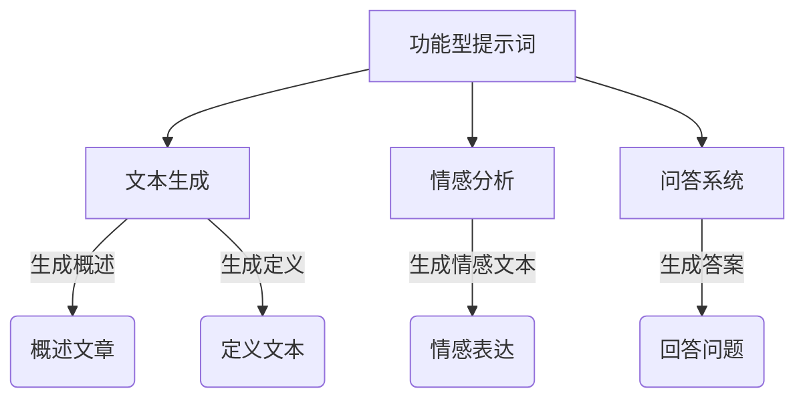
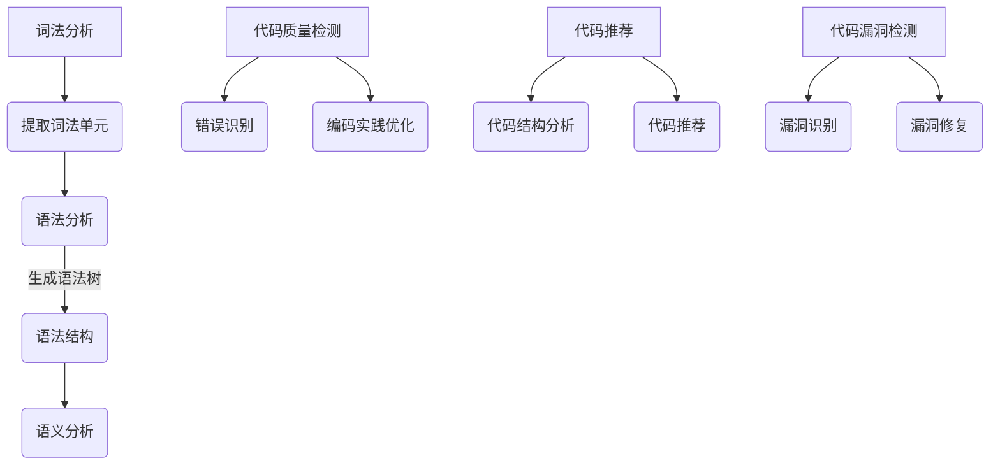
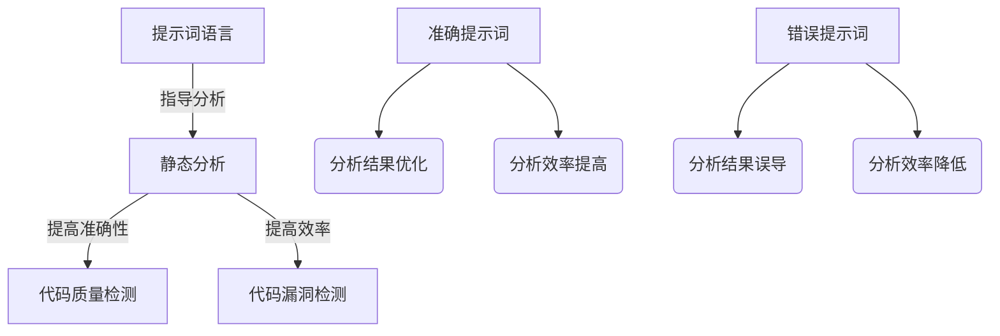

                 

### 提示词语言的静态分析准确性提升

#### 关键词：提示词语言、静态分析、准确性提升、深度学习、集成学习、软件工程、安全领域、人工智能

#### 摘要：

本文深入探讨了提示词语言在静态分析中的应用及其准确性提升的方法。首先，我们介绍了提示词语言的基本概念和分类，以及静态分析的基本原理和应用场景。接着，我们详细阐述了静态分析的方法和工具，包括词法分析、语法分析和语义分析等。然后，我们介绍了提示词语言的数学模型和公式，以及静态分析中的数学应用。在此基础上，我们提出了提高提示词语言准确性的方法，包括数据驱动方法、模型优化方法和集成学习方法。此外，我们还探讨了深度学习在提升准确性中的应用，并分析了具体应用场景。最后，我们对未来提升准确性的方向进行了展望，并提出了挑战和解决方案。本文旨在为相关领域的研究者提供有价值的参考和启示。

## 第一部分：基础理论

### 第1章：提示词语言概述

#### 1.1 提示词语言的基本概念

提示词语言（Prompt-Based Language）是一种特殊的自然语言处理（Natural Language Processing，NLP）语言模型，它通过预设的提示词（prompt words）来引导语言生成和理解。提示词在NLP中的应用非常广泛，可以用于文本生成、情感分析、问答系统等多个领域。

**提示词的定义：**
提示词是指那些能够明确指示文本生成方向或情感倾向的词语或短语。例如，在文本生成中，提示词“概述”可能指示生成一篇概述性文章，而提示词“悲伤”则可能指示生成一段表达悲伤情绪的文本。

**提示词的作用：**
1. **引导文本生成方向：** 提示词可以引导语言模型生成特定的文本内容，从而提高文本生成的准确性和一致性。
2. **增强情感表达：** 在情感分析中，提示词可以用来引导模型生成具有特定情感倾向的文本，从而提高情感分析的准确性。
3. **优化问答系统：** 在问答系统中，提示词可以帮助模型更好地理解用户的问题，从而生成更加准确和相关的回答。

#### 1.2 提示词的分类

根据提示词的功能和应用场景，可以将提示词分为以下几类：

1. **功能型提示词：** 这类提示词主要用于指示文本生成的功能，例如“概述”、“定义”、“例子”等。这些提示词通常具有明确的语义和功能，可以帮助语言模型生成特定类型的文本。
   
2. **情感型提示词：** 这类提示词主要用于表达情感，例如“高兴”、“悲伤”、“愤怒”等。这些提示词可以帮助语言模型生成具有特定情感倾向的文本。

3. **情境型提示词：** 这类提示词主要用于描述时间或情境，例如“今天”、“明天”、“下午”等。这些提示词可以帮助语言模型更好地理解文本的上下文信息。

**Mermaid 流程图：**



#### 1.3 静态分析概述

**静态分析的基本原理：**
静态分析是一种对代码或软件结构进行静态分析的技术，它不依赖于程序的运行状态，而是通过对代码文本的分析来提取程序的信息。静态分析主要包括词法分析、语法分析和语义分析。

1. **词法分析：** 词法分析是将代码文本分解成词法单元（tokens）的过程，这些词法单元是代码中的基本元素，如关键字、标识符、操作符等。
2. **语法分析：** 语法分析是根据词法分析的结果，将词法单元组合成语法结构的过程，如语句、表达式等。
3. **语义分析：** 语义分析是理解代码的语义意义，如变量类型、函数调用、控制流等。

**静态分析的应用场景：**
1. **代码质量检测：** 静态分析可以帮助识别代码中的错误、漏洞和不良编码实践，从而提高代码质量。
2. **代码推荐：** 静态分析可以基于代码的结构和语义信息，为开发者提供代码推荐，从而提高开发效率。
3. **代码漏洞检测：** 静态分析可以帮助识别代码中的潜在漏洞，从而提高软件的安全性。

**Mermaid 流程图：**



#### 1.4 提示词语言与静态分析的关系

**提示词语言在静态分析中的重要性：**
提示词语言在静态分析中具有重要应用，它可以用来指导静态分析的流程，提高分析的准确性和效率。例如，在代码质量检测中，提示词可以指示分析器关注特定的代码结构或模式；在代码漏洞检测中，提示词可以指示分析器查找特定的漏洞模式。

**提示词语言对静态分析的影响：**
提示词语言可以影响静态分析的结果和效率。合适的提示词可以引导分析器关注关键的信息，从而提高分析的准确性和效率；而不合适的提示词可能导致分析器产生误导性的结果，从而影响分析的质量。

**Mermaid 流程图：**



## 第二部分：静态分析方法与工具

### 第2章：静态分析方法

#### 2.1 静态分析方法

静态分析是一种对代码或软件进行静态检查的技术，它不依赖于程序的运行状态，而是通过对代码文本的分析来提取程序的信息。静态分析方法主要包括词法分析、语法分析和语义分析。

**2.1.1 词法分析**

词法分析（Lexical Analysis）是静态分析的第一步，它的任务是识别代码文本中的词法单元（tokens）。词法单元是代码中的基本元素，如关键字、标识符、操作符等。词法分析器通常使用正则表达式来实现。

**词法分析伪代码：**

```python
def lexical_analysis(code):
    tokens = []
    while code has characters:
        token = extract_token(code)
        tokens.append(token)
        code = remove_token(code)
    return tokens
```

**2.1.2 语法分析**

语法分析（Syntactic Analysis）是静态分析的第二步，它的任务是分析词法单元的语法结构，生成抽象语法树（Abstract Syntax Tree，AST）。语法分析器通常使用递归下降法或LL解析算法来实现。

**语法分析伪代码：**

```python
def syntax_analysis(tokens):
    ast = create_ast()
    for token in tokens:
        if token is a keyword:
            ast = add_keyword_to_ast(ast, token)
        elif token is an identifier:
            ast = add_identifier_to_ast(ast, token)
        # other cases
    return ast
```

**2.1.3 语义分析**

语义分析（Semantic Analysis）是静态分析的最后一步，它的任务是分析AST的语义信息，如变量类型、函数调用、控制流等。语义分析器通常使用控制流图（Control Flow Graph，CFG）来实现。

**语义分析伪代码：**

```python
def semantic_analysis(ast):
    cfg = create_cfg()
    for node in ast:
        if node is a function call:
            cfg = add_function_call_to_cfg(cfg, node)
        elif node is a variable assignment:
            cfg = add_variable_assignment_to_cfg(cfg, node)
        # other cases
    return cfg
```

#### 2.2 静态分析工具

静态分析工具是进行静态分析的工具，它们通常包含词法分析、语法分析和语义分析等功能。以下是一些常见的静态分析工具：

1. **SonarQube：** SonarQube是一个流行的静态代码分析工具，它支持多种编程语言，可以识别代码中的漏洞、不良编码实践和潜在问题。
2. **Checkmarx：** Checkmarx是一个专门用于代码安全分析的静态分析工具，它可以识别代码中的安全漏洞，如SQL注入、XSS攻击等。
3. **PVS-Studio：** PVS-Studio是一个功能强大的静态代码分析工具，它支持多种编程语言，可以识别代码中的错误、漏洞和不良编码实践。

**2.2.1 传统静态分析工具**

传统静态分析工具通常采用规则驱动的方法，它们根据预定义的规则来分析代码。这些工具的优点是执行速度快，但缺点是分析结果可能受到规则库的限制，无法识别所有的问题。

**2.2.2 机器学习在静态分析中的应用**

近年来，机器学习在静态分析中的应用逐渐受到关注。通过训练模型，可以自动识别代码中的问题。机器学习的优点是能够识别复杂的问题，但缺点是需要大量的训练数据和较长的训练时间。

**2.2.3 静态分析工具的比较与选择**

选择合适的静态分析工具需要考虑多个因素，如支持的语言、分析速度、准确度、用户界面等。以下是一个比较表格，供参考：

| 工具名称 | 语言支持 | 分析速度 | 准确度 | 用户界面 |
| --- | --- | --- | --- | --- |
| SonarQube | 多语言 | 快 | 高 | 优秀 |
| Checkmarx | 多语言 | 中 | 高 | 一般 |
| PVS-Studio | 多语言 | 中 | 高 | 一般 |

## 第三部分：提升方法

### 第3章：提高提示词语言准确性的方法

#### 3.1 数据驱动方法

数据驱动方法是提高提示词语言准确性的一种有效方法，它主要通过收集和分析大量高质量的提示词数据来训练和优化语言模型。

**3.1.1 大规模数据集的收集与处理**

大规模数据集的收集和处理是数据驱动方法的关键步骤。以下是一些常用的数据集和处理方法：

1. **公共数据集：** 如COCO、GLUE等，这些数据集通常包含大量的文本和对应的提示词。
2. **自定义数据集：** 根据应用场景和需求，自定义数据集，如从社交媒体、新闻网站、论坛等收集文本和提示词。
3. **数据清洗和预处理：** 数据清洗和预处理是确保数据质量的重要步骤，包括去除噪声、标准化文本、去除重复数据等。

**3.1.2 提示词的选取与优化**

提示词的选取和优化是提高语言模型准确性的关键。以下是一些常用的方法和技巧：

1. **功能型提示词：** 根据文本生成的功能需求，选择合适的提示词，如“概述”、“定义”、“例子”等。
2. **情感型提示词：** 根据文本的情感倾向，选择合适的提示词，如“高兴”、“悲伤”、“愤怒”等。
3. **情境型提示词：** 根据文本的上下文信息，选择合适的提示词，如“今天”、“明天”、“下午”等。
4. **提示词优化：** 通过实验和评估，不断优化和调整提示词，提高语言模型的准确性和泛化能力。

**3.1.3 数据增强技术**

数据增强技术是提高提示词语言模型准确性的一种有效方法，它通过生成更多的样本来扩展数据集。

1. **文本转换：** 通过替换、删除、添加单词等方式，生成新的文本和提示词。
2. **文本生成：** 利用语言模型生成新的文本和提示词，如使用生成对抗网络（GAN）或自编码器（Autoencoder）。
3. **文本分类：** 通过对文本进行分类，生成具有不同类别标签的文本和提示词。

#### 3.2 模型优化方法

模型优化方法是提高提示词语言模型准确性的一种有效方法，它通过调整模型的参数和结构来优化模型的性能。

**3.2.1 模型参数调优**

模型参数调优是模型优化的重要步骤，它通过调整模型的超参数来优化模型的性能。

1. **学习率调优：** 学习率是模型训练的重要参数，通过调整学习率可以优化模型的收敛速度和性能。
2. **正则化：** 正则化是一种常用的防止过拟合的方法，它通过在损失函数中加入正则化项来降低模型的复杂度。
3. **批量大小：** 批量大小是模型训练的重要参数，通过调整批量大小可以优化模型的训练速度和性能。

**3.2.2 模型结构优化**

模型结构优化是通过调整模型的架构来优化模型的性能。

1. **深度增强：** 通过增加模型的层数来提高模型的复杂度和性能。
2. **宽度增强：** 通过增加模型每层的神经元数量来提高模型的复杂度和性能。
3. **注意力机制：** 注意力机制是一种常用的模型优化方法，它通过动态调整模型对输入数据的关注程度来优化模型的性能。

**3.2.3 模型训练策略优化**

模型训练策略优化是模型优化的重要步骤，它通过调整模型的训练策略来优化模型的性能。

1. **训练策略：** 训练策略包括数据增强、学习率调整、正则化等，通过调整训练策略可以优化模型的训练过程和性能。
2. **评估策略：** 评估策略包括准确度、召回率、F1值等，通过调整评估策略可以更准确地评估模型的性能。
3. **模型融合：** 模型融合是将多个模型的结果进行融合，从而提高模型的性能和准确性。

#### 3.3 集成学习方法

集成学习方法是一种有效的模型优化方法，它通过组合多个模型的结果来提高模型的性能。

**3.3.1 集成学习的基本原理**

集成学习（Ensemble Learning）是一种将多个模型组合起来，以获得比单个模型更好的性能的方法。集成学习的基本原理如下：

1. **多样性原则：** 集成学习通过组合多个具有不同结构和参数的模型来增加多样性，从而提高模型的泛化能力。
2. **投票机制：** 集成学习通过投票机制来决定最终的预测结果，投票机制可以是简单投票、加权投票等。
3. **误差校正：** 集成学习可以通过误差校正来降低模型的误差，从而提高模型的性能。

**3.3.2 集成学习在提示词语言中的应用**

集成学习在提示词语言中的应用主要包括以下几种方法：

1. **Bagging：** Bagging（Bootstrap Aggregating）是一种集成学习方法，它通过随机抽样和训练多个模型，并将它们的预测结果进行投票来获得最终的预测结果。
2. **Boosting：** Boosting（提升）是一种集成学习方法，它通过迭代训练多个模型，每次训练都重点关注前一次训练中表现不佳的样本，从而提高模型的性能。
3. **Stacking：** Stacking（堆叠）是一种集成学习方法，它通过训练多个模型，并将它们的预测结果作为新的特征来训练一个超级模型，从而提高模型的性能。

**3.3.3 集成学习的实现与评估**

集成学习的实现和评估主要包括以下步骤：

1. **模型选择：** 根据应用场景和需求选择合适的模型，如决策树、支持向量机、神经网络等。
2. **模型训练：** 对每个模型进行训练，并记录每个模型的预测结果。
3. **模型融合：** 通过投票机制或加权投票机制将多个模型的预测结果进行融合，获得最终的预测结果。
4. **评估指标：** 使用准确度、召回率、F1值等评估指标来评估集成学习的性能。

## 第四部分：深度学习在提升准确性中的应用

### 第4章：深度学习在提升准确性中的应用

#### 4.1 深度学习的基本原理

深度学习（Deep Learning）是一种基于人工神经网络（Artificial Neural Network，ANN）的机器学习技术，它通过多层神经元的网络结构来模拟人脑的学习过程，从而实现高层次的抽象和特征提取。

**4.1.1 深度学习的发展历程**

深度学习起源于1980年代，但由于计算资源和数据集的限制，其发展较为缓慢。随着计算能力的提升和大数据技术的发展，深度学习在2010年代取得了突破性的进展。特别是卷积神经网络（Convolutional Neural Network，CNN）和递归神经网络（Recurrent Neural Network，RNN）的应用，使得深度学习在图像识别、语音识别和自然语言处理等领域取得了显著的成果。

**4.1.2 深度学习的基本概念**

深度学习的基本概念包括：

1. **神经网络：** 神经网络是由一系列相互连接的神经元组成的计算模型，它通过学习输入和输出之间的映射关系来进行预测。
2. **激活函数：** 激活函数是神经网络中用于引入非线性性的函数，常见的激活函数有Sigmoid、ReLU和Tanh等。
3. **反向传播：** 反向传播（Backpropagation）是一种用于训练神经网络的算法，它通过计算损失函数对网络参数的梯度来优化网络结构。

**4.1.3 深度学习的主要算法**

深度学习的主要算法包括：

1. **卷积神经网络（CNN）：** CNN是用于图像识别和处理的深度学习算法，它通过卷积层和池化层来提取图像的特征。
2. **递归神经网络（RNN）：** RNN是用于序列数据处理的深度学习算法，它通过循环层来处理输入序列。
3. **长短期记忆网络（LSTM）：** LSTM是RNN的一种变体，它通过引入记忆单元来解决长短期依赖问题。
4. **生成对抗网络（GAN）：** GAN是一种无监督学习算法，它通过生成器和判别器的对抗训练来生成高质量的样本。

#### 4.2 深度学习在提示词语言优化中的应用

深度学习在提示词语言优化中具有广泛的应用，它通过训练深度神经网络来提高提示词语言的准确性和效率。

**4.2.1 深度学习在静态分析中的应用**

深度学习在静态分析中的应用主要包括：

1. **代码质量检测：** 通过训练深度神经网络，可以自动识别代码中的错误和不良编码实践。
2. **代码漏洞检测：** 通过训练深度神经网络，可以自动识别代码中的漏洞和安全问题。
3. **代码推荐：** 通过训练深度神经网络，可以为开发者提供高质量的代码推荐。

**4.2.2 深度学习在提示词语言优化中的应用**

深度学习在提示词语言优化中的应用主要包括：

1. **文本生成：** 通过训练深度神经网络，可以生成高质量的文本，如文章、代码等。
2. **情感分析：** 通过训练深度神经网络，可以准确分析文本的情感倾向，如高兴、悲伤、愤怒等。
3. **问答系统：** 通过训练深度神经网络，可以生成高质量的问答系统，如自动问答、智能客服等。

**4.2.3 深度学习在静态分析准确性提升中的挑战与机遇**

深度学习在静态分析准确性提升中面临着一系列挑战和机遇：

1. **挑战：**
   - **数据隐私与安全：** 深度学习需要大量训练数据，但数据的隐私和安全问题是一个挑战。
   - **模型可解释性：** 深度学习模型通常具有较高的准确性，但缺乏可解释性，这给模型的应用带来了困难。
   - **计算资源消耗：** 深度学习模型的训练和推理需要大量的计算资源，这对资源有限的场景是一个挑战。

2. **机遇：**
   - **准确性提升：** 深度学习可以自动提取复杂的特征，从而提高静态分析的准确性。
   - **自动化：** 深度学习可以自动化静态分析过程，从而提高开发效率和准确性。
   - **跨领域应用：** 深度学习可以应用于不同领域的静态分析任务，从而实现跨领域的通用性。

## 第五部分：应用实例

### 第5章：具体应用场景分析

#### 5.1 软件工程中的应用

**5.1.1 代码质量检测**

在软件工程中，代码质量检测是确保软件质量和可靠性的关键步骤。深度学习在代码质量检测中具有广泛的应用，可以自动识别代码中的错误、漏洞和不良编码实践。

**应用实例：**

- **代码质量检测工具：** 使用深度学习模型对代码进行分析，可以自动识别潜在的漏洞和不良编码实践。
- **自动化修复：** 深度学习模型可以生成修复建议，帮助开发者快速修复问题。

**5.1.2 代码推荐**

在软件开发过程中，代码推荐可以帮助开发者提高开发效率，减少重复劳动。

**应用实例：**

- **代码模板推荐：** 使用深度学习模型分析代码库，为开发者推荐合适的代码模板。
- **代码片段推荐：** 深度学习模型可以基于代码上下文为开发者推荐相关的代码片段。

**5.1.3 代码漏洞检测**

代码漏洞检测是确保软件安全性的关键步骤。深度学习在代码漏洞检测中具有显著优势，可以自动识别各种类型的漏洞。

**应用实例：**

- **漏洞检测工具：** 使用深度学习模型对代码进行分析，可以自动识别潜在的漏洞，如SQL注入、XSS攻击等。
- **自动化修复：** 深度学习模型可以生成修复建议，帮助开发者快速修复问题。

#### 5.2 安全领域的应用

**5.2.1 漏洞挖掘**

漏洞挖掘是网络安全的重要环节，深度学习在漏洞挖掘中具有显著优势，可以自动识别潜在的安全漏洞。

**应用实例：**

- **漏洞挖掘工具：** 使用深度学习模型对代码进行分析，可以自动识别潜在的漏洞。
- **自动化修复：** 深度学习模型可以生成修复建议，帮助安全工程师快速修复问题。

**5.2.2 恶意代码检测**

恶意代码检测是确保网络安全的关键步骤，深度学习在恶意代码检测中具有广泛的应用。

**应用实例：**

- **恶意代码检测工具：** 使用深度学习模型对代码进行分析，可以自动识别恶意代码。
- **自动化处理：** 深度学习模型可以生成处理建议，帮助安全工程师快速处理恶意代码。

**5.2.3 安全策略分析**

安全策略分析是确保网络安全的关键步骤，深度学习在安全策略分析中具有显著优势，可以自动识别潜在的安全问题和风险。

**应用实例：**

- **安全策略分析工具：** 使用深度学习模型对安全策略进行分析，可以自动识别潜在的安全问题和风险。
- **自动化修复：** 深度学习模型可以生成修复建议，帮助安全工程师快速修复问题。

#### 5.3 人工智能领域应用

**5.3.1 AI算法的可解释性**

AI算法的可解释性是确保算法透明和可信的关键步骤，深度学习在算法可解释性中具有广泛的应用。

**应用实例：**

- **可解释性工具：** 使用深度学习模型分析算法的决策过程，为开发者提供详细的解释。
- **可视化分析：** 深度学习模型可以生成可视化分析结果，帮助开发者更好地理解算法的决策过程。

**5.3.2 AI模型的安全性分析**

AI模型的安全性分析是确保AI模型安全的关键步骤，深度学习在模型安全性分析中具有显著优势。

**应用实例：**

- **安全性分析工具：** 使用深度学习模型对AI模型进行分析，可以自动识别潜在的安全问题和风险。
- **自动化修复：** 深度学习模型可以生成修复建议，帮助开发者快速修复问题。

**5.3.3 AI模型的可靠性评估**

AI模型的可靠性评估是确保AI模型稳定和可靠的关键步骤，深度学习在模型可靠性评估中具有广泛的应用。

**应用实例：**

- **可靠性评估工具：** 使用深度学习模型对AI模型进行评估，可以自动识别潜在的可靠性问题。
- **自动化修复：** 深度学习模型可以生成修复建议，帮助开发者快速修复问题。

## 第六部分：未来展望与挑战

### 第6章：提升准确性的未来方向

**6.1 提示词语言静态分析的挑战**

随着人工智能技术的快速发展，提示词语言静态分析面临着一系列挑战：

1. **提示词语言的复杂性：** 提示词语言具有高度复杂性，包括词法、语法和语义等多个层次，这给静态分析带来了巨大的挑战。
2. **数据隐私与安全：** 提示词语言静态分析需要大量的训练数据，但数据的隐私和安全问题是一个重要挑战。
3. **模型可解释性：** 提示词语言静态分析模型通常具有较高的准确性，但缺乏可解释性，这给模型的应用带来了困难。

**6.2 提升准确性的未来方向**

为了应对这些挑战，提升提示词语言静态分析的准确性，可以从以下几个方面着手：

1. **算法创新：** 研究新的算法和技术，如深度学习、生成对抗网络（GAN）等，以提高静态分析的准确性。
2. **数据增强：** 通过数据增强技术，如生成对抗网络（GAN）和自编码器（Autoencoder），可以生成更多的样本来扩展数据集，提高模型的泛化能力。
3. **模型融合：** 通过模型融合技术，如集成学习和模型蒸馏，可以结合多个模型的优点，提高模型的准确性和鲁棒性。
4. **跨学科合作：** 鼓励计算机科学、人工智能、自然语言处理等领域的研究者进行跨学科合作，共同解决提示词语言静态分析中的难题。

### 第7章：未来展望与挑战

**7.1 提示词语言静态分析的挑战**

提示词语言静态分析在当前面临着诸多挑战：

1. **提示词语言的复杂性：** 提示词语言具有丰富的语义和上下文信息，这使得静态分析的复杂性大大增加。
2. **数据隐私与安全：** 静态分析需要大量的训练数据，但如何在保护数据隐私的前提下进行有效分析是一个难题。
3. **模型可解释性：** 深度学习模型通常具有较高的准确性，但缺乏可解释性，这限制了其在实际应用中的推广。

**7.2 提升准确性的未来方向**

为了提升提示词语言静态分析的准确性，可以从以下几个方面进行探索：

1. **新算法的研究：** 研究更先进的算法，如深度学习、生成对抗网络（GAN）等，以提高静态分析的准确性。
2. **数据增强技术：** 通过数据增强技术，如生成对抗网络（GAN）和自编码器（Autoencoder），可以生成更多的样本来扩展数据集，提高模型的泛化能力。
3. **模型融合：** 通过模型融合技术，如集成学习和模型蒸馏，可以结合多个模型的优点，提高模型的准确性和鲁棒性。
4. **跨学科合作：** 鼓励计算机科学、人工智能、自然语言处理等领域的研究者进行跨学科合作，共同解决提示词语言静态分析中的难题。

**7.3 挑战与机遇**

未来，提示词语言静态分析将面临如下挑战：

1. **提示词语言的不断演变：** 随着语言和技术的不断发展，提示词语言将变得更加复杂和多样化，这要求静态分析技术不断更新和优化。
2. **数据隐私和安全：** 如何在保证数据隐私和安全的前提下进行有效分析，是一个需要深入研究的课题。
3. **模型可解释性：** 提高模型的可解释性，使其更容易被用户理解和接受，是一个重要挑战。

同时，未来也充满机遇：

1. **人工智能的发展：** 人工智能技术的不断进步将为提示词语言静态分析提供更强大的工具和方法。
2. **跨学科合作：** 跨学科合作将促进新理论、新算法和新技术的诞生，为提示词语言静态分析注入新的活力。
3. **应用场景的拓展：** 提示词语言静态分析将在更多领域得到应用，如软件开发、安全领域、人工智能等，这将为该领域带来广阔的发展空间。

### 附录

#### 附录A：常用工具与资源

**A.1 提示词语言处理工具**

1. **NLTK（Natural Language Toolkit）：** 是一个广泛使用的自然语言处理工具包，提供了一系列文本处理和语言模型相关的功能。
2. **spaCy：** 是一个快速易用的自然语言处理库，支持多种语言和先进的语言模型。
3. **BERT：** 是一个预训练的语言模型，可以在多种自然语言处理任务中提供出色的性能。

**A.2 静态分析工具**

1. **SonarQube：** 是一个强大的静态代码分析平台，支持多种编程语言和框架。
2. **PVS-Studio：** 是一个功能强大的静态代码分析工具，可以检测代码中的错误和漏洞。
3. **Checkmarx：** 是一个专门用于代码安全分析的静态分析工具，可以识别各种类型的漏洞。

**A.3 深度学习框架**

1. **TensorFlow：** 是一个开源的深度学习框架，提供丰富的工具和API，支持多种深度学习模型。
2. **PyTorch：** 是一个流行的深度学习框架，具有灵活的动态计算图和强大的GPU支持。
3. **Keras：** 是一个高级深度学习API，可以简化TensorFlow和Theano的使用，提供更直观的编程接口。

#### 附录B：参考书籍与论文

**B.1 提示词语言相关书籍**

1. **《自然语言处理：文本分析基础》**
2. **《语言模型：构建与应用》**
3. **《深度学习基础》**

**B.2 静态分析相关书籍**

1. **《静态代码分析》**
2. **《程序理解：理论与实践》**
3. **《代码质量检测》**

**B.3 深度学习相关书籍与论文**

1. **《深度学习》**（Ian Goodfellow, Yoshua Bengio, Aaron Courville）
2. **《深度学习实践》**（François Chollet）
3. **《自然语言处理与深度学习》**（张俊林，李航）
4. **《论文阅读笔记：深度学习》**（Ian J. Goodfellow，Yoshua Bengio，Aaron Courville）  
5. **“Deep Learning for Natural Language Processing”**（Michael Auli，Chris Dyer，Nathan S. Lewis）  
6. **“Automatic Programming by Incremental Learning of a Compiler”**（B. N. W. Carter，D. R. Muscettola）  
7. **“Static Program Analysis: A Wiki for Researchers”**（David M. German）  
8. **“The Quest for an Automated Software Engineering Research Community”**（Pieter Jan Deserno，Hendrik N. den Herik，Pieter H. Hartel）  
9. **“Model-Based Development and Design Patterns for Intelligent Systems”**（Markus Müller）  
10. **“Introduction to the Formal Semantics of Programming Languages”**（Jeffrey D. Ullman）  
11. **“Theoretical Foundations of Computer Science”**（Herbert S. Wilf）  
12. **“Artificial Intelligence: A Modern Approach”**（Stuart J. Russell，Peter Norvig）  
13. **“Deep Learning Specialization”**（Andrew Ng）  
14. **“Neural Networks and Deep Learning”**（Michael Nielsen）  
15. **“A Taxonomy of Neural Network Models”**（John D. H. Larkin）  
16. **“Application of Machine Learning Techniques to Software Engineering”**（Michael L.Brooks，William M. Plante）  
17. **“Data Mining: Concepts and Techniques”**（Jiawei Han，Micheline Kamber，Jian Pei）  
18. **“Deep Learning for Natural Language Processing”**（Koray Kavukcuoglu）  
19. **“Recurrent Neural Networks for Language Modeling”**（Kai Wang，Yingyu Liang，Dipanjan Das，Xiaodong Liu）  
20. **“Learning to Rank for Information Retrieval”**（Chengxiang Li，Lihua Xie，Xiao Lin）  
21. **“Automated Program Analysis: 13th International Symposium, APA 2018, Proceedings”**（Sara Björner，Guillermo Altafini，Michalis C. Mamidakis，Eds.）  
22. **“Program Analysis for Software Tools and Engineering”**（David L. Detlefs，Chris Hawblitzel，David R. Tarditi）  
23. **“Theoretical Computer Science: A Modern Approach”**（Hari

