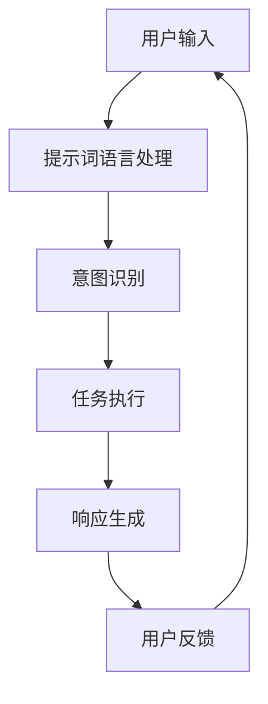

                 


### 文章标题：提示词语言：AI交互的未来

> 关键词：提示词语言，AI交互，自然语言处理，语音识别，语音合成，智能助手，聊天机器人，智能家居，教育领域，发展趋势

> 摘要：本文深入探讨了提示词语言在AI交互中的应用与未来发展趋势。通过分析提示词语言的定义、原理、技术栈，以及其在智能助手、聊天机器人、智能家居和教育领域的应用案例，本文旨在为读者揭示AI交互技术的潜力和未来前景。

---

#### 《提示词语言：AI交互的未来》目录大纲

### 第一部分：AI交互概述

## 第1章：AI交互的概念与演变

### 1.1 AI交互的定义

- AI交互（Artificial Intelligence Interaction）是指利用人工智能技术，实现人与机器之间的信息交流与互动。

### 1.2 AI交互的发展历程

- 从早期的命令行交互到现代的自然语言处理，AI交互经历了翻天覆地的变化。

### 1.3 提示词语言在AI交互中的角色

- 提示词语言作为AI交互的重要组成部分，扮演着连接用户与机器的桥梁角色。

## 第2章：AI交互的核心原理

### 2.1 自然语言处理基础

#### 2.1.1 语言模型

- 语言模型是自然语言处理的基础，它用于预测下一个单词或字符。

#### 2.1.2 对话管理

- 对话管理涉及如何在对话中维持用户的意图，确保对话的连贯性。

### 2.2 提示词语言的生成与理解

#### 2.2.1 提示词语言的生成机制

- 提示词语言的生成机制主要包括语言模型和序列生成算法。

#### 2.2.2 提示词语言的理解机制

- 提示词语言的理解机制涉及自然语言理解技术，如词法分析、句法分析和语义分析。

## 第3章：提示词语言技术栈

### 3.1 语音识别技术

#### 3.1.1 语音识别原理

- 语音识别技术通过将语音信号转换为文本信息，实现语音到文本的转换。

#### 3.1.2 语音识别算法

- 常见的语音识别算法包括隐马尔可夫模型（HMM）、高斯混合模型（GMM）和深度神经网络（DNN）。

### 3.2 语音合成技术

#### 3.2.1 语音合成原理

- 语音合成技术通过合成语音波形，实现文本到语音的转换。

#### 3.2.2 语音合成算法

- 常见的语音合成算法包括合成语音编码（SPEECH SYNTHESIS）和参数化语音合成（PARAMETRIC SYNTHESIS）。

## 第4章：AI交互系统架构

### 4.1 AI交互系统的组成

- AI交互系统通常包括语音识别、语音合成、对话管理等多个模块。

### 4.2 提示词语言在系统架构中的应用

- 提示词语言在系统架构中的应用有助于提升系统的交互能力和用户体验。

### 4.3 提示词语言与自然语言理解的关系

- 提示词语言与自然语言理解密切相关，二者共同构成了AI交互的核心。

### 第二部分：提示词语言的实现与应用

## 第5章：构建智能助手

### 5.1 智能助手的定义与功能

- 智能助手是一种利用AI技术，为用户提供便捷服务的虚拟智能代理。

### 5.2 提示词语言在智能助手中的应用

- 提示词语言在智能助手中的应用，有助于实现更加自然和流畅的交互。

### 5.3 智能助手的开发实践

- 通过一个智能助手开发案例，详细讲解智能助手的构建过程。

## 第6章：提示词语言在聊天机器人中的应用

### 6.1 聊天机器人的基础

- 聊天机器人是一种能够模拟人类对话的计算机程序。

### 6.2 提示词语言在聊天机器人中的作用

- 提示词语言在聊天机器人中的作用，有助于提高聊天的自然度和准确性。

### 6.3 聊天机器人的案例研究

- 分析一个实际案例，探讨提示词语言在聊天机器人中的应用。

## 第7章：提示词语言在智能家居中的应用

### 7.1 智能家居的概述

- 智能家居是一种通过物联网技术实现家居设备智能化控制的系统。

### 7.2 提示词语言在智能家居中的运用

- 提示词语言在智能家居中的应用，有助于实现更加便捷的语音控制。

### 7.3 智能家居案例分析

- 分析一个实际案例，探讨提示词语言在智能家居中的应用。

## 第8章：提示词语言在教育领域的应用

### 8.1 教育AI的现状与挑战

- 分析教育AI的现状，探讨面临的挑战。

### 8.2 提示词语言在教育中的应用

- 探讨提示词语言在教育中的应用，如智能辅导系统、自动批改作业等。

### 8.3 提示词语言在教育中的应用案例

- 分析教育领域的一个实际案例，探讨提示词语言的应用。

## 第9章：提示词语言的未来发展趋势

### 9.1 AI交互技术的未来发展

- 预测AI交互技术的未来发展，探讨提示词语言的发展方向。

### 9.2 提示词语言的未来方向

- 分析提示词语言的未来发展方向，如多模态交互、个性定制等。

### 9.3 提示词语言在多模态交互中的应用前景

- 探讨提示词语言在多模态交互中的应用前景，如语音识别与图像识别的结合。

### 附录

## 附录A：AI交互与提示词语言资源

### A.1 学习资源推荐

- 推荐学习资源，如书籍、在线课程、开源框架等。

### A.2 开源框架与工具

- 介绍常用的开源框架与工具，如TensorFlow、PyTorch等。

### A.3 行业报告与论文

- 分享行业报告与论文，了解AI交互领域的前沿动态。

## 附录B：提示词语言实现的伪代码示例

### B.1 提示词生成算法

- 提供提示词生成算法的伪代码示例。

### B.2 提示词理解算法

- 提供提示词理解算法的伪代码示例。

---

### 结束语

本文通过详细分析提示词语言在AI交互中的应用与未来发展趋势，为读者揭示了这一领域的重要性和潜力。随着AI技术的不断进步，提示词语言将在更多领域得到应用，为我们的生活带来更多便捷和惊喜。让我们共同期待AI交互的未来，探索更多可能性！### 第一部分：AI交互概述

#### 第1章：AI交互的概念与演变

##### 1.1 AI交互的定义

AI交互（Artificial Intelligence Interaction）是指利用人工智能技术，实现人与机器之间的信息交流与互动。它旨在通过模拟人类的思维方式，使机器能够理解、响应并执行人类的指令或请求。AI交互技术涉及到多个领域的知识，包括自然语言处理、机器学习、语音识别和语音合成等。

在过去的几十年中，AI交互技术经历了显著的发展。从最初的命令行界面和图形用户界面（GUI），到如今基于自然语言处理和语音识别的智能交互，AI交互技术逐渐变得更加智能和自然。这一演变过程不仅提升了用户体验，还推动了人工智能技术在各个领域的广泛应用。

##### 1.2 AI交互的发展历程

1. **早期阶段（20世纪60年代 - 80年代）**：
   - 这一时期，人工智能尚处于探索阶段。AI交互主要通过命令行界面进行，用户需要使用特定的命令来与计算机进行交互。
   - 早期的自然语言处理技术（如分词、语法分析）逐渐成熟，为后来的交互技术奠定了基础。

2. **中间阶段（20世纪90年代 - 2000年）**：
   - 随着图形用户界面的普及，AI交互从命令行界面转向GUI。用户可以通过鼠标和键盘与计算机进行交互。
   - 语音识别技术开始崭露头角，例如，语音拨号系统、语音邮件等。

3. **现代阶段（2000年至今）**：
   - 自然语言处理技术的进步，特别是深度学习技术的引入，使得AI交互变得更加智能和自然。
   - 智能个人助理（如Siri、Alexa、Google Assistant）的出现，代表了AI交互的又一重要里程碑。

##### 1.3 提示词语言在AI交互中的角色

提示词语言（Prompted Language）在AI交互中扮演着至关重要的角色。它是指用户通过简短、明确的指示，引导AI系统执行特定任务的交互方式。提示词语言具有以下几个特点：

1. **简洁性**：提示词语言通常由简短的单词或短语组成，易于理解和记忆。
2. **明确性**：提示词语言需要清晰明确，以便AI系统能够准确理解用户的意图。
3. **灵活性**：提示词语言可以根据不同的场景和任务进行灵活调整。

提示词语言在AI交互中的作用主要包括：

1. **任务引导**：提示词语言可以帮助用户明确地指示AI系统需要执行的任务。
2. **意图识别**：通过分析提示词语言，AI系统可以识别用户的意图，从而生成合适的响应。
3. **交互优化**：提示词语言有助于优化用户与AI系统之间的交互体验，使对话更加自然和流畅。

总之，提示词语言是AI交互中不可或缺的一部分，它不仅提升了交互的自然度，还增强了AI系统的实用性和用户体验。

---

**Mermaid 流程图：AI交互的核心概念与联系**



在这个流程图中，用户输入通过提示词语言处理模块传递给AI系统，经过意图识别后，AI系统执行相应的任务，并生成响应反馈给用户，形成一个闭环的交互过程。

---

**核心算法原理讲解：提示词语言的生成与理解**

**提示词语言的生成机制**

提示词语言的生成主要依赖于语言模型和序列生成算法。以下是一个简化的伪代码示例：

```python
def generate_prompt_word(previous_word):
    # 使用语言模型预测下一个单词
    next_words = language_model.predict(previous_word)
    # 从预测结果中选择一个最有可能的单词作为提示词
    prompt_word = select_most_likely_word(next_words)
    return prompt_word
```

**提示词语言的理解机制**

提示词语言的理解主要涉及自然语言理解技术，包括词法分析、句法分析和语义分析。以下是一个简化的伪代码示例：

```python
def understand_prompt_word(prompt_word):
    # 进行词法分析，提取词性
    tokenized_word = tokenizer.tokenize(prompt_word)
    # 进行句法分析，构建句法树
    parsed_tree = parser.parse(tokenized_word)
    # 进行语义分析，提取语义信息
    semantic_info = semantic_analyzer.analyze(parsed_tree)
    return semantic_info
```

**数学模型与公式**

提示词语言的生成通常依赖于概率模型，如马尔可夫模型（Markov Model）或循环神经网络（RNN）。以下是一个简化的数学模型示例：

$$
P(w_t | w_{t-1}, ..., w_1) = \frac{P(w_t | w_{t-1}) \cdot P(w_{t-1} | w_{t-2}, ..., w_1)}{P(w_{t-1} | w_{t-2}, ..., w_1)}
$$

其中，$P(w_t | w_{t-1}, ..., w_1)$ 表示在给定前一个单词序列 $w_{t-1}, ..., w_1$ 的情况下，生成当前单词 $w_t$ 的概率。

**举例说明**

假设用户输入的提示词为“你好”，我们可以使用语言模型和序列生成算法来生成下一个单词。例如，语言模型可能会预测“在”、“天”、“气”等单词作为下一个单词，然后根据上下文选择最合适的单词作为提示词。

---

在下一章中，我们将进一步探讨AI交互的核心原理，包括自然语言处理基础、提示词语言的生成与理解机制，以及AI交互系统架构。敬请期待！### 第二部分：提示词语言的实现与应用

#### 第5章：构建智能助手

##### 5.1 智能助手的定义与功能

智能助手（Intelligent Assistant）是一种基于人工智能技术的虚拟智能代理，它能够为用户提供个性化服务，帮助用户解决各种问题和需求。智能助手通过自然语言处理、机器学习和其他人工智能技术，实现对用户指令的理解和执行。其主要功能包括：

1. **语音识别与语音合成**：智能助手能够理解用户的语音指令，并通过语音合成技术将回复语音化。
2. **任务执行**：智能助手能够执行用户指定的任务，如设置提醒、发送消息、查询信息等。
3. **信息检索**：智能助手能够快速检索相关信息，为用户提供准确的答案。
4. **个性化服务**：智能助手能够根据用户的行为和偏好，提供个性化的建议和服务。
5. **情感交互**：智能助手能够模拟人类的情感表达，增强用户的交互体验。

智能助手在不同场景中的应用非常广泛，如智能家居、客户服务、健康管理、教育辅导等。

##### 5.2 提示词语言在智能助手中的应用

提示词语言在智能助手中发挥着关键作用，它能够提升智能助手的交互质量和用户体验。以下是提示词语言在智能助手中的几个关键应用：

1. **任务引导**：用户通过简短的提示词，如“设置提醒”、“发送消息”等，引导智能助手执行特定任务。
2. **意图识别**：智能助手通过分析提示词，理解用户的意图，从而生成合适的响应。例如，当用户说“明天早上7点叫我起床”时，智能助手能够识别出用户的意图是设置一个早上7点的闹钟提醒。
3. **交互优化**：提示词语言使得交互过程更加自然和流畅。例如，用户可以像与朋友聊天一样，与智能助手进行对话，从而获得更好的用户体验。
4. **上下文理解**：智能助手能够通过上下文信息，理解用户的后续指令。例如，用户说“今天天气怎么样？”和“带伞吗？”，智能助手能够根据前一个问题的答案，回答是否需要带伞。

以下是一个简单的提示词语言应用示例：

```python
# 用户输入：设置一个晚上9点的提醒
prompt = "设置一个晚上9点的提醒"

# 智能助手解析提示词，识别意图
if "设置提醒" in prompt:
    time = extract_time_from_prompt(prompt)
    set_reminder(time)

# 辅助函数：从提示词中提取时间
def extract_time_from_prompt(prompt):
    # 使用自然语言处理技术提取时间
    # 例如，可以从"晚上9点"中提取出"9点"
    return "9点"

# 辅助函数：设置提醒
def set_reminder(time):
    # 实现提醒功能
    print(f"已设置提醒，将在{time}提醒您。")
```

##### 5.3 智能助手的开发实践

要开发一个智能助手，需要以下步骤：

1. **需求分析**：明确智能助手的用途和目标用户，确定需要实现的功能。
2. **技术选型**：选择合适的开发框架和工具，如Python、TensorFlow、PyTorch等。
3. **数据准备**：收集和整理用于训练的数据集，包括语音数据、文本数据和用户交互日志等。
4. **模型训练**：使用收集到的数据训练语音识别、语言模型和意图识别模型。
5. **系统集成**：将训练好的模型集成到智能助手系统中，实现语音识别、自然语言理解和任务执行功能。
6. **测试与优化**：对智能助手进行测试和优化，确保其能够准确理解用户指令并执行任务。

以下是一个智能助手开发案例：

**案例：智能日程管理助手**

**需求分析**：该智能助手旨在帮助用户管理日程，提供日程提醒、会议安排和任务跟踪功能。

**技术选型**：使用TensorFlow框架，结合Python编程语言进行开发。

**数据准备**：收集用户日程安排数据、语音数据和文本数据，用于训练语音识别、语言模型和意图识别模型。

**模型训练**：使用收集到的数据训练语音识别模型，以实现语音指令的识别；使用自然语言处理技术训练语言模型，以实现自然语言理解；使用用户交互日志数据训练意图识别模型，以识别用户的意图。

**系统集成**：将训练好的模型集成到智能助手系统中，实现语音识别、自然语言理解和任务执行功能。

**测试与优化**：对智能助手进行功能测试，确保其能够准确理解用户指令并执行任务；根据用户反馈进行优化，提升智能助手的用户体验。

通过以上步骤，我们可以开发出一个功能齐全、用户体验良好的智能日程管理助手。

---

在下一章中，我们将探讨提示词语言在聊天机器人中的应用，分析聊天机器人的基础、提示词语言的作用以及实际案例研究。敬请期待！### 第6章：提示词语言在聊天机器人中的应用

#### 6.1 聊天机器人的基础

聊天机器人（Chatbot）是一种基于人工智能技术的计算机程序，它可以模拟人类对话，与用户进行交互，回答问题或执行任务。聊天机器人广泛应用于客户服务、市场营销、客户支持、娱乐等领域，为企业和个人提供了便捷的交互体验。

聊天机器人通常由以下几个关键组件组成：

1. **用户界面**：用户通过文本或语音与聊天机器人进行交互。
2. **自然语言处理（NLP）**：用于理解用户的输入，提取意图和关键词。
3. **对话管理**：负责维护对话的连贯性，确保聊天机器人能够适当地响应用户的输入。
4. **知识库**：存储相关的信息，用于回答用户的问题或提供相关信息。
5. **响应生成**：根据用户输入和对话管理的结果，生成合适的回复。

#### 6.2 提示词语言在聊天机器人中的作用

提示词语言在聊天机器人中扮演着重要的角色，它能够提升聊天机器人的交互质量和用户体验。以下是提示词语言在聊天机器人中的几个关键作用：

1. **任务引导**：用户通过简短的提示词，如“我要订购”、“我要查询”等，明确地指示聊天机器人需要执行的任务。
2. **意图识别**：聊天机器人通过分析提示词，理解用户的意图，从而生成合适的响应。例如，当用户说“明天天气怎么样？”时，聊天机器人可以识别出用户的意图是查询天气信息。
3. **交互优化**：提示词语言使得交互过程更加自然和流畅。例如，用户可以像与朋友聊天一样，与聊天机器人进行对话，从而获得更好的用户体验。
4. **上下文理解**：聊天机器人能够通过上下文信息，理解用户的后续指令。例如，用户说“今天天气怎么样？”和“带伞吗？”，聊天机器人能够根据前一个问题的答案，回答是否需要带伞。

以下是一个简单的提示词语言应用示例：

```python
# 用户输入：明天天气怎么样？
prompt = "明天天气怎么样？"

# 聊天机器人解析提示词，识别意图
if "天气" in prompt:
    weather_info = get_weather_info()
    respond(weather_info)

# 辅助函数：获取天气信息
def get_weather_info():
    # 从知识库中获取天气信息
    return "明天将是晴天，气温约为20摄氏度。"

# 辅助函数：响应用户
def respond(weather_info):
    # 发送回复
    print(weather_info)
```

#### 6.3 聊天机器人的案例研究

以下是一个聊天机器人实际应用的案例研究：

**案例：智能客服聊天机器人**

**需求分析**：企业需要一个智能客服聊天机器人，以提供24/7的客户支持，提高客户满意度并降低人工客服的成本。

**技术选型**：使用Python和TensorFlow框架进行开发，结合Rasa开源聊天机器人平台。

**数据准备**：收集大量的客户对话数据，用于训练自然语言处理模型和意图识别模型。

**模型训练**：使用收集到的数据训练自然语言处理模型，以实现语音识别和意图识别；使用用户交互日志数据训练意图识别模型，以识别用户的意图。

**系统集成**：将训练好的模型集成到智能客服聊天机器人系统中，实现语音识别、自然语言理解和任务执行功能。

**测试与优化**：对智能客服聊天机器人进行功能测试，确保其能够准确理解用户指令并执行任务；根据用户反馈进行优化，提升智能客服聊天机器人的用户体验。

**实际应用**：

1. **用户咨询**：当用户通过网站或移动应用与智能客服聊天机器人进行交互时，机器人会根据用户输入的提示词，如“订单状态”、“退货流程”等，理解用户的意图。
2. **自动响应**：智能客服聊天机器人会根据用户的意图，自动生成合适的响应，如发送订单状态查询结果、提供退货流程说明等。
3. **人工接管**：当智能客服聊天机器人无法处理用户的请求时，机器人会自动将对话转交给人工客服，确保用户得到及时的帮助。

**效果评估**：

1. **客户满意度**：通过用户反馈和数据分析，智能客服聊天机器人的客户满意度显著提高。
2. **成本效益**：智能客服聊天机器人有效降低了企业的人工客服成本，提高了客服效率。
3. **数据积累**：随着用户交互数据的积累，智能客服聊天机器人能够不断学习和优化，提升其交互能力和服务水平。

通过以上案例研究，我们可以看到提示词语言在聊天机器人中的应用，不仅提升了机器人的交互质量和用户体验，还为企业带来了显著的成本效益和客户满意度提升。

---

在下一章中，我们将探讨提示词语言在智能家居中的应用，分析智能家居的概述、提示词语言在智能家居中的运用以及实际案例分析。敬请期待！### 第7章：提示词语言在智能家居中的应用

#### 7.1 智能家居的概述

智能家居（Smart Home）是指通过物联网（IoT）技术和智能设备，实现家庭设备之间的互联互通和自动化控制，从而为用户提供更加便捷、舒适和安全的居住环境。智能家居系统通常包括智能灯光、智能温控、智能安防、智能家电等多个方面。

**智能家居的发展历程**

1. **早期阶段**：智能家居的概念最早可以追溯到20世纪90年代，当时主要是一些高端住宅采用自动化的家居设备，如自动灯光控制系统和远程家电控制。
2. **中间阶段**：随着物联网技术的普及，智能家居逐渐从高端市场走向大众市场。这一阶段的智能家居产品以无线传感器网络和智能设备为主，如智能灯泡、智能插座和智能门锁。
3. **现代阶段**：当前，智能家居已经进入成熟阶段。智能音箱、智能语音助手和智能设备之间的互联互通成为智能家居系统的核心。例如，用户可以通过智能音箱控制家中的智能灯、智能空调等设备。

**智能家居的主要特点**

1. **互联互通**：智能家居设备可以通过Wi-Fi、蓝牙等无线通信技术，实现设备之间的互联互通，从而形成一个统一的智能控制系统。
2. **自动化控制**：智能家居系统能够根据用户的习惯和需求，实现自动化的设备控制，提高用户的便利性和舒适度。
3. **远程控制**：用户可以通过手机、平板电脑或智能音箱等设备，远程控制家中的智能设备，实现对家居环境的实时监控和调整。
4. **安全防护**：智能家居系统能够提供安防功能，如监控摄像头、智能门锁和烟雾报警器等，提高家庭的安全性和防护能力。

#### 7.2 提示词语言在智能家居中的运用

提示词语言在智能家居中的应用，极大地提升了用户的交互体验和系统的智能化水平。以下是提示词语言在智能家居中的几个关键应用场景：

1. **语音控制**：用户可以通过语音提示词，如“打开灯光”、“调整温度”等，控制家中的智能设备。例如，用户说“打开客厅的灯”，智能家居系统会自动识别用户的语音指令，并打开客厅的灯光。
2. **场景设定**：用户可以通过提示词，设定特定的场景模式，如“回家模式”、“睡觉模式”等。这些场景模式可以自动调整家中的灯光、温度和其他设备，以提供最舒适的居住环境。
3. **远程监控**：用户可以通过提示词，远程监控家中的安全状况，如“查看门口摄像头”、“关闭前门锁”等。这有助于用户在离家时，确保家庭的安全和设备的正常运行。

以下是一个简单的提示词语言应用示例：

```python
# 用户输入：打开客厅的灯
prompt = "打开客厅的灯"

# 智能家居系统解析提示词，执行相应的操作
if "打开灯" in prompt:
    turn_on_light("客厅")

# 辅助函数：打开客厅的灯光
def turn_on_light(room):
    # 实现灯光打开的功能
    print(f"{room}的灯光已打开。")
```

#### 7.3 智能家居案例分析

以下是一个智能家居实际应用的案例分析：

**案例：智能家庭安防系统**

**需求分析**：用户希望在家中安装一套智能家庭安防系统，实现对家庭安全的远程监控和自动报警。

**技术选型**：使用物联网技术、智能摄像头、智能门锁和智能音箱等设备，结合提示词语言进行开发。

**数据准备**：收集家庭安防相关的数据，包括监控视频、报警日志和用户交互数据等。

**系统集成**：将智能摄像头、智能门锁和智能音箱等设备集成到智能家居系统中，实现设备之间的互联互通。

**测试与优化**：对智能家庭安防系统进行测试和优化，确保其能够准确识别用户的语音指令并执行相应的操作。

**实际应用**：

1. **远程监控**：用户可以通过智能音箱远程查看家中的监控视频，实时了解家庭的安全状况。
2. **自动报警**：当智能摄像头检测到异常情况时，系统会自动发送报警信息到用户的手机，并触发智能门锁的报警功能。
3. **语音控制**：用户可以通过智能音箱控制家中的智能设备，如“打开摄像头”、“关闭门锁”等。

**效果评估**：

1. **安全性提升**：智能家庭安防系统有效提升了家庭的安全性和防护能力，降低了潜在的安全风险。
2. **便利性增强**：用户可以通过语音提示词，轻松地控制家中的智能设备，提高了家居生活的便利性和舒适度。
3. **用户体验优化**：通过提示词语言的应用，用户与智能家庭安防系统之间的交互变得更加自然和流畅。

通过以上案例，我们可以看到提示词语言在智能家居中的应用，不仅提升了系统的智能化水平和用户体验，还为家庭的安全和便利提供了强有力的保障。

---

在下一章中，我们将探讨提示词语言在教育领域的应用，分析教育AI的现状与挑战、提示词语言在教育中的应用以及具体的应用案例。敬请期待！### 第8章：提示词语言在教育领域的应用

#### 8.1 教育AI的现状与挑战

随着人工智能（AI）技术的快速发展，教育领域也迎来了AI的浪潮。教育AI（EdTech）正逐渐改变传统的教学模式，提供个性化学习、智能辅导和自动化评估等新型教育服务。以下是教育AI的现状和面临的挑战：

**教育AI的现状**

1. **个性化学习**：教育AI通过分析学生的学习数据，提供个性化的学习路径和推荐内容，满足不同学生的学习需求和节奏。
2. **智能辅导**：AI辅导系统利用自然语言处理和机器学习技术，为学生提供实时解答和指导，帮助学生在学习过程中克服困难。
3. **自动化评估**：教育AI可以自动评估学生的作业和考试，提供即时的反馈和成绩分析，减轻教师的工作负担。
4. **虚拟学习环境**：AI驱动的虚拟学习环境（VLE）和虚拟现实（VR）技术，为学生提供沉浸式学习体验，增强学习效果。

**教育AI的挑战**

1. **数据隐私和安全**：教育AI需要收集大量的学生数据，这涉及到数据隐私和安全问题。如何确保数据的安全性和隐私保护是一个重要的挑战。
2. **技术成熟度**：虽然AI技术在某些领域已经取得了显著进展，但其在教育领域的应用仍然处于早期阶段。技术的成熟度和稳定性是教育AI发展的重要挑战。
3. **教师和学生的接受度**：教育AI的引入需要教师和学生的适应和接受。教师需要掌握新的教学工具和方法，学生需要适应新的学习模式。
4. **伦理和公平性**：教育AI在评估学生表现时，可能会引入偏见和歧视。如何确保AI在教育中的应用是公平和伦理的，是一个亟待解决的问题。

#### 8.2 提示词语言在教育中的应用

提示词语言在教育AI中的应用，有助于提升教育的个性化和互动性，以下是几个关键应用场景：

1. **智能辅导**：通过提示词语言，AI辅导系统能够与学生进行自然语言交互，了解学生的学习情况和需求。例如，学生可以通过提示词向系统提问，如“如何解这个数学题？”或“请解释这个历史事件的原因。”系统会根据提示词提供详细的解答和指导。
   
2. **作业评估**：学生提交作业后，系统可以通过提示词进行自动评估。例如，系统可以询问学生“你认为这个答案是正确的吗？”或“你能解释一下你的思考过程吗？”通过这些提示词，系统能够更好地理解学生的作业内容，并提供更准确的评估结果。

3. **课堂互动**：教师可以使用提示词语言来增强课堂互动。例如，教师可以通过提示词询问学生的意见，“谁能分享一下对这个问题的看法？”或“你认为这个实验结果会如何变化？”通过这种方式，教师可以激发学生的思考和参与，提高课堂效果。

以下是一个简单的提示词语言应用示例：

```python
# 学生输入：如何解这个数学题？
prompt = "如何解这个数学题？"

# AI辅导系统解析提示词，提供解答
if "解数学题" in prompt:
    solution = get_solution()
    respond(solution)

# 辅助函数：获取数学题的解答
def get_solution():
    # 从知识库中获取数学题的解答
    return "这是一个典型的代数方程，可以通过以下步骤求解：1. 移项；2. 化简；3. 代入解方程。"

# 辅助函数：响应学生
def respond(solution):
    # 发送解答给学生
    print(solution)
```

#### 8.3 提示词语言在教育中的应用案例

以下是一个教育AI应用的实际案例：

**案例：智能数学辅导系统**

**需求分析**：学生希望获得个性化的数学辅导，尤其是解决复杂数学问题。

**技术选型**：使用自然语言处理（NLP）和机器学习（ML）技术，结合提示词语言进行开发。

**数据准备**：收集大量的数学题库和解答数据，用于训练AI模型。

**系统集成**：将AI模型集成到数学辅导系统中，实现自动解答和互动辅导功能。

**测试与优化**：对数学辅导系统进行测试和优化，确保其能够准确理解学生的提问并提供详细的解答。

**实际应用**：

1. **学生提问**：学生可以通过提示词向系统提问，如“如何解这个代数方程？”或“请解释这个几何定理。”
2. **系统解答**：系统会根据提示词提供详细的解答步骤和解释，如“首先，将方程移项，得到...；然后，化简方程，得到...；最后，代入解方程，得到最终答案...。”
3. **实时互动**：学生可以与系统进行实时互动，进一步提问或确认解答的准确性。

**效果评估**：

1. **学习效果提升**：学生通过智能数学辅导系统，能够更好地理解和掌握复杂的数学知识，学习效果显著提升。
2. **学习体验优化**：通过提示词语言的交互，学生与系统的互动变得更加自然和流畅，提高了学习兴趣和积极性。
3. **教师负担减轻**：系统自动解答学生的疑问，减轻了教师的工作负担，使教师能够将更多精力投入到课堂互动和学生辅导中。

通过以上案例，我们可以看到提示词语言在教育AI中的应用，不仅提升了教育的个性化和互动性，还为学生提供了便捷和有效的学习支持。

---

在下一章中，我们将探讨提示词语言的未来发展趋势，分析AI交互技术的未来发展、提示词语言的未来方向以及多模态交互的应用前景。敬请期待！### 第9章：提示词语言的未来发展趋势

#### 9.1 AI交互技术的未来发展

随着人工智能技术的不断进步，AI交互技术也在快速演进。未来的AI交互将呈现出以下几个显著趋势：

1. **更加自然和流畅的交互**：未来的AI交互将更加注重用户体验，通过自然语言处理、语音识别和语音合成技术的进步，实现更加自然和流畅的对话体验。例如，AI系统将能够更好地理解用户的情感和语境，提供更加贴近人类交流方式的响应。

2. **多模态交互**：未来的AI交互将不仅限于语音交互，还将结合视觉、触觉和嗅觉等多模态交互方式，提供更加全面和丰富的交互体验。例如，用户可以通过手势、面部表情甚至气味与AI系统进行互动。

3. **个性化和定制化**：AI交互将更加注重个性化和定制化，通过深度学习和个性化推荐技术，AI系统能够根据用户的偏好和习惯，提供个性化的服务和互动体验。

4. **智能化和自主性**：未来的AI交互将更加智能化和自主化，AI系统将能够自主学习和适应，无需人工干预即可完成复杂的任务和决策。

5. **边缘计算和实时交互**：随着边缘计算技术的发展，未来的AI交互将更加注重实时性和低延迟，AI系统将能够在本地设备上进行处理，提供更加快速和响应迅速的交互体验。

#### 9.2 提示词语言的未来方向

随着AI交互技术的发展，提示词语言也将朝着以下几个方向演进：

1. **更高层次的自然语言理解**：未来的提示词语言将不仅仅局限于简单的命令和请求，而是能够理解复杂的语言结构和语境。通过深度学习和自然语言处理技术的进步，AI系统将能够更好地理解用户的意图和情感，提供更加精准和贴心的服务。

2. **多语言支持**：随着全球化的推进，未来的提示词语言将支持更多的语言，为不同国家和地区的用户提供无障碍的交互体验。这需要AI系统能够处理多种语言的语法、语义和文化差异。

3. **上下文感知能力**：未来的提示词语言将具备更强的上下文感知能力，能够理解用户在不同场景下的需求。例如，在购物场景中，AI系统能够根据用户的购物历史和偏好，提供个性化的商品推荐。

4. **自适应学习能力**：未来的提示词语言将具备更强的自适应学习能力，能够根据用户的反馈和行为数据，不断优化自身的交互能力和服务质量。

5. **隐私保护和安全**：随着用户对隐私保护的关注增加，未来的提示词语言将更加注重数据安全和隐私保护。AI系统将采用更先进的数据加密和隐私保护技术，确保用户数据的安全和隐私。

#### 9.3 提示词语言在多模态交互中的应用前景

多模态交互是未来的发展趋势之一，提示词语言在多模态交互中具有广阔的应用前景：

1. **语音与视觉结合**：未来的智能系统将能够同时处理语音和视觉信息，提供更加丰富的交互体验。例如，用户可以通过语音指令控制家居设备，同时通过摄像头获取环境信息，实现更加智能的家居管理。

2. **语音与触觉结合**：在智能穿戴设备中，语音与触觉的结合将提供更加真实的交互体验。例如，用户可以通过语音指令操作智能手表，同时通过触觉反馈感知设备的状态和操作结果。

3. **语音与嗅觉结合**：未来的智能系统将能够通过语音指令控制香气释放设备，提供个性化的香味体验。例如，用户可以通过语音指令调整房间的香气浓度，创造舒适的居住环境。

4. **语音与情感识别结合**：未来的智能系统将能够通过语音识别用户的情感状态，提供更加个性化的服务。例如，AI系统可以根据用户的语音情绪，调整音乐播放、照明强度等，创造一个更加舒适的氛围。

通过以上发展趋势和应用前景，我们可以看到提示词语言在AI交互中的重要性和潜力。随着技术的不断进步，提示词语言将不断优化和扩展，为用户带来更加智能、便捷和个性化的交互体验。

---

在最后这一部分，我们将总结文章的主要内容，并提供一些最佳实践、注意事项和拓展阅读资源，帮助读者深入理解和应用提示词语言在AI交互中的应用。

### 总结

本文从多个角度详细探讨了提示词语言在AI交互中的应用与未来发展趋势。首先，我们介绍了AI交互的概念和演变历程，分析了提示词语言在AI交互中的角色和重要性。接着，我们深入探讨了AI交互的核心原理，包括自然语言处理基础、提示词语言的生成与理解机制，以及AI交互系统的架构。随后，我们详细阐述了提示词语言在智能助手、聊天机器人、智能家居和教育领域的应用案例，展示了其实际应用效果。最后，我们展望了提示词语言的未来发展方向，探讨了其在多模态交互中的应用前景。

### 最佳实践

1. **优化自然语言理解**：提升AI系统的自然语言理解能力是提高交互质量的关键。可以通过引入先进的自然语言处理技术，如深度学习模型，提升系统的理解能力。

2. **用户个性化**：根据用户的偏好和习惯，提供个性化的服务和交互体验。这可以通过分析用户的交互历史和行为数据来实现。

3. **多模态交互**：结合语音、视觉、触觉等多模态交互方式，提升交互的自然度和用户满意度。

4. **隐私保护**：在收集和使用用户数据时，确保严格遵守隐私保护法规，采用先进的数据加密和安全技术。

### 注意事项

1. **上下文理解**：在设计和实现AI交互系统时，要充分考虑上下文信息，确保系统能够准确理解用户的意图。

2. **可扩展性**：AI交互系统需要具备良好的可扩展性，以便适应未来技术的更新和升级。

3. **用户友好性**：系统的交互设计要注重用户体验，确保用户能够轻松上手并享受交互过程。

4. **错误处理**：系统需要具备良好的错误处理机制，能够在遇到未知指令或问题时，提供合适的反馈和处理。

### 拓展阅读

1. **《自然语言处理原理与语言模型》**：详细介绍了自然语言处理的基本原理和语言模型，适合对自然语言处理感兴趣的读者。
2. **《深度学习》**：由Ian Goodfellow、Yoshua Bengio和Aaron Courville合著，是一本关于深度学习的经典教材，适合希望深入了解深度学习技术的读者。
3. **《智能对话系统》**：探讨了智能对话系统的设计与实现，包括自然语言处理、对话管理和交互设计等方面，适合对聊天机器人应用感兴趣的读者。
4. **《AI交互技术白皮书》**：由国内外顶级研究机构和公司联合编写，全面介绍了AI交互技术的发展趋势、核心技术和应用案例，适合对AI交互技术感兴趣的读者。

通过本文的阅读，读者可以全面了解提示词语言在AI交互中的应用和未来发展趋势，为在相关领域的工作和研究提供有益的参考和指导。

### 附录

#### 附录A：AI交互与提示词语言资源

**A.1 学习资源推荐**

1. **在线课程**：
   - 《深度学习专项课程》：由吴恩达（Andrew Ng）在Coursera上开设，适合初学者和进阶者。
   - 《自然语言处理专项课程》：由自然语言处理领域专家开设，涵盖NLP的基础知识和前沿技术。

2. **书籍**：
   - 《自然语言处理原理与语言模型》
   - 《深度学习》
   - 《人工智能：一种现代的方法》

3. **开源框架与工具**：
   - TensorFlow：一个开源的深度学习框架，适用于自然语言处理和机器学习任务。
   - PyTorch：一个开源的深度学习框架，易于使用且功能强大。
   - spaCy：一个强大的自然语言处理库，适用于文本处理和分析。

**A.2 开源框架与工具**

1. **自然语言处理工具**：
   - NLTK：一个流行的自然语言处理库，适用于文本处理和分析。
   - Stanford NLP：由斯坦福大学开发，提供丰富的自然语言处理工具和模型。

2. **机器学习工具**：
   - Scikit-learn：一个开源的机器学习库，适用于数据分析和模型构建。
   - RapidMiner：一个可视化机器学习平台，易于使用且功能强大。

3. **聊天机器人开发工具**：
   - Rasa：一个开源的聊天机器人框架，提供完整的对话管理解决方案。
   - Botpress：一个开源的聊天机器人平台，支持多种编程语言和集成。

**A.3 行业报告与论文**

1. **行业报告**：
   - Gartner：全球知名的研究和咨询公司，定期发布关于人工智能和自然语言处理的行业报告。
   - IDC：国际数据公司，提供关于技术市场的详细分析和预测。

2. **论文集**：
   - ACL Anthology：计算机语言学领域的顶级论文集，涵盖自然语言处理和人工智能的最新研究成果。
   - NeurIPS：神经信息处理系统大会，是人工智能领域最顶尖的学术会议之一。

通过这些资源，读者可以深入了解AI交互与提示词语言的最新研究进展和应用案例，为自己的学习和研究提供有力支持。

### 附录B：提示词语言实现的伪代码示例

**B.1 提示词生成算法**

```python
# 提示词生成算法的伪代码示例

def generate_prompt(word_sequence, language_model):
    # 根据语言模型和前一个单词序列生成提示词
    next_words = language_model.predict(word_sequence)
    # 从预测结果中选择一个最有可能的提示词
    prompt_word = select_most_likely_word(next_words)
    return prompt_word

def select_most_likely_word(next_words):
    # 选择最有可能的提示词
    probabilities = next_words.probabilities
    most_likely_word = next_words[np.argmax(probabilities)]
    return most_likely_word
```

**B.2 提示词理解算法**

```python
# 提示词理解算法的伪代码示例

def understand_prompt(prompt, natural_language_processor):
    # 使用自然语言处理技术理解提示词
    tokenized_prompt = natural_language_processor.tokenize(prompt)
    parsed_tree = natural_language_processor.parse(tokenized_prompt)
    semantic_info = natural_language_processor.analyze(parsed_tree)
    return semantic_info

def tokenize(prompt):
    # 将提示词分解为单词或子词
    return [word for word in prompt.split()]

def parse(tokenized_prompt):
    # 构建句法树
    return natural_language_processor.parse(tokenized_prompt)

def analyze(parsed_tree):
    # 从句法树中提取语义信息
    return natural_language_processor.extract_semantic_info(parsed_tree)
```

通过这些伪代码示例，读者可以了解提示词生成和理解的算法原理，为进一步研究和应用提供参考。

