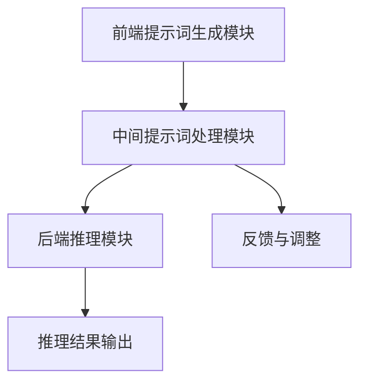

                 


### 引言

在当今的科技发展中，人工智能（AI）已经成为了一个至关重要的领域。从智能家居到自动驾驶，从医疗诊断到金融服务，AI技术正逐步渗透到各个行业，极大地改变了我们的生活方式。然而，随着AI应用的复杂性不断增加，如何高效地构建和管理AI工作流成为一个亟待解决的问题。在这一背景下，提示词链（Prompt Chain）作为一种新的AI工作流构建范式，逐渐受到了业界的关注。

提示词链的概念源自自然语言处理（NLP）领域，其核心思想是通过一系列有序的提示词（Prompt）来引导AI模型进行推理和决策。相较于传统的工作流，提示词链具有更高的灵活性和扩展性，能够更好地应对复杂的问题场景。本文将详细探讨提示词链的定义、原理、架构设计以及其在实际应用中的实现方法，旨在为读者提供一套完整的理解和实践指南。

本文将分为三个主要部分。第一部分将介绍AI工作流与提示词链的基本概念，对比分析提示词链与传统工作流的不同。第二部分将深入探讨提示词链的核心概念原理，包括其架构设计、核心算法原理以及相关的数学模型。第三部分将通过实际应用案例和代码实战，展示提示词链的具体实现方法和效果，并对其未来发展方向和面临的挑战进行展望。

### 目录大纲设计

#### 《提示词链：构建复杂AI工作流的新范式》

### 第一部分：引言

## 第1章：AI工作流与提示词链

### 1.1 AI工作流概述

AI工作流是指将人工智能技术应用于实际问题的过程中所涉及的各个步骤和流程，包括数据预处理、模型训练、模型评估和部署等。传统的AI工作流通常采用顺序执行的方式，即将每个步骤依次完成，然后进入下一个步骤。然而，这种线性工作流在处理复杂问题时存在一定的局限性，难以满足多样化的需求。

### 1.2 提示词链的定义与作用

提示词链是一种新型的AI工作流构建范式，它通过一系列有序的提示词来引导AI模型进行推理和决策。提示词链的作用在于提高AI模型的灵活性和适应性，使其能够更好地应对复杂的问题场景。通过提示词链，AI模型可以动态调整其推理过程，从而实现更高效的问题解决。

### 1.3 提示词链与传统工作流对比

提示词链与传统工作流在执行方式、灵活性、扩展性等方面存在显著差异。传统工作流采用顺序执行，提示词链则采用并行执行；传统工作流较为僵化，提示词链具有更高的灵活性；传统工作流扩展性较差，提示词链则具备良好的扩展性。

### 第二部分：核心概念与联系

## 第2章：AI基础与架构设计

### 2.1 人工智能基本概念

人工智能是一门研究、开发和应用使计算机模拟、延伸和扩展人的智能的科学。其基本概念包括感知、认知、学习和推理等。

### 2.2 AI工作流架构设计原则

AI工作流架构设计应遵循可扩展性、可维护性、可重用性和高效性等原则。设计过程中，需要综合考虑系统性能、资源利用、算法优化等因素。

### 2.3 提示词链在架构设计中的应用

提示词链在AI工作流架构设计中具有重要的应用价值。通过提示词链，可以有效地提高AI模型的灵活性和扩展性，从而更好地应对复杂的问题场景。

### 第3章：核心概念原理与架构

### 3.1 提示词链的核心原理

提示词链的核心原理在于通过一系列有序的提示词来引导AI模型进行推理和决策。提示词的选择和排列对于AI模型的性能和效果具有重要影响。

### 3.2 提示词链的架构设计

提示词链的架构设计包括前端提示词生成模块、中间提示词处理模块和后端推理模块。前端提示词生成模块负责生成初始提示词，中间提示词处理模块负责对提示词进行加工和优化，后端推理模块负责根据提示词进行推理和决策。

### 3.3 提示词链与AI工作流的关系

提示词链与AI工作流之间存在密切的关系。提示词链作为AI工作流的一部分，通过引导AI模型进行推理和决策，从而实现更高效的问题解决。

### 3.4 Mermaid流程图展示提示词链工作流程

使用Mermaid流程图工具，可以直观地展示提示词链的工作流程，包括前端提示词生成模块、中间提示词处理模块和后端推理模块之间的交互关系。



### 第4章：核心算法原理讲解

### 4.1 提示词链生成算法

提示词链生成算法负责生成一系列有序的提示词。生成算法通常采用启发式方法，根据问题场景和AI模型的特点，选择合适的提示词。

### 4.2 提示词链优化算法

提示词链优化算法负责对生成的提示词进行优化，以提高AI模型的性能和效果。优化算法可以采用动态规划、遗传算法等方法。

### 4.3 算法伪代码展示

```python
# 提示词链生成算法伪代码
function generate_prompt_chain(problem):
    prompt_list = []
    for each step in problem:
        prompt = generate_prompt_for_step(step)
        prompt_list.append(prompt)
    return prompt_list

# 提示词链优化算法伪代码
function optimize_prompt_chain(prompt_chain):
    for each prompt in prompt_chain:
        prompt = optimize_prompt(prompt)
    return prompt_chain
```

### 第5章：数学模型与公式

### 5.1 提示词链相关的数学模型

提示词链相关的数学模型包括提示词生成模型、提示词优化模型和推理模型。这些模型分别用于生成、优化和推理提示词链。

### 5.2 公式讲解与推导

提示词生成模型的公式如下：
$$
P(\text{prompt}_{t}) = \frac{e^{\text{score}(\text{prompt}_{t})}}{\sum_{i=1}^{T} e^{\text{score}(\text{prompt}_{i})}
```

### 第6章：实际应用案例

### 6.1 提示词链在NLP中的应用

提示词链在自然语言处理领域具有广泛的应用。例如，在问答系统、文本生成和机器翻译等方面，提示词链可以有效地提高模型的表现。

### 6.2 提示词链在推荐系统中的应用

在推荐系统领域，提示词链可以通过分析用户的历史行为和偏好，生成个性化的推荐结果，从而提高推荐系统的准确性。

### 6.3 提示词链在图像识别中的应用

提示词链在图像识别领域也可以发挥重要作用。通过使用提示词链，可以有效地提高图像识别模型的准确性和鲁棒性。

### 第7章：代码实战与解读

### 7.1 提示词链开发环境搭建

为了实现提示词链的开发，需要搭建相应的开发环境。本文将介绍如何使用Python和相关库搭建提示词链的开发环境。

### 7.2 源代码实现与解读

本文将提供提示词链的核心代码实现，包括提示词生成、优化和推理等模块。读者可以通过阅读代码，了解提示词链的具体实现过程。

### 7.3 代码分析与优化建议

通过对提示词链代码的分析，可以发现一些优化空间。本文将提出一些建议，以进一步提高提示词链的性能和效果。

### 第8章：未来展望与挑战

### 8.1 提示词链技术的未来发展方向

随着AI技术的不断发展，提示词链技术将在更多的领域得到应用。未来的发展方向包括自动化提示词生成、智能优化算法和跨模态融合等。

### 8.2 面临的挑战与解决方案

提示词链技术在实际应用中仍面临一些挑战，如提示词选择、优化算法和计算效率等。本文将探讨这些挑战，并提出相应的解决方案。

### 8.3 对AI工作流的影响与意义

提示词链技术将对AI工作流产生深远的影响。通过引入提示词链，可以有效地提高AI模型的灵活性和扩展性，从而更好地应对复杂的问题场景。

### 附录

## 附录A：提示词链开发工具与资源

本文将介绍一些常用的提示词链开发工具和资源，包括Python库、在线平台和教程等。读者可以通过这些资源进一步了解和掌握提示词链技术。

### 关键词

- 人工智能
- 提示词链
- AI工作流
- 自然语言处理
- 推荐系统
- 图像识别

### 摘要

本文深入探讨了提示词链这一新型AI工作流构建范式，从基本概念、核心原理到实际应用，为读者提供了一套全面且深入的指导。通过对比分析提示词链与传统工作流的不同，本文揭示了提示词链在灵活性和扩展性方面的优势。同时，本文详细介绍了提示词链的架构设计、核心算法原理和数学模型，并通过实际应用案例和代码实战，展示了提示词链的具体实现方法和效果。未来，提示词链技术有望在更多领域发挥重要作用，为AI工作流的构建带来新的变革。

