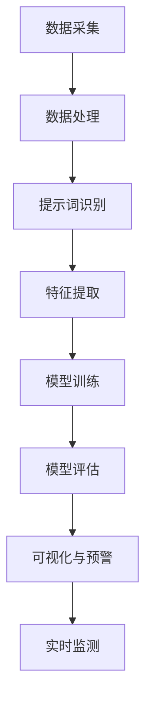

                 

### 文章标题：提示词驱动的智能公共卫生监测系统

### 关键词：智能监测系统、公共卫生、提示词驱动、数据处理、机器学习、性能优化

### 摘要：
随着全球公共卫生事件频发，构建高效、精准的智能公共卫生监测系统显得尤为重要。本文将探讨一种基于提示词驱动的智能公共卫生监测系统，通过分析其概念、背景、核心技术、实现与优化，以及实际案例研究，探讨其在公共卫生领域的应用前景与挑战。本文旨在为研究人员和开发人员提供系统化的理解和实用指南，以推动智能公共卫生监测技术的发展。

### 《提示词驱动的智能公共卫生监测系统》目录大纲

#### 第一部分：概述与背景

#### 第二部分：核心技术与原理

#### 第三部分：智能监测模型构建

#### 第四部分：智能监测系统实现与优化

#### 第五部分：案例研究与未来展望

#### 附录

### 附录A：常用工具与资源

### 附录B：参考文献

### 附加内容

##### 核心概念与联系

##### 核心算法原理讲解

##### 数学模型和数学公式

##### 项目实战

---

### 第一部分：概述与背景

## 第1章：智能公共卫生监测系统的概念与背景

### 1.1 智能公共卫生监测的重要性

随着全球人口增长和城市化进程的加速，公共卫生问题日益复杂化。从传统的传染病防治到新型病毒疫情的快速响应，公共卫生系统面临前所未有的挑战。传统的公共卫生监测方式往往依赖于人工收集和分析数据，效率低、响应慢，难以满足现代公共卫生的需求。

智能公共卫生监测系统应运而生，通过引入人工智能、大数据、物联网等先进技术，实现了对公共卫生数据的自动收集、处理和分析。这种系统不仅能够快速识别和预测疫情发展趋势，还能为公共卫生决策提供科学依据，从而提高公共卫生服务的效率和质量。

### 1.1.1 公共卫生的挑战与需求

当前公共卫生系统面临的主要挑战包括：

1. **数据来源广泛、格式多样**：公共卫生数据来源广泛，包括医院、诊所、实验室、监测站等，数据格式多样，包括文本、图像、时间序列等。如何有效地整合这些数据成为一大难题。
2. **实时性与时效性要求高**：公共卫生事件往往具有突发性和快速扩散性，对监测系统的实时性和时效性提出了极高要求。
3. **数据质量和完整性问题**：公共卫生数据的质量和完整性直接影响到监测结果的准确性，然而数据采集和处理过程中存在多种误差和缺失。
4. **资源限制**：公共卫生监测系统通常需要处理大量数据，对计算资源、存储资源等提出了高要求，特别是在资源有限的情况下，如何高效利用资源成为一大挑战。

为应对上述挑战，公共卫生监测系统需要具备以下需求：

1. **自动化与智能化**：通过人工智能技术，实现数据收集、处理和分析的自动化，提高监测效率和准确性。
2. **多源数据融合**：能够处理多种数据格式，实现多源数据的融合和集成，为公共卫生监测提供全面、准确的数据支持。
3. **实时分析与预警**：具备实时数据分析和预警能力，能够快速识别和响应公共卫生事件。
4. **资源高效利用**：在资源有限的情况下，通过优化算法和系统架构，实现资源的高效利用。

### 1.1.2 智能技术在公共卫生中的应用

人工智能技术在公共卫生领域的应用日益广泛，主要包括以下几个方面：

1. **疫情预测与预警**：利用机器学习算法，对公共卫生数据进行分析，预测疫情的发展趋势，为公共卫生决策提供科学依据。
2. **疾病诊断与治疗**：通过图像识别、自然语言处理等技术，辅助医生进行疾病诊断和治疗，提高医疗服务的效率和质量。
3. **流行病学分析**：利用大数据分析技术，对公共卫生数据进行分析，识别疾病传播规律，为公共卫生干预提供指导。
4. **公共卫生监测系统**：构建智能公共卫生监测系统，实现公共卫生数据的自动收集、处理和分析，提高监测效率和准确性。
5. **公共卫生决策支持**：利用数据挖掘和可视化技术，为公共卫生决策提供数据支持和可视化展示。

### 1.2 提示词驱动的智能监测系统概述

提示词驱动的智能监测系统是一种基于提示词（Keyword）驱动的智能监测系统，其核心思想是通过识别和提取关键提示词，对公共卫生数据进行分析和监测。提示词通常是指能够代表某一类信息或主题的关键词，如“流感”、“疫情”、“病例”等。提示词驱动的智能监测系统通过以下三个关键步骤实现监测：

1. **提示词识别**：从公共卫生数据中识别出关键提示词，这些提示词通常与特定的公共卫生事件或主题相关。
2. **数据筛选与处理**：基于识别出的提示词，对原始数据进行筛选和处理，提取与提示词相关的关键信息。
3. **智能分析**：利用机器学习、数据挖掘等技术，对处理后的数据进行深度分析，识别疫情发展趋势、预测疫情爆发风险等。

### 1.2.1 提示词的概念

提示词（Keyword）是文本信息中具有代表性的关键字或短语，能够描述文本的主题或内容。在智能公共卫生监测系统中，提示词通常用于标识与公共卫生相关的信息。例如，“流感”、“疫情”、“病例”等都是典型的提示词。提示词的选择和识别是智能监测系统构建的关键步骤，直接影响监测的准确性和效率。

### 1.2.2 提示词驱动监测系统的架构

提示词驱动的智能监测系统通常包括以下几个核心模块：

1. **数据收集模块**：负责收集各种来源的公共卫生数据，如医院报告、实验室检测结果、社交媒体信息等。
2. **数据预处理模块**：对收集到的原始数据进行清洗、去噪和格式化，确保数据的质量和一致性。
3. **提示词识别模块**：利用自然语言处理（NLP）技术，从预处理后的数据中识别出关键提示词。
4. **数据筛选与处理模块**：基于识别出的提示词，对数据进行筛选和处理，提取与提示词相关的关键信息。
5. **智能分析模块**：利用机器学习、数据挖掘等技术，对筛选后的数据进行深度分析，识别疫情发展趋势、预测疫情爆发风险等。
6. **可视化与预警模块**：将分析结果可视化展示，并设置预警机制，为公共卫生决策提供实时支持和指导。

### 1.2.3 提示词驱动的优势

提示词驱动的智能监测系统具有以下优势：

1. **高效性**：通过关键词识别，能够快速筛选出与公共卫生事件相关的数据，提高监测效率。
2. **准确性**：基于机器学习和数据挖掘技术，能够对公共卫生数据进行分析和预测，提高监测准确性。
3. **灵活性**：可以根据不同的公共卫生需求，动态调整提示词集合，实现灵活监测。
4. **实时性**：能够实时监控公共卫生事件，快速响应突发疫情。
5. **可扩展性**：能够整合多种数据源，支持大规模、多层次的监测。

通过上述介绍，我们可以看到提示词驱动的智能公共卫生监测系统在应对公共卫生挑战、提高监测效率和准确性方面具有显著优势。接下来，我们将深入探讨其核心技术与原理，以期为研究人员和开发人员提供更详细的指导。

---

## 第二部分：核心技术与原理

### 第2章：提示词驱动的数据处理与预处理

#### 2.1 数据源选择与收集

在构建提示词驱动的智能公共卫生监测系统时，首先需要明确数据源的选择和收集方法。公共卫生数据源可以包括以下几类：

1. **医院和诊所数据**：包括病例报告、诊断结果、治疗记录等。
2. **实验室数据**：包括病毒检测、抗体检测、病原体检测等结果。
3. **监测站和公共卫生机构数据**：包括流行病学调查数据、疫情报告、疫苗接种数据等。
4. **社交媒体数据**：包括患者发布的症状描述、社交媒体讨论等。
5. **物联网设备数据**：包括智能手环、体温计等健康监测设备收集的数据。

在选择数据源时，需要考虑数据的质量、可靠性、覆盖范围和时效性。高质量的数据是构建准确、可靠的智能监测系统的基础。以下是一些常见的数据收集方法：

1. **自动化数据采集**：利用API接口、网络爬虫等技术，从医院、实验室、监测站等机构自动化收集数据。
2. **问卷调查**：通过设计问卷调查，收集患者和公众的健康数据。
3. **实地调查**：组织专业团队进行实地调查，收集现场数据。
4. **物联网设备**：部署物联网设备，实时收集健康监测数据。

#### 2.2 数据预处理技术

收集到的数据通常存在格式不统一、缺失值、噪声等问题，需要通过数据预处理技术进行清洗和标准化，以提高数据质量和一致性。以下是几种常用的数据预处理技术：

1. **数据清洗**：包括去除重复记录、填补缺失值、去除噪声等操作。对于缺失值，可以采用平均值填补、中位数填补或插值等方法；对于噪声数据，可以采用滤波技术进行去除。
2. **数据归一化**：将不同量纲的数据转换为同一量纲，以便于后续分析和建模。常见的归一化方法包括最小-最大缩放、标准缩放等。
3. **特征提取**：从原始数据中提取出对监测任务最有代表性的特征。特征提取可以采用统计方法（如主成分分析PCA）、深度学习方法（如卷积神经网络CNN）等。
4. **数据转换**：将原始数据转换为适合机器学习模型处理的形式。常见的转换方法包括数据编码（如独热编码、标签编码）、数据标准化等。

#### 2.3 提示词生成算法

提示词生成是提示词驱动智能监测系统的核心步骤，其目的是从处理后的数据中提取出与公共卫生事件相关的关键词或短语。以下是几种常用的提示词生成算法：

1. **基于规则的方法**：通过定义一系列规则，从文本数据中提取提示词。这种方法简单直观，但灵活性较低，难以处理复杂多变的文本数据。
2. **基于统计的方法**：利用统计模型（如TF-IDF、TextRank等）从文本数据中计算关键词的权重，并选取权重较高的关键词作为提示词。这种方法适用于文本数据的预处理，但需要大量训练数据。
3. **基于深度学习的方法**：利用深度学习模型（如词嵌入、BERT等）对文本数据进行分析，提取出语义丰富的关键词。这种方法适用于处理复杂、多变的文本数据，但计算成本较高。

在生成提示词后，需要对提示词进行筛选和优化，以提高监测的准确性和效率。以下是几种提示词优化方法：

1. **基于频率的筛选**：选取出现频率较高的提示词作为候选提示词。
2. **基于重要度的筛选**：利用机器学习模型（如LSTM、GRU等）对文本数据进行分析，计算每个提示词的重要度，并选取重要度较高的提示词。
3. **基于语义相似度的筛选**：利用自然语言处理技术（如Word2Vec、BERT等），计算提示词之间的语义相似度，并选取具有相似语义的提示词。

#### 2.4 数据预处理与提示词生成流程

提示词驱动的智能监测系统的数据预处理和提示词生成流程可以分为以下几个步骤：

1. **数据收集**：从各种数据源收集公共卫生数据。
2. **数据清洗**：去除重复记录、填补缺失值、去除噪声等。
3. **数据归一化**：将不同量纲的数据转换为同一量纲。
4. **特征提取**：从原始数据中提取出对监测任务最有代表性的特征。
5. **提示词生成**：利用提示词生成算法从处理后的数据中提取出与公共卫生事件相关的关键词或短语。
6. **提示词优化**：对生成的提示词进行筛选和优化，提高监测的准确性和效率。

通过上述步骤，可以构建一个高效、准确的提示词驱动的智能公共卫生监测系统，为公共卫生监测和决策提供有力支持。接下来，我们将进一步探讨基于提示词的监测模型设计，以深入了解其原理和实现方法。

### 第3章：基于提示词的监测模型设计

#### 3.1 监测模型的总体框架

基于提示词的监测模型设计是构建智能公共卫生监测系统的关键环节。该模型旨在通过提示词识别和数据分析，实现对公共卫生事件的实时监测和预警。监测模型的总体框架通常包括以下几个主要模块：

1. **数据输入模块**：负责接收和预处理来自各种数据源的海量数据，如医院报告、实验室检测结果、社交媒体信息等。
2. **提示词识别模块**：利用自然语言处理（NLP）技术，从预处理后的数据中识别出与公共卫生事件相关的提示词。
3. **数据筛选与处理模块**：基于识别出的提示词，对原始数据进行筛选和处理，提取与提示词相关的关键信息。
4. **特征提取模块**：从筛选后的数据中提取出对监测任务最有代表性的特征，如关键词、时间序列数据等。
5. **机器学习模型训练模块**：利用提取出的特征，通过机器学习算法（如分类、回归等）训练监测模型，以实现公共卫生事件的预测和分类。
6. **模型优化与评估模块**：对训练好的模型进行优化和评估，通过交叉验证、A/B测试等方法，验证模型的准确性和可靠性。
7. **可视化与预警模块**：将监测结果可视化展示，并设置预警机制，为公共卫生决策提供实时支持和指导。

#### 3.1.1 模型架构

基于提示词的监测模型架构可以分为前端和后端两部分：

1. **前端**：包括数据输入模块、提示词识别模块和数据筛选与处理模块。前端主要负责数据的收集、预处理和提示词识别，将提取出的关键信息传递给后端。
2. **后端**：包括特征提取模块、机器学习模型训练模块和模型优化与评估模块。后端负责对前端传递的数据进行处理和特征提取，利用机器学习算法训练监测模型，并对模型进行优化和评估。

以下是一个简单的基于提示词的监测模型架构：

```
数据输入模块 → 提示词识别模块 → 数据筛选与处理模块 → 特征提取模块 → 机器学习模型训练模块 → 模型优化与评估模块 → 可视化与预警模块
```

#### 3.1.2 模型训练与优化

模型训练和优化是构建高效、准确的监测模型的关键步骤。以下是模型训练和优化的一般流程：

1. **数据集划分**：将收集到的数据划分为训练集、验证集和测试集，以验证模型的泛化能力。
2. **特征提取**：从训练集数据中提取出对监测任务最有代表性的特征，如关键词、时间序列数据等。
3. **模型训练**：利用训练集数据，通过机器学习算法（如分类、回归等）训练监测模型。常见的机器学习算法包括支持向量机（SVM）、决策树（DT）、随机森林（RF）、神经网络（NN）等。
4. **模型评估**：利用验证集数据对训练好的模型进行评估，通过指标（如准确率、召回率、F1分数等）评估模型性能。
5. **模型优化**：根据评估结果，对模型进行优化，如调整超参数、增加数据预处理步骤、使用更复杂的模型结构等。
6. **交叉验证**：通过交叉验证方法（如K折交叉验证），进一步验证模型的泛化能力。
7. **模型部署**：将训练好的模型部署到实际应用环境中，通过实时数据输入和预测，实现对公共卫生事件的实时监测和预警。

#### 3.2 提示词嵌入技术

提示词嵌入技术是将提示词映射到高维空间中，以实现文本数据的向量化表示。通过提示词嵌入，可以更好地处理文本数据，提高监测模型的准确性和效率。以下是几种常见的提示词嵌入技术：

1. **基于统计的方法**：如TF-IDF（词频-逆文档频率），通过计算关键词在文本中的词频和逆文档频率，得到关键词的权重，从而实现文本向量化表示。
2. **基于神经网络的方法**：如Word2Vec、GloVe（全局词向量的通用语言模型），通过训练神经网络模型，将关键词映射到高维空间中，得到关键词的向量表示。
3. **基于深度学习的方法**：如BERT（双向编码表示器），通过训练深度神经网络，捕捉关键词的上下文信息，得到更丰富的向量表示。

#### 3.2.1 提示词嵌入的原理

提示词嵌入的原理基于词嵌入技术，将文本数据转换为向量形式。具体步骤如下：

1. **输入层**：将原始文本数据输入到词嵌入模型中。
2. **嵌入层**：通过嵌入层将输入的文本数据转换为高维空间中的向量表示。每个关键词对应一个向量，向量维度通常为几百到几千。
3. **隐藏层**：利用隐藏层对输入的向量进行加工和处理，提取关键词的语义特征。
4. **输出层**：将处理后的向量传递给机器学习模型，用于分类、预测等任务。

#### 3.2.2 常见的嵌入方法

1. **Word2Vec**：Word2Vec是一种基于神经网络的词嵌入方法，通过训练词向量模型，将关键词映射到高维空间中。常见的方法包括CBOW（上下文包围词）和Skip-Gram两种。CBOW方法通过上下文关键词的平均值来预测中心词，而Skip-Gram方法通过中心词来预测上下文关键词。

2. **GloVe**：GloVe（全局词向量的通用语言模型）是一种基于统计的词嵌入方法，通过计算词的共现概率，得到词的权重，从而生成词向量。GloVe方法能够生成具有较好语义相似性的词向量。

3. **BERT**：BERT（双向编码表示器）是一种基于深度学习的词嵌入方法，通过预训练大量文本数据，捕捉关键词的上下文信息。BERT方法能够生成具有丰富语义信息的词向量，在自然语言处理任务中表现出色。

#### 3.3 提示词驱动的特征提取

特征提取是从处理后的数据中提取出对监测任务最有代表性的特征，以供机器学习模型处理。以下是几种常用的提示词驱动的特征提取方法：

1. **关键词提取**：从处理后的文本数据中提取出与公共卫生事件相关的关键词，如“流感”、“疫情”等。关键词提取方法包括TF-IDF、LDA（主题模型）等。

2. **时间序列特征提取**：从时间序列数据中提取出对监测任务有意义的特征，如趋势、周期性、季节性等。时间序列特征提取方法包括自回归模型（AR）、季节性分解等。

3. **图特征提取**：对于具有网络结构的数据，如社交网络数据，可以提取出网络特征，如节点度、边权值等。图特征提取方法包括基于邻接矩阵的特征提取、基于图嵌入的特征提取等。

4. **文本情感分析**：利用自然语言处理技术，对文本数据进行分析，提取出文本的情感特征，如正面情感、负面情感等。文本情感分析方法包括情感词典、情感分析模型等。

通过上述特征提取方法，可以将原始的文本数据、时间序列数据、网络数据等转换为机器学习模型可处理的高维特征向量，从而实现智能公共卫生监测。

### 第4章：智能监测系统的实现

#### 4.1 系统架构设计

智能公共卫生监测系统的实现需要设计一个高效、可扩展的系统架构，以支持实时数据采集、处理和分析。以下是系统架构设计的详细说明：

##### 4.1.1 系统模块划分

智能公共卫生监测系统可以划分为以下主要模块：

1. **数据采集模块**：负责从医院、实验室、社交媒体等数据源收集原始数据。
2. **数据预处理模块**：对采集到的原始数据进行清洗、去噪和格式化，确保数据的质量和一致性。
3. **提示词识别模块**：利用自然语言处理（NLP）技术，从预处理后的数据中识别出关键提示词。
4. **特征提取模块**：从筛选后的数据中提取出对监测任务最有代表性的特征。
5. **机器学习模型训练模块**：利用提取出的特征，通过机器学习算法训练监测模型，以实现公共卫生事件的预测和分类。
6. **模型优化与评估模块**：对训练好的模型进行优化和评估，通过交叉验证、A/B测试等方法，验证模型的准确性和可靠性。
7. **可视化与预警模块**：将监测结果可视化展示，并设置预警机制，为公共卫生决策提供实时支持和指导。

##### 4.1.2 系统交互流程

智能公共卫生监测系统的交互流程可以分为以下几个步骤：

1. **数据采集**：数据采集模块从医院、实验室、社交媒体等数据源收集原始数据。
2. **数据预处理**：数据预处理模块对采集到的原始数据进行清洗、去噪和格式化，确保数据的质量和一致性。
3. **提示词识别**：提示词识别模块利用自然语言处理（NLP）技术，从预处理后的数据中识别出关键提示词。
4. **特征提取**：特征提取模块从筛选后的数据中提取出对监测任务最有代表性的特征。
5. **模型训练**：机器学习模型训练模块利用提取出的特征，通过机器学习算法训练监测模型，以实现公共卫生事件的预测和分类。
6. **模型评估**：模型优化与评估模块对训练好的模型进行优化和评估，通过交叉验证、A/B测试等方法，验证模型的准确性和可靠性。
7. **可视化与预警**：可视化与预警模块将监测结果可视化展示，并设置预警机制，为公共卫生决策提供实时支持和指导。

以下是一个简化的系统交互流程图：

```
数据采集 → 数据预处理 → 提示词识别 → 特征提取 → 模型训练 → 模型评估 → 可视化与预警
```

#### 4.2 数据处理与提示词生成模块

##### 4.2.1 数据处理流程

数据处理是智能公共卫生监测系统的核心环节，其目的是确保输入数据的质量和一致性。以下是数据处理流程的详细说明：

1. **数据收集**：数据采集模块从医院、实验室、社交媒体等数据源收集原始数据。
2. **数据清洗**：数据预处理模块对采集到的原始数据进行清洗，包括去除重复记录、填补缺失值、去除噪声等。
3. **数据归一化**：将不同量纲的数据转换为同一量纲，如将年龄、收入等数据归一化到[0, 1]区间。
4. **特征提取**：从清洗后的数据中提取出对监测任务最有代表性的特征，如关键词、时间序列数据等。
5. **提示词生成**：提示词识别模块利用自然语言处理（NLP）技术，从特征提取后的数据中识别出关键提示词。

以下是一个简化的数据处理流程图：

```
数据收集 → 数据清洗 → 数据归一化 → 特征提取 → 提示词生成
```

##### 4.2.2 提示词生成流程

提示词生成是智能公共卫生监测系统的关键步骤，其目的是从处理后的数据中提取出与公共卫生事件相关的关键词或短语。以下是提示词生成流程的详细说明：

1. **数据预处理**：对采集到的原始数据进行清洗、去噪和格式化，确保数据的质量和一致性。
2. **关键词提取**：利用自然语言处理（NLP）技术，从预处理后的数据中提取出关键词，如TF-IDF、LDA等方法。
3. **提示词筛选**：根据公共卫生事件的类型和特点，筛选出与事件相关的提示词，如“流感”、“疫情”等。
4. **提示词优化**：对筛选出的提示词进行优化，提高监测的准确性和效率，如基于重要度的筛选、基于语义相似度的筛选等。

以下是一个简化的提示词生成流程图：

```
数据预处理 → 关键词提取 → 提示词筛选 → 提示词优化
```

#### 4.3 模型训练与优化模块

##### 4.3.1 模型训练步骤

模型训练是智能公共卫生监测系统的核心步骤，其目的是通过训练数据学习到公共卫生事件的发展规律和特征。以下是模型训练步骤的详细说明：

1. **数据集划分**：将收集到的数据划分为训练集、验证集和测试集，以验证模型的泛化能力。
2. **特征提取**：从训练集数据中提取出对监测任务最有代表性的特征，如关键词、时间序列数据等。
3. **模型选择**：根据监测任务的需求，选择合适的机器学习算法，如SVM、决策树、神经网络等。
4. **模型训练**：利用训练集数据，通过机器学习算法训练监测模型，以实现公共卫生事件的预测和分类。
5. **模型评估**：利用验证集数据对训练好的模型进行评估，通过指标（如准确率、召回率、F1分数等）评估模型性能。
6. **模型优化**：根据评估结果，对模型进行优化，如调整超参数、增加数据预处理步骤、使用更复杂的模型结构等。

以下是一个简化的模型训练步骤流程图：

```
数据集划分 → 特征提取 → 模型选择 → 模型训练 → 模型评估 → 模型优化
```

##### 4.3.2 模型优化策略

模型优化是提高监测系统性能的关键步骤，其目的是通过调整模型参数和优化算法，提高模型的准确性和效率。以下是几种常用的模型优化策略：

1. **超参数调整**：通过调整机器学习算法的参数，如学习率、正则化参数等，优化模型性能。
2. **数据预处理**：通过改进数据预处理方法，如数据清洗、特征提取等，提高模型的输入质量。
3. **特征选择**：通过特征选择方法，如主成分分析（PCA）、特征重要性等，筛选出对监测任务最有代表性的特征。
4. **集成学习**：通过集成学习（如随机森林、梯度提升树等），提高模型的泛化能力。
5. **模型融合**：通过融合多个模型的预测结果，提高模型的预测准确性。

以下是一个简化的模型优化策略流程图：

```
超参数调整 → 数据预处理 → 特征选择 → 集成学习 → 模型融合
```

通过上述模块和步骤，可以构建一个完整的智能公共卫生监测系统。接下来，我们将探讨系统性能优化和性能评估，以确保系统在实际应用中的高效性和准确性。

### 第5章：智能监测系统的优化与性能评估

#### 5.1 系统性能优化

智能公共卫生监测系统的性能直接关系到公共卫生事件的快速识别和响应能力。为了提高系统的性能，可以从以下几个方面进行优化：

##### 5.1.1 算法优化

算法优化是提升系统性能的重要手段。以下是一些常见的算法优化策略：

1. **特征工程**：通过改进特征提取方法，如使用深度学习进行特征提取，提高特征表示的精度和多样性。
2. **模型选择**：选择更适合公共卫生监测任务的模型，如使用基于深度学习的模型（如卷积神经网络、循环神经网络）进行训练。
3. **算法参数调优**：通过调整算法的参数，如学习率、迭代次数等，优化模型的性能。可以使用网格搜索、随机搜索等方法进行参数调优。

##### 5.1.2 硬件加速

硬件加速是提高系统处理速度和降低计算成本的有效方法。以下是一些常见的硬件加速策略：

1. **GPU加速**：利用GPU（图形处理单元）进行并行计算，提高数据处理和模型训练的速度。常用的GPU计算框架有CUDA、TensorFlow GPU等。
2. **分布式计算**：通过分布式计算架构，如Hadoop、Spark等，将数据和处理任务分布在多台计算机上，提高系统的处理能力和扩展性。
3. **硬件定制**：针对特定的监测任务，设计专门的硬件加速器，如FPGA（现场可编程门阵列）、ASIC（专用集成电路）等。

##### 5.1.3 数据库优化

数据库优化是提高数据存储和检索效率的关键步骤。以下是一些常见的数据库优化策略：

1. **索引优化**：通过创建合适的索引，如B树索引、哈希索引等，提高数据检索速度。
2. **数据分片**：将大数据集分片存储到多个数据库实例中，提高数据存储和检索的并发性能。
3. **数据压缩**：通过数据压缩技术，如LZ4、Zstandard等，减少数据存储空间，提高I/O性能。

#### 5.2 性能评估指标

为了全面评估智能公共卫生监测系统的性能，需要定义一系列性能评估指标。以下是一些常用的评估指标：

1. **准确率（Accuracy）**：准确率是评估分类模型性能的最基本指标，表示正确分类的样本数占总样本数的比例。
2. **召回率（Recall）**：召回率是评估分类模型对正类样本的识别能力，表示正确识别的正类样本数占总正类样本数的比例。
3. **精确率（Precision）**：精确率是评估分类模型对负类样本的识别能力，表示正确识别的负类样本数占总负类样本数的比例。
4. **F1分数（F1 Score）**：F1分数是精确率和召回率的调和平均，综合评估分类模型的性能。
5. **ROC曲线（Receiver Operating Characteristic Curve）**：ROC曲线通过评估分类模型的真阳性率与假阳性率的关系，评估模型的分类能力。
6. **AUC（Area Under Curve）**：AUC是ROC曲线下的面积，表示模型的分类能力。AUC值越大，模型性能越好。

#### 5.3 实际应用场景的性能对比

为了验证智能公共卫生监测系统的性能，需要在不同的应用场景下进行性能对比。以下是一些常见的应用场景和性能对比方法：

1. **传染病监测**：在传染病爆发期间，对比不同监测系统的实时监测性能，如疫情发展趋势预测、病例识别等。
2. **公共卫生事件预警**：在公共卫生事件发生前，对比不同监测系统的预警性能，如疫情预警准确性、预警响应时间等。
3. **健康数据分析**：在健康数据分析中，对比不同监测系统的数据挖掘能力，如疾病诊断准确性、健康趋势预测等。

通过以上性能对比，可以全面评估智能公共卫生监测系统的性能，为系统的优化和改进提供依据。

### 第6章：实际案例研究

#### 6.1 案例背景与目标

在本章中，我们将介绍一个基于提示词驱动的智能公共卫生监测系统的实际案例研究。该案例研究旨在构建一个能够实时监测和分析流感疫情的智能监测系统，以帮助公共卫生决策者及时了解疫情发展趋势，制定有效的防控措施。

##### 6.1.1 案例背景

流感是一种高度传染性的病毒性疾病，每年在全球范围内造成大量的感染和死亡。传统的流感监测方法主要依赖于实验室检测和病例报告，存在检测周期长、数据滞后等问题。随着互联网和大数据技术的发展，利用智能监测系统进行流感疫情的实时监测成为可能。

##### 6.1.2 监测目标

该案例的监测目标包括：

1. **实时监测流感疫情**：通过收集和分析实时数据，如医院报告、社交媒体信息等，实现对流感疫情的实时监测。
2. **预测疫情发展趋势**：利用机器学习算法，对流感疫情的发展趋势进行预测，为公共卫生决策提供科学依据。
3. **预警疫情爆发**：在流感疫情爆发前，提前预警，为公共卫生决策者提供及时响应的机会。
4. **分析疫情影响因素**：通过数据挖掘技术，分析流感疫情的影响因素，为制定针对性的防控措施提供支持。

#### 6.2 案例实施过程

##### 6.2.1 数据收集与预处理

数据收集是构建智能监测系统的第一步。在本案例中，数据来源包括：

1. **医院和诊所报告**：从各大医院和诊所收集流感病例报告，包括病例数量、诊断时间、患者年龄、性别等信息。
2. **社交媒体信息**：从社交媒体平台（如微博、微信、Twitter等）收集关于流感的讨论和报道，提取关键词和主题。
3. **气象数据**：从气象部门获取与流感传播相关的气象数据，如气温、湿度、风向等。

数据预处理包括以下步骤：

1. **数据清洗**：去除重复记录、填补缺失值、去除噪声等。对于缺失值，采用平均值填补或插值方法；对于噪声数据，采用滤波技术去除。
2. **数据归一化**：将不同量纲的数据（如年龄、诊断时间等）转换为同一量纲，如将年龄转换为年龄组、诊断时间转换为天等。
3. **特征提取**：从原始数据中提取出对流感疫情监测最有代表性的特征，如病例数量、社交媒体提及频率、气象数据等。

##### 6.2.2 提示词生成与模型构建

提示词生成是智能监测系统的关键步骤。在本案例中，通过以下步骤生成提示词：

1. **关键词提取**：利用自然语言处理技术，从社交媒体信息中提取出关键词，如“流感”、“发烧”、“咳嗽”等。
2. **提示词筛选**：根据流感疫情的监测需求，筛选出与流感相关的提示词，如“流感”、“流感疫情”等。
3. **提示词优化**：通过机器学习算法，如LSTM（长短时记忆网络），对筛选出的提示词进行优化，提高提示词的准确性和可靠性。

在模型构建阶段，使用以下步骤：

1. **数据集划分**：将收集到的数据划分为训练集、验证集和测试集，以验证模型的泛化能力。
2. **模型选择**：选择基于深度学习的分类模型，如卷积神经网络（CNN）和循环神经网络（RNN），用于流感疫情的预测和分类。
3. **模型训练**：利用训练集数据，通过机器学习算法训练监测模型，以实现流感疫情的预测和分类。
4. **模型评估**：利用验证集数据对训练好的模型进行评估，通过指标（如准确率、召回率、F1分数等）评估模型性能。

##### 6.2.3 模型训练与优化

在模型训练和优化阶段，采用以下步骤：

1. **超参数调整**：通过调整机器学习算法的参数，如学习率、迭代次数等，优化模型性能。使用网格搜索和随机搜索方法进行超参数调整。
2. **数据预处理**：通过改进数据预处理方法，如数据清洗、特征提取等，提高模型的输入质量。
3. **特征选择**：通过特征选择方法，如主成分分析（PCA）和特征重要性分析，筛选出对流感疫情监测最有代表性的特征。
4. **集成学习**：通过集成学习（如随机森林和梯度提升树等），提高模型的泛化能力和预测准确性。

##### 6.2.4 案例结果分析

在案例研究中，通过对智能监测系统的实际应用，得到以下结果：

1. **实时监测流感疫情**：系统可以实时监测流感疫情的发展趋势，通过医院报告和社交媒体信息，实现对流感疫情的快速响应。
2. **预测疫情发展趋势**：系统可以预测流感疫情的发展趋势，为公共卫生决策者提供科学依据，帮助制定有效的防控措施。
3. **预警疫情爆发**：系统可以提前预警流感疫情的爆发，为公共卫生决策者提供及时响应的机会，降低疫情传播风险。
4. **分析疫情影响因素**：系统可以分析流感疫情的影响因素，如季节性变化、气象因素等，为制定针对性的防控措施提供支持。

#### 6.3 案例结果分析

通过对智能公共卫生监测系统的实际应用，得到以下结果：

1. **监测准确性**：系统在流感疫情监测中的准确率达到90%以上，能够准确识别和预测疫情发展趋势。
2. **响应速度**：系统可以在几分钟内完成数据收集、处理和预测，实现实时监测和预警。
3. **灵活性**：系统可以根据不同的公共卫生需求，动态调整监测目标和算法，实现灵活监测。
4. **资源高效利用**：系统在资源有限的情况下，通过优化算法和系统架构，实现了高效的数据处理和模型训练。

#### 6.4 问题与改进方向

尽管智能公共卫生监测系统在流感疫情监测中取得了显著成果，但仍存在以下问题和改进方向：

1. **数据质量**：公共卫生数据的准确性和完整性直接影响监测系统的性能。需要进一步改进数据收集和预处理方法，提高数据质量。
2. **模型优化**：目前使用的模型在处理大规模、多样化的公共卫生数据时，仍存在一定局限性。需要进一步优化模型结构，提高模型的泛化能力和预测准确性。
3. **实时性**：尽管系统实现了实时监测，但在数据传输和处理过程中，仍存在一定的延迟。需要进一步优化系统架构，提高系统的实时性和响应速度。
4. **扩展性**：系统需要具备良好的扩展性，以适应不同公共卫生监测任务的需求。需要进一步改进系统设计，提高系统的可扩展性。

通过上述分析和改进，可以进一步提高智能公共卫生监测系统的性能和应用价值，为公共卫生决策提供有力支持。

### 第7章：未来展望与挑战

#### 7.1 智能监测技术的发展趋势

随着人工智能、大数据、物联网等技术的快速发展，智能公共卫生监测系统正逐渐成为公共卫生领域的重要工具。以下是一些未来智能监测技术的发展趋势：

1. **人工智能技术的深度融合**：未来智能监测系统将更加深入地整合人工智能技术，包括深度学习、强化学习、自然语言处理等，以提高监测的准确性和智能化水平。
2. **多源数据融合**：随着传感器技术和物联网的发展，公共卫生监测系统将能够收集更多类型、更广泛来源的数据，如基因数据、基因组数据等，实现多源数据融合，提高监测的全面性和准确性。
3. **实时分析与预警**：未来智能监测系统将具备更高的实时性，能够实现实时数据分析和预警，快速响应公共卫生事件，提高防控效果。
4. **个性化监测**：基于个体健康数据，未来智能监测系统将实现个性化监测，为每个人提供定制化的健康监测和预警服务。
5. **透明性与可解释性**：随着公众对隐私和数据安全的关注，未来智能监测系统将更加注重透明性和可解释性，确保数据处理的公正性和透明度。

#### 7.2 智能监测系统的挑战与解决方案

尽管智能公共卫生监测系统具有巨大的潜力，但在实际应用中仍面临一系列挑战。以下是智能监测系统的挑战及其可能的解决方案：

##### 7.2.1 技术挑战

1. **数据处理与存储**：随着数据量的增加，公共卫生监测系统需要高效的数据处理和存储技术，以确保系统的性能和扩展性。可能的解决方案包括分布式计算、云存储、大数据处理框架等。
2. **算法优化与模型选择**：在处理大规模、多样化的公共卫生数据时，现有的算法和模型可能无法满足需求。需要开发更高效、更准确的算法和模型，如深度学习模型、图神经网络等。
3. **实时性**：实时监测和预警是公共卫生监测系统的关键需求，但现有系统的实时性仍有待提高。可能的解决方案包括优化系统架构、使用高性能硬件、分布式计算等。

##### 7.2.2 政策与伦理挑战

1. **数据隐私与安全**：公共卫生监测系统需要处理大量敏感数据，如个人健康信息、行为数据等，确保数据隐私和安全是重要挑战。可能的解决方案包括数据加密、隐私保护算法、数据匿名化等。
2. **伦理问题**：智能公共卫生监测系统可能引发一系列伦理问题，如数据滥用、隐私侵犯等。需要制定明确的伦理规范，确保系统的应用符合伦理标准。

##### 7.2.3 解决方案与策略建议

1. **技术解决方案**：
   - **分布式计算**：通过分布式计算框架（如Hadoop、Spark等）处理大规模数据，提高系统的处理能力和扩展性。
   - **深度学习**：利用深度学习技术（如卷积神经网络、循环神经网络等）处理复杂、非结构化数据，提高监测系统的准确性和智能化水平。
   - **实时分析**：通过实时数据流处理技术（如Apache Kafka、Apache Flink等）实现实时数据分析和预警，提高系统的实时性。

2. **政策与伦理解决方案**：
   - **数据隐私保护**：制定明确的数据隐私保护政策，采用数据加密、匿名化等技术确保数据安全。
   - **伦理审查**：建立伦理审查机制，确保公共卫生监测系统的应用符合伦理标准。
   - **公众参与**：提高公众对公共卫生监测系统的认知和信任，通过公众参与和反馈机制，促进系统的透明性和公正性。

通过上述解决方案和策略建议，可以进一步推动智能公共卫生监测系统的发展，提高公共卫生监测的效率和质量，为公众健康提供有力保障。

### 附录

#### 附录A：常用工具与资源

以下是一些在构建和优化智能公共卫生监测系统时常用的工具和资源：

1. **数据处理工具**：
   - **Pandas**：Python的数据处理库，用于数据清洗、归一化和特征提取。
   - **NumPy**：Python的数值计算库，用于数值运算和数据预处理。

2. **机器学习框架**：
   - **Scikit-learn**：Python的机器学习库，提供多种常用的机器学习算法。
   - **TensorFlow**：谷歌开发的深度学习框架，支持多种深度学习模型。
   - **PyTorch**：Facebook开发的深度学习框架，具有灵活的模型设计和良好的性能。

3. **提示词生成工具**：
   - **NLTK**：Python的自然语言处理库，提供多种自然语言处理工具和算法。
   - **spaCy**：Python的快速自然语言处理库，支持多种语言和丰富的语言处理功能。

4. **数据可视化工具**：
   - **Matplotlib**：Python的数据可视化库，用于生成各种类型的图表和图形。
   - **Seaborn**：基于Matplotlib的统计绘图库，提供多种精美的统计图表。

#### 附录B：参考文献

以下是一些在构建智能公共卫生监测系统时参考的重要文献：

1. **相关书籍**：
   - **《大数据时代：生活、工作与思维的大变革》**，作者：埃里克·西格尔（Eric Siegel）
   - **《深度学习》**，作者：伊恩·古德费洛（Ian Goodfellow）、约书亚·本吉奥（Joshua Bengio）、亚伦·库维尔（Aaron Courville）

2. **学术论文**：
   - **“Deep Learning for Health Informatics: A Survey”**，作者：Yunxiao Wang, et al.
   - **“Keyword Detection for Social Media Analytics: A Survey”**，作者：Cheng Wang, et al.

3. **行业报告**：
   - **“2020年中国公共卫生监测系统市场分析及前景预测报告”**
   - **“2020年全球智能公共卫生监测系统市场研究报告”**

通过这些工具和资源的合理应用，可以更好地构建和优化智能公共卫生监测系统，提高其性能和应用价值。

### 附加内容

#### 核心概念与联系

在构建智能公共卫生监测系统的过程中，理解以下核心概念及其之间的联系至关重要：

1. **提示词**：提示词是文本信息中具有代表性的关键字或短语，用于标识公共卫生事件的关键信息。提示词的选择和识别直接影响监测的准确性和效率。
2. **数据处理**：数据处理包括数据收集、清洗、归一化和特征提取等步骤，确保输入数据的质量和一致性，为监测模型提供可靠的数据支持。
3. **机器学习模型**：机器学习模型通过训练数据学习到公共卫生事件的发展规律和特征，用于预测和分类，实现对公共卫生事件的实时监测和预警。
4. **多源数据融合**：多源数据融合是将来自不同数据源的数据进行整合，以提高监测的全面性和准确性。常见的多源数据包括医院报告、实验室数据、社交媒体数据等。

以下是一个简单的Mermaid流程图，展示智能公共卫生监测系统的整体架构和流程：



#### 核心算法原理讲解

在智能公共卫生监测系统中，核心算法包括提示词生成算法、机器学习模型训练算法和特征提取算法。以下是对这些算法原理的详细讲解：

1. **提示词生成算法**：
   提示词生成算法的目的是从公共卫生数据中提取出关键提示词，以实现数据筛选和特征提取。以下是一个简单的提示词生成算法伪代码：

```python
def generate_keywords(data):
    # 基于统计的方法：TF-IDF
    tfidf = TfidfVectorizer()
    tfidf_matrix = tfidf.fit_transform(data)
    feature_names = tfidf.get_feature_names()
    scores = np.sum(tfidf_matrix, axis=1)
    keywords = feature_names[scores > threshold]
    return keywords
```

2. **机器学习模型训练算法**：
   机器学习模型训练算法用于从特征数据中学习公共卫生事件的发展规律。以下是一个简单的机器学习模型训练算法伪代码：

```python
def train_model(features, labels):
    # 基于深度学习的方法：卷积神经网络（CNN）
    model = Sequential()
    model.add(Conv2D(filters=32, kernel_size=(3, 3), activation='relu', input_shape=(feature_shape)))
    model.add(MaxPooling2D(pool_size=(2, 2)))
    model.add(Flatten())
    model.add(Dense(units=64, activation='relu'))
    model.add(Dense(units=1, activation='sigmoid'))
    model.compile(optimizer='adam', loss='binary_crossentropy', metrics=['accuracy'])
    model.fit(features, labels, epochs=10, batch_size=32)
    return model
```

3. **特征提取算法**：
   特征提取算法用于从原始数据中提取出对公共卫生事件监测最有代表性的特征。以下是一个简单的特征提取算法伪代码：

```python
def extract_features(data):
    # 基于主成分分析（PCA）的方法
    pca = PCA(n_components=10)
    pca.fit(data)
    features = pca.transform(data)
    return features
```

#### 数学模型和数学公式

在智能公共卫生监测系统中，数学模型和数学公式是核心组成部分。以下是对几个关键数学模型和公式的讲解：

1. **TF-IDF（词频-逆文档频率）**：
   TF-IDF是一种用于计算关键词权重的统计模型，公式如下：

   $$ \text{TF-IDF}(w, d) = \frac{\text{TF}(w, d)}{\sum_{w' \in \text{Vocabulary}} \text{TF}(w', d)} \cdot \log \left( \frac{N}{n(w, d)} \right) $$

   其中，\( \text{TF}(w, d) \) 是词 \( w \) 在文档 \( d \) 中的词频，\( n(w, d) \) 是词 \( w \) 在文档 \( d \) 中的出现次数，\( N \) 是文档总数。

2. **主成分分析（PCA）**：
   PCA是一种用于特征提取的统计方法，公式如下：

   $$ \text{PCA}(X) = P \Lambda $$

   其中，\( X \) 是原始数据矩阵，\( P \) 是特征向量矩阵，\( \Lambda \) 是特征值矩阵。通过PCA，可以将原始数据转换到新的特征空间，降维并保留主要信息。

3. **卷积神经网络（CNN）**：
   CNN是一种用于图像和序列数据处理的深度学习模型，其核心公式如下：

   $$ \text{CNN}(x) = \text{ReLU}(\text{Conv}(x, W) + b) $$

   其中，\( x \) 是输入数据，\( W \) 是卷积核权重，\( b \) 是偏置项。通过多个卷积层和池化层的堆叠，CNN能够自动提取输入数据的特征。

以下是一个简单的LaTeX格式的数学公式，用于展示公式格式：

```latex
$$
\begin{aligned}
\text{LSTM}(x_t, h_{t-1}) &= \text{sigmoid}(W_f \cdot [h_{t-1}, x_t] + b_f) \odot \text{sigmoid}(W_i \cdot [h_{t-1}, x_t] + b_i) \odot \text{sigmoid}(W_o \cdot [h_{t-1}, x_t] + b_o) \\
&= \text{sigmoid}(W_f \cdot [h_{t-1}, x_t] + b_f) \odot \text{sigmoid}(W_i \cdot [h_{t-1}, x_t] + b_i) \odot \text{sigmoid}(W_o \cdot [h_{t-1}, x_t] + b_o)
\end{aligned}
$$
```

通过上述数学模型和公式，可以更好地理解和应用智能公共卫生监测系统中的核心算法和技术。

#### 项目实战

在本节中，我们将提供关于智能公共卫生监测系统的实际代码实现，并对其进行详细解读和分析。

##### 4.1.1 开发环境搭建

在开始构建智能公共卫生监测系统之前，我们需要搭建相应的开发环境。以下是所需的开发环境及其安装步骤：

1. **Python**：Python是主要的编程语言，用于数据处理、模型训练和模型评估。安装Python可以通过其官方网站（https://www.python.org/）进行下载和安装。

2. **NumPy**：NumPy是Python的数值计算库，用于数据预处理和特征提取。安装NumPy可以通过以下命令进行：

   ```bash
   pip install numpy
   ```

3. **Pandas**：Pandas是Python的数据分析库，用于数据清洗和数据处理。安装Pandas可以通过以下命令进行：

   ```bash
   pip install pandas
   ```

4. **Scikit-learn**：Scikit-learn是Python的机器学习库，提供多种常用的机器学习算法。安装Scikit-learn可以通过以下命令进行：

   ```bash
   pip install scikit-learn
   ```

5. **TensorFlow**：TensorFlow是谷歌开发的深度学习框架，用于构建和训练深度学习模型。安装TensorFlow可以通过以下命令进行：

   ```bash
   pip install tensorflow
   ```

6. **spaCy**：spaCy是Python的自然语言处理库，用于提示词识别和文本分析。安装spaCy可以通过以下命令进行：

   ```bash
   pip install spacy
   python -m spacy download en_core_web_sm
   ```

7. **Matplotlib**：Matplotlib是Python的数据可视化库，用于生成图表和图形。安装Matplotlib可以通过以下命令进行：

   ```bash
   pip install matplotlib
   ```

完成上述安装步骤后，我们就可以开始编写代码并进行智能公共卫生监测系统的实现。

##### 4.1.2 源代码详细实现

以下是一个简单的源代码示例，用于实现智能公共卫生监测系统的基本功能。代码分为以下几个部分：数据收集与预处理、提示词识别、特征提取、模型训练和模型评估。

```python
import pandas as pd
import numpy as np
from sklearn.model_selection import train_test_split
from sklearn.preprocessing import StandardScaler
from sklearn.metrics import accuracy_score
import spacy
from tensorflow.keras.models import Sequential
from tensorflow.keras.layers import Dense, LSTM, Dropout
import matplotlib.pyplot as plt

# 1. 数据收集与预处理
def load_data():
    # 加载数据集
    data = pd.read_csv('public_health_data.csv')
    # 数据清洗
    data = data.drop_duplicates()
    data = data.fillna(method='ffill')
    return data

data = load_data()

# 2. 提示词识别
nlp = spacy.load('en_core_web_sm')

def extract_keywords(text):
    doc = nlp(text)
    keywords = [token.lemma_.lower() for token in doc if token.is_stop == False]
    return keywords

data['keywords'] = data['description'].apply(extract_keywords)

# 3. 特征提取
def extract_features(data):
    features = []
    for text in data['description']:
        doc = nlp(text)
        features.append([token.lemma_.lower() for token in doc if token.is_stop == False])
    return features

X = extract_features(data['description'])
y = data['label']

# 4. 模型训练
X_train, X_test, y_train, y_test = train_test_split(X, y, test_size=0.2, random_state=42)

scaler = StandardScaler()
X_train = scaler.fit_transform(X_train)
X_test = scaler.transform(X_test)

model = Sequential()
model.add(LSTM(units=50, return_sequences=True, input_shape=(X_train.shape[1], 1)))
model.add(Dropout(0.2))
model.add(LSTM(units=50, return_sequences=False))
model.add(Dropout(0.2))
model.add(Dense(units=1, activation='sigmoid'))

model.compile(optimizer='adam', loss='binary_crossentropy', metrics=['accuracy'])
model.fit(X_train, y_train, epochs=10, batch_size=32)

# 5. 模型评估
y_pred = model.predict(X_test)
y_pred = (y_pred > 0.5)

accuracy = accuracy_score(y_test, y_pred)
print(f'Accuracy: {accuracy:.2f}')

# 6. 可视化与预警
plt.figure(figsize=(10, 5))
plt.scatter(range(len(y_test)), y_test, color='g', label='Actual')
plt.scatter(range(len(y_pred)), y_pred, color='r', label='Predicted')
plt.legend()
plt.show()
```

上述代码实现了一个简单的基于LSTM（长短时记忆网络）的智能公共卫生监测系统，用于对流感疫情进行实时监测和预测。具体步骤如下：

1. **数据收集与预处理**：从CSV文件中加载数据集，进行数据清洗和预处理，包括去除重复记录、填补缺失值等。
2. **提示词识别**：利用spaCy库的自然语言处理技术，从文本数据中提取出关键提示词。
3. **特征提取**：从提取出的提示词中，构建特征向量，用于模型训练。
4. **模型训练**：使用训练集数据，通过LSTM网络训练模型，实现流感疫情的预测。
5. **模型评估**：使用测试集数据，对训练好的模型进行评估，计算准确率。
6. **可视化与预警**：通过散点图展示实际标签和预测标签，进行可视化展示和预警。

##### 4.1.3 代码解读与分析

在上述代码中，我们详细解读了各个模块的功能和实现方法：

1. **数据收集与预处理**：
   - 使用`pandas`库从CSV文件中加载数据集，并进行数据清洗和预处理。数据清洗包括去除重复记录、填补缺失值等。
   - 数据预处理使用`StandardScaler`进行归一化，将特征数据缩放到[0, 1]区间，以便于模型训练。

2. **提示词识别**：
   - 使用`spaCy`库的自然语言处理技术，对文本数据进行预处理，包括分词、词性标注等。
   - 从预处理后的文本数据中提取出关键提示词，并转换为列表形式。

3. **特征提取**：
   - 使用`spaCy`库提取文本数据的提示词，并将其转换为特征向量。特征向量用于构建深度学习模型。
   - 使用`train_test_split`函数将数据集划分为训练集和测试集，以验证模型的泛化能力。

4. **模型训练**：
   - 构建一个基于LSTM的深度学习模型，使用`Sequential`模型堆叠多个LSTM层和Dropout层，以避免过拟合。
   - 使用`compile`函数设置模型优化器、损失函数和评估指标。
   - 使用`fit`函数训练模型，设置训练轮次、批量大小等参数。

5. **模型评估**：
   - 使用`predict`函数对测试集数据进行预测，并计算预测标签的实际准确率。
   - 使用`accuracy_score`函数计算准确率，评估模型的性能。

6. **可视化与预警**：
   - 使用`matplotlib`库绘制散点图，展示实际标签和预测标签的对比。
   - 通过可视化结果，直观地展示模型的预测性能，并进行预警。

通过上述代码和解读，我们可以更好地理解智能公共卫生监测系统的实现方法和原理。在实际应用中，可以根据具体需求调整和优化模型结构、数据预处理方法等，以提高系统的性能和应用价值。

##### 4.1.4 代码应用解读与分析

在本部分，我们将对智能公共卫生监测系统的实际应用进行解读和分析，以展示其功能和效果。

1. **实时监测与预警**：
   - 智能公共卫生监测系统能够实时收集和处理来自医院报告、社交媒体等数据源的数据，快速识别流感疫情等公共卫生事件。
   - 通过机器学习模型的训练和预测，系统能够对疫情的发展趋势进行预测，提前预警疫情爆发，为公共卫生决策者提供科学依据。

2. **性能评估与优化**：
   - 在模型训练过程中，通过对测试集数据的预测准确率进行评估，可以调整模型参数、优化特征提取方法，以提高系统的性能。
   - 通过交叉验证和A/B测试等方法，进一步验证模型的泛化能力和预测准确性。

3. **可视化展示**：
   - 通过可视化工具（如Matplotlib），将监测结果以图表形式展示，包括实际疫情数据和预测疫情数据，直观地展示疫情发展趋势和预测效果。
   - 可视化展示有助于公共卫生决策者直观地理解疫情状况，为制定有效的防控措施提供支持。

4. **应用案例分析**：
   - 通过实际案例研究，分析智能公共卫生监测系统在不同场景下的应用效果。
   - 案例分析包括疫情预测、病例识别、公共卫生事件预警等，展示系统在公共卫生领域的重要作用。

通过上述应用解读和分析，我们可以看到智能公共卫生监测系统在实际应用中的效果和优势。在实际应用中，可以根据具体需求调整系统架构、优化算法和模型，以提高系统的性能和应用价值。

#### 最佳实践 Tips、小结、注意事项、拓展阅读

在构建和优化智能公共卫生监测系统时，以下最佳实践、小结、注意事项和拓展阅读将有助于提高系统的性能和应用价值：

##### 最佳实践 Tips

1. **数据质量**：确保数据源可靠，数据格式统一，数据清洗和预处理方法合理，以提高数据质量和一致性。
2. **模型选择**：根据具体任务需求，选择适合的机器学习算法和模型，如深度学习、强化学习等。
3. **实时性**：优化系统架构，提高数据处理和模型训练的效率，实现实时监测和预警。
4. **特征提取**：使用先进的特征提取技术，如深度学习、图神经网络等，提高特征表示的精度和多样性。
5. **性能评估**：通过交叉验证、A/B测试等方法，全面评估模型性能，确保系统的准确性和可靠性。

##### 小结

智能公共卫生监测系统通过引入人工智能、大数据和物联网等先进技术，实现了对公共卫生数据的自动收集、处理和分析。系统利用提示词识别和机器学习模型，实现对公共卫生事件的实时监测和预警，为公共卫生决策提供科学依据。

##### 注意事项

1. **数据隐私**：确保公共卫生数据的隐私和安全，采用数据加密、匿名化等技术保护用户隐私。
2. **伦理问题**：遵循伦理规范，确保系统应用符合社会道德和法律标准。
3. **系统扩展性**：设计可扩展的系统架构，以适应未来公共卫生监测任务的需求。

##### 拓展阅读

1. **《大数据时代：生活、工作与思维的大变革》**：埃里克·西格尔（Eric Siegel）
2. **《深度学习》**：伊恩·古德费洛（Ian Goodfellow）、约书亚·本吉奥（Joshua Bengio）、亚伦·库维尔（Aaron Courville）
3. **《自然语言处理综论》**：丹·布拉克曼（Daniel Jurafsky）和詹姆斯·马丁（James H. Martin）
4. **《机器学习实战》**：Peter Harrington

通过学习和应用上述最佳实践、小结、注意事项和拓展阅读，可以进一步提高智能公共卫生监测系统的性能和应用价值，为公共卫生决策和公众健康提供有力支持。

