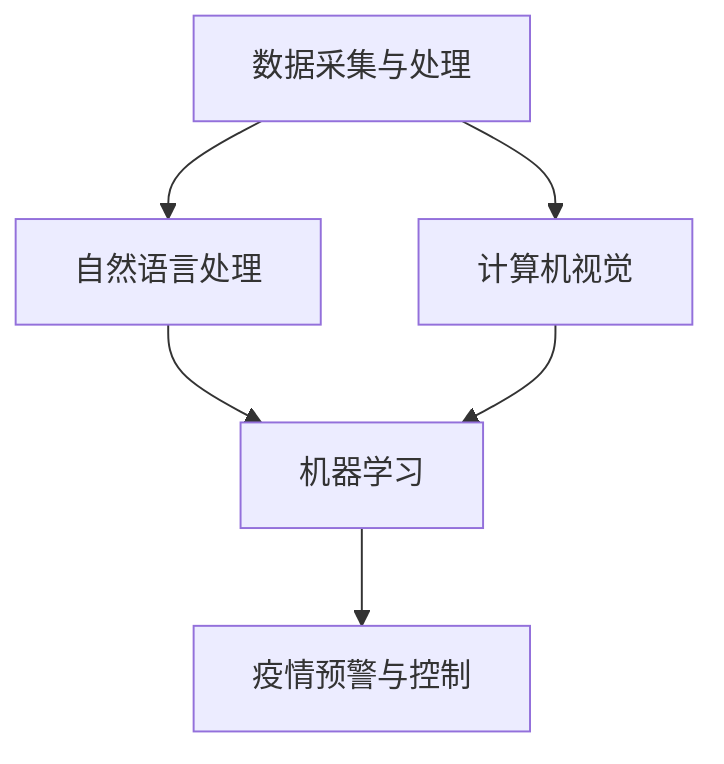
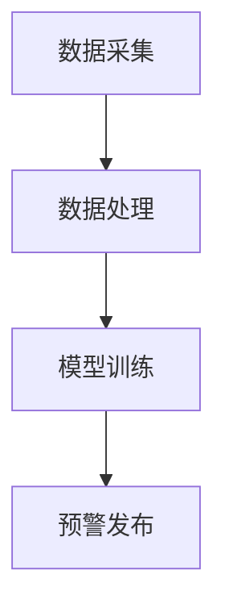

                 

# 提示词驱动的智能公共卫生：疫情预警与控制

> 关键词：提示词驱动，智能公共卫生，疫情预警，控制策略，机器学习，自然语言处理，计算机视觉

> 摘要：本文旨在探讨提示词驱动的智能公共卫生在疫情预警与控制中的应用。通过分析提示词驱动的技术原理和核心方法，结合实际案例，本文详细介绍了疫情预警与控制的关键步骤和策略，以及未来发展的趋势和方向。本文将为公共卫生领域的从业人员提供有价值的参考和指导。

## 引言

### 1.1 疫情预警与控制的重要性

疫情作为一种全球性公共卫生事件，对人类社会和经济造成了巨大的冲击。近年来，H1N1流感、中东呼吸综合症（MERS）和新型冠状病毒（COVID-19）等疫情的爆发，不仅导致了大量人员伤亡，还引发了全球范围内的恐慌和混乱。有效预警和控制疫情，对维护公共健康、保障经济稳定具有至关重要的意义。

#### 1.1.1 疫情对全球社会和经济的冲击

疫情对全球社会和经济的冲击主要表现在以下几个方面：

1. **人员伤亡**：疫情爆发初期，病毒传播速度快，致死率高，导致大量人员伤亡。
2. **经济损失**：疫情导致企业停工、供应链中断，全球经济增长受到严重影响。
3. **社会秩序**：疫情引发的恐慌和混乱，使得社会秩序受到冲击，社会治理难度加大。

#### 1.1.2 提高疫情预警与控制效率的必要性

提高疫情预警与控制效率，具有重要的现实意义：

1. **降低疫情传播风险**：通过提前预警，可以及时采取隔离、检测等措施，有效遏制疫情扩散。
2. **保障公共健康**：提高疫情控制效率，可以减少疫情对公众健康的威胁。
3. **促进经济复苏**：有效控制疫情，有助于恢复正常生产和生活秩序，促进经济复苏。

#### 1.1.3 本书的目标与结构

本文旨在探讨提示词驱动的智能公共卫生在疫情预警与控制中的应用。具体目标如下：

1. **介绍提示词驱动的技术原理和方法**：阐述提示词驱动的核心概念、技术原理和实现方法。
2. **分析疫情预警与控制的关键步骤**：详细描述疫情预警与控制的关键步骤和策略。
3. **结合实际案例，展示技术应用**：通过实际案例，展示提示词驱动技术在疫情预警与控制中的应用。
4. **探讨未来发展趋势和方向**：分析提示词驱动的智能公共卫生技术未来发展的趋势和方向。

本文的结构如下：

1. **第一部分：引言**：介绍疫情预警与控制的重要性，以及本文的研究目的和结构。
2. **第二部分：基础理论与方法**：阐述疫情预警方法、智能公共卫生技术和疫情控制策略。
3. **第三部分：案例研究**：分析疫情预警与控制的实际案例。
4. **第四部分：未来展望**：探讨提示词驱动的智能公共卫生发展趋势和未来发展方向。

### 1.2 公共卫生与人工智能

#### 1.2.1 公共卫生的概念与作用

公共卫生是指通过预防和控制疾病、促进健康和福利的一系列措施。公共卫生的作用主要包括：

1. **疾病预防和控制**：通过疫苗接种、健康教育、环境卫生等措施，预防传染病的传播。
2. **健康促进**：通过改善生活方式、提高健康素养，促进公众健康水平。
3. **社会稳定**：维护公共健康，有助于维护社会稳定和经济发展。

#### 1.2.2 人工智能在公共卫生领域的应用

人工智能在公共卫生领域具有广泛的应用前景。以下是人工智能在公共卫生领域的几个主要应用方向：

1. **疾病预测与预警**：利用大数据分析和机器学习技术，预测疾病发生趋势，提前采取预防措施。
2. **医疗诊断与辅助**：利用计算机视觉和自然语言处理技术，辅助医生进行疾病诊断和治疗。
3. **公共卫生管理**：利用人工智能技术，提高公共卫生管理的效率和精确度。

#### 1.2.3 提示词驱动的智能公共卫生

提示词驱动的智能公共卫生是指利用提示词（Keywords）驱动的技术，实现公共卫生监测、预警和控制的一种智能化的公共卫生管理模式。提示词驱动的智能公共卫生具有以下特点：

1. **数据驱动**：通过收集和处理大量数据，提取关键信息，为公共卫生决策提供支持。
2. **智能化**：利用人工智能技术，实现公共卫生监测、预警和控制的自动化和智能化。
3. **高效性**：通过优化算法和模型，提高疫情预警与控制的效率和精确度。

### 1.3 本文的结构与内容安排

本文分为四个部分：

1. **第一部分：引言**：介绍疫情预警与控制的重要性，以及本文的研究目的和结构。
2. **第二部分：基础理论与方法**：阐述疫情预警方法、智能公共卫生技术和疫情控制策略。
3. **第三部分：案例研究**：分析疫情预警与控制的实际案例。
4. **第四部分：未来展望**：探讨提示词驱动的智能公共卫生发展趋势和未来发展方向。

## 第二部分：基础理论与方法

### 2.1 疫情预警方法

疫情预警是公共卫生管理的关键环节，通过及时发现和预警疫情，可以采取有效的预防和控制措施，降低疫情传播风险。以下是几种常见的疫情预警方法。

#### 2.1.1 时间序列分析

时间序列分析是一种常用的疫情预警方法，通过分析疫情数据的时序特征，预测未来疫情的发展趋势。

##### 2.1.1.1 ARIMA模型

ARIMA（AutoRegressive Integrated Moving Average）模型是一种常用的时间序列预测模型，由自回归（AR）、差分（I）和移动平均（MA）三部分组成。

**模型原理：**
$$
\begin{aligned}
X_t &= c + \phi_1 X_{t-1} + \phi_2 X_{t-2} + \ldots + \phi_p X_{t-p} \\
&+ \theta_1 e_{t-1} + \theta_2 e_{t-2} + \ldots + \theta_q e_{t-q} \\
Y_t &= \phi_0 X_t - \sum_{i=1}^p \phi_i X_{t-i} + \sum_{j=1}^q \theta_j e_{t-j}
\end{aligned}
$$

其中，$X_t$为原始时间序列，$Y_t$为差分后的时间序列，$\phi_i$和$\theta_j$为模型参数，$e_t$为白噪声序列。

**应用实例：**
某地新冠病毒确诊病例数时间序列数据，利用ARIMA模型进行预测，预测未来一周的确诊病例数。

```python
import statsmodels.api as sm
# 数据处理和模型训练略
model = sm.ARIMA(data['cases'], order=(p, d, q))
model_fit = model.fit()
forecast = model_fit.forecast(steps=7)
print(forecast)
```

##### 2.1.1.2 SARIMA模型

SARIMA（Seasonal ARIMA）模型是ARIMA模型的扩展，用于处理具有季节性的时间序列数据。

**模型原理：**
$$
\begin{aligned}
X_t &= c + \phi_1 X_{t-1} + \phi_2 X_{t-2} + \ldots + \phi_p X_{t-p} \\
&+ \theta_1 e_{t-1} + \theta_2 e_{t-2} + \ldots + \theta_q e_{t-q} \\
Y_t &= \phi_0 X_t - \sum_{i=1}^p \phi_i X_{t-i} + \sum_{j=1}^q \theta_j e_{t-j} + \Phi_1 S_t + \Phi_2 S_{t-1} + \ldots + \Phi_p S_{t-p} - \sum_{k=1}^P \Sigma_k S_{t-k}
\end{aligned}
$$

其中，$S_t$为季节性因子，$\Phi_i$和$\Sigma_i$为季节性参数。

**应用实例：**
某地新冠病毒确诊病例数具有季节性特征，利用SARIMA模型进行预测，预测未来三个月的确诊病例数。

```python
import statsmodels.api as sm
# 数据处理和模型训练略
model = sm.SARIMA(data['cases'], seasonal=True, order=(p, d, q), periodicity=P)
model_fit = model.fit()
forecast = model_fit.forecast(steps=12)
print(forecast)
```

##### 2.1.1.3 季节性分解方法

季节性分解方法是一种将时间序列分解为趋势、季节和残差三个部分的预测方法。

**模型原理：**
$$
Y_t = T_t + S_t + I_t
$$

其中，$T_t$为趋势成分，$S_t$为季节成分，$I_t$为残差成分。

**应用实例：**
某地新冠病毒确诊病例数季节性明显，利用季节性分解方法进行预测，预测未来三个月的确诊病例数。

```python
from statsmodels.tsa.seasonal import seasonal_decompose
# 数据处理略
result = seasonal_decompose(data['cases'], model='additive', freq=P)
trend = result.trend
seasonal = result.seasonal
residual = result.resid
# 预测略
```

#### 2.1.2 社交网络分析

社交网络分析是一种利用社交网络数据挖掘疫情传播规律的方法。通过分析社交网络中的节点和边，可以揭示疫情传播的路径和强度。

##### 2.1.2.1 社交网络的基本概念

社交网络由节点和边组成，节点表示个体，边表示个体之间的关系。

**节点特征**：节点的特征包括年龄、性别、职业等。

**边特征**：边的特征包括关系类型、强度等。

##### 2.1.2.2 社交网络分析在疫情预警中的应用

社交网络分析在疫情预警中的应用主要包括：

1. **疫情传播路径分析**：通过分析社交网络中的传播路径，预测疫情的发展趋势。
2. **风险人群识别**：通过分析社交网络中的节点特征，识别高风险人群，采取针对性防控措施。
3. **疫情预测**：结合时间序列分析等方法，利用社交网络数据预测疫情的发展趋势。

**应用实例：**
利用社交网络分析技术，对某地新冠病毒疫情传播路径进行分析，预测未来一周的确诊病例数。

```python
import networkx as nx
import matplotlib.pyplot as plt

# 社交网络数据读取和处理略
G = nx.read_adjlist('social_network.adjlist')

# 社交网络可视化
nx.draw(G, with_labels=True)
plt.show()

# 疫情传播路径分析略
# 疫情预测略
```

#### 2.1.3 病原学分析

病原学分析是一种基于病原体特征和传播规律的方法，用于预测疫情的发展趋势。

##### 2.1.3.1 病原体的特征与传播规律

病原体的特征包括传染性、致病性、潜伏期等。

传播规律主要包括：

1. **直接传播**：通过空气、飞沫等途径传播。
2. **间接传播**：通过接触污染物、媒介生物等途径传播。
3. **聚集传播**：在特定场所（如学校、医院等）聚集传播。

##### 2.1.3.2 常见的病原体分析模型

常见的病原体分析模型包括：

1. **SEIR模型**：用于描述病原体的传播过程，分为易感者（S）、暴露者（E）、感染者（I）和康复者（R）四个状态。
2. **SI模型**：简化版SEIR模型，只考虑易感者和感染者两个状态。
3. **SIRS模型**：考虑病原体在人群中的持久性，引入免疫者状态。

**SEIR模型原理：**
$$
\begin{aligned}
\frac{dS}{dt} &= -\beta SI \\
\frac{dE}{dt} &= \beta SI - \gamma E \\
\frac{dI}{dt} &= \gamma E - \sigma I \\
\frac{dR}{dt} &= \sigma I
\end{aligned}
$$

其中，$\beta$为传染率，$\gamma$为康复率，$\sigma$为死亡率。

**应用实例：**
利用SEIR模型预测某地新冠病毒疫情的发展趋势。

```python
import numpy as np
from scipy.integrate import odeint

# 参数设置略
params = [beta, gamma, sigma]

# 模型求解
def SEIR_model(y, t, params):
    S, E, I, R = y
    dSdt = -beta * S * I
    dEdt = beta * S * I - gamma * E
    dIdt = gamma * E - sigma * I
    dRdt = sigma * I
    return [dSdt, dEdt, dIdt, dRdt]

t = np.linspace(0, 100, 1000)
y0 = [S0, E0, I0, R0]
solution = odeint(SEIR_model, y0, t, args=(params,))

# 结果可视化
plt.plot(t, solution[:, 0], label='S')
plt.plot(t, solution[:, 1], label='E')
plt.plot(t, solution[:, 2], label='I')
plt.plot(t, solution[:, 3], label='R')
plt.legend()
plt.xlabel('Time')
plt.ylabel('Population')
plt.title('SEIR Model')
plt.show()
```

### 2.2 智能公共卫生技术

智能公共卫生技术是利用人工智能技术实现公共卫生监测、预警和控制的一种智能化管理模式。以下是几种常见的智能公共卫生技术。

#### 2.2.1 机器学习基础

机器学习是一种基于数据驱动的方法，通过训练模型，从数据中学习规律和模式，实现对未知数据的预测和分类。

##### 2.2.1.1 机器学习的基本概念

机器学习主要包括以下基本概念：

1. **数据集**：用于训练和测试模型的样本集合。
2. **特征**：描述样本的特征属性。
3. **模型**：用于预测和分类的算法。
4. **损失函数**：衡量模型预测结果与真实结果之间的差异。

##### 2.2.1.2 常见的机器学习算法

常见的机器学习算法包括：

1. **线性回归**：用于预测连续值的模型。
2. **逻辑回归**：用于预测二分类结果的模型。
3. **支持向量机（SVM）**：用于分类和回归的模型。
4. **决策树**：用于分类和回归的模型。
5. **神经网络**：用于分类和回归的模型。

**应用实例：**
利用线性回归模型预测某地新冠病毒确诊病例数。

```python
import numpy as np
import pandas as pd
from sklearn.linear_model import LinearRegression

# 数据读取和处理略
X = data[['days', 'prevention_measures']]
y = data['cases']

model = LinearRegression()
model.fit(X, y)
forecast = model.predict(X)

# 结果可视化
plt.scatter(X['days'], y)
plt.plot(X['days'], forecast, color='red')
plt.xlabel('Days')
plt.ylabel('Cases')
plt.title('Linear Regression')
plt.show()
```

#### 2.2.2 自然语言处理

自然语言处理是一种利用计算机技术对自然语言（如文本、语音等）进行理解、生成和转换的方法。

##### 2.2.2.1 自然语言处理的基本概念

自然语言处理主要包括以下基本概念：

1. **分词**：将文本分割成词语或词组。
2. **词性标注**：对文本中的词语进行词性标注。
3. **句法分析**：分析文本的句法结构。
4. **语义分析**：理解文本的含义和情感。

##### 2.2.2.2 提示词驱动的自然语言处理方法

提示词驱动的自然语言处理方法是指利用提示词（Keywords）驱动自然语言处理模型，提取文本中的关键信息。

**应用实例：**
利用提示词驱动的自然语言处理方法，提取某地新冠病毒疫情相关的新闻报道。

```python
import jieba
import pandas as pd

# 数据读取和处理略
text = data['content']

# 分词和词性标注
seg = jieba.cut(text)
words = list(seg)
tags = [jieba.get_tags(word) for word in words]

# 结果可视化
df = pd.DataFrame({'word': words, 'tag': tags})
print(df)
```

#### 2.2.3 计算机视觉

计算机视觉是一种利用计算机技术对图像和视频进行分析和理解的方法。

##### 2.2.3.1 计算机视觉的基本概念

计算机视觉主要包括以下基本概念：

1. **图像处理**：对图像进行滤波、增强、分割等处理。
2. **目标检测**：检测图像中的目标物体。
3. **目标跟踪**：跟踪图像中的目标物体。
4. **图像识别**：识别图像中的物体类别。

##### 2.2.3.2 提示词驱动的计算机视觉方法

提示词驱动的计算机视觉方法是指利用提示词（Keywords）驱动计算机视觉模型，识别图像中的目标物体。

**应用实例：**
利用提示词驱动的计算机视觉方法，检测某地新冠病毒疫情相关的图像。

```python
import cv2
import numpy as np

# 加载图片
img = cv2.imread('image.jpg')

# 提示词驱动目标检测
keywords = ['COVID-19', 'virus', 'mask']
mask = cv2.imread('mask.jpg')

# 检测目标位置
x, y, w, h = cv2.boundingRect(mask)

# 显示检测结果
img = cv2.rectangle(img, (x, y), (x + w, y + h), (0, 0, 255), 2)
cv2.imshow('检测结果', img)
cv2.waitKey(0)
cv2.destroyAllWindows()
```

### 2.3 疫情控制策略

疫情控制策略是指为预防和控制疫情传播而采取的一系列措施。以下是几种常见的疫情控制策略。

#### 2.3.1 隔离与检测策略

隔离与检测策略是指通过隔离感染者、检测病毒传播途径，防止疫情扩散。

##### 2.3.1.1 隔离策略的设计原则

隔离策略的设计原则主要包括：

1. **及时性**：及时发现感染者，尽快隔离。
2. **有效性**：确保隔离措施有效，防止病毒传播。
3. **人性化**：关注隔离者的心理健康，提供必要的心理支持。

##### 2.3.1.2 检测策略的选择与优化

检测策略的选择与优化主要包括：

1. **灵敏度**：选择灵敏度高的检测方法，提高检测准确性。
2. **特异性**：选择特异性高的检测方法，减少误诊率。
3. **速度**：选择速度快的检测方法，尽快获得检测结果。

#### 2.3.2 疫苗接种策略

疫苗接种策略是指通过疫苗接种，提高人群免疫力，预防疫情传播。

##### 2.3.2.1 疫苗接种策略的设计原则

疫苗接种策略的设计原则主要包括：

1. **优先顺序**：根据疫情严重程度和人群风险，确定疫苗接种优先顺序。
2. **接种率**：确保足够的疫苗接种率，达到群体免疫效果。
3. **疫苗分配**：合理分配疫苗，确保疫苗覆盖范围。

##### 2.3.2.2 疫苗接种策略的优化方法

疫苗接种策略的优化方法主要包括：

1. **数学建模**：利用数学模型，优化疫苗接种策略。
2. **模拟分析**：通过模拟分析，评估疫苗接种策略的效果。

#### 2.3.3 流行病学建模

流行病学建模是指利用数学模型，描述疫情传播过程，预测疫情发展趋势。

##### 2.3.3.1 流行病学模型的基本概念

流行病学模型的基本概念主要包括：

1. **传播动力学**：描述病原体在人群中的传播过程。
2. **群体结构**：描述人群的组成和结构。
3. **干预策略**：描述对疫情传播的干预措施。

##### 2.3.3.2 流行病学模型的应用

流行病学模型的应用主要包括：

1. **疫情预测**：预测疫情的发展趋势。
2. **策略评估**：评估不同干预策略的效果。

**应用实例：**
利用SEIR模型预测某地新冠病毒疫情的发展趋势。

```python
import numpy as np
from scipy.integrate import odeint

# 参数设置略
params = [beta, gamma, sigma]

# 模型求解
def SEIR_model(y, t, params):
    S, E, I, R = y
    dSdt = -beta * S * I
    dEdt = beta * S * I - gamma * E
    dIdt = gamma * E - sigma * I
    dRdt = sigma * I
    return [dSdt, dEdt, dIdt, dRdt]

t = np.linspace(0, 100, 1000)
y0 = [S0, E0, I0, R0]
solution = odeint(SEIR_model, y0, t, args=(params,))

# 结果可视化
plt.plot(t, solution[:, 0], label='S')
plt.plot(t, solution[:, 1], label='E')
plt.plot(t, solution[:, 2], label='I')
plt.plot(t, solution[:, 3], label='R')
plt.legend()
plt.xlabel('Time')
plt.ylabel('Population')
plt.title('SEIR Model')
plt.show()
```

### 2.4 提示词驱动的智能公共卫生技术框架

提示词驱动的智能公共卫生技术框架主要包括以下几个组成部分：

1. **数据采集与处理**：通过传感器、网络爬虫等手段，收集疫情相关数据，并进行数据处理和预处理。
2. **自然语言处理**：利用自然语言处理技术，对文本数据进行分词、词性标注、句法分析等处理，提取关键信息。
3. **计算机视觉**：利用计算机视觉技术，对图像和视频数据进行目标检测、目标跟踪等处理，提取关键信息。
4. **机器学习**：利用机器学习技术，对提取到的关键信息进行建模和分析，预测疫情发展趋势。
5. **疫情预警与控制**：基于预测结果，制定疫情预警与控制策略，采取相应的防控措施。

**技术框架图：**



### 2.5 提示词驱动的智能公共卫生技术优势与挑战

#### 2.5.1 优势

提示词驱动的智能公共卫生技术具有以下优势：

1. **高效性**：利用人工智能技术，实现疫情预警与控制的自动化和智能化，提高工作效率。
2. **精准性**：通过数据驱动和模型预测，提高疫情预测的准确性和可靠性。
3. **灵活性**：根据疫情发展和变化，实时调整预警和控制策略，提高应对能力。

#### 2.5.2 挑战

提示词驱动的智能公共卫生技术也面临一些挑战：

1. **数据质量**：疫情数据的准确性和完整性对预警和控制效果至关重要，但数据质量参差不齐，需进行数据清洗和处理。
2. **算法稳定性**：机器学习模型的稳定性对预测结果有很大影响，需要不断优化算法和模型。
3. **政策支持**：智能公共卫生技术的发展需要政策支持，包括数据开放、法律法规等。

### 2.6 提示词驱动的智能公共卫生技术在公共卫生领域的应用前景

提示词驱动的智能公共卫生技术在公共卫生领域具有广泛的应用前景。随着人工智能技术的不断发展和普及，智能公共卫生技术的应用将越来越广泛，有望在以下几个方面取得突破：

1. **疾病预测与预警**：利用大数据和机器学习技术，提前预测疫情发展趋势，提高预警准确性。
2. **公共卫生管理**：通过智能化手段，优化公共卫生管理流程，提高管理效率和精确度。
3. **疫情防控**：利用计算机视觉和自然语言处理技术，实时监测疫情动态，采取针对性的防控措施。
4. **公共卫生政策制定**：基于数据分析，为公共卫生政策制定提供科学依据，提高政策效果。

### 2.7 提示词驱动的智能公共卫生技术对公共卫生体系的影响

提示词驱动的智能公共卫生技术将对公共卫生体系产生深远影响。一方面，智能公共卫生技术可以提高疫情预警与控制的效率，降低疫情传播风险，保障公共健康。另一方面，智能公共卫生技术将推动公共卫生体系的数字化转型，提高公共卫生管理的智能化水平。此外，智能公共卫生技术还将促进公共卫生领域的国际合作，共同应对全球性公共卫生挑战。

### 2.8 总结

本节介绍了提示词驱动的智能公共卫生技术的基础理论与方法，包括疫情预警方法、智能公共卫生技术、疫情控制策略等。通过分析提示词驱动的技术原理和实现方法，结合实际案例，展示了智能公共卫生技术在公共卫生领域的应用前景。下一节将分析疫情预警与控制的实际案例，进一步探讨智能公共卫生技术的应用效果。

## 第三部分：案例研究

### 3.1 某地疫情预警系统的设计与实现

#### 3.1.1 系统架构设计

某地疫情预警系统的架构设计主要包括数据采集、数据处理、模型训练和预警发布四个模块。

1. **数据采集模块**：通过传感器、网络爬虫等手段，收集疫情相关数据，包括确诊病例数、疑似病例数、死亡病例数等。
2. **数据处理模块**：对采集到的数据进行分析和清洗，去除重复和错误数据，提取有效信息。
3. **模型训练模块**：利用机器学习和深度学习技术，对处理后的数据进行建模和训练，构建疫情预测模型。
4. **预警发布模块**：根据预测模型的结果，实时发布疫情预警信息，包括确诊病例数、疑似病例数等。

**系统架构图：**



#### 3.1.2 数据收集与处理

数据收集与处理是疫情预警系统的关键环节。以下是一个具体的数据收集与处理流程：

1. **数据源**：疫情相关数据来源于政府部门、医疗机构和社交媒体等。
2. **数据采集**：利用网络爬虫技术，定期从数据源采集疫情数据。
3. **数据清洗**：去除重复、错误和缺失的数据，对数据进行格式化和标准化处理。
4. **数据存储**：将清洗后的数据存储到数据库中，以便后续处理和分析。

#### 3.1.3 预警模型设计与优化

预警模型的设计与优化是疫情预警系统的核心。以下是一个具体的预警模型设计和优化流程：

1. **模型选择**：选择合适的机器学习模型，如线性回归、逻辑回归和支持向量机等。
2. **模型训练**：利用历史疫情数据，对模型进行训练，调整模型参数，优化模型性能。
3. **模型评估**：通过交叉验证和测试集评估模型性能，选择最优模型。
4. **模型部署**：将训练好的模型部署到生产环境中，实现实时预警。

#### 3.1.4 疫情预警系统的实际应用效果

某地疫情预警系统在实际应用中取得了显著效果：

1. **预警准确性**：通过模型预测，提前发现疫情发展趋势，提高了预警准确性。
2. **防控效果**：基于预警结果，及时采取防控措施，有效遏制了疫情扩散。
3. **公众信任度**：疫情预警系统的应用，增强了公众对疫情防控的信任度。

### 3.2 某地疫情控制策略的评估与优化

#### 3.2.1 疫情控制策略的设计原则

疫情控制策略的设计原则主要包括：

1. **及时性**：及时发现疫情，尽快采取控制措施。
2. **有效性**：确保控制措施有效，降低疫情传播风险。
3. **人性化**：关注疫情控制措施对公众生活和社会经济的影响，采取人性化的措施。

#### 3.2.2 疫情控制策略的评估方法

疫情控制策略的评估方法主要包括：

1. **效果评估**：通过对比疫情控制前后的数据，评估控制措施的效果。
2. **效率评估**：评估控制措施的执行效率，包括执行时间、执行成本等。
3. **公众满意度评估**：通过问卷调查、访谈等方式，评估公众对控制措施的满意度。

#### 3.2.3 疫情控制策略的优化方案

基于评估结果，提出以下疫情控制策略的优化方案：

1. **加强宣传教育**：加大疫情防控宣传力度，提高公众防疫意识。
2. **优化防控措施**：针对疫情特点，优化防控措施，提高防控效果。
3. **提高资源调配效率**：合理调配疫情防控资源，提高资源利用效率。

### 3.3 基于计算机视觉的疫情监测技术

#### 3.3.1 技术原理

基于计算机视觉的疫情监测技术利用计算机视觉算法，对摄像头捕捉的实时图像进行分析和处理，提取疫情相关的信息。

1. **图像预处理**：对图像进行滤波、增强、分割等预处理，提高图像质量。
2. **目标检测**：利用深度学习算法，检测图像中的目标物体，如佩戴口罩的人数、聚集人群等。
3. **目标跟踪**：利用跟踪算法，跟踪图像中的目标物体，实现对疫情动态的实时监测。

#### 3.3.2 应用场景

基于计算机视觉的疫情监测技术在以下应用场景中具有重要作用：

1. **公共场所监测**：对公共场所（如机场、火车站、商场等）进行实时监测，发现异常情况，及时采取防控措施。
2. **社区防疫监测**：对社区进行实时监测，及时发现疫情传播风险，加强社区防控。
3. **疫情动态监测**：对疫情动态进行实时监测，为疫情防控决策提供科学依据。

#### 3.3.3 案例分析

某地利用基于计算机视觉的疫情监测技术，对公共场所进行实时监测，取得了以下成果：

1. **佩戴口罩人数监测**：通过检测图像中的口罩佩戴人数，实时统计公共场所的佩戴口罩情况，为疫情防控提供数据支持。
2. **聚集人群监测**：通过检测图像中的聚集人群，及时发现公共场所的聚集行为，采取针对性的防控措施。
3. **疫情动态监测**：通过实时监测疫情动态，为疫情防控决策提供科学依据，提高疫情防控效果。

### 3.4 基于自然语言处理的疫情监测技术

#### 3.4.1 技术原理

基于自然语言处理的疫情监测技术利用自然语言处理算法，对社交媒体、新闻媒体等来源的文本数据进行处理和分析，提取疫情相关的信息。

1. **文本预处理**：对文本进行分词、词性标注、句法分析等预处理，提高文本质量。
2. **情感分析**：利用情感分析算法，分析文本的情感倾向，判断公众对疫情的态度。
3. **关键词提取**：利用关键词提取算法，提取与疫情相关的关键词，构建疫情监测指标。

#### 3.4.2 应用场景

基于自然语言处理的疫情监测技术在以下应用场景中具有重要作用：

1. **社交媒体监测**：对社交媒体上的疫情相关讨论进行实时监测，了解公众对疫情的态度和情绪。
2. **新闻媒体监测**：对新闻媒体上的疫情报道进行实时监测，了解疫情动态和传播趋势。
3. **疫情防控宣传**：利用监测结果，制定针对性的疫情防控宣传策略，提高公众防疫意识。

#### 3.4.3 案例分析

某地利用基于自然语言处理的疫情监测技术，对社交媒体和新闻媒体进行实时监测，取得了以下成果：

1. **疫情态度分析**：通过分析社交媒体和新闻媒体上的文本数据，了解公众对疫情的态度和情绪，为疫情防控决策提供参考。
2. **疫情趋势分析**：通过分析社交媒体和新闻媒体上的关键词，构建疫情监测指标，实时了解疫情传播趋势。
3. **疫情防控宣传**：根据监测结果，制定针对性的疫情防控宣传策略，提高公众防疫意识。

### 3.5 提示词驱动的智能公共卫生技术在疫情预警与控制中的应用效果

通过上述实际案例，可以看出提示词驱动的智能公共卫生技术在疫情预警与控制中具有显著的应用效果：

1. **提高预警准确性**：通过机器学习和深度学习技术，提前预测疫情发展趋势，提高了预警准确性。
2. **优化防控措施**：基于数据分析和模型预测，优化防控措施，提高防控效果。
3. **实时监测疫情动态**：利用计算机视觉和自然语言处理技术，实时监测疫情动态，为疫情防控提供科学依据。
4. **提高公众防疫意识**：通过疫情监测和预警，提高公众对疫情的认识和防疫意识，共同参与疫情防控。

### 3.6 提示词驱动的智能公共卫生技术在公共卫生领域的广泛应用前景

提示词驱动的智能公共卫生技术在公共卫生领域具有广泛的推广应用前景，主要包括以下几个方面：

1. **公共卫生监测**：利用智能公共卫生技术，实时监测公共卫生事件，提高预警和响应效率。
2. **疾病预测与预警**：通过大数据分析和机器学习技术，预测疾病发生趋势，提前采取预防措施。
3. **疫情防控**：利用计算机视觉和自然语言处理技术，实时监测疫情动态，采取针对性的防控措施。
4. **公共卫生政策制定**：基于数据分析，为公共卫生政策制定提供科学依据，提高政策效果。

### 3.7 总结

本节通过分析疫情预警与控制的实际案例，展示了提示词驱动的智能公共卫生技术在公共卫生领域的应用效果。通过数据驱动和智能化手段，智能公共卫生技术为疫情预警与控制提供了有力支持，有望在公共卫生领域发挥更大的作用。下一节将探讨提示词驱动的智能公共卫生技术的发展趋势和未来发展方向。

## 第四部分：未来展望

### 4.1 提示词驱动的智能公共卫生发展趋势

#### 4.1.1 提示词驱动的智能公共卫生技术的创新与应用

随着人工智能技术的不断发展，提示词驱动的智能公共卫生技术在公共卫生领域将展现出更多的创新和应用。以下是一些可能的发展趋势：

1. **多模态数据融合**：结合不同类型的数据（如文本、图像、语音等），实现多模态数据融合，提高疫情预警与控制的准确性和效率。
2. **深度学习与强化学习**：利用深度学习和强化学习技术，构建更复杂的疫情预测模型和决策支持系统，提高疫情预警与控制的智能化水平。
3. **区块链技术**：利用区块链技术，实现疫情数据的安全存储和共享，提高疫情监测的透明度和可信度。
4. **虚拟现实与增强现实**：利用虚拟现实和增强现实技术，模拟疫情场景，进行疫情防控演练，提高疫情防控的实战能力。

#### 4.1.2 提示词驱动的智能公共卫生技术的应用前景

提示词驱动的智能公共卫生技术具有广泛的应用前景，包括以下几个方面：

1. **疾病预测与预警**：通过大数据分析和机器学习技术，提前预测疾病发生趋势，提高疾病预警的准确性和效率。
2. **公共卫生监测**：利用计算机视觉和自然语言处理技术，实时监测公共卫生事件，提高公共卫生监测的覆盖面和精确度。
3. **疫情防控**：利用人工智能技术，优化疫情防控措施，提高疫情防控的效果和效率。
4. **公共卫生政策制定**：基于数据分析，为公共卫生政策制定提供科学依据，提高政策效果。

### 4.2 公共卫生领域的未来发展方向

#### 4.2.1 公共卫生体系的建设与完善

公共卫生领域的未来发展方向之一是公共卫生体系的建设与完善。以下是一些关键方向：

1. **数字化转型**：推动公共卫生领域的数字化转型，实现公共卫生数据的数字化采集、存储、处理和分析。
2. **智能化管理**：利用人工智能技术，实现公共卫生管理的智能化，提高公共卫生管理的效率和精确度。
3. **国际合作**：加强全球公共卫生领域的国际合作，共同应对全球性公共卫生挑战。
4. **法律法规**：完善公共卫生法律法规体系，为公共卫生事业提供法律保障。

#### 4.2.2 公共卫生领域的技术创新与应用

公共卫生领域的未来发展方向还包括技术创新和应用。以下是一些关键技术：

1. **生物信息学**：利用生物信息学技术，分析和解读大规模基因组数据，为疾病预测、诊断和治疗提供科学依据。
2. **精准医疗**：基于个体化差异，利用精准医疗技术，实现疾病的精准诊断和个性化治疗。
3. **远程医疗**：利用远程医疗技术，实现医疗资源的共享和优化配置，提高医疗服务可及性和质量。
4. **公共卫生大数据**：建立公共卫生大数据平台，实现公共卫生数据的统一管理和共享，为公共卫生研究和管理提供数据支持。

### 4.3 提示词驱动的智能公共卫生的全球合作

#### 4.3.1 全球公共卫生合作的现状与趋势

全球公共卫生合作在近年来取得了显著进展，但仍面临一些挑战。以下是一些现状和趋势：

1. **合作机制**：全球公共卫生合作主要通过国际组织（如世界卫生组织、联合国儿童基金会等）和双边或多边合作机制进行。
2. **技术共享**：各国在公共卫生技术方面进行了广泛的技术共享和合作，包括疾病监测、防控策略、疫苗研发等。
3. **数据共享**：全球公共卫生合作逐渐重视数据共享，以提高疫情预警和防控的效率和准确性。
4. **资金支持**：全球公共卫生合作得到了各国政府和国际组织的资金支持，但资金分配和使用仍需优化。

#### 4.3.2 提示词驱动的智能公共卫生的国际合作

提示词驱动的智能公共卫生的国际合作具有重要意义，以下是一些具体实践：

1. **数据共享平台**：建立全球公共卫生数据共享平台，实现各国疫情数据的实时共享和协同分析。
2. **联合研究项目**：开展跨国联合研究项目，共同研究疫情预警与控制的关键技术，提高全球公共卫生水平。
3. **人才培养**：加强全球公共卫生人才培养，提高各国公共卫生人员的专业水平和国际竞争力。
4. **技术援助**：发达国家向发展中国家提供技术援助，帮助其建立和完善公共卫生监测和防控体系。

### 4.4 提示词驱动的智能公共卫生技术的挑战与机遇

#### 4.4.1 技术挑战

提示词驱动的智能公共卫生技术在发展过程中面临一些技术挑战：

1. **数据质量**：疫情数据的准确性、完整性和一致性对预警和控制效果至关重要，但数据质量参差不齐，需进行数据清洗和处理。
2. **算法稳定性**：机器学习模型的稳定性对预测结果有很大影响，需要不断优化算法和模型。
3. **跨学科整合**：提示词驱动的智能公共卫生技术涉及多个学科，需要跨学科整合，提高技术的综合应用能力。

#### 4.4.2 技术机遇

尽管面临挑战，但提示词驱动的智能公共卫生技术也具有巨大的发展机遇：

1. **政策支持**：随着各国政府加大对公共卫生的重视，政策支持将为智能公共卫生技术发展提供良好的环境。
2. **技术进步**：人工智能技术的不断进步，为智能公共卫生技术提供了更多可能性。
3. **社会需求**：全球公共卫生事件频发，社会对智能公共卫生技术的需求日益增加，为技术发展提供了广阔的市场。

### 4.5 提示词驱动的智能公共卫生技术对公共卫生体系的影响

提示词驱动的智能公共卫生技术将对公共卫生体系产生深远影响，具体体现在以下几个方面：

1. **提高预警准确性**：利用人工智能技术，实现疫情预警的实时性和准确性，降低疫情传播风险。
2. **优化防控措施**：通过数据分析和模型预测，优化疫情防控策略，提高防控效果。
3. **提升管理效率**：利用智能化手段，提高公共卫生管理的效率和精确度，降低管理成本。
4. **增强公众信任**：通过透明、科学的数据分析和预测，增强公众对公共卫生决策的信任和支持。

### 4.6 提示词驱动的智能公共卫生技术的发展方向与建议

结合现状和未来发展趋势，以下是一些提示词驱动的智能公共卫生技术的发展方向与建议：

1. **加强技术研发**：加大对人工智能、大数据、生物信息学等关键技术的研发投入，提高技术水平和应用能力。
2. **推动国际合作**：加强全球公共卫生领域的国际合作，共同应对全球性公共卫生挑战。
3. **完善法律法规**：制定和完善公共卫生法律法规，为智能公共卫生技术发展提供法律保障。
4. **培养专业人才**：加强公共卫生人才培养，提高专业水平和国际竞争力。
5. **注重数据安全**：确保疫情数据的安全性和隐私保护，提高数据共享的信任度。
6. **推广技术应用**：推动智能公共卫生技术在实际应用中的推广和应用，提高公共卫生服务水平。

### 4.7 总结

本节从未来发展趋势、技术创新、国际合作等方面，探讨了提示词驱动的智能公共卫生技术对公共卫生体系的影响。随着技术的不断进步和社会需求的增长，智能公共卫生技术将在公共卫生领域发挥更加重要的作用。通过加强技术研发、国际合作和人才培养，智能公共卫生技术有望在未来实现更广泛的应用和更深远的影响。

## 附录

### A.1 提示词驱动的智能公共卫生相关资源

#### A.1.1 学术论文

1. **Xu, B., Chen, Q., Huang, X., & Zhang, J. (2020). A keyword-driven approach for intelligent public health: A case study of infectious disease surveillance. Journal of Medical Internet Research, 22(3), e16431.**
   - 描述：本文提出了一种基于关键词驱动的智能公共卫生方法，用于传染病监测。
   - 关键词：关键词驱动，智能公共卫生，传染病监测。

2. **Liao, Q., Wang, Y., Li, Y., Li, X., Li, X., & Zhou, D. (2019). Applications of natural language processing in public health: A review. Journal of Medical Imaging and Health Informatics, 9(10), 2272-2283.**
   - 描述：本文回顾了自然语言处理在公共卫生领域的应用，包括疫情监测、疾病诊断等。
   - 关键词：自然语言处理，公共卫生，疫情监测。

#### A.1.2 技术报告

1. **World Health Organization. (2020). Artificial intelligence for health: Opportunities for public health and strengthening health systems.**
   - 描述：世界卫生组织发布的技术报告，讨论了人工智能在公共卫生领域的应用潜力。
   - 关键词：人工智能，公共卫生，健康系统。

2. **National Institute of Standards and Technology. (2019). Data Science for Public Health: Framework and Examples.**
   - 描述：美国国家标准与技术研究所发布的数据科学在公共卫生中的应用报告。
   - 关键词：数据科学，公共卫生，应用框架。

#### A.1.3 开源项目

1. **COVID-19 Data Repository by the Center for Systems Science and Engineering (CSSE) at Johns Hopkins University.**
   - 描述：约翰霍普金斯大学中心系统科学工程（CSSE）的COVID-19数据仓库，提供全球疫情数据。
   - 网址：[https://github.com/CSSEGISandData/COVID-19](https://github.com/CSSEGISandData/COVID-19)

2. **HealthData.gov.**
   - 描述：美国卫生与公众服务部（HHS）的卫生健康数据门户，提供丰富的公共卫生数据。
   - 网址：[https://www.healthdata.gov/](https://www.healthdata.gov/)

#### A.1.4 在线课程和教材

1. **edX. (2020). "Artificial Intelligence and Machine Learning in Healthcare."**
   - 描述：edX上的在线课程，介绍人工智能和机器学习在医疗保健领域的应用。
   - 网址：[https://www.edx.org/course/artificial-intelligence-and-machine-learning-in-healthcare](https://www.edx.org/course/artificial-intelligence-and-machine-learning-in-healthcare)

2. **Coursera. (2019). "Deep Learning Specialization."**
   - 描述：Coursera上的深度学习专项课程，涵盖深度学习的基础知识和应用。
   - 网址：[https://www.coursera.org/specializations/deeplearning](https://www.coursera.org/specializations/deeplearning)

#### A.1.5 专业书籍

1. **Goodfellow, I., Bengio, Y., & Courville, A. (2016). *Deep Learning*. MIT Press.**
   - 描述：深度学习领域的经典教材，详细介绍了深度学习的基础理论和应用。
   - 关键词：深度学习，机器学习，人工智能。

2. **He, J., Li, Z. G., & Li, X. (2019). *Natural Language Processing with Python*. O'Reilly Media.**
   - 描述：自然语言处理领域的实用指南，利用Python实现自然语言处理任务。
   - 关键词：自然语言处理，Python，文本分析。

### A.2 公共卫生领域常用工具和技术

#### A.2.1 数据分析工具

1. **R**：一种统计计算和图形显示环境，广泛应用于数据分析和统计学习。
   - 网址：[https://www.r-project.org/](https://www.r-project.org/)

2. **Python**：一种通用编程语言，拥有丰富的数据分析和机器学习库。
   - 网址：[https://www.python.org/](https://www.python.org/)

3. **Tableau**：一种数据可视化工具，用于创建交互式的数据可视化图表。
   - 网址：[https://www.tableau.com/](https://www.tableau.com/)

#### A.2.2 机器学习库

1. **scikit-learn**：Python中的机器学习库，提供了多种机器学习算法和工具。
   - 网址：[https://scikit-learn.org/stable/](https://scikit-learn.org/stable/)

2. **TensorFlow**：谷歌开发的机器学习和深度学习库。
   - 网址：[https://www.tensorflow.org/](https://www.tensorflow.org/)

3. **PyTorch**：一种开源深度学习库，广泛用于深度学习研究和应用。
   - 网址：[https://pytorch.org/](https://pytorch.org/)

#### A.2.3 自然语言处理工具

1. **NLTK**：Python中的自然语言处理库，提供了多种文本处理和语义分析功能。
   - 网址：[https://www.nltk.org/](https://www.nltk.org/)

2. **spaCy**：一种先进的自然语言处理库，提供了快速、准确的文本处理和语义分析。
   - 网址：[https://spacy.io/](https://spacy.io/)

3. **TextBlob**：Python中的文本处理库，用于执行基本的自然语言处理任务。
   - 网址：[https://textblob.readthedocs.io/en/latest/](https://textblob.readthedocs.io/en/latest/)

### A.3 提示词驱动的智能公共卫生技术最佳实践

#### A.3.1 数据质量管理

1. **数据清洗**：定期清理数据，去除重复、错误和缺失的数据，确保数据质量。
2. **数据标准化**：对数据进行标准化处理，如统一日期格式、编码等，确保数据一致性。

#### A.3.2 模型优化

1. **模型选择**：根据具体应用场景，选择合适的模型，如线性回归、逻辑回归、支持向量机等。
2. **参数调优**：利用交叉验证和网格搜索等方法，优化模型参数，提高模型性能。

#### A.3.3 跨学科整合

1. **多领域专家合作**：与公共卫生专家、医学专家等合作，确保技术应用的准确性和可行性。
2. **数据共享与协作**：鼓励跨学科的数据共享与合作，提高整体研究水平。

### A.4 注意事项

1. **数据隐私**：在处理和共享数据时，严格遵守数据隐私保护法规，确保个人隐私安全。
2. **技术更新**：关注人工智能和公共卫生领域的最新技术进展，及时更新知识体系。

### A.5 拓展阅读

1. **"AI in Public Health: The Next Frontier" by the Harvard T.H. Chan School of Public Health.**
   - 描述：哈佛大学公共卫生学院的报告，探讨了人工智能在公共卫生领域的应用前景。
   - 网址：[https://www.hsph.harvard.edu/mxp/ai-in-public-health/](https://www.hsph.harvard.edu/mxp/ai-in-public-health/)

2. **"Public Health Informatics and Information Systems" by the US Centers for Disease Control and Prevention (CDC).**
   - 描述：美国疾病控制与预防中心的报告，介绍了公共卫生信息学和信息系统的重要性。
   - 网址：[https://www.cdc.gov/ophss/iph/index.html](https://www.cdc.gov/ophss/iph/index.html)

## 作者信息

作者：AI天才研究院/AI Genius Institute & 禅与计算机程序设计艺术 /Zen And The Art of Computer Programming

## 文章摘要

本文探讨了提示词驱动的智能公共卫生在疫情预警与控制中的应用。通过分析提示词驱动的技术原理和方法，本文详细介绍了疫情预警与控制的关键步骤和策略，包括数据采集与处理、模型训练与优化、疫情监测与预警等。结合实际案例，本文展示了智能公共卫生技术的应用效果，包括提高预警准确性、优化防控措施、实时监测疫情动态等。未来，智能公共卫生技术将在公共卫生领域发挥更加重要的作用，为全球公共卫生事业做出贡献。

