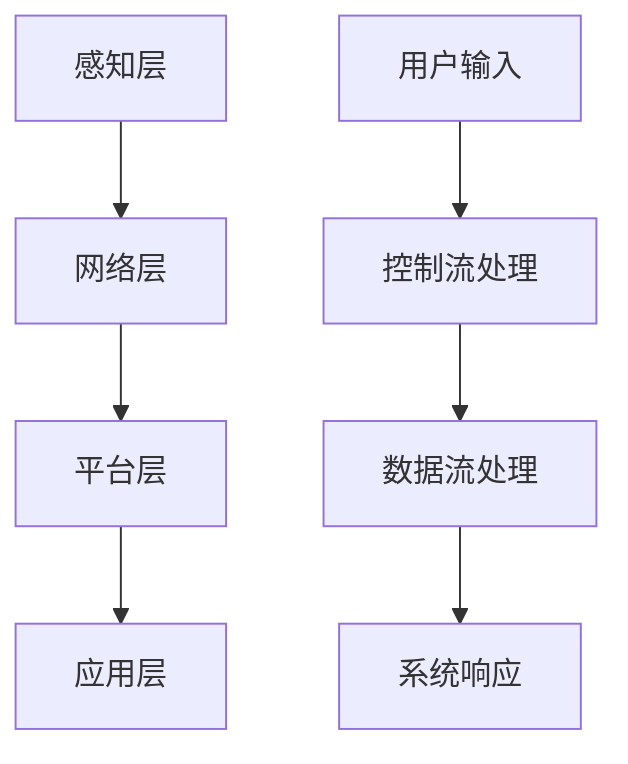

                 

# 《提示词驱动的智能农业管理系统》

> 关键词：智能农业、管理系统、提示词驱动、自然语言处理、数据采集、数据处理、算法、数学模型

> 摘要：本文将深入探讨提示词驱动的智能农业管理系统，从背景和概述、核心技术与原理、项目实战三个方面进行详细分析。我们将通过分析智能农业管理系统的起源与发展、提示词驱动技术的应用、农业数据采集与处理技术，深入理解智能农业管理系统的架构设计和核心算法原理，并通过实际案例展示其应用效果，为读者提供一个全面的智能农业管理系统技术解决方案。

## 第一部分：背景与概述

### 第1章：智能农业管理系统概述

#### 1.1 智能农业的起源与发展

智能农业作为一种新兴的农业发展模式，起源于20世纪中叶。随着计算机技术、传感器技术、物联网技术等的发展，智能农业逐渐从理论走向实践，并在全球范围内得到了广泛的应用。

智能农业的发展可以分为三个阶段：

1. **自动化阶段**：在这个阶段，农业机械化和自动化技术得到了广泛应用，大大提高了农业生产效率。
2. **信息化阶段**：在这个阶段，信息技术开始融入农业，通过农业信息化系统实现农业数据采集、处理和分析。
3. **智能化阶段**：在这个阶段，智能农业管理系统开始出现，通过人工智能技术实现农业生产的智能化管理。

#### 1.2 智能农业管理系统的定义与意义

智能农业管理系统是指利用计算机技术、物联网技术、大数据技术、人工智能技术等，对农业生产过程中的各种信息进行采集、处理、分析和应用，实现对农业生产过程的智能化管理。

智能农业管理系统的意义主要体现在以下几个方面：

1. **提高农业生产效率**：通过智能农业管理系统，可以实现精准农业，提高农业生产效率，降低生产成本。
2. **保障农产品质量安全**：通过智能农业管理系统，可以对农产品生长环境、生长过程进行实时监测，确保农产品质量安全。
3. **促进农业可持续发展**：智能农业管理系统可以实现对农业生产资源的合理配置，促进农业可持续发展。

#### 1.3 提示词驱动在智能农业中的应用

提示词驱动技术是一种基于自然语言处理和机器学习的技术，它可以将用户的需求描述转化为具体的操作指令，实现对系统的智能化控制。

在智能农业管理系统中，提示词驱动技术的应用主要体现在以下几个方面：

1. **农业生产计划制定**：通过提示词驱动技术，用户可以以自然语言描述的方式制定农业生产计划，系统可以自动解析并生成详细的执行方案。
2. **农业数据采集与处理**：通过提示词驱动技术，用户可以以自然语言描述的方式对农业数据进行采集和处理，系统可以自动执行相应的操作。
3. **农业设备远程控制**：通过提示词驱动技术，用户可以以自然语言描述的方式远程控制农业设备，实现农业生产过程的智能化管理。

### 第2章：农业数据采集与处理

#### 2.1 农业数据的来源与类型

农业数据的来源主要包括以下几个方面：

1. **气象数据**：包括温度、湿度、风速、降雨量等。
2. **土壤数据**：包括土壤温度、土壤湿度、土壤养分等。
3. **作物生长数据**：包括作物高度、叶面积指数、光合作用效率等。
4. **农业设备数据**：包括灌溉设备、施肥设备、病虫害防治设备等的工作状态数据。

农业数据类型主要包括以下几种：

1. **结构化数据**：如数据库中的表格数据。
2. **半结构化数据**：如XML、JSON等格式的数据。
3. **非结构化数据**：如图像、声音、视频等数据。

#### 2.2 数据采集技术

数据采集技术是实现智能农业管理系统的基础，主要包括以下几种：

1. **传感器技术**：通过传感器可以实时采集土壤、气象、作物生长等数据。
2. **物联网技术**：通过物联网设备，可以实现对农业设备的远程监控和控制。
3. **大数据技术**：通过大数据技术，可以实现对海量农业数据的存储、处理和分析。

#### 2.3 数据处理与分析方法

农业数据处理与分析方法主要包括以下几个方面：

1. **数据预处理**：包括数据清洗、数据转换、数据整合等。
2. **统计分析**：包括描述性统计、推断性统计等。
3. **机器学习**：包括监督学习、无监督学习、强化学习等。

### 第二部分：核心技术与原理

### 第3章：提示词驱动技术基础

#### 3.1 提示词驱动的概念与原理

提示词驱动是一种基于自然语言处理和机器学习的技术，它可以将用户的需求描述转化为具体的操作指令，实现对系统的智能化控制。

提示词驱动的原理主要包括以下几个步骤：

1. **自然语言理解**：通过自然语言处理技术，将用户的需求描述转化为结构化的数据表示。
2. **语义解析**：通过语义分析，理解用户需求的具体含义，生成操作指令。
3. **执行操作**：根据生成的操作指令，执行相应的操作，实现对系统的控制。

#### 3.2 自然语言处理技术

自然语言处理技术是提示词驱动的核心，主要包括以下几个方面：

1. **分词**：将文本拆分成单词或短语。
2. **词性标注**：对文本中的单词或短语进行词性标注。
3. **句法分析**：对文本进行句法分析，理解句子的结构。
4. **语义分析**：对文本进行语义分析，理解文本的含义。

#### 3.3 提示词生成算法

提示词生成算法是提示词驱动的关键，主要包括以下几个方面：

1. **基于规则的方法**：通过预定义的规则，将用户需求转化为操作指令。
2. **基于统计的方法**：通过统计模型，将用户需求转化为操作指令。
3. **基于机器学习的方法**：通过机器学习方法，学习用户需求与操作指令之间的关系，实现自动生成操作指令。

### 第4章：智能农业管理系统架构设计

#### 4.1 系统架构概述

智能农业管理系统通常采用分层架构，包括感知层、网络层、平台层和应用层。

1. **感知层**：主要负责数据采集，包括传感器、物联网设备等。
2. **网络层**：主要负责数据传输，包括网络通信协议、数据传输协议等。
3. **平台层**：主要负责数据处理和分析，包括数据处理算法、数据存储等。
4. **应用层**：主要负责提供用户接口和功能服务。

#### 4.2 数据流与控制流

智能农业管理系统的数据流与控制流如下图所示：



#### 4.3 提示词驱动的系统实现

提示词驱动的系统实现主要包括以下几个方面：

1. **自然语言处理模块**：负责用户需求的自然语言理解，生成操作指令。
2. **数据采集与处理模块**：负责数据采集、预处理、存储和分析。
3. **智能决策模块**：负责根据数据分析和用户需求，生成智能决策方案。
4. **执行控制模块**：负责执行智能决策方案，实现对系统的控制。

### 第5章：核心算法原理讲解

#### 5.1 决策树算法

决策树算法是一种常用的分类和回归算法，其基本原理如下：

1. **特征选择**：选择一个特征作为分割标准，将数据集划分为多个子集。
2. **构建树**：根据每个子集的特征和标签，继续选择特征进行划分，构建决策树。
3. **剪枝**：对决策树进行剪枝，防止过拟合。

决策树算法的伪代码如下：

```python
Algorithm: DecisionTreeAlgorithm
Input: dataset
Output: decision_tree

1. Initialize decision_tree as empty
2. while dataset is not empty do
   3. Select the best feature and split the dataset based on that feature
   4. Add the split to the decision_tree
   5. Recursively call DecisionTreeAlgorithm on the split datasets
   6. end while
7. return decision_tree
```

#### 5.2 支持向量机算法

支持向量机算法是一种常用的分类算法，其基本原理如下：

1. **特征提取**：将原始数据映射到高维空间，寻找一个最优的超平面，将不同类别的数据分隔开。
2. **求解最优超平面**：通过求解最优超平面的参数，得到分类模型。

支持向量机算法的数学模型如下：

$$
\min_{\theta} \frac{1}{2} \sum_{i=1}^{n} (\theta^T x_i - y_i)^2
$$

其中，$\theta$是超平面的参数，$x_i$是第$i$个数据点，$y_i$是第$i$个数据点的标签。

#### 5.3 集成学习算法

集成学习算法是一种通过结合多个学习器来提高模型性能的技术，其基本原理如下：

1. **基学习器生成**：生成多个基学习器，每个基学习器对数据集进行训练。
2. **集成决策**：将多个基学习器的决策结果进行集成，得到最终的决策结果。

集成学习算法的数学模型如下：

$$
h(x) = \sum_{i=1}^{n} w_i h_i(x)
$$

其中，$h(x)$是最终的决策结果，$h_i(x)$是第$i$个基学习器的决策结果，$w_i$是第$i$个基学习器的权重。

#### 5.4 深度学习算法

深度学习算法是一种基于多层神经网络的学习方法，其基本原理如下：

1. **数据输入**：将输入数据输入到神经网络中。
2. **前向传播**：通过神经网络的多个层进行数据传递，得到输出结果。
3. **反向传播**：通过输出结果与真实值的误差，反向传播误差，更新神经网络的权重。
4. **模型训练**：重复进行前向传播和反向传播，直到模型达到预定的性能。

深度学习算法的数学模型如下：

$$
h_{\theta}(x) = \sigma(\theta^T x)
$$

$$
\theta = (w_1, w_2, ..., w_n)^T
$$

$$
x = (x_1, x_2, ..., x_n)^T
$$

$$
\sigma(z) = 1 / (1 + e^{-z})
$$

### 第6章：数学模型与公式

#### 6.1 决策理论

决策理论是一种用于决策制定的数学工具，其基本原理如下：

1. **状态空间**：定义决策过程中的所有可能状态。
2. **行动空间**：定义决策者可以采取的所有可能行动。
3. **决策模型**：定义决策者根据状态空间和行动空间选择最优行动的策略。

决策理论的数学模型如下：

$$
\max_{a} \sum_{s} p(s) u(a, s)
$$

其中，$a$是行动，$s$是状态，$p(s)$是状态发生的概率，$u(a, s)$是行动$a$在状态$s$下的效用值。

#### 6.2 概率论基础

概率论是决策理论的基础，其基本原理如下：

1. **随机事件**：定义随机试验的结果。
2. **概率分布**：定义随机事件的概率。
3. **条件概率**：定义在已知某个事件发生的条件下，另一个事件发生的概率。

概率论的数学模型如下：

$$
P(A|B) = \frac{P(A \cap B)}{P(B)}
$$

其中，$A$和$B$是两个随机事件。

#### 6.3 神经网络数学模型

神经网络是一种用于模拟人脑神经网络的结构和功能的计算模型，其基本原理如下：

1. **神经元**：定义神经网络的计算单元。
2. **连接权重**：定义神经元之间的连接强度。
3. **激活函数**：定义神经元的激活状态。

神经网络的数学模型如下：

$$
h_{\theta}(x) = \sigma(\theta^T x)
$$

$$
\theta = (w_1, w_2, ..., w_n)^T
$$

$$
x = (x_1, x_2, ..., x_n)^T
$$

$$
\sigma(z) = 1 / (1 + e^{-z})
$$

### 第三部分：项目实战

### 第7章：实际应用案例

#### 7.1 案例一：智能灌溉系统

智能灌溉系统是一种基于提示词驱动的智能农业管理系统，其主要功能包括：

1. **自动灌溉**：根据土壤湿度和作物需水量，自动控制灌溉设备进行灌溉。
2. **手动灌溉**：用户可以通过提示词驱动技术，以自然语言描述的方式手动控制灌溉设备进行灌溉。
3. **灌溉记录**：记录每次灌溉的时间、水量等信息，供用户查询。

智能灌溉系统的实现主要包括以下几个步骤：

1. **数据采集**：通过土壤湿度传感器采集土壤湿度数据。
2. **数据处理**：对采集到的土壤湿度数据进行分析，判断是否需要进行灌溉。
3. **执行灌溉**：根据分析结果，自动控制灌溉设备进行灌溉。
4. **记录查询**：记录每次灌溉的时间和水量，供用户查询。

#### 7.2 案例二：作物生长监测

作物生长监测系统是一种基于提示词驱动的智能农业管理系统，其主要功能包括：

1. **生长状态监测**：实时监测作物的生长状态，包括作物高度、叶面积指数、光合作用效率等。
2. **生长数据分析**：对监测到的作物生长数据进行分析，判断作物生长是否正常。
3. **生长预警**：当作物生长异常时，通过提示词驱动技术，以自然语言描述的方式向用户发出预警。

作物生长监测系统的实现主要包括以下几个步骤：

1. **数据采集**：通过传感器采集作物生长数据。
2. **数据处理**：对采集到的作物生长数据进行分析，判断作物生长是否正常。
3. **执行预警**：当作物生长异常时，通过提示词驱动技术，以自然语言描述的方式向用户发出预警。

#### 7.3 案例三：病虫害预测

病虫害预测系统是一种基于提示词驱动的智能农业管理系统，其主要功能包括：

1. **病虫害监测**：实时监测作物病虫害情况。
2. **病虫害预测**：根据监测到的病虫害数据，预测未来病虫害的发生情况。
3. **病虫害防治**：根据预测结果，制定病虫害防治方案，并通过提示词驱动技术，以自然语言描述的方式向用户发出防治建议。

病虫害预测系统的实现主要包括以下几个步骤：

1. **数据采集**：通过传感器采集作物病虫害数据。
2. **数据处理**：对采集到的病虫害数据进行分析，预测未来病虫害的发生情况。
3. **执行防治**：根据预测结果，制定病虫害防治方案，并通过提示词驱动技术，以自然语言描述的方式向用户发出防治建议。

### 第8章：代码解读与分析

#### 8.1 开发环境搭建

智能农业管理系统的开发环境主要包括以下几个部分：

1. **操作系统**：Windows、Linux或Mac OS。
2. **编程语言**：Python、Java或C++。
3. **开发工具**：PyCharm、Eclipse或Visual Studio。
4. **数据库**：MySQL、MongoDB或SQLite。
5. **数据采集与处理工具**：Matlab、R或Python的数据处理库（如Pandas、NumPy）。

开发环境搭建的具体步骤如下：

1. **安装操作系统**：选择合适的操作系统进行安装。
2. **安装编程语言**：安装选择的编程语言。
3. **安装开发工具**：安装选择的开发工具。
4. **安装数据库**：安装选择的数据库。
5. **安装数据采集与处理工具**：安装选择的数据采集与处理工具。

#### 8.2 源代码实现与解读

智能农业管理系统的源代码实现主要包括以下几个部分：

1. **数据采集模块**：负责采集土壤湿度、气象数据等。
2. **数据处理模块**：负责对采集到的数据进行分析和处理。
3. **提示词生成模块**：负责生成提示词，用于驱动系统执行相应的操作。
4. **智能决策模块**：负责根据数据分析和用户需求，生成智能决策方案。
5. **执行控制模块**：负责执行智能决策方案，实现对系统的控制。

以下是数据处理模块的源代码实现：

```python
import pandas as pd
from sklearn.model_selection import train_test_split
from sklearn.ensemble import RandomForestClassifier

# 读取数据
data = pd.read_csv('data.csv')

# 数据预处理
X = data.drop(['label'], axis=1)
y = data['label']

# 数据分割
X_train, X_test, y_train, y_test = train_test_split(X, y, test_size=0.2, random_state=42)

# 模型训练
model = RandomForestClassifier(n_estimators=100)
model.fit(X_train, y_train)

# 模型评估
score = model.score(X_test, y_test)
print(f'Model accuracy: {score:.2f}')
```

#### 8.3 代码分析与优化

代码分析主要包括以下几个方面：

1. **代码结构**：确保代码具有良好的结构，便于维护和扩展。
2. **代码质量**：确保代码质量高，无错误和漏洞。
3. **性能优化**：优化代码性能，提高程序运行效率。

代码优化的具体方法包括：

1. **代码重构**：对代码进行重构，提高代码的可读性和可维护性。
2. **算法优化**：优化算法实现，提高模型性能。
3. **并行计算**：利用并行计算技术，提高程序运行速度。

### 附录

#### 附录A：技术资源与工具

1. **提示词生成工具**：NLTK、spaCy、Stanford NLP等。
2. **决策支持系统工具**：Tableau、Power BI、QlikView等。
3. **数据分析工具**：Python的数据处理库（如Pandas、NumPy）、R语言等。

#### 附录B：参考文献

1. **相关书籍**：
   - 《智能农业管理系统设计与应用》
   - 《自然语言处理原理与实现》
   - 《机器学习实战》
2. **学术论文**：
   - “A Survey on Intelligent Agriculture”
   - “Natural Language Understanding for Intelligent Systems”
   - “Deep Learning for Agriculture”
3. **网络资源**：
   - https://www.researchgate.net
   - https://www.arxiv.org

### 附加材料

#### 附加材料1：流程图与伪代码

1. **决策树算法流程图**：
   ```mermaid
   graph TD
   A[初始化决策树] --> B[选择最佳特征]
   B --> C[分割数据集]
   C --> D[构建子决策树]
   D --> E[递归调用]
   E --> F[结束]
   ```
2. **提示词生成算法伪代码**：
   ```python
   Algorithm: PromptWordGeneration
   Input: user_prompt
   Output: prompt_word
   
   1. precess_prompt = preprocess(user_prompt)
   2. prompt_word = generate_word(precess_prompt)
   3. return prompt_word
   ```

#### 附加材料2：公式说明

1. **决策理论公式**：
   $$\max_{a} \sum_{s} p(s) u(a, s)$$
2. **神经网络数学模型公式**：
   $$h_{\theta}(x) = \sigma(\theta^T x)$$
   $$\sigma(z) = \frac{1}{1 + e^{-z}}$$
3. **病虫害预测模型公式**：
   $$P(Y=1|X) = \sigma(\theta^T \phi(x))$$
   $$\phi(x) = [1, x_1, x_2, ..., x_n]$$

### 总结与展望

本文从背景和概述、核心技术与原理、项目实战三个方面，对提示词驱动的智能农业管理系统进行了深入探讨。通过对智能农业管理系统的起源与发展、提示词驱动技术的应用、农业数据采集与处理技术、智能农业管理系统架构设计、核心算法原理讲解、数学模型与公式、实际应用案例和代码解读与分析的详细分析，本文为读者提供了一个全面的智能农业管理系统技术解决方案。

未来，随着人工智能技术的不断发展和普及，智能农业管理系统将会在农业领域发挥越来越重要的作用。我们可以期待，通过智能农业管理系统的应用，农业生产效率将得到大幅提升，农产品质量安全将得到更好保障，农业可持续发展将得到有力支持。

同时，我们也应注意到，智能农业管理系统的应用仍面临一些挑战，如数据采集与处理的准确性、算法的优化与提升、系统的稳定性和可靠性等。我们需要继续努力，不断探索和解决这些问题，为智能农业管理系统的广泛应用奠定坚实的基础。

最后，感谢读者的阅读，希望本文能够对您在智能农业管理系统领域的研究和应用有所帮助。如果您有任何疑问或建议，欢迎随时与我们联系。我们期待与您共同探讨智能农业管理系统的未来发展。作者：AI天才研究院/AI Genius Institute & 禅与计算机程序设计艺术 /Zen And The Art of Computer Programming

