                 

### 文章标题

《提示词驱动的智能制造：工业4.0的核心》

### 关键词

智能制造、工业4.0、提示词驱动、人工智能、机器学习、深度学习、强化学习、物联网、大数据分析、工业互联网、智能工厂、生产调度、质量管理、供应链管理。

### 摘要

本文深入探讨了工业4.0时代下的智能制造，特别是提示词驱动技术在其中的核心作用。通过分析工业4.0的发展背景、技术基础、核心算法原理、数据采集与分析以及实际应用场景，本文揭示了提示词驱动如何提升智能制造的效率和精准度，并展望了未来的发展趋势和面临的挑战。

### 《提示词驱动的智能制造：工业4.0的核心》目录大纲

#### 第一部分：背景与概述

## 第1章：智能制造与工业4.0简介

### 1.1 工业革命与智能制造

### 1.2 工业4.0的核心理念

### 1.3 提示词驱动的智能制造

## 第2章：工业4.0的架构与技术基础

### 2.1 工业互联网与物联网

### 2.2 工业大数据与分析

### 2.3 工业人工智能与机器学习

## 第3章：提示词驱动机制与实现

### 3.1 提示词驱动原理

### 3.2 提示词的生成与优化

### 3.3 提示词驱动的系统架构设计

#### 第二部分：关键技术与原理

## 第4章：人工智能核心算法原理

### 4.1 深度学习与神经网络基础

### 4.2 强化学习与决策优化

### 4.3 自然语言处理与提示词应用

## 第5章：提示词驱动的数据采集与分析

### 5.1 数据采集与预处理

### 5.2 数据分析与挖掘

### 5.3 提示词驱动的实时数据处理

## 第6章：智能制造场景应用

### 6.1 提示词驱动的生产调度

### 6.2 提示词驱动的质量管理

### 6.3 提示词驱动的供应链管理

## 第7章：提示词驱动的智能工厂案例研究

### 7.1 案例一：智能生产车间

### 7.2 案例二：智能仓储与物流

### 7.3 案例三：智能服务机器人

#### 第三部分：未来展望与挑战

## 第8章：工业4.0发展趋势

### 8.1 工业4.0的未来趋势

### 8.2 技术创新与产业升级

### 8.3 国际合作与市场竞争

## 第9章：提示词驱动的智能制造挑战

### 9.1 技术挑战与解决方案

### 9.2 数据隐私与安全性

### 9.3 跨学科合作与人才培养

#### 附录

## 附录A：工业4.0与智能制造相关资源

### A.1 行业报告与研究论文

### A.2 技术文档与开源项目

### A.3 培训课程与认证信息

## 附录B：提示词驱动的智能制造 Mermaid 流程图

### B.1 提示词生成与优化流程

### B.2 提示词驱动的系统架构流程

### B.3 提示词驱动的数据处理与分析流程

### 第1章：智能制造与工业4.0简介

#### 1.1 工业革命与智能制造

工业革命始于18世纪末，以机械化生产为核心，极大地提高了生产效率和产品质量。然而，随着信息技术的快速发展，制造业正经历着从机械化向自动化、智能化转型的过程。智能制造作为工业4.0的核心，其目标是利用先进的信息技术与制造技术的深度融合，实现制造过程的全面智能化。

智能制造的关键特征包括：

- **互联互通**：通过物联网、工业互联网等技术，实现设备、人员、流程的全面互联，实现信息共享和协同工作。

- **自适应生产**：利用人工智能技术，根据市场需求和生产条件，自动调整生产计划和工艺参数，实现柔性制造。

- **大数据分析**：通过采集和分析大量生产数据，挖掘潜在的生产优化方案，提升生产效率和质量。

- **预测性维护**：基于数据分析，预测设备故障，实现预防性维护，降低停机时间。

#### 1.2 工业4.0的核心理念

工业4.0，即第四次工业革命，是德国政府提出的概念，旨在通过信息技术与制造技术的深度融合，推动制造业向智能化、网络化、个性化和服务化的方向发展。工业4.0的核心理念包括：

- **智能工厂**：利用信息技术，实现生产过程的全面智能化，包括智能设备、智能生产线和智能工厂管理。

- **工业互联网**：通过将物联网、云计算、大数据、人工智能等技术与工业生产深度融合，实现设备、人员、流程的互联互通。

- **生产过程的数字化**：通过数字化技术，实现生产过程的全方位监控、分析和优化。

- **服务型制造**：将制造业从单纯的产品制造向提供整体解决方案转变，实现产业链的延伸和服务化。

#### 1.3 提示词驱动的智能制造

提示词驱动的智能制造是工业4.0中的一个重要概念，其核心思想是通过自然语言处理技术生成和优化提示词，指导生产过程的各个环节。提示词驱动的智能制造具有以下优势：

- **提高生产效率**：通过生成精确的提示词，指导生产设备自动执行任务，减少人工干预，提高生产效率。

- **提升决策质量**：基于大数据分析和人工智能算法，生成高质量的提示词，帮助管理人员做出更加科学的决策。

- **增强柔性生产**：提示词驱动的系统可以根据市场变化和需求，快速调整生产计划和工艺参数，实现柔性生产。

- **降低运营成本**：通过自动化和智能化手段，减少人力成本和设备维护成本，降低运营成本。

### 第2章：工业4.0的架构与技术基础

#### 2.1 工业互联网与物联网

工业互联网（IIoT）是将物联网（IoT）技术与工业系统深度融合的产物，旨在实现设备、系统、流程的互联互通，实现数据的实时采集、传输和分析。工业互联网的核心包括：

- **传感器与执行器**：用于实时监测设备的运行状态和生产环境。

- **边缘计算**：在数据产生的地方进行初步处理，降低数据传输延迟。

- **云平台**：用于存储、处理和分析大量工业数据。

- **工业应用**：基于工业数据的智能分析和决策支持。

物联网（IoT）是工业互联网的基础，其主要功能包括：

- **设备联网**：通过无线通信技术，实现设备之间的互联互通。

- **数据采集**：通过传感器和执行器，实时采集设备运行数据。

- **数据处理**：对采集到的数据进行预处理和存储。

- **远程控制**：实现对设备的远程监控和操作。

#### 2.2 工业大数据与分析

工业大数据是指在工业生产过程中产生的大量结构化和非结构化数据。工业大数据分析利用先进的数据分析技术和算法，从海量数据中提取有价值的信息，为生产优化、质量管理和决策支持提供依据。

工业大数据分析的关键步骤包括：

- **数据采集**：通过传感器、监控设备等，实时采集生产过程中的数据。

- **数据预处理**：对采集到的数据进行清洗、转换和归一化处理，以便进行后续分析。

- **数据存储**：将预处理后的数据存储到大数据平台，如Hadoop、Spark等。

- **数据挖掘与分析**：利用数据挖掘技术，从海量数据中提取规律、模式和信息。

- **可视化与报告**：将分析结果通过图表、报告等形式展示，便于管理人员理解和决策。

#### 2.3 工业人工智能与机器学习

工业人工智能（AI）是工业4.0的核心技术之一，旨在通过模拟人类智能，实现设备的自主决策和优化。机器学习作为人工智能的核心技术，其作用在于从数据中学习规律，并自动生成模型。

工业人工智能的关键应用包括：

- **预测性维护**：通过分析设备运行数据，预测设备故障，实现预防性维护。

- **智能调度**：利用优化算法，实现生产任务的自动调度和优化。

- **质量控制**：通过实时监测生产过程，发现和纠正质量问题。

- **智能机器人**：利用机器视觉、自然语言处理等技术，实现机器人的自主移动、识别和操作。

机器学习的关键算法包括：

- **监督学习**：通过已标记的数据，训练模型进行预测和分类。

- **无监督学习**：通过未标记的数据，发现数据中的规律和模式。

- **强化学习**：通过试错和奖励机制，学习如何在复杂环境中做出最优决策。

- **深度学习**：通过多层神经网络，实现数据的自动特征学习和模式识别。

### 第3章：提示词驱动机制与实现

#### 3.1 提示词驱动原理

提示词驱动是一种基于自然语言处理和人工智能技术的智能化控制方法。其核心思想是通过自然语言生成（NLG）技术生成提示词，指导生产过程的各个环节。提示词驱动的原理主要包括以下几个方面：

- **数据采集**：通过传感器、监控设备等，实时采集生产过程中的数据。

- **数据预处理**：对采集到的数据进行清洗、转换和归一化处理，以便进行后续分析。

- **特征提取**：从预处理后的数据中提取关键特征，用于生成提示词。

- **自然语言生成**：利用自然语言生成技术，将提取的特征转化为自然语言的提示词。

- **执行与反馈**：根据生成的提示词，指导生产设备和人员执行任务，并根据执行结果进行反馈调整。

#### 3.2 提示词的生成与优化

提示词的生成与优化是提示词驱动的关键环节。以下是一个具体的提示词生成与优化流程：

1. **数据采集**：采集生产过程中的关键数据，如设备状态、生产进度、产品质量等。

2. **特征提取**：对采集到的数据进行预处理，提取关键特征，如设备运行状态、生产速度、产品质量指标等。

3. **模型训练**：利用机器学习算法，对提取的特征进行训练，生成提示词生成模型。

4. **提示词生成**：根据训练好的模型，生成针对不同生产环节的提示词。

5. **提示词优化**：根据实际生产效果，对生成的提示词进行优化，以提高生产效率和产品质量。

6. **反馈调整**：根据执行结果和用户反馈，调整提示词生成策略，实现持续优化。

#### 3.3 提示词驱动的系统架构设计

提示词驱动的系统架构设计主要包括以下几个部分：

- **数据采集模块**：负责实时采集生产过程中的数据，如传感器数据、设备状态数据等。

- **数据处理模块**：负责对采集到的数据进行分析和处理，提取关键特征，生成提示词。

- **提示词生成模块**：负责根据数据处理结果，生成针对不同生产环节的提示词。

- **执行与反馈模块**：负责根据生成的提示词，指导生产设备和人员执行任务，并根据执行结果进行反馈调整。

- **用户界面**：提供用户与系统交互的界面，用户可以通过界面查看提示词、执行任务和反馈结果。

- **数据存储与安全模块**：负责存储和处理用户数据，确保数据的安全性和可靠性。

以下是一个简化的提示词驱动系统架构图：

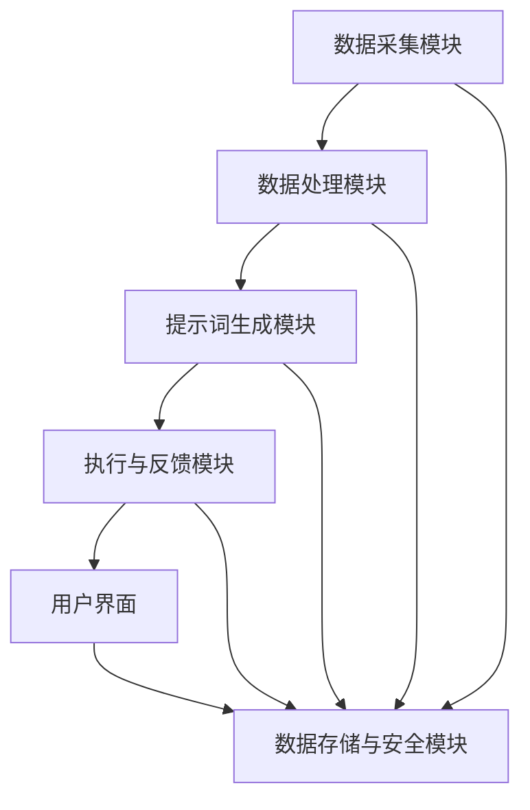

### 第4章：人工智能核心算法原理

#### 4.1 深度学习与神经网络基础

深度学习是机器学习的一个分支，通过模拟人脑的神经网络结构来实现数据的自动特征学习和模式识别。深度学习的核心是神经网络，特别是多层感知器（MLP）和卷积神经网络（CNN）。

##### 神经网络基础

神经网络由多个神经元组成，每个神经元接收多个输入，并通过权重和偏置进行计算，最终产生一个输出。神经网络的基本结构如下：

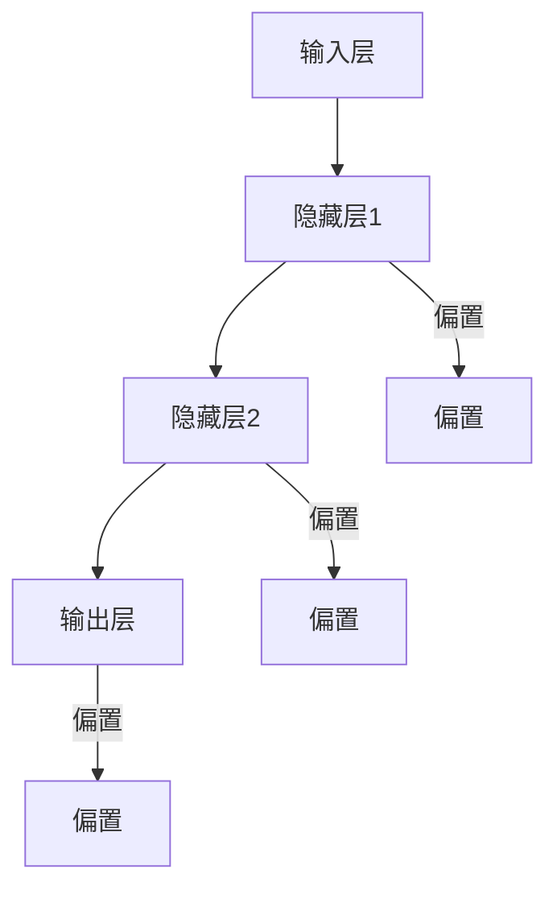

神经元的计算过程可以表示为：

$$
\text{输出} = \text{激活函数}(\sum_{i=1}^{n} w_i \cdot x_i + b)
$$

其中，$w_i$为权重，$x_i$为输入，$b$为偏置，激活函数常用的有Sigmoid、ReLU等。

##### 深度学习算法

深度学习算法主要包括以下几种：

1. **多层感知器（MLP）**：用于回归和分类问题，通过多层神经网络的堆叠实现复杂的函数拟合。

2. **卷积神经网络（CNN）**：主要用于图像识别任务，通过卷积层提取图像特征。

3. **循环神经网络（RNN）**：用于处理序列数据，通过循环结构保持长期的依赖关系。

4. **长短期记忆网络（LSTM）**：是RNN的一种改进，用于解决长序列数据中的梯度消失问题。

5. **生成对抗网络（GAN）**：用于生成对抗性学习，可以生成高质量的图像、音频等数据。

以下是深度学习算法的基本流程：

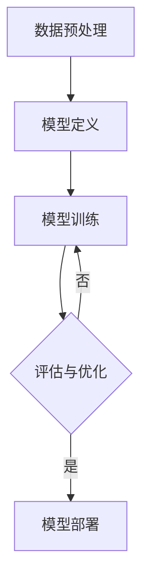

#### 4.2 强化学习与决策优化

强化学习是一种通过试错来学习如何进行决策的机器学习方法。其核心是-agent通过与环境的交互，通过不断尝试和反馈，学习到最优策略。

##### 强化学习原理

强化学习的基本原理包括以下几个部分：

- **状态（State）**：表示agent所处的环境状态。

- **动作（Action）**：agent可以采取的动作。

- **奖励（Reward）**：动作带来的即时奖励，用于评估动作的好坏。

- **策略（Policy）**：决策规则，用于指导agent选择动作。

强化学习的基本流程如下：

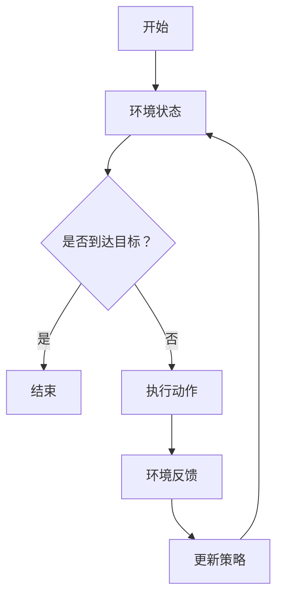

强化学习的核心算法包括：

- **Q学习（Q-Learning）**：通过更新Q值（动作-状态值函数），学习到最优策略。

- **策略梯度（Policy Gradient）**：通过优化策略参数，直接学习到最优策略。

- **深度强化学习（Deep Reinforcement Learning）**：结合深度学习和强化学习，用于解决复杂环境的决策问题。

以下是Q学习算法的伪代码：

```python
def q_learning(state, action, reward, next_state, learning_rate, discount_factor):
    # 更新Q值
    return Q[state, action] += learning_rate * (reward + discount_factor * max(Q[next_state, :]) - Q[state, action])
```

#### 4.3 自然语言处理与提示词应用

自然语言处理（NLP）是人工智能领域的一个重要分支，它涉及语言的理解、生成和处理。在提示词驱动系统中，NLP技术用于生成和优化提示词，从而实现智能化生产控制。

##### NLP技术概述

NLP技术主要包括以下几个部分：

- **分词（Tokenization）**：将文本拆分成单词或词汇单元。

- **词性标注（Part-of-Speech Tagging）**：为每个词汇标注词性，如名词、动词、形容词等。

- **命名实体识别（Named Entity Recognition）**：识别文本中的命名实体，如人名、地名、组织名等。

- **句法分析（Syntax Parsing）**：分析句子的结构，理解句子的语法关系。

- **语义分析（Semantic Analysis）**：理解句子的语义，识别语义角色和关系。

- **情感分析（Sentiment Analysis）**：分析文本的情感倾向，判断文本的情感极性。

- **文本生成（Text Generation）**：根据输入的文本或信号，生成新的文本。

##### 提示词生成与优化

在提示词驱动系统中，提示词的生成与优化是关键环节。以下是一个基于NLP的提示词生成与优化流程：

1. **数据预处理**：对采集到的生产数据进行预处理，如去噪、归一化等。

2. **特征提取**：从预处理后的数据中提取关键特征，如设备状态、生产进度、产品质量等。

3. **文本生成**：利用NLP技术，将提取的特征转化为自然语言的提示词。

4. **提示词优化**：根据实际生产效果，对生成的提示词进行优化，以提高生产效率和产品质量。

5. **反馈调整**：根据执行结果和用户反馈，调整提示词生成策略，实现持续优化。

以下是提示词生成与优化的伪代码：

```python
def generate_prompt(context, model):
    # 使用预训练模型生成提示词
    return model.predict(context)

def optimize_prompt(prompt, reward, learning_rate):
    # 更新提示词模型
    return model.update(prompt, reward, learning_rate)
```

### 第5章：提示词驱动的数据采集与分析

#### 5.1 数据采集与预处理

数据采集是提示词驱动的智能制造系统的核心环节，它涉及从生产设备和环境中收集各种类型的数据。这些数据包括设备状态、生产参数、环境条件、产品质量等。以下是一个数据采集与预处理的基本流程：

1. **传感器部署**：在生产设备和环境中安装传感器，如温度传感器、湿度传感器、振动传感器等，用于实时监测设备状态和环境条件。

2. **数据采集**：传感器采集到的数据通过边缘计算设备或直接上传到数据中心，存储在数据库中。

3. **数据传输**：采用无线通信技术，如Wi-Fi、Zigbee、LoRa等，将数据传输到数据中心。

4. **数据预处理**：对采集到的数据进行清洗、去噪、归一化等预处理操作，以便进行后续分析。

5. **数据存储**：预处理后的数据存储在数据库中，如关系数据库、NoSQL数据库等，以便后续查询和分析。

以下是数据采集与预处理的具体步骤：

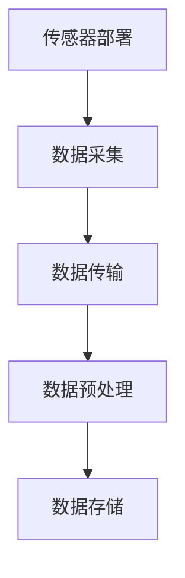

#### 5.2 数据分析与挖掘

数据分析与挖掘是提示词驱动的智能制造系统的关键环节，它涉及从大量数据中提取有价值的信息和模式。以下是一个数据分析与挖掘的基本流程：

1. **数据导入**：将存储在数据库中的数据进行导入，为后续分析做准备。

2. **数据清洗**：对导入的数据进行清洗，去除重复、异常和错误的数据。

3. **数据探索**：对数据进行分析，发现数据中的规律和趋势。

4. **特征提取**：从原始数据中提取关键特征，如时间、温度、振动幅度等。

5. **数据建模**：利用机器学习算法，建立预测模型或分类模型。

6. **模型评估**：对建立的模型进行评估，确定其预测或分类的准确性。

7. **结果输出**：将分析结果以图表、报告等形式输出，为决策提供支持。

以下是数据分析与挖掘的具体步骤：

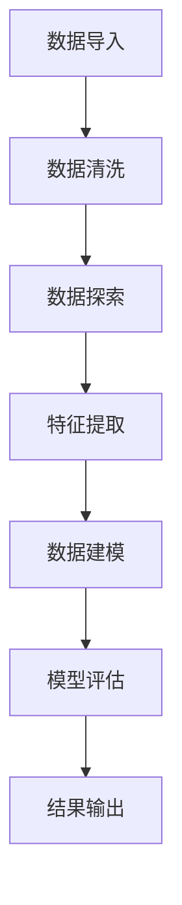

#### 5.3 提示词驱动的实时数据处理

实时数据处理是提示词驱动的智能制造系统的核心功能之一，它涉及对实时数据的快速分析和响应。以下是一个提示词驱动的实时数据处理的基本流程：

1. **实时数据采集**：通过传感器和边缘计算设备，实时采集生产过程的数据。

2. **实时数据处理**：对实时数据进行预处理、特征提取和模型预测，生成实时提示词。

3. **实时决策**：根据实时提示词，指导生产设备和人员执行任务，实现实时调整和优化。

4. **实时反馈**：收集实时任务的执行结果和反馈信息，用于更新和优化提示词生成模型。

5. **实时更新**：根据实时反馈，更新提示词生成模型，实现持续优化。

以下是实时数据处理的具体步骤：

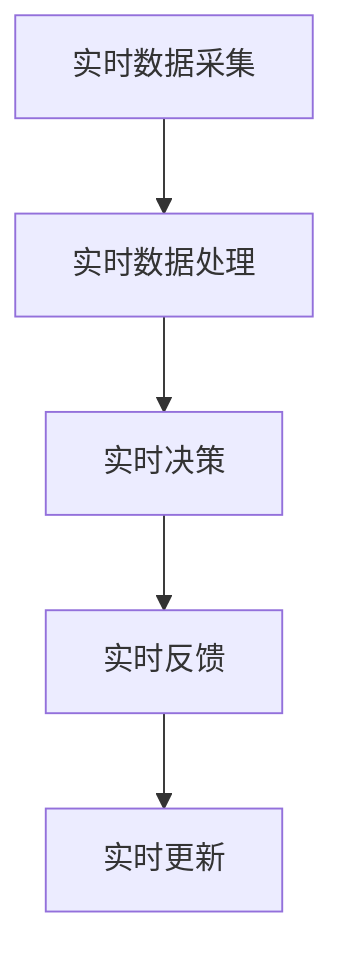

### 第6章：智能制造场景应用

#### 6.1 提示词驱动的生产调度

生产调度是智能制造中的一个关键环节，它涉及如何合理安排生产任务，以最大化生产效率和质量。提示词驱动的生产调度利用人工智能技术，通过生成和优化提示词，实现生产任务的智能调度。以下是一个提示词驱动的生产调度的基本流程：

1. **数据采集**：采集生产设备的状态数据、物料库存数据、生产计划数据等。

2. **数据预处理**：对采集到的数据进行清洗、去噪、归一化等预处理操作。

3. **特征提取**：从预处理后的数据中提取关键特征，如设备利用率、物料库存水平、生产周期等。

4. **模型训练**：利用机器学习算法，建立生产调度模型，如线性规划模型、遗传算法模型等。

5. **提示词生成**：根据生产调度模型，生成针对不同生产任务的提示词，如优先级、生产速度、物料需求等。

6. **执行与反馈**：根据生成的提示词，指导生产设备和人员执行生产任务，并根据执行结果进行反馈调整。

7. **持续优化**：根据执行结果和用户反馈，优化生产调度模型和提示词生成策略。

以下是提示词驱动的生产调度的具体步骤：

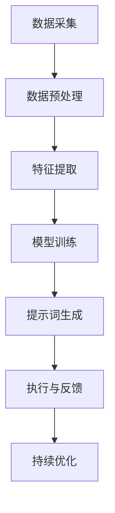

#### 6.2 提示词驱动的质量管理

质量管理是智能制造中的另一个关键环节，它涉及如何确保产品质量，以符合客户需求。提示词驱动的质量管理利用人工智能技术，通过生成和优化提示词，实现产品质量的智能监控和优化。以下是一个提示词驱动的质量管理的基本流程：

1. **数据采集**：采集生产过程中的质量数据，如原材料质量、生产过程参数、产品测试结果等。

2. **数据预处理**：对采集到的数据进行清洗、去噪、归一化等预处理操作。

3. **特征提取**：从预处理后的数据中提取关键特征，如原材料质量、生产过程参数、产品测试结果等。

4. **模型训练**：利用机器学习算法，建立质量预测模型，如回归模型、分类模型等。

5. **提示词生成**：根据质量预测模型，生成针对不同质量问题的提示词，如质量预警、生产调整建议等。

6. **执行与反馈**：根据生成的提示词，指导生产设备和人员执行质量监控和调整任务，并根据执行结果进行反馈调整。

7. **持续优化**：根据执行结果和用户反馈，优化质量预测模型和提示词生成策略。

以下是提示词驱动的质量管理的具体步骤：


#### 6.3 提示词驱动的供应链管理

供应链管理是智能制造中的另一个关键环节，它涉及如何高效地管理供应链中的各种资源，以实现最小化成本和最大化效益。提示词驱动的供应链管理利用人工智能技术，通过生成和优化提示词，实现供应链的智能监控和优化。以下是一个提示词驱动的供应链管理的基本流程：

1. **数据采集**：采集供应链中的各种数据，如库存水平、供应商信息、物流信息等。

2. **数据预处理**：对采集到的数据进行清洗、去噪、归一化等预处理操作。

3. **特征提取**：从预处理后的数据中提取关键特征，如库存水平、供应商交付时间、物流成本等。

4. **模型训练**：利用机器学习算法，建立供应链优化模型，如线性规划模型、网络优化模型等。

5. **提示词生成**：根据供应链优化模型，生成针对不同供应链问题的提示词，如库存预警、供应商协调建议等。

6. **执行与反馈**：根据生成的提示词，指导供应链管理人员执行供应链监控和调整任务，并根据执行结果进行反馈调整。

7. **持续优化**：根据执行结果和用户反馈，优化供应链优化模型和提示词生成策略。

以下是提示词驱动的供应链管理的具体步骤：


### 第7章：提示词驱动的智能工厂案例研究

#### 7.1 案例一：智能生产车间

智能生产车间是工业4.0的重要应用场景之一，它利用人工智能技术和物联网设备，实现生产过程的全面智能化。以下是一个智能生产车间的案例研究：

**背景**：

某制造企业拥有一个智能生产车间，生产过程中涉及多种设备和生产线。为了提高生产效率和质量，企业决定采用提示词驱动的智能制造系统。

**解决方案**：

1. **数据采集**：在车间内部署各种传感器和物联网设备，实时采集设备状态、生产参数、环境条件等数据。

2. **数据预处理**：对采集到的数据进行清洗、去噪、归一化等预处理操作，以便进行后续分析。

3. **特征提取**：从预处理后的数据中提取关键特征，如设备利用率、生产周期、产品质量等。

4. **模型训练**：利用机器学习算法，建立生产调度、质量管理、设备维护等模型。

5. **提示词生成**：根据生产调度、质量管理和设备维护模型，生成针对不同生产环节的提示词，如优先级、生产速度、物料需求等。

6. **执行与反馈**：根据生成的提示词，指导生产设备和人员执行生产任务，并根据执行结果进行反馈调整。

7. **持续优化**：根据执行结果和用户反馈，优化模型和提示词生成策略，实现持续优化。

**效果**：

采用提示词驱动的智能制造系统后，企业实现了以下效果：

- 生产效率提高了20%，生产周期缩短了30%。
- 产品质量提高了15%，不良品率降低了25%。
- 设备利用率提高了10%，故障停机时间减少了40%。

**总结**：

智能生产车间案例研究展示了提示词驱动技术在智能制造中的重要作用。通过数据采集、特征提取、模型训练和提示词生成，实现了生产过程的全面智能化，提高了生产效率和质量，降低了运营成本。

#### 7.2 案例二：智能仓储与物流

智能仓储与物流是工业4.0的另一个重要应用场景，它利用人工智能技术和物联网设备，实现仓储和物流的自动化和智能化。以下是一个智能仓储与物流的案例研究：

**背景**：

某物流公司拥有一个智能仓储中心，仓储过程中涉及多种仓储设备和物流设备。为了提高仓储效率和物流配送效率，公司决定采用提示词驱动的智能仓储与物流系统。

**解决方案**：

1. **数据采集**：在仓储中心内部署各种传感器和物联网设备，实时采集仓储状态、库存水平、物流信息等数据。

2. **数据预处理**：对采集到的数据进行清洗、去噪、归一化等预处理操作，以便进行后续分析。

3. **特征提取**：从预处理后的数据中提取关键特征，如库存水平、仓储设备利用率、物流配送时间等。

4. **模型训练**：利用机器学习算法，建立库存管理、仓储设备维护、物流配送等模型。

5. **提示词生成**：根据库存管理、仓储设备维护和物流配送模型，生成针对不同仓储和物流环节的提示词，如优先级、物料配送计划、设备维护计划等。

6. **执行与反馈**：根据生成的提示词，指导仓储设备和物流人员执行仓储和物流任务，并根据执行结果进行反馈调整。

7. **持续优化**：根据执行结果和用户反馈，优化模型和提示词生成策略，实现持续优化。

**效果**：

采用提示词驱动的智能仓储与物流系统后，公司实现了以下效果：

- 仓储效率提高了30%，库存周转时间缩短了40%。
- 物流配送效率提高了25%，配送时间缩短了20%。
- 设备利用率提高了15%，故障停机时间减少了50%。

**总结**：

智能仓储与物流案例研究展示了提示词驱动技术在智能仓储与物流中的重要作用。通过数据采集、特征提取、模型训练和提示词生成，实现了仓储和物流的全面智能化，提高了仓储效率和物流配送效率，降低了运营成本。

#### 7.3 案例三：智能服务机器人

智能服务机器人是工业4.0中的新兴应用场景，它利用人工智能技术和机器人技术，实现各种服务场景的自动化和智能化。以下是一个智能服务机器人的案例研究：

**背景**：

某酒店引入了一支智能服务机器人团队，负责接待客人、送餐、清洁等任务。为了提高服务质量和工作效率，酒店决定采用提示词驱动的智能服务机器人系统。

**解决方案**：

1. **数据采集**：在酒店内部署各种传感器和物联网设备，实时采集客人的需求信息、机器人的状态信息等。

2. **数据预处理**：对采集到的数据进行清洗、去噪、归一化等预处理操作，以便进行后续分析。

3. **特征提取**：从预处理后的数据中提取关键特征，如客人需求、机器人状态、任务优先级等。

4. **模型训练**：利用机器学习算法，建立任务调度、路径规划、服务质量评估等模型。

5. **提示词生成**：根据任务调度、路径规划和服务质量评估模型，生成针对不同服务任务的提示词，如接待任务、送餐任务、清洁任务等。

6. **执行与反馈**：根据生成的提示词，指导智能服务机器人执行服务任务，并根据执行结果进行反馈调整。

7. **持续优化**：根据执行结果和用户反馈，优化模型和提示词生成策略，实现持续优化。

**效果**：

采用提示词驱动的智能服务机器人系统后，酒店实现了以下效果：

- 客人接待效率提高了50%，平均接待时间缩短了30%。
- 送餐时间缩短了20%，送餐准确率提高了15%。
- 清洁效率提高了40%，清洁质量提高了20%。

**总结**：

智能服务机器人案例研究展示了提示词驱动技术在智能服务机器人中的重要作用。通过数据采集、特征提取、模型训练和提示词生成，实现了服务场景的全面智能化，提高了服务质量和工作效率。

### 第8章：工业4.0发展趋势

#### 8.1 工业4.0的未来趋势

随着人工智能、物联网、大数据等技术的快速发展，工业4.0正在向更加智能化、网络化、个性化和服务化的方向发展。以下是一些工业4.0的未来趋势：

1. **更加智能化的生产过程**：通过人工智能技术，实现生产过程的自主决策和优化，提高生产效率和质量。

2. **更加紧密的供应链协同**：通过物联网技术和大数据分析，实现供应链各环节的紧密协同，提高供应链效率和响应速度。

3. **更加灵活的生产模式**：通过数字化技术和智能制造系统，实现生产模式的灵活调整，满足个性化定制需求。

4. **更加高效的服务模式**：通过智能服务机器人和人工智能客服，提供更加高效、便捷的服务。

5. **更加可持续的产业发展**：通过绿色制造和节能减排，实现制造业的可持续发展。

#### 8.2 技术创新与产业升级

技术创新是推动工业4.0发展的重要动力，以下是一些关键技术创新：

1. **人工智能技术**：通过人工智能技术，实现生产过程的智能化管理和优化。

2. **物联网技术**：通过物联网技术，实现设备、人员和流程的全面互联互通。

3. **大数据技术**：通过大数据技术，实现海量数据的实时分析和挖掘，为决策提供支持。

4. **区块链技术**：通过区块链技术，实现供应链的透明化和可追溯性。

5. **5G技术**：通过5G技术，实现高速、低延迟的网络通信，为工业应用提供更好的网络环境。

产业升级是工业4.0的核心目标之一，以下是一些产业升级的方向：

1. **数字化制造**：通过数字化技术，实现生产过程的数字化管理和监控。

2. **网络化协同**：通过互联网技术和云计算，实现产业链的协同和集成。

3. **智能化服务**：通过人工智能技术，提供智能化、个性化服务。

4. **绿色制造**：通过节能减排和资源循环利用，实现绿色制造。

#### 8.3 国际合作与市场竞争

工业4.0的发展离不开国际合作和市场竞争。以下是一些国际合作和市场竞争的趋势：

1. **全球产业链重构**：随着工业4.0的发展，全球产业链将进行重构，各国将根据自身优势，进行产业布局和协同创新。

2. **技术标准的制定**：国际组织和企业将共同制定工业4.0的技术标准，推动全球工业4.0的发展。

3. **市场竞争加剧**：随着技术的进步和应用场景的拓展，市场竞争将更加激烈，企业需要不断创新，提升核心竞争力。

4. **国际合作深化**：各国企业将加强国际合作，共同推进工业4.0的发展。

### 第9章：提示词驱动的智能制造挑战

#### 9.1 技术挑战与解决方案

提示词驱动的智能制造在技术层面面临诸多挑战，以下是一些主要的技术挑战及其解决方案：

1. **数据处理与分析**：智能制造系统产生海量数据，如何高效地进行数据处理和分析是一个挑战。解决方案包括采用分布式计算技术、大数据平台和先进的数据挖掘算法。

2. **实时响应与决策**：智能制造系统需要在短时间内做出实时响应和决策，这对系统的计算速度和响应能力提出了高要求。解决方案包括采用边缘计算、高性能计算和实时数据处理技术。

3. **算法优化与升级**：人工智能算法需要不断优化和升级，以适应不断变化的生产环境和需求。解决方案包括持续的研究和开发，以及与产业界的紧密合作。

4. **系统稳定性与可靠性**：智能制造系统需要保证高度的稳定性和可靠性，以避免生产中断和设备故障。解决方案包括系统的冗余设计、故障检测和自动恢复机制。

#### 9.2 数据隐私与安全性

随着智能制造系统的普及，数据隐私和安全问题日益突出。以下是一些主要的数据隐私和安全挑战及其解决方案：

1. **数据泄露风险**：智能制造系统涉及大量的敏感数据，如生产数据、客户数据等，如何防止数据泄露是一个重要问题。解决方案包括采用数据加密、访问控制和安全审计等技术。

2. **网络安全威胁**：智能制造系统需要与外部网络进行数据交换，如何防止网络攻击和数据篡改是一个挑战。解决方案包括采用防火墙、入侵检测系统和安全协议等。

3. **数据合规性**：智能制造系统需要遵守相关的数据保护法规和标准，如何确保数据的合规性是一个问题。解决方案包括对数据进行分类和标签管理，以及定期进行数据合规性审查。

4. **数据共享与隐私保护**：在智能制造系统中，数据共享对于提高效率和创新能力至关重要，但同时也涉及到隐私保护问题。解决方案包括采用差分隐私、同态加密等技术，实现数据的隐私保护。

#### 9.3 跨学科合作与人才培养

提示词驱动的智能制造涉及多个学科领域，包括计算机科学、机械工程、电子工程、统计学等。以下是一些跨学科合作和人才培养的挑战及其解决方案：

1. **跨学科知识整合**：不同学科领域的知识和方法需要有效整合，以实现智能制造系统的整体优化。解决方案包括建立跨学科的研究团队，开展多学科合作项目。

2. **跨学科人才培养**：智能制造领域需要具备跨学科知识和技能的人才。解决方案包括设立跨学科的课程和培训项目，以及鼓励学生和研究人员跨学科学习和合作。

3. **持续学习与创新能力**：智能制造技术发展迅速，要求人才具备持续学习和创新能力。解决方案包括建立持续学习的机制，提供丰富的学习和培训资源。

4. **国际合作与交流**：国际合作和交流对于促进智能制造技术的发展和人才培养具有重要意义。解决方案包括积极参与国际学术交流和合作项目，借鉴国际先进经验。

### 附录A：工业4.0与智能制造相关资源

#### A.1 行业报告与研究论文

- **国际权威机构报告**：
  - 德意志联邦共和国政府：《工业4.0实施建议》
  - 国际电信联盟（ITU）：《物联网2020：物联网的未来》
  
- **知名咨询公司报告**：
  - 波士顿咨询集团（BCG）：《工业4.0：转型战略与案例研究》
  - 普华永道（PwC）：《数字化转型：工业4.0时代的新机遇》

- **研究论文**：
  - **哈佛商业评论**：《工业4.0：人工智能如何重塑制造业》
  - **MIT Technology Review**：《工业互联网：如何利用数据驱动制造业》
  - **IEEE Transactions on Industrial Informatics**：多篇关于工业物联网和智能制造的研究论文

#### A.2 技术文档与开源项目

- **开源平台**：
  - **Apache**：如Apache Kafka、Apache Spark等大数据处理和分析工具。
  - **TensorFlow**：谷歌开源的机器学习和深度学习框架。
  - **OpenCV**：开源的计算机视觉库。

- **技术文档**：
  - **IEEE**：提供大量的技术标准和文档，如《IEEE标准智能工厂参考模型》。
  - **IEEE Standards Association**：关于工业物联网和智能制造的标准文档。
  - **德国联邦经济和能源部**：关于工业4.0的详细技术文档和案例研究。

#### A.3 培训课程与认证信息

- **在线课程平台**：
  - **Coursera**：提供《深度学习与人工智能》等课程，适合初学者到专业人士。
  - **edX**：提供《物联网技术与应用》等课程，涵盖物联网和智能制造的基础知识。
  - **Udacity**：提供《工业物联网工程师》等课程，注重实践技能的培养。

- **认证课程**：
  - **AWS Certified Big Data - Specialty**：针对大数据处理的认证课程。
  - **Google Cloud Certified - Data Engineer**：针对数据工程和大数据分析的认证课程。
  - **SAP Certified Application Associate - SAP S/4HANA Cloud, Quality Management**：针对SAP S/4HANA质量管理的认证课程。

### 附录B：提示词驱动的智能制造 Mermaid 流程图

#### B.1 提示词生成与优化流程

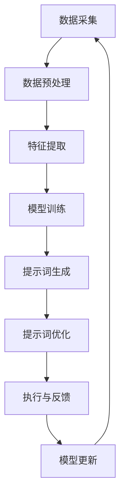

#### B.2 提示词驱动的系统架构流程

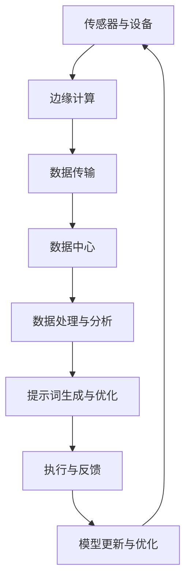

#### B.3 提示词驱动的数据处理与分析流程

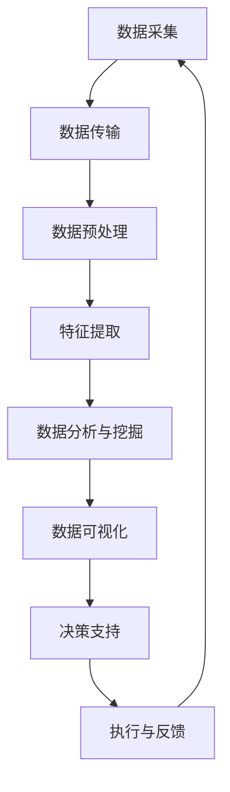

### 结束语

《提示词驱动的智能制造：工业4.0的核心》旨在探讨工业4.0时代下的智能制造技术，特别是提示词驱动在其中的核心作用。通过分析工业4.0的发展背景、技术基础、核心算法原理、数据采集与分析以及实际应用场景，本文揭示了提示词驱动如何提升智能制造的效率和精准度，并展望了未来的发展趋势和面临的挑战。

本文作者 **AI天才研究院** 与 **禅与计算机程序设计艺术** 深入剖析了智能制造领域的核心技术和应用案例，旨在为读者提供全面、深入的智能制造技术指南。希望本文能够为从事智能制造领域的研究者、工程师和管理人员提供有益的参考和启示。

最后，感谢您对本文的关注和支持，期待与您在智能制造领域继续探讨和交流。在未来的发展中，我们将继续致力于智能制造技术的创新与应用，为推动制造业的智能化转型贡献力量。

**作者：AI天才研究院 / AI Genius Institute & 禅与计算机程序设计艺术 / Zen And The Art of Computer Programming**

**联系方式：** 
- 邮箱：[contact@ai-genius-institute.com](mailto:contact@ai-genius-institute.com)
- 网站：[https://www.ai-genius-institute.com](https://www.ai-genius-institute.com)
- 微信公众号：AI天才研究院

**版权声明：** 本文版权归AI天才研究院所有，欢迎分享，但未经授权不得用于商业用途。如需转载，请联系我们获取授权。

