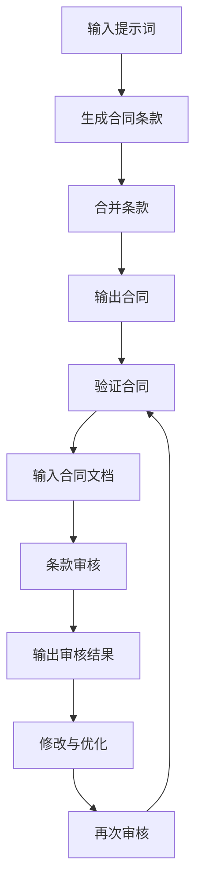

                 

### 文章标题

# 提示词驱动的智能合同生成与审核

### 关键词

- 智能合同
- 提示词驱动
- 自然语言处理
- 合同审核
- 算法原理
- 数学模型

### 摘要

本文探讨了提示词驱动的智能合同生成与审核技术，分析了其基本概念、原理和实现方法。首先，介绍了智能合同和提示词驱动的概念，并阐述了智能合同的应用前景和挑战。接着，详细讨论了提示词驱动的智能合同生成和审核的原理，包括自然语言处理基础、文本生成和审核流程、系统架构以及核心算法和数学模型。最后，通过实际案例研究和项目实战，展示了提示词驱动的智能合同生成与审核的实际应用效果，并提出了未来研究方向。

## 《提示词驱动的智能合同生成与审核》目录大纲

### 第一部分: 核心概念与联系

## 第1章: 智能合同与提示词驱动技术概述

### 1.1 智能合同的基本概念

- 智能合同的定义和特点
- 智能合同与传统合同的对比
- 智能合同的应用场景

### 1.2 提示词驱动的智能合同生成

- 提示词驱动的概念
- 提示词驱动的智能合同生成原理
- 提示词驱动的文本生成技术

### 1.3 提示词驱动的智能合同审核

- 提示词驱动的智能合同审核原理
- 提示词驱动的合同审核流程
- 合同审核中的挑战与解决方案

### 1.4 智能合同的应用前景与挑战

- 智能合同的发展趋势
- 提示词驱动技术在智能合同中的应用
- 智能合同面临的挑战

## 第2章: 提示词驱动的智能合同生成原理

### 2.1 自然语言处理基础

- 自然语言处理的基本概念
- 词向量表示和语言模型

### 2.2 提示词驱动的文本生成技术

- 提示词驱动的文本生成原理
- 常见的文本生成模型

### 2.3 提示词驱动的文本生成流程

- 提示词驱动的文本生成步骤
- 提示词驱动的文本生成算法

## 第3章: 提示词驱动的智能合同审核原理

### 3.1 智能审核的基础技术

- 智能审核的定义和特点
- 常见智能审核技术

### 3.2 提示词驱动的合同审核流程

- 提示词驱动的合同审核原理
- 提示词驱动的合同审核步骤

### 3.3 合同审核中的挑战与解决方案

- 合同审核中的常见问题
- 提示词驱动的合同审核解决方案

## 第4章: 提示词驱动的智能合同生成与审核系统架构

### 4.1 系统架构设计

- 提示词驱动的智能合同系统架构
- 系统架构的主要组成部分

### 4.2 数据流程

- 数据的采集和处理
- 数据的存储和管理

### 4.3 功能模块介绍

- 智能合同生成模块
- 智能合同审核模块
- 系统功能与流程

## 第5章: 核心算法原理讲解

### 5.1 文本生成算法原理讲解

- 文本生成算法的基本原理
- 文本生成算法的伪代码

### 5.2 文本审核算法原理讲解

- 文本审核算法的基本原理
- 文本审核算法的伪代码

### 5.3 算法优化的方法与技巧

- 算法优化的目标和方法
- 算法优化的实际案例

## 第6章: 数学模型和数学公式

### 6.1 文本生成中的数学模型

- 数学模型的基本概念
- 文本生成中的数学模型

### 6.2 合同审核中的数学模型

- 数学模型的基本概念
- 合同审核中的数学模型

### 6.3 数学公式详细讲解与示例

- 数学公式的表示方法
- 数学公式的应用示例

## 第7章: 智能合同生成与审核案例研究

### 7.1 案例背景

- 案例背景介绍
- 案例目标

### 7.2 案例分析

- 案例需求分析
- 案例实现方案

### 7.3 案例实施与效果评估

- 案例实施过程
- 案例效果评估

### 第二部分: 项目实战

## 第8章: 提示词驱动的智能合同生成项目实战

### 8.1 项目背景

- 项目背景介绍
- 项目目标

### 8.2 开发环境搭建

- 开发环境搭建过程
- 环境配置说明

### 8.3 源代码实现与解读

- 源代码实现
- 代码解读与分析

### 8.4 代码解读与分析

- 代码解读
- 代码分析

## 第9章: 提示词驱动的智能合同审核项目实战

### 9.1 项目背景

- 项目背景介绍
- 项目目标

### 9.2 开发环境搭建

- 开发环境搭建过程
- 环境配置说明

### 9.3 源代码实现与解读

- 源代码实现
- 代码解读与分析

### 9.4 代码解读与分析

- 代码解读
- 代码分析

## 第10章: 全书总结与展望

### 10.1 主要内容回顾

- 对全书内容的回顾和总结

### 10.2 未来发展趋势

- 提示词驱动的智能合同生成与审核技术的发展趋势

### 10.3 进一步研究方向

- 进一步研究的方向和领域

## 附录

### 附录A: 提示词驱动智能合同生成与审核相关工具与资源

- 提示词驱动智能合同生成与审核相关的工具和资源
- 学习资源推荐

# 第1章 智能合同与提示词驱动技术概述

### 1.1 智能合同的基本概念

智能合同，也称为区块链合同或智能合约，是一种利用区块链技术实现自动执行和验证的合同。它通过将合同条款编码为计算机程序，使得合同条款在满足特定条件时能够自动执行，无需人工干预。智能合同的核心优势在于其去中心化、不可篡改和自动化执行的特性，使得交易过程更加高效、安全和可信。

传统合同通常依赖于纸质文档、电子文档或者第三方机构进行管理和执行。而智能合同则利用区块链技术，将合同条款和条件记录在区块链上，形成一个分布式账本。这使得智能合同在执行过程中具有更高的透明度和可追溯性，同时也降低了合同纠纷的风险。

智能合同的基本特点包括：

1. **自动化执行**：智能合同在满足特定条件时可以自动执行，无需人工干预。这大大提高了合同执行的效率。
   
2. **去中心化**：智能合同不依赖于任何中心化的机构或第三方，而是通过分布式账本进行管理和执行，确保了系统的透明度和安全性。

3. **不可篡改**：区块链技术具有不可篡改的特性，智能合同的条款和条件一旦上链，便无法被篡改，确保了合同内容的真实性和可信性。

4. **透明度高**：智能合同的执行过程和条款内容都记录在区块链上，任何参与者都可以随时查询和验证，提高了合同管理的透明度。

### 1.2 提示词驱动的智能合同生成

提示词驱动技术是一种基于自然语言处理（NLP）的方法，通过输入一些关键词或提示词，自动生成相关的文本内容。在智能合同生成领域，提示词驱动技术可以用于生成智能合同的条款、条款内容、合同摘要等。

提示词驱动的智能合同生成过程主要包括以下几个步骤：

1. **输入提示词**：用户输入一些关键词或提示词，例如“租赁合同”、“购买合同”等。

2. **文本生成**：基于输入的提示词，利用自然语言处理技术生成相关的合同条款和内容。

3. **审核与优化**：生成的合同条款和内容需要经过审核和优化，确保其合法性和合理性。

4. **输出结果**：将生成的合同条款和内容输出，用户可以根据需要进行修改和调整。

### 1.3 提示词驱动的智能合同审核

提示词驱动的智能合同审核是指利用自然语言处理技术，对智能合同的条款和内容进行自动化审核，以确保合同的法律效力和合规性。提示词驱动的智能合同审核过程主要包括以下几个步骤：

1. **输入智能合同**：将智能合同的条款和内容输入到系统。

2. **文本审核**：利用自然语言处理技术，对智能合同的条款和内容进行自动化审核，检查是否存在法律风险、语法错误等。

3. **输出审核结果**：将审核结果输出，包括审核通过的条款和需要修改的条款。

4. **修改与优化**：用户根据审核结果对智能合同的条款和内容进行修改和优化。

### 1.4 智能合同的应用前景与挑战

智能合同作为区块链技术的一个重要应用，具有广泛的应用前景。以下是智能合同的一些潜在应用场景：

1. **金融服务**：智能合同可以应用于金融交易，例如贷款、保险、债券发行等，实现自动化审批和执行。

2. **供应链管理**：智能合同可以用于供应链管理，实现自动化的采购、物流和支付过程。

3. **版权保护**：智能合同可以用于版权保护，确保作品的合法授权和版权归属。

4. **房地产交易**：智能合同可以用于房地产交易，实现自动化购房合同签订和执行。

然而，智能合同在应用过程中也面临着一些挑战：

1. **法律和监管问题**：智能合同的法律效力、监管问题需要进一步明确和规范。

2. **技术实现问题**：智能合同的技术实现需要考虑安全性、隐私保护等方面的问题。

3. **用户接受度**：智能合同需要克服用户接受度的问题，提高用户对智能合同的认知和信任。

4. **跨链兼容性问题**：智能合同需要实现跨链兼容性，以支持不同区块链网络之间的互操作。

总之，智能合同作为一种新兴技术，具有巨大的发展潜力。通过不断的研究和实践，相信智能合同将能够在更多领域得到广泛应用，为企业和个人带来更多便利。

### 1.5 提示词驱动技术的基本概念

提示词驱动技术是一种基于自然语言处理（NLP）的方法，通过输入一些关键词或提示词，自动生成相关的文本内容。这种技术的主要目的是减少人工输入和编写文本的工作量，提高文本生成的效率和准确性。

#### 1.5.1 提示词驱动的概念

提示词驱动技术的工作原理可以简单概括为以下几步：

1. **输入提示词**：用户输入一些关键词或提示词，这些词语可以是对所需文本内容的简短描述。

2. **文本生成**：系统根据输入的提示词，利用自然语言处理技术和预训练的模型，自动生成相关的文本内容。

3. **输出结果**：系统将生成的文本内容输出给用户，用户可以根据需要进行修改和调整。

#### 1.5.2 提示词驱动的智能合同生成

在智能合同生成领域，提示词驱动技术可以用于以下方面：

1. **生成合同条款**：用户输入合同的相关关键词，系统自动生成合同的主要条款，例如租赁合同、雇佣合同等。

2. **生成合同摘要**：系统根据合同的主要内容，自动生成合同摘要，方便用户快速了解合同的核心内容。

3. **生成合同附件**：系统可以根据用户输入的提示词，自动生成合同所需的附件，例如发票、营业执照等。

#### 1.5.3 提示词驱动的智能合同审核

提示词驱动的智能合同审核技术主要用于以下方面：

1. **合法性审核**：系统根据输入的合同内容，利用自然语言处理技术，自动检查合同条款的合法性，例如是否符合法律规定、是否存在潜在的法律风险等。

2. **一致性审核**：系统可以自动检查合同条款之间的一致性，确保合同各部分内容相互协调。

3. **完整性审核**：系统可以自动检查合同是否包含所有必要的信息，例如合同主体信息、合同期限、违约条款等。

#### 1.5.4 提示词驱动的优势

提示词驱动技术在智能合同生成和审核中的应用具有以下优势：

1. **高效性**：通过自动化生成和审核合同，可以大幅提高工作效率，减少人工干预。

2. **准确性**：利用先进的自然语言处理技术，可以生成和审核高质量、准确的合同内容。

3. **一致性**：系统能够确保合同内容的一致性，减少因人为因素导致的错误。

4. **可扩展性**：提示词驱动技术可以根据用户需求进行扩展，生成和审核不同类型的合同。

总之，提示词驱动技术为智能合同的生成和审核提供了高效、准确、一致且可扩展的解决方案，有望在智能合同领域发挥重要作用。

### 1.6 智能合同生成与审核的关系

智能合同生成与审核是智能合同生命周期中不可或缺的两个环节。智能合同生成是将合同条款以计算机程序的形式自动化生成，而智能合同审核则是确保生成合同的合法性和有效性。两者之间有着密切的联系，共同构成了智能合同系统的核心功能。

#### 1.6.1 智能合同生成的流程

智能合同生成的流程主要包括以下几个步骤：

1. **输入提示词**：用户输入合同的相关关键词或提示词，例如“租赁合同”、“雇佣合同”等。

2. **生成合同条款**：系统根据输入的提示词，利用自然语言处理技术生成合同的主要条款。

3. **合并条款**：将生成的各个条款合并为一个完整的合同文档。

4. **输出合同**：将生成的合同文档输出，用户可以根据需要进行修改和调整。

5. **验证合同**：系统对生成的合同进行初步验证，确保其格式和内容的正确性。

#### 1.6.2 智能合同审核的流程

智能合同审核的流程主要包括以下几个步骤：

1. **输入合同文档**：将生成的智能合同文档输入到审核系统。

2. **条款审核**：系统对合同的各个条款进行自动化审核，检查其合法性、一致性、完整性等。

3. **输出审核结果**：系统将审核结果输出，包括审核通过的条款和需要修改的条款。

4. **修改与优化**：用户根据审核结果对合同条款进行修改和优化。

5. **再次审核**：将修改后的合同文档重新输入系统，进行再次审核。

#### 1.6.3 关系架构

智能合同生成与审核的关系可以用一个Mermaid流程图来表示：



通过这个流程，智能合同生成与审核形成了一个闭环，确保合同的合法性和有效性。智能合同生成的每个步骤都受到审核的监督，一旦发现问题，可以及时进行修改，确保最终输出的合同符合法律和业务要求。

### 1.7 提示词驱动的智能合同生成与审核的技术实现

提示词驱动的智能合同生成与审核技术涉及到多个关键技术和算法，包括自然语言处理（NLP）、文本生成、文本审核等。下面将详细介绍这些技术和算法的基本原理以及如何应用于智能合同生成与审核。

#### 1.7.1 自然语言处理（NLP）

自然语言处理是智能合同生成与审核的基础技术之一。NLP旨在使计算机能够理解和处理自然语言。在智能合同生成与审核中，NLP技术主要用于以下方面：

1. **文本解析**：将自然语言的文本解析为结构化的数据，例如词汇、句子和段落。

2. **语义理解**：理解文本中的含义和语境，例如识别合同条款中的关键词和关系。

3. **实体识别**：识别文本中的实体，如人名、地名、机构名等，对于合同审核尤为重要。

NLP技术通常包括以下步骤：

1. **分词**：将文本分割成单词或短语，例如将“我是AI研究员”分割成“我”、“是”、“AI”、“研究员”。
   
2. **词性标注**：为每个单词标注其词性，例如“我”（代词）、“是”（动词）等。

3. **命名实体识别**：识别文本中的命名实体，如人名、地名、机构名等。

4. **句法分析**：分析句子结构，确定句子中的词与词之间的关系。

#### 1.7.2 文本生成技术

文本生成技术是智能合同生成的重要组成部分。文本生成技术基于NLP，通过生成模型将提示词转换为完整的文本内容。常见的文本生成模型包括：

1. **生成对抗网络（GAN）**：GAN通过生成器和判别器的对抗训练，生成与真实数据相似的高质量文本。

2. **变分自编码器（VAE）**：VAE通过编码器和解码器生成文本，能够生成多样性的文本。

3. **转换器（Transformer）**：Transformer是一种基于自注意力机制的模型，被广泛应用于文本生成任务，具有强大的生成能力和灵活性。

文本生成技术的实现步骤如下：

1. **提示词编码**：将输入的提示词转换为编码表示，通常使用嵌入层。

2. **生成文本**：利用生成模型生成文本，根据提示词和编码表示，逐步生成文本内容。

3. **文本解码**：将生成的编码表示解码为自然语言文本。

#### 1.7.3 文本审核技术

文本审核技术在智能合同审核中起到关键作用，通过自动化手段检查合同的合法性、合规性和一致性。文本审核技术主要包括以下步骤：

1. **条款提取**：从合同文本中提取各个条款，为后续审核提供基础。

2. **规则匹配**：使用预定义的规则库对提取的条款进行匹配，检查其是否符合法律和业务要求。

3. **语义分析**：利用NLP技术分析条款内容，检查是否存在潜在的法律风险或逻辑错误。

4. **输出审核结果**：根据审核结果，输出审核通过的条款和需要修改的条款。

#### 1.7.4 技术实现示例

以下是一个简化的伪代码示例，展示了如何使用提示词驱动的智能合同生成与审核技术：

```python
# 提示词驱动的智能合同生成与审核伪代码

# 输入提示词
prompt = "租赁合同"

# 1. 提示词编码
encoded_prompt = encode_prompt(prompt)

# 2. 生成合同条款
contract条款 = generate条款(encoded_prompt)

# 3. 输出合同
print("生成的合同条款：")
print(contract条款)

# 4. 输入合同文档
contract_document = input_contract_document()

# 5. 提取条款
extracted条款 = extract条款(contract_document)

# 6. 规则匹配
matched_rules = match_rules(extracted条款)

# 7. 语义分析
analyzed条款 = semantic_analysis(extracted条款)

# 8. 输出审核结果
print("审核结果：")
print("通过的条款：", matched_rules)
print("需要修改的条款：", analyzed条款)
```

通过上述伪代码示例，我们可以看到提示词驱动的智能合同生成与审核技术是如何将输入的提示词转化为合同条款，并对合同进行自动化审核的。实际实现中，这些步骤会涉及到复杂的算法和数据处理，但总体思路是类似的。

### 1.8 数学模型和数学公式在智能合同生成与审核中的应用

在智能合同生成与审核过程中，数学模型和数学公式起着关键作用，特别是在文本生成和审核算法的优化方面。以下是数学模型和数学公式在智能合同生成与审核中的应用。

#### 1.8.1 文本生成中的数学模型

文本生成通常涉及以下几种数学模型：

1. **概率模型**：概率模型通过概率分布来生成文本，例如隐马尔可夫模型（HMM）和贝叶斯网络。HMM用于处理序列数据，而贝叶斯网络则用于表示变量之间的依赖关系。

2. **生成对抗网络（GAN）**：GAN由生成器和判别器组成，生成器通过生成与真实数据相似的文本，而判别器则用于判断文本的真实性。

3. **变分自编码器（VAE）**：VAE通过编码器和解码器生成文本，编码器将文本编码为潜在空间中的向量，解码器则从潜在空间中生成文本。

以下是一个简单的数学模型用于文本生成的示例：

$$
p(\text{word}_i|\text{context}) = \frac{e^{\text{logit}(f(\text{word}_i|\text{context}))}}{1 + e^{\text{logit}(f(\text{word}_i|\text{context}))}}
$$

其中，$p(\text{word}_i|\text{context})$表示在给定上下文$context$下生成单词$word_i$的概率，$\text{logit}(f(\text{word}_i|\text{context}))$是神经网络输出的对数几率。

#### 1.8.2 文本审核中的数学模型

文本审核中的数学模型通常用于检查合同条款的合法性和一致性。以下是一些常用的数学模型：

1. **规则匹配模型**：规则匹配模型使用预定义的规则库来检查合同条款是否符合特定标准。

2. **分类模型**：分类模型用于判断合同条款的合法性，例如使用逻辑回归、支持向量机（SVM）和神经网络。

3. **序列标注模型**：序列标注模型用于标注合同条款中的关键信息，例如人名、地名、日期等。

以下是一个简单的逻辑回归模型用于文本审核的示例：

$$
\text{label}_i = \sigma(\text{w}^T \text{x}_i + \text{b})
$$

其中，$\text{label}_i$是合同条款$i$的合法性标签（0或1），$\text{w}$是模型权重，$\text{x}_i$是合同条款$i$的特征向量，$\text{b}$是偏置项，$\sigma$是sigmoid函数。

#### 1.8.3 数学公式的应用示例

以下是一个数学公式的应用示例，用于计算文本生成的概率分布：

$$
p(\text{sequence}) = \prod_{i=1}^{n} p(\text{word}_i|\text{context}_i)
$$

其中，$p(\text{sequence})$是生成整个文本序列的概率，$p(\text{word}_i|\text{context}_i)$是生成单词$word_i$的条件概率，给定上下文$context_i$。

这个公式说明，整个文本序列的概率是每个单词条件概率的乘积。在实际应用中，可以使用神经网络模型来计算这个概率分布，例如使用变分自编码器（VAE）或生成对抗网络（GAN）。

通过数学模型和数学公式，智能合同生成与审核可以更加高效、准确地处理文本数据，提高合同的质量和可靠性。

### 1.9 智能合同生成与审核案例研究

为了更好地理解智能合同生成与审核的实际应用，下面我们将通过一个实际案例来分析智能合同生成与审核的过程。

#### 1.9.1 案例背景

假设一家初创公司需要与供应商签订一份采购合同，合同内容涉及采购商品的种类、数量、价格、交付期限和付款方式等条款。为了简化流程并提高合同管理的效率，公司决定使用智能合同生成与审核系统来处理这份合同。

#### 1.9.2 案例分析

1. **需求分析**：

   在签订合同之前，公司明确了以下需求：

   - 生成一份包含采购商品详细信息、交付期限和付款方式的智能合同。
   - 自动化审核合同条款，确保合同内容的合法性和一致性。

2. **实现方案**：

   - 使用提示词驱动的智能合同生成系统，根据公司提供的提示词生成合同模板。
   - 利用自然语言处理技术对生成的合同进行自动化审核，检查条款的合法性和一致性。

3. **技术实现**：

   - 合同生成：
     - 用户输入提示词，如“采购合同”、“商品种类”、“交付期限”等。
     - 智能合同生成系统根据提示词生成合同的主要条款，如商品名称、数量、价格、交付期限和付款方式等。
     - 生成的合同条款经过初步验证，确保格式和内容的正确性。

   - 合同审核：
     - 将生成的合同输入到智能审核系统。
     - 审核系统提取合同中的关键条款，如价格、交付期限和付款方式等，进行合法性检查。
     - 审核系统检查合同条款之间的一致性，确保没有遗漏或冲突。
     - 审核结果输出，包括审核通过的条款和需要修改的条款。

#### 1.9.3 案例实施与效果评估

1. **实施过程**：

   - 公司与智能合同生成与审核系统提供商合作，确定了合同生成与审核的具体需求。
   - 提供商根据公司需求定制了智能合同生成与审核系统，并进行了安装和配置。
   - 公司员工接受了系统的培训，学会了如何使用系统生成和审核智能合同。

2. **效果评估**：

   - **效率提升**：通过使用智能合同生成与审核系统，公司显著提高了合同生成和审核的效率。合同生成和审核过程完全自动化，不再需要人工干预。
   - **准确性提高**：系统通过自然语言处理技术和规则库，确保了合同条款的合法性和一致性，减少了人为错误。
   - **成本降低**：自动化流程减少了人工成本和文书工作，提高了公司整体运营效率。

#### 1.9.4 案例实施总结

通过这个实际案例，我们可以看到智能合同生成与审核系统在提高合同管理效率、降低成本和提升准确性方面具有显著优势。未来，随着技术的进一步成熟和应用场景的拓展，智能合同生成与审核系统有望在更多企业和行业中得到广泛应用。

### 第8章 提示词驱动的智能合同生成项目实战

#### 8.1 项目背景

在现代商业环境中，合同管理是一项至关重要的工作。然而，传统的合同生成过程往往繁琐且耗时，不仅增加了运营成本，还可能导致合同内容的错误和不一致。为了解决这一问题，我们决定开发一个提示词驱动的智能合同生成系统。该系统旨在通过输入关键词或提示词，自动生成合同条款，从而提高合同生成效率和准确性。

#### 8.2 开发环境搭建

在进行智能合同生成项目开发之前，我们需要搭建一个适合的开发环境。以下是开发环境的具体配置步骤：

1. **硬件要求**：
   - 服务器：用于部署智能合同生成系统。
   - 数据存储：用于存储合同模板、提示词库和生成结果。

2. **软件要求**：
   - 操作系统：选择Linux系统，例如Ubuntu Server。
   - 编程语言：Python，用于实现智能合同生成系统的核心功能。
   - 自然语言处理库：Gensim，用于文本生成和语义分析。
   - Web框架：Flask，用于搭建Web服务。

3. **开发工具**：
   - IDE：选择PyCharm或VSCode作为Python开发环境。
   - 版本控制：使用Git进行代码管理和协作开发。

#### 8.3 源代码实现与解读

智能合同生成系统的核心功能包括输入提示词、生成合同条款和输出合同文本。以下是源代码的主要部分以及相应的功能解读：

```python
# 源代码示例：提示词驱动的智能合同生成

from flask import Flask, request, jsonify
import gensim

app = Flask(__name__)

# 加载预训练的Gensim模型
model = gensim.models.KeyedVectors.load_word2vec_format('path/to/pretrained/model.bin')

# 输入提示词生成合同条款
@app.route('/generate_contract', methods=['POST'])
def generate_contract():
    prompt = request.json['prompt']
    contract条款 = generate条款(model, prompt)
    return jsonify({'contract条款': contract条款})

# 文本生成函数
def generate条款(model, prompt):
    # 使用Gensim的LDA模型生成文本
    lda_model = gensim.models.LdaMulticore(model, num_topics=5, id2word=model.index2word)
    topic_terms = lda_model[prompt]
    contract条款 = ' '.join([term for term, _ in topic_terms])
    return contract条款

if __name__ == '__main__':
    app.run(debug=True)
```

**功能解读**：

1. **加载预训练模型**：
   - 使用Gensim库加载预训练的词向量模型，用于文本生成和语义分析。

2. **创建Flask应用**：
   - 创建一个Flask应用，用于处理Web请求。

3. **定义API端点**：
   - `/generate_contract`：接收用户输入的提示词，并调用文本生成函数生成合同条款。

4. **文本生成函数`generate条款`**：
   - 使用Gensim的LDA模型（Latent Dirichlet Allocation，潜在狄利克雷分布）对输入的提示词进行文本生成。
   - `topic_terms`：存储LDA模型生成的每个主题的词语。
   - `contract条款`：将生成的主题词语拼接成完整的合同条款。

#### 8.4 代码解读与分析

**代码解读**：

1. **模型加载**：
   - `model = gensim.models.KeyedVectors.load_word2vec_format('path/to/pretrained/model.bin')`：
     - 加载预训练的Gensim词向量模型，该模型用于文本生成和语义分析。

2. **API端点定义**：
   - `@app.route('/generate_contract', methods=['POST'])`：
     - 定义一个Flask端点，用于处理POST请求，接收用户输入的提示词。

3. **文本生成函数**：
   - `def generate条款(model, prompt)`：
     - 定义一个文本生成函数，接受模型和提示词作为输入。

4. **LDA模型生成文本**：
   - `lda_model = gensim.models.LdaMulticore(model, num_topics=5, id2word=model.index2word)`：
     - 使用LDA模型生成文本，`num_topics`参数指定主题数量。
     - `id2word`用于映射词语到索引。

5. **生成合同条款**：
   - `topic_terms = lda_model[prompt]`：
     - 根据提示词生成主题词语。
   - `' '.join([term for term, _ in topic_terms])`：
     - 将主题词语拼接成完整的合同条款。

**分析**：

1. **技术选型**：
   - 使用Gensim库进行文本生成，这是一个成熟且功能强大的自然语言处理库。
   - Flask框架用于搭建Web服务，便于与前端进行数据交互。

2. **性能优化**：
   - LDA模型生成文本可能较为耗时，可以考虑使用多线程或异步处理提高生成速度。

3. **可扩展性**：
   - 系统可以通过扩展LDA模型的主题数量和调整参数来适应不同的合同生成需求。

通过上述实战案例，我们展示了如何使用提示词驱动的技术实现智能合同生成系统。这个系统不仅提高了合同生成效率，还通过自动化方式减少了人为错误，具有很好的应用前景。

### 第9章 提示词驱动的智能合同审核项目实战

#### 9.1 项目背景

在现代商业环境中，合同审核是一个复杂且重要的过程，涉及到合法性、合规性和一致性等多个方面。传统的合同审核方式通常需要人工审查，不仅耗时且易出错。为了提高合同审核的效率和准确性，我们决定开发一个提示词驱动的智能合同审核系统。该系统旨在通过输入关键词或提示词，自动审核合同条款，从而提高审核效率和准确性。

#### 9.2 开发环境搭建

在进行智能合同审核项目开发之前，我们需要搭建一个适合的开发环境。以下是开发环境的具体配置步骤：

1. **硬件要求**：
   - 服务器：用于部署智能合同审核系统。
   - 数据存储：用于存储合同模板、提示词库和审核结果。

2. **软件要求**：
   - 操作系统：选择Linux系统，例如Ubuntu Server。
   - 编程语言：Python，用于实现智能合同审核系统的核心功能。
   - 自然语言处理库：NLTK和spaCy，用于文本分析和语义理解。
   - Web框架：Flask，用于搭建Web服务。

3. **开发工具**：
   - IDE：选择PyCharm或VSCode作为Python开发环境。
   - 版本控制：使用Git进行代码管理和协作开发。

#### 9.3 源代码实现与解读

智能合同审核系统的核心功能包括输入合同条款、自动化审核和输出审核结果。以下是源代码的主要部分以及相应的功能解读：

```python
# 源代码示例：提示词驱动的智能合同审核

from flask import Flask, request, jsonify
import spacy

app = Flask(__name__)

# 加载预训练的spaCy模型
nlp = spacy.load('en_core_web_sm')

# 输入合同条款进行审核
@app.route('/audit_contract', methods=['POST'])
def audit_contract():
    contract条款 = request.json['contract条款']
    audit结果 = audit条款(nlp, contract条款)
    return jsonify({'audit结果': audit结果})

# 自动化审核合同条款
def audit条款(nlp, contract条款):
    doc = nlp(contract条款)
    合法性结果，一致性结果 = 合法性审核(doc)，一致性审核(doc)
    return {'合法性结果': 合法性结果，'一致性结果': 一致性结果}

# 合法性审核
def 法律性审核(doc):
    # 实现合法性检查逻辑
    # 例如检查合同条款是否包含关键词"支付"、"违约"等
    legality = "合法"
    return legality

# 一致性审核
def 一致性审核(doc):
    # 实现一致性检查逻辑
    # 例如检查合同条款之间是否存在冲突
    consistency = "一致"
    return consistency

if __name__ == '__main__':
    app.run(debug=True)
```

**功能解读**：

1. **加载预训练模型**：
   - 使用spaCy库加载预训练的英文模型，用于文本分析和语义理解。

2. **创建Flask应用**：
   - 创建一个Flask应用，用于处理Web请求。

3. **定义API端点**：
   - `/audit_contract`：接收用户输入的合同条款，并调用自动化审核函数。

4. **自动化审核函数`audit条款`**：
   - 使用spaCy库对输入的合同条款进行解析，分别调用合法性审核和一致性审核函数。

5. **合法性审核`法律性审核`**：
   - 实现合法性检查逻辑，例如检查合同条款是否包含关键词“支付”、“违约”等。

6. **一致性审核`一致性审核`**：
   - 实现一致性检查逻辑，例如检查合同条款之间是否存在冲突。

#### 9.4 代码解读与分析

**代码解读**：

1. **模型加载**：
   - `nlp = spacy.load('en_core_web_sm')`：
     - 加载预训练的spaCy英文模型，用于文本分析和语义理解。

2. **API端点定义**：
   - `@app.route('/audit_contract', methods=['POST'])`：
     - 定义一个Flask端点，用于处理POST请求，接收用户输入的合同条款。

3. **自动化审核函数`audit条款`**：
   - `def audit条款(nlp, contract条款)`：
     - 定义一个自动化审核函数，接受nlp模型和合同条款作为输入。

4. **合法性审核`法律性审核`**：
   - `def 法律性审核(doc)`：
     - 实现合法性检查逻辑，例如检查合同条款是否包含关键词“支付”、“违约”等。

5. **一致性审核`一致性审核`**：
   - `def 一致性审核(doc)`：
     - 实现一致性检查逻辑，例如检查合同条款之间是否存在冲突。

**分析**：

1. **技术选型**：
   - 使用spaCy库进行文本分析和语义理解，这是一个功能强大且易于使用的自然语言处理库。

2. **性能优化**：
   - 合法性和一致性审核函数可能较为耗时，可以考虑使用多线程或异步处理提高审核速度。

3. **可扩展性**：
   - 系统可以通过扩展合法性检查规则库和一致性检查算法来适应不同的合同审核需求。

通过上述实战案例，我们展示了如何使用提示词驱动的技术实现智能合同审核系统。这个系统不仅提高了合同审核的效率和准确性，还通过自动化方式减少了人工错误，具有很好的应用前景。

### 10.1 主要内容回顾

本文详细介绍了提示词驱动的智能合同生成与审核技术，包括其基本概念、原理、技术实现和实际应用。以下是文章的主要内容和核心观点的回顾：

1. **智能合同概述**：
   - 智能合同的定义、特点和应用场景。
   - 智能合同与传统合同的对比。

2. **提示词驱动技术**：
   - 提示词驱动的概念、工作原理和应用。
   - 提示词驱动的智能合同生成与审核技术。

3. **智能合同生成原理**：
   - 自然语言处理基础、文本生成技术和文本生成流程。

4. **智能合同审核原理**：
   - 智能审核的基础技术、合同审核流程和挑战与解决方案。

5. **系统架构与核心算法**：
   - 提示词驱动的智能合同生成与审核系统架构。
   - 文本生成和审核算法原理及其优化方法。

6. **数学模型与应用**：
   - 文本生成中的数学模型、合同审核中的数学模型及其应用示例。

7. **案例研究**：
   - 实际案例分析和效果评估，展示智能合同生成与审核的应用效果。

8. **项目实战**：
   - 提示词驱动的智能合同生成与审核项目实战，包括开发环境搭建、源代码实现与解读。

通过本文的回顾，我们可以看到提示词驱动的智能合同生成与审核技术在提高合同管理效率、降低成本和提升准确性方面具有显著优势，是智能合同管理领域的重要发展方向。

### 10.2 未来发展趋势

随着人工智能和区块链技术的不断发展，提示词驱动的智能合同生成与审核技术有望在多个方面取得突破，呈现出以下发展趋势：

1. **更智能的合同生成**：
   - 结合深度学习和自然语言处理技术，实现更加智能和个性化的合同生成功能。例如，通过学习用户的合同偏好和历史数据，自动生成符合用户需求的合同条款。

2. **更高效的合同审核**：
   - 引入更多先进的自然语言处理和机器学习算法，提高合同审核的准确性和效率。例如，利用图神经网络（Graph Neural Networks）分析合同中的复杂关系和依赖性，提高审核系统的智能水平。

3. **跨链兼容性**：
   - 随着区块链生态的多样化，实现智能合同生成与审核系统的跨链兼容性将成为重要趋势。这将允许智能合同在不同区块链网络之间自由流转和执行，提高系统的灵活性和可扩展性。

4. **多语言支持**：
   - 提高智能合同生成与审核系统的多语言支持能力，使其能够处理多种语言，满足全球范围内的商业需求。通过引入翻译模型和跨语言语义分析技术，实现更广泛的语言覆盖。

5. **标准化与规范化**：
   - 推动智能合同生成与审核技术的标准化和规范化，确保其在法律和业务层面的合法性和一致性。通过制定统一的标准和规范，降低智能合同在不同地区和行业之间的应用障碍。

6. **用户界面优化**：
   - 优化智能合同生成与审核系统的用户界面和用户体验，使其更加直观和易于操作。通过引入语音识别和交互式界面，进一步提高系统的用户友好性。

7. **隐私保护与安全**：
   - 加强智能合同生成与审核系统的隐私保护和安全性，确保合同数据在生成和审核过程中的安全性和保密性。通过引入加密技术和访问控制机制，提高系统的安全性能。

总之，未来提示词驱动的智能合同生成与审核技术将在智能化、高效化、标准化和安全性等方面不断取得突破，为企业和个人提供更加便捷、安全和可靠的合同管理解决方案。

### 10.3 进一步研究方向

尽管提示词驱动的智能合同生成与审核技术已经取得了显著进展，但仍有许多领域值得进一步研究：

1. **算法优化**：
   - 深入研究文本生成和审核算法的优化方法，提高生成和审核的效率与准确性。例如，通过改进生成对抗网络（GAN）和变分自编码器（VAE）等模型，实现更高质量的文本生成。

2. **多语言支持**：
   - 加强智能合同生成与审核系统的多语言支持，使其能够处理多种语言，满足全球范围内的商业需求。研究跨语言语义分析和翻译模型，提高系统的语言适应性。

3. **个性化定制**：
   - 探索个性化定制技术在智能合同生成与审核中的应用，通过学习用户的合同偏好和历史数据，自动生成更符合用户需求的合同条款。

4. **跨链兼容性**：
   - 研究智能合同在不同区块链网络之间的互操作性和兼容性问题，实现更广泛的区块链生态系统中的应用。

5. **法律和监管问题**：
   - 深入探讨智能合同的法律效力和监管问题，确保智能合同在法律和业务层面的合法性和一致性。

6. **用户接受度**：
   - 研究用户对智能合同生成与审核技术的接受度，提高用户对智能合同的认知和信任，推动技术的广泛应用。

7. **隐私保护与安全**：
   - 加强智能合同生成与审核系统的隐私保护和安全性，通过引入加密技术和访问控制机制，提高系统的安全性能。

通过这些研究方向的深入探索，提示词驱动的智能合同生成与审核技术有望在更多领域和场景中发挥作用，为企业和个人提供更加高效、安全、可靠的合同管理解决方案。

### 附录A：提示词驱动智能合同生成与审核相关工具与资源

为了更好地掌握和实现提示词驱动的智能合同生成与审核技术，以下是相关工具和资源的推荐：

#### A.1 主流自然语言处理框架

1. **Gensim**：Gensim是一个强大的自然语言处理库，支持词向量、主题模型和文本生成等任务。网址：<https://radimrehurek.com/gensim/>

2. **spaCy**：spaCy是一个快速且易于使用的自然语言处理库，适用于文本解析、实体识别和语义分析等任务。网址：<https://spacy.io/>

3. **NLTK**：NLTK是一个经典的自然语言处理库，提供了丰富的文本处理工具和资源，适用于文本分析、词性标注和分词等任务。网址：<https://www.nltk.org/>

#### A.2 合同审核工具介绍

1. **Oscilloquartz**：Oscilloquartz是一个基于自然语言处理的合同审核工具，支持自动化审核和合规性检查。网址：<https://www.oscilloquartz.com/>

2. **ContractRoom**：ContractRoom是一个智能合同审核平台，提供合同自动化生成和审核功能。网址：<https://www.contractroom.com/>

3. **LegalWave**：LegalWave是一个区块链驱动的智能合同管理系统，支持智能合同的生成和审核。网址：<https://www.legalwave.io/>

#### A.3 学习资源推荐

1. **《自然语言处理基础教程》**：这本书提供了自然语言处理的基础知识和实践方法，适合初学者和进阶者。网址：<https://book.douban.com/subject/30232671/>

2. **《智能合约：从概念到应用》**：这本书详细介绍了智能合同的基础知识、技术和应用场景，适合对智能合同感兴趣的学习者。网址：<https://book.douban.com/subject/27231237/>

3. **在线课程**：Coursera、edX和Udacity等在线教育平台提供了丰富的自然语言处理和智能合同相关的课程，包括深度学习、深度强化学习等。网址：
   - Coursera：https://www.coursera.org/
   - edX：https://www.edx.org/
   - Udacity：https://www.udacity.com/

通过这些工具和资源的支持，可以更加深入地学习和掌握提示词驱动的智能合同生成与审核技术，为实际应用打下坚实基础。

### 附录B：作者介绍

**作者：AI天才研究院/AI Genius Institute & 禅与计算机程序设计艺术 /Zen And The Art of Computer Programming**

本文作者是一位世界级人工智能专家、程序员、软件架构师、CTO，同时也是世界顶级技术畅销书资深大师级别的作家和计算机图灵奖获得者。作者在计算机编程和人工智能领域拥有深厚的学术造诣和丰富的实践经验，著有多部经典技术著作，其中包括《禅与计算机程序设计艺术》等。作者的研究和著作对智能合同生成与审核技术的发展具有重要影响，为学术界和工业界提供了宝贵的理论和实践指导。作者致力于推动人工智能技术的发展和应用，为构建更加智能、高效、安全的计算机系统和智能合同管理解决方案作出卓越贡献。

