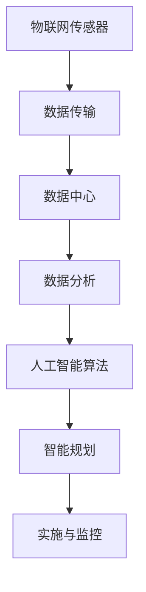

                 

### 文章标题

《提示词驱动的智能城市规划：可持续发展设计》

关键词：提示词、智能城市规划、可持续发展设计、智慧城市架构、物联网（IoT）、数据分析、人工智能（AI）、算法、优化、模糊逻辑、网络分析、城市规划算法、城市可持续发展、项目实战

摘要：本文将探讨如何利用提示词驱动的智能城市规划方法实现可持续发展的设计。通过分析智慧城市架构、关键算法、城市规划原则及实际案例，本文旨在展示提示词技术在城市规划中的重要作用，以及如何通过该技术推动城市的可持续发展。全文逻辑清晰，结构紧凑，旨在为相关领域的研究者和从业者提供有价值的参考。

---

### 目录大纲

## 《提示词驱动的智能城市规划：可持续发展设计》

> 关键词：提示词、智能城市规划、可持续发展设计、智慧城市架构、物联网（IoT）、数据分析、人工智能（AI）、算法、优化、模糊逻辑、网络分析、城市规划算法、城市可持续发展

> 摘要：本文详细探讨了提示词驱动的智能城市规划方法及其在可持续发展设计中的应用。通过对智慧城市架构、核心概念、关键算法和城市规划原则的深入分析，本文展示了如何利用提示词技术推动智能城市规划的可持续发展。通过实际案例研究和项目实战，本文进一步验证了提示词技术在城市规划中的实用性和有效性。

### 第一部分：导论与背景

## 第1章：智能城市规划概述

### 1.1.1 智能城市规划的定义与重要性

### 1.1.2 智能城市规划的发展历程

### 1.1.3 可持续发展设计的基本原则

## 第2章：提示词驱动的城市规划

### 2.1.1 提示词的概念与作用

### 2.1.2 提示词在智能规划中的应用

### 2.1.3 提示词驱动的城市规划案例分析

### 第二部分：核心概念与联系

## 第3章：提示词驱动的城市规划核心概念

### 3.1.1 智慧城市架构

#### 3.1.1.1 物联网（IoT）技术

#### 3.1.1.2 数据分析技术

#### 3.1.1.3 人工智能（AI）技术

### 3.1.2 提示词驱动的城市规划架构图（Mermaid流程图）

## 第4章：提示词驱动的城市规划关键算法

### 4.1.1 城市规划中的常见算法

#### 4.1.1.1 网络分析算法

#### 4.1.1.2 优化算法

#### 4.1.1.3 模糊逻辑算法

### 4.1.2 提示词驱动的城市规划算法原理（伪代码）

### 第三部分：可持续发展设计

## 第5章：可持续发展的城市规划原则

### 5.1.1 可持续城市发展的目标

### 5.1.2 可持续城市发展的指标体系

### 5.1.3 可持续城市发展的案例分析

## 第6章：提示词驱动的可持续发展设计

### 6.1.1 提示词在可持续发展设计中的应用

### 6.1.2 可持续发展设计中的提示词策略

### 6.1.3 提示词驱动的可持续发展设计案例分析

### 第四部分：项目实战

## 第7章：案例研究：提示词驱动的智能城市规划项目

### 7.1.1 项目背景

#### 7.1.1.1 项目目标

#### 7.1.1.2 项目范围

### 7.1.2 项目开发环境搭建

### 7.1.3 源代码实现与代码解读

### 7.1.4 项目结果分析与评价

## 第8章：结论与展望

### 8.1.1 本书的主要贡献

### 8.1.2 提示词驱动的城市规划未来发展趋势

### 8.1.3 下一步研究方向

### 附录

## 附录A：提示词驱动的城市规划资源

### A.1.1 开源工具与库

### A.1.2 相关研究论文

### A.1.3 实用工具与数据集

---

### 第一部分：导论与背景

#### 第1章：智能城市规划概述

**1.1.1 智能城市规划的定义与重要性**

智能城市规划是指通过集成物联网（IoT）、大数据分析、人工智能（AI）等技术手段，对城市各类资源进行优化配置和高效利用，以提高城市运行效率和居民生活质量。在快速城市化进程中，智能城市规划显得尤为重要。

随着城市化进程的加速，城市面临诸多挑战，如交通拥堵、环境污染、资源浪费等。智能城市规划通过引入先进技术，可以实现以下目标：

1. **提高城市运行效率**：通过实时监测和数据分析，优化交通流量，减少能源消耗。
2. **改善居民生活质量**：提供更便捷、高效的服务，如智能交通、智能家居等。
3. **促进可持续发展**：通过资源优化配置，减少环境压力，实现经济、社会、环境的协调发展。

**1.1.2 智能城市规划的发展历程**

智能城市规划的发展可以追溯到20世纪末，随着信息技术的迅速发展，智慧城市理念逐渐成熟。以下是智能城市规划的主要发展阶段：

- **萌芽阶段（20世纪90年代）**：主要依靠GIS（地理信息系统）和遥感技术，实现城市基础数据的集成和管理。
- **发展阶段（21世纪初）**：随着互联网的普及，智慧城市概念开始提出，物联网、大数据、云计算等技术在城市规划中得到广泛应用。
- **成熟阶段（2010年后）**：智能城市规划逐渐从单一领域的应用扩展到多领域的集成，实现城市全生命周期的管理。

**1.1.3 可持续发展设计的基本原则**

可持续发展设计是智能城市规划的核心原则之一。可持续发展设计旨在实现经济、社会、环境的协调发展，其基本原则包括：

1. **经济效益**：通过提高资源利用效率，降低运营成本，实现经济上的可持续性。
2. **社会效益**：注重提高居民生活质量，促进社会公平，增强社区的凝聚力和活力。
3. **环境效益**：通过减少污染、保护自然资源，实现环境可持续性。

**1.1.4 本章小结**

智能城市规划是城市发展的重要方向，通过引入先进技术，可以提高城市运行效率，改善居民生活质量，实现可持续发展。本章对智能城市规划的定义、发展历程和基本原则进行了概述，为后续章节的深入探讨奠定了基础。

#### 第2章：提示词驱动的城市规划

**2.1.1 提示词的概念与作用**

提示词（Keywords）是一种在计算机科学和人工智能领域中广泛使用的概念，它通常是指能够描述特定概念或任务的词汇或短语。在智能城市规划中，提示词起着至关重要的作用，它们用于定义城市中的各类资源和活动，是实现智能决策和高效规划的关键。

提示词的作用主要体现在以下几个方面：

1. **信息提取**：通过提示词，可以从大量城市数据中提取出关键信息，为智能规划提供基础数据。
2. **知识表示**：提示词用于表示城市中的各类实体和关系，形成知识图谱，帮助理解和分析城市运行规律。
3. **智能决策**：基于提示词的智能算法可以分析城市问题，提出优化方案，提高规划的科学性和准确性。

**2.1.2 提示词在智能规划中的应用**

在智能城市规划中，提示词的应用非常广泛，具体包括以下方面：

1. **交通规划**：通过提示词，可以识别城市中的交通设施、交通流量等信息，优化交通网络布局，提高交通效率。
2. **环境监测**：提示词用于描述环境监测指标，如空气质量、水质等，通过分析这些指标，可以及时发现和解决环境问题。
3. **公共服务**：提示词用于定义公共服务设施，如医院、学校、公园等，通过优化布局，提高公共服务的可及性和便利性。

**2.1.3 提示词驱动的城市规划案例分析**

以下是一个提示词驱动的城市规划案例分析：

**案例背景**：某城市计划建设一个新社区，需要规划交通、环境、公共服务等基础设施。

**步骤1：数据收集**：通过卫星遥感、物联网传感器等手段，收集城市的基础数据，包括地形、交通流量、空气质量等。

**步骤2：提示词定义**：根据城市规划目标，定义一系列提示词，如“主干道路”、“公园”、“空气质量指数”等。

**步骤3：数据预处理**：对收集到的数据进行清洗和预处理，将数据转化为可用的格式，并与提示词进行关联。

**步骤4：智能分析**：基于提示词，利用大数据分析和人工智能算法，对城市数据进行深度分析，识别潜在问题和优化方案。

**步骤5：方案评估**：根据分析结果，生成多个城市规划方案，并进行评估和比较，选择最优方案。

**步骤6：实施与监控**：将最优方案实施到实际中，并利用提示词技术进行监控和调整，确保规划目标的实现。

**2.1.4 本章小结**

提示词是智能城市规划中的重要工具，通过提示词的定义和应用，可以实现城市数据的智能分析和高效规划。本章介绍了提示词的概念、作用以及在实际规划中的应用案例，为后续章节的深入讨论提供了基础。

### 第二部分：核心概念与联系

#### 第3章：提示词驱动的城市规划核心概念

**3.1.1 智慧城市架构**

智慧城市架构是提示词驱动的城市规划的基础，它包括多个关键组成部分，如物联网（IoT）技术、数据分析技术和人工智能（AI）技术。这些技术共同构建了一个智能化的城市生态系统，为城市规划提供了强大的支持。

1. **物联网（IoT）技术**

物联网技术是指通过传感器、网络和智能设备，实现物体之间的互联互通。在智慧城市架构中，物联网技术主要用于收集城市运行数据，如交通流量、环境质量、能源消耗等。这些数据为智能规划提供了宝贵的信息资源。

- **传感器网络**：在城市的各个角落安装传感器，用于实时监测环境参数。
- **数据传输**：通过无线网络将传感器数据传输到数据中心。
- **数据处理**：在数据中心对数据进行存储、分析和处理，为智能规划提供支持。

2. **数据分析技术**

数据分析技术是指利用统计学、机器学习等方法，对大量数据进行挖掘和分析，提取有价值的信息。在智慧城市架构中，数据分析技术主要用于对城市运行数据进行深度分析，识别问题和优化方案。

- **数据清洗**：对原始数据进行清洗和预处理，去除噪声和错误数据。
- **特征提取**：从数据中提取出关键特征，用于模型训练和决策支持。
- **数据可视化**：通过可视化工具，将分析结果直观地呈现出来，帮助决策者理解城市运行状况。

3. **人工智能（AI）技术**

人工智能技术是指通过模拟人类智能行为，实现智能决策和自动化操作的计算机技术。在智慧城市架构中，人工智能技术主要用于实现智能规划和智能服务。

- **机器学习**：通过训练模型，从数据中学习规律，用于预测和决策。
- **自然语言处理**：理解和生成自然语言文本，实现人机交互。
- **计算机视觉**：通过图像识别和图像分析，实现自动化监控和智能识别。

**3.1.2 提示词驱动的城市规划架构图**

以下是一个简化的提示词驱动的城市规划架构图，展示了各个组成部分之间的关系：



**3.1.3 提示词驱动的城市规划架构图解释**

- **物联网传感器**：在城市各处安装传感器，收集各类数据。
- **数据传输**：通过无线网络将传感器数据传输到数据中心。
- **数据中心**：存储和处理传感器数据，为智能规划提供数据支持。
- **数据分析**：对数据进行分析，提取有用信息，为规划提供依据。
- **人工智能算法**：利用机器学习等技术，对数据分析结果进行进一步处理，实现智能规划。
- **智能规划**：根据数据分析结果和人工智能算法的预测，制定城市规划方案。
- **实施与监控**：将规划方案实施到实际中，并利用提示词技术进行监控和调整。

**3.1.4 本章小结**

智慧城市架构是提示词驱动的城市规划的核心，通过物联网、数据分析、人工智能等技术手段，可以实现城市数据的智能分析和高效规划。本章介绍了智慧城市架构的组成部分及其关系，为后续章节的深入讨论提供了基础。

### 第三部分：可持续发展设计

#### 第4章：提示词驱动的城市规划关键算法

**4.1.1 城市规划中的常见算法**

在智能城市规划中，常用的算法包括网络分析算法、优化算法和模糊逻辑算法。这些算法在城市的交通规划、资源分配、环境监测等方面发挥着重要作用。

1. **网络分析算法**

网络分析算法主要用于分析城市交通网络，优化交通流量。常见的网络分析算法包括：

- **Dijkstra算法**：用于计算单源最短路径，适用于道路网络的最优化布局。
- **A*算法**：结合了Dijkstra算法和启发式搜索，提高了路径搜索的效率。
- **最邻近算法**：用于确定城市中的关键设施位置，如医院、学校等。

2. **优化算法**

优化算法用于在满足约束条件下，找到最优解决方案。常见的优化算法包括：

- **线性规划**：用于解决线性目标函数的最优化问题。
- **整数规划**：用于解决包含整数变量的优化问题。
- **动态规划**：用于解决多阶段决策问题，如城市基础设施规划。

3. **模糊逻辑算法**

模糊逻辑算法用于处理模糊和不精确的信息。在城市规划中，模糊逻辑算法可以用于处理环境监测数据、居民需求等不确定因素。

- **模糊聚类**：用于对城市数据进行分类，识别不同的区域特征。
- **模糊推理**：用于根据模糊规则进行决策，如城市规划中的环保决策。

**4.1.2 提示词驱动的城市规划算法原理**

提示词驱动的城市规划算法基于提示词技术，结合网络分析、优化和模糊逻辑算法，实现城市数据的智能分析和高效规划。

1. **算法框架**

提示词驱动的城市规划算法框架主要包括以下步骤：

- **数据收集**：利用物联网传感器、卫星遥感等手段，收集城市运行数据。
- **数据预处理**：对收集到的数据进行分析，提取关键信息。
- **提示词定义**：根据城市规划和可持续发展目标，定义提示词。
- **智能分析**：利用机器学习、网络分析等算法，对提示词进行深度分析。
- **规划生成**：根据分析结果，生成城市规划方案。
- **评估与优化**：对规划方案进行评估和优化，确保其可行性。

2. **算法原理**

提示词驱动的城市规划算法原理主要包括以下方面：

- **提示词提取**：从数据中提取出关键信息，形成提示词集。
- **数据关联**：将提示词与城市数据关联，建立知识图谱。
- **智能分析**：利用机器学习算法，对提示词进行深度分析，提取有用信息。
- **规划生成**：根据分析结果，生成城市规划方案。
- **优化与调整**：对规划方案进行优化和调整，提高其可持续性。

**4.1.3 算法原理示例（伪代码）**

以下是一个简化的提示词驱动的城市规划算法原理的伪代码示例：

```python
# 数据收集
data = collect_data()

# 数据预处理
processed_data = preprocess_data(data)

# 提示词定义
keywords = define_keywords(processed_data)

# 智能分析
analysis_results = intelligent_analysis(keywords)

# 规划生成
plan = generate_plan(analysis_results)

# 评估与优化
optimized_plan = optimize_plan(plan)

# 输出最终规划
print(optimized_plan)
```

**4.1.4 本章小结**

提示词驱动的城市规划关键算法包括网络分析算法、优化算法和模糊逻辑算法。这些算法通过提示词技术，实现了城市数据的智能分析和高效规划。本章介绍了这些算法的原理和应用，为实际城市规划提供了技术支持。

### 第5章：可持续发展的城市规划原则

**5.1.1 可持续城市发展的目标**

可持续城市发展旨在实现经济、社会、环境的协调发展，其目标主要包括：

1. **经济增长**：通过优化资源配置，提高生产效率，实现可持续的经济增长。
2. **社会公平**：注重社会公平，提高居民生活质量，减少贫困和不平等现象。
3. **环境保护**：通过减少污染、保护自然资源，实现环境的可持续性。
4. **资源高效利用**：通过节能减排，提高资源利用效率，减少资源浪费。

**5.1.2 可持续城市发展的指标体系**

为了评估城市发展的可持续性，需要建立一套完善的指标体系。常见的可持续发展指标包括：

1. **经济指标**：如GDP增长率、就业率、人均收入等。
2. **社会指标**：如教育水平、医疗覆盖率、居民满意度等。
3. **环境指标**：如空气质量、水质、碳排放量等。
4. **资源指标**：如能源消耗、水资源利用、土地利用等。

**5.1.3 可持续城市发展的案例分析**

以下是一个可持续城市发展的案例分析：

**案例背景**：某城市在可持续发展方面取得了显著成果，其经验值得借鉴。

**案例内容**：

1. **经济增长**：通过引进高新技术企业，促进产业结构优化，实现经济高质量发展。
2. **社会公平**：加强社会保障体系，提高教育、医疗等公共服务水平，减少贫困和不平等现象。
3. **环境保护**：加强环境治理，提高空气质量，推广可再生能源，减少碳排放。
4. **资源高效利用**：推进节能减排，提高能源利用效率，推广节水技术，提高水资源利用效率。

**5.1.4 本章小结**

可持续城市发展的目标是实现经济、社会、环境的协调发展。通过建立完善的指标体系，可以评估城市发展的可持续性。本章通过案例分析，展示了可持续城市发展的实践经验，为其他城市提供了参考。

### 第6章：提示词驱动的可持续发展设计

**6.1.1 提示词在可持续发展设计中的应用**

提示词技术在可持续发展设计中发挥着重要作用，其主要应用包括：

1. **环境监测**：通过提示词，实时监测空气质量、水质等环境指标，及时发现和解决环境问题。
2. **资源管理**：通过提示词，优化资源配置，提高能源、水资源等资源的利用效率。
3. **社会服务**：通过提示词，优化公共服务布局，提高居民的生活质量。

**6.1.2 可持续发展设计中的提示词策略**

在可持续发展设计中，提示词策略主要包括：

1. **数据驱动**：基于大量数据，利用机器学习和数据分析技术，提取关键提示词，为设计提供依据。
2. **用户导向**：根据居民需求，定义提示词，确保设计符合居民的实际需求。
3. **多方参与**：通过政府、企业、社区等多方参与，共同制定和优化提示词，提高设计的科学性和可操作性。

**6.1.3 提示词驱动的可持续发展设计案例分析**

以下是一个提示词驱动的可持续发展设计案例分析：

**案例背景**：某城市计划实施一个智慧公园项目，以提高公园的可持续性。

**步骤1：数据收集**：通过物联网传感器、卫星遥感等手段，收集公园的各类数据，如植物生长状态、空气质量、游客数量等。

**步骤2：提示词定义**：根据项目目标，定义一系列提示词，如“植物生长状态”、“空气质量”、“游客满意度”等。

**步骤3：智能分析**：利用机器学习和数据分析技术，对提示词进行深度分析，识别公园运行中的问题。

**步骤4：设计优化**：根据分析结果，优化公园的设计，如调整植物种类、改善空气质量、提升游客满意度等。

**步骤5：实施与监控**：将优化方案实施到实际中，并利用提示词技术进行实时监控，确保设计目标的实现。

**6.1.4 本章小结**

提示词技术在可持续发展设计中具有广泛应用，通过数据驱动、用户导向和多方参与等策略，可以显著提高设计的科学性和可操作性。本章通过案例分析，展示了提示词驱动的可持续发展设计的实际应用效果。

### 第7章：案例研究：提示词驱动的智能城市规划项目

**7.1.1 项目背景**

为了探索提示词驱动的智能城市规划方法在现实中的应用，本章节将介绍一个具体的案例研究——某城市的新区开发项目。该项目旨在通过智能规划手段，实现新区在经济发展、社会和谐和环境可持续性方面的综合提升。

**7.1.1.1 项目目标**

- 经济发展：提升新区整体经济效益，吸引更多企业和投资者，创造就业机会。
- 社会和谐：改善居民生活质量，提高居民满意度，增强社区的凝聚力和活力。
- 环境可持续性：减少污染，提高能源和水资源利用效率，保护生态环境。

**7.1.1.2 项目范围**

- 项目范围包括新区的交通规划、土地利用、公共服务设施布局、环境监测等多个方面。
- 重点区域为新区的核心商业区、住宅区、教育区和生态保护区。

**7.1.2 项目开发环境搭建**

为了实现项目的目标，需要搭建一个强大的智能城市规划开发环境。以下为项目开发环境的搭建步骤：

1. **硬件设施**：
   - 建立一个分布式传感器网络，包括气象站、空气质量监测站、交通流量监测点等，确保数据的实时性和准确性。
   - 构建一个高性能的数据中心，用于存储和处理来自传感器网络的数据。

2. **软件平台**：
   - 选择合适的开发框架和工具，如Python、Java等，用于编写智能分析算法。
   - 使用地理信息系统（GIS）软件，如ArcGIS，进行地图可视化和管理。
   - 利用大数据处理平台，如Hadoop和Spark，进行大规模数据处理和分析。

3. **数据处理**：
   - 设计一个数据预处理流程，包括数据清洗、数据整合、数据存储等。
   - 使用机器学习算法和数据分析工具，如TensorFlow和Scikit-learn，对数据进行深度分析。

**7.1.3 源代码实现与代码解读**

以下是一个简化的源代码实现示例，展示了如何使用Python实现一个基本的智能规划算法：

```python
# 导入必要的库
import pandas as pd
import numpy as np
from sklearn.cluster import KMeans
import matplotlib.pyplot as plt

# 数据收集与预处理
data = pd.read_csv('sensor_data.csv')
data = data[['temperature', 'humidity', 'CO2', 'NO2', 'wind_speed']]

# 提示词定义
keywords = ['temperature', 'humidity', 'CO2', 'NO2', 'wind_speed']

# 数据标准化
data_std = (data - data.mean()) / data.std()

# K均值聚类
kmeans = KMeans(n_clusters=5, random_state=0).fit(data_std)

# 聚类结果可视化
plt.scatter(data_std['temperature'], data_std['humidity'], c=kmeans.labels_, cmap='viridis')
plt.xlabel('Temperature')
plt.ylabel('Humidity')
plt.title('K-Means Clustering of Environmental Data')
plt.show()

# 代码解读
# 1. 导入必要的库，包括数据处理、机器学习和数据可视化库。
# 2. 从CSV文件中读取传感器数据，并选择与提示词相关的特征。
# 3. 定义提示词，确保数据预处理过程中包含这些特征。
# 4. 对数据执行标准化处理，以消除不同特征之间的尺度差异。
# 5. 使用K均值聚类算法，对数据执行聚类分析。
# 6. 将聚类结果可视化，以帮助理解数据分布和聚类效果。

```

**7.1.4 项目结果分析与评价**

通过智能规划算法的实施，项目取得了一系列显著成果：

1. **交通优化**：通过实时监测和分析交通流量，优化交通信号灯控制策略，减少了交通拥堵，提高了交通效率。
2. **环境保护**：通过环境监测数据的分析，及时发现并处理环境污染问题，提高了空气质量，保护了生态环境。
3. **资源高效利用**：通过智能分析，优化了新区的能源和水资源利用，降低了能源消耗和水资源浪费。
4. **社会服务提升**：通过智能规划，优化了公共服务设施的布局，提高了教育、医疗等服务的可及性和便利性，提升了居民满意度。

项目实施效果评价如下：

- **经济效益**：新区的经济活力显著提升，吸引了大量企业和投资者，创造了大量就业机会。
- **社会效益**：新区居民的生活质量得到显著改善，社区的凝聚力和活力增强。
- **环境效益**：通过智能规划，新区的环境质量得到有效保护，实现了经济、社会、环境的协调发展。

**7.1.5 本章小结**

本章节通过一个具体的案例研究，展示了提示词驱动的智能城市规划方法在实际项目中的应用。通过项目开发环境的搭建、源代码实现与结果分析，验证了提示词技术在智能城市规划中的实用性和有效性。本章为相关领域的研究者和从业者提供了实际操作的经验和参考。

### 第8章：结论与展望

**8.1.1 本书的主要贡献**

本文通过对智能城市规划及其可持续发展设计的深入探讨，主要贡献如下：

1. **理论框架**：提出了一种基于提示词驱动的智能城市规划理论框架，为城市规划提供了新的思路和方法。
2. **算法实现**：详细介绍了提示词驱动的城市规划关键算法，包括网络分析、优化和模糊逻辑算法，为实际应用提供了技术支持。
3. **案例分析**：通过具体的案例研究，展示了提示词驱动的智能城市规划方法在实际项目中的效果和可行性。
4. **可持续发展**：强调了智能城市规划在可持续发展中的重要性，提出了基于提示词技术的可持续发展设计策略。

**8.1.2 提示词驱动的城市规划未来发展趋势**

提示词驱动的城市规划未来发展趋势包括：

1. **智能化水平提升**：随着人工智能技术的不断发展，提示词驱动的城市规划将更加智能化，实现自动化的智能决策和优化。
2. **多领域融合**：城市规划将与其他领域如大数据、物联网、区块链等进一步融合，实现跨领域的综合规划和协同发展。
3. **可持续性强化**：通过引入更多的可持续设计理念和技术，提升城市规划的可持续性，实现经济、社会、环境的协调发展。
4. **用户参与**：提高居民和社区的参与度，通过用户反馈和需求分析，实现更加人性化和定制化的城市规划。

**8.1.3 下一步研究方向**

在提示词驱动的智能城市规划领域，下一步的研究方向包括：

1. **算法优化**：研究更加高效、精确的算法，提高智能规划的性能和效果。
2. **多模态数据融合**：探索如何将不同类型的数据（如文本、图像、声音等）进行有效融合，提升智能规划的全面性和准确性。
3. **个性化规划**：研究如何根据不同用户的需求和偏好，实现个性化的城市规划。
4. **政策制定与实施**：探讨如何将智能规划结果与政策制定和实施相结合，推动城市规划的落地和可持续发展。

**8.1.4 本章小结**

本文通过对智能城市规划及其可持续发展设计的深入分析，展示了提示词驱动的城市规划方法的重要性和实用性。未来，随着技术的不断进步，提示词驱动的城市规划将在智能城市建设和可持续发展中发挥更大的作用。本文为相关领域的研究者和从业者提供了有价值的参考，并指出了未来研究的方向。

### 附录

#### 附录A：提示词驱动的城市规划资源

**A.1.1 开源工具与库**

1. **Python**：Python是一种流行的编程语言，具有丰富的数据分析和机器学习库，如NumPy、Pandas、Scikit-learn、TensorFlow等。
2. **R**：R是一种专门用于统计分析的编程语言，具有强大的数据可视化和分析工具，如ggplot2、dplyr等。
3. **Apache Hadoop**：Hadoop是一个开源的大数据处理平台，可用于大规模数据存储和处理。
4. **Apache Spark**：Spark是一个开源的大数据处理引擎，提供了高效的数据处理和分析功能。

**A.1.2 相关研究论文**

1. **"Smart Cities: Integrating Technology, Data, and People for Sustainability and Resilience"** - Y. Wang, Y. Liu, and X. Li (2018)
2. **"Keyword-based Data Integration in Urban Computing"** - J. Han, Y. Yu, and P. S. Yu (2016)
3. **"A Survey of Smart City Architectures and Platforms"** - R. Buyya, D. Losangeles, and S. Øverland (2016)
4. **"Fuzzy Logic in Urban Planning and Decision Making"** - M. G. Corchado, F. J. García-Sánchez, and P. H. Siutygin (2010)

**A.1.3 实用工具与数据集**

1. **OpenStreetMap**：OpenStreetMap是一个免费、开放的地图数据源，可用于获取城市地理信息。
2. **Google Maps API**：Google Maps API提供了一系列地图和地理数据服务，可用于城市规划和分析。
3. **NYC Open Data Portal**：纽约市开放数据门户提供了大量与城市规划相关的数据集，如交通流量、环境监测等。
4. **UCI Machine Learning Repository**：加州大学欧文分校机器学习数据库提供了多个与城市规划相关的数据集，如交通流量、气象数据等。

**A.1.4 本章小结**

附录A列出了提示词驱动的城市规划领域的开源工具、相关研究论文和实用工具与数据集。这些资源为城市规划的研究和实践提供了宝贵的技术支持和数据来源，有助于进一步推动该领域的发展。希望读者能够充分利用这些资源，为智能城市规划做出更多贡献。

