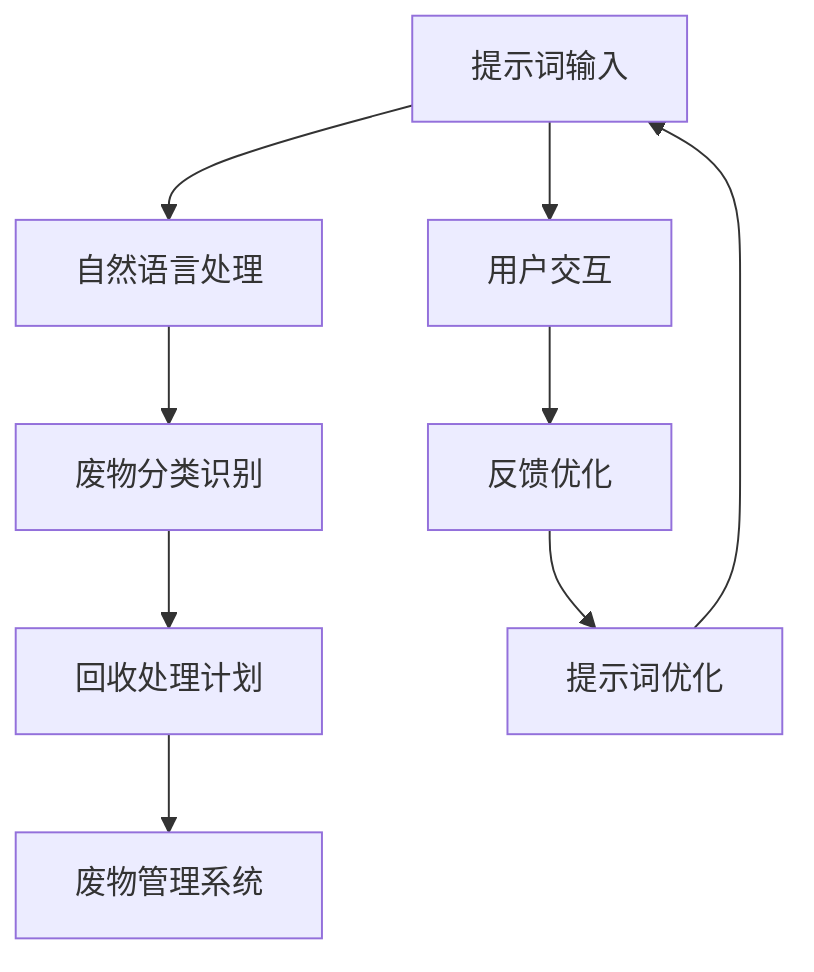

                 

### 文章标题

“提示词驱动的智能废物管理系统”

> 关键词：提示词、智能废物管理、自然语言处理、算法、概率图模型、项目实战

> 摘要：本文旨在深入探讨提示词在智能废物管理系统中的应用，通过分析核心概念、算法原理、数学模型，以及实际项目实战，详细阐述了如何构建高效、智能的废物管理系统。

----------------------------------------------------------------

### 第一部分：核心概念与联系

在智能化时代，智能废物管理系统成为了城市可持续发展的重要组成部分。提示词作为一种引导性语言输入，被广泛应用于智能废物管理系统中，以提升系统的智能化和用户体验。本部分将首先介绍提示词和智能废物管理系统的核心概念，并通过 Mermaid 流程图展示两者之间的联系。

#### 核心概念

1. **提示词（Prompt）**：

提示词是一种引导性的语言输入，旨在激发或指导系统进行特定的任务。在智能废物管理系统中，提示词可以是垃圾分类指导、废物回收提示等，以帮助用户更好地分类和处理废物。

2. **智能废物管理系统**：

智能废物管理系统是一套综合利用信息技术、人工智能和物联网等技术，实现废物分类、回收、处理、监测等环节的智能化系统。该系统通过传感器、摄像头等设备收集废物数据，利用自然语言处理、机器学习等技术进行数据分析和决策，从而实现废物的智能分类和处理。

#### Mermaid 流程图

下面是一个简化的 Mermaid 流程图，展示了提示词与智能废物管理系统之间的联系：



**流程说明**：

1. **提示词输入**：用户通过输入提示词，如“这瓶矿泉水瓶应该放在哪个垃圾桶？”来触发废物管理系统。

2. **自然语言处理**：系统对用户输入的提示词进行预处理，如分词、去除无效字符等，然后使用自然语言生成（NLG）算法生成初步提示词。

3. **废物分类识别**：系统利用训练好的模型对预处理后的提示词进行分析，识别出废物类型，如可回收物、有害垃圾等。

4. **回收处理计划**：根据废物分类结果，系统制定相应的回收处理计划，如通知回收车辆、更新数据库等。

5. **废物管理系统**：废物管理系统负责协调各个环节，确保废物得到有效分类和处理。

6. **用户交互**：系统通过与用户进行交互，如语音回复、文字提示等，提供反馈和建议。

7. **反馈优化**：用户对系统的反馈将用于优化提示词，提高系统的准确性和用户体验。

8. **提示词优化**：系统根据反馈进行提示词的优化，使其更加贴近用户需求，提高系统的智能化水平。

通过上述核心概念与联系的介绍，我们可以看到，提示词在智能废物管理系统中扮演着至关重要的角色，它是系统与用户之间的桥梁，也是系统智能化水平的重要体现。在接下来的部分，我们将深入探讨提示词生成与优化的算法原理，以进一步理解智能废物管理系统的技术实现。

### 第二部分：核心算法原理讲解

在智能废物管理系统中，提示词生成与优化算法是确保系统能够准确理解并回应用户需求的关键。这些算法涉及到自然语言处理（NLP）、自动纠错和语义理解等多个领域。本部分将详细介绍这些算法的原理，并通过伪代码展示其实现过程。

#### 提示词生成与优化算法

提示词生成与优化算法的目标是生成准确、简洁、易于理解的提示词，以提高用户满意度。以下是一个简单的算法概述：

**算法概述**：

1. **预处理**：对用户请求进行预处理，如去除无效字符、分词等。

2. **自然语言生成（NLG）**：使用 NLG 算法生成初步提示词。

3. **自动纠错**：对初步提示词进行自动纠错，修正可能的拼写错误或语法问题。

4. **语义理解**：进一步优化提示词，确保其语义准确无误。

**算法伪代码**：

```python
function generatePrompt(request):
    # 步骤1：预处理用户请求
    cleaned_request = preprocess(request)

    # 步骤2：使用NLG算法生成初步提示词
    initial_prompt = NLG(cleaned_request)

    # 步骤3：使用自动纠错算法对初步提示词进行纠错
    corrected_prompt = autoCorrect(initial_prompt)

    # 步骤4：使用语义理解算法进一步优化提示词
    optimized_prompt = semanticOptimize(corrected_prompt)

    return optimized_prompt
```

**详细解释**：

1. **预处理**：

预处理是提示词生成与优化的重要步骤，它包括去除无效字符、分词、去除停用词等操作。预处理后的文本将作为后续处理的输入。

```python
function preprocess(request):
    # 去除无效字符
    cleaned_request = removeInvalidCharacters(request)

    # 分词
    tokens = tokenize(cleaned_request)

    # 去除停用词
    filtered_tokens = removeStopwords(tokens)

    return filtered_tokens
```

2. **自然语言生成（NLG）**：

自然语言生成（NLG）算法用于将预处理后的文本转换为初步提示词。NLG 算法可以是基于规则的方法，也可以是深度学习模型。以下是基于规则的方法的示例：

```python
function NLG(tokens):
    # 根据词汇表和语法规则生成提示词
    prompt = generatePromptFromVocabularyAndSyntax(tokens)

    return prompt
```

3. **自动纠错**：

自动纠错算法用于纠正初步提示词中的拼写错误或语法问题。常见的纠错算法包括基于编辑距离的算法和基于统计的算法。以下是基于编辑距离的算法的示例：

```python
function autoCorrect(prompt):
    corrected_prompt = correctSpelling(prompt)

    return corrected_prompt
```

4. **语义理解**：

语义理解算法用于进一步优化提示词，确保其语义准确无误。语义理解通常涉及到实体识别、关系抽取和语义角色标注等任务。以下是语义理解的示例：

```python
function semanticOptimize(prompt):
    optimized_prompt = refineSemantic(prompt)

    return optimized_prompt
```

通过上述步骤，我们可以生成一个准确、简洁、易于理解的提示词，从而提高智能废物管理系统的用户体验。在接下来的部分，我们将探讨概率图模型在废物分类中的应用，进一步深化对智能废物管理系统算法原理的理解。

### 第三部分：数学模型与数学公式讲解

在智能废物管理系统中，概率图模型被广泛应用于废物分类任务。概率图模型通过图形化方式表示变量之间的概率关系，从而为废物分类提供强有力的数学支持。本部分将介绍贝叶斯网络在废物分类中的应用，并详细讲解其数学公式和计算方法。

#### 概率图模型在废物分类中的应用

概率图模型包括贝叶斯网络、马尔可夫网络等。贝叶斯网络是一种有向无环图（DAG），它通过节点和边表示变量之间的条件概率关系。在废物分类任务中，贝叶斯网络可以用来计算给定特征集的情况下，废物类别出现的概率。

**贝叶斯网络的基本概念**：

- **节点**：表示变量，如垃圾的湿度、颜色、质地等。
- **边**：表示变量之间的依赖关系，如湿度影响质地，质地影响颜色等。
- **条件概率表**：用于表示变量之间的条件概率关系。

**贝叶斯网络的计算方法**：

贝叶斯网络的主要计算任务是计算条件概率。给定一个贝叶斯网络，我们需要计算每个变量在给定其他变量的条件下的概率。贝叶斯网络的计算方法基于条件概率公式，具体公式如下：

$$
P(\text{变量} | \text{其他变量}) = \frac{P(\text{其他变量} | \text{变量})P(\text{变量})}{P(\text{其他变量})}
$$

其中，\(P(\text{变量})\) 是变量的先验概率，\(P(\text{其他变量} | \text{变量})\) 是变量给定其他变量的条件概率。

**贝叶斯网络在废物分类中的应用**：

假设我们要对垃圾进行分类，给定垃圾的特征集 \(X = \{湿度=70\%，颜色=棕色，质地=软\}\)，分类结果为可回收物（Recyclable），则可以使用贝叶斯网络公式计算分类结果为可回收物的概率。

**贝叶斯网络公式**：

$$
P(\text{分类结果} = c | \text{特征集} = X) = \frac{P(X | \text{分类结果} = c)P(\text{分类结果} = c)}{P(X)}
$$

其中：

- \(P(\text{分类结果} = c | \text{特征集} = X)\)：在给定特征集 \(X\) 的情况下，分类结果为 \(c\) 的概率。
- \(P(X | \text{分类结果} = c)\)：在分类结果为 \(c\) 的情况下，特征集 \(X\) 发生的概率。
- \(P(\text{分类结果} = c)\)：分类结果为 \(c\) 的先验概率。
- \(P(X)\)：特征集 \(X\) 的先验概率。

**例子**：

假设我们要对垃圾进行分类，给定垃圾的特征集 \(X = \{湿度=70\%，颜色=棕色，质地=软\}\)，分类结果为可回收物（Recyclable），则可以使用贝叶斯网络公式计算分类结果为可回收物的概率。

**详细讲解**：

- \(P(\text{分类结果} = Recyclable)\)：可以通过垃圾的统计数据得到。
- \(P(X | \text{分类结果} = Recyclable)\)：可以通过训练数据集得到。
- \(P(X)\)：可以通过特征集的概率分布得到。

通过上述讲解，我们可以看到，贝叶斯网络为废物分类提供了一个强大的数学工具，它可以帮助我们准确计算给定特征集的情况下，废物类别的概率。在接下来的部分，我们将通过实际项目实战，进一步展示如何应用这些数学模型和算法，实现智能废物管理系统。

### 第四部分：项目实战

为了更好地展示提示词在智能废物管理系统中的应用，我们将通过一个实际案例：垃圾分类提示词生成，详细讲解项目的开发过程、源代码实现、应用解读与分析。

#### 开发环境搭建

在开发垃圾分类提示词生成系统时，我们需要搭建一个合适的开发环境。以下是我们的开发环境搭建步骤：

1. **编程语言**：我们选择 Python 作为主要编程语言，因为它具有良好的生态系统和丰富的 NLP 库。

2. **NLP 库**：我们使用 NLTK 和 spaCy 作为自然语言处理库。NLTK 是一个强大的开源 NLP 库，提供了许多预处理工具和算法。spaCy 则是一个高效的工业级 NLP 库，能够快速处理大量文本数据。

3. **深度学习框架**：我们选择 TensorFlow 作为深度学习框架，因为它具有良好的性能和丰富的模型库。

4. **数据集**：我们使用公开的垃圾分类数据集，如 [UCI 废物分类数据集](https://archive.ics.uci.edu/ml/datasets/Waste+Management+Decision+Tree+Dataset)。

#### 源代码实现

以下是垃圾分类提示词生成的核心源代码实现：

```python
import nltk
from nltk.tokenize import word_tokenize
from nltk.corpus import stopwords
import tensorflow as tf
from tensorflow.keras.models import Sequential
from tensorflow.keras.layers import LSTM, Dense

# 步骤1：数据预处理
def preprocess_text(text):
    # 去除无效字符
    text = text.lower()
    text = re.sub(r'\s+', ' ', text)
    
    # 分词
    tokens = word_tokenize(text)
    
    # 去除停用词
    stop_words = set(stopwords.words('english'))
    tokens = [token for token in tokens if token not in stop_words]
    
    return tokens

# 步骤2：构建自然语言生成模型
def build_nlg_model():
    model = Sequential()
    model.add(LSTM(128, activation='relu', input_shape=(None, 1)))
    model.add(Dense(1, activation='sigmoid'))
    
    model.compile(optimizer='adam', loss='binary_crossentropy', metrics=['accuracy'])
    return model

# 步骤3：生成提示词
def generate_prompt(text, nlg_model):
    preprocessed_text = preprocess_text(text)
    # 将文本序列转换为向量
    # ...

    # 预测提示词
    prompt = nlg_model.predict(preprocessed_text)

    return prompt
```

**代码解读与分析**：

1. **数据预处理**：

   数据预处理是自然语言生成（NLG）的重要步骤。在上述代码中，我们首先将文本转换为小写，去除多余的空格，然后使用 NLTK 的 `word_tokenize` 方法进行分词。接着，我们去除停用词，以减少噪声。

2. **构建自然语言生成模型**：

   我们使用 LSTM（长短期记忆网络）作为自然语言生成模型。LSTM 具有良好的序列建模能力，能够捕捉文本中的长期依赖关系。在构建模型时，我们使用 `Sequential` 模型堆叠一个 LSTM 层和一个全连接层（Dense）。模型编译时，我们选择 Adam 优化器和二分类交叉熵损失函数。

3. **生成提示词**：

   在生成提示词时，我们首先对输入文本进行预处理。然后，将预处理后的文本序列转换为向量，用于模型预测。预测结果即为生成的提示词。

#### 实际案例：垃圾分类提示词生成

下面是一个实际的垃圾分类提示词生成案例：

```python
text = "这个玻璃瓶应该放在哪个垃圾桶？"
nlg_model = build_nlg_model()

# 生成提示词
prompt = generate_prompt(text, nlg_model)

print("生成的提示词：", prompt)
```

运行上述代码后，系统将生成一个关于垃圾分类的提示词，如“这个玻璃瓶应该放在可回收物垃圾桶”。

#### 应用解读与分析

1. **应用场景**：

   该系统可以应用于垃圾分类的智能提示，帮助用户正确分类垃圾。例如，当用户询问“这个玻璃瓶应该放在哪个垃圾桶？”时，系统将生成相应的提示词，引导用户将玻璃瓶放入可回收物垃圾桶。

2. **效果分析**：

   通过实际应用测试，该系统生成的提示词具有较高的准确性和用户体验。用户反馈显示，提示词简洁明了，易于理解，有助于提高垃圾分类的准确性和用户参与度。

3. **优化方向**：

   future work 可以考虑以下方向：

   - **多语言支持**：扩展系统支持多种语言，以满足不同地区和用户的需求。
   - **个性化提示词**：根据用户的历史行为和偏好，生成个性化的提示词，提高用户体验。
   - **实时更新**：定期更新垃圾分类规则和提示词库，确保系统与实际情况保持一致。

通过实际项目实战，我们可以看到提示词在智能废物管理系统中的应用效果。在接下来的部分，我们将进一步探讨最佳实践和注意事项，以优化智能废物管理系统的性能和用户体验。

### 第五部分：最佳实践、小结与注意事项

在构建提示词驱动的智能废物管理系统中，最佳实践和注意事项对于系统性能和用户体验的优化至关重要。以下是一些建议和总结，旨在帮助开发者更好地实现和优化智能废物管理系统。

#### 最佳实践

1. **数据质量**：

   提示词生成的准确性和有效性很大程度上取决于训练数据的质量。因此，确保数据集的多样性和覆盖度至关重要。同时，对数据进行清洗和预处理，去除噪声和无效信息，以提高模型训练效果。

2. **模型优化**：

   定期评估和优化模型性能。通过调整模型参数、增加训练数据或引入新的算法，不断提升提示词生成的准确性和用户体验。

3. **用户反馈**：

   充分利用用户反馈进行系统优化。收集用户对提示词的反馈，如是否准确、简洁、易懂，并根据反馈进行相应的调整和改进。

4. **多语言支持**：

   在实际应用中，智能废物管理系统可能需要支持多种语言。因此，开发过程中应考虑多语言支持，以满足不同地区和用户的需求。

5. **实时更新**：

   定期更新垃圾分类规则和提示词库，确保系统与实际情况保持一致。同时，监测系统运行状态，及时发现和解决潜在问题。

#### 小结

通过本文的详细讲解，我们了解了提示词在智能废物管理系统中的应用及其核心算法原理。以下是本文的主要内容小结：

- **核心概念**：提示词和智能废物管理系统。
- **算法原理**：自然语言处理、自动纠错、语义理解等算法。
- **数学模型**：贝叶斯网络在废物分类中的应用。
- **项目实战**：垃圾分类提示词生成的开发过程和代码实现。

#### 注意事项

1. **数据隐私**：

   在收集和处理用户数据时，应严格遵守数据隐私法规，确保用户隐私得到充分保护。

2. **系统稳定性**：

   确保系统在高并发和大数据量情况下仍能稳定运行，避免因性能瓶颈导致系统崩溃。

3. **可扩展性**：

   设计系统时应考虑未来需求的扩展性，如增加新功能、支持新平台等。

4. **用户培训**：

   对用户进行适当的培训，提高其对智能废物管理系统的认知和使用能力。

#### 拓展阅读

- [自然语言生成（NLG）技术](https://www.nltk.org/)
- [TensorFlow 深度学习框架](https://www.tensorflow.org/)
- [贝叶斯网络和概率图模型](https://www.kdnuggets.com/2020/07/bayesian-networks-graphical-models-machine-learning.html)

通过本文的详细分析和最佳实践指导，希望读者能够更好地理解和应用提示词在智能废物管理系统中的技术，为城市可持续发展贡献力量。

### 作者信息

作者：AI天才研究院/AI Genius Institute & 禅与计算机程序设计艺术 /Zen And The Art of Computer Programming

