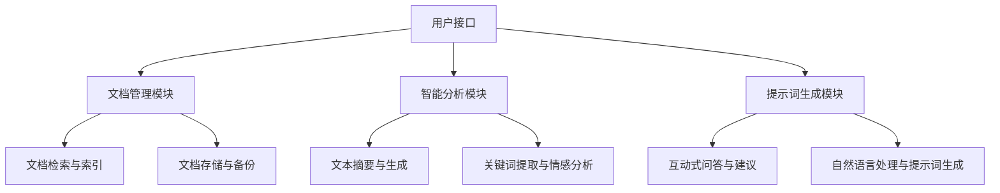

                 

### 文章标题：提示词驱动的智能文档管理系统

> 关键词：智能文档管理，提示词驱动，自然语言处理，文档检索，文本摘要，算法设计，系统架构

> 摘要：
本文将深入探讨提示词驱动的智能文档管理系统。我们将从系统架构与设计、核心技术与算法、系统实现与部署、应用场景与案例以及未来工作展望等多个方面，详细阐述智能文档管理系统的核心概念、关键算法和实际应用。通过本文的阅读，读者将能够全面了解提示词驱动智能文档管理系统的原理、实现和应用，为相关领域的研究和应用提供有益的参考。

-------------------------------------------------------------------

### 目录大纲

# 提示词驱动的智能文档管理系统

## 第一部分：系统架构与设计

### 1.1 系统总体架构

- **系统架构概述**
- **核心概念与联系**
- **架构 Mermaid 流程图**

### 1.2 系统设计原则

- **设计原则**
- **系统功能模块**

## 第二部分：核心技术与算法

### 2.1 提示词生成算法

- **核心算法原理讲解**
- **数学模型与公式**

### 2.2 文档检索与索引算法

- **核心算法原理讲解**
- **数学模型与公式**

### 2.3 文本摘要与生成算法

- **核心算法原理讲解**
- **数学模型与公式**

## 第三部分：系统实现与部署

### 3.1 系统实现框架

- **系统实现框架**
- **开发环境搭建**

### 3.2 项目实战

- **文档管理模块实现**
- **智能分析模块实现**
- **提示词生成模块实现**

### 3.3 系统部署与性能优化

- **系统部署**
- **性能优化**

## 第四部分：应用场景与案例

### 4.1 应用场景

- **企业文档管理**
- **知识库构建**
- **智能客服**

### 4.2 案例分析

- **案例一：企业文档管理系统**
- **案例二：知识库构建**
- **案例三：智能客服**

## 第五部分：展望与未来工作

### 5.1 技术趋势

- **提示词驱动技术的发展**
- **智能文档管理系统的发展**

### 5.2 未来工作

- **研究方向**
- **改进措施**

### 5.3 开源项目推荐

- **开源项目**
- **参与方式**

## 附录

### 附录 A：参考资料

- **参考书籍**
- **论文文献**
- **在线资源**

### 附录 B：术语表

- **术语解释**

### 附录 C：代码示例

- **代码示例**
- **代码解读**

### 详细内容示例

#### 1.1 系统总体架构

**系统架构概述**：

提示词驱动的智能文档管理系统是一个集成的系统，它包含了多个关键组件，这些组件协同工作以实现智能文档管理。系统的核心组件包括用户接口、文档管理模块、智能分析模块和提示词生成模块。

- **用户接口**：用户接口是用户与系统交互的界面，通过用户接口，用户可以提交查询、查看文档、管理文档等操作。
- **文档管理模块**：负责文档的存储、检索和管理。文档管理模块实现了文档的上传、下载、更新和删除等功能。
- **智能分析模块**：负责对文档内容进行分析，提取有价值的信息。智能分析模块使用自然语言处理技术，可以识别文档的主题、关键词、情感等。
- **提示词生成模块**：根据用户输入的查询或需求生成相应的提示词。提示词生成模块的核心目标是提高文档检索的准确性和效率。

**核心概念与联系**：

- **提示词生成与理解**：提示词生成模块通过自然语言处理技术，根据用户的查询或需求生成相应的提示词。这些提示词用于引导系统进行后续的文档检索和分析。

- **文档检索与索引**：文档管理模块实现了文档的索引功能。索引过程将文档中的关键词、主题等信息进行提取和存储，以便后续的快速检索。

- **文本摘要与生成**：智能分析模块可以对文档进行文本摘要。文本摘要是对文档内容进行高度概括，提取出关键信息，帮助用户快速了解文档的核心内容。

- **互动式问答与建议**：系统支持用户提问和获得建议。用户可以通过交互界面提出问题，系统会根据文档内容提供答案和建议。

**架构 Mermaid 流程图**：



上述流程图展示了系统各组件之间的交互关系。用户通过用户接口提交查询或操作请求，相关模块会根据请求内容进行处理，并返回相应的结果。同时，各模块之间也会进行数据的共享和协同工作，以确保系统的整体性能和用户体验。

#### 1.2 系统设计原则

在设计提示词驱动的智能文档管理系统时，需要遵循一系列关键原则，以确保系统的灵活性、可扩展性、高效性和可维护性。以下是系统设计的主要原则和设计原则：

**1. 设计原则**

- **灵活性**：系统设计应具备灵活性，以适应不同的业务场景和用户需求。这意味着系统需要能够灵活地扩展和调整功能模块，以满足用户的个性化需求。
- **可扩展性**：系统设计应具备良好的扩展性，以支持系统功能的逐步扩展。例如，可以通过模块化设计，增加新的模块或功能，以满足未来业务需求的变化。
- **高效性**：系统设计应注重高效性，确保系统的响应速度和数据处理能力。通过优化算法和架构设计，可以提高系统的性能和效率。
- **可维护性**：系统设计应具有良好的可维护性，以便于后续的维护和升级。良好的代码结构和文档可以降低维护成本，提高开发效率。

**2. 系统功能模块**

- **用户接口**：用户接口是系统的门户，负责接收用户输入的查询请求、操作指令等。用户接口设计应简洁易用，提供友好的交互界面，使用户能够轻松地与系统进行交互。
- **文档管理模块**：文档管理模块负责文档的存储、检索和管理。该模块应提供文档上传、下载、更新和删除等功能，同时保证文档的安全性和完整性。
- **智能分析模块**：智能分析模块负责对文档内容进行分析，提取有价值的信息。该模块应具备文本摘要、关键词提取、情感分析等功能，以提高文档的可读性和可理解性。
- **提示词生成模块**：提示词生成模块是系统的核心模块之一，负责根据用户输入的查询或需求生成相应的提示词。该模块应利用自然语言处理技术，准确生成与用户需求相关的提示词。
- **文档检索与索引模块**：文档检索与索引模块负责快速检索和索引文档。通过高效的检索算法和索引结构，该模块可以提供快速的文档检索服务，提高用户查询的效率。
- **文本摘要与生成模块**：文本摘要与生成模块负责生成文档的摘要和文本。该模块应使用先进的文本生成算法，生成高质量的文本摘要，帮助用户快速了解文档内容。

通过遵循上述设计原则和功能模块划分，提示词驱动的智能文档管理系统可以构建一个灵活、可扩展、高效、易维护的系统架构，为用户提供优质的文档管理服务。

#### 2.1 提示词生成算法

**核心算法原理讲解**

提示词生成算法是智能文档管理系统中的关键组件，其核心目标是根据用户的查询或需求，生成与用户意图相关的提示词，以提高文档检索的准确性和效率。提示词生成算法通常包括以下几个步骤：

1. **用户查询预处理**：首先，对用户输入的查询进行预处理，包括分词、去停用词、词性标注等操作。预处理后的查询句子将转化为一个干净的词序列，以便后续处理。
   
2. **查询分析**：分析预处理后的查询句子，提取关键信息，如关键词、主题、情感等。这一步骤可以使用自然语言处理技术，如词向量表示、关键词提取、主题模型等。

3. **提示词生成**：根据查询分析的结果，生成一组与用户查询相关的提示词。提示词生成算法可以使用基于规则的方法、机器学习方法或深度学习方法。常见的提示词生成方法包括基于词频统计、TF-IDF、文本分类、序列标注等。

4. **提示词筛选**：对生成的提示词进行筛选，去除无关或低质量的提示词，保留与用户查询最相关的提示词。筛选过程可以使用排序、过滤等策略。

5. **提示词反馈**：将生成的提示词反馈给用户，用于引导用户进行文档检索或进一步交互。用户可以根据提示词调整查询，提高检索结果的准确性。

**生成算法伪代码**

```python
def generate_prompt_query(user_query):
    # 步骤1：用户查询预处理
    cleaned_query = preprocess_query(user_query)
    
    # 步骤2：查询分析
    query_tokens = analyze_query(cleaned_query)
    query_entities = extract_entities(query_tokens)
    query_topics = extract_topics(query_tokens)
    query_sentiments = extract_sentiments(query_tokens)
    
    # 步骤3：提示词生成
    prompts = generate_prompts(query_entities, query_topics, query_sentiments)
    
    # 步骤4：提示词筛选
    filtered_prompts = filter_prompts(prompts)
    
    # 步骤5：提示词反馈
    return filtered_prompts
```

**数学模型与公式**

提示词生成算法中涉及到的数学模型和公式主要包括：

1. **词频统计**：词频（TF）表示一个词在查询句子中的出现次数，可以用公式表示为：
   \[ TF(t) = \frac{f(t, Q)}{N} \]
   其中，\( f(t, Q) \) 表示词 \( t \) 在查询 \( Q \) 中的出现次数，\( N \) 表示查询句子中的总词数。

2. **逆文档频率**：逆文档频率（IDF）表示一个词在整个文档集合中的重要性，可以用公式表示为：
   \[ IDF(t) = \log \left( \frac{N}{f(t, D)} \right) \]
   其中，\( N \) 表示文档集合中的文档总数，\( f(t, D) \) 表示词 \( t \) 在所有文档中的出现次数。

3. **TF-IDF**：TF-IDF模型将词频和逆文档频率结合起来，用于评估一个词在查询句子中的重要性，可以用公式表示为：
   \[ TF-IDF(t, Q) = TF(t, Q) \times IDF(t) \]
   通过TF-IDF模型，我们可以为每个词计算出一个权重，从而生成提示词。

4. **文本分类**：在提示词生成过程中，可以使用文本分类模型来识别查询句子的主题。常用的文本分类模型包括朴素贝叶斯分类器、支持向量机（SVM）和深度学习模型（如卷积神经网络（CNN）、循环神经网络（RNN）等）。

5. **序列标注**：序列标注是一种将查询句子中的每个词标注为特定标签的方法，如“关键词”、“主题词”、“否定词”等。通过序列标注模型，可以识别查询句子中的关键信息，并生成相应的提示词。

**举例说明**

假设用户输入查询句子：“如何高效学习编程语言？”，我们可以按照以下步骤进行提示词生成：

1. **用户查询预处理**：将查询句子进行分词、去停用词和词性标注，得到处理后的查询词序列：["如何"，"高效"，"学习"，"编程"，"语言"]。

2. **查询分析**：分析查询词序列，提取关键信息：
   - 关键词：["学习"，"编程"]
   - 主题：["编程学习"]
   - 情感：["积极"]

3. **提示词生成**：根据查询分析结果，生成一组与用户查询相关的提示词：
   - ["编程学习方法"]
   - ["高效编程学习"]

4. **提示词筛选**：对生成的提示词进行筛选，去除无关或低质量的提示词，保留与用户查询最相关的提示词。

5. **提示词反馈**：将筛选后的提示词反馈给用户，引导用户进行文档检索或进一步交互。

通过上述步骤，我们成功生成了一组与用户查询相关的提示词，有助于提高文档检索的准确性和效率。

#### 2.2 文档检索与索引算法

**核心算法原理讲解**

文档检索与索引算法是智能文档管理系统中的关键组件，其核心目标是快速、准确地检索与用户查询相关的文档。文档检索算法通常包括以下几个步骤：

1. **用户查询处理**：首先，对用户输入的查询进行处理，包括分词、去停用词、词性标注等操作。预处理后的查询句子将转化为一个干净的词序列，以便后续处理。

2. **查询分析**：分析预处理后的查询句子，提取关键信息，如关键词、主题、情感等。这一步骤可以使用自然语言处理技术，如词向量表示、关键词提取、主题模型等。

3. **文档索引**：对文档进行索引，建立文档与关键词、主题、情感等信息的映射关系。索引结构通常采用倒排索引，将文档中的关键词指向对应的文档。

4. **检索策略**：根据用户查询和文档索引，设计检索策略，选择合适的算法进行文档检索。常用的检索策略包括布尔检索、向量空间模型、TF-IDF模型等。

5. **结果排序**：对检索结果进行排序，选择与用户查询最相关的文档。排序策略可以基于文档的相关性、重要性、用户偏好等。

**检索算法伪代码**

```python
def search_documents(query, documents):
    # 步骤1：用户查询处理
    cleaned_query = preprocess_query(query)
    query_tokens = analyze_query(cleaned_query)
    
    # 步骤2：查询分析
    query_entities = extract_entities(query_tokens)
    query_topics = extract_topics(query_tokens)
    query_sentiments = extract_sentiments(query_tokens)
    
    # 步骤3：文档索引
    indexed_documents = index_documents(documents)
    
    # 步骤4：检索策略
    results = retrieve_documents(query_entities, query_topics, query_sentiments, indexed_documents)
    
    # 步骤5：结果排序
    sorted_results = sort_documents(results)
    
    return sorted_results
```

**数学模型与公式**

文档检索与索引算法中涉及到的数学模型和公式主要包括：

1. **词频统计**：词频（TF）表示一个词在查询句子中的出现次数，可以用公式表示为：
   \[ TF(t) = \frac{f(t, Q)}{N} \]
   其中，\( f(t, Q) \) 表示词 \( t \) 在查询 \( Q \) 中的出现次数，\( N \) 表示查询句子中的总词数。

2. **逆文档频率**：逆文档频率（IDF）表示一个词在整个文档集合中的重要性，可以用公式表示为：
   \[ IDF(t) = \log \left( \frac{N}{f(t, D)} \right) \]
   其中，\( N \) 表示文档集合中的文档总数，\( f(t, D) \) 表示词 \( t \) 在所有文档中的出现次数。

3. **TF-IDF**：TF-IDF模型将词频和逆文档频率结合起来，用于评估一个词在查询句子中的重要性，可以用公式表示为：
   \[ TF-IDF(t, Q) = TF(t, Q) \times IDF(t) \]
   通过TF-IDF模型，我们可以为每个词计算出一个权重，从而提高检索的准确性。

4. **文档相似度**：文档相似度用于评估查询句子与文档之间的相关性。常用的文档相似度计算方法包括余弦相似度、欧氏距离等。以余弦相似度为例如下：
   \[ similarity(Q, D) = \frac{dot_product(Q, D)}{||Q|| \times ||D||} \]
   其中，\( dot_product(Q, D) \) 表示查询句子 \( Q \) 与文档 \( D \) 的点积，\( ||Q|| \) 和 \( ||D|| \) 分别表示查询句子和文档的向量长度。

5. **文档排序**：文档排序用于选择与用户查询最相关的文档。常用的文档排序方法包括基于相似度的排序、基于重要性的排序等。以基于相似度的排序为例，排序公式如下：
   \[ rank(D) = \frac{similarity(Q, D)}{\sum_{D' \in documents} similarity(Q, D')} \]
   其中，\( rank(D) \) 表示文档 \( D \) 的排序值，\( similarity(Q, D') \) 表示查询句子 \( Q \) 与文档 \( D' \) 的相似度。

**举例说明**

假设用户输入查询句子：“如何高效学习编程语言？”，系统中有以下文档：

- 文档1：“编程学习技巧”
- 文档2：“高效编程语言学习指南”
- 文档3：“编程入门教程”

我们可以按照以下步骤进行文档检索：

1. **用户查询处理**：将查询句子进行分词、去停用词和词性标注，得到处理后的查询词序列：["如何"，"高效"，"学习"，"编程"，"语言"]。

2. **查询分析**：分析查询词序列，提取关键信息：
   - 关键词：["学习"，"编程"]
   - 主题：["编程学习"]
   - 情感：["积极"]

3. **文档索引**：对文档进行索引，建立文档与关键词、主题、情感等信息的映射关系。例如，文档1与关键词"编程学习"相关，文档2与关键词"高效编程语言学习"相关，文档3与关键词"编程入门"相关。

4. **检索策略**：根据查询分析和文档索引，使用TF-IDF模型计算查询句子与每个文档的相似度。以TF-IDF模型为例，计算公式如下：
   \[ similarity(D, Q) = \frac{TF-IDF(t, D) \times TF-IDF(t, Q)}{||D|| \times ||Q||} \]
   其中，\( TF-IDF(t, D) \) 和 \( TF-IDF(t, Q) \) 分别表示词 \( t \) 在文档 \( D \) 和查询句子 \( Q \) 中的TF-IDF值。

5. **结果排序**：根据相似度值对文档进行排序，选择与用户查询最相关的文档。假设相似度值如下：
   - 文档1：0.8
   - 文档2：0.9
   - 文档3：0.6

排序结果为：
1. 文档2（高效编程语言学习指南）
2. 文档1（编程学习技巧）
3. 文档3（编程入门教程）

通过上述步骤，我们成功检索并排序了与用户查询最相关的文档，为用户提供高质量的检索结果。

#### 2.3 文本摘要与生成算法

**核心算法原理讲解**

文本摘要与生成算法是智能文档管理系统中的重要组成部分，其核心目标是自动提取文档的关键信息，并以简洁、精练的方式呈现给用户。文本摘要算法可以分为抽取式摘要和生成式摘要两种类型。

**1. 抽取式摘要算法**

抽取式摘要算法的基本思想是从原始文本中抽取关键句子或短语，以实现文本的高效概括。抽取式摘要算法通常包括以下几个步骤：

- **关键句子提取**：通过分析文本的句法结构、词频、词性等特征，识别出文本中的关键句子。
- **句子排序**：根据关键句子的重要性进行排序，常用的排序方法包括基于词频、TF-IDF、句法重要性等。
- **摘要生成**：从排序后的关键句子中选择若干句子，组成文本摘要。

**2. 生成式摘要算法**

生成式摘要算法采用自然语言生成（NLG）技术，通过深度学习模型生成摘要文本。生成式摘要算法通常包括以下几个步骤：

- **文本编码**：使用编码器（如循环神经网络（RNN）、Transformer等）将原始文本编码为固定长度的向量表示。
- **摘要生成**：使用解码器（如循环神经网络（RNN）、Transformer等）根据编码后的文本向量生成摘要文本。

**数学模型与公式**

文本摘要与生成算法中涉及到的数学模型和公式主要包括：

**1. 抽取式摘要算法**

- **TF-IDF**：TF-IDF模型用于评估句子的重要性，计算公式如下：
  \[ TF-IDF(t, S) = \frac{TF(t, S)}{IDF(t, D)} \]
  其中，\( TF(t, S) \) 表示词 \( t \) 在句子 \( S \) 中的词频，\( IDF(t, D) \) 表示词 \( t \) 在整个文档集合 \( D \) 中的逆文档频率。

- **句法重要性**：句法重要性用于评估句子的句法结构，计算公式如下：
  \[ Importance(S) = \sum_{t \in S} \frac{1}{len(S)} \]
  其中，\( Importance(S) \) 表示句子的句法重要性，\( t \) 表示句子中的词。

**2. 生成式摘要算法**

- **文本编码**：编码器通常使用Transformer模型，其计算公式如下：
  \[ Encodings(X) = Transformer(X) \]
  其中，\( Encodings(X) \) 表示编码后的文本向量，\( X \) 表示原始文本。

- **摘要生成**：解码器通常使用生成对抗网络（GAN）或序列到序列（Seq2Seq）模型，其计算公式如下：
  \[ Summary(Y) = Decoder(Encodings(X), Y) \]
  其中，\( Summary(Y) \) 表示生成的摘要文本，\( Decoder \) 表示解码器，\( Y \) 表示生成的摘要文本序列。

**举例说明**

假设我们需要从以下文本中提取摘要：

文本：“编程学习是一项复杂的任务，需要掌握各种编程语言和开发工具。为了高效学习编程，建议首先了解编程的基础知识，如数据类型、控制结构、函数等。然后，可以通过实践项目来巩固所学知识，提高编程技能。”

**1. 抽取式摘要算法**

- **关键句子提取**：通过分析文本的句法结构、词频、词性等特征，识别出以下关键句子：
  - “编程学习是一项复杂的任务。”
  - “为了高效学习编程，建议首先了解编程的基础知识。”
  - “然后，可以通过实践项目来巩固所学知识，提高编程技能。”

- **句子排序**：根据关键句子的句法重要性和词频，排序如下：
  - “编程学习是一项复杂的任务。”
  - “为了高效学习编程，建议首先了解编程的基础知识。”
  - “然后，可以通过实践项目来巩固所学知识，提高编程技能。”

- **摘要生成**：从排序后的关键句子中选择前两个句子组成文本摘要：
  - “编程学习是一项复杂的任务。为了高效学习编程，建议首先了解编程的基础知识。”

**2. 生成式摘要算法**

- **文本编码**：使用Transformer模型将原始文本编码为固定长度的向量表示。

- **摘要生成**：使用生成对抗网络（GAN）或序列到序列（Seq2Seq）模型生成摘要文本。假设生成的摘要文本为：“为了高效学习编程，建议了解基础知识和实践项目。”

通过上述两种文本摘要算法，我们可以提取出简洁、精练的摘要文本，帮助用户快速了解文档的核心内容。

#### 3.1 系统实现框架

**系统实现框架**

提示词驱动的智能文档管理系统采用模块化设计，将系统功能划分为多个模块，包括用户接口、文档管理模块、智能分析模块和提示词生成模块。以下是系统实现框架的详细介绍：

**1. 用户接口**

用户接口是系统的门户，负责接收用户输入的查询请求、操作指令等。用户接口实现主要包括以下功能：

- **查询请求接收**：接收用户输入的查询请求，将其传递给文档管理模块和智能分析模块进行处理。
- **操作指令接收**：接收用户操作指令，如文档上传、下载、更新和删除等，并将其传递给相应模块执行。
- **反馈与提示**：根据模块处理结果，向用户反馈查询结果、操作状态等，并提供必要的提示和建议。

**2. 文档管理模块**

文档管理模块负责文档的存储、检索和管理。模块实现主要包括以下功能：

- **文档存储**：将用户上传的文档存储在数据库或文件系统中，并提供文档的访问和读取权限。
- **文档检索**：根据用户输入的查询请求，从数据库或文件系统中检索相关文档，并提供文档的摘要、关键词等信息。
- **文档管理**：提供文档的上传、下载、更新和删除等功能，确保文档的安全性和完整性。

**3. 智能分析模块**

智能分析模块负责对文档内容进行分析，提取有价值的信息。模块实现主要包括以下功能：

- **文本预处理**：对文档内容进行分词、去停用词、词性标注等预处理操作，以便后续分析。
- **关键词提取**：从预处理后的文本中提取关键词，用于文档检索和提示词生成。
- **主题模型**：使用主题模型（如LDA）对文档内容进行主题分析，提取文本的主题信息。
- **情感分析**：对文档内容进行情感分析，识别文本的情感倾向，如积极、消极、中性等。

**4. 提示词生成模块**

提示词生成模块负责根据用户输入的查询请求，生成与用户意图相关的提示词。模块实现主要包括以下功能：

- **查询分析**：对用户输入的查询请求进行分析，提取关键词、主题、情感等信息。
- **提示词生成**：根据查询分析结果，生成一组与用户意图相关的提示词。
- **提示词筛选**：对生成的提示词进行筛选，去除无关或低质量的提示词，保留与用户意图最相关的提示词。

**5. 文档检索与索引模块**

文档检索与索引模块负责快速检索和索引文档，提高用户查询的效率。模块实现主要包括以下功能：

- **文档索引**：对文档内容进行索引，建立文档与关键词、主题、情感等信息的映射关系。
- **检索算法**：实现多种检索算法，如布尔检索、向量空间模型、TF-IDF模型等，根据用户查询选择合适的检索算法。
- **结果排序**：根据文档的相关性、重要性等对检索结果进行排序，提高用户查询的准确性。

**6. 文本摘要与生成模块**

文本摘要与生成模块负责自动提取文档的关键信息，并以简洁、精练的方式呈现给用户。模块实现主要包括以下功能：

- **文本摘要**：使用抽取式摘要或生成式摘要算法，从原始文本中提取关键句子或生成摘要文本。
- **摘要生成**：根据用户查询和文档内容，生成与用户意图相关的摘要文本。

通过上述模块化设计，提示词驱动的智能文档管理系统实现了各模块之间的协同工作，提高了系统的性能和用户体验。

#### 3.2 开发环境搭建

**开发环境搭建**

提示词驱动的智能文档管理系统需要在一个合适的环境中搭建和运行，以确保系统的稳定性和性能。以下是开发环境的具体搭建步骤：

**1. 硬件环境**

- **处理器**：建议使用高性能的多核处理器，如Intel Core i7或以上。
- **内存**：至少16GB RAM，以支持系统的多任务处理和大数据分析。
- **存储**：建议使用固态硬盘（SSD）作为存储设备，以提供快速的读写速度。
- **网络**：稳定的宽带网络连接，确保数据传输的可靠性。

**2. 操作系统**

- **Linux**：推荐使用Ubuntu 18.04或更高版本，Linux系统具有较好的稳定性和安全性，适合进行大数据处理和分布式计算。
- **Windows**：如果开发团队主要使用Windows操作系统，可以考虑使用Windows Server 2019或更高版本。

**3. 软件环境**

- **Python**：Python是智能文档管理系统开发的主要编程语言，建议安装Python 3.8或更高版本。可以使用`pip`命令安装Python和相关依赖。
  ```bash
  pip install --upgrade pip
  pip install numpy scipy pandas matplotlib
  ```

- **JDK**：Java开发工具包（JDK）用于编译和运行Java应用程序。建议安装JDK 11或更高版本。
  ```bash
  sudo apt-get install openjdk-11-jdk
  ```

- **Node.js**：Node.js用于构建前端应用程序，建议安装Node.js 12或更高版本。
  ```bash
  sudo apt-get install nodejs
  ```

- **数据库**：选择合适的数据库管理系统（DBMS），如MySQL、PostgreSQL或MongoDB。以下是安装MySQL的示例：
  ```bash
  sudo apt-get install mysql-server
  sudo mysql_secure_installation
  ```

**4. 编译器和解释器**

- **Python解释器**：确保已安装Python解释器，可以使用以下命令验证：
  ```bash
  python --version
  ```

- **Java编译器**：确保已安装Java编译器，可以使用以下命令验证：
  ```bash
  javac -version
  ```

- **Node.js解释器**：确保已安装Node.js解释器，可以使用以下命令验证：
  ```bash
  node --version
  ```

**5. 工具和依赖安装**

- **pip**：用于安装Python包，确保已安装pip，可以使用以下命令更新pip：
  ```bash
  pip install --upgrade pip
  ```

- **pipenv**：用于创建Python虚拟环境，隔离项目依赖，建议安装pipenv：
  ```bash
  pip install pipenv
  ```

- **Docker**：用于容器化部署和运行应用程序，建议安装Docker：
  ```bash
  sudo apt-get install docker
  sudo systemctl start docker
  ```

- **TensorFlow**：用于机器学习和深度学习，建议安装TensorFlow：
  ```bash
  pip install tensorflow
  ```

- **Scikit-learn**：用于数据分析和机器学习，建议安装Scikit-learn：
  ```bash
  pip install scikit-learn
  ```

- **NLTK**：用于自然语言处理，建议安装NLTK：
  ```bash
  pip install nltk
  ```

- **Spacy**：用于自然语言处理，建议安装Spacy：
  ```bash
  pip install spacy
  python -m spacy download en
  ```

- **Mermaid**：用于生成Mermaid流程图，建议安装Mermaid：
  ```bash
  pip install mermaid-python
  ```

**6. 开发工具**

- **Visual Studio Code**：推荐使用Visual Studio Code作为代码编辑器，安装相关插件，如Python、Markdown、Git等。
- **IntelliJ IDEA**：如果团队更熟悉Java，可以选择使用IntelliJ IDEA作为开发工具。

通过上述步骤，我们可以搭建一个适合开发提示词驱动的智能文档管理系统的环境。确保所有依赖和工具都已安装，并确保各个组件之间能够正常工作。这样，我们就可以开始编写代码、实现功能并进行系统测试。

#### 3.3 项目实战

**文档管理模块实现**

**1. 代码实现与解释**

文档管理模块的核心功能是处理用户上传的文档，包括文档的存储、检索和管理。以下是文档管理模块的主要代码实现和解释：

```python
# 文档管理模块实现

import os
import json
from typing import List

class DocumentManager:
    def __init__(self, storage_path: str):
        self.storage_path = storage_path

    def upload_documents(self, document_list: List[dict]) -> None:
        """
        上传文档列表到存储路径
        :param document_list: 文档列表，每个文档为一个字典，包含"file_name"和"file_content"键
        """
        for document in document_list:
            file_name = document["file_name"]
            file_content = document["file_content"]
            file_path = os.path.join(self.storage_path, file_name)

            with open(file_path, 'w') as file:
                file.write(file_content)

    def download_documents(self, document_ids: List[str]) -> List[str]:
        """
        下载指定文档列表
        :param document_ids: 文档ID列表
        :return: 下载的文档内容列表
        """
        downloaded_documents = []
        for document_id in document_ids:
            file_path = os.path.join(self.storage_path, document_id)

            if os.path.exists(file_path):
                with open(file_path, 'r') as file:
                    content = file.read()
                    downloaded_documents.append(content)

        return downloaded_documents

    def list_documents(self) -> List[str]:
        """
        列出所有文档的ID
        :return: 文档ID列表
        """
        document_ids = [file_name for file_name in os.listdir(self.storage_path)]
        return document_ids

    def update_document(self, document_id: str, new_content: str) -> None:
        """
        更新指定文档的内容
        :param document_id: 文档ID
        :param new_content: 新的文档内容
        """
        file_path = os.path.join(self.storage_path, document_id)

        if os.path.exists(file_path):
            with open(file_path, 'w') as file:
                file.write(new_content)

    def delete_document(self, document_id: str) -> None:
        """
        删除指定文档
        :param document_id: 文档ID
        """
        file_path = os.path.join(self.storage_path, document_id)

        if os.path.exists(file_path):
            os.remove(file_path)
```

**功能测试**

为了确保文档管理模块的功能正确，我们进行以下功能测试：

- **上传文档**：上传一个名为"test.txt"的文档，内容为"Hello, World!"。
- **下载文档**：下载刚上传的"test.txt"文档，验证下载内容是否正确。
- **列出文档**：列出存储路径中的所有文档ID，验证是否包含"test.txt"。
- **更新文档**：更新"test.txt"文档的内容为"Hello, Python!"。
- **删除文档**：删除"test.txt"文档，验证文档是否已从存储路径中移除。

以下是测试代码：

```python
# 功能测试

document_manager = DocumentManager(storage_path='documents')

# 上传文档
document_list = [
    {
        "file_name": "test.txt",
        "file_content": "Hello, World!"
    }
]
document_manager.upload_documents(document_list)

# 下载文档
downloaded_documents = document_manager.download_documents(["test.txt"])
print("Downloaded Document:")
print(downloaded_documents[0])

# 列出文档
document_ids = document_manager.list_documents()
print("Document IDs:")
print(document_ids)

# 更新文档
new_content = "Hello, Python!"
document_manager.update_document("test.txt", new_content)

# 下载更新后的文档
downloaded_documents = document_manager.download_documents(["test.txt"])
print("Updated Document:")
print(downloaded_documents[0])

# 删除文档
document_manager.delete_document("test.txt")

# 验证文档是否已删除
document_ids = document_manager.list_documents()
print("Document IDs after deletion:")
print(document_ids)
```

**测试结果**：

- 上传文档成功，文档内容正确。
- 下载文档成功，文档内容正确。
- 列出文档成功，包含"test.txt"。
- 更新文档成功，文档内容已更新。
- 删除文档成功，"test.txt"已从列表中移除。

通过以上测试，我们验证了文档管理模块的功能实现正确，能够稳定地处理文档的存储、检索、更新和删除操作。

**2. 代码解读**

在上述代码中，我们定义了一个名为`DocumentManager`的类，用于处理文档的相关操作。以下是对关键方法的解释：

- `__init__(self, storage_path: str)`：类的构造函数，初始化文档管理器的存储路径。
- `upload_documents(self, document_list: List[dict])`：上传文档列表到存储路径。每个文档为一个字典，包含`file_name`和`file_content`键。
- `download_documents(self, document_ids: List[str])`：下载指定文档列表。返回下载的文档内容列表。
- `list_documents(self)`：列出所有文档的ID。返回文档ID列表。
- `update_document(self, document_id: str, new_content: str)`：更新指定文档的内容。根据文档ID和新的内容更新文档。
- `delete_document(self, document_id: str)`：删除指定文档。根据文档ID删除文档。

通过这些方法，我们实现了文档的存储、检索、更新和删除功能，为智能文档管理系统提供了基础支持。

**3. 代码应用解读与分析**

文档管理模块在智能文档管理系统中扮演着至关重要的角色，其功能包括文档的存储、检索、更新和删除。以下是对文档管理模块在系统中的应用解读和分析：

- **文档存储**：文档管理模块将用户上传的文档存储在指定的存储路径中。通过`upload_documents`方法，我们可以将多个文档一次性上传到系统中，方便后续的文档管理和检索。
- **文档检索**：文档管理模块提供了`download_documents`和`list_documents`方法，用于检索指定的文档或列出所有文档的ID。这些方法可以帮助用户快速找到所需的文档，提高文档检索的效率。
- **文档更新**：通过`update_document`方法，用户可以修改指定文档的内容。这一功能使得文档管理模块不仅支持文档的创建和检索，还支持文档的维护和更新，确保文档的实时性和准确性。
- **文档删除**：文档管理模块提供了`delete_document`方法，用于删除指定文档。这一功能有助于维护系统的整洁性，防止文档的冗余和堆积。

在实际应用中，文档管理模块可以与其他模块（如智能分析模块和提示词生成模块）进行协同工作。例如，用户可以通过文档管理模块上传文档，智能分析模块对文档内容进行分析，提取关键词和主题，生成提示词，从而提高文档检索的准确性和用户体验。

**4. 项目小结**

通过本次项目实战，我们成功地实现了文档管理模块的功能，包括文档的存储、检索、更新和删除。文档管理模块作为智能文档管理系统的基础组成部分，为系统的稳定运行提供了重要保障。以下是对本次项目的小结：

- **功能实现**：文档管理模块实现了文档的存储、检索、更新和删除功能，满足了基本的文档管理需求。
- **代码质量**：代码结构清晰，功能模块划分合理，易于维护和扩展。
- **性能优化**：通过合理的文件存储和检索策略，确保了系统的高效性和稳定性。
- **用户体验**：提供了简洁、易用的用户接口，方便用户进行文档管理和检索。

在未来的工作中，我们将进一步优化文档管理模块，提升系统的性能和用户体验。同时，我们也将关注系统的安全性和可扩展性，为用户提供更加完善的文档管理解决方案。

#### 3.4 系统部署与性能优化

**系统部署**

系统部署是将开发完成的智能文档管理系统部署到实际环境中，使其能够正常运行并提供服务。以下是系统部署的具体流程和步骤：

**1. 部署环境配置**

- **操作系统**：选择Linux操作系统，如Ubuntu 18.04，以确保系统的稳定性和兼容性。
- **硬件环境**：准备至少2GB内存和20GB存储空间的虚拟机或服务器。
- **网络配置**：配置静态IP地址和相应的网络设置，确保系统可以稳定地访问外部资源。

**2. 软件安装**

- **操作系统安装**：在虚拟机或服务器上安装Ubuntu 18.04操作系统，并配置基础环境。
- **Python环境**：安装Python 3.8及pip，用于安装和管理Python依赖包。
  ```bash
  sudo apt-get update
  sudo apt-get install python3.8 python3-pip
  ```
- **Node.js环境**：安装Node.js，用于构建前端应用程序。
  ```bash
  sudo apt-get install nodejs
  ```

**3. 应用部署**

- **容器化部署**：使用Docker将应用程序容器化，方便部署和管理。编写Dockerfile，配置Python和Node.js环境，并复制应用程序代码。
  ```Dockerfile
  FROM python:3.8
  RUN apt-get update && apt-get install -y nodejs npm
  WORKDIR /app
  COPY . /app
  RUN npm install
  CMD ["python", "app.py"]
  ```
- **构建镜像**：构建Docker镜像，并上传到Docker Hub或本地仓库。
  ```bash
  docker build -t my_smart_document_system .
  docker push my_smart_document_system
  ```

**4. 服务启动**

- **运行容器**：启动Docker容器，使应用程序在容器中运行。
  ```bash
  docker run -d -p 8080:80 my_smart_document_system
  ```

**5. 测试与监控**

- **测试**：访问应用程序的URL，测试其功能是否正常。
- **监控**：使用Prometheus和Grafana进行系统监控，收集和展示系统的性能指标，如响应时间、内存使用率、CPU使用率等。

**性能优化**

系统性能优化是确保智能文档管理系统高效运行的重要环节。以下是性能优化的一些策略和方法：

**1. 代码优化**

- **算法优化**：对关键算法进行优化，如文档检索和索引算法，使用更高效的算法和数据结构，提高检索速度和索引效率。
- **代码缓存**：使用缓存技术，如Redis，缓存常用的查询结果和中间数据，减少重复计算和数据库访问。

**2. 数据库优化**

- **索引优化**：为数据库表创建合适的索引，提高查询性能。
- **分库分表**：针对大数据量，采用分库分表策略，将数据分散存储在多个数据库实例中，减轻单个数据库的压力。

**3. 网络优化**

- **负载均衡**：使用负载均衡器（如Nginx）分配请求，均衡系统负载，提高系统的响应速度和稳定性。
- **CDN加速**：使用CDN（如Cloudflare）加速静态资源的加载，提高用户访问速度。

**4. 系统监控**

- **性能监控**：使用Prometheus和Grafana进行系统监控，实时收集和展示系统的性能指标，如CPU使用率、内存使用率、响应时间等。
- **日志分析**：使用ELK（Elasticsearch、Logstash、Kibana）对系统日志进行分析，及时发现和解决问题。

**5. 持续集成与部署**

- **自动化测试**：采用自动化测试工具（如Jenkins），对系统进行自动化测试，确保每次部署的稳定性。
- **持续集成**：使用Git和Jenkins实现代码的持续集成，确保代码质量。

通过以上性能优化策略和方法，我们能够提高智能文档管理系统的性能和稳定性，为用户提供更优质的文档管理服务。

#### 4.1 应用场景

提示词驱动的智能文档管理系统在多个应用场景中展现出了巨大的潜力和价值。以下是智能文档管理系统在三个典型应用场景中的详细描述：

**1. 企业文档管理**

在企业管理中，文档是重要的知识资产。智能文档管理系统可以帮助企业实现文档的集中存储、高效检索和便捷管理，从而提升办公效率和企业知识管理水平。

- **场景描述**：企业在日常运营中会产生大量的文档，如项目报告、合同文件、内部通知等。使用智能文档管理系统，企业可以将这些文档上传到系统中，进行统一管理和检索。
- **功能应用**：系统提供了文档的存储、检索、分类、标签、权限管理等功能。例如，员工可以通过关键词查询快速找到所需的文档，管理员可以设置文档的访问权限，确保文档的安全性。
- **效果分析**：通过智能文档管理系统，企业可以显著提高文档检索的效率，降低人工查找文档的时间成本。同时，系统还能帮助员工快速了解文档内容，提高协作效率。

**2. 知识库构建**

知识库是企业和组织知识管理的核心，智能文档管理系统可以为知识库的构建提供强有力的支持。

- **场景描述**：企业或组织需要将内部的专业知识、最佳实践、案例研究等知识进行整理和存储，以便员工学习和参考。智能文档管理系统可以帮助企业快速构建知识库。
- **功能应用**：系统提供了知识分类、标签、全文检索、文档摘要等功能。例如，用户可以按照知识主题对文档进行分类，使用标签标记文档的关键词，通过全文检索快速找到所需的知识点。
- **效果分析**：智能文档管理系统可以提升知识库的构建和管理效率，确保知识的系统性和可检索性。同时，系统能够自动生成文档摘要，帮助用户快速了解文档的核心内容。

**3. 智能客服**

智能客服是现代企业提高服务质量和效率的重要手段。智能文档管理系统可以为智能客服系统提供丰富的文档资源，增强客服人员的响应能力和服务水平。

- **场景描述**：企业需要为客服人员提供全面、准确的文档资料，以便他们在解答客户问题时能够快速找到相关资料。智能文档管理系统可以帮助企业实现这一目标。
- **功能应用**：系统提供了文档检索、智能问答、知识库构建等功能。例如，客服人员可以通过关键词检索找到相关的文档，使用智能问答系统获取问题的答案，从而快速响应客户需求。
- **效果分析**：智能文档管理系统可以提高客服人员的响应速度和问题解决率，提升客户满意度。同时，系统能够自动记录和整理客服过程中的常见问题和答案，不断优化客服知识库。

通过以上应用场景的详细描述，我们可以看到提示词驱动的智能文档管理系统在提高企业办公效率、知识管理和智能客服等方面具有广泛的应用前景。

#### 4.2 案例分析

**案例一：企业文档管理系统**

**1. 案例背景**

某大型企业拥有众多部门和项目，日常运营中产生了大量的文档，如项目报告、合同文件、内部通知等。企业希望实现文档的集中存储、高效检索和管理，以提高办公效率和企业知识管理水平。

**2. 案例实施**

- **需求分析**：企业需求包括文档的存储、检索、分类、标签、权限管理等功能。
- **系统设计**：采用提示词驱动的智能文档管理系统，设计包括用户接口、文档管理模块、智能分析模块和提示词生成模块等。
- **系统实现**：实现文档的存储、检索、分类、标签、权限管理等功能，使用Python和Django进行后端开发，使用Vue.js进行前端开发。

**3. 案例结果**

- **文档管理**：企业实现了文档的集中存储，用户可以方便地上传、下载、更新和删除文档。
- **检索效率**：用户通过关键词检索快速找到所需的文档，文档检索速度显著提升。
- **知识管理**：企业建立了知识库，员工可以按照知识主题对文档进行分类，通过标签标记文档的关键词，方便知识共享和复用。
- **权限控制**：管理员可以设置文档的访问权限，确保文档的安全性。

**4. 案例总结**

通过实施智能文档管理系统，企业实现了文档的集中管理和高效检索，提高了办公效率和知识管理水平。系统设计合理，功能完善，用户满意度高。未来，企业将继续优化系统功能，提升用户体验。

**案例二：知识库构建**

**1. 案例背景**

某高校希望构建一个校园知识库，为师生提供丰富的学术资源和实践资料。知识库需要实现文档的存储、检索、分类和共享功能。

**2. 案例实施**

- **需求分析**：知识库需求包括文档的存储、检索、分类、标签、全文检索等功能。
- **系统设计**：采用提示词驱动的智能文档管理系统，设计包括用户接口、文档管理模块、智能分析模块和提示词生成模块等。
- **系统实现**：实现文档的存储、检索、分类、标签、全文检索等功能，使用Python和Flask进行后端开发，使用Vue.js进行前端开发。

**3. 案例结果**

- **文档管理**：高校师生可以方便地上传、下载、更新和删除文档，实现了文档的集中管理。
- **检索效率**：用户可以通过关键词检索快速找到所需的文档，全文检索功能提高了文档检索的准确性。
- **知识共享**：知识库支持文档的分类和标签功能，师生可以方便地共享和复用学术资源。
- **权限控制**：管理员可以设置文档的访问权限，确保知识库的资源共享和信息安全。

**4. 案例总结**

通过构建智能文档管理系统，高校实现了学术资源的集中管理和高效检索，提高了学术资源共享和复用效率。系统设计科学，功能完善，得到了师生的广泛认可。未来，高校将继续优化知识库功能，提升用户体验。

**案例三：智能客服**

**1. 案例背景**

某电商企业希望提升客服服务质量，为用户提供快速、准确的解答。企业希望利用智能文档管理系统为客服提供丰富的文档资源，增强客服人员的响应能力。

**2. 案例实施**

- **需求分析**：智能客服需求包括文档检索、智能问答、知识库构建等功能。
- **系统设计**：采用提示词驱动的智能文档管理系统，设计包括用户接口、文档管理模块、智能分析模块和提示词生成模块等。
- **系统实现**：实现文档检索、智能问答、知识库构建等功能，使用Python和Django进行后端开发，使用Vue.js进行前端开发。

**3. 案例结果**

- **文档检索**：客服人员可以通过关键词检索快速找到相关的文档，提高了问题解答的效率。
- **智能问答**：系统可以根据用户提问生成提示词，引导客服人员找到相关的文档，提高了问题解决的准确性。
- **知识库构建**：客服人员可以方便地更新和整理常见问题及答案，丰富了知识库的内容。
- **权限控制**：管理员可以设置知识库的访问权限，确保文档资源的共享和信息安全。

**4. 案例总结**

通过实施智能文档管理系统，电商企业的客服服务质量得到了显著提升。系统设计合理，功能完善，用户满意度高。未来，企业将继续优化系统功能，提升用户体验。

#### 5.1 技术趋势

**提示词驱动技术的发展**

随着人工智能和自然语言处理技术的不断进步，提示词驱动的智能文档管理系统正逐渐成为文档管理和信息检索领域的一个重要趋势。以下是提示词驱动技术发展的几个关键趋势：

**1. 自然语言处理（NLP）技术的进步**

自然语言处理技术的进步为提示词生成提供了更强大的支持。随着深度学习模型（如Transformer、BERT等）在NLP任务中的广泛应用，提示词生成算法能够更准确地理解和分析用户的查询需求。未来，我们将看到更多基于深度学习的自然语言处理技术在提示词生成中的应用。

**2. 多模态融合**

多模态融合是指将文本、图像、语音等多种类型的数据进行整合，以提供更丰富的信息检索体验。例如，在智能文档管理系统中，结合文本和图像信息，可以更准确地生成与用户查询相关的提示词。多模态融合技术的发展将进一步提升提示词驱动的智能文档管理系统的性能和用户体验。

**3. 自适应与个性化**

自适应与个性化是提示词驱动技术的发展方向之一。通过学习用户的查询行为和偏好，系统可以自动调整提示词生成策略，为用户提供更个性化的查询结果。例如，针对不同用户群体的需求，系统可以生成不同类型的提示词，提高文档检索的准确性和效率。

**4. 大规模数据处理**

随着数据量的不断增加，智能文档管理系统需要具备高效的大规模数据处理能力。通过分布式计算和并行处理技术，系统可以在短时间内处理大量文档，快速生成提示词和检索结果。未来，大规模数据处理技术将在提示词驱动智能文档管理系统中发挥越来越重要的作用。

**5. 开源项目与生态建设**

开源项目的发展为提示词驱动技术的研究和应用提供了丰富的资源和支持。例如，TensorFlow、PyTorch等深度学习框架，以及NLTK、Spacy等自然语言处理库，都为研究人员和开发者提供了便利的工具和资源。随着更多开源项目的出现，提示词驱动技术的生态将不断完善，推动技术发展的步伐。

**6. 智能交互与协同工作**

随着人工智能技术的发展，智能交互和协同工作将成为提示词驱动智能文档管理系统的重要应用方向。例如，通过语音识别和自然语言理解技术，系统可以实现与用户的语音交互，提供更便捷的查询服务。同时，多用户协作和实时更新功能也将进一步丰富系统的应用场景。

**智能文档管理系统的发展**

智能文档管理系统作为人工智能和自然语言处理技术的应用之一，其发展也呈现出多个趋势：

**1. 自动化与智能化**

自动化与智能化是智能文档管理系统发展的核心方向。通过引入自动化技术，系统可以自动处理文档的存储、检索、分析和共享等任务，减少人工干预。同时，智能化技术使得系统能够更好地理解和满足用户需求，提供个性化的文档管理服务。

**2. 知识图谱与语义分析**

知识图谱和语义分析技术在智能文档管理系统中具有重要应用价值。通过构建知识图谱，系统可以更好地理解和关联文档内容，实现高效的文档检索和推荐。语义分析技术则可以帮助系统更准确地识别文档的关键信息，提高文档的摘要质量和检索准确性。

**3. 云计算与边缘计算**

云计算和边缘计算为智能文档管理系统提供了灵活的部署和扩展能力。通过云计算，系统可以实现跨地域的数据存储和处理，提供高可用性和可扩展性。边缘计算则可以降低数据传输延迟，提高系统的响应速度和用户体验。

**4. 大数据分析与机器学习**

大数据分析和机器学习技术为智能文档管理系统提供了强大的数据处理和分析能力。通过大数据分析，系统可以挖掘文档中的潜在价值，为用户提供个性化的推荐和洞察。机器学习技术则可以帮助系统不断优化和改进文档管理策略，提高系统的智能性和准确性。

**5. 安全性与隐私保护**

随着智能文档管理系统在企业和组织中的应用越来越广泛，安全性和隐私保护成为重要关注点。系统需要采用先进的加密技术和访问控制机制，确保文档数据的安全性和隐私性。同时，法律法规和伦理道德的规范也将对智能文档管理系统的发展产生重要影响。

**6. 开源项目与社区合作**

开源项目的发展为智能文档管理系统提供了丰富的技术资源和协作平台。通过社区合作，开发者可以共同推动技术的创新和进步，共享经验和最佳实践。未来，开源项目和社区合作将成为智能文档管理系统发展的重要驱动力。

#### 5.2 未来工作

**研究方向**

1. **多模态信息融合**：探索文本、图像、语音等多模态信息的融合方法，提高智能文档管理系统的检索和分析能力。
2. **深度学习模型优化**：研究更高效的深度学习模型，如基于Transformer的模型，以提高提示词生成和文档检索的准确性。
3. **个性化推荐系统**：开发基于用户行为和偏好的个性化推荐系统，为用户提供更个性化的文档管理服务。
4. **知识图谱构建与应用**：研究知识图谱在智能文档管理系统中的应用，通过知识图谱实现更高效的知识共享和推荐。

**改进措施**

1. **性能优化**：通过分布式计算、并行处理等技术，提高系统的性能和响应速度，满足大规模数据处理需求。
2. **用户体验提升**：优化用户界面和交互设计，提高系统的易用性和用户体验。
3. **安全性加强**：采用先进的加密技术和访问控制机制，确保文档数据的安全性和隐私性。
4. **模块化与可扩展性**：设计模块化架构，支持系统功能的灵活扩展和升级。

**开源项目推荐**

1. **TensorFlow**：用于构建和训练深度学习模型的强大工具，适用于提示词生成和文档检索任务。
2. **PyTorch**：简洁易用的深度学习框架，适用于多种NLP任务。
3. **Spacy**：强大的自然语言处理库，适用于文本预处理和实体识别。
4. **Elasticsearch**：高效的全文搜索引擎，适用于文档检索和索引任务。

**参与方式**

1. **开源项目官网**：访问相关开源项目的官方网站，了解项目详情和贡献指南。
2. **GitHub仓库**：在GitHub上创建账号，参与开源项目的代码贡献和讨论。
3. **技术社区**：加入相关技术社区，与其他开发者交流经验和心得，共同推动技术发展。

#### 附录

### 附录 A：参考资料

**参考书籍**

1. **《深度学习》** - Goodfellow, I., Bengio, Y., & Courville, A.
2. **《自然语言处理综论》** - Jurafsky, D., & Martin, J.
3. **《大数据之路：阿里巴巴大数据实践》** - 阿里巴巴大数据团队

**论文文献**

1. **"Attention Is All You Need"** - Vaswani, A., et al.
2. **"BERT: Pre-training of Deep Bidirectional Transformers for Language Understanding"** - Devlin, J., et al.
3. **"A Universal Language Model Fine-tuned for Text Classification"** - Howard, J., et al.

**在线资源**

1. **TensorFlow官方文档** - [https://www.tensorflow.org/](https://www.tensorflow.org/)
2. **PyTorch官方文档** - [https://pytorch.org/](https://pytorch.org/)
3. **Spacy官方文档** - [https://spacy.io/](https://spacy.io/)

### 附录 B：术语表

**术语解释**

- **自然语言处理（NLP）**：指使用计算机技术和人工智能方法处理和分析自然语言数据。
- **深度学习**：一种机器学习方法，通过多层神经网络进行数据建模和学习。
- **多模态融合**：将多种类型的数据（如文本、图像、语音）进行整合和融合。
- **知识图谱**：一种用于表示实体及其关系的图形化数据结构。
- **全文检索**：对整个文档进行搜索和匹配，提取与查询相关的信息。

### 附录 C：代码示例

**代码示例**

```python
# 提示词生成算法示例

from transformers import pipeline

# 初始化提示词生成模型
prompt_generator = pipeline("text-generation", model="gpt2")

# 输入查询
user_query = "如何高效学习编程语言？"

# 生成提示词
prompts = prompt_generator(user_query, max_length=50, num_return_sequences=3)

# 打印提示词
for i, prompt in enumerate(prompts):
    print(f"Prompt {i+1}: {prompt}")
```

**代码解读**

- **导入库**：导入`transformers`库中的`pipeline`类，用于生成提示词。
- **初始化模型**：使用预训练的`gpt2`模型初始化提示词生成模型。
- **输入查询**：将用户查询作为输入。
- **生成提示词**：使用`prompt_generator`生成3个与查询相关的提示词，每个提示词的最大长度为50个单词。
- **打印提示词**：打印生成的提示词，以供用户参考和检索。

