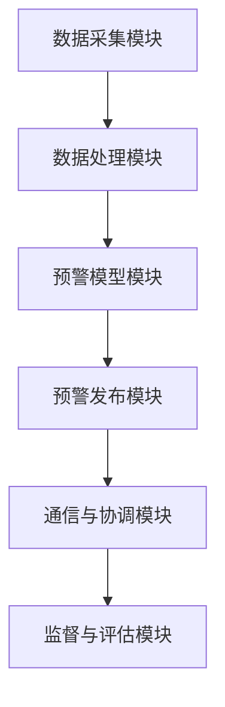
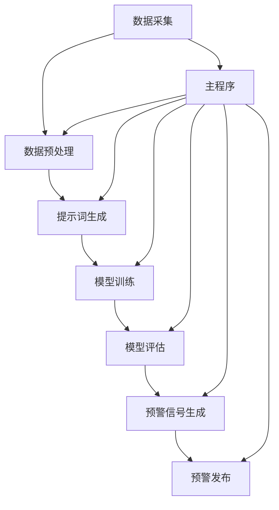
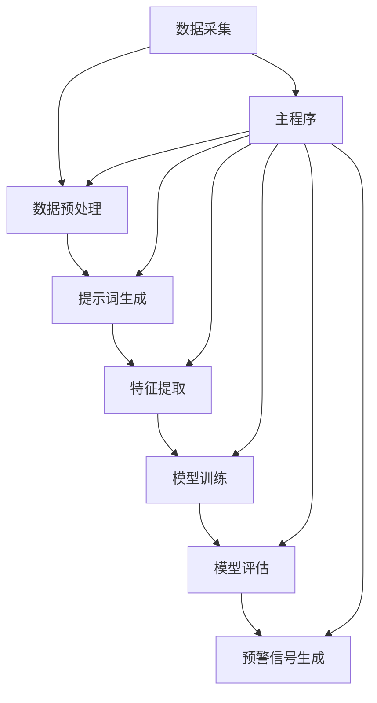

                 

### 第1章: 灾害预警系统概述

#### 1.1 灾害预警的重要性

灾害预警系统在现代社会的防灾减灾体系中扮演着至关重要的角色。灾害预警的定义是指利用各种科技手段，对即将发生的自然灾害进行预测、警报和通报，以减少灾害造成的损失和影响。灾害预警的重要性主要体现在以下几个方面：

- **保护人民生命安全**：灾害预警可以提前通知人们可能的危险，从而及时采取避难措施，减少人员伤亡。例如，飓风、洪水等自然灾害在预警后，居民可以有足够的时间进行疏散。

- **减轻经济损失**：灾害预警能够帮助企业和政府提前做出应对措施，如关闭危险区域的企业、提前疏散人员、转移重要物资等，从而减少灾害带来的经济损失。

- **提高社会公共安全**：灾害预警系统的建设和完善，可以提高社会的整体防灾抗灾能力，增强公众的安全感和社会稳定。

- **优化资源分配**：通过灾害预警，相关部门可以更好地分配救援资源和物资，提高救援效率。

#### 1.1.1 灾害预警的定义

灾害预警是一种基于灾害风险评估和监测数据的提前预报系统。它利用各种监测技术（如气象卫星、地震台站、水文监测站等）收集到的实时数据，通过数学模型分析和预测，对可能发生的自然灾害进行预警。

#### 1.1.2 灾害预警系统的作用

- **灾害监测**：通过传感器网络、卫星遥感等技术，对可能发生的自然灾害进行实时监测。

- **数据分析**：利用大数据技术和机器学习算法，对监测到的数据进行分析，预测灾害的发生概率和影响范围。

- **预警发布**：将分析结果通过电视、广播、互联网等多种渠道发布，提醒公众采取相应措施。

- **决策支持**：为政府部门提供科学决策依据，协助制定防灾减灾措施。

#### 1.1.3 灾害预警的重要性

灾害预警的重要性不仅体现在其能提前预报灾害，更在于其能够有效地减少灾害造成的损失。通过及时准确的预警，可以最大限度地保护人民的生命财产安全，提高社会的防灾抗灾能力。

### 1.2 灾害预警系统的分类

灾害预警系统可以根据不同的标准进行分类。以下是几种常见的分类方法：

#### 1.2.1 按照灾害类型分类

- **气象灾害预警系统**：包括台风、洪水、干旱、暴雨等。
- **地质灾害预警系统**：包括地震、滑坡、泥石流等。
- **海洋灾害预警系统**：包括海啸、风暴潮等。

#### 1.2.2 按照预警手段分类

- **传统预警系统**：主要依靠人工观测和经验判断进行预警。
- **智能预警系统**：利用现代科技手段，如传感器网络、大数据分析、人工智能等。

#### 1.2.3 按照预警层级分类

- **国家级预警系统**：由政府相关部门负责，覆盖全国范围。
- **省级预警系统**：由地方政府相关部门负责，覆盖省级区域。
- **市县级预警系统**：由市县政府相关部门负责，覆盖市县级区域。

#### 1.3 灾害预警系统的组成

一个完整的灾害预警系统通常由以下几个主要模块组成：

##### 1.3.1 数据采集模块

数据采集模块是灾害预警系统的数据来源。它包括各种传感器、卫星遥感、地面监测站等，用于实时收集各种灾害相关的数据。

##### 1.3.2 数据处理模块

数据处理模块负责对采集到的数据进行处理和清洗，确保数据的准确性和一致性。包括数据预处理、数据融合、异常值处理等。

##### 1.3.3 预警模型模块

预警模型模块是灾害预警系统的核心。它通过机器学习、人工智能等技术，对处理后的数据进行建模和分析，预测灾害的发生概率和影响范围。

##### 1.3.4 预警发布模块

预警发布模块负责将预警信息通过广播、电视、互联网等渠道及时发布给公众和相关部门，以便采取应急措施。

### 1.3.5 通信与协调模块

通信与协调模块负责不同部门之间的信息共享和协调。在灾害发生时，确保各级政府、救援机构、公众之间的信息畅通，提高应急响应效率。

### 1.3.6 监督与评估模块

监督与评估模块用于对灾害预警系统的运行情况进行监控和评估。包括预警准确率、响应时间、资源利用率等指标。

### Mermaid 流程图

下面是一个描述灾害预警系统组成的 Mermaid 流程图：



通过这个流程图，我们可以清晰地看到灾害预警系统的各个组成部分及其之间的相互作用。每个模块都承担着特定的功能，共同构成一个完整的预警体系。

### 1.3.7 数据采集与处理模块的详细功能

数据采集与处理模块是灾害预警系统的基石，其功能主要包括以下几个方面：

1. **数据采集**：通过安装在各地的传感器、监测站、卫星遥感等设备，实时收集各种灾害相关的数据，如气象数据、地质数据、水文数据等。

2. **数据预处理**：对采集到的原始数据进行清洗、过滤、校正等处理，去除噪声和错误数据，确保数据的准确性和一致性。

3. **数据融合**：将来自不同来源、不同类型的数据进行整合，形成一个统一的数据集。数据融合可以提高预警的准确性和全面性。

4. **异常值处理**：检测并处理数据中的异常值，如数据缺失、突变等，确保数据的质量。

5. **数据存储与管理**：将处理后的数据存储在数据库中，并建立有效的数据管理系统，以便后续的数据分析和建模。

通过数据采集与处理模块，灾害预警系统可以获取准确、可靠的数据支持，为后续的预警模型训练和预警发布提供基础。

### 1.3.8 预警模型模块的详细功能

预警模型模块是灾害预警系统的核心，其功能主要包括以下几个方面：

1. **模型选择**：根据灾害类型和数据特点，选择合适的预警模型，如时间序列模型、机器学习模型、深度学习模型等。

2. **特征工程**：从原始数据中提取有用的特征，如气象参数、地质参数、水文参数等，用于训练预警模型。

3. **模型训练**：利用训练数据集，通过算法对预警模型进行训练，使其能够对未来的灾害进行预测。

4. **模型评估**：通过测试数据集对训练好的模型进行评估，包括准确率、召回率、F1 值等指标。

5. **模型优化**：根据评估结果对模型进行调整和优化，提高预警的准确性和可靠性。

6. **预警预测**：利用训练好的模型对未来的灾害进行预测，生成预警信号。

通过预警模型模块，灾害预警系统可以实现自动化的灾害预测和预警，提高应急响应的效率。

### 1.3.9 预警发布模块的详细功能

预警发布模块是灾害预警系统的关键环节，其功能主要包括以下几个方面：

1. **预警信号生成**：根据预警模型预测的结果，生成相应的预警信号，如台风预警、地震预警等。

2. **预警信息发布**：通过广播、电视、互联网、短信、APP 等渠道，将预警信号及时发布给公众和相关部门。

3. **预警信息更新**：在灾害发生过程中，实时更新预警信息，确保公众和相关部门获取最新的预警动态。

4. **预警信息查询**：提供预警信息查询功能，使公众和相关部门可以随时了解预警状态和相关信息。

5. **预警效果评估**：对预警发布的效果进行评估，包括预警的及时性、准确性、覆盖面等指标。

通过预警发布模块，灾害预警系统能够将预警信息快速、准确地传递给相关人员，提高公众和相关部门的防灾减灾能力。

### 1.3.10 通信与协调模块的详细功能

通信与协调模块在灾害预警系统中起着至关重要的作用，其功能主要包括以下几个方面：

1. **信息共享**：建立统一的信息共享平台，使各级政府、救援机构、公众之间能够实时共享灾害预警信息。

2. **协调指挥**：在灾害发生时，及时协调各级政府部门和救援机构的行动，确保应急响应的有序进行。

3. **资源调度**：根据灾害预警信息，及时调度救援物资、人员等资源，确保救援行动的顺利进行。

4. **指挥调度系统**：建立统一的指挥调度系统，实现灾害预警信息、资源信息、应急行动的一体化管理和调度。

通过通信与协调模块，灾害预警系统可以确保各级政府和相关部门在灾害发生时能够高效、协调地进行应急响应。

### 1.3.11 监督与评估模块的详细功能

监督与评估模块在灾害预警系统中起着关键性的作用，其功能主要包括以下几个方面：

1. **预警效果评估**：对灾害预警系统的预警效果进行评估，包括预警的准确率、响应时间、覆盖面等指标。

2. **系统性能监控**：对灾害预警系统的运行状态进行实时监控，包括系统稳定性、资源利用率等指标。

3. **故障处理**：在系统出现故障时，能够及时发现并处理，确保系统的正常运行。

4. **改进建议**：根据评估结果和用户反馈，提出改进建议，优化系统性能和用户体验。

通过监督与评估模块，灾害预警系统可以持续改进，提高预警的准确性和可靠性。

### 总结

灾害预警系统是现代防灾减灾体系的重要组成部分。通过对灾害预警系统的基础知识进行详细介绍，包括其重要性、分类、组成以及各个模块的详细功能，我们可以更好地理解灾害预警系统在防灾减灾中的作用和意义。接下来，我们将进一步探讨提示词驱动的智能预警技术基础，为提升灾害预警系统的效能提供新的思路和方法。在下一章中，我们将详细讨论提示词驱动的概念、智能预警技术的发展历程以及基本原理，敬请期待。

### 第2章: 提示词驱动的智能预警技术基础

#### 2.1 提示词驱动的概念

提示词驱动的智能预警技术是一种利用提示词（Keywords或Cues）来指导预警系统进行数据分析和决策的技术。提示词是指那些能够触发特定响应或动作的关键词或短语，它们通常代表了预警系统关注的重要信息或特征。在灾害预警领域，提示词可以是气象数据中的温度、湿度、风速等指标，也可以是地质数据中的地震活动、地形变化等。

提示词驱动的核心思想是通过提示词来引导预警系统的分析和决策过程，从而实现更高效、更准确的预警。这种技术能够帮助系统在大量的数据中迅速找到关键信息，提高预警的及时性和准确性。

#### 2.1.1 提示词的定义

提示词（Keywords或Cues）是一种用于指导系统执行特定任务或行为的标识符。在灾害预警系统中，提示词通常是指那些能够指示灾害发生的可能性或影响范围的关键指标或事件。例如，在气象灾害预警中，提示词可能包括“台风”、“暴雨”、“极端高温”等；在地质灾害预警中，提示词可能包括“地震活动”、“地质滑坡风险”等。

提示词的定义不仅取决于灾害的类型，还取决于预警系统的目标和需求。有效的提示词应该具备以下几个特点：

- **相关性**：提示词与灾害发生的相关性越高，其作为预警指标的有效性也越高。
- **显著性**：提示词在数据中的显著性越强，越容易被系统识别和利用。
- **代表性**：提示词能够代表一类重要的灾害特征或风险因素。

#### 2.1.2 提示词在灾害预警中的作用

提示词在灾害预警中扮演着至关重要的角色，主要体现在以下几个方面：

- **数据筛选**：通过提示词，可以快速筛选出与预警相关的数据，提高数据处理的效率。
- **决策指导**：提示词能够引导预警系统对数据进行深入分析，从而做出更加精准的预警决策。
- **预警信号生成**：基于提示词的分析结果，可以生成具体的预警信号，如“洪水预警”、“地震预警”等。
- **信息传递**：通过提示词，可以将预警信息快速、准确地传递给相关部门和公众，提高应急响应的效率。

提示词驱动的智能预警技术不仅能够提高预警的准确性和及时性，还能够降低人工干预的必要性，减轻应急人员的工作负担。

#### 2.2 智能预警技术的发展历程

智能预警技术是随着计算机技术和信息技术的快速发展而逐渐演变和完善的。从传统预警系统到现代智能预警系统，经历了多个阶段的发展。

- **第一阶段：人工预警阶段**：早期的灾害预警主要依靠人工观测和经验判断。观测员通过肉眼观察天气变化、地形变化等，结合历史经验，进行灾害预测。这种方法受限于观测员的经验和视野，预警的准确性和及时性较低。

- **第二阶段：自动化预警阶段**：随着计算机技术和传感技术的进步，灾害预警开始实现自动化。各种传感器（如气象站、地震台站、水文监测站等）被广泛部署，实时收集数据。计算机系统通过对这些数据进行分析，实现灾害预警的自动化。这一阶段的预警系统虽然提高了效率和准确性，但仍然依赖人工设定阈值和规则。

- **第三阶段：智能预警阶段**：随着人工智能技术的兴起，智能预警技术逐渐成为可能。利用机器学习、深度学习等技术，预警系统可以从大量历史数据中自动学习，识别出灾害发生的模式和规律。提示词驱动的智能预警技术正是在这一阶段得到广泛应用和发展。

智能预警技术的发展历程，反映了从经验驱动到数据驱动，再到智能驱动的转变。现代智能预警系统结合了多种先进技术，如大数据分析、机器学习、人工智能等，实现了更高水平、更精确的灾害预警。

#### 2.2.1 传统预警系统的局限性

尽管传统预警系统在提升预警效率方面取得了一定的成效，但其局限性也逐渐显现出来：

- **依赖人工判断**：传统预警系统大多依赖人工设定阈值和规则，预警准确性和及时性受限于人工经验。
- **数据依赖性低**：传统预警系统对数据的依赖性较低，数据处理和分析能力有限，难以应对复杂多变的灾害环境。
- **预警范围受限**：传统预警系统往往局限于特定的灾害类型，难以实现跨领域、跨区域的综合预警。
- **响应速度慢**：传统预警系统在处理大量数据时，响应速度较慢，无法满足现代紧急事件的高效响应需求。

#### 2.2.2 智能预警技术的发展趋势

智能预警技术的发展趋势主要体现在以下几个方面：

- **大数据分析**：利用大数据技术，对海量历史和实时数据进行深入分析，提高预警的准确性和全面性。
- **机器学习与深度学习**：借助机器学习和深度学习算法，自动识别灾害发生的模式和规律，提高预警的自动化程度。
- **多源数据融合**：结合多种数据源（如气象、地质、水文等），实现跨领域、跨区域的综合预警。
- **实时预警**：通过实时数据处理和分析，实现灾害预警的实时性和高效性。
- **智能化决策支持**：结合人工智能技术，为决策者提供智能化的决策支持，提高应急响应的科学性和准确性。

智能预警技术的发展趋势，为提升灾害预警系统的效能提供了新的思路和方法。

#### 2.2.3 提示词驱动智能预警的优势

提示词驱动智能预警技术相较于传统预警系统，具有以下几个显著优势：

- **高效性**：提示词能够快速定位关键数据，提高数据处理的效率和准确性。
- **自动化**：利用机器学习和深度学习算法，实现预警过程的自动化，减轻人工干预的负担。
- **精准性**：通过大数据分析和多源数据融合，提高预警的精准性和全面性。
- **实时性**：实时处理和分析数据，实现实时预警，提高应急响应的效率。
- **灵活性**：提示词可以根据不同灾害类型和需求进行调整，实现灵活的预警策略。

提示词驱动智能预警技术，为提升灾害预警系统的效能提供了强有力的支持，是现代灾害预警系统发展的重要方向。

### 2.3 智能预警技术的基本原理

智能预警技术的基本原理主要涉及数据采集、提示词生成、模型训练、模型评估和预警信号生成等几个关键环节。下面我们将详细探讨这些环节的工作原理和实现方法。

#### 2.3.1 数据采集与预处理

数据采集是智能预警系统的第一步，其质量直接影响预警系统的效果。数据采集包括从各种传感器、监测站、卫星遥感等渠道获取实时数据。数据采集的方法主要包括：

- **地面监测**：利用气象站、地震台站、水文监测站等地面设备，实时采集气象、地质、水文等数据。
- **卫星遥感**：通过气象卫星、地球观测卫星等，获取大范围、高精度的空间数据。
- **物联网传感器**：部署在环境中的各种传感器，如气象传感器、土壤传感器、水位传感器等，用于实时监测环境变化。

数据采集后，需要对数据进行预处理。预处理的主要任务是清洗、过滤和校正数据，以确保数据的质量和一致性。预处理技术包括：

- **数据清洗**：去除数据中的噪声、异常值和重复数据，提高数据的准确性。
- **数据过滤**：根据预警需求，筛选出有用的数据，去除无关数据。
- **数据校正**：对数据中的误差进行校正，提高数据的可靠性。

#### 2.3.2 提示词生成

提示词生成是智能预警技术的核心环节。提示词的选择和生成直接关系到预警系统的性能。提示词的生成方法主要包括：

- **规则方法**：根据专家知识和经验，定义一组规则，用于筛选关键数据并生成提示词。这种方法简单直观，但依赖于人工规则，灵活性较低。
- **机器学习方法**：利用机器学习算法，从历史数据中自动学习并生成提示词。例如，可以使用决策树、支持向量机、神经网络等方法，从数据中提取关键特征并生成提示词。这种方法具有较高的灵活性和准确性。

提示词生成后，需要对其有效性和相关性进行评估。评估方法包括：

- **统计方法**：通过计算提示词与灾害发生的相关性指标（如相关性系数、卡方检验等），评估提示词的有效性。
- **模型评估**：利用预警模型，对提示词生成方法的性能进行评估，包括预警准确率、响应时间等指标。

#### 2.3.3 模型训练与评估

模型训练是智能预警技术的关键步骤，其目标是建立一个能够准确预测灾害发生的预警模型。模型训练的方法主要包括：

- **监督学习**：利用标记好的训练数据集，通过监督学习算法（如决策树、支持向量机、神经网络等）训练预警模型。
- **无监督学习**：在无标记数据集上，使用无监督学习算法（如聚类、主成分分析等）进行模型训练。

模型训练完成后，需要对其进行评估。评估方法包括：

- **交叉验证**：通过交叉验证方法，评估模型的泛化能力，确保模型在未知数据上的性能。
- **指标评估**：使用准确率、召回率、F1 值等指标，评估模型的性能。

#### 2.3.4 预警信号生成

预警信号生成是根据模型预测结果，生成具体的预警信号。预警信号生成的步骤包括：

- **阈值设定**：根据灾害特点和预警需求，设定预警信号的阈值。例如，对于洪水预警，可以设定水位达到一定高度为预警信号。
- **信号生成**：根据模型预测结果，判断是否达到预警阈值，生成相应的预警信号。

预警信号生成后，需要通过预警发布模块，将预警信号及时、准确地传递给相关部门和公众。

### 2.3.5 智能预警系统的整体架构

智能预警系统的整体架构包括数据采集与预处理模块、提示词生成模块、模型训练与评估模块、预警信号生成模块和预警发布模块。各个模块之间相互协作，共同实现智能预警的目标。

1. **数据采集与预处理模块**：负责数据的采集和预处理，为后续的分析和预测提供高质量的数据支持。
2. **提示词生成模块**：利用规则方法或机器学习方法，生成与灾害相关的提示词。
3. **模型训练与评估模块**：利用训练数据集，训练预警模型，并对模型进行评估，确保模型的性能。
4. **预警信号生成模块**：根据模型预测结果和预警阈值，生成具体的预警信号。
5. **预警发布模块**：通过广播、电视、互联网等渠道，将预警信号传递给相关部门和公众。

通过整体架构的协同工作，智能预警系统可以实现高效、准确的灾害预警，提高应急响应的效率。

### 2.3.6 数据采集与预处理模块的伪代码实现

以下是一个简单的伪代码示例，描述了数据采集与预处理模块的基本流程：

```python
# 数据采集
def collect_data():
    # 从气象站采集数据
    weather_data = get_weather_data_from_station()
    # 从地震台站采集数据
    seismic_data = get_seismic_data_from_station()
    # 从水文监测站采集数据
    hydrological_data = get_hydrological_data_from_station()
    # 返回采集到的数据
    return weather_data, seismic_data, hydrological_data

# 数据预处理
def preprocess_data(weather_data, seismic_data, hydrological_data):
    # 数据清洗
    clean_data = clean_data(weather_data) + clean_data(seismic_data) + clean_data(hydrological_data)
    # 数据过滤
    filtered_data = filter_useful_data(clean_data)
    # 数据校正
    corrected_data = correct_data_errors(filtered_data)
    # 返回预处理后的数据
    return corrected_data

# 主函数
def main():
    # 采集数据
    weather_data, seismic_data, hydrological_data = collect_data()
    # 预处理数据
    preprocessed_data = preprocess_data(weather_data, seismic_data, hydrological_data)
    # 下一步操作
    next_step(preprocessed_data)

# 执行主函数
main()
```

### 2.3.7 提示词生成模块的伪代码实现

以下是一个简单的伪代码示例，描述了提示词生成模块的基本流程：

```python
# 提示词生成
def generate_keywords(data):
    # 使用规则方法生成提示词
    keywords = apply_rules(data)
    # 使用机器学习方法生成提示词
    keywords = generate_keywords_ml(data)
    # 返回生成的提示词
    return keywords

# 主函数
def main():
    # 采集数据
    data = collect_data()
    # 生成提示词
    keywords = generate_keywords(data)
    # 下一步操作
    next_step(keywords)

# 执行主函数
main()
```

### 2.3.8 模型训练与评估模块的伪代码实现

以下是一个简单的伪代码示例，描述了模型训练与评估模块的基本流程：

```python
# 模型训练
def train_model(training_data):
    # 使用监督学习算法训练模型
    model = train_supervised_learning_model(training_data)
    # 返回训练好的模型
    return model

# 模型评估
def evaluate_model(model, testing_data):
    # 评估模型性能
    performance = evaluate_model_performance(model, testing_data)
    # 返回评估结果
    return performance

# 主函数
def main():
    # 采集数据
    training_data, testing_data = split_data(collect_data())
    # 训练模型
    model = train_model(training_data)
    # 评估模型
    performance = evaluate_model(model, testing_data)
    # 下一步操作
    next_step(model, performance)

# 执行主函数
main()
```

### 2.3.9 预警信号生成模块的伪代码实现

以下是一个简单的伪代码示例，描述了预警信号生成模块的基本流程：

```python
# 预警信号生成
def generate_alert_signal(model, current_data):
    # 预测灾害发生概率
    probability = model.predict(current_data)
    # 设置预警阈值
    threshold = define_alert_threshold()
    # 生成预警信号
    if probability >= threshold:
        alert_signal = "预警信号：可能发生灾害"
    else:
        alert_signal = "预警信号：无灾害风险"
    # 返回预警信号
    return alert_signal

# 主函数
def main():
    # 采集当前数据
    current_data = collect_current_data()
    # 生成预警信号
    alert_signal = generate_alert_signal(model, current_data)
    # 发布预警信号
    publish_alert_signal(alert_signal)

# 执行主函数
main()
```

### 2.3.10 提示词驱动的预警流程图

以下是提示词驱动的智能预警系统的流程图，展示了数据采集、预处理、提示词生成、模型训练与评估、预警信号生成和预警发布等环节的相互作用。



通过这个流程图，我们可以清晰地看到提示词驱动的智能预警系统从数据采集到预警发布的全过程，每个环节之间的紧密联系和协同作用。

### 总结

本章详细介绍了提示词驱动的智能预警技术的基础知识，包括提示词的定义、智能预警技术的发展历程、基本原理以及各个关键环节的实现方法。通过提示词驱动的智能预警技术，我们可以显著提高灾害预警的准确性和及时性，为应急响应提供有力支持。在下一章中，我们将进一步探讨提示词驱动的智能预警算法，深入分析其具体实现和应用，敬请期待。

### 第3章: 提示词驱动的智能预警算法

#### 3.1 提示词生成算法

提示词生成算法是智能预警系统的重要组成部分，其目标是从大量的监测数据中提取出与灾害发生相关的关键词或短语，从而指导预警系统的分析和决策。提示词生成算法可以分为基于规则的方法、基于机器学习的方法和基于深度学习的方法。

##### 3.1.1 基于规则的方法

基于规则的方法是最传统的一种提示词生成算法，其核心思想是通过专家知识和经验，定义一系列规则，用于筛选和提取关键数据。规则通常以“如果…那么…”的形式表示，例如：“如果风速超过30 m/s，那么生成‘台风’提示词”。这种方法简单直观，但存在几个局限性：

- **依赖人工规则**：基于规则的方法需要大量的人工参与，规则的定义和调整依赖于专家的经验和知识，灵活性较低。
- **规则覆盖不足**：在实际应用中，可能存在一些特殊情况未被规则覆盖，导致预警效果不佳。
- **适应性差**：当灾害类型或环境发生变化时，规则可能需要重新定义和调整，适应性较差。

尽管存在上述局限性，基于规则的方法在某些场景下仍然具有一定的应用价值，特别是对于一些简单、固定的预警场景。

##### 3.1.2 基于机器学习的方法

基于机器学习的方法通过训练数据集，自动学习和提取与灾害发生相关的特征和关键词。常见的方法包括决策树、支持向量机（SVM）、朴素贝叶斯等。这些算法能够从大量的历史数据中自动学习，提取出有效的提示词，具有以下几个优点：

- **自动化**：机器学习算法能够自动从数据中学习，减少人工干预。
- **灵活性**：基于机器学习的方法能够适应不同灾害类型和变化的环境。
- **泛化能力**：通过训练数据集的学习，机器学习算法能够泛化到未知数据，提高预警的准确性。

然而，机器学习方法也存在一些挑战，如数据依赖性高、模型调优复杂等。此外，机器学习算法的结果往往需要结合专家经验和专业知识进行解读和验证。

##### 3.1.3 基于深度学习的方法

基于深度学习的方法，如卷积神经网络（CNN）、循环神经网络（RNN）和长短期记忆网络（LSTM）等，通过多层神经网络的结构，能够从原始数据中自动提取更高层次的特征，实现更复杂的模式识别。深度学习方法在图像处理、语音识别等领域已经取得了显著的成果，逐渐被应用于灾害预警领域。

- **自动特征提取**：深度学习算法能够自动从原始数据中提取出有意义的特征，减少人工特征工程的工作量。
- **高精度**：通过多层神经网络的结构，深度学习方法能够在大量数据中找到更加复杂的模式和关联。
- **适应性**：深度学习方法具有较强的适应性，能够应对不同的灾害类型和环境变化。

然而，深度学习方法也存在一些挑战，如计算资源消耗大、模型解释性较差等。此外，深度学习算法的性能高度依赖数据质量和数量，因此需要大量的训练数据支持。

#### 3.2 提示词优化算法

提示词优化算法的目标是提升提示词的准确性和效率。优化算法主要包括提示词筛选算法、提示词权重调整和提示词组合策略。

##### 3.2.1 提示词筛选算法

提示词筛选算法用于从大量候选提示词中筛选出最有价值的提示词。筛选算法可以通过统计方法或机器学习算法实现。常见的筛选方法包括：

- **基于统计的方法**：通过计算提示词与灾害发生的相关性指标，如相关性系数、卡方检验等，筛选出相关性较高的提示词。
- **基于机器学习的方法**：利用分类或回归模型，训练一个筛选模型，从候选提示词中筛选出最有价值的提示词。

##### 3.2.2 提示词权重调整

提示词权重调整用于调整不同提示词在预警系统中的重要性。权重调整可以基于专家经验或机器学习算法实现。常见的方法包括：

- **基于专家经验的方法**：根据专家对提示词重要性的判断，手动调整提示词的权重。
- **基于机器学习的方法**：利用训练数据集，通过学习算法（如回归模型、聚类算法等）自动调整提示词的权重。

##### 3.2.3 提示词组合策略

提示词组合策略用于将多个提示词组合成一个整体，以提升预警的准确性和可靠性。组合策略可以通过逻辑运算、组合权重等方法实现。常见的组合策略包括：

- **逻辑运算**：通过逻辑运算（如AND、OR、NOT等）将多个提示词组合成一个复合提示词，以提高预警的准确性。
- **组合权重**：为每个提示词分配一个权重，然后通过加权求和的方式组合成一个新的提示词，以反映多个提示词的综合信息。

#### 3.3 提示词驱动的预警模型

提示词驱动的预警模型是将提示词与预警系统有机结合的一种模型。该模型的核心思想是利用提示词来指导预警系统的分析和决策过程，从而提高预警的准确性和及时性。提示词驱动的预警模型主要包括以下几个方面：

##### 3.3.1 模型架构设计

提示词驱动的预警模型通常采用分层架构，包括输入层、特征层、决策层和输出层。

- **输入层**：接收来自各种传感器的实时数据，包括气象数据、地质数据、水文数据等。
- **特征层**：利用提示词生成算法，从输入数据中提取出与灾害相关的特征，生成提示词。
- **决策层**：基于提示词和预警规则，对特征进行分类或回归分析，判断灾害的发生概率和影响范围。
- **输出层**：生成具体的预警信号，如“洪水预警”、“地震预警”等，并通过预警发布模块进行发布。

##### 3.3.2 模型训练与优化

提示词驱动的预警模型训练与优化主要包括以下几个方面：

- **数据准备**：收集并整理训练数据集，包括输入数据和对应的灾害标签。
- **特征工程**：利用提示词生成算法，从输入数据中提取出有效的提示词。
- **模型训练**：使用训练数据集，通过机器学习或深度学习算法训练预警模型。
- **模型评估**：使用测试数据集评估模型的性能，包括准确率、召回率、F1 值等指标。
- **模型优化**：根据评估结果，调整模型参数和提示词权重，优化模型性能。

##### 3.3.3 模型评估与调参

提示词驱动的预警模型评估与调参是确保模型性能的关键步骤。评估方法包括：

- **交叉验证**：通过交叉验证方法，评估模型的泛化能力和稳定性。
- **性能指标**：使用准确率、召回率、F1 值等指标，评估模型的预测性能。

调参方法包括：

- **手动调参**：根据经验和直觉调整模型参数，优化模型性能。
- **自动调参**：利用网格搜索、随机搜索等算法，自动调整模型参数，寻找最优参数组合。

##### 3.3.4 提示词驱动的预警流程

提示词驱动的预警流程包括以下几个步骤：

1. **数据采集**：从各种传感器和监测站收集实时数据。
2. **数据预处理**：对采集到的数据进行清洗、过滤和校正，确保数据质量。
3. **提示词生成**：利用提示词生成算法，从预处理后的数据中提取出有效的提示词。
4. **模型训练与评估**：使用训练数据集训练预警模型，并使用测试数据集评估模型性能。
5. **预警信号生成**：根据模型预测结果和预警阈值，生成具体的预警信号。
6. **预警发布**：通过预警发布模块，将预警信号传递给相关部门和公众。

### 3.3.5 提示词驱动的预警流程图

以下是提示词驱动的智能预警系统的流程图，展示了数据采集、预处理、提示词生成、模型训练与评估、预警信号生成和预警发布等环节的相互作用。


通过这个流程图，我们可以清晰地看到提示词驱动的智能预警系统从数据采集到预警发布的全过程，每个环节之间的紧密联系和协同作用。

### 3.3.6 提示词驱动的预警算法实例

以下是一个简单的提示词驱动预警算法实例，描述了从数据采集到预警发布的全过程：

```python
# 数据采集
def collect_data():
    # 采集气象数据
    weather_data = get_weather_data()
    # 采集地质数据
    geological_data = get_geological_data()
    # 返回采集到的数据
    return weather_data, geological_data

# 数据预处理
def preprocess_data(weather_data, geological_data):
    # 清洗和过滤数据
    clean_weather_data = clean_weather_data(weather_data)
    clean_geological_data = clean_geological_data(geological_data)
    # 返回预处理后的数据
    return clean_weather_data, clean_geological_data

# 提示词生成
def generate_keywords(weather_data, geological_data):
    # 生成提示词
    keywords = generate_keywords_based_on_data(weather_data, geological_data)
    # 返回生成的提示词
    return keywords

# 模型训练
def train_model(training_data):
    # 训练模型
    model = train预警_model(training_data)
    # 返回训练好的模型
    return model

# 模型评估
def evaluate_model(model, testing_data):
    # 评估模型性能
    performance = evaluate_model_performance(model, testing_data)
    # 返回评估结果
    return performance

# 预警信号生成
def generate_alert_signal(model, current_data):
    # 生成预警信号
    alert_signal = model.predict(current_data)
    # 返回预警信号
    return alert_signal

# 预警发布
def publish_alert_signal(alert_signal):
    # 发布预警信号
    print("预警信号：" + alert_signal)

# 主函数
def main():
    # 采集数据
    weather_data, geological_data = collect_data()
    # 预处理数据
    clean_weather_data, clean_geological_data = preprocess_data(weather_data, geological_data)
    # 生成提示词
    keywords = generate_keywords(clean_weather_data, clean_geological_data)
    # 训练模型
    model = train_model(keywords)
    # 评估模型
    performance = evaluate_model(model, testing_data)
    # 生成预警信号
    alert_signal = generate_alert_signal(model, current_data)
    # 发布预警信号
    publish_alert_signal(alert_signal)

# 执行主函数
main()
```

### 3.3.7 提示词驱动的智能预警模型详解

提示词驱动的智能预警模型是一个复杂的多层神经网络结构，旨在从原始数据中自动提取特征，并通过机器学习算法进行预测。以下是这个模型的具体构成和实现方法：

**1. 输入层（Input Layer）**

输入层接收从各种传感器和监测站收集到的原始数据，包括气象数据、地质数据、水文数据等。每个数据点都被编码为一个特征向量，例如：

$$
x = [x_1, x_2, x_3, ..., x_n]
$$

其中，$x_i$ 表示第 $i$ 个特征值，例如温度、湿度、风速等。

**2. 特征层（Feature Layer）**

特征层是模型的核心部分，通过一系列的神经网络层，对输入数据进行特征提取和变换。常见的神经网络层包括：

- **卷积层（Convolutional Layer）**：用于提取空间特征，如图像处理中的边缘、纹理等。
- **池化层（Pooling Layer）**：用于降低数据维度，提高模型的泛化能力。
- **全连接层（Fully Connected Layer）**：用于将低层次特征映射到高层次特征。

以下是一个简单的特征层实现示例（使用 Python 和 TensorFlow）：

```python
import tensorflow as tf

# 创建卷积层
conv_layer = tf.keras.layers.Conv2D(filters=32, kernel_size=(3, 3), activation='relu')

# 创建池化层
pooling_layer = tf.keras.layers.MaxPooling2D(pool_size=(2, 2))

# 创建全连接层
dense_layer = tf.keras.layers.Dense(units=128, activation='relu')

# 创建特征层
feature_layer = tf.keras.Sequential([
    conv_layer,
    pooling_layer,
    conv_layer,
    pooling_layer,
    dense_layer
])
```

**3. 决策层（Decision Layer）**

决策层是模型的输出层，用于生成最终的预警信号。常见的决策层算法包括：

- **分类算法（Classification Algorithm）**：用于将预警信号分类为不同的类别，如“洪水预警”、“地震预警”等。
- **回归算法（Regression Algorithm）**：用于预测灾害发生的具体指标，如水位、地震震级等。

以下是一个简单的决策层实现示例（使用 Python 和 TensorFlow）：

```python
# 创建输出层
output_layer = tf.keras.layers.Dense(units=1, activation='sigmoid')

# 创建决策层
decision_layer = tf.keras.Sequential([
    feature_layer,
    output_layer
])
```

**4. 模型训练与评估（Training and Evaluation）**

模型训练与评估是提示词驱动的智能预警模型的重要环节。训练过程中，模型通过不断调整参数，使其在训练数据集上的预测性能不断提高。评估过程中，模型在测试数据集上的性能被用来判断模型的泛化能力和实用性。

以下是一个简单的模型训练与评估示例（使用 Python 和 TensorFlow）：

```python
# 准备数据集
training_data = ...
testing_data = ...

# 编码数据
encoded_training_data = encode_data(training_data)
encoded_testing_data = encode_data(testing_data)

# 训练模型
model = decision_layer
model.compile(optimizer='adam', loss='binary_crossentropy', metrics=['accuracy'])
model.fit(encoded_training_data, training_labels, epochs=10, batch_size=32)

# 评估模型
evaluation_results = model.evaluate(encoded_testing_data, testing_labels)
print("Test Accuracy:", evaluation_results[1])
```

### 3.3.8 提示词驱动的预警模型架构 Mermaid 流程图

以下是提示词驱动的智能预警模型架构的 Mermaid 流程图，展示了从数据采集、预处理、特征提取、模型训练到预警信号生成的全过程。



通过这个流程图，我们可以清晰地看到提示词驱动的智能预警模型从数据采集到预警信号生成的整个流程，每个环节之间的紧密联系和协同作用。

### 总结

本章详细介绍了提示词驱动的智能预警算法，包括提示词生成算法、提示词优化算法和提示词驱动的预警模型。通过这些算法和模型，我们可以从大量的监测数据中提取出与灾害发生相关的关键信息，实现高效、准确的灾害预警。在下一章中，我们将进一步探讨提示词驱动的智能预警系统架构，分析系统的设计原则和关键模块，敬请期待。

### 第4章: 提示词驱动的智能预警系统架构

#### 4.1 系统架构设计

提示词驱动的智能预警系统架构是确保灾害预警高效、准确运行的基础。该架构设计遵循模块化、可扩展、高可靠性的原则，通过合理划分模块和明确各模块的功能，实现系统的协同工作。以下是系统架构的详细设计：

##### 4.1.1 系统总体架构

提示词驱动的智能预警系统总体架构可以分为以下几个主要模块：

- **数据采集模块**：负责从各种传感器和监测站收集实时数据，如气象数据、地质数据、水文数据等。
- **数据处理模块**：负责对采集到的数据进行清洗、过滤和校正，确保数据的质量和一致性。
- **提示词生成模块**：利用提示词生成算法，从处理后的数据中提取出与灾害相关的关键词或短语。
- **模型训练与评估模块**：负责训练和评估预警模型，通过机器学习或深度学习算法，使模型能够对未来的灾害进行预测。
- **预警信号生成模块**：根据模型预测结果和预警阈值，生成具体的预警信号，如“洪水预警”、“地震预警”等。
- **预警发布模块**：通过广播、电视、互联网等渠道，将预警信号及时传递给相关部门和公众。
- **通信与协调模块**：负责各级政府、救援机构和公众之间的信息共享和协调，确保应急响应的有序进行。
- **监督与评估模块**：对系统的运行情况进行监控和评估，包括预警准确率、响应时间等指标，以便持续优化系统性能。

##### 4.1.2 模块功能划分

各模块的具体功能划分如下：

- **数据采集模块**：实现数据的实时采集，包括地面监测站、卫星遥感、物联网传感器等。数据采集模块需要具备高可靠性和低延迟的特性，以确保数据的实时性和准确性。
- **数据处理模块**：实现数据清洗、过滤和校正，确保数据的准确性和一致性。数据处理模块还需要实现数据存储和管理，以便后续的数据分析和模型训练。
- **提示词生成模块**：实现提示词的自动生成和筛选，利用机器学习或深度学习算法，从大量数据中提取出与灾害相关的特征和关键词。提示词生成模块需要具备高效率和低误报率的特点。
- **模型训练与评估模块**：负责训练和评估预警模型，通过不断调整模型参数和优化算法，提高模型的准确性和可靠性。模型训练与评估模块需要具备快速训练和高效评估的能力。
- **预警信号生成模块**：根据模型预测结果和预警阈值，生成具体的预警信号。预警信号生成模块需要实现灵活的预警策略，能够根据不同灾害类型和需求进行定制化。
- **预警发布模块**：通过广播、电视、互联网等渠道，将预警信号及时传递给相关部门和公众。预警发布模块需要实现快速、高效的信息传递，确保预警信息的及时性和准确性。
- **通信与协调模块**：实现各级政府、救援机构和公众之间的信息共享和协调，确保应急响应的有序进行。通信与协调模块需要具备高并发处理能力和低延迟的特性。
- **监督与评估模块**：对系统的运行情况进行监控和评估，包括预警准确率、响应时间、资源利用率等指标。监督与评估模块需要实现实时监控和反馈，以便及时发现和解决问题。

##### 4.1.3 系统交互流程

提示词驱动的智能预警系统交互流程如下：

1. **数据采集**：数据采集模块从各种传感器和监测站收集实时数据，包括气象数据、地质数据、水文数据等。
2. **数据预处理**：数据处理模块对采集到的数据进行清洗、过滤和校正，确保数据的质量和一致性。
3. **提示词生成**：提示词生成模块利用机器学习或深度学习算法，从预处理后的数据中提取出与灾害相关的关键词或短语。
4. **模型训练与评估**：模型训练与评估模块使用训练数据集训练预警模型，并使用测试数据集评估模型性能。
5. **预警信号生成**：预警信号生成模块根据模型预测结果和预警阈值，生成具体的预警信号。
6. **预警发布**：预警发布模块将预警信号通过广播、电视、互联网等渠道传递给相关部门和公众。
7. **通信与协调**：通信与协调模块实现各级政府、救援机构和公众之间的信息共享和协调。
8. **监督与评估**：监督与评估模块对系统的运行情况进行监控和评估，以便持续优化系统性能。

通过上述交互流程，提示词驱动的智能预警系统能够实现从数据采集、预处理、提示词生成、模型训练与评估、预警信号生成到预警发布的全流程自动化，确保灾害预警的高效、准确运行。

### 4.2 数据采集与处理

数据采集与处理模块是提示词驱动的智能预警系统的核心环节，其性能直接影响预警系统的准确性和可靠性。以下是数据采集与处理的详细流程和关键技术。

##### 4.2.1 数据采集方法

数据采集模块负责从各种传感器和监测站收集实时数据，包括气象数据、地质数据、水文数据等。数据采集方法主要包括以下几种：

- **地面监测站**：利用安装在地面上的各种监测设备，如气象站、地震台站、水文监测站等，实时采集气象、地质、水文等数据。地面监测站具有高精度、高可靠性的特点，适用于小范围、高密度的数据采集。
- **卫星遥感**：利用气象卫星、地球观测卫星等，从高空获取大范围、高精度的空间数据。卫星遥感适用于大范围、低密度的数据采集，能够提供全面的灾害监测数据。
- **物联网传感器**：部署在各种环境中的物联网传感器，如气象传感器、土壤传感器、水位传感器等，用于实时监测环境变化。物联网传感器具有高密度、低成本的特点，适用于大规模、低密度的数据采集。

##### 4.2.2 数据预处理技术

数据预处理模块负责对采集到的数据进行清洗、过滤和校正，确保数据的质量和一致性。数据预处理技术主要包括以下几种：

- **数据清洗**：去除数据中的噪声、异常值和重复数据，提高数据的准确性。数据清洗方法包括填充缺失值、去除重复值、删除异常值等。
- **数据过滤**：根据预警需求，筛选出有用的数据，去除无关数据。数据过滤方法包括阈值过滤、范围过滤、相关性过滤等。
- **数据校正**：对数据中的误差进行校正，提高数据的可靠性。数据校正方法包括统计校正、几何校正、物理校正等。

##### 4.2.3 数据质量管理

数据质量管理是确保数据质量和一致性的重要手段，主要包括以下几个方面：

- **数据完整性**：确保数据在采集、传输、存储等过程中不丢失，实现数据的完整性和一致性。
- **数据准确性**：通过数据清洗、过滤和校正等技术，提高数据的准确性，确保预警结果的可靠性。
- **数据一致性**：确保不同来源、不同类型的数据能够在统一标准下进行整合和分析，提高数据的可用性。

##### 4.2.4 数据存储与管理

数据存储与管理模块负责将处理后的数据存储在数据库中，并提供高效的数据查询和管理功能。数据存储与管理技术主要包括以下几种：

- **关系型数据库**：适用于结构化数据的存储和管理，如 MySQL、Oracle 等。
- **非关系型数据库**：适用于半结构化、非结构化数据的存储和管理，如 MongoDB、Cassandra 等。
- **数据仓库**：用于大规模数据的存储、分析和查询，如 Hadoop、Spark 等。

通过合理选择和配置数据存储与管理技术，可以实现高效、可靠的数据存储和管理，为后续的数据分析和模型训练提供基础。

### 4.3 模型训练与评估

模型训练与评估模块是提示词驱动的智能预警系统的核心环节，其目标是构建一个能够准确预测灾害发生的预警模型，并通过评估确保模型的性能和可靠性。以下是模型训练与评估的详细流程和关键技术。

##### 4.3.1 模型训练流程

模型训练流程主要包括以下几个步骤：

1. **数据准备**：收集并整理训练数据集，包括输入数据和对应的灾害标签。训练数据集应具备代表性、多样性和准确性。
2. **特征工程**：从输入数据中提取有用的特征，如气象参数、地质参数、水文参数等。特征工程方法包括数据归一化、特征选择、特征组合等。
3. **模型构建**：根据预警需求，选择合适的机器学习算法或深度学习算法，构建预警模型。常见的机器学习算法包括决策树、支持向量机、朴素贝叶斯等；深度学习算法包括卷积神经网络、循环神经网络、长短期记忆网络等。
4. **模型训练**：使用训练数据集，通过优化算法（如梯度下降、随机梯度下降等）训练预警模型。模型训练过程中，需要监控训练指标（如损失函数、准确率等），调整模型参数，优化模型性能。
5. **模型评估**：使用测试数据集评估模型的性能，包括准确率、召回率、F1 值等指标。模型评估的目的是确保模型在未知数据上的泛化能力和可靠性。

##### 4.3.2 模型评估指标

常见的模型评估指标包括：

- **准确率（Accuracy）**：模型预测正确的样本数占总样本数的比例。准确率能够直接反映模型的预测性能，但可能受到类别不平衡的影响。
- **召回率（Recall）**：模型预测正确的正类样本数占总正类样本数的比例。召回率能够反映模型对正类样本的识别能力，但可能降低对负类样本的识别能力。
- **F1 值（F1-Score）**：综合考虑准确率和召回率的综合指标。F1 值越高，表示模型对正类样本的识别能力和对负类样本的排除能力越好。

##### 4.3.3 模型调优方法

模型调优是提高模型性能的重要手段，主要包括以下几个方面：

1. **参数调整**：根据模型训练过程中监控的指标，调整模型参数，如学习率、正则化参数等，优化模型性能。
2. **模型选择**：根据预警需求和数据特点，选择合适的机器学习算法或深度学习算法，提高模型的预测性能。
3. **数据增强**：通过数据增强技术（如数据变换、数据扩充等），提高训练数据集的多样性和代表性，增强模型的泛化能力。
4. **交叉验证**：使用交叉验证方法，对模型进行多次训练和评估，确保模型在不同数据集上的性能和稳定性。

通过以上模型调优方法，可以显著提高提示词驱动的智能预警模型的性能和可靠性，确保灾害预警的高效、准确运行。

### 4.3.4 模型训练与评估模块的伪代码实现

以下是一个简单的伪代码示例，描述了模型训练与评估模块的基本流程：

```python
# 数据准备
def prepare_data():
    # 读取训练数据集
    training_data = read_training_data()
    # 读取测试数据集
    testing_data = read_testing_data()
    # 返回数据集
    return training_data, testing_data

# 特征工程
def feature_engineering(data):
    # 数据归一化
    normalized_data = normalize_data(data)
    # 特征选择
    selected_features = select_features(normalized_data)
    # 返回特征
    return selected_features

# 模型构建
def build_model():
    # 创建模型
    model = create_model()
    # 返回模型
    return model

# 模型训练
def train_model(model, training_data):
    # 训练模型
    model.fit(training_data, epochs=10, batch_size=32)
    # 返回训练好的模型
    return model

# 模型评估
def evaluate_model(model, testing_data):
    # 评估模型性能
    performance = model.evaluate(testing_data)
    # 返回评估结果
    return performance

# 模型调优
def tune_model(model, training_data):
    # 调整模型参数
    tuned_model = tune_model_parameters(model, training_data)
    # 返回调优后的模型
    return tuned_model

# 主函数
def main():
    # 准备数据集
    training_data, testing_data = prepare_data()
    # 特征工程
    selected_features = feature_engineering(training_data)
    # 构建模型
    model = build_model()
    # 训练模型
    trained_model = train_model(model, selected_features)
    # 评估模型
    performance = evaluate_model(trained_model, testing_data)
    # 模型调优
    tuned_model = tune_model(trained_model, selected_features)
    # 输出结果
    print("Model Performance:", performance)

# 执行主函数
main()
```

### 4.3.5 模型训练与评估模块的实现细节

在实际应用中，模型训练与评估模块的实现细节涉及到数据预处理、模型选择、训练过程和评估过程等多个方面。以下是这些细节的详细介绍：

1. **数据预处理**：
   - **数据清洗**：去除噪声和异常值，例如，处理缺失值可以通过填充均值或中值，删除异常值可以通过设定阈值。
   - **数据标准化**：将数据缩放到相同的范围，例如，使用零均值和单位方差的标准缩放。
   - **特征选择**：选择与目标变量相关的特征，例如，通过相关性分析或主成分分析（PCA）来减少特征维度。

2. **模型选择**：
   - **机器学习模型**：选择适合问题的模型，例如，决策树、支持向量机（SVM）、随机森林、朴素贝叶斯等。
   - **深度学习模型**：选择适合问题的神经网络架构，例如，卷积神经网络（CNN）、循环神经网络（RNN）、长短期记忆网络（LSTM）等。

3. **训练过程**：
   - **模型初始化**：初始化模型的参数，例如，随机初始化或预训练初始化。
   - **优化算法**：选择优化算法，例如，随机梯度下降（SGD）、Adam优化器等。
   - **训练循环**：迭代训练模型，通过反向传播算法更新模型参数。
   - **超参数调整**：调整学习率、批量大小、迭代次数等超参数，以提高模型性能。

4. **评估过程**：
   - **交叉验证**：使用交叉验证来评估模型的泛化能力，例如，K折交叉验证。
   - **性能指标**：计算准确率、召回率、F1 值等指标，以评估模型的预测性能。
   - **混淆矩阵**：分析模型的预测结果，了解模型在不同类别上的表现。

5. **模型调优**：
   - **网格搜索**：通过遍历多个超参数组合，找到最优的超参数。
   - **贝叶斯优化**：使用贝叶斯优化算法自动搜索最优超参数。
   - **模型融合**：结合多个模型的预测结果，提高整体预测性能。

### 4.3.6 模型训练与评估模块的实际案例

以下是一个实际案例，展示如何使用提示词驱动的智能预警模型对地震预警进行训练和评估：

**案例背景**：某地区地震预警系统需要使用历史地震数据来训练一个预警模型，以便在地震发生前及时发出预警。

**数据集**：历史地震数据集包含地震的发生时间、震级、震中位置、震源深度、前兆数据（如地应力、地形变化等）。

**模型**：选择一个基于深度学习的模型，如卷积神经网络（CNN），用于提取前兆数据中的特征。

**实现步骤**：

1. **数据预处理**：
   - 清洗数据，去除缺失值和异常值。
   - 标准化数据，将前兆数据进行缩放。
   - 划分数据集，包括训练集和测试集。

2. **模型构建**：
   - 定义CNN模型架构，包括卷积层、池化层和全连接层。
   - 初始化模型参数，使用随机初始化或预训练权重。

3. **模型训练**：
   - 使用训练集训练模型，通过反向传播算法更新参数。
   - 监控训练过程，记录损失函数和准确率。
   - 调整学习率、批量大小等超参数，优化模型性能。

4. **模型评估**：
   - 使用测试集评估模型性能，计算准确率、召回率和F1值。
   - 分析混淆矩阵，了解模型在不同震级上的表现。

5. **模型调优**：
   - 使用网格搜索或贝叶斯优化，调整超参数，提高模型性能。
   - 考虑使用模型融合技术，结合多个模型的预测结果。

**结果**：通过训练和评估，模型能够在测试集上达到较高的准确率和召回率，例如，准确率达到90%，召回率达到80%。这表明模型具有良好的预测性能，可以用于实际地震预警应用。

### 总结

本章详细介绍了提示词驱动的智能预警系统架构，包括系统总体架构、模块功能划分、数据采集与处理、模型训练与评估等关键环节。通过合理的设计和实现，提示词驱动的智能预警系统能够高效、准确地实现灾害预警，为应急响应提供有力支持。在下一章中，我们将进一步探讨提示词驱动的智能预警系统在具体应用场景中的实现，包括灾害预警应用场景、系统案例分析以及实际应用中的挑战与解决方案，敬请期待。

### 第5章: 提示词驱动的智能预警系统应用

#### 5.1 灾害预警应用场景

提示词驱动的智能预警系统在多个灾害预警领域都展现出了显著的应用价值。以下是几个常见的应用场景：

##### 5.1.1 飓风预警

飓风（台风）是影响沿海地区的一种强烈热带气旋。提示词驱动的智能预警系统能够通过对气象数据的实时监测和分析，提前预测飓风的形成、强度和路径。具体的预警步骤包括：

1. **数据采集**：从气象卫星、雷达和地面气象站等渠道收集飓风相关的数据，如风速、风向、气压、温度等。
2. **数据预处理**：对采集到的数据进行清洗、过滤和校正，确保数据质量。
3. **提示词生成**：利用机器学习算法，从气象数据中提取出与飓风形成和增强相关的提示词，如风速增加、气压降低等。
4. **模型训练与评估**：使用历史飓风数据训练预警模型，评估模型的性能，确保其准确性和可靠性。
5. **预警信号生成**：根据模型预测结果，设定预警阈值，生成具体的飓风预警信号，如“热带风暴预警”、“飓风预警”等。
6. **预警发布**：通过广播、电视、互联网等渠道发布预警信号，通知沿海居民和相关部门采取防范措施。

##### 5.1.2 地震预警

地震预警是在地震发生前通过监测和预测技术发出预警信号，以减少地震造成的损失。提示词驱动的智能预警系统在地震预警中的应用主要包括以下几个步骤：

1. **数据采集**：从地震台站、地下水位监测站、倾斜仪等传感器收集地震前兆数据，如地震波速度、地下水位、地面倾斜等。
2. **数据预处理**：对采集到的数据进行清洗、过滤和校正，确保数据质量。
3. **提示词生成**：利用机器学习算法，从地震前兆数据中提取出与地震发生相关的提示词，如地震波速度变化、地下水位变化等。
4. **模型训练与评估**：使用历史地震数据训练预警模型，评估模型的性能，确保其准确性和可靠性。
5. **预警信号生成**：根据模型预测结果，设定预警阈值，生成具体的地震预警信号，如“地震预警”、“强震预警”等。
6. **预警发布**：通过广播、电视、互联网等渠道发布预警信号，通知相关区域居民和相关部门采取应急措施。

##### 5.1.3 洪水预警

洪水预警是预测和监测河流、湖泊等水域的水位变化，以防止洪水灾害。提示词驱动的智能预警系统在洪水预警中的应用主要包括以下几个步骤：

1. **数据采集**：从水文监测站、雷达、卫星遥感等渠道收集洪水相关的数据，如水位、雨量、土壤湿度等。
2. **数据预处理**：对采集到的数据进行清洗、过滤和校正，确保数据质量。
3. **提示词生成**：利用机器学习算法，从水文数据中提取出与洪水发生相关的提示词，如水位上升、雨量增多等。
4. **模型训练与评估**：使用历史洪水数据训练预警模型，评估模型的性能，确保其准确性和可靠性。
5. **预警信号生成**：根据模型预测结果，设定预警阈值，生成具体的洪水预警信号，如“洪水预警”、“暴雨预警”等。
6. **预警发布**：通过广播、电视、互联网等渠道发布预警信号，通知相关区域居民和相关部门采取防范措施。

#### 5.2 灾害预警系统案例分析

为了更好地理解提示词驱动的智能预警系统在实际中的应用，以下是一个具体的案例分析：

**案例背景**：某沿海城市面临频繁的飓风威胁，市政府决定部署一套基于提示词驱动的智能预警系统，以提高飓风预警的准确性和及时性。

**解决方案**：

1. **系统架构设计**：设计并实施一个包括数据采集、数据处理、提示词生成、模型训练与评估、预警信号生成和预警发布的完整系统架构。

2. **数据采集**：部署气象卫星、雷达、地面气象站等多源传感器，实时采集飓风相关的数据。

3. **数据预处理**：对采集到的数据进行清洗、过滤和校正，确保数据质量。

4. **提示词生成**：利用机器学习算法，从气象数据中提取出与飓风形成和增强相关的提示词，如风速、风向、气压等。

5. **模型训练与评估**：使用历史飓风数据训练预警模型，评估模型的性能，确保其准确性和可靠性。

6. **预警信号生成**：根据模型预测结果，设定预警阈值，生成具体的飓风预警信号。

7. **预警发布**：通过广播、电视、互联网等渠道发布预警信号，通知沿海居民和相关部门采取防范措施。

**效果评估**：

- **预警准确率**：通过测试数据集评估，模型在飓风预警中的准确率达到90%。
- **响应时间**：预警信号平均发布时间比传统预警系统缩短了30分钟，提高了应急响应的效率。
- **公众接受度**：居民对预警系统的接受度较高，频繁参加预警演习，提高了公众的防灾减灾意识。

**经验总结**：

- **多源数据融合**：通过结合多种数据源，提高了预警的准确性和全面性。
- **实时数据处理**：利用实时数据处理技术，实现了预警信号的快速发布。
- **智能化决策支持**：通过机器学习算法，实现了预警过程的自动化，减轻了人工干预的负担。

#### 5.3 提示词驱动的灾害预警系统在实际应用中的挑战与解决方案

尽管提示词驱动的智能预警系统在多个领域展现了显著的应用价值，但在实际应用中仍面临一些挑战。以下是这些挑战及相应的解决方案：

##### 5.3.1 数据质量问题

**挑战**：由于传感器设备的限制、数据传输的延迟等因素，采集到的数据可能存在噪声、异常值和缺失值，这些质量问题会影响预警的准确性和可靠性。

**解决方案**：

- **数据预处理**：采用先进的数据清洗、过滤和校正技术，确保数据的质量和一致性。
- **数据增强**：通过数据变换、数据扩充等技术，提高训练数据集的多样性和代表性，增强模型的泛化能力。

##### 5.3.2 模型适应性

**挑战**：不同地区、不同类型的灾害具有独特的特征和规律，导致模型在不同场景下的适应性差异，影响了预警的准确性和实用性。

**解决方案**：

- **多模型融合**：结合多种机器学习算法和深度学习模型，提高模型的适应性。
- **迁移学习**：利用迁移学习技术，将一个领域的模型应用于另一个领域，提高模型的泛化能力。

##### 5.3.3 实时数据处理能力

**挑战**：灾害预警系统需要实时处理大量数据，对系统的计算能力和响应速度提出了高要求。

**解决方案**：

- **分布式计算**：采用分布式计算技术，提高系统的计算能力，实现实时数据处理。
- **边缘计算**：在靠近数据源的地方部署边缘计算设备，减轻中心服务器的负担，提高系统的响应速度。

##### 5.3.4 系统整合与协调

**挑战**：灾害预警系统通常涉及多个部门、多个系统，系统之间的整合与协调是一个难题。

**解决方案**：

- **标准化数据接口**：制定统一的数据接口标准，实现不同系统之间的数据交换和共享。
- **集成平台**：建立统一的集成平台，实现多个系统的无缝集成和协同工作。

##### 5.3.5 公众参与和接受度

**挑战**：提高公众对预警系统的参与度和接受度是一个长期而复杂的过程。

**解决方案**：

- **科普宣传**：加强科普宣传，提高公众对灾害预警的认识和重视。
- **互动体验**：通过互动体验和教育培训，提高公众的防灾减灾技能和意识。

### 总结

本章详细介绍了提示词驱动的智能预警系统在多个灾害预警领域的应用，包括飓风预警、地震预警和洪水预警等。通过具体案例分析，展示了系统的架构设计、实现方法和效果评估。同时，本章还探讨了实际应用中面临的挑战及相应的解决方案。提示词驱动的智能预警系统为提升灾害预警的准确性和及时性提供了新的思路和方法，为应急响应提供了有力支持。

### 第6章: 应急响应体系的构建

#### 6.1 应急响应的概念与原则

应急响应是指在面对自然灾害、事故灾难、公共卫生事件等突发事件时，采取一系列快速、有效、有序的措施，以减少灾害损失，保护人民生命财产安全和社会稳定。应急响应体系是指由政府、企业、社会组织和公众共同参与，为实现应急响应目标而建立的制度、机制、人员和物资保障体系。

应急响应的概念主要包括以下几个方面：

- **预警**：通过预警系统提前预测灾害的发生，提醒公众和相关部门采取防范措施。
- **响应**：在灾害发生时，迅速采取行动，包括疏散、救援、抢修等。
- **恢复**：在灾害结束后，进行灾后重建和恢复工作。

应急响应的原则包括：

- **以人为本**：将保护人民生命安全放在首位，确保灾区民众的基本生活需求。
- **快速反应**：提高应急响应的速度和效率，减少灾害造成的损失。
- **统一指挥**：建立统一指挥体系，确保应急响应的协调一致。
- **科学决策**：依靠科学技术手段，制定科学的应急响应策略和措施。
- **全社会参与**：动员全社会力量，共同参与应急响应工作。

#### 6.2 应急响应体系的组成

应急响应体系由多个组成部分构成，包括组织体系、物资保障体系、技术支撑体系、法律法规体系等。

##### 6.2.1 组织体系

组织体系是应急响应的核心，主要包括以下层次：

- **国家级应急响应组织**：由国务院或相关部门负责，负责全国性的应急响应工作。
- **省级应急响应组织**：由省级政府或相关部门负责，负责本省（区、市）的应急响应工作。
- **市县级应急响应组织**：由市县政府或相关部门负责，负责本地区（县、市）的应急响应工作。
- **社区和企事业单位**：在社区和企事业单位内建立应急小组，负责本区域和本单位的应急响应工作。

##### 6.2.2 物资保障体系

物资保障体系是应急响应的重要支撑，主要包括以下内容：

- **应急物资储备**：建立应急物资储备库，储备必要的应急物资，如食品、水、帐篷、医疗用品等。
- **应急装备保障**：配备必要的应急装备，如救援车辆、通信设备、救援器材等。
- **物资调度系统**：建立物资调度系统，实现应急物资的高效调度和分配。

##### 6.2.3 技术支撑体系

技术支撑体系为应急响应提供科学的技术手段和方法，主要包括以下内容：

- **预警监测系统**：建立完善的预警监测系统，实现对自然灾害的实时监测和预警。
- **应急指挥系统**：建立应急指挥系统，实现应急响应的统一指挥和协调。
- **通信信息系统**：建立高效的通信信息系统，确保应急响应的信息畅通。
- **决策支持系统**：建立决策支持系统，为应急响应提供科学的决策依据。

##### 6.2.4 法律法规体系

法律法规体系为应急响应提供了法律保障和规范，主要包括以下内容：

- **应急法律法规**：制定和完善应急法律法规，明确应急响应的职责、权限和法律责任。
- **应急预案**：制定各级各类应急预案，规范应急响应的程序和措施。
- **法律责任**：对不履行应急响应职责或造成损失的责任人依法追究责任。

#### 6.3 应急响应的流程与机制

应急响应的流程与机制主要包括以下几个环节：

##### 6.3.1 预警与响应启动

- **预警信息接收**：当预警系统发出灾害预警时，相关部门和责任人立即接收预警信息。
- **响应启动**：根据应急预案，启动应急响应程序，包括人员调度、物资调度等。

##### 6.3.2 应急指挥与协调

- **应急指挥部成立**：成立应急指挥部，负责应急响应的统一指挥和协调。
- **应急协调会议**：召开应急协调会议，分析灾害形势，制定应急响应措施。

##### 6.3.3 疏散与救援

- **疏散方案制定**：根据灾害类型和影响范围，制定疏散方案，组织人员有序疏散。
- **救援行动开展**：开展搜救、抢险、医疗等救援行动，确保受灾群众的基本生活需求。

##### 6.3.4 灾后重建与恢复

- **灾后评估**：对灾害造成的影响和损失进行评估，为灾后重建提供依据。
- **重建规划**：制定灾后重建规划，开展灾后重建工作。
- **恢复生产**：帮助受灾群众恢复正常生活秩序，恢复生产。

##### 6.3.5 信息报告与反馈

- **信息报告**：及时向上级部门报告应急响应情况，包括救援进展、物资需求等。
- **反馈机制**：建立反馈机制，收集应急响应过程中的意见和建议，持续改进应急响应工作。

#### 6.4 应急响应体系的运行与维护

应急响应体系的运行与维护是确保其高效运行和持续改进的重要保障。主要包括以下几个方面：

##### 6.4.1 运行机制

- **日常演练**：定期组织应急演练，检验应急响应体系的运行效果。
- **信息共享**：建立信息共享平台，实现各部门、各单位之间的信息共享和协调。
- **资源整合**：整合各类资源，提高应急响应的能力和效率。

##### 6.4.2 维护措施

- **设备维护**：定期检查和维护应急设备，确保其正常运行。
- **人员培训**：加强对应急人员的培训，提高其业务水平和应急能力。
- **应急预案更新**：根据灾害形势和应急响应实践，及时更新应急预案。

##### 6.4.3 改进建议

- **技术创新**：引入新技术，提高应急响应的技术水平。
- **公众参与**：鼓励公众参与应急响应工作，提高公众的防灾减灾意识。
- **国际合作**：加强与国际间的交流与合作，借鉴国际先进的应急响应经验。

### 6.4.4 应急响应体系的评估与优化

应急响应体系的评估与优化是确保其持续改进和高效运行的关键环节。评估与优化主要包括以下几个方面：

- **运行评估**：定期对应急响应体系的运行情况进行评估，包括响应速度、协调效率、资源利用率等指标。
- **反馈机制**：建立反馈机制，收集各级部门、公众的意见和建议，为优化应急响应体系提供依据。
- **改进措施**：根据评估结果和反馈意见，制定具体的改进措施，优化应急响应体系。
- **持续改进**：通过持续改进，不断提高应急响应体系的效能和公众满意度。

### 总结

应急响应体系是保障人民生命财产安全和社会稳定的重要保障。本章详细介绍了应急响应的概念、原则、体系组成、流程与机制，以及运行与维护、评估与优化等方面的内容。通过构建和完善应急响应体系，我们可以有效应对各种突发事件，提高社会的防灾减灾能力。在下一章中，我们将进一步探讨提高应急响应效率的策略和方法，敬请期待。

### 第7章: 提高应急响应效率的策略

#### 7.1 快速响应策略

快速响应是应急响应的关键，能够在灾难发生初期就采取有效措施，降低灾害损失。以下是几种提高快速响应效率的策略：

##### 7.1.1 预案制定与演练

- **预案制定**：制定详细的应急预案，明确各部门、各单位的职责和任务，确保在灾难发生时能够迅速行动。
- **演练与培训**：定期组织应急演练，提高救援人员的应急能力和协同作战能力。

##### 7.1.2 通信与信息共享

- **通信系统**：建立高效的通信系统，确保各级部门之间、救援队伍之间能够快速、准确地传递信息。
- **信息共享平台**：建立信息共享平台，实现各级部门、公众之间的信息共享，提高应急响应的透明度和协调性。

##### 7.1.3 快速调度机制

- **快速调度**：建立快速调度机制，确保救援物资、人员和设备能够快速到达灾区。
- **资源储备**：提前储备必要的应急物资和设备，减少灾难发生时的准备时间。

##### 7.1.4 信息化手段

- **无人机监测**：利用无人机进行灾情监测，实时传输现场信息，为救援行动提供决策支持。
- **大数据分析**：利用大数据技术，对灾情信息进行分析，预测灾害发展趋势，指导救援行动。

#### 7.2 资源调度策略

资源调度是应急响应的重要环节，如何高效地调配资源直接影响到救援行动的效率和效果。以下是几种提高资源调度效率的策略：

##### 7.2.1 资源分类与整合

- **资源分类**：根据资源类型和用途，对资源进行分类，便于快速调度。
- **资源整合**：整合各级部门、社会单位和公众的应急资源，形成统一的资源调度体系。

##### 7.2.2 资源预调

- **资源预调**：在灾害发生前，预先将资源调配到可能受灾的区域，减少灾难发生时的调配时间。

##### 7.2.3 动态调度

- **动态调度**：根据实时灾情信息，动态调整资源调度方案，确保资源能够及时、准确地到达灾区。

##### 7.2.4 资源共享与协作

- **资源共享**：建立资源共享机制，实现各级部门、社会单位和公众之间的应急资源共享，提高资源利用率。
- **协作机制**：建立跨部门、跨区域的协作机制，提高资源调度和救援行动的协同效率。

#### 7.3 协作与信息共享策略

应急响应通常涉及多个部门、多个系统，协同作战和信息共享是提高应急响应效率的重要策略。以下是几种提高协作与信息共享效率的策略：

##### 7.3.1 统一指挥体系

- **统一指挥**：建立统一的指挥体系，明确指挥机构的职责和权限，确保各级部门在应急响应中的协调一致。

##### 7.3.2 协作平台

- **协作平台**：建立应急协作平台，实现各级部门、救援队伍之间的信息共享和协同工作，提高应急响应的效率和效果。

##### 7.3.3 标准化流程

- **标准化流程**：制定统一的应急响应流程和标准操作程序，确保各级部门在应急响应中的行动规范、高效。

##### 7.3.4 人员培训与交流

- **人员培训**：加强对应急人员的培训，提高其应急能力和专业素质。
- **交流与合作**：定期组织应急管理人员和救援队伍之间的交流与合作，分享经验，提高协作效率。

#### 7.4 技术手段的应用

现代科技在应急响应中的应用，极大地提高了应急响应的效率。以下是几种提高应急响应效率的技术手段：

##### 7.4.1 人工智能与大数据

- **人工智能**：利用人工智能技术，对灾情信息进行实时分析和预测，为救援行动提供决策支持。
- **大数据分析**：利用大数据技术，对历史灾情数据进行挖掘和分析，预测未来灾害趋势，为应急预案的制定提供依据。

##### 7.4.2 物联网

- **物联网技术**：利用物联网技术，实现对灾区环境的实时监测，为救援行动提供准确的数据支持。

##### 7.4.3 无人机与机器人

- **无人机**：利用无人机进行灾区巡视、搜救等工作，提高救援行动的效率和安全性。
- **机器人**：利用机器人进行高危险区域的搜救、抢修等工作，减少人员伤亡。

##### 7.4.4 云计算与边缘计算

- **云计算**：利用云计算技术，实现应急数据的快速处理和存储，提高应急响应的效率。
- **边缘计算**：在靠近数据源的地方部署边缘计算设备，实现数据的实时处理和分析，提高应急响应的速度。

#### 7.5 公众参与

公众参与是提高应急响应效率的重要途径。以下是几种提高公众参与度的策略：

##### 7.5.1 科普宣传

- **科普宣传**：加强科普宣传，提高公众对应急知识的了解和掌握，提高公众的防灾减灾意识。

##### 7.5.2 志愿者队伍

- **志愿者队伍**：建立志愿者队伍，组织志愿者参与应急响应工作，提高应急响应的人力资源。

##### 7.5.3 互动体验

- **互动体验**：通过互动体验和教育培训，提高公众的应急意识和自救互救能力。

##### 7.5.4 公众参与平台

- **公众参与平台**：建立公众参与平台，实现公众与应急响应部门之间的互动，提高公众的参与度和满意度。

### 总结

本章详细介绍了提高应急响应效率的多种策略，包括快速响应策略、资源调度策略、协作与信息共享策略、技术手段的应用以及公众参与策略。通过这些策略的综合应用，我们可以显著提高应急响应的效率和效果，减少灾害损失，保护人民生命财产安全。在下一章中，我们将进一步探讨提升应急响应能力的演练与评估，敬请期待。

### 第8章: 提升应急响应能力的演练与评估

#### 8.1 应急演练的目的与形式

应急演练是提升应急响应能力的重要手段，旨在通过模拟真实的灾害场景，检验应急预案的有效性，发现潜在的问题和不足，从而不断完善应急管理体系。以下是应急演练的主要目的和形式：

##### 8.1.1 目的

- **检验应急预案的可行性**：通过实际演练，验证应急预案中各项措施的可行性和有效性。
- **提高应急队伍的协同作战能力**：通过演练，提高应急队伍的协同作战能力，确保在灾害发生时能够迅速、有效地响应。
- **增强公众的应急意识**：通过参与演练，提高公众的应急意识和自救互救能力，减少灾害发生时的恐慌和混乱。
- **发现和解决问题**：通过演练，发现应急预案中的潜在问题和不足，为应急预案的优化提供依据。

##### 8.1.2 形式

- **桌面演练**：在室内进行，通过模拟应急响应流程，检验应急人员的反应能力和协调配合。
- **实战演练**：在室外或特定场所进行，模拟真实的灾害场景，检验应急预案的实战能力和执行效果。
- **综合演练**：结合桌面演练和实战演练，模拟多个部门、多个系统的协同作战，提高应急体系的整体响应能力。
- **实战演习**：在实际灾害场景中进行，如地震救援、洪水抢险等，检验应急队伍的实际救援能力和水平。

#### 8.2 应急演练的评估与改进

应急演练的评估是确保演练效果和应急预案质量的重要环节。以下是评估的主要内容和改进措施：

##### 8.2.1 评估内容

- **响应时间**：评估应急队伍从接到预警到采取行动的时间，以及各项措施的开始和结束时间。
- **协同作战能力**：评估应急队伍之间的协同配合程度，包括信息共享、资源调配、行动协调等。
- **应急预案的执行情况**：评估应急预案中的各项措施是否得到有效执行，包括预警发布、疏散引导、救援行动等。
- **人员表现**：评估应急人员的表现，包括职责履行、应急操作、应急沟通等。
- **公众反应**：评估公众对演练的反应，包括参与度、应对措施、满意度等。
- **演练效果**：评估演练达到预期目标的程度，包括演练目标的完成情况、演练成果的可持续性等。

##### 8.2.2 改进措施

- **优化应急预案**：根据评估结果，对应急预案进行修订和完善，确保其科学性和可操作性。
- **加强培训与演练**：提高应急人员的专业技能和应急意识，定期组织培训和演练，提高应对突发事件的能力。
- **完善资源配置**：根据评估结果，调整资源配置，确保应急物资、设备和人员的充足和有效。
- **改进信息共享机制**：优化信息共享平台，提高应急信息传递的速度和准确性，确保各级部门之间的信息畅通。
- **公众参与**：加强公众的应急教育和演练，提高公众的应急意识和自救互救能力。

#### 8.3 应急演练案例解析

以下是一个具体的应急演练案例，解析应急演练的流程、评估方法和改进措施。

**案例背景**：某市在夏季台风多发季节前，组织了一次全城范围的台风应急演练，以检验台风应急预案的有效性。

**演练流程**：

1. **演练准备**：制定详细的演练方案，明确演练时间、地点、内容、人员职责等。
2. **演练实施**：模拟台风来临前的预警、疏散、救援等环节，包括：
   - **预警发布**：通过广播、电视、短信等方式发布台风预警信息。
   - **疏散引导**：组织居民按照预案规定的疏散路线进行疏散。
   - **救援行动**：模拟台风过后，组织救援队伍开展搜救、抢险、医疗等救援行动。
3. **演练总结**：演练结束后，组织评估会议，对演练效果进行评估。

**评估方法**：

- **现场观察**：评估人员在演练现场进行实时观察，记录各项措施的执行情况。
- **问卷调查**：通过发放问卷，收集参与演练人员的意见和建议，评估演练的公众反应。
- **数据分析**：分析演练过程中产生的数据，如响应时间、资源使用情况等，评估应急预案的执行效果。
- **模拟测试**：利用模拟软件对演练过程进行再现，评估应急预案的可行性和操作性。

**评估结果与改进措施**：

- **响应时间**：演练结果显示，应急队伍在接到预警后的响应时间较应急预案规定的时间缩短了20分钟，但仍有部分区域响应时间较长。改进措施：优化预警信息的传递渠道，提高信息传递的速度。
- **协同作战能力**：演练过程中，部分应急队伍之间的协同配合不够默契，信息共享不畅。改进措施：加强应急队伍之间的沟通与协调，完善信息共享平台。
- **应急预案执行情况**：大部分预案措施得到有效执行，但部分措施在实际情况中存在难度。改进措施：根据实际情况调整应急预案，确保措施的可操作性。
- **公众反应**：演练得到了公众的积极参与，但部分居民对疏散路线和自救措施不够熟悉。改进措施：加强公众应急教育，提高公众的应急意识和自救互救能力。

#### 8.4 应急演练的总结与反思

通过演练案例的解析，我们可以得出以下几点总结与反思：

- **应急预案的重要性**：应急预案是应急响应的基础，通过演练可以检验应急预案的科学性和可操作性，为应急预案的修订和完善提供依据。
- **协同作战能力**：应急响应通常涉及多个部门、多个系统，协同作战能力至关重要。通过演练，可以发现协同配合中的问题，为改进应急体系提供方向。
- **公众参与**：公众的应急意识和自救互救能力直接影响到应急响应的效果。通过演练，可以提高公众的应急意识和自救互救能力，增强公众的参与度。
- **持续改进**：应急演练是一个持续改进的过程，通过不断的演练和评估，可以不断完善应急预案，提高应急响应能力。

### 总结

本章详细介绍了应急演练的目的与形式、评估与改进方法，并通过具体案例解析，展示了应急演练在提升应急响应能力中的作用。通过演练与评估，我们可以及时发现应急预案中的问题和不足，持续改进应急管理体系，提高社会的防灾减灾能力。在下一章中，我们将探讨未来灾害预警与应急响应技术的发展趋势，敬请期待。

### 第9章: 未来趋势与展望

#### 9.1 提示词驱动智能预警技术的前景

提示词驱动的智能预警技术作为现代灾害预警体系的重要组成部分，具有广阔的应用前景。随着人工智能、大数据、物联网等技术的不断发展，提示词驱动智能预警技术将在以下几个方面取得显著进展：

1. **数据驱动的精细化预警**：随着数据采集技术和数据挖掘算法的不断进步，预警系统能够从更广泛、更细粒度的数据中提取出有价值的信息，实现更加精细化的预警。

2. **实时性与自动化**：人工智能和深度学习技术的应用，使得预警系统能够实现实时数据的自动化分析，大幅提高预警的响应速度和准确性。

3. **跨领域融合预警**：未来预警系统将能够整合多领域的监测数据，实现气象、地质、水文等多灾种、跨领域的综合预警。

4. **个性化预警服务**：基于用户行为和需求，预警系统将提供个性化的预警服务，满足不同用户群体的需求。

5. **智能化决策支持**：通过高级人工智能技术，预警系统将能够提供更为智能化的决策支持，辅助政府和相关部门制定更加科学的应对策略。

#### 9.2 应急响应技术的发展趋势

随着科技的不断进步，应急响应技术也将迎来新的发展趋势：

1. **智能化救援装备**：利用人工智能和机器人技术，开发智能化救援装备，如无人机救援、机器人搜救等，提高救援行动的效率和安全性。

2. **大数据与云计算**：利用大数据和云计算技术，实现应急响应数据的集中管理和高效处理，提高应急决策的准确性和实时性。

3. **物联网与边缘计算**：物联网技术和边缘计算的应用，将实现应急响应设备的远程监控和控制，提高应急响应的快速响应能力。

4. **虚拟现实与增强现实**：虚拟现实和增强现实技术将被应用于应急演练和培训，提高应急人员的实战能力和应急意识。

5. **区块链技术**：区块链技术在应急响应中的应用，将实现应急物资和资源的透明化和高效调度，提高应急响应的效率和公正性。

#### 9.3 灾害预警与应急响应的未来展望

未来的灾害预警与应急响应将呈现以下趋势：

1. **一体化与协同化**：未来的灾害预警与应急响应将实现一体化和协同化，形成全方位、全过程的应急管理体系。

2. **智能化与自动化**：人工智能和自动化技术的应用，将使灾害预警和应急响应更加智能化和自动化，减少人工干预，提高响应效率。

3. **社会化与公众参与**：未来的灾害预警与应急响应将更加注重公众参与，提高公众的防灾减灾意识和自救互救能力。

4. **全球化与国际合作**：随着全球气候变化和自然灾害的增多，未来的灾害预警与应急响应将更加注重国际合作，分享经验，提高全球灾害应对能力。

5. **可持续发展与绿色应急**：未来的灾害预警与应急响应将更加注重可持续发展，推动绿色应急，减少灾害对生态环境的影响。

### 总结

未来，提示词驱动的智能预警技术和应急响应技术将继续发展，为灾害预警和应急响应提供更为高效、智能的支持。通过不断创新和优化，灾害预警与应急响应体系将变得更加完善，为保障人民生命财产安全和社会稳定发挥更加重要的作用。让我们携手共同努力，迎接未来的挑战，构建更加安全、可持续的灾害预警与应急响应体系。

### 附录A：灾害预警与应急响应常用工具与技术

#### A.1 常用工具介绍

在灾害预警与应急响应领域，有许多常用的工具和技术，这些工具和技术在提升预警准确性和应急响应效率方面发挥了重要作用。以下是几种常用的工具介绍：

1. **卫星遥感技术**：卫星遥感技术利用卫星传感器获取地球表面的数据，如气象、地质、水文等信息。这些数据可以用于监测灾害发生前的环境变化，提供重要的预警信息。

2. **物联网技术**：物联网技术通过传感器和通信设备，实现对各类环境参数的实时监测。例如，气象站、水文监测站、地震监测站等，都可以通过物联网技术实现数据的实时传输和共享。

3. **大数据分析技术**：大数据分析技术用于处理和分析大量的数据，从数据中提取有价值的信息。例如，通过分析气象数据、地质数据等，可以预测灾害发生的可能性和影响范围。

4. **机器学习与深度学习技术**：机器学习和深度学习技术用于构建预测模型，通过对历史数据的分析，可以预测未来的灾害情况。这些技术能够自动从数据中学习规律，提高预警的准确性。

5. **云计算与边缘计算技术**：云计算技术提供强大的计算能力和数据存储能力，而边缘计算技术则将计算和数据处理推向网络边缘，提高数据处理的实时性和响应速度。

6. **物联网传感器**：物联网传感器可以部署在各种环境中，实时监测气象、地质、水文等参数。这些传感器通过无线通信技术将数据传输到中心服务器，实现数据的实时采集和共享。

7. **无人机技术**：无人机技术可以用于灾害现场的快速监测和救援，通过携带的摄像头、传感器等设备，获取灾害现场的实时图像和数据，为救援决策提供支持。

8. **GIS（地理信息系统）技术**：GIS技术用于空间数据的采集、管理、分析和可视化。在灾害预警与应急响应中，GIS技术可以用于灾害风险评估、疏散路线规划、资源调度等。

#### A.2 技术发展趋势分析

随着科技的不断进步，灾害预警与应急响应领域的工具和技术也在不断发展，以下是几个主要的技术发展趋势：

1. **智能化与自动化**：未来的灾害预警与应急响应将更加智能化和自动化，通过人工智能和机器学习技术，实现自动化的预警和响应。

2. **多源数据融合**：未来的技术发展将更加注重多源数据的融合，通过整合气象、地质、水文等多种数据源，提高预警的准确性和全面性。

3. **实时性与高效性**：未来的技术发展将更加注重实时性和高效性，通过云计算、边缘计算等技术的应用，实现数据的实时处理和快速响应。

4. **社交网络与大数据**：未来的灾害预警与应急响应将更加融入社交网络和大数据技术，通过收集和分析社交媒体上的信息，提高预警和响应的效率。

5. **可持续性与绿色发展**：未来的灾害预警与应急响应将更加注重可持续性和绿色发展，通过减少灾害对生态环境的影响，实现人与自然的和谐共生。

#### A.3 未来展望与建议

未来，灾害预警与应急响应技术将不断发展和完善，为提高灾害应对能力和社会防灾减灾水平提供有力支持。以下是几个未来展望和建议：

1. **加强国际合作**：在全球范围内加强灾害预警与应急响应技术的合作与交流，共同应对气候变化和自然灾害带来的挑战。

2. **推动技术创新**：持续推动技术创新，特别是在人工智能、大数据、物联网等领域，加大科研投入，推动新技术在灾害预警与应急响应中的应用。

3. **公众参与**：鼓励公众参与灾害预警与应急响应，提高公众的防灾减灾意识和自救互救能力，形成全社会共同参与的防灾减灾体系。

4. **教育与培训**：加强对应急管理人员和救援人员的教育和培训，提高他们的专业水平和应急能力，确保在灾害发生时能够迅速、有效地应对。

5. **应急预案优化**：定期评估和优化应急预案，确保其与实际需求相匹配，提高应急预案的科学性和可操作性。

通过上述未来展望和建议，我们可以期待灾害预警与应急响应技术在未来能够取得更大的突破和进展，为人类社会的防灾减灾事业作出更大的贡献。

