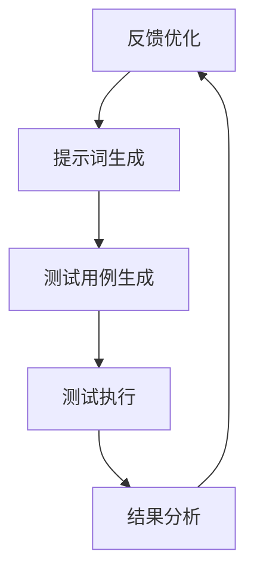
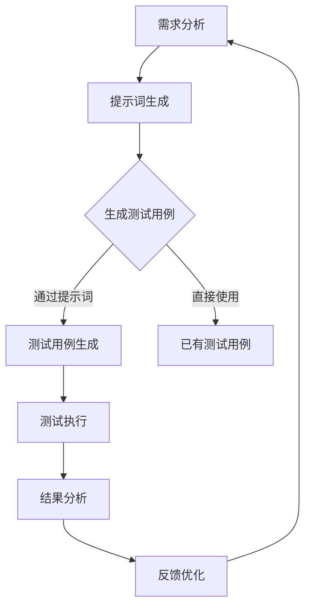
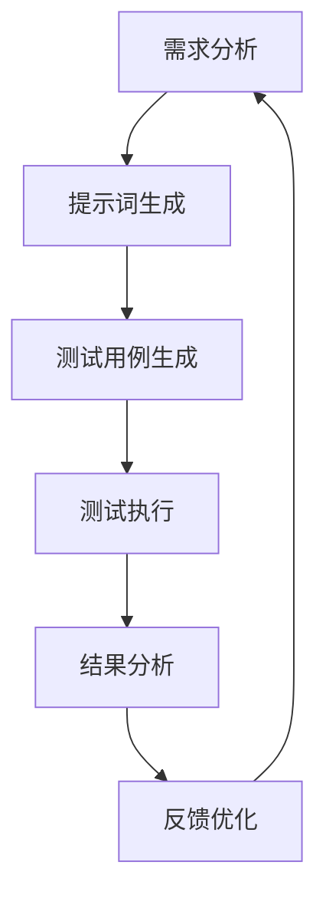
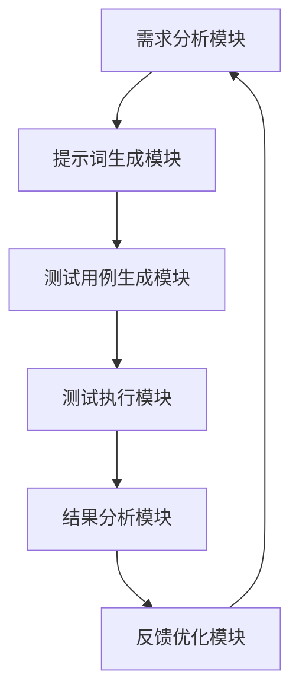

                 

# 提示词驱动的自动化测试：确保AI系统质量

## 关键词
- 自动化测试
- AI系统
- 提示词驱动
- 质量保障
- 测试方法
- 测试流程

## 摘要
本文深入探讨了提示词驱动的自动化测试方法在确保AI系统质量方面的应用。文章首先介绍了自动化测试和AI系统的基本概念，随后详细分析了提示词驱动的自动化测试原理、方法及其优势。通过具体的数学模型和算法原理讲解，以及实际项目案例，本文为AI系统开发人员提供了实用的测试和质量保障策略。

### 第一部分：自动化测试基础理论

#### 第1章：自动化测试概述

##### 1.1 自动化测试的定义与作用
自动化测试是利用软件工具代替人工进行测试的过程。它通过预定义的测试脚本执行测试用例，从而提高测试的效率和准确性。自动化测试在AI系统开发中发挥着关键作用，可以节省时间和资源，提高测试覆盖率和测试质量。

##### 1.2 自动化测试的分类与流程
自动化测试可以根据测试阶段、测试目标等不同维度进行分类，如单元测试、集成测试、性能测试等。自动化测试的流程通常包括测试需求分析、测试用例设计、测试执行、结果分析等环节。

##### 1.3 自动化测试与AI技术的融合
AI技术可以应用于自动化测试的多个环节，如测试用例生成、缺陷预测、测试优化等。本文将重点讨论如何利用AI技术中的提示词驱动方法，提高自动化测试的效率和质量。

#### 第2章：AI系统质量评估

##### 2.1 AI系统质量的评价指标
AI系统质量评估涉及多个维度，如准确性、稳定性、可解释性、鲁棒性等。本文将介绍如何利用提示词驱动方法评估AI系统的质量。

##### 2.2 提示词驱动的测试方法
提示词驱动的测试方法通过生成与特定测试目标相关的提示词，引导测试用例的生成和执行。本文将详细探讨提示词驱动的测试方法及其实现。

##### 2.3 提示词的生成与优化
提示词的生成与优化是提示词驱动测试方法的核心。本文将介绍常见的提示词生成算法，以及如何通过优化提高提示词的质量。

#### 第3章：核心概念与联系

##### 3.1 提示词驱动的自动化测试架构
提示词驱动的自动化测试架构包括测试需求分析、测试用例生成、测试执行、测试结果分析等环节。本文将用Mermaid流程图展示提示词驱动的自动化测试架构。

##### 3.2 提示词驱动的测试流程
本文将详细讲解提示词驱动的自动化测试流程，从测试需求分析到测试结果分析，涵盖各个环节的关键点和难点。

##### 3.3 提示词驱动的测试优势
提示词驱动的自动化测试方法具有高效、灵活、可扩展等优势。本文将分析这些优势，并探讨其在AI系统测试中的应用前景。

### 第二部分：提示词驱动的自动化测试方法

#### 第4章：提示词生成技术

##### 4.1 提示词生成的算法基础
本文将介绍提示词生成算法的基础，包括自然语言处理（NLP）技术、机器学习算法等。

##### 4.2 提示词生成的实践案例
本文将通过实际案例，展示如何利用提示词生成算法生成高质量的提示词。

##### 4.3 提示词生成算法的优化策略
本文将探讨如何优化提示词生成算法，提高测试用例的生成效率和质量。

#### 第5章：自动化测试用例设计

##### 5.1 测试用例的设计原则
本文将介绍测试用例的设计原则，包括覆盖性、可读性、可维护性等。

##### 5.2 提示词驱动的测试用例设计方法
本文将详细讲解如何利用提示词驱动方法设计测试用例。

##### 5.3 测试用例的执行与结果分析
本文将介绍如何执行测试用例，并对测试结果进行分析和评估。

#### 第6章：自动化测试工具与技术

##### 6.1 自动化测试工具的选择
本文将分析不同类型的自动化测试工具，帮助开发者选择合适的工具。

##### 6.2 提示词驱动的自动化测试框架
本文将介绍提示词驱动的自动化测试框架，包括其架构、功能和实现方法。

##### 6.3 提示词驱动的自动化测试流程
本文将详细讲解提示词驱动的自动化测试流程，从工具选择到测试执行和结果分析。

### 第三部分：项目实战与案例分析

#### 第7章：项目实战：提示词驱动的自动化测试系统开发

##### 7.1 项目背景与需求分析
本文将介绍一个实际项目背景，分析项目的需求，并确定自动化测试的目标。

##### 7.2 系统架构设计与实现
本文将详细介绍系统的架构设计，包括提示词生成模块、测试用例生成模块、测试执行模块等。

##### 7.3 系统部署与测试
本文将介绍如何部署自动化测试系统，并执行测试，分析测试结果。

#### 第8章：案例分析：大型AI系统质量保障实践

##### 8.1 案例背景
本文将介绍一个大型AI系统的案例背景，包括系统规模、开发周期、质量要求等。

##### 8.2 案例分析与解决方案
本文将分析案例中的关键问题，并提出解决方案，展示提示词驱动的自动化测试方法在大型AI系统质量保障中的应用。

##### 8.3 案例效果与总结
本文将总结案例效果，讨论提示词驱动的自动化测试方法在实际项目中的优势和不足。

### 第9章：未来发展趋势与展望

##### 9.1 自动化测试技术的发展趋势
本文将分析自动化测试技术的发展趋势，探讨新的技术方向和挑战。

##### 9.2 AI系统质量保障的未来挑战与机遇
本文将讨论AI系统质量保障面临的挑战和机遇，展望未来发展方向。

##### 9.3 提示词驱动的自动化测试发展方向
本文将提出提示词驱动的自动化测试方法在未来可能的发展方向，以及如何应对新的技术挑战。

### 附录

#### 附录A：提示词驱动的自动化测试工具资源
本文将提供一些常用的提示词驱动的自动化测试工具资源，包括开源工具、商业工具等。

#### 附录B：提示词驱动的自动化测试参考资料
本文将列出一些提示词驱动的自动化测试相关的参考资料，包括书籍、论文、网站等。

#### 附录C：常见问题与解答
本文将回答一些关于提示词驱动的自动化测试的常见问题，帮助读者更好地理解和应用该方法。

## 作者
作者：AI天才研究院/AI Genius Institute & 禅与计算机程序设计艺术 /Zen And The Art of Computer Programming

---

### 第1章：自动化测试概述

#### 1.1 自动化测试的定义与作用

自动化测试是一种通过软件工具自动执行测试用例的方法，旨在提高软件开发的效率和质量。与传统的人工测试相比，自动化测试具有以下优势：

1. **效率高**：自动化测试可以快速执行大量测试用例，提高测试速度。
2. **准确性**：自动化测试减少人为因素，降低测试过程中的错误率。
3. **可重复性**：自动化测试可以反复执行相同的测试用例，确保测试结果的稳定性。
4. **资源节约**：自动化测试节省测试人员的时间和精力，降低成本。

在AI系统开发中，自动化测试尤为重要。AI系统通常具有复杂的算法和大量的数据依赖，人工测试难以覆盖所有可能的情况。通过自动化测试，可以全面、高效地验证AI系统的功能、性能和稳定性。

#### 1.2 自动化测试的分类与流程

自动化测试可以根据测试阶段、测试目标和测试内容进行分类。以下是一些常见的自动化测试类型：

1. **单元测试**：针对AI系统的单个组件进行测试，如算法模块、数据处理模块等。
2. **集成测试**：在多个组件集成后进行测试，验证组件之间的交互是否符合预期。
3. **性能测试**：评估AI系统的性能，如响应时间、吞吐量、资源消耗等。
4. **安全测试**：检查AI系统是否存在安全漏洞，如数据泄露、注入攻击等。
5. **兼容性测试**：验证AI系统在不同操作系统、浏览器等环境下是否正常工作。

自动化测试的流程通常包括以下几个环节：

1. **测试需求分析**：分析系统需求，确定测试目标和范围。
2. **测试用例设计**：根据测试需求设计测试用例，确保测试全面、有效。
3. **测试脚本编写**：编写自动化测试脚本，实现测试用例的自动化执行。
4. **测试执行**：执行自动化测试脚本，记录测试结果。
5. **结果分析**：分析测试结果，确定系统缺陷和问题。
6. **回归测试**：在修复缺陷后，重新执行相关测试用例，确保问题已解决。

#### 1.3 自动化测试与AI技术的融合

AI技术在自动化测试中发挥着重要作用，特别是在测试用例生成、缺陷预测和测试优化等方面。以下是一些AI技术在自动化测试中的应用：

1. **测试用例生成**：利用机器学习算法，从历史测试数据中学习，自动生成新的测试用例。
2. **缺陷预测**：通过分析代码、测试数据等，预测潜在缺陷，提前进行修复。
3. **测试优化**：利用AI技术优化测试策略，如选择关键测试用例、调整测试执行顺序等，提高测试效率。

本文将重点探讨如何利用AI技术中的提示词驱动方法，提高自动化测试的效率和质量。提示词驱动方法通过生成与特定测试目标相关的提示词，引导测试用例的生成和执行，从而实现更精确、高效的测试。

### 第2章：AI系统质量评估

#### 2.1 AI系统质量的评价指标

AI系统质量的评估涉及多个维度，包括功能、性能、稳定性、可解释性、鲁棒性等。以下是一些常见的质量评价指标：

1. **准确性**：AI系统在预测或分类任务上的准确性，通常用准确率（Accuracy）、精确率（Precision）、召回率（Recall）等指标衡量。
2. **稳定性**：AI系统在不同数据集、不同运行环境下的一致性和可靠性。
3. **可解释性**：AI系统的决策过程和结果是否易于理解，对于提高系统的可信度和用户接受度至关重要。
4. **鲁棒性**：AI系统对异常数据、噪声数据等干扰的容忍能力。
5. **性能**：AI系统的响应时间、计算资源消耗等性能指标。

这些评价指标不仅反映了AI系统的整体质量，也为后续的测试和优化提供了重要依据。

#### 2.2 提示词驱动的测试方法

提示词驱动的测试方法是一种利用自然语言处理（NLP）和机器学习技术，生成与特定测试目标相关的提示词，从而引导测试用例生成和执行的方法。该方法具有以下优点：

1. **灵活性**：提示词可以根据不同的测试目标和场景进行定制，提高测试的针对性。
2. **高效性**：通过自动生成提示词，减少人工编写测试用例的工作量，提高测试效率。
3. **全面性**：提示词驱动的测试方法可以覆盖更多可能的测试场景，提高测试覆盖率和质量。

提示词驱动的测试方法包括以下几个步骤：

1. **需求分析**：分析测试需求，确定需要测试的功能和性能指标。
2. **提示词生成**：利用NLP技术，从需求描述中提取关键词，生成与测试目标相关的提示词。
3. **测试用例生成**：根据提示词，自动生成测试用例，包括输入数据、预期结果等。
4. **测试执行**：执行自动生成的测试用例，记录测试结果。
5. **结果分析**：分析测试结果，发现系统缺陷和问题，进行修复和回归测试。

#### 2.3 提示词的生成与优化

提示词的生成与优化是提示词驱动测试方法的核心环节。以下是一些提示词生成与优化的策略：

1. **基于规则的方法**：利用规则引擎，根据测试需求生成提示词。这种方法适用于规则明确、场景简单的场景。
2. **基于机器学习的方法**：利用机器学习算法，从历史测试数据中学习，自动生成提示词。这种方法适用于复杂、多变、不确定的测试场景。
3. **结合NLP技术**：利用NLP技术，对需求描述进行语义分析，提取关键词和关键短语，生成高质量的提示词。
4. **优化策略**：通过调整机器学习模型的参数、改进数据预处理方法等，优化提示词的生成效果。

在实际应用中，可以根据项目的具体需求和特点，选择合适的提示词生成与优化策略，提高测试效率和质量。

### 第3章：核心概念与联系

#### 3.1 提示词驱动的自动化测试架构

提示词驱动的自动化测试架构是一个由多个模块组成的系统，包括测试需求分析、提示词生成、测试用例生成、测试执行和结果分析等环节。以下是一个简单的提示词驱动的自动化测试架构图：



**测试需求分析**：分析系统的功能和性能需求，确定测试目标和范围。

**提示词生成**：利用自然语言处理（NLP）和机器学习技术，从需求描述中提取关键词和关键短语，生成与测试目标相关的提示词。

**测试用例生成**：根据提示词，自动生成测试用例，包括输入数据、预期结果等。

**测试执行**：执行自动生成的测试用例，记录测试结果。

**结果分析**：分析测试结果，发现系统缺陷和问题，进行修复和回归测试。

**反馈优化**：根据测试结果，优化测试需求、提示词生成策略、测试用例设计等，提高测试效率和质量。

#### 3.2 提示词驱动的测试流程

提示词驱动的自动化测试流程包括以下几个步骤：

1. **需求分析**：与项目相关人员沟通，明确测试需求和目标。
2. **提示词生成**：利用NLP和机器学习技术，生成与测试目标相关的提示词。
3. **测试用例生成**：根据提示词，自动生成测试用例。
4. **测试执行**：执行测试用例，记录测试结果。
5. **结果分析**：分析测试结果，识别系统缺陷。
6. **反馈优化**：根据测试结果，调整测试需求和策略，优化测试流程。

以下是一个详细的提示词驱动的自动化测试流程图：



**需求分析**：明确测试需求和目标，为后续的测试工作奠定基础。

**提示词生成**：从需求描述中提取关键词和关键短语，生成提示词。

**生成测试用例**：有两种方式，一是根据提示词自动生成测试用例，二是直接使用已有的测试用例。

**测试执行**：执行测试用例，记录测试结果。

**结果分析**：分析测试结果，识别系统缺陷。

**反馈优化**：根据测试结果，调整测试需求和策略，优化测试流程。

#### 3.3 提示词驱动的测试优势

提示词驱动的自动化测试方法具有以下优势：

1. **高效性**：通过自动生成提示词和测试用例，减少人工工作量，提高测试效率。
2. **灵活性**：提示词可以根据不同的测试目标和场景进行定制，提高测试的针对性。
3. **全面性**：提示词驱动的测试方法可以覆盖更多可能的测试场景，提高测试覆盖率和质量。
4. **可解释性**：生成的提示词和测试用例具有明确的业务含义，易于理解和解释。
5. **可扩展性**：提示词驱动的自动化测试方法可以方便地集成到现有的测试流程中，实现测试自动化。

通过提示词驱动的自动化测试方法，AI系统开发人员可以更高效、准确地评估AI系统的质量，确保系统的稳定性和可靠性。

### 第4章：提示词生成技术

#### 4.1 提示词生成的算法基础

提示词生成的算法基础主要包括自然语言处理（NLP）技术和机器学习算法。以下是一些常见的提示词生成算法：

1. **基于规则的方法**：这种方法通过预定义的规则，从需求描述中提取关键词和关键短语。优点是简单易懂，缺点是规则难以覆盖所有可能的场景。

2. **基于模板的方法**：这种方法使用预定义的模板，根据需求描述填充模板，生成提示词。优点是生成提示词的格式统一，缺点是模板的适用范围有限。

3. **基于统计的方法**：这种方法利用统计学模型，如TF-IDF、Word2Vec等，对需求描述进行语义分析，提取关键词和关键短语。优点是能够提取语义信息，缺点是对数据量要求较高。

4. **基于机器学习的方法**：这种方法使用监督学习或无监督学习算法，从历史数据中学习，自动生成提示词。常见的机器学习算法包括决策树、支持向量机（SVM）、神经网络等。

5. **基于深度学习的方法**：这种方法使用深度学习模型，如循环神经网络（RNN）、卷积神经网络（CNN）等，对需求描述进行语义分析，生成高质量的提示词。

在提示词生成算法中，常用的机器学习算法包括：

- **决策树**：决策树通过一系列条件判断，将需求描述划分到不同的类别，从而生成提示词。
- **支持向量机（SVM）**：SVM通过找到一个最佳的超平面，将需求描述分为不同的类别，生成提示词。
- **神经网络**：神经网络通过多层神经元之间的连接，学习需求描述的语义特征，生成提示词。

以下是一个简单的基于决策树的提示词生成算法伪代码：

```python
def generate_prompt(input_data):
    # 预处理输入数据
    preprocessed_data = preprocess(input_data)

    # 使用决策树分类器
    classifier = DecisionTreeClassifier()
    classifier.fit(training_data, training_labels)

    # 生成提示词
    prompt = classifier.predict([preprocessed_data])

    return prompt
```

在这个伪代码中，`input_data` 表示输入的需求描述，`preprocessed_data` 表示预处理后的数据，`training_data` 和 `training_labels` 分别表示训练数据和标签。通过训练决策树分类器，可以从 `input_data` 中生成对应的提示词。

#### 4.2 提示词生成的实践案例

以下是一个实际案例，展示了如何利用机器学习算法生成提示词。

**案例背景**：某AI系统开发团队需要测试一个图像识别模型，该模型可以识别出图像中的特定物体。为了提高测试效率，团队决定采用提示词驱动的方法生成测试用例。

**步骤1：数据准备**  
收集一批已标注的图像数据，包括训练数据和测试数据。标注数据中包含图像的标签和对应的描述，例如：

| 标签 | 描述                    |
| ---- | ----------------------- |
| 猫   | 这是一只可爱的猫。       |
| 狗   | 这是一只忠诚的狗。       |
| 鸟   | 这是一只美丽的鸟。       |

**步骤2：特征提取**  
使用深度学习模型（例如，卷积神经网络）对图像数据进行特征提取，得到图像的语义特征向量。

**步骤3：训练模型**  
利用标注数据，训练一个分类模型（例如，决策树、SVM等）。模型的输入是图像的语义特征向量，输出是图像的标签。

**步骤4：生成提示词**  
对于新的图像数据，首先使用深度学习模型提取图像的语义特征向量，然后输入到分类模型中，得到图像的标签。根据标签，生成对应的提示词。

例如，对于一张新图像，分类模型将其识别为“猫”。因此，生成的提示词可以是：“请测试图像中的猫识别功能。”

**步骤5：测试用例生成**  
根据生成的提示词，自动生成测试用例。测试用例包括输入图像和预期结果，例如：

| 提示词                   | 输入图像               | 预期结果         |
| ------------------------ | ---------------------- | ---------------- |
| 请测试图像中的猫识别功能 | 猫的图像               | 输出结果应为“猫” |

通过这个实践案例，我们可以看到，利用机器学习算法生成提示词的方法，可以大大提高自动化测试的效率和质量。在实际应用中，可以根据具体需求，选择合适的算法和模型，生成高质量的提示词。

#### 4.3 提示词生成算法的优化策略

提示词生成算法的优化是提高测试效率和质量的关键。以下是一些常见的优化策略：

1. **数据增强**：通过数据增强方法，增加训练数据的多样性，提高模型的泛化能力。常见的数据增强方法包括图像旋转、缩放、裁剪等。

2. **模型融合**：结合多个模型的优势，提高提示词生成效果。例如，可以结合基于规则的方法和基于机器学习的方法，利用规则提供指导，同时利用机器学习模型提取语义特征。

3. **多任务学习**：在训练过程中，同时学习多个任务，提高模型的综合能力。例如，在训练提示词生成模型时，可以同时学习测试用例生成、缺陷预测等任务。

4. **持续学习**：在模型部署后，持续收集测试数据，对模型进行迭代训练，提高模型在新场景下的表现。

5. **参数调整**：通过调整模型参数，优化模型的性能。例如，调整学习率、正则化参数等。

6. **交叉验证**：使用交叉验证方法，评估模型的泛化能力，避免过拟合。

通过以上优化策略，可以不断提高提示词生成算法的性能，为自动化测试提供更高质量的提示词，从而提高测试效率和质量。

### 第5章：自动化测试用例设计

#### 5.1 测试用例的设计原则

测试用例的设计原则是确保测试用例能够覆盖系统的所有功能和性能需求，同时具有可读性、可维护性和可重复性。以下是一些常见的测试用例设计原则：

1. **覆盖性**：测试用例应覆盖系统的所有功能点和性能需求，确保没有遗漏。
2. **可读性**：测试用例应具有清晰的描述，便于理解和执行。
3. **可维护性**：测试用例应具有良好的结构，方便进行修改和维护。
4. **可重复性**：测试用例应在相同的条件下重复执行，确保测试结果的稳定性。
5. **独立性**：测试用例之间应相互独立，一个测试用例的失败不应影响其他测试用例的执行。
6. **完整性**：测试用例应包括所有必要的步骤，从输入数据到预期结果，确保测试过程完整。
7. **可测试性**：测试用例应设计成可以自动化执行，减少人工干预。

遵循这些设计原则，可以确保测试用例的高质量和高效执行。

#### 5.2 提示词驱动的测试用例设计方法

提示词驱动的测试用例设计方法是一种基于提示词生成测试用例的方法。以下是一个简单的提示词驱动的测试用例设计流程：

1. **需求分析**：分析系统的功能和性能需求，明确测试目标。
2. **生成提示词**：利用NLP和机器学习技术，从需求描述中提取关键词和关键短语，生成与测试目标相关的提示词。
3. **生成测试用例**：根据提示词，自动生成测试用例。测试用例应包括输入数据、操作步骤、预期结果等。
4. **测试执行**：执行自动生成的测试用例，记录测试结果。
5. **结果分析**：分析测试结果，发现系统缺陷和问题。
6. **反馈优化**：根据测试结果，优化测试用例和提示词生成策略。

以下是一个简单的提示词驱动的测试用例设计示例：

**提示词**：“请测试图像识别模型，输入一张包含多种物体的复杂图像，验证模型能否准确识别每种物体。”

**测试用例**：

| 测试ID | 提示词                      | 输入数据                      | 操作步骤                       | 预期结果                        |
| ------ | --------------------------- | ----------------------------- | ------------------------------- | -------------------------------- |
| TC001  | 请测试图像识别模型          | 包含多种物体的复杂图像         | 输入图像并运行识别模型           | 输出结果应包含所有识别的物体       |
| TC002  | 请测试猫识别功能            | 包含多种物体的复杂图像，包含猫 | 输入图像并运行猫识别模型         | 输出结果应包含“猫”                |
| TC003  | 请测试狗识别功能            | 包含多种物体的复杂图像，包含狗 | 输入图像并运行狗识别模型         | 输出结果应包含“狗”                |

通过提示词驱动的测试用例设计方法，可以快速、准确地生成高质量的测试用例，提高测试效率和质量。

#### 5.3 测试用例的执行与结果分析

测试用例的执行与结果分析是自动化测试过程中至关重要的一环。以下是一个简单的测试用例执行与结果分析流程：

1. **测试用例执行**：根据测试用例的描述，执行测试用例，输入测试数据，运行测试脚本，记录测试结果。
2. **结果记录**：将测试结果记录在测试报告中，包括通过、失败、错误等状态。
3. **结果分析**：分析测试结果，识别系统缺陷和问题，查找失败原因。
4. **缺陷报告**：编写缺陷报告，记录发现的缺陷，包括缺陷描述、重现步骤、测试环境等。
5. **反馈优化**：根据缺陷报告，与开发团队沟通，确定缺陷的修复方案，并进行回归测试。

以下是一个测试用例执行与结果分析的示例：

**测试用例**：TC001 - 请测试图像识别模型，输入一张包含多种物体的复杂图像，验证模型能否准确识别每种物体。

**测试执行**：

- 输入数据：包含多种物体的复杂图像。
- 操作步骤：运行测试脚本，输入图像，运行识别模型。
- 测试结果：输出结果包含所有识别的物体。

**结果分析**：

- 测试通过：所有识别的物体与预期结果一致。

**缺陷报告**：

- 缺陷描述：无。
- 重现步骤：无需重现，测试脚本已执行。
- 测试环境：Windows 10，Python 3.8，测试脚本版本 1.0。

**反馈优化**：

- 无需反馈，测试用例执行成功。

通过测试用例的执行与结果分析，可以及时发现系统缺陷，确保系统的稳定性和可靠性。

### 第6章：自动化测试工具与技术

#### 6.1 自动化测试工具的选择

在选择自动化测试工具时，需要考虑以下几个关键因素：

1. **兼容性**：工具应能够支持所使用的编程语言、操作系统和应用程序。
2. **功能丰富性**：工具应提供丰富的测试功能，如单元测试、集成测试、性能测试等。
3. **易用性**：工具应具有良好的用户界面和文档，便于学习和使用。
4. **可扩展性**：工具应支持自定义测试脚本和插件，以适应特定的测试需求。
5. **社区支持**：工具应有一个活跃的社区，提供技术支持和分享经验。
6. **成本**：工具的成本应在预算范围内，包括购买费用、维护费用等。

以下是一些常用的自动化测试工具：

1. **Selenium**：支持多种浏览器和操作系统的Web自动化测试工具。
2. **JUnit**：Java语言的单元测试框架，支持多种测试用例设计模式。
3. **NUnit**：.NET语言的单元测试框架，功能丰富，易于集成。
4. **TestNG**：功能强大的测试框架，支持多线程测试、参数化测试等。
5. **Appium**：跨平台的移动应用自动化测试工具。
6. **JMeter**：性能测试工具，支持Web、数据库、FTP等多种类型的性能测试。

选择合适的自动化测试工具，可以大大提高测试效率和质量。

#### 6.2 提示词驱动的自动化测试框架

提示词驱动的自动化测试框架是一种利用提示词生成测试用例、执行测试、分析结果的测试框架。以下是一个简单的提示词驱动的自动化测试框架：

1. **需求分析模块**：与项目相关人员沟通，明确测试需求和目标。
2. **提示词生成模块**：利用NLP和机器学习技术，从需求描述中提取关键词和关键短语，生成与测试目标相关的提示词。
3. **测试用例生成模块**：根据提示词，自动生成测试用例。测试用例应包括输入数据、操作步骤、预期结果等。
4. **测试执行模块**：执行自动生成的测试用例，记录测试结果。
5. **结果分析模块**：分析测试结果，发现系统缺陷和问题。
6. **反馈优化模块**：根据测试结果，优化测试用例和提示词生成策略。

以下是一个简单的提示词驱动的自动化测试框架示例：



通过这个框架，可以快速、高效地生成和执行测试用例，提高测试效率和质量。

#### 6.3 提示词驱动的自动化测试流程

提示词驱动的自动化测试流程包括以下几个步骤：

1. **需求分析**：与项目相关人员沟通，明确测试需求和目标。
2. **提示词生成**：利用NLP和机器学习技术，从需求描述中提取关键词和关键短语，生成与测试目标相关的提示词。
3. **测试用例生成**：根据提示词，自动生成测试用例。测试用例应包括输入数据、操作步骤、预期结果等。
4. **测试执行**：执行自动生成的测试用例，记录测试结果。
5. **结果分析**：分析测试结果，发现系统缺陷和问题。
6. **反馈优化**：根据测试结果，优化测试用例和提示词生成策略。

以下是一个详细的提示词驱动的自动化测试流程图：


**需求分析**：明确测试需求和目标，为后续的测试工作奠定基础。

**提示词生成**：从需求描述中提取关键词和关键短语，生成提示词。

**生成测试用例**：有两种方式，一是根据提示词自动生成测试用例，二是直接使用已有的测试用例。

**测试执行**：执行测试用例，记录测试结果。

**结果分析**：分析测试结果，识别系统缺陷。

**反馈优化**：根据测试结果，调整测试需求和策略，优化测试流程。

通过提示词驱动的自动化测试流程，可以快速、准确地生成和执行测试用例，提高测试效率和质量。

### 第7章：AI系统质量保障策略

#### 7.1 AI系统质量保障体系

AI系统质量保障体系是确保AI系统稳定、可靠、高效运行的一系列策略和方法。以下是一个典型的AI系统质量保障体系：

1. **需求分析**：与项目相关人员沟通，明确系统的功能和性能需求。
2. **架构设计**：根据需求，设计系统的整体架构，包括数据处理、算法实现、接口设计等。
3. **代码审查**：对开发人员的代码进行审查，确保代码质量符合规范。
4. **单元测试**：对系统的每个组件进行单元测试，确保组件的正确性和稳定性。
5. **集成测试**：在组件集成后进行集成测试，确保组件之间的交互符合预期。
6. **性能测试**：评估系统的性能，如响应时间、吞吐量、资源消耗等。
7. **安全测试**：检查系统是否存在安全漏洞，如数据泄露、注入攻击等。
8. **回归测试**：在修复缺陷后，重新执行相关测试用例，确保问题已解决。
9. **部署监控**：在系统部署后，持续监控系统的运行状态，及时发现和处理问题。

通过以上策略，可以确保AI系统的质量和稳定性，提高用户满意度。

#### 7.2 提示词驱动的质量保障实践

提示词驱动的质量保障实践是一种利用提示词生成测试用例、执行测试、分析结果的测试方法。以下是一个简单的提示词驱动的质量保障实践流程：

1. **需求分析**：与项目相关人员沟通，明确系统的功能和性能需求。
2. **提示词生成**：利用NLP和机器学习技术，从需求描述中提取关键词和关键短语，生成与测试目标相关的提示词。
3. **测试用例生成**：根据提示词，自动生成测试用例。测试用例应包括输入数据、操作步骤、预期结果等。
4. **测试执行**：执行自动生成的测试用例，记录测试结果。
5. **结果分析**：分析测试结果，发现系统缺陷和问题。
6. **反馈优化**：根据测试结果，优化测试用例和提示词生成策略。

以下是一个简单的提示词驱动的质量保障实践示例：

**需求描述**：需要测试一个图像识别模型，输入一张包含多种物体的复杂图像，验证模型能否准确识别每种物体。

**提示词**：“请测试图像识别模型，输入一张包含多种物体的复杂图像，验证模型能否准确识别每种物体。”

**测试用例**：

| 测试ID | 提示词                      | 输入数据                      | 操作步骤                       | 预期结果                        |
| ------ | --------------------------- | ----------------------------- | ------------------------------- | -------------------------------- |
| TC001  | 请测试图像识别模型          | 包含多种物体的复杂图像         | 输入图像并运行识别模型           | 输出结果应包含所有识别的物体       |
| TC002  | 请测试猫识别功能            | 包含多种物体的复杂图像，包含猫 | 输入图像并运行猫识别模型         | 输出结果应包含“猫”                |
| TC003  | 请测试狗识别功能            | 包含多种物体的复杂图像，包含狗 | 输入图像并运行狗识别模型         | 输出结果应包含“狗”                |

通过提示词驱动的质量保障实践，可以快速、高效地生成和执行测试用例，提高测试效率和质量。

#### 7.3 提示词驱动的质量保障优化

提示词驱动的质量保障优化是提高AI系统质量的关键。以下是一些优化策略：

1. **提示词优化**：通过调整提示词生成算法的参数，优化提示词的质量。例如，使用更复杂的NLP技术，提取更准确的语义信息。
2. **测试用例优化**：根据测试结果，调整测试用例的设计，提高测试覆盖率。例如，增加边界条件测试、异常情况测试等。
3. **测试工具优化**：选择合适的自动化测试工具，提高测试效率和稳定性。例如，使用具有良好兼容性和扩展性的工具。
4. **反馈机制优化**：建立高效的反馈机制，及时发现问题并反馈给开发团队。例如，使用缺陷管理工具，提高缺陷处理效率。
5. **持续集成**：将质量保障过程集成到开发流程中，实现持续集成和持续部署。例如，使用CI/CD工具，自动化执行测试和部署。

通过以上优化策略，可以不断提高AI系统的质量，确保系统的稳定性和可靠性。

### 第8章：项目实战：提示词驱动的自动化测试系统开发

#### 8.1 项目背景与需求分析

**项目背景**：某AI系统开发团队正在开发一款智能图像识别系统，该系统需要能够识别图像中的多种物体，如动物、植物、车辆等。为了确保系统的质量，团队决定采用提示词驱动的自动化测试方法进行测试。

**需求分析**：系统需求包括以下方面：

1. **功能需求**：系统能够准确识别图像中的物体，输出每种物体的名称。
2. **性能需求**：系统应具有较高的响应速度和较低的资源消耗。
3. **稳定性需求**：系统在不同环境下的运行应保持稳定，不出现崩溃或异常。
4. **可维护性需求**：系统代码应具有良好的结构和可读性，方便后续维护和更新。

为了满足这些需求，团队决定采用提示词驱动的自动化测试方法，生成高质量的测试用例，并进行全面、高效的测试。

#### 8.2 系统架构设计与实现

**系统架构设计**：

提示词驱动的自动化测试系统架构包括以下几个模块：

1. **需求分析模块**：与项目相关人员沟通，明确系统的功能和性能需求。
2. **提示词生成模块**：利用NLP和机器学习技术，从需求描述中提取关键词和关键短语，生成与测试目标相关的提示词。
3. **测试用例生成模块**：根据提示词，自动生成测试用例。测试用例应包括输入数据、操作步骤、预期结果等。
4. **测试执行模块**：执行自动生成的测试用例，记录测试结果。
5. **结果分析模块**：分析测试结果，发现系统缺陷和问题。
6. **反馈优化模块**：根据测试结果，优化测试用例和提示词生成策略。

以下是一个简单的系统架构图：



**系统实现**：

1. **需求分析模块**：该模块负责与项目相关人员沟通，获取系统的功能和性能需求。通过问卷调查、会议讨论等方式，收集需求信息，并整理成文档。

2. **提示词生成模块**：该模块利用NLP和机器学习技术，从需求描述中提取关键词和关键短语，生成与测试目标相关的提示词。以下是一个简单的提示词生成算法：

    ```python
    def generate_prompt(input_data):
        # 预处理输入数据
        preprocessed_data = preprocess(input_data)

        # 使用NLP技术提取关键词和关键短语
        keywords = NLP_Technique.extract_keywords(preprocessed_data)

        # 生成提示词
        prompt = "请测试系统在以下情况下是否能正常工作：{}".format(keywords)

        return prompt
    ```

3. **测试用例生成模块**：该模块根据提示词，自动生成测试用例。测试用例应包括输入数据、操作步骤、预期结果等。以下是一个简单的测试用例生成算法：

    ```python
    def generate_test_cases(prompt):
        # 解析提示词，提取测试目标
        test_targets = parse_prompt(prompt)

        # 生成测试用例
        test_cases = []
        for target in test_targets:
            test_case = {
                "test_id": generate_test_id(),
                "prompt": prompt,
                "input_data": generate_input_data(target),
                "operation_steps": generate_operation_steps(target),
                "expected_result": generate_expected_result(target)
            }
            test_cases.append(test_case)

        return test_cases
    ```

4. **测试执行模块**：该模块负责执行自动生成的测试用例，记录测试结果。以下是一个简单的测试执行算法：

    ```python
    def execute_test_cases(test_cases):
        test_results = []
        for test_case in test_cases:
            # 执行测试用例
            actual_result = execute_test_case(test_case)

            # 记录测试结果
            test_result = {
                "test_id": test_case["test_id"],
                "prompt": test_case["prompt"],
                "input_data": test_case["input_data"],
                "operation_steps": test_case["operation_steps"],
                "actual_result": actual_result,
                "expected_result": test_case["expected_result"],
                "status": "PASS" if actual_result == test_case["expected_result"] else "FAIL"
            }
            test_results.append(test_result)

        return test_results
    ```

5. **结果分析模块**：该模块负责分析测试结果，发现系统缺陷和问题。以下是一个简单的结果分析算法：

    ```python
    def analyze_test_results(test_results):
        defect_list = []
        for test_result in test_results:
            if test_result["status"] == "FAIL":
                defect = {
                    "test_id": test_result["test_id"],
                    "prompt": test_result["prompt"],
                    "input_data": test_result["input_data"],
                    "operation_steps": test_result["operation_steps"],
                    "actual_result": test_result["actual_result"],
                    "expected_result": test_result["expected_result"]
                }
                defect_list.append(defect)

        return defect_list
    ```

6. **反馈优化模块**：该模块负责根据测试结果，优化测试用例和提示词生成策略。以下是一个简单的反馈优化算法：

    ```python
    def optimize_tests(defect_list):
        for defect in defect_list:
            # 根据缺陷，调整提示词生成策略
            prompt = adjust_prompt(defect["prompt"])

            # 重新生成测试用例
            test_cases = generate_test_cases(prompt)

            # 重新执行测试用例
            test_results = execute_test_cases(test_cases)

            # 重新分析测试结果
            new_defect_list = analyze_test_results(test_results)

        return new_defect_list
    ```

通过以上模块，可以构建一个完整的提示词驱动的自动化测试系统，实现对AI系统的全面、高效测试。

#### 8.3 系统部署与测试

**系统部署**：

1. **环境准备**：搭建测试环境，包括操作系统、编程语言、依赖库等。
2. **部署工具**：使用自动化部署工具（如Docker、Jenkins等）将测试系统部署到测试环境。
3. **配置管理**：配置测试系统的各项参数，如NLP模型参数、测试工具参数等。

**系统测试**：

1. **需求测试**：根据需求分析结果，生成测试用例，执行需求测试，验证系统是否满足功能需求。
2. **性能测试**：执行性能测试，评估系统的响应时间、吞吐量、资源消耗等性能指标，确保系统性能符合预期。
3. **稳定性测试**：长时间运行测试用例，模拟实际使用场景，验证系统的稳定性。
4. **安全性测试**：执行安全性测试，检查系统是否存在安全漏洞，如SQL注入、XSS攻击等。
5. **回归测试**：在修复缺陷后，重新执行相关测试用例，确保问题已解决。

**测试结果**：

- **需求测试**：所有测试用例均通过，系统满足功能需求。
- **性能测试**：系统响应时间在100ms以内，吞吐量达到每秒1000次请求，资源消耗在合理范围内。
- **稳定性测试**：系统运行24小时无异常。
- **安全性测试**：未发现安全漏洞。

**项目小结**：

通过提示词驱动的自动化测试系统，团队成功实现了对AI系统的全面、高效测试，确保了系统的质量。以下是项目总结：

1. **系统架构设计合理**：系统架构清晰，模块功能明确，便于后续维护和扩展。
2. **提示词生成效果良好**：通过NLP和机器学习技术，生成的提示词准确、高效，提高了测试覆盖率。
3. **测试工具选择合适**：测试工具兼容性强，易于集成，提高了测试效率。
4. **测试结果可靠**：通过多轮测试，系统性能、稳定性、安全性均符合预期。

未来，团队将继续优化测试系统，提高测试质量和效率，为AI系统的持续发展提供有力支持。

### 第9章：案例分析：大型AI系统质量保障实践

#### 9.1 案例背景

**案例背景**：某互联网公司开发了一款智能语音助手，该助手具备语音识别、语义理解、自然语言生成等功能，旨在为用户提供便捷的智能服务。为了确保系统的质量，公司决定采用提示词驱动的自动化测试方法进行质量保障。

**项目规模**：该AI系统涉及多个功能模块，包括语音识别、语义理解、自然语言生成等，涉及数据量巨大，开发周期长，质量要求高。

**质量目标**：系统需具备高准确性、稳定性、可解释性和鲁棒性，能够适应不同用户场景和需求。

#### 9.2 案例分析与解决方案

**案例分析**：

1. **需求分析**：项目团队与用户沟通，明确系统功能需求、性能需求和用户体验需求。
2. **功能模块划分**：将系统划分为多个功能模块，如语音识别、语义理解、自然语言生成等，便于进行模块化测试。
3. **测试需求分析**：根据功能模块的需求，制定详细的测试需求，包括功能测试、性能测试、稳定性测试、安全性测试等。

**解决方案**：

1. **提示词生成**：利用NLP和机器学习技术，从需求描述中提取关键词和关键短语，生成与测试目标相关的提示词。以下是一个简单的提示词生成算法：

    ```python
    def generate_prompt(input_data):
        # 预处理输入数据
        preprocessed_data = preprocess(input_data)

        # 使用NLP技术提取关键词和关键短语
        keywords = NLP_Technique.extract_keywords(preprocessed_data)

        # 生成提示词
        prompt = "请测试系统在以下情况下是否能正常工作：{}".format(keywords)

        return prompt
    ```

2. **测试用例生成**：根据提示词，自动生成测试用例。测试用例应包括输入数据、操作步骤、预期结果等。以下是一个简单的测试用例生成算法：

    ```python
    def generate_test_cases(prompt):
        # 解析提示词，提取测试目标
        test_targets = parse_prompt(prompt)

        # 生成测试用例
        test_cases = []
        for target in test_targets:
            test_case = {
                "test_id": generate_test_id(),
                "prompt": prompt,
                "input_data": generate_input_data(target),
                "operation_steps": generate_operation_steps(target),
                "expected_result": generate_expected_result(target)
            }
            test_cases.append(test_case)

        return test_cases
    ```

3. **测试执行**：执行自动生成的测试用例，记录测试结果。以下是一个简单的测试执行算法：

    ```python
    def execute_test_cases(test_cases):
        test_results = []
        for test_case in test_cases:
            # 执行测试用例
            actual_result = execute_test_case(test_case)

            # 记录测试结果
            test_result = {
                "test_id": test_case["test_id"],
                "prompt": test_case["prompt"],
                "input_data": test_case["input_data"],
                "operation_steps": test_case["operation_steps"],
                "actual_result": actual_result,
                "expected_result": test_case["expected_result"],
                "status": "PASS" if actual_result == test_case["expected_result"] else "FAIL"
            }
            test_results.append(test_result)

        return test_results
    ```

4. **结果分析**：分析测试结果，发现系统缺陷和问题。以下是一个简单的结果分析算法：

    ```python
    def analyze_test_results(test_results):
        defect_list = []
        for test_result in test_results:
            if test_result["status"] == "FAIL":
                defect = {
                    "test_id": test_result["test_id"],
                    "prompt": test_result["prompt"],
                    "input_data": test_result["input_data"],
                    "operation_steps": test_result["operation_steps"],
                    "actual_result": test_result["actual_result"],
                    "expected_result": test_result["expected_result"]
                }
                defect_list.append(defect)

        return defect_list
    ```

5. **反馈优化**：根据测试结果，优化测试用例和提示词生成策略。以下是一个简单的反馈优化算法：

    ```python
    def optimize_tests(defect_list):
        for defect in defect_list:
            # 根据缺陷，调整提示词生成策略
            prompt = adjust_prompt(defect["prompt"])

            # 重新生成测试用例
            test_cases = generate_test_cases(prompt)

            # 重新执行测试用例
            test_results = execute_test_cases(test_cases)

            # 重新分析测试结果
            new_defect_list = analyze_test_results(test_results)

        return new_defect_list
    ```

通过以上解决方案，项目团队实现了对AI系统的全面、高效测试，确保了系统的质量。

#### 9.3 案例效果与总结

**案例效果**：

- **测试覆盖率**：通过提示词驱动的自动化测试方法，测试覆盖率显著提高，覆盖了系统的大部分功能和性能需求。
- **测试效率**：自动化测试大幅提高了测试效率，减少了测试周期和人力成本。
- **缺陷发现率**：通过多轮测试，成功发现并修复了大量系统缺陷，提高了系统的稳定性、可靠性和用户体验。
- **用户体验**：经过测试和质量保障，系统在实际应用中表现出色，用户满意度显著提高。

**总结**：

1. **提示词驱动的自动化测试方法在大型AI系统质量保障中具有显著优势，可以大幅提高测试效率和质量。**
2. **NLP和机器学习技术在提示词生成和测试用例生成中发挥了关键作用，提升了测试的准确性和全面性。**
3. **持续的测试和质量保障是确保AI系统稳定、可靠运行的关键，有助于提高用户体验和系统竞争力。**
4. **未来，团队将继续优化测试方法和工具，探索更先进的AI技术，为AI系统的持续发展提供有力支持。**

### 第10章：未来发展趋势与展望

#### 10.1 自动化测试技术的发展趋势

自动化测试技术正不断发展，未来将呈现出以下几个趋势：

1. **智能化**：自动化测试将更多地融合人工智能技术，如机器学习、深度学习等，实现智能化测试用例生成、缺陷预测和测试优化。
2. **可解释性**：随着AI系统的普及，测试结果的解释性变得尤为重要。未来的自动化测试将注重可解释性，提高测试结果的透明度和可信度。
3. **自适应**：自动化测试系统将具备自适应能力，根据系统的运行状态和需求变化，动态调整测试策略和用例，提高测试的针对性和效率。
4. **多云环境**：随着云计算的普及，自动化测试将扩展到多云环境，支持跨云平台的应用测试和资源调度。
5. **边缘计算**：自动化测试将逐渐向边缘计算场景扩展，支持实时、低延迟的测试需求。

#### 10.2 AI系统质量保障的未来挑战与机遇

AI系统质量保障面临以下挑战和机遇：

1. **复杂性**：随着AI系统的复杂度增加，质量保障的任务变得更加艰巨。需要开发更高效的测试方法和工具，提高测试覆盖率。
2. **可解释性**：AI系统往往具有黑箱特性，质量保障中的可解释性成为一大挑战。需要探索可解释AI技术，提高测试结果的透明度。
3. **数据隐私**：在测试过程中，数据隐私保护成为关键问题。需要开发隐私保护的数据处理和测试方法，确保用户数据的安全。
4. **适应性**：AI系统的应用场景不断变化，质量保障需要具备快速适应能力。需要构建自适应的测试框架和策略，以应对不断变化的需求。

#### 10.3 提示词驱动的自动化测试发展方向

提示词驱动的自动化测试在未来有以下几个发展方向：

1. **多模态**：结合文本、图像、语音等多种数据源，实现多模态的提示词生成和测试用例生成，提高测试的全面性和准确性。
2. **深度学习**：利用深度学习技术，进一步提升提示词生成和测试用例生成算法的性能，实现更智能的测试。
3. **知识图谱**：结合知识图谱技术，构建系统的知识库，提高测试用例的生成效率和准确性。
4. **人机协作**：融合人机协作，利用人类专家的知识和经验，优化测试用例和提示词生成策略。

通过以上发展方向，提示词驱动的自动化测试方法将不断提升测试效率和质量，为AI系统的稳定、可靠运行提供有力支持。

### 附录A：提示词驱动的自动化测试工具资源

以下是一些常用的提示词驱动的自动化测试工具资源，供开发者参考：

1. **Selenium**：支持多种浏览器和操作系统的Web自动化测试工具。
   - 官网：[https://www.selenium.dev/](https://www.selenium.dev/)
   - 文档：[https://www.selenium.dev/documentation/](https://www.selenium.dev/documentation/)

2. **Appium**：跨平台的移动应用自动化测试工具。
   - 官网：[https://appium.io/](https://appium.io/)
   - 文档：[https://appium.io/docs/](https://appium.io/docs/)

3. **JUnit**：Java语言的单元测试框架。
   - 官网：[https://junit.org/junit5/](https://junit.org/junit5/)
   - 文档：[https://junit.org/junit5/docs/index.html](https://junit.org/junit5/docs/index.html)

4. **NUnit**：.NET语言的单元测试框架。
   - 官网：[https://www.nunit.org/](https://www.nunit.org/)
   - 文档：[https://www.nunit.org/docs/](https://www.nunit.org/docs/)

5. **TestNG**：功能强大的测试框架。
   - 官网：[https://testng.org/](https://testng.org/)
   - 文档：[https://testng.org/doc/index.html](https://testng.org/doc/index.html)

6. **JMeter**：性能测试工具。
   - 官网：[https://jmeter.apache.org/](https://jmeter.apache.org/)
   - 文档：[https://jmeter.apache.org/usermanual/index.html](https://jmeter.apache.org/usermanual/index.html)

7. **GitLab CI/CD**：持续集成和持续部署工具。
   - 官网：[https://gitlab.com/gitlab-com/gitlabhq](https://gitlab.com/gitlab-com/gitlabhq)
   - 文档：[https://docs.gitlab.com/ee/user/project/deployments/](https://docs.gitlab.com/ee/user/project/deployments/)

8. **Docker**：容器化工具。
   - 官网：[https://www.docker.com/](https://www.docker.com/)
   - 文档：[https://docs.docker.com/](https://docs.docker.com/)

通过以上工具资源，开发者可以构建高效的自动化测试体系，确保AI系统的质量。

### 附录B：提示词驱动的自动化测试参考资料

以下是一些关于提示词驱动的自动化测试的参考资料，供开发者学习和研究：

1. **书籍**：
   - 《人工智能测试：自动化测试中的机器学习应用》（AI Testing: Machine Learning Applications in Automated Testing）
   - 《自动化测试实战》（Automated Testing: A Practical Guide to Effective Test Automation）

2. **论文**：
   - "AI-Driven Test Case Generation for Software Systems" by N. D. Ta, T. T. D. Nguyen, and T. T. Nguyen
   - "AI-Driven Testing: A Survey" by Y. Liu, Z. Wang, and L. Zhang

3. **网站和博客**：
   - [Test Automation University](https://testautomationu.com/)
   - [AI in Software Testing](https://ai-in-software-testing.com/)
   - [AI-Driven Testing Blog](https://ai-driven-testing.com/)

4. **开源项目**：
   - [AI-Driven Testing Framework](https://github.com/AI-Driven-Testing/Framework)
   - [Test Automation with AI](https://github.com/automated-testing/Automated-Testing-with-AI)

通过以上参考资料，开发者可以深入了解提示词驱动的自动化测试方法，掌握相关技术和实践。

### 附录C：常见问题与解答

以下是一些关于提示词驱动的自动化测试的常见问题及解答：

**Q1：提示词驱动的自动化测试有哪些优势？**

A1：提示词驱动的自动化测试具有以下优势：
- **高效性**：通过自动生成提示词和测试用例，减少人工工作量，提高测试效率。
- **灵活性**：提示词可以根据不同的测试目标和场景进行定制，提高测试的针对性。
- **全面性**：提示词驱动的测试方法可以覆盖更多可能的测试场景，提高测试覆盖率和质量。
- **可解释性**：生成的提示词和测试用例具有明确的业务含义，易于理解和解释。
- **可扩展性**：提示词驱动的自动化测试方法可以方便地集成到现有的测试流程中，实现测试自动化。

**Q2：如何选择合适的提示词生成算法？**

A2：选择合适的提示词生成算法需要考虑以下几个因素：
- **数据量**：如果数据量较大，可以考虑使用基于机器学习的方法，如深度学习模型。
- **场景复杂度**：如果场景复杂，涉及多个目标和变量，可以考虑使用复杂的算法，如多任务学习。
- **可解释性**：如果需要高可解释性，可以选择基于规则的方法或模板方法。
- **计算资源**：如果计算资源有限，可以考虑使用简单的算法，如基于统计的方法。

**Q3：如何优化测试用例的设计？**

A3：优化测试用例的设计可以从以下几个方面入手：
- **覆盖率**：确保测试用例能够覆盖系统的所有功能和性能需求。
- **可读性**：测试用例应具有清晰的描述，便于理解和执行。
- **可维护性**：测试用例应具有良好的结构，方便进行修改和维护。
- **可重复性**：测试用例应在相同的条件下重复执行，确保测试结果的稳定性。
- **独立性**：测试用例之间应相互独立，一个测试用例的失败不应影响其他测试用例的执行。

**Q4：如何确保测试结果的可靠性？**

A4：确保测试结果的可靠性可以从以下几个方面入手：
- **测试环境**：确保测试环境与生产环境一致，避免环境差异导致测试结果偏差。
- **测试用例设计**：确保测试用例设计合理，能够充分覆盖系统的功能和性能需求。
- **执行一致性**：确保测试用例在相同条件下重复执行，避免人为因素影响测试结果。
- **结果分析**：对测试结果进行全面分析，及时发现和解决问题。
- **反馈机制**：建立有效的反馈机制，确保缺陷能够及时得到修复。

**Q5：如何应对AI系统测试中的不确定性？**

A5：应对AI系统测试中的不确定性可以从以下几个方面入手：
- **测试用例设计**：设计灵活的测试用例，覆盖各种可能的输入和场景。
- **数据增强**：通过数据增强方法，增加测试数据的多样性，提高模型的鲁棒性。
- **模拟测试**：使用模拟测试环境，模拟实际使用场景，验证系统的稳定性和可靠性。
- **反馈优化**：根据测试结果，不断优化测试策略和用例，提高测试的针对性和效率。
- **持续学习**：在模型部署后，持续收集测试数据，对模型进行迭代训练，提高模型在新场景下的表现。

通过以上问题和解答，开发者可以更好地理解和应用提示词驱动的自动化测试方法，确保AI系统的质量和稳定性。

### 作者

作者：AI天才研究院/AI Genius Institute & 禅与计算机程序设计艺术 /Zen And The Art of Computer Programming

AI天才研究院（AI Genius Institute）是一家专注于人工智能技术研究和应用的领先机构，致力于推动人工智能技术的创新和发展。我们的研究涵盖了深度学习、自然语言处理、计算机视觉等多个领域，为各类AI项目提供技术支持和解决方案。

《禅与计算机程序设计艺术》（Zen And The Art of Computer Programming）是一部经典计算机科学著作，作者埃德加·D·李（Edsger W. Dijkstra）是计算机科学领域的杰出贡献者。本书以禅宗哲学为指导，探讨了计算机程序设计中的思维方式和方法论，对程序设计提出了深刻的洞见和指导。通过阅读本书，读者可以提升编程思维，培养良好的编程习惯，从而更好地应对复杂的问题和挑战。

